# 第五章：设计图形界面

许多工具都会向图形界面添加自己的元素。在前几章中，我们使用了现有的菜单，但也可以向 Blender 窗口添加新的面板。

设计界面时，我们必须决定显示哪些元素以及如何访问它们，提供哪些信息，以及允许哪些操作。

在本章中，你将学习如何将新面板插入 Blender 的不同区域，如何显示信息和图标，以及如何添加可以调用操作员的按钮。

本章将涵盖以下主题：

+   理解 Blender 界面

+   绘制自定义面板

+   上下文和 UI 交互

# 技术要求

在本章中，我们将使用 Blender 和 Visual Studio Code。本章创建的示例可以在[`github.com/PacktPublishing/Python-Scripting-in-Blender/tree/main/ch5`](https://github.com/PacktPublishing/Python-Scripting-in-Blender/tree/main/ch5)找到。

示例文件包括用作图标的 2D 图像。可选地，任何 2D 软件都可以用来创建自定义的`.png`图像，并且你可以使用它们代替。

要实现我们的界面，我们必须了解 Blender 的结构。让我们从深入 Blender 屏幕开始，开始我们的图形界面之旅。

# 区域、区域和面板

Blender 窗口被分为**区域**。每个区域可以包含不同类型的**编辑器**，例如 3D 对象的*视口*或视频编辑的*序列编辑器*。每个编辑器或空间可以包含一个或多个**区域**。区域的数量和类型因不同类型的编辑器而异：例如，一些编辑器，如**首选项**窗口，有一个导航侧边栏，而其他则没有。

Blender 手册详细解释了界面：[`docs.blender.org/manual/en/3.1/interface/index.xhtml`](https://docs.blender.org/manual/en/3.1/interface/index.xhtml)。

目前我们需要知道的是，区域可以包含**面板**，面板是文本、可编辑值和按钮等图形元素的基本容器。

我们可以使用 Python 创建新的面板，这使得轻松自定义任何区域成为可能。面板必须包含有关它所属的区域和区域的信息：

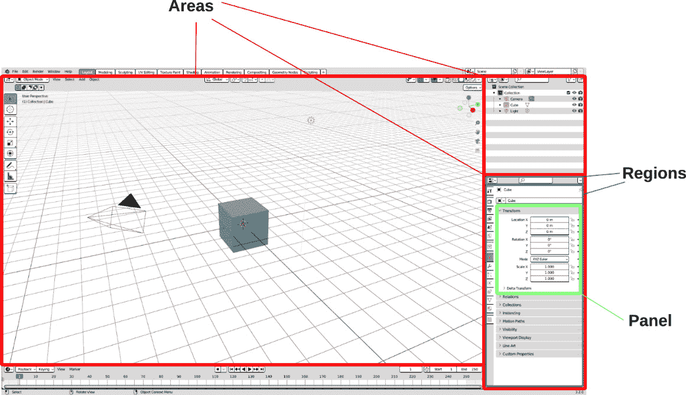

图 5.1：Blender 界面中的区域、区域和面板

在内部，面板可以访问 Blender 和场景的信息，以便它们可以显示对象的状态和属性并执行操作。现在我们更熟悉屏幕的结构，我们将创建一个帮助我们处理 3D 对象的面板。

# 创建一个简单面板

我们将从包含一些文本和图标的简单面板开始，并了解如何将这个初始想法扩展成一个可以帮助管理场景中对象的工具。

我们的面板是一个新的类，它从`bpy.types.Panel`派生。像操作符一样，面板需要设置一些静态成员；否则，它们将无法工作。与操作符类似，面板可以有一个`poll()`类方法，该方法声明在哪些条件下可以显示面板。

与使用`execute`函数不同，面板通过`draw(self, context)`函数设置和绘制其内容。

由于我们正在向 Blender 界面添加新内容，因此我们将在一个新插件中完成这项工作。这不是强制性的，但它使得启用和禁用我们的面板变得更加容易。

为了保持我们的代码整洁和清晰，我们将为这一章编写的脚本创建一个新文件夹。

## 设置环境

让我们在`ch5`文件夹中创建一个名为*第五章*的文件夹作为**脚本文件夹**，并重新启动 Blender。

我们的插件脚本包含一个面板，就像前几章包含操作符一样：

1.  在**Visual Studio Code**中选择`PythonScriptingBlender/ch5/addons`。

1.  通过点击**新建文件**图标创建一个新文件。

1.  将新文件命名为`simple_panel.py`。

1.  通过双击打开文件。

我们现在可以开始编写我们的面板插件了。

## 设计我们的面板插件

正如我们从*第三章*中了解到的，需要三个元素：

+   包含基本信息的`bl_info`字典

+   一个`import bpy`语句来访问 Blender API

+   `register()`和`unregister()`方法分别用于启用/禁用插件。

我们还需要为我们要添加的图形元素创建一个类——在这种情况下，一个从`bpy.types.Panel`派生的类。

我们将从信息字典开始，并为设置框架所需的元素添加占位符，这样我们就可以编写一个完全工作的 UI 插件。

### 编写信息字典

`bl_info`字典将提供插件的`name`属性、其`author`和`version`、所需的`blender`版本，以及一个简短的`description`。我们还可以添加一个`category`，该插件将列在该类别下。以下是代码的示例：

```py
bl_info = {
    "name": "A Very Simple Panel",
    "author": "John Doe",
    "version": (1, 0),
    "blender": (3, 2, 0),
    "description": "Just show up a panel in the UI",
    "category": "Learning",
}
```

现在，我们可以继续编写所需的`import`语句和主`class`。

### 设计面板类

现在我们已经导入了`bpy`模块，我们可以基于`bpy.types.Panel`编写一个类。

我们可以为我们的类使用任何名称，但 Blender 推荐一些指导原则：

+   由于我们的面板将是对象属性的一部分，类名必须以`OBJECT`开头。

+   名称中间包含`_PT_`，因为这是一个`Panel Type`。

现在，我们的类将只包含一个*文档字符串*和一个`pass`语句：

```py
import bpy
class OBJECT_PT_very_simple(bpy.types.Panel):
    """Creates a Panel in the object context of the
    properties editor"""
    # still a draft: actual code will be added later
    pass
```

在添加方法和属性之前，我们将通过注册函数处理类的激活和关闭。

### 面板注册

`register`和`unregister`函数在插件启用和禁用时分别将此类添加到/从 Blender 中添加/删除：

```py
def register():
    bpy.utils.register_class(OBJECT_PT_very_simple)
def unregister():
    bpy.utils.unregister_class(OBJECT_PT_very_simple)
```

通过这样，我们已经创建了面板插件的初始结构。现在我们将添加用于显示一些文本的元素和属性。

## 设置显示属性

Blender 寻找遵循`bl_*`模式的属性以确定面板在哪里以及如何显示。面板具有与操作员相同的识别属性，正如我们在第三章中介绍`Operator`类时所看到的：

+   `bl_label`: 面板的显示名称

+   `bl_idname`: 面板在内部使用的唯一名称

然后，有一些属性仅用于从`bpy.types.Panels`派生的类：

+   `bl_space_type`: 面板所属的编辑器

+   `bl_region_type`: 要使用的编辑器区域

+   `bl_context`: 特定对象/模式的子区域

+   `bl_category`: 当可用时，区域内的标签

所有这些都是静态字符串，并且`bl_space_type`、`bl_region_type`和`bl_context`必须匹配 Blender 已知的屏幕区域的具体值。

可能的值包括 Blender 中所有可用的编辑器。一开始这可能会让人感到不知所措，但一旦我们有了放置面板的想法，我们就可以在在线文档[`docs.blender.org/api/3.2/bpy.types.Panel.xhtml`](https://docs.blender.org/api/3.2/bpy.types.Panel.xhtml)中查找相关信息。

由于 Blender 包含许多编辑器，并且每个编辑器都有自己的子元素，我们将查看可能的组合。

### 通过`bl_space_type`选择我们的编辑视图

首先，我们必须决定将我们的面板添加到哪个 Blender 编辑器。这主要取决于我们工具的目的以及在哪里找到它更方便。例如，如果我们的面板有助于制作视频，它将是`bl_space_type`的一部分：

+   `EMPTY`: 此值在脚本中不使用

+   `VIEW_3D`: 用于操纵*对象*的**3D 视图**

+   `IMAGE_EDITOR`: 用于查看和编辑*图像*和 UV 图的**UV/图像编辑器**

+   `NODE_EDITOR`: 用于基于节点的*着色*和*合成*工具的**节点编辑器**

+   `SEQUENCE_EDITOR`: **视频序列编辑器**编辑工具

+   `CLIP_EDITOR`: 用于*运动追踪*的**剪辑编辑器**

+   `DOPESHEET_EDITOR`: 用于调整*关键帧*时间的**Dope Sheet**

+   `GRAPH_EDITOR`: 用于驱动和关键帧*插值*的**图表编辑器**

+   `NLA_EDITOR`: 用于组合和分层*动作*的**非线性动画编辑器**

+   `TEXT_EDITOR` **文本编辑器**用于编辑*脚本*和文件内的*文档*

+   `CONSOLE`: 用于交互式脚本*开发*的**Python 控制台**

+   `INFO`: 关于操作、警告和错误*消息*的**信息**

+   `TOPBAR`: 用于全局、*窗口级设置*的**顶部栏**

+   `STATUSBAR`: 屏幕底部的**状态栏**用于显示*一般信息*

+   `OUTLINER`: **大纲视图**的*场景树*和数据块概览

+   `PROPERTIES`: **属性**用于编辑活动对象和数据块的特征

+   `FILE_BROWSER`: **文件浏览器**用于滚动查看*文件*和*资产*

+   `SPREADSHEET`: 用于在表格中探索*几何数据*的**电子表格**

+   `PREFERENCES`: 用于编辑持久*配置*设置的**首选项**。

一旦我们决定了空间类型，我们就可以为它选择一个区域。

### 通过 bl_region_type 选择区域。

区域的类型取决于我们在上一步中选择的*空间*。不同的编辑器有不同的区域。因此，默认值总是可用的。以下是`bl_region_type`的所有选项描述：

+   `WINDOW`: 空间区域的主*区域*。这是默认值。

+   `HEADER`: 用于*菜单*和按钮的小型水平条。

+   `CHANNELS`: 在 Blender 的旧版本中使用，为了向后兼容而保留。

+   `TEMPORARY`: 从主窗口分离的*弹出窗口*。

+   `UI`: 包含对象设置（通过*N*切换）的侧边栏。

+   `TOOLS`: 包含一组交互式工具的*工具栏*（通过*T*切换）。

+   `TOOL_PROPS`: 在*模式窗口*中的设置，例如**文件浏览器**。

+   `PREVIEW`: **视频序列器**的预览区域。

+   `HUD`: 操作员的**重做**面板。

+   `NAVIGATION_BAR`: **首选项**窗口中的*侧边栏*。

+   `EXECUTE`: 模式窗口中的*底部栏*。

+   `FOOTER`: 用于显示当前操作*信息*的栏。

+   `TOOL_HEADER`: 用于*工具设置*的小型水平条。

+   `XR`: 虚拟*现实*控制器的接口。

### 通过 bl_context 选择上下文

一些区域会根据当前选择、活动工具或交互模式而变化。在这种情况下，需要`bl_context`属性。

例如，`'SCENE'`、`'OBJECT'`和`'CONSTRAINTS'`。如果我们不确定使用哪一个，我们可以只是激活我们感兴趣的标签页，并检查`bpy.context.space_data.context =` `NAME_OF_CONTEXT`：

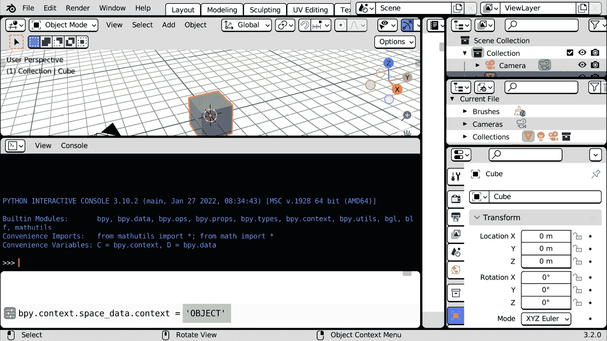

图 5.2：在选择了对象属性后，信息日志区域中的 UI 上下文名称

不遵循用户上下文但仍然允许你在标签页中分组其面板的区域提供*类别*属性。

#### 使用 bl_category 在标签页中进行分组

具有任意标签页的区域将查看`bl_category`变量以查找正确的标签。如果没有提供值，新面板将被添加到**杂项**标签页。如果没有以该值命名的标签页，将创建一个新的标签页。

我们将在本章末尾使用类别属性与`'VIEW_3D'`空间类型结合使用。我们将从没有标签的`'PROPERTIES'`编辑器开始。

## 将面板添加到对象属性区域

将我们的面板添加到`bl_space_type`为`'PROPERTIES'`和`bl_context`为`'object'`。

`Panel`需要一个`draw`函数，实际设计就在这里进行。在这个阶段，我们可以将其留空：

```py
import bpy
class OBJECT_PT_very_simple(bpy.types.Panel):
    """Creates a Panel in the object context of the
    properties space"""
    bl_label = "A Very Simple Panel"
    bl_idname = "VERYSIMPLE_PT_layout"
    bl_space_type = 'PROPERTIES'
    bl_region_type = 'WINDOW'
    bl_context = 'object'
    def draw(self, context):
        # add layout elements
        pass
```

与 Blender 类的大多数运行时函数一样，`draw`函数接受`self`和`context`参数。根据 Python 惯例，`self`是类的运行实例，而`context`包含有关 Blender 场景当前状态的信息。

现在，让我们学习如何使用`draw`方法向面板布局添加元素。

### 绘制面板的内容

`draw`函数在每次面板被使用或更新时都会连续执行。因此，它不应执行任何计算密集型任务，只需负责显示的元素即可。

面板的元素根据其布局排列。由于布局是一个非静态成员，它可以在`draw`函数中使用`self.layout`来访问。

默认情况下，所有元素都垂直堆叠在一个`column`中，但不同类型的布局将提供不同的方式来排列`row`或网格中的小部件。

布局也可以嵌套在一起，以实现更复杂的排列。让我们学习如何访问主布局并向其中添加元素。

### 与布局一起工作

所有布局类型都源自`UILayout`类。它们有添加子元素或子布局的方法。完整的属性和方法列表可以在 https://docs.blender.org/api/3.2/bpy.types.UILayout.xhtml 的 API 文档中找到。

因此，要显示文本，我们可以使用`UILayout.label`方法。以下是我们的`draw`函数的前几行代码：

```py
    def draw(self, context):
        layout = self.layout
        layout.label(text="A Very Simple Label")
```

如果我们启用此附加组件并到达**对象属性**区域，我们将能够看到我们的新面板显示一些文本：

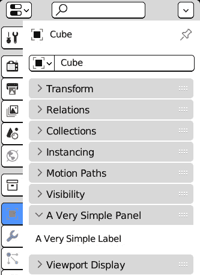

图 5.3：我们的面板在对象属性区域显示

### 显示图标

标签也可以显示**图标**。有两种类型的图标：

+   **内置**图标，这些图标随 Blender 一起提供。`label`方法提供了一个`icon`关键词来使用它们。

+   可以通过`icon_value`参数使用**外部图像**。

Blender 的原生图标集在整个应用程序中使用。每个图标都通过一个关键词来标识。例如，`LIGHT`显示一个灯泡：

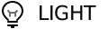

图 5.4：Blender 为 LIGHT 关键字提供的图标

由于有超过 800 个内置图标，因此 Blender 包含一个用于搜索它们的附加组件。

#### 使用图标查看器附加组件查找内置图标

**搜索栏**区域的`图标`：

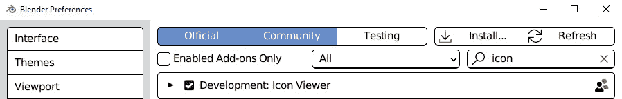

图 5.5：激活图标查看器附加组件

一旦附加组件被启用，**图标查看器**按钮就会出现在**Python**控制台标题中：

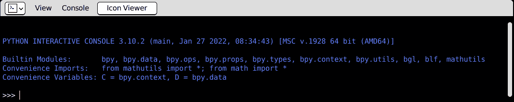

图 5.6：Python 控制台标题中的图标查看器按钮

点击此按钮将打开一个窗口，显示所有原生图标。我们可以通过左键单击来选择它们：

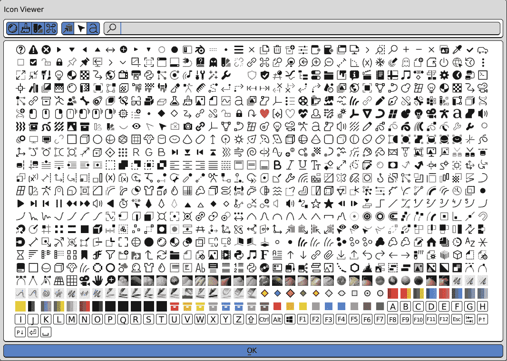

图 5.7：图标查看器附加窗口

选择一个图标将在右上角显示相关的关键字。该关键字也将复制到剪贴板。例如，如果我们选择 *问号* 图标，这是在撰写本文时位于左上角的第一个图标，`QUESTION` 关键字将被显示，如下面的图所示：


图 5.8：`QUESTION` 关键字显示在右上角

我们可以在顶部中间标记有放大镜图标的筛选字段中输入搜索关键字。

例如，我们可以输入 `“info”` 来仅显示 `'INFO'` 图标。现在我们知道了它们的关键字，我们可以这样显示这些图标：

```py
    def draw(self, context):
        layout = self.layout
        layout.label(text="A Very Simple Label",
                     icon='INFO')
        layout.label(text="Isn't it great?",
                     icon='QUESTION')
```

标签图标显示在文本之前，是使其突出的一种好方法：

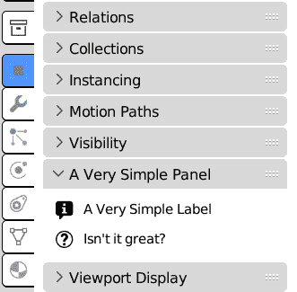

图 5.9：在自定义面板中显示的‘INFO’和‘QUESTION’图标

内置图标始终可用，并且不需要与我们的脚本一起分发外部文件。在需要时，我们也可以使用图像文件。`bpu.utils.previews` 模块可以用于从图像文件加载图标并使用索引号检索它们。

#### 使用自定义图像图标

在这个例子中，我们将添加笑脸图标到我们的面板。图像文件名为 `icon_smile_64.png`，可以在本章的 Git 文件夹中找到。

或者，任何存储在 `.png` 格式并与附加程序的 `.py` 文件一起的图片都将有效。在这种情况下，脚本中使用的图片文件名必须相应更改。

分辨率不应过高：一个 64 像素宽的方形图片通常就足够了：


图 5.10：一个 64x64 的笑脸

要向 Blender 添加自定义图标，我们的脚本需要导入以下内容：

+   Python 的 `os` 模块，用于构建图标文件路径并确保它在所有平台上都能工作

+   Blender 的 `bpy.utils.previews` 模块，用于为我们图标生成 Blender 标识符

导入这些内容后，我们的 `import` 部分将看起来如下：

```py
import bpy
from bpy.utils import previews
import os
```

我们的图标必须在脚本中的任何地方都可以访问。我们可以使用全局变量、静态成员或单例进行存储。在这个例子中，我们使用全局变量，因为它是一个更简单的选项。

因此，紧随 `import` 部分之后，我们必须添加以下行：

```py
# global variable for icon storage
custom_icons = None
```

我们将变量初始化为 `None`，因为我们可以在 `register`/`unregister` 函数内部加载和清除它。我们也可以为此添加特定的函数。这样，代码将更容易理解：

```py
def load_custom_icons():
    """Load icon from the add-on folder"""
    Addon_path = os.path.dirname(__file__)
    img_file = os.path.join(addon_path,
               "icon_smile_64.png")
    global custom_icons
    custom_icons = previews.new()
    custom_icons.load("smile_face",img_file, 'IMAGE')
```

然后，我们需要一个函数在附加程序注销时清除 `custom_icons`：

```py
def remove_custom_icons():
    """Clear Icons loaded from file"""
    global custom_icons
    bpy.utils.previews.remove(custom_icons)
```

这些函数随后在注册部分被调用：

```py
def register():
    load_custom_icons()
    bpy.utils.register_class(VerySimplePanel)
def unregister():
    bpy.utils.unregister_class(VerySimplePanel)
    clear_custom_icons()
```

一旦我们读取了图片文件，我们使用 `"smile_face"` 作为 `custom_icons.load()` 的第一个参数，因此这就是用于检索其标识符的关键字。以下是用于标签的代码：

```py
layout.label(text="Smile", icon_value=custom_icons['smile_face'].icon_id)
```

如果我们从*F3*搜索面板查找并执行**重新加载脚本**，我们将在面板中看到我们的自定义图标：

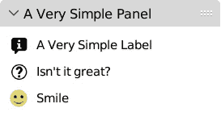

图 5.11：从我们的文件加载并显示在我们的面板中的笑脸图标

目前，我们已经使用了默认的列布局。我们将在下一节中学习如何使用不同的排列。

我的部件去哪里了？

接口代码中的错误会“静默”失败；也就是说，Blender 不会明显地抱怨，而是只是停止绘制有错误的面板。

这可以防止 UI 崩溃，但会使我们的代码更难调试；我们只会注意到一些小部件没有显示。

当这种情况发生时，最好的做法是检查控制台输出或**脚本**工作区的**信息日志**区域。它将包含有关哪个代码行失败的*跟踪信息*。

# 在我们的面板中使用布局

如果我们对全局布局的默认堆叠方式不满意，我们可以添加我们选择的布局类型，并使用它，我们将得到不同的排列。

例如，我们可以使用`row`将两个标签放在同一行上。此外，即使我们对我们元素堆叠的方式感到满意，创建一个`column`子布局也是良好的实践。这种做法至少有两个优点：

+   我们保留了面板的外观，即使默认排列应该改变

+   我们不会污染原始布局

让我们看看我们如何改变小部件堆叠的方式。

## 列和行的排列

我们可以在`draw`函数内部嵌套更多布局类型。例如，我们可以将上一个示例中的最后两个标签并排放置，而不是垂直排列。为此，我们必须做两件事：

1.  首先，我们必须创建一个`column`并将第一个标签添加到其中。

1.  然后，我们必须创建一个`row`。我们将添加到其中的两个标签将相邻：

```py
    def draw(self, context):
        col = self.layout.column()
        col.label(text="A Very Simple Label",
                  icon='INFO')
        row = col.row()
        row.label(text="Isn't it great?",
                  icon='QUESTION')
        icon_id = custom_icons["smile_face"].icon_id
        row.label(text="Smile", icon_value=icon_id)
```

现在，我们的面板只包含两行：

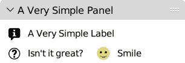

图 5.12：第二行包含两个标签

## 添加带有框布局的框架

其他类型的子布局提供额外的效果。例如，框布局就像一列，但它被框在平滑的矩形中。假设我们想显示一些来自附加组件的`bl_info`的信息。在这里，我们可以将这些行添加到`draw`函数中：

```py
        box = col.box()
        row = box.row()
        row.label(text="version:")
        row.label(text=str(bl_info['version']))
```

在我们调用**重新加载脚本**后，我们将看到围绕该信息的框架：

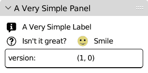

图 5.13：包围版本信息的框布局

我们在行中放置了标题`"version"`和表示`bl_info['version']`的一些信息。这样，每个元素都有相同的空间。为了更好地控制第一个元素占用的空间，我们可以使用`split`布局。

## 使用复合布局

一些布局由更多行或列组成。`split`布局将可用空间分配到不同的列，而`grid`布局会自动创建行和列。

我们将使用它们来构建一个更复杂的面板。

### 分割排列

我们可以使用`split`方法创建一个布局，其列宽可以调整。`factor`参数是可选的，接受`0.0`到`1.0`之间的值。将其保留为默认值`0.0`将自动计算最佳宽度；否则，它将设置第一列占用的百分比。

在这个例子中，我们将使用`0.33`这个系数来减少第一列的空间。在这里，我们还将创建两列，以便我们稍后填充它们并排列更多元素，就像在表格中一样。

下面的代码片段每行显示两个条目。第一列大约占据三分之一的空間：

```py
        # ...
        box = col.box()
        split = box.split(factor=0.33)
        left_col = split.column()
        left_col.label(text="author:")
        left_col.label(text="version:")
        right_col = split.column()
        right_col.label(text=str(bl_info['author']))
        right_col.label(text=str(bl_info['version']))
```

重新加载脚本后，我们将看到我们的标题占据了三分之一的空间，其余空间留给相关信息：

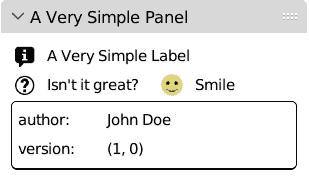

图 5.14：作者和版本信息占据三分之一的空間

我们可以利用字典方法从`bl_info`中添加更多信息。这样，我们可以使用`for`循环来填充我们的`split`布局。

### 使用字典填充

由于我们已经创建了列，我们可以使用循环添加更多条目。这对于在字典中显示条目非常理想。

假设我们想显示所有插件信息。在这种情况下，我们可以使用`items()`方法迭代所有关键字/值对：

```py
        # …
        box = col.box()
        split = box.split(factor=0.3)
        left_col = split.column()
        right_col = split.column()
        for k, v in bl_info.items():
            if not v:
                # ignore empty entries
                continue
            left_col.label(text=k)
            right_col.label(text=str(v))
```

在这里，我们使用`continue`跳过`bl_info`的未设置值，当`v`为空时。在这几行中，我们可以显示所有可用的插件信息：

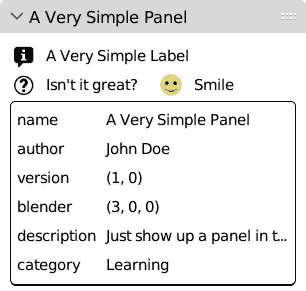

图 5.15：显示 bl_info 的框布局

如果我们愿意让 Blender 决定列宽，我们可以使用网格布局。

### 排列网格

`grid_flow`布局非常适合将我们的元素排列成表格，因为它会自动创建行和列。例如，我们可以通过使用`grid_flow(columns=2)`和将标签添加到`for`循环中来在两列中显示场景中的对象名称：

```py
        # ...
        col.label(text="Scene Objects:")
        grid = col.grid_flow(columns=2)
        for ob in context.scene.objects:
            grid.label(text=ob.name)
```

此代码将显示当前场景中对象的名称，以两列网格排列：

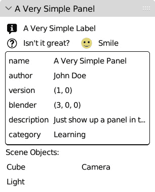

图 5.16：以网格显示的对象名称

通过这样，我们已经看到标签也可以显示图标。这意味着我们可以在每个名称旁边显示对象的类型图标，就像大纲视图一样。

### 构建图标关键词

在`OUTLINER_OB_MESH`和`OUTLINER_OB_CURVE`中进行快速搜索，遵循以下模式：

```py
OUTLINER_OB_[OBJECT_TYPE]
```

这在下图中表示：

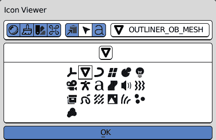

图 5.17：在图标查看器区域显示的对象类型图标

考虑到这一点，我们可以使用 *字符串格式化*（Python 3 的一个特性，使得组合字符串和变量更容易）来构建这些关键字。为了通知 Python 我们正在使用格式化，我们必须在引号或撇号分隔符之前放置一个 `f` 字符，然后在字符串内部用花括号包围我们的变量。以下是一个示例：

```py
>>> h = "Hello"
>>> print(f"{h}, World!")
Hello, World!
```

考虑到这一点，我们使用 `ob.type` 属性获取对象类型的字符串 - 例如，`'MESH'`、`'CURVE'` 或 `'ARMATURE'` - 然后使用以下行构建图标关键字：

```py
f'OUTLINER_OB_{ob.type}'
```

这个结果可以馈送到循环内的 `icon` 参数：

```py
        col.label(text="Scene Objects:")
        grid = col.grid_flow(columns=2)
        for ob in context.scene.objects:
            grid.label(text=ob.name,
                       icon=f'OUTLINER_OB_{ob.type}')
```

我们可以重新加载脚本并查看图标在名称之前是如何显示的：

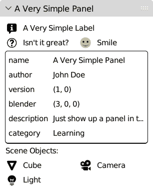

图 5.18：一个自定义面板，列出场景对象及其图标

我们不希望这个列表在大场景中占用太多空间，因此我们将在一定数量的对象后中断循环。例如，我们可以在列出第四个对象后停止列出对象并显示省略号。

在最后一行留下省略号意味着按行填充网格。为了做到这一点，我们必须将 `row_major` 参数设置为 `True` 以用于 `grid_flow`：

```py
        col.label(text="Scene Objects:")
        grid = col.grid_flow(columns=2, row_major=True)
        for i, ob in enumerate(context.scene.objects):
            if i > 3:   # stop after the third object
                grid.label(text"..")
                break
            grid.label(text=ob.name,
                       icon=f'OUTLINER_OB_{ob.type}')
```

一种（不好的）魔法

代码中间出现的任意数字，如 `i > 3` 中的那些，被称为**魔法数字**，使用它们被认为是不良做法，因为它使得在以后阶段找到和更改这些值变得非常困难。

一个更好的解决方案是将这些数字作为类的成员，并在以后访问它们。

将 `3` 存储为静态成员使其更容易显示剩余对象的数量。字符串格式化也适用于数值变量，因此我们可以计算剩余对象的数量，并将结果用于花括号中：

```py
class OBJECT_PT_very_simple(bpy.types.Panel):
    #...
    bl_context = 'object'
    max_objects = 3
    def draw(self, context):
        # ...
        for i, ob in enumerate(context.scene.objects):
            if i > self.max_objects:
                objects_left = len(context.scene.objects)
                objects_left -= self.max_objects
                txt = f"... (more {objects_left} objects"
                grid.label(text=txt)
                break
```

由于 `max_objects` 是类的属性，它可以通过 Python 进行更改。

Blender 将这些插件视为 Python 模块，因此可以在 **Python 控制台** 或 **文本** **编辑器**区域执行这些行：

```py
import very_simple_panel
very_simple_panel.OBJECT_PT_very_simple.max_objects = 10
```

这个技巧的缺点是每次重新加载插件都会重置该值。在我们的插件中更改设置的一个更好的方法是使用 `bpy.types.Preferences`，这将在 *第六章* 中讨论：

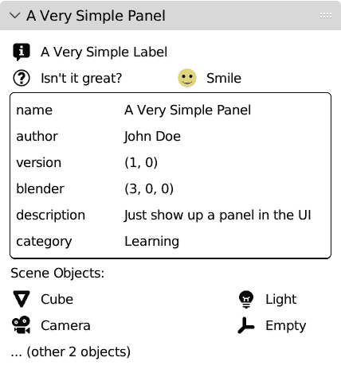

图 5.19：更改限制显示超过三个对象

使用图标和说明性文本增加了我们 UI 的视觉反馈。在下一节中，我们将利用布局状态的颜色来传达状态信息。

# 提供颜色反馈

如果我们可以突出显示哪些对象被选中以及哪些是活动的，我们的对象列表将更有用。例如，为了在对象名称的颜色中反映选择状态，我们的脚本必须执行两个操作：

1.  检查一个对象是否被选中。

1.  如果它被选中或处于活跃状态，则以不同的颜色显示其名称。

让我们学习如何使用 Blender 的 API 来完成这些任务。

## 检查对象是否被选中

我们可以使用对象的`select_get()`方法来获取对象的选中状态。例如，如果`'Cube'`对象被选中，其`selected_get`方法将返回`True`：

```py
>>> import bpy
>>> bpy.data.objects['Cube'].select_get()
True
```

我们从*第二章***中已经知道，与选择状态不同，`活跃`并不是对象的标志，因此我们获取这些信息的方式略有不同。

## 检查对象是否活跃

要检查一个对象是否活跃，我们可以测试它是否与存储在`context.object`中的对象匹配。以下是当`'Cube'`是活跃对象时发生的情况：

```py
>>> import bpy
>>> bpy.data.objects['Cube'] == bpy.context.object
True
```

现在我们已经知道了如何检索对象的活跃状态，接下来让我们看看如何改变其标签的颜色。

## 用红色或灰色绘制布局

有时候，用不同的颜色绘制文本可以使条目更加突出。Blender 不允许我们显式设置文本的颜色，但我们可以利用两个特定的属性来改变 UI 布局的显示方式：

+   `UILayout.enabled = False`的目的是在不让用户与之交互的情况下显示一个元素。如果我们想让用户意识到，即使现在无法执行某个操作，执行该操作的界面仍然存在，这将非常有用。

+   `UILayout.alert = True`对于警告用户有关某些错误或潜在错误的情况非常有用。

这些用途非常具体，但我们可以利用它们对显示颜色的影响：

+   `enabled`属性等于`False`的 UI 布局是*灰色*

+   `alert`属性等于`True`的 UI 布局是*红色*

因此，我们可以利用这一点来改变整个布局的颜色。标签不是布局，`label()`方法返回`None`类型。由于我们无法直接在文本标签上设置这些属性，我们需要为网格的每个条目创建一个新的布局，并在创建文本时使用它：

```py
    # ...
    for i, ob in enumerate(context.scene.objects):
        # layout item to set entry color
        item_layout = grid.column()
        item_layout.label(text=ob.name,
                          icon=f'OUTLINER_OB_{ob.type}')
```

我们可以使用这一行将`item_layout.enabled`设置为`True`以用于选中的对象，以及`False`用于未选中的对象：

```py
        item_layout.enabled = ob.select_get()
```

同样，我们可以通过直接赋值等式测试的结果（`==`）来设置`item_layout.alert`：

```py
        item_layout.alert = ob == context.object
```

如我们所见，列表现在提供了有关哪些对象是活跃的或选中的信息：

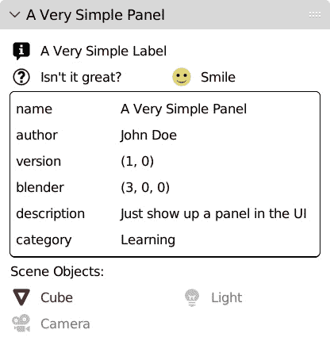

图 5.20：活跃对象为深红色，而未选中的对象为灰色

我们还可以添加按钮来执行一些操作，正如我们将在下一节中看到的。

# 显示按钮

直观地讲，按按钮执行转换动作。由于按钮占用空间，默认界面只显示更通用的操作。当我们编写自定义界面时，我们可以根据我们的具体需求添加更多按钮。这使得 Blender 将操作符转换为按钮变得更容易。在本节中，我们将学习按钮和操作符在图形界面中的等效性。

## 使用操作符方法

我们可以使用`UILayout.operator`方法来显示按钮。在 Blender 中，按钮执行操作符。这个操作符通过其标识符找到——即`bl_idname`属性，我们在*第三章*中遇到过——每个操作符都必须有它。

例如，要添加一个删除所选对象的按钮，我们必须提供**删除**操作符的标识符。

如果我们使用**对象**菜单中的**删除**操作或*X*键，并查看**脚本**工作区，我们将在**信息** **日志**区域找到这条新行：

```py
bpy.ops.object.delete(use_global=False)
```

括号前的部分，`bpy.ops.object.delete`，是操作符类。我们必须小心，因为我们不能将类本身用作操作符的参数，而是该类的标识符。我们可以使用`idname()`方法来获取标识符：

```py
>>> bpy.ops.object.delete.idname()
'OBJECT_OT_delete'
```

使用`'OBJECT_OT_delete'`字符串作为`operator()`的参数将创建一个**删除**按钮。

请输入 ID

使用`operator`类而不是操作符的标识符`operator`会导致`TypeError`：操作符及其后面的所有元素将不会显示。

我们可以使用`idname()`函数或直接使用标识符字符串。函数是首选的，因为它保证了在将来更改时的兼容性。

要显示一个`draw`函数：

```py
col.operator(bpy.ops.object.delete.idname())
```

我们将看到以下内容：

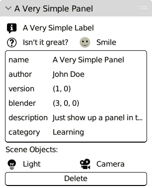

图 5.21：已将删除按钮添加到面板中

按下**删除**按钮将删除所选对象。这相当于从菜单中调用**对象** | **删除**。

## 设置操作符的文本和可见性

我们可以自定义按钮文本或切换按钮的显示。例如，我们可以隐藏`context`：

```py
        num_selected = len(context.selected_objects)
```

我们可以在按钮标签中反映此信息。以下代码片段根据已选对象的数量更改按钮的文本。它还在“object”一词的末尾添加了一个“s”，以便在需要时使用复数形式：

```py
        if num_selected > 0:
            op_txt = f"Delete {num_selected} object"
            if num_selected > 1:
                op_txt += "s"  # add plural 's'
            col.operator(bpy.ops.object.delete.idname(),
                         text=op_txt)
```

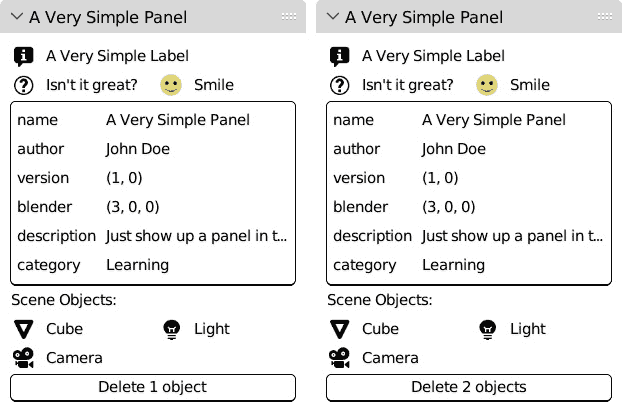

图 5.22：按钮的文本根据选择而改变

没有要隐藏的内容（通常）

人们常说，隐藏 UI 的一部分通常是错误的，因为它让用户在条件满足后无法知道功能在哪里。这通常是一个有效的观点，尽管为了教学目的，在先前的例子中使用了消失的按钮。

如果我们想遵守“不隐藏”规则，我们可以在 `else` 语句中添加一个禁用的布局：

```py
        if (num_selected > 0):
                # …
        else:
            to_disable = col.column()
            to_disable.enabled = False
            to_disable.operator(
                          bpy.ops.object.delete.idname(),
                          text="Delete Selected"
                          )
```

在编码时，规则可以被打破但不能被忽视！

## 覆盖操作符的设置

`delete` 操作符在删除对象之前会提示确认对话框。这是它的默认行为，并且可以被覆盖：

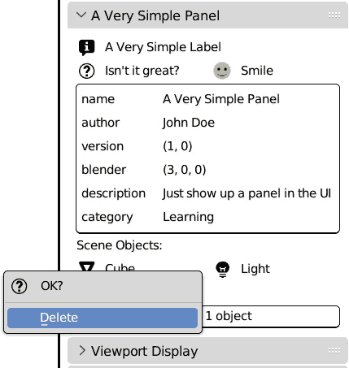

图 5.23：点击删除将打开确认菜单

这在文档化的 docstring 中得到了体现。如果我们输入操作符的地址并按下 *Tab* 键，自动完成将显示两个可选参数，称为 `use_global` 和 `confirm`：

```py
>>> bpy.ops.object.delete(
delete()
bpy.ops.object.delete(use_global=False, confirm=True)
Delete selected objects
>>> bpy.ops.object.delete(
```

您可以通过查看 API 文档来了解更多信息。右键单击 **删除** 按钮将显示一个包含直接链接的菜单：

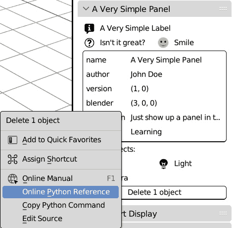

图 5.24：我们的删除按钮的右键菜单可以打开在线文档

文档描述了这些布尔参数：

+   `use_global`（布尔值，可选）：全局删除或从所有场景中删除对象

+   `confirm`（布尔值，可选）：确认或提示确认

根据文档，将 `use_global` 设置为 `True` 将从所有当前打开的场景中删除选定的对象。我们不想这样做，所以我们没有更改默认值。

另一方面，`confirm` 参数默认为 `True`。我们需要将其更改为 `False`，并且由于按钮负责调用操作符，我们需要在按钮的属性中进行更改。

## 设置操作符属性

`operator` 函数返回一个 `OperatorProperties` 对象，这是一个包含可以设置的属性的类。通常，我们使用以下代码：

```py
    col.operator(bpy.ops.object.delete.idname(),
                 text=op_txt)
```

相反，我们将存储 `operator` 返回的属性在 `props` 变量中，以便我们稍后可以更改它们：

```py
    props = col.operator(bpy.ops.object.delete.idname(),
            text=op_txt)
    props.confirm = False
```

此按钮触发 `delete` 操作符，这是 Blender 的原生操作符。由于界面将 Python 和内置操作符视为等效，我们也可以为我们的操作符显示按钮。

## 为我们的函数添加按钮

我们将为每个选定的对象添加一个随机位移的按钮。这可以用来给我们的场景一个更“自然”的外观。为了做到这一点，我们必须编写一个新的操作符。Blender 的操作符会将所有选定的对象以相同的方式进行变换。首先，我们必须在脚本的开头导入 `random` 模块：

```py
import bpy
from bpy.utils import previews
import os
import random
```

我们继续进行位置函数。它可以作为操作符类的一部分，但我们也可以编写一个独立的功能。操作符将在其 `execute` 方法内部调用该功能。此函数的参数如下：

+   需要错位的对象

+   每个对象位置添加或减去的最大单位数

+   哪个轴应该受到影响

我们将把位移量输入到 `randint` 函数中，该函数将返回一个介于 `min` 和 `max` 范围内的随机整数。我们将为三个轴（*X*、*Y* 和 *Z*）中的每一个都这样做，只要它们的 `do_axis` 项为 `True`。`amount` 和 `do_axis` 参数是可选的。我们在函数声明中将它们的默认值设置为 `1` 和 `True, True, True`：

```py
def add_random_location(objects, amount=1,
                        do_axis=(True, True, True)):
    """Add units to the locations of given objects"""
    for ob in objects:
        for i in range(3):
            if do_axis[i]:
                loc = ob.location
                loc[i] += random.randint(-amount, amount)
```

现在，我们需要一个在界面中显示的操作符。我们将为 `amount` 和 `do_axis` 函数参数添加属性。对于操作符，整数和布尔值的元组分别是 `IntProperty` 和 `BoolVectorProperty`：

```py
class TRANSFORM_OT_random_location(bpy.types.Operator):
    """Add units to the locations of selected objects"""
    bl_idname = "transform.add_random_location"
    bl_label = "Add random Location"
    amount: bpy.props.IntProperty(name="Amount",
                                  default=1)
    axis: bpy.props.BoolVectorProperty(
                               name="Displace Axis",
                               default=(True, True, True)
                               )
```

操作符方法很简单；`poll` 只确保已选择对象，而 `execute` 执行 `add_random_location`：

```py
    @classmethod
    def poll(cls, context):
        return context.selected_objects
    def execute(self, context):
        add_random_location(context.selected_objects,
                            self.amount,
                            self.axis)
        return {'FINISHED'}
```

将此操作符添加到布局中会显示一个新按钮。如前所述，原生和脚本操作符对界面来说是相同的。在两种情况下，它都会在调用时查找操作符的标识符。尽管如此，脚本操作符提供一个小优势：由于它们的类和我们的图形界面属于同一个模块或包，我们可以直接引用它们的 `bl_idname` 属性。

这是显示 **添加随机** **位置** 按钮的代码行：

```py
    col.operator(
                TRANSFORM_OT_random_location.bl_idname
                )
```

当然，我们也不能忽视类注册和删除。以下是应添加到 `register()` 的代码行：

```py
    bpy.utils.register_class(
                            TRANSFORM_OT_random_location
                            )
```

同样，附加组件的 `unregister()` 函数应包含以下内容：

```py
    bpy.utils.unregister_class(
                            TRANSFORM_OT_random_location
                            )
```

在调用 **重新加载脚本** 后，将出现一个新按钮：

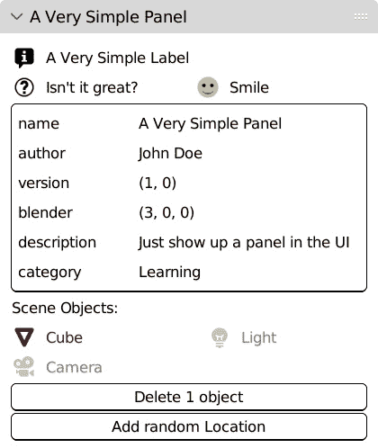

图 5.25：我们的面板现在显示两个按钮

按下此按钮应向所选对象的位置添加随机变化，因为操作符属性在执行时不会弹出。即使添加了我们在 *第四章* 的 *编写电梯插件* 部分中了解到的 `bl_options = {'REGISTER', 'UNDO'}` 操作符属性，也不会改变这一点：当操作符属性不是从 **3D** **视口** 区域运行时，必须显式显示操作符属性。

## 显示操作符属性

除了 `poll` 和 `execute`，Blender 操作符还涉及另一个名为 `invoke` 的方法。`invoke` 方法在 `execute` 之前内部运行。通常我们不需要定义它，但在这个例子中，我们使用它来告诉 Blender 我们想要显示和编辑操作符属性——即我们的函数参数。

除了 `self` 和 `context`，`invoke` 还接受 `event` 作为参数。它包含有关触发操作符的信息，但我们现在不需要它。我们只告诉 `window_manager` 显示属性对话框。因此，我们必须在 `poll` 方法之后添加几行代码：

```py
    @classmethod
    def poll(cls, context):
        return context.selected_objects
    def invoke(self, context, event):
        wm = context.window_manager
        return wm.invoke_props_dialog(self)
```

重新加载脚本并按下 `add_random_location` 函数：

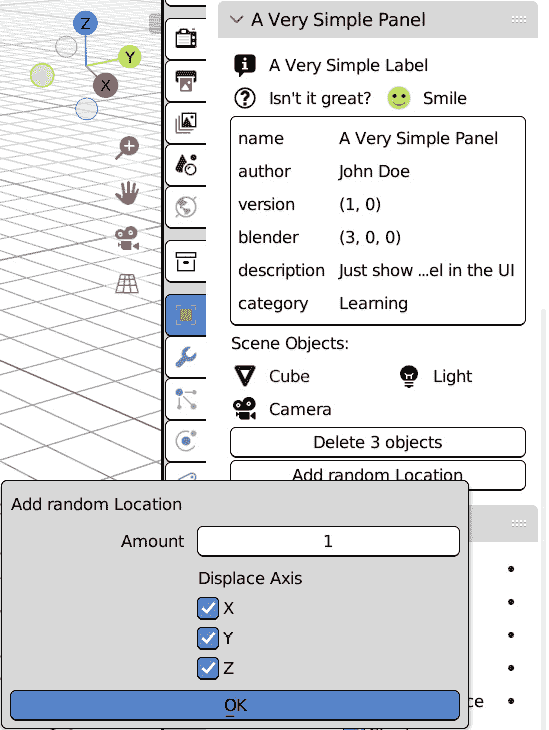

图 5.26：使用操作符属性作为函数参数

有了这些，我们的对象面板就完成了。作为额外收获，接下来我们将学习如何将其移动到 UI 的不同部分。

# 使用不同的区域

通常，面板可以自由地移动到界面的另一部分。有一些例外，重新定位面板可能没有太多意义。例如，一个帮助选择角色控制器的工具在视频编辑器中几乎没有帮助，它的`poll()`方法可能正在寻找动画的`context`之外的属性，如动画骨骼。

在那些情况下，更改`Panel`类的`bl_*`属性就足以将我们的面板移动到不同的位置。请参考本章“创建简单面板”部分中我们查看的*面板属性*。

因此，为了在`bl_space_type`和`bl_region_type`中显示我们的面板，如下所示：

```py
    bl_space_type = 'VIEW_3D'
    bl_region_type = 'UI'
```

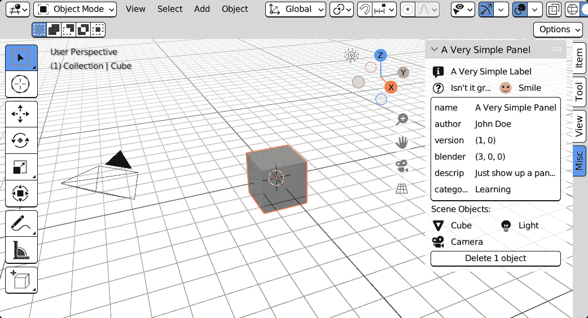

图 5.27：我们的面板已移动到 3D 视口区域

默认情况下，可以使用`bl_category`属性来指定新标签或现有标签：

```py
class VerySimplePanel(bpy.types.Panel):
    """Creates a Panel in the viewport properties"""
    bl_label = "A Very Simple Panel"
    bl_idname = "VERYSIMPLE_PT_layout"
    bl_space_type = 'VIEW_3D'
    bl_region_type = 'UI'
    bl_category = "Our Panel"
```

如果 Blender 插件包含多个面板，将它们放在同一个标签下是一种保持界面整洁的好方法：

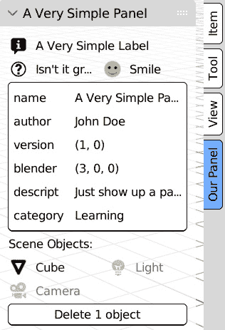

图 5.28：从 bl_category 属性创建的视口标签

我们已经完成了界面概述的结尾。在介绍列表和缩略图时，下一章将会有更多的 UI 见解，但到目前为止，我们已经对如何在 Blender 中使用布局有了稳固的理解。

# 摘要

在本章中，我们学习了如何通过 Python 创建和填充自定义`UIPanel`，以及如何将其集成到我们的插件中。这让我们了解了 Blender 界面的一般工作原理以及我们必须采取哪些步骤来向其中添加小部件。

我们还嵌套了布局以获得更复杂的显示效果，并显示了原生和外部图标。

最后，我们学习了如何根据上下文更改面板的外观，而不会增加太多的复杂性，以及如何向 UI 添加功能。

这本书的第一部分到此结束，我们获得了对 Blender 和 Python 如何协同工作以及 Python 脚本可以做什么的整体理解。

我们编写的插件依赖于一个名为`icon_smile_64.png`的外部文件。如果我们将其公开分发，我们必须将其打包成 ZIP 文件。这是我们将在*第六章*中要做的事情，这标志着*第二部分*，*交互式工具*和*动画*的开始。

# 问题

1.  屏幕上的一个区域是否可以容纳多个编辑器？

1.  所有编辑器是否都由相同的区域组成？

1.  我们如何设置编辑器、区域和上下文，以便面板属于它们？

1.  我们是否必须始终设置面板的类别？

1.  面板的元素是静态的还是可以动态更改的？

1.  我们能否更改文本的颜色？

1.  我们如何显示按钮？

# 第二部分：交互式工具和动画

本部分介绍了与动画系统交互的模块化、结构化附加组件。它还介绍了捕获用户输入和操作员执行不同步骤的模式工具。

本节包括以下章节：

+   *第六章*，*结构化我们的代码和附加组件*

+   *第七章*，*动画系统*

+   *第八章*，*动画修改器*

+   *第九章*，*动画驱动器*

+   *第十章*，*高级和模式操作员*
