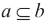

# 第二章：获取情报数据

我们将从各种来源获取情报数据。我们可能会采访人们。我们可能会从秘密地下基地窃取文件。我们可能会搜索**万维网**（**WWW**），这是我们本章将关注的重点。使用我们自己的相机或录音设备是下一章的主题。

重要间谍目标包括自然资源、公众舆论和战略经济优势。这类背景信息在许多方面都很有用。世界上大量的数据已经存在于互联网上，其余的最终也会到达那里。任何现代的情报搜索都始于互联网。

我们可以使用 Python 库，如`http.client`和`urllib`，从远程服务器获取数据并将文件传输到其他服务器。一旦我们找到了感兴趣的远程文件，我们将需要多个 Python 库来解析和提取这些库中的数据。

在第一章《我们的间谍工具包》中，我们探讨了如何查看 ZIP 存档的内容。在本章中，我们将查看其他类型的文件。我们将重点关注 JSON 文件，因为它们在 Web 服务 API 中得到广泛应用。

在旅途中，我们将涵盖多个主题：

+   如何从 Python 访问在线数据。

+   HTTP 协议以及如何从我们的应用程序访问网站。

+   FTP 协议以及如何上传和下载大量批量数据。

+   许多核心 Python 数据结构将包括列表、元组、字典和集合，以及我们如何使用这些结构来组织和管理工作信息。

+   在本章结束时，我们将能够构建应用程序，从网络获取实时、最新、分秒必争的数据。一旦我们获取了数据，我们可以过滤和分析它，以创建有用的情报资产。

# 从互联网获取数据

万维网和互联网基于一系列称为**请求评论**（**RFC**）的协议。RFCs 定义了连接不同网络的标准和协议，即互联网互连的规则。万维网由这些 RFC 的一个子集定义，该子集指定了协议、主机和代理（服务器和客户端）的行为以及文件格式等细节。

从某种意义上说，互联网是一种受控的混乱。大多数软件开发者都同意遵循 RFCs。有些人则不然。如果他们的想法真的很好，它可能会流行起来，即使它并不完全遵循标准。我们经常在看到一些浏览器与某些网站不兼容时看到这种情况。这可能会引起困惑和疑问。我们经常不得不进行间谍活动和普通的调试，以确定给定网站上的可用信息。

Python 提供了一系列模块，实现了互联网 RFCs 中定义的软件。我们将探讨一些常见的协议，通过互联网收集数据以及实现这些协议的 Python 库模块。

## 背景简报——TCP/IP 协议

万维网背后的基本思想是互联网。互联网背后的基本思想是 TCP/IP 协议栈。这个协议栈中的 IP 部分是互联网互连协议。它定义了消息如何在网络之间路由。在 IP 之上是 TCP 协议，用于连接两个应用程序。TCP 连接通常通过一个称为 **套接字** 的软件抽象来实现。除了 TCP 之外，还有 UDP；它在我们感兴趣的万维网数据中并不常用。

在 Python 中，我们可以使用低级的 `socket` 库来处理 TCP 协议，但我们不会这样做。套接字是一个支持打开、关闭、输入和输出操作的文件类似对象。如果我们在一个更高的抽象级别上工作，我们的软件将会更简单。我们将使用的 Python 库将在幕后利用套接字概念。

互联网 RFC 定义了在 TCP/IP 套接字上构建的多个协议。这些是主机计算机（服务器）和用户代理（客户端）之间交互的有用定义。我们将查看其中的两个：**超文本传输协议**（**HTTP**）和**文件传输协议**（**FTP**）。

## 使用 http.client 进行 HTTP GET

网络流量的本质是 HTTP。这是建立在 TCP/IP 之上的。HTTP 定义了两个角色：主机和用户代理，也分别称为服务器和客户端。我们将坚持使用服务器和客户端。HTTP 定义了多种请求类型，包括 `GET` 和 `POST`。

网络浏览器是我们可以使用的一种客户端软件。该软件会发出 `GET` 和 `POST` 请求，并显示来自网络服务器的结果。我们可以使用两个库模块在 Python 中进行这种客户端处理。

`http.client` 模块允许我们进行 `GET` 和 `POST` 请求，以及 `PUT` 和 `DELETE` 请求。我们可以读取响应对象。有时，响应是一个 HTML 页面。有时，它是一个图形图像。还有其他一些东西，但我们主要对文本和图形感兴趣。

这是我们一直在试图找到的神秘设备的图片。我们需要将此图像下载到我们的计算机上，以便我们可以查看并发送给我们的线人。[`upload.wikimedia.org/wikipedia/commons/7/72/IPhone_Internals.jpg`](http://upload.wikimedia.org/wikipedia/commons/7/72/IPhone_Internals.jpg)


这是我们需要追踪并支付的货币的图片：


我们需要下载这张图片。以下是链接：

[`upload.wikimedia.org/wikipedia/en/c/c1/1drachmi_1973.jpg`](http://upload.wikimedia.org/wikipedia/en/c/c1/1drachmi_1973.jpg)

这就是我们如何使用 `http.client` 来获取这两个图像文件的方法：

```py
import http.client
import contextlib

path_list = [
    "/wikipedia/commons/7/72/IPhone_Internals.jpg",
    "/wikipedia/en/c/c1/1drachmi_1973.jpg",
]
host = "upload.wikimedia.org"

with contextlib.closing(http.client.HTTPConnection( host )) as connection:
    for path in path_list:
        connection.request( "GET", path )
        response= connection.getresponse()
        print("Status:", response.status)
        print("Headers:", response.getheaders())
        _, _, filename = path.rpartition("/")
        print("Writing:", filename)
        with open(filename, "wb") as image:
            image.write( response.read() )
```

我们正在使用 `http.client` 来处理 HTTP 协议的客户端部分。我们还在使用 `contextlib` 模块，在完成使用网络资源后，礼貌地将我们的应用程序与网络资源分离。

我们将路径列表赋值给 `path_list` 变量。这个例子介绍了列表对象，但没有提供任何背景信息。我们将在本章后面的 *组织数据集合* 部分回到列表。重要的是列表必须用 `[]` 括起来，并且项目之间用 `,` 分隔。是的，在末尾有一个额外的 `,`。这在 Python 中是合法的。

我们使用主机计算机名创建了一个 `http.client.HTTPConnection` 对象。这个连接对象有点像文件；它将 Python 与我们本地计算机上的操作系统资源以及远程服务器连接起来。与文件不同，`HTTPConnection` 对象不是一个合适的上下文管理器。因为我们非常喜欢使用上下文管理器来释放资源，所以我们使用了 `contextlib.closing()` 函数来处理上下文管理细节。连接需要被关闭；`closing()` 函数通过调用连接的 `close()` 方法确保这一点会发生。

对于我们 `path_list` 中的所有路径，我们发送一个 HTTP `GET` 请求。这就是浏览器获取 HTML 页面中提到的图像文件的方式。我们从每个响应中打印了一些信息。如果一切正常，状态将是 200。如果状态不是 200，那么就出了问题，我们需要查阅 HTTP 状态码来了解发生了什么。

### 小贴士

如果你使用咖啡馆的 Wi-Fi 连接，可能你没有登录。你可能需要打开浏览器来设置连接。

HTTP 响应包括一些提供请求和响应额外细节的头部信息。我们打印了头部信息，因为它们在调试我们可能遇到的问题时可能很有帮助。最有用的头部信息之一是 `('Content-Type', 'image/jpeg')`。这确认了我们确实得到了一个图像。

我们使用 `_, _, filename = path.rpartition("/")` 来定位路径中的最右侧 `/` 字符。回想一下，`partition()` 方法用于定位最左侧的实例。在这里我们使用最右侧的。我们将目录信息和分隔符赋值给变量 `_`。是的，`_` 是一个合法的变量名。它很容易被忽略，这使得它成为表示“我们不关心”的便捷缩写。我们将文件名保存在 `filename` 变量中。

我们为生成的图像文件创建了一个嵌套的上下文。然后我们可以读取响应的主体——一组字节，并将这些字节写入图像文件。一气呵成，文件就归我们所有了。

HTTP `GET` 请求是 WWW 的基础。例如 `curl` 和 `wget` 这样的程序是这个例子的扩展。它们执行一系列 `GET` 请求来定位一个或多个页面内容。它们可以做很多事情，但这只是从 WWW 中提取数据的本质。

## 修改客户端信息

一个 HTTP `GET` 请求除了 URL 之外还包含几个头部信息。在之前的例子中，我们只是简单地依赖 Python `http.client` 库来提供一组合适的默认头部信息。我们可能有几个原因想要提供不同的或额外的头部信息。

首先，我们可能想要调整 `User-Agent` 头部来改变我们声称的浏览器类型。我们也可能需要为某些类型的交互提供 cookies。关于用户代理字符串的信息，请参阅 [`en.wikipedia.org/wiki/User_agent_string#User_agent_identification`](http://en.wikipedia.org/wiki/User_agent_string#User_agent_identification)。

这个信息可能被网络服务器用来确定是否正在使用移动设备或桌面设备。我们可以使用类似的方法：

```py
Mozilla/5.0 (Macintosh; Intel Mac OS X 10_9_2) AppleWebKit/537.75.14 (KHTML, like Gecko) Version/7.0.3 Safari/537.75.14
```

这使得我们的 Python 请求看起来像是来自 Safari 浏览器而不是一个 Python 应用程序。我们可以在桌面计算机上使用类似的方法来模拟不同的浏览器：

```py
Mozilla/5.0 (Macintosh; Intel Mac OS X 10.9; rv:28.0) Gecko/20100101 Firefox/28.0
```

我们可以使用类似的方法来模拟 iPhone 而不是 Python 应用程序：

```py
Mozilla/5.0 (iPhone; CPU iPhone OS 7_1_1 like Mac OS X) AppleWebKit/537.51.2 (KHTML, like Gecko) Version/7.0 Mobile/11D201 Safari/9537.53
```

我们通过向请求中添加头部信息来做出这种改变。改变看起来是这样的：

```py
connection.request( "GET", path, headers= {
    'User-Agent':
        'Mozilla/5.0 (iPhone; CPU iPhone OS 7_1_1 like Mac OS X) AppleWebKit/537.51.2 (KHTML, like Gecko) Version/7.0 Mobile/11D201 Safari/9537.53',
})
```

这将使网络服务器将我们的 Python 应用程序视为在 iPhone 上运行。这可能会导致比提供给完全桌面计算机的数据页面更紧凑。

头部信息是一个具有 `{ key: value, }` 语法的结构。这是一个字典。我们将在接下来的 *组织数据集合* 部分回到字典。重要的是字典被 `{}` 包围，键和值由 `:` 分隔，每个键值对由 `,` 分隔。是的，结尾有一个额外的 `,`。这在 Python 中是合法的。

我们可以提供许多其他的 HTTP 头部信息。`User-Agent` 头部可能是从网络服务器收集不同类型智能数据最重要的。

## 在 Python 中使用 FTP

FTP 指定了在计算机之间传输文件的方法。有两种主要变体：原始 FTP 和更安全的版本 FTPS。这个更安全的版本使用 SSL 来确保低级套接字完全加密。有时被称为 `FTP_TLS`，即带有传输层安全的 FTP。

SSH 标准包括一个文件传输协议，SFTP。这是 SSH 的一部分，与其他 FTP 变体分开。这由 `ftplib` 模块支持，尽管它实际上是一个不同的协议。

在某些情况下，FTP 访问是匿名的。不使用任何安全凭证（如用户名或密码）。这通常保留用于仅下载的内容。有时，匿名访问期望一个占位符用户名和密码——用户名应该是 *anonymous*，通常，你的电子邮件地址被用作密码。在其他情况下，我们需要有适当的凭证。我们将关注公开可访问的 FTP 服务器。

我们将要寻找《CIA 世界事实全书》。我们知道在 Project Gutenberg 中有副本。这使我们决定使用 [ftp.ibiblio.org](http://ftp.ibiblio.org) 服务器作为我们调查的目标。基本 URL 是 ftp://ftp.ibiblio.org/pub/docs/books/gutenberg/。

FTP 有自己的命令语言，用于检查远程（和本地）文件系统、创建和删除目录，以及获取和放置文件。其中一些语言通过 Python FTP 模块公开。其中一些则隐藏在幕后。

我们可以使用如下脚本查看 Project Gutenberg 服务器上可用的顶层文档。这是我们发现数据的初始步骤：

```py
import ftplib

host = "ftp.ibiblio.org"
root = "/pub/docs/books/gutenberg/"

def directory_list( path ):
    with ftplib.FTP(host, user="anonymous") as connection:
        print("Welcome", connection.getwelcome())
        for name, details in connection.mlsd(path):
            print(name, details['type'], details.get('size'))
directory_list(root)
```

我们导入了 FTP 库。我们需要使用 FTP 协议做任何事情。我们将主机 `host` 和根路径 `root` 作为字符串分配。我们将在需要定义的几个函数中使用它。

我们定义了一个 `directory_list()` 函数，该函数将显示目录中的名称、类型和大小。这使我们能够探索本地目录中的文件。在找到候选文件所在的目录后，我们将使用不同的参数调用此函数。

`directory_list()` 函数使用 `ftplib.FTP` 对象打开一个上下文。我们不需要使用 `contextlib.closing()` 函数，因为这个上下文表现良好。此对象将管理用于与 FTP 服务器交换数据的各种套接字。其中一个方法，`getwelcome()`，检索任何欢迎消息。我们会看到这相当简短。有时，它们会更详细。

我们将输出顶层目录信息，显示各种文件、目录及其大小。`details['type']` 语法是我们从字典中的键值对中选择特定名称的方式。`details.get('size')` 语法做类似的事情。使用 `[]` 获取项如果找不到名称将引发异常。使用 `get()` 方法获取项而不是异常提供默认值。除非指定其他值，否则默认值是 `None`。

我们声称 `details` 字典必须有一个 `type` 项。如果没有，程序将会崩溃，因为某些东西非常不对劲。我们还声称 `details` 字典可能或可能没有 `size` 项。如果大小不存在，则 `None` 值将代替。

这里有很多文件。《README》和 `GUTINDEX.ALL` 文件看起来很有希望；让我们检查一下。

### 通过 FTP 下载文件

FTP 库依赖于一种称为 **回调函数** 的技术来支持增量处理。下载一个 13 MB 的文件需要一些时间。让我们的电脑在下载时只是打盹是不礼貌的。提供一些关于进度（或缺乏进度）的持续状态是很好的。

我们可以以多种方式定义回调函数。如果我们打算使用类定义，回调函数将是类的另一个方法。类定义超出了我们书籍的范围。它们相当简单，但我们必须专注于间谍活动，而不是软件设计。这里有一个通用目的的 `get()` 函数：

```py
import sys

def get( fullname, output=sys.stdout ):
    download= 0
    expected= 0
    dots= 0
    def line_save( aLine ):
        nonlocal download, expected, dots
        print( aLine, file=output )
        if output != sys.stdout:
            download += len(aLine)
            show= (20*download)//expected
            if show > dots:
                print( "-", end="", file=sys.stdout )
                sys.stdout.flush()
                dots= show
    with ftplib.FTP( host, user="anonymous" ) as connection:
        print( "Welcome", connection.getwelcome() )
        expected= connection.size( fullname )
        print( "Getting", fullname, "to", output, "size", expected )
        connection.retrlines( "RETR {0}".format(fullname), line_save )
    if output != sys.stdout:
        print() # End the "dots"   
```

`get()` 函数包含一个嵌套在其内的函数定义。`line_save()` 函数是 `retrlines()` 函数使用的回调函数，用于 FTP 连接。来自服务器的每一行数据都将传递给 `line_save()` 函数进行处理。

我们的 `line_save()` 函数使用三个 `nonlocal` 变量：`download`、`expected` 和 `dots`。这些变量既不是全局的，也不是 `line_save()` 函数的局部变量。它们在下载任何行之前被初始化，并在 `line_save()` 函数中逐行更新。由于它们是 `line_save()` 函数的保存状态，我们需要通知 Python 在这些变量在赋值语句中使用时不要创建局部变量。

函数的主要任务是打印 `output` 变量中命名的行到文件。有趣的是，`output` 变量也是 `nonlocal` 的。由于我们从未尝试为这个变量分配新值，所以我们不需要通知 Python 在赋值语句中使用它。一个函数可以读取非局部变量；写入访问需要通过 `global` 或 `nonlocal` 语句的特殊安排。

如果输出文件是 `sys.stdout`，我们在控制台上显示文件。写入状态信息只会让人困惑。如果输出文件不是 `sys.stdout`，我们将保存文件。显示一些状态信息是有帮助的。

我们计算需要显示多少个点（从 0 到 19）。如果点的数量增加了，我们会打印另一个破折号。是的，我们调用了变量 `dots` 但决定打印破折号。神秘性从来都不是一件好事。你可能想独立执行任务并编写自己的版本，这个版本比这个更清晰。

`get()` 函数使用 `ftplib.FTP` 对象创建一个上下文。该对象将管理用于与 FTP 服务器交换数据的各种套接字。我们使用 `getwelcome()` 方法获取欢迎信息。我们使用 `size()` 方法获取我们即将请求的文件的大小。通过设置 `expected` 变量，我们可以确保显示最多 20 个破折号以显示下载的状态。

连接的 `retrlines()` 方法需要一个 FTP 命令和一个回调函数。它发送命令；响应的每一行都会发送到回调函数。

### 使用我们的 FTP get() 函数

我们可以使用这个 `get()` 函数从服务器下载文件。我们将从两个从 FTP 服务器提取文件的示例开始：

```py
# show the README on sys.stdout
get(root+"README") 

# get GUTINDEX.ALL
with open("GUTINDEX.ALL", "w", encoding="UTF-8") as output:
    get(root+"GUTINDEX.ALL", output)
```

第一个例子是一个小文件。我们将显示 `README` 文件，它可能包含有用的信息。它通常很小，我们可以立即将其写入 `stdout`。第二个例子将打开一个文件处理上下文，将大的 `GUTINDEX.ALL` 文件本地保存以供进一步分析。它相当大，我们当然不想立即显示它。我们可以在索引文件中搜索中央情报局世界事实书。有几个事实书。

`GUTINDEX.ALL` 文件的介绍描述了文档编号如何转换为目录路径。例如，中央情报局世界事实书中之一是文档编号 35830。这变成了目录路径 `3/5/3/35380/`。文档将在这个目录中。

我们可以使用我们的 `directory_list()` 函数来查看还有其他什么内容：

```py
directory_list( root+"3/5/8/3/35830/" )
```

这将显示有几个子目录和一个看起来包含图像的 ZIP 文件。我们将从文本文件开始。我们可以使用我们的 `get()` 函数在以下脚本中下载中央情报局事实书：

```py
with open("35830.txt", "w", encoding="UTF-8") as output:
    get(root+"3/5/8/3/35830/"+"35830.txt", output)
```

这为我们提供了一个中央情报局世界事实书。我们可以轻松追踪其他事实书。然后我们可以分析这些下载文档中的信息。

## 使用 urllib 进行 HTTP、FTP 或文件访问

`urllib` 包将 HTTP、FTP 和本地文件访问封装在一个单一、整洁的包中。在大多数常见情况下，这个包允许我们省略一些我们在前一个例子中看到的处理细节。

`urllib` 中通用方法的优点是我们可以编写小型程序，这些程序可以与来自各种位置的数据一起工作。我们可以依赖 `urllib` 无缝地处理 HTTP、FTP 或本地文件。缺点是我们不能进行一些更复杂的 HTTP 或 FTP 交互。以下是一个使用 `urllib` 版本的 HTTP `get` 函数下载两个图像的例子：

```py
import urllib.request

url_list = [
"http://upload.wikimedia.org/wikipedia/commons/7/72/IPhone_Internals.jpg",
"http://upload.wikimedia.org/wikipedia/en/2/26/Common_face_of_one_euro_coin.jpg",
    ]

for url in url_list:
    with urllib.request.urlopen( url ) as response:
        print( "Status:", response.status )
        _, _, filename = response.geturl().rpartition("/")
        print( "Writing:", filename )
        with open( filename, "wb" ) as image:
            image.write( response.read() )
```

我们已定义了两个 URL。当使用 `urllib` 时，我们可以提供完整的 URL，而无需区分我们试图访问的主机和路径。

我们使用 `urllib.request.urlopen()` 创建一个上下文。这个上下文将包含从万维网获取文件所使用的所有资源。在 Python 术语中，`response` 对象被称为 **文件类似对象**。我们可以像使用文件一样使用它：它支持 `read()` 和 `readline()` 方法。它可以用在 `for` 语句中，以迭代文本文件的行。

## 使用 urllib 进行 FTP 访问

我们可以使用简单的 `urllib.request` 通过 FTP 获取文件。我们只需更改 URL 以反映我们使用的协议。以下类似的内容可以很好地工作：

```py
import sys
import urllib.request
readme= "ftp://ftp.ibiblio.org/pub/docs/books/gutenberg/README"
with urllib.request.urlopen(readme) as response:

    sys.stdout.write( response.read().decode("ascii") )
```

这将打开源文件并在 `sys.stdout` 上打印它。请注意，我们必须将字节从 ASCII 解码为以创建适当的 Unicode 字符，以便 Python 使用。如果我们发现有必要，我们可以打印其他状态和标题信息。

我们还可以使用本地文件 URL。其模式是 `file:` 而不是 `http:` 或 `ftp:`。通常省略主机名，因此导致类似这样的文件 URL：

```py
local= "file:///Users/slott/Documents/Writing/Secret Agent's Python/currency.html"
```

使用`urllib`带来了一些方便的简化。我们可以用处理本地文件类似的代码来处理位于整个互联网上的资源。远程资源通常比本地文件慢；我们可能在一段时间后放弃等待。此外，还有网络断开连接的可能性。在处理远程数据时，我们的错误处理需要更加健壮。

# 使用 Python 中的 REST API

通过 REST API 可以获取大量的智能数据。大部分数据以简单的 JSON、CSV 或 XML 文档的形式提供。为了理解这些数据，我们需要能够解析这些各种类型的序列化格式。我们将重点关注 JSON，因为它被广泛使用。遗憾的是，它并不是通用的。

REST 协议本质上就是 HTTP。它将利用`POST`、`GET`、`PUT`和`DELETE`请求来实现持久数据生命周期的四个基本阶段：**创建、检索、更新和删除**（**CRUD**）规则。

我们将研究货币转换作为一个简单的 Web API。这不仅可以帮助我们贿赂我们的信息来源，还可以提供关于一个国家经济整体状况的重要信息。我们可以将国家经济相互比较，也可以将它们与非国家加密货币，如比特币进行比较。

我们将从[`www.coinbase.com`](http://www.coinbase.com)获取汇率和货币信息。有许多类似的服务；这个看起来相当完整。他们似乎有最新的货币信息，我们可以将其作为整体情报评估的一部分报告给总部。

他们的 API 文档可在[`coinbase.com/api/doc`](https://coinbase.com/api/doc)找到。这告诉我们应该使用哪些 URL，应该与 URL 一起提供哪些数据，以及可以期待什么样的响应。

## 获取简单的 REST 数据

我们可以使用`http.client`或`urllib.request`模块来获取货币交换数据。这对我们来说并不陌生；我们已经在使用这两个库获取数据。这个网站的响应将是 JSON 格式。更多信息，请参阅[`www.json.org/`](http://www.json.org/)。

要解析一个 JSON 文档，我们需要从标准库中导入`json`模块。我们从`urllib`获取的响应是一系列字节。我们需要解码这些字节以获取字符串。然后我们可以使用`json.loads()`函数从该字符串构建 Python 对象。看起来是这样的：

```py
import urllib.request
import json
query_currencies= "http://www.coinbase.com/api/v1/currencies/"
with urllib.request.urlopen( query_currencies ) as document:
    print(document.info().items())
    currencies= json.loads( document.read().decode("utf-8") )
    print(currencies)
```

我们导入了所需的两个库：`urllib.request`用于获取数据，`json`用于解析响应。

货币查询（`/api/v1/currencies/`）在 Coinbase 网站的 API 文档中有描述。当我们发起这个请求时，返回的文档将包含他们所知道的全部货币。

我们打印了`document.info().items()`；这是随响应返回的头信息集合。有时，这些信息很有趣。在这种情况下，它们并没有告诉我们太多我们不知道的事情。重要的是`Content-Type`头信息具有`application/json; charset=utf-8`的值。这告诉我们如何解码字节。

我们读取了生成的文档(`document.read()`)，然后将字节转换为字符。`Content-Type`头信息表明字符使用`utf-8`进行编码，因此我们将使用`utf-8`来解码字节并恢复原始字符序列。一旦我们有了字符，我们可以使用`json.loads()`从字符创建 Python 对象。

这将为我们提供一个我们可以工作的货币列表。响应对象看起来像这样：

```py
[['Afghan Afghani (AFN)', 'AFN'], ['Albanian Lek (ALL)', 'ALL'], 
['Algerian Dinar (DZD)', 'DZD'], … ]
```

这是一个列表列表，提供了 161 种货币的名称。

在下一节中，我们将探讨如何处理列表-元组结构。处理列表列表与处理列表元组非常相似。

为了使其更加灵活，我们需要将`items()`头信息列表转换为字典。从字典中，我们可以获取`Content-Type`值字符串。这个字符串可以被分割在`;`上以定位`charset=utf-8`子串。这个字符串随后可以被分割在`=`字符上以定位`utf-8`编码信息。这会比假设`utf-8`编码稍微好一些。第一步，从头信息创建字典，必须等到*组织数据集合*部分。首先，我们将查看如何使用 REST 协议获取其他信息。

## 使用更复杂的 RESTful 查询

一旦我们有了货币列表，我们就可以请求即期汇率。这涉及到一个稍微复杂一些的 URL。我们需要提供一个货币代码来获取该特定货币的当前比特币汇率。

虽然从 API 文档中并不完全清楚，但 Web 状态 RFC 指出我们应该将查询字符串作为我们处理的一部分进行编码。在这种情况下，查询字符串似乎不可能包含任何需要编码的字符。

我们将非常挑剔，并使用`urllib`模块正确地编码查询字符串。编码对于第四章中的许多示例至关重要，*Drop、藏身之处、聚会和巢穴*。

查询字符串编码使用`urllib.parse`模块完成。它看起来像这样：

```py
    scheme_netloc_path= "https://coinbase.com/api/v1/prices/spot_rate"
    form= {"currency": currency}
    query= urllib.parse.urlencode(form)
```

`scheme_netloc_path`变量包含 URL 的一部分。它有方案(`http`)、网络位置(`coinbase.com`)和路径(`api/v1/prices/spot_rate`)。这个 URL 片段没有查询字符串；我们将单独对其进行编码，因为它包含动态信息，这些信息会随着请求而变化。

技术上，查询字符串是一系列经过编码的参数，这样一些保留字符，如 `?` 和 `#`，就不会对 Web 服务器造成任何混淆。实际上，这里使用的查询字符串非常简单，只有一个参数。

为了以通用方式处理查询字符串，我们使用字典定义了一个 HTML 表单，并将其分配给 `form` 变量。这个字典是 HTML 网页上表单的一个模型，包含一个输入字段。我们模拟了一个名为 `currency` 的输入字段，其值为 `EUR`。

`urllib.parse.urlencode()` 函数将表单的所有字段编码成一个整洁的表示形式，任何保留字符都得到适当的处理。在这种情况下，只有一个字段，并且字段名或字段值没有使用保留字符。

我们可以在交互式 Python 中玩弄这个：

```py
>>> import urllib.parse
>>> form= {"currency": "EUR"}
>>> urllib.parse.urlencode(form)
'currency=EUR'
```

上一段代码显示了如何将表单对象作为字典构建，然后编码以创建有效的 URL 编码查询字符串。由于数据非常简单，编码也很简单。

下面是一个包含更复杂数据片段的示例：

```py
>>> form['currency']= "Something with # or ?"
>>> urllib.parse.urlencode(form)
'currency=Something+with+%23+or+%3F'
```

首先，我们更新了表单，使用了不同的输入；我们将货币值更改为 `Something with # or ?`。我们将在下一节中查看字典更新。更新后的值中包含保留字符。当我们对表单进行编码时，结果显示了保留字符是如何通过 URL 编码处理的。

当我们开始处理更复杂的结构时，我们会发现内置的 `print()` 函数并不能完成我们需要的所有事情。在 `pprint` 模块中，`pprint()` 函数在处理复杂数据方面做得更好。我们可以使用这个来获取美观打印函数：

```py
import pprint
```

我们可以使用我们的查询模板和编码后的数据如下：

```py
with urllib.request.urlopen( scheme_netloc_path+"?"+query ) as document:
    pprint.pprint( document.info().items() )
    spot_rate= json.loads( document.read().decode("utf-8") )
```

表达式 `scheme_netloc_path+"?"+query` 从相对静态部分和动态查询字符串组装了完整的 URL。我们使用 `with` 语句确保在完成后所有网络资源都得到适当释放。我们使用 `pprint()` 函数显示头部信息，这些信息告诉我们内容类型。头部还包括三个 cookie，在这些示例中我们仔细地忽略了它们。

当我们打印 `spot_rate` 值时，我们看到 Python 对象看起来是这样的：

```py
{'currency': 'USD', 'amount': '496.02'}
Or this
{'currency': 'EUR', 'amount': '361.56'}
```

这些是 Python 字典对象。我们需要了解更多关于字典的知识，以便能够处理这些响应。请关注 *使用 Python 字典映射* 部分。

## 通过 JSON 保存我们的数据

如果我们想保存下载的数据呢？这是 JSON 擅长的事情。我们可以使用 JSON 模块将对象序列化为字符串并将此字符串写入文件。

下面是如何将我们的两价货币汇率数据保存到 JSON 文档中的示例。首先，我们需要将 *获取更多 RESTful 数据* 部分的 `spot_rate` 示例转换为函数。它可能看起来是这样的：

```py
def get_spot_rate( currency ):
    scheme_netloc_path= "https://coinbase.com/api/v1/prices/spot_rate"
    form= {"currency":currency}
    query= urllib.parse.urlencode(form)

    with urllib.request.urlopen( scheme_netloc_path+"?"+query ) as document:
        spot_rate= json.loads( document.read().decode("utf-8") )
    return spot_rate
```

这个函数需要一个货币代码作为参数。给定货币代码，它创建了一个小型的输入表单并将这个表单编码以创建查询字符串。在这种情况下，我们将这个字符串保存在`query`变量中。

我们从一个模板和数据中创建了 URL，这个 URL 被用作获取货币点价的请求。我们读取了整个响应并将字节字符串解码。一旦我们有了字符串，我们就使用这个字符串加载了一个 Python 字典对象。我们使用`get_spot_rate()`函数返回了这个字典。现在我们可以使用这个函数来获取一些点价字典对象：

```py
rates = [
    get_spot_rate("USD"), get_spot_rate("GBP"),
    get_spot_rate("EUR") ]
```

这个语句从我们的三个点值字典中构建了一个列表-字典结构。它将这个集合分配给`rates`变量。一旦我们有了这个，我们就可以序列化它并创建一个包含一些有用汇率信息的文件。

下面是如何使用 JSON 将 Python 对象保存到文件中的示例：

```py
with open("rate.json","w") as save:
    json.dump( rates, save )
```

我们打开了一个文件来写入一些内容，并使用这个作为处理上下文以确保我们在完成后文件会被正确关闭。然后我们使用`json.dump()`函数将我们的`rates`对象转储到这个文件中。

重要的是，JSON 在我们将一个对象编码到文件时工作得最简单。在这种情况下，我们构建了一个包含单个对象的列表并将其编码到文件中。由于我们无法轻松地对对象进行任何类型的部分或增量编码到 JSON 文件中，所以我们构建了一个包含所有内容的列表。除非在数据量巨大的情况下，这种构建和转储列表的技术工作得非常好。

# 组织数据集合

我们在章节的早期介绍了一些数据集合。现在是时候坦白这些集合是什么以及我们如何有效地使用它们了。正如我们在第一章中观察到的，*我们的间谍工具包*，Python 提供了一座不同类型的数字宝塔。常用的数字是内置的；更专业的数字是从标准库中导入的。

以类似的方式，Python 有许多内置的集合。在标准库中还有大量额外的集合类型可用。我们将查看内置的列表、元组、字典和集合。这些涵盖了处理数据项组的基本基础。

## 使用 Python 列表

Python 列表类可以概括为一种可变序列。**可变性**意味着我们可以添加、更改和删除项目（列表可以更改）。序列意味着项目是通过它们在列表中的位置来访问的。

语法非常简单；我们将数据项放在`[]`中，并用`,`分隔项。我们可以在序列中使用任何 Python 对象。

总部希望了解选定奶酪品种的人均消费情况。虽然总部没有向现场特工透露太多信息，但我们知道他们经常想知道关于自然资源和战略经济优势的信息。

我们可以在[`www.ers.usda.gov/datafiles/Dairy_Data/chezcon_1_.xls`](http://www.ers.usda.gov/datafiles/Dairy_Data/chezcon_1_.xls)找到奶酪消费数据。

很遗憾，数据是专有电子表格格式，并且相当难以处理。为了自动化数据收集，我们需要类似 Project Stingray 这样的工具来从该文档中提取数据。对于手动数据收集，我们可以复制并粘贴数据。

这里是从 2000 年开始到 2010 年结束的数据；我们将用它来展示一些简单的列表处理：

```py
>>> cheese = [29.87, 30.12, 30.60, 30.66, 31.33, 32.62,
...     32.73, 33.50, 32.84, 33.02,]
>>> len(cheese)
10
>>> min(cheese)
29.87
>>> cheese.index( max(cheese) )
7
```

我们创建了一个列表对象，并将其分配给`cheese`变量。我们使用了`min()`函数，它揭示了`29.87`序列中的最小值。

`index()`方法在序列中搜索匹配的值。我们看到使用`max()`函数找到的最大消费量对应的索引是`7`，即 2007 年。之后，奶酪消费量略有下降。

注意，我们有一些前缀函数表示法（`min()`、`max()`、`len()`等），我们还有方法函数表示法，如`cheese.index()`，以及其他许多。Python 提供了丰富的表示法。没有严格遵循只使用方法函数的规则。

由于列表是可变的，我们可以向列表中添加额外的值。我们可以使用`cheese.extend()`函数将额外的值列表扩展到给定的列表中：

```py
>>> cheese.extend( [32.92, 33.27, 33.51,] )
>>> cheese
[29.87, 30.12, 30.6, 30.66, 31.33, 32.62, 32.73, 33.5, 32.84, 33.02, 32.92, 33.27, 33.51]
```

我们也可以使用`+`运算符来合并两个列表。

我们可以使用以下代码重新排序数据，使其严格递增：

```py
>>> cheese.sort()
>>> cheese
[29.87, 30.12, 30.6, 30.66, 31.33, 32.62, 32.73, 32.84, 32.92, 33.02, 33.27, 33.5, 33.51]
```

注意，`sort()`方法不返回值。它修改了列表对象本身；它不返回一个新列表。如果我们尝试`sorted_cheese= cheese.sort()`，我们会看到`sorted_cheese`有一个`None`值。这是由于`sort()`不返回值的结果；它修改了列表。

当处理时间序列数据时，这种转换会让人困惑，因为当我们对列表进行排序时，年份和奶酪消费量之间的关系就丢失了。

### 使用列表索引操作

我们可以使用`cheese[index]`表示法来访问单个项目：

```py
>>> cheese[0]
29.87
>>> cheese[1]
30.12
```

这允许我们从列表中挑选特定的项目。由于列表已排序，项目`0`是最小的，项目`1`是下一个较大的值。我们可以从列表的末尾*反向*索引，如下面的代码所示：

```py
>>> cheese[-2]
33.5
>>> cheese[-1]
33.51
```

在排序后的数据中，`-2`项是下一个最大的值；`-1`项是最后一个，即最大的值。在原始未排序的`cheese[-2]`数据将是 2009 年的数据。

我们也可以从列表中取一个*切片*。一些常见的切片操作如下所示：

```py
>>> cheese[:5]
[29.87, 30.12, 30.6, 30.66, 31.33]
>>> cheese[5:]
[32.62, 32.73, 32.84, 32.92, 33.02, 33.27, 33.5, 33.51]
```

第一片选取了前五个值——奶酪消费量最少的值。由于我们已对时间序列数据进行排序，我们并不容易知道这些值是哪一年的。我们可能需要更复杂的数据收集。

当处理集合时，我们发现我们有一个新的比较运算符`in`。我们可以使用简单的`in`测试来查看值是否在任何集合中发生：

```py
>>> 30.5 in cheese
False
>>> 33.5 in cheese
True
```

`in`运算符适用于元组、字典键和集合。

比较运算符按顺序比较两个序列中的元素，寻找两个序列之间第一个不等的元素。考虑以下示例：

```py
>>> [1, 2, 1] < [1, 2, 2]
True
```

由于前两个元素相等，所以是第三个元素决定了两个列表之间的关系。这个规则也适用于元组。

## 使用 Python 元组

Python 的元组类可以概括为一个不可变序列。不可变性意味着一旦创建，元组就不能被更改。数字 3 的值是不可变的，也是：它始终是 3。序列意味着可以通过元组中元素的顺序来访问这些元素。

语法简单愉快；我们可能需要将数据项放在`()`中，并用`,`分隔项。我们可以使用任何 Python 对象作为序列。想法是创建一个看起来像数学坐标的对象：`(3, 4)`。

元组在 Python 的许多地方被底层使用。当我们使用多重赋值时，例如，以下代码的右侧创建了一个元组，而左侧将其分解：

```py
power, value = 0, 1
```

右侧创建了一个二元组`(0, 1)`。语法不需要在元组周围使用`()`。左侧将二元组分解，将值分配给两个不同的变量。

我们通常在问题域中元素数量固定的情况下使用元组。我们经常使用元组来表示坐标对，如纬度和经度。我们不需要列表提供的灵活长度，因为元组的大小不能改变。当它应该只有两个值，纬度和经度时，三元组意味着什么？在涉及经度、纬度和海拔的情况下，我们可能面临不同类型的问题；在这种情况下，我们正在处理三元组。在这些例子中使用二元组或三元组是问题的一个基本特征：我们不会通过添加或删除值来修改对象。

当我们查看请求和响应中的 HTTP 头时，我们看到这些被表示为二元组的列表，例如`('Content-Type', 'text/html; charset=utf-8')`。每个二元组都有一个头名称（`'Content-Type'`）和一个头值（`'text/html; charset=utf-8'`）。

这里有一个使用二元组包含年份和奶酪消费量的例子：

```py
year_cheese = [(2000, 29.87), (2001, 30.12), (2002, 30.6), (2003, 30.66),
    (2004, 31.33), (2005, 32.62), (2006, 32.73), (2007, 33.5),
    (2008, 32.84), (2009, 33.02), (2010, 32.92), (2011, 33.27),
    (2012, 33.51)]
```

这种二元组列表结构允许我们执行稍微简单一点的数据分析。这里有两个例子：

```py
>>> max( year_cheese, key=lambda x:x[1] )
(2012, 33.51)
>>> min( year_cheese, key=lambda x:x[1] )
(2000, 29.87)
```

我们将`max()`函数应用于我们的元组列表。`max()`函数的第二个参数是另一个函数——在这种情况下，是一个匿名`lambda`对象——它仅评估每个二元组的第二个值。

这里有两个更多示例，展示了`lambda`对象正在发生的事情：

```py
>>> (2007, 33.5)[1]
33.5
>>> (lambda x:x[1])( (2007, 33.5) )
33.5
```

`(2007, 33.5)`二元组应用了`[1]`获取项操作；这将选择位置`1`的项，即`33.5`值。位置零是年份 2007。

`(lambda x:x[1])`表达式创建了一个匿名`lambda`函数。然后我们可以将这个函数应用于`(2007, 33.5)`双元组。由于`x[1]`表达式选择了索引位置`1`的项，我们得到了`33.5`值。

如果我们愿意，可以创建一个完全定义的、命名的函数而不是使用`lambda`，如下面的代码所示

```py
def by_weight( yr_wt_tuple ):
    year, weight =  yr_wt_tuple
    return weight
```

命名函数有两个优点：它有一个名称，并且可以有多个代码行。`lambda`函数的优点是当整个函数可以简化为一个表达式时，它非常小巧。

我们可以使用这种技术使用函数而不是`lambda`来对这些双元组进行排序，如下面的代码片段所示：

```py
>>> by_cheese = sorted( year_cheese, key=by_weight )
>>> by_cheese
[(2000, 29.87), (2001, 30.12), (2002, 30.6), (2003, 30.66), (2004, 31.33), (2005, 32.62), (2006, 32.73), (2008, 32.84), (2010, 32.92), (2009, 33.02), (2011, 33.27), (2007, 33.5), (2012, 33.51)]
```

我们使用一个单独的函数来创建序列的排序副本。`sorted()`函数需要一个可迭代的项（在这种情况下是`year_cheese`列表）和一个键函数；它从旧序列中创建一个新的列表，该列表根据键函数排序。在这种情况下，我们的键函数是命名函数`by_weight()`。与`list.sort()`方法不同，`sorted()`函数不会修改原始序列；新列表包含对原始项的引用。

### 使用元组列表的生成器表达式

如果我们要定位给定年份的奶酪生产，我们需要在这个双元组序列中搜索匹配的年份。我们不能简单地使用`list.index()`函数来定位项，因为我们只使用了项的一部分。一种策略是使用生成器表达式从列表中提取年份，如下面的代码所示：

```py
>>> years = [ item[0] for item in year_cheese ]
>>> years
[2000, 2001, 2002, 2003, 2004, 2005, 2006, 2007, 2008, 2009, 2010, 2011, 2012]
```

`item[0] for item in year_cheese`表达式是一个生成器。它遍历`year_cheese`列表，将每个项分配给名为`item`的变量。`item[0]`子表达式对每个`item`的值进行评估。这将分解双元组，从每个元组中返回一个值。结果收集到一个结果列表中，并分配给`years`变量。我们将在*使用生成器函数转换序列*部分回到这一点。

然后，我们可以使用`years.index(2005)`来获取给定年份的索引，如下面的代码所示：

```py
>>> years.index(2005)
5
>>> year_cheese[years.index(2005)]
(2005, 32.62)
```

由于`years.index(2005)`给出了给定年份的位置，我们可以使用`year_cheese[ years.index(2005) ]`来获取 2005 年的`year-cheese`双元组。

将年份到奶酪消费的映射这一想法直接通过 Python 字典实现。

`in`运算符和其他比较运算符在元组上的工作方式与在列表上相同。它们通过在元组中的项之间进行简单的逐项比较，将目标元组与列表中的每个元组进行比较。

## 使用 Python 字典映射

字典包含从键到值的映射。Python 字典类可以概括为可变映射。可变性意味着我们可以添加、更改和删除项。映射意味着值是根据它们的键访问的。映射中不保留顺序。

语法简单愉快：我们在`{}`中放置键值对，用`:`将键与值分开，并用`,`将键值对分开。值可以是任何类型的 Python 对象。然而，键受到限制——它们必须是不可变对象。由于字符串和数字是不可变的，它们是完美的键。元组是不可变的，是一个好的键。列表是可变的，不能用作键。

在查看创建 HTTP 表单数据时，在*获取更多 RESTful 数据*部分，我们使用了从字段名到字段值的映射。我们得到了一个响应，它是一个从键到值的映射。响应看起来像这样：

```py
>>> spot_rate= {'currency': 'EUR', 'amount': '361.56'}
>>> spot_rate['currency']
'EUR'
>>> spot_rate['amount']
'361.56'
>>> import decimal
>>> decimal.Decimal(spot_rate['amount'])
Decimal('361.56')
```

在创建`spot_rate`字典后，我们使用了`dict[key]`语法来获取两个键的值，即`currency`和`amount`。

由于字典是可变的，我们可以轻松地更改与键关联的值。以下是创建和修改表单的方法：

```py
>>> form= {"currency":"EUR"}
>>> form['currency']= "USD"
>>> form
{'currency': 'USD'}
```

我们创建了`form`变量作为一个小的字典。我们可以使用这个字典来执行一个现货价格查询。然后我们更改了`form`字典中的值。我们可以使用这个更新的表单来执行第二个现货价格查询。

在获取值时，键必须存在；否则，我们会得到一个异常。如前所述，我们还可以使用`dict.get(key, default)`在键可能不在字典中时获取值。以下是一些示例：

```py
>>> spot_rate['currency']
'EUR'
>>> spot_rate['oops']
Traceback (most recent call last):
  File "<stdin>", line 1, in <module>
KeyError: 'oops'
>>> spot_rate.get('amount')
'361.56'
>>> spot_rate.get('oops')
>>> spot_rate.get('oops', '#Missing')
'#Missing'
```

首先，我们获取了映射到`currency`键的值。我们尝试获取映射到`oops`键的值。我们得到了一个`KeyError`异常，因为`oops`键不在`spot_rate`字典中。

我们使用`get()`方法做了同样的事情。当我们执行`spot_rate.get('amount')`时，键值对存在，因此返回了值。

当我们执行`spot_rate.get('oops')`时，键不存在；默认返回值是`None`。Python 不打印`None`值，所以我们看不到任何明显的结果。当我们执行`spot_rate.get('oops', '#Missing')`时，我们提供了一个不是`None`的返回值，这显示了某些可见的内容。这个想法是，然后我们可以这样做来进行一系列相关的查询：

```py
for currency in 'USD', 'EUR', 'UAH':
    form['currency']=  currency
    data= urllib.parse.urlencode( form )
    ...etc...
```

`for`语句包含一个值元组：`'USD', 'EUR', 'UAH'`。在这种情况下，我们不需要在元组周围放置`()`，因为语法是明确的。

从字面元组中获取的每个值都用于设置表单中的`货币`值。然后我们可以使用`urllib.parse.urlencode()`函数构建查询字符串。我们可能会在`urllib.urlopen()`函数中使用它来获取该货币的比特币当前现货价格。

### 使用字典访问方法

字典映射的其他有趣方法包括`keys()`、`values()`和`items()`方法。以下是一些示例：

```py
>>> spot_rate.keys()
dict_keys(['amount', 'currency'])
>>> spot_rate.items()
dict_items([('amount', '361.56'), ('currency', 'EUR')])
>>> spot_rate.values()
dict_values(['361.56', 'EUR'])
```

`keys()`方法给了我们一个`dict_keys`对象，它只包含一个简单的列表中的键。我们可以对这个列表进行排序或对字典外的其他数据进行处理。同样，`values()`方法给了我们一个`dict_values`对象，它只包含一个简单的列表中的值。

`items()`方法给了我们一个由两个元组组成的序列，如下面的代码所示：

```py
>>> rate_as_list= spot_rate.items()
>>> rate_as_list  
dict_items([('amount', '361.56'), ('currency', 'EUR')])
```

我们从`spot_rate.items()`的二元组列表中创建了`rate_as_list`变量。我们可以很容易地使用`dict()`函数将二元组列表转换为字典，反之亦然，如下面的代码所示：

```py
>>> dict(rate_as_list)
{'amount': '361.56', 'currency': 'EUR'}
```

这为我们处理 161 种货币提供了一种方法。我们将在下一节*使用生成器函数转换序列*中探讨这一点。

注意，`in`运算符作用于字典的键，而不是值：

```py
>>> 'currency' in spot_rate
True
>>> 'USD' in spot_rate
False
```

`currency`键存在于`spot_rate`字典中。`USD`值没有被`in`运算符检查。如果我们正在寻找特定的值，我们必须显式地使用`values()`方法：

```py
'USD' in spot_rate.values()
```

其他比较运算符对于字典来说实际上没有意义。显式地比较字典的键、值或项是至关重要的。

## 使用生成器函数转换序列

[`www.coinbase.com/api/v1/currencies/`](http://www.coinbase.com/api/v1/currencies/)上的数据，这是一个 RESTful 请求，是一个巨大的列表的列表。它开始如下所示：

```py
>>> currencies = [['Afghan Afghani (AFN)', 'AFN'], ['Albanian Lek (ALL)', 'ALL'],  
... ['Algerian Dinar (DZD)', 'DZD'], 
... ]
```

如果我们将`dict()`函数应用于这个列表的列表，我们将构建一个字典。然而，这个字典并不是我们想要的；以下是如何显示它的代码：

```py
>>> dict(currencies)
{'Afghan Afghani (AFN)': 'AFN', 'Albanian Lek (ALL)': 'ALL', 'Algerian Dinar (DZD)': 'DZD'}
```

这个字典中的键是长的`country currency (code)`字符串。值是三位货币代码。

我们可能希望将这个列表的键作为方便的查找表，供个人参考以追踪特定国家的适当货币。我们可能使用如下所示的方法：

```py
>>> dict(currencies).keys()
dict_keys(['Afghan Afghani (AFN)', 'Albanian Lek (ALL)', 'Algerian Dinar (DZD)'])
```

这显示了如何从一个列表的列表创建一个字典，然后从这个字典中提取`keys()`。从某种意义上说，这是对简单结果进行过度处理。

我们在*使用 Python 元组*部分展示了使用生成器函数获取一些数据的例子。以下是我们将如何应用这个问题的解决方案。我们将使用生成器函数创建一个列表推导式。被`[]`包围的生成器将导致一个新的列表对象，如下面的代码所示：

```py
>>> [name for name, code in currencies]
['Afghan Afghani (AFN)', 'Albanian Lek (ALL)', 'Algerian Dinar (DZD)']
```

`currencies`对象是原始的列表的列表。实际上有 161 个项目；我们在这里处理的是其中的一部分，以保持输出的小型化。

生成器表达式有三个子句。这些是针对源中的目标的子表达式。`[]`字符是用于从生成的值创建列表对象的分隔符号；它们本身不是生成器表达式的一部分。子表达式为每个目标值进行评估。目标变量被分配给源可迭代对象中的每个元素。货币列表中的每个二元组被分配给`name`和`code`目标变量。子表达式只是`name`。我们可以用这个来从货币到全名构建一个字典：

```py
>>> codes= dict( (code,name) for name,code in currencies )
>>> codes
{'DZD': 'Algerian Dinar (DZD)', 'ALL': 'Albanian Lek (ALL)', 'AFN': 'Afghan Afghani (AFN)'}
>>> codes['AFN']
'Afghan Afghani (AFN)'
```

我们使用生成器函数来交换货币列表中每个项目的两个元素。目标是`name`和`code`；结果子表达式是`(code,name)`二元组。我们从这个构建了一个字典；这个字典将货币代码映射到国家名称。

## 使用`defaultdict`和`Counter`映射

标准库中包含许多复杂的映射。其中两个是`defaultdict`和`Counter`映射。`defaultdict`允许我们更灵活地处理不存在的键。

让我们看看我们用来恢复 ZIP 文件密码的单词`corpus`。我们可以用这个单词`corpus`用于其他目的。可以帮助加密部门解码消息的事情之一是了解在源文档中经常出现的双字母序列（`digram`或`bigram`）。

英语中最常见的两个字母的字母组合是什么？我们可以很容易地从我们的字典中收集这些信息，如下面的代码所示：

```py
from collections import defaultdict
corpus_file = "/usr/share/dict/words"
digram_count = defaultdict( int )
with open( corpus_file ) as corpus:
    for line in corpus:
        word= line.lower().strip()
        for position in range(len(word)-1):
            digram= word[position:position+2]
            digram_count[digram] += 1
```

我们需要从`collections`模块导入`defaultdict`类，因为它不是内置的。我们使用`int`作为初始化函数创建了一个空的`defaultdict`对象，名为`digram_count`。初始化函数处理缺失的键；我们将在下一节中查看细节。

我们打开了我们的单词`corpus`。我们遍历`corpus`中的每一行。我们将每一行转换为一个单词，通过删除尾随空格并将其映射为小写。我们使用`range()`函数生成一个从零到单词长度减一的序列（`len(word)-1`）。我们可以使用`word[position:position+2]`切片符号从每个单词中提取一个双字符字母组合。

当我们评估`digram_count[digram]`时，会发生以下两种情况之一：

+   如果键存在于映射中，则返回值，就像任何普通字典一样。然后我们可以将返回的值加一，从而更新字典。

+   如果键不存在于这个映射中，那么初始化函数将被评估以创建一个默认值。`int()`的值是`0`，这对于计数事物来说很理想。然后我们可以将`1`加到这个值上并更新字典。

`defaultdict`类的酷特性是，对于缺失的键值不会引发异常。而不是引发异常，使用初始化函数。

这个`defaultdict(int)`类非常常见，我们可以使用`Counter`类定义来使用它。我们可以对前面的例子进行两个微小的更改。第一个更改如下：

```py
from collections import Counter
```

第二个更改如下：

```py
digram_count= Counter()
```

进行这种更改的原因是`Counter`类执行一些附加操作。特别是，我们经常想知道最常见的计数，如下面的代码所示：

```py
>>> print( digram_count.most_common( 10 ) )
[('er', 42507), ('in', 33718), ('ti', 31684), ('on', 29811), ('te', 29443), ('an', 28275), ('al', 28178), ('at', 27276), ('ic', 26517), ('en', 25070)]
```

`Counter`对象的`most_common()`方法按降序返回计数。这表明`er`是最常见的英语双字母组合。这些信息可能有助于总部解码器。

## 使用 Python 集合

Python 的集合类是可变的；我们可以添加、更改和删除项目。项目要么存在，要么不存在。我们不使用位置或键；我们只是添加、删除或测试项目。这意味着集合没有固有的顺序。

语法简单明了；我们将数据项放在`{}`中，并用逗号`,`分隔项。我们可以使用任何不可变 Python 对象在集合中。重要的是要注意，项目必须是不可变的——我们可以包括字符串、数字和元组。我们不能在集合中包含列表或字典。

由于大括号`{}`字符既用于字典也用于集合，因此空对大括号`{}`的含义不清楚。这是空字典还是空集合？如果我们用`dict()`表示空字典，用`set()`表示空集合，那就更清晰了。

集合是事物的一个简单集合；它可能是可能的最简单的事物集合。

在查看双字母组合时，我们注意到有一些双字母组合，包括连字符`-`字符。字典中有多少个带连字符的单词？这是一个简单的集合处理示例：

```py
corpus_file = "/usr/share/dict/words"
hyphenated = set()
with open( corpus_file ) as corpus:
    for line in corpus:
        word= line.lower().strip()
        if '-' in word:
            hyphenated.add(word)
```

我们创建了一个空集合并将其赋值给`hyphenated`变量。我们检查我们的单词集合中的每个单词，看`-`字符是否在字符集合中。如果我们找到连字符，我们可以将这个单词添加到我们的连字符单词集合中。

作者电脑上的单词“corpus”有两个带连字符的单词。这提出了比它回答的问题更多的问题。

`in`运算符对于处理集合是必不可少的。比较运算符实现了两个集合之间的子集和超集比较。`a <= b`操作询问`a`是否是`b`的子集，从数学上讲，。

## 使用 for 语句与集合一起使用

`for`语句是遍历集合中项的主要工具。当与列表、元组或集合一起使用时，`for`语句将愉快地确保将集合中的所有值逐个分配给目标变量。如下所示的工作效果很好：

```py
>>> for pounds in cheese:
...     print( pounds )
... 
29.87
etc.
33.51
```

`for`语句将奶酪序列中的每个项分配给目标变量。我们只需简单地从集合中打印每个值。

当处理元组列表结构时，我们可以做一些更有趣的事情，如下面的代码所示：

```py
>>> for year, pounds in year_cheese:
...     print( year, pounds )
... 
2000 29.87
etc.
2012 33.51
```

在这个例子中，每个二元组都被分解，两个值被分配给目标变量，`year`和`pounds`。

我们可以利用这一点将`Count`对象转换为百分比。让我们看看我们的`digram_count`集合：

```py
total= sum( digram_count.values() )
for digram, count in digram_count.items():
    print( "{:2s} {:7d} {:.3%}".format(digram, count, count/total) )
```

首先，我们计算了集合中值的总和。这是在原始语料库中找到的双元组的总数。在这个例子中，它是 2,021,337。不同的语料库将会有不同数量的双元组。

`for`语句遍历由`digram_count.items()`创建的序列。`items()`方法产生一个包含键和值的二元组的序列。我们将这些分配给两个目标变量：`digram`和`count`。然后我们可以生成一个包含所有 620 个双元组、它们的计数和它们相对频率的格式化表格。

这正是加密部门的人喜欢的那种事情。

当我们将`for`语句直接应用于字典时，它仅遍历键。我们可以使用类似的方法遍历双元组计数：

```py
for digram in digram_count:
    print( digram, digram_count[digram], digram_count[digram]/total )
```

目标变量`digram`被分配给每个键。然后我们可以使用如`digram_count[digram]`这样的语法来提取这个键的值。

## 使用 Python 运算符在集合上操作

一些数学运算符可以与集合一起使用。我们可以使用`+`和`*`运算符与列表和元组等序列一起使用，如下面的代码所示：

```py
>>> [2, 3, 5, 7] + [11, 13, 17]
[2, 3, 5, 7, 11, 13, 17]
>>> [2, 3, 5, 7] * 2
[2, 3, 5, 7, 2, 3, 5, 7]
>>> [0]*10
[0, 0, 0, 0, 0, 0, 0, 0, 0, 0]
```

这些示例展示了我们如何连接两个列表并将一个列表乘以创建一个包含原始列表多个副本的长列表。`[0]*10`语句显示了一种更有用的技术，可以初始化一个具有固定数量值的列表。

集合有用于并集（`|`）、交集（`&`）、差集（`-`）和对称差集（`^`）的运算符。此外，比较运算符被重新定义以作为子集或超集比较。以下是一些示例：

```py
>>> {2, 3, 5, 7} | {5, 7, 11, 13, 17}
{2, 3, 5, 7, 11, 13, 17}
>>> {2, 3, 5, 7} & {5, 7, 11, 13, 17}
{5, 7}
>>> {2, 3, 5, 7} - {5, 7, 11, 13, 17}
{2, 3}
>>> {2, 3, 5, 7} ^ {5, 7, 11, 13, 17}
{2, 3, 11, 13, 17}
>>> {2, 3} <= {2, 5, 7, 3, 11}
True
```

并集运算符`|`将两个集合合并。集合意味着一个元素只出现一次，所以在集合的并集中没有重复的元素。两个集合的交集`&`是两个集合中共同元素的集合。减法运算符`-`从左侧集合中删除元素。对称差集运算符`^`创建一个新的集合，该集合包含一个或另一个集合中的元素，但不包含两者；本质上，它与排他`OR`相同。

我们只展示了两个集合之间的一个比较运算符，即`<=`子集运算符。其他比较运算符的表现正如预期的那样。

# 解决问题——货币转换率

我们面临的问题是我们的信息提供者总是要求奇数或非同寻常的货币。这并不真的那么令人惊讶；我们正在处理逃犯和罪犯。他们似乎总是需要不为人知的国外货币来完成他们自己的邪恶项目。

我们可以使用如下代码获取一大堆国际汇率：

```py
    query_exchange_rates= "http://www.coinbase.com/api/v1/currencies/exchange_rates/"

    with urllib.request.urlopen( query_exchange_rates ) as document:
        pprint.pprint( document.info().items() )
        exchange_rates= json.loads( document.read().decode("utf-8") )
```

查询字符串是一个简单的 URL。当我们发出请求时，我们得到一个长的字节字符串。我们将其解码以生成正确的字符串，并使用`json.loads()`构建 Python 对象。

问题是我们得到了一个巨大的字典对象，实际上并不那么有用。它看起来像这样：

```py
{'aed_to_btc': '0.000552',
 'aed_to_usd': '0.272246',
 'afn_to_btc': '3.6e-05',
 'afn_to_usd': '0.01763',
```

此外，它有 632 种不同的货币组合。

此映射的键涉及两个由`_to_`分隔的小写字母的货币。我们在早期示例中获得的货币代码（见*使用 Python 中的 REST API*部分）是大写的。我们需要做一些工作来正确匹配这些数据。

我们需要将这个长长的货币列表分解成子列表。处理这种方式的整洁方法是使用列表的字典。我们可以使用`defaultdict`类来构建这些列表。以下是一个典型的方法：

```py
    from collections import defaultdict
    rates = defaultdict(list)
    for conversion, rate in exchange_rates.items():
        source, _, target = conversion.upper().partition("_TO_")
        rates[source].append( (target, float(rate)) )
```

我们将`rates`变量设置为`defaultdict(list)`对象。当在这个字典中找不到键时，将为该缺失键构建一个空列表作为值。

我们可以遍历原始数据中的每个转换和汇率。我们将转换字符串转换为大写，然后根据`_TO_`字符串对转换进行分区。这将分离两个货币代码，将它们分配给`source`和`target`。由于它们是大写的，我们还可以将它们与我们的货币到国家代码列表相匹配。

我们还将汇率从字符串转换为更有用的`float`数字。字符串对进一步计算没有用。

我们可以在`rates`字典中为每种货币累积一个列表。如果`source`货币存在，我们将将其追加到字典中已经存在的列表中。如果`source`货币不存在，我们将创建一个空列表并将其追加到该空列表中。

我们将目标货币和转换率作为一个简单的二元组追加。

完成后，我们将拥有整洁、简短的列表。以下是我们可以选择一些货币并显示转换的方法：

```py
    for c in 'USD', 'GBP', 'EUR':
        print( c, rates[c] )
```

对于少数几种货币，我们打印了货币和当前可用的转换率列表。

这显示了以下结果：

```py
GBP [('BTC', 0.003396), ('USD', 1.682624)]
EUR [('BTC', 0.002768), ('USD', 1.371864)]
```

`USD`列表相当大，因为它包括了 159 个其他国家和货币。

从我们之前的查询中获取了货币详情后，我们可以这样做，使我们的输出更有用：

```py
    currency_details = dict( (code,name) for name,code in currencies )
    for c in 'USD', 'GBP', 'EUR':
        print( currency_details[c], rates[c] )  
```

我们构建了一个将货币代码映射到货币全名的字典。当我们查找货币的详细信息时，我们的输出看起来更美观，如下面的片段所示：

```py
British Pound (GBP) [('USD', 1.682624), ('BTC', 0.003407)]
Euro (EUR) [('USD', 1.371864), ('BTC', 0.002778)]
```

这类东西可以帮助我们将贿赂金额转换为总部会计会发现有用的预算数字。我们还可以使用这些信息根据当地货币的价值发送国家评估。

此外，我们可以为此目的购买和出售比特币。这可能会帮助我们领先一步，避免国际混乱。或者，它可能有助于我们利用加密货币的优势。

我们可以使用 `json.dump(currency_details, some_open_file)` 将我们的货币详细信息保存到文件中。参见“通过 JSON 保存我们的数据”部分中的示例，以刷新如何执行此操作的方法。

# 摘要

在本章中，我们了解了使用 Python 访问万维网上可用的数据的基本方法。我们使用了 HTTP 协议和 FTP 协议来传输文件。我们可以使用 HTTPS 和 FTPS 来确保我们的数据保持机密。

我们探讨了如何使用 RESTful 网络服务从具有定义好的 API 的信息源收集数据。许多类型的数据都提供了 RESTful 网络服务。它们使我们能够从各种来源收集和分析数据，而无需进行大量繁琐且容易出错的点击操作。

我们还了解了如何处理各种 Python 集合：列表、元组、字典和集合。这为我们提供了捕获和管理大量信息集合的方法。

我们研究了 Python 对象的 JSON 表示法。这是一种方便的方法，可以通过万维网传输对象。它也便于在我们个人电脑上本地保存对象。

在下一章中，我们将探讨如何处理图像文件。这些文件比 JSON 文件复杂一些，但 Python 的 `pillow` 包使得它们易于处理。我们将特别使用图像文件作为传输隐藏信息的方式。

在第四章“水坑、藏身之处、聚会和巢穴”中，我们将扩展本章中看到的网络服务。我们将使用地理编码网络服务并从更复杂的在线数据集中提取数据。
