# 第一章：使用 Unittest 开发基本测试

在本章中，我们将涵盖以下食谱：

+   断言基础知识

+   设置和拆卸测试工具

+   从命令行运行测试用例

+   运行一部分测试用例方法

+   链接一系列测试

+   在测试模块内定义测试套件

+   重新调整旧的测试代码以在 unittest 中运行

+   将复杂的测试分解为简单的测试

+   测试边缘

+   通过迭代测试角落情况

# 介绍

测试一直是软件开发的一部分。然而，当 Kent Beck 和 Erich Gamma 为 Java 开发引入了 JUnit（[`junit.org`](http://junit.org)）时，世界被介绍了一个称为**自动化测试**的新概念。它基于 Kent 早期与 Smalltalk 和自动化测试的工作。目前，自动化测试已成为软件行业中一个被广泛接受的概念。

Python 版本最初被称为**PyUnit**，于 1999 年创建，并在 2001 年后添加到 Python 的标准库中，即 Python 2.1。目前，PyUnit 库适用于 Python 的两个版本，即 2.7（[`docs.python.org/2.7/library/unittest.html`](https://docs.python.org/2.7/library/unittest.html)）和 3.x（[`docs.python.org/3.6/library/unittest.html`](https://docs.python.org/3.6/library/unittest.html)）。从那时起，Python 社区将其称为**unittest**，这是导入测试代码的库的名称。

Unittest 是 Python 世界中自动化测试的基础。在本章中，我们将探讨测试和断言代码功能的基础知识，构建测试套件，避免测试情况，最后测试边缘和角落情况。

在本章的所有食谱中，我们将使用`virtualenv`（[`pypi.python.org/pypi/virtualenv`](https://pypi.python.org/pypi/virtualenv)）来创建一个受控的 Python 运行环境。Unittest 是标准库的一部分，不需要额外的安装步骤。但在后面的章节中，使用`virtualenv`将允许我们方便地安装其他测试工具，而不会使我们的默认 Python 安装变得混乱。安装`virtualenv`的步骤如下：

1.  要安装`virtualenv`，可以从前面提到的网站下载，或者如果您有 Easy Install，只需输入：`easy_install virtualenv`。您也可以使用`pip install virtualenv`。

对于某些系统，您可能需要以`root`身份安装它，或者使用`sudo`。

1.  安装`virtualenv`后，使用它创建一个名为`ptc`（*Python Testing Cookbook*的缩写）的干净环境，使用`--no-site-packages`。

1.  激活虚拟 Python 环境。这可能会有所不同，取决于您使用的 shell。看一下这个截图：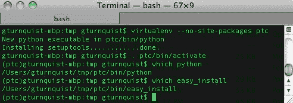

1.  对于 Windows 平台，您可以选择要创建`ptc`文件夹的文件夹，或者直接在所需的驱动器中创建它。看一下这个截图：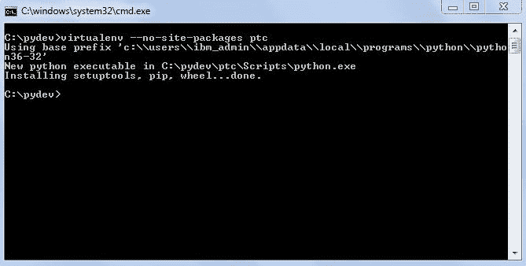

1.  最后，通过检查`pip`的路径来验证环境是否处于活动状态。

有关`virtualenv`的用法和好处的更多信息，请阅读[`iamzed.com/2009/05/07/a-primer-on-virtualenv`](http://iamzed.com/2009/05/07/a-primer-on-virtualenv)。

# 断言基础知识

自动化 unittest 测试用例的基本概念是实例化我们代码的一部分，对其进行操作，并使用断言验证某些结果：

+   如果结果符合预期，unittest 将计为测试成功

+   如果结果不匹配，将引发异常，并且 unittest 将计为测试失败

# 准备工作

Unittest 已添加到 Python 的标准库套件中，不需要任何额外的安装。

# 如何做...

通过这些步骤，我们将编写一个简单的程序，然后使用 unittest 编写一些自动化测试：

1.  为这个配方的代码创建一个名为`recipe1.py`的新文件。选择一个要测试的类。这被称为**被测试的类**。对于这个配方，我们将选择一个使用简单的罗马数字转换器的类：

```py
class RomanNumeralConverter(object):
    def __init__ (self, roman_numeral): 
        self.roman_numeral = roman_numeral 
        self.digit_map = {"M":1000, "D":500,"C":100,\
                         "L":50, "X":10, "V":5, "I":1} 
     def convert_to_decimal(self): 
        val = 0 
        for char in self.roman_numeral: 
            val += self.digit_map[char] 
        return val 
```

这个罗马数字转换器应用了简单的加法规则，但它没有特殊的减法模式，比如`XL`映射到`40`。目的不是要有最好的罗马数字转换器，而是观察各种测试断言。

1.  编写一个新的类，并给它加上`Test`，继承`unittest.TestCase`。在测试类后面加上`Test`是一种常见的约定，但不是必需的。扩展`unittest.TestCase`是需要的，以便连接到 unittest 的标准测试运行器：

```py
import unittest 
class RomanNumeralConverterTest(unittest.TestCase): 
```

1.  创建几个以`test`开头的方法，这样它们就会被 unittest 的测试用例自动捕捉到：

```py
     def test_parsing_millenia(self):
        value =RomanNumeralConverter("M") 
        self.assertEqual(1000, value.convert_to_decimal()) 
     def test_parsing_century(self): 
        value =RomanNumeralConverter("C") 
        self.assertEqual(100, value.convert_to_decimal()) 
     def test_parsing_half_century(self): 
        value =RomanNumeralConverter("L") 
        self.assertEqual(50, value.convert_to_decimal()) 
     def test_parsing_decade(self): 
        value =RomanNumeralConverter("X") 
        self.assertEqual(10, value.convert_to_decimal()) 
     def test_parsing_half_decade(self): 
        value =RomanNumeralConverter("V") 
        self.assertEqual(5, value.convert_to_decimal()) 
     def test_parsing_one(self): 
        value = RomanNumeralConverter("I") 
        self.assertEqual(1, value.convert_to_decimal()) 
     def test_empty_roman_numeral(self): 
        value =RomanNumeralConverter("") 
        self.assertTrue(value.convert_to_decimal() == 0) 
        self.assertFalse(value.convert_to_decimal() > 0) 
     def test_no_roman_numeral(self): 
        value =RomanNumeralConverter(None) 
        self.assertRaises(TypeError, value.convert_to_decimal) 
```

1.  使整个脚本可运行，然后使用 unittest 的测试运行器：

```py
if __name__=="__main__": 
    unittest.main()
```

1.  从命令行运行文件，如下截图所示：

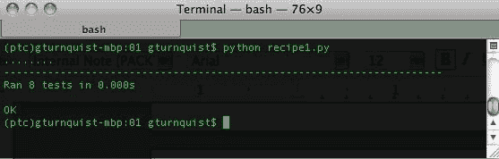`self.assertEquals()`在 Python 3 中已被弃用。

# 它是如何工作的...

在第一步中，我们选择了一个要测试的类。接下来，我们创建了一个单独的测试类。通过将测试类命名为`[class under test]Test`，很容易知道哪个类正在被测试。每个测试方法的名称必须以`test`开头，这样 unittest 会自动捕捉并运行它。要添加更多的测试，只需定义更多的`test`方法。这些测试利用了各种断言：

+   `assertEqual(first, second[, msg])`: 比较第一个和第二个表达式，如果它们的值不相同则失败。如果失败，我们可以选择打印特殊消息。

+   `assertTrue(expression[, msg])`: 测试表达式，如果为假则失败。如果失败，我们可以选择打印特殊消息。

+   `assertFalse(expression[, msg])`: 测试表达式，如果为真则失败。如果失败，我们可以选择打印特殊消息。

+   `assertRaises(exception, callable, ...)`: 用任何参数运行 callable，对于之后列出的 callable，如果它没有引发异常，则失败。

# 还有更多...

Unittest 提供了许多断言、失败和其他方便的选项。以下部分展示了如何从这些选项中进行选择和挑选的一些建议。

# assertEquals 优于 assertTrue 和 assertFalse

当`assertEquals`断言失败时，错误报告中会打印第一个和第二个值，从而更好地反馈出了问题所在，而`assertTrue`和`assertFalse`只会报告失败。并非所有可测试的结果都适用于这种情况，但如果可能的话，使用`assertEquals`。

理解相等的概念很重要。当比较整数、字符串和其他标量时，这很简单。但是对于诸如字典、列表和集合之类的集合，情况就不那么理想了。复杂的、自定义的对象可能具有自定义的相等定义。这些复杂的对象可能需要更精细的断言。因此，当使用自定义对象时，最好也包括一些直接针对相等性和不相等性的测试方法。

# self.fail([msg])通常可以用断言重写

Unittest 有一个`self.fail([msg])`操作，可以无条件地导致测试失败，并附带一个可选的消息。之前没有展示这个操作，因为不建议使用。

`fail`方法通常用于检测异常等特定情况。一个常见的习惯用法如下：

```py
import unittest 
class BadTest(unittest.TestCase): 
  def test_no_roman_number(self): 
    value = RomanNumeralConverter(None) 
    try: 
      value.convert_to_decimal() 
      self.fail("Expected a TypeError") 
    except TypeError: 
      pass 
    if  __name__=="__main__": 
      unittest.main()
```

这测试了与之前的`test_no_roman_numeral`相同的行为。这种方法的问题在于当代码正常工作时，fail 方法永远不会被执行。定期不执行的代码有可能变得过时和无效。这也会干扰覆盖率报告。因此，最好使用像我们在前面的例子中使用的`assertRaises`。对于其他情况，考虑使用其他断言重写测试。

# 我们的 Python 版本可能会影响我们的选项

Python 官方关于 unittest 的文档显示了许多其他断言；然而，它们取决于我们使用的 Python 版本。有些已经被弃用；其他一些只在以后的版本中可用，比如 Python 3.6。

如果我们的代码必须支持多个版本的 Python，那么我们必须使用最低公共分母。这个配方展示了自 Python 3.6 以来所有版本都可用的核心断言。

# 设置和拆卸测试工具

Unittest 提供了一种简单的机制来配置系统的状态，当一段代码经过测试时。如果需要，它还允许我们在之后清理事物。当一个特定的测试用例在每个测试方法中使用重复步骤时，通常会需要这样做。

除了引用从一个测试方法到下一个测试方法传递状态的外部变量或资源，每个测试方法都从相同的状态开始。

# 如何做...

通过以下步骤，我们将为每个测试方法设置和拆卸测试工具：

1.  为这个配方的代码创建一个名为`recipe2.py`的新文件。

1.  选择一个要测试的类。在这种情况下，我们将使用我们的罗马数字转换器的一个稍微改变的版本，其中函数而不是构造函数提供要转换的输入值：

```py
class RomanNumeralConverter(object): 
    def __init__(self): 
        self.digit_map = {"M":1000, "D":500, "C":100,\
                         "L":50, "X":10, "V":5, "I":1} 
    def convert_to_decimal(self, roman_numeral):
        val = 0 
        for char in roman_numeral: 
            val += self.digit_map[char] 
        return val 
```

1.  使用与被测试类相同的名称创建一个测试类，在末尾添加`Test`：

```py
import unittest 
class RomanNumeralConverterTest(unittest.TestCase): 
```

1.  创建一个`setUp`方法，用于创建被测试类的实例：

```py
    def setUp(self): 
        print ("Creating a new RomanNumeralConverter...") 
        self.cvt =RomanNumeralConverter()
```

1.  创建一个`tearDown`方法，用于销毁被测试类的实例：

```py
     def tearDown(self): 
        print ("Destroying the RomanNumeralConverter...") 
        self.cvt = None 
```

1.  使用`self.converter`创建所有测试方法：

```py
     def test_parsing_millenia(self):
        self.assertEqual(1000,\
                         self.cvt.convert_to_decimal("M")) 
     def test_parsing_century(self): 
        self.assertEqual(100, \
                          self.cvt.convert_to_decimal("C")) 
     def test_parsing_half_century(self): 
        self.assertEqual(50,\
                         self.cvt.convert_to_decimal("L")) 
     def test_parsing_decade(self): 
        self.assertEqual(10,self.cvt.convert_to_decimal("X")) 
     def test_parsing_half_decade(self): 
        self.assertEqual(5,self.cvt.convert_to_decimal("V")) 
     def test_parsing_one(self): 
        self.assertEqual(1,self.cvt.convert_to_decimal("I")) 
     def test_empty_roman_numeral(self): 
        self.assertTrue(self.cvt.convert_to_decimal() == 0) 
        self.assertFalse(self.cvt.convert_to_decimal() > 0) 
     def test_no_roman_numeral(self): 
        self.assertRaises(TypeError,\
                          self.cvt.convert_to_decimal,None)
```

1.  使整个脚本可运行，然后使用 unittest 的测试运行程序：

```py
if __name__=="__main__": 
     unittest.main()
```

1.  从命令行运行文件，如下截图所示：

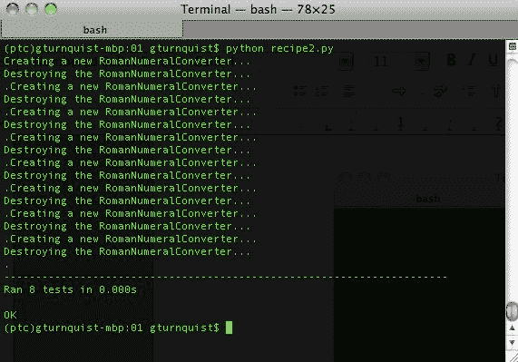

# 它是如何工作的...

在第一步中，我们选择了一个要测试的类。接下来，我们创建了一个单独的测试类。通过将测试类命名为`[class under test]Test`，很容易知道哪个类正在被测试。

然后，我们定义了一个`setUp`方法，unittest 在每个`Test`方法之前运行。接下来，我们创建了一个`tearDown`方法，unittest 在每个`Test`方法之后运行。在这种情况下，我们在每个方法中添加了一个打印语句，以演示 unittest 重新运行这两个方法以进行每个测试方法。实际上，这可能会给我们的测试添加太多噪音。

unittest 的一个不足之处是缺少`setUpClass`/`tearDownClass`和`setUpModule`/`tearDownModule`，这提供了在比测试方法级别更大的范围内运行代码的机会。这已经添加到`unittest2`中。

**每个测试用例可以有一个 setUp 和一个 tearDown 方法：**我们的`RomanNumeralConverter`非常简单，很容易适应一个单独的测试类。但是测试类只允许一个`setUp`方法和一个`tearDown`方法。如果需要不同组合的`setUp`/`tearDown`方法来进行各种测试场景，那么这就是编写更多测试类的线索。仅仅因为我们编写了一个`setUp`方法，并不意味着我们需要一个`tearDown`方法。在我们的情况下，我们可以跳过销毁`RomanNumeralConverter`，因为一个新实例将替换它用于每个测试方法。这只是为了演示目的。那些需要`tearDown`方法的其他用例有哪些其他用途？使用需要某种关闭操作的库是编写`tearDown`方法的一个很好的候选者。

# 从命令行运行测试用例

很容易调整测试运行程序，以便在运行时打印出每个测试方法。

# 如何做...

在接下来的步骤中，我们将以更详细的输出运行测试用例，以便更好地了解事物的运行情况：

1.  为这个配方的代码创建一个名为`recipe3.py`的新文件。

1.  选择一个要测试的类。在这种情况下，我们将使用我们的罗马数字转换器：

```py
class RomanNumeralConverter(object): 
    def __init__(self, roman_numeral): 
        self.roman_numeral = roman_numeral 
        self.digit_map = {"M":1000, "D":500, "C":100, "L":50,\
                           "X":10,"V":5, "I":1} 

    def convert_to_decimal(self):
        val = 0 
        for char in self.roman_numeral:
            val += self.digit_map[char] 
        return val
```

1.  使用与被测试类相同的名称创建一个测试类，在末尾添加`Test`：

```py
import unittest
class RomanNumeralConverterTest(unittest.TestCase): 
```

1.  创建几个测试方法。对于这个配方，第二个测试故意编码失败：

```py
def test_parsing_millenia(self): 
    value =RomanNumeralConverter("M") 
    self.assertEqual(1000, value.convert_to_decimal()) 

def test_parsing_century(self): 
    "This test method is coded to fail for demo."
     value =RomanNumeralConverter("C") 
     self.assertEqual(10, value.convert_to_decimal()) 
```

1.  定义一个测试套件，它自动加载所有测试方法，然后以更高级别的详细程度运行它们：

```py
if __name__== "__main__": 
    suite = unittest.TestLoader().loadTestsFromTestCase(\
              RomanNumeralConverterTest) 
    unittest.TextTestRunner(verbosity=2).run(suite) 
```

1.  从命令行运行文件。请注意，在这个截图中，失败的测试方法打印出其 Python 文档字符串：

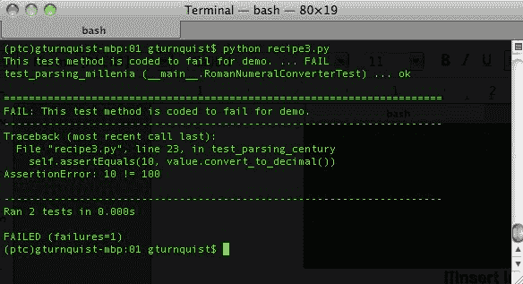

# 工作原理...

自动化测试的关键部分是组织测试。基本单元称为**测试用例**。这些可以组合成**测试套件**。Python 的 unittest 模块提供了`TestLoader().loadTestsFromTestCase`，可以自动将所有`test*`方法加载到一个测试套件中。然后通过 unittest 的`TextTestRunner`以更高级别的详细程度运行这个测试套件。

`TextTestRunner`是 unittest 的唯一测试运行器。在本书的后面，我们将看到其他具有不同运行器的测试工具，包括插入不同 unittest 测试运行器的运行器。

前面的截图显示了每个方法以及其模块和类名，以及成功/失败。

# 还有更多...

这个配方不仅演示了如何提高运行测试的详细程度，还展示了当测试用例失败时会发生什么。它将`test`方法重命名为嵌入在`test`方法中的文档字符串，并在所有测试方法报告后打印详细信息。

# 运行测试用例方法的子集

有时，只运行给定测试用例中的一部分测试方法很方便。这个配方将展示如何从命令行运行整个测试用例，或者选择一个子集。

# 如何做...

以下步骤显示了如何编写一个命令行脚本来运行测试的子集：

1.  创建一个名为`recipe4.py`的新文件，放置这个配方的所有代码。

1.  选择一个要测试的类。在这种情况下，我们将使用我们的罗马数字转换器：

```py
class RomanNumeralConverter(object):
    def __init__(self, roman_numeral): 
        self.roman_numeral = roman_numeral 
        self.digit_map = {"M":1000, "D":500,\
                        "C":100, "L":50, "X":10, "V":5, "I":1} 

    def convert_to_decimal(self):
        val = 0 
        for char in self.roman_numeral: 
            val+=self.digit_map[char]
        return val
```

1.  使用与要测试的类相同的名称创建一个测试类，并在末尾添加`Test`：

```py
import unittest 
class RomanNumeralConverterTest(unittest.TestCase): 
```

1.  创建几个`test`方法：

```py
    def test_parsing_millenia(self):
        value = RomanNumeralConverter("M") 
        self.assertEquals(1000, value.convert_to_decimal()) 

    def test_parsing_century(self):
        value = RomanNumeralConverter("C") 
        self.assertEquals(100, value.convert_to_decimal()) 
```

1.  编写一个主运行程序，要么运行整个测试用例，要么接受可变数量的测试方法：

```py
if __name__= "__main__":
    import sys
    suite = unittest.TestSuite()
    if len(sys.argv) == 1:
        suite = unittest.TestLoader().loadTestsFromTestCase(\                                                                       RomanNumeralConverterTest) 
    else: 
        for test_name in sys.argv[1:]:
            suite.addTest(RomanNumeralConverterTest(test_name))

    unittest.TextTestRunner(verbosity=2).run(suite) 
```

1.  不带额外命令行参数运行该配方，并查看它运行所有测试，如此截图所示：

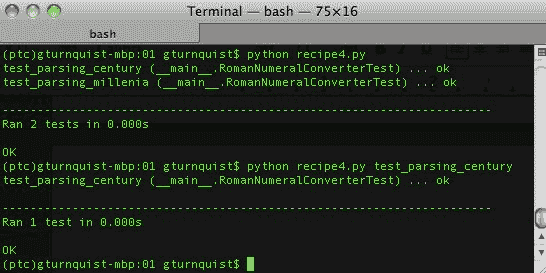

# 工作原理...

对于这个测试用例，我们编写了几个测试方法。但是，我们没有简单地运行所有测试，或者定义一个固定的列表，而是使用 Python 的`sys`库来解析命令行参数。如果没有额外的参数，它将运行整个测试用例。如果有额外的参数，那么它们被假定为测试方法名称。它使用 unittest 的内置能力在实例化`RomanNumeralConverterTest`时指定测试方法名称。

# 将一系列测试链接在一起

Unittest 使得将测试用例链接成`TestSuite`变得很容易。`TestSuite`可以像`TestCase`一样运行，但它还提供了额外的功能来添加单个/多个测试，并对其进行计数。

为什么我们需要这个？将测试链接成一个套件使我们能够将多个测试用例模块汇集到一个测试运行中，以及挑选和选择测试用例的子集。到目前为止，我们通常运行单个类中的所有测试方法。`TestSuite`给我们提供了一个替代方法来定义一个测试块。

# 如何做...

在接下来的步骤中，我们将编写多个测试用例类，然后将它们的测试方法加载到套件中，以便我们可以运行它们：

1.  创建一个名为`recipe5.py`的新文件，放置我们的示例应用程序和测试用例。

1.  选择一个要测试的类。在这种情况下，我们将使用我们的罗马数字转换器：

```py
class RomanNumeralConverter(object): 
    def __init__(self): 
            self.digit_map = {"M":1000, "D":500,\
                        "C":100, "L":50, "X":10, "V":5, "I":1} 

    def convert_to_decimal(self, roman_numeral):
            val = 0 
            for char in roman_numeral: 
                val += self.digit_map[char] 
            return val 
```

1.  创建两个测试类，它们之间分布着各种测试方法：

```py
import unittest 
class RomanNumeralConverterTest(unittest.TestCase): 
    def setUp(self): 
        self.cvt = RomanNumeralConverter()
    def test_parsing_millenia(self): 
        self.assertEquals(1000, \ 
                    self.cvt.convert_to_decimal("M")) 

    def test_parsing_century(self): 
        self.assertEquals(100, \ 
                    self.cvt.convert_to_decimal("C")) 

class RomanNumeralComboTest(unittest.TestCase):
    def setUp(self):
        self.cvt=RomanNumeralConverter()
    def test_multi_millenia(self):
        self.assertEquals(4000,\
    def test_multi_add_up(self): 
        self.assertEquals(2010, \ 
        self.cvt.convert_to_decimal("MMX"))
```

1.  在一个名为`recipe5_runner.py`的单独文件中创建一个测试运行器，它引入了两个测试用例：

```py
if __name__ == "__main__": 
    import unittest 
    from recipe5 import * 
    suite1 = unittest.TestLoader().loadTestsFromTestCase( \  
                RomanNumeralConverterTest) 
    suite2 = unittest.TestLoader().loadTestsFromTestCase( \ 
                RomanNumeralComboTest) 
    suite = unittest.TestSuite([suite1, suite2])     
    unittest.TextTestRunner(verbosity=2).run(suite)
```

1.  执行测试运行器，并从这个截图中观察到测试是如何从两个测试用例中提取出来的。

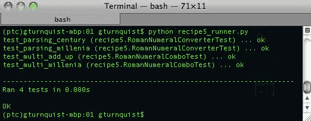

# 工作原理...

unittest 模块提供了一种方便的方法，可以找到`TestClass`中的所有测试方法，并使用其`loadTestsFromTestCase`将它们捆绑在一起作为一个套件。为了进一步使用测试套件，我们能够将这两个套件组合成一个单一的套件，使用`unittest.TestSuite([list...])`。`TestSuite`类被设计为像`TestCase`类一样运行，尽管它不是`TestClass`的子类，但允许我们使用`TextTestRunner`来运行它。这个配方显示了详细程度的提高，让我们能够看到确切运行了哪些测试方法，以及它们来自哪个测试用例。

# 还有更多...

在这个配方中，我们从一个不同的文件中运行了测试，而不是测试用例被定义的文件。这与以前的配方不同，以前的配方中可运行的代码和测试用例都包含在同一个文件中。由于运行器定义了我们要运行的测试，我们可以轻松地创建更多的运行器，结合不同的测试套件。

# 测试用例的名称应该有意义

在以前的配方中，建议将测试用例命名为`[要测试的类]Test`。这是为了让读者明白，被测试的类和相关的测试之间有重要的关系。现在我们引入了另一个测试用例，我们需要选择一个不同的名称。名称应该清楚地解释为什么这些特定的测试方法被拆分到一个单独的类中。对于这个配方，这些方法被拆分出来以展示更复杂的罗马数字组合。

# 在测试模块内定义测试套件

每个测试模块可以提供一个或多个方法，定义不同的测试套件。一个方法可以在给定模块中执行所有测试，另一个方法可以定义一个特定的子集。

# 如何做...

通过以下步骤，我们将创建一些方法，使用不同的方式定义测试套件：

1.  创建一个名为`recipe6.py`的新文件，以放置我们这个配方的代码。

1.  选择一个要测试的类。在这种情况下，我们将使用我们的罗马数字转换器：

```py
class RomanNumeralConverter(object): 
    def __init__(self): 
        self.digit_map = {"M":1000, "D":500, "C":100, "L":50, "X":10, "V":5, "I":1} 

    def convert_to_decimal(self, roman_numeral): 
    val = 0 
    for char in roman_numeral: 
        val += self.digit_map[char] 
    return val 
```

1.  使用与要测试的类相同的名称创建一个测试类，并在末尾添加`Test`：

```py
import unittest 
class RomanNumeralConverterTest(unittest.TestCase): 
```

1.  编写一系列测试方法，包括一个`setUp`方法，为每个测试方法创建一个`RomanNumeralConverter`的新实例：

```py
import unittest 

class RomanNumeralConverterTest(unittest.TestCase): 
    def setUp(self): 
        self.cvt = RomanNumeralConverter() 

    def test_parsing_millenia(self): 
        self.assertEquals(1000, \ 
             self.cvt.convert_to_decimal("M")) 

    def test_parsing_century(self): 
        self.assertEquals(100, \ 
            self.cvt.convert_to_decimal("C")) 

    def test_parsing_half_century(self): 
        self.assertEquals(50, \ 
            self.cvt.convert_to_decimal("L")) 

    def test_parsing_decade(self): 
        self.assertEquals(10, \ 
            self.cvt.convert_to_decimal("X")) 

    def test_parsing_half_decade(self): 
        self.assertEquals(5, self.cvt.convert_to_decimal("V")) 

    def test_parsing_one(self): 
        self.assertEquals(1, self.cvt.convert_to_decimal("I")) 

    def test_empty_roman_numeral(self):     
        self.assertTrue(self.cvt.convert_to_decimal("") == 0) 
        self.assertFalse(self.cvt.convert_to_decimal("") > 0) 

    def test_no_roman_numeral(self): 
        self.assertRaises(TypeError, \ 
            self.cvt.convert_to_decimal, None) 

    def test_combo1(self): 
        self.assertEquals(4000, \ 
            self.cvt.convert_to_decimal("MMMM")) 

    def test_combo2(self): 
        self.assertEquals(2010, \ 
            self.cvt.convert_to_decimal("MMX")) 

    def test_combo3(self): 
        self.assertEquals(4668, \ 
            self.cvt.convert_to_decimal("MMMMDCLXVIII")) 
```

1.  在配方模块中创建一些方法（但不在测试用例中），定义不同的测试套件：

```py
def high_and_low(): 
    suite = unittest.TestSuite() 
    suite.addTest(\ 
        RomanNumeralConverterTest("test_parsing_millenia"))    
    suite.addTest(\ 
        RomanNumeralConverterTest("test_parsing_one")) return suite 
def combos(): 
    return unittest.TestSuite(map(RomanNumeralConverterTest,\    
        ["test_combo1", "test_combo2", "test_combo3"])) 
def all(): 
    return unittest.TestLoader().loadTestsFromTestCase(\   
            RomanNumeralConverterTest) 
```

1.  创建一个运行器，它将遍历每个测试套件并通过 unittest 的`TextTestRunner`运行它们：

```py
if __name__ == "__main__": 
    for suite_func in [high_and_low, combos, all]: 
        print ("Running test suite '%s'" % suite_func.__name__)  
        suite = suite_func()    
        unittest.TextTestRunner(verbosity=2).run(suite)
```

1.  运行测试套件的组合，并查看结果。看一下这个截图：

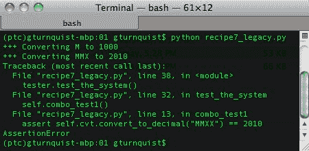

# 它是如何工作的...

我们选择一个要测试的类，并定义一些测试方法来检查事情。然后我们定义一些模块级别的方法，比如`high_and_low`，`combos`和`all`，来定义测试套件。其中两个包含固定的方法子集，而`all`动态加载类中的`test*`方法。最后，我们的模块的主要部分遍历所有这些生成套件的函数的列表，以顺利地创建和运行它们。

# 还有更多...

我们所有的测试套件都是从配方的主运行器中运行的。但这可能不适用于一个真正的项目。相反，想法是定义不同的套件，并编写一个机制来选择要运行的套件。每个套件都针对不同的目的，有必要允许开发人员选择要运行的套件。这可以通过使用 Python 的 optparse 模块编写一个命令行脚本来完成，以定义命令行标志来选择其中一个套件。

# 测试套件方法必须在测试类之外

如果我们将这些定义套件的方法作为测试类的成员，我们将不得不实例化测试类。扩展`unittest.TestCase`的类具有一个专门的`init`方法，它与仅用于调用非测试方法的实例不兼容。这就是为什么这些方法在测试类之外的原因。虽然这些方法可以在其他模块中，但在包含测试代码的模块内定义它们非常方便，以保持它们的接近性。

# 为什么有不同的测试套件？

如果我们一开始就运行所有测试项目会怎样？听起来是个好主意，对吧？但是如果运行整个测试套件的时间增长到一个小时以上怎么办？在一定的阈值之后，开发人员往往会停止运行测试，*没有比未运行的测试套件更糟糕的了*。通过定义测试的子集，可以轻松地在白天运行备用套件，然后也许每天运行一次全面的测试套件。请记住以下几点：

+   `all`是全面的测试套件

+   `high_and_low`是测试边缘情况的一个例子

+   `combos`是用于显示事物通常工作的值的随机抽样

定义我们的测试套件是一个判断。每隔一段时间重新评估每个测试套件也是值得的。如果一个测试套件运行成本太高，考虑将一些更昂贵的测试移到另一个套件中。

# optparse 正在被淘汰，并被 argparse 替代

虽然`optparse`是向 Python 脚本添加命令行标志的一种方便方式，但它不会永远可用。Python 2.7 已经弃用了这个模块，并在`argparse`中继续开发。

# 重新调整旧的测试代码以在 unittest 中运行

有时，我们可能已经开发了演示代码来测试我们的系统。我们不必重写它以在 unittest 中运行。相反，将它连接到测试框架并进行一些小的更改即可轻松运行。

# 如何做...

通过这些步骤，我们将深入捕获那些没有使用 unittest 编写的测试代码，并以最小的努力重新用途化它们以在 unittest 中运行：

1.  创建一个名为`recipe7.py`的文件，用于放置我们将要测试的应用程序代码。

1.  选择一个要测试的类。在这种情况下，我们将使用我们的罗马数字转换器：

```py
class RomanNumeralConverter(object): 
    def __init__(self): 
        self.digit_map = {"M":1000, "D":500, "C":100, "L":50, "X":10, "V":5, "I":1} 

    def convert_to_decimal(self, roman_numeral): 
        val = 0 
        for char in roman_numeral: 
            val += self.digit_map[char] 
        return val 
```

1.  创建一个名为`recipe7_legacy.py`的新文件，其中包含不使用 unittest 模块的测试代码。

1.  创建一组遗留测试，根据 Python 的`assert`函数编码，而不是使用 unittest，以及一个运行器：

```py
from recipe7 import * 
class RomanNumeralTester(object): 
  def   init  (self): 
    self.cvt = RomanNumeralConverter() 
  def simple_test(self):
    print ("+++ Converting M to 1000")
    assert self.cvt.convert_to_decimal("M") == 1000
  def combo_test1(self): 
    print ("+++ Converting MMX to 2010") 
    assert self.cvt.convert_to_decimal("MMXX") == 2010 
  def combo_test2(self): 
    print ("+++ Converting MMMMDCLXVIII to 4668") 
    val = self.cvt.convert_to_decimal("MMMMDCLXVII")         
    self.check(val, 4668) 
  def other_test(self): 
    print ("+++ Converting MMMM to 4000") 
    val = self.cvt.convert_to_decimal("MMMM") 
    self.check(val, 4000) 
  def check(self, actual, expected): 
    if (actual != expected): 
      raise AssertionError("%s doesn't equal %s" % \ 
            (actual,  expected)) 
  def test_the_system(self): 
    self.simple_test() 
    self.combo_test1() 
    self.combo_test2() 
    self.other_test() 
if __name == "__main__": 
  tester = RomanNumeralTester() 
  tester.test_the_system()
```

这组遗留测试旨在代表我们团队在 unittest 成为一个选择之前开发的遗留测试代码。

1.  运行遗留测试。这种情况有什么问题？所有测试方法都运行了吗？我们有没有捕捉到所有的 bug？看一下这个截图：

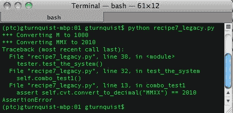

1.  创建一个名为`recipe7_pyunit.py`的新文件。

1.  创建一个 unittest 测试集，将每个遗留测试方法包装在 unittest 的`FunctionTestCase`中：

```py
from recipe7 import * 
from recipe7_legacy import * import unittest 

if __name__ == "__main__":  
    tester = RomanNumeralTester() 
    suite = unittest.TestSuite() 
    for test in [tester.simple_test, tester.combo_test1, \ 
            tester.combo_test2, tester.other_test]: 
        testcase = unittest.FunctionTestCase(test)   
        suite.addTest(testcase) 
    unittest.TextTestRunner(verbosity=2).run(suite)
```

1.  运行 unittest 测试。这次所有测试都运行了吗？哪个测试失败了？bug 在哪里？看一下这个截图：

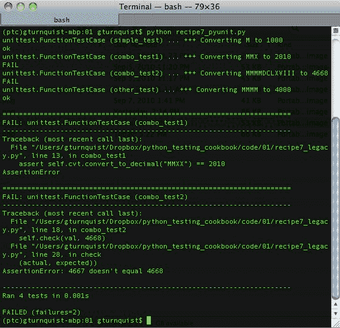

# 它是如何工作的...

Python 提供了一个方便的断言语句来测试条件。当条件为真时，代码继续执行。当条件为假时，它会引发`AssertionError`。在第一个测试运行器中，我们有几个测试，使用`assert`语句或引发`AssertionError`来检查结果。

unittest 提供了一个方便的类，`unittest.FunctionTestCase`，它将绑定的函数包装为 unittest 测试用例。如果抛出`AssertionError`，`FunctionTestCase`会捕获它，将其标记为测试*失败*，然后继续下一个测试用例。如果抛出任何其他类型的异常，它将被标记为测试错误。在第二个测试运行器中，我们使用`FunctionTestCase`包装每个这些遗留测试方法，并将它们链接在一起，以便 unittest 运行。

通过运行第二个测试运行，可以看到第三个测试方法中隐藏着一个 bug。我们之前并不知道这个 bug，因为测试套件被过早中断了。

Python 的`assert`语句的另一个不足之处可以从前面的截图中的第一个失败中看出。当断言失败时，几乎没有关于被比较的值的信息。我们只有它失败的代码行。截图中的第二个断言更有用，因为我们编写了一个自定义检查器，它抛出了一个自定义的`AssertionError`。

# 还有更多...

Unittest 不仅仅是运行测试。它有一个内置的机制来捕获错误和失败，然后尽可能多地继续运行我们的测试套件。这有助于我们在给定的测试运行中摆脱更多的错误并修复更多的问题。当测试套件增长到需要花费几分钟甚至几小时才能运行时，这一点尤为重要。

# 错误在哪里？

它们存在于测试方法中，并且基本上是通过对被转换的罗马数字进行轻微修改而产生的，如代码所示：

```py
def combo_test1(self): 
    print ("+++ Converting MMX to 2010") 
    assert self.cvt.convert_to_decimal("MMXX") == 2010 
def combo_test2(self): 
    print ("+++ Converting MMMMDCLXVIII to 4668")
    val = self.cvt.convert_to_decimal("MMMMDCLXVII") 
    self.check(val, 4668) 
```

`combo_test1`测试方法打印出正在转换`MMX`，但实际上尝试转换`MMXX`。`combo_test2`测试方法打印出正在转换`MMMMDCLXVIII`，但实际上尝试转换`MMMMDCLXVII`。

这是一个刻意的例子，但你是否曾经遇到过同样小的错误，让你疯狂地试图追踪它们？关键是，显示追踪它们有多容易或多困难取决于如何检查值。Python 的`assert`语句在告诉我们在哪里比较值方面并不是很有效。自定义的`check`方法在指出`combo_test2`的问题方面要好得多。

这突显了使用注释或打印语句来反映断言所做的事情的问题。它们很容易失去同步，开发人员可能会在追踪错误时遇到一些问题。避免这种情况被称为**DRY**原则（**不要重复自己**）。

# FunctionTestCase 是一个临时措施

`FunctionTestCase`是一个测试用例，它提供了一种快速迁移基于 Python 的`assert`语句的测试的简单方法，因此它们可以与 unittest 一起运行。但事情不应该止步于此。如果我们花时间将`RomanNumeralTester`转换为 unittest 的`TestCase`，那么我们就可以使用`TestCase`提供的其他有用功能，比如各种`assert*`方法。这是一个很好的投资。`FunctionTestCase`只是降低了迁移到 unittest 的门槛。

# 将模糊测试拆分为简单测试

Unittest 提供了通过一系列断言来测试代码的手段。我经常感到诱惑，想在单个测试方法中测试代码的许多方面。如果任何部分失败，哪一部分失败就变得模糊了。最好将事情分解成几个较小的测试方法，这样当被测试的代码的某些部分失败时，就很明显了。

# 如何做到...

通过这些步骤，我们将调查将太多内容放入单个测试方法时会发生什么：

1.  创建一个名为`recipe8.py`的新文件，用于放置此配方的应用代码。

1.  选择一个要测试的类。在这种情况下，我们将使用罗马数字转换器的另一种版本，它可以双向转换：

```py
class RomanNumeralConverter(object): 
    def __init__(self): 
        self.digit_map = {"M":1000, "D":500, "C":100, "L":50, "X":10, "V":5, "I":1} 

    def convert_to_decimal(self, roman_numeral): 
        val = 0 
        for char in roman_numeral: 
        val += self.digit_map[char] 
    return val 

    def convert_to_roman(self, decimal): 
        val = "" 
    while decimal > 1000: 
        val += "M" 
        decimal -= 1000 
    while decimal > 500: 
        val += "D"
        decimal -= 500 
    while decimal > 100: 
        val += "C" 
        decimal -= 100 
    while decimal > 50: 
        val += "L" 
        decimal -= 50 
    while decimal > 10: 
        val += "X" 
        decimal -= 10 
    while decimal > 5: 
        val += "V" 
        decimal -= 5 
    while decimal > 1: 
        val += "I" 
        decimal -= 1 
    return val 
```

1.  创建一个名为`recipe8_obscure.py`的新文件，以放置一些更长的测试方法。

1.  创建一些结合了几个测试断言的测试方法：

```py
import unittest 
from recipe8 import * 

class RomanNumeralTest(unittest.TestCase): 
    def setUp(self): 
        self.cvt = RomanNumeralConverter() 

    def test_convert_to_decimal(self): 
        self.assertEquals(0, self.cvt.convert_to_decimal(""))     
        self.assertEquals(1, self.cvt.convert_to_decimal("I"))    
        self.assertEquals(2010, \ 
            self.cvt.convert_to_decimal("MMX")) 
        self.assertEquals(4000, \ 
            self.cvt.convert_to_decimal("MMMM")) 
    def test_convert_to_roman(self): 
        self.assertEquals("", self.cvt.convert_to_roman(0)) 
        self.assertEquals("II", self.cvt.convert_to_roman(2))     
        self.assertEquals("V", self.cvt.convert_to_roman(5))    
        self.assertEquals("XII", \ 
            self.cvt.convert_to_roman(12)) 
        self.assertEquals("MMX", \ 
            self.cvt.convert_to_roman(2010)) 
        self.assertEquals("MMMM", \ 
            self.cvt.convert_to_roman(4000))

if __name__ == "__main__":  
    unittest.main()
```

1.  运行模糊测试。为什么会失败？错误在哪里？报告说`II`不等于`I`，所以似乎有些问题。这是唯一的错误吗？创建另一个名为`recipe8_clear.py`的文件，以创建一组更精细的测试方法。看一下这个截图：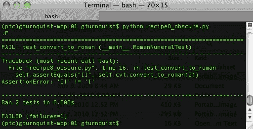

1.  将断言拆分为单独的测试方法，以提供更高的输出保真度：

```py
import unittest 
from recipe8 import * 

class RomanNumeralTest(unittest.TestCase): 
    def setUp(self): 
        self.cvt = RomanNumeralConverter() 

    def test_to_decimal1(self): 
        self.assertEquals(0, self.cvt.convert_to_decimal("")) 

    def test_to_decimal2(self): 
        self.assertEquals(1, self.cvt.convert_to_decimal("I")) 

    def test_to_decimal3(self): 
        self.assertEquals(2010, \ 
            self.cvt.convert_to_decimal("MMX")) 

    def test_to_decimal4(self): 
        self.assertEquals(4000, \ 
            self.cvt.convert_to_decimal("MMMM")) 

    def test_convert_to_roman1(self): 
        self.assertEquals("", self.cvt.convert_to_roman(0)) 

    def test_convert_to_roman2(self): 
        self.assertEquals("II", self.cvt.convert_to_roman(2)) 

    def test_convert_to_roman3(self): 
        self.assertEquals("V", self.cvt.convert_to_roman(5)) 

    def test_convert_to_roman4(self): 
        self.assertEquals("XII", \ 
                    self.cvt.convert_to_roman(12)) 

    def test_convert_to_roman5(self): 
        self.assertEquals("MMX", \ 
                    self.cvt.convert_to_roman(2010)) 

    def test_convert_to_roman6(self): 
        self.assertEquals("MMMM", \ 
                    self.cvt.convert_to_roman(4000)) 

if __name__ == "__main__": 
unittest.main() 
```

1.  运行更清晰的测试套件。现在错误的位置更清晰了吗？为了获得更高程度的测试失败，我们做出了什么样的交易？这样做值得吗？参考这个截图：

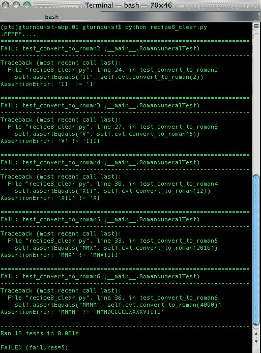

# 它是如何工作的...

在这种情况下，我们创建了一个修改后的罗马数字转换器，可以双向转换。然后我们开始创建测试方法来练习这些事情。由于这些测试都是简单的一行断言，将它们放在同一个测试方法中非常方便。

在第二个测试用例中，我们将每个断言放入一个单独的测试方法中。运行它会暴露出这个罗马数字转换器中存在多个错误。

# 还有更多...

当我们开始编写测试时，将所有这些断言捆绑到一个测试方法中非常方便。毕竟，如果一切正常，那就没有坏处，对吧？但是如果一切都*不*正常呢；我们要如何处理？一个晦涩的错误报告！

# 错误在哪里？

晦涩的测试运行器可能不够清晰。我们只能依靠`II != I`这并不多。线索是它只差一个。清晰的测试运行器提供更多线索。我们看到`V != IIII, XII != XI`，还有更多。这些失败显示了每个都差一个。

错误涉及 while 检查中的各种布尔条件：

```py
while decimal > 1000: 
while decimal > 500: 
while decimal > 100: 
while decimal > 50: 
while decimal > 10: 
while decimal > 5: 
while decimal > 1:
```

它应该测试*大于*或*等于*，而不是测试大于。这会导致它在计算最后一个罗马数字之前跳出。

# 测试方法的合适大小是多少？

在这个示例中，我们将事物分解为每个测试一个断言。但我不建议沿着这样的思路思考。

如果我们再仔细看一些，每个测试方法还涉及对罗马数字 API 的单一使用。对于转换器，在练习代码时只有一个结果需要检查。对于其他系统，输出可能更复杂。在同一个测试方法中使用多个断言来检查通过进行单次调用的结果是完全合理的。

当我们继续对罗马数字 API 进行更多调用时，它应该提示我们考虑将其拆分为一个新的测试方法。

这引发了一个问题：*什么是代码单元？*关于代码单元的定义以及什么样的单元测试才算是好的，一直存在着很多争论。有很多不同的观点。希望阅读本章并将其与本书中涵盖的其他测试策略进行权衡，将有助于您加强自己的观点，最终提高自己的测试技能。

# 单元测试与集成测试

Unittest 可以轻松帮助我们编写单元测试和集成测试。单元测试可以测试较小的代码块。在编写单元测试时，最好将测试保持尽可能小和细粒度。将测试分解为许多较小的测试通常是检测和定位错误的更好方法。

当我们提升到更高级别（如集成测试）时，有意义的是在一个测试方法中测试多个步骤。但只有在有足够的低级单元测试时才建议这样做。这将为我们提供一些线索，表明它是在单元级别出现了问题，还是存在一系列步骤导致了错误。

集成测试通常扩展到诸如外部系统之类的事物。例如，许多人认为单元测试不应该连接到数据库，与 LDAP 服务器通信或与其他系统交互。

仅仅因为我们使用了 unittest 并不意味着我们正在编写的测试就是单元测试。在本书的后面，我们将讨论 unittest 可以用来编写许多类型的测试，包括集成测试、冒烟测试以及其他类型的测试。

# 测试边缘情况

当我们编写自动化测试时，我们选择输入并断言预期的输出。测试输入的极限是很重要的，以确保我们的代码可以处理好和坏的输入。这也被称为**测试边界情况**。

# 如何做...

当我们深入研究这个示例时，我们将寻找好的边界进行测试：

1.  为这个示例创建一个名为`recipe9.py`的新文件。

1.  选择一个要测试的类。在这个示例中，我们将使用我们的罗马数字转换器的另一个变体。这个变体不处理大于`4000`的值：

```py
class RomanNumeralConverter(object): 
    def __init__(self): 
      self.digit_map = {"M":1000, "D":500, "C":100, "L":50, "X":10, "V":5, "I":1} 
    def convert_to_decimal(self, roman_numeral): 
        val = 0 
        for char in roman_numeral: 
            val += self.digit_map[char] 
        if val > 4000: 
        raise Exception("We don't handle values over 4000") 
    return val

    def convert_to_roman(self, decimal): 
        if decimal > 4000: 
            raise Exception("We don't handle values over 4000") 
        val = "" 
        mappers = [(1000,"M"), (500,"D"), (100,"C"), (50,"L"), 
(10,"X"), (5,"V"), (1,"I")] 
        for (mapper_dec, mapper_rom) in mappers: 
            while decimal >= mapper_dec: 
                val += mapper_rom 
                decimal -= mapper_dec 
        return val 
```

1.  创建一个测试用例，设置罗马数字转换器的实例：

```py
import unittest 

class RomanNumeralTest(unittest.TestCase): 
    def setUp(self): 
      self.cvt = RomanNumeralConverter() 
```

1.  添加几个测试方法，以测试转换为罗马数字表示法的边缘情况：

```py
def test_to_roman_bottom(self): 
    self.assertEquals("I", self.cvt.convert_to_roman(1))  

def test_to_roman_below_bottom(self): 
    self.assertEquals("", self.cvt.convert_to_roman(0)) 

def test_to_roman_negative_value(self): 
    self.assertEquals("", self.cvt.convert_to_roman(-1)) 

def test_to_roman_top(self): 
    self.assertEquals("MMMM", \ 
                self.cvt.convert_to_roman(4000)) 

def test_to_roman_above_top(self): 
    self.assertRaises(Exception, \ 
                self.cvt.convert_to_roman, 4001) 
```

1.  添加几个测试方法，以便测试转换为十进制表示法的边缘情况：

```py
def test_to_decimal_bottom(self): 
    self.assertEquals(1, self.cvt.convert_to_decimal("I")) 

def test_to_decimal_below_bottom(self): 
    self.assertEquals(0, self.cvt.convert_to_decimal("")) 

def test_to_decimal_top(self):  
    self.assertEquals(4000, \ 
                self.cvt.convert_to_decimal("MMMM")) 

def test_to_decimal_above_top(self):      
    self.assertRaises(Exception, \ 
                self.cvt.convert_to_decimal, "MMMMI")
```

1.  添加一些测试，以测试将十进制数转换为罗马数字的层次：

```py
def test_to_roman_tier1(self): 
    self.assertEquals("V", self.cvt.convert_to_roman(5)) 

def test_to_roman_tier2(self): 
    self.assertEquals("X", self.cvt.convert_to_roman(10)) 

def test_to_roman_tier3(self): 
    self.assertEquals("L", self.cvt.convert_to_roman(50)) 

def test_to_roman_tier4(self): 
    self.assertEquals("C", self.cvt.convert_to_roman(100)) 

def test_to_roman_tier5(self): 
    self.assertEquals("D", self.cvt.convert_to_roman(500)) 

def test_to_roman_tier6(self): 
    self.assertEquals("M", \ 
                self.cvt.convert_to_roman(1000)) 
```

1.  添加一些测试，输入意外值到罗马数字转换器：

```py
def test_to_roman_bad_inputs(self): 
    self.assertEquals("", self.cvt.convert_to_roman(None))     
    self.assertEquals("I", self.cvt.convert_to_roman(1.2)) 

def test_to_decimal_bad_inputs(self):   
    self.assertRaises(TypeError, \ 
                self.cvt.convert_to_decimal, None) 
    self.assertRaises(TypeError, \ 
                self.cvt.convert_to_decimal, 1.2) 
```

1.  添加一个单元测试运行器：

```py
if __name__ == "__main__": 
  unittest.main() 
```

1.  运行测试用例。看一下这个屏幕截图：

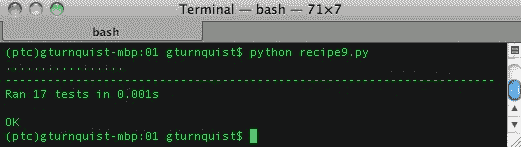

# 工作原理...

我们有一个专门的罗马数字转换器，只能转换到`MMMM`或`4000`的值。我们编写了几个测试方法来测试它。我们立即测试的边缘是`1`和`4000`。我们还为这之后的一步编写了一些测试：`0`和`4001`。为了使事情完整，我们还测试了`-1`。

# 还有更多...

算法的一个关键部分涉及处理各种层次的罗马数字（5、10、50、100、500 和 1000）。这些可以被认为是*微边缘*，所以我们编写了测试来检查代码是否也处理了这些情况。你认为我们应该测试一下微边缘之外的情况吗？

建议我们应该。许多错误是由于编码*大于*而不是*大于或等于*（或反之）等等而引发的。在边界之外进行测试，向两个方向进行测试，是确保事情正如预期的完美方式。我们还需要检查错误的输入，所以我们尝试转换`None`和`float`。

上面的陈述提出了一个重要的问题：*我们应该测试多少种无效类型*？因为 Python 是动态的，我们可以期望许多输入类型。那么，什么是合理的呢？如果我们的代码依赖于字典查找，比如我们的罗马数字 API 的某些部分，那么确认我们正确处理`KeyError`可能就足够了。如果所有不同类型的输入都导致`KeyError`，那么我们就不需要输入很多不同类型。

# 识别边缘很重要

识别系统的边缘很重要，因为我们需要知道我们的软件能够处理这些边界。我们还需要知道它能够处理这些边界的两侧，即好值和坏值。这就是为什么我们需要检查`4000`和`4001`以及`0`和`1`。这是软件经常出错的地方。

# 测试意外条件

这听起来有点别扭吗？预料之外的情况？我们的代码涉及将整数和字符串来回转换。所谓的意外情况，是指当有人使用我们的库时传递了我们没有预料到的边界或将其连接到接收比我们预期的更广泛类型的输入时传递的输入类型。

一个常见的误用情况是当我们的 API 的用户针对一个集合（如列表）进行操作，并意外地传递整个列表，而不是通过迭代传递单个值。另一个经常出现的情况是当我们的 API 的用户由于其代码中的某些其他错误而传递`None`。知道我们的 API 足够强大，能够处理这些情况是很好的。

# 通过迭代测试边界情况

在开发代码时，通常会发现新的边界情况输入。能够将这些输入捕获在可迭代的数组中，使得添加相关的测试方法变得容易。

# 如何做...

在这个示例中，我们将看一种不同的测试边界情况的方法：

1.  为我们在这个示例中的代码创建一个名为`recipe10.py`的新文件。

1.  选择一个类进行测试。在这个示例中，我们将使用我们的罗马数字转换器的另一个变体。这个变体不处理大于`4000`的值：

```py
class RomanNumeralConverter(object): 
    def __init__(self): 
        self.digit_map = {"M":1000, "D":500, "C":100, "L":50, "X":10, "V":5, "I":1} 

    def convert_to_decimal(self, roman_numeral): 
        val = 0 
        for char in roman_numeral: 
            val += self.digit_map[char] 
        if val > 4000: 
            raise Exception(\ 
                "We don't handle values over 4000") 
        return val 

    def convert_to_roman(self, decimal): 
        if decimal > 4000: 
            raise Exception(\ 
                "We don't handle values over 4000") 
        val = ""  
        mappers = [(1000,"M"), (500,"D"), (100,"C"), (50,"L"), 
(10,"X"), (5,"V"), (1,"I")] 
        for (mapper_dec, mapper_rom) in mappers: 
            while decimal >= mapper_dec: 
                val += mapper_rom 
                decimal -= mapper_dec 
        return val 
```

1.  创建一个测试类来测试罗马数字转换器：

```py
import unittest 

class RomanNumeralTest(unittest.TestCase): 
    def setUp(self): 
        self.cvt = RomanNumeralConverter()
```

1.  编写一个测试方法，测试罗马数字转换器的边缘情况：

```py
def test_edges(self): 
    r = self.cvt.convert_to_roman 
    d = self.cvt.convert_to_decimal 
    edges = [("equals", r, "I", 1),\ 
          ("equals", r, "", 0),\ 
          ("equals", r, "", -1),\ 
          ("equals", r, "MMMM", 4000),\ 
          ("raises", r, Exception, 4001),\ 
          ("equals", d, 1, "I"),\ 
          ("equals", d, 0, ""),\ 
          ("equals", d, 4000, "MMMM"),\
          ("raises", d, Exception, "MMMMI") 
         ] 
    [self.checkout_edge(edge) for edge in edges
```

1.  创建一个测试方法，测试从十进制到罗马数字的转换层次：

```py
def test_tiers(self):
    r = self.cvt.convert_to_roman
    edges = [("equals", r, "V", 5),\
         ("equals", r, "VIIII", 9),\
         ("equals", r, "X", 10),\
         ("equals", r, "XI", 11),\
         ("equals", r, "XXXXVIIII", 49),\
         ("equals", r, "L", 50),\
         ("equals", r, "LI", 51),\
         ("equals", r, "LXXXXVIIII", 99),\
         ("equals", r, "C", 100),\
         ("equals", r, "CI", 101),\
         ("equals", r, "CCCCLXXXXVIIII", 499),\
         ("equals", r, "D", 500),\
         ("equals", r, "DI", 501),\
         ("equals", r, "M", 1000)\
        ]
    [self.checkout_edge(edge) for edge in edges]
```

1.  创建一个测试方法，测试一组无效输入：

```py
def test_bad_inputs(self): 
    r = self.cvt.convert_to_roman 
    d = self.cvt.convert_to_decimal 
    edges = [("equals", r, "", None),\ 
        ("equals", r, "I", 1.2),\ 
        ("raises", d, TypeError, None),\ 
        ("raises", d, TypeError, 1.2)\ 
       ] 
    [self.checkout_edge(edge) for edge in edges]
```

1.  编写一个实用方法，迭代边缘情况并根据每个边缘运行不同的断言：

```py
def checkout_edge(self, edge): 
    if edge[0] == "equals": 
      f, output, input = edge[1], edge[2], edge[3]    
      print("Converting %s to %s..." % (input, output))    
      self.assertEquals(output, f(input)) 
    elif edge[0] == "raises": 
      f, exception, args = edge[1], edge[2], edge[3:]    
      print("Converting %s, expecting %s" % \ 
                      (args, exception)) 
      self.assertRaises(exception, f, *args)
```

1.  通过将测试用例加载到`TextTestRunner`中使脚本可运行。

```py
  if __name__ == "__main__": 
    suite = unittest.TestLoader().loadTestsFromTestCase( \    
                RomanNumeralTest) 
    unittest.TextTestRunner(verbosity=2).run(suite)
```

1.  运行测试用例，如此截图所示：

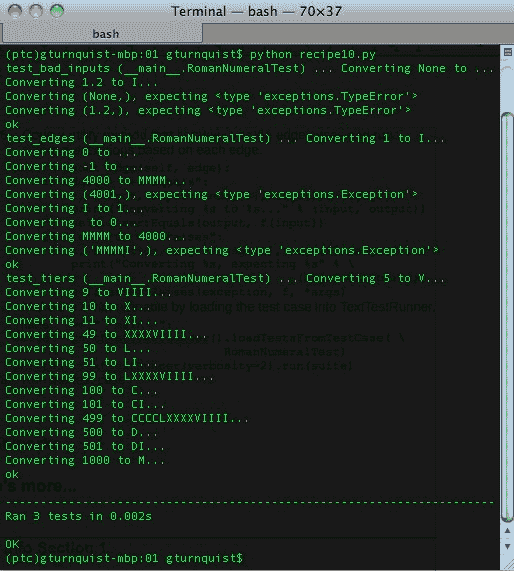

# 它是如何工作的...

我们有一个专门的罗马数字转换器，只能转换值到`MMMM`或`4000`。我们写测试的即时边缘是`1`和`4000`。我们还为这之后的一步写了一些测试：`0`和`4001`。为了使事情完整，我们还对`-1`进行了测试。

但我们以稍有不同的方式编写了测试。我们不是将每个测试输入/输出组合作为单独的测试方法来编写，而是将输入和输出值捕捉在嵌入列表中的元组中。然后我们将其提供给我们的测试迭代器`checkout_edge`。因为我们需要`assertEqual`和`assertRaise`调用，所以元组还包括等于或引发以标记使用哪种断言。

最后，为了灵活处理罗马数字和十进制的转换，我们还将我们的罗马数字 API 的`convert_to_roman`和`convert_to_decimal`函数的句柄嵌入到每个元组中。

如下所示，我们抓住了`convert_to_roman`并将其存储在`r`中。然后我们将其嵌入到突出显示的元组的第三个元素中，允许`checkout_edge`函数在需要时调用它：

```py
def test_bad_inputs(self): 
    r = self.cvt.convert_to_roman 
    d = self.cvt.convert_to_decimal 
    edges = [("equals", r, "", None),\ 
         ("equals", r, "I", 1.2),\ 
         ("raises", d, TypeError, None),\ 
         ("raises", d, TypeError, 1.2)\ 
        ] 

    [self.checkout_edge(edge) for edge in edges] 
```

# 还有更多...

算法的一个关键部分涉及处理罗马数字的各个层次（5、10、50、100、500 和 1000）。这些可以被视为*迷你边缘*，因此我们编写了一个单独的测试方法，其中包含要检查的输入/输出值的列表。在*测试边缘*配方中，我们没有包括这些迷你边缘之前和之后的测试，例如`5`的`4`和`6`。现在只需要一行数据来捕捉这个测试，我们在这个配方中有了它。其他所有的都是这样做的（除了 1000）。

最后，我们需要检查错误的输入，因此我们创建了另一种测试方法，尝试将`None`和`float`转换为罗马数字并从中转换。

# 这是否违背了配方-将模糊测试分解为简单测试？

在某种程度上是这样的。如果测试数据条目中的某个地方出现问题，那么整个测试方法将失败。这就是为什么这个配方将事物分解成了三个测试方法而不是一个大的测试方法来覆盖它们所有的原因之一。这是一个关于何时将输入和输出视为更多数据而不是测试方法的判断。如果你发现相同的测试步骤序列重复出现，考虑一下是否有意义将这些值捕捉在某种表结构中，比如在这个配方中使用的列表中。

# 这与配方相比如何-测试边缘？

如果不明显的话，这些是在*测试边缘*配方中使用的完全相同的测试。问题是，你觉得哪个版本更可读？两者都是完全可以接受的。将事物分解为单独的方法使其更精细化，更容易发现问题。将事物收集到数据结构中，就像我们在这个配方中所做的那样，使其更简洁，并可能会激励我们编写更多的测试组合，就像我们为转换层所做的那样。

在我自己的观点中，当测试具有简单输入和输出的算法函数时，更适合使用这种方法来以简洁的格式编写整个测试输入的电池。例如，数学函数，排序算法或者转换函数。

当测试更逻辑和命令式的函数时，另一种方法可能更有用。例如，与数据库交互，导致系统状态发生变化或其他类型的副作用的函数，这些副作用没有封装在返回值中，将很难使用这种方法捕捉。

# 另请参阅

+   *将模糊测试分解为简单测试*

+   *测试边缘*
