# 第二章：使用 Nose 运行自动化测试套件

在本章中，我们将涵盖以下示例：

+   用测试变得多管闲事

+   将鼻子嵌入 Python 中

+   编写一个 nose 扩展来基于正则表达式选择测试

+   编写一个 nose 扩展来生成 CSV 报告

+   编写一个项目级脚本，让您运行不同的测试套件

# 介绍

在上一章中，我们看了几种利用 unittest 创建自动化测试的方法。现在，我们将看看不同的方法来收集测试并运行它们。Nose 是一个有用的实用程序，用于发现测试并运行它们。它灵活，可以从命令行或嵌入式脚本运行，并且可以通过插件进行扩展。由于其可嵌入性和高级工具（如项目脚本），可以构建具有测试选项的工具。

nose 提供了 unittest 没有的东西吗？关键的东西包括自动测试发现和有用的插件 API。有许多 nose 插件，提供从特殊格式的测试报告到与其他工具集成的一切。我们将在本章和本书的后面部分更详细地探讨这一点。

有关 nose 的更多信息，请参阅：[`somethingaboutorange.com/mrl/projects/nose`](http://somethingaboutorange.com/mrl/projects/nose)。

我们需要激活我们的虚拟环境，然后为本章的示例安装 nose。

创建一个虚拟环境，激活它，并验证工具是否正常工作：

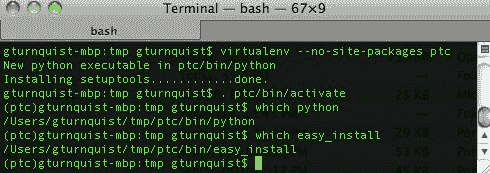

接下来，使用`pip install nose`，如下面的截图所示：

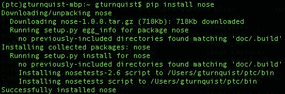

# 用测试变得多管闲事

当提供一个包、一个模块或一个文件时，nose 会自动发现测试。

# 如何做...

通过以下步骤，我们将探讨 nose 如何自动发现测试用例并运行它们：

1.  创建一个名为`recipe11.py`的新文件，用于存储此示例的所有代码。

1.  创建一个用于测试的类。对于这个示例，我们将使用一个购物车应用程序，让我们加载物品，然后计算账单：

```py
class ShoppingCart(object):
      def __init__(self):
          self.items = []
      def add(self, item, price):
          self.items.append(Item(item, price))
          return self
     def item(self, index):
          return self.items[index-1].item
     def price(self, index):
          return self.items[index-1].price
     def total(self, sales_tax):
          sum_price = sum([item.price for item in self.items])
          return sum_price*(1.0 + sales_tax/100.0)
     def __len__(self):
          return len(self.items)
class Item(object):
     def __init__(self, item, price):
          self.item = item
          self.price = price
```

1.  创建一个测试用例，练习购物车应用程序的各个部分：

```py
import unittest
class ShoppingCartTest(unittest.TestCase):
     def setUp(self):
        self.cart = ShoppingCart().add("tuna sandwich", 15.00)
     def test_length(self):
        self.assertEquals(1, len(self.cart))
     def test_item(self):
        self.assertEquals("tuna sandwich", self.cart.item(1))
     def test_price(self):
        self.assertEquals(15.00, self.cart.price(1))
     def test_total_with_sales_tax(self):
        self.assertAlmostEquals(16.39,
        self.cart.total(9.25), 2)
```

1.  使用命令行`nosetests`工具按文件名和模块运行此示例：

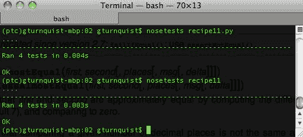

# 工作原理...

我们首先创建了一个简单的应用程序，让我们用`Items`加载`ShoppingCart`。这个应用程序让我们查找每个物品及其价格。最后，我们可以计算包括销售税在内的总账单金额。

接下来，我们编写了一些测试方法，以使用 unittest 来练习所有这些功能。

最后，我们使用了命令行`nosetests`工具，它发现测试用例并自动运行它们。这样可以避免手动编写测试运行器来加载测试套件。

# 还有更多...

为什么不编写测试运行器如此重要？使用`nosetests`我们能获得什么？毕竟，unittest 给了我们嵌入自动发现测试运行器的能力，就像这样：

```py
if __name__ == "__main__": 
    unittest.main()
```

如果测试分布在多个模块中，同一段代码块是否能够工作？不行，因为`unittest.main()`只查找当前模块。要扩展到多个模块，我们需要开始使用 unittest 的`loadTestsFromTestCase`方法或其他自定义套件来加载测试。我们如何组装套件并不重要。当我们有遗漏测试用例的风险时，`nosetests`方便地让我们搜索所有测试，或者根据需要搜索一部分测试。

在项目中常见的情况是将测试用例分布在许多模块之间。我们通常不会编写一个大的测试用例，而是根据各种设置、场景和其他逻辑分组将其分解为较小的测试用例。根据正在测试的模块拆分测试用例是一种常见做法。关键是，手动加载真实世界测试套件的所有测试用例可能会变得费力。

# Nose 是可扩展的

自动发现测试并不是使用 nose 的唯一原因。在本章的后面，我们将探讨如何编写插件来自定义它发现的内容以及测试运行的输出。

# Nose 是可嵌入的

nose 提供的所有功能都可以通过命令行或 Python 脚本来使用。我们还将在本章中进一步探讨这一点。

# 另请参阅

第一章中的*断言基础*食谱，*使用 Unittest 开发基本测试*。

# 将 nose 嵌入 Python 中

将 nose 嵌入 Python 脚本中非常方便。这不仅让我们创建更高级的测试工具，还允许开发人员将测试添加到现有工具中。

# 如何做...

通过这些步骤，我们将探索在 Python 脚本中使用 nose 的 API 来运行一些测试：

1.  创建一个名为`recipe12.py`的新文件，以包含此示例中的代码。

1.  创建一个要测试的类。对于这个示例，我们将使用一个购物车应用程序，它让我们加载物品然后计算账单：

```py
class ShoppingCart(object):
   def __init__(self):
      self.items = []
   def add(self, item, price):
      self.items.append(Item(item, price))
      return self
   def item(self, index):
      return self.items[index-1].item
   def price(self, index):
      return self.items[index-1].price
   def total(self, sales_tax):
      sum_price = sum([item.price for item in self.items])
      return sum_price*(1.0 + sales_tax/100.0)
   def __len__(self):
      return len(self.items)
class Item(object):
   def __init__(self, item, price):
      self.item = item
      self.price = price
```

1.  创建一个包含多个测试方法的测试用例：

```py
import unittest
class ShoppingCartTest(unittest.TestCase):
   def setUp(self): 
      self.cart = ShoppingCart().add("tuna sandwich", 15.00)
   def test_length(self):
      self.assertEquals(1, len(self.cart))
   def test_item(self):
      self.assertEquals("tuna sandwich", self.cart.item(1))
   def test_price(self):
      self.assertEquals(15.00, self.cart.price(1))
   def test_total_with_sales_tax(self):
      self.assertAlmostEquals(16.39,
      self.cart.total(9.25), 2)
```

1.  创建一个名为`recipe12_nose.py`的脚本，以使用 nose 的 API 来运行测试。

1.  使脚本可运行，并使用 nose 的`run()`方法来运行选定的参数：

```py
if __name__ == "__main__":
    import nose
    nose.run(argv=["", "recipe12", "--verbosity=2"])
```

1.  从命令行运行测试脚本并查看详细输出：

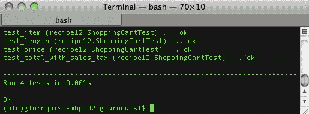

# 它是如何工作的...

在测试运行代码中，我们使用了`nose.run()`。没有参数时，它简单地依赖于`sys.argv`并像命令行`nosetests`一样运行。但在这个示例中，我们插入了当前模块的名称以及增加的详细信息。

# 还有更多...

Unittest 有`unittest.main()`，它也发现并运行测试用例。这有什么不同？`unittest.main()`旨在在运行它的同一模块中发现测试用例。`nose.run()`函数旨在让我们传入命令行参数或以编程方式加载它们。

例如，看看以下步骤；我们必须完成它们以提高 unittest 的详细程度：

```py
if __name__ == "__main__": 
    import unittest 
    from recipe12 import * 
    suite = unittest.TestLoader().loadTestsFromTestCase( 
                                        ShoppingCartTest) 
    unittest.TextTestRunner(verbosity=2).run(suite) 
```

我们必须导入测试用例，使用测试加载器创建测试套件，然后通过`TextTestRunner`运行它。

要使用 nose 做同样的事情，我们只需要这些：

```py
if __name__ == "__main__": 
    import nose 
    nose.run(argv=["", "recipe12", "--verbosity=2"]) 
```

这更加简洁。我们可以在这里使用`nosetests`的任何命令行选项。当我们使用 nose 插件时，这将非常方便，我们将在本章和本书的其余部分中更详细地探讨。

# 编写一个 nose 扩展来基于正则表达式选择测试

像 nose 这样的开箱即用的测试工具非常有用。但最终，我们会达到一个选项不符合我们需求的地步。Nose 具有编写自定义插件的强大能力，这使我们能够微调 nose 以满足我们的需求。这个示例将帮助我们编写一个插件，允许我们通过匹配测试方法的方法名使用正则表达式来选择性地选择测试方法，当我们运行`nosetests`时。

# 准备工作

我们需要加载`easy_install`以安装即将创建的 nose 插件。如果您还没有它，请访问[`pypi.python.org/pypi/setuptools`](http://pypi.python.org/pypi/setuptools)下载并按照网站上的指示安装该软件包。

如果您刚刚安装了它，那么您将需要执行以下操作：

+   重新构建用于运行本书中代码示例的`virtualenv`

+   使用`pip`重新安装`nose`

# 如何做...

通过以下步骤，我们将编写一个 nose 插件，通过正则表达式选择要运行的测试方法：

1.  创建一个名为`recipe13.py`的新文件，以存储此示例的代码。

1.  创建一个购物车应用程序，我们可以围绕它构建一些测试：

```py
class ShoppingCart(object):
   def __init__(self):
     self.items = []
   def add(self, item, price):
     self.items.append(Item(item, price))
     return self
   def item(self, index):
     return self.items[index-1].item
   def price(self, index):
     return self.items[index-1].price
   def total(self, sales_tax):
     sum_price = sum([item.price for item in self.items])
     return sum_price*(1.0 + sales_tax/100.0)
   def __len__(self):
     return len(self.items)
class Item(object):
   def __init__(self, item, price):
     self.item = item
     self.price = price
```

1.  创建一个包含多个测试方法的测试用例，包括一个不以单词`test`开头的方法：

```py
import unittest
class ShoppingCartTest(unittest.TestCase):
   def setUp(self):
     self.cart = ShoppingCart().add("tuna sandwich", 15.00)
   def length(self):
     self.assertEquals(1, len(self.cart))
   def test_item(self):
     self.assertEquals("tuna sandwich", self.cart.item(1))
   def test_price(self):
     self.assertEquals(15.00, self.cart.price(1))
   def test_total_with_sales_tax(self):
     self.assertAlmostEquals(16.39,
     self.cart.total(9.25), 2)
```

1.  使用命令行中的`nosetests`运行模块，并打开`verbosity`。有多少个测试方法被运行？我们定义了多少个测试方法？

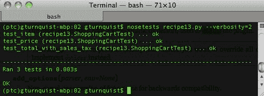

1.  创建一个名为`recipe13_plugin.py`的新文件，为此配方编写一个鼻子插件。

1.  捕获`sys.stderr`的句柄以支持调试和详细输出：

```py
import sys 
err = sys.stderr 
```

1.  通过子类化`nose.plugins.Plugin`创建一个名为`RegexPicker`的鼻子插件：

```py
import nose
import re
from nose.plugins import Plugin
class RegexPicker(Plugin):
   name = "regexpicker"
   def __init__(self):
      Plugin.__init__(self)
      self.verbose = False
```

我们的鼻子插件需要一个类级别的名称。这用于定义`with-<name>`命令行选项。

1.  覆盖`Plugin.options`并添加一个选项，在命令行上提供模式：

```py
def options(self, parser, env):
    Plugin.options(self, parser, env)
    parser.add_option("--re-pattern",
       dest="pattern", action="store",
       default=env.get("NOSE_REGEX_PATTERN", "test.*"),
       help=("Run test methods that have a method name matching this regular expression"))
```

1.  覆盖`Plugin.configuration`，使其获取模式和详细信息：

```py
def configure(self, options, conf):
     Plugin.configure(self, options, conf)
     self.pattern = options.pattern
     if options.verbosity >= 2:
        self.verbose = True
        if self.enabled:
           err.write("Pattern for matching test methods is %sn" % self.pattern)
```

当我们扩展`Plugin`时，我们继承了一些其他功能，例如`self.enabled`，当使用鼻子的`-with-<name>`时会打开。

1.  覆盖`Plugin.wantedMethod`，使其接受与我们的正则表达式匹配的测试方法：

```py
def wantMethod(self, method):
   wanted =
     re.match(self.pattern, method.func_name) is not None
   if self.verbose and wanted:
      err.write("nose will run %sn" % method.func_name)
   return wanted
```

编写一个测试运行器，通过运行与我们之前运行的相同的测试用例来以编程方式测试我们的插件：

```py
if __name__ == "__main__":
     args = ["", "recipe13", "--with-regexpicker", "--re-pattern=test.*|length", "--verbosity=2"]
     print "With verbosity..."
     print "===================="
     nose.run(argv=args, plugins=[RegexPicker()])
     print "Without verbosity..."
     print "===================="
     args = args[:-1]
     nose.run(argv=args, plugins=[RegexPicker()])
```

1.  执行测试运行器。查看以下截图中的结果，这次运行了多少个测试方法？

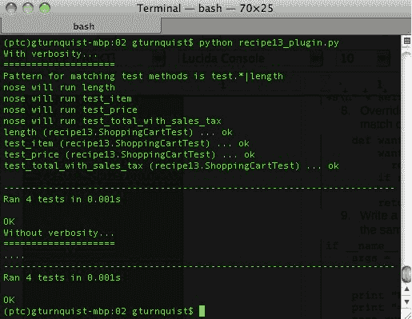

1.  创建一个`setup.py`脚本，允许我们安装并注册我们的插件到`nosetests`：

```py
import sys
try:
        import ez_setup
        ez_setup.use_setuptools()
except ImportError:
        pass
from setuptools import setup
setup(
        name="RegexPicker plugin",
        version="0.1",
        author="Greg L. Turnquist",
        author_email="Greg.L.Turnquist@gmail.com",
        description="Pick test methods based on a regular expression",
        license="Apache Server License 2.0",
        py_modules=["recipe13_plugin"],
        entry_points = {
            'nose.plugins': [
                'recipe13_plugin = recipe13_plugin:RegexPicker'
               ]
        }
)
```

1.  安装我们的新插件：

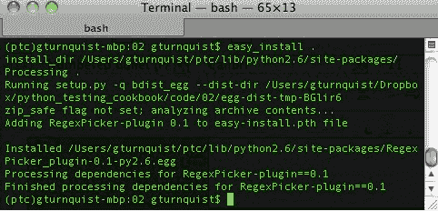

1.  从命令行使用`--with-regexpicker`运行`nosetests`：

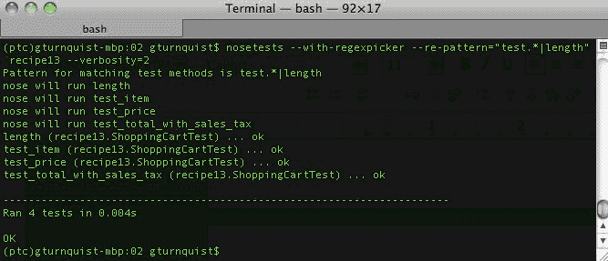

# 它是如何工作的...

编写鼻子插件有一些要求。首先，我们需要类级别的`name`属性。它在几个地方使用，包括定义用于调用我们的插件的命令行开关`--with-<name>`。

接下来，我们编写`options`。没有要求覆盖`Plugin.options`，但在这种情况下，我们需要一种方法来为我们的插件提供正则表达式。为了避免破坏`Plugin.options`的有用机制，我们首先调用它，然后使用`parser.add_option`为我们的额外参数添加一行：

+   第一个未命名的参数是参数的字符串版本，我们可以指定多个参数。如果我们想要的话，我们可以有`-rp`和`-re-pattern`。

+   `Dest`：这是存储结果的属性的名称（请参阅 configure）。

+   `Action`：这指定参数值的操作（存储，追加等）。

+   `Default`：这指定在未提供值时存储的值（请注意，我们使用`test.*`来匹配标准的 unittest 行为）。

+   `Help`：这提供了在命令行上打印的帮助信息。

鼻子使用 Python 的`optparse.OptionParser`库来定义选项。

要了解有关 Python 的`optparse.OptionParser`的更多信息，请参阅[`docs.python.org/library/optparse.html`](http://docs.python.org/library/optparse.html)。

然后，我们编写`configure`。没有要求覆盖`Plugin.configure`。因为我们有一个额外的选项`--pattern`，我们需要收集它。我们还想通过`verbosity`（一个标准的鼻子选项）来打开一个标志。

在编写鼻子插件时，我们可以做很多事情。在我们的情况下，我们想要聚焦于**测试选择**。有几种加载测试的方法，包括按模块和文件名。加载后，它们通过一个方法运行，该方法会投票赞成或反对它们。这些投票者被称为`want*`方法，它们包括`wantModule`，`wantName`，`wantFunction`和`wantMethod`，还有一些其他方法。我们实现了`wantMethod`，在这里我们使用 Python 的`re`模块测试`method.func_name`是否与我们的模式匹配。`want*`方法有三种返回值类型：

+   `True`：这个测试是需要的。

+   `False`：此测试不需要（并且不会被另一个插件考虑）。

+   `None`：插件不关心另一个插件（或鼻子）是否选择。

通过不从`want*`方法返回任何内容来简洁地实现这一点。

`wantMethod`只查看在类内定义的函数。`nosetests`旨在通过许多不同的方法查找测试，并不仅限于搜索`unittest.TestCase`的子类。如果在模块中找到了测试，但不是作为类方法，那么这种模式匹配就不会被使用。为了使这个插件更加健壮，我们需要很多不同的测试，并且可能需要覆盖其他`want*`测试选择器。

# 还有更多...

这个食谱只是浅尝插件功能。它侧重于测试选择过程。

在本章后面，我们将探讨生成专门报告的方法。这涉及使用其他插件钩子，在每次测试运行后收集信息以及在测试套件耗尽后生成报告。Nose 提供了一组强大的钩子，允许详细定制以满足我们不断变化的需求。

插件应该是`nose.plugins.Plugin`的子类。

`Plugin`中内置了很多有价值的机制。子类化是开发插件的推荐方法。如果不这样做，您可能需要添加您没有意识到 nose 需要的方法和属性（当您子类化时会自动获得）。

一个很好的经验法则是子类化 nose API 的部分，而不是覆盖它。

nose API 的在线文档有点不完整。它倾向于假设太多的知识。如果我们覆盖了，但我们的插件没有正确工作，可能很难调试发生了什么。

不要子类化`nose.plugins.IPluginInterface`。

这个类仅用于文档目的。它提供了关于我们的插件可以访问的每个钩子的信息。但它不是为了子类化真正的插件而设计的。

# 编写一个 nose 扩展来生成 CSV 报告

这个食谱将帮助我们编写一个生成自定义报告的插件，列出 CSV 文件中的成功和失败。它用于演示如何在每个测试方法完成后收集信息。

# 准备工作

我们需要加载`easy_install`以安装我们即将创建的 nose 插件。如果您还没有它，请访问[`pypi.python.org/pypi/setuptools`](http://pypi.python.org/pypi/setuptools)下载并按照网站上的指示安装该软件包。

如果您刚刚安装了它，那么您将不得不执行以下操作：

+   重新构建您用于运行本书中代码示例的`virtualenv`

+   使用`easy_install`重新安装 nose

# 如何做...

1.  创建一个名为`recipe14.py`的新文件，用于存储此食谱的代码。

1.  创建一个购物车应用程序，我们可以围绕它构建一些测试：

```py
class ShoppingCart(object):
   def __init__(self):
     self.items = [] 
   def add(self, item, price):
     self.items.append(Item(item, price))
     return self
   def item(self, index):
     return self.items[index-1].item
   def price(self, index):
     return self.items[index-1].price
   def total(self, sales_tax):
     sum_price = sum([item.price for item in self.items])
     return sum_price*(1.0 + sales_tax/100.0)
   def __len__(self):
     return len(self.items)
class Item(object):
   def __init__(self, item, price):
     self.item = item
     self.price = price
```

1.  创建一个包含多个测试方法的测试用例，包括一个故意设置为失败的测试方法：

```py
import unittest
class ShoppingCartTest(unittest.TestCase):
    def setUp(self):
      self.cart = ShoppingCart().add("tuna sandwich", 15.00)
    def test_length(self):
      self.assertEquals(1, len(self.cart))
    def test_item(self):
      self.assertEquals("tuna sandwich", self.cart.item(1))
    def test_price(self):
      self.assertEquals(15.00, self.cart.price(1))
    def test_total_with_sales_tax(self):
      self.assertAlmostEquals(16.39,
      self.cart.total(9.25), 2)
    def test_assert_failure(self):
      self.fail("You should see this failure message in the report.")
```

1.  从命令行使用`nosetests`运行模块。查看下面的截图输出，是否存在 CSV 报告？

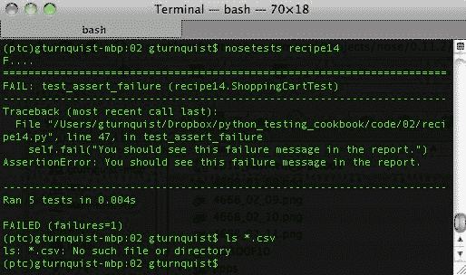

1.  创建一个名为`recipe14_plugin.py`的新文件，用于存储我们的新 nose 插件。

1.  通过子类化`nose.plugins.Plugin`创建一个名为`CsvReport`的 nose 插件：

```py
import nose
import re
from nose.plugins import Plugin
class CsvReport(Plugin):
    name = "csv-report"
    def __init__(self):
      Plugin.__init__(self)
      self.results = []
```

我们的 nose 插件需要一个类级别的`name`。这用于定义`-with-<name>`命令行选项。

1.  覆盖`Plugin.options`并添加一个选项，在命令行上提供报告的文件名：

```py
def options(self, parser, env):
  Plugin.options(self, parser, env)
  parser.add_option("--csv-file",
    dest="filename", action="store",
    default=env.get("NOSE_CSV_FILE", "log.csv"),
    help=("Name of the report"))
```

1.  通过让它从选项中获取文件名来覆盖`Plugin.configuration`：

```py
def configure(self, options, conf):
  Plugin.configure(self, options, conf)
  self.filename = options.filename
```

当我们扩展`Plugin`时，我们会继承一些其他功能，比如`self.enabled`，当使用 nose 的`-with-<name>`时会打开。

1.  覆盖`addSuccess`，`addFailure`和`addError`以在内部列表中收集结果：

```py
def addSuccess(self, *args, **kwargs):
  test = args[0]
  self.results.append((test, "Success"))
def addError(self, *args, **kwargs):
  test, error = args[0], args[1]
  self.results.append((test, "Error", error))
def addFailure(self, *args, **kwargs):
  test, error = args[0], args[1]
  self.results.append((test, "Failure", error))
```

1.  覆盖`finalize`以生成 CSV 报告：

```py
def finalize(self, result):
   report = open(self.filename, "w")
   report.write("Test,Success/Failure,Detailsn")
   for item in self.results:
       if item[1] == "Success":
           report.write("%s,%sn" % (item[0], item[1]))
       else:
           report.write("%s,%s,%sn" % (item[0],item[1], item[2][1]))
    report.close()
```

1.  编写一个测试运行器，通过运行与我们之前运行的相同的测试用例来以编程方式测试我们的插件：

```py
if __name__ == "__main__":
   args = ["", "recipe14", "--with-csv-report", "--csv-file=recipe14.csv"]
nose.run(argv=args, plugin=[CsvReport()])
```

1.  执行测试运行器。查看下一个截图输出，现在是否有测试报告？

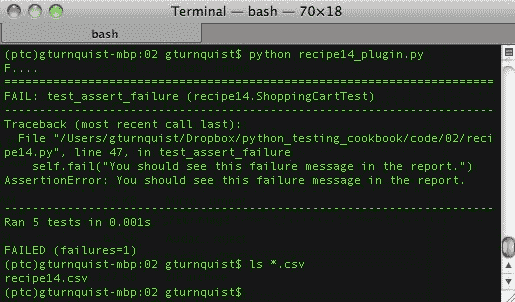

1.  使用您喜欢的电子表格打开并查看报告：

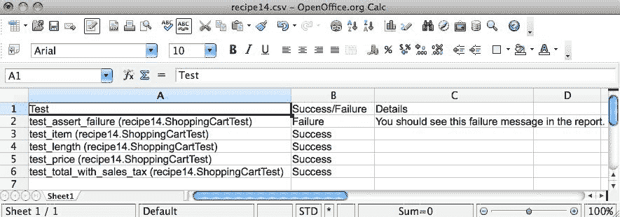

1.  创建一个`setup.py`脚本，允许我们安装并注册我们的插件到`nosetests`：

```py
import sys
try:
   import ez_setup
   ez_setup.use_setuptools()
except ImportError:
   pass
from setuptools import setup
setup(
   name="CSV report plugin",
   version="0.1",
   author="Greg L. Turnquist",
   author_email="Greg.L.Turnquist@gmail.com",
   description="Generate CSV report",
   license="Apache Server License 2.0",
   py_modules=["recipe14_plugin"],
   entry_points = {
       'nose.plugins': [
           'recipe14_plugin = recipe14_plugin:CsvReport'
         ]
   }
)
```

1.  安装我们的新插件：

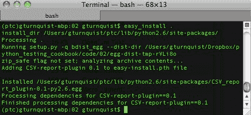

1.  从命令行运行`nosetests`，使用`--with-csv-report`：

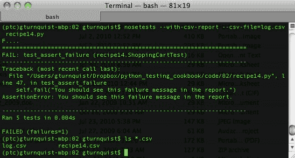

在上一个截图中，注意我们有先前的日志文件`recipe14.csv`和新的日志文件`log.csv`。

# 它是如何工作的...

编写 nose 插件有一些要求。首先，我们需要类级别的`name`属性。它在几个地方使用，包括定义用于调用我们的插件的命令行开关，`--with-<name>`。

接下来，我们编写`options`。没有必要覆盖`Plugin.options`。但在这种情况下，我们需要一种方法来提供我们的插件将写入的 CSV 报告的名称。为了避免破坏`Plugin.options`的有用机制，我们首先调用它，然后使用`parser.add_option`添加我们额外参数的行：

+   未命名的参数是参数的字符串版本

+   `dest`：这是存储结果的属性的名称（参见 configure）

+   `action`：这告诉参数值要执行的操作（存储、追加等）

+   `default`：这告诉了当没有提供值时要存储什么值

+   `help`：这提供了在命令行上打印的帮助信息

Nose 使用 Python 的`optparse.OptionParser`库来定义选项。

要了解更多关于`optparse.OptionParser`的信息，请访问[`docs.python.org/optparse.html`](http://docs.python.org/optparse.html)。

然后，我们编写`configure`。同样，没有必要覆盖`Plugin.configure`。因为我们有一个额外的选项`--csv-file`，我们需要收集它。

在这个配方中，我们希望在测试方法完成时捕获测试用例和错误报告。为此，我们实现`addSuccess`、`addFailure`和`addError`，因为 nose 在以编程方式调用或通过命令行调用这些方法时发送的参数不同，所以我们必须使用 Python 的`*args`：

+   这个元组的第一个槽包含`test`，一个`nose.case.Test`的实例。简单地打印它对我们的需求就足够了。

+   这个元组的第二个槽包含`error`，是`sys.exc_info()`的 3 元组实例。它仅包括在`addFailure`和`addError`中。

+   nose 网站上没有更多关于这个元组的槽的文档。我们通常忽略它们。

# 还有更多...

这个配方深入探讨了插件功能。它侧重于在测试方法成功、失败或导致错误后进行的处理。在我们的情况下，我们只是收集结果以放入报告中。我们还可以做其他事情，比如捕获堆栈跟踪，将失败的邮件发送给开发团队，或者向 QA 团队发送页面，让他们知道测试套件已经完成。

有关编写 nose 插件的更多详细信息，请阅读*编写**nose**扩展*的配方，以根据正则表达式选择测试。

# 编写一个项目级别的脚本，让您运行不同的测试套件

Python 以其多范式的特性，使得构建应用程序并提供脚本支持变得容易。

这个配方将帮助我们探索构建一个项目级别的脚本，允许我们运行不同的测试套件。我们还将展示一些额外的命令行选项，以创建用于打包、发布、注册和编写自动文档的钩子。

# 如何做...

1.  创建一个名为`recipe15.py`的脚本，使用 Python 的`getopt`库解析一组选项：

```py
import getopt
import glob
import logging
import nose
import os
import os.path
import pydoc
import re
import sys
def usage():
    print
    print "Usage: python recipe15.py [command]"
    print
    print "t--help"
    print "t--test"
    print "t--suite [suite]"
    print "t--debug-level [info|debug]"
    print "t--package"
    print "t--publish"
    print "t--register"
    print "t--pydoc"
    print
try:
    optlist, args = getopt.getopt(sys.argv[1:],
                    "ht", 
                    ["help", "test", "suite=",
                    "debug-level=", "package",
                    "publish", "register", "pydoc"])
except getopt.GetoptError:
    # print help information and exit:
    print "Invalid command found in %s" % sys.argvusage()
    sys.exit(2)
```

1.  创建一个映射到`-test`的函数：

```py
def test(test_suite, debug_level):
    logger = logging.getLogger("recipe15")
    loggingLevel = debug_level
    logger.setLevel(loggingLevel)
    ch = logging.StreamHandler()
    ch.setLevel(loggingLevel)
    formatter = logging.Formatter("%(asctime)s - %(name)s - %(levelname)s -
%(message)s")
    ch.setFormatter(formatter)
    logger.addHandler(ch)
    nose.run(argv=["", test_suite, "--verbosity=2"])
```

1.  创建支持`package`、`publish`和`register`的存根函数：

```py
def package():
    print "This is where we can plug in code to run " +
    "setup.py to generate a bundle."
def publish():
    print "This is where we can plug in code to upload " +
          "our tarball to S3 or some other download site."
def register():
    print "setup.py has a built in function to " +
          "'register' a release to PyPI. It's " +
          "convenient to put a hook in here."
    # os.system("%s setup.py register" % sys.executable)
```

1.  创建一个函数，使用 Python 的`pydoc`模块自动生成文档：

```py
def create_pydocs():
    print "It's useful to use pydoc to generate docs."
    pydoc_dir = "pydoc"
    module = "recipe15_all"
    __import__(module)
    if not os.path.exists(pydoc_dir):
        os.mkdir(pydoc_dir)
    cur = os.getcwd()
    os.chdir(pydoc_dir)
    pydoc.writedoc("recipe15_all")
    os.chdir(cur)
```

1.  添加一些代码，定义调试级别，然后解析选项以允许用户进行覆盖：

```py
debug_levels = {"info":logging.INFO, "debug":logging.DEBUG}
# Default debug level is INFO
debug_level = debug_levels["info"]
for option in optlist:
    if option[0] in ("--debug-level"):
        # Override with a user-supplied debug level
        debug_level = debug_levels[option[1]]
```

1.  添加一些代码，扫描命令行选项以查找`-help`，如果找到，则退出脚本：

```py
# Check for help requests, which cause all other
# options to be ignored.
for option in optlist:
if option[0] in ("--help", "-h"):
   usage()
   sys.exit(1)
```

1.  通过迭代每个命令行选项并根据选择了哪些选项来调用其他函数来完成它：

```py
# Parse the arguments, in order
for option in optlist:
    if option[0] in ("--test"):
       print "Running recipe15_checkin tests..."
       test("recipe15_checkin", debug_level)
    if option[0] in ("--suite"):
       print "Running test suite %s..." % option[1]
       test(option[1], debug_level)
    if option[0] in ("--package"):
       package()
    if option[0] in ("--publish"):
       publish()
    if option[0] in ("--register"):
       register()
    if option[0] in ("--pydoc"):
       create_pydocs()
```

1.  使用`-help`运行`recipe15.py`脚本：

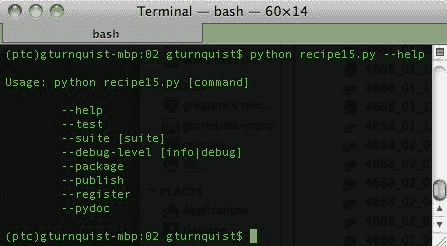

1.  创建一个名为`recipe15_checkin.py`的新文件来创建一个新的测试套件。

1.  重用*获取**nosy**with**testing*食谱中的测试用例来定义一个`check``in`测试套件：

```py
import recipe11 

class Recipe11Test(recipe11.ShoppingCartTest): 
    pass 
```

1.  使用`-test -package -publish -register -pydoc`运行`recipe15.py`脚本。在下面的屏幕截图中，您是否注意到它如何按照在命令行上提供的相同顺序来执行每个选项？

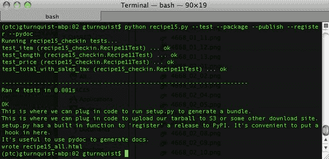

1.  检查在`pydoc`目录中生成的报告：

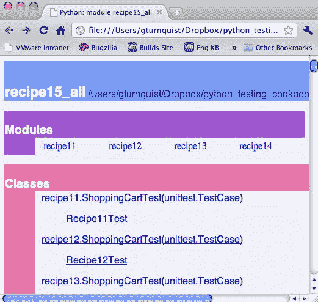

1.  创建一个名为`recipe15_all.py`的新文件来定义另一个新的测试套件。

1.  重用本章早期食谱的测试代码来定义一个`all`测试套件：

```py
import recipe11
import recipe12
import recipe13
import recipe14
class Recipe11Test(recipe11.ShoppingCartTest):
    pass
class Recipe12Test(recipe12.ShoppingCartTest):
    pass
class Recipe13Test(recipe13.ShoppingCartTest):
    pass
class Recipe14Test(recipe14.ShoppingCartTest):
    pass
```

1.  使用`-suite=recipe15_all`运行`recipe15.py`脚本：

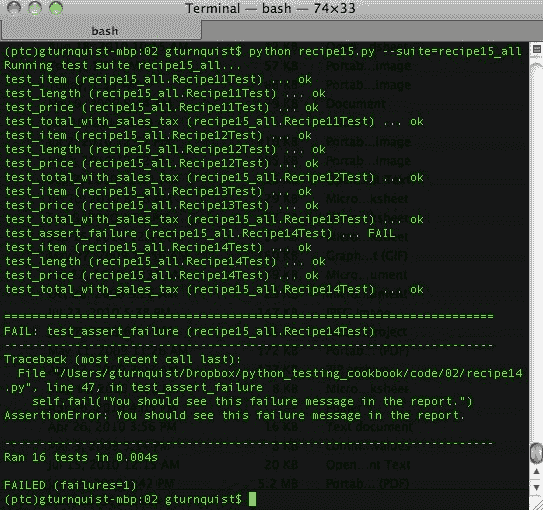

# 它是如何工作的...

该脚本使用 Python 的`getopt`库，该库是模仿 C 编程语言的`getopt()`函数而建立的。这意味着我们使用 API 来定义一组命令，然后迭代选项，调用相应的函数：

访问[`docs.python.org/library/getopt.html`](http://docs.python.org/library/getopt.html)了解更多关于`getopt`库的详细信息。

+   `usage`：这是一个为用户提供帮助的函数。

+   `键`：选项定义包含在以下块中：

```py
optlist, args = getopt.getopt(sys.argv[1:],
                "ht",
                ["help", "test", "suite=",
                "debug-level=", "package",
                "publish", "register", "pydoc"])
```

我们解析除第一个参数之外的所有参数，因为这是可执行文件本身：

+   `"ht"`定义了短选项：`-h`和`-t`。

+   该列表定义了长选项。带有`"="`的选项接受参数。没有`"="`的选项是标志。

+   如果收到不在列表中的选项，就会抛出异常；我们打印出`usage()`，然后退出。

+   `测试`：这激活了记录器，如果我们的应用程序使用 Python 的`logging`库，这将非常有用。

+   `包`：这生成 tarballs。我们创建了一个存根，但通过运行`setup.py sdist|bdist`提供一个快捷方式会很方便。

+   `发布`：它的功能是将 tarballs 推送到部署站点。我们创建了一个存根，但将其部署到 S3 站点或其他地方是有用的。

+   `注册`：这是与 PyPI 注册。我们创建了一个存根，但提供一个快捷方式运行`setup.py register`会很方便。

+   `create_pydocs`：这些是自动生成的文档。基于代码生成 HTML 文件非常方便。

定义了这些功能后，我们可以迭代解析的选项。对于这个脚本，有一个如下的顺序：

1.  检查是否有调试覆盖。我们默认为`logging.INFO`，但提供切换到`logging.DEBUG`的能力。

1.  检查是否调用了`-h`或`-help`。如果是，打印出`usage()`信息，然后退出，不再解析。

1.  最后，迭代选项并调用它们对应的函数。

为了练习，我们首先使用`-help`选项调用了这个脚本。这打印出了我们的命令选择。

然后我们使用所有选项调用它来演示功能。当我们使用`-test`时，脚本被编码为执行`check in`套件。这个简短的测试套件模拟了运行一个更快的测试，旨在查看事情是否正常。

最后，我们使用`-suite=recipe15_all`调用了脚本。这个测试套件模拟了运行一个更完整的测试套件，通常需要更长时间。

# 还有更多...

该脚本提供的功能可以很容易地通过已经构建的命令来处理。我们在本章前面看过`nosetests`，并且知道它可以灵活地接受参数来选择测试。

使用`setup.py`生成 tarballs 并注册发布也是 Python 社区中常用的功能。

那么，为什么要写这个脚本呢？因为我们可以通过一个单一的命令脚本利用所有这些功能，`setup.py`包含了一组预先构建的命令，涉及打包和上传到 Python 项目索引。执行其他任务，比如生成**pydocs**，部署到像 Amazon S3 桶这样的位置，或者任何其他系统级任务，都不包括在内。这个脚本演示了如何轻松地引入其他命令行选项，并将它们与项目管理功能链接起来。

我们还可以方便地嵌入`pydoc`的使用。基本上，任何满足项目管理需求的 Python 库也可以被嵌入。

在一个现有的项目中，我开发了一个脚本，以统一的方式将版本信息嵌入到一个模板化的`setup.py`以及由`pydoc`、`sphinx`和`DocBook`生成的文档中。这个脚本让我不必记住管理项目所需的所有命令。

为什么我不扩展`distutils`来创建自己的命令？这是一个品味的问题。我更喜欢使用`getopt`，并在`distutils`框架之外工作，而不是创建和注册新的子命令。

# 为什么使用`getopt`而不是`optparse`？

Python 有几种处理命令行选项解析的选项。`getopt`可能是最简单的。它旨在快速定义短选项和长选项，但它有限制。它需要自定义编码帮助输出，就像我们在使用函数中所做的那样。

它还需要对参数进行自定义处理。`optparse`提供了更复杂的选项，比如更好地处理参数和自动构建帮助。但它也需要更多的代码来实现功能。`optparse`也计划在未来被`argparse`取代。

你可以尝试用`optparse`写一个这个脚本的替代版本，来评估哪一个是更好的解决方案。
