# 第五章：使用验收测试编写高级客户场景

在本章中，我们将涵盖以下内容：

+   安装 Pyccuracy

+   使用 Pyccuracy 测试基础知识

+   使用 Pyccuracy 验证 Web 应用程序安全性

+   安装机器人框架

+   使用 Robot 框架创建数据驱动的测试套件

+   使用 Robot 框架编写可测试的故事

+   给 Robot 框架测试打标签并运行子集

+   使用 Robot 框架测试 Web 基础知识

+   使用 Robot 框架验证 Web 应用程序安全性

+   创建一个项目级脚本来运行本章的验收测试

# 介绍

验收测试涉及编写测试来证明我们的代码是可以接受的！但是，这是什么意思？上下文意味着从客户的角度来看是可以接受的。客户通常更感兴趣的是软件的功能，而不是它的工作方式。这意味着测试的目标是输入和输出，并且往往比单元测试更高级。这有时被称为黑盒测试，并且通常更加系统化。在一天结束时，它通常与断言客户是否接受软件有关。

一些开发人员假设验收测试涉及验证 Web 应用程序的前端。实际上，包括 Pyccuracy 在内的几个测试工具都是基于测试 Web 应用程序的唯一前提构建的。从客户是否接受软件的角度来看，这实际上符合客户的接受标准。

然而，Web 测试并不是唯一形式的验收测试。并非所有系统都是基于 Web 的。如果一个子系统由一个团队构建并交给另一个计划在其上构建另一层的团队，那么在第二个团队接受之前可能需要进行验收测试。

在本章中，我们将深入探讨涉及 Web 和非 Web 应用程序验收测试的一些方法。

要创建一个用于测试的电子商店 Web 应用程序，请按照以下步骤进行：

1.  确保您的系统上已安装`mercurial`：

+   对于 macOS，请使用 MacPorts 或 Homebrew

+   对于 Ubuntu/Debian，请使用`sudo apt-get install mercurial`

+   对于其他系统，您需要额外研究安装`mercurial`

1.  这还需要安装可编译的工具，如`gcc`：

+   对于 Ubuntu，请使用`sudo apt-get install build-essential`

+   对于其他系统，您需要额外研究安装`gcc`

1.  如果您在按照以下步骤安装 Satchmo 时遇到其他问题，请访问项目网站[`www.satchmoproject.com`](http://www.satchmoproject.com)，可能还要访问他们的支持小组[`groups.google.com/group/satchmo-users`](http://groups.google.com/group/satchmo-users)。

1.  通过输入以下命令安装 Satchmo，一个电子商务网站构建器：

```py
pip install -r http://bitbucket.org/gturnquist/satchmo/raw/tip/scripts/requirements.txt
pip install -e hg+http://bitbucket.org/gturnquist/satchmo/#egg=satchmo
```

1.  使用`pip install PIL`安装 Python 的`PIL`库进行图像处理。

1.  编辑`<virtualenv root>/lib/python2.6/site-packages/django/contrib/admin/templates/admin/login.html`，将`id="login"`添加到`Log in<input>`标记。这允许 Pyccuracy 抓取`Log in`按钮并单击它。

1.  运行 Satchmo 脚本以创建商店应用程序：`clonesatchmo.py`。

1.  在提示是否创建超级用户时，选择`yes`。

1.  在提示时，输入一个`用户名`。

1.  在提示时，输入一个`电子邮件地址`。

1.  在提示时，输入一个`密码`。

1.  进入 store 目录：`cd store`。

1.  启动商店应用程序：`python manage.py runserver`。

如果您在按照这些步骤安装 Satchmo 时遇到问题，请访问项目网站[`www.satchmoproject.com`](http://www.satchmoproject.com)，可能还要访问他们的支持小组[`groups.google.com/forum/#!forum/satchmo-users`](https://groups.google.com/forum/#!forum/satchmo-users)。

要创建一个用于测试的非 Web 购物车应用程序，请创建`cart.py`，其中包含以下代码：

```py
class ShoppingCart(object): 
    def __init__(self): 
        self.items = [] 

    def add(self, item, price): 
        for cart_item in self.items: 
            # Since we found the item, we increment 
            # instead of append 
            if cart_item.item == item: 
                cart_item.q += 1 
                return self 

        # If we didn't find, then we append 
        self.items.append(Item(item, price)) 
        return self 

    def item(self, index): 
        return self.items[index-1].item 

    def price(self, index): 
        return self.items[index-1].price * self.items[index-1].q 

    def total(self, sales_tax): 
        sum_price = sum([item.price*item.q for item in self.items]) 
        return sum_price*(1.0 + sales_tax/100.0) 

    def __len__(self): 
        return sum([item.q for item in self.items]) 

class Item(object): 
    def __init__(self, item, price, q=1): 
        self.item = item 
        self.price = price 
        self.q = q 
```

这个购物车具有以下特点：

+   从`[1]`开始，这意味着第一个项目和价格不是`[0]`

+   包括具有相同项目的多个能力

+   将计算总价格，然后添加税金

这个应用程序并不复杂。也许它并不完全看起来像一个系统级别，但它确实提供了一个易于编写验收测试的应用程序。

# 安装 Pyccuracy

Pyccuracy 是使用 BDD 风格语言编写 Web 验收测试的有用工具。本食谱展示了安装它并为后续食谱设置它所需的所有步骤。

# 如何做...

通过这些步骤，我们将安装 Pyccuracy 和运行本章后续场景所需的所有工具：

1.  通过输入`pip install pyccuracy`来安装`Pyccuracy`。

1.  从[`github.com/heynemann/pyccuracy/raw/master/lib/selenium-server.jar`](http://github.com/heynemann/pyccuracy/raw/master/lib/selenium-server.jar)下载`selenium-server.jar`。

1.  通过输入`java -jar selenium-server.jar`来启动它。请注意，如果您没有安装 Java，您肯定需要下载并安装它。

1.  通过输入`pip install lxml`来安装`lxml`。

1.  创建一个名为`recipe35.acc`的简单测试文件，并输入以下代码：

```py
As a Yahoo User
I want to search Yahoo
So that I can test my installation of Pyccuracy

Scenario 1 - Searching for Python Testing Cookbook
Given
    I go to "http://yahoo.com"
When
    I fill "p" textbox with "Python Testing Cookbook"
    And I click "search-submit" button and wait
Then
    I see "Python Testing Cookbook - Yahoo! Search Results" title
```

1.  输入`pyccuracy_console -p test.acc`来运行。以下截图显示它在 Firefox 中运行（系统默认）：

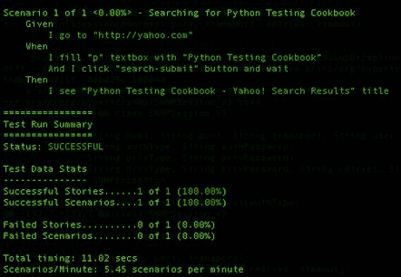

1.  再次运行，使用不同的网页浏览器，如 Safari，输入`pyccuracy_console -p test.acc -b safari`：

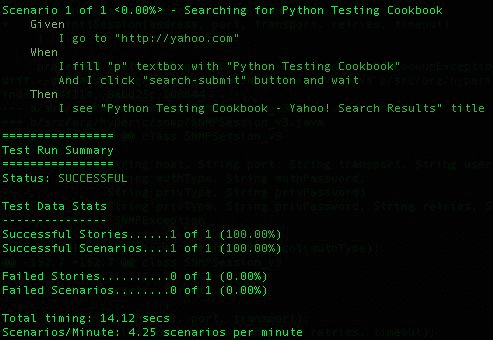在撰写本文时，Selenium 支持 Firefox、Safari、Opera 和 IE 7+，但不支持 Chrome。

1.  在运行测试的文件夹中，现在应该有一个`report.html`文件。使用浏览器打开它以查看结果。然后，点击展开全部：

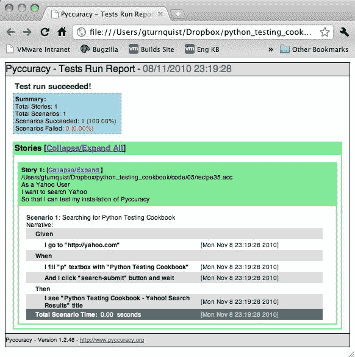

# 它是如何工作的...

Pyccuracy 使用 Selenium，一个流行的浏览器驱动应用程序测试工具来运行其场景。Pyccuracy 提供了一个开箱即用的**领域特定语言**（**DSL**）来编写测试。DSL 提供了发送命令到测试浏览器并检查结果的手段，验证 Web 应用程序的行为。

在本章后面，还有几个食谱展示了 Pyccuracy 的更多细节。

# 另请参阅

+   *使用 Pyccuracy 测试基础知识*

+   *使用 Pyccuracy 验证 Web 应用程序安全*

# 使用 Pyccuracy 测试基础知识

Pyccuracy 提供了一套易于阅读的操作，用于驱动 Web 应用程序的前端。本食谱展示了如何使用它来驱动购物车应用程序并验证应用程序功能。

# 准备工作

1.  如果尚未运行，请在另一个 shell 或窗口中输入`java -jar selenium-server.jar`启动 Selenium 服务器：

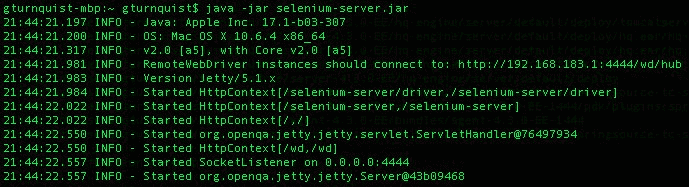

1.  如果 Satchmo 商店应用尚未运行，请在另一个 shell 或窗口中输入 python manage.py runserver 启动它。

这必须在`virtualenv`环境中运行。

# 如何做...

使用这些步骤，我们将探索编写 Pyccuracy 测试的基础知识：

1.  创建一个名为`recipe36.acc`的新文件。

1.  创建一个加载商品到购物车的故事：

```py
As a store customer
I want to put things into my cart
So that I can verify the store's functionality.
```

1.  添加一个场景，其中详细查看了空购物车，并确认余额为`$0.00`：

```py
Scenario 1 - Inspect empty cart in detail
Given
I go to "http://localhost:8000"
When
I click "Cart" link and wait
Then
I see that current page contains "Your cart is empty"
And I see that current page contains "0 - $0.00"
```

1.  添加另一个场景，其中选择了一本书，并将其中两本添加到购物车中：

```py
Scenario 2 - Load up a cart with 2 of the same
Given
I go to "http://localhost:8000"
When
I click "Science Fiction" link
And I click "Robots Attack!" link and wait
And I fill "quantity" textbox with "2"
And I click "addcart" button and wait
And I click "Cart" link and wait
Then
I see that current page contains "Robots Attack!"
And I see "quantity" textbox contains "2"
And I see that current page contains "<td align="center">$7.99</td>"
And I see that current page contains "<td align="center">$15.98</td>"
And I see that current page contains "<td>$15.98</td>"
```

1.  通过输入`pyccuracy_console -p recipe36.acc`来运行故事：

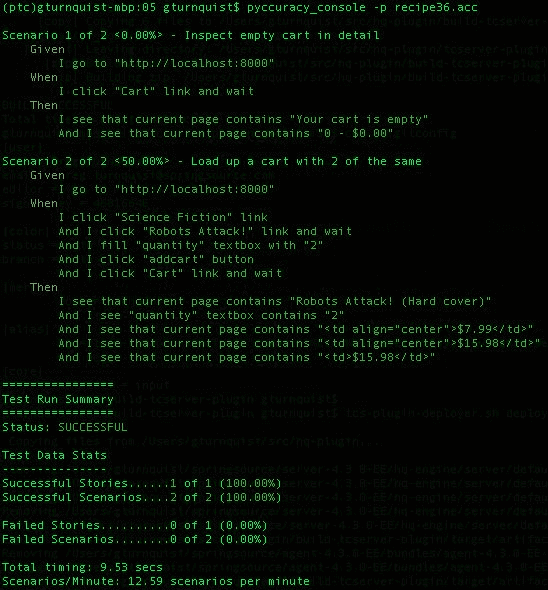

# 它是如何工作的...

Pyccuracy 具有许多基于驱动浏览器或读取页面的内置操作。这些操作是用于解析故事文件并生成发送到 Selenium 服务器的命令的模式，然后驱动浏览器，然后读取页面的结果。

关键是选择正确的文本来识别正在操作或阅读的元素。

缺少 ID 标签的 Web 应用程序更难阅读。

# 还有更多...

关键是选择正确的标识符和元素类型。有了良好的标识符，就可以轻松地执行诸如—*我**点击**购物车**链接*之类的操作。你注意到我们在查看购物车表时遇到的问题了吗？HTML `<table>`标签没有标识符，这使我们无法选择。相反，我们不得不查看整个页面并全局搜索一些标记。

这使得测试变得更加困难。一个好的解决方案是修改 Web 应用程序以在`<table>`标签中包含一个 ID。然后，我们将我们的验收标准缩小到只有表格。对于这个应用程序来说还好，但对于复杂的 Web 应用程序来说，如果没有良好的 ID，要找到我们正在寻找的确切文本将会更加困难。

这提出了一个有趣的问题——应该修改应用程序以支持测试吗？简单地说，是的。为关键的 HTML 元素添加一些良好的标识符以支持测试并不是一个重大的动荡。这并没有对应用程序进行重大的设计更改。最终结果是更容易阅读的测试用例和更好的自动化测试。

这引出了另一个问题——如果使应用程序更易于测试确实涉及重大设计更改怎么办？这可以被视为工作中的一个重大干扰。或者，也许这是一个强烈的暗示，我们的设计组件耦合过于紧密或者不够内聚。

在软件开发中，**耦合**和**内聚性**是主观的术语，很难衡量。可以说的是，不易于测试的应用程序通常是单片的，难以维护，并且可能存在循环依赖，这意味着我们作为开发人员很难进行更改，以满足需求而不影响整个系统。

当然，这与我们配方的情况有很大的不同，我们只是缺少 HTML 表的标识符。然而，重要的是要问这个问题——如果我们需要的变化比这么小的东西更多呢？

# 另请参阅

*安装 Pyccuracy*

# 使用 Pyccuracy 来验证 Web 应用程序的安全性

应用程序通常有登录屏幕。测试安全的 Web 应用程序要求我们将登录过程作为自定义操作进行捕捉。这样，我们可以重复使用它，直到我们需要的场景为止。

# 准备工作

1.  如果尚未运行，请在另一个 shell 或窗口中输入`java -jar selenium-server.jar`来启动 Selenium 服务器。

1.  如果 Satchmo 商店应用程序尚未运行，请在另一个 shell 或窗口中输入 python manage.py runserver 来启动它。

这必须在`virtualenv`环境中运行。

# 如何做...

通过以下步骤，我们将练习一个 Web 应用程序的安全性，然后看看如何通过创建自定义操作来扩展 Pyccuracy：

1.  创建一个名为`recipe37.acc`的新文件，将此配方的场景放入其中。

1.  为练习 Django 的管理员应用程序创建一个故事：

```py
As a system administrator, 
I want to log in to Django's admin page 
so that I can check the product catalog.
```

1.  添加一个登录到管理员应用程序的场景：

```py
Scenario 1 - Logging in to the admin page
Given
    I go to "http://localhost:8000/admin"
When
    I fill "username" textbox with "gturnquist"
    And I fill "password" textbox with "password"
    And I click "login" button and wait
Then
    I see that current page contains 
    "<ahref="product/product/">Products</a>"
```

1.  添加一个检查产品目录的场景，使用自定义登录操作：

```py
Scenario 2 - Check product catalog
Given
    I am logged in with username "gturnquist" and password "password"
When
    I click "Products" link and wait
Then
    I see that current page contains "robot-attack"
```

1.  创建一个名为`recipe37.py`的匹配文件，其中包含自定义定义的操作。

1.  编写登录到管理员操作的自定义操作：

```py
from pyccuracy.actions import ActionBase
from pyccuracy.errors import *

class LoggedInAction(ActionBase):
    regex = r'(And )?I am logged in with username ["] (?P<username>.+)["] and password "["]$'
    def execute(self, context, username, password):
        self.execute_action(u'I go to "http://localhost:8000/
admin"', context)
    logged_in = False
    try:
        self.execute_action(
          u'And I see that current page contains "id_username"', context)
        except ActionFailedError:
            logged_in = True
        if not logged_in:
            self.execute_action(u'And I fill "username" textbox with "%s"' % username, context)
            self.execute_action(u'And I fill "password" textbox with "%s"' % password, context)
            self.execute_action(u'And I click "login" button', context)
```

1.  通过输入`pyccuracy_console -p recipe37.acc`来运行故事：

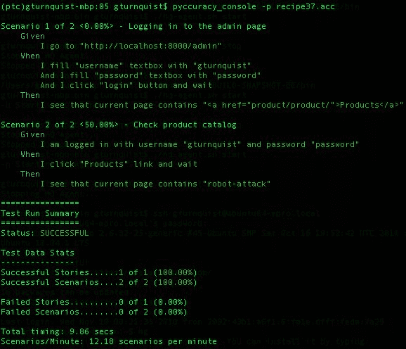

# 工作原理...

第一个场景展示了练习登录屏幕所需的简单步骤。在证明登录屏幕有效之后，重复这个过程以进行更多场景变得繁琐。

为了处理这个问题，我们通过扩展`ActionBase`在 Python 中创建一个自定义操作。自定义操作需要一个正则表达式来定义 DSL 文本。接下来，我们定义一个`execute`方法，包括应用逻辑和 Pyccuracy 步骤的组合来执行。基本上，我们可以定义一组步骤来自动执行操作并动态处理不同的情况。

在我们的情况下，我们编写了代码来处理用户是否已经登录。通过这个自定义操作，我们构建了第二个场景，并用一个语句处理了登录，使我们能够继续测试我们场景的核心部分。

# 另请参阅

*安装 Pyccuracy*

# 安装 Robot Framework

Robot Framework 是一个有用的框架，用于使用**关键字**方法编写验收测试。关键字是各种库提供的简写命令，也可以是用户定义的。这很容易支持 BDD 风格的`Given`-`When`-`Then`关键字。它还为第三方库定义自定义关键字打开了大门，以与其他测试工具（如 Selenium）集成。这也意味着使用 Robot Framework 编写的验收测试不局限于 Web 应用程序。

本配方展示了安装 Robot Framework 以及后续配方中使用的第三方 Robot Framework Selenium 库的所有步骤。

# 如何做...

1.  确保激活您的`virtualenv`沙箱。

1.  通过输入`easy_install robotframework`进行安装。

在撰写本文时，Robot Framework 无法使用`pip`安装。

1.  使用任何类型的窗口导航器，转到`<virtualenvroot>/build/robotframework/doc/quickstart`并用您喜欢的浏览器打开`quickstart.html`。这不仅是一个指南，也是一个可运行的测试套件。

1.  切换到 Robot Framework 的虚拟环境构建目录：`cd<virtualenvroot>/build/robotframework/doc/quickstart`。

1.  通过`pybot quickstart.html`运行快速入门手册以验证安装：

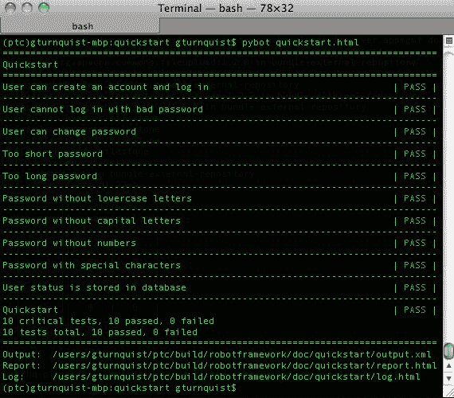

1.  检查测试运行生成的`report.html`、`log.html`和`output.xml`文件。

1.  安装 Robot Framework Selenium 库，以便首先下载[`robotframework-seleniumlibrary.googlecode.com/files/robotframework-seleniumlibrary-2.5.tar.gz`](http://robotframework-seleniumlibrary.googlecode.com/files/robotframework-seleniumlibrary-2.5.tar.gz)进行集成。

1.  解压 tarball。

1.  切换到带有`cd robotframework-seleniumlibrary-2.5`的目录。

1.  使用`python setup.py install`安装软件包。

1.  切换到演示目录，使用`cd demo`。

1.  使用`python run demo.py demoapp start`启动演示 Web 应用程序。

1.  使用`python run demo.py selenium start`启动 Selenium 服务器。

1.  使用`pybot login_tests`运行演示测试：

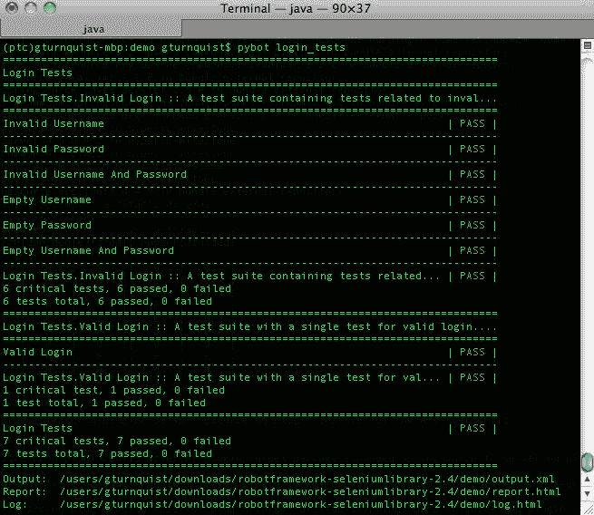

1.  使用`python run demo.py demoapp stop`关闭演示 Web 应用程序。

1.  使用`python run demo.py selenium stop`关闭 Selenium 服务器。

1.  检查测试运行生成的`report.html`、`log.html`、`output.xml`和`selenium_log.txt`文件。

# 还有更多...

通过这个配方，我们已经安装了 Robot Framework 和一个与 Selenium 集成的第三方库。

有许多第三方库为 Robot Framework 提供了增强功能。这些选项有足够的潜力填满一本书。因此，我们必须把焦点缩小到 Robot Framework 提供的一些核心功能，包括 Web 和非 Web 测试。

# 使用 Robot Framework 创建数据驱动的测试套件

Robot Framework 使用**关键字**来定义测试、测试步骤、变量和其他测试组件。关键字是各种库提供的简写命令，也可以是自定义的。这允许以许多不同的方式编写和组织测试。

在这个配方中，我们将探讨如何使用不同的输入和输出运行相同的测试过程。这些可以被描述为数据驱动测试。

# 准备工作

1.  我们首先需要激活我们的`virtualenv`设置

1.  对于这个配方，我们将使用购物车应用程序

1.  接下来，我们需要安装 Robot Framework，如前一个配方所示

# 如何做...

以下步骤将向我们展示如何使用 HTML 表编写简单的验收测试：

1.  创建一个名为`recipe39.html`的新文件来捕捉测试和配置。

1.  添加一个包含一组数据驱动测试用例的 HTML 段落和表，如下所示的浏览器截图：

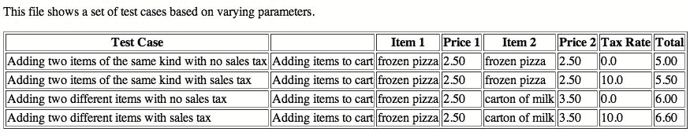

1.  添加另一个 HTML 段落和表，定义自定义关键字 Adding items to cart 和 Add item：

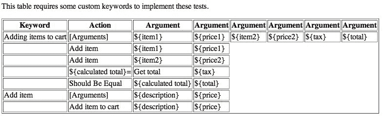

1.  创建一个名为`recipe39.py`的新文件，其中包含与我们的自定义关键字相关联的 Python 代码。

1.  创建一个旧式的 Python 类，实现所需场景的自定义关键字：

```py
from cart import *

class recipe39:
    def __init__(self):
        self.cart = ShoppingCart()
    def add_item_to_cart(self, description, price):
        self.cart.add(description, float(price))
    def get_total(self, tax):
        return format(self.cart.total(float(tax)), ".2f")
```

重要的是要定义类为*旧式*。如果我们将其定义为*新式*，即通过子类化`object`，Robot Framework 的运行器`pybot`将无法找到这些方法并将它们与我们的 HTML 关键字关联起来。

1.  添加第三个 HTML 段落和表，加载我们的 Python 代码来实现 Add item to cart 和 Get total：

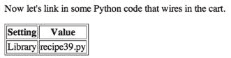

1.  在您喜欢的浏览器中查看 HTML 文件：

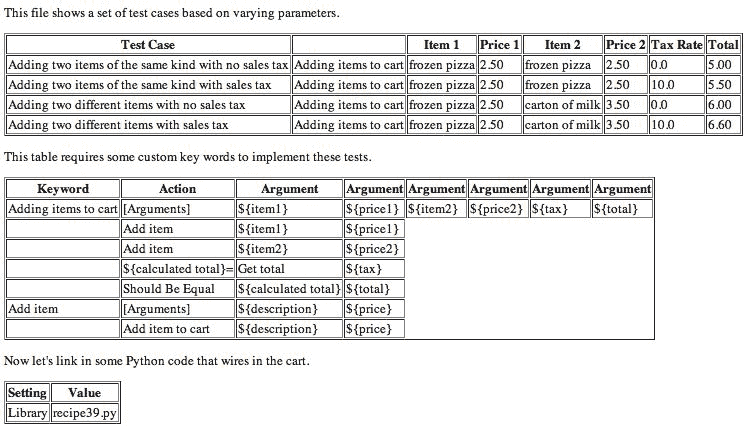

1.  通过在终端输入`pybot recipe39.html`来运行 HTML 文件以执行测试：

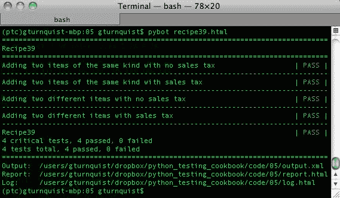

1.  您可以使用您喜欢的浏览器检查`report.html`和`log.html`，以获取有关结果的更多详细信息。

# 它是如何工作的...

Robot Framework 使用 HTML 表来定义测试组件。表的标题行标识了表定义的组件类型。

我们创建的第一个表是一组测试用例。Robot Framework 通过在标题行的第一个单元格中看到`Test Case`来识别这一点。标题的其余单元格不会被解析，这使我们可以自由地输入描述性文本。在这个示例中，我们的每个测试用例都是用一行定义的。第二列在每一行上都有`Adding items to cart`，这是在第二个表中定义的自定义关键字。其余的列是这些自定义关键字的参数。

我们编写的第二个表用于定义自定义关键字。Robot Framework 通过在标题行的第一个单元格中看到`Keyword`来确定这一点。我们的表定义了两个关键字：

+   `Adding items to cart`：

+   第一行通过以`[Arguments]`开头来定义参数，有六个输入变量：`${item1}`、`${price1}`、`${item2}`、`${price2}`、`${tax}`和`${total}`

+   接下来的一组行是操作

+   第二行和第三行使用了另一个自定义关键字：`Add item`，带有两个参数。

+   第四行定义了一个新变量`${calculated total}`，它被赋予了另一个关键字`Get total`的结果，该关键字带有一个参数`${tax}`，该参数在我们的 Python 模块中定义。

+   最后一行使用了一个内置关键字`Should Be Equal`，来确认`Get total`的输出是否与原始`${total}`匹配。

+   `Add item`：

+   第一行通过以`[Arguments]`开头来定义参数，有两个输入变量：`${description}`和`${price}`。

+   第二行使用了另一个关键字`Add item to cart`，该关键字在我们的 Python 模块中定义，带有两个命名参数：`${description}`和`${price}`。

我们制作的第三个表包含设置。通过在标题行的第一个单元格中看到`Setting`来识别。该表用于导入包含最终关键字的 Python 代码，使用内置关键字`Library`。

# 还有更多...

Robot Framework 通过一个非常简单的约定将我们的关键字映射到我们的 Python 代码：

+   `Get total ${tax}`映射到`get_total(self,tax)`

+   `Add item to cart ${description} ${price}`映射到`add_item_to_cart(self, description, price)`

我们需要`add_item_to_cart`而不能只写`add_item`来连接`Add item`关键字的原因是因为 Robot Framework 在连接 Python 代码时使用命名参数。由于我们表中每次使用`Add item`都有不同的变量名，我们需要一个带有不同参数的单独关键字。

# 我必须写 HTML 表吗？

Robot Framework 由 HTML 表格驱动，但表格的生成方式并不重要。许多项目使用诸如**reStructuredText** ([`docutils.sourceforge.net/rst.html`](http://docutils.sourceforge.net/rst.html))之类的工具以更简洁的方式编写表格，然后使用转换器将其转换为 HTML。将`.rst`转换为 HTML 的有用工具是**docutils** ([`docutils.sourceforge.net/`](http://docutils.sourceforge.net/))。它提供了一个方便的`rst2html.py`脚本，可以将所有`.rst`表格转换为 HTML。

不幸的是，本书的格式使得很难将`.rst`呈现为代码或屏幕截图。

# 编写实现我们自定义关键字的代码的最佳方法是什么？

我们编写了一大块 Python 代码，将我们的自定义关键字与`ShoppingCart`应用程序联系起来。使其尽可能轻量化非常重要。*为什么？*因为当我们部署实际应用程序时，这个桥梁不应该是其中的一部分。可能会诱人将此桥梁用作捆绑事物或转换事物的机会，但应该避免这样做。

相反，最好将这些功能包含在软件应用程序本身中。然后，这个额外的功能就成为经过测试、部署的软件功能的一部分。

如果我们不过多地投资于桥接代码，可以帮助我们避免使软件依赖于测试框架。出于某种原因，如果我们决定切换到 Robot Framework 之外的其他东西，由于在桥接代码中投入了太多，我们不会被束缚在特定工具中。

# Robot Framework 变量是 Unicode

在使我们的 Python 代码工作的过程中，另一个关键因素是认识到输入值是 Unicode 字符串。由于`ShoppingCart`是基于浮点值的，我们必须使用 Python 的`float(input)`函数来转换输入，以及`format(output, ".2f")`来转换输出。

这是否与前面讨论的尽可能保持轻量级的桥梁相矛盾？并不是。通过使用纯粹的内置 Python 函数，没有副作用，我们不会陷入困境，而只是将格式消息传递给排列事物。如果我们开始操纵容器，或将字符串转换为列表，反之亦然，甚至定义新类，那肯定会对这个桥梁太重了。

# 另请参阅

*安装 Robot Framework*

# 使用 Robot Framework 编写可测试的故事

正如本章前面讨论的那样，Robot Framework 让我们可以使用自定义定义的关键字。

这使我们能够以任何风格构建关键字。在这个配方中，我们将定义实现 BDD-`Given`-`When`-`Then`风格规范的自定义关键字。

# 准备工作

1.  我们首先需要激活我们的`virtualenv`设置。

1.  对于这个配方，我们将使用购物车应用程序。

1.  接下来，我们需要安装 Robot Framework，就像本章的前几节所示。

# 如何做...

以下步骤将探讨如何编写 BDD-`Given-When-Then`风格的验收测试：

1.  创建一个名为`recipe40.html`的新文件，放入我们的 HTML 表格。

1.  在 HTML 中创建一个带有开头声明的故事文件：

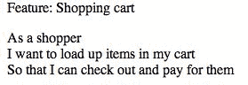

1.  添加一个包含几个场景的表格，用于使用一系列`Given`-`When`-`Then`关键字来执行购物车应用程序。

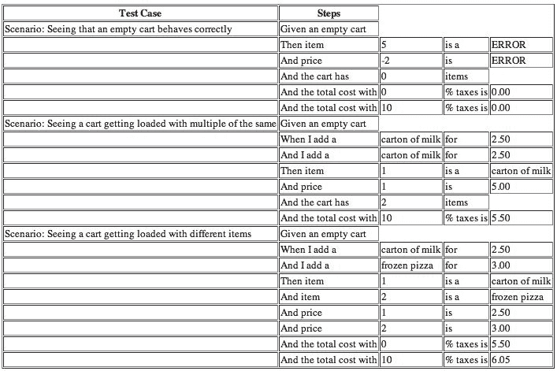

1.  添加第二个表格，定义我们所有自定义的`Given-When-Then`自定义关键字。


1.  创建一个名为`recipe40.py`的新文件，将自定义关键字与`ShoppingCart`应用程序链接起来的 Python 代码放入其中。

```py
from cart import *
class recipe40:
def __init__(self):
self.cart = None
def create_empty_cart(self):
self.cart = ShoppingCart()
def lookup_item(self, index):
try:
return self.cart.item(int(index))
except IndexError:
return "ERROR"
def lookup_price(self, index):
try:
return format(self.cart.price(int(index)), ".2f")
except IndexError:
return "ERROR"
def add_item(self, description, price):
self.cart.add(description, float(price))
def size_of_cart(self):
return len(self.cart)
def total(self, tax):
return format(self.cart.total(float(tax)), ".2f")
```

这个类实现为旧式是至关重要的。如果通过扩展`object`实现为新式，Robot Framework 将无法链接关键字。

1.  在我们的`recipe40.html`文件中添加第三个表格来导入我们的 Python 模块。

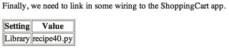

1.  通过输入`pybot recipe40.html`来运行故事：

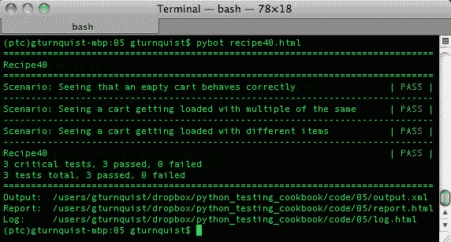

# 工作原理...

Robot Framework 使用 HTML 表来定义测试组件。表的标题行标识了表定义的组件类型。

我们创建的第一个表是一组测试用例。Robot Framework 通过在标题行的第一个单元格中看到`Test Case`来识别这一点。标题行的其余单元格不被解析，这使我们可以自由地放入描述性文本。

在这个示例中，我们的每个测试用例都包含了使用 BDD 测试人员熟悉的`Given-When-Then`风格的几个自定义关键字。许多这些关键字有一个或多个参数。

我们编写的第二个表用于定义我们的自定义`Given-When-Then`关键字。Robot Framework 通过在标题行的第一个单元格中看到`Keyword`来解决了这个问题。

我们制作的第三个表包含设置。通过在标题行的第一个单元格中看到`Setting`来识别。这个表用于导入包含最终关键字的 Python 代码，使用内置关键字`Library`。

在这个示例中，我们自定义关键字的一个重要方面是，我们用自然流畅的语言编写了它们：

```py
When I add a carton of milk for 2.50 
```

为了参数化输入并使关键字可重用于多个测试步骤，这被分解为四个 HTML 单元格：

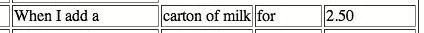

Robot Framework 将其视为一个自定义关键字`When``I``add``a`，有三个参数：`carton of milk`，`for`和`2.50`。

稍后，我们将填写与此关键字相关的实际步骤。这样做时，我们只关心使用`carton of milk`和`2.50`，但我们仍然必须将`for`视为输入变量。我们使用一个占位符变量`${noop}`来实现这一点，在任何后续关键字步骤中我们将简单地不使用它。

在这个示例中，我们称这个临时变量为`${noop}`。我们可以随意命名它。如果在同一个关键字中有多个临时参数，我们也可以重复使用它。这是因为 Robot Framework 不进行强类型检查。

# 还有更多...

我们不得不编写的整个 HTML 块开始感觉有点沉重。如*使用 Robot Framework 创建数据驱动测试套件*中所述，`.rst`是一个很好的替代方案。不幸的是，使用`.rst`编写这个示例对于这本书的格式来说太宽了。有关使用`.rst`编写更多详细信息和获取工具将`.rst`转换为 HTML，请参阅该示例。

# Given-When-Then 导致重复规则

确实，我们不得不定义`Then item`和`Add item`，它们基本上是相同的，以支持两种不同的测试场景。在其他 BDD 工具中，这些将自动被识别为相同的从句。Robot Framework 并没有直接提供 BDD 领域特定的语言，所以我们不得不自己填写这部分。

处理这个问题的最有效方法是详细定义`Then item`所需的所有步骤，然后编写`And item`来调用`Then item`。

相比之下，“当我添加一个”和“而我添加一个”是通过调用“添加项目”来实现的。由于这个从句只是一个简单的传递到我们的 Python 模块，所以不需要像前面的例子那样将它们链接在一起。

另一个选择是调查编写我们自己的 BDD 插件库，以简化所有这些。

# try-except 块是否违反了保持轻量的想法？

在*使用 Robot Framework 创建数据驱动测试套件*的示例中，我提到了将 HTML 表与`ShoppingCart`应用程序连接的代码应尽可能保持轻量，并避免转换和其他操作。

捕获预期异常并返回字符串可能会越过这条线。在我们的情况下，解决方案是定义一个可以处理错误和合法值的单个从句。该从句接受返回的任何内容，并使用内置的`Should Be Equal`关键字进行验证。

如果情况不是这样，可能更顺利的做法是不使用 try-expect 块，而是使用内置的`Run Keyword And Expect Error`关键字链接到另一个自定义的 Python 关键字。然而，在这种情况下，我认为保持事情简单的目标得到了满足。

# 另请参阅

+   *安装 Robot Framework*

+   *使用 Robot Framework 创建数据驱动的测试套件*

# 标记 Robot Framework 测试并运行子集

Robot Framework 提供了一种全面的方式来使用表驱动结构捕获测试场景。这包括添加标记和文档的元数据的能力。

标记允许包括或排除用于测试的标记。文档出现在命令行上，也出现在结果报告中。本教程将演示这两个关键特性。

最后，HTML 表格并不是使用 Robot Framework 定义数据表的唯一方式。在本教程中，我们将探讨使用双空格分隔的条目。虽然这不是编写故事的唯一非 HTML 方式，但它是最容易的非 HTML 方式，可以在印刷形式的本书的字体大小限制内进行演示。

# 准备工作

1.  我们首先需要激活我们的`virtualenv`设置。

1.  创建一个名为`cart41.py`的新文件，以放置购物车应用程序的备用版本。

1.  输入以下代码，将购物车存储到数据库中：

```py
class ShoppingCart(object):
    def __init__(self):
        self.items = []
    def add(self, item, price):
        for cart_item in self.items:
            # Since we found the item, we increment
            # instead of append
            if cart_item.item == item:
                cart_item.q += 1
                return self
        # If we didn't find, then we append
        self.items.append(Item(item, price))
        return self
    def item(self, index):
        return self.items[index-1].item
    def price(self, index):
        return self.items[index-1].price * self.items[index-1].q
    def total(self, sales_tax):
        sum_price = sum([item.price*item.q for item in self.items])
        return sum_price*(1.0 + sales_tax/100.0)
    def store(self):
        # This simulates a DB being created.
        f = open("cart.db", "w")
        f.close()
    def retrieve(self, id):
        # This simulates a DB being read.
        f = open("cart.db")
        f.close()
    def __len__(self):
        return sum([item.q for item in self.items])
class Item(object):
    def __init__(self, item, price, q=1):
        self.item = item
        self.price = price
        self.q = q
```

这个版本的购物车有两个额外的方法：`store`和`retrieve`。它们实际上并不与数据库交互，而是创建一个空的`cart.db`文件。*为什么？*目的是模拟与数据库的交互。在本教程的后面，我们将展示如何标记涉及此操作的测试用例，并轻松地将它们排除在测试运行之外。

1.  接下来，我们需要安装 Robot Framework，就像本章前面的部分所示。

# 操作步骤如下...

以下步骤将展示如何以 HTML 表格之外的格式编写场景，以及如何标记测试以允许在命令行上选择运行哪些测试：

1.  使用纯文本和空格分隔的条目创建一个名为`recipe41.txt`的新文件，其中包含一些测试用例：一个简单的测试用例和另一个更复杂的测试用例，带有文档和标记：

```py
*Test Cases*
Simple check of adding one item
    Given an empty cart
    When I add a carton of milk for 2.50
    Then the total with 0 % tax is 2.50
    And the total with 10 % tax is 2.75

More complex by storing cart to database
    [Documentation] This test case has special tagging, so it can be
excluded. This is in case the developer doesn't have the right database
system installed to interact properly.cart.db
    [Tags] database
    Given an empty cart
    When I add a carton of milk for 2.50
    And I add a frozen pizza for 3.50
    And I store the cart
    And I retrieve the cart
    Then there are 2 items
```

需要注意的是，至少需要两个空格来标识一个单元格和下一个单元格之间的间隔。具有`When I add a carton of milk for 2.50`的行实际上有四个单元格的信息：`| When I add a | carton of milk | for | 2.50 |`。实际上，这一行的前缀有一个空的第五个单元格，由两个空格缩进表示。必须将此行标记为测试用例`Simple check of adding one item`中的一步，而不是另一个测试用例。

1.  使用纯文本和空格分隔的值创建自定义关键字定义的表：

```py
*Keywords*
Given an empty cart
    create empty cart
When I add a
    [Arguments] ${description} ${noop} ${price}
    add item ${description} ${price}
And I add a
    [Arguments] ${description} ${noop} ${price}
    add item ${description} ${price}
Then the total with
    [Arguments] ${tax} ${noop} ${total}
    ${calc total}= total ${tax}
    Should Be Equal ${calc total} ${total}
And the total with
    [Arguments] ${tax} ${noop} ${total}
    Then the total with ${tax} ${noop} ${total}
And I store the cart
    Set Test Variable ${cart id} store cart
And I retrieve the cart
    retrieve cart ${cart id}
Then there are
    [Arguments] ${size} ${noop}
    ${calc size}= Size of cart
    Should Be Equal As Numbers ${calc size} ${size}
```

1.  创建一个名为`recipe41.py`的新文件，其中包含 Python 代码，用于将一些关键字与购物车应用程序连接起来：

```py
from cart41 import *

class recipe41:
    def __init__(self):
        self.cart = None
    def create_empty_cart(self):
        self.cart = ShoppingCart()
    def lookup_item(self, index):
        try:
            return self.cart.item(int(index))
        except IndexError:
            return "ERROR"
    def lookup_price(self, index):
        try:
            return format(self.cart.price(int(index)), ".2f")
        except IndexError:
            return "ERROR"
    def add_item(self, description, price):
        self.cart.add(description, float(price))
    def size_of_cart(self):
        return len(self.cart)
    def total(self, tax):
        return format(self.cart.total(float(tax)), ".2f")
    def store_cart(self):
        return self.cart.store()
    def retrieve_cart(self, id):
        self.cart.retrieve(id)
    def size_of_cart(self):
        return len(self.cart)
```

1.  向`recipe41.txt`添加最后一个表，导入我们的 Python 代码作为库，以提供所需关键字的最后一组：

```py
*Settings****** Library recipe41.py
```

1.  通过输入`pybot recipe41.txt`来运行测试场景，就好像我们在一个具有数据库支持的机器上一样：

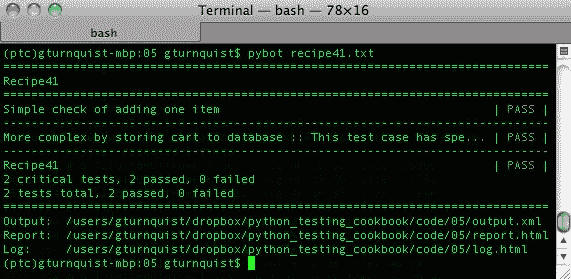

1.  通过输入`pybot -exclude database recipe41.txt`来运行测试场景，排除了被标记为`database`的测试。

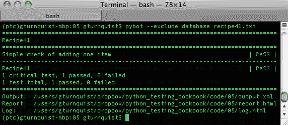

1.  通过输入`pybot -include database recipe41.txt`来运行测试场景，包括被标记为`database`的测试：

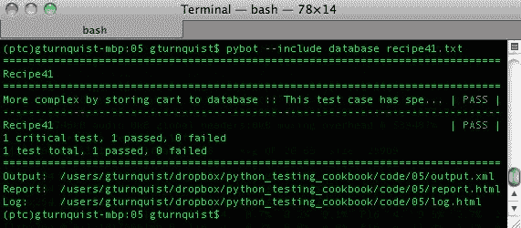

1.  查看`report.html`，观察额外的`[Documentation]`文本出现的位置，以及我们的`database`标记：

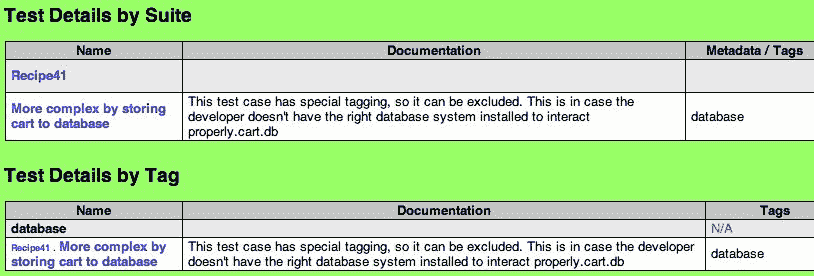

# 工作原理...

在本教程中，我们为第二个测试用例添加了一个额外的部分，包括文档和标记：

```py
More complex by storing cart to database 
  [Documentation]  This test case has special tagging, so it can be excluded. This is in case the developer doesn't have the right database system installed to interact properly.cart.db 
  [Tags]  database 
  Given an empty cart 
  When I add a  carton of milk  for  2.50 
  And I add a   frozen pizza    for  3.50 
  And I store the cart 
  And I retrieve the cart 
  Then there are  2  items 
```

标记可在命令行上使用，就像前面的示例中所示的那样。它提供了一种有用的方式来组织测试用例。测试用例可以有尽可能多的标记。

我们之前展示了这提供了一个方便的命令行选项，可以根据标签包含或排除。标签还提供有用的文档，`report.html`的上一个截图显示了测试结果也按标签进行了小计：

+   标签可用于标识不同层次的测试，例如冒烟测试、集成测试和面向客户的测试

+   标签还可以用于标记子系统，如数据库、发票、客户服务和结算

# 还有更多...

这个示例演示了纯文本格式。三个星号用于包围标题单元格，两个空格用于指定两个单元格之间的间隔。

关于这是否比 HTML 更难阅读存在争议。它可能不像阅读 HTML 标记那样清晰，但我个人更喜欢这种方式而不是阅读 HTML 的角度。可以添加更多的空格，以使表格的单元格更清晰，但我没有这样做，因为这本书的字体大小与之不太匹配。

# 文档呢？

我们还添加了一点演示目的的文档。当`pybot`运行时，一段文本会出现，并且也会出现在生成的工件中。

# 另请参阅

+   *安装 Robot Framework*

+   *使用 Robot Framework 创建数据驱动的测试套件*

+   使用 Robot Framework 编写可测试的故事

# 使用 Robot Framework 测试 Web 基础知识

Web 测试是一种常见的验收测试风格，因为客户想知道系统是否可接受，这是展示它的完美方式。

在以前的示例中，我们已经探索了针对非 Web 应用程序编写测试的方法。在这个示例中，让我们看看如何使用第三方 Robot Framework 插件来使用 Selenium 测试购物车 Web 应用程序。

# 准备好了...

1.  我们首先需要激活我们的`virtualenv`设置。

1.  对于这个示例，我们使用的是 Satchmo 购物车 Web 应用程序。要启动它，请切换到 store 目录并输入 python manage.py runserver。您可以通过访问 http://localhost:8000 来探索它。

1.  接下来，按照*安装**Robot**Framework*示例中所示，安装 Robot Framework 和第三方 Selenium 插件。

# 如何做...

通过以下步骤，我们将看到如何使用一些基本的 Robot 命令来驱动 Web 应用程序：

1.  创建一个名为`recipe42.txt`的纯文本故事文件，其中包含故事的开头描述：

```py
As a store customer
I want to put things into my cart
So that I can verify the store's functionality.
```

1.  创建一个测试用例部分，并添加一个验证购物车为空并捕获屏幕截图的场景：

```py
*Test Cases*
Inspect empty cart in detail
  Click link Cart
  Page Should Contain Your cart is empty
  Page Should Contain 0 - $0.00
  Capture Page Screenshot recipe42-scenario1-1.png
```

1.  添加另一个场景，选择一本书，将两本书添加到购物车中，并确认总购物车价值：

```py
Load up a cart with 2 of the same
  Click link Science Fiction don't wait
  Capture Page Screenshot recipe42-scenario2-1.png
  Click link Robots Attack!
  Capture Page Screenshot recipe42-scenario2-2.png
  Input text quantity 2
  Capture Page Screenshot recipe42-scenario2-3.png
  Click button Add to cart
  Click link Cart
  Capture Page Screenshot recipe42-scenario2-4.png
  Textfield Value Should Be quantity 2
  Page Should Contain Robots Attack! (Hard cover)
  Html Should Contain <td align="center">$7.99</td>
  Html Should Contain <td align="center">$15.98</td>
  Html Should Contain <td>$15.98</td>
```

1.  添加一个关键字部分，并定义一个用于检查页面原始 HTML 的关键字：

```py
*Keywords*
Html Should Contain
    [Arguments]     ${expected}
    ${html}= Get Source
    Should Contain ${html} ${expected}
Startup
    Start Selenium Server
    Sleep 3s
```

`Get Source`是一个 Selenium 库关键字，用于获取整个页面的原始 HTML。`Start Selenium Server`是另一个用于启动 Selenium 服务器的关键字。还包括内置的`Sleep`调用，以避免启动/关闭时序问题，如果这个测试在另一个基于 Selenium 的测试套件之前或之后发生。

1.  添加一个导入 Selenium 库的部分，并为每个测试用例启动和关闭浏览器定义一个设置和拆卸过程：

```py
*Settings*
Library         SeleniumLibrary
Test Setup      Open Browser http://localhost:8000
Test Teardown   Close All Browsers
Suite Setup     Startup
Suite Teardown  Stop Selenium Server
```

`Test Setup`是一个内置关键字，用于定义在每个测试用例之前执行的步骤。在这种情况下，它使用 Selenium 库关键字`Open Browser`来启动指向 Satchmo 应用程序的浏览器。`Test Teardown`是一个内置关键字，它在每个测试结束时执行，并关闭此测试启动的浏览器。`Suite Setup`是一个内置关键字，仅在执行任何测试之前运行，`Suite Teardown`仅在此套件中的所有测试之后运行。在这种情况下，我们用它来启动和停止 Selenium 库。

1.  通过输入`pybot recipe42.txt`来运行测试套件：

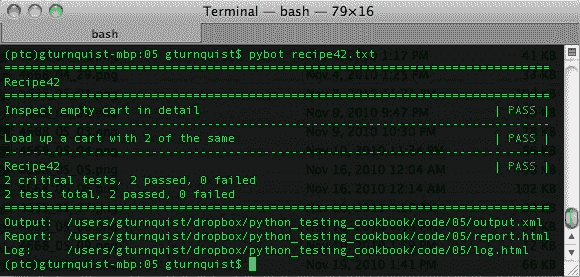

1.  打开`log.html`并观察细节，包括每个场景中捕获的屏幕截图。以下截图只是众多捕获的截图之一。随时可以检查其余的截图以及日志：

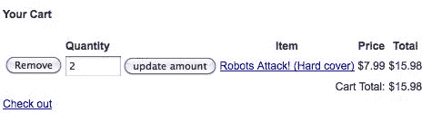

# 它是如何工作的...

Robot Framework 提供了一个强大的环境来通过关键字定义测试。Selenium 插件与 Selenium 进行接口，并提供一整套关键字，专注于操作 Web 应用程序并读取和确认它们的输出。

Web 应用程序测试的一个重要部分是获得一个元素来操作它或测试值。这样做的最常见方式是通过检查元素的关键属性，例如`id`、`name`或`href`。例如，在我们的场景中，有一个按钮，我们需要点击它以将书添加到购物车中。它可以通过 ID`addcart`或显示的文本`Add to cart`来识别。

# 还有更多...

虽然 Robot Framework 与其他商业前端测试解决方案相比是免费的，但重要的是要意识到编写自动化测试所需的工作量并不是免费且毫不费力的。要使其成为前端设计的一个积极部分需要付出努力。

在屏幕设计的过程中早期引入 Robot 和 Selenium 库等工具将鼓励良好的实践，例如标记框架和元素，以便尽早进行测试。这与在构建后端服务器系统后尝试编写自动化测试没有什么不同。如果它们后来被引入，这两种情况都会更加昂贵。在后端系统的早期引入自动化测试鼓励类似的编码以支持可测试性。

如果我们试图在开发周期的后期接受验收测试，或者尝试测试我们从另一个团队继承的系统，我们需要包括时间来对 Web 界面进行更改，以添加标签和标识符以支持编写测试。

# 了解定时配置-它们可能很重要！

虽然 Satchmo 购物车应用程序在我们编写的测试中没有任何显着的延迟，但这并不意味着其他应用程序不会有。如果您的 Web 应用程序的某些部分明显较慢，那么阅读有关配置 Selenium 等待应用程序响应多长时间的在线文档是很有价值的。

# 另请参阅

+   *安装 Robot Framework*

+   *使用 Robot Framework 创建数据驱动的测试套件*

+   *使用 Robot Framework 编写可测试的故事*

# 使用 Robot Framework 来验证 Web 应用程序安全性

Web 应用程序通常具有某种安全性。这通常以登录页面的形式存在。一个写得很好的测试用例应该在开始时启动一个新的浏览器会话，并在结束时关闭它。这导致用户在每个测试用例中重复登录。

在这个食谱中，我们将探讨编写代码以登录到 Django 提供的 Satchmo 的管理页面。然后，我们将展示如何将整个登录过程捕获到一个单一关键字中，从而使我们能够顺利地编写一个访问产品目录的测试，而不会被登录所拖累。

# 准备工作

1.  我们首先需要激活我们的`virtualenv`设置。

1.  对于这个食谱，我们使用 Satchmo 购物车 Web 应用程序。要启动它，请切换到 store 目录并输入`python manage.py runserver`。您可以通过访问`http://localhost:8000`来探索它。

1.  接下来，按照*安装 Robot Framework*食谱中所示，安装 Robot Framework 和第三方 Selenium 插件。

# 如何做...

以下步骤将突出显示如何捕获登录步骤，然后将其封装在一个自定义关键字中：

1.  创建一个名为`recipe43.txt`的新文件，并为练习 Django 的管理界面编写一个测试故事：

```py
As a system administrator
I want to login to Django's admin page
So that I can check the product catalog.
```

1.  为测试用例添加一个部分，并编写一个测试用例，测试登录页面：

```py
*Test Cases*
Logging in to the admin page
  Open Browser http://localhost:8000/admin
  Input text username gturnquist
  Input text password password
  Submit form
  Page Should Contain Link Products
  Close All Browsers
```

1.  添加另一个测试用例，检查产品目录并验证表中的特定行：

```py
Check product catalog
  Given that I am logged in
  Click link Products
  Capture Page Screenshot recipe43-scenario2-1.png
  Table Should Contain result_list Robots Attack!
  Table Row Should Contain result_list 4 Robots Attack!
  Table Row Should Contain result_list 4 7.99
  Close All Browsers
```

1.  创建一个捕获登录过程的关键字部分，作为一个单一的关键字：

```py
*Keywords*
Given that I am logged in
  Open Browser http://localhost:8000/admin/
  Input text username gturnquist
  Input text password password
  Submit form

Startup
  Start Selenium Server
  Sleep 3s
```

对于您自己的测试，请输入您在安装 Satchmo 时使用的用户名和密码。`Start Selenium Server`关键字是另一个启动 Selenium 服务器的关键字。内置的 Sleep 调用用于避免启动/关闭时间问题，如果这个测试在另一个基于 Selenium 的测试套件之前或之后发生。

1.  最后，添加一个设置部分，导入 Selenium 库，并在测试套件的开头和结尾启动和停止 Selenium 服务器：

```py
*Settings*
Library SeleniumLibrary
Suite Setup Startup
Suite Teardown Stop Selenium Server
```

1.  通过输入`pybot recipe43.txt`来运行测试套件：

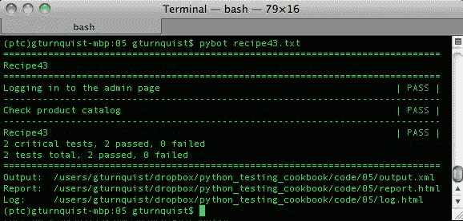

# 它是如何工作的...

第一个测试案例展示了我们如何输入用户名和密码数据，然后提交表单。SeleniumLibrary 允许我们按名称选择表单，但如果我们没有识别它，它会选择它找到的第一个 HTML 表单。由于登录页面上只有一个表单，这对我们来说很好用。

对于第二个测试案例，我们想要导航到产品目录。由于它在一个干净的浏览器会话中运行，我们被迫再次处理登录界面。这意味着我们需要包括相同的步骤再次登录。为了进行更全面的测试，我们可能会编写很多测试案例。*为什么* *我们* *应该* *避免* *为* *每个* *测试* *案例* *复制* *和* *粘贴* *相同的* *登录* *步骤*？因为这违反了**不要重复自己**（**DRY**）原则。如果登录页面被修改，我们可能需要修改每个实例。

相反，我们使用`Given that I am logged in`关键字捕获了登录步骤。这为我们提供了许多测试案例的有用子句，并让我们专注于管理页面。

# 还有更多...

在这个示例中，我们使用了一些 Selenium 库的表测试操作。我们验证了特定书籍在表级和行级都存在。我们还验证了该行中书籍的价格。

最后，我们捕获了产品目录的屏幕截图。这个屏幕截图给了我们一个快速的、视觉的一瞥，我们可以用它来手动确认产品目录，或者用它来规划我们的下一个测试步骤。

# 为什么不使用“记住我”选项？

许多网站都包括一个“记住我”复选框，以便在客户端 cookie 中保存登录凭据。Django 管理页面没有这个选项，那么这与我们有关吗？这是因为许多网站都有这个选项，我们可能会想要将其纳入我们的测试中，以避免每次都登录。即使我们要测试的 Web 应用程序有这个选项，使用它也不是一个好主意。它会创建一个持久状态，可以从一个测试传播到下一个测试。不同的用户账户可能有不同的角色，影响可见内容。我们可能不知道测试案例的运行顺序，因此必须添加额外的代码来嗅探我们登录的用户是谁。

相反，更容易和更清晰的方法是*不*持久化这些信息。相反，通过单个关键字明确登录提供了更清晰的意图。这并不意味着我们不应该测试和确认特定网页应用的记住复选框。相反，我们实际上应该测试好账户和坏账户，以确保登录界面按预期工作。然而，除此之外，最好不要用当前测试案例的持久化结果混淆未来的测试案例。

# 我们不应该重构第一个测试场景来使用这个关键字吗？

为了遵守 DRY 原则，我们应该在测试故事中的一个地方进行登录过程。然而，出于演示目的，我们将其编码在顶部，然后将相同的代码复制到一个关键字中。最好的解决方案是将其封装成一个单一的关键字，可以在测试案例中重复使用，也可以用来定义其他自定义关键字，比如`Given I am logged in`。

# 登录关键字更灵活吗？

绝对地——在这个测试故事中，我们硬编码了用户名和密码。然而，对登录页面进行良好的测试将涉及到一个数据驱动的表格，其中包含大量的良好和不良账户的组合，以及有效和无效的密码。这就需要一种接受用户名和密码作为参数的登录关键字。

# 另请参阅

+   *安装 Robot Framework*

+   *使用 Pyccuracy 验证 Web 应用程序安全性*

+   *使用 Robot Framework 创建一个数据驱动的测试套件*

# 创建一个项目级别的脚本来验证本章的验收测试

我们已经使用了`pyccuracy_console`和`pybot`来运行各种测试配方。然而，管理一个 Python 项目涉及的不仅仅是运行测试。像打包、在 Python 项目索引中注册以及推送到部署站点等事情都是重要的管理程序。

构建一个命令行脚本来封装所有这些非常方便。通过这个配方，我们将运行一个运行本章中所有测试的脚本。

# 准备工作

1.  我们首先需要激活我们的`virtualenv`设置。

1.  对于这个配方，我们使用了 Satchmo 购物车 Web 应用程序。要启动它，切换到 store 目录，然后输入`python manage.py runserver`。您可以通过访问`http://localhost:8000`来探索它。

1.  接下来，按照*安装**Robot**Framework*配方中所示，安装 Robot Framework 和第三方 Selenium 插件。

1.  这个配方假设本章中的各种配方都已经编码完成。

# 如何做...

通过这些步骤，我们将看到如何以编程方式运行本章中的所有测试：

1.  创建一个名为`recipe44.py`的新文件，以包含这个配方的代码。

1.  创建一个命令行脚本，定义几个选项：

```py
import getopt
import logging
import os
import os.path
import re
import sys
from glob import glob

def usage():
    print
    print "Usage: python recipe44.py [command]"
    print
    print "t--help"
    print "t--test"
    print "t--package"
    print "t--publish"
    print "t--register"
    print
try:
    optlist, args = getopt.getopt(sys.argv[1:],
            "h",
            ["help", "test", "package", "publish", "register"])
except getopt.GetoptError:
    # print help information and exit:
    print "Invalid command found in %s" % sys.argv
    usage()
    sys.exit(2)
```

1.  添加一个方法来启动 Selenium，运行基于 Pyccuracy 的测试，然后关闭 Selenium：

```py
def test_with_pyccuracy():
    from SeleniumLibrary import start_selenium_server
    from SeleniumLibrary import shut_down_selenium_server
    from time import sleep

    f = open("recipe44_selenium_log.txt", "w")
    start_selenium_server(logfile=f)
    sleep(10)

    import subprocess
    subprocess.call(["pyccuracy_console"])
    shut_down_selenium_server()
    sleep(5)
    f.close()
```

1.  添加一个运行 Robot Framework 测试的方法：

```py
def test_with_robot():
    from robot import run
    run(".")
```

1.  添加一个方法来运行这两个测试方法：

```py
def test():
    test_with_pyccuracy()
    test_with_robot()
```

1.  为其他项目函数添加一些存根方法：

```py
def package():
    print "This is where we can plug in code to run " +
        "setup.py to generate a bundle."
def publish():
    print "This is where we can plug in code to upload " +
        "our tarball to S3 or some other download site."
def register():
    print "setup.py has a built in function to " +
        "'register' a release to PyPI. It's " +
        "convenient to put a hook in here."
    # os.system("%s setup.py register" % sys.executable)
```

1.  添加一些解析选项的代码：

```py
if len(optlist) == 0:
    usage()
    sys.exit(1)
# Check for help requests, which cause all other
# options to be ignored.
for option in optlist:
    if option[0] in ("--help", "-h"):
        usage()
        sys.exit(1)

# Parse the arguments, in order
for option in optlist:
    if option[0] in ("--test"):
        test()
    if option[0] in ("--package"):
        package()
    if option[0] in ("--publish"):
        publish()
    if option[0] in ("--register"):
        register()
```

1.  通过输入`python``recipe44 -test`来运行带有测试标志的脚本。在下面的截图中，我们可以看到所有的 Pyccuracy 测试都通过了：

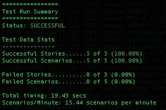

在下一个截图中，我们可以看到 Robot Framework 测试也通过了：

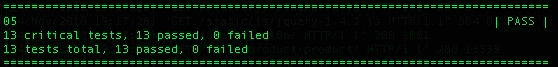

# 它是如何工作的...

我们使用 Python 的`getopt`模块来定义命令行选项：

```py
    optlist, args = getopt.getopt(sys.argv[1:], 
            "h", 
           ["help", "test", "package", "publish", "register"]) 
```

这将映射以下内容：

+   `"h"`: `-h`

+   `"help"`: `--help`

+   `"test"`: `--test`

+   `"package"`: `--package`

+   `"publish"`: `--publish`

+   `"register"`: `--register`

我们扫描接收到的参数列表，并调用相应的函数。对于我们的测试函数，我们使用 Python 的`subprocess`模块来调用`pyccuracy_console`。我们也可以用同样的方法调用`pybot`，但是 Robot Framework 提供了一个方便的 API 来直接调用它：

```py
    from robot import run 
    run(".") 
```

这让我们可以在我们的代码中使用它。

# 还有更多

要运行这些测试，我们需要运行 Selenium。我们的 Robot Framework 测试是构建在自己运行 Selenium 的基础上的。Pyccuracy 没有这样的功能，所以它需要另一种方法。在那些配方中，我们使用了`java -jar selenium-server.jar`。我们可以尝试管理这个，但使用 Selenium 库的 API 来启动和停止 Selenium 更容易。

这就是在纯 Python 中编写代码给我们最多选择的地方。我们能够使用另一个本来不打算与之一起工作的库的部分来增强 Pyccuracy 的功能。

# 我们只能使用 getopt 吗？

Python 2.7 引入了`argparse`作为一种替代方法。当前的文档没有表明`getopt`已经被弃用，所以我们可以像刚才做的那样安全地使用它。`getopt`模块是一个很好的、易于使用的命令行解析器。

# 使用各种命令行工具有什么问题？

使用诸如`pyccuracy_console`、`pybot`、`nosetests`等工具并没有错，这些工具都是 Python 库中自带的。这个教程的目的是提供一种方便的替代方法，将所有这些工具整合到一个中心脚本中。通过在这个脚本上投入一点时间，我们就不必记住如何使用所有这些功能；相反，我们可以开发我们的脚本来支持项目的开发工作流程。
