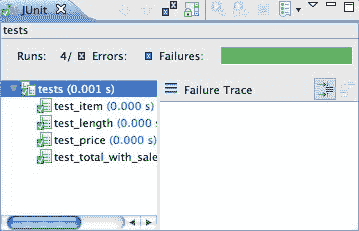

# 第六章：将自动化测试与持续集成集成

在这一章中，我们将涵盖：

+   使用 NoseXUnit 为 Jenkins 生成持续集成报告

+   配置 Jenkins 在提交时运行 Python 测试

+   配置 Jenkins 在计划时运行 Python 测试

+   使用 teamcity-nose 为 TeamCity 生成持续集成报告

+   配置 TeamCity 在提交时运行 Python 测试

+   配置 TeamCity 在计划时运行 Python 测试

# 介绍

众所周知的经典软件开发过程瀑布模型包括以下阶段：

1.  收集和定义需求

1.  起草设计以满足需求

1.  编写实施策略以满足设计

1.  编码完成

1.  对编码实施进行测试

1.  系统与其他系统以及该系统的未来版本集成

在瀑布模型中，这些步骤通常分布在几个月的工作中。这意味着与外部系统集成的最后一步是在几个月后完成的，并且通常需要大量的工作。**持续集成（CI）**通过引入编写测试来解决瀑布模型的不足，这些测试可以测试这些集成点，并且在代码检入系统时自动运行。采用 CI 的团队通常会立即修复基线，如果测试套件失败。这迫使团队不断地保持他们的代码工作和集成，因此使得这一最终步骤相对成本低廉。采用更敏捷的方法的团队工作周期更短。团队可能会在编码冲刺中工作，这些冲刺的周期可能从每周到每月不等。同样，通过每次检入时运行集成测试套件，基线始终保持功能正常；因此，它随时可以交付。这可以防止系统处于非工作状态，只有在冲刺结束或瀑布周期结束时才能使其工作。这为客户或管理层提供了更多的代码演示机会，可以更主动地获取反馈并更积极地投入开发。这一章更侧重于将自动化测试与 CI 系统集成，而不是编写测试。因此，我们将重复使用以下购物车应用程序。创建一个名为`cart.py`的新文件，并将以下代码输入其中：

```py
class ShoppingCart(object): 
    def __init__(self): 
        self.items = [] 

    def add(self, item, price): 
        for cart_item in self.items: 
            # Since we found the item, we increment 
            # instead of append 
            if cart_item.item == item: 
                cart_item.q += 1 
                return self 

        # If we didn't find, then we append 
        self.items.append(Item(item, price)) 
        return self 

    def item(self, index): 
        return self.items[index-1].item 

    def price(self, index): 
        return self.items[index-1].price * self.items[index-1].q 

    def total(self, sales_tax): 
        sum_price = sum([item.price*item.q for item in self.items]) 
        return sum_price*(1.0 + sales_tax/100.0) 

    def __len__(self): 
        return sum([item.q for item in self.items]) 

class Item(object): 
    def __init__(self, item, price, q=1): 
        self.item = item 
        self.price = price 
        self.q = q 
```

为了演示 CI，本章中的各种配方将使用以下简单应用程序的一组简单的单元测试。创建另一个名为`tests.py`的文件，并将以下测试代码输入其中：

```py
from cart import * 
import unittest 

class ShoppingCartTest(unittest.TestCase): 
    def setUp(self): 
        self.cart = ShoppingCart().add("tuna sandwich", 15.00) 

    def test_length(self): 
        self.assertEquals(1, len(self.cart)) 

    def test_item(self): 
        self.assertEquals("tuna sandwich", self.cart.item(1)) 

    def test_price(self): 
        self.assertEquals(15.00, self.cart.price(1)) 

    def test_total_with_sales_tax(self): 
        self.assertAlmostEquals(16.39,  
                                self.cart.total(9.25), 2) 
```

这一简单的测试集看起来并不令人印象深刻，是吗？实际上，它并不像我们之前谈到的集成测试，而是基本的单元测试，对吧？完全正确！这一章并不侧重于编写测试代码。那么，如果这本书是关于代码配方，为什么我们要关注工具呢？因为使自动化测试与团队合作比编写测试更重要。了解将自动化测试概念并将其整合到我们的开发周期中的工具是很重要的。CI 产品是一个有价值的工具，我们需要了解如何将它们与我们的测试代码联系起来，从而使整个团队都能参与并使测试成为我们开发过程中的一等公民。这一章探讨了两种强大的 CI 产品：Jenkins 和 TeamCity。

**Jenkins** ([`jenkins-ci.org/`](http://jenkins-ci.org/)) 是一个开源产品，最初由 Sun Microsystems 的一名开发人员领导创建，后来在 Sun 被 Oracle 收购后离开。它有一个强大的开发者社区，许多人提供补丁、插件和改进。它最初被称为**Hudson**，但开发社区投票决定改名以避免法律纠纷。整个 Hudson/Jenkins 命名的历史可以在网上阅读，但与本书中的示例无关。**TeamCity** ([`www.jetbrains.com/teamcity/`](http://www.jetbrains.com/teamcity/)) 是由 JetBrains 创建的产品，该公司还生产商业产品，如 IntelliJ IDE、ReSharper 和 PyCharm IDE。专业版是一个免费版本，在本章中将用于展示另一个 CI 系统。它还有企业版、商业升级版，您可以自行评估。

# 使用 NoseXUnit 为 Jenkins 生成 CI 报告

**JUnit** ([`junit.org`](http://junit.org)) 是自动化测试中的软件行业领导者。它提供了生成 XML 报告文件的能力，这些文件可以被许多工具使用。这也适用于像 Jenkins 这样的持续集成工具。**NoseXUnit** ([`nosexunit.sourceforge.net/`](http://nosexunit.sourceforge.net/)) 是一个`nose`插件，以相同的格式生成 Python 测试结果的 XML 报告。它像 JUnit 一样使用 XML 报告，但适用于 PyUnit。即使我们不是在构建 Java 代码，也没有要求我们的 CI 服务器不能是基于 Java 的系统。只要我们能生成正确的报告，这些工具就可以使用。考虑到最受欢迎和得到良好支持的 CI 系统之一是 Jenkins，这种类型的插件非常有用。通过这个示例，我们将探讨如何从简单的 Python 测试生成可用的报告。

# 准备工作

需要以下步骤来安装本章的所有组件：

1.  安装`nose`。

1.  通过输入`pip install nosexunit`来安装 NoseXUnit ([`nosexunit.sourceforge.net/`](http://nosexunit.sourceforge.net/))

# 操作步骤...

以下步骤将展示如何使用 NoseXUnit 插件生成与 Jenkins 兼容格式的 XML 报告：

1.  使用`nosetests`和 NoseXUnit 插件来测试购物车应用程序，输入`nosetests tests.py --with-nosexunit`：


1.  使用 XML 或文本编辑器打开`target/NoseXUnit/core/TEST-tests.xml`中的报告。以下截图显示了在 Spring Tool Suite ([`www.springsource.com/developer/sts`](http://www.springsource.com/developer/sts))中显示的报告，这是 Eclipse 的一个衍生产品（这绝不是一种推荐）。许多现代 IDE 都内置了 XML 支持，其他编辑器如 Emacs、TextPad 等也有：


# 它是如何工作的...

NoseXUnit 收集每个测试的结果，并生成一个与 JUnit 相同格式的 XML 报告。XML 文件并不是为人类消费设计的，但很容易辨别结果。当我们之前运行`nosetests`时，有多少个测试用例通过了？测试方法的名称是什么？在这个 XML 文件中，我们可以看到四个测试用例的名称。实际上，如果这个文件在某些工具中打开，比如 STS，它会显示为一个测试结果：



我们不必使用 STS 来完成任何操作。实际上，STS 对于这个简单的任务来说有点过于庞大。您喜欢的 XML 或文本编辑器可以用来检查报告。我只是想演示这个插件的输出如何与现有工具很好地配合。通过输入`nosetests help`，我们可以看到`nose`从所有已安装的插件中具有的所有选项。这包括：

+   `--core-target=CORE_TARGET`: 测试报告的输出文件夹（默认为 target/NoseXUnit/core）

+   `--with-nosexunit`: 通过插件运行

# 配置 Jenkins 在提交时运行 Python 测试

Jenkins 可以配置为在提交时调用我们的测试套件。这非常有用，因为我们可以使其跟踪我们的更改。使用 CI 系统的团队通常会立即解决 CI 失败，以保持基线功能。Jenkins 提供了几乎无限的功能，例如从版本控制中检索最新源代码，打包发布，运行测试，甚至分析源代码。这个配方展示了如何配置 Jenkins 来运行我们的测试套件针对我们的购物车应用程序。

# 准备工作

1.  从[`mirrors.jenkins-ci.org/war/latest/jenkins.war`](http://mirrors.jenkins-ci.org/war/latest/jenkins.war)下载 Jenkins：


1.  通过运行`java -jar jenkins.war`来启动它。重要的是没有其他应用程序在端口`8080`上监听：


1.  打开控制台确认 Jenkins 正在工作：


1.  点击管理 Jenkins。

1.  点击管理插件。

1.  点击可用选项卡。

1.  找到 Git 插件并点击旁边的复选框。

1.  在页面底部，点击安装按钮。验证插件是否成功安装。

1.  返回仪表板屏幕。

1.  关闭 Jenkins，然后重新启动。

1.  在您的计算机上安装 Git 源代码控制。您可以访问[`git-scm.com/`](http://git-scm.com/)找到可下载的软件包。您的系统也可能包括 MacPorts 或 Homebrew（适用于 Mac）、Red Hat Linux 发行版的 yum 和 Debian/Ubuntu 系统的 apt-get 等软件包安装选项。

1.  为这个配方创建一个空文件夹：

```py
    gturnquist$ mkdir /tmp/recipe46

```

1.  初始化用于源代码维护的文件夹：

```py
    gturnquist$ git init /tmp/recipe46
    Initialized empty Git repository in /private/tmp/recipe46/.git/

```

1.  将购物车应用程序复制到文件夹中，添加并提交更改：

```py
    gturnquist$ cp cart.py /tmp/recipe46/
    gturnquist$ cd /tmp/recipe46/
    gturnquist$ git add cart.py
    gturnquist$ git commit -m "Added shopping cart application to setup this recipe."
    [master (root-commit) 057d936] Added shopping cart application to setup this recipe.
     1 files changed, 35 insertions(+), 0 deletions(-)
     create mode 100644 cart.py

```

# 如何做...

以下步骤将展示如何将我们的代码置于控制之下，然后在进行任何更改并提交时运行测试套件：

1.  打开 Jenkins 控制台。

1.  点击新作业。

1.  将`recipe46`输入作业名称并选择构建自由样式软件项目。

1.  点击 a。 

1.  在源代码管理部分，选择 Git。对于 URL，输入`/tmp/recipe46/`。

1.  在构建触发器部分，选择轮询 SCM 并在计划框中输入`* * * * *`，以便每分钟触发一次轮询。

1.  在构建部分，选择执行 shell 并输入以下临时脚本，加载虚拟环境并运行测试套件：

```py
. /Users/gturnquist/ptc/bin/activate 
nosetests tests.py -with-nosexunit 
```

您需要替换激活您自己的虚拟环境的命令，无论是在 Windows、Linux 还是 macOS 上，然后跟随我们在本章早些时候所做的运行测试的命令。

1.  在后构建操作部分，选择发布 JUnit 测试结果报告并输入`target/NoseXUnit/core/*.xml`，以便 Jenkins 收集测试结果。

1.  点击保存以存储所有作业设置。

1.  点击启用自动刷新。我们应该期望第一次运行失败，因为我们还没有添加任何测试：


1.  将测试套件复制到受控源文件夹中，添加并提交：

```py
    gturnquist$ cp tests.py /tmp/recipe46/
    gturnquist$ cd /tmp/recipe46/
    gturnquist$ git add tests.py
    gturnquist$ git commit -m "Added tests for the recipe."
    [master 0f6ef56] Added tests for the recipe.
     1 files changed, 20 insertions(+), 0 deletions(-)
     create mode 100644 tests.py

```

1.  观察以验证 Jenkins 是否启动了成功的测试运行：


1.  转到测试结果页面，我们可以看到其中有四个测试被运行。

# 它是如何工作的...

Jenkins 提供了一种强大灵活的配置 CI 作业的方式。在这个配方中，我们配置它每分钟轮询我们的软件确认管理系统。当它检测到变化时，它会拉取软件的新副本并运行我们的测试脚本。通过使用 NoseXUnit 插件，我们生成了一个易于在 Jenkins 中收集的工件。通过少数步骤，我们能够配置一个监视我们源代码的网页。

# 还有更多...

Jenkins 有很多选项。如果您检查 Web 界面，您可以深入到输出日志中查看实际发生了什么。它还收集趋势，显示我们成功运行了多长时间，上次构建失败了多长时间等。

# 我必须使用 git 进行源代码管理吗？

答案是否定的。我们在这个配方中使用它，只是为了快速展示如何从 Web 界面内安装 Jenkins 插件。要应用插件，我们必须重新启动 Jenkins。Subversion 和 CVS 是开箱即用的。Jenkins 还有支持每个主要源代码控制系统的插件，因此满足您的需求应该很容易。事实上，还支持 GitHub 和 BitKeeper 等社交编码网站的插件。我们可以配置 Jenkins 安装以监视某个 GitHub 帐户的更新，而不是使用 Git 插件。

# 轮询的格式是什么？

我们使用了`* * * * *`配置了轮询，这意味着每分钟运行一次。这是基于配置 crontab 文件所使用的格式。从左到右的列是：

+   **MINUTE**: 小时内的分钟（0-59）

+   **HOUR**: 一天中的小时（0-23）

+   **DOM**: 月份的第几天（1-31）

+   **MONTH**: 月份（1-12）

+   **DOW:** 一周的第几天（0-7），其中 0 和 7 代表星期日

# 另请参阅

使用 NoseXUnit 为 Jenkins 生成 CI 报告

# 配置 Jenkins 在预定时间运行 Python 测试

我们刚刚探讨了如何配置 Jenkins 在提交代码更改时运行我们的测试套件。Jenkins 也可以配置为在预定的时间间隔内调用我们的测试套件。这非常有用，因为我们可以将其调整为进行定期发布。每天或每周发布可以为潜在客户提供一个不错的发布节奏。CI 发布通常被理解为不一定是最终版本，而是提供最新支持，以便客户可以尽早调查和集成新功能。

# 准备工作

以下步骤用于设置 Jenkins 以及我们测试的副本，以便我们可以在预定的时间间隔内轮询它：

1.  按照之前的配方*配置 Jenkins 在提交时运行 Python 测试*来设置 Jenkins。这应该包括已设置 Git 插件。

1.  为这个配方创建一个空文件夹：

```py
    gturnquist$ mkdir /tmp/recipe47

```

1.  初始化源代码维护的文件夹：

```py
    gturnquist$ git init /tmp/recipe47
    Initialized empty Git repository in /private/tmp/recipe47/.git/

```

1.  将购物车应用程序复制到文件夹中，添加并提交更改：

```py
    gturnquist$ cp cart.py /tmp/recipe47/
    gturnquist$ cd /tmp/recipe47/
    gturnquist$ git add cart.py
    gturnquist$ git commit -m "Added shopping cart application to setup this recipe."
    [master (root-commit) 057d936] Added shopping cart application to setup this recipe.
     1 files changed, 35 insertions(+), 0 deletions(-)
     create mode 100644 cart.py

```

# 如何做...

以下步骤将让我们探索创建一个 Jenkins 作业，定期运行我们的自动化测试套件：

1.  打开 Jenkins 控制台。

1.  点击“新建作业”。

1.  将`recipe47`作为作业名称，并选择“构建自由风格的软件项目”。

1.  点击“确定”。

1.  在“源代码管理”部分，选择 Git。对于 URL，输入`/tmp/recipe47/`。

1.  在“构建触发器”部分，选择“定期构建”并输入未来的某个时间。在为本书编写这个配方时，作业是在下午 6:10 左右创建的，因此在计划框中输入`15 18 * * *`会在下午 6:15 将作业安排到未来的五分钟内。

1.  在“构建”部分，选择“执行 shell”并输入以下临时脚本，加载虚拟环境并运行测试套件：

```py
. /Users/gturnquist/ptc/bin/activatenosetests tests.py -with-nosexunit
```

您需要用激活虚拟环境的命令替换这个，然后是运行测试的步骤。

1.  在“后构建操作”部分，选择“发布 JUnit 测试结果报告”并输入`target/NoseXUnit/core/*.xml`，以便 Jenkins 收集测试结果。

1.  点击“保存”以存储所有作业设置。

1.  点击“启用自动刷新”。

1.  将测试套件复制到受控源文件夹中，添加并提交：

```py
    gturnquist$ cp tests.py /tmp/recipe47/
    gturnquist$ cd /tmp/recipe47/
    gturnquist$ git add tests.py
    gturnquist$ git commit -m "Added tests for the recipe."
    [master 0f6ef56] Added tests for the recipe.
     1 files changed, 20 insertions(+), 0 deletions(-)
     create mode 100644 tests.py

```

1.  观察以验证 Jenkins 是否启动了成功的测试运行：


1.  导航到测试结果，我们可以看到我们的四个测试都已运行。

# 工作原理...

这与上一个配方非常相似，只是这次我们配置了一个轮询间隔来运行我们的测试套件，而不是轮询版本控制系统。这很有用，因为我们可以每天运行一次构建，以确保事情稳定并正常工作。

# 还有更多...

Jenkins 有很多选项。如果您查看 Web 界面，可以深入到输出日志中，看看实际发生了什么。它还收集趋势，显示我们成功运行了多长时间，上次构建失败是什么时候，等等。老实说，Jenkins 有很多插件和选项，可以专门探索其功能。本章的后半部分只是一个简单介绍，介绍了一些以测试为导向的常见作业。

# Jenkins 与 TeamCity

到目前为止，我们已经探索了使用 Jenkins。在本章的后面，我们将访问 TeamCity。它们有什么区别？为什么我们应该选择其中一个？在功能上，它们都提供了强大的选择。这就是为什么它们都包含在这本书中的原因。它们都提供的关键功能是设置运行测试的作业，以及其他一些功能，比如打包。一个关键区别是 Jenkins 是一个开源产品，而 TeamCity 是商业产品。您或您的公司可能更喜欢与产品相关联的付费公司（[`www.jetbrains.com/`](http://www.jetbrains.com/)），这就是 TeamCity 提供的。这并不能让决定变得非常清晰，因为 Jenkins 的主要开发人员目前为 CloudBees 工作（[`www.cloudbees.com/`](http://www.cloudbees.com/)），他们也在 Jenkins 以及周围产品上投入了努力。如果商业支持并不迫切，您可能会发现 Jenkins 的开发速度更快，插件数量更多样化。最重要的是，选择满足您 CI 需求的产品需要进行详细的分析，这里无法简单回答。

# 另请参阅

使用 NoseXUnit 为 Jenkins 生成 CI 报告

# 使用 teamcity-nose 为 TeamCity 生成 CI 报告

有一个`nose`插件，可以自动检测在 TeamCity 内运行测试时。这方便地捕获测试结果并将其与 TeamCity 通信。通过这个配方，我们将探索如何在 TeamCity 内设置一个 CI 作业，运行我们的测试，然后手动调用该作业。

# 做好准备

需要以下步骤来准备运行 TeamCity CI 作业：

1.  安装`nosetests`。

1.  通过输入`pip install teamcity-nose`来安装`teamcity-nose`。

1.  使用 Wget 下载 TeamCity（[`download.jetbrains.com/teamcity/TeamCity-6.0.tar.gz`](http://download.jetbrains.com/teamcity/TeamCity-6.0.tar.gz)）。

1.  解压下载文件。

1.  切换到`TeamCity/bin`目录。

1.  启动它：`./runAll.sh start`。

1.  打开浏览器，输入`http://localhost:8111`。

1.  如果这是您第一次启动 TeamCity，请接受许可协议。

1.  通过选择用户名和密码创建管理员帐户。

1.  在您的计算机上安装 Git 源代码控制。

1.  为这个配方创建一个空文件夹：

```py
    gturnquist$ mkdir /tmp/recipe48

```

1.  初始化源代码维护的文件夹：

```py
    gturnquist$ git init /tmp/recipe48
    Initialized empty Git repository in /private/tmp/recipe48/.git/

```

1.  将购物车应用程序和测试复制到文件夹中，添加并提交更改：

```py
    gturnquist$ cp cart.py /tmp/recipe48/
    gturnquist$ cp tests.py /tmp/recipe48/
    gturnquist$ cd /tmp/recipe48/
    gturnquist$ git add cart.py tests.py
    gturnquist$ git commit -m "Added shopping cart and tests to setup this recipe."
    [master (root-commit) ccc7155] Added shopping cart and tests to setup this recipe.
     2 files changed, 55 insertions(+), 0 deletions(-)
     create mode 100644 cart.py
     create mode 100644 tests.py

```

# 如何做...

以下步骤显示了如何在 TeamCity 中配置 CI 作业：

1.  登录 TeamCity 控制台。

1.  在项目选项卡下，点击创建项目。

1.  输入`recipe48`，然后点击创建。

1.  为此项目添加一个构建配置。

1.  输入`nose testing`作为名称，然后点击 VCS 设置。

1.  点击创建并附加新的 VCS 根。

1.  在 VCS 根名称中输入`recipe48`。

1.  选择 Git 作为 VCS 的类型。

1.  将`/tmp/recipe48`输入为获取 URL。

1.  点击测试连接以确认设置，然后点击保存。

1.  点击添加构建步骤。

1.  选择命令行作为运行器类型。

1.  选择自定义脚本作为运行类型，并输入以下脚本：

```py
. /Users/gturnquist/ptc/bin/activatenosetests tests.py
```

您需要使用激活您的虚拟环境所需的命令来自定义此设置。

1.  点击保存。

1.  返回到项目，手动运行它：


# 它是如何工作的...

这个插件设计成不是以经典方式通过命令行参数调用。相反，它在每次执行`nosetests`时自动运行，并检查是否设置了 TeamCity 特定的环境变量。如果是，它会通过打印可查看的结果以及发送有用信息回 TeamCity 来启动：


否则，插件会被绕过并且什么也不做。如果插件没有安装，以下截图将是输出：


依次深入细节，显示以下输出，但细节很少。有四个周期，每个测试方法一个，但我们不知道更多：


这意味着不需要额外的参数来使用 TeamCity 插件，但是从命令行外部运行它，会导致没有变化。

# 配置 TeamCity 在提交时运行 Python 测试

TeamCity 可以配置为在提交时调用您的测试套件。

# 准备就绪

以下步骤将帮助我们准备 TeamCity 在代码更改提交时运行我们的测试套件：

1.  像上一个配方一样设置 TeamCity，并启动它。如前面的章节中提到的，您还需要安装`git`。

1.  为这个配方创建一个空文件夹：

```py
    gturnquist$ mkdir /tmp/recipe49

```

1.  初始化源代码维护的文件夹：

```py
    gturnquist$ git init /tmp/recipe49
    Initialized empty Git repository in /private/tmp/recipe49/.git/

```

1.  将购物车应用程序复制到文件夹中，添加并提交更改：

```py
    gturnquist$ cp cart.py /tmp/recipe49/
    gturnquist$ cd /tmp/recipe49/
    gturnquist$ git add cart.py
    gturnquist$ git commit -m "Added shopping cart application to setup this recipe."
    [master (root-commit) 057d936] Added shopping cart application to setup this recipe.
     1 files changed, 35 insertions(+), 0 deletions(-)
     create mode 100644 cart.py

```

# 如何做...

这些步骤将向我们展示如何创建一个 TeamCity 作业，该作业轮询版本控制以检测更改，然后运行测试套件：

1.  登录到 TeamCity 控制台。

1.  在项目选项卡下，点击创建项目。

1.  输入`recipe49`，然后点击创建。

1.  点击为此项目添加构建配置。

1.  输入`nose testing`作为名称，然后点击 VCS 设置。

1.  点击创建并附加新的 VCS 根。

1.  在 VCS 根名称中输入`recipe49`。

1.  选择 Git 作为 VCS 的类型。

1.  将`**/**tmp/recipe49`输入为获取 URL。

1.  点击测试连接以确认设置，然后点击保存。

1.  点击添加构建步骤。

1.  选择命令行作为运行器类型。

1.  选择自定义脚本作为运行类型，并输入以下脚本：

```py
. /Users/gturnquist/ptc/bin/activatenosetests tests.py
```

您必须用激活您自己的虚拟环境并调用`nosetests`的命令替换它。

1.  点击保存。

1.  点击构建触发。

1.  点击添加新的触发器。

1.  从触发类型中选择 VCS 触发器。

1.  在顶部，应该显示 VCS 触发器将在检测到 VCS 签入时将构建添加到队列中。点击保存。

1.  导航回到项目。不应该有任何已安排的工作或显示的结果。

1.  点击运行。它应该失败，因为我们还没有将测试添加到存储库中：


1.  从命令行中，将测试文件复制到存储库中。然后添加并提交：

```py
    gturnquist$ cp tests.py /tmp/recipe49/
    gturnquist$ cd /tmp/recipe49/
    gturnquist$ git add tests.py
    gturnquist$ git commit -m "Adding tests."
    [master 4c3c418] Adding tests.
     1 files changed, 20 insertions(+), 0 deletions(-)
     create mode 100644 tests.py

```

1.  返回浏览器。TeamCity 可能需要一分钟来检测代码的更改并启动另一个构建作业。它应该自动更新屏幕：


# 它是如何工作的...

在这个配方中，我们配置了 TeamCity 来执行一个与特定触发器相关的工作。当软件基线进行检入时，触发器会被激活。我们必须采取几个步骤来配置这个，但这展示了 TeamCity 提供的灵活功能。我们还安装了`teamcity-nose`插件，它为我们提供了更多关于结果的细节。

# 还有更多...

TeamCity 将我们的`nose testing`作业称为构建作业。这是因为运行测试并不是 TeamCity 唯一用途。相反，它旨在构建软件包，部署到站点，以及我们可能希望它在提交时执行的任何其他操作。这就是为什么 CI 服务器有时被称为**构建服务器**。但是，如果我们从测试基线开始，我们就可以发现 TeamCity 提供的其他有用功能。

# teamcity-nose 给了我们什么？

这是一个`nose`插件，为我们提供了更详细的输出。在这个配方中我们没有详细介绍。

# 另请参阅

+   使用`teamcity-nose`为 TeamCity 生成 CI 报告

+   配置 Jenkins 在提交时运行 Python 测试

# 配置 TeamCity 在计划时运行 Python 测试

TeamCity 可以配置为在计划的时间间隔内调用我们的测试套件并收集结果。

# 准备工作

这些步骤将通过启动 TeamCity 并准备一些代码进行测试来为我们准备这个食谱：

1.  像本章前面所做的那样设置 TeamCity，并让其运行起来。

1.  为此食谱创建一个空文件夹：

```py
    gturnquist$ mkdir /tmp/recipe50
```

1.  初始化源代码维护的文件夹：

```py
    gturnquist$ git init /tmp/recipe50
    Initialized empty Git repository in /private/tmp/recipe50/.git/
```

1.  将购物车应用程序复制到文件夹中，添加并提交更改：

```py
    gturnquist$ cp cart.py /tmp/recipe50/
    gturnquist$ cp tests.py /tmp/recipe50/
    gturnquist$ cd /tmp/recipe50/
    gturnquist$ git add cart.py tests.py
    gturnquist$ git commit -m "Adding shopping cart and tests for this recipe."
    [master (root-commit) 01cd72a] Adding shopping cart and tests for this recipe.
     2 files changed, 55 insertions(+), 0 deletions(-)
     create mode 100644 cart.py
     create mode 100644 tests.py  
```

# 如何做...

这些步骤显示了配置 TeamCity 定期运行我们的测试套件的详细信息：

1.  登录 TeamCity 控制台。

1.  在“项目”选项卡下，单击“创建项目”。

1.  输入`recipe50`，然后单击“创建”。

1.  为此项目添加构建配置。

1.  输入`nose testing`作为名称，然后单击 VCS 设置。

1.  单击“创建”并附加新的 VCS 根。

1.  在 VCS 根名称中输入`recipe50`。

1.  选择 Git 作为 VCS 的类型。

1.  将`/tmp/recipe50`输入为获取 URL。

1.  单击“测试连接”以确认设置，然后单击“保存”。

1.  单击“添加构建步骤”。

1.  选择命令行作为运行器类型。

1.  选择自定义脚本作为运行类型，并输入以下脚本：

```py
. /Users/gturnquist/ptc/bin/activatenosetests tests.py
```

用您自己的步骤替换此步骤，以激活您的虚拟环境，然后使用`nosetests`运行测试。

1.  单击“保存”。

1.  单击“构建触发”。

1.  单击“添加新触发器”。

1.  从触发类型中选择计划触发器。

1.  选择每日频率，并选择大约未来五分钟的时间。

1.  取消选择仅在有待处理更改时触发构建的选项。

1.  单击“保存”。

1.  返回到项目。不应该有计划的工作或显示的结果。

1.  等待计划时间到来。以下屏幕截图显示了工作何时被激活：

！[](../images/00120.jpeg)

以下屏幕截图显示了我们测试的结果总结为已通过：

！[](../images/00121.jpeg)

# 它是如何工作的...

这看起来难道不是与上一个食谱非常相似吗？当然！我们稍微变化了一下，通过创建基于时间的触发器而不是基于源的触发器。我们选择的时间触发器是每天在固定时间进行计划构建。重点是展示一个常用的触发规则。通过看到相同之处和不同之处，我们可以开始看到如何调整 TeamCity 以满足我们的需求。TeamCity 还有其他非常有用的触发器，比如当另一个作业完成时触发一个作业。这让我们可以构建许多小型、简单的作业，并将它们链接在一起。我们还安装了`teamcity-nose`插件，这让我们在结果中获得了更多细节。

# 另请参阅

+   使用`teamcity-nose`为 TeamCity 生成 CI 报告

+   配置 Jenkins 在计划时运行 Python 测试
