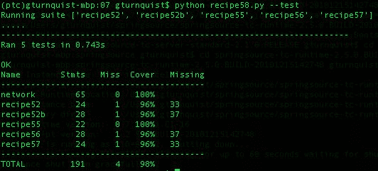

# 第七章：通过测试覆盖率来衡量您的成功

在本章中，我们将涵盖：

+   构建一个网络管理应用程序

+   在测试套件上安装和运行覆盖率

+   使用覆盖率生成 HTML 报告

+   使用覆盖率生成 XML 报告

+   使用覆盖率工具进行测试

+   从覆盖率中过滤出测试噪音

+   让 Jenkins 使用覆盖率

+   更新项目级别的脚本以提供覆盖率报告

# 介绍

**覆盖率** **分析**是衡量程序中哪些行被执行，哪些行没有被执行。这种分析也被称为**代码覆盖率**，或更简单的**覆盖率**。

在生产系统中运行时可以使用覆盖率分析器，但这样做有什么利弊呢？在运行测试套件时使用覆盖率分析器又有什么好处呢？与在生产环境中检查系统相比，这种方法会提供什么好处？

覆盖率帮助我们查看我们是否充分测试了我们的系统。但必须带着一定的怀疑心态进行。这是因为，即使我们实现了 100%的覆盖率，也就是说我们的系统的每一行都被执行了，这绝不意味着我们没有错误。测试只能揭示错误的存在。一个快速的例子涉及到我们编写的代码，以及它处理的是系统调用的返回值。如果有三种可能的值，但我们只处理了其中的两种，我们可能编写了两个测试用例来覆盖我们对它的处理，这当然可以实现 100%的语句覆盖。然而，这并不意味着我们已经处理了第三种可能的返回值，因此可能留下了一个潜在的未发现的错误。100%的代码覆盖率也可以通过条件覆盖率实现，但可能无法通过语句覆盖率实现。我们计划针对的覆盖类型应该是清楚的。

另一个关键点是，并非所有测试都旨在*修复*错误。另一个关键目的是确保应用程序满足我们客户的需求。这意味着，即使我们有 100%的代码覆盖率，也不能保证我们覆盖了用户所期望的所有场景。这就是*正确构建*和*构建正确的东西*之间的区别。

在本章中，我们将探讨各种示例，以构建网络管理应用程序，运行覆盖率工具，并收集结果。我们将讨论覆盖率如何引入噪音并向我们展示比我们需要了解的更多内容，并且在实现我们的代码时会引入性能问题。我们还将看到如何剔除我们不需要的信息，以获得简洁、有针对性的视图。

本章在许多示例中使用了几个第三方工具：

+   **Spring Python** ([`springpython.webfactional.com`](http://springpython.webfactional.com)) 包含许多有用的抽象。本章中使用的是其`DatabaseTemplate`，它提供了一种简单的方法来编写 SQL 查询和更新，而无需处理 Python 冗长的 API。通过输入`pip install springpython`来安装它。

+   通过输入`pip install coverage`来安装覆盖率工具。这可能会失败，因为其他插件可能会安装较旧版本的覆盖率。如果是这样，请通过输入`pip uninstall coverage`来卸载覆盖率，然后再次使用`pip install coverage`来安装。

+   Nose，一个有用的测试运行器，涵盖在第二章中，*使用 Nose 运行自动化测试套件*。请参考该章节了解如何安装 nose。

# 构建一个网络管理应用程序

对于本章，我们将构建一个非常简单的网络管理应用程序，编写不同类型的测试，并检查它们的覆盖率。这个网络管理应用程序专注于处理警报，也称为**网络** **事件**。这与某些其他专注于从设备中收集 SNMP 警报的网络管理工具不同。

出于简单起见，这个相关引擎不包含复杂的规则，而是包含网络事件与设备和客户服务库存的简单映射。在接下来的几段中，我们将通过代码来探讨这一点。

# 如何做...

通过以下步骤，我们将构建一个简单的网络管理应用程序：

1.  创建一个名为`network.py`的文件，用于存储网络应用程序。

1.  创建一个类定义来表示网络事件：

```py
class Event(object):
   def init  (self, hostname, condition, severity, event_time):
       self.hostname = hostname
       self.condition = condition
       self.severity = severity
       self.id = -1
   def str(self):
       return "(ID:%s) %s:%s - %s" % (self.id, self.hostname,\ 
               self.condition,self.severity)
```

让我们来看看`self`的一些属性：

+   `hostname`：假设所有网络警报都来自具有主机名的设备。

+   `condition`：这表示正在生成的警报类型。来自同一设备的两种不同的警报条件。 

+   `severity`：`1`表示清晰的绿色状态，`5`表示故障的红色状态。

+   `id`：这是事件存储在数据库中时使用的主键值。

1.  创建一个名为`network.sql`的新文件，包含 SQL 代码。

1.  创建一个 SQL 脚本，用于设置数据库并添加存储网络事件定义：

```py
   CREATE TABLE EVENTS(
       ID INTEGER PRIMARY KEY,
       HOST_NAME TEXT,
       SEVERITY INTEGER,
       EVENT_CONDITION TEXT
       );  
```

1.  编写一个高级算法，评估事件对设备和客户服务的影响，并将其添加到`network.py`中：

```py
from springpython.database.core import*

class EventCorrelator(object):
   def init(self, factory):
      self.dt = DatabaseTemplate(factory)
   def del(self):
      del(self.dt)
   def process(self, event):
     stored_event, is_active = self.store_event(event)
     affected_services, affected_equip = self.impact(event)
     updated_services = [
          self.update_service(service, event) 
          for service in affected_services]
     updated_equipment = [
          self.update_equipment(equip, event)
          for equip in affected_equip]
     return (stored_event, is_active,
         updated_services,updated_equipment)
```

`init`方法包含一些用于创建`DatabaseTemplate`的设置代码。这是 Spring Python 的一个用于数据库操作的实用类。有关更多详细信息，请参阅[`docs.spring.io/spring-python/1.2.x/sphinx/html/dao.html`](https://docs.spring.io/spring-python/1.2.x/sphinx/html/dao.html)。我们还使用*SQLite3*作为我们的数据库引擎，因为它是 Python 的标准部分。

process 方法包含一些简单的步骤来处理传入的事件：

+   +   我们首先需要将事件存储在`EVENTS`表中。这包括评估它是否是一个活动事件，这意味着它正在积极影响一件设备。

+   然后我们确定事件影响的设备和服务。

+   接下来，我们通过确定它是否导致任何服务中断或恢复来更新受影响的服务。

+   然后我们通过确定它是否失败或清除设备来更新受影响的设备。

+   最后，我们返回一个包含所有受影响资产的元组，以支持可能在其上开发的任何屏幕界面。

1.  实现`store_event`算法：

```py
def store_event(self,event):
   try:
     max_id = self.dt.query_for_init("""select max(ID) 
        from EVENTS""")
   except DataAccessException, e:
     max_id=0
   event.id = max_id+1
   self.dt.update("""insert into EVENTS
                     (ID, HOST_NAME, SEVERITY, EVENT_CONDITION)
                        values(?,?,?,?)""",
                     (event.id, event.hostname, event.severity,
                        event.condition))
   is active = self.add_or_remove_from_active_events(event)

```

这种方法存储了每个被处理的事件。这支持许多事情，包括数据挖掘和故障的事后分析。这也是其他与事件相关的数据可以使用外键指向的权威位置：

+   +   `store_event`方法从`EVENTS`表中查找最大的主键值。

+   将其增加`1`。

+   将其分配给`event.id`。

+   然后将其插入`EVENTS`表中。

+   接下来，它调用一个方法来评估事件是否应该添加到活动事件列表，或者是否清除现有的活动事件。活动事件是指正在积极导致设备不清晰的事件。

+   最后，它返回一个包含事件以及是否被分类为活动事件的元组。

对于更复杂的系统，需要实现某种分区解决方案。针对包含数百万行的表进行查询非常低效。但是，这仅用于演示目的，因此我们将跳过扩展以及性能和安全性。

1.  实现一个方法来评估是否添加或删除活动事件：

```py
def add_or_remove_from_active_events(self,event):
    """Active events are current ones that cause equipment
       and\or services to be down."""
    if event.severity == 1:
       self.dt.update ("""DELETE FROM ACTIVE_EVENTS
                          WHERE EVENT_FK in (
                          SELECT ID FROM EVENTS
                          WHERE HOST_NAME=?
                          AND EVENT_CONDITION=?)""",
                       (event.hostname,event.condition))
      return False
    else:
      self.dt.execute ("""INSERT INTO ACTIVE_EVENTS (EVENT_FK) values (?) """, event.id,))
      return True
```

当设备故障时，它会发送一个`severity 5`事件。这是一个活动事件，在这种方法中，将一行插入`ACTIVE_EVENTS`表中，并使用外键指向`EVENTS`表。然后我们返回`True`，表示这是一个活动事件。

1.  将`ACTIVE_EVENTS`的表定义添加到 SQL 脚本中：

```py
CREATE TABLE ACTIVE_EVENTS(ID INTEGER PRIMARY KEY, EVENT_FK,
    FOREIGN KEY(EVENT_FK) REFERENCES EVENTS(ID)
    );
```

这个表使得查询当前导致设备故障的事件变得容易。

稍后，当设备上的故障条件消除时，它会发送一个`severity 1`事件。这意味着`severity 1`事件从不是活动的，因为它们不会导致设备停机。在我们之前的方法中，我们搜索具有相同主机名和条件的任何活动事件，并将其删除。然后我们返回`False`，表示这不是一个活动事件。

1.  编写一个评估受网络事件影响的服务和设备的方法：

```py
def impact(self, event):
   """Look up this event has impact on either equipment 
      or services."""
   affected_equipment = self.dt.query(\
               """select * from EQUIPMENT 
                  where HOST_NAME = ?""",
               (event.hostname,), 
               rowhandler=DictionaryRowMapper())
   affected_services = self.dt.query(\
               """select SERVICE.* from   SERVICE
                  join SERVICE_MAPPING SM
                  on (SERVICE.ID = SM.SERVICE_FK)
                  join EQUIPMENT
                  on (SM.EQUIPMENT_FK = EQUIPMENT.ID) where
                  EQUIPMENT.HOST_NAME = ?""",
                  (event.hostname,),                   
                  rowhandler=DictionaryRowMapper())
   return (affected_services, affected_equipment)
```

+   +   我们首先查询`EQUIPMENT`表，看看`event.hostname`是否匹配任何内容。

+   接下来，我们通过`SERVICE_MAPPING`表跟踪的多对多关系将`SERVICE`表与`EQUIPMENT`表连接起来。捕获与报告事件相关的设备相关的任何服务。

+   最后，我们返回一个包含可能受到影响的设备列表和服务列表的元组。

Spring Python 提供了一个方便的查询操作，该操作返回映射到查询每一行的对象列表。它还提供了一个开箱即用的`DictionaryRowMapper`，将每一行转换为 Python 字典，其中键与列名匹配。

1.  将`EQUIPMENT`，`SERVICE`和`SERVICE_MAPPING`的表定义添加到 SQL 脚本中：

```py
CREATE TABLE EQUIPMENT(
      ID INTEGER PRIMARY KEY, 
      HOST_NAME TEXT UNIQUE,
      STATUS INTEGER );
CREATE TABLE SERVICE (
      ID INTEGER PRIMARY KEY, 
      NAME TEXT UNIQUE, 
      STATUS TEXT );
CREATE TABLE SERVICE_MAPPING (
      ID INTEGER PRIMARY KEY, 
      SERVICE_FK,EQUIPMENT_FK,
      FOREIGN KEY(SERVICE_FK) REFERENCES SERVICE(ID),
      FOREIGN KEY(EQUIPMENT_FK) REFERENCES EQUIPMENT(ID));
```

1.  编写`update_service`方法，该方法存储或清除与服务相关的事件，然后根据剩余的活动事件更新服务的状态：

```py
def update_service(self, service, event):
    if event.severity == 1:
        self.dt.update("""delete from SERVICE_EVENTS
                          where EVENT_FK in (select ID from EVENTS
                          where HOST_NAME = ?
                          and EVENT_CONDITION = ?)""",
                          (event.hostname,event.condition))
    else:
      self.dt.execute("""insert into SERVICE_EVENTS 
                         (EVENT_FK, SERVICE_FK) values (?,?)""",
                         (event.id,service["ID"]))
    try:
      max = self.dt.query_for_int(\
                      """select max(EVENTS.SEVERITY)   
                         from SERVICE_EVENTS SE join EVENTS
                         on (EVENTS.ID = SE.EVENT_FK) join SERVICE
                         on (SERVICE.ID = SE.SERVICE_FK)
                         where SERVICE.NAME = ?""", 
                         (service["NAME"],))
    except DataAccessException, e:
           max=1
    if max > 1 and service["STATUS"] == "Operational":
       service["STATUS"] = "Outage"
       self.dt.update("""update SERVICE
                         set STATUS = ? 
                         where ID = ?""",
                     (service["STATUS"], service["ID"]))

    if max == 1 and service["STATUS"] == "Outage":
       service["STATUS"] = "Operational"
       self.dt.update("""update SERVICE set STATUS = ?
                         where ID = ?""",
                     (service["STATUS"], service["ID"]))
    if event.severity == 1:
       return {"service":service, "is_active":False}
    else:
       return {"service":service, "is_active":True}
```

与服务相关的事件是与服务相关的活动事件。单个事件可以与多个服务相关联。例如，如果我们监视提供互联网服务给许多用户的无线路由器，并且它报告了严重错误，那么这一个事件将被映射为对所有最终用户的影响。当处理新的活动事件时，它将存储在`SERVICE_EVENTS`中，以供每个相关服务使用。

然后，当清除事件被处理时，必须从`SERVICE_EVENTS`表中删除先前的服务事件。

1.  将`SERVICE_EVENTS`的表定义添加到 SQL 脚本中：

```py
CREATE TABLE SERVICE_EVENTS ( 
    ID INTEGER PRIMARY KEY, 
    SERVICE_FK,
    EVENT_FK,FOREIGN KEY(SERVICE_FK) REFERENCES SERVICE(ID),
    FOREIGN KEY(EVENT_FK) REFERENCES EVENTS(ID));
```

重要的是要认识到，从`SERVICE_EVENTS`中删除条目并不意味着我们从`EVENTS`表中删除原始事件。相反，我们只是表明原始活动事件不再是活动的，它不会影响相关服务。

1.  在整个 SQL 脚本之前加上`DROP`语句，使其可以运行多个配方：

```py
DROP TABLE IF EXISTS SERVICE_MAPPING;
DROP TABLE IF EXISTS SERVICE_EVENTS;
DROP TABLE IF EXISTS ACTIVE_EVENTS;
DROP TABLE IF EXISTS EQUIPMENT;
DROP TABLE IF EXISTS SERVICE;
DROP TABLE IF EXISTS EVENTS;
```

1.  附加用于设置数据库的 SQL 脚本，其中包含用于预先加载一些设备和服务的插入操作：

```py
INSERT into EQUIPMENT (ID, HOST_NAME, STATUS) values (1,'pyhost1', 1);
INSERT into EQUIPMENT (ID, HOST_NAME, STATUS) values (2,'pyhost2', 1);
INSERT into EQUIPMENT (ID, HOST_NAME, STATUS) values (3,'pyhost3', 1);
INSERT into SERVICE (ID, NAME, STATUS) values (1, 'service-abc', 'Operational');
INSERT into SERVICE (ID, NAME, STATUS) values (2, 'service-xyz', 'Outage');
INSERT into SERVICE_MAPPING (SERVICE_FK, EQUIPMENT_FK) values (1,1);
INSERT into SERVICE_MAPPING (SERVICE_FK, EQUIPMENT_FK) values (1,2);
INSERT into SERVICE_MAPPING (SERVICE_FK, EQUIPMENT_FK) values (2,1);
INSERT into SERVICE_MAPPING (SERVICE_FK, EQUIPMENT_FK) values (2,3);
```

1.  最后，编写一个根据当前活动事件更新设备状态的方法：

```py
def update_equipment(self,equip,event):
    try:
      max = self.dt.query_for_int(\
                  """select max(EVENTS.SEVERITY) 
                     from ACTIVE_EVENTS AE
                     join EVENTS on (EVENTS.ID = AE.EVENT_FK) 
                     where EVENTS.HOST_NAME = ?""",
                  (event.hostname,))
    except DataAccessException:
        max = 1
    if max != equip["STATUS"]:
         equip["STATUS"] = max 
         self.dt.update("""update EQUIPMENT
                           set STATUS = ?""",
                        (equip["STATUS"],))
    return equip
```

在这里，我们需要从给定主机名的活动事件列表中找到最大的严重性。如果没有活动事件，那么 Spring Python 会引发 DataAccessException，我们将其转换为严重性为 1。

我们检查这是否与现有设备的状态不同。如果是，我们发出 SQL 更新。最后，我们返回设备的记录，并适当更新其状态。

# 它是如何工作的...

该应用程序使用基于数据库的机制来处理传入的网络事件，并将其与设备和服务清单进行比对，以评估故障和恢复。我们的应用程序不处理专门的设备或不寻常的服务类型。这种现实世界的复杂性已被交换为一个相对简单的应用程序，可以用来编写各种测试配方。

事件通常映射到单个设备和零个或多个服务。可以将服务视为用于向客户提供某种类型服务的设备字符串。新的失败事件在清除事件到来之前被视为活动。活动事件在与设备聚合时定义其当前状态。活动事件在与服务聚合时定义服务的当前状态。

# 在测试套件上安装和运行覆盖率

安装覆盖工具并运行它对测试套件进行测试。然后您可以查看报告，显示测试套件覆盖了哪些行。

# 如何做...

通过以下步骤，我们将构建一些 unittests，然后通过覆盖工具运行它们：

1.  创建一个名为`recipe52.py`的新文件，包含本配方的测试代码。

1.  编写一个简单的单元测试，向系统注入一个警报事件：

```py
from network import * 
import unittest
from springpython.database.factory import *
from springpython.database.core import *
class EventCorrelationTest(unittest.TestCase):
      def setUp(self):
          db_name = "recipe52.db"
          factory = Sqlite3ConnectionFactory(db_name)
          self.correlator = EventCorrelator(factory)
          dt = DatabaseTemplate(factory)
          sql = open("network.sql").read().split(";")
          for statement in sql:
              dt.execute(statement + ";")
      def test_process_events(self):
          evt1 = Event("pyhost1", "serverRestart", 5)
          stored_event, is_active, \
                updated_services, updated_equipment = \
                self.correlator.process(evt1)
          print "Stored event: %s" % stored_event
          if is_active:
             print "This event was an active event."
             print "Updated services: %s" % updated_services
             print "Updated equipment: %s" % updated_equipment
             print "---------------------------------"
if __name__ == "main":
     unittest.main()          
```

1.  使用`coverage -e`清除任何现有的覆盖报告数据。

1.  使用覆盖工具运行测试套件：

```py
gturnquist$ coverage -x recipe52.py
Stored event: (ID:1) pyhost1:serverRestart - 5 This event was an active event.
Updated services: [{'is_active': True, 'service': {'STATUS': 'Outage', 'ID': 1, 'NAME': u'service-abc'}}, {'is_active': True, 'service': {'STATUS': u'Outage', 'ID': 2, 'NAME': u'service- xyz'}}] 
Updated equipment: [{'STATUS': 5, 'ID': 1, 'HOST_NAME': u'pyhost1'}]
---------------------------------

.

------------------------------------------------------------------
----
Ran 1 test in 0.211s OK 
```

1.  通过输入`coverage -r`打印出上一个命令捕获的报告。如果报告显示了 Python 标准库中列出的几个其他模块，这表明您安装了旧版本的覆盖工具。如果是这样，请通过输入`pip uninstall coverage`卸载旧版本，然后使用`pip install coverage`重新安装：


1.  创建另一个名为`recipe52b.py`的文件，包含不同的测试套件。

1.  编写另一个测试套件，生成两个故障，然后清除它们：

```py
from network import*
import unittest
from springpython.database.factory import*
from springpython.database.core import*
class EventCorrelationTest(unittest.TestCase):
      def setUp(self):
          db_name = "recipe52b.db"
          factory = Sqlite3ConnectionFactory(db=db_name)
          self.correlator = EventCorrelator(factory)
          dt = DatabaseTemplate(factory)
          sql = open("network.sql").read().split(";")
          for statement in sql:
             dt.execute(statement + ";")
      def test_process_events(self):
          evt1 = Event("pyhost1", "serverRestart", 5)
          evt2 = Event("pyhost2", "lineStatus", 5)
          evt3 = Event("pyhost2", "lineStatus", 1)
          evt4 = Event("pyhost1", "serverRestart", 1)
          for event in [evt1, evt2, evt3, evt4]:
              stored_event, is_active, \ 
                 updated_services, updated_equipment = \
                  self.correlator.process(event)
              print "Stored event: %s" % stored_event
              if is_active:
                print "This event was an active event."
                print "Updated services: %s" % updated_services
                print "Updated equipment: %s" % updated_equipment
                print "---------------------------------"
  if __name__ == "__main__": 
     unittest.main()
```

1.  通过`coverage -x recipe52b.py`使用覆盖工具运行此测试套件。

1.  通过输入`coverage -r`打印报告：


第一个测试套件只注入了一个警报。我们期望它会导致服务中断并使其相关的设备停机。由于这不会执行任何事件清除逻辑，我们当然不期望达到 100%的代码覆盖率。

在报告中，我们可以看到它说`network.py`有 65 个语句，执行了其中的 55 个，覆盖率为 85%。我们还看到`recipe52.py`有 23 个语句，全部执行了。这意味着我们的所有测试代码都运行了。

在这一点上，我们意识到我们只测试了事件相关器的警报部分。为了使这更有效，我们应该注入另一个警报，然后进行一些清除操作，以确保一切都清除干净，服务返回到运行状态。这应该导致我们的简单应用程序实现 100%的覆盖率。

第二个截图确实显示我们已经完全覆盖了`network.py`。

# 还有更多...

我们还看到 Spring Python 也被报告了。如果我们使用了其他第三方库，它们也会出现。这是正确的吗？这取决于情况。先前的评论似乎表明我们并不真的关心 Spring Python 的覆盖范围，但在其他情况下，我们可能会非常感兴趣。覆盖工具如何知道在哪里划定界限呢？

在后续的配方中，我们将研究如何更有选择性地进行测量，以便过滤掉噪音。

# 为什么 unittest 中没有断言？

的确，unittest 在测试结果方面是不够的。为了制定这个配方，我目视检查输出，以查看网络管理应用程序是否按预期运行。但这是不完整的。一个真正的生产级单元测试需要以一组断言完成，这样就不需要进行视觉扫描了。

为什么我们没有编写任何代码呢？因为这个配方的重点是如何生成覆盖报告，然后利用这些信息来增强测试。我们涵盖了这两个方面。通过思考测试了什么和没有测试的内容，我们编写了一个全面的测试，显示了服务进入故障和恢复到运行状态。我们只是没有自动确认这一点。

# 使用覆盖生成 HTML 报告

使用覆盖工具生成 HTML 可视化覆盖报告。这很有用，因为我们可以深入到源代码中，看看测试过程中没有运行的代码行。

阅读覆盖报告而不阅读源代码是没有什么用的。根据覆盖百分比比较两个不同的项目可能很诱人。但是除非实际代码被分析，否则这种比较可能导致对软件质量的错误结论。

# 如何做...

通过这些步骤，我们将探讨如何创建一个可视化的 HTML 覆盖报告：

1.  通过按照*在您的测试套件上安装和运行覆盖*的步骤生成覆盖度指标，并且只运行第一个测试套件（覆盖率低于 100%）。

1.  通过输入`coverage.html`生成 HTML 报告。

1.  使用您喜欢的浏览器打开`htmlcov/index.html`并检查整体报告：


1.  点击“network”，并向下滚动以查看由于未处理清除事件而未运行的事件清除逻辑：


# 它是如何工作的...

覆盖工具具有内置功能生成 HTML 报告。这提供了一种强大的方式来直观地检查源代码，并查看哪些行未被执行。

通过查看这份报告，我们可以清楚地看到未执行的行与正在处理的网络事件清除相关。这提示我们另一个测试案例，涉及需要起草的事件清除。

# 使用覆盖率生成 XML 报告

覆盖工具可以以 Cobertura 格式（[`cobertura.sourceforge.net/`](http://cobertura.sourceforge.net/)）生成 XML 覆盖报告。如果我们想要在另一个工具中处理覆盖信息，这是很有用的。在这个配方中，我们将看到如何使用覆盖命令行工具，然后手动查看 XML 报告。

重要的是要理解，阅读覆盖率报告而不阅读源代码并不是很有用。可能会诱人根据覆盖率百分比比较两个不同的项目。但除非实际代码被分析，这种比较可能导致对软件质量的错误结论。

例如，一个覆盖率为 85%的项目表面上看起来可能比一个 60%的项目测试得更好。然而，如果 60%的应用程序有更加彻底详尽的场景——因为它们只覆盖了系统中使用频繁的核心部分——那么它可能比 85%的应用程序更加稳定。

当比较迭代之间的测试结果，并且用它来决定哪些场景需要添加到我们的测试库时，覆盖分析就发挥了作用。

# 如何做...

通过这些步骤，我们将发现如何创建一个可以被其他工具使用的 XML 报告，使用覆盖工具：

1.  通过按照*安装和运行覆盖* *在您的测试套件上*配方中的步骤生成覆盖度指标（在第一章中提到，*使用 Unittest 开发基本* *测试*），并且只运行第一个测试套件（覆盖率低于 100%）。

1.  通过输入`coverage xml`生成 XML 报告。

1.  使用您喜欢的文本或 XML 编辑器打开`coverage.xml`。XML 的格式与 Cobertura 一样——这是一个 Java 代码覆盖率分析器。这意味着许多工具，如 Jenkins，可以解析结果：


# 它是如何工作的...

覆盖工具具有内置功能，可以生成 XML 报告。这提供了一种使用某种外部工具解析输出的强大方式。

在上一张截图中，我使用了 Spring Tool Suite 打开它（您可以从[`www.springsource.com/developer/sts)`](http://www.springsource.com/developer/sts)下载它），部分原因是因为我每天都在使用 STS，但您可以使用任何您喜欢的文本或 XML 编辑器。

# XML 报告有什么用？

XML 不是向用户传达覆盖信息的最佳方式。*生成带覆盖的 HTML* *报告*是在涉及人类用户时更实用的配方。

如果我们想捕获覆盖率报告并将其发布到 Jenkins 等持续集成系统中，我们只需要安装 Cobertura 插件（参考[`wiki.jenkins-ci.org/display/JENKINS/Cobertura+Plugin`](https://wiki.jenkins-ci.org/display/JENKINS/Cobertura+Plugin)），这份报告就可以被追踪。Jenkins 可以很好地监控覆盖率的趋势，并在我们开发系统时给予更多反馈。

# 另请参阅

+   *让 Jenkins 与覆盖一起多管闲事*

+   *使用覆盖生成 HTML 报告*

# 与覆盖一起变得多管闲事

安装覆盖鼻子插件，并使用鼻子运行测试套件。这提供了一个快速和方便的报告，使用无处不在的 nosetests 工具。本教程假设您已经按照*构建网络* *管理应用程序*部分的描述创建了网络管理应用程序。

# 如何做到...

通过这些步骤，我们将看到如何将覆盖工具与鼻子结合使用：

1.  创建一个名为`recipe55.py`的新文件来存储我们的测试代码。

1.  创建一个测试用例，注入一个有故障的警报：

```py
from network import*
import unittest
from springpython.database.factory import*
from springpython.database.core import*
class EventCorrelationTest(unittest.TestCase):
      def setUp(self):
         db_name = "recipe55.db"
         factory = Sqlite3ConnectionFactory(db=db_name)
         self.correlator = EventCorrelator(factory)
         dt = DatabaseTemplate(factory)
         sql = open("network.sql").read().split(";")
         for statement in sql:
            dt.execute(statement + ";")
      def test_process_events(self):
         evt1 = Event("pyhost1", "serverRestart", 5)
         stored_event, is_active, \ 
              updated_services, updated_equipment = \
         self.correlator.process(evt1)
         print "Stored event: %s" % stored_event
         if is_active:
            print "This event was an active event."
            print "Updated services: %s" % updated_services
            print "Updated equipment: %s" % updated_equipment
            print "---------------------------------"
```

1.  使用覆盖插件运行测试模块，输入`nosetests recipe55 – with-coverage`：


# 它是如何工作的...

覆盖鼻子插件调用覆盖工具并提供格式化的报告。对于每个模块，它显示以下内容：

+   总语句数

+   错过的语句数量

+   覆盖语句的百分比

+   错过语句的行号

# 还有更多...

鼻子的一个常见行为是改变`stdout`，禁用嵌入在测试用例中的`print`语句。

# 为什么使用鼻子插件而不是直接使用覆盖工具？

覆盖工具本身可以很好地工作，就像本章中的其他教程中所演示的那样。然而，鼻子是许多开发人员使用的无处不在的测试工具。提供一个插件可以轻松支持这个庞大的社区，使用户能够运行他们想要的确切的测试插件集，其中覆盖是其中的一部分。

# 为什么包括 SQLite3 和 Spring Python？

SQLite3 是 Python 附带的关系数据库库。它是基于文件的，这意味着不需要单独的进程来创建和使用数据库。有关 Spring Python 的详细信息可以在本章的早期部分找到。

本教程的目的是测量我们的网络管理应用程序和相应的测试用例的覆盖范围。那么为什么包括这些第三方库？覆盖工具无法自动知道我们想要的和我们不想从覆盖的角度看到的东西。要深入了解这一点，请参阅下一节，*过滤掉* *覆盖中的测试噪音*。

# 从覆盖中过滤掉测试噪音

使用命令行选项，可以过滤掉计算的行。本教程假设您已经按照*构建网络* *管理应用程序*部分的描述创建了网络管理应用程序。

# 如何做到...

通过这些步骤，我们将看到如何过滤掉某些模块在我们的覆盖报告中被计算。

1.  创建一个测试套件，测试所有代码功能：

```py
from network import*
import unittest
from springpython.database.factory import*
from springpython.database.core import *
class EventCorrelationTest(unittest.TestCase):
   def setUp(self):
      db_name = "recipe56.db"
      factory = Sqlite3ConnectionFactory(db=db_name)
      self.correlator = EventCorrelator(factory)
      dt = DatabaseTemplate(factory)
      sql = open("network.sql").read().split(";")
      for statement in sql:
        dt.execute(statement + ";")
   def test_process_events(self):
       evt1 = Event("pyhost1", "serverRestart", 5)
       evt2 = Event("pyhost2", "lineStatus", 5)
       evt3 = Event("pyhost2", "lineStatus", 1)
       evt4 = Event("pyhost1", "serverRestart", 1)
       for event in [evt1, evt2, evt3, evt4]:
           stored_event, is_active,\
              updated_services, updated_equipment=\
                  self.correlator.process(event)
           print "Stored event: %s" % stored_event
       if is_active:
          print "This event was an active event."
          print "Updated services: %s" % updated_services
          print "Updated equipment: %s" % updated_equipment
          print "---------------------------------"
if __name__=="__main__":
   unittest.main()
```

1.  通过运行`coverage -e`清除任何先前的覆盖数据。

1.  使用`coverage -x recipe56.py`运行它。

1.  使用`coverage -r`生成控制台报告。在下面的截图中，观察 Spring Python 如何包含在报告中，并将总度量减少到 73%：


1.  通过运行`coverage -e`清除覆盖数据。

1.  再次使用`coverage run –source network.py,recipe56.py,recipe56.py`运行测试。

1.  使用`coverage -r`生成另一个控制台报告。请注意在下一个截图中，Spring Python 不再列出，将我们的总覆盖范围提高到 100%：


1.  清除覆盖数据，运行`coverage -e`。

1.  使用`coverage -x recipe56.py`运行测试。

1.  使用`coverage -r recipe56.py network.py`生成控制台报告：


# 它是如何工作的...

覆盖提供了决定分析哪些文件和报告哪些文件的能力。前一节中的步骤多次收集度量标准，要么通过使用一组受限的源文件运行覆盖（以过滤掉 Spring Python），要么通过在报告中请求一组显式的模块。

所有这一切引发的一个问题是，“最好的选择是什么？”对于我们的测试场景，这两个选择是等效的。大约输入相同数量的内容，我们过滤掉了 Spring Python，并得到了一个报告，显示`network.py`和`recipe56.py`的覆盖率都达到了 100%。然而，一个真实的项目可能会更好地收集所有可用的度量数据，并在报告级别进行过滤，尤其是在有很多模块和可能不同团队在不同领域工作的情况下。

这样，可以根据需要运行子系统的不同报告，而无需不断重新捕获度量数据，并且仍然可以从相同的收集数据中运行整个系统覆盖率的总体报告。

# 还有更多...

前一节中使用的选项是包容性的。我们选择了要包含的内容。覆盖工具还带有一个`-omit`选项。挑战在于它是一个基于文件的选项，而不是基于模块的选项。不能使用`-omit springpython`。相反，必须指定每个文件，而在这种情况下，这将需要排除四个完整的文件。

更进一步，Spring Python 文件的完整路径需要包含在内。这导致一个非常冗长的命令，与我们演示的方式相比并没有太多好处。

在其他情况下，如果要排除的文件是在运行覆盖率的地方，则可能更实际。

覆盖工具还有其他在本章未涉及的选项，例如测量分支覆盖率而不是语句覆盖率，排除行，以及能够并行运行以管理从多个进程收集度量。

如前所述，覆盖工具有能力过滤掉单独的行。在我看来，这听起来很像试图使覆盖率报告达到某个规定的百分比。覆盖工具最好用于努力编写更全面的测试、修复错误和改进开发，而不是用于构建更好的报告。

# 另请参阅

在本章前面的“构建网络管理应用程序”配方中

# 让 Jenkins 与覆盖率挂钩

配置 Jenkins 运行一个使用 nose 的测试套件，生成一个覆盖率报告。本配方假设您已经按照“构建网络管理应用程序”部分的描述创建了网络管理应用程序。

# 准备就绪

让我们看看以下步骤：

1.  如果您已经下载了 Jenkins 并在之前的配方中使用过它，请在您的主目录中查找一个`.jenkins`文件夹并将其删除，以避免此配方引起的意外差异。

1.  安装 Jenkins。

1.  打开控制台以确认 Jenkins 是否正常工作：

1.  点击“管理 Jenkins”。

1.  点击“管理插件”。

1.  点击“可用”选项卡。

1.  找到“Cobertura 插件”并在其旁边点击复选框。

1.  找到“Git 插件”并在其旁边点击复选框。

1.  在页面底部，点击“安装”按钮。

1.  返回仪表板屏幕。

1.  关闭 Jenkins 并重新启动它。

1.  在您的计算机上安装 Git 源代码控制。

1.  为这个配方创建一个空文件夹：

```py
gturnquist$ mkdir /tmp/recipe57
```

1.  初始化源代码维护的文件夹：

```py
gturnquist$ git init /tmp/recipe57
```

1.  将网络应用程序和 SQL 脚本复制到文件夹中，添加并提交更改：

```py
gturnquist$ cp network.py /tmp/recipe57/ 
gturnquist$ cp network.sql /tmp/recipe57/ 
gturnquist$ cd /tmp/recipe57/
gturnquist$ git add network.py network.sql
gturnquist$ git commit -m "Add network app"
[master (root-commit) 7f78d46] Add network app
2 files changed, 221 insertions(+), 0 deletions(-)
create mode 100644 network.py
create mode 100644 network.sql 
```

# 如何做...

通过这些步骤，我们将探讨如何配置 Jenkins 来构建覆盖率报告，并通过 Jenkins 的界面提供服务。

1.  创建一个名为`recipe57.py`的新文件，用于包含本配方的测试代码。

1.  编写一个部分执行网络管理应用程序的测试用例：

```py
from network import*
import unittest
from springpython.database.factory import*
from springpython.database.core import*
class EventCorrelationTest(unittest.TestCase):
    def setUp(self):
        db_name = "recipe57.db"
        factory = Sqlite3ConnectionFactory(db=db_name)
        self.correlator = EventCorrelator(factory)
        dt = DatabaseTemplate(factory)
        sql = open("network.sql").read().split(";")
        for statement in sql:
           dt.execute(statement + ";")
    def test_process_events(self):
        evt1 = Event("pyhost1", "serverRestart", 5)
        stored_event, is_active, updated_services, updated_equipment = \
            self.correlator.process(evt1)
        print "Stored event: %s" % stored_event
        if is_active:
        print "This event was an active event."
        print "Updated services: %s" % updated_services
        print "Updated equipment: %s" % updated_equipment
        print "---------------------------------"
```

1.  将其复制到源代码存储库中。添加并提交更改：

```py
gturnquist$ cp recipe57.py /tmp/recipe57/ gturnquist$ cd /tmp/recipe57/ gturnquist$ git add recipe57.py
gturnquist$ git commit -m "Added tests."
[master 0bf1761] Added tests.
1 files changed, 37 insertions(+), 0 deletions(-)
create mode 100644 recipe57.py
```

1.  打开 Jenkins 控制台。

1.  点击“新建任务”。

1.  输入`recipe57`作为作业名称，并选择构建自由样式软件项目。

1.  点击“确定”。

1.  在“源代码管理”部分，选择“Git”。对于“URL”，输入“/tmp/recipe57/”。

1.  在构建触发器部分，选择**轮询** **SCM**并在计划框中输入`* * * * *`以触发每分钟轮询一次。

1.  在构建部分，选择**执行** **Shell**并输入以下脚本，加载虚拟环境并运行测试套件：

```py
. /Users/gturnquist/ptc/bin/activate
coverage -e
coverage run /Users/gturnquist/ptc/bin/nosetests
recipe57.py coverage xml --include=network.py,recipe57.py
```

您需要包括激活虚拟环境并运行覆盖工具的步骤，如下所示。

1.  在后构建操作部分，选择**发布 Cobertura 覆盖率报告**。

1.  输入`coverage.xml`作为**Cobertura xml 报告模式**。

1.  点击**保存**以保存所有作业设置。

1.  导航回仪表板。

1.  点击**启用自动刷新**。

1.  等待约一分钟以运行构建作业：


1.  点击结果（在上一个截图中的**#1**）。

1.  点击**覆盖率** **报告**。观察下一个截图，其中报告了 89%的覆盖率：


1.  点击模块`.`（点）以查看`network.py`和`recipe57.py`。

1.  点击`recipe57.py`以查看哪些行被覆盖，哪些行被忽略。

# 它是如何工作的...

覆盖工具生成一个有用的 XML 文件，Jenkins Cobertura 插件可以收集。可以只生成 HTML 报告并通过 Jenkins 提供，但 XML 文件允许 Jenkins 很好地绘制覆盖率趋势。它还提供了查看源代码以及已覆盖和未覆盖行的手段。

我们还将其与源代码控制集成，因此，当更改提交到存储库时，将运行新的作业。

# 还有更多...

不要过于关注覆盖率报告很重要。覆盖工具对于跟踪测试很有用，但纯粹为了增加覆盖率而工作并不能保证构建更好的代码。它应该被用作一个工具来阐明缺少的测试场景，而不是考虑测试缺失的代码行。

# Nose 不直接支持覆盖率的 XML 选项

覆盖工具的 nose 插件不包括生成 XML 文件的功能。这是因为覆盖插件是 nose 的一部分，*不是*覆盖项目的一部分。它没有更新到最新的功能，包括 XML 报告。

我问过覆盖项目的创建者 Ned Batchelder 关于 nose 缺乏 XML 支持的问题。他建议我在`coverage`内运行`nosetests`，就像在 Jenkins 作业中之前展示的那样。它会生成相同的`.coverage`跟踪数据文件。然后很容易执行`coverage` `xml`并使用所需的参数来获得我们想要的报告。实际上，我们可以在这个阶段使用覆盖的任何报告功能。不幸的是，覆盖工具需要明确指定`nosetests`的路径，并且在 Jenkins 中运行需要明确指定路径。

# 更新项目级脚本以提供覆盖率报告

更新项目级脚本以生成 HTML、XML 和控制台覆盖率报告作为可运行选项。

# 准备工作

+   通过输入`pip install coverage`安装覆盖率

+   创建*构建网络管理应用程序*配方中描述的网络管理应用程序

# 如何做...

通过这些步骤，我们将探讨如何在项目管理脚本中以编程方式使用覆盖率：

1.  创建一个名为`recipe58.py`的新文件来存储这个命令行脚本。

1.  创建一个使用`getopt`解析命令行参数的脚本：

```py
import getopt
import logging
import nose 
import os
import os.path
import re
import sys
from glob import glob
def usage():
print
print "Usage: python recipe58.py [command]"
print "\t--help"
print "\t--test"
print "\t--package"
print "\t--publish"
print "\t--register"
print
try:
 optlist, args = getopt.getopt(sys.argv[1:],
 "h",
 ["help", "test", "package", "publish", "register"])
except getopt.GetoptError:
# print help information and exit:
 print "Invalid command found in %s" % sys.argv
 usage()
 sys.exit(2)
```

1.  添加一个使用覆盖率 API 收集指标并生成控制台报告、HTML 报告和 XML 报告的测试函数，同时使用 nose 的 API 运行测试：

```py
def test():
   from coverage import coverage
   cov = coverage() cov.start()
   suite = ["recipe52", "recipe52b", "recipe55", "recipe56", "recipe57"]
   print("Running suite %s" % suite)
   args = [""]
   args.extend(suite)
   nose.run(argv=args)
   cov.stop()
   modules_to_report = [module + ".py" for module in suite]
   modules_to_report.append("network.py")
   cov.report(morfs=modules_to_report)
   cov.html_report(morfs=modules_to_report, \
                         directory="recipe58")
   cov.xml_report(morfs=modules_to_report, \
                        outfile="recipe58.xml")      
```

1.  添加一些其他的存根函数来模拟打包、发布和注册这个项目：

```py
def package():
  print "This is where we can plug in code to run " + \ 
        "setup.py to generate a bundle."
def publish():
  print "This is where we can plug in code to upload " +\
        "our tarball to S3 or some other download site."
def publish():
  print "This is where we can plug in code to upload " +\
        "our tarball to S3 or some other download site."
def register():
  print "setup.py has a built in function to " + \
        "'register' a release to PyPI. It's " + \
        "convenient to put a hook in here."
# os.system("%s setup.py register" % sys.executable)
```

1.  添加处理命令行参数并调用之前定义的函数的代码：

```py
if len(optlist) == 0:
   usage()
   sys.exit(1)
# Check for help requests, which cause all other
# options to be ignored. for option in optlist:
if option[0] in ("--help", "-h"):
    usage()
    sys.exit(1)
# Parse the arguments, in order for option in optlist:
if option[0] in ("--test"):
   test()
if option[0] in ("--package"):
   package()
if option[0] in ("--publish"):
   publish()
if option[0] in ("--register"):

```

1.  使用`--test`选项运行脚本：



1.  使用您喜欢的浏览器打开 HTML 报告：


1.  检查`recipe58.xml`。

# 它是如何工作的...

如下步骤所示，覆盖 API 易于使用：

1.  在测试方法中，我们创建了一个`coverage()`实例：

```py
from coverage import coverage
cov = coverage()
```

1.  我们需要调用`start`方法开始跟踪：

```py
cov.start()
```

1.  接下来，我们需要运行主要的代码。在这种情况下，我们正在使用 nose API。我们将使用它来运行本章中编写的各种配方：

```py
suite = ["recipe52", "recipe52b", "recipe55", "recipe56", "recipe57"]
print("Running suite %s" % suite) 
args = [""]
args.extend(suite)
nose.run(argv=args)
```

1.  然后我们需要停止覆盖跟踪：

```py
cov.stop()
```

1.  现在我们已经收集了指标，我们可以生成一个控制台报告，一个 HTML 报告和一个 XML 报告：

```py
modules_to_report = [module + ".py" for module in suite] 
modules_to_report.append("network.py")
cov.report(morfs=modules_to_report)
cov.html_report(morfs=modules_to_report, directory="recipe58")
cov.xml_report(morfs=modules_to_report, outfile="recipe58.xml")
```

第一个报告是一个控制台报告。第二个报告是写入到`recipe58`子目录的 HTML 报告。第三个报告是以 Cobertura 格式写入到`recipe58.xml`的 XML 报告。

# 还有更多...

还有许多其他选项可以微调收集和报告。只需访问[`nedbatchelder.com/code/coverage/api.html`](http://nedbatchelder.com/code/coverage/api.html)上的在线文档获取更多详细信息。

# 我们只能使用 getopt 吗？

Python 2.7 引入了`argparse`作为`getopt`的替代方案。当前的文档没有指示`getopt`已被弃用，所以我们可以像刚才那样安全地使用。`getopt`模块是一个很好用的命令行解析器。
