# 第八章：冒烟/负载测试-测试主要部分

在本章中，我们将涵盖以下主题：

+   使用导入语句定义测试用例的子集

+   省略集成测试

+   针对端到端场景

+   针对测试服务器

+   编写数据模拟器

+   实时记录和播放实时数据

+   尽快记录和播放实时数据

+   自动化管理演示

# 介绍

冒烟测试并不是被编写自动化测试的团队广泛接受的。编写测试来验证事物是否正常工作或暴露错误是一种常见的做法，许多团队也采用了使用验收测试来验证他们的应用程序是否满足客户需求的想法。

但冒烟测试有所不同。冒烟测试的一个关键想法是看系统是否有脉搏。这是什么意思？这类似于医生第一次看到患者时的情况。他们做的第一件事就是检查患者的脉搏，以及其他重要的生命体征。没有脉搏；重要的脉搏！那么，软件中的脉搏究竟是什么？这就是我们将在本章的示例中探讨的内容。

与考虑确保系统的每个角落都经过检查的全面测试套件不同，冒烟测试采用了更广泛的视角。一组冒烟测试旨在确保系统正常运行。这几乎就像是一个 ping 检查。将其与理智测试进行比较。理智测试用于证明一小部分情况实际上是有效的。冒烟测试，从快速和浅显的意义上来说是类似的，旨在查看系统是否处于足够的状态以进行更广泛的测试。

如果想象一个用于摄取发票的应用程序，一组冒烟测试可能包括以下内容：

+   验证测试文件已被消耗

+   验证解析的行数

+   验证账单的总额

这听起来像是一小部分测试吗？它是不完整的吗？是的。这就是意图。我们不是在验证我们的软件是否正确解析了所有内容，而是在验证一些*必须*正常工作的关键领域。如果它无法读取一个文件，那么就需要解决一个重大问题。如果账单的总额不正确，那么再次，必须解决一个重大问题。

冒烟测试的一个关键副作用是这些测试应该运行得很快。如果我们改变了处理文件的功能会怎么样？如果我们的测试套件涉及解析许多不同类型的文件，那么验证我们没有破坏任何东西可能需要很长时间。与其花费 30 分钟来运行全面的测试套件，不如运行一分钟的快速测试，然后花费其他 29 分钟来处理软件会更好吗？

冒烟测试在准备客户演示时也很有用。在紧张的情况下，经常运行测试以确保我们没有破坏任何东西是很好的。在启动演示之前，可能需要进行最后一次脉冲检查以确保系统是活跃的。

本章还深入探讨了负载测试。负载测试对于验证我们的应用程序是否能够承受真实世界情况的压力至关重要。这通常涉及收集真实世界数据，并通过我们的软件进行可重现的环境回放。虽然我们需要知道我们的系统能够处理今天的负载，但明天的负载可能会有多大的可能性呢？不太可能。

寻找应用程序中的下一个瓶颈非常有用。这样，我们就可以在生产中遇到负载之前消除它。压力系统的一种方法是尽快播放实时数据。

在本章中，我们将看一些配方，其中我们既对网络管理应用程序进行了烟雾测试，又对其进行了负载测试。我们将对应用程序施加的负载类型也可以描述为**浸泡测试**和**压力测试**。**浸泡测试**被描述为在相当长的时间内对系统施加重大负载。**压力测试**被描述为将系统负载到崩溃。

在我看来，浸泡测试和压力测试是负载测试的不同方面。这就是为什么本章在各种配方可以轻松扩展到这些类型的测试时，简单地使用负载测试这个术语的原因。

本章中的代码还使用了 Spring Python 提供的几个实用工具（[`springpython.webfactional.com`](http://springpython.webfactional.com)）。

本章中的许多配方与 MySQL 数据库交互。通过输入`pip install mysql-python`来安装 Python MySQLdb 库。

本章中的几个配方使用了**Python Remote Objects**（**Pyro**）（[`www.xs4all.nl/~irmen/pyro3/`](http://www.xs4all.nl/~irmen/pyro3/)）。这是一个支持在线程和进程之间通信的**远程过程调用**（**RPC**）库。通过输入`pip install pyro`来安装 Pyro。

# 使用导入语句定义一组测试用例的子集

创建一个 Python 模块，有选择地导入要运行的测试用例。

# 如何做...

通过这些步骤，我们将探讨有选择地选择一小组测试，以便进行更快的测试运行：

1.  创建一个名为`recipe59_test.py`的测试模块，用于针对我们的网络应用编写一些测试，如下所示：

```py
import logging
from network import *
import unittest
from springpython.database.factory import *
from springpython.database.core import *
```

1.  创建一个测试用例，删除数据库连接并将数据访问函数存根化，如下所示：

```py
class EventCorrelatorUnitTests(unittest.TestCase):
def setUp(self):
  db_name = "recipe59.db"
  factory = Sqlite3ConnectionFactory(db=db_name)
  self.correlator = EventCorrelator(factory)
  # We "unplug" the DatabaseTemplate so that
  # we don't talk to a real database.
  self.correlator.dt = None
  # Instead, we create a dictionary of
  # canned data to return back
  self.return_values = {}
  # For each sub-function of the network app,
  # we replace them with stubs which return our
  # canned data.
def stub_store_event(event):
  event.id = self.return_values["id"]
  return event, self.return_values["active"]
  self.correlator.store_event = stub_store_event
def stub_impact(event):
  return (self.return_values["services"],
  self.return_values["equipment"])
  self.correlator.impact = stub_impact
def stub_update_service(service, event):
  return service + " updated"self.correlator.update_service = 
  tub_update_service

def stub_update_equip(equip, event):
  return equip + " updated"
  self.correlator.update_equipment = stub_update_equip
```

1.  创建一个测试方法，创建一组预定义数据值，调用应用程序的处理方法，然后验证这些值，如下所示：

```py
def test_process_events(self):
  # For this test case, we can preload the canned data,
  # and verify that our process function is working
  # as expected without touching the database.
  self.return_values["id"] = 4668
  self.return_values["active"] = True
  self.return_values["services"] = ["service1",
                                    "service2"]
  self.return_values["equipment"] = ["device1"]
  evt1 = Event("pyhost1", "serverRestart", 5)
  stored_event, is_active,
  updated_services, updated_equipment =
  self.correlator.process(evt1)
  self.assertEquals(4668, stored_event.id)
  self.assertTrue(is_active)
self.assertEquals(2, len(updated_services))
self.assertEquals(1, len(updated_equipment))
```

1.  创建另一个测试用例，使用 SQL 脚本预加载数据库，如下所示：

```py
class EventCorrelatorIntegrationTests(unittest.TestCase):
  def setUp(self):
      db_name = "recipe59.db"
      factory = Sqlite3ConnectionFactory(db=db_name)
      self.correlator = EventCorrelator(factory)
      dt = DatabaseTemplate(factory)
      sql = open("network.sql").read().split(";")
for statement in sql:
   dt.execute(statement + ";")
```

1.  编写一个调用网络应用程序的处理方法然后打印结果的测试方法，如下所示：

```py
def test_process_events(self):
    evt1 = Event("pyhost1", "serverRestart", 5)
    stored_event, is_active,
       updated_services, updated_equipment =
                 self.correlator.process(evt1)
    print "Stored event: %s" % stored_event
    if is_active:
         print "This event was an active event."
    print "Updated services: %s" % updated_services
    print "Updated equipment: %s" % updated_equipment
    print "---------------------------------"
```

1.  创建一个名为`recipe59.py`的新文件，只导入基于 SQL 的测试用例，如下所示：

```py
from recipe59_test import EventCorrelatorIntegrationTests
if __name__ == "__main__":
     import unittest
     unittest.main()
```

1.  运行测试模块。查看以下屏幕截图：

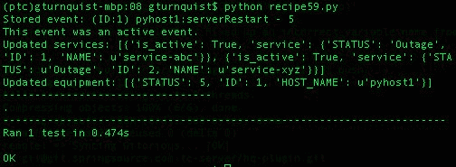

# 工作原理...

我们需要编写各种测试用例，以覆盖我们需要的不同测试级别。通过将测试运行程序与测试用例分开，我们可以决定仅运行与数据库集成的测试。

为什么要这样做？在我们的情况下，我们只有一个单元测试，而且运行速度相当快。你认为一个具有数月或数年开发时间和相应测试套件的真实应用程序会像这样快速运行吗？当然不会！

有些测试可能会很复杂。它们可能涉及与真实系统交流，解析大型样本数据文件和其他耗时任务。这可能需要几分钟甚至几小时才能运行。

当我们即将向客户做演示时，我们不需要一个运行时间很长的测试套件。相反，我们需要能够运行这些测试的一个快速子集，以确保一切正常。使用 Python 的导入语句可以很容易地定义这一点。

我们可能需要考虑的一些测试套件包括以下内容：

+   `pulse.py`：导入一组测试用例，对应用程序进行广泛而浅显的测试，以验证系统是否正常运行

+   `checkin.py`：导入一组当前正常运行的测试用例，并提供足够的信心，表明代码已准备好提交

+   `integration.py`：导入一组测试用例，启动、交互，然后关闭 LDAP、数据库或其他子系统等外部系统

+   `security.py`：导入一组专注于各种安全场景的测试用例，确认良好和不良凭据处理

+   `all.py`：导入所有测试用例以确保一切正常

这只是我们可以定义的测试模块类型的一个示例。我们可以为我们处理的每个子系统定义一个模块。但是，由于我们正在讨论冒烟测试，我们可能希望思考得更广泛，而是从每个子系统中挑选一些关键测试，并将它们联系在一起，以便让我们感觉应用程序正在运行。

# 还有更多...

让我们也看看这些。

# 安全性、检查和集成不是冒烟测试！

这是绝对正确的。前面的列表显示，使用 Python 导入语句不仅限于定义冒烟测试套件。它可以用于捆绑满足各种需求的测试用例。那么，为什么要提到这一点，因为我们正在谈论冒烟测试？嗯，因为我想传达这种机制在组织测试方面有多么有用，它不仅限于冒烟测试。

# 什么提供了很好的灵活性？

为了能够灵活地选择测试类，我们应该避免使测试类太大。但是，将每个测试方法放在不同的类中可能太多了。

# 另请参阅

本章中的*省略集成测试*配方

# 省略集成测试

快速测试套件避免连接到远程系统，如数据库和 LDAP。只验证核心单元并避免外部系统可能导致运行更快的测试套件并覆盖更多内容。这可以导致一个有用的冒烟测试，让开发人员对系统有信心，而不运行所有测试。

# 如何做...

通过这些步骤，我们将看到如何剔除与外部系统交互的测试用例：

1.  创建一个名为`recipe60_test.py`的测试模块，用于编写我们的网络应用程序的一些测试，如下所示：

```py
import logging
from network import *
import unittest
from springpython.database.factory import *
from springpython.database.core import *
```

1.  创建一个测试用例，删除数据库连接并将数据访问函数存根出来：

```py
class EventCorrelatorUnitTests(unittest.TestCase):
def setUp(self):
db_name = "recipe60.db"
factory = Sqlite3ConnectionFactory(db=db_name)
self.correlator = EventCorrelator(factory)
# We "unplug" the DatabaseTemplate so that
# we don't talk to a real database.
self.correlator.dt = None
# Instead, we create a dictionary of
# canned data to return back
self.return_values = {}
# For each sub-function of the network app,
# we replace them with stubs which return our
# canned data.
def stub_store_event(event):
event.id = self.return_values["id"]
return event, self.return_values["active"]
self.correlator.store_event = stub_store_event
def stub_impact(event):
return (self.return_values["services"],self.return_values["equipment"])
self.correlator.impact = stub_impact
def stub_update_service(service, event):
return service + " updated"
self.correlator.update_service = stub_update_service
def stub_update_equip(equip, event):
return equip + " updated"
self.correlator.update_equipment = stub_update_equip
```

1.  创建一个测试方法，它创建一组预定义的数据值，调用应用程序的处理方法，然后验证这些值，如下所示：

```py
def test_process_events(self):
# For this test case, we can preload the canned data,
# and verify that our process function is working
# as expected without touching the database.
self.return_values["id"] = 4668
self.return_values["active"] = True
self.return_values["services"] = ["service1",
"service2"]
self.return_values["equipment"] = ["device1"]
evt1 = Event("pyhost1", "serverRestart", 5)
stored_event, is_active,
updated_services, updated_equipment =
self.correlator.process(evt1)
self.assertEquals(4668, stored_event.id)
self.assertTrue(is_active)
self.assertEquals(2, len(updated_services))
self.assertEquals(1, len(updated_equipment))
```

1.  创建另一个测试用例，使用 SQL 脚本预加载数据库：

```py
class EventCorrelatorIntegrationTests(unittest.TestCase):
def setUp(self):
db_name = "recipe60.db"
factory = Sqlite3ConnectionFactory(db=db_name)
self.correlator = EventCorrelator(factory)
dt = DatabaseTemplate(factory)
sql = open("network.sql").read().split(";")
for statement in sql:
dt.execute(statement + ";")
```

1.  编写一个测试方法，调用网络应用程序的处理方法，然后打印结果：

```py
def test_process_events(self):
evt1 = Event("pyhost1", "serverRestart", 5)
stored_event, is_active,
updated_services, updated_equipment =
self.correlator.process(evt1)
print "Stored event: %s" % stored_event
if is_active:
print "This event was an active event."
print "Updated services: %s" % updated_services
print "Updated equipment: %s" % updated_equipment
print "---------------------------------"
```

1.  创建一个名为`recipe60.py`的模块，它只导入避免进行 SQL 调用的单元测试。看看这段代码：

```py
from recipe60_test import EventCorrelatorUnitTests
if __name__ == "__main__":
import unittest
unittest.main()
```

1.  运行测试模块。查看以下截图：

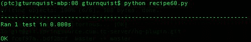

# 它是如何工作的...

这个测试套件运行单元测试，并避免运行与实时数据库集成的测试用例。它使用 Python 的`import`语句来决定包括哪些测试用例。

在我们虚构的场景中，性能几乎没有提高。但是对于一个真实的项目，可能会花费更多的计算机周期来进行集成测试，因为与外部系统交互会产生额外的成本。

这个想法是创建一组测试的子集，以某种程度上验证我们的应用程序通过在很短的时间内覆盖大部分内容来工作。

冒烟测试的诀窍在于决定什么构成了足够好的测试。自动化测试无法完全确认我们的应用程序没有错误。我们受到这样一个事实的干扰，即特定的错误不存在，或者我们还没有编写一个暴露这样一个错误的测试用例。要进行冒烟测试，我们决定使用这些测试的一个子集进行快速脉冲读取。再次决定哪个子集给我们足够好的脉冲可能更多地是一种艺术而不是科学。

这个配方侧重于单元测试可能会更快地运行，并且剔除集成测试将删除较慢的测试用例。如果所有单元测试都通过了，那么我们就有了一些信心，我们的应用程序状态良好。

# 还有更多...

我必须指出，测试用例不仅仅容易归类为**单元测试**或**集成测试**。它更多的是一个连续体。在这个配方的示例代码中，我们编写了一个单元测试和一个集成测试，然后我们选择了单元测试作为我们的冒烟测试套件。

这看起来是任意的，也许是刻意的吗？当然是。这就是为什么烟雾测试不是一成不变的，而是需要一些分析和判断来选择。随着开发的进行，还有改进的空间。

我曾经开发过一个系统，可以从不同供应商那里获取发票。我编写了设置空数据库表、摄取多种格式文件，然后检查数据库内容以验证处理的单元测试。测试套件运行超过 45 分钟。这迫使我不能像期望的那样频繁地运行测试套件。我设计了一个烟雾测试套件，只运行不涉及数据库的单元测试（因为它们很快），并摄取一个供应商发票。它运行时间少于五分钟，并提供了一个更快的方法来确保代码的基本更改没有破坏整个系统。我可以在一天中运行多次这个测试，并且每天只运行一次全面的测试套件。

# 烟雾测试是否应包括集成或单元测试？

这段代码是否与*使用导入语句定义测试用例的子集*食谱中显示的代码相似？是的，它是。那么，为什么要包含在这个食谱中呢？因为选择烟雾测试套件和用于实现它的策略一样关键。另一个食谱决定选择一个集成测试，同时剔除单元测试，以创建一个更小、更快的测试套件。

这个示例表明，另一个可能性是剔除更长的集成测试，而是尽可能多地运行单元测试，考虑它们可能更快。

如前所述，烟雾测试并不是一成不变的。它涉及选择最佳的测试代表，而不会花费太多时间来运行它们。很可能到目前为止写的测试中没有一个确切地针对捕捉系统脉搏的想法。一个好的烟雾测试套件可能涉及混合一部分单元测试和集成测试。

# 另请参阅

*使用导入语句定义测试用例的子集*食谱

# 针对端到端场景

选择一组测试，运行足够的部分来定义一个执行线程。这有时被称为线程测试。不是因为我们使用软件线程，而是因为我们专注于一个故事线。很多时候，我们的线程要么来自客户场景，要么至少受到它们的启发。其他线程可能涉及其他团队，比如运营团队。

例如，一个网络管理系统可能会推送影响客户的警报，但必须解决网络问题的内部运营团队可能有完全不同的视角。这两种情况都展示了有效的端到端线程，是值得投资自动化测试的好地方。

如果将不同团队视为不同类型的客户，那么验收测试的概念肯定适用。还可以将其与 BDD 的概念重叠。

# 准备工作

1.  将 SQL 脚本复制到一个名为`recipe61_network.sql`的新文件中，并在底部替换插入语句为以下内容：

```py
INSERT into EQUIPMENT (ID, HOST_NAME, STATUS) values (1, 'pyhost1', 1);
INSERT into EQUIPMENT (ID, HOST_NAME, STATUS) values (2, 'pyhost2', 1);
INSERT into EQUIPMENT (ID, HOST_NAME, STATUS) values (3, 'pyhost3', 1);
INSERT into SERVICE (ID, NAME, STATUS) values (1, 'service-abc', 
'Operational');
INSERT into SERVICE_MAPPING (SERVICE_FK, EQUIPMENT_FK) values (1,1);
INSERT into SERVICE_MAPPING (SERVICE_FK, EQUIPMENT_FK) values (1,2);
```

在这组测试数据中，`pyhost1`和`pyhost2`映射到`service-abc`。`pyhost3`没有映射到任何服务。

# 如何做...

通过这些步骤，我们将建立一个端到端的测试场景。

1.  创建一个名为`recipe61_test.py`的测试模块。

1.  创建一个测试用例，其中每个测试方法捕获不同的执行线程，如下所示：

```py
import logging
from network import *
import unittest
from springpython.database.factory import *
from springpython.database.core import *
class EventCorrelatorEquipmentThreadTests(unittest.TestCase):
def setUp(self):
db_name = "recipe61.db"
factory = Sqlite3ConnectionFactory(db=db_name)
self.correlator = EventCorrelator(factory)
dt = DatabaseTemplate(factory)
sql = open("recipe61_network.sql").read().split(";")
for statement in sql:
dt.execute(statement + ";")
def tearDown(self):
self.correlator = None
```

1.  创建一个捕获设备故障和恢复的线程的测试方法，如下所示：

```py
def test_equipment_failing(self):
# This alarm maps to a device
# but doesn't map to any service.
```

1.  测试方法应注入单个故障警报，然后确认相关设备已经失败，如下所示：

```py
evt1 = Event("pyhost3", "serverRestart", 5)
stored_event, is_active,
updated_services, updated_equipment =
self.correlator.process(evt1)
self.assertTrue(is_active)
self.assertEquals(len(updated_services), 0)
self.assertEquals(len(updated_equipment), 1)
self.assertEquals(updated_equipment[0]["HOST_NAME"],
"pyhost3")
# 5 is the value for a failed piece of equipment
self.assertEquals(updated_equipment[0]["STATUS"], 5)
```

1.  在同一个测试方法中，添加代码，注入单个清除警报，并确认设备已经恢复，如下所示：

```py
evt2 = Event("pyhost3", "serverRestart", 1)
stored_event, is_active,
updated_services, updated_equipment =
self.correlator.process(evt2)
self.assertFalse(is_active)
self.assertEquals(len(updated_services), 0)
self.assertEquals(len(updated_equipment), 1)
self.assertEquals(updated_equipment[0]["HOST_NAME"],
"pyhost3")
# 1 is the value for a clear piece of equipment
self.assertEquals(updated_equipment[0]["STATUS"], 1)
```

1.  创建另一个捕获服务失败和清除线程的测试方法，如下所示：

```py
def test_service_failing(self):
# This alarm maps to a service.
```

1.  编写一个测试方法，注入一个单一的故障警报，并确认设备和相关服务都失败了，如下所示：

```py
evt1 = Event("pyhost1", "serverRestart", 5)
stored_event, is_active,
updated_services, updated_equipment =
self.correlator.process(evt1)
self.assertEquals(len(updated_services), 1)
self.assertEquals("service-abc",
updated_services[0]["service"]["NAME"])
self.assertEquals("Outage",
updated_services[0]["service"]["STATUS"])
```

1.  在同一个测试方法中，添加代码，注入一个单一的清除警报，并确认设备和服务都已恢复，如下所示：

```py
evt2 = Event("pyhost1", "serverRestart", 1)
stored_event, is_active,
updated_services, updated_equipment =
self.correlator.process(evt2)
self.assertEquals(len(updated_services), 1)
self.assertEquals("service-abc",
updated_services[0]["service"]["NAME"])
self.assertEquals("Operational",
updated_services[0]["service"]["STATUS"])
```

1.  创建一个名为`recipe61.py`的测试运行器，导入这两个线程测试，如下所示：

```py
from recipe61_test import *
if __name__ == "__main__":
import unittest
unittest.main()
```

1.  运行测试套件。查看以下截图：

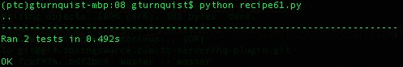

# 它是如何工作的...

在这个配方中，我们编写了两个端到端测试场景。现在考虑以下：

+   第一个场景测试了我们的应用程序如何处理故障，然后是只影响设备的清除。

+   第二个场景测试了我们的应用程序如何处理故障，然后是影响服务的清除。

我们注入了一个故障，然后检查结果，确认适当的库存部分失败了。然后我们注入了一个清除，再次确认适当的库存部分恢复了。

这两种情况都展示了我们的应用程序如何处理从开始到结束的不同类型的事件。

# 还有更多...

在这个应用程序的更复杂、更真实的版本中，你认为还有哪些其他系统会涉及到端到端的线程？安全性呢？交易？将结果发布到外部接口？

这就是我们需要定义端点的地方。想象一下，我们的应用程序已经发展到接收到来自网络请求的事件，并且设备和服务更新被推送为 JSON 数据，以便由网页接收。

一个好的端到端测试还应包括这些部分。对于 JSON 输出，我们可以使用 Python 的 JSON 库来解码输出，然后确认结果。对于传入的网络请求，我们可以使用许多不同的技术，包括接受测试工具，如机器人框架。

# 这如何定义冒烟测试？

如果运行所有端到端测试需要太长时间，我们应该选择其中一部分覆盖一些关键部分。例如，我们可以跳过基于设备的线程，但保留基于服务的线程。

# 另请参阅

+   *使用机器人框架测试 Web 基础知识* 配方在[第十章](https://www.packtpub.com/sites/default/files/downloads/Web_UI_Testing_Using_Selenium.pdf)中，*使用 Selenium 进行 Web UI 测试*

+   *使用机器人验证 Web 应用程序安全* 配方在[第十章](https://www.packtpub.com/sites/default/files/downloads/Web_UI_Testing_Using_Selenium.pdf)中，*使用 Selenium 进行 Web UI 测试*

# 针对测试服务器

你的测试服务器是否有所有的部分？如果没有，那么定义一组替代测试。

这个配方假设生产服务器有一个企业级的 MySQL 数据库系统，而开发人员的工作站没有。我们将探讨编写一些使用 MySQL 数据库的测试。但是当我们需要在开发实验室中运行它们时，我们将进行调整，使它们在 Python 捆绑的 SQLite 上运行。

你是否想知道为什么 MySQL 不在开发人员的工作站上？MySQL 确实很容易安装，而且性能负载不大。但是，如果生产服务器是 Oracle，并且管理层认为为我们的开发人员授予单独的许可证成本太高，那么这种情况同样适用。由于设置商业数据库的成本，这个配方使用的是 MySQL 和 SQLite，而不是 Oracle 和 SQLite。

# 准备工作

让我们看看以下步骤：

1.  确保 MySQL 生产数据库服务器正在运行：

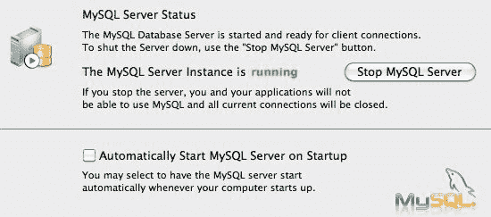

1.  以 root 用户身份打开命令行 MySQL 客户端 shell。

1.  为这个配方创建一个名为`recipe62`的数据库，并创建一个具有访问权限的用户。

1.  退出 shell。与以下截图所示的情况相反，绝对不要创建一个存储在明文中的生产数据库密码。这个数据库仅用于演示目的：

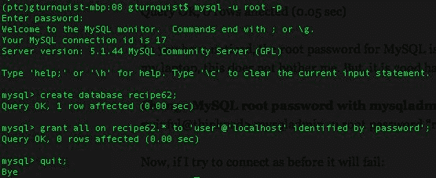

# 如何做...

在这些步骤中，我们将看到如何构建针对不同服务器的测试：

1.  创建一个名为`recipe62_network.mysql`的 SQL 脚本的备用版本，该脚本在早期的配方中使用了 MySQL 约定，如下所示：

```py
DROP TABLE IF EXISTS SERVICE_MAPPING;
DROP TABLE IF EXISTS SERVICE_EVENTS;
DROP TABLE IF EXISTS ACTIVE_EVENTS;
DROP TABLE IF EXISTS EQUIPMENT;
DROP TABLE IF EXISTS SERVICE;
DROP TABLE IF EXISTS EVENTS;
CREATE TABLE EQUIPMENT (
ID SMALLINT PRIMARY KEY AUTO_INCREMENT,
HOST_NAME TEXT,
STATUS SMALLINT
);
CREATE TABLE SERVICE (
ID SMALLINT PRIMARY KEY AUTO_INCREMENT,
NAME TEXT,
STATUS TEXT
);
CREATE TABLE SERVICE_MAPPING (
ID SMALLINT PRIMARY KEY AUTO_INCREMENT,
SERVICE_FK SMALLINT,
EQUIPMENT_FK SMALLINT
);
CREATE TABLE EVENTS (
ID SMALLINT PRIMARY KEY AUTO_INCREMENT,
HOST_NAME TEXT,
SEVERITY SMALLINT,
EVENT_CONDITION TEXT
);
CREATE TABLE SERVICE_EVENTS (
ID SMALLINT PRIMARY KEY AUTO_INCREMENT,
SERVICE_FK SMALLINT,
EVENT_FK SMALLINT
);
CREATE TABLE ACTIVE_EVENTS (
ID SMALLINT PRIMARY KEY AUTO_INCREMENT,
EVENT_FK SMALLINT
);
INSERT into EQUIPMENT (ID, HOST_NAME, STATUS) values (1, 'pyhost1', 1);
INSERT into EQUIPMENT (ID, HOST_NAME, STATUS) values (2, 'pyhost2', 1);
INSERT into EQUIPMENT (ID, HOST_NAME, STATUS) values (3, 'pyhost3', 1);
INSERT into SERVICE (ID, NAME, STATUS) values (1, 'service-abc', 
'Operational');
INSERT into SERVICE_MAPPING (SERVICE_FK, EQUIPMENT_FK) values (1,1);
INSERT into SERVICE_MAPPING (SERVICE_FK, EQUIPMENT_FK) values (1,2)
```

你可能没有注意到，但这个模式定义没有外键约束。在真实的 SQL 脚本中，它们肯定应该被包含进去。在这种情况下，它们被省略是为了减少复杂性。

1.  创建一个新模块`recipe62_test.py`来放置我们的测试代码。

1.  创建一个具有一个测试方法来验证事件到服务相关性的抽象测试用例，如下所示：

```py
import logging
from network import *
import unittest
from springpython.database.factory import *
from springpython.database.core import *
class AbstractEventCorrelatorTests(unittest.TestCase):
def tearDown(self):
self.correlator = None
def test_service_failing(self):
# This alarm maps to a service.
evt1 = Event("pyhost1", "serverRestart", 5)
stored_event, is_active,
updated_services, updated_equipment =
self.correlator.process(evt1)
self.assertEquals(len(updated_services), 1)
self.assertEquals("service-abc",
updated_services[0]["service"]["NAME"])
self.assertEquals("Outage",
updated_services[0]["service"]["STATUS"])
evt2 = Event("pyhost1", "serverRestart", 1)
stored_event, is_active,
updated_services, updated_equipment =
self.correlator.process(evt2)
self.assertEquals(len(updated_services), 1)
self.assertEquals("service-abc",
updated_services[0]["service"]["NAME"])
self.assertEquals("Operational",
updated_services[0]["service"]["STATUS"])
```

1.  创建一个连接到 MySQL 数据库并使用 MySQL 脚本的具体子类，如下所示：

```py
class MySQLEventCorrelatorTests(AbstractEventCorrelatorTests):
def setUp(self):
factory = MySQLConnectionFactory("user", "password",
"localhost", "recipe62")
self.correlator = EventCorrelator(factory)
dt = DatabaseTemplate(factory)
sql = open("recipe62_network.mysql").read().split(";")
for statement in sql:
dt.execute(statement + ";")
```

1.  创建一个名为`recipe62_production.py`的相应的生产测试运行程序，如下所示：

```py
from recipe62_test import MySQLEventCorrelatorTests
if __name__ == "__main__":
import unittest
unittest.main()
```

运行它并验证它是否连接到生产数据库：

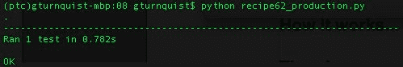

1.  现在创建一个 SQLite 版本的 SQL 脚本，名为`recipe62_network.sql`，如下所示：

```py
DROP TABLE IF EXISTS SERVICE_MAPPING;
DROP TABLE IF EXISTS SERVICE_EVENTS;
DROP TABLE IF EXISTS ACTIVE_EVENTS;
DROP TABLE IF EXISTS EQUIPMENT;
DROP TABLE IF EXISTS SERVICE;
DROP TABLE IF EXISTS EVENTS;
CREATE TABLE EQUIPMENT (
ID INTEGER PRIMARY KEY,
HOST_NAME TEXT UNIQUE,
STATUS INTEGER
);
CREATE TABLE SERVICE (
ID INTEGER PRIMARY KEY,
NAME TEXT UNIQUE,
STATUS TEXT
);
CREATE TABLE SERVICE_MAPPING (
ID INTEGER PRIMARY KEY,
SERVICE_FK,
EQUIPMENT_FK,
FOREIGN KEY(SERVICE_FK) REFERENCES SERVICE(ID),
FOREIGN KEY(EQUIPMENT_FK) REFERENCES EQUIPMENT(ID)
);
CREATE TABLE EVENTS (
ID INTEGER PRIMARY KEY,
HOST_NAME TEXT,
SEVERITY INTEGER,
EVENT_CONDITION TEXT
);
CREATE TABLE SERVICE_EVENTS (
ID INTEGER PRIMARY KEY,
SERVICE_FK,
EVENT_FK,
FOREIGN KEY(SERVICE_FK) REFERENCES SERVICE(ID),
FOREIGN KEY(EVENT_FK) REFERENCES EVENTS(ID)
);
CREATE TABLE ACTIVE_EVENTS (
ID INTEGER PRIMARY KEY,
EVENT_FK,
FOREIGN KEY(EVENT_FK) REFERENCES EVENTS(ID)
);
INSERT into EQUIPMENT (ID, HOST_NAME, STATUS) values (1, 'pyhost1', 1);
INSERT into EQUIPMENT (ID, HOST_NAME, STATUS) values (2, 'pyhost2', 1);INSERT into EQUIPMENT (ID, HOST_NAME, STATUS) values (3, 'pyhost3', 1);
INSERT into SERVICE (ID, NAME, STATUS) values (1, 'service-abc', 'Op
erational');
INSERT into SERVICE_MAPPING (SERVICE_FK, EQUIPMENT_FK) values (1,1);
INSERT into SERVICE_MAPPING (SERVICE_FK, EQUIPMENT_FK) values (1,2);
```

1.  创建抽象测试用例的另一个具体子类，让它使用 SQLite 连接 SQLite 脚本，并将其添加到`recipe62_test.py`中，如下所示：

```py
class Sqlite3EventCorrelatorTests(AbstractEventCorrelatorTests):
def setUp(self):
factory = Sqlite3ConnectionFactory("recipe62.db")
self.correlator = EventCorrelator(factory)
dt = DatabaseTemplate(factory)
sql = open("recipe62_network.sql").read().split(";")for statement in sql:
dt.execute(statement + ";")
```

1.  创建一个名为`recipe62_dev.py`的相应的开发工作站测试运行程序，如下所示：

```py
from recipe62_test import Sqlite3EventCorrelatorTests
if __name__ == "__main__":
import unittest
unittest.main()
```

1.  运行它并验证它是否连接到开发数据库：

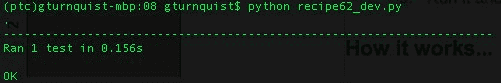

# 它是如何工作的...

在生产环境中拥有完整的服务器和安装的软件，同时在较小的开发环境中也有是很常见的。一些商店甚至有一个介于这些配置之间的测试床。

我们的网络应用通过允许将数据库连接信息注入其中来处理这种情况。在每个测试用例中，我们使用完全相同的应用程序，但使用不同的数据库系统。

我们编写了一个使用生产 MySQL 数据库的测试用例，还编写了一个使用开发 SQLite 数据库的测试用例。当然，MySQL，即使在许多生产环境中使用，也不像是开发人员无法使用的东西。但它提供了一个很容易看到的例子，即必须切换数据库系统。

# 还有更多...

在这个配方中，我们展示了需要切换数据库系统。这不是唯一可能需要为测试目的提供备用配置的外部系统。其他东西，比如 LDAP 服务器、第三方 Web 服务和独立子系统，可能有完全不同的配置。

我曾在几个合同上工作过，经常看到管理人员削减开发实验室资源以节省成本。他们似乎得出结论，即维护多个配置和处理不可重现的错误的成本要低于拥有完全相同的设备和软件的成本。我觉得这个结论是错误的，因为在将来的某个时候，他们最终会因涉及平台差异的问题增加硬件并升级设备。

这意味着我们并不总是能够编写针对生产环境的测试。编写我们的软件，使其具有最大的灵活性，比如注入数据库配置，正如我们之前所做的那样，是一个最低要求。

重要的是，我们尽可能多地编写在开发人员平台上运行的测试。当开发人员不得不开始共享服务器端资源时，我们就会遇到资源冲突。例如，两个开发人员共享一个单一的数据库服务器将不得不做以下事情之一：

+   有单独的模式，这样它们就可以清空和加载测试数据

+   协调时间，使它们都可以访问相同的模式

+   为每个开发人员设置不同的服务器

第三个选项是极不可能的，因为我们谈论的是一个比生产环境占地面积小得多的开发实验室。

一个积极的消息是，开发人员的机器变得更快更强大。与 10 年前相比，常见的工作站远远超过了旧的服务器机器。但是，即使我们每个人都能在自己的机器上运行整个软件堆栈，也并不意味着管理层会支付所有必要的许可费用。

不幸的是，这种限制可能永远不会改变。因此，我们必须准备为备用配置编写测试，并管理与生产环境的差异。

# 开发和生产环境使用两种不同的数据库系统的可能性有多大？

诚然，很少有人会在 SQLite 和 MySQL 之间进行如此大的切换。这本身就需要使用略有不同的 SQL 方言来定义模式。有些人可能会立刻认为这太难以管理了。但是环境中的较小差异仍然可能导致对减少测试的同样需求。

我曾经在一个系统上工作了很多年，该系统的生产系统使用的是 Oracle 9i RAC，而开发实验室只有 Oracle 9i。RAC 需要额外的硬件，而我们从未为此分配资源。更糟糕的是，Oracle 9i 太大了，无法安装在我们开发的相对轻量级的个人电脑上。虽然所有内容都使用 Oracle 的 SQL 方言，但是 RAC 和非 RAC 之间的运行时间差异产生了大量我们无法在开发实验室中复现的错误。这确实可以算作两个不同的数据库系统。鉴于我们无法在生产环境中工作，我们尽可能在开发实验室进行测试，然后安排时间在测试实验室进行测试，那里有一个 RAC 实例。由于许多人需要访问该实验室，我们限制了我们对 RAC 特定问题的使用，以避免时间延迟。

# 这不仅仅局限于数据库系统

正如前面所述，这不仅仅是关于数据库系统。我们已经讨论了 MySQL、SQLite 和 Oracle，但这也涉及到我们工作或依赖的任何在生产和开发环境之间有差异的系统。

能够编写子集测试以获得信心可以帮助减少我们不可避免地必须处理的实际问题。

# 编写数据模拟器

编写一个模拟器，以定义的速率产生数据，可以帮助模拟真实负载。

这个食谱假设读者的机器已经安装了 MySQL。

# 准备工作

1.  确保 MySQL 生产数据库服务器正在运行。

1.  以 root 用户身份打开命令行 MySQL 客户端 shell。

1.  为这个食谱创建一个名为`recipe63`的数据库，以及一个具有访问权限的用户。

1.  退出 shell，如下所示：

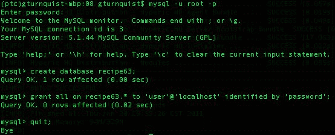

# 如何做到...

通过这些步骤，我们将探讨编写一个测试模拟器：

1.  创建一个名为`recipe63.py`的测试生成器脚本，使用各种 Python 库，如下所示：

```py
import getopt
import random
import sys
import time
from network import *
from springpython.remoting.pyro import *
```

1.  创建一个打印命令行选项的使用方法，如下所示：

```py
def usage():
print "Usage"
print "====="
print "-h, --help read this help"
print "-r, --rate [arg] number of events per second"
print "-d, --demo demo by printing events"
```

1.  使用 Python 的 getopt 库来解析命令行参数，如下所示：

```py
try:
opts, args = getopt.getopt(sys.argv[1:], "hr:d", ["help", "rate=",
"demo"])
except getopt.GetoptError, err:
print str(err)
usage()
sys.exit(1)
rate = 10
demo_mode = False
for o, a in opts:
if o in ("-h", "--help"):
usage()
sys.exit(1)
elif o in ("-r", "--rate"):
rate = a
elif o in ("-d", "--demo"):
demo_mode = True
```

1.  添加一个开关，这样当它不在演示模式下，它将使用 Spring Python 的`PyroProxyFactory`连接到网络管理应用程序的服务器实例：

```py
if not demo_mode:
print "Sending events to live network app. Ctrl+C to exit..."
proxy = PyroProxyFactory()
proxy.service_url = "PYROLOC://127.0.0.1:7766/network"
```

1.  创建一个创建随机事件的无限循环，如下所示：

```py
while True:
hostname = random.choice(["pyhost1","pyhost2","pyhost3"])
condition = random.choice(["serverRestart", "lineStatus"])
severity = random.choice([1,5])
evt = Event(hostname, condition, severity)
```

1.  如果在演示模式下，打印出事件，如下所示：

```py
if demo_mode:
now = time.strftime("%a, %d %b %Y %H:%M:%S +0000",
time.localtime())
print "%s: Sending out %s" % (now, evt)
```

1.  如果不是在演示模式下，通过代理进行远程调用到网络应用程序的处理方法，如下所示：

```py
else:
stored_event, is_active, updated_services,
updated_equipment = proxy.process(evt)
print "Stored event: %s" % stored_event
print "Active? %s" % is_active
print "Services updated: %s" % updated_services
print "Equipment updated; %s" % updated_equipment
print "================"
```

1.  在重复循环之前休眠一段时间，使用这行代码：

```py
time.sleep(1.0/float(rate))
```

1.  运行生成器脚本。在下面的屏幕截图中，请注意出现了错误，因为我们还没有启动服务器进程。如果客户端和服务器的 URL 不匹配，也会出现这种情况：

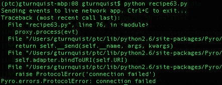

1.  创建一个名为`recipe63_server.py`的服务器脚本，该脚本将运行我们的网络管理应用程序，使用*定位测试服务器*食谱中显示的`recipe62_network.sql` SQL 脚本连接到 MySQL。

```py
from springpython.database.factory import *
from springpython.database.core import *
from springpython.remoting.pyro import *
from network import *
import logging
logger = logging.getLogger("springpython")
loggingLevel = logging.DEBUG
logger.setLevel(loggingLevel)
ch = logging.StreamHandler()
ch.setLevel(loggingLevel)
formatter = logging.Formatter("%(asctime)s - %(name)s - %(levelname)s -
%(message)s")
ch.setFormatter(formatter)
logger.addHandler(ch)
# Initialize the database
factory = MySQLConnectionFactory("user", "password",
"localhost", "recipe63")
dt = DatabaseTemplate(factory)
sql = open("recipe62_network.mysql").read().split(";")
for statement in sql:
dt.execute(statement + ";")
```

1.  添加代码以使用 Pyro 公开应用程序，如下所示：

```py
# Create an instance of the network management app
target_service = EventCorrelator(factory)
# Expose the network app as a Pyro service
exporter = PyroServiceExporter()
exporter.service_name = "network"
exporter.service = target_service
exporter.after_properties_set()
```

1.  在不同的 shell 中运行服务器脚本：

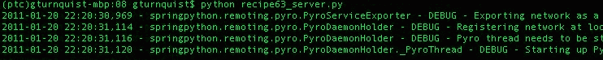

1.  默认速率为每秒 10 个事件。以每秒一个事件的速率运行生成器脚本。在下面的截图中，注意脚本生成了一个清晰的故障，然后又一个故障。服务从运行状态转移到故障状态，并保持在那里：

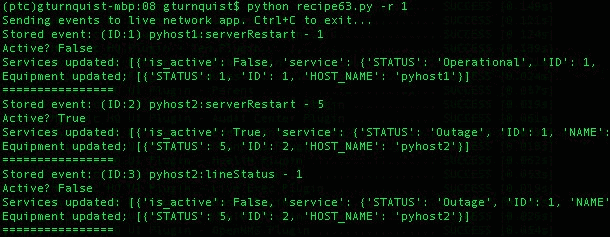

# 它是如何工作的...

Python 的`random.choice`方法使得创建一系列随机事件变得容易。通过使用`time.sleep`方法，我们可以控制事件创建的速率。

我们使用 Pyro 将测试生成器连接到网络管理应用程序。这不是连接事物的唯一方式。我们可以通过其他方式暴露应用程序，比如 REST、JSON，或者通过数据库表进行通信。这并不重要。重要的是我们建立了一个独立的工具，将数据输入到我们的应用程序中，就好像它来自于一个真实的网络。

# 还有更多...

我们建立了一个测试生成器。在不同的 shell 中以不同的速率运行多个副本很容易。我们有一种简单的方法来模拟不同子网产生不同量的流量。

我们还可以添加更多的命令行选项来微调事件。例如，我们可以将事件条件作为参数，并模拟不同类型事件的不同速率。

# 为什么服务器脚本要初始化数据库？

生产版本的服务器不会这样做。对于这个配方的演示目的，把它放在那里很方便。每次我们停止和启动服务器脚本时，它都会重新启动数据库。

# 为什么使用 MySQL 而不是 SQLite？

SQLite 在多线程方面有一些限制。Pyro 使用多线程，而 SQLite 无法在线程之间传递对象。SQLite 也相对轻量，并且可能不适合真正的网络管理应用程序。

# 另请参阅

*针对测试服务器*配方

# 实时录制和播放数据

没有什么比真实的生产数据更好。通过这个配方，我们将编写一些代码来记录实时数据。然后我们将播放它，并添加延迟以模拟播放实时数据流。

# 准备工作

让我们看看以下步骤：

1.  确保 MySQL 生产数据库服务器正在运行。

1.  以 root 用户身份打开命令行 MySQL 客户端 shell。

1.  为这个配方创建一个名为`recipe64`的数据库，以及一个具有访问权限的用户。

1.  在这里退出 shell：

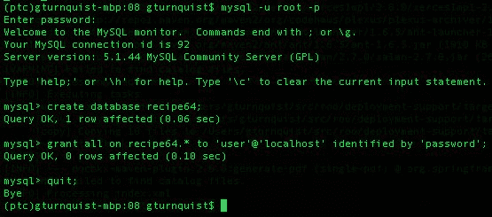

# 如何做...

通过这些步骤，我们将看到如何以实时速度记录和播放数据：

1.  编写一个名为`recipe64_livedata.py`的脚本，模拟每一到十秒发送一次实时数据，如下所示：

```py
import random
import sys
import time
from network import *
from springpython.remoting.pyro import *print "Sending events to live network app. Ctrl+C to exit..."
proxy = PyroProxyFactory()
proxy.service_url = "PYROLOC://127.0.0.1:7766/network_advised"
while True:
hostname = random.choice(["pyhost1","pyhost2","pyhost3"])
condition = random.choice(["serverRestart", "lineStatus"])
severity = random.choice([1,5])
evt = Event(hostname, condition, severity)
stored_event, is_active, updated_services,
updated_equipment = proxy.process(evt)
print "Stored event: %s" % stored_event
print "Active? %s" % is_active
print "Services updated: %s" % updated_services
print "Equipment updated; %s" % updated_equipment
print "================"
time.sleep(random.choice(range(1,10)))
```

1.  编写一个名为`recipe64_server.py`的服务器脚本，使用 SQL 脚本`recipe62_network.mysql`来初始化数据库，如下所示：

```py
from springpython.database.factory import *
from springpython.database.core import *
from springpython.remoting.pyro import *
from springpython.aop import *
from network import *
from datetime import datetime
import os
import os.path
import pickle
import logging
logger = logging.getLogger("springpython.remoting")
loggingLevel = logging.DEBUG
logger.setLevel(loggingLevel)
ch = logging.StreamHandler()
ch.setLevel(loggingLevel)
formatter = logging.Formatter("%(asctime)s - %(name)s - %(levelname)s -
%(message)s")
ch.setFormatter(formatter)
logger.addHandler(ch)
# Initialize the database
factory = MySQLConnectionFactory("user", "password",
"localhost", "recipe64")
dt = DatabaseTemplate(factory)
sql = open("recipe62_network.mysql").read().split(";")
for statement in sql:
dt.execute(statement + ";")
```

1.  添加一些代码，创建网络管理应用程序的实例，并使用 Pyro 和 Spring Python 进行广告发布，如下所示：

```py
# Create an instance of the network management app
target_service = EventCorrelator(factory)
# Expose the original network app as a Pyro service
unadvised_service = PyroServiceExporter()
unadvised_service.service_name = "network"
unadvised_service.service = target_service
unadvised_service.after_properties_set()
```

1.  添加一些代码，定义一个拦截器，将传入的事件数据和时间戳捕获到磁盘上，如下所示：

```py
class Recorder(MethodInterceptor):
"""
An interceptor that catches each event,
write it to disk, then proceeds to the
network management app.
"""
def __init__(self):
self.filename = "recipe64_data.txt"
self.special_char = "&&&"
if os.path.exists(self.filename):
os.remove(self.filename)
def invoke(self, invocation):
# Write data to disk
with open(self.filename, "a") as f:
evt = invocation.args[0]
now = datetime.now()
output = (evt, now)
print "Recording %s" % evt
f.write(pickle.dumps(output).replace("n", "&&&") + "n")
# Now call the advised service
return invocation.proceed()
```

1.  添加一些代码，使用拦截器包装网络管理应用程序，并使用 Pyro 进行广告发布，如下所示：

```py
# Wrap the network app with an interceptor
advisor = ProxyFactoryObject()
advisor.target = target_service
advisor.interceptors = [Recorder()]
# Expose the advised network app as a Pyro service
advised_service = PyroServiceExporter()
advised_service.service_name = "network_advised"
advised_service.service = advisor
advised_service.after_properties_set()
```

1.  通过输入`python recipe64_server.py`启动服务器应用程序。请注意以下截图中 Pyro 注册了`network`服务和`network_advised`服务：

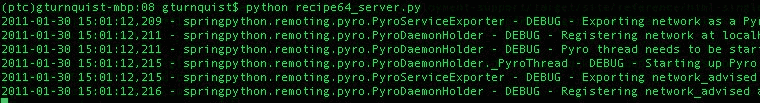

通过输入`python recipe64_livedata.py`运行实时数据模拟器，直到生成一些事件，然后按 Ctrl+C 退出：

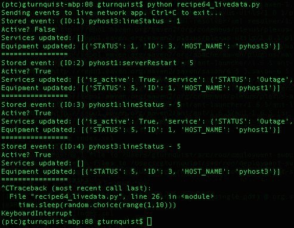

1.  看看服务器端的情况，并注意它记录了几个事件：

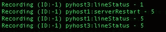

1.  检查`recipe64_data.txt`数据文件，注意每行代表一个单独的事件和时间戳。虽然很难解读封存格式中存储的数据，但仍然有可能发现一些片段。

1.  创建一个名为`recipe64_playback.py`的脚本，反封存数据文件的每一行，如下所示：

```py
from springpython.remoting.pyro import *
from datetime import datetime
import pickle
import time
with open("recipe64_data.txt") as f:
lines = f.readlines()
events = [pickle.loads(line.replace("&&&", "n"))
for line in lines]
```

1.  添加一个函数，找到当前事件和上一个事件之间的时间间隔，如下所示：

```py
def calc_offset(evt, time_it_happened, previous_time):
if previous_time is None:
return time_it_happened - time_it_happened
else:
return time_it_happened - previous_time
```

1.  定义一个客户端代理，连接到我们网络管理应用程序的未建议接口，如下所示：

```py
print "Sending events to live network app. Ctrl+C to exit..."
proxy = PyroProxyFactory()
proxy.service_url = "PYROLOC://127.0.0.1:7766/network"
```

1.  添加代码，迭代每个事件，计算差异，然后延迟下一个事件那么多秒，如下所示：

```py
previous_time = None
for (e, time_it_happened) in events:
diff = calc_offset(e, time_it_happened, previous_time)
print "Original: %s Now: %s" % (time_it_happened, datetime.now())
stored_event, is_active, updated_services,
updated_equipment = proxy.process(e)
print "Stored event: %s" % stored_event
print "Active? %s" % is_active
print "Services updated: %s" % updated_services
print "Equipment updated; %s" % updated_equipment
print "Next event in %s seconds" % diff.seconds
print "================"
time.sleep(diff.seconds)
previous_time = time_it_happened
```

1.  通过输入`python recipe64_playback.py`来运行播放脚本，并观察它与原始实时数据模拟器具有相同的延迟：

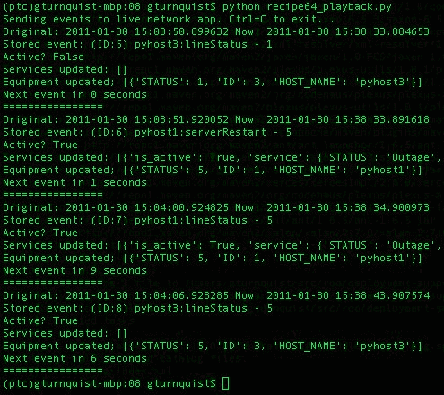

# 它是如何工作的...

通常，我们会记录来自实时网络的数据。在这种情况下，我们需要一个生成随机数据的模拟器。我们在这个配方中编写的模拟器与*编写数据模拟器*配方中显示的模拟器非常相似。

为了捕获数据，我们编写了一个拦截器，嵌入在 Pyro 和网络管理应用程序之间。发布到`network_advised` Pyro 服务名称的每个事件都无缝地通过这个拦截器。考虑以下内容：

1.  每个进来的事件都被追加到拦截器首次创建时初始化的数据文件中。

1.  事件还与`datetime.now()`的副本一起存储，以捕获时间戳。

1.  事件和时间戳被合并成一个元组并被封存，这样可以轻松地写入并稍后从磁盘读取。

1.  数据被封存以便于在磁盘上进行传输。

1.  将其写入磁盘后，拦截器调用目标服务，并将结果传递回原始调用者。

最后，我们有一个播放脚本，它读取数据文件，每行一个事件。它将每行反封存成最初存储的元组格式，并构建事件列表。

然后逐个扫描事件列表。通过将当前事件的时间戳与上一个事件进行比较，计算出秒数差，使用 Python 的`time.sleep()`方法以相同的速率播放事件。

播放脚本使用 Pyro 将事件发送到网络管理应用程序。但它与不同的暴露点进行通信。这是为了避免重新记录相同的事件。

# 还有更多...

这个配方中的代码使用 Pyro 作为连接客户端和服务器在发布/订阅范式中通信的机制。这不是构建这样一个服务的唯一方法。Python 也内置了 XML-RPC。只是它不像 Pyro 那样灵活。需要更彻底的实际流量分析来确定这个接口是否足够好。替代方案包括通过数据库 EVENT 表推送事件，客户端插入行，服务器轮询表格以获取新行，然后在消耗时删除它们。

这个配方还大量使用 Spring Python 的**面向方面的编程**功能来插入数据记录代码([`static.springsource.org/spring-python/1.1.x/reference/html/aop.html`](http://static.springsource.org/spring-python/1.1.x/reference/html/aop.html))。这提供了一种干净的方式来添加我们需要的额外功能层，以便在不必触及已构建的网络管理代码的情况下，嗅探和记录网络流量。

# 我以为这个配方是关于实时数据的！

嗯，这个配方更多地是关于**记录**实时数据和控制回放速度。为了在一个可重复使用的配方中捕捉这个概念，需要模拟实时系统。但在网络管理处理器前插入一个监听点的基本概念，就像我们所做的那样，同样有效。

# 为每个事件打开和关闭文件是一个好主意吗？

编写该配方是为了确保停止记录不会造成损失尚未写入磁盘的捕获数据的最小风险。需要分析生产数据以确定存储数据的最有效方式。例如，批量写入数据可能需要较少的 I/O 强度，也许是 10 个或者 100 个事件的批量。但风险在于数据可能会在类似的捆绑中丢失。

如果流量量足够低，按照本配方中所示，逐个写入每个事件可能根本不是问题。

# 关于数据存储的卸载呢？

通常情况下，打开文件、追加数据，然后关闭文件的实际逻辑包含在一个单独的类中。然后可以将此实用程序注入到我们构建的拦截器中。如果需要一些更复杂的方式来存储或传输数据，这可能变得很重要。例如，另一个 Pyro 服务可能存在于另一个位置，希望获得实时数据源的副本。

将数据消费者注入我们编写的方面将使我们更加灵活。在这个配方中，我们没有这样的要求，但很容易想象在新要求到来时进行这样的调整。

# 另请参阅

+   写一个数据模拟器的配方

+   尽可能快地记录和回放实时数据的配方

# 记录和尽可能快地回放实时数据

尽可能快地重放生产数据（而不是实时），可以让您了解瓶颈在哪里。

# 准备工作

1.  确保 MySQL 生产数据库服务器正常运行。

1.  以 root 用户身份打开命令行 MySQL 客户端 shell。

1.  为这个配方创建一个名为`recipe65`的数据库，以及一个具有访问权限的用户。

1.  退出 shell，如下所示：

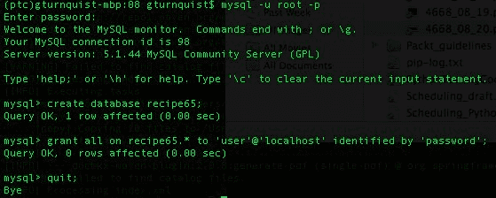

# 如何做...

在这些步骤中，我们将编写一些代码，让我们的系统承受重大负载：

1.  编写一个名为`recipe65_livedata.py`的脚本，模拟每一到十秒发送一次实时数据，如下所示：

```py
import random
import sys
import time
from network import *
from springpython.remoting.pyro import *
print "Sending events to live network app. Ctrl+C to exit..."
proxy = PyroProxyFactory()
proxy.service_url = "PYROLOC://127.0.0.1:7766/network_advised"
while True:
hostname = random.choice(["pyhost1","pyhost2","pyhost3"])
condition = random.choice(["serverRestart", "lineStatus"])
severity = random.choice([1,5])
evt = Event(hostname, condition, severity)
stored_event, is_active, updated_services,
updated_equipment = proxy.process(evt)
print "Stored event: %s" % stored_event
print "Active? %s" % is_active
print "Services updated: %s" % updated_services
print "Equipment updated; %s" % updated_equipment
print "================"
time.sleep(random.choice(range(1,10)))
```

1.  编写一个名为`recipe65_server.py`的服务器脚本，使用 SQL 脚本`recipe62_network.mysql`来初始化数据库，如下所示：

```py
from springpython.database.factory import *
from springpython.database.core import *
from springpython.remoting.pyro import *
from springpython.aop import *
from network import *
from datetime import datetime
import os
import os.path
import pickle
import logging
logger = logging.getLogger("springpython.remoting")
loggingLevel = logging.DEBUG
logger.setLevel(loggingLevel)
ch = logging.StreamHandler()
ch.setLevel(loggingLevel)
formatter = logging.Formatter("%(asctime)s - %(name)s - %(levelname)s -%(message)s")
ch.setFormatter(formatter)
logger.addHandler(ch)
# Initialize the database
factory = MySQLConnectionFactory("user", "password",
"localhost", "recipe65")
dt = DatabaseTemplate(factory)
sql = open("recipe62_network.mysql").read().split(";")
for statement in sql:
dt.execute(statement + ";")
```

1.  添加一些代码，创建网络管理应用程序的实例，并使用 Pyro 和 Spring Python 进行广告发布，如下所示：

```py
# Create an instance of the network management app
target_service = EventCorrelator(factory)
# Expose the original network app as a Pyro service
unadvised_service = PyroServiceExporter()
unadvised_service.service_name = "network"
unadvised_service.service = target_service
unadvised_service.after_properties_set()
```

1.  添加一些更多的代码，定义一个拦截器，捕获磁盘上的传入事件数据以及时间戳，如下所示：

```py
class Recorder(MethodInterceptor):
"""
An interceptor that catches each event,
write it to disk, then proceeds to the
network management app.
"""
def __init__(self):
self.filename = "recipe65_data.txt"
self.special_char = "&&&"
if os.path.exists(self.filename):
os.remove(self.filename)
def invoke(self, invocation):
# Write data to disk
with open(self.filename, "a") as f:
evt = invocation.args[0]
now = datetime.now()
output = (evt, now)
print "Recording %s" % evt
f.write(pickle.dumps(output).replace(
"n", "&&&") + "n")
# Now call the advised service
return invocation.proceed()
```

1.  添加一些代码，用拦截器包装网络管理应用程序，并使用 Pyro 进行广告发布，如下所示：

```py
# Wrap the network app with an interceptor
advisor = ProxyFactoryObject()
advisor.target = target_service
advisor.interceptors = [Recorder()]
# Expose the advised network app as a Pyro service
advised_service = PyroServiceExporter()
advised_service.service_name = "network_advised"
advised_service.service = advisor
advised_service.after_properties_set()
```

1.  通过输入`python recipe65_server.py`来启动服务器应用程序。在下面的屏幕截图中，请注意 Pyro 注册了`network`服务和`network_advised`服务：

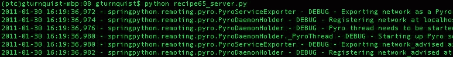

1.  通过输入`python recipe65_livedata.py`来运行实时数据模拟器，并观察它运行直到生成一些事件，然后按下*Ctrl*+*C*来中断它：

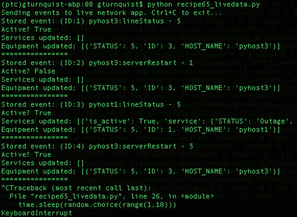

1.  查看服务器端的情况，并注意它记录了几个事件：

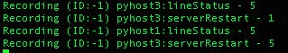

1.  检查`recipe65_data.txt`数据文件，注意每行代表一个单独的事件和时间戳。虽然很难解密以 pickled 格式存储的数据，但可能会发现一些片段。

1.  创建一个名为`recipe65_playback.py`的回放脚本，解 pickle 化数据文件的每一行，如下所示：

```py
from springpython.remoting.pyro import *
from datetime import datetime
import pickle
import time
with open("recipe65_data.txt") as f:
lines = f.readlines()
events = [pickle.loads(line.replace("&&&", "n"))
for line in lines]
```

1.  定义一个客户端代理，连接到我们网络管理应用程序的未建议接口，如下所示：

```py
print "Sending events to live network app. Ctrl+C to exit..."
proxy = PyroProxyFactory()
proxy.service_url = "PYROLOC://127.0.0.1:7766/network"
```

添加代码，迭代每个事件，尽可能快地回放事件，如下所示：

```py
for (e, time_it_happened) in events:
stored_event, is_active, updated_services,
updated_equipment = proxy.process(e))
print "Stored event: %s" % stored_event
print "Active? %s" % is_active
print "Services updated: %s" % updated_services
print "Equipment updated; %s" % updated_equipment
print "================"
```

1.  通过输入`python recipe65_playback.py`来运行播放脚本，观察它不会延迟事件，而是尽可能快地回放事件：

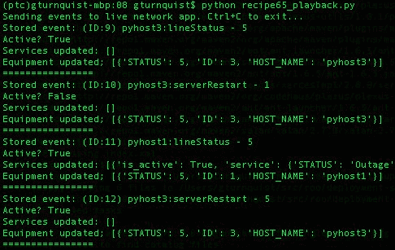

# 工作原理...

通常，我们会记录来自实时网络的数据。在这种情况下，我们需要一个生成随机数据的模拟器。我们在这个方法中编写的模拟器与*编写数据模拟器*方法中显示的模拟器非常相似。

为了捕获数据，我们编写了一个拦截器，它嵌入在 Pyro 和网络管理应用程序之间。每个发布到`network_advised` Pyro 服务名称的事件都无缝地通过这个拦截器。考虑以下情况：

+   每个进来的事件都被追加到拦截器首次创建时初始化的数据文件中。

+   事件还存储了`datetime.now()`的副本以捕获时间戳。

+   事件和时间戳被合并成一个元组，并被序列化，这样可以轻松地写入和稍后从磁盘中读取。

+   数据被序列化以便于在磁盘上传输。

+   将其写入磁盘后，拦截器调用目标服务，并将结果传递回原始调用者。

最后，我们有一个回放脚本，它读取数据文件，每行一个事件。它将每一行反序列化成最初存储的元组格式，并构建一个事件列表。

然后逐个扫描事件列表。不是通过评估时间戳来确定延迟播放事件的时间，而是立即将其注入到网络管理应用程序中。

回放脚本使用 Pyro 将事件发送到网络管理应用程序，但它与不同的暴露点进行通信。这是为了避免重新记录相同的事件。

# 还有更多...

这个方法中的代码使用 Pyro 作为连接客户端和服务器的机制，以发布/订阅范式进行通信。这并不是构建这样一个服务的唯一方式。Python 也内置了 XML-RPC。只是它没有 Pyro 灵活。需要更彻底的实时流量分析来确定这个接口是否足够好。替代方案包括通过数据库 EVENT 表推送事件，其中客户端插入行，服务器轮询表以获取新行，然后在消耗后删除它们。

这个方法还大量使用了 Spring Python 的**面向方面的编程**功能来插入数据记录代码（[`static.springsource.org/spring-python/1.1.x/reference/html/aop.html`](http://static.springsource.org/spring-python/1.1.x/reference/html/aop.html)）。这提供了一种清晰的方式来添加我们需要的额外功能层，以便在不触及现有网络管理代码的情况下嗅探和记录网络流量。

# 这与实时回放有什么不同？

实时回放对于查看系统如何处理生产负载很有用。但这并不能回答系统预计会在哪里出现问题的问题。流量永远不是稳定的。相反，它经常有意外的突发情况。这时以加速的速率回放实时数据将有助于暴露系统的下一个瓶颈。

预先解决一些这些问题将使我们的系统更具弹性。

# 这个应用程序的瓶颈在哪里？

诚然，当我们以最快的速度回放四个事件时，这个方法并没有崩溃。在生产中会得到相同的结果吗？事情以不同的方式崩溃。我们可能不会得到真正的异常或错误消息，而是发现系统的某些部分变得积压。

这就是这个方法的极限所在。虽然我们已经演示了如何通过大量的流量来过载系统，但我们没有展示如何监视瓶颈所在。

如果负载下的应用程序使用数据库表来排队工作，那么我们需要编写监视它们并报告以下情况的代码：

+   哪一个是最长的

+   哪一个正在变得更长，并且没有显示追赶的迹象

+   哪一个是活动管道中最早的

在具有处理阶段的系统中，通常会出现一个明显的瓶颈。当解决了该瓶颈时，很少是唯一的瓶颈。它只是最关键的瓶颈或者是链中的第一个瓶颈。

此外，这个配方不能解决你的瓶颈问题。这个配方的目的是找到它。

我曾经构建过一个非常类似的网络负载测试工具。代码可以并行处理大量的流量，但来自同一设备的事件必须按顺序处理。一次性重放一天的事件暴露了这样一个事实，即来自同一设备的太多事件会导致整个队列系统过载并使其他设备的处理受阻。改进服务更新算法后，我们能够重放相同的负载测试并验证它能够跟上。这有助于避免在非工作时间或周末发生的不可重现的故障。

# 应该收集多少实时数据？

捕获诸如一天的交通量块之类的东西是很有用的，这样可以让整天的事件都被回放。另一个可能性是整整一周。实时系统可能在周末和工作日有不同的负载，一周的数据将有助于更好地调查。

这么多数据的问题在于很难挑选一个窗口进行调查。这就是为什么周末的 24 小时数据和工作日的 24 小时数据可能更实际。

如果存在某种网络不稳定性，导致大规模的故障并引起大量的流量，打开收集器并等待另一个类似的故障发生可能是有用的。在发生这样的故障之后，可能有必要浏览数据文件并将其修剪到流量增加的位置。

这些类型的捕获场景在加载测试新版本时非常有价值，因为它们确认新补丁是否像预期的那样提高了性能，或者至少在修复非性能问题时没有降低性能。

# 另请参阅

+   *编写数据模拟器*配方

+   *实时录制和播放数据*配方

# 自动化您的管理演示

有演示吗？编写模拟执行你将要执行的步骤的自动化测试。然后打印出你的测试套件，并像脚本一样使用它。

# 如何做...

通过这些步骤，我们将看到如何以可运行的方式编写我们的管理演示脚本：

1.  创建一个名为`recipe66.py`的新文件，用于我们管理演示的测试代码。

1.  创建一个`unittest`测试场景来捕捉你的演示。

1.  编写一系列操作，就好像你正在从这个自动化测试中驱动应用程序。

1.  在演示期间的每个点都包含断言。看一下这段代码：

```py
import unittest
from network import *
from springpython.database.factory import *
class ManagementDemo(unittest.TestCase):
def setUp(self):
factory = MySQLConnectionFactory("user", "password",
"localhost", "recipe62")
self.correlator = EventCorrelator(factory)
dt = DatabaseTemplate(factory)
sql = open("recipe62_network.mysql").read().split(";")
for statement in sql:
dt.execute(statement + ";")
def test_processing_a_service_affecting_event(self):
# Define a service-affecting event
evt1 = Event("pyhost1", "serverRestart", 5)
# Inject it into the system
stored_event, is_active,
updated_services, updated_equipment =
self.correlator.process(evt1)
# These are the values I plan to call
# attention to during my demo
self.assertEquals(len(updated_services), 1)
self.assertEquals("service-abc",
updated_services[0]["service"]["NAME"])
self.assertEquals("Outage",
updated_services[0]["service"]["STATUS"])
if __name__ == "__main__":
unittest.main()
```

1.  通过输入`python recipe66.py`来运行测试套件：

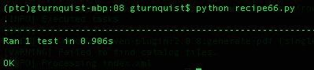

# 它是如何工作的...

这个配方更多的是哲学性的，而不是基于代码的。虽然这个配方的概念很有价值，但很难用一个可重复使用的代码片段来捕捉。

在这个测试用例中，我注入一个事件，处理它，然后确认它的影响。这个测试用例是无头的，但我们的演示可能不会是。到目前为止，在本章中，我们还没有构建任何用户屏幕。随着我们开发用户屏幕，我们需要确保它们调用与这个自动化测试相同的 API。

鉴于此，我们设置使用屏幕来定义测试中显示的相同事件。事件被消化后，可能会存在另一个屏幕显示当前的服务状态。我们期望它能反映对故障的更新。

在我们的管理演示中，我们将指出/放大屏幕的这一部分，并展示`service-abc`从*运行*切换到*故障*。

如果屏幕被构建为委托给底层逻辑，那么屏幕逻辑只不过是组件组合在一起显示信息。被测试的核心逻辑保持其无头和易于测试的特性。

我们的代码示例并不完整，也不会超过一分钟的演示。但这个概念是正确的。通过以可运行的形式捕捉我们计划在演示中执行的步骤，我们的管理演示应该会顺利进行。

我说了没有问题吗？嗯，演示很少能够那么顺利。管理层的出现难道不会导致问题出现吗？有一次，我提前一个月准备了一次高级管理演示，使用了这个秘诀。我发现并随后修复了几个错误，以至于我的演示完美无缺。管理层印象深刻。我在这里并不做任何承诺，但真诚地让你的演示 100%可运行将极大地增加你的成功几率。

# 还有更多...

这个秘诀是什么？它似乎有点缺少代码。虽然让演示 100%可运行很重要，但关键是打印出测试并像脚本一样使用它。这样，你所采取的步骤都已经被证明有效。

# 如果我的经理喜欢绕道走？

如果你的经理喜欢问很多假设性问题，让你偏离原计划，那么你就是在未知的领域航行。你成功进行演示的几率可能会迅速下降。

你可以客气地推迟他们的假设问题，留到未来的演示中再试，努力保持当前的演示在正轨上。如果你冒险尝试其他事情，要意识到你所承担的风险。

不要害怕承诺未来的演示，届时你将按照要求的路径前行，而不是在这次演示中冒险。经理们实际上相当愿意接受这样的回答：*我还没有测试过那个。下个月我们再做一个演示，包括那个内容，怎么样？*失败的演示会给管理层留下不好的印象，并危及你的声誉。成功的演示对你作为开发者的声誉也会产生同样积极的影响。管理层倾向于更乐观地看待系统 70%成功 100%，而不是系统 100%成功 70%。

这就是工程师和经理之间需要遵守的界限。虽然经理们想要看到现有的东西，但我们的工作是向他们展示目前正在运行的东西，并准确地报告目前可用和不可用的情况。要求看到我们尚未测试过的东西绝对值得反驳，并告诉他们这样的演示还没有准备好。
