# 第一章。PTVS 简介

Python Tools in Visual Studio (PTVS) 是一款功能极其强大的工具，以下是一些原因：

+   它为 Python 开发者提供了一个强大的 IDE，在一个独特的环境中集成了许多有用的编码功能和集成。

+   PTVS 为 Windows 平台上的开发者提供了使用他们最喜欢的 IDE——Visual Studio——来探索、学习和管理最常用的脚本语言之一的机会。

在本章中，我们将对 PTVS 进行高级概述，从安装和配置的逐步教程开始，然后快速概述控制 Python 环境和配置的 Visual Studio 的主要工具。理解 Visual Studio 窗口将大大提高你探索和管理源代码工作流以及你的 Python 项目的结构的能力。

# 逐步安装和配置

根据你预先安装的 Visual Studio 版本，PTVS 提供了各种安装格式。PTVS 可用于 Visual Studio 2010、2012 和 2013（专业版或以上）。

如果之前提到的 Visual Studio 版本没有安装在你的计算机上，你可以安装一个独立的 PTVS 版本。Visual Studio 允许并行安装，这意味着它提供了在一个系统上安装多个版本的能力。唯一的前提是，旧版本必须在安装新版本之前安装。

PTVS 的不同安装类型在其 **CodePlex** 网站上进行了描述，[`go.microsoft.com/fwlink/?LinkID=390659`](http://go.microsoft.com/fwlink/?LinkID=390659)。

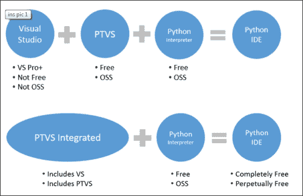

前面的图来自 [`go.microsoft.com/fwlink/?LinkID=390659`](http://go.microsoft.com/fwlink/?LinkID=390659)。

Visual Studio 2013 最重要的先决条件是操作系统运行 Windows 7（32 位或 64 位）或更高版本。

一旦你整理好了先决条件并安装了你选择的 PTVS 包，你将需要决定 Python 解释器的类型。选择合适的 Python 解释器取决于你的项目需求。请参考 PTVS CodePlex 页面 [`go.microsoft.com/fwlink/?LinkID=299429`](http://go.microsoft.com/fwlink/?LinkID=299429) 以帮助你的决策过程。你可以选择 CPython 和 IronPython（32 位或 64 位）。如果你选择了 CPython，那么你可以选择 Python 2.7 或 3.3 版本。在大多数情况下，建议使用 CPython 3.3 32 位。对于 Web 开发，建议使用 CPython 2.7 32 位。

根据你的意图和将要与 Python 一起使用的框架进行选择。对于本书的范围，我们建议安装 32 位 CPython 版本 2.7。有关可下载的 Python 解释器的最新完整列表，请参阅 PTVS CodePlex 页面 [`go.microsoft.com/fwlink/?LinkID=390659`](http://go.microsoft.com/fwlink/?LinkID=390659)。

一旦安装了解释器，你可以通过从 **开始** 菜单打开 Visual Studio 2013 应用程序来启动 PTVS。如果一切正常，你将在屏幕上看到以下内容：

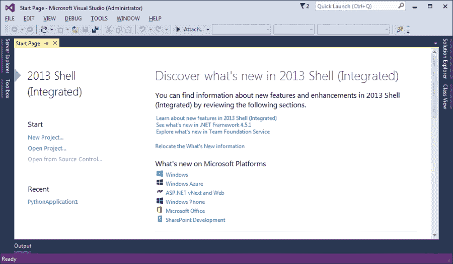

让我们检查整个系统是否正常工作。创建一个新的项目并查看它是否如下运行：

1.  要创建一个新的项目，导航到 **文件** 下的 **新建项目** 菜单以启动 **新建项目** 对话框。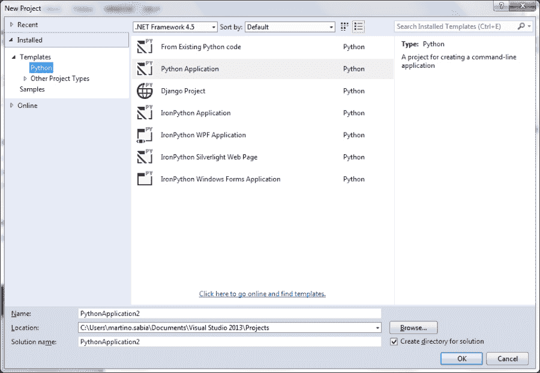

1.  选择 **Python 应用程序** 并点击 **确定**。这将创建一个新的项目和基本的 `Hello World` Python 应用程序文件。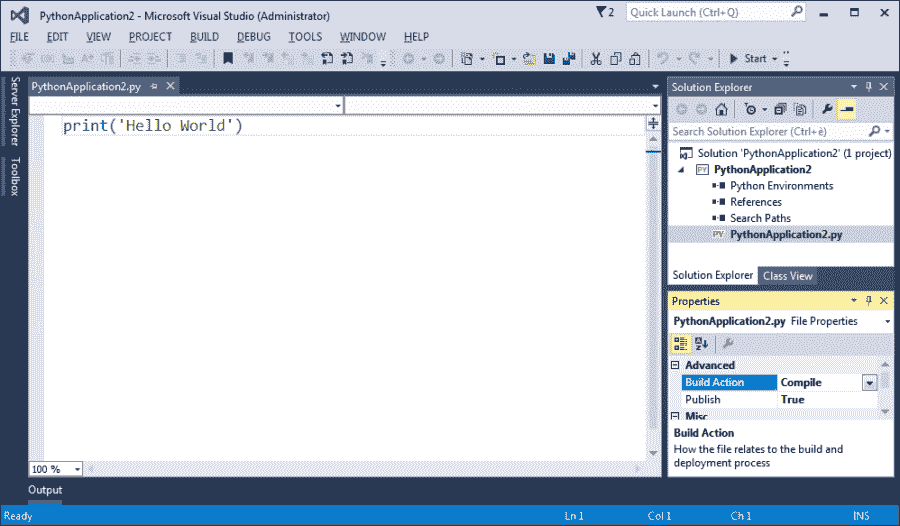

1.  通过点击工具栏中的 **开始** 按钮，或直接按 *F5* 来启动应用程序。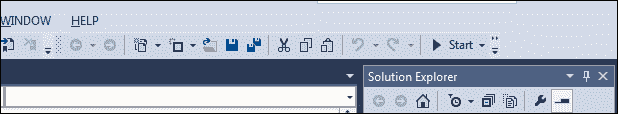

1.  如果你系统上安装了任何先前的 Python，你应该会看到带有 **Hello World** 消息的应用程序响应窗口，如下面的截图所示：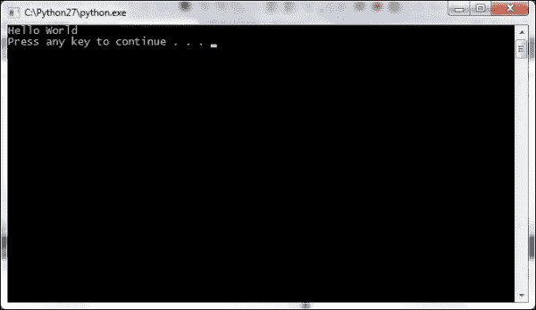

# PTVS 工具概述

现在，你已经启动并运行了 PTVS，让我们更详细地看看 Visual Studio 提供的各种工具，这些工具能够增强 Python 开发周期。让我们从通过 **视图** 菜单可访问的窗口开始：

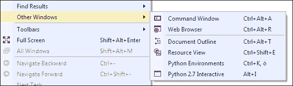

从 **视图** 菜单中，你可以选择两个对 Python 更重要的窗口：

+   **Python 环境**

+   **Python 交互式**

## Python 环境窗口

Python 环境窗口显示了系统上安装的所有 Python 解释器版本（环境）。对于每一个，都可以访问一个名为 **read–eval–print loop** （**REPL**）的交互式窗口，并且可以看到对所有已安装包进行的包分析状态。这被 Visual Studio 用于执行给定 Python 环境中所有类和方法的语法和类型分析。

由于 Python 代码的分析很复杂，所以在您第一次打开它时，您可能不会在**完成数据库**中看到进度。即使 Visual Studio 执行后台分析以不干扰 IDE 的用户体验，第一次分析可能需要从一分钟到一小时不等。这取决于不同的因素，如 Python 环境中安装的库的数量和可用的系统资源。一旦 Visual Studio 中所有 Python 包的分析完成，给定 Python 环境的行上会显示消息**完成数据库是最新的**。

**完成数据库**在每次我们在 PTVS 中打开新项目或安装新的 Python 库时自动更新；在这种情况下，Visual Studio 会重新运行新可访问代码的后台分析。

有时，自动的背景分析过程可能会被禁用或阻止，安装的库列表不会自动显示。如果新安装的库和包没有显示，我们可以通过点击**刷新数据库**按钮手动触发分析过程。通过点击按钮，我们重新启用它，强制进行后台分析。

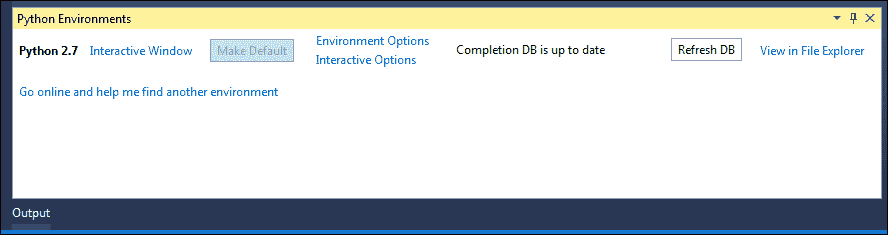

带有已安装的 Python 环境列表和访问常用功能的工具按钮的 Python 环境工具窗口

在**Python 环境**窗口中点击**在文件资源管理器中查看**链接将为您提供直接访问 Python 安装文件夹的权限。

## Python 交互式

Python 交互式窗口直接在 IDE 中为您提供访问 Python 标准交互式工具的能力，以及访问您正在开发的模块的能力。这是一种快速且有效的方法来调试和测试一些代码片段。

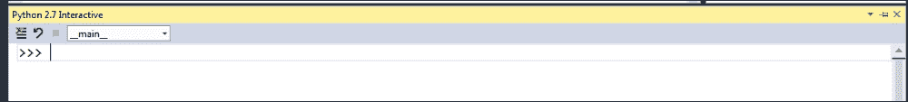

从您可以直接访问 Python 标准交互式工具的 Python 交互式工具窗口

除了标准 Python 交互式命令外，Microsoft 还添加了一些可以通过 *$*（美元符号）访问的命令。可用命令的列表可以通过 `$help` 获取。

# 带有 PTVS 的 Visual Studio 面板

Visual Studio 提供了许多标准工具窗口来控制应用程序的结构和工作流程。主要工具窗口包括**解决方案资源管理器**、**属性**、**查找符号结果**和**对象浏览器**，如下面的截图所示：

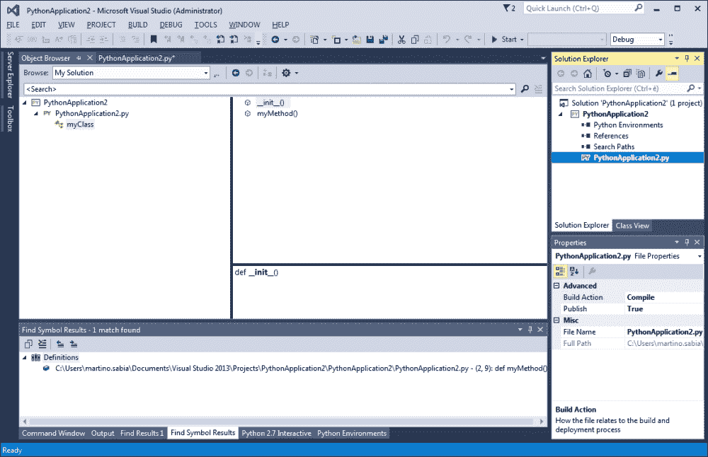

在右侧，我们有**解决方案资源管理器**窗口。它提供了当前解决方案结构的概览。在 Visual Studio 中，解决方案是一组项目的集合。在**解决方案资源管理器**窗口中，您不仅可以管理项目的不同源文件，还可以配置其中使用的 Python 环境和包（即引用和依赖项）。

除了项目文件结构外，**解决方案资源管理器**窗口还提供了一个类视图，它显示了所有类和结构（即字段、属性和方法）的概览。这是对更复杂的窗口**对象浏览器**的快速查看，该窗口在截图中间可见。此窗口可通过**视图**下的**对象浏览器**菜单项访问（或使用*Ctrl* + *Alt* + *J* 快捷键）。这两个工具一起提供了一种浏览和导航代码对象结构的方法。

在**解决方案资源管理器**窗口下，我们可以找到**属性**窗口，它显示了与项目中的各种对象相关的属性，例如其中的单个源代码文件。它还显示了更详细的信息，例如路径，以及它在文件构建系统中的管理方式。

在 PTVS 中，我们拥有的最重要的、功能最强大的窗口是源代码窗口，这是任何程序员大部分时间都在的地方。它提供了多标签源代码导航；每个面板都是一个单独的源代码文件：

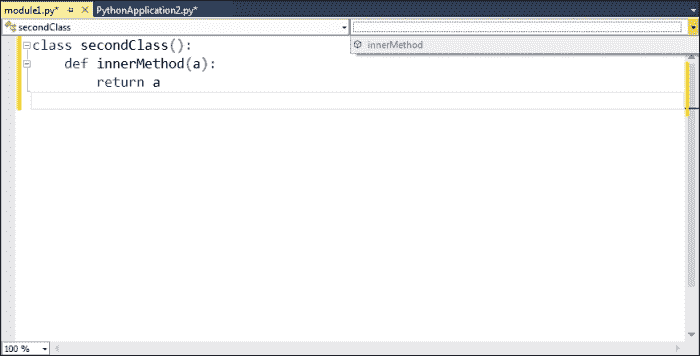

在每个面板中都有两个组合框。左侧的一个提供了在文件中导航到类之间的功能；右侧的一个提供了在所选类的方法之间导航的功能。在源代码窗口中，Visual Studio 释放了更多强大的工具，如重构、IntelliSense 和代码遍历，我们将在下一章中深入探讨。

在接下来的章节中，我们将在探索 PTVS 的过程中发现其他一些会变得更为清晰的窗口，例如截图底部的**查找符号结果**窗口。该窗口显示了搜索命令的结果或给定代码元素（如方法、类或属性）的引用列表。

# 摘要

在本章中，我们介绍了 PTVS 的快速高级概述及其基础。现在，你已经启动了 PTVS 并熟悉了这两个窗口，你就可以在接下来的章节中带着更详细的项目知识深入 PTVS 了。

在下一章中，我们将更详细地介绍，并开始分析 Visual Studio 在 PTVS 中提供的编码工具，这些工具在编码过程中非常有帮助，并且可以管理 Python 项目。
