# 第二章. Visual Studio 中的 Python 工具

现在我们已经启动了我们的工具，我们可以开始深入探讨 PTVS 最重要的功能之一：智能代码补全功能或 Visual Studio 的 IntelliSense。

在本章中，我们将深入了解 Visual Studio 的自动语法和层次分析工具，这些工具可以与 Python 一起使用。本质上，这些是 IntelliSense 和导航工具，对于 Python 开发者在编码过程中非常有帮助。

此外，我们将看到如何结合 Visual Studio 的内部 REPL 工具来最大化其功能，以便进行快速且有用的代码测试和调试。

# 使用 Python 精通 IntelliSense

如**Python 环境**选项卡所示，Visual Studio 分析当前解决方案中可用的 Python 代码和已安装的库，以填充内部数据库。通过这样做，我们能够更好地理解可用的类、方法和字段描述。这是以帮助开发者加快编码过程的方式进行的。

IntelliSense 上下文感知代码补全功能可以通过*Ctrl* + 空格键或*Ctrl* + *J*快捷键在行中调用。*Ctrl* + *J*快捷键即使在只有一个可能性的情况下也会显示列表。这是当你在一个命令的中间调用它时发生的情况：

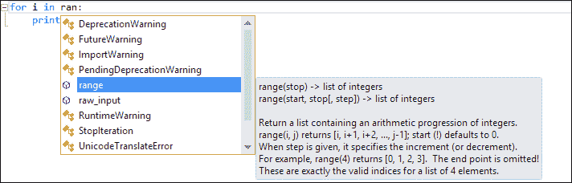

IntelliSense 会显示当前代码中所有可用的方法、类和字段，并按字母顺序排列。除了从可用命令列表中显示它们之外，它还为你提供快速文档。在我们的例子中，对于`range`方法，IntelliSense 会显示其重载方法的列表及其签名。

如果你已经知道你正在寻找的方法，但需要一点帮助来查看可用的参数列表，只需在打开它时通过参数括号回忆 IntelliSense 窗口，或者使用*Ctrl* + *Shift* + 空格键快捷键。

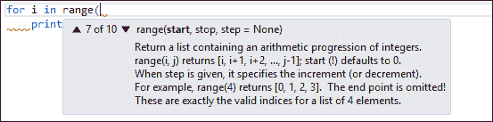

在这种情况下，IntelliSense 将显示参数的可能组合以及每个参数的快速文档，这些文档由参数在列表中的位置给出，如前一张截图所示。

模块的自动导入是另一个有趣的功能，有助于加快开发速度。它还提供了当你从一个 Python 文件中使用类时自动包含的功能。

如前一张截图所示，如果你在你的项目中的一个 Python 文件中有一个`Paging`类，IntelliSense 可以将其识别为从你的项目可访问的类；它还会通过在类名第一个字符下显示智能标签来建议进一步的操作：

IntelliSense 在导入类名时处于活动状态。类名下方的蓝色小矩形表示 Visual Studio 中有可用的函数

当点击时，会显示一个动作弹出窗口。你可以选择要执行的操作，以及将其源文件/原始文件引用到当前代码中的能力：

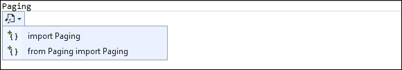

如果你点击其中的一个选项，将添加包含语句作为代码文件的标题：

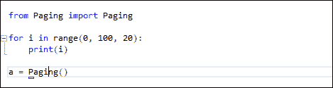

选择“从 Paging 导入 Paging”选项后，包含语句将生成在代码文件顶部

一旦类在你的代码中可见，Visual Studio 就能够检查引用的类。当你调用它时，你将在 IntelliSense 窗口中看到该类，如下面的截图所示：

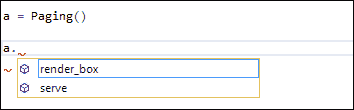

IntelliSense 显示了 Paging 类中的可用方法

IntelliSense 可以进一步扩展。在下面的示例中，当使用 `bar` 方法定义 `foo` 类时，IntelliSense 将检索类结构以显示在代码中使用的辅助工具：

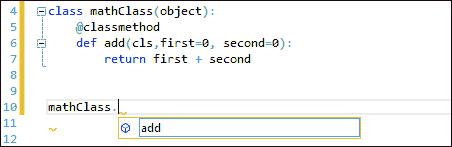

IntelliSense 能够让我们洞察类的结构和其可用元素，但没有任何文档。为了在代码中显示文档，我们只需将其添加到类的代码中，如下所示：

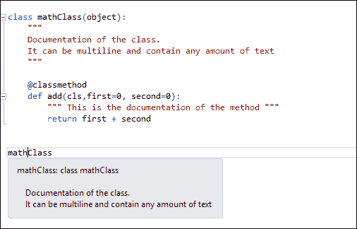

IntelliSense 显示类或方法文档

它非常直接且简单。在编码会话中，Python 项目的任何元素都会自动分析并输入到 Visual Studio 的参考数据库中，无需重新工作代码或执行外部工具。

当代码被引用时，IntelliSense 也可以提供帮助，为我们提供所有可用模块的概述，所有 PythonPath 引用的模块，你将在解决方案中引用的模块，以及项目中的模块：

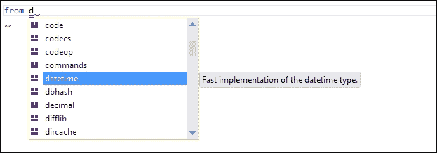

此外，IntelliSense 不仅有助于选择模块，还可以选择导入部分：

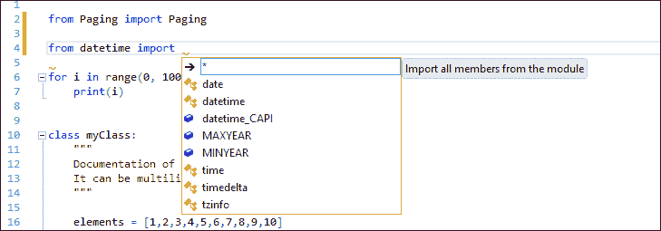

# 在 Visual Studio 中使用 REPL

在本节中，我们将探讨在 Visual Studio 中使用标准的 **读取-评估-打印循环**（**REPL**）工具的 Python 应用。如介绍中所述，PTVS 有一个增强版的 REPL。除了 PTVS REPL 版本中的标准 Python 命令——交互式 Python 窗口之外，还有一些额外的命令和功能可以帮助加快调试过程，并允许对代码进行简单的测试。

通过在 REPL 中输入 `$help`，可以显示增强的命令，如下面的截图所示：

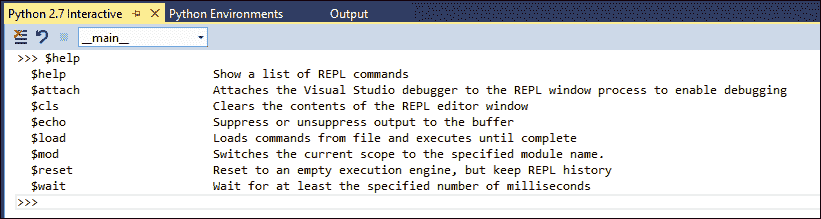

我们将详细介绍最常用和有趣的操作命令。`$cls`命令清理命令行，而`$reset`命令以清理引擎的方式，您可以以干净的 REPL 环境重新启动。

最有趣的功能是`$load`和`$mod`。`$load`命令允许您在 REPL 中执行给定 Python 文件的内容：

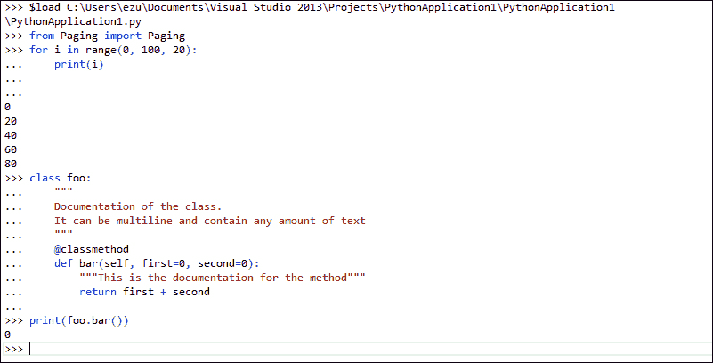

REPL 工具中$load 函数的示例

这些功能很有用，因为它们提供了代码执行周期的即时视图。

`$mod`命令为您提供了更改 REPL 工具操作作用域的机会。

当 REPL 启动时，它自动设置为打开项目的主体模块`(__main__)`。输入`$mod`后跟模块名称，允许您切换到同一项目的另一个模块，从而访问模块及其内容。

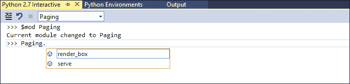

如前一个截图所示，REPL 窗口的用户界面顶部有一个组合框，允许我们交互式地切换作用域。IntelliSense 也在 REPL 中管理。

我们可以使用编码面板上下文菜单中的**发送到交互**命令（或使用*Ctrl* + *E*快捷键）执行项目中每一块代码：

我们还可以通过从**DEBUG**菜单中选择**执行 Python 交互式项目**选项（或使用*Shift* + *Alt* + *F5*快捷键）来指示调试器使用 REPL 作为应用程序的输出。

您还可以指示调试器将 REPL 作为应用程序的输出而不是标准控制台输出；为此，只需在**DEBUG**菜单中点击**执行 Python 交互式项目**条目或使用*Shift* + *Alt* + *F5*快捷键：

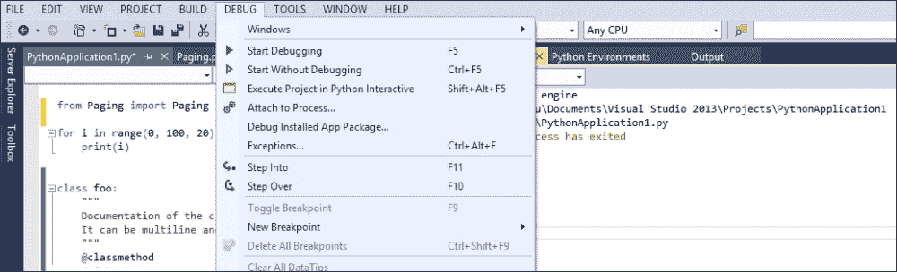

这在开发 Web 应用程序的后台模块时尤其有用，因为如果您希望在浏览器中直接进行调试和测试，代码的调试和测试特别困难。使用 REPL 工具，您可以实现更高效和更快捷的过程。

# 轻松导航代码

Visual Studio 提供了许多功能来加速代码导航的过程；同时，这些功能使得 Visual Studio 能够以更全面的视角进行流畅的编码过程。这在您需要切换到模块以查看其实际实现或更新其某些部分时尤其有用，即使它位于项目的其他位置。代码导航的一些最重要的功能可以从编码面板的上下文菜单中访问：

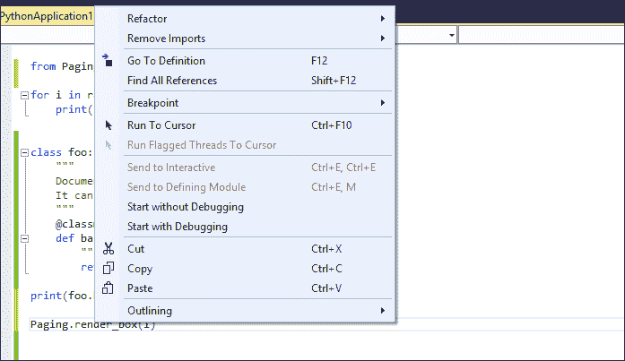

如前一个屏幕截图所示，当光标位于一个方法上并且打开上下文菜单时，可以找到**转到定义**命令。**转到定义**命令将视图移动到引用模块中方法的实现代码。

另一个有用的调试功能是**查找所有引用**命令（*Shift* + *F12*快捷键）。它显示了项目中使用该方法的全部点：

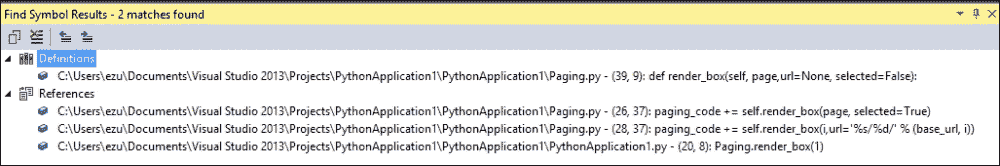

执行**查找所有引用**命令的结果将在新的工具窗口**查找符号结果**中显示。它显示了方法的定义以及方法实际在项目中使用的实际引用。

此外，代码面板提供了一些工具，可以快速导航到代码的任何给定点。由于 Visual Studio 在代码编辑器面板中打开 Python 文件时动态分析代码，因此 IDE 会自动创建其层次索引。要导航索引，请使用位于窗口顶部的导航栏上的两个组合框。

第一个显示文件中所有可访问的全局元素，而第二个显示在第一个组合框中选择的项目的所有内部元素。在组合框中选择一个元素控制代码编辑器的视图并跳转到引用的代码。

在下面的屏幕截图中，我们可以看到组合框的导航方式，通过显示第二个组合框中`html2text`类的所有内部组件来展示层次视图：

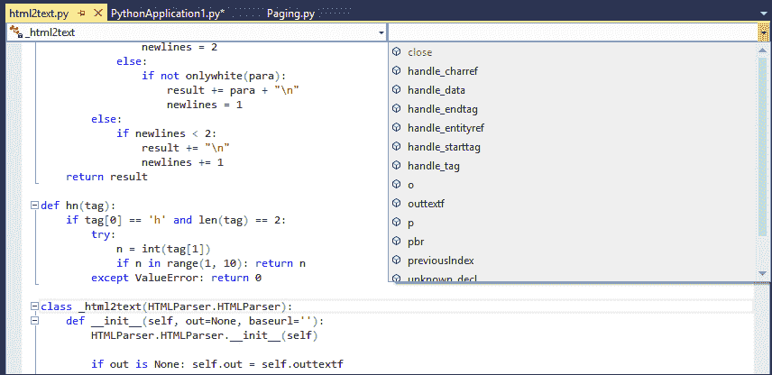

在导航代码时，特别是跳转到模块之间时，可以通过工具栏中的两个有用的按钮轻松地前后移动。查找位于工具栏最左侧的两个箭头形状的按钮。指向左边的箭头用于后退，可以通过*Ctrl* + *-*快捷键访问；指向右边的箭头用于前进，可以通过*Shift* + *Ctrl* + *-*快捷键访问。

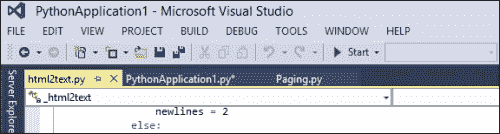

工具栏左侧的蓝色导航按钮是快速导航代码的好方法

编辑器窗口提供了一种通过位于窗口顶部文件标签来导航已打开文件的方法。截至本书编写时，Visual Studio 已经对该功能进行了优化。因此，即使是 PTVS，也有许多可能性来实现这一点。您可以关闭标签并将它们移动到其他位置。单个标签可以显示在一个独立的窗口中，或者与另一个窗口并排显示。

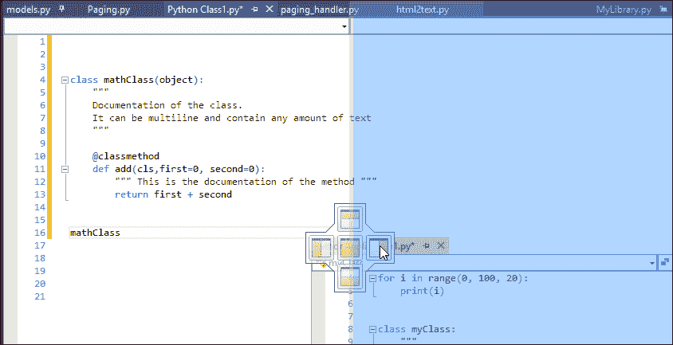

Visual Studio 提供了强大的窗口管理功能，通过简单地将它们从标签拖动到每个窗口，在 IDE 中为每个窗口提供了一套完整的对齐选项。

标签可以固定在标签栏的最左侧位置，这样在代码编辑器中打开多个文件时可以轻松访问。标签本身有一个上下文菜单，包含更多针对文件的命令：

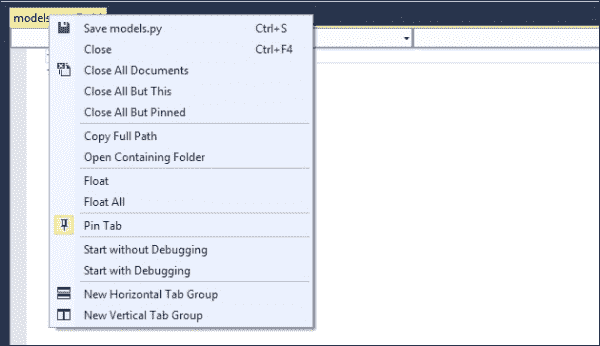

从标签页上下文菜单中，你可以管理标签页或直接在标签页中执行代码。在编码过程中，**复制完整路径**和**打开包含文件夹**选项非常实用。

你也可以通过**解决方案资源管理器**窗口在项目文件之间导航。点击感兴趣的文件将在代码编辑器窗口中打开该文件。单击打开文件处于临时状态，这意味着文件将在标签栏最右端的新标签页中打开。这在浏览多个文件而不进行操作时非常有用。

与永久标签页不同，临时标签页将保持打开状态，直到你通过**解决方案资源管理器**窗口导航到另一个文件。这减少了代码编辑器中打开的标签页数量。众所周知，管理大量打开的标签页将变得困难。

在**解决方案资源管理器**窗口中双击文件将在代码编辑器中打开一个永久标签页，这由图钉图标表示：

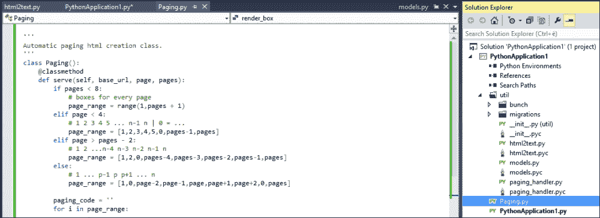

右侧的“解决方案资源管理器”窗口是一个强大的工具，可以导航项目文件。通过点击文件在临时标签页中打开文件。双击打开一个带有图钉图标的永久标签页。

# 对象浏览器

另一种以高层次的清晰视角查看项目和组成它的元素的方法是使用**对象浏览器**工具。这个工具为你提供了整个项目的更层次化的视图。有两种不同的方式来访问这个视图；让我们来看看这两种方法。

第一种方法是打开**对象浏览器**工具的完整版本，它可以通过主工具栏上的**视图**菜单访问，或者使用*Alt* + *Ctrl* + *J*快捷键。

使用快捷键将在代码编辑器窗口中打开一个新标签页，它将显示以下视图：

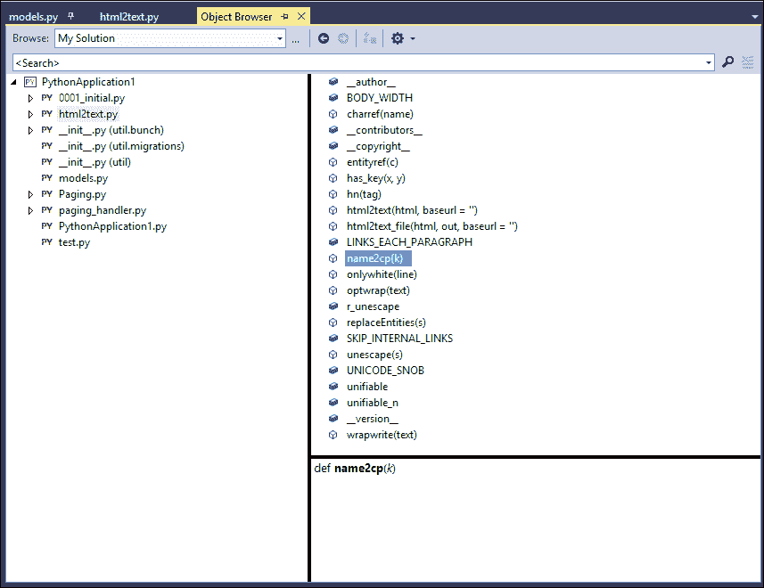

**对象浏览器**工具是一个三栏窗口。左上栏显示组成项目的所有 Python 文件列表。右上栏显示组成所选文件的元素列表（方法、字段等）。下栏显示所选元素的足迹和相关文档（如果有的话）。

**对象浏览器**工具中的任何元素都是可点击的。双击将打开代码文件并跳转到实现所选元素的代码。

您还可以通过窗口顶部的工具栏中的**对象浏览器**设置图标来过滤显示的元素类型。您还可以使用顶部的搜索栏进行实际搜索，这将显示在底层面板中搜索文本的所有引用：

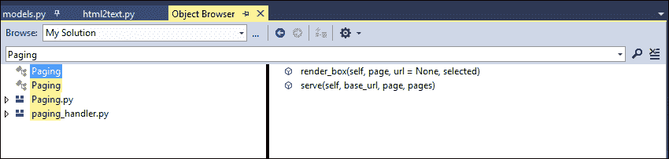

除了使用完整的**对象浏览器**工具外，我们还可以通过**类视图**窗口遍历项目层次结构，该窗口通常位于与**解决方案资源管理器**相同的窗口中。切换到**类视图**选项卡将显示简化的**对象浏览器**工具，实际上它与完整工具相同，但没有文档面板。**类视图**选项卡显示如下：

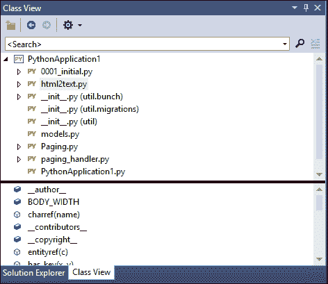

此工具提供了与完整功能的**对象浏览器**工具完全相同的功能，包括搜索和过滤功能。双击元素将跳转到实现的确切代码点。

# 摘要

在本章中，我们介绍了 IntelliSense 在 Python 中的广泛用途，包括使用简单导入和引用功能在项目文件之间处理类。我们还学习了如何使用 REPL 以更流畅的调试和测试过程。

现在，您已经熟悉了不同的代码导航功能，这些功能可以帮助您使用过滤和选项卡查找代码引用。结合**对象浏览器**工具，您能够以所有方法、类、字段、元素、相关文档等的高级视图查看您的 Python 项目。

在下一章中，我们将深入探讨日常编码工具，以引导您通过整个编程生命周期。
