# 第四章：PTVS 中的 Django

Django 是一个基于**模型-视图-控制器**（**MVC**）模式的 Python 高级 Web 框架；它提供了一系列工具和助手，以创建一个快速开发环境。基于 Django 的网站有很多成功的例子，如 Instagram、Pinterest、Disqus 以及 Dropbox 的部分功能。它自 2006 年开始开发，使其成为 Web 项目的稳固选择，尤其是在选择 Python 作为语言时。有关 Django 的更多信息，请参阅其官方项目网站[`www.djangoproject.com/`](https://www.djangoproject.com/)。

在本章中，我们将深入了解 Visual Studio 中 Django 框架的集成。我们将看到如何利用 Visual Studio 工具启动 Django 项目，并为其设置开发环境。

一旦我们有一个基本的工作网站，我们将学习如何创建数据库连接并设置管理界面，在 Visual Studio 中创建一个新的 Django 应用程序。

# Django 项目模板和工具

让我们来看看 PTVS 中可用的 Django 相关工具和模板，从 Django 项目模板开始。在 Visual Studio 中，项目模板是样板助手，根据项目的特定类型创建项目轮廓。要开始一个新的 Django 项目，在**文件**菜单下打开**新建项目**窗口。一旦打开，从左侧的列表中选择**Python**。这显示了系统中可用的已安装项目类型。以下是窗口的外观：

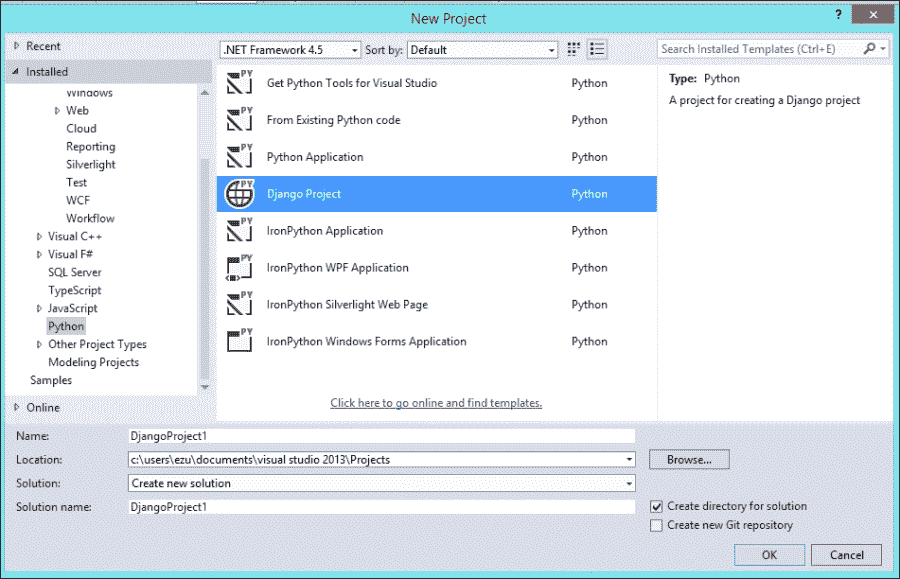

在右侧面板中单击**Django 项目**选项，在窗口底部定义项目名称。我们在指定文件应保存的位置时执行此操作。您还可以为项目的 Visual Studio 解决方案定义解决方案名称。一旦定义了这些属性，单击**确定**即可创建 Django 项目。

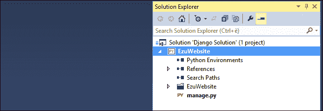

在解决方案资源管理器中显示的示例默认 Django 项目结构

## 安装 Python 包

基本的 Django 项目文件结构在**解决方案资源管理器**窗口中显示。在项目结构就绪后，下一步是安装所需的 Python 包。我们必须向解决方案指示 Django 框架的位置或需要安装它的位置。首先，将 Python 解释器添加到项目中——我们将使用 Python 2.7——然后通过在**解决方案资源管理器**窗口的**Python 环境**节点中右键单击已安装的**Python**条目来安装 Django 包，最后选择**安装 Python 包**条目：

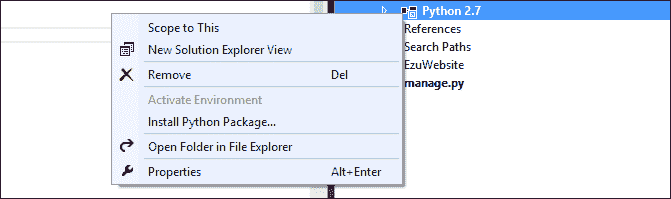

将打开**安装 Python 包**窗口；在此处，输入启动环境中引用框架所需的`pip` Python 包的名称，该名称为`django`。您甚至可以通过在`django==x.x.x`格式中命名包的版本来选择框架的特定版本。`x.x.x`表示完整的版本标签。如果没有提供版本号，将安装包的最新版本。

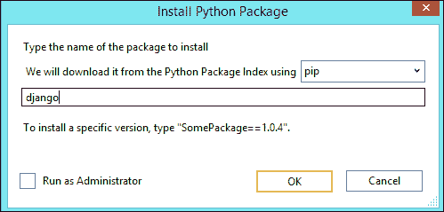

点击**确定**以通过从`pip`仓库下载开始安装 Django 包。请确保在系统协议中检查您的系统设置，以授予 Visual Studio 系统管理员的权限。

### 注意

**以管理员身份运行**复选框仅在之前的安装失败时才应选中。它确保`pip`在系统上安装包具有必要的权限。

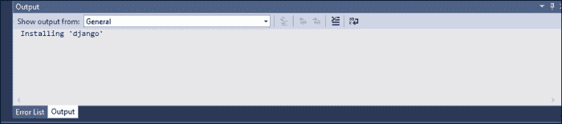

安装过程可以在输出窗口中查看，如前一个截图所示。如果您使用的是**以管理员身份运行**，则无法显示实时下载进度。在这种情况下，输出窗口将显示一段时间**安装'django'**，因为这表明`pip`仍在下载。

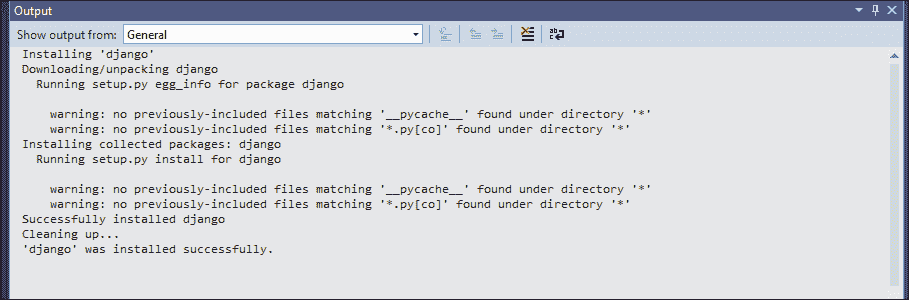

下载过程完成后，将显示更详细的信息，如前一个截图所示。它会通知您安装过程以及是否成功。如果一切顺利，`pip`日志的**输出**窗口将显示**'django'安装成功**的消息。

## 运行应用程序

现在 Django 框架已成功安装在系统中，并在项目中引用，让我们确保它正常工作，所有工作流程都运行正确。通过按*F5*键或通过在工具栏中单击**运行**图标来运行应用程序。由于 Visual Studio 知道当前项目是一个网站，它将在浏览器实例中运行输出。您可以看到紧随其后的**运行**按钮和将启动的默认系统浏览器的名称。您可以通过单击显示所有可能选择的下拉按钮来选择我们将要运行项目的浏览器：

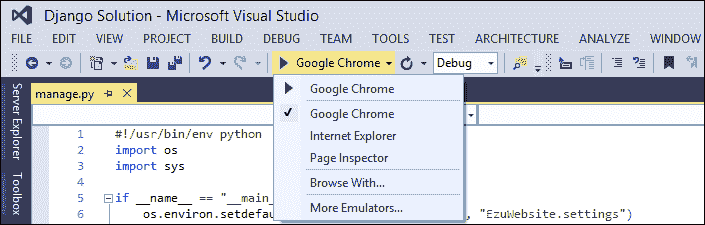

运行应用程序时会发生以下两件事：

+   PTVS 运行 Django `manage.py`命令

+   显示了一个带有网站输出的浏览器实例

第一个显示在命令提示符窗口中，告知我们执行的结果。它指示设置中是否存在任何问题。它是从命令行启动`python manage.py runserver`命令的等效操作。

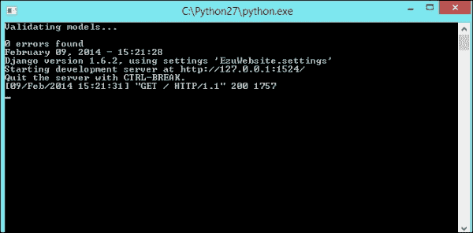

同时，还会创建一个新的浏览器实例，显示我们网站的首页。在一个新的经典 Django 安装中，你会看到以下 **It worked!** 页面：

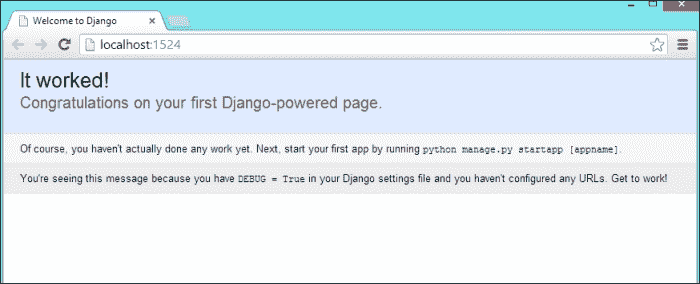

如果你能看到前面的屏幕，这意味着 Django 项目的设置已成功完成。现在我们可以继续开发网站。

## Django 模板中的 IntelliSense

我们已经讨论了 Visual Studio 中 IntelliSense 在 Python 代码中的强大功能。IntelliSense 还支持 Django 模板编辑器，为其提供访问 Django 所有模板标签的权限；它还提供访问由调用视图定义的上下文的权限。

IntelliSense 在 HTML 部分提供以下帮助：

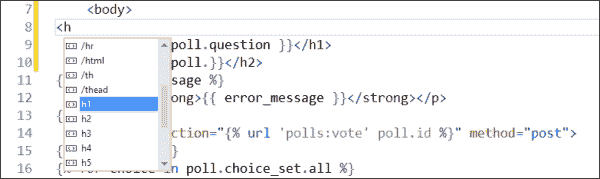

此外，当处于 Django 块标签 `("")` 中时，它会显示 Django 特定的标签和视图上下文对象。IntelliSense 还在过滤器方面提供帮助：

# 为 Django 项目设置和管理数据库

一旦设置好一个可工作的 Django 项目，我们还需要附加一个数据库，以便有一个存储网站数据和 Django 管理控制台整体配置的地方。为了本书的目的，我们将使用易于管理的 SQLite 数据库来连接到项目。它是一个基于文件的数据库，可以很容易地由 Django 管理。有关 SQLite 的更多信息，请参阅其网站 [`www.sqlite.org/`](http://www.sqlite.org/)。

将数据库附加到 Django 非常简单。你只需告诉 Django 使用哪个数据库以及如何连接到它。这必须在 Django 的 `settings.py` 文件中完成。要连接并创建 SQLite 数据库，代码中的数据库部分应如下所示：

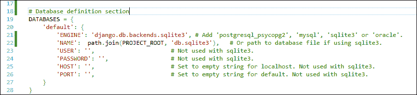

由于 SQLite 是基于文件的数据库，`Name` 属性应该是数据库文件的路径。我们使用一个包含项目根路径的常量 `Project_Root`，它必须首先通过以下两行代码定义：

数据库现在已连接到 Django 项目。要创建数据库中的配置表，请使用 Django sync DB 命令。Visual Studio 提供了一个命令，可以从 IDE 内启动此过程。要访问 `sync` 命令，右键单击 **解决方案资源管理器** 窗口的项目节点，并选择 **Django Sync DB** 项以启动过程：

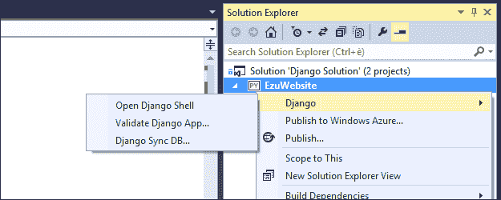

一旦点击 **Django Sync DB**，同步过程就开始。**Django 管理控制台**选项显示如下详细日志：

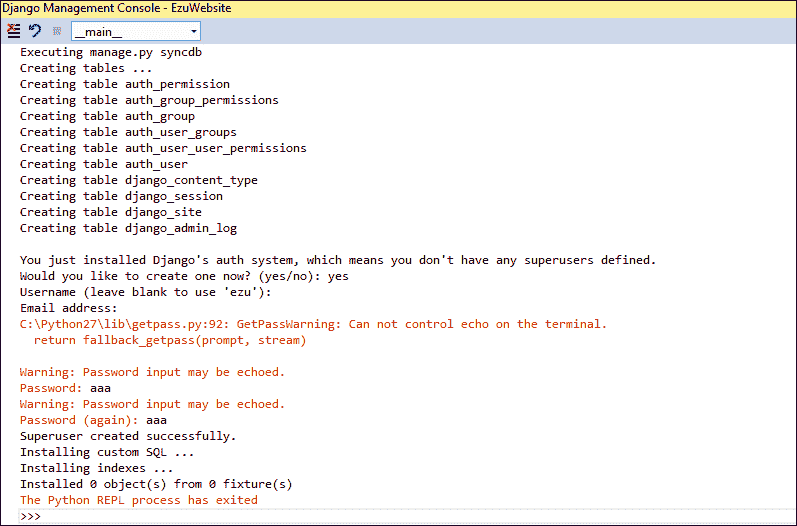

当命令首次执行时，Django 会创建实际的数据库以及用于 Django 管理控制台的认证条目。系统会要求输入首选用户名和密码。一旦提供了信息，过程就会结束，数据库已创建。

我们还可以在**解决方案资源管理器**窗口中看到此过程的输出，因为我们已指示 Django 使用 SQLite 并指明了创建数据库文件的路径。要查看此信息，请通过单击**解决方案资源管理器**工具栏中的**查看所有文件**命令，在解决方案文件夹中启用**查看所有文件**选项。

在工具栏中找到“查看所有文件”选项

一旦视图被激活，可以在解决方案文件夹中找到`db.sqlite3`文件。可以通过右键单击它并选择**包含在项目中**命令将其包含在解决方案文件中。然后 SQLite 文件被包含在由 Visual Studio 管理的文件列表中。

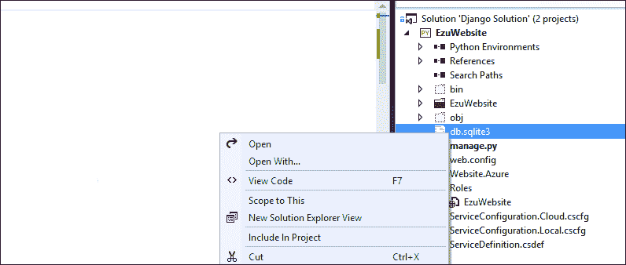

# 设置管理界面

现在项目已经连接了数据库，我们可以在其中激活 Django 的管理界面。此时过程非常简单；你只需要在项目设置文件和主要 URL 管理器中取消注释几行代码即可。

首先，在设置文件的`Installed_Apps`部分激活 Django 应用程序`django.contrib.admin`：

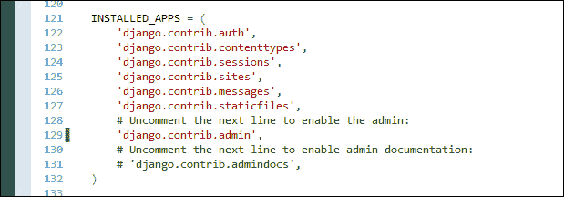

第二步，转到`urls.py`文件，取消注释导入`admin`类并使管理员能够发现项目中的模型的段落。此外，还必须取消注释 URL 模式中管理的`/admin/`路径的最后一条线：

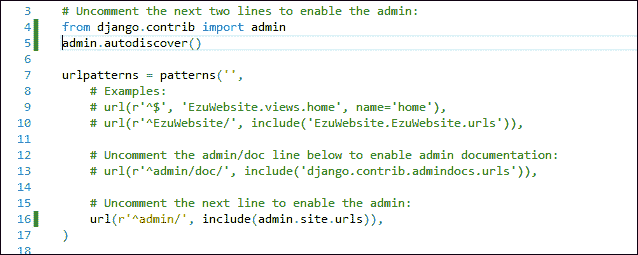

现在 Django 管理应用程序已在项目中激活。如果操作成功，你将看到管理登录页面。启动应用程序后，导航到`/admin/`页面：

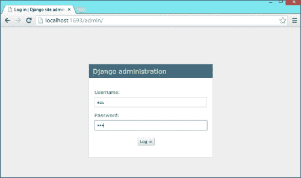

将在数据库设置期间创建的凭据插入以访问管理部分：

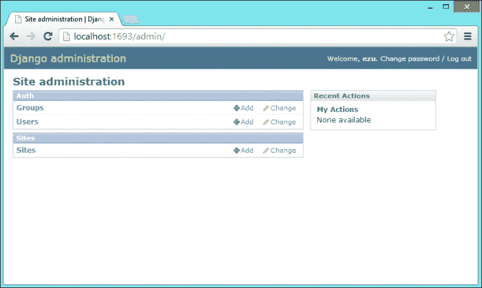

现在我们已经设置并启用了一个完整的 Django 环境。让我们继续在 Visual Studio 中创建一个新的 Django 应用程序。

# 创建新的 Django 应用程序

Django 应用程序是项目的一个子模块，它是自包含的，并且与其他应用程序不相互交织。在理论上，你可以复制它并将其放入另一个项目中，而不需要做太多，或者根本不需要做任何修改。

通常，要启动 Django 应用程序，你必须在命令行中运行`manage.py startapp`命令，这将在你项目中创建一个新的文件夹，在那里你可以找到一个视图、一个模型、一个管理界面和一个测试 Python 文件。

Visual Studio 提供了一个在 IDE 中创建新 Django 应用程序的简单方法，自动化整个流程；此外，命令也在创建模板文件夹的过程中。要创建一个新的 Django 应用程序，只需在**解决方案资源管理器**窗口中的项目节点上右键单击，然后在**添加**菜单中选择**Django 应用程序**命令：

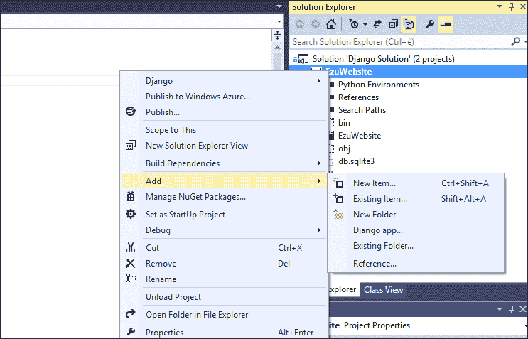

这将打开**添加 Django 应用程序**窗口，您可以在其中指定要创建的 Django 应用程序的名称：

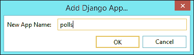

通过点击**确定**，Django 应用程序将在项目中创建，并且可以在**解决方案资源管理器**窗口中找到添加的文件列表：

现在，您可以像通常为 Django 所做的那样创建应用程序的代码。请注意，即使 Visual Studio 自动化了 Django 应用程序的创建，它也不一定会在设置文件中创建条目。这需要像往常一样手动完成，将引用添加到`Installed_Apps`部分；为此，只需打开主`settings.py`文件，并在`Installed_Apps`部分中添加新创建的应用程序：

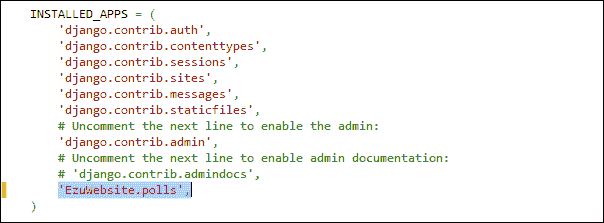

# 在微软 Azure 上部署 Django 项目

云平台是复杂的系统，它们提供根据应用程序接收到的流量在多个服务器实例上扩展 Web 应用程序的方法。它们还以开发者无需处理系统硬件和软件架构的方式抽象化服务器环境，开发者只需处理资源和服务。这有其优势，因为这样一来，开发者实际上不需要配置和管理服务器；然而，同时这也证明是一个缺点，因为并非所有软件组件都能在这样的系统中运行。

Azure 是微软的一个云托管平台，它使开发者能够快速构建、部署和管理跨越全球微软管理的数据中心网络的应用程序。它与 Visual Studio 紧密集成；此外，Python 语言也由这项服务支持。

我们将看到如何使用 Visual Studio 提供的工具在 Azure 上部署 Django 项目。

要使用微软 Windows Azure，首先我们需要通过[`www.windowsazure.com/`](http://www.windowsazure.com/)创建一个 Azure 账户。

账户创建后，您可以访问**门户**部分，它将带您进入 Azure 服务门户，您可以在左侧菜单中找到所有可用的服务。现在我们将创建一个网站：

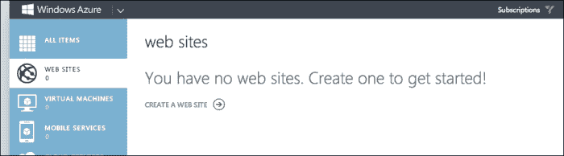

要创建一个新的网站，请点击**创建网站**链接；这将打开页面底部的**新**标签页：

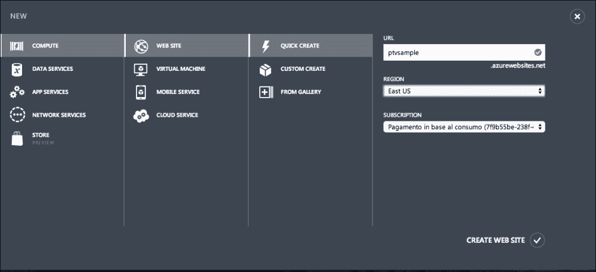

只需在**URL**文本框中插入你想要创建的网站的名称；如果该名称可用，点击**创建网站**按钮来创建网站。这将启动网站生成过程，在过程结束时，你将看到创建的网站：

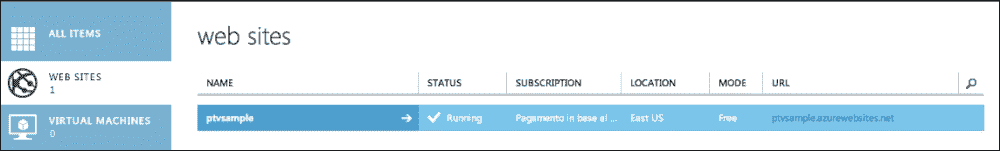

除了网站服务外，我们还需要创建一个存储条目，以便将网站文件上传到那里。要创建存储条目，请点击左侧菜单中的**存储**项，然后点击**新建**：

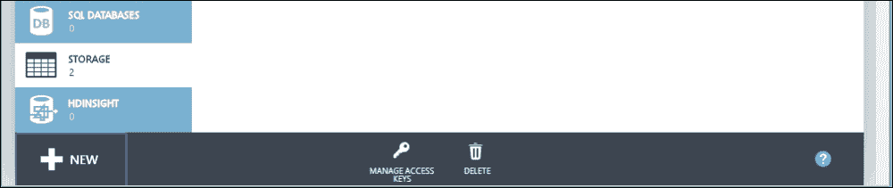

这将在页面底部打开存储创建区域：

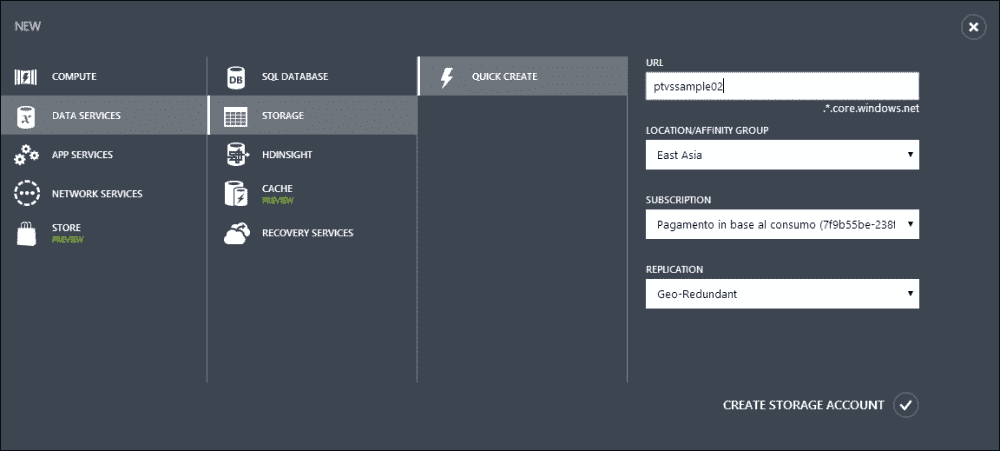

对于网站服务，我们只需要在**URL**文本框中输入存储服务的名称；一旦你有了这个，点击**创建存储帐户**按钮来创建存储服务实例。

现在我们已经拥有了部署我们的 Django 项目到 Azure 所需的所有元素。然而，在继续之前，我们需要确保我们的项目已经准备好。Azure 需要所有位于项目文件夹中的与项目相关的文件，因为它需要确保所有 Python 库都存在。为了确保满足这些要求，Django 项目需要在虚拟环境中创建。这将保留所有要包含在项目文件夹中的文件；否则，库将仅位于系统的 site-packages 文件夹中。

虚拟环境是 Python 环境的独立工作副本，它允许你在不影响其他项目的情况下专注于特定项目。同时，它将所有依赖项保存在相同的文件夹结构中。在 PTVS 中创建虚拟环境很容易；你可以通过从**Python 环境**上下文菜单中选择**添加虚拟环境**命令来完成此操作，如下面的截图所示：

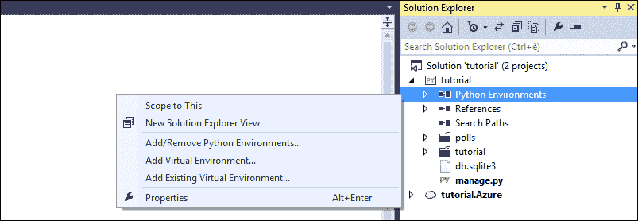

这将打开**添加虚拟环境**窗口：

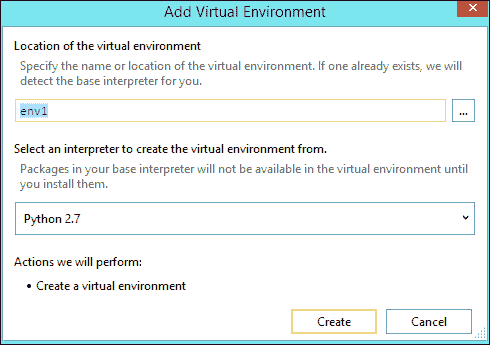

一旦你输入虚拟环境名称并点击**创建**按钮，虚拟环境将在项目中创建。现在，你将在项目中包含的所有包都将被复制进去，因此所有依赖项都将可在项目文件夹内使用，而不依赖于系统的 site-packages 文件夹：

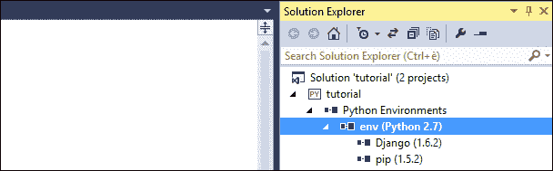

一旦我们确保了我们的项目包含在虚拟环境中，我们就可以继续并配置 Visual Studio，使其准备好部署我们的 Django 项目到 Azure。

部署过程从在**解决方案资源管理器**树视图中 Django 网站节点的上下文菜单中调用**发布**命令开始：

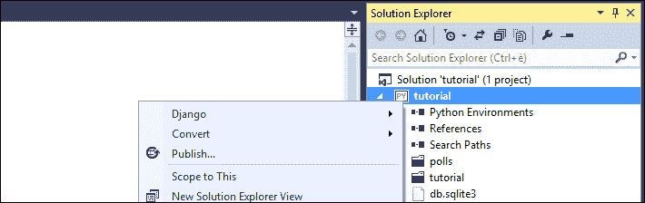

这将打开 **发布网站** 向导窗口，该窗口将指导您完成 Django 项目的部署过程：

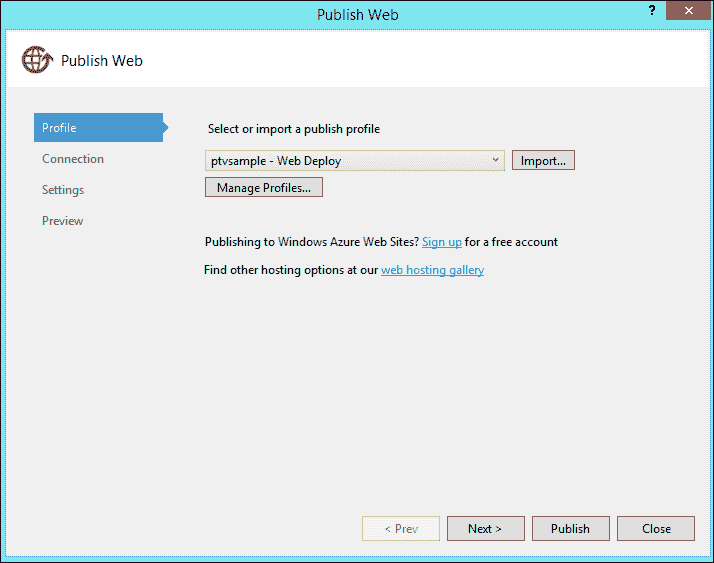

要将 Visual Studio 连接到我们之前创建的 Azure 网站，请点击 **导入** 按钮；一旦您确信可以使用 Azure 账户登录，请选择您希望 Django 应用程序部署到的网站名称：

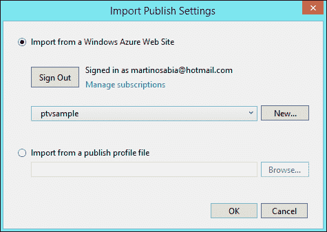

在此阶段，按照其他向导步骤操作，并点击 **发布**。这样，Visual Studio 将开始将所有文件部署到 Azure 平台的过程；您可以从 **输出** 窗口中跟踪部署过程：

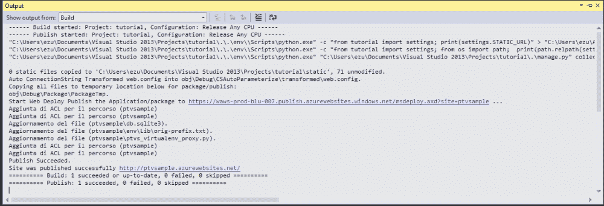

一旦部署过程完成，Visual Studio 将在 Azure 上部署网站的默认浏览器中打开：

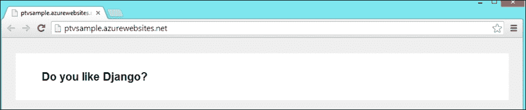

关于 Windows Azure 上的 Python 的更多文档，请参阅 Windows Azure 网站 [`www.windowsazure.com/en-us/develop/python/`](http://www.windowsazure.com/en-us/develop/python/)。

# 摘要

在本章中，我们学习了如何在 Visual Studio 中创建 Django 项目并设置环境。我们还了解了如何在 Microsoft Azure 上部署 Django 项目。

在下一章中，我们将学习如何在 Visual Studio 中管理 Python 库。此外，我们还将学习如何使用一些最强大的 Python 库来管理 Django 框架的部署、环境间数据库的同步，以及一个帮助我们成功且动态地在网站上使用和管理图像的库。
