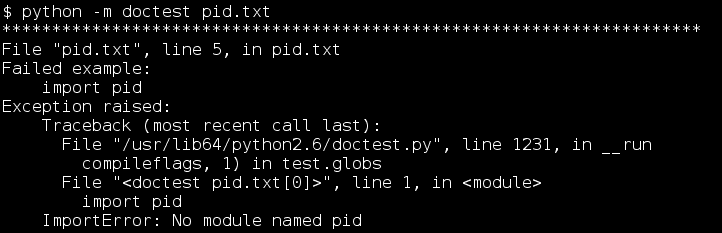
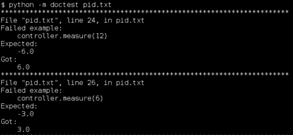
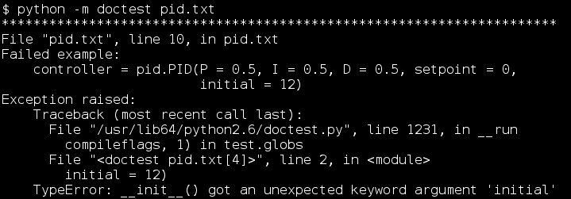
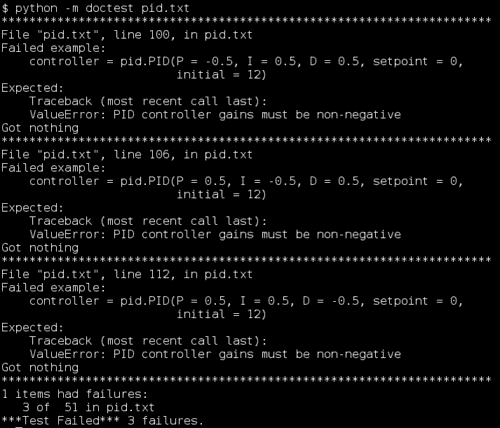
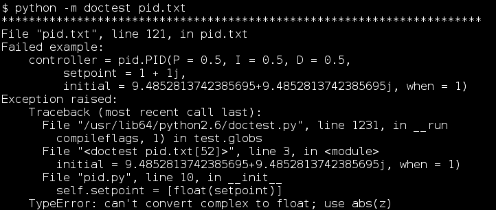

# 第三章：使用 Doctest 进行单元测试

*好的，我们已经讨论了 doctest 的功能以及如何让它按我们的意愿运行。我们也讨论了使用 doctest 进行测试。那么，在这一章中还有什么要讨论的呢？在这一章中，我们将讨论称为单元测试的编程纪律。我们仍然会使用 doctest，但这次的重点是你在做什么以及为什么，而不是如何做的细节。*

在这一章中，我们将：

+   详细讨论单元测试是什么

+   讨论单元测试如何帮助开发各个阶段

+   使用示例来说明单元测试及其优势

那么，让我们开始吧！

# 单元测试是什么，它不是什么？

本节的标题又提出了另一个问题：“我为什么要关心？”一个答案是，单元测试是一种最佳实践，它在编程存在的大部分时间里一直在演变。另一个答案是，单元测试的核心原则只是常识；对我们整个社区来说，我们花了这么长时间才认识到它们，这实际上可能有点尴尬。

好的，那么什么是单元测试？在其最基本的形式中，单元测试可以被定义为以这样的方式测试代码的最小有意义的部分（这样的部分被称为单元），即每个部分的成功或失败只取决于它自己。在很大程度上，我们已经在遵循这个原则了。

这一定义中的每一部分都有其原因：我们测试最小的有意义的代码部分，因为当测试失败时，我们希望这个失败尽可能具体地告诉我们问题所在。我们使每个测试独立，因为我们不希望一个测试在它应该失败时让另一个测试成功；或者在一个测试应该成功时让它失败。当测试不独立时，你不能信任它们告诉你你需要知道的信息。

传统上，自动化测试与单元测试相关联。自动化测试使得运行单元测试变得快速且容易，而这些单元测试往往易于自动化。我们肯定会大量使用自动化测试，包括 doctest，以及之后的 unittest 和 Nose 等工具。

任何涉及多个单元的测试自动就不是单元测试。这很重要，因为这类测试的结果往往令人困惑。不同单元的效果交织在一起，最终结果是，你不仅不知道问题出在哪里（是这段代码中的错误，还是只是对其他代码的错误输入做出了正确的响应？），而且你通常也不确定具体的问题是什么——这个输出是错误的，但每个单元是如何导致错误的？经验科学家必须进行实验，每次只检查一个假设，无论研究对象是化学、物理还是程序代码的行为。

# 行动时间——识别单元

想象一下，你负责测试以下代码：

```py
class testable:
    def method1(self, number):
        number += 4
        number **= 0.5
        number *= 7
        return number

    def method2(self, number):
        return ((number * 2) ** 1.27) * 0.3

    def method3(self, number):
        return self.method1(number) + self.method2(number)

    def method4(self):
        return 1.713 * self.method3(id(self))
```

1.  在这个例子中，单位是什么？整个班级是一个单独的单位，还是每种方法是一个单独的单位。每个语句或每个表达式又如何呢？请记住，单位的定义是相对主观的（尽管永远不会大于单个班级），并做出自己的决定。

1.  考虑你的选择。如果你选择了不同的选择，会有什么后果？例如，如果你选择将每个方法视为一个单位，如果你选择将整个类作为单位处理，会有什么不同？

1.  考虑`method4`。它的结果依赖于所有其他方法正确工作。除此之外，它还依赖于从一个测试运行到另一个测试运行发生变化的东西，即`self`对象的唯一 ID。在自包含测试中将`method4`作为单位是否甚至可能？如果我们可以改变除`method4`之外的一切，我们还需要改变什么才能使`method4`在自包含测试中运行并产生可预测的结果？

## *刚才发生了什么？*

通过回答这三个问题，你思考了单元测试的一些更深入的方面。

单位构成的问题对于你如何组织你的测试是基本的。语言的能力影响这个选择。例如，C++和 Java 使得将方法作为单位处理变得困难或不可能，因此在这些语言中，每个类通常被视为一个单独的单位。另一方面，C 语言根本不支持类作为语言特性，因此显然的单位选择是函数。Python 足够灵活，既可以认为类或方法作为单位，当然它也有独立的函数，这些函数也自然地被认为是单位。Python 无法轻松地将函数或方法内的单个语句作为单位处理，因为当测试运行时，它们并不作为单独的对象存在。它们都被合并成一个单一的代码对象，这是函数的一部分。

你选择单位的结果是深远的。单位越小，测试通常越有用，因为它们可以更快地缩小错误的位置和性质。例如，选择将可测试的类作为单个单位的一个后果是，如果任何方法中存在错误，类的测试将失败。这告诉你存在错误，但并不是（例如）在`method2`中。另一方面，将`method4`及其类似方法作为单位处理涉及一定程度的繁琐，以至于本书的下一章专门用于处理这种情况。即便如此，我建议大多数时候使用方法和函数作为单位，因为从长远来看这是值得的。

在回答第三个问题时，你可能发现函数`id`和`self.method3`需要有不同的定义，这些定义会产生可预测的结果，并且在不调用任何其他单元的代码的情况下完成。在 Python 中，用这种临时代替品替换真实函数相对容易，但在下一章中我们将讨论一种更结构化的方法。

## 突击测验——理解单位

考虑以下代码，然后尝试回答问题：

```py
class class_one:
    def __init__(self, arg1, arg2):
        self.arg1 = int(arg1)
        self.arg2 = arg2

    def method1(self, x):
        return x * self.arg1

    def method2(self, x):
        return self.method1(self.arg2) * x
```

1.  假设方法就是单元，上述代码中存在多少个单元？

1.  哪些单元假设其他单元的正确运行？换句话说，哪些单元不是独立的？

1.  你需要做什么来创建一个对其他单元独立的`method2`测试？

# 开发过程中的单元测试

我们将逐步介绍一个单一类的开发，对待它就像对待一个真实项目一样。我们将严格确保将单元测试集成到项目的每个阶段。这有时可能看起来很愚蠢，但请配合一下。从经验中我们可以学到很多东西。

我们将要处理的例子是一个 PID 控制器。基本思想是 PID 控制器是控制现实世界硬件的反馈回路。它从可以测量硬件某些属性的传感器获取输入，并生成一个控制信号来调整该属性以达到某个期望的状态。在工厂中，机器人手臂的位置可能由 PID 控制器控制。

### 注意

如果你想了解更多关于`PID`控制器的信息，互联网上充满了相关信息。维基百科条目是一个很好的起点：[`en.wikipedia.org/wiki/PID_controller`](http://en.wikipedia.org/wiki/PID_controller)。

## 设计阶段

我们的概念客户向我们提出了以下（相当稀疏的）规范：

```py
We want a class that implements a PID controller for a single variable. The measurement, setpoint, and output should all be real numbers.

We need to be able to adjust the setpoint at runtime, but we want it to have a memory, so that we can easily return to the previous setpoint.

```

# 行动时间——设计阶段的单元测试

是时候将那个规范变得更加正式和完整，通过编写描述所需行为的单元测试来实现。

1.  我们需要编写一个测试来描述 PID 构造函数。在检查我们的参考后，我们确定 PID 控制器由三个`增益`和一个`设定点`定义。控制器有三个组成部分：比例、积分和微分（因此得名 PID）。每个`增益`是一个数字，它决定了控制器三个部分中的哪一个对最终结果的影响程度。`设定点`决定了控制器的目标；换句话说，它试图将控制变量移动到哪个位置。考虑到所有这些，我们决定构造函数应该只存储`增益`和`设定点`，以及初始化一些内部状态，我们知道我们将来会因为阅读 PID 控制器的工作原理而需要这些状态：

    ```py
    >>> import pid

    >>> controller = pid.PID(P=0.5, I=0.5, D=0.5, setpoint=0)

    >>> controller.gains
    (0.5, 0.5, 0.5)
    >>> controller.setpoint
    [0.0]
    >>> controller.previous_time is None
    True
    >>> controller.previous_error
    0.0
    >>> controller.integrated_error
    0.0
    ```

1.  我们需要编写描述测量处理的测试。这是控制器在起作用，它将测量值作为输入，并产生一个控制信号，该信号应该平滑地将测量变量移动到`setpoint`。为了正确工作，我们需要能够控制控制器看到的是当前时间。之后，我们将我们的测试输入值插入到定义 PID 控制器的数学中，包括`gains`，以确定正确的输出应该是什么：

    ```py
    >>> import time
    >>> real_time = time.time
    >>> time.time = (float(x) for x in xrange(1, 1000)).next
    >>> pid = reload(pid)
    >>> controller = pid.PID(P=0.5, I=0.5, D=0.5, setpoint=0)
    >>> controller.measure(12)
    -6.0
    >>> controller.measure(6)
    -3.0
    >>> controller.measure(3)
    -4.5
    >>> controller.measure(-1.5)
    -0.75
    >>> controller.measure(-2.25)
    -1.125
    >>> time.time = real_time
    ```

1.  我们需要编写描述`setpoint`处理的测试。我们的客户要求一个`setpoint`堆栈，所以我们编写了检查这种堆栈行为的测试。编写使用这种堆栈行为的代码使我们注意到，没有`setpoint`的 PID 控制器不是一个有意义的实体，因此我们添加了一个测试来检查 PID 类通过抛出异常来拒绝这种情况。

    ```py
    >>> pid = reload(pid)
    >>> controller = pid.PID(P = 0.5, I = 0.5, D = 0.5, setpoint = 0)

    >>> controller.push_setpoint(7)
    >>> controller.setpoint
    [0.0, 7.0]

    >>> controller.push_setpoint(8.5)
    >>> controller.setpoint
    [0.0, 7.0, 8.5]

    >>> controller.pop_setpoint()
    8.5
    >>> controller.setpoint
    [0.0, 7.0]

    >>> controller.pop_setpoint()
    7.0
    >>> controller.setpoint
    [0.0]

    >>> controller.pop_setpoint()
    Traceback (most recent call last):
    ValueError: PID controller must have a setpoint

    ```

## *刚才发生了什么？*

我们的客户给了我们一个相当好的初始规格说明，但它留下了很多细节需要假设。通过编写这些测试，我们已经明确地定义了我们的目标。编写测试迫使我们明确我们的假设。此外，我们还得到了一个使用对象的机会，这让我们对这个对象的理解比这个阶段更难获得。

通常我们会将 doctests 放在与规格说明相同的文件中，实际上你会在书籍的代码存档中找到这些内容。在书籍格式中，我们使用了规格说明文本作为每个示例步骤的描述。

你可能会问，对于每个规格说明的部分，我们应该编写多少个测试。毕竟，每个测试都是为了特定的输入值，所以当代码通过它时，它所证明的只是代码为那个特定的输入产生了正确的结果。代码可能实际上做了一些完全错误的事情，但仍然可以通过测试。事实上，通常可以安全地假设你将要测试的代码原本应该是做正确的事情，因此针对每个指定的属性进行单个测试，可以很好地区分出正常和异常的代码。再加上对任何指定的边界值进行的测试——对于“X 输入值可能在 1 和 7 之间，包括 1 和 7”的情况，你可能需要添加对 X 值为 0.9 和 7.1 的测试，以确保它们不会被接受——这样你就做得很好了。

我们使用了一些技巧来使测试可重复和独立。在第一个测试之后，我们在`pid`模块上调用`reload`函数，从磁盘重新加载它。这会重置模块中可能发生变化的任何内容，并导致它重新导入它所依赖的任何模块。后者的效果尤为重要，因为在测量测试中，我们用虚拟函数替换了`time.time`。我们想确保`pid`模块使用虚拟时间函数，所以我们重新加载`pid`模块。如果使用真实的时间函数而不是虚拟函数，测试将没有用处，因为历史上只有一个时间点它会成功。测试需要可重复。

虚拟时间函数是通过创建一个迭代器，从 1 到 999（以浮点值形式）计数，并将`time.time`绑定到该迭代器的`next`方法来创建的。一旦我们完成了与时间相关的测试，我们就替换了原始的`time.time`。

现在，我们有了一个模块的测试，而这个模块并不存在。这很好！编写测试比编写模块要容易，这为我们快速、轻松地编写正确的模块提供了一个垫脚石。一般来说，你总是希望在编写测试的代码之前就准备好测试。

## 快速问答 – 设计过程中的单元测试

1.  当我们测试的代码是虚构的，而且测试甚至无法运行时，我们为什么关心测试是否相互独立呢？

1.  为什么作为程序员，你在这一阶段编写测试？这应该是编写规范的人的工作内容吗？

1.  这一阶段的测试试图使用尚未编写的代码，因此它们在某种程度上定义了那段代码。这有什么优点和缺点？

## 尝试一下英雄

尝试自己这样做几次：描述一些你希望在现实生活中能够访问的程序或模块，使用正常语言。然后回到它上面，尝试编写测试，描述程序或模块。注意那些编写测试让你意识到先前描述中的模糊性，或者让你意识到有更好的做事方式的地方。

## 开发阶段

拥有测试在手，我们准备编写一些代码。测试将作为我们的指南，一个主动告诉我们何时出错的规定。

# 行动时间 - 开发过程中的单元测试

1.  第一步是运行测试。当然，我们相当清楚将要发生什么；它们都会失败。然而，了解确切的失败原因是有用的，因为那些是我们需要通过编写代码来解决的问题。

    之后还有更多失败的测试，但你应该已经明白了这个概念。

1.  从测试和我们对 PID 控制器的参考资料中汲取灵感，我们编写了`pid.py`模块：

    ```py
    from time import time

    class PID:
        def __init__(self, P, I, D, setpoint):
            self.gains = (float(P), float(I), float(D))
            self.setpoint = [float(setpoint)]
            self.previous_time = None
            self.previous_error = 0.0
            self.integrated_error = 0.0

        def push_setpoint(self, target):
            self.setpoint.append(float(target))

        def pop_setpoint(self):
            if len(self.setpoint) > 1:
                return self.setpoint.pop()
            raise ValueError('PID controller must have a setpoint')

        def measure(self, value):
            now = time()
            P, I, D = self.gains

            err = value - self.setpoint[-1]

            result = P * err
            if self.previous_time is not None:
                delta = now - self.previous_time
                self.integrated_error +q= err * delta
                result += I * self.integrated_error
                result += D * (err - self.previous_error) / delta

            self.previous_error = err
            self.previous_time = now

            return result
    ```

1.  接下来我们再次运行测试。我们希望它们都能通过，但不幸的是，测量方法似乎有一些 bug。

    还有几个报告显示了类似的情况（总共应该有五个测试失败）。测量函数正在反向工作，当它应该返回负数时却返回了正数，反之亦然。

1.  我们知道需要在测量方法中寻找符号错误，所以我们不太难找到并修复这个错误。在`measure`方法的第四行，应该从设定点减去测量值，而不是反过来：

    ```py
            err = self.setpoint[-1] – value
    ```

    修复了那个问题之后，我们发现所有测试都通过了。

## *刚才发生了什么？*

我们使用测试来告诉我们需要做什么，以及何时我们的代码完成。我们第一次运行测试给我们列出了一些需要编写的事情；类似于待办事项列表。在我们编写了一些代码之后，我们再次运行测试以查看它是否按预期工作，这给了我们一个新的待办事项列表。我们继续在运行测试和编写代码之间交替，直到所有测试都通过。当所有测试都通过时，要么我们就完成了，要么我们需要编写更多的测试。

每当我们发现一个测试尚未捕获的 bug 时，正确的做法是添加一个测试来捕获它，然后修复它。这样，你不仅修复了 bug，还添加了一个测试，覆盖了之前未测试的程序的一些方面。这个测试可能会在未来捕获其他 bug，或者告诉你你是否意外地重新引入了原始 bug。

这种“测试一点，编码一点”的编程风格被称为*测试驱动开发*，你会发现它非常高效。

注意到测试失败的模式立即就显现出来了。当然，这并不能保证总是如此，但这种情况相当普遍。结合能够将注意力集中在有问题的特定单元上，调试通常很容易完成。

另一件需要考虑的事情是测试隔离。`PID`类的使用方法依赖于存储在`self`中的变量，这意味着为了使测试隔离，我们必须确保任何方法对`self`变量的更改都不会传播到任何其他方法。我们通过仅重新加载`pid`模块并为每个测试创建一个新的`PID`类实例来实现这一点。只要测试（以及被测试的代码）不调用`self`上的任何其他方法，这就足够了。

## 反馈阶段

因此，我们有一个 PID 控制器，并且它通过了所有的测试。我们感觉相当不错。是时候勇敢面对狮子，向客户展示它了！

幸运的是，大部分人都喜欢这样。尽管他们也有一些要求：他们希望我们允许他们可选地指定当前时间作为`measure`的参数，而不是仅仅使用`time.time`来计算。他们还希望我们更改构造函数的签名，使其接受初始测量值和可选时间作为参数。最后，他们希望我们将`measure`函数重命名为`calculate_response`，因为他们认为这更清楚地描述了它的功能。

# 行动时间 - 反馈期间的单元测试

那么，我们该如何处理这个问题呢？程序通过了所有测试，但测试不再反映需求。

1.  在构造函数测试中添加初始参数，并更新预期结果。

1.  添加第二个构造函数测试，该测试测试现在预期作为构造函数一部分的可选时间参数。

1.  将所有测试中的`measure`方法名称更改为`calculate_response`。

1.  在`calculate_response`测试中添加初始构造函数参数 - 在我们做这件事的时候，我们注意到这将改变`calculate_response`函数的行为。我们联系客户进行澄清，他们决定这是可以接受的，因此我们更新期望值以匹配更改后我们应该计算会发生的事情。

1.  添加第二个`calculate_response`测试，该测试检查在提供可选时间参数时的行为。

1.  在进行所有这些更改后，我们的规范/测试文件看起来如下。更改或添加的行格式不同，以便您更容易找到它们。

    ```py
    We want a class that implements a PID controller for a single variable. The measurement, setpoint, and output should all be real numbers. The constructor should accept an initial measurement value in addition to the gains and setpoint.

    >>> import time
    >>> real_time = time.time
    >>> time.time = (float(x) for x in xrange(1, 1000)).next
    >>> import pid
    >>> controller = pid.PID(P=0.5, I=0.5, D=0.5, setpoint=0,
    ...                      initial=12)
    >>> controller.gains
    (0.5, 0.5, 0.5)
    >>> controller.setpoint
    [0.0]
    >>> controller.previous_time
    1.0
    >>> controller.previous_error
    -12.0
    >>> controller.integrated_error
    0.0
    >>> time.time = real_time

    The constructor should also optionally accept a parameter specifying when the initial measurement was taken.

    >>> pid = reload(pid)
    >>> controller = pid.PID(P=0.5, I=0.5, D=0.5, setpoint=1,
    ...                      initial=12, when=43)
    >>> controller.gains
    (0.5, 0.5, 0.5)
    >>> controller.setpoint
    [1.0]
    >>> controller.previous_time
    43.0
    >>> controller.previous_error
    -11.0
    >>> controller.integrated_error
    0.0

    >>> real_time = time.time
    >>> time.time = (float(x) for x in xrange(1, 1000)).next
    >>> pid = reload(pid)
    >>> controller = pid.PID(P=0.5, I=0.5, D=0.5, setpoint=0,
    ...                      initial=12)
    >>> controller.calculate_response(6)
    -3.0
    >>> controller.calculate_response(3)
    -4.5
    >>> controller.calculate_response(-1.5)
    -0.75
    >>> controller.calculate_response(-2.25)
    -1.125
    >>> time.time = real_time

    The calculate_response method should be willing to accept a parameter specifying at what time the call is happening.

    >>> pid = reload(pid)
    >>> controller = pid.PID(P=0.5, I=0.5, D=0.5, setpoint=0,
    ...                      initial=12, when=1)
    >>> controller.calculate_response(6, 2)
    -3.0
    >>> controller.calculate_response(3, 3)
    -4.5
    >>> controller.calculate_response(-1.5, 4)
    -0.75
    >>> controller.calculate_response(-2.25, 5)
    -1.125

    We need to be able to adjust the setpoint at runtime, but we want it to have a memory, so that we can easily return to the previous setpoint.

    >>> pid = reload(pid)
    >>> controller = pid.PID(P=0.5, I=0.5, D=0.5, setpoint=0,
    ...                      initial=12)
    >>> controller.push_setpoint(7)
    >>> controller.setpoint
    [0.0, 7.0]
    >>> controller.push_setpoint(8.5)
    >>> controller.setpoint
    [0.0, 7.0, 8.5]
    >>> controller.pop_setpoint()
    8.5
    >>> controller.setpoint
    [0.0, 7.0]
    >>> controller.pop_setpoint()
    7.0
    >>> controller.setpoint
    [0.0]
    >>> controller.pop_setpoint()
    Traceback (most recent call last):
    ValueError: PID controller must have a setpoint

    ```

## *刚才发生了什么？*

我们的测试不再符合要求，因此它们不得不进行更改。

好吧，但我们不希望它们改变太多，因为我们的测试集合帮助我们避免代码中的回归。回归是导致曾经工作过的某些东西停止工作的更改。避免回归的最好方法之一是避免删除测试。如果您仍然有检查每个期望行为和每个已修复错误的测试，那么如果您引入了回归，您会立即发现。

这是我们添加新测试以检查提供可选时间参数时的行为的一个原因。另一个原因是，如果我们将这些参数添加到现有测试中，我们就不会有测试来检查不使用这些参数会发生什么。我们总是想检查每个单元的每个代码路径。

有时候，一个测试就不再正确了。例如，使用`measure`方法的测试完全是错误的，需要更新为调用`calculate_response`。当我们更改这些测试时，尽管我们尽量保持更改最小，因为毕竟我们不希望测试停止检查仍然正确的行为，也不希望在测试本身中引入错误。

将 `initial` 参数添加到构造函数中是一个大事件。这不仅改变了构造函数应有的行为方式，还以相当戏剧性的方式改变了 `calculate_response`（原名 `measure`）方法的行为。由于这是一个正确行为的改变（我们直到测试指出这一点才意识到这一点，而这反过来又使我们能够在编写代码之前从客户那里确认正确的行为应该是什么），我们别无选择，只能修改测试，重新计算预期的输出。然而，做所有这些工作除了未来能够检查函数是否正确工作之外，还有一个好处；它使得我们在实际编写代码时更容易理解函数应该如何工作。

## 回到开发阶段

好吧，现在是时候回到开发阶段了。在现实生活中，我们无法预测我们多久需要来回循环于开发和反馈之间，但我们希望保持循环尽可能短。我们来回切换得越频繁，就越能接触到客户真正想要的东西，这会使工作更加高效、更有成就感。

# 行动时间 – 开发中的单元测试... 再次

我们已经更新了测试，所以现在是我们回到所有测试都通过的状态的时候了。

1.  首先，让我们运行测试，以便得到需要完成的新事项列表。

    当然，之后还有更多的错误报告。Doctest 报告了总共 32 个失败的例子，尽管这并不特别有意义，因为目前没有一个测试能够构建一个 PID 对象。修复那个构造函数可能是一个合理的起点。

1.  以 doctest 报告作为指南，我们着手调整 PID 类。这将最好作为一个迭代过程，我们进行一些更改，然后运行测试，然后进行一些更改，如此等等。然而，最终我们将会得到以下类似的结果（`push_setpoint` 和 `pop_setpoint` 方法没有改变，所以为了节省空间，这里省略了它们）：

    ```py
    from time import time

    class PID:
        def __init__(self, P, I, D, setpoint, initial, when=None):
            self.gains = (float(P), float(I), float(D))
            self.setpoint = [float(setpoint)]

            if when is None:
                self.previous_time = time()
            else:
                self.previous_time = float(when)

            self.previous_error = self.setpoint[-1] - float(initial)
            self.integrated_error = 0.0

        def calculate_response(self, value, now=None):
            if now is None:
                now = time()
            else:
                now = float(now)

            P, I, D = self.gains
            err = self.setpoint[-1] - value
            result = P * err
            delta = now - self.previous_time
            self.integrated_error += err * delta
            result += I * self.integrated_error
            result += D * (err - self.previous_error) / delta

            self.previous_error = err
            self.previous_time = now

            return result
    ```

    我们再次检查测试，并且它们都通过了。

## *刚才发生了什么？*

这与我们第一次通过开发阶段并没有太大区别。就像之前一样，我们有一套测试，那些测试的错误报告给我们列出了一项需要修复的事项清单。在我们工作的过程中，我们留意需要测试但尚未测试的事项，并添加那些测试。当所有测试都通过时，我们再次与客户核对（这意味着我们回到了反馈阶段）。最终客户会满意。然后我们可以继续发布代码，然后进入维护阶段。

在我们工作的过程中，测试以快速、简便的方式让我们了解我们所做的是否有效，以及我们进展到了什么程度。这使得我们很容易看到我们编写的代码做了些什么，这反过来又使得编码过程更加流畅，甚至更加有趣。编写只是坐那的代码是无聊且容易出错的，但因为我们有测试，我们的代码不会只是坐那。它是活跃的，我们可以在任何时候看到结果。

## 维护阶段

现在我们已经将我们的工作转交给客户，我们必须确保他们对此感到满意。这意味着修复任何可能在我们测试中遗漏的错误（希望不多）并根据要求进行小的改进。

# 行动时间 - 维护期间的单元测试

我们的客户向我们提出了一个变更请求：他们不希望`PID`类在其构造函数中接受负增益值，因为负增益会使输出将事物推得更远，而不是将其拉向设定点。

1.  我们添加了新的测试，描述了当将负增益传递给构造函数时应该发生什么。我们正在测试旧测试没有描述的内容，因此我们可以保留旧测试不变，只需添加新测试。这是一件好事，因为它意味着旧测试将确保捕捉到我们在进行这项工作时可能引入的任何回归。

    ```py
    It's important that the P, I and D gains not be negative.

    >>> pid = reload(pid)
    >>> controller = pid.PID(P=-0.5, I=0.5, D=0.5, setpoint=0,
    ...                      initial=12)
    Traceback (most recent call last):
    ValueError: PID controller gains must be non-negative

    >>> pid = reload(pid)
    >>> controller = pid.PID(P=0.5, I=-0.5, D=0.5, setpoint=0,
    ...                      initial=12)
    Traceback (most recent call last):
    ValueError: PID controller gains must be non-negative

    >>> pid = reload(pid)
    >>> controller = pid.PID(P=0.5, I=0.5, D=-0.5, setpoint=0,
    ...                      initial=12)
    Traceback (most recent call last):
    ValueError: PID controller gains must be non-negative
    ```

1.  运行测试以查看需要做什么。正如我们可能预期的那样，在这个案例中，doctest 报告了三个失败，每个都是针对我们刚刚添加的测试——`PID`类没有抛出预期的`ValueError`异常。

1.  现在我们编写代码，使`PID`类通过测试。这很容易通过在构造函数中添加以下内容来完成：

    ```py
    if P < 0 or I < 0 or D < 0:
      raise ValueError('PID controller gains must be non-negative')
    ```

1.  我们再次运行测试，当它们全部通过时，我们可以向客户报告变更已经实施。

    ### 注意

    记住，如果 doctest 没有打印任何内容，那么所有测试都通过了。它只会告诉你关于错误的信息，除非你在其命令行上传递了`-v`。

## *发生了什么？*

这看起来相当直接，但事实是，我们的测试集在这里帮了我们大忙。当我们在一个代码库中摸索，试图更新其行为，或者修复我们从未考虑过可能存在的错误时，很容易破坏程序的其它部分。特别是当代码库是我们已经有一段时间没有合作的项目时，这种情况在维护请求中很常见。多亏了我们编写的测试中存储的专业知识，我们不必担心忘记构成正确行为或代码各部分可能出错的具体细节。当我们回到代码时，我们不必浪费时间或精力重新学习这些细节。相反，我们只需执行测试。

我们的客户可能并不了解我们的测试流程，但他们很欣赏我们因此能提供的快速响应时间。

## 重用阶段

最终，会有这样一个时刻——如果我们所编写的代码是有用的，我们将在不同的项目中再次使用它。这意味着我们将把它放在一个可能不再有效的假设的上下文中。

# 行动时间 - 重复使用时的单元测试

我们的客户想在新的项目中使用 PID 控制器，但有一个转折：将要测量和控制的价值表示为复数。当我们编写 PID 控制器时，有一个隐含的假设，即这些值总是可以表示为浮点数。为了重新使用这段代码，我们该怎么办？让我们来看看。

### 注意

顺便说一句，如果你不知道复数是什么，不要担心。它们实际上并不复杂；复数只是一个坐标对，就像纬度和经度一样。

1.  编写一些使用复数`setpoint`、`initial`和测量的测试。由于我们想确保不会破坏仍然使用浮点数的代码，我们并没有替换旧的测试，只是添加了更多的测试。

    ### 注意

    你会注意到我们在这里使用了一些看起来非常随机的数字。它们根本不是随机的。复数可以被认为是表示坐标；它们表示的是我们在早期测试中使用过的相同值，只是旋转了`45`度并平移了`1+1j`。例如，之前我们使用的是值`12`，现在我们使用的是`12 * complex(cos(0.25 * pi), sin(0.25 * pi))+ (1+1j)`，即`9.4852813742385695+9.4852813742385695j`。如果你不理解，或者不在乎，只要知道相同的表达式可以用来计算这个例子中每个复数的值就足够了：只需将适当的数字替换`12`即可。你可以在`math`模块中找到`sin`、`cos`和`pi`。

    （这里的一些输入行非常长，必须折行以适应页面。它们不应该在 doctest 文件中折行。）

    ```py
    We want to be able to use complex numbers as the measurement and setpoint for the PID controller.

    >>> pid = reload(pid)
    >>> controller = pid.PID(P=0.5, I=0.5, D=0.5,
    ...      setpoint = 1 + 1j,
    ...      initial = 9.4852813742385695+9.4852813742385695j,
    ...      when = 1)
    >>> controller.calculate_response(5.2426406871192848+5.2426406871192848j, 2)
    (-2.1213203435596424-2.1213203435596424j)

    >>> controller.calculate_response(3.1213203435596424+3.1213203435596424j, 3)
    (-3.1819805153394638-3.1819805153394638j)

    >>> controller.calculate_response(-0.060660171779821193-0.060660171779821193j, 4)
    (-0.53033008588991093-0.53033008588991093j)

    >>> controller.calculate_response(-0.5909902576697319-0.5909902576697319j, 5)
    (-0.79549512883486606-0.79549512883486606j)
    ```

1.  好吧，正确的行为已经被计算出来，测试也已经编写。让我们运行它们，看看什么不工作。我们运行了 doctests，首先出现的是在构造函数中抛出的异常。看起来我们的浮点假设已经引起了麻烦。之后还有几个错误报告，但由于构造函数没有工作，我们无法期望它们有太多意义。

1.  构造函数中的问题源于将复数传递给`float`类的构造函数，这是不允许的。我们真的需要在那个地方调用`float`吗？有时我们确实需要，因为我们不想用整数来表示`setpoint`和`initial`。在 Python 3.0 之前的版本中，整数除法与浮点除法的工作方式不同，所以整数可能会严重破坏系统的行为。

    因此，我们希望在`initial`和`setpoint`上调用`float`构造函数，*除非*它们是复数。这使得构造函数看起来像这样（再次注意长行的包装）：

    ```py
    def __init__(self, P, I, D, setpoint, initial, when=None):
        self.gains = (float(P), float(I), float(D))

        if P < 0 or I < 0 or D < 0:
            raise ValueError('PID controller gains must be non-negative')

        if not isinstance(setpoint, complex):
            setpoint = float(setpoint)

        if not isinstance(initial, complex):
            initial = float(initial)

        self.setpoint = [setpoint]

        if when is None:
            self.previous_time = time()
        else:
            self.previous_time = float(when)

        self.previous_error = self.setpoint[-1] - initial
        self.integrated_error = 0.0
    ```

1.  好吧，我们已经修复了构造函数。我们再次运行测试，所有的测试都通过了！也许有些令人惊讶的是，`calculate_response`函数已经与复数兼容。

## *刚才发生了什么？*

我们最初编写测试帮助我们确定我们正在做出的假设，并且测试会明确检查这些假设。此外，即使我们不知道我们正在做出的假设，它们也有被我们的测试检查的倾向，因为它们隐含在我们的期望中。这个例子是测试期望的浮点数结果。如果我们完全从构造函数中移除了对 float 的调用，所有期望浮点数的测试都会失败，这会告诉我们我们违反了一个关于代码行为的隐含假设。

我们的测试让我们对我们的代码正确性有信心（即使它在操作复数时），并且我们没有通过更改代码破坏其他东西。没有麻烦，没有烦恼；它工作得很好。如果有一个测试失败了，那会告诉我们问题所在。无论如何，我们知道我们在项目中的位置以及下一步需要做什么，这让我们能够使过程继续进行。

## 快速问答 - 单元测试

1.  当你编写测试时，你应该在参考被测试的代码的同时进行，还是应该基于你对正确行为应该是什么的期望进行，在代码编写之前？

1.  对或错：尽可能避免更改或删除测试，当无法保持测试不变时，更倾向于更改它们而不是删除它们。

1.  你认为你的测试应该多久运行一次？你能想到执行测试的特别好的时间吗？

1.  如果你的开发过程是测试驱动的，作为程序员，你将花大部分时间做什么？

## 尝试一下英雄式测试驱动开发

尝试使用本章中我们讨论的方法来实现这个简单的语言规范：

```py
The library consists of three classes, one representing bank accounts, one representing people, and one representing monetary transactions. Person objects should be able to draw on zero or more accounts, and account objects should be accessible to one or more people. Transactions should represent the transfer of a certain amount of money between one person and another, by transferring the money from an account accessible by the first person to an account accessible by the second.
Attempts to create invalid transactions should fail.
After having been created, it should be possible to execute a transaction to perform the actual transfer between accounts.
All monies should be represented as fixed point numbers, not floating point.
```

# 摘要

我们在本章中学到了很多关于单元测试和测试驱动开发的知识，这些是快速构建可靠程序的最佳实践学科。

具体来说，我们涵盖了单元测试的定义，单元测试如何帮助开发过程的每个阶段，使用单元测试驱动开发的感觉，以及它如何使过程更快、更愉快。

现在我们已经了解了单元测试，我们准备讨论如何通过使用模拟对象来使测试的隔离更加容易，这是下一章的主题。
