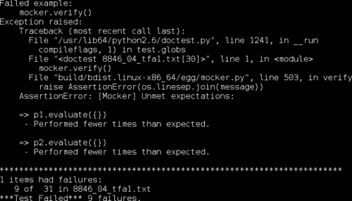

# 第四章：通过使用模拟对象来打破紧密耦合

*在前面的几个章节中，我们多次遇到需要确保单位不会相互污染测试的情况。现在，我们将探讨如何正式处理这些情况——模拟对象——以及一个特定的模拟对象工具包，即 Python Mocker。*

在本章中，我们将：

+   检查模拟对象的一般概念

+   学习如何使用 Python Mocker

+   学习如何模拟方法中的“self”参数

所以，让我们开始吧！

# 安装 Python Mocker

第一次，我们使用了一个不在标准 Python 发行版中的工具。这意味着我们需要下载并安装它。

# 现在是安装 Python Mocker 的时候了

1.  在撰写本文时，Python Mocker 的主页位于 [`labix.org/mocker`](http://labix.org/mocker)，而其下载文件托管在 [`launchpad.net/mocker/+download`](https://launchpad.net/mocker/+download)。请继续下载最新版本，我们将讨论如何安装它。

1.  首先需要做的事情是将下载的文件解压。它是一个 `.tar.bz2` 文件，对于 Unix、Linux 或 OSX 用户来说应该可以正常工作。Windows 用户需要第三方程序（7-Zip 工作得很好：[`www.7-zip.org/`](http://www.7-zip.org/)）来解压存档。将解压后的文件存储在某个临时位置。

1.  一旦你将文件解压到某个位置，通过命令行进入该位置。现在，为了进行下一步，你需要允许将文件写入你的 Python 安装目录的 site-packages 中（如果你是第一个安装 Python 的人，那么你就有这个权限）或者你需要使用 Python 2.6 或更高版本。

1.  如果你能够写入 site-packages，请输入

    ```py
    $ python setup.py install 

    ```

1.  如果你不能写入 site-packages，但你在使用 Python 2.6 或更高版本，请输入

    ```py
    $ python setup.py install --user

    ```

### 注意

有时候，一个名为 `easy_install` 的工具可以简化 Python 模块和包的安装过程。如果你想尝试，请根据页面上的说明下载并安装 `setuptools` 从 [`pypi.python.org/pypi/setuptools`](http://pypi.python.org/pypi/setuptools)，然后运行命令 `easy_install mocker`。一旦这个命令完成，你应该就可以使用 Nose 了。

一旦你成功运行了安装程序，Python Mocker 就可以使用了。

# 模拟对象的概念

在这个意义上，“Mock”意味着“模仿”，这正是模拟对象所做的事情。模拟对象模仿构成你程序的真实对象，但实际上并不是这些对象，也不以任何方式依赖它们。

模拟对象不会执行真实对象会执行的操作，而是执行预定义的简单操作，这些操作*看起来像是真实对象应该执行的操作*。这意味着它的方法返回适当的值（你告诉它返回的值）或引发适当的异常（你告诉它引发的异常）。模拟对象就像一只模仿鸟；模仿其他鸟的叫声，而不理解它们。

在我们之前的工作中，我们已经使用了一个模拟对象，当时我们用返回一个递增序列的数字的对象（在 Python 中，函数是对象）替换了`time.time`。这个模拟对象就像`time.time`一样，除了它总是返回相同的序列，无论我们何时运行测试或运行测试的计算机有多快。换句话说，它将我们的测试与外部变量解耦。

这就是模拟对象的核心：将测试与外部变量解耦。有时这些变量是外部时间或处理器速度等东西，但通常变量是其他单元的行为。

# Python Mocker

这个想法相当直接，但只需看一下上一章中`time.time`的模拟版本，就可以看出，如果不使用某种工具包，创建模拟对象可能是一个复杂且令人烦恼的过程，并且可能会干扰测试的可读性。这就是 Python Mocker（或根据个人喜好选择的其他几个模拟对象工具包）发挥作用的地方。

# 行动时间——探索 Mocker 的基础

我们将介绍 Mocker 的一些最简单——也是最实用——的功能。为此，我们将编写测试来描述一个代表特定数学运算（乘法）的类，该运算可以应用于任意其他数学运算对象的值。换句话说，我们将处理电子表格程序（或类似的东西）的内部结构。

我们将使用模拟器来创建模拟对象，以替代真实的操作对象。

1.  创建一个文本文件来保存测试，并在开头添加以下内容（假设所有数学运算都将定义在名为`operations`的模块中）：

    ```py
    >>> from mocker import Mocker
    >>> import operations
    ```

1.  我们决定每个数学运算类都应该有一个接受代表新对象操作数的对象的构造函数。它还应该有一个接受变量绑定字典作为参数的`evaluate`函数，并返回一个数字作为结果。我们可以很容易地编写构造函数的测试，所以我们首先做这件事（注意，我们在测试文件中包含了一些说明，这总是一个好主意）：

    ```py
    We're going to test out the constructor for the multiply operation, first. Since all that the constructor has to do is record all of the operands, this is straightforward.

    >>> mocker = Mocker()
    >>> p1 = mocker.mock()
    >>> p2 = mocker.mock()
    >>> mocker.replay()
    >>> m = operations.multiply(p1, p2)
    >>> m.operands == (p1, p2)
    True
    >>> mocker.restore()
    >>> mocker.verify()
    ```

1.  对于`evaluate`方法的测试要复杂一些，因为我们需要测试几个方面。这也是我们看到 Mocker 真正优势的开始：

    ```py
    Now we're going to check the evaluate method for the multiply operation. It should raise a ValueError if there are less than two operands, it should call the evaluate methods of all operations that are operands of the multiply, and of course it should return the correct value.

    >>> mocker = Mocker()
    >>> p1 = mocker.mock()
    >>> p1.evaluate({}) #doctest: +ELLIPSIS
    <mocker.Mock object at ...>
    >>> mocker.result(97.43)

    >>> mocker.replay()

    >>> m = operations.multiply(p1)
    >>> m.evaluate({})
    Traceback (most recent call last):
    ValueError: multiply without at least two operands is meaningless

    >>> mocker.restore()
    >>> mocker.verify()

    >>> mocker = Mocker()
    >>> p1 = mocker.mock()

    >>> p1.evaluate({}) #doctest: +ELLIPSIS
    <mocker.Mock object at ...>
    >>> mocker.result(97.43)
    >>> p2 = mocker.mock()
    >>> p2.evaluate({}) #doctest: +ELLIPSIS
    <mocker.Mock object at ...>
    >>> mocker.result(-16.25)

    >>> mocker.replay()

    >>> m = operations.multiply(p1, p2)
    >>> round(m.evaluate({}), 2)
    -1583.24

    >>> mocker.restore()
    >>> mocker.verify()
    ```

1.  如果我们现在运行测试，我们会得到一个失败测试的列表。其中大部分是由于 Mocker 无法导入`operations`模块造成的，但列表的底部应该看起来像这样：

1.  最后，我们将在`operations`模块中编写一些通过这些测试的代码，生成以下结果：

    ```py
    class multiply:
        def __init__(self, *operands):
            self.operands = operands

        def evaluate(self, bindings):
            vals = [x.evaluate(bindings) for x in self.operands]
            if len(vals) < 2:
                raise ValueError('multiply without at least two '                     
                                 'operands is meaningless')

            result = 1.0
            for val in vals:
                result *= val
            return result
    ```

1.  现在我们运行测试时，不应该有任何测试失败。

## *刚才发生了什么？*

为类似这样的东西编写测试的难度在于（正如通常所做的那样）需要将乘法类与所有其他数学运算类解耦，以便乘法测试的结果仅取决于乘法是否正确工作。

我们通过使用 Mocker 框架为模拟对象解决问题。Mocker 的工作方式是，你首先通过做一些像`mocker = Mocker()`这样的操作来创建一个代表模拟上下文的对象。模拟上下文将帮助你创建模拟对象，并存储有关你期望它们如何被使用的相关信息。此外，它可以帮助你暂时用模拟对象替换库对象（就像我们之前用`time.time`所做的那样），并在完成后将真实对象恢复到它们的位置。我们稍后会看到更多关于如何做到这一点的内容。

一旦你有了模拟上下文，你通过调用它的`mock`方法来创建一个模拟对象，然后你演示你期望如何使用模拟对象。模拟上下文记录你的演示，因此当你稍后调用它的`replay`方法时，它知道每个对象期望的用法以及如何响应。你的测试（使用模拟对象而不是它们所模仿的真实对象），在调用`replay`之后进行。

最后，在运行测试代码之后，你调用模拟上下文的`restore`方法来撤销任何库对象的替换，然后调用`verify`来检查模拟的实际使用是否符合预期。

我们对 Mocker 的第一个使用很简单。我们测试了我们的构造函数，它被指定为极其简单。它不应该对其参数做任何事情，除了将它们存储起来以备后用。当参数甚至不应该做任何事情时，我们使用 Mocker 创建模拟对象作为参数使用，我们真的从中获得了任何好处吗？实际上，我们确实获得了。因为我们没有告诉 Mocker 期望与模拟对象有任何交互，所以在`verify`步骤中，它将几乎任何参数的使用（存储它们不算，因为存储它们实际上并没有与它们交互）报告为错误。当我们调用`mocker.verify()`时，Mocker 回顾参数的实际使用情况，如果我们的构造函数试图对它们执行某些操作，它将报告失败。这是将我们的期望嵌入到测试中的另一种方式。

我们再次使用了 Mocker 两次，但在那些后续的使用中，我们告诉 Mocker 期望在模拟对象（即`p1`和`p2`）上调用`evaluate`方法，并且期望每个模拟对象的`evaluate`调用参数为空字典。对于每个我们告诉它期望的调用，我们也告诉它其响应应该是返回一个特定的浮点数。这不是巧合，这模仿了操作对象的行为，我们可以在测试`multiply.evaluate`时使用这些模拟。

如果`multiply.evaluate`没有调用模拟的`evaluate`方法，或者如果它多次调用了其中的一个，我们的`mocker.verify`调用就会提醒我们问题。这种不仅能够描述应该调用什么，而且能够描述每个东西应该调用多少次的能力是一个非常有用的工具，它使得我们描述期望的内容更加完整。当`multiply.evaluate`调用模拟的`evaluate`方法时，返回的值是我们指定的值，因此我们知道`multiply.evaluate`应该做什么。我们可以彻底测试它，而且我们可以不涉及代码中的任何其他单元。尝试改变`multiply.evaluate`的工作方式，看看`mocker.verify`对此有何说法。

## 模拟函数

正常对象（即通过实例化类创建具有方法和属性的对象）并不是唯一可以模拟的对象。函数是另一种可以模拟的对象，而且实际上做起来相当简单。

在你的演示过程中，如果你想用一个模拟对象来表示一个函数，只需调用它。模拟对象会识别出你希望它表现得像一个函数，并且会记录下你传递给它的参数，以便在测试过程中进行比较。

例如，以下代码创建了一个名为`func`的模拟，它假装是一个函数，当用参数`56`和`hello`调用一次时，返回数字`11`。示例的第二部分使用模拟进行了一个非常简单的测试：

```py
>>> from mocker import Mocker
>>> mocker = Mocker()
>>> func = mocker.mock()
>>> func(56, "hello") # doctest: +ELLIPSIS
<mocker.Mock object at ...>
>>> mocker.result(11)

>>> mocker.replay()
>>> func(56, "hello")
11
>>> mocker.restore()
>>> mocker.verify()
```

## 模拟容器

容器是另一类特殊对象，也可以进行模拟。就像函数一样，容器可以通过在示例中使用模拟对象作为容器来模拟。

模拟对象能够理解涉及以下容器操作的示例：查找成员、设置成员、删除成员、查找长度以及获取成员的迭代器。根据 Mocker 的版本，可能也支持通过`in`运算符进行成员资格测试。

在以下示例中，展示了上述所有功能，但为了与不支持这些功能的 Mocker 版本兼容，禁用了`in`测试。请记住，尽管我们在调用`replay`之后，名为`container`的对象看起来像一个实际的容器，但它并不是。它只是在按照我们告诉它的方式响应我们告诉它期待的所有刺激。这就是为什么当我们的测试请求迭代器时，它返回`None`。这正是我们告诉它的，而且这就是它所知道的一切。

```py
>>> from mocker import Mocker

>>> mocker = Mocker()
>>> container = mocker.mock()

>>> container['hi'] = 18

>>> container['hi'] # doctest: +ELLIPSIS
<mocker.Mock object at ...>
>>> mocker.result(18)

>>> len(container)
0
>>> mocker.result(1)

>>> 'hi' in container # doctest: +SKIP
True
>>> mocker.result(True)

>>> iter(container) # doctest: +ELLIPSIS
<...>
>>> mocker.result(None)

>>> del container['hi']
>>> mocker.result(None)

>>> mocker.replay()

>>> container['hi'] = 18

>>> container['hi']
18

>>> len(container)
1

>>> 'hi' in container # doctest: +SKIP
True

>>> for key in container:
...     print key
Traceback (most recent call last):
TypeError: iter() returned non-iterator of type 'NoneType'

>>> del container['hi']

>>> mocker.restore()
>>> mocker.verify()
```

在上述示例中需要注意的一点是，在初始阶段，一些演示（例如，调用`len`）并没有返回我们预期的`mocker.Mock`对象。对于某些操作，Python 强制要求结果必须是特定类型（例如，容器长度必须是整数），这迫使 Mocker 打破其常规模式。它不是返回一个通用的 mock 对象，而是返回正确类型的对象，尽管返回对象的值没有意义。幸运的是，这仅在初始阶段适用，当你向 Mocker 展示预期内容时，并且仅在少数情况下发生，所以通常不是什么大问题。尽管如此，有时返回的 mock 对象是必需的，因此了解这些例外情况是值得的。

## 参数匹配

有时，我们希望我们的 mock 函数和方法接受整个参数域，而不是仅限于接受我们特别告知它的参数所比较的对象。这可能有多种原因：也许 mock 需要接受一个外部变量作为参数（例如当前时间或可用磁盘空间），或者 mock 示例将被多次调用（我们很快会讨论这一点），或者参数对于正确行为的定义可能并不重要。

我们可以通过使用`ANY`、`ARGS`、`KWARGS`、`IS`、`IN`、`CONTAINS`和`MATCH`这些特殊值来告诉 mock 函数接受参数域，这些特殊值都在`mocker`模块中定义。这些特殊值在演示阶段（在你调用`replay`之前）作为函数调用参数传递给 mock 对象。

### ANY

将`ANY`作为函数参数传递会导致对象接受在该位置上的任意单个对象作为其参数。

```py

>>> from mocker import Mocker, ANY
>>> mocker = Mocker()
>>> func = mocker.mock()
>>> func(7, ANY) # doctest: +ELLIPSIS
<mocker.Mock object at ...>
>>> mocker.result(5)
>>> mocker.replay()
>>> func(7, 'this could be anything')
5
>>> mocker.restore()
>>> mocker.verify()
```

### ARGS

将`ARGS`作为函数参数传递会导致对象接受任意数量的位置参数，就像它在参数列表中声明了`*args`一样。

```py
>>> from mocker import Mocker, ARGS
>>> mocker = Mocker()
>>> func = mocker.mock()
>>> func(7, ARGS) # doctest: +ELLIPSIS
<mocker.Mock object at ...>
>>> mocker.result(5)
>>> mocker.replay()
>>> func(7, 'this could be anything', 'so could this', 99.2)
5
>>> mocker.restore()
>>> mocker.verify()
```

### KWARGS

将`KWARGS`作为函数参数传递会导致对象接受任意数量的关键字参数，就像它在参数列表中声明了`**kwargs`一样。

```py
>>> from mocker import Mocker, KWARGS
>>> mocker = Mocker()
>>> func = mocker.mock()
>>> func(7, KWARGS) # doctest: +ELLIPSIS
<mocker.Mock object at ...>
>>> mocker.result(5)
>>> mocker.replay()
>>> func(7, a='this could be anything', b='so could this')
5
>>> mocker.restore()
>>> mocker.verify()
```

### IS

传递 `IS(some_object)` 是不寻常的，因为它不是一个不精确的参数，而是比默认值更精确。Mocker 通常接受任何在初始阶段传递的值 `==` 相等的参数，但如果你使用 `IS`，它将检查参数和 `some_object` 是否确实是同一个对象，并且只有当它们是同一个对象时才接受调用。

```py
>>> from mocker import Mocker, IS
>>> mocker = Mocker()
>>> param = [1, 2, 3]
>>> func = mocker.mock()
>>> func(7, IS(param)) # doctest: +ELLIPSIS
<mocker.Mock object at ...>
>>> mocker.result(5)
>>> mocker.replay()
>>> func(7, param) # func(7, [1, 2, 3]) would fail
5
>>> mocker.restore()
>>> mocker.verify()
```

### IN

传递 `IN(some_container)` 会导致 Mocker 接受任何包含在名为 `some_container` 的容器对象中的参数。

```py

>>> from mocker import Mocker, IN
>>> mocker = Mocker()
>>> func = mocker.mock()
>>> func(7, IN([45, 68, 19])) # doctest: +ELLIPSIS
<mocker.Mock object at ...>
>>> mocker.result(5)
>>> func(7, IN([45, 68, 19])) # doctest: +ELLIPSIS
<mocker.Mock object at ...>
>>> mocker.result(5)
>>> func(7, IN([45, 68, 19])) # doctest: +ELLIPSIS
<mocker.Mock object at ...>
>>> mocker.result(5)
>>> mocker.replay()
>>> func(7, 19)
5
>>> func(7, 19)
5
>>> func(7, 45)
5
>>> mocker.restore()
>>> mocker.verify()

```

### CONTAINS

传递 `CONTAINS(some_object)` 会导致 Mocker 接受任何满足 `some_object in parameter` 为 `True` 的参数。

```py
>>> from mocker import Mocker, CONTAINS
>>> mocker = Mocker()
>>> func = mocker.mock()
>>> func(7, CONTAINS(45)) # doctest: +ELLIPSIS
<mocker.Mock object at ...>
>>> mocker.result(5)
>>> mocker.replay()
>>> func(7, [12, 31, 45, 18])
5
>>> mocker.restore()
>>> mocker.verify()
```

### MATCH

最后，如果你以上所有方法都无法描述你想要 Mocker 接受参数作为匹配其期望的条件，你可以传递 `MATCH(test_function)`。`test_function` 应该是一个带有一个参数的函数，当模拟函数被调用时，该参数将被传递给接收到的参数。如果 `test_function` 返回 `True`，则参数被接受。

```py
>>> from mocker import Mocker, MATCH
>>> def is_odd(val):
...     return val % 2 == 1
>>> mocker = Mocker()
>>> func = mocker.mock()
>>> func(7, MATCH(is_odd)) # doctest: +ELLIPSIS
<mocker.Mock object at ...>
>>> mocker.result(5)
>>> mocker.replay()
>>> func(7, 1001)
5
>>> mocker.restore()
>>> mocker.verify()

```

## 模拟复杂表达式

能够将 Mocker 模拟对象支持的各项操作结合起来会很好。简单的属性访问、容器成员访问和方法调用构成了大多数对象交互，但它们通常以组合的形式使用，例如 `container[index].attribute.method()`。我们可以逐步编写一个与这个类似的演示，使用我们已知的关于 Mocker 模拟对象的知识，但能够直接以我们期望的方式在实际代码中编写示例会更好。

幸运的是，我们通常可以做到这一点。在本章之前的所有示例中，你都看到了返回 `<mocker.Mock object at ...>` 的表达式。这些返回值是模拟对象，就像你通过调用 `Mocker.mock` 创建的对象一样，它们可以用相同的方式进行使用。这意味着，只要复杂表达式的一部分在演示过程中返回模拟对象，你就可以继续将复杂表达式的更多部分链接到它上面。例如，对于 `container[index].attribute.method()`，`container[index]` 返回一个模拟对象，对该对象的属性访问返回另一个模拟对象，然后我们调用该对象的方法。方法调用也返回一个模拟对象，但为了正确演示我们的期望，我们不需要对它做任何事情。

Mocker 记录了我们的使用演示，无论它有多复杂，或者我们如何深入嵌套对象。在之后我们调用 `replay` 之后，它会检查使用情况是否符合我们描述的，即使是非常复杂的用法模式。

## 尝试一下英雄

尝试告诉 Mocker 期望一个返回字符串的函数调用，该字符串随后被去除空白并按逗号分割，并且作为一个单一复杂表达式来完成。

## 返回迭代器

到目前为止，我们一直在调用`Mocker.result`来告诉 Mocker，评估特定示例表达式的结果应该是某个特定的值。这对于模拟大多数表达式来说很棒，并且也涵盖了函数和方法的一般用法，但它并不能真正模拟生成器或其他返回迭代器的函数。为了处理这种情况，我们调用`Mocker.generate`而不是`Mocker.result`，如下所示：

```py
>>> from mocker import Mocker
>>> from itertools import islice
>>> mocker = Mocker()
>>> generator = mocker.mock()
>>> generator(12) # doctest: +ELLIPSIS
<mocker.Mock object at ...>
>>> mocker.generate([16, 31, 24, 'hike'])

>>> mocker.replay()
>>> tuple(islice(generator(12), 1, 2))
(31,)
>>> mocker.restore()
>>> mocker.verify()
```

## 抛出异常

一些表达式会抛出异常而不是返回结果，因此我们需要能够使我们的模拟对象做同样的事情。幸运的是，这并不困难：您调用`Mocker.throw`来告诉 Mocker，对期望表达式的正确响应是抛出特定的异常。

```py
>>> from mocker import Mocker
>>> mocker = Mocker()
>>> obj = mocker.mock()
>>> obj.thingy # doctest: +ELLIPSIS
<mocker.Mock object at ...>
>>> mocker.throw(AttributeError('thingy does not exist'))

>>> mocker.replay()
>>> obj.thingy
Traceback (most recent call last):
AttributeError: thingy does not exist
>>> mocker.restore()
>>> mocker.verify()
```

## 通过模拟调用函数

有时我们模拟的函数有对我们测试很重要的副作用。Mocker 通过允许您指定在特定表达式发生时应调用的一个或多个函数来处理这些情况。这些函数可以是来自您代码库某处的现有函数，或者可以是您专门嵌入到测试中以产生所需副作用的特殊函数。

在与 Mocker 的某个模拟对象交互后，可以调用的函数有一个限制：这样的函数不能需要任何参数。这并不像您想象的那么大，因为您知道应该传递给调用函数的确切参数，因此您可以编写一个小的包装函数，只需用这些参数调用目标函数。这将在下一个示例中演示。

### 注意

Python 的`lambda`关键字是一种将单个表达式包装成函数的机制。当函数被调用时，表达式将被评估，并且返回表达式评估的结果。`lambda`的使用多种多样，但用它来创建围绕其他函数调用的微小包装器是一种常见的用法。

以这种方式调用函数并不排除模拟函数返回结果。在下面的示例中，模拟函数执行两次函数调用并返回数字 5。

```py
>>> from mocker import Mocker
>>> from sys import stdout
>>> mocker = Mocker()
>>> obj = mocker.mock()
>>> obj.method() # doctest: +ELLIPSIS
<mocker.Mock object at ...>
>>> mocker.call((lambda: stdout.write('hi')))
>>> mocker.call((lambda: stdout.write('yo\n')))
>>> mocker.result(5)

>>> mocker.replay()

>>> obj.method()
hiyo
5

>>> mocker.restore()
>>> mocker.verify()

```

## 指定一个期望应该发生多次

如您可能在一些先前的示例中注意到的那样，有时告诉 Mocker 预期什么可能会变得重复。`IN`参数匹配器的例子很好地展示了这一点：我们做了很多重复的工作，告诉 Mocker 我们期望调用`func`函数三次。这使得测试变得很长（这降低了其可读性），并且违反了编程中的 DRY（不要重复自己）原则，使得后续修改测试变得更加困难。此外，编写所有那些重复的预期也很烦人。

为了解决这个问题，Mocker 允许我们指定在测试执行期间期望发生的次数。我们通过调用`Mocker.count`来指定期望的重复次数。为了看到最简单的方法，让我们重新编写`IN`示例，这样我们就不必反复重复：

```py
>>> from mocker import Mocker, IN
>>> mocker = Mocker()
>>> func = mocker.mock()
>>> func(7, IN([45, 68, 19])) # doctest: +ELLIPSIS
<mocker.Mock object at ...>
>>> mocker.result(5)
>>> mocker.count(3)

>>> mocker.replay()
>>> func(7, 19)
5
>>> func(7, 19)
5
>>> func(7, 45)
5
>>> mocker.restore()
>>> mocker.verify()
```

注意参数匹配如何与指定计数很好地工作，让我们可以将几个不同的`func`调用压缩成一个期望，即使它们有不同的参数。通过结合使用这两个特性，模拟的期望通常可以显著缩短，删除冗余信息。但请记住，你不想从测试中删除重要信息；如果第一个调用`func`的参数是`19`很重要，或者调用以特定的顺序到来，以这种方式压缩期望会丢失这些信息，这会损害测试。

在上面的例子中，我们指定了期望`func`调用重复的确切次数，但`count`比这更灵活。通过提供两个参数，`count`可以被告知期望在最小和最大次数之间的任何次数重复。只要测试期间的实际重复次数至少与最小次数一样多，并且不超过最大次数，Mocker 就会接受它作为正确的使用方式。

```py
>>> from mocker import Mocker, IN
>>> mocker = Mocker()
>>> func = mocker.mock()
>>> func(7, IN([45, 68, 19])) # doctest: +ELLIPSIS
<mocker.Mock object at ...>
>>> mocker.result(5)
>>> mocker.count(1, 3)

>>> mocker.replay()
>>> func(7, 19)
5
>>> func(7, 45)
5
>>> func(7, 19)
5
>>> mocker.restore()
>>> mocker.verify()
```

最后，可以指定期望至少重复一定次数，但没有最大重复次数。只要期望至少满足指定的次数，Mocker 就会认为其使用是正确的。为此，我们在调用`count`时将`None`作为最大参数传递。

```py
>>> from mocker import Mocker, IN
>>> mocker = Mocker()
>>> func = mocker.mock()
>>> func(7, IN([45, 68, 19])) # doctest: +ELLIPSIS
<mocker.Mock object at ...>
>>> mocker.result(5)
>>> mocker.count(1, None)

>>> mocker.replay()
>>> [func(7, 19) for x in range(50)] == [5] * 50
True
>>> mocker.restore()
>>> mocker.verify()
```

### 注意

最后一个例子使用了几个 Python 的晦涩特性。在`==`的左侧是一个“列表推导”，这是一种将另一个可迭代对象转换为列表的紧凑方式。在右侧是列表乘法，它创建一个新列表，包含旧列表成员的重复次数——在这种情况下，列表包含`50`次重复的值`5`。

## 用模拟替换库对象

几次，我们都看到了需要用模拟对象替换我们代码之外的东西的需求：例如，需要将`time.time`替换为能够产生可预测结果的东西，以便我们的 PID 控制器测试有意义。

Mocker 为我们提供了一个工具来满足这种常见需求，并且使用起来相当简单。Mocker 的模拟上下文包含一个名为`replace`的方法，从我们的角度来看，它几乎与`mock`一样，但能够完全用模拟对象替换现有对象，无论它存在于哪个模块（或模块），或者何时导入。更好的是，当我们调用`restore`时，模拟对象消失，原始对象返回到其正确的位置。

这为我们提供了一种简单的方法，即使是从我们通常无法控制的库代码中，也可以隔离我们的测试，并且在完成后不留任何痕迹。

为了说明`replace`函数，我们将临时将`time.time`替换为一个模拟对象。我们之前已经这样做过——在我们的 PID 测试中——以一种临时的方式。这使得我们的测试变得丑陋且难以阅读。此外，它只替换了名称`time.time`为我们的模拟对象：如果我们已经在 PID 代码中执行了`from time import time`，除非在导入 PID 之前进行替换，否则替换不会捕获它。Mocker 将正确处理这种复杂的替换，无论导入发生的时间或形式如何，而无需我们额外努力。

```py
>>> from time import time
>>> from mocker import Mocker

>>> mocker = Mocker()
>>> mock_time = mocker.replace('time.time')

>>> mock_time() # doctest: +ELLIPSIS
<mocker.Mock object at ...>
>>> mocker.result(1.3)

>>> mock_time() # doctest: +ELLIPSIS
<mocker.Mock object at ...>
>>> mocker.result(2.7)

>>> mock_time() # doctest: +ELLIPSIS
<mocker.Mock object at ...>
>>> mocker.result(3.12)

>>> mocker.replay()
>>> '%1.3g' % time()
'1.3'
>>> '%1.3g' % time()
'2.7'
>>> '%1.3g' % time()
'3.12'
>>> mocker.restore()
>>> mocker.verify()
```

注意，我们在用模拟对象替换它之前导入了`time`，然而当我们实际使用它时，它竟然是我们使用的模拟对象。在恢复调用之后，如果我们再次调用`time`，它将再次是真实的时间函数。

### 注意

为什么我们在`time`的输出上使用字符串格式化？我们这样做是因为浮点数是不精确的，这意味着我们输入的 3.12，例如，可能在系统中表示为 3.1200000000000001 或其他非常接近但不是精确的 3.12 的值。确切值可能因系统而异，因此比较浮点数会使你的测试更不便携。我们的字符串格式化将数字四舍五入到相关数字。

## 快速问答——Mocker 使用

1.  以下哪个选项可以用来检查传递给模拟对象的参数是否是一组允许的参数之一：`CONTAINS`、`IN`、`IS`？

1.  当你指定一个期望可以重复时，你如何指定没有上限，即它可以重复多少次？

1.  `mocker.verify()`函数的作用是什么？

## 尝试一下英雄——模拟 datetime

查看以下测试代码，并填写缺失的 Mocker 演示，以便测试通过：

```py
>>> from datetime import datetime
>>> from mocker import Mocker
>>> mocker = Mocker()

Here's where your Mocker demonstrations should go.

>>> mocker.replay()
>>> now = datetime.now()
>>> then = now.replace(hour = 12)
>>> then.isocalendar()
(2009, 24, 3)
>>> then.isoformat()
'2009-06-10T12:30:39.812555'
>>> mocker.restore()
>>> mocker.verify()
```

# 模拟 self

当调用一个对象的方法时，它的第一个参数是包含该方法的对象的引用。我们希望能够用模拟对象替换它，因为这是唯一真正分离每个方法的方法，以便每个方法都可以作为一个单独的单元进行测试。如果我们不能模拟`self`，方法将通过它们包含的对象相互交互，从而倾向于干扰彼此的测试。

所有这些中的难点在于，当调用一个方法时，调用者并没有明确传递`self`对象：Python 已经知道哪个对象的方法被绑定，并自动填充它。我们如何替换一个不来自我们的参数的模拟对象？

我们可以通过在测试函数的类中找到我们要测试的函数并直接调用它来解决此问题，而不是将其作为绑定到对象的函数调用。这样，我们可以传递所有参数，包括第一个参数，而解释器不会执行任何魔法。

# 行动时间——传递模拟对象作为 self

1.  记得我们使用的 `testable` 类，其中之一是用来演示如何很难将方法分离，以便我们可以将它们作为单元来处理？尽管我们在第三章中已经看到了这一点，但这里再次提到：

    ```py
    class testable:
        def method1(self, number):
            number += 4
            number **= 0.5
            number *= 7
            return number

        def method2(self, number):
            return ((number * 2) ** 1.27) * 0.3

        def method3(self, number):
            return self.method1(number) + self.method2(number)

        def method4(self):
            return self.method3(id(self))
    ```

1.  我们将编写一个针对 `method3` 的单元测试。像所有单元测试一样，它需要不涉及任何其他单元的代码，在这种情况下意味着 `self.method1` 和 `self.method2` 需要是模拟对象。实现这一点最好的方法是将 `self` 本身变成一个模拟对象，所以这就是我们要做的。第一步是创建一个期望 `method3` 应该执行的交互的模拟对象：

    ```py
    >>> from testable import testable
    >>> from mocker import Mocker
    >>> mocker = Mocker()

    >>> target = mocker.mock()
    >>> target.method1(12) # doctest: +ELLIPSIS
    <mocker.Mock object at ...>
    >>> mocker.result(5)
    >>> target.method2(12) # doctest: +ELLIPSIS
    <mocker.Mock object at ...>
    >>> mocker.result(7)
    ```

1.  `method3` 应该调用 `method1` 和 `method2`，而我们刚刚创建的模拟对象期望看到对 `method1` 和 `method2` 的调用。到目前为止，一切顺利，那么让这个模拟对象成为 `method3` 调用的 `self` 的技巧是什么呢？以下是测试的其余部分：

    ```py
    >>> mocker.replay()
    >>> testable.method3.im_func(target, 12)
    12
    ```

## *刚才发生了什么？*

我们去了 `testable` 类，查找它的 `method3` 成员，这是一个被称为“未绑定方法对象”的东西。一旦我们有了未绑定方法对象，我们就查看了它的 `im_func` 属性，它只是一个函数，没有任何与方法相关联的华丽装饰。一旦我们手头有了普通函数，调用它就很容易了，我们可以将我们的模拟对象作为它的第一个参数传递。

### 注意

Python 3.0 版本通过移除未绑定方法对象，直接在类中存储函数对象来简化了这一点。这意味着如果您使用的是 Python 3.0 或更高版本，您可以直接调用 `testable.method3(target, 12)`。

# 摘要

在本章中，我们关于模拟和 Python Mocker 学到了很多。我们关注了 Mocker 提供的各种功能，以帮助您保持单元之间的分离。

具体来说，我们涵盖了什么是模拟对象，它们的作用，如何使用 Python Mocker 使模拟更容易，许多自定义 Mocker 行为以适应您需求的方法，以及如何用一个模拟对象替换方法的 `self` 参数。

到目前为止，我们已经开始看到 `doctest`——尽管它简单易用——开始变得难以控制的情况。在下一章中，我们将探讨 Python 的另一个内置单元测试框架：`unittest`。
