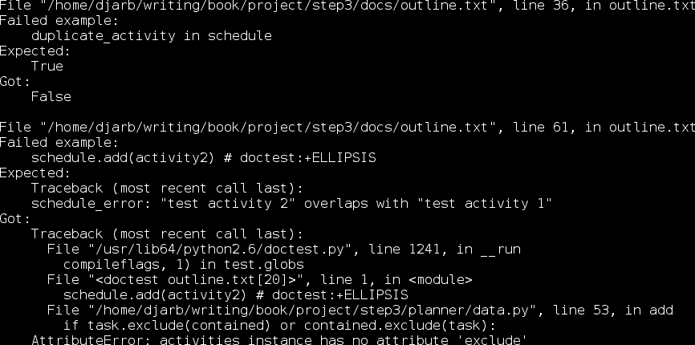
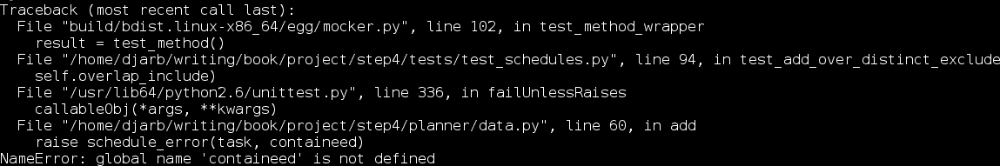
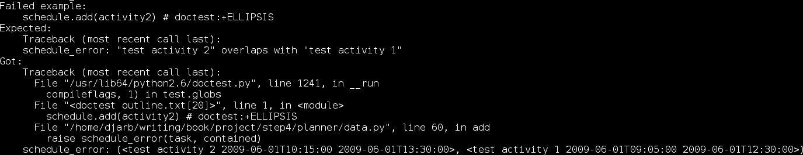
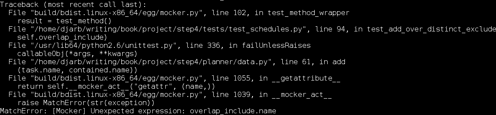
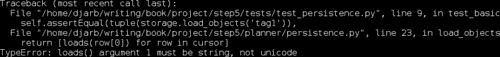

# 第七章. 开发测试驱动型项目

*在本章中，我们不会讨论 Python 中测试的新技术，也不会花太多时间讨论测试的哲学。相反，我们将逐步通过一个实际开发过程的记录。谦逊且不幸易犯错的作者记录了他的错误——以及测试如何帮助他修复这些错误——在开发个人调度程序的一部分时。*

在本章中，我们将：

+   编写可测试的规范

+   编写单元测试

+   编写符合规范和单元测试的代码

+   使用可测试的规范和单元测试来帮助调试

阅读本章时，你将被提示设计和构建自己的模块，这样你就可以走自己的过程了。

# 编写规范

如往常一样，过程从书面规范开始。规范是一个 doctest（我们在第二章和第三章中了解过），因此计算机可以使用它来检查实现。尽管规范并不是一组单元测试；为了使文档更易于人类读者阅读，我们暂时牺牲了单元测试的纪律。这是一个常见的权衡，只要你也编写覆盖代码的单元测试来弥补，那就没问题。

项目目标是创建一个能够表示个人时间管理信息的 Python 包。

以下代码放在一个名为`docs/outline.txt`的文件中：

```py
This project is a personal scheduling system intended to keep track of a single person's schedule and activities. The system will store and display two kinds of schedule information: activities and statuses. Activities and statuses both support a protocol which allows them to be checked for overlap with another object supporting the protocol.

>>> from planner.data import activities, statuses
>>> from datetime import datetime

Activities and statuses are stored in schedules, to which they can be added and removed.

>>> from planner.data import schedules
>>> activity = activities('test activity',
...                       datetime(year=2009, month=6, day=1,
...                                hour=10, minute=15),
...                       datetime(year=2009, month=6, day=1,
...                                hour=12, minute=30))
>>> duplicate_activity = activities('test activity',
...                       datetime(year=2009, month=6, day=1,
...                                hour=10, minute=15),
...                       datetime(year=2009, month=6, day=1,
...                                hour=12, minute=30))
>>> status = statuses('test status',
...                   datetime(year=2009, month=7, day=1,
...                            hour=10, minute=15),
...                   datetime(year=2009, month=7, day=1,
...                            hour=12, minute=30))
>>> schedule = schedules()
>>> schedule.add(activity)
>>> schedule.add(status)
>>> status in schedule
True
>>> activity in schedule
True
>>> duplicate_activity in schedule
True
>>> schedule.remove(activity)
>>> schedule.remove(status)
>>> status in schedule
False
>>> activity in schedule
False

Activities represent tasks that the person must actively engage in, and they are therefore mutually exclusive: no person can have two activities that overlap the same period of time.

>>> activity1 = activities('test activity 1',
...                        datetime(year=2009, month=6, day=1,
...                                 hour=9, minute=5),
...                        datetime(year=2009, month=6, day=1,
...                                 hour=12, minute=30))
>>> activity2 = activities('test activity 2',
...                        datetime(year=2009, month=6, day=1,
...                                 hour=10, minute=15),
...                        datetime(year=2009, month=6, day=1,
...                                 hour=13, minute=30))
>>> schedule = schedules()
>>> schedule.add(activity1)
>>> schedule.add(activity2) # doctest:+ELLIPSIS
Traceback (most recent call last):
schedule_error: "test activity 2" overlaps with "test activity 1"

Statuses represent tasks that a person engages in passively, and so
can overlap with each other and with activities.

>>> activity1 = activities('test activity 1',
...                        datetime(year=2009, month=6, day=1,
...                                 hour=9, minute=5),
...                        datetime(year=2009, month=6, day=1,
...                                 hour=12, minute=30))
>>> status1 = statuses('test status 1',
...                    datetime(year=2009, month=6, day=1,
...                             hour=10, minute=15),
...                    datetime(year=2009, month=6, day=1,
...                             hour=13, minute=30))
>>> status2 = statuses('test status 2',
...                    datetime(year=2009, month=6, day=1,
...                             hour=8, minute=45),
...                    datetime(year=2009, month=6, day=1,
...                             hour=15, minute=30))
>>> schedule = schedules()
>>> schedule.add(activity1)
>>> schedule.add(status1)
>>> schedule.add(status2)
>>> activity1 in schedule
True
>>> status1 in schedule
True
>>> status2 in schedule
True

Schedules can be saved to a sqlite database, and they can be reloaded
from that stored state.

>>> from planner.persistence import file
>>> storage = file(':memory:')
>>> schedule.store(storage)
>>> newsched = schedules.load(storage)
>>> schedule == newsched
True
```

这个 doctest 将作为我项目的可测试规范，这意味着它将成为所有其他测试（以及我的程序代码）的基础。让我们更详细地看看每个部分：

```py
This project is a personal scheduling system intended to keep track of a single person's schedule and activities. The system will store and display two kinds of schedule information: activities and statuses. Activities and statuses both support a protocol which allows them to be checked for overlap with another object supporting the protocol.

>>> from planner.data import activities, statuses
>>> from datetime import datetime
```

上述代码包含一些简介性英文文本和几个导入语句，这些导入语句引入了我们需要用于这些测试的代码。通过这样做，它们也告诉我们`planner`包的一些结构。具体来说，它们告诉我们它包含一个名为`data`的模块，该模块定义了活动和状态。

```py
>>> from planner.data import schedules
>>> activity = activities('test activity',
...                       datetime(year=2009, month=6, day=1,
...                                hour=10, minute=15),
...                       datetime(year=2009, month=6, day=1,
...                                hour=12, minute=30))
>>> duplicate_activity = activities('test activity',
...                       datetime(year=2009, month=6, day=1,
...                                hour=10, minute=15),
...                       datetime(year=2009, month=6, day=1,
...                                hour=12, minute=30))
>>> status = statuses('test status',
...                   datetime(year=2009, month=7, day=1,
...                            hour=10, minute=15),
...                   datetime(year=2009, month=7, day=1,
...                            hour=12, minute=30))
>>> schedule = schedules()
>>> schedule.add(activity)
>>> schedule.add(status)
>>> status in schedule
True
>>> activity in schedule
True
>>> duplicate_activity in schedule
True
>>> schedule.remove(activity)
>>> schedule.remove(status)
>>> status in schedule
False
>>> activity in schedule
False
```

上述测试描述了`schedules`对`activities`和`statuses`的一些期望行为。根据这些测试，`schedules`必须接受`activities`和`statuses`作为其`add`和`remove`方法的参数。一旦它们被添加，`in`运算符必须返回`True`，直到对象被移除。此外，具有相同参数的两个`activities`必须被`schedules`视为同一个对象。

```py
>>> activity1 = activities('test activity 1',
...                        datetime(year=2009, month=6, day=1,
...                                 hour=9, minute=5),
...                        datetime(year=2009, month=6, day=1,
...                                 hour=12, minute=30))
>>> activity2 = activities('test activity 2',
...                        datetime(year=2009, month=6, day=1,
...                                 hour=10, minute=15),
...                        datetime(year=2009, month=6, day=1,
...                                 hour=13, minute=30))
>>> schedule = schedules()
>>> schedule.add(activity1)
>>> schedule.add(activity2) # doctest:+ELLIPSIS
Traceback (most recent call last):
schedule_error: "test activity 2" overlaps with "test activity 1"
```

上述测试代码描述了当重叠活动被添加到日程表中时应该发生什么。具体来说，应该引发一个`schedule_error`。

```py
>>> activity1 = activities('test activity 1',
...                        datetime(year=2009, month=6, day=1,
...                                 hour=9, minute=5),
...                        datetime(year=2009, month=6, day=1,
...                                 hour=12, minute=30))
>>> status1 = statuses('test status 1',
...                    datetime(year=2009, month=6, day=1,
...                             hour=10, minute=15),
...                    datetime(year=2009, month=6, day=1,
...                             hour=13, minute=30))
>>> status2 = statuses('test status 2',
...                    datetime(year=2009, month=6, day=1,
...                             hour=8, minute=45),
...                    datetime(year=2009, month=6, day=1,
...                             hour=15, minute=30))
>>> schedule = schedules()
>>> schedule.add(activity1)
>>> schedule.add(status1)
>>> schedule.add(status2)
>>> activity1 in schedule
True
>>> status1 in schedule
True
>>> status2 in schedule
True
```

上述测试代码描述了当重叠状态被添加到日程表中时应该发生什么：日程表应该接受它们。此外，如果状态和活动重叠，它们仍然都可以被添加。

```py
>>> from planner.persistence import file
>>> storage = file(':memory:')
>>> schedule.store(storage)
>>> newsched = schedules.load(storage)
>>> schedule == newsched
True
```

上述代码描述了调度存储应该如何工作。它还告诉我们，`planner` 包需要包含一个 `persistence` 模块，而这个模块反过来应该包含 `file`。

# 行动时间——你打算做什么？

是时候你自己想出一个项目了，一个你可以独立工作的项目；我们逐步通过开发过程：

1.  想想一个与本章所述项目大致相同复杂性的项目。它应该是一个单独的模块或一个包中的几个模块。

1.  想象一下项目已经完成，你需要编写一个描述你所做的工作，以及一些演示代码的说明。然后继续编写你的描述和演示代码，以 doctest 文件的形式。

1.  当你编写 doctest 文件时，要注意那些你的原始想法需要稍作改变以使演示更容易编写或工作得更好的地方。当你找到这样的案例时，请注意它们！在这个阶段，最好稍作改变，以便在整个过程中节省精力。

## *刚才发生了什么？*

我们现在有了适度规模项目的可测试规范，这将帮助我们编写单元测试和代码，并让我们对整个项目的完整性有一个整体的感觉。

此外，将代码写入 doctest 的过程给了我们测试驱动我们想法的机会。我们可能通过具体使用它们来改进我们的项目，尽管项目实现仍然仅仅是想象中的。

再次强调，在编写将要测试的代码之前编写这些测试非常重要。通过先编写测试，我们给自己提供了一个可以用来判断我们的代码是否符合我们意图的基准。如果我们先编写代码，然后编写测试，最终我们只是将代码实际执行的行为——而不是我们希望它执行的行为——神圣化到测试中。

# 编写初始单元测试

由于规范不包含单元测试，在模块编码开始之前，仍然需要单元测试。`planner.data` 类是第一个要实现的目标，因此它们是第一个接受测试的。

活动和状态被定义为非常相似，因此它们的测试模块也是相似的。尽管它们并不完全相同，也不需要具有任何特定的继承关系，所以测试仍然是独立的。

以下测试位于 `tests/test_activities.py`：

```py
from unittest import TestCase
from mocker import MockerTestCase
from planner.data import activities, task_error
from datetime import datetime

class constructor_tests(TestCase):
    def test_valid(self):
        activity = activities('activity name',
                              datetime(year=2007, month=9, day=11),
                              datetime(year=2008, month=4, day=27))

        self.assertEqual(activity.name, 'activity name')
        self.assertEqual(activity.begins,
                         datetime(year = 2007, month = 9, day = 11))
        self.assertEqual(activity.ends,
                         datetime(year = 2008, month = 4, day = 27))

    def test_backwards_times(self):
        self.assertRaises(task_error,
                          activities,
                          'activity name',
                          datetime(year=2008, month=4, day=27),
                          datetime(year=2007, month=9, day=11))

    def test_too_short(self):
        self.assertRaises(task_error,
                          activities,
                          'activity name',
                          datetime(year = 2008, month = 4, day = 27,
                                   hour = 7, minute = 15),
                          datetime(year = 2008, month = 4, day = 27,
                                   hour = 7, minute = 15))

class utility_tests(TestCase):
    def test_repr(self):
        activity = activities('activity name',
                              datetime(year=2007, month=9, day=11),
                              datetime(year=2008, month=4, day=27))

        expected = "<activity name 2007-09-11T00:00:00 2008-04-27T00:00:00>"

        self.assertEqual(repr(activity), expected)

class exclusivity_tests(TestCase):
    def test_excludes(self):
        activity = activities('activity name',
                              datetime(year=2007, month=9, day=11),
                              datetime(year=2007, month=10, day=6))

        # Any activity should exclude any other activity
        self.assertTrue(activity.excludes(activity))

        # Anything not known to be excluded should be included
        self.assertFalse(activity.excludes(None))

class overlap_tests(MockerTestCase):
    def setUp(self):
        pseudo = self.mocker.mock()

        pseudo.begins
        self.mocker.result(datetime(year=2007, month=10, day=7))
        self.mocker.count(0, None)

        pseudo.ends
        self.mocker.result(datetime(year=2008, month=2, day=5))
        self.mocker.count(0, None)

        self.other = pseudo

        self.mocker.replay()

    def test_overlap_before(self):
        activity = activities('activity name',
                              datetime(year=2007, month=9, day=11),
                              datetime(year=2007, month=10, day=6))

        self.assertFalse(activity.overlaps(self.other))

    def test_overlap_begin(self):
        activity = activities('activity name',
                              datetime(year=2007, month=8, day=11),
                              datetime(year=2007, month=11, day=27))

        self.assertTrue(activity.overlaps(self.other))

    def test_overlap_end(self):
        activity = activities('activity name',
                              datetime(year=2008, month=1, day=11),
                              datetime(year=2008, month=4, day=16))

        self.assertTrue(activity.overlaps(self.other))

    def test_overlap_inner(self):
        activity = activities('activity name',
                              datetime(year=2007, month=10, day=11),
                              datetime(year=2008, month=1, day=27))

        self.assertTrue(activity.overlaps(self.other))

    def test_overlap_outer(self):
        activity = activities('activity name',
                              datetime(year=2007, month=8, day=12),
                              datetime(year=2008, month=3, day=15))

        self.assertTrue(activity.overlaps(self.other))

    def test_overlap_after(self):
        activity = activities('activity name',
                              datetime(year=2008, month=2, day=6),
                              datetime(year=2008, month=4, day=27))

        self.assertFalse(activity.overlaps(self.other))
```

让我们来看看上述单元测试代码的每个部分：

```py
    def test_valid(self):
        activity = activities('activity name',
                              datetime(year=2007, month=9, day=11),
                              datetime(year=2008, month=4, day=27))

        self.assertEqual(activity.name, 'activity name')
        self.assertEqual(activity.begins,
                         datetime(year = 2007, month = 9, day = 11))
        self.assertEqual(activity.ends,
                         datetime(year = 2008, month = 4, day = 27))
```

`test_valid` 方法检查当所有参数都正确时构造函数是否工作正常。这是一个重要的测试，因为它定义了正常情况下正确行为应该是什么。但我们还需要更多的测试来定义异常情况下的正确行为。

```py
    def test_backwards_times(self):
        self.assertRaises(task_error,
                          activities,
                          'activity name',
                          datetime(year=2008, month=4, day=27),
                          datetime(year=2007, month=9, day=11))
```

在这里，我们将确保你不能创建一个在开始之前就结束的活动。这没有任何意义，并且很容易在实现过程中导致假设错误。

```py
    def test_too_short(self):
        self.assertRaises(task_error,
                          activities,
                          'activity name',
                          datetime(year = 2008, month = 4, day = 27,
                                   hour = 7, minute = 15),
                          datetime(year = 2008, month = 4, day = 27,
                                   hour = 7, minute = 15))
```

我们也不希望活动非常短。在现实世界中，一个不占用时间的活动是没有意义的，所以我们在这里有一个测试来确保不允许这种情况发生。

```py
class utility_tests(TestCase):
    def test_repr(self):
        activity = activities('activity name',
                              datetime(year=2007, month=9, day=11),
                              datetime(year=2008, month=4, day=27))

        expected = "<activity name 2007-09-11T00:00:00 2008-04-27T00:00:00>"

        self.assertEqual(repr(activity), expected)
```

虽然 `repr(activity)` 在任何生产代码路径中可能不太可能被使用，但在开发和调试期间非常方便。这个测试定义了活动文本表示应该如何看起来，以确保它包含所需的信息。

```py
class exclusivity_tests(TestCase):
    def test_excludes(self):
        activity = activities('activity name',
                              datetime(year=2007, month=9, day=11),
                              datetime(year=2007, month=10, day=6))

        # Any activity should exclude any other activity
        self.assertTrue(activity.excludes(activity))

        # Anything not known to be excluded should be included
        self.assertFalse(activity.excludes(None))
```

由于活动在重叠时应该相互排斥，所以我们在这里进行检查。显然，活动与其自身重叠，因此 `excludes` 方法应该返回 `True`。另一方面，活动不应该仅仅假设它排除了所有其他事物，因此在对未知对象（如 `None`）调用 `excludes` 时应该返回 `False`。

```py
class overlap_tests(MockerTestCase):
    def setUp(self):
        pseudo = self.mocker.mock()

        pseudo.begins
        self.mocker.result(datetime(year=2007, month=10, day=7))
        self.mocker.count(0, None)

        pseudo.ends
        self.mocker.result(datetime(year=2008, month=2, day=5))
        self.mocker.count(0, None)

        self.other = pseudo

        self.mocker.replay()
```

在这里，我们创建了一个测试固定装置，它创建了一个模拟对象，该对象假装是一个活动或状态。我们将在接下来的几个测试中使用这个模拟对象（称为 `self.other`）。

```py
    def test_overlap_before(self):
        activity = activities('activity name',
                              datetime(year=2007, month=9, day=11),
                              datetime(year=2007, month=10, day=6))

        self.assertFalse(activity.overlaps(self.other))

    def test_overlap_begin(self):
        activity = activities('activity name',
                              datetime(year=2007, month=8, day=11),
                              datetime(year=2007, month=11, day=27))

        self.assertTrue(activity.overlaps(self.other))

    def test_overlap_end(self):
        activity = activities('activity name',
                              datetime(year=2008, month=1, day=11),
                              datetime(year=2008, month=4, day=16))

        self.assertTrue(activity.overlaps(self.other))

    def test_overlap_inner(self):
        activity = activities('activity name',
                              datetime(year=2007, month=10, day=11),
                              datetime(year=2008, month=1, day=27))

        self.assertTrue(activity.overlaps(self.other))

    def test_overlap_outer(self):
        activity = activities('activity name',
                              datetime(year=2007, month=8, day=12),
                              datetime(year=2008, month=3, day=15))

        self.assertTrue(activity.overlaps(self.other))

    def test_overlap_after(self):
        activity = activities('activity name',
                              datetime(year=2008, month=2, day=6),
                              datetime(year=2008, month=4, day=27))

        self.assertFalse(activity.overlaps(self.other))
```

这些测试描述了活动重叠检查在以下情况下的行为：

+   在模拟对象之后

+   与模拟对象重叠的末尾

+   与模拟对象的开始重叠

+   在模拟对象之后开始并在其之前结束

+   在模拟对象之前开始并在其之后结束

以下测试位于 `tests/test_statuses.py` 文件中。其中许多测试与 `activities` 的测试类似。我们将重点关注它们之间的差异：

```py
from unittest import TestCase
from mocker import MockerTestCase
from planner.data import statuses, task_error
from datetime import datetime

class constructor_tests(TestCase):
    def test_valid(self):
        status = statuses('status name',
                          datetime(year=2007, month=9, day=11),
                          datetime(year=2008, month=4, day=27))

        self.assertEqual(status.name, 'status name')
        self.assertEqual(status.begins,
                         datetime(year=2007, month=9, day=11))
        self.assertEqual(status.ends,
                         datetime(year=2008, month=4, day=27))

    def test_backwards_times(self):
        self.assertRaises(task_error,
                          statuses,
                          'status name',
                          datetime(year=2008, month=4, day=27),
                          datetime(year=2007, month=9, day=11))

    def test_too_short(self):
        self.assertRaises(task_error,
                          statuses,
                          'status name',
                          datetime(year=2008, month=4, day=27,
                                   hour=7, minute=15),
                          datetime(year=2008, month=4, day=27,
                                   hour=7, minute=15))

class utility_tests(TestCase):
    def test_repr(self):
        status = statuses('status name',
                              datetime(year=2007, month=9, day=11),
                              datetime(year=2008, month=4, day=27))

        expected = "<status name 2007-09-11T00:00:00 2008-04-27T00:00:00>"

        self.assertEqual(repr(status), expected)

class exclusivity_tests(TestCase):
    def test_excludes(self):
        status = statuses('status name',
                          datetime(year=2007, month=9, day=11),
                          datetime(year=2007, month=10, day=6))

        # A status shouldn't exclude anything
        self.assertFalse(status.excludes(status))
        self.assertFalse(status.excludes(None))

class overlap_tests(MockerTestCase):
    def setUp(self):
        pseudo = self.mocker.mock()

        pseudo.begins
        self.mocker.result(datetime(year=2007, month=10, day=7))
        self.mocker.count(1, None)

        pseudo.ends
        self.mocker.result(datetime(year=2008, month=2, day=5))
        self.mocker.count(1, None)

        self.other = pseudo

        self.mocker.replay()

    def test_overlap_before(self):
        status = statuses('status name',
                          datetime(year=2007, month=9, day=11),
                          datetime(year=2007, month=10, day=6))

        self.assertFalse(status.overlaps(self.other))

    def test_overlap_begin(self):
        status = statuses('status name',
                          datetime(year=2007, month=8, day=11),
                          datetime(year=2007, month=11, day=27))

        self.assertTrue(status.overlaps(self.other))

    def test_overlap_end(self):
        status = statuses('status name',
                          datetime(year=2008, month=1, day=11),
                          datetime(year=2008, month=4, day=16))

        self.assertTrue(status.overlaps(self.other))

    def test_overlap_inner(self):
        status = statuses('status name',
                          datetime(year=2007, month=10, day=11),
                          datetime(year=2008, month=1, day=27))

        self.assertTrue(status.overlaps(self.other))

    def test_overlap_outer(self):
        status = statuses('status name',
                          datetime(year=2007, month=8, day=12),
                          datetime(year=2008, month=3, day=15))

        self.assertTrue(status.overlaps(self.other))

    def test_overlap_after(self):
        status = statuses('status name',
                          datetime(year=2008, month=2, day=6),
                          datetime(year=2008, month=4, day=27))

        self.assertFalse(status.overlaps(self.other))
```

与前一个测试文件相比，这个测试文件有一个显著的不同点，即 `test_excludes` 方法。

```py
class exclusivity_tests(TestCase):
    def test_excludes(self):
        status = statuses('status name',
                          datetime(year=2007, month=9, day=11),
                          datetime(year=2007, month=10, day=6))

        # A status shouldn't exclude anything
        self.assertFalse(status.excludes(status))
        self.assertFalse(status.excludes(None))
```

与活动不同，状态永远不应该强迫自己与其他事物相互排斥，因此这个测试使用 `assertFalse` 而不是 `assertTrue` 进行第一个断言。

以下测试位于 `tests/test_schedules.py` 文件中。我们在 `setUp` 方法中定义了几个模拟对象，它们的行为就像 `activities` 或 `statuses` 一样。这些模拟对象模拟活动或状态，因此通过使用它们而不是真实的活动或状态，我们可以检查 `schedules` 类是否正确处理了重叠或非重叠的事件，以及它们是否相互排除，所有这些都不需要使用正在测试的单元外的代码。

```py
from unittest import TestCase
from mocker import MockerTestCase, ANY
from planner.data import schedules, schedule_error
from datetime import datetime

class add_tests(MockerTestCase):
    def setUp(self):

        overlap_exclude = self.mocker.mock()
        overlap_exclude.overlaps(ANY)
        self.mocker.result(True)
        self.mocker.count(0, None)
        overlap_exclude.excludes(ANY)
        self.mocker.result(True)
        self.mocker.count(0, None)

        overlap_include = self.mocker.mock()
        overlap_include.overlaps(ANY)
        self.mocker.result(True)
        self.mocker.count(0, None)
        overlap_include.excludes(ANY)
        self.mocker.result(False)
        self.mocker.count(0, None)

        distinct_exclude = self.mocker.mock()
        distinct_exclude.overlaps(ANY)
        self.mocker.result(False)
        self.mocker.count(0, None)
        distinct_exclude.excludes(ANY)
        self.mocker.result(True)
        self.mocker.count(0, None)

        distinct_include = self.mocker.mock()
        distinct_include.overlaps(ANY)
        self.mocker.result(False)
        self.mocker.count(0, None)
        distinct_include.excludes(ANY)
        self.mocker.result(False)
        self.mocker.count(0, None)

        self.overlap_exclude = overlap_exclude
        self.overlap_include = overlap_include
        self.distinct_exclude = distinct_exclude
        self.distinct_include = distinct_include

        self.mocker.replay()

    def test_add_overlap_exclude(self):
        schedule = schedules()
        schedule.add(self.distinct_include)
        self.assertRaises(schedule_error,
                          schedule.add,
                          self.overlap_exclude)

    def test_add_overlap_include(self):
        schedule = schedules()
        schedule.add(self.distinct_include)
        schedule.add(self.overlap_include)

    def test_add_distinct_exclude(self):
        schedule = schedules()
        schedule.add(self.distinct_include)
        schedule.add(self.distinct_exclude)
    def test_add_distinct_include(self):
        schedule = schedules()
        schedule.add(self.distinct_include)
        schedule.add(self.distinct_include)

    def test_add_over_overlap_exclude(self):
        schedule = schedules()
        schedule.add(self.overlap_exclude)
        self.assertRaises(schedule_error,
                          schedule.add,
                          self.overlap_include)

    def test_add_over_distinct_exclude(self):
        schedule = schedules()
        schedule.add(self.distinct_exclude)
        self.assertRaises(schedule_error,
                          schedule.add,
                          self.overlap_include)

    def test_add_over_overlap_include(self):
        schedule = schedules()
        schedule.add(self.overlap_include)
        schedule.add(self.overlap_include)

    def test_add_over_distinct_include(self):
        schedule = schedules()
        schedule.add(self.distinct_include)
        schedule.add(self.overlap_include)

class in_tests(MockerTestCase):
    def setUp(self):
        fake = self.mocker.mock()
        fake.overlaps(ANY)
        self.mocker.result(True)
        self.mocker.count(0, None)
        fake.excludes(ANY)
        self.mocker.result(True)
        self.mocker.count(0, None)

        self.fake = fake

        self.mocker.replay()

    def test_in_before_add(self):
        schedule = schedules()
        self.assertFalse(self.fake in schedule)

    def test_in_after_add(self):
        schedule = schedules()
        schedule.add(self.fake)
        self.assertTrue(self.fake in schedule)
```

让我们逐节回顾那些测试。

```py
    def setUp(self):

        overlap_exclude = self.mocker.mock()
        overlap_exclude.overlaps(ANY)
        self.mocker.result(True)
        self.mocker.count(0, None)
        overlap_exclude.excludes(ANY)
        self.mocker.result(True)
        self.mocker.count(0, None)

        overlap_include = self.mocker.mock()
        overlap_include.overlaps(ANY)
        self.mocker.result(True)
        self.mocker.count(0, None)
        overlap_include.excludes(ANY)
        self.mocker.result(False)
        self.mocker.count(0, None)

        distinct_exclude = self.mocker.mock()
        distinct_exclude.overlaps(ANY)
        self.mocker.result(False)
        self.mocker.count(0, None)
        distinct_exclude.excludes(ANY)
        self.mocker.result(True)
        self.mocker.count(0, None)

        distinct_include = self.mocker.mock()
        distinct_include.overlaps(ANY)
        self.mocker.result(False)
        self.mocker.count(0, None)
        distinct_include.excludes(ANY)
        self.mocker.result(False)
        self.mocker.count(0, None)

        self.overlap_exclude = overlap_exclude
        self.overlap_include = overlap_include
        self.distinct_exclude = distinct_exclude
        self.distinct_include = distinct_include

        self.mocker.replay()
```

我们在这里创建了四个模拟对象：`overlap_exclude`、`overlap_include`、`distinct_exclude` 和 `distinct_include`。每个对象代表其 `overlaps` 方法和 `excludes` 方法的行为的不同组合。在这四个模拟对象之间，我们有重叠或不重叠、排除或不排除的每一种组合。在接下来的测试中，我们将添加这些模拟对象的多种组合到日程表中，并确保它做正确的事情。

```py
    def test_add_overlap_exclude(self):
        schedule = schedules()
        schedule.add(self.distinct_include)
        self.assertRaises(schedule_error,
                          schedule.add,
                          self.overlap_exclude)

    def test_add_overlap_include(self):
        schedule = schedules()
        schedule.add(self.distinct_include)
        schedule.add(self.overlap_include)

    def test_add_distinct_exclude(self):
        schedule = schedules()
        schedule.add(self.distinct_include)
        schedule.add(self.distinct_exclude)

    def test_add_distinct_include(self):
        schedule = schedules()
        schedule.add(self.distinct_include)
        schedule.add(self.distinct_include)
```

这四个测试涵盖了将非重叠对象添加到调度中的情况。所有这些都应该接受非重叠对象，除了第一个。在那个测试中，我们之前添加了一个声称确实重叠的对象，并且进一步排除了它所重叠的任何东西。这个测试表明，如果被添加的对象或已经在调度中的对象认为存在重叠，那么调度必须将其视为重叠。

```py
    def test_add_over_overlap_exclude(self):
        schedule = schedules()
        schedule.add(self.overlap_exclude)
        self.assertRaises(schedule_error,
                          schedule.add,
                          self.overlap_include)
```

在这个测试中，我们将确保如果一个已经在调度中的对象与新的对象重叠并声称具有排他性，那么添加新的对象将失败。

```py
    def test_add_over_distinct_exclude(self):
        schedule = schedules()
        schedule.add(self.distinct_exclude)
        self.assertRaises(schedule_error,
                          schedule.add,
                          self.overlap_include)
```

在这个测试中，我们将确保即使已经在调度中的对象认为它没有与新的对象重叠，它也会排除新的对象，因为新的对象认为存在重叠。

```py
    def test_add_over_overlap_include(self):
        schedule = schedules()
        schedule.add(self.overlap_include)
        schedule.add(self.overlap_include)

    def test_add_over_distinct_include(self):
        schedule = schedules()
        schedule.add(self.distinct_include)
        schedule.add(self.overlap_include)
```

这些测试确保包容性对象不会以某种方式干扰将它们添加到调度中。

```py
class in_tests(MockerTestCase):
    def setUp(self):
        fake = self.mocker.mock()
        fake.overlaps(ANY)
        self.mocker.result(True)
        self.mocker.count(0, None)
        fake.excludes(ANY)
        self.mocker.result(True)
        self.mocker.count(0, None)

        self.fake = fake

        self.mocker.replay()

    def test_in_before_add(self):
        schedule = schedules()
        self.assertFalse(self.fake in schedule)

    def test_in_after_add(self):
        schedule = schedules()
        schedule.add(self.fake)
        self.assertTrue(self.fake in schedule)
```

这两个测试描述了与`in`操作符相关的调度行为。具体来说，当问题中的对象实际上在调度中时，`in`应该返回`True`。

# 是时候采取行动了——用单元测试确定规范

即使是可测试的规范（使用 doctest 编写），也仍然存在许多可以通过良好的单元测试消除的歧义。再加上规范没有在不同测试之间保持分离，你就知道你的项目需要一些单元测试了。

+   找到你的项目中描述在（或由）规范中（或暗示）的某个元素

+   编写一个单元测试，描述当给定正确输入时该元素的行为。

+   编写一个单元测试，描述当给定错误输入时该元素的行为。

+   编写描述元素在正确和错误输入边界之间行为的单元测试。

+   如果你可以找到程序中另一个未测试的部分，请回到步骤 1。

## *刚才发生了什么？*

描述程序不需要很多项目符号，但这是一个重要的过程。这是你真正将一个定义不明确的想法转化为你将要做的精确描述的地方。

最终结果可能相当长，这不应该让人感到惊讶。毕竟，在这个阶段，你的目标是完全定义你项目的行为；即使你不关心该行为是如何实现的细节，这也是很多信息。

# 编码`planner.data`

是时候编写一些代码了，使用规范文档和单元测试作为指南。具体来说，是时候编写`planner.data`模块了，该模块包含`statuses`、`activities`和`schedules`。

我创建了一个名为`planner`的目录，并在该目录中创建了一个名为`__init__.py`的文件。不需要在`__init__.py`中放置任何内容，但该文件本身需要存在，以便告诉 Python`planner`目录是一个包。

以下代码放在`planner/data.py`中：

```py
from datetime import timedelta

class task_error(Exception):
    pass

class schedule_error(Exception):
    pass

class _tasks:
    def __init__(self, name, begins, ends):
        if ends < begins:
            raise task_error('The begin time must precede the end time')
        if ends - begins < timedelta(minutes = 5):
            raise task_error('The minimum duration is 5 minutes')

        self.name = name
        self.begins = begins
        self.ends = ends

    def excludes(self, other):
        raise NotImplemented('Abstract method. Use a child class.')

    def overlaps(self, other):
        if other.begins < self.begins:
            return other.ends > self.begins
        elif other.ends > self.ends:
            return other.begins < self.ends
        else:
            return True

    def __repr__(self):
        return ''.join(['<', self.name,
                        ' ', self.begins.isoformat(),
                        ' ', self.ends.isoformat(),
                        '>'])

class activities(_tasks):
    def excludes(self, other):
        return isinstance(other, activities)

class statuses(_tasks):
    def excludes(self, other):
        return False

class schedules:
    def __init__(self, name='schedule'):
        self.tasks = []
        self.name = name
    def add(self, task):
        for contained in self.tasks:
            if task.overlaps(contained):
                if task.exclude(contained) or contained.exclude(task):
                    raise schedule_error(task, containeed)

        self.tasks.append(task)

    def remove(self, task):
        try:
            self.tasks.remove(task)
        except ValueError:
            pass

    def __contains__(self, task):
        return task in self.tasks
```

让我们逐节讨论：

```py
class _tasks:
    def __init__(self, name, begins, ends):
        if ends < begins:
            raise task_error('The begin time must precede the end time')
        if ends - begins < timedelta(minutes = 5):
            raise task_error('The minimum duration is 5 minutes')

        self.name = name
        self.begins = begins
        self.ends = ends

    def excludes(self, other):
        raise NotImplemented('Abstract method. Use a child class.')

    def overlaps(self, other):
        if other.begins < self.begins:
            return other.ends > self.begins
        elif other.ends > self.ends:
            return other.begins < self.ends
        else:
            return True

    def __repr__(self):
        return ''.join(['<', self.name,
                        ' ', self.begins.isoformat(),
                        ' ', self.ends.isoformat(),
                        '>'])
```

这里的`_tasks`类包含了`activities`和`statuses`类所需的大部分行为。由于它们所做的许多事情都是共同的，因此编写一次代码并重用是有意义的。只有`excludes`方法在每个子类中都需要不同。

```py
class activities(_tasks):
    def excludes(self, other):
        return isinstance(other, activities)

class statuses(_tasks):
    def excludes(self, other):
        return False

class schedules:
    def __init__(self, name='schedule'):
        self.tasks = []
        self.name = name

    def add(self, task):
        for contained in self.tasks:
            if task.overlaps(contained):
                if task.exclude(contained) or contained.exclude(task):
                    raise schedule_error(task, containeed)

        self.tasks.append(task)

    def remove(self, task):
        try:
            self.tasks.remove(task)
        except ValueError:
            pass

    def __contains__(self, task):
        return task in self.tasks
```

这里是我们测试实际上需要的类的实现。`activities`和`statuses`类非常简单，因为它们继承自`_tasks`。`schedules`类也相当简单。但是，它是正确的吗？我们的测试会告诉我们。

# 使用测试来确保代码正确

好吧，所以代码看起来相当不错。不幸的是，Nose 告诉我们还有一些问题。实际上，Nose 报告了相当多的问题，但需要首先修复的是下面显示的：



我们之所以关注这些错误，而不是选择其他错误，原因很简单。许多其他错误似乎都是由此产生的。单元测试也报告了`exclude`的问题，因此我们知道这不是由其他错误引起的——记住，单元测试不会相互影响，这与我们规范中的测试不同。

# 修复代码

要修复第一个错误，请将以下代码添加到`planner/data.py`中的`_tasks`类：

```py
    def __eq__(self, other):
        return self.name == other.name and self.begins == other.begins and self.ends == other.ends

    def __ne__(self, other):
        return not self.__eq__(other)
```

（注意`__eq__`中的换行）

你可能已经注意到了，这段代码覆盖了两个`_tasks`之间的相等比较，如果它们具有相同的名称、开始时间和结束时间，则声明它们相等。这是测试代码隐含假设的相等度量标准。

第二个错误可以通过修复`schedules.add`中的拼写错误来解决：

```py
    def add(self, task):
        for contained in self.tasks:
            if task.overlaps(contained):
                if task.excludes(contained) or contained.excludes(task):
                    raise schedule_error(task, containeed)

        self.tasks.append(task)
```

在这种情况下，我们将错误的方法名`exclude`更改为正确的方法名`excludes`。（再次提醒，注意换行）

因此，我现在再次运行 Nose，它又中断了：



幸运的是，这是一个简单的修复：从`contained`中移除多余的`e`：

```py
                    raise schedule_error(task, contained)
```

对于怀疑的读者，我不得不承认，是的，那个拼写错误确实在测试捕捉到之前滑过去了。有时测试会捕捉到无聊的错误，而不是戏剧性的问题，是拼写错误而不是逻辑错误。这并不重要，因为无论如何，测试都在帮助你使代码更加稳固、更加可靠和更好。

因此，当我运行 Nose 时，它会中断：



好吧，这个也容易修复。错误只是格式错误。通过替换`schedules.add`中的`raise`来修复它：

```py
           raise schedule_error('"%s" overlaps with "%s"' %
                                (task.name, contained.name))
```

这次当我运行 Nose 时，它告诉我我的单元测试是错误的：



具体来说，它告诉我我的`activities`和`statuses`的 mockups 缺少了`name`属性。这个问题也可以通过更改`tests/test_schedules.py`中的`add_tests`的`setUp`方法简单地解决：

```py
    def setUp(self):

        overlap_exclude = self.mocker.mock()
        overlap_exclude.overlaps(ANY)
        self.mocker.result(True)
        self.mocker.count(0, None)
        overlap_exclude.excludes(ANY)
        self.mocker.result(True)
        self.mocker.count(0, None)
        overlap_exclude.name
 self.mocker.result('overlap_exclude')
 self.mocker.count(0, None)

        overlap_include = self.mocker.mock()
        overlap_include.overlaps(ANY)
        self.mocker.result(True)
        self.mocker.count(0, None)
        overlap_include.excludes(ANY)
        self.mocker.result(False)
        self.mocker.count(0, None)
        overlap_include.name
 self.mocker.result('overlap_include')
 self.mocker.count(0, None)

        distinct_exclude = self.mocker.mock()
        distinct_exclude.overlaps(ANY)
        self.mocker.result(False)
        self.mocker.count(0, None)
        distinct_exclude.excludes(ANY)
        self.mocker.result(True)
        self.mocker.count(0, None)
        distinct_exclude.name
                self.mocker.result('distinct_exclude')
 self.mocker.count(0, None)

        distinct_include = self.mocker.mock()
        distinct_include.overlaps(ANY)
        self.mocker.result(False)
        self.mocker.count(0, None)
        distinct_include.excludes(ANY)
        self.mocker.result(False)
        self.mocker.count(0, None)
        distinct_include.name
 self.mocker.result('distinct_include')
 self.mocker.count(0, None)

        self.overlap_exclude = overlap_exclude
        self.overlap_include = overlap_include
        self.distinct_exclude = distinct_exclude
        self.distinct_include = distinct_include

        self.mocker.replay()
```

修复了那个问题后，Nose 仍然报告错误，但所有这些错误都与持久性有关。这些错误并不令人惊讶，因为没有持久性实现。

# 行动时间 - 编写和调试代码

基本程序（正如我们之前讨论的），是编写一些代码并运行测试以找到代码中的问题，然后重复。当你遇到一个现有测试未涵盖的错误时，你编写一个新的测试并继续这个过程。

1.  编写应该满足至少一些测试的代码

1.  运行你的测试。如果你在我们之前章节讨论它时使用了它，你应该能够通过执行以下操作来运行一切：

    ```py
     $ nosetests

    ```

1.  如果你编写的代码中存在错误，请使用测试输出帮助你定位和识别它们。一旦你理解了错误，尝试修复它们，然后回到步骤 2。

1.  一旦你修复了你编写的代码中的所有错误，如果你的项目还没有完成，选择一些新的测试来集中精力，然后回到步骤 1。

## *发生了什么？*

对这个过程的足够迭代将使你拥有一个完整且经过测试的项目。当然，实际的任务比仅仅说“它会工作”要困难得多，但最终，它会工作。你将产生一个你可以自信的代码库。这也会比没有测试的过程更容易。

你的项目可能已经完成，但在个人计划中还有更多的事情要做。在这一章的这个阶段，我还没有完成编写和调试过程。现在是时候去做这件事了。

# 编写持久性测试

由于我还没有实际的持久性代码单元测试，我将开始编写一些。在这个过程中，我必须弄清楚持久性实际上是如何工作的。以下代码放在 `tests/test_persistence.py` 中：

```py
from unittest import TestCase
from mocker import MockerTestCase
from planner.persistence import file

class test_file(TestCase):
    def test_basic(self):
        storage = file(':memory:')
        storage.store_object('tag1', ('some object',))
        self.assertEqual(tuple(storage.load_objects('tag1')),
                         (('some object',),))

    def test_multiple_tags(self):
        storage = file(':memory:')

        storage.store_object('tag1', 'A')
        storage.store_object('tag2', 'B')
        storage.store_object('tag1', 'C')
        storage.store_object('tag1', 'D')
        storage.store_object('tag3', 'E')
        storage.store_object('tag3', 'F')

        self.assertEqual(set(storage.load_objects('tag1')),
                         set(['A', 'C', 'D']))

        self.assertEqual(set(storage.load_objects('tag2')),
                         set(['B']))

        self.assertEqual(set(storage.load_objects('tag3')),
                         set(['E', 'F']))
```

查看测试代码的每个重要部分，我们看到以下内容：

```py
    def test_basic(self):
        storage = file(':memory:')
        storage.store_object('tag1', ('some object',))
        self.assertEqual(tuple(storage.load_objects('tag1')),
                         (('some object',),))
```

`test_basic` 测试创建一个 `storage`，在名为 `tag1` 的名称下存储一个单一对象，然后从存储中加载该对象并检查它是否等于原始对象。

```py
    def test_multiple_tags(self):
        storage = file(':memory:')

        storage.store_object('tag1', 'A')
        storage.store_object('tag2', 'B')
        storage.store_object('tag1', 'C')
        storage.store_object('tag1', 'D')
        storage.store_object('tag3', 'E')
        storage.store_object('tag3', 'F')

        self.assertEqual(set(storage.load_objects('tag1')),
                         set(['A', 'C', 'D']))

        self.assertEqual(set(storage.load_objects('tag2')),
                         set(['B']))

        self.assertEqual(set(storage.load_objects('tag3')),
                         set(['E', 'F']))
```

`test_multiple_tags` 测试创建一个存储，然后在其中存储多个对象，其中一些具有重复的标签。然后它检查存储是否保留了所有具有给定标签的对象，并在请求时返回所有这些对象。

换句话说，持久性文件是从字符串键到对象值的多元映射。

# 编写持久性代码

现在至少有基本的单元测试覆盖了持久性机制，是时候编写持久性代码本身了。以下代码放在 `planner/persistence.py` 中：

```py
import sqlite3
from cPickle import loads, dumps

class file:
    def __init__(self, path):
        self.connection = sqlite3.connect(path)

        try:
            self.connection.execute("""
                create table objects (tag, pickle)
            """)
        except sqlite3.OperationalError:
            pass

    def store_object(self, tag, object):
        self.connection.execute('insert into objects values (?, ?)',
                                (tag, dumps(object)))

    def load_objects(self, tag):
        cursor = self.connection.execute("""
                     select pickle from objects where tag like ?
                 """, (tag,))
        return [loads(row[0]) for row in cursor]
```

`store_object` 方法运行一个简短的 SQL 语句将对象存储到数据库字段中。对象序列化由 `cPickle` 模块的 `dumps` 函数处理。

`load_object`方法使用 SQL 查询数据库以获取存储在给定标签下的每个对象的序列化版本，然后使用`cPickle.loads`将这些序列化转换为实际对象以返回。

现在，我运行 Nose 来找出什么出了问题：



我忘记了`sqlite`返回的是 Unicode 文本数据。Pickle 自然不愿意与 Unicode 字符串一起工作：它期望一个字节字符串，将 Unicode 解释为字节字符串的正确方式是不明确的。这可以通过告诉`sqlite`将序列化的对象存储为 BLOB（二进制大对象）来解决。修改`planner/persistence.py`中`file`的`store_object`和`load_objects`方法：

```py
    def store_object(self, tag, object):
        self.connection.execute('insert into objects values (?, ?)',
                               (tag, sqlite3.Binary(dumps(object))))

    def load_objects(self, tag):
        cursor = self.connection.execute("""
                     select pickle from objects where tag like ?
                 """, (tag,))
        return [loads(str(row[0])) for row in cursor]

```

现在，Nose 表示`schedules`类没有`store`和`load`方法，这是真的。此外，没有单元测试检查这些方法...唯一的错误来自规范 doctest。是时候在`tests/test_schedules.py`中编写更多的单元测试了：

```py
from mocker import MockerTestCase, ANY, IN
…
class store_load_tests(MockerTestCase):
    def setUp(self):
        fake_tasks = []
        for i in range(50):
            fake_task = self.mocker.mock()
            fake_task.overlaps(ANY)
            self.mocker.result(False)
            self.mocker.count(0, None)
            fake_task.name
            self.mocker.result('fake %d' % i)
            self.mocker.count(0, None)
            fake_tasks.append(fake_task)

        self.tasks = fake_tasks

    def test_store(self):
        fake_file = self.mocker.mock()

        fake_file.store_object('test_schedule', IN(self.tasks))
        self.mocker.count(len(self.tasks))

        self.mocker.replay()

        schedule = schedules('test_schedule')
        for task in self.tasks:
            schedule.add(task)

        schedule.store(fake_file)

    def test_load(self):
        fake_file = self.mocker.mock()

        fake_file.load_objects('test_schedule')
        self.mocker.result(self.tasks)
        self.mocker.count(1)

        self.mocker.replay()

        schedule = schedules.load(fake_file, 'test_schedule')

        self.assertEqual(set(schedule.tasks),
                         set(self.tasks))
```

现在我有一些测试可以检查，是时候在`planner/data.py`中编写`schedules`类的`store`和`load`方法了：

```py
    def store(self, storage):
        for task in self.tasks:
            storage.store_object(self.name, task)

    @staticmethod
    def load(storage, name = 'schedule'):
        value = schedules(name)

        for task in storage.load_objects(name):
            value.add(task)

        return value
```

### 注意

`@` `staticmethod`符号表示你可以调用`load`而不必首先创建` schedules`的实例。注意，`load`方法不接收`self`参数。

函数装饰器的`@`语法是在 Python 2.4 中引入的。在 Python 2.2 之前的早期版本中，你可以在方法定义后写`load = staticmethod(load)`，这具有相同的意思。在 Python 2.2 之前，没有`staticmethod`函数：实现静态“方法”的最简单方法是将其作为同一模块中的独立函数编写。

这组新的测试和代码使我们能够从文件中保存和恢复计划，并消除了大多数剩余的测试失败。`planner`包几乎完成了！

# 完成工作

现在，Nose 只报告一个失败的测试，即检查原始`schedules`实例和从文件中加载的实例是否相等。这里的问题是，又一次，需要重新定义什么是相等。

可以通过在`planner/data.py`中` schedules`的定义中添加以下内容来修复这个问题：

```py
    def __eq__(self, other):
        if len(self.tasks) != len(other.tasks):
            return False

        left_tasks = list(self.tasks)
        left_tasks.sort(key = (lambda task: task.begins))
        right_tasks = list(other.tasks)
        right_tasks.sort(key = (lambda task: task.begins))
        return tuple(left_tasks) == tuple(right_tasks)

    def __ne__(self, other):
        return not self.__eq__(other)
```

### 注意

`sort`的`key`参数是在 Python 2.4 中添加的。在那之前版本中，这样的`sort`看起来会像`left_tasks.sort(cmp = (lambda t1, t2: cmp(t1.begins, t2.begins)))`。

这些方法定义了计划之间的相等性，即它们包含完全相同的任务，并定义不等性为它们不相等的情况（这样定义不等性可能听起来很愚蠢，但实际情况是确实有一些情况你可能希望以不同的方式定义它）。

现在，所有的测试都通过了。不过，在它们通过的方式上，有一些值得注意的地方。具体来说，有几个测试非常慢。一点点的调查揭示，这些慢速测试是处理包含更多任务调度的情况的。这揭示了一个非常重要的事实：`schedules`实现现在符合测试和规范，但它以天真的方式存储和组织数据，因此扩展性不好。

现在已经有了经过单元测试充分覆盖的工作实现，是时候进行优化了。

## 快速问答——测试驱动开发

1.  我在编写可测试规范时没有遵循单元测试的纪律。因为我这样做，我不得不做什么，否则我就不会这样做？选择这条路径是错误的吗？

1.  是否希望最小化你运行测试的次数？

1.  如果你开始编写代码之前没有编写任何测试，你失去了哪些机会？

## 来试试吧，英雄

你完成了自己的项目，我们一起完成了一个项目。现在，是时候尝试完全独立的事情了。我会给你一点帮助来设定目标，但从那里开始，就轮到你了，展示你的才华。

### 注意

`跳表`是另一种类似于字典的数据结构。你可以在维基百科上找到很多关于它们的信息，网址是[`en.wikipedia.org/wiki/Skip_list`](http://en.wikipedia.org/wiki/Skip_list)。使用这些信息（以及你可以找到的任何其他参考资料，如果你愿意的话）和测试驱动的过程，编写你自己的跳表模块。

# 摘要

在本章中，我们探讨了如何应用本书前面部分介绍过的技能。我们通过回顾你谦逊的作者实际编写包的过程的录音来做到这一点。同时，你也有机会处理自己的项目，做出自己的决定，并设计自己的测试。你已经在一个测试驱动型项目中担任了领导角色，并且应该能够在任何时候再次这样做。

现在我们已经涵盖了 Python 测试的核心内容，我们准备讨论使用 Python 和 Twill 测试基于 Web 的用户界面——这是下一章的主题。
