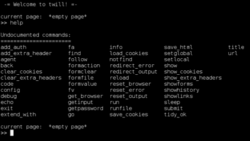
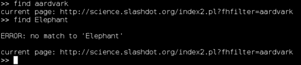
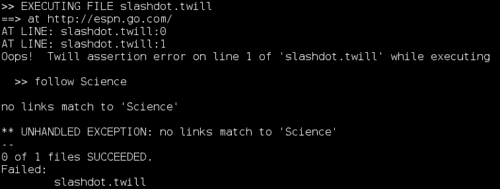
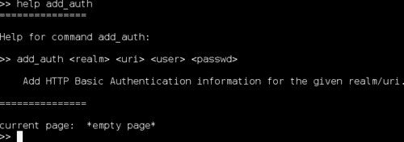
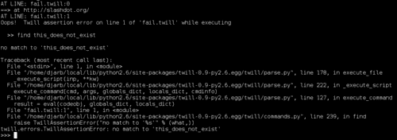

# 第八章。使用 Twill 测试 Web 应用程序前端

*我们还没有讨论过测试用户界面。主要是因为图形用户界面不太适合通过自动化测试工具进行检查（向系统输入输入可能很困难，而且很难解开所有涉及的单元）。然而，Web 应用程序是这一规则的例外，并且它们的重要性一直在增加。*

在本章中，我们将：

+   学习如何使用 Twill 编写与网站交互的脚本

+   学习如何在测试框架内部运行 Twill 脚本

+   学习如何将 Twill 操作直接集成到 unittest 测试中

所以，让我们开始吧！

# 安装 Twill

您可以在 Python 包索引中找到 Twill，网址为 [`pypi.python.org/pypi/twill/`](http://pypi.python.org/pypi/twill/)。在撰写本文时，最新版本可以直接从 [`darcs.idyll.org/~t/projects/twill-0.9.tar.gz`](http://darcs.idyll.org/~t/projects/twill-0.9.tar.gz) 下载。

### 注意

Windows 用户需要使用一个理解 Tar 和 GZip 格式的存档程序，例如 7-Zip ([`www.7-zip.org/`](http://www.7-zip.org/)) 来提取文件。

一旦解压了文件，您可以通过打开命令提示符，切换到 `twill-0.9` 目录，并运行以下命令来安装它们：

```py
$ python setup.py install

```

或者，如果您无法写入 Python 的 `site-packages` 目录，

```py
$ python setup.py install --user

```

### 注意

如果您使用的是低于 2.6 版本的 Python，您将无法执行 `--user` 安装，这意味着您需要具有对 Python 安装 `site-packages` 目录的写入权限。

# 探索 Twill 语言

现在您已经安装了 Twill，您可以打开一个允许您交互式探索其语言和功能的 shell 程序。我们在这里将介绍其中一些最有用的功能。

# 是时候使用 Twill 浏览网页了

我们将使用 Twill 的交互式解释器来试用 Twill。

1.  启动交互式 Twill 解释器：

    ```py
    $ twill-sh

    ```

    ### 注意

    当您启动 Twill 时，您可能会注意到关于已弃用的 `md5` 模块的几个警告。您可以安全地忽略它们。

1.  获取 Twill 命令列表。您可以在提示符下输入 `help <command>` 来获取有关特定命令的更多信息。

    ```py
    >> help

    ```

    

1.  告诉 Twill 去访问一个网站。尽管在这个例子中使用了 `slashdot.org`，但鼓励读者尝试其他网站。

    ```py
    >> go http://slashdot.org/

    ```

    Twill 将会打印出几行信息，表明它现在正在浏览 [`slashdot.org/`](http://slashdot.org/)。

1.  检查 Web 服务器是否返回了 '无错误' 状态码（也就是说，`code 200`）。我们同样可以检查其他状态码——例如，确保我们的界面在请求执行无效操作时返回错误。

    ```py
    >> code 200

    ```

1.  跟随一个链接，通过提供正则表达式来指定。如果你不熟悉正则表达式——甚至如果你熟悉——通常只需指定足够的链接文本来识别你想要跟随的那个链接就足够了。在跟随链接后，再次检查代码以确保它已成功执行。

    ```py

    >> follow Science
    >> code 200

    ```

1.  填写一个表单字段。这将第二个表单的第一个字段填入单词 **monkey**。在撰写本文时，第二个表单是一个搜索表单，第一个字段是搜索框。如果页面布局发生变化，这个例子可能就不再正确了。

    ```py
    >> formvalue 2 1 "monkey"

    ```

1.  我们还可以通过名称（如果它们有名称）来引用表单和表单字段。这里使用的特定表单没有名称，但字段有。以下设置与第 6 步中的命令相同的字段值，这次设置为 **aardvark**。

    ```py
    >> formvalue 2 fhfilter "aardvark"

    ```

1.  现在，我们可以提交表单。这将 Twill 移动到新的工作 URL，并向服务器发送信息。

    ```py
    >> submit

    ```

1.  再次强调，我们想确保服务器返回了预期的代码。

    ```py
    >> code 200

    ```

1.  页面是否包含我们预期的内容？我们可以使用 `find` 命令来检查。在这种情况下，我们将检查两件事。第一是单词 **aardvark** 是否出现在结果页面的代码中。根据目前 [slashdot.org](http://slashdot.org) 上的系统，我们可以预期它会。第二个检查，对于单词 **Elephant**，很可能会失败。

    ```py

    >> find aardvark
    >> find Elephant

    ```

    

## *刚才发生了什么？*

我们使用 Twill 浏览到 [slashdot.org](http://slashdot.org)，进入 **科学** 部分，搜索 **aardvark**，然后检查结果页面是否包含单词 **aardvark** 和 **Elephant**。这有什么用？

我们不仅限于在 [slashdot.org](http://slashdot.org) 上胡闹。我们可以使用 Twill 语言来描述浏览器和网站之间的任何交互。这意味着，我们可以用它来描述我们自己的网络应用程序的预期行为。如果我们能描述预期行为，我们就可以编写测试。

虽然能够将命令存储在文件中会很好，这样我们就可以自动化测试。像任何好的解释器一样，Twill 会允许我们这样做。

# 行动时间 – Twill 脚本

我们将编写一个 Twill 脚本，检查网站是否遵循与我们用于与 [slashdot.org](http://slashdot.org) 交互相同的接口，然后将其应用于几个不同的网站以查看会发生什么。

1.  创建一个名为 `slashdot.twill` 的文件，包含以下代码：

    ```py
    code 200
    follow Science
    code 200
    formvalue 2 fhfilter "aardvark"
    submit
    code 200
    find aardvark
    ```

1.  现在，我们将在 [`slashdot.org/`](http://slashdot.org/) 上运行该脚本，看看它是否工作。

    ```py
    $ twill-sh -u http://slashdot.org/ slashdot.twill

    ```

    

1.  好吧，这工作得很好。那么，让我们看看 `espn.com` 是否与 `slashdot.org` 以相同的方式工作。

    ```py
    $ 

    twill-sh -u http://espn.com/ slashdot.twill

    ```

    

## *刚才发生了什么？*

通过将 Twill 命令存储在文件中，我们能够将其作为自动化测试运行。这无疑是测试我们的基于 Web 的应用程序的一大进步。

我们传递给`twill-sh`的`-u`命令行选项非常有用：它具有与文件开头`go`命令相同的效果，但当然我们可以在每次运行脚本时更改它。如果你不确定你的 Web 应用程序的基础 URL 将是什么，这尤其有帮助。

## Twill 命令

Twill 有许多命令，到目前为止我们只介绍了一些。在本节中，你将找到对 Twill 每个命令的简要讨论。

### help

`help`命令会打印出 Twill 的所有命令列表，或者告诉你特定命令的详细信息。例如，要获取`add_auth`命令的详细信息，你应该输入：

```py
>> help add_auth

```



### 提示

如果你想了解其他任何命令的详细语法，请使用`help`命令来获取这些信息。

### setglobal

`setglobal`命令为变量名分配一个值。然后这些变量名可以用作后续命令的参数。因此，如果你告诉 Twill：

```py
>> setglobal target http://www.example.org/ 

```

Twill 会将全局变量 target 设置为`http://www.example.org/`的值。然后你就可以说：

```py
>> go target

```

告诉 Twill 转到`http://www.example.org/`。

变量值也可以通过将变量名用`${`和`}`包围插入到文本字符串中，如下所示：

```py
>> go "${target}/example.html"

```

告诉 Twill 转到`http://www.example.org/example.html`。

### setlocal

`setlocal`命令的行为通常与`setglobal`命令类似，但有一个显著的区别；使用`setlocal`绑定的变量仅在 Twill 执行与它们绑定的相同脚本文件（或技术上，交互式会话）时存在。一旦 Twill 切换到新的脚本，局部变量就会被遗忘，直到执行返回到原始脚本。

### add_auth

`add_auth`命令允许你通过 HTTP 的基本认证方案登录受保护的网站。该命令接受四个参数，顺序如下：`realm`、`URI`、`username`和`password`。用户名和密码是用户为了获得对网站的访问权限而输入的。URI 是你想要应用认证的所有 Web 地址的前缀：如果你传递`http://example.com/`作为 URI，用户名和密码可能被用来登录`example.com`上的任何页面。领域是服务器选择的一个任意文本字符串，它必须包含在任何授权中。如果你正在测试自己的 Web 应用程序，你应该已经知道它是什麼。

### 注意

你可以在[`tools.ietf.org/html/rfc2617#section-2`](http://tools.ietf.org/html/rfc2617#section-2)找到有关 HTTP 基本认证的所有信息。

因此，要登录到 example.com 上的示例领域，用户名为`testuser`，密码为`12345`，你会使用以下命令：

```py
>> add_auth example http://example.com/ testuser 12345

```

### add_extra_header

通过使用`add_extra_header`，你可以将任何任意 HTTP 头部包含到 Twill 后续发出的所有请求中。该命令接受两个参数：要添加的头部字段名称和分配给头部字段的值。

你需要记住，HTTP 允许在同一个请求中存在相同的头部多次，并且每次有不同的值。如果你告诉 Twill

```py
>> add_extra_header moose 12
>> add_extra_header moose 15

```

那么每个请求中都会发送两个'moose'头部，具有不同的值。

### clear_extra_headers

`clear_extra_headers`命令从未来的请求中删除之前定义的所有额外头部。删除的头部可以在以后重新添加。

### show_extra_headers

`show_extra_headers`命令打印出所有当前添加的额外头部及其值。

### agent

你可以使用`agent`命令使 Twill 伪装成不同的网页浏览器。你可以使用任何用户代理字符串作为参数。在撰写本文时，[`user-agent-string.info/`](http://user-agent-string.info/)是一个有用的资源，可以找到网页浏览器使用的用户代理字符串。

### back

`back`命令的工作方式与网页浏览器上的后退按钮相同，它会返回到 Twill 历史记录中最新的 URL。

### clear_cookies

`clear_cookies`命令会导致 Twill 忘记其当前存储的所有 cookies。

### code

`code`命令检查上一个导航命令的 HTTP 响应代码是否是预期的值。表示“成功”的值是`200`。`404`表示页面未找到，`401`表示在浏览页面之前需要登录，`301`和`302`是重定向，等等。

### 注意

你可以在[`tools.ietf.org/html/rfc2616#section-6.1.1.`](http://tools.ietf.org/html/rfc2616#section-6.1.1.)找到官方 HTTP 响应代码的完整列表。

### config

`config`命令允许你修改 Twill 解释器的行为。它接受配置参数名称和整数值作为参数，Twill 根据配置变量的值修改其行为。

要获取当前配置变量的完整列表，请输入：

```py

>> help config

```

### debug

`debug`命令会导致 Twill 在操作时输出跟踪信息。在撰写本文时，有三种不同的调试跟踪可用：HTTP、命令和 HTTP-EQUIV 刷新标签的处理。

如果你告诉 Twill：

```py
>> debug http 1

```

当 Twill 执行 HTTP 操作时，你会看到请求和响应行以及随响应返回的 HTTP 头部字段。

`debug commands 1`命令在直接与 Twill 解释器交互时没有用，但如果你将其放在 Twill 脚本中，它将导致 Twill 在执行每个命令时打印出来，这样你就可以看到脚本在做什么。

如果你告诉 Twill：

```py
>> debug equiv-refresh 1

```

当它遇到带有`<META HTTP-EQUIV="refresh"...>`标签的页面时，它将打印出额外信息。

### echo

`echo` 命令在你想要你的 Twill 脚本输出信息，但又觉得任何 `debug` 子命令都没有真正达到你的目的时很有用。你传递给 `echo` 的任何参数都会打印到屏幕上。

### exit

`exit` 命令会导致 Twill 解释器终止。它接受一个错误代码——它只是一个整数，通常将 0 解释为 '无错误'——作为可选参数。即使你向 `exit` 传递非零值，Twill 也会在所有它运行的命令执行正确后打印出脚本成功，包括 `exit`。错误代码仅在执行 Twill 的程序使用它时才有意义，所以在许多情况下它将被完全忽略。

### extend_with

`extend_with` 命令是自定义 Twill 解释器的一种机制。它导入一个 Python 模块，并将其中任何函数添加为新的 Twill 命令。

### find

`find` 命令在当前页面中搜索与正则表达式匹配的文本。Python 的正则表达式语法在在线文档 [`docs.python.org/library/re.html#regular-expression-syntax`](http://docs.python.org/library/re.html#regular-expression-syntax) 中描述，但就我们的目的而言，只需知道如果你输入一个单词，`find` 将会查找它。

`find` 命令还接受一个可选的第二个参数。该参数是一个表示控制搜索如何执行的选项的文本字符串。如果字符串包含字母 `i`，则搜索是不区分大小写的，这意味着大写和小写字母可以相互匹配。字母 `m` 和 `s` 分别表示使用 'MULTILINE' 和 'DOTALL' 模式。这些模式在上面的文档中有描述。

`find` 命令还将匹配的文本绑定到局部变量名 `__match__`，这样你就可以在后续命令中引用它，就像它已经被 `setlocal` 设置过一样。

### notfind

`notfind` 命令与 `find` 命令类似，但如果有正则表达式的匹配项，它会失败。如果没有找到匹配项，它会成功。

### follow

`follow` 命令在当前页面中搜索与正则表达式匹配的链接，并转到链接地址。使用 `follow` 就像在普通网页浏览器中点击链接一样。

与 `find` 命令不同，`follow` 命令不接受正则表达式标志，也不绑定 `__match__` 名称。它只是跟随超链接指向的地方。

### formaction

`formaction` 命令允许你更改表单提交的地址。它接受两个参数：你想要更改的表单的标识符，以及你想要表单提交到的 URL。

例如，以下 HTML 会生成一个表单，该表单将被提交到当前 URL，因为当 `form` 标签中省略了 `action` 属性时，这是默认行为：

```py
<form name="form1" method="post">
```

执行此 `formaction` 命令后，

```py
>> formaction form1 http://example.com/viewer 

```

就好像表单已经被写入：

```py
<form name="form1" method="post" action="http://example.com/viewer">
```

### formclear

`formclear` 命令将表单重置为其初始状态，这意味着其他命令输入的数据将被遗忘。

### formfile

`formfile` 命令为 `<input type="file">` 表单字段填充值。它有三个必需的参数：表单的名称或编号、字段的名称或编号以及文件的文件名。可选地，可以添加第四个参数，指定文件的 mime 内容类型。

### form value

`formvalue` 命令为 HTML 表单字段填充值。它接受三个参数：表单的名称或编号、字段的名称或编号以及要分配的值。我们在上面的示例 Twill 脚本中使用了 `formvalue`。

### getinput

`getinput` 命令允许 Twill 脚本具有交互性。该命令接受一个参数，即将在用户界面显示的提示。在打印提示后，Twill 等待用户输入一些内容并按回车键，之后用户输入的内容将被存储在名为 `__input__` 的本地变量中。

### getpassword

`getpassword` 命令的工作方式与 `getinput` 类似。不同之处在于 `getpassword` 不会显示用户输入的文本，并且输入的文本在输入后绑定到本地变量名称 `__password__`。

### go

`go` 命令指示 Twill 前往新的 URL 并加载该地址的页面。与 `follow` 不同，`go` 不关心当前页面上的链接。使用 `go` 就像在普通网络浏览器的地址栏中输入地址一样。

### info

`info` 命令打印 Twill 当前浏览的页面的一些一般信息。这些信息包括 URL、HTTP 状态码、页面的 MIME 内容类型、标题以及页面上的表单数量。

### save_cookies

`save_cookies` 命令保存 Twill 当前知道的任何 cookies 的副本。这些 cookies 可以稍后重新加载。该命令接受一个参数：存储 cookies 的文件名。

### load_cookies

`load_cookies` 命令用文件中存储的 cookies 替换 Twill 当前知道的任何 cookies。它接受一个参数：要加载的 cookie 文件名。

### show_cookies

`show_cookies` 命令将打印出 Twill 当前知道的任何 cookies。

### redirect_error

`redirect_error` 命令会导致 Twill 的所有错误消息被存储在文件中，而不是打印到屏幕上。它接受一个参数，表示存储错误的文件名。

### redirect_output

`redirect_output` 命令会导致 Twill 将所有正常输出保存到文件中，而不是打印到屏幕上。它接受一个参数，表示存储输出的文件名。

这不是一个在交互式 Twill 壳中非常有用的命令。它在脚本和测试中可能很有用。

### reset_error

`reset_error` 命令撤销 `redirect_error` 的效果。

### reset_output

`reset_output` 命令撤销 `redirect_output` 的效果。

### reload

`reload` 命令重新加载当前 URL，就像正常网络浏览器中的重新加载或刷新按钮一样。

### reset_browser

`reset_browser` 命令销毁与当前 Twill 会话相关的所有状态信息。它具有停止 Twill 然后再次启动的效果。

### run

`run` 命令执行任意的 Python 语句。唯一的参数是要执行的 Python 语句。如果语句包含空格，则必须将其放在引号内，这样 Twill 就不会将其误认为是多个参数。

### runfile

`runfile` 命令执行存储在单独文件中的 Twill 脚本。执行后的脚本将有自己的局部命名空间（参看 `setlocal` 命令），并且将与全局命名空间共享（参看 `setglobal`）

### save_html

`save_html` 命令将当前页面的 HTML 内容保存到文件中。它接受一个可选参数，指定要保存的文件名。如果没有指定文件名，Twill 将根据要保存的数据的 URL 自行选择。

### show

`show` 命令打印出当前页面的 HTML 内容。在交互式会话中，这可以用来了解 Twill 看到了什么，偶尔在测试脚本中也有用，如果您想确保页面具有精确指定的内容。

### showforms

`showforms` 命令会打印出当前页面中所有表单的列表。每个表单都有一个包含表单编号（以及如果有名称则还包括名称）的打印输出，以及每个字段的编号、名称、类型、id 和当前值。

### showhistory

`showhistory` 命令按顺序从最老到最新打印出当前 Twill 会话中访问过的所有 URL。

### showlinks

`showlinks` 命令会打印出当前页面中的链接列表（可能相当长）。这有助于确定需要输入到 `follow` 命令中的内容，或者只是用于一般的调试。

### sleep

`sleep` 命令可以在 Twill 脚本的执行中注入暂停。它接受一个可选参数，指定在继续执行脚本之前暂停的秒数。如果没有指定时间，则默认为 一秒。

### submit

`submit` 命令提交由 `formvalue` 命令最近更改的字段的表单。它接受一个可选参数，指定要使用的 `submit` 按钮，其指定方式与为 `formvalue` 命令指定的字段相同。如果没有指定 `submit` 按钮，则使用表单中的第一个。

### tidy_ok

如果您已安装 HTML Tidy ([`tidy.sourceforge.net/`](http://tidy.sourceforge.net/))，则 `tidy_ok` 命令将使用它来检查当前页面的代码是否正确。如果您在脚本中放置 `tidy_ok` 并当前页面不符合 Tidy 的正确性标准，则脚本将被视为失败。

### title

`title` 命令接受一个正则表达式作为其唯一参数，并尝试将当前页面的标题与正则表达式匹配。如果它们不匹配，`title` 命令将失败。在脚本文件中使用时，如果标题不匹配，这将导致整个脚本被视为失败。

### url

`url` 命令接受一个正则表达式作为其唯一参数，并尝试将当前页面的 URL 与正则表达式匹配。如果它们不匹配，`url` 命令将失败，并导致它所属的脚本失败。如果正则表达式与 URL 匹配，局部变量 `__match__` 将绑定到匹配的 URL 部分。

## 快速问答 – Twill 语言

1.  当你使用 `submit` 命令时，会提交哪种表单？

1.  你会用哪个命令来检查错误消息是否在页面上？

1.  当你执行 Twill 脚本且命令失败时，会发生什么？

## 尝试一下英雄 – 使用 Twill 浏览网页

打开一个 Twill 交互式壳，使用它来搜索 Google，跟随搜索结果中的一个链接，并在链接的网站上导航。当你这样做的时候，尽量尝试使用尽可能多的 Twill 命令来获得一些实际操作经验。

# 从测试中调用 Twill 脚本

虽然 `twill-sh` 能够执行多个 Twill 脚本作为自动化测试的一种形式是件好事，但我们更希望能够在我们的正常测试套件中运行 Twill 脚本。幸运的是，这样做相当简单。有两种很好的方法可以从 Python 代码中运行 Twill 脚本，你可以选择更适合你需求的一种。

# 执行 Twill 脚本文件的时间 – 运行 Twill 脚本文件

第一种方法是将 Twill 脚本存储在单独的文件中，然后使用 `twill.parse.execute_file` 函数来运行它。

1.  将以下代码放入一个名为 `fail.twill` 的文件中：

    ```py
    go http://slashdot.org/
    find this_does_not_exist
    ```

1.  自然，这个脚本会失败，但请用 `twill-sh` 运行它，亲自看看。

    ```py
    $ twill-sh fail.twill

    ```

1.  现在从 Python 运行脚本。打开一个交互式 Python 壳，执行以下操作：

    ```py
    >>> from twill.parse import execute_file
    >>> execute_file('fail.twill')

    ```

    

1.  简单到这种程度，我们从 Python 代码内部运行了脚本。这在 doctest、unittest 或 nose 特定的测试代码中同样有效。

1.  注意，Twill 壳会报告为错误的，execute_file 会报告为 `twill.errors.TwillAssertionError` 异常。这很好地与之前讨论过的自动化测试工具集成在一起。

## *刚才发生了什么？*

只用几行代码，我们就执行了一个存储在单独文件中的 Twill 脚本，并接收到了它遇到的任何错误作为 Python 异常。这对于你有一个现有的 Twill 脚本，只想让它与你的测试套件一起运行的情况非常理想。如果你想要自动生成 Twill 脚本，或者你只是想将不同的语言保存在不同的文件中，这也非常方便。

# 执行 Twill 脚本字符串的时间

从 Python 代码内部运行 Twill 脚本的第二种方式是将脚本存储在字符串中。

1.  打开一个交互式 Python 解释器，并输入以下命令：

    ```py
    >>> from twill.parse import execute_string
    >>> execute_string("""
    ... go http://slashdot.org/
    ... find this_does_not_exist
    ... """, no_reset = False)

    ```

1.  结果将与执行包含这些命令的文件相同。

    ### 注意

    注意我们传递给 `execute_string` 的 `no_reset = False` 参数。我们需要它，因为如果我们省略它，Twill 将假设我们所有的 `execute_string` 调用都应该执行，就像它们都是同一个浏览器会话的一部分一样。我们不想这样，因为我们希望我们的测试彼此分离。`execute_file` 将做出相反的假设，因此我们不需要传递 `no_reset` 参数（尽管我们可以）。

## *发生了什么？*

这次，脚本被直接嵌入到 Python 代码中作为一个字符串常量。当 Twill 脚本被视为编写测试部分的一种方式，而不是一个独立的事物时，这是所希望的。

## 一个巧妙的技巧

如果你正在使用 Python 2.4 或更高版本，你可以定义一个函数装饰器，这使得将 Twill 测试编写为 Python 函数变得简单。

```py
from twill.parse import execute_string
from twill.errors import TwillAssertionError

def twill_test(func):
    def run_test(*args):
        try:
            execute_string(func.__doc__, no_reset = False)
        except TwillAssertionError, err:
            if args and hasattr(args[0], 'fail'):
                args[0].fail(str(err))
            else:
                raise
    return run_test
```

如果你将这段代码放入一个 Python 模块（这里称为 `twill_decorator`）中，然后导入 `twill_test` 到你的测试代码中，你可以这样编写 Twill 测试：

```py
from unittest import TestCase
from twill_decorator import twill_test

class web_tests(TestCase):
    @twill_test
    def test_slashdot(self):
        """
        go http://slashdot.org/ 
        find this_does_not_exist
        """
```

当你使用 Nose 或 unittest 运行该测试模块时，`test_slashdot` 函数将自动执行其文档字符串中的 Twill 脚本，并将任何错误报告为测试失败。你不需要记住传递 `no_reset = False` 或运行 Twill 从字符串的任何其他细节。

# 将 Twill 操作集成到 unittest 测试中

到目前为止，我们的单元测试将每个 Twill 脚本视为一个产生成功或失败的单个操作。如果我们想下载一个 HTML 页面，对其内容与数据库之间的关系进行一些断言，然后跟随链接到另一个页面，会怎样呢？

我们可以通过直接从测试代码中访问 Twill 的浏览器对象来做这样的事情。浏览器对象具有类似于 Twill 语言命令的方法，所以这应该看起来相当熟悉。

# 行动时间 - 使用 Twill 的浏览器对象

在这里，我们看到如何直接访问浏览器对象，并使用它来与网络交互。

1.  将以下代码放入一个 Python 测试模块中：

    ```py
    from unittest import TestCase
    import twill

    class test_twill_browser(TestCase):
        def test_slashdot(self):
            browser = twill.get_browser()

            browser.go('http://slashdot.org/')
            self.assertTrue(browser.get_code() in (200, 201))

            html = browser.get_html()
            self.assertTrue(html.count('slashdot') > 150)

            link = browser.find_link('Science')
            browser.follow_link(link)

            form = browser.get_form(2)
            form.set_value('aardvark', name = 'fhfilter')
            browser.clicked(form, None)
            browser.submit()
            self.assertEqual(browser.get_code(), 200)
    ```

1.  使用 `nosetests` 运行测试模块。如果 Slashdot 自从本文编写以来没有更改其界面，那么测试将通过。如果他们已经更改，测试可能会失败。

## *发生了什么？*

我们不是使用 Twill 语言来描述与网站的交互，而是将 Twill 作为我们可以从测试代码中调用的库。这允许我们将 Twill 操作与 unittest 断言交织在一起。我们还可以包括任何其他我们需要的操作。使用这种技术，我们的测试可以将网络视为它们可以访问的更多数据源之一。

重要的是要注意 Twill 语言和浏览器对象上可用的方法之间的差异。例如，Twill 语言有一个`show`命令，用于打印当前页面的 HTML，而浏览器有一个`get_html`方法，用于返回当前页面的 HTML。

在测试的最后，特别关注与表单的交互。这些交互使用表单对象，可以通过调用浏览器对象的`get_form`方法来检索。

表单对象的`set_value`方法接受控制的新值作为第一个参数，然后有多个关键字参数可以用来指定哪个控件应该采用该值。其中最有用的参数是`name`，如上所述，以及`nr`，它通过数字选择控件。

为了使`submit`方法工作，它应该由一个调用`clicked`方法的目标表单控件（无论哪个）的方法来 precede。

## 浏览器方法

使用`twill.get_browser()`获取的浏览器对象具有以下有用的方法：

+   `go`

+   `reload`

+   `back`

+   `get_code`

+   `get_html`

+   `get_title`

+   `get_url`

+   `find_link`

+   `follow_link`

+   `set_agent_string`

+   `get_all_forms`

+   `get_form`

+   `get_form_field`

+   `clicked`

+   `submit`

+   `save_cookies`

+   `load_cookies`

+   `clear_cookies`

许多这些方法与相关的 Twill 命令工作方式相同，除了你将参数作为字符串传递给方法调用[例如`browser.save_cookies('cookies.txt')`]。尽管如此，有一些方法的行为不同，或者没有 Twill 语言的等效项，所以我们现在将更详细地介绍这些方法：

### get_code

`get_code`方法返回当前页面的 HTTP 代码。它不会在代码和预期值之间进行任何比较。如果你想如果代码不是`200`就抛出异常，你需要自己来做。

### get_html

`get_html`方法返回当前页面的 HTML 作为 Python 字符串。

### get_title

`get_title`方法返回当前页面的标题作为 Python 字符串。

### get_url

`get_url`方法返回当前页面的 URL 作为 Python 字符串。

### find_link

`find_link`方法搜索一个 URL、文本或名称与传入的参数匹配的链接。如果找到这样的链接，它将返回表示该链接的对象。如果没有这样的链接，`find_link`返回`None`。

链接对象具有许多有用的属性。如果你有一个名为`link`的链接对象，那么`link.attrs`是一个包含`(name, value)`元组的列表，`link.text`是出现在`<a>`和`</a>`标签之间的文本，而`link.absolute_url`是链接指向的地址。

### follow_link

`follow_link`方法接受一个链接对象作为参数，并跳转到链接表示的地址。如果你有一个字符串形式的 URL 而不是链接对象，你应该使用`go`方法。

### get_all_forms

`get_all_forms` 方法返回一个表示页面中所有表单的表单对象列表。如果页面上有不在 `<form>` 标签内的表单控件，将创建一个特殊的表单对象来包含它们，并且将成为列表的第一个元素。

### get_form

`get_form` 方法接受一个正则表达式作为参数，并搜索一个其 id、name 或编号匹配的表单。如果找到这样的表单，它将返回一个表示该表单的表单对象。

表单对象有几个有用的属性。如果你有一个名为 `form` 的表单对象，那么 `form.name` 是表单的名称（如果有），`form.method` 是表单的方法（通常是 'GET' 或 'POST'），`form.action` 是表单应该提交到的 URL，`form.enctype` 是编码表单用于传输的内容类型，而 `form.attrs` 是应用于表单的属性字典。

表单对象还有帮助您操作其内容的方法。其中最值得注意的是 `form.get_value`、`form.set_value`、`form.clear`、`form.clear_all` 和 `form.add_file`。除了 `clear_all` 之外的所有这些方法都针对表单中的特定控件。您可以通过向方法传递一个或多个以下关键字参数来指定要针对哪个控件：`name`、`type`、`kind`、`id`、`nr` 和 `label`。`nr` 关键字是 'number' 的简称。如果没有控件匹配所有指定的参数，将引发 `_mechanize_dist.ClientForm.ControlNotFoundError` 异常。

`set_value` 和 `add_file` 方法分别接受一个值或一个文件名作为它们的第一个参数。`get_value` 方法返回所选控件的当前值。`clear` 方法将控件返回到其默认值。

### get_form_field

`get_form_field` 方法接受一个表单对象作为其第一个参数，一个正则表达式作为其第二个参数。如果表单的控件中恰好有一个 id、name 或 index 与正则表达式匹配，则返回表示该控件的对象。

在大多数情况下，这并不是必需的，因为表单对象的方法是更灵活地操作表单控件的方式。它的主要用途是向 `clicked` 方法提供输入。

### clicked

`clicked` 方法存在是为了让浏览器对象了解当前页面的哪个部分是当前焦点。特别是，当调用 `submit` 方法时，它会告诉浏览器应该提交哪个表单。

`clicked` 方法接受两个参数：将成为焦点的表单对象，以及表单中应该注册点击的具体控件。

通常最简单的方法是将 `None` 作为特定控件传递。然而，你也可以传递一个控件对象（由 `get_form_field` 返回）。如果这个控件对象代表一个提交控件，那么该控件将成为提交表单时使用的新默认控件。初始默认值是表单中的第一个提交控件。

### submit

`submit` 方法提交最后点击的表单，按照其 `action` 和 `method` 属性。你可以选择性地传递一个 `fieldname` 参数，表示要使用哪个提交控件进行提交。如果存在，此参数将被传递给 `get_form_field` 以找到适当的提交控件。如果你没有向该方法传递 `fieldname`，则将使用默认的提交控件。

## 突击测验 – 浏览器方法

1.  当你调用 `get_form` 时，如何指示你想要检索哪个表单对象？

1.  `clicked` 方法的作用是什么？

1.  `get_code` 方法与 `code` 命令有何不同？

# 摘要

在本章中，我们学到了很多关于 Twill 的知识，以及如何使用它来编写 Web 应用程序的测试。

具体来说，我们涵盖了：

+   Twill 语言

+   从 Python 测试中调用 Twill 脚本

+   将 Twill 的功能作为库集成到 Python 测试代码中

现在我们已经了解了测试 Web 应用程序，我们可以继续讨论集成测试和系统测试——这是下一章的主题。
