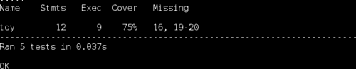
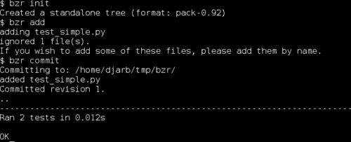
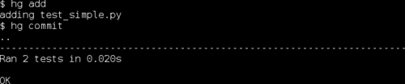
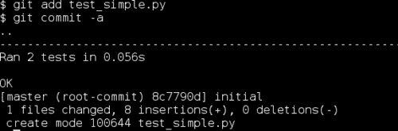
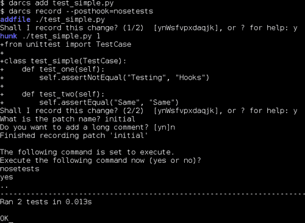
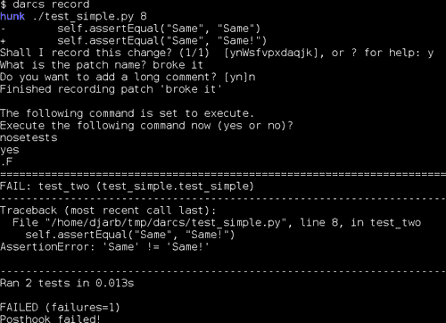
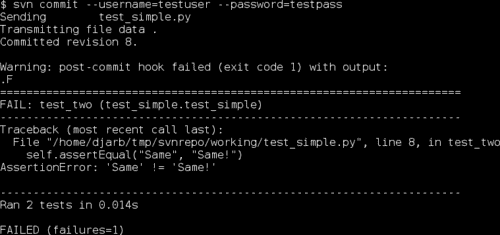
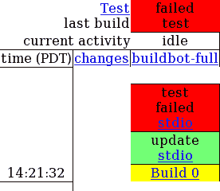

# 第十章。其他测试工具和技术

*我们已经涵盖了 Python 测试的核心元素，但还有一些外围方法和工具可以使你的生活更轻松。在本章中，我们将简要介绍其中的一些。*

在本章中，我们将：

+   讨论代码覆盖率，并了解`coverage.py`

+   讨论持续集成，并了解 buildbot

+   学习如何将自动化测试集成到流行的版本控制系统

所以，让我们继续吧！

# 代码覆盖率

测试告诉你当你测试的代码没有按预期工作时的信息，但它们不会告诉你关于你未测试的代码的任何信息。它们甚至不会告诉你你未测试的代码没有被测试。

代码覆盖率是一种技术，可以用来解决这一不足。代码覆盖率工具在测试运行时进行监控，并跟踪哪些代码行被（和没有被）执行。测试运行完毕后，该工具将给出一份报告，描述你的测试如何覆盖整个代码库。

如你可能已经想到的，希望覆盖率接近 100%。但请注意，不要过于关注覆盖率数字，它可能会有些误导。即使你的测试执行了程序中的每一行代码，它们也可能没有测试到需要测试的所有内容。这意味着你不能将 100%的覆盖率作为测试完整的确定性证据。另一方面，有时某些代码确实不需要被测试覆盖——例如一些调试支持代码——因此低于 100%的覆盖率可能是完全可接受的。

代码覆盖率是一个工具，可以帮助你了解你的测试正在做什么，以及它们可能忽略什么。它并不是良好测试套件的定义。

## coverage.py

我们将使用一个名为`coverage.py`的模块，这并不令人惊讶，它是一个 Python 的代码覆盖率工具。

由于`coverage.py`不是 Python 内置的，我们需要下载并安装它。你可以从 Python 包索引[`pypi.python.org/pypi/coverage`](http://pypi.python.org/pypi/coverage)下载最新版本。与之前一样，Python 2.6 或更高版本的用户可以通过解压存档、切换到目录并键入以下命令来安装该包：

```py
$ python setup.py install --user 

```

### 注意

Python 旧版本的用户需要具有对系统级`site-packages`目录的写入权限，这是 Python 安装的一部分。任何拥有此类权限的人都可以通过键入以下命令来安装 coverage：

`$ python setup.py install`

在撰写本文时，Windows 用户还可以从 Python 包索引下载 Windows 安装程序文件，并运行它来安装`coverage.py`。

我们将在这里介绍使用`coverage.py`的步骤，但如果你需要更多信息，可以在`coverage.py`的主页[`nedbatchelder.com/code/coverage/`](http://nedbatchelder.com/code/coverage/)上找到。

# 是时候使用 coverage.py 了

我们将创建一个包含测试的`toy`代码模块，然后应用`coverage.py`来找出测试实际上使用了多少代码。

1.  将以下测试代码放入`test_toy.py`。这些测试有几个问题，我们稍后会讨论，但它们应该能运行。

    ```py
    from unittest import TestCase
    import toy

    class test_global_function(TestCase):
        def test_positive(self):
            self.assertEqual(toy.global_function(3), 4)

        def test_negative(self):
            self.assertEqual(toy.global_function(-3), -2)

        def test_large(self):
            self.assertEqual(toy.global_function(2**13), 2**13 + 1)

    class test_example_class(TestCase):
        def test_timestwo(self):
            example = toy.example_class(5)
            self.assertEqual(example.timestwo(), 10)

        def test_repr(self):
            example = toy.example_class(7)
            self.assertEqual(repr(example), '<example param="7">')
    ```

1.  将以下代码放入`toy.py`。注意底部的`if __name__ == '__main__'`子句。我们已经有一段时间没有处理这样的子句了，所以我将提醒你，如果我们用`python toy.py`运行模块，该块内的代码将运行 doctest。

    ```py
    def global_function(x):
        r"""
        >>> global_function(5)
        6
        """
        return x + 1

    class example_class:
        def __init__(self, param):
            self.param = param

        def timestwo(self):
            return self.param * 2

        def __repr__(self):
            return '<example param="%s">' % self.param
    if __name__ == '__main__':
        import doctest
        doctest.testmod()
    ```

1.  继续运行 Nose。它应该能找到它们，运行它们，并报告一切正常。问题是，有些代码从未被测试过。

1.  让我们再次运行它，但这次我们将告诉 Nose 在运行测试时使用`coverage.py`来测量覆盖率。

    ```py
    $ nosetests --with-coverage --cover-erase 

    ```

    

## *发生了什么？*

在第一步中，我们有两个包含一些非常基础测试的`TestCase`类。这些测试在现实世界中的情况下可能没什么用，但我们只需要它们来展示代码覆盖率工具是如何工作的。

在第二步中，我们有满足第一步测试的代码。就像测试本身一样，这段代码可能没什么用，但它起到了示范的作用。

在第四步中，我们在运行 Nose 时传递了`--with-coverage`和`--cover-erase`作为命令行参数。它们做了什么？好吧，`--with-coverage`相当直接：它告诉 Nose 在测试执行时查找`coverage.py`并使用它。这正是我们想要的。第二个参数`--cover-erase`告诉 Nose 忘记在之前的运行中获取的任何覆盖率信息。默认情况下，覆盖率信息是跨所有`coverage.py`的使用汇总的。这允许你使用不同的测试框架或机制运行一系列测试，然后检查累积覆盖率。然而，你仍然希望在开始这个过程时清除之前测试运行的数据，`--cover-erase`命令行就是告诉 Nose 告诉`coverage.py`你正在重新开始的方法。

覆盖率报告告诉我们，在玩具模块中，9/12（换句话说，75%）的可执行语句在我们的测试中得到了执行，而缺失的行是第 16 行和第 19 到第 20 行。回顾我们的代码，我们看到第 16 行是`__repr__`方法。我们真的应该测试那个，所以覆盖率检查揭示了我们的测试中的一个漏洞，我们应该修复它。第 19 和第 20 行只是运行 doctest 的代码。它们不是我们在正常情况下应该使用的东西，所以我们可以忽略那个覆盖率漏洞。

在大多数情况下，代码覆盖率无法检测测试本身的问题。在上面的测试代码中，对`timestwo`方法的测试违反了单元隔离，调用了`example_class`的两个不同方法。由于其中一个方法是构造函数，这可能是可以接受的，但覆盖率检查器甚至无法看到可能存在问题的迹象。它只看到了更多被覆盖的代码行。这不是问题——这正是覆盖率检查器应该工作的方式——但这是需要记住的。覆盖率是有用的，但高覆盖率并不等于好的测试。

## 快速问答——代码覆盖率

1.  高覆盖率百分比意味着什么？

1.  如果您的老板要求您提供一个测试质量的量化指标，您会使用覆盖率百分比吗？

1.  覆盖率报告中最重要的信息是什么？

## 勇敢的尝试者——检查前面章节的覆盖率

回过头来查看前面章节的代码，并使用代码覆盖率检查应该被测试但未被测试的事情。也尝试在您自己的测试代码上试试。

# 版本控制钩子

大多数版本控制系统都有运行您编写的程序的能力，以响应各种事件，作为定制版本控制系统行为的一种方式。这些程序通常被称为钩子。

### 注意

版本控制系统是跟踪源代码树变更的程序，即使这些变更是由不同的人进行的。从某种意义上说，它们为整个项目提供了一个通用的撤销历史和变更日志，一直追溯到您开始使用版本控制系统的那一刻。它们还使得将不同人完成的工作合并成一个单一、统一实体变得容易得多，并且可以跟踪同一项目的不同版本。

通过安装正确的钩子程序，您可以做各种事情，但我们将只关注一种用途。我们可以让版本控制系统在将代码的新版本提交到版本控制存储库时自动运行我们的测试。

这是一个相当巧妙的技巧，因为它使得测试破坏性错误在不知不觉中进入存储库变得困难。虽然它与代码覆盖率类似，但如果它变成政策问题而不是仅仅作为一个使您生活更轻松的工具，那么就存在潜在的问题。

在大多数系统中，你可以编写钩子，使得无法提交破坏测试的代码。这听起来可能是个好主意，但实际上并不是。其中一个原因是，版本控制系统的主要目的之一是开发者之间的沟通，而干扰这一点在长期来看往往是不 productive 的。另一个原因是，它阻止任何人提交问题的部分解决方案，这意味着事情往往会以大块的形式被提交到仓库中。大提交是一个问题，因为它们使得跟踪发生了什么变得困难，这增加了混乱。有更好的方法来确保你总是有一个工作代码库保存在某个地方，比如版本控制分支。

## Bazaar

Bazaar 是一个分布式版本控制系统，这意味着它能够在没有中央服务器或源代码主副本的情况下运行。Bazaar 分布式特性的一个后果是，每个用户都有自己的钩子集，可以在不涉及任何其他人的情况下添加、修改或删除。Bazaar 可在互联网上找到，网址为 [`bazaar-vcs.org/`](http://bazaar-vcs.org/)。

如果你还没有安装 Bazaar，并且不打算使用它，你可以跳过这一部分。

# 行动时间 - 安装 Nose 作为 Bazaar 的后提交钩子

1.  Bazaar 钩子放在你的 `plugins` 目录中。在类 Unix 系统上，这是 `~/.bazaar/plugins/`，而在 Windows 上是 `C:\Documents and Settings\<username>\Application Data\Bazaar\<version>\plugins\`。在任一情况下，你可能需要创建 `plugins` 子目录，如果它尚未存在的话。

1.  将以下代码放入 `plugins` 目录下的一个名为 `run_nose.py` 的文件中。Bazaar 钩子是用 Python 编写的：

    ```py
    from bzrlib import branch
    from os.path import join, sep
    from os import chdir
    from subprocess import call

    def run_nose(local, master, old_num, old_id, new_num, new_id):
        try:
            base = local.base
        except AttributeError:
            base = master.base

        if not base.startswith('file://'):
            return
        try:
            chdir(join(sep, *base[7:].split('/')))
        except OSError:
            return

        call(['nosetests'])

    branch.Branch.hooks.install_named_hook('post_commit',
                                           run_nose,
                                           'Runs Nose after eachcommit')
    ```

1.  在你的工作文件中创建一个新的目录，并将以下代码放入该目录下，文件名为 `test_simple.py`。这些简单的（而且有些愚蠢的）测试只是为了给 Nose 些事情做，这样我们就可以看到钩子是否在正常工作。

    ```py
    from unittest import TestCase

    class test_simple(TestCase):
        def test_one(self):
            self.assertNotEqual("Testing", "Hooks")

        def test_two(self):
            self.assertEqual("Same", "Same")
    ```

1.  仍然在 `test_simple.py` 所在的目录下，运行以下命令以创建一个新的仓库并将测试提交到其中。你看到的输出可能细节上有所不同，但总体上应该是相当相似的。

    ```py
    $ bzr init
    $ bzr add
    $ bzr commit

    ```

    

1.  注意，在提交通知之后会有一个 Nose 测试报告。从现在开始，每次你向 Bazaar 仓库提交时，Nose 都会搜索并运行该仓库内能找到的任何测试。

## *刚才发生了什么？*

Bazaar 的钩子是用 Python 编写的，因此我们编写了一个名为 `run_nose` 的函数作为钩子。我们的 `run_nose` 函数会检查我们正在工作的仓库是否是本地的，然后它会切换到仓库目录并运行 nose。我们通过调用 `branch.Branch.hooks.install_named_hook` 将 `run_nose` 注册为一个钩子。

## Mercurial

类似于 Bazaar，Mercurial 也是一个分布式版本控制系统，其钩子由每个用户单独管理。然而，Mercurial 的钩子本身采取了相当不同的形式。你可以在网上找到 Mercurial，网址为 [`www.selenic.com/mercurial/`](http://www.selenic.com/mercurial/).

如果你没有安装 Mercurial，并且不打算使用它，你可以跳过这一部分。

Mercurial 钩子可以放在几个不同的地方。最有用的是你的个人配置文件和你的存储库配置文件。

你的个人配置文件在类 Unix 系统上是 `~/.hgrc`，在基于 Windows 的系统上是 `%USERPROFILE%\Mercurial.ini`（通常意味着 `c:\Documents and Settings\<username>\Mercurial.ini`）。

你的存储库配置文件存储在存储库的子目录中，具体为所有系统上的 `.hg/hgrc`。

# 行动时间 - 将 Nose 作为 Mercurial post-commit 钩子安装

1.  我们将使用存储库配置文件来存储钩子，这意味着我们首先要做的是拥有一个可以工作的存储库。在方便的地方创建一个新的目录，并在其中执行以下命令：

    ```py
    $ hg init

    ```

1.  该命令的一个副作用是创建了一个 `.hg` 子目录。切换到该目录，然后创建一个名为 `hgrc` 的文本文件，包含以下文本：

    ```py
    [hooks]
    commit = nosetests
    ```

1.  回到存储库目录（即 `.hg` 目录的父目录），我们需要为 Nose 运行一些测试。创建一个名为 `test_simple.py` 的文件，包含以下（诚然有些愚蠢）的测试：

    ```py
    from unittest import TestCase

    class test_simple(TestCase):
        def test_one(self):
            self.assertNotEqual("Testing", "Hooks")

        def test_two(self):
            self.assertEqual("Same", "Same")
    ```

1.  运行以下命令以添加测试文件并将其提交到存储库：

    ```py

    $ hg add
    $ hg commit

    ```

    

1.  注意到提交触发了测试的运行。由于我们将钩子放入了存储库配置文件，它只会在提交到这个存储库时生效。如果我们将其放入你的个人配置文件，它将在你提交到 *任何* 存储库时被调用。

## *发生了什么？*

Mercurial 的钩子是命令，就像你会在你的操作系统命令壳（在 Windows 上也称为 DOS 提示符）中输入的命令一样。我们只需编辑 Mercurial 的配置文件，并告诉它要运行哪个命令。由于我们希望它在提交时运行我们的 Nose 测试套件，我们将提交钩子设置为 `nosetests`。

## Git

Git 是一个分布式版本控制系统。类似于 Bazaar 和 Mercurial，它允许每个用户控制自己的钩子，而不涉及其他开发者或服务器管理员。

### 注意

Git 钩子存储在存储库的 `.git/hooks/` 子目录中，每个钩子都有自己的文件。

如果你没有安装 Git，并且不打算使用它，你可以跳过这一部分。

# 行动时间 - 将 Nose 作为 Git post-commit 钩子安装

1.  钩子存储在 Git 仓库的子目录中，因此我们首先需要做的事情是初始化一个仓库。为 Git 仓库创建一个新的目录，并在其中执行以下命令：

    ```py
    $ git init

    ```

1.  Git 钩子是可执行程序，因此可以用任何语言编写。要运行 Nose，使用 shell 脚本（在类 Unix 系统中）或批处理文件（在 Windows 中）作为钩子是有意义的。如果你使用的是类 Unix 系统，将以下两行放入`.git/hooks/`子目录中的名为`post-commit`的文件中，然后使用`chmod +x post-commit`命令使其可执行。

    ```py
    #!/bin/sh
    nosetests
    ```

    如果你使用的是 Windows 系统，将以下行放入`.git\hooks\`子目录中名为`post-commit.bat`的文件中。

    ```py
    @echo off
    nosetests
    ```

1.  我们需要在仓库目录中放置一些测试代码（即`.git`目录的父目录），这样 Nose 才有事情可做。将以下（无用的）代码放入一个名为`test_simple.py`的文件中：

    ```py
    from unittest import TestCase

    class test_simple(TestCase):
        def test_one(self):
            self.assertNotEqual("Testing", "Hooks")

        def test_two(self):
            self.assertEqual("Same", "Same")
    ```

1.  运行以下命令将测试文件添加并提交到仓库中：

    ```py
    $ git add test_simple.py
    $ git commit -a

    ```

    

1.  注意，这次提交触发了 Nose 的执行并打印出了测试结果。

    因为每个仓库都有自己的钩子，只有那些特别配置为运行 Nose 的仓库才会这样做。

## *刚才发生了什么？*

Git 通过查找具有特定名称的程序来查找其钩子，因此我们可以用任何编程语言编写我们的钩子，只要我们能给程序正确的名称。然而，我们只想运行`nosetests`命令，因此我们可以使用简单的 shell 脚本或批处理文件。这个简单的程序所做的只是调用`nosetests`程序，然后终止。

## Darcs

Darcs 是一个分布式版本控制系统。每个用户都控制着自己的钩子集。

如果你没有安装 Darcs，并且你也不打算使用它，你可以跳过这一部分。

# 行动时间 – 将 Nose 作为 Darcs 后记录钩子安装

1.  每个本地仓库都有自己的钩子集，因此我们首先需要做的事情是创建一个仓库。创建一个工作目录，并在其中执行以下命令：

    ```py
    $ darcs initialize

    ```

1.  我们需要在仓库目录中放置一些测试代码，这样 Nose 才有事情可做。将以下（无用的）代码放入一个名为`test_simple.py`的文件中。

    ```py
    from unittest import TestCase

    class test_simple(TestCase):
        def test_one(self):
            self.assertNotEqual("Testing", "Hooks")

        def test_two(self):
            self.assertEqual("Same", "Same")
    ```

1.  运行以下命令将测试文件添加到仓库中：

    ```py
    $ darcs add test_simple.py

    ```

1.  Darcs 钩子使用命令行选项进行标识。在这种情况下，我们想在告诉 Darcs 记录更改后运行`nosetests`，所以我们使用以下命令：

    ```py

    $ darcs record --posthook=nosetests

    ```

    

1.  注意，Darcs 在完成记录更改后运行了我们的测试套件，并将结果报告给了我们。

1.  虽然如此，但 Darcs 并没有记住我们想要 `nosetests` 成为记录后的钩子。就它而言，那是一次性的交易。幸运的是，我们可以告诉它不同。在 `_darcs/prefs/` 子目录中创建一个名为 `defaults` 的文件，并将以下文本放入其中：

    ```py
    record posthook nosetests
    ```

1.  现在如果我们更改代码并再次记录，`nosetests` 应该会自动运行，而无需我们特别请求。请对 `test_simple.py` 文件进行以下更改：

    ```py
    from unittest import TestCase

    class test_simple(TestCase):
        def test_one(self):
            self.assertNotEqual("Testing", "Hooks")

        def test_two(self):
            self.assertEqual("Same", "Same!")
    ```

1.  运行以下命令以记录更改并运行测试：

    ```py
    darcs record

    ```

    

1.  如果你想跳过提交的测试，可以在记录更改时传递 `--no-posthook` 命令行选项。

## *刚才发生了什么？*

Darcs 钩子指定为命令行选项，因此当我们发出 `record` 命令时，我们需要指定一个作为钩子运行的程序。由于我们不希望在每次记录更改时都手动执行，我们利用 Darcs 在其配置文件中接受额外命令行选项的能力。这使得将运行 `nosetests` 作为钩子变为默认行为。

## Subversion

与我们讨论过的其他版本控制系统不同，Subversion 是一个集中式的系统。有一个单独的服务器负责跟踪每个人的更改，同时也处理运行钩子。这意味着有一个适用于所有人的单一套钩子，可能由系统管理员控制。

### 注意

Subversion 钩子存储在服务器仓库的 `hooks/` 子目录中的文件中。

如果你没有 Subversion 并且不打算使用它，可以跳过这一部分。

# 执行动作时间 - 安装 Nose 作为 Subversion 后提交钩子

由于 Subversion 在集中式客户端-服务器架构上运行，因此我们需要为这个示例设置客户端和服务器。它们可以位于同一台计算机上，但它们需要位于不同的目录中。

1.  首先，我们需要一个服务器。你可以通过创建一个名为 `svnrepo` 的新目录并执行以下命令来创建一个：

    ```py
    $ svnadmin create svnrepo/

    ```

1.  现在我们需要配置服务器以接受我们的提交。为此，我们打开名为 `conf/passwd` 的文件，并在底部添加以下行：

    ```py
    testuser = testpass
    ```

1.  然后，我们需要编辑 `conf/svnserve.conf` 文件，并将读取 `# password-db = passwd` 的行更改为 `password-db = passwd`。

1.  在我们能够与之交互之前，Subversion 服务器需要运行。这是通过确保我们位于 `svnrepo` 目录中，然后运行以下命令来完成的：

    ```py
    svnserve -d -r ..

    ```

1.  接下来，我们需要将一些测试代码导入到 Subversion 仓库中。创建一个目录，并在其中创建一个名为 `test_simple.py` 的文件，并将以下（简单而愚蠢）的代码放入其中：

    ```py
    from unittest import TestCase

    class test_simple(TestCase):
        def test_one(self):
            self.assertNotEqual("Testing", "Hooks")

        def test_two(self):
            self.assertEqual("Same", "Same")
    ```

    你可以通过执行以下命令来执行导入：

    ```py
    $ svn import --username=testuser --password=testpass svn://localhost/svnrepo/

    ```

    该命令可能会打印出一个巨大、令人恐惧的消息，关于记住密码。尽管有警告，但只需说“是”。

1.  现在我们已经导入代码，我们需要检出它的一个副本来工作。我们可以使用以下命令来完成：

    ```py
    $ svn checkout --username=testuser --password=testpass svn://localhost/svnrepo/ svn

    ```

    ### 小贴士

    从现在起，在这个示例中，我们将假设 Subversion 服务器正在 Unix-like 环境中运行（客户端可能运行在 Windows 上，我们不在乎）。这样做的原因是，在那些没有 Unix 风格的 shell 脚本语言的系统上，post-commit 钩子的细节有显著不同，尽管概念保持不变。

1.  以下代码将放入 subversion 服务器仓库中的 `hooks/post-commit` 文件。(`svn update` 和 `svn checkout` 行已被包装以适应页面。在实际使用中，这种包装不应存在。)

    ```py
    #!/bin/sh
    REPO="$1"

    if /usr/bin/test -e "$REPO/working"; then
        /usr/bin/svn update --username=testuser --password=testpass "$REPO/working/";
    else
        /usr/bin/svn checkout --username=testuser --password=testpass svn://localhost/svnrepo/ "$REPO/working/";
    fi

    cd "$REPO/working/"

    exec /usr/bin/nosetests
    ```

1.  使用 `chmod +x post-commit` 命令使钩子可执行。

1.  切换到步骤 5 中创建的 `svn` 目录，并编辑 `test_simple.py` 使其中一个测试失败。我们这样做是因为如果所有测试都通过，Subversion 不会显示任何信息来表明它们已经运行。只有在它们失败时我们才会得到反馈。

    ```py
    from unittest import TestCase

    class test_simple(TestCase):
        def test_one(self):
            self.assertNotEqual("Testing", "Hooks")

        def test_two(self):
            self.assertEqual("Same", "Same!")
    ```

1.  现在请使用以下命令提交更改：

    ```py
    $ svn commit --username=testuser --password=testpass

    ```

    

1.  注意到提交触发了 Nose 的执行，并且如果任何测试失败，Subversion 会显示错误。

因为 Subversion 只有一套中央钩子，所以它们会自动应用于使用仓库的任何人。

## *刚才发生了什么？*

Subversion 钩子在服务器上运行。Subversion 通过查找具有特定名称的程序来定位其钩子，因此我们需要创建一个名为 `post-commit` 的程序作为 post-commit 钩子。我们可以使用任何编程语言来编写钩子，只要程序有正确的名称即可，但我们选择使用 shell 脚本语言，以简化操作。

## 快速问答 – 版本控制钩子

1.  将你的自动化测试钩入版本控制系统有哪些方式可以帮助你？

1.  你可以用版本控制钩子做哪些事情，但又不应该做？

1.  分布式版本控制系统中的钩子和集中式版本控制系统中的钩子之间最大的区别是什么？

# 自动化持续集成

自动化持续集成工具是在使用版本控制钩子将测试运行在提交代码到仓库时之上的一步。而不是运行一次测试套件，自动化持续集成系统会编译你的代码（如果需要的话）并在许多不同的环境中多次运行你的测试。

例如，一个自动化的持续集成系统可能会在 Windows、Linux 和 Mac OS X 的每个系统上运行 Python 2.4、2.5 和 2.6 版本的测试。这不仅让你知道代码中的错误，还能让你知道由外部环境引起的意外问题。知道最后一个补丁在 Windows 上破坏了程序，尽管在你的 Linux 系统上运行得很好，这很令人欣慰。

## Buildbot

Buildbot 是一种流行的自动化持续集成工具。使用 Buildbot，您可以创建一个 'build slaves' 的网络，每次您将代码提交到您的仓库时，它都会检查您的代码。这个网络可以相当大，并且可以分布在整个互联网上，因此 Buildbot 即使对于分布在世界各地的众多开发者项目也能正常工作。

Buildbot 的主页位于 [`buildbot.net/`](http://buildbot.net/)。通过该网站的链接，您可以找到手册并下载工具的最新版本。忽略我们之前讨论过的细节，安装需要您解压存档，然后运行命令 `python setup.py build` 和 `python setup.py install --user`。

Buildbot 以两种模式之一运行，称为 `buildmaster` 和 `buildslave`。buildmaster 管理一组 buildslaves，而 buildslaves 在它们各自的环境中运行测试。

# 行动时间 – 使用 Buildbot 与 Bazaar

1.  要设置 buildmaster，创建一个用于其操作的目录，然后运行以下命令：

    ```py
    $ buildbot create-master <directory>

    ```

    其中 `<directory>` 是您为 buildbot 工作而创建的目录。

1.  同样，要设置 buildslave，创建一个用于其操作的目录，然后运行以下命令：

    ```py
    $ buildbot create-slave <directory> <host:port> <name> <password>

    ```

    其中 `<directory>` 是您为 buildbot 工作而创建的目录，`<host:port>` 是 buildmaster 可找到的互联网主机和端口，而 `<name>` 和 `<password>` 是识别此 buildslave 给 buildmaster 的登录信息。所有这些信息（除了目录外）都由 buildmaster 的操作员确定。

1.  您应该编辑 `<directory>/info/admin` 和 `<directory>/info/host`，分别包含您希望与该 buildslave 关联的电子邮件地址和 buildslave 运行环境的描述。

1.  在 buildmaster 和 buildslave 上，您都需要启动 buildbot 背景进程。为此，请使用以下命令：

    ```py
    $ buildbot start <directory>

    ```

1.  配置 buildmaster 是一个重要的话题（并且我们不会详细讨论）。它已在 Buildbot 的自身文档中完全描述。不过，我们将提供一个简单的配置文件，供参考和快速设置。这个特定的配置文件假设您正在使用 Bazaar，但对于其他版本控制系统来说并没有显著差异。以下内容应放入主 `<directory>/master.cfg` 文件中：

    ```py
    # -*- python -*-
    # ex: set syntax=python:

    c = BuildmasterConfig = {}

    c['projectName'] = "<replace with project name>"
    c['projectURL'] = "<replace with project url>"
    c['buildbotURL'] = "http://<replace with master url>:8010/"

    c['status'] = []
    from buildbot.status import html
    c['status'].append(html.WebStatus(http_port=8010,
                                      allowForce=True))

    c['slavePortnum'] = 9989

    from buildbot.buildslave import BuildSlave
    c['slaves'] = [
        BuildSlave("bot1name", "bot1passwd"),
        ]

    from buildbot.changes.pb import PBChangeSource
    c['change_source'] = PBChangeSource()

    from buildbot.scheduler import Scheduler
    c['schedulers'] = []
    c['schedulers'].append(Scheduler(name="all", branch=None,
                                     treeStableTimer=2 * 60,
                                     builderNames=["buildbot-full"]))

    from buildbot.process import factory
    from buildbot.steps.source import Bzr
    from buildbot.steps.shell import Test
    f1 = factory.BuildFactory()
    f1.addStep(Bzr(repourl="<replace with repository url>"))
    f1.addStep(Test(command = 'nosetests'))

    b1 = {'name': "buildbot-full",
          'slavename': "bot1name",
          'builddir': "full",
          'factory': f1,
          }
    c['builders'] = [b1]
    ```

1.  为了有效地使用 Buildbot 配置，您还需要安装一个版本控制钩子，以便通知 Buildbot 发生了更改。通常，这可以通过从钩子调用 `buildbot sendchange` 命令来完成，但与 Bazaar 集成有更优雅的方法：将 buildbot 发行存档中的 `contrib/bzr_buildbot.py` 文件复制到您的 Bazaar 插件目录中，然后编辑 `locations.conf` 文件，您应该可以在 `plugins` 目录旁边找到它。将以下条目添加到 `locations.conf`：

    ```py
    [<your repository path>]
    buildbot_on = change
    buildbot_server = <internet address of your buildmaster>
    buildbot_port = 9989
    ```

    你需要为每个你想连接到 buildbot 的仓库添加类似的条目。

1.  一旦你配置了 buildmaster 和 buildslaves，并将 buildbot 集成到你的版本控制系统，并启动了 buildmaster 和 buildslaves，你就可以开始工作了。

## *发生了什么？*

我们刚刚设置了 Buildbot 来运行我们的测试，每当它注意到我们的源代码两小时没有变化时。

我们通过添加一个运行 nosetests 的构建步骤来告诉它运行测试：

```py
f1.addStep(Test(command = 'nosetests'))
```

我们通过添加一个构建调度器来告诉它等待源代码两小时不变：

```py
c['schedulers'].append(Scheduler(name="all", branch=None,
                                 treeStableTimer=2 * 60,
                                 builderNames=["buildbot-full"]))
```

你可以通过在浏览器中导航到你在 `master.cfg` 文件中配置的 `buildbotURL` 来查看 Buildbot 状态的报告。其中最有用的报告之一是所谓的“瀑布”视图。如果最近的提交通过了测试，你应该会看到类似这样的内容：


另一方面，当提交未能通过测试时，你会看到更类似于以下的内容：



无论哪种方式，你也会看到早期版本的历史记录，以及它们是否通过了测试，以及谁做了更改，何时更改，以及测试命令的输出看起来像什么。

## 突击测验 – Buildbot

1.  哪种项目最能从 Buildbot 和其他此类工具中受益？

1.  在什么情况下使用 Buildbot 比仅仅通过版本控制钩子运行 Nose 更好？

1.  在什么情况下更糟？

1.  除了运行测试之外，Buildbot 还可以用于哪些任务？

## 来试试英雄

这是一个开放式的任务：将你所学的知识应用到实践中。先尝试一个小项目（但让它成为测试驱动的），将测试集成到你的版本控制系统中。一旦你有了一个实现，使用代码覆盖率来帮助你拥有一个全面的测试套件。如果你的项目适用，可以使用 Buildbot。

# 摘要

在本章中，我们关于代码覆盖率以及将我们的测试集成到我们在编写软件时使用的其他自动化系统中学到了很多。

具体来说，我们涵盖了：

+   代码覆盖率是什么，以及它能够告诉我们关于测试的什么信息

+   当我们的版本控制软件检测到源代码有变化时，如何自动运行 Nose

+   如何设置 Buildbot 自动持续集成系统

现在我们已经了解了代码覆盖率、版本控制钩子和自动化持续集成，你准备好应对更多或更少的事情了。恭喜你！
