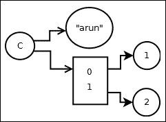
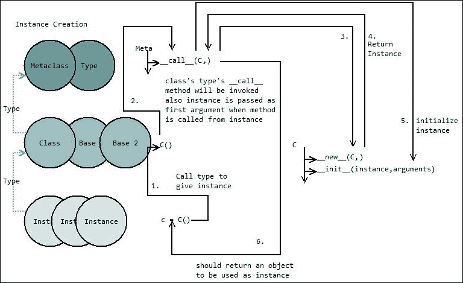
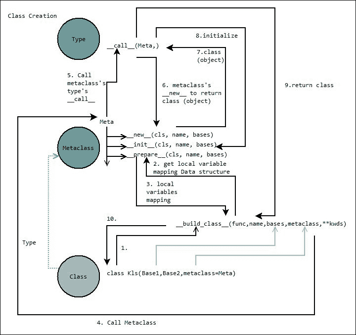

# 第一章. 深入了解对象

在本章中，我们将深入研究 Python 对象。对象是语言的基本构建块。它们可能代表或抽象一个真实实体。我们将更感兴趣的是影响这种行为的因素。这将帮助我们更好地理解和欣赏这门语言。我们将涵盖以下主题：

+   对象特征

+   调用对象

+   对象是如何创建的

+   玩转属性

# 理解对象

**关键 1：对象是语言对数据的抽象。标识、值和类型是它们的特性。**

在程序中，我们处理的所有数据和项目都是对象，例如数字、字符串、类、实例和模块。它们具有一些类似于真实事物的特性，因为它们都像人类通过 DNA 一样具有唯一可识别性。它们有一个类型，定义了它是哪种类型的对象，以及它支持哪些属性，就像鞋匠类型的人类支持修鞋，铁匠支持制作金属物品一样。它们具有一些价值，如力量、金钱、知识和美丽对人类的作用。

名称只是一个在命名空间中识别对象的手段，就像它被用来在群体中识别一个人一样。

## 标识

在 Python 中，每个对象都有一个唯一的标识。我们可以通过将对象传递给内置的 ID 函数 ID（对象）来获取这个标识。这返回了对象在 CPython 中的内存地址。

解释器可以重用一些对象，以便对象的总量保持较低。例如，整数和字符串可以按以下方式重用：

```py
>>> i = "asdf"
>>> j = "asdf"
>>> id(i) == id(j)
True
>>> i = 10000000000000000000000000000000
>>> j = 10000000000000000000000000000000
>>> id(j) == id(i) #cpython 3.5 reuses integers till 256
False
>>> i = 4
>>> j = 4
>>> id(i) == id(j)
True
>>> class Kls:
...     pass
... 
>>> k = Kls()
>>> j = Kls()
>>> id(k) == id(j) #always different as id gives memory address
False
```

这也是为什么两个字符串相加会生成第三个新字符串的原因，因此最好使用 StringIO 模块来处理缓冲区，或者使用字符串的 join 属性：

```py
>>> # bad
... print('a' + ' ' + 'simple' + ' ' + 'sentence' +  ' ' + '')
a simple sentence
>>> #good
... print(' '.join(['a','simple','sentence','.']))
a simple sentence .
```

## 值

**关键 2：不可变性是指无法改变对象的值。**

对象的值是存储在其中的数据。对象中的数据可以存储为数字、字符串或其他对象的引用。字符串和整数本身就是对象。因此，对于不是用 C（或核心对象）实现的对象，它是对其他对象的引用，我们感知的值是引用对象的组值。让我们以一个对象**iC**为例，它是 C 类的实例，具有`str`和`lst`属性，如下面的图所示：



创建此对象的代码片段如下：

```py
>>> class C:
...     def __init__(self, arg1, arg2):
...         self.str = arg1
...         self.lst = arg2
... 
>>> iC = C("arun",[1,2])
>>> iC.str
'arun'
>>> iC.lst
[1, 2]
>>> iC.lst.append(4)
>>> iC.lst
[1, 2, 4]
```

然后，当我们修改**iC**时，我们要么通过属性更改对象的引用，要么更改引用本身而不是对象**iC**。这在理解不可变对象时很重要，因为不可变意味着无法更改引用。因此，我们可以更改由不可变对象引用的可变对象。例如，元组内的列表可以更改，因为引用的对象正在更改，而不是引用本身。

## 类型

**关键 3：类型是实例的类。**

对象的类型告诉我们对象支持的运算和功能，它还可能定义该类型对象的可能值。例如，你的宠物可能是`dog`类型（`dog`类的实例）或`cat`类型（`cat`类的实例）。如果是狗类型，它可以吠叫；如果是猫类型，它可以喵喵叫。两者都是动物类型（`cat`和`dog`继承自`animal`类）。

一个对象的类为其提供类型。解释器通过检查其`__class__`属性来获取对象的类。因此，我们可以通过更改对象的`__class__`属性来更改对象的类型：

```py
>>> k = []
>>> k.__class__
<class 'list'>
>>> type(k)
<class 'list'>
# type is instance's class
>>> class M:
...     def __init__(self,d):
...         self.d = d
...     def square(self):
...         return self.d * self.d
... 
>>> 
>>> class N:
...     def __init__(self,d):
...         self.d = d
...     def cube(self):
...         return self.d * self.d * self.d
... 
>>> 
>>> m = M(4)
>>> type(m)  #type is its class
<class '__main__.M'>
>>> m.square()  #square defined in class M
16
>>> m.__class__ = N # now type should change
>>> m.cube()        # cube in class N
64
>>> type(m)
<class '__main__.N'> # yes type is changed
```

### 注意

这对于内置、编译的类不起作用，因为它只适用于在运行时定义的类对象。

# 对象的调用

**关键 4：所有对象都可以被调用。**

为了重用和分组某些任务的代码，我们将它们分组在函数类中，然后使用不同的输入调用它们。具有`__call__`属性的对象是可调用的，`__call__`是入口点。对于 C 类，在其结构中检查`tp_call`：

```py
>>> def func(): # a function
...     print("adf")
... 
>>> func()
adf
>>> func.__call__() #implicit call method
adf
>>> func.__class__.__call__(func)
adf
>>> func.__call__
<method-wrapper '__call__' of function object at 0x7ff7d9f24ea0>
>>> class C: #a callable class
...     def __call__(self):
...         print("adf")
... 
>>> c = C()
>>> c()
adf
>>> c.__call__() #implicit passing of self
adf
>>> c.__class__.__call__(c) #explicit passing of self
adf
>>> callable(lambda x:x+1)  #testing whether object is callable or not
True
>>> isinstance(lambda x:x+1, collections.Callable) #testing whether object is callable or not
True
```

类中的方法类似于函数，除了它们使用隐式实例作为第一个参数进行调用。当从实例访问时，函数作为方法公开。函数被包装在方法类中并返回。方法类在`__self__`中存储实例，在`__func__`中存储函数，其`__call__`方法使用`__self__`作为第一个参数调用`__func__`：

```py
>>> class D:
...     pass
... 
>>> class C:
...     def do(self,):
...             print("do run",self)
... 
>>> def doo(obj):
...     print("doo run",obj)
... 
>>> c = C()
>>> d = D()
>>> doo(c)
doo run <__main__.C object at 0x7fcf543625c0>
>>> doo(d)
doo run <__main__.D object at 0x7fcf54362400>
>>> # we do not need to pass object in case of C class do method
... 
>>> c.do() #implicit pass of c object to do method
do run <__main__.C object at 0x7fcf543625c0>
>>> C.doo = doo
>>> c.doo()
doo run <__main__.C object at 0x7fcf543625c0>
>>> C.doo()
Traceback (most recent call last):
  File "<stdin>", line 1, in <module>
TypeError: doo() missing 1 required positional argument: 'obj'
>>> C.do()
Traceback (most recent call last):
  File "<stdin>", line 1, in <module>
TypeError: do() missing 1 required positional argument: 'self'
>>> C.do(c)
do run <__main__.C object at 0x7fcf543625c0>
>>> C.do(d)
do run <__main__.D object at 0x7fcf54362400>
>>> c.do.__func__(d) #we called real function this way
do run <__main__.D object at 0x7fcf54362400>
```

使用这个逻辑，我们还可以从当前类中收集所需的其他类的方法，如下面的代码所示，而不是在数据属性不冲突的情况下进行多重继承。这将导致对属性搜索进行两次字典查找：一次是实例，一次是类。

```py
>>> #in library
... class PrintVals:
...     def __init__(self, endl):
...         self.endl = endl
...         
...     def print_D8(self, data):
...         print("{0} {1} {2}".format(data[0],data[1],self.endl))
... 
>>> class PrintKVals: #from in2 library
...     def __init__(self, knm):
...         self.knm = knm
...     
...     def print_D8(self, data):
...         print("{2}:{0} {1}".format(data[0],data[1],self.knm))
...
>>> class CollectPrint:
...     
...     def __init__(self, endl):
...         self.endl = endl
...         self.knm = "[k]"
...     
...     print_D8 = PrintVals.print_D8
...     print_D8K = PrintKVals.print_D8
... 
>>> c = CollectPrint("}")
>>> c.print_D8([1,2])
1 2 }
>>> c.print_D8K([1,2])
[k]:1 2
```

当我们调用类时，我们是在调用其类型，即元类，以类作为第一个参数来给我们一个新的实例：

```py
>>> class Meta(type):
...     def __call__(*args):
...         print("meta call",args)
... 
>>> class C(metaclass=Meta):
...     pass
... 
>>> 
>>> c = C()
meta call (<class '__main__.C'>,)
>>> c = C.__class__.__call__(C)
meta call (<class '__main__.C'>,)
```

同样，当我们调用实例时，我们是在调用它们的类型，即类，以实例作为第一个参数：

```py
>>> class C:
...     def __call__(*args):
...         print("C call",args)
... 
>>> c = C()
>>> c()
C call (<__main__.C object at 0x7f5d70c2bb38>,)
>>> c.__class__.__call__(c)
C call (<__main__.C object at 0x7f5d70c2bb38>,)
```

# 对象是如何创建的

除了内置类型或编译的模块类之外的对象是在运行时创建的。对象可以是类、实例、函数等。我们调用对象类型以给我们一个新的实例；或者换句话说，我们调用`type`类以给我们该类型的实例。

## 函数对象的创建

**关键 5：在运行时创建函数。**

让我们先看看如何创建函数对象。这将拓宽我们的视野。这个过程是在解释器看到`def`关键字时在幕后完成的。它编译代码，如下所示，并将代码名称参数传递给返回对象的函数类：

```py
>>> function_class = (lambda x:x).__class__
>>> function_class
<class 'function'>
>>> def foo():
...     print("hello world")
... 
>>> 
>>> def myprint(*args,**kwargs):
...     print("this is my print")
...     print(*args,**kwargs)
... 
>>> newfunc1 = function_class(foo.__code__, {'print':myprint})
>>> newfunc1()
this is my print
hello world
>>> newfunc2 = function_class(compile("print('asdf')","filename","single"),{'print':print})
>>> newfunc2()
asdf
```

## 实例的创建

**关键 6：实例创建的处理流程。**

我们调用类以获取一个新实例。我们从对象调用部分看到，当我们调用类时，它会调用其元类的 `__call__` 方法来获取一个新实例。`__call__` 负责返回一个正确初始化的新对象。它能够调用类的 `__new__` 和 `__init__`，因为类作为第一个参数传递，实例是由这个函数本身创建的：

```py
>>> class Meta(type):
...     def __call__(*args):
...         print("meta call ",args)
...         return None
... 
>>> 
>>> class C(metaclass=Meta):
...     def __init__(*args):
...         print("C init not called",args)
... 
>>> c = C() #init will not get called 
meta call  (<class '__main__.C'>,)
>>> print(c)
None
>>>
```

为了使开发者能够访问这两种功能，在类本身中创建新对象和初始化新对象；`__call__` 调用 `__new__` 类以返回一个新对象，并调用 `__init__` 来初始化它。完整的流程可以如图所示：

```py
>>> class Meta(type):
...     def __call__(*args):
...         print("meta call ,class object :",args)
...         class_object = args[0]
...         if '__new__' in class_object.__dict__:
...             new_method = getattr(class_object,'__new__',None)
...             instance = new_method(class_object)
...         else:
...             instance = object.__new__(class_object)
...         if '__init__' in class_object.__dict__:
...             init_method =  getattr(class_object,'__init__',None)
...             init_method(instance,*args[1:])
...         return instance
...
>>> class C(metaclass=Meta):
...     def __init__(instance_object, *args):
...         print("class init",args)
...     def __new__(*args):
...         print("class new",args)
...         return object.__new__(*args)
...
>>> class D(metaclass=Meta):
...     pass
...
>>> c=C(1,2)
meta call ,class object : (<class '__main__.C'>, 1, 2)
class new (<class '__main__.C'>,)
class init (1, 2)
>>> d = D(1,2)
meta call ,class object : (<class '__main__.D'>, 1, 2)
>>>
```

看一下以下图解：



## 类对象的创建

**关键点 7：类创建的处理流程。**

我们可以以三种方式创建类。一种简单地定义类。第二种是使用内置的 `__build_class__` 函数，第三种是使用 `type` 模块的 `new_class` 方法。第一种方法使用第二种方法，第二种方法内部使用第三种方法。当解释器看到类关键字时，它会收集类的名称、基类和为类定义的元类。它将使用函数（带有类的代码对象）、类的名称、基类、定义的元类等调用内置的 `__build_class__` 函数：

```py
__build_class__(func, name, *bases, metaclass=None, **kwds) -> class
```

此函数返回类。这将调用元类的 `__prepare__` 类方法以获取用作命名空间的映射数据结构。类体将被评估，局部变量将存储在这个映射数据结构中。元类的类型将使用此命名空间字典、基类和类名进行调用。它将依次调用元类的 `__new__` 和 `__init__` 方法。元类可以更改传递给其方法中的属性：

```py
>>> function_class = (lambda x:x).__class__
>>> M = __build_class__(function_class(
...                         compile("def __init__(self,):\n    print('adf')",
...                                 '<stdin>',
...                                 'exec'),
...                         {'print':print}
...                         ),
...                     'MyCls')
>>> m = M()
adf
>>> print(M,m)
<class '__main__.MyCls'> <__main__.MyCls object at 0x0088B430>
>>>
```

看一下以下图解：



# 玩转属性

**关键点 8：将使用哪个属性。**

属性是与对象相关联的值，可以通过点表达式按名称引用。理解对象属性是如何找到的非常重要。以下用于搜索属性的顺序：

1.  如果一个属性是特殊方法，并且它存在于对象的类型（或基类）中，则返回它，例如：`__call__`、`__str__` 和 `__init__`。当搜索这些方法时，它们的行仅在实例的类型中：

    ```py
    >>> class C:
    ...     def __str__(self,):
    ...             return 'Class String'
    ...     def do(self):
    ...             return 'Class method'
    ... 
    >>> c = C()
    >>> print(c)
    Class String
    >>> print(c.do())
    Class method
    >>> def strf(*args):
    ...     return 'Instance String',args
    ... 
    >>> def doo(*args):
    ...     return 'Instance Method'
    ... 
    >>> c.do = doo
    >>> c.__str__ = strf
    >>> print(c)
    Class String
    >>> print(c.do())
    Instance Method
    ```

1.  如果对象的类型具有 `__getattribute__` 属性，则无论该属性是否存在，都会调用此方法来获取属性。获取属性是 `__getattribute__` 的全部责任。如下面的代码片段所示，即使存在 do 方法，它也不会被找到，因为 `getattribute` 没有返回任何属性：

    ```py
    >>> class C:
    ...     def do(self):
    ...             print("asdf")
    ...     def __getattribute__(self,attr):
    ...             raise AttributeError('object has no attribute "%s"'%attr)
    ... 
    >>> c = C()
    >>> c.do()
    Traceback (most recent call last):
      File "<stdin>", line 1, in <module>
      File "<stdin>", line 5, in __getattribute__
    AttributeError: object has no attribute "do"
    >>> 
    ```

1.  在对象的类型 `__dict__` 中搜索以找到属性。如果存在，并且它是数据描述符，则返回它：

    ```py
    >>> class Desc:
    ...     def __init__(self, i):
    ...             self.i = i
    ...     def __get__(self, obj, objtype):
    ...             return self.i
    ...     def __set__(self,obj, value):
    ...             self.i = value
    ...
    >>> class C:
    ...     attx = Desc(23)
    ...
    >>> c = C()
    >>> c.attx
    23
    >>> c.__dict__['attx'] = 1234
    >>> c.attx
    23
    >>> C.attx = 12
    >>> c.attx
    1234
    ```

1.  在对象的`__dict__`类型中搜索以找到属性（如果此对象是类，则也搜索基类的`__dict__`）。如果属性是描述符，则返回结果。

1.  在对象的类型`__dict__`中搜索以找到属性。如果找到属性，则返回它。如果它是非数据描述符，则返回其结果，并使用相同的逻辑在其他基类中检查：

    ```py
    >>> class Desc:
    ...     def __init__(self, i):
    ...             self.i = i
    ...     def __get__(self, obj, objtype):
    ...             return self.i
    ...
    >>> class C:
    ...     attx = Desc(23)
    ...
    >>> c = C()
    >>> c.attx
    23
    >>> c.__dict__['attx'] = 34
    >>> c.attx
    34
    ```

1.  如果对象类型的`__getattr__`被定义，检查它是否可以给我们提供属性：

    ```py
    >>> class C:
    ...     def __getattr__(self, key):
    ...             return key+'_#'
    ...
    >>> c = C()
    >>> c.asdf
    'asdf_#'
    ```

1.  引发`AttributeError`。

## 描述符

**关键 9：创建自定义行为属性。**

任何定义了这些方法之一的对象属性，在类中都是描述符：

+   `__get__(self, obj, type=None) --> value`

+   `__set__(self, obj, value) --> None`

+   `__delete__(self, obj) --> None`

当在对象中首先搜索属性时，它首先在对象的字典中搜索，然后在其类型（基类）的字典中搜索。如果找到，则对象定义了这些方法之一，并且将调用该方法。假设 b 是`B`类的实例，那么以下将发生：

+   通过类调用是`type.__getattribute__()`转换为`B.__dict__['x'].__get__(None, B)`

+   通过实例调用是`.__getattribute__() --> type(b).__dict__['x'].__get__(b, type(b))`

只有`__get__`的对象是非数据描述符，而包含`__set__` / `__del__`的对象是数据描述符。数据描述符优先于实例属性，而非数据描述符则没有。

## 类、静态和实例方法

**关键 10：实现类方法和静态方法。**

类、静态和实例方法都可以使用描述符实现。我们可以一次理解描述符和这些方法：

+   类方法是始终将类作为其第一个参数的方法，并且可以在没有类实例的情况下执行。

+   静态方法是当通过类或实例执行时不会获得任何隐式对象的第一个参数的方法。

+   实例方法在通过实例调用时获取实例，但在通过类调用时没有隐式参数。

这些方法的示例代码使用如下：

```py
>>> class C:
...     @staticmethod
...     def sdo(*args):
...             print(args)
...     @classmethod
...     def cdo(*args):
...             print(args)
...     def do(*args):
...             print(args)
...
>>> ic = C()
# staticmethod called through class: no implicit argument is passed
>>> C.sdo(1,2)
(1, 2)
# staticmethod called through instance:no implicit argument is passed
>>> ic.sdo(1,2)(1, 2)
# classmethod called through instance: first argument implicitly class
>>> ic.cdo(1,2)
(<class '__main__.C'>, 1, 2)
# classmethod called through class: first argument implicitly class
>>> C.cdo(1,2)
(<class '__main__.C'>, 1, 2)
# instancemethod called through instance: first argument implicitly instance
>>> ic.do(1,2)
(<__main__.C object at 0x00DC9E30>, 1, 2)
#instancemethod called through class: no implicit argument, acts like static method.
>>> C.do(1,2)
(1, 2)
```

他们可以很容易地使用描述符来理解和实现，如下所示：

```py
from functools import partial
>>> class my_instancemethod:
...     def __init__(self, f):
...         # we store reference to function in instance
...         # for future reference
...         self.f = f
...     def __get__(self, obj, objtype):
...         # obj is None when called from class
...         # objtype is always present
...         if obj is not None:
...             return partial(self.f,obj)
...         else: # called from class
...             return self.f
...
>>> class my_classmethod:
...     def __init__(self, f):
...         self.f = f
...     def __get__(self, obj, objtype):
...         # we pass objtype i.e class object
...         # when called from instance or class
...         return partial(self.f,objtype)
...
>>> class my_staticmethod:
...     def __init__(self, f):
...         self.f = f
...     def __get__(self, obj, objtype):
...         # we do not pass anything
...         # for both conditions
...         return self.f
...
>>> class C:
...     @my_instancemethod
...     def ido(*args):
...         print("imethod",args)
...     @my_classmethod
...     def cdo(*args):
...         print("cmethod",args)
...     @my_staticmethod
...     def sdo(*args):
...         print("smethod",args)
...
>>> c = C()
>>> c.ido(1,2)
imethod (<__main__.C object at 0x00D7CBD0>, 1, 2)
>>> C.ido(1,2)
imethod (1, 2)
>>> c.cdo(1,2)
cmethod (<class '__main__.C'>, 1, 2)
>>> C.cdo(1,2)
cmethod (<class '__main__.C'>, 1, 2)
>>> c.sdo(1,2)
smethod (1, 2)
>>> C.sdo(1,2)
smethod (1, 2)
```

### 小贴士

**下载示例代码**

您可以从您在[`www.packtpub.com`](http://www.packtpub.com)的账户中下载示例代码文件，以获取您购买的所有 Packt Publishing 书籍。如果您在其他地方购买了这本书，您可以访问[`www.packtpub.com/support`](http://www.packtpub.com/support)并注册，以便将文件直接通过电子邮件发送给您。

# 摘要

在本章中，我们深入探讨了 Python 语言中对象的工作方式，它们是如何连接的，以及它们是如何被调用的。描述符和实例创建是两个非常重要的主题，因为它们为我们描绘了系统是如何工作的。我们还深入探讨了对象属性查找的方式。

现在，我们都已准备好学习如何充分利用语言结构。在下一章中，我们还将发现一些在优雅地完成项目时极为有用的工具。
