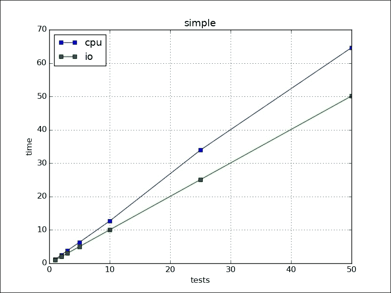
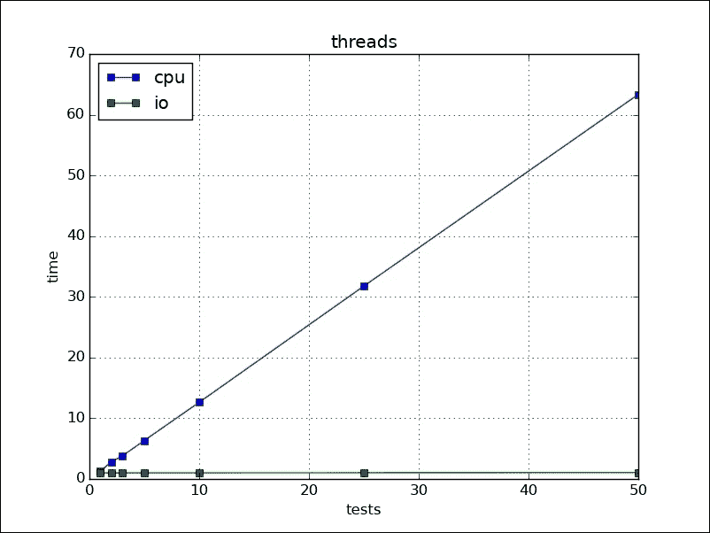
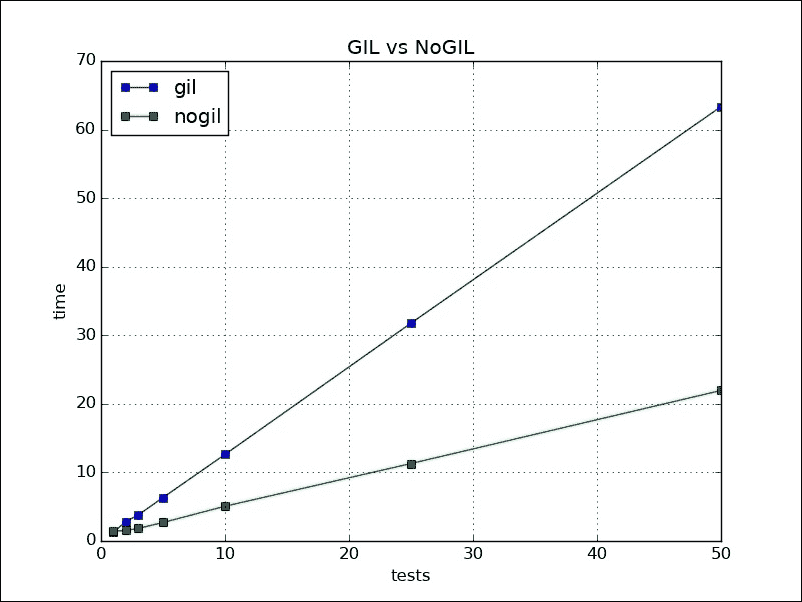
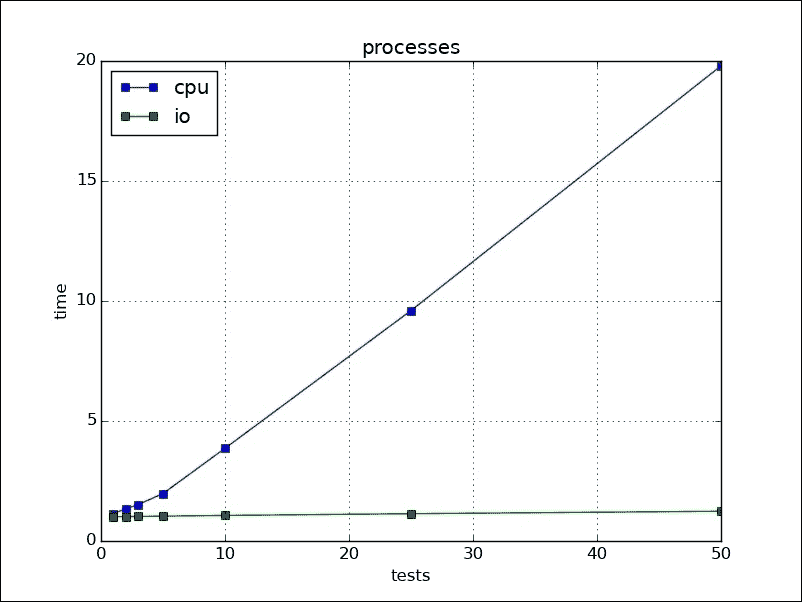
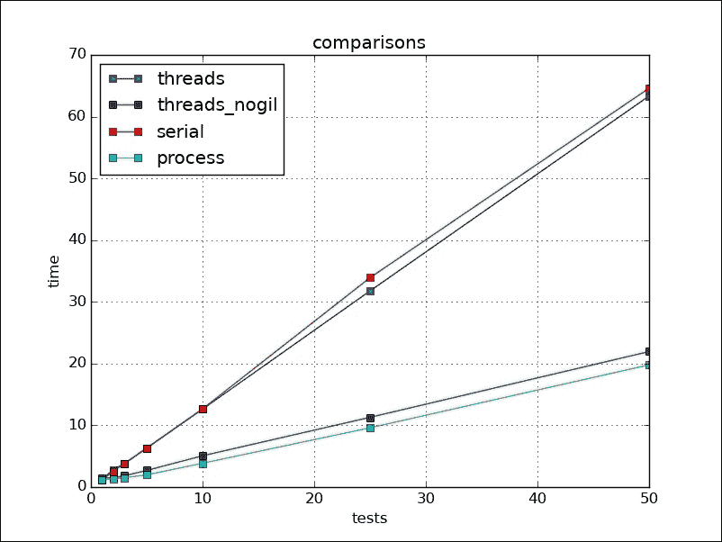
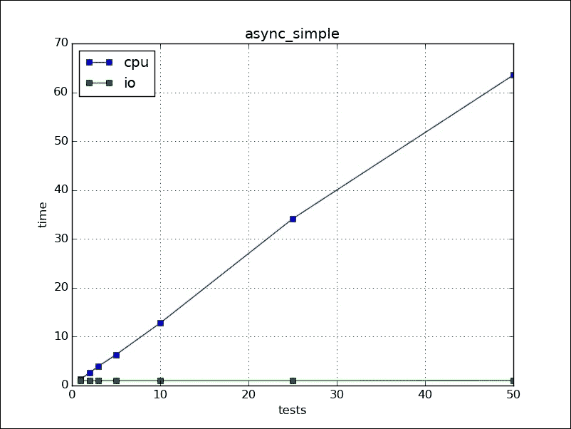
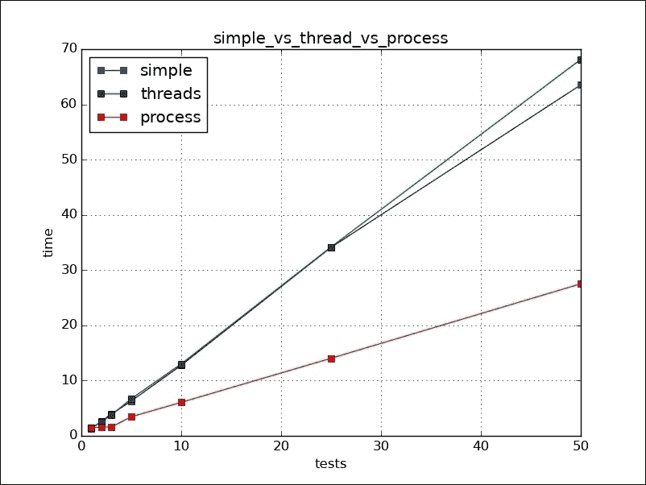
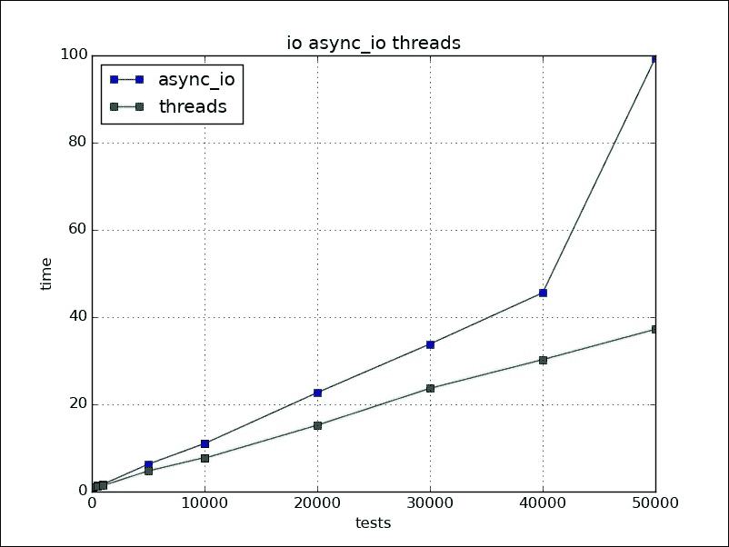

# 第八章。扩展 Python

在本章中，我们将尝试通过使程序可扩展来让我们的程序能够处理更多的输入。我们将通过优化和增加系统计算能力来实现这一点。我们将涵盖以下主题：

+   多线程

+   使用多个进程

+   异步处理

+   水平扩展

系统无法扩展的主要原因是状态。事件可以永久改变系统的状态，无论是针对该请求还是来自该端点的后续请求。

通常状态存储在数据库中，对事件的响应是按顺序处理的，由于事件而引起的状态变化随后存储在数据库中。

任务可以是计算密集型（CPU 负载）或 I/O 密集型，其中系统需要从其他实体那里获得答案。在这里，`taskg`和`taskng`是任务的 GIL 和非 GIL 版本。`taskng`任务是在 C 模块中通过 SWIG 编译并启用其线程的：

```py
URL = "http://localhost:8080/%s"
def cputask(num,gil=True):
    if gil:
        return taskg(num)
    else:
        return taskng(num)     
def iotask(num):
    req = urllib.request.urlopen(URL%str(num))
    text = req.read()
    return text
```

例如，我创建了一个在 1 秒后响应请求的测试服务器。为了比较场景，我们首先创建一个简单的串行程序。正如预期的那样，IO 和 CPU 任务的时间相加：

```py
import time
from tasker import cputask, iotask
from random import randint
def process(rep, case=None):
        inputs = [[randint(1, 1000), None] for i in range(rep) ]
    st = time.time()

    if 'cpu' == case:
        for i in inputs:
            i[1] = cputask(i[0])
    elif 'io' == case:
        for i in inputs:
            i[1] = iotask(i[0])
    tot = time.time() - st
    for i in inputs:
        assert i[0] == int(i[1]), "not same %s" % (i)
return tot
```

输出可以简单地总结如下：



# 多线程

**关键 1：使用线程并行处理。**

让我们看看线程如何帮助我们提高性能。在 Python 中，由于全局解释器锁，一次只有一个线程运行。此外，上下文切换，因为所有这些线程都被给予运行的机会。因此，这除了计算之外还有负载。因此，CPU 密集型任务应该花费相同或更多的时间。I/O 任务并没有做任何事情，只是在等待，所以它们会得到提升。在以下代码段中，`threaded_iotask`和`threaded_cputask`是使用单独线程执行的两个函数。代码运行于各种值以获取结果。进程函数调用多个线程以对任务进行操作并汇总所花费的时间：

```py
import time
from tasker import cputask, iotask
from random import randint
import threading,random,string

def threaded_iotask(i):
    i[1] = iotask(i[0])

def threaded_cputask(i):
    i[1] = cputask(i[0])

stats = {}

def process(rep, cases=()):
    stats.clear()
    inputs = [[randint(1, 1000), None] for i in range(rep) ]
    threads = []
    if 'cpu' in cases:
        threads.extend([ 
            threading.Thread(target=threaded_cputask, args=(i,)) 
                for i in inputs])
    elif 'io' in cases:
        threads.extend([
            threading.Thread(target=threaded_iotask, args=(i,)) 
                for i in inputs])            
    stats['st'] = stats.get('st',time.time())
    for t in threads:
        t.start()
    for t in threads:
        t.join()
    stats['et'] = stats.get('et',time.time())
    tot = stats['et']  - stats['st']
    for i in inputs:
        assert i[0] == int(i[1])
    return tot
```

在屏幕上绘制各种结果，我们可以轻松地看到线程有助于 IO 任务，但不是 CPU 任务：



如前所述，这是由于全局解释器锁（GIL）。我们的 CPU 任务是用 C 定义的，我们可以放弃 GIL 来看看是否有所帮助。以下是没有 GIL 的任务运行图的示例。我们可以看到，CPU 任务现在所需的时间比之前少得多。但是，GIL 的存在是有原因的。如果我们放弃 GIL，数据结构的原子性就无法保证，因为在给定时间内可能有多个线程在处理相同的数据结构。



# 使用多个进程

**关键 2：处理 CPU 密集型任务。**

多进程有助于充分利用所有 CPU 核心。它有助于 CPU 密集型工作，因为任务是在单独的进程中运行的，并且实际工作进程之间没有 GIL。进程之间的设置和通信成本高于线程。在以下代码部分中，`proc_iotask`和`proc_cputask`是针对各种输入运行的进程：

```py
import time
from tasker import cputask, iotask
from random import randint
import multiprocessing,random,string

def proc_iotask(i,outq):
    i[1] = iotask(i[0])
    outq.put(i)

def proc_cputask(i,outq):
    res = cputask(i[0])
    outq.put((i[0],res))

stats = {}

def process(rep, case=None):
    stats.clear()
    inputs = [[randint(1, 1000), None] for i in range(rep) ]
    outq = multiprocessing.Queue()
    processes = []
    if 'cpu' == case:
        processes.extend([ 
            multiprocessing.Process(target=proc_cputask, args=(i,outq)) 
                for i in inputs])
    elif 'io' == case:
        processes.extend([
            multiprocessing.Process(target=proc_iotask, args=(i,outq)) 
                for i in inputs])            
    stats['st'] = stats.get('st',time.time())
    for t in processes:
        t.start()
    for t in processes:
        t.join()
    stats['et'] = stats.get('et',time.time())
    tot = stats['et']  - stats['st']
    while not outq.empty():
        item = outq.get()
        assert item[0] == int(item[1])
    return tot
```

在下面的图中，我们可以看到多个 IO 操作从多进程中得到了提升。CPU 任务也因多进程而得到提升：



如果我们比较所有四种：串行、线程、无 GIL 的线程和多进程，我们会观察到无 GIL 的线程和多进程几乎花费了相同的时间。此外，串行和线程花费了相同的时间，这表明在 CPU 密集型任务中使用线程的好处很小：



# 异步进行

**关键 3：为了并行执行而异步。**

我们也可以通过异步处理多个请求。在这种方法中，我们不是轮询对象的更新，而是它们告诉我们何时有结果。因此，在同时，主线程可以执行其他操作。Asyncio、Twisted 和 Tornado 是 Python 中的库，可以帮助我们编写这样的代码。Asyncio 和 Tornado 在 Python 3 中得到支持，目前 Twisted 的一些部分也可以在 Python 3 上运行。Python 3.5 引入了`async`和`await`关键字，有助于编写异步代码。`async`关键字定义了函数是一个异步函数，并且结果可能不会立即可用。`await`关键字等待直到结果被捕获并返回结果。

在以下代码中，主函数中的`await`等待所有结果都可用：

```py
import time, asyncio
from tasker import cputask, async_iotask
from random import randint
import aiopg, string, random, aiohttp
from asyncio import futures, ensure_future, gather
from functools import partial

URL = "http://localhost:8080/%s"

async def async_iotask(num, loop=None):
    res = await aiohttp.get(URL % str(num[0]), loop=loop)
    text = await res.text()
    num[1] = int(text)
    return text

stats = {}

async def main(rep, case=None, loop=None, inputs=None):
    stats.clear()
    stats['st'] = time.time()
    if 'cpu' == case:
        for i in inputs:
            i[1] = cputask(i[0])
    if 'io' == case:
        deferreds = []
        for i in inputs:
            deferreds.append(async_iotask(i, loop=loop))
        await gather(*deferreds, return_exceptions=True, loop=loop)
    stats['et'] = time.time()

def process(rep, case=None):
    loop = asyncio.new_event_loop()
    inputs = [[randint(1, 1000), None] for i in range(rep) ]
    loop.run_until_complete(main(rep, case=case, loop=loop, inputs=inputs))
    loop.close()
    tot = stats['et'] - stats['st']
    # print(inputs)
    for i in inputs:
        assert i[0] == int(i[1])
    return tot
```

在图上绘制结果，我们可以看到我们在 IO 部分得到了提升，但对于 CPU 密集型工作，它花费的时间与串行相似：



CPU 任务阻塞了所有操作，因此，这是一个糟糕的设计。我们必须使用线程或更好的多进程来帮助处理 CPU 密集型任务。要使用线程或进程运行任务，我们可以使用`concurrent.futures`包中的`ThreadPoolExecutor`和`ProcessPoolExecutor`。以下是`ThreadPoolExecutor`的代码：

```py
async def main(rep,case=None,loop=None,inputs=[]):
    if case == 'cpu':
        tp = ThreadPoolExecutor()
        futures = []
        for i in inputs:
            task = partial(threaded_cputask,i)
            future = loop.run_in_executor(tp,task)
            futures.append(future)
        res = await asyncio.gather(*futures,return_exceptions=True,loop=loop)
```

对于`ProcessPoolExecutor`，我们必须使用多进程队列来收集结果，如下所示：

```py
def threaded_cputask(i,outq):
    res = cputask(i[0])
    outq.put((i[0],res))

async def main(rep,case=None,loop=None,outq=None,inputs=[]):
    if case == 'cpu':
        pp = ProcessPoolExecutor()
        futures = []
        for i in inputs:
            task = partial(threaded_cputask,i,outq)
            future = loop.run_in_executor(pp,task)
            futures.append(future)
        res = await asyncio.gather(*futures,return_exceptions=True,loop=loop)

def process(rep,case=None):
    loop = asyncio.new_event_loop()
    inputs = [[randint(1, 1000), None] for i in range(rep) ]
    st = time.time()
    m = multiprocessing.Manager()
    outq = m.Queue()
    loop.run_until_complete(main(rep,case=case,loop=loop,outq=outq,inputs=inputs))
    tot =  time.time() - st
    while not outq.empty():
        item = outq.get()
        assert item[0] == int(item[1])
    loop.close()
    return tot
```

绘制结果，我们可以看到线程花费的时间与没有它们时大致相同，但它们仍然可以帮助使程序更响应，因为程序可以在同时执行其他 IO 任务。多进程提供了最大的提升：



异步系统主要用于 IO 是主要任务时。如您所见，对于 CPU 来说，它与串行相似。现在让我们看看对于我们的可扩展 IO 应用，线程或`async`哪一个更好。我们使用了相同的 IO 任务，但在更高的负载下。Asyncio 提供了失败，并且比线程花费更多的时间。我在 Python 3.5 上进行了测试：



最后的建议是也要看看其他实现，例如 PyPy、Jython、IronPython 等等。

# 横向扩展

如果我们向应用程序添加更多节点，它必须增加总处理能力。为了创建执行更多数据传输而不是计算的客户端系统，`async` 框架更适合。如果我们使用 PyPy，它将为应用程序提供性能提升。使用 six 或其他类似库的 Python 3 或 Python 2 兼容代码，以便我们可以使用任何可用的优化。

我们可以使用消息打包或 JSON 进行消息传输。我更喜欢 JSON，因为它对语言无关且易于文本表示。工作者可以是用于 CPU 密集型任务的进程多线程工作者，或其他场景的线程基础工作者。

系统不应该存储状态，而应该通过消息传递状态。并不是所有东西都需要在数据库中。当不需要时，我们可以取出一些东西。

ZeroMQ (消息队列): ZMQ 是一个出色的库，它充当连接你程序的粘合剂。它几乎为所有语言提供了连接器。你可以轻松地使用多种语言/框架，使它们能够与 ZMQ 通信，并在彼此之间通信。它还提供了创建各种实用工具的工具。现在让我们看看如何使用 ZMQ 轻松地创建一个负载均衡的工作系统。在下面的代码片段中，我们创建了一个客户端（请求者），它可以从一组负载均衡的服务器（工作者）那里请求结果。在下面的代码中，我们可以看到套接字类型是 `DEALER`。ZMQ 中的套接字可以被视为迷你服务器。`req` 套接字实际上只有在收到前一个响应后才会传输。`DEALER` 和 `ROUTER` 套接字更适合现实场景。同步代码如下：

```py
import sys
import zmq
from zmq.eventloop import ioloop
from zmq.eventloop.ioloop import IOLoop
from zmq.eventloop.zmqstream import ZMQStream
ioloop.install()

class Cli():

    def __init__(self, name, addresses):
        self.addresses = addresses
        self.loop = IOLoop.current()
        self.ctx = zmq.Context.instance()
        self.skt = None
        self.stream = None
        self.name = bytes(name, encoding='ascii')
        self.req_no = 0
        self.run()

    def run(self):
        self.skt = self.ctx.socket(zmq.DEALER)
        for address in self.addresses:
            self.skt.connect(address)
        self.stream = ZMQStream(self.skt)
        self.stream.on_recv(self.handle_request)
        self.loop.call_later(1, self.send_request)

    def send_request(self):
        msg = [self.req_no.to_bytes(1, 'little'), b"hello"]
        print("sending", msg)
        self.stream.send_multipart(msg)
        self.req_no += 1
        if self.req_no < 10:
            self.loop.call_later(1, self.send_request)

    def handle_request(self, msg):
        print("received", int.from_bytes(msg[0], 'little'), msg[1])

if __name__ == '__main__':
    print("starting  client")
    loop = IOLoop.current()
    serv = Cli(sys.argv[1], sys.argv[2:])
    loop.start()
```

以下是为服务器或实际工作者提供的代码。我们可以拥有很多这样的服务器，负载将以轮询方式在他们之间分配：

```py
import sys

import zmq
from zmq.eventloop import ioloop
from zmq.eventloop.ioloop import IOLoop
from zmq.eventloop.zmqstream import ZMQStream

ioloop.install()

class Serv():

    def __init__(self, name, address):
        self.address = address
        self.loop = IOLoop.current()
        self.ctx = zmq.Context.instance()
        self.skt = None
        self.stream = None
        self.name = bytes(name, encoding='ascii')
        self.run()

    def run(self):
        self.skt = self.ctx.socket(zmq.ROUTER)
        self.skt.bind(self.address)
        self.stream = ZMQStream(self.skt)

        self.stream.on_recv(self.handle_request)

    def handle_request(self, msg):
        print("received", msg)
        self.stream.send_multipart(msg)

if __name__ == '__main__':
    print("starting server")
    serv = Serv(sys.argv[1], sys.argv[2])
    loop = IOLoop.current()
    loop.start()
```

以下是从运行中得到的输出：

```py
For client
(py35) [ scale_zmq ] $ python client.py "cli" "tcp://127.0.0.1:8004" "tcp://127.0.0.1:8005"
starting  client
sending [b'\x00', b'hello']
sending [b'\x01', b'hello']
received 1 b'hello'
sending [b'\x02', b'hello']
sending [b'\x03', b'hello']
received 3 b'hello'
sending [b'\x04', b'hello']
sending [b'\x05', b'hello']
received 5 b'hello'
sending [b'\x06', b'hello']
sending [b'\x07', b'hello']
received 7 b'hello'
sending [b'\x08', b'hello']
sending [b'\t', b'hello']
received 9 b'hello'
received 0 b'hello'
received 2 b'hello'
received 4 b'hello'
received 6 b'hello'
received 8 b'hello'

Outputs server/workers:
(py35) [ scale_zmq ] $ python server.py "serv" "tcp://127.0.0.1:8004"
starting server
received [b'\x00k\x8bEg', b'\x00', b'hello']
received [b'\x00k\x8bEg', b'\x02', b'hello']
received [b'\x00k\x8bEg', b'\x04', b'hello']
received [b'\x00k\x8bEg', b'\x06', b'hello']
received [b'\x00k\x8bEg', b'\x08', b'hello']
(py35) [ scale_zmq ] $ python server.py "serv" "tcp://127.0.0.1:8005"
starting server
received [b'\x00k\x8bEg', b'\x01', b'hello']
received [b'\x00k\x8bEg', b'\x03', b'hello']
received [b'\x00k\x8bEg', b'\x05', b'hello']
received [b'\x00k\x8bEg', b'\x07', b'hello']
received [b'\x00k\x8bEg', b'\t', b'hello']
```

我们可以使用第三方包 `Supervisord` 来使工作者在失败时重启。

ZMQ 的真正力量在于根据项目需求从更简单的组件中创建网络架构和节点。你可以轻松地测试框架，因为它可以支持 IPC、TCP、UDP 以及更多协议。它们也可以互换使用。

还有其他库/框架也可以在这个领域提供大量帮助，例如 NSQ、Python 并行。许多项目选择 RabbitMQ 作为代理，AMQP 作为协议。选择良好的通信对于系统的设计和可扩展性非常重要，并且它取决于项目需求。

# 摘要

如果我们将程序的部分分离并使用每个部分以最佳性能进行调优，那么使程序可扩展是很容易的。在本章中，我们看到了 Python 的各个部分如何帮助垂直和水平扩展。在设计应用程序架构时，必须考虑所有这些信息。
