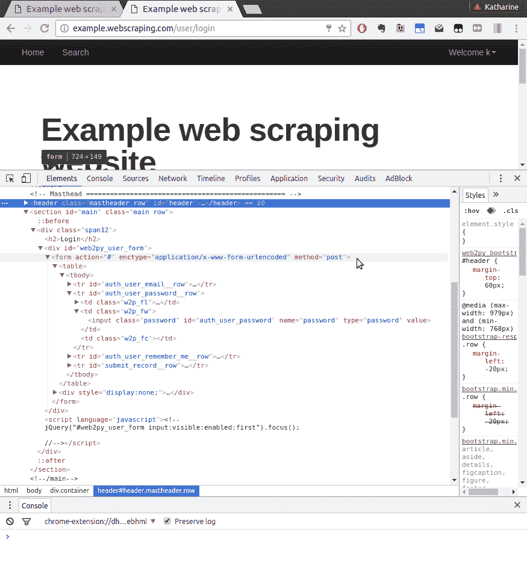
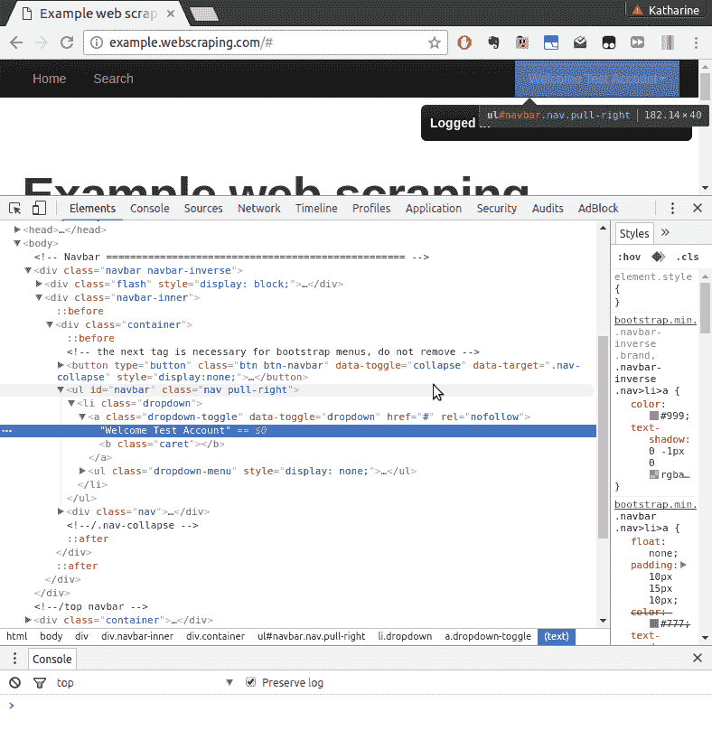
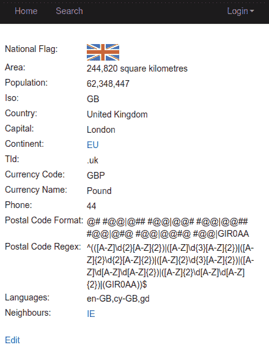
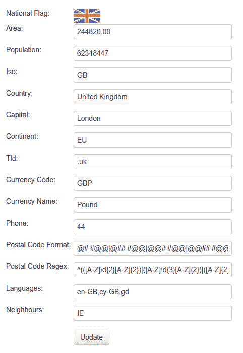
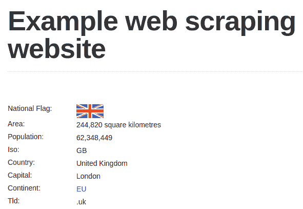

# 第六章：与表单交互

在前面的章节中，我们下载了返回相同内容的静态网页。在本章中，我们将与依赖于用户输入和状态的网页进行交互，以返回相关内容。本章将涵盖以下主题：

+   发送 `POST` 请求提交表单

+   使用 cookies 和 sessions 登录网站

+   使用 Selenium 进行表单提交

要与这些表单交互，你需要一个用户账户来登录网站。你可以在 [`example.webscraping.com/user/register`](http://example.webscraping.com/user/register) 手动注册账户。不幸的是，我们目前还不能自动化注册表单，直到下一章，那时我们将讨论 `CAPTCHA` 图像。

表单方法

HTML 表单定义了两种将数据提交给服务器的方法 - `GET` 和 `POST`。使用 `GET` 方法时，数据如 `?name1=value1&name2=value2` 将附加到 URL 上，这被称为“查询字符串”。浏览器对 URL 长度设置了一个限制，因此这仅适用于少量数据。此外，这种方法通常仅用于从服务器检索数据，而不是对其进行更改，但有时这种意图会被忽略。使用 `POST` 请求时，数据在请求体中发送，而不是 URL。敏感数据应仅通过 `POST` 请求发送，以避免在 URL 中暴露。`POST` 数据在体中的表示方式取决于编码类型。

服务器也可以支持其他 HTTP 方法，例如 `PUT` 和 `DELETE`，然而，这些方法在标准 HTML 表单中并不被支持。

# 登录表单

我们将自动化的第一个表单是登录表单，它位于 [`example.webscraping.com/user/login`](http://example.webscraping.com/user/login)。为了理解表单，我们可以使用我们的浏览器开发工具。使用 Firebug 或 Chrome 开发者工具的完整版本，我们可以简单地提交表单并检查在“网络”标签中传输了哪些数据（类似于我们在第五章 Dynamic Content 中所做的那样）。然而，如果我们使用“检查元素”功能，我们还可以看到有关表单的信息：



关于如何发送表单的重要部分是 `form` 标签的 `action`、`enctype` 和 `method` 属性，以及两个 `input` 字段（在上面的图像中我们扩展了“密码”字段）。`action` 属性设置表单数据将被提交的 HTTP 位置，在这种情况下，`#` 代表当前 URL。`enctype` 属性（或编码类型）设置提交数据使用的编码，在这种情况下，`application/x-www-form-urlencoded`。`method` 属性设置为 `post`，以便将表单数据以 `POST` 方法提交到服务器。对于每个 `input` 标签，重要的属性是 `name`，它设置当 `POST` 数据提交到服务器时字段的名称。

表单编码

当一个表单使用 `POST` 方法时，在将表单数据提交到服务器之前，有两种有用的选择来编码表单数据。默认是 `application/x-www-form-urlencoded`，它指定所有非字母数字字符必须转换为 ASCII 十六进制值。然而，对于包含大量非字母数字数据的表单，例如二进制文件上传，这并不高效，因此定义了 `multipart/form-data` 编码。在这里，输入不进行编码，而是使用 MIME 协议作为多个部分发送，这与电子邮件使用的标准相同。

可以在[`www.w3.org/TR/html5/forms.html`](http://www.w3.org/TR/html5/forms.html)#selecting-a-form-submission-encoding)查看此标准的官方详情。

当普通用户在他们的浏览器中打开这个网页时，他们会输入他们的电子邮件和密码，然后点击登录按钮将他们的详细信息提交到服务器。然后，如果服务器上的登录过程成功，他们将被重定向到主页；否则，他们将被返回到登录页面再次尝试。以下是自动化此过程的初步尝试：

```py
>>> from urllib.parse import urlencode
>>> from urllib.request import Request, urlopen
>>> LOGIN_URL = 'http://example.webscraping.com/user/login'
>>> LOGIN_EMAIL = 'example@webscraping.com'
>>> LOGIN_PASSWORD = 'example'
>>> data = {'email': LOGIN_EMAIL, 'password': LOGIN_PASSWORD}
>>> encoded_data = urlencode(data)
>>> request = Request(LOGIN_URL, encoded_data.encode('utf-8'))
>>> response = urlopen(request)
>>> print(response.geturl())
 'http://example.webscraping.com/user/login'

```

此示例设置了电子邮件和密码字段，使用 `urlencode` 对其进行编码，并将它们提交到服务器。当执行最后的打印语句时，它将输出登录页面的 URL，这意味着登录过程失败了。你会注意到我们必须也将已编码的数据作为字节进行编码，这样 `urllib` 才能接受它。

我们可以使用 `requests` 在更少的行中编写相同的流程：

```py
>>> import requests
>>> response = requests.post(LOGIN_URL, data)
>>> print(response.url)
 'http://example.webscraping.com/user/login'

```

`requests` 库允许我们明确地提交数据，并且会内部进行编码。不幸的是，这段代码仍然无法登录。

登录表单特别严格，需要提交一些额外的字段，这些字段与电子邮件和密码一起提交。这些额外的字段可以在上一张截图的底部找到，但它们被设置为 `hidden`，因此它们在浏览器中不会显示。要访问这些隐藏字段，这里有一个使用第二章中介绍的 `lxml` 库的函数来提取表单中所有 `input` 标签的详细信息：

```py
from lxml.html import fromstring

def parse_form(html): 
    tree = fromstring(html) 
    data = {} 
    for e in tree.cssselect('form input'): 
        if e.get('name'): 
            data[e.get('name')] = e.get('value') 
    return data 

```

上一段代码中的函数使用 `lxml` CSS 选择器遍历表单中的所有 `input` 标签，并返回它们的 `name` 和 `value` 属性的字典。以下是代码在登录页面上运行的结果：

```py
>>> html = requests.get(LOGIN_URL)
>>> form = parse_form(html.content) 
>>> print(form) 
{'_formkey': 'a3cf2b3b-4f24-4236-a9f1-8a51159dda6d',
 '_formname': 'login',
 '_next': '/',
 'email': '',
 'password': '',
 'remember_me': 'on'}

```

`_formkey` 属性是关键部分；它包含服务器用于防止多次表单提交的唯一 ID。每次网页加载时，都会使用不同的 ID，服务器可以判断具有给定 ID 的表单是否已经被提交。以下是提交 `_formkey` 和其他隐藏值的登录过程的更新版本：

```py
>>> html = requests.get(LOGIN_URL)
>>> data = parse_form(html.content) 
>>> data['email'] = LOGIN_EMAIL 
>>> data['password'] = LOGIN_PASSWORD 
>>> response = requests.post(LOGIN_URL, data) 
>>> response.url 
'http://example.webscraping.com/user/login'

```

不幸的是，这个版本也不起作用，因为登录 URL 再次返回。我们缺少另一个基本组件——浏览器 Cookie。当普通用户加载登录表单时，这个 `_formkey` 值会被存储在一个 Cookie 中，并与提交的登录表单数据中的 `_formkey` 值进行比较。我们可以通过我们的 `response` 对象查看 Cookie 和它们的值：

```py
>>> response.cookies.keys()
['session_data_places', 'session_id_places']
>>> response.cookies.values()
['"8bfbd84231e6d4dfe98fd4fa2b139e7f:N-almnUQ0oZtHRItjUOncTrmC30PeJpDgmAqXZEwLtR1RvKyFWBMeDnYQAIbWhKmnqVp-deo5Xbh41g87MgYB-oOpLysB8zyQci2FhhgU-YFA77ZbT0hD3o0NQ7aN_BaFVrHS4DYSh297eTYHIhNagDjFRS4Nny_8KaAFdcOV3a3jw_pVnpOg2Q95n2VvVqd1gug5pmjBjCNofpAGver3buIMxKsDV4y3TiFO97t2bSFKgghayz2z9jn_iOox2yn8Ol5nBw7mhVEndlx62jrVCAVWJBMLjamuDG01XFNFgMwwZBkLvYaZGMRbrls_cQh"',
 'True']

```

您也可以通过 Python 解释器看到 `response.cookies` 是一种特殊对象类型，称为 Cookie jar。此对象还可以传递给新的请求。让我们带 Cookie 重新尝试我们的提交：

```py
>>> second_response = requests.post(LOGIN_URL, data, cookies=html.cookies)
>>> second_response.url
'http://example.webscraping.com/'

```

什么是 Cookie？

Cookie 是由网站在 HTTP `response` 头部发送的小量数据，其格式如下：`Set-Cookie: session_id=example`;。网络浏览器会将它们存储起来，并在随后的请求中包含在网站的头信息中。这允许网站识别和跟踪用户。

成功！提交的表单值已被接受，`response` URL 是主页。请注意，我们需要使用与我们的初始请求（我们已将其存储在 `html` 变量中）正确匹配的 Cookie。这个片段和本章中的其他登录示例可在 [`github.com/kjam/wswp/tree/master/code/chp6`](https://github.com/kjam/wswp/tree/master/code/chp6) 下载。

# 从网络浏览器加载 Cookie

确定服务器期望提交的登录细节可能相当复杂，如前例所示。幸运的是，对于难以访问的网站有一个解决方案——我们可以使用网络浏览器手动登录网站，并让我们的 Python 脚本加载和重用 Cookie 以自动登录。

一些网络浏览器以不同的格式存储他们的 Cookie，但 Firefox 和 Chrome 使用一种易于访问的格式，我们可以用 Python 解析：一个 `sqlite` 数据库。

[SQLite](https://www.sqlite.org/) 是一个非常流行的开源 SQL 数据库。它可以在许多平台上轻松安装，并且预装在 Mac OSX 上。要下载并安装到您的操作系统上，请查看 [下载页面](https://www.sqlite.org/download.html) 或直接搜索您操作系统的安装说明。

要查看您的 Cookie，您可以通过运行 `sqlite3` 命令并指定您的 Cookie 文件路径（下面是一个 Chrome 的示例）来查看：

```py
$ sqlite3 [path_to_your_chrome_browser]/Default/Cookies
SQLite version 3.13.0 2016-05-18 10:57:30
Enter ".help" for usage hints.
sqlite> .tables
cookies meta

```

您需要首先找到浏览器配置文件的路径，这可以通过在文件系统中搜索或简单地在网上搜索您的浏览器和操作系统来完成。要在 SQLite 中查看表架构，您可以使用 `.schema` 并选择语法，类似于其他 SQL 数据库。

除了在`sqlite`数据库中存储 cookies 外，一些浏览器（如 Firefox）将会话直接存储在 JSON 文件中，这可以使用 Python 轻松解析。还有许多浏览器扩展，如 SessionBuddy，可以将你的会话导出为 JSON 文件。对于登录，我们只需要找到适当的会话，这些会话存储在这个结构中：

```py
{"windows": [... 
  "cookies": [ 
    {"host":"example.webscraping.com", 
     "value":"514315085594624:e5e9a0db-5b1f-4c66-a864", 
     "path":"/", 
     "name":"session_id_places"} 
  ...] 
]} 

```

这里有一个函数，可以将 Firefox 会话解析成 Python 字典，然后我们可以将其输入到`requests`库中：

```py
def load_ff_sessions(session_filename): 
    cookies = {}
    if os.path.exists(session_filename): 
        json_data = json.loads(open(session_filename, 'rb').read()) 
        for window in json_data.get('windows', []): 
            for cookie in window.get('cookies', []): 
                cookies[cookie.get('name')] = cookie.get('value')
    else: 
        print('Session filename does not exist:', session_filename)
    return cookies

```

一个复杂性是 Firefox 会话文件的存储位置会根据操作系统而变化。在 Linux 中，它应该位于此路径：

```py
~/.mozilla/firefox/*.default/sessionstore.js 

```

在 OS X 中，它应该位于：

```py
~/Library/Application Support/Firefox/Profiles/*.default/ 
   sessionstore.js 

```

此外，对于 Windows Vista 及以上版本，它应该位于：

```py
%APPDATA%/Roaming/Mozilla/Firefox/Profiles/*.default/sessionstore.js 

```

这里有一个辅助函数，用于返回会话文件的路径：

```py
import os, glob 
def find_ff_sessions(): 
    paths = [ 
        '~/.mozilla/firefox/*.default', 
        '~/Library/Application Support/Firefox/Profiles/*.default', 
        '%APPDATA%/Roaming/Mozilla/Firefox/Profiles/*.default' 
    ] 
    for path in paths: 
        filename = os.path.join(path, 'sessionstore.js') 
        matches = glob.glob(os.path.expanduser(filename)) 
        if matches: m
            return matches[0] 

```

注意，这里使用的`glob`模块将返回给定路径的所有匹配文件。现在这里有一个使用浏览器 cookies 登录的更新片段：

```py
 >>> session_filename = find_ff_sessions() 
 >>> cookies = load_ff_sessions(session_filename) 
 >>> url = 'http://example.webscraping.com' 
 >>> html = requests.get(url, cookies=cookies)

```

要检查会话是否成功加载，这次我们不能依赖于登录重定向。相反，我们将抓取生成的 HTML 以检查登录用户标签是否存在。如果这里的结果是`Login`，则表示会话未能正确加载。如果是这种情况，请确保您已经使用 Firefox 浏览器登录到示例网站。我们可以使用浏览器工具检查网站的`User`标签：



浏览器工具显示此标签位于 ID 为"navbar"的`<ul>`标签内，这可以使用第二章中使用的`lxml`库轻松提取，*抓取数据*：

```py
>>> tree = fromstring(html.content) 
>>> tree.cssselect('ul#navbar li a')[0].text_content() 
'Welcome Test account' 

```

本节中的代码相当复杂，仅支持从 Firefox 浏览器加载会话。有许多浏览器插件和扩展支持将你的会话保存到 JSON 文件中，因此如果你需要登录的会话数据，你可以将这些作为选项进行探索。

在下一节中，我们将探讨`requests`库的高级会话用法[`docs.python-requests.org/en/master/user/advanced/#session-objects`](http://docs.python-requests.org/en/master/user/advanced/#session-objects)，这允许你在使用 Python 抓取时轻松利用浏览器会话。

# 将登录脚本扩展以更新内容

现在我们可以通过脚本登录，我们可以通过添加代码来扩展此脚本，以更新网站国家数据。本节中使用的代码可在[`github.com/kjam/wswp/blob/master/code/chp6/edit.py`](https://github.com/kjam/wswp/blob/master/code/chp6/edit.py)和[`github.com/kjam/wswp/blob/master/code/chp6/login.py`](https://github.com/kjam/wswp/blob/master/code/chp6/login.py)找到。

你可能已经注意到了每个国家底部的编辑链接：



登录后，点击此链接将跳转到另一个页面，在该页面中可以编辑每个国家的属性：



我们将编写一个脚本，每次运行时都会使一个国家的人口增加一个人。第一步是重写我们的`login`函数以利用`Session`对象。这将使我们的代码更简洁，并允许我们保持当前会话的登录状态。新的代码如下：

```py
def login(session=None):
    """ Login to example website.
        params:
            session: request lib session object or None
        returns tuple(response, session)
    """
    if session is None:
        html = requests.get(LOGIN_URL)
    else:
        html = session.get(LOGIN_URL)
    data = parse_form(html.content)
    data['email'] = LOGIN_EMAIL
    data['password'] = LOGIN_PASSWORD
    if session is None:
        response = requests.post(LOGIN_URL, data, cookies=html.cookies)
    else:
        response = session.post(LOGIN_URL, data)
    assert 'login' not in response.url
    return response, session

```

现在登录表单可以与或不与会话一起工作。默认情况下，它不使用会话，并期望用户使用 cookie 保持登录状态。然而，对于某些表单来说，这可能是个问题，因此当扩展我们的登录功能时，添加会话功能是有用的。接下来，我们需要通过重用`parse_form()`函数来提取国家的当前值：

```py
>>> from chp6.login import login, parse_form 
>>> session = requests.Session()
>>> COUNTRY_URL = 'http://example.webscraping.com/edit/United-Kingdom-239' 
>>> response, session = login(session=session)
>>> country_html = session.get(COUNTRY_URL)
>>> data = parse_form(country_html.content) 
>>> data
{'_formkey': 'd9772d57-7bd7-4572-afbd-b1447bf3e5bd',
 '_formname': 'places/2575175',
 'area': '244820.00',
 'capital': 'London',
 'continent': 'EU',
 'country': 'United Kingdom',
 'currency_code': 'GBP',
 'currency_name': 'Pound',
 'id': '2575175',
 'iso': 'GB',
 'languages': 'en-GB,cy-GB,gd',
 'neighbours': 'IE',
 'phone': '44',
 'population': '62348448',
 'postal_code_format': '@# #@@|@## #@@|@@# #@@|@@## #@@|@#@ #@@|@@#@ #@@|GIR0AA',
 'postal_code_regex': '^(([A-Z]d{2}[A-Z]{2})|([A-Z]d{3}[A-Z]{2})|([A-Z]{2}d{2}[A-Z]{2})|([A-Z]{2}d{3}[A-Z]{2})|([A-Z]erd[A-Z]d[A-Z]{2})|([A-Z]{2}d[A-Z]d[A-Z]{2})|(GIR0AA))$',
 'tld': '.uk'}

```

现在我们可以增加人口数量一个单位，并将更新后的版本提交到服务器：

```py
>>> data['population'] = int(data['population']) + 1 
>>> response = session.post(COUNTRY_URL, data) 

```

当我们返回到国家页面时，我们可以验证人口是否已增加到 62,348,449：



随意测试和修改其他字段也可以——数据库每小时都会恢复到原始的国家数据，以保持数据的合理性。在[编辑脚本](https://github.com/kjam/wswp/blob/master/code/chp6/edit.py)中有修改货币字段的代码，可以作为另一个示例。你还可以尝试修改其他国家的数据。

注意，这里讨论的示例并不严格属于网络爬虫，而是属于更广泛的在线机器人范畴。我们使用的表单技术也可以应用于与复杂表单交互以访问你想要抓取的数据。确保你使用你新的自动化表单能力来做好事，而不是用于垃圾邮件或恶意内容机器人！

# 使用 Selenium 自动化表单

到目前为止构建的示例是有效的，但每个表单都需要相当多的工作和测试。通过使用我们在第五章中使用的 Selenium，我们可以最小化这种努力，*动态内容*。因为它是一个基于浏览器的解决方案，Selenium 可以模拟许多用户交互，包括点击、滚动和输入。如果你使用像 PhantomJS 这样的无头浏览器，你还将能够并行化和扩展你的进程，因为它比运行完整浏览器有更少的开销。

使用完整的浏览器也可以是“人性化”你交互的一个好方法，尤其是如果你使用的是知名浏览器或其他类似浏览器的头部，这可以使你与其他更像机器人的标识符区分开来。

将我们的登录和编辑脚本重写为使用 Selenium 相对简单，但我们必须首先调查页面以挑选出要使用的 CSS 或 XPath 标识符。使用我们的浏览器工具进行操作时，我们注意到登录表单有易于识别的 CSS ID 用于登录表单和国家编辑表单。现在我们可以使用 Selenium 重写登录和编辑。

首先，让我们编写一些获取驱动器和登录的方法：

```py
from selenium import webdriver
from selenium.webdriver.common.keys import Keys
from selenium.webdriver.common.by import By
from selenium.webdriver.support.ui import WebDriverWait
from selenium.webdriver.support import expected_conditions as EC

def get_driver():
    try:
        return webdriver.PhantomJS()
    except Exception:
        return webdriver.Firefox()

def login(driver):
    driver.get(LOGIN_URL)
    driver.find_element_by_id('auth_user_email').send_keys(LOGIN_EMAIL)
    driver.find_element_by_id('auth_user_password').send_keys(
        LOGIN_PASSWORD + Keys.RETURN)
    pg_loaded = WebDriverWait(driver, 10).until(
        EC.presence_of_element_located((By.ID, "results")))
    assert 'login' not in driver.current_url

```

在这里，`get_driver` 函数首先尝试获取一个 PhantomJS 驱动程序，因为它在服务器上更快且更容易安装。如果失败，我们使用 Firefox。`login` 函数使用作为参数传递的 `driver` 对象，并使用浏览器驱动程序通过首先加载页面，然后使用驱动程序的 `send_keys` 方法在已识别的输入元素中输入来登录。`Keys.RETURN` 发送 Return 键的信号，在许多表单中这将映射为提交表单。

我们还在使用 Selenium 显式等待（`WebDriverWait` 和 `EC` for ExpectedConditions），这允许我们告诉浏览器等待直到特定的元素或条件满足。在这种情况下，我们知道登录后的主页显示一个具有 CSS ID `"results"` 的元素。`WebDriverWait` 对象将在元素加载前等待 10 秒，然后抛出异常。我们可以轻松地切换这个等待，或使用其他预期条件来匹配我们正在加载的页面的行为。

要了解更多关于 Selenium 显式等待的信息，我建议查看 Python 绑定文档：[`selenium-python.readthedocs.io/waits.html`](http://selenium-python.readthedocs.io/waits.html)。显式等待比隐式等待更受欢迎，因为您正在告诉 Selenium 精确等待什么，并可以确保您想要与之交互的页面部分已经加载。

现在我们能够获取 webdriver 并登录到网站，我们想要与表单交互并更改人口：

```py
def add_population(driver):
    driver.get(COUNTRY_URL)
    population = driver.find_element_by_id('places_population')
    new_population = int(population.get_attribute('value')) + 1
    population.clear()
    population.send_keys(new_population)
    driver.find_element_by_xpath('//input[@type="submit"]').click()
    pg_loaded = WebDriverWait(driver, 10).until(
        EC.presence_of_element_located((By.ID, "places_population__row")))
    test_population = int(driver.find_element_by_css_selector(
        '#places_population__row .w2p_fw').text.replace(',', ''))
    assert test_population == new_population

```

我们唯一使用的新 Selenium 功能是 `clear` 方法来清除表单的输入值（而不是将其附加到字段的末尾）。我们还使用元素的 `get_attribute` 方法从页面上的 HTML 元素中检索特定属性。因为我们正在处理 HTML `input` 元素，我们需要获取 `value` 属性，而不是检查文本属性。

现在我们有了使用 Selenium 为人口添加一个的所有方法，因此我们可以这样运行这个脚本：

```py
 >>> driver = get_driver()
 >>> login(driver)
 >>> add_population(driver)
 >>> driver.quit()

```

由于我们的 `assert` 语句通过了，我们知道我们已经使用这个简单的脚本更新了人口。

有许多方法可以使用 Selenium 与表单进行交互，我鼓励您通过阅读文档进一步实验。由于可以使用 `save_screenshot` 来查看浏览器加载的内容，Selenium 在调试有问题的网站时特别有帮助。

# "使网络爬取人性化"的方法

有些网站通过特定的行为检测网络爬虫。在 第五章 “动态内容”中，我们介绍了如何通过避免点击隐藏链接来避免蜜罐。这里有一些在在线抓取内容时看起来更像人类的其他技巧。

+   **利用头部信息**：我们介绍的大多数爬取库都可以更改请求的头部信息，允许您修改诸如`User-Agent`、`Referrer`、`Host`和`Connection`等设置。此外，当使用基于浏览器的爬虫如 Selenium 时，您的爬虫将看起来像带有正常头部的正常浏览器。您可以通过打开浏览器工具并查看网络标签中的最近请求之一来查看您的浏览器正在使用哪些头部信息。这可能会给您一个关于网站期望哪些头部信息的良好想法。

+   **添加延迟**：一些爬虫检测技术使用时间来确定表单是否填写得太快，或者链接在页面加载后点击得太早。为了看起来更像“人类”，在与表单交互时添加合理的延迟，或者使用`sleep`在请求之间添加延迟。这也是一种礼貌地爬取网站的方式，以免服务器过载。

+   **使用会话和 Cookies**：正如我们在本章中提到的，使用会话和 Cookies 可以帮助您的爬虫更容易地导航网站，并使您看起来更像一个正常浏览器。通过本地保存会话和 Cookies，您可以从中断的地方恢复会话，并使用保存的数据继续爬取。

# 摘要

与表单交互是爬取网页时的一项必要技能。本章介绍了两种方法：首先，分析表单以手动生成预期的`POST`请求，并利用浏览器会话和 Cookies 保持登录状态。然后，我们能够使用 Selenium 复制这些交互。我们还介绍了一些在“人性化”您的爬虫时应该遵循的技巧。

在接下来的章节中，我们将扩展我们的表单技能集，学习如何提交需要通过`CAPTCHA`图像识别的表单。
