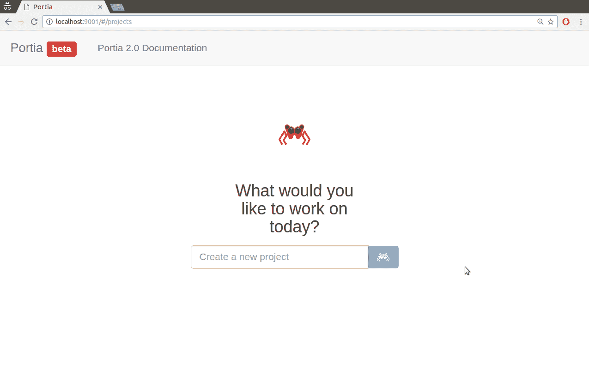
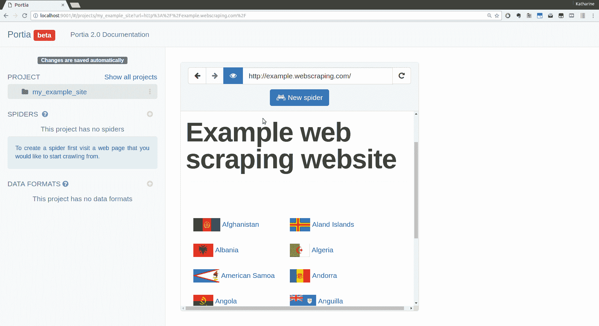
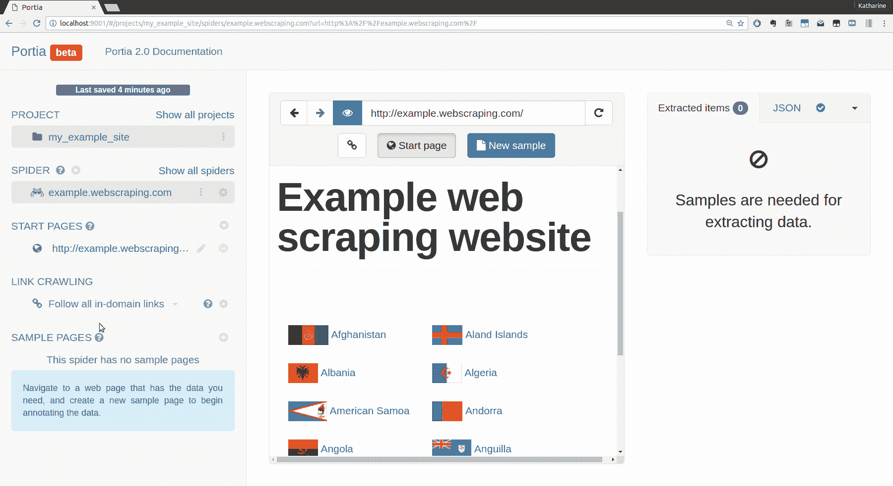
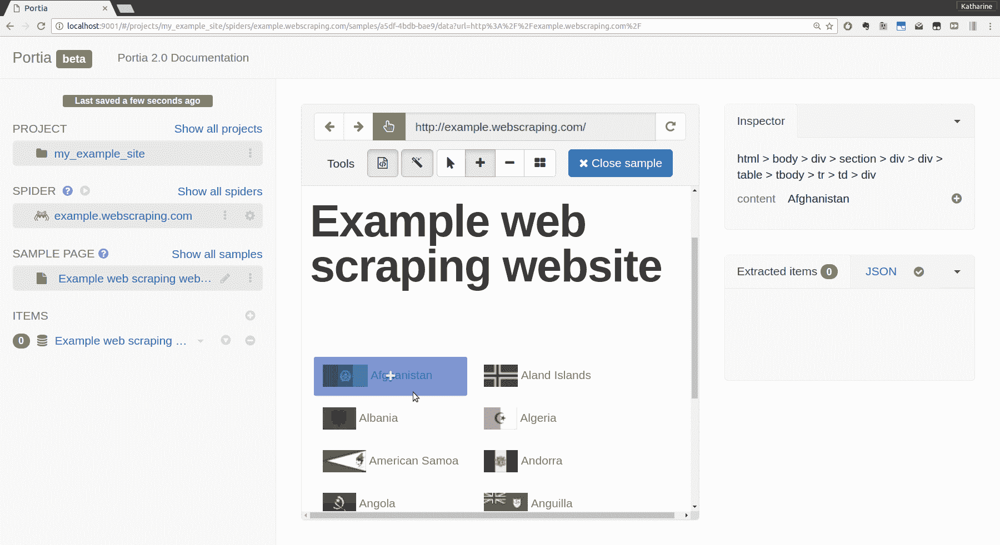
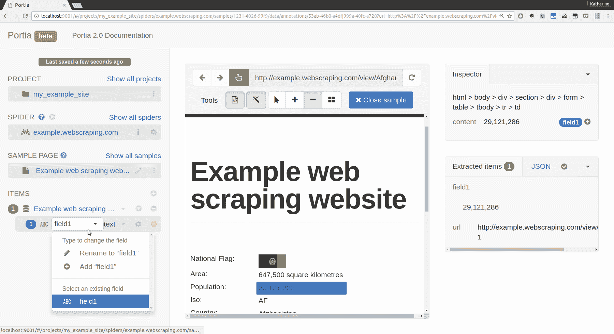
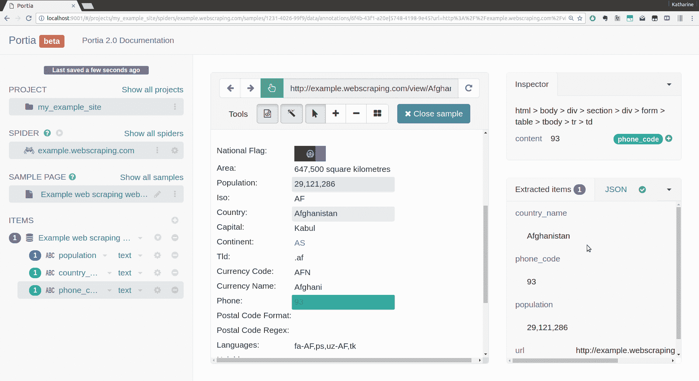
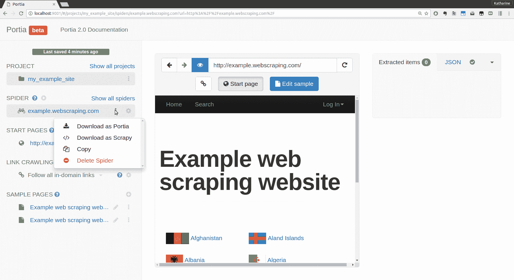

# 第八章：Scrapy

**Scrapy**是一个流行的网络抓取和爬取框架，利用高级功能使抓取网站变得更加容易。在本章中，我们将通过使用它来抓取示例网站来了解 Scrapy，就像我们在第二章“抓取数据”中所做的那样。然后，我们将介绍**Portia**，这是一个基于 Scrapy 的应用程序，它允许您通过点击界面来抓取网站。

在本章中，我们将涵盖以下主题：

+   Scrapy 入门

+   创建一个蜘蛛

+   比较不同的蜘蛛类型

+   使用 Scrapy 进行爬取

+   使用 Portia 进行可视化抓取

+   使用 Scrapely 进行自动化抓取

# 安装 Scrapy

Scrapy 可以使用`pip`命令安装，如下所示：

```py
pip install scrapy

```

Scrapy 依赖于一些外部库，所以如果您在安装时遇到问题，可以在官方网站上找到更多信息：[`doc.scrapy.org/en/latest/intro/install.html`](http://doc.scrapy.org/en/latest/intro/install.html)。

如果 Scrapy 安装正确，现在终端中将会出现一个`scrapy`命令：

```py
$ scrapy
 Scrapy 1.3.3 - no active project

Usage:
 scrapy <command> [options] [args]

Available commands:
 bench    Run quick benchmark test
 commands 
 fetch    Fetch a URL using the Scrapy downloader
...

```

在本章中，我们将使用以下命令：

+   `startproject`：创建新项目

+   `genspider`：从模板生成新的蜘蛛

+   `crawl`：运行蜘蛛

+   `shell`：启动交互式抓取控制台

关于这些和其他可用命令的详细信息，请参阅[`doc.scrapy.org/en/latest/topics/commands.html`](http://doc.scrapy.org/en/latest/topics/commands.html)。

# 启动项目

现在 Scrapy 已经安装，我们可以运行`startproject`命令来生成我们第一个 Scrapy 项目的默认结构。

要这样做，请打开终端并导航到您想要存储 Scrapy 项目的目录，然后运行`scrapy startproject <项目名称>`。在这里，我们将使用`example`作为项目名称：

```py
$ scrapy startproject example
$ cd example

```

下面是`scrapy`命令生成的文件：

```py
    scrapy.cfg 
    example/ 
        __init__.py   
        items.py
        middlewares.py   
        pipelines.py   
        settings.py   
        spiders/ 
            __init__.py 

```

本章（以及一般而言对于 Scrapy 的使用）的重要文件如下：

+   `items.py`：此文件定义了将要抓取的字段模型

+   `settings.py`：此文件定义设置，例如用户代理和爬取延迟

+   `spiders/`：实际的抓取和爬取代码存储在这个目录中

此外，Scrapy 使用`scrapy.cfg`进行项目配置，`pipelines.py`处理抓取的字段，以及`middlewares.py`控制请求和响应中间件，但在这个示例中它们不需要修改。

# 定义一个模型

默认情况下，`example/items.py`包含以下代码：

```py
# -*- coding: utf-8 -*- 
# Define here the models for your scraped items
#
# See documentation in:
# http://doc.scrapy.org/en/latest/topics/items.html

import scrapy 

class ExampleItem(scrapy.Item): 
    # define the fields for your item here like: 
    # name = scrapy.Field() 
    pass 

```

`ExampleItem`类是一个模板，需要替换为我们从示例国家页面中想要提取的详细信息。目前，我们只抓取国家名称和人口，而不是所有国家详情。以下是支持此功能的更新模型：

```py
class CountryItem(scrapy.Item): 
    name = scrapy.Field() 
    population = scrapy.Field() 

```

定义项目的完整文档可在[`doc.scrapy.org/en/latest/topics/items.html`](http://doc.scrapy.org/en/latest/topics/items.html)找到

# 创建一个蜘蛛

现在，我们可以构建实际的爬取和抓取代码，在 Scrapy 中被称为**蜘蛛**。可以使用`genspider`命令生成一个初始模板，该命令接受蜘蛛的名称、域名以及可选的模板：

```py
    $ scrapy genspider country example.webscraping.com --template=crawl

```

我们使用了内置的`crawl`模板，该模板利用了 Scrapy 库的`CrawlSpider`。Scrapy 的`CrawlSpider`在爬取网页时具有特殊的属性和方法，而不是简单的抓取蜘蛛。

运行`genspider`命令后，以下代码在`example/spiders/country.py`中生成：

```py
# -*- coding: utf-8 -*-
import scrapy 
from scrapy.linkextractors import LinkExtractor 
from scrapy.spiders import CrawlSpider, Rule 

class CountrySpider(CrawlSpider): 
    name = 'country' 
    allowed_domains = ['example.webscraping.com'] 
    start_urls = ['http://example.webscraping.com']

    rules = ( 
        Rule(LinkExtractor(allow=r'Items/'), callback='parse_item', follow=True), 
    ) 

    def parse_item(self, response): 
        i = {} 
        #i['domain_id'] = response.xpath('//input[@id="sid"]/@value').extract() 
        #i['name'] = response.xpath('//div[@id="name"]').extract() 
        #i['description'] = response.xpath('//div[@id="description"]').extract() 
        return i 

```

初始几行导入所需的 Scrapy 库和编码定义。然后，创建一个蜘蛛类，其中包含以下类属性：

+   `name`：用于标识蜘蛛的字符串

+   `allowed_domains`：可以爬取的域名列表——如果未设置，则可以爬取任何域名

+   `start_urls`：开始爬取的 URL 列表。

+   `rules`：此属性是`Rule`对象的元组，由正则表达式定义，告诉爬虫要跟随哪些链接以及哪些链接包含有用的内容可以抓取

你会注意到定义的`Rule`具有一个`callback`属性，该属性将回调设置为`parse_item`，这是定义在下面的方法。这个方法是`CrawlSpider`对象的主要数据提取方法，在该方法中生成的 Scrapy 代码有一个从页面提取内容的示例。

由于 Scrapy 是一个高级框架，这里只有几行代码就发生了很多事情。官方文档有关于构建蜘蛛的更多详细信息，可以在[`doc.scrapy.org/en/latest/topics/spiders.html`](http://doc.scrapy.org/en/latest/topics/spiders.html)找到。

# 调整设置

在运行生成的爬取蜘蛛之前，应更新 Scrapy 设置以避免蜘蛛被阻止。默认情况下，Scrapy 允许对没有延迟的域进行最多 16 个并发下载，这比真实用户浏览的速度要快得多。这种行为很容易被服务器检测和阻止。

如第一章所述，我们正在抓取的示例网站配置为暂时阻止下载速度持续超过每秒一个请求的爬虫，因此默认设置将确保我们的蜘蛛被阻止。除非你在本地运行示例网站，否则我建议将以下行添加到`example/settings.py`中，以便爬虫每次只下载一个域的单个请求，并在下载之间有合理的 5 秒延迟：

```py
CONCURRENT_REQUESTS_PER_DOMAIN = 1 
DOWNLOAD_DELAY = 5 

```

你也可以在文档中搜索并找到这些设置，使用上述值修改并取消注释它们。请注意，Scrapy 不会使用请求之间的精确延迟，因为这也会使爬虫更容易被检测和阻止。相反，它在请求之间的延迟中添加一个随机偏移量。

关于这些设置以及许多其他可用设置的详细信息，请参阅[`doc.scrapy.org/en/latest/topics/settings.html`](http://doc.scrapy.org/en/latest/topics/settings.html)。

# 测试蜘蛛

要从命令行运行蜘蛛，使用`crawl`命令并附带蜘蛛的名称：

```py
    $ scrapy crawl country -s LOG_LEVEL=ERROR
$

```

脚本运行完成，没有输出。注意`-s LOG_LEVEL=ERROR`标志——这是一个 Scrapy 设置，相当于在`settings.py`文件中定义`LOG_LEVEL = 'ERROR'`。默认情况下，Scrapy 会将所有日志消息输出到终端，所以这里日志级别被提升以隔离错误消息。这里没有输出意味着我们的蜘蛛在没有错误的情况下完成了——太好了！

为了实际上从页面中抓取一些内容，我们需要在蜘蛛文件中添加几行代码。为了确保我们可以开始构建和提取我们的项目，我们必须首先开始使用我们的`CountryItem`并更新我们的爬虫规则。以下是蜘蛛的更新版本：

```py
from example.items import CountryItem
    ...

    rules = ( 
        Rule(LinkExtractor(allow=r'/index/'), follow=True), 
        Rule(LinkExtractor(allow=r'/view/'), callback='parse_item') 
    ) 

    def parse_item():
        i = CountryItem()
        ...

```

为了提取结构化数据，我们应该使用我们创建的`CountryItem`类。在这段新增的代码中，我们导入了这个类并实例化了一个对象作为`parse_item`方法中的`i`（或项目）。

此外，我们还需要添加规则，以便我们的蜘蛛可以找到数据并提取它。默认规则搜索的 URL 模式是`r'/Items'`，在示例网站上不匹配。相反，我们可以根据我们对网站的已知信息创建两个新的规则。第一个规则将爬取索引页面并跟随它们的链接，第二个规则将爬取国家页面并将下载的响应传递给`callback`函数进行抓取。

让我们看看当这个改进的蜘蛛以`DEBUG`日志级别运行时会发生什么，这将显示更多的爬取消息：

```py
$ scrapy crawl country -s LOG_LEVEL=DEBUG
...
2017-03-24 11:52:42 [scrapy.core.engine] DEBUG: Crawled (200) <GET     http://example.webscraping.com/view/Belize-23> (referer: http://example.webscraping.com/index/2)
2017-03-24 11:52:49 [scrapy.core.engine] DEBUG: Crawled (200) <GET http://example.webscraping.com/view/Belgium-22> (referer: http://example.webscraping.com/index/2)
2017-03-24 11:52:53 [scrapy.extensions.logstats] INFO: Crawled 40 pages (at 10 pages/min), scraped 0 items (at 0 items/min)
2017-03-24 11:52:56 [scrapy.core.engine] DEBUG: Crawled (200) <GET http://example.webscraping.com/user/login?_next=%2Findex%2F0> (referer: http://example.webscraping.com/index/0)
2017-03-24 11:53:03 [scrapy.core.engine] DEBUG: Crawled (200) <GET http://example.webscraping.com/user/register?_next=%2Findex%2F0> (referer: http://example.webscraping.com/index/0)
... 

```

这条日志输出显示索引页面和国家正在被爬取，并且重复链接被过滤，这很有用。我们还可以看到当我们第一次启动爬虫时，安装的中间件和其他重要信息被输出。

然而，我们也注意到蜘蛛正在通过爬取每个网页中链接的登录和注册表单而浪费资源，因为这些表单与`rules`正则表达式匹配。前一个命令中的登录 URL 以`_next=%2Findex%2F1`结尾，这是 URL 编码的`_next=/index/1`，定义了登录后的重定向。为了防止这些 URL 被爬取，我们可以使用规则的`deny`参数，它也期望一个正则表达式，并将防止爬取每个匹配的 URL。

这里是防止爬取包含`/user/`的 URL 的用户登录和注册表单的代码更新版本：

```py
    rules = ( 
        Rule(LinkExtractor(allow=r'/index/', deny=r'/user/'), follow=True), 
        Rule(LinkExtractor(allow=r'/view/', deny=r'/user/'), callback='parse_item') 
    ) 

```

关于如何使用 LinkExtractor 类的进一步文档可在[`doc.scrapy.org/en/latest/topics/link-extractors.html`](http://doc.scrapy.org/en/latest/topics/link-extractors.html)找到。

要停止当前爬取并使用新代码重新启动，你可以使用 *Ctrl* + *C* 或 *cmd* + *C* 发送退出信号。然后你应该会看到一条类似以下的消息：

```py
2017-03-24 11:56:03 [scrapy.crawler] INFO: Received SIG_SETMASK, shutting down gracefully. Send again to force 

```

它将完成队列中的请求然后停止。你会在最后看到一些额外的统计信息和调试信息，我们将在本节后面讨论。

除了向爬虫添加拒绝规则外，你还可以为 `Rule` 对象使用 `process_links` 参数。这允许你创建一个函数，该函数遍历找到的链接并对它们进行任何修改（例如删除或添加查询字符串的部分）。有关爬取规则的更多信息，请参阅文档：[`doc.scrapy.org/en/latest/topics/spiders.html#crawling-rules`](https://doc.scrapy.org/en/latest/topics/spiders.html#crawling-rules)

# 不同的爬虫类型

在这个 Scrapy 示例中，我们使用了 Scrapy 的 `CrawlSpider`，这在爬取网站或一系列网站时特别有用。Scrapy 还有其他一些你可能想要使用的爬虫，具体取决于网站和你的提取需求。这些爬虫属于以下类别：

+   `Spider`：一个普通的爬取爬虫。这通常用于仅爬取一种类型的页面。

+   `CrawlSpider`：一个爬取爬虫；通常用于遍历域名并从它通过爬取链接找到的页面中爬取一种（或几种）类型的页面。

+   `XMLFeedSpider`：一个遍历 XML 提要并从每个节点中提取内容的爬虫。

+   `CSVFeedSpider`：类似于 XML 爬虫，但可以解析提要中的 CSV 行。

+   `SitemapSpider`：一个可以首先解析 Sitemap 以使用不同规则的爬虫。

这些爬虫都包含在你的默认 Scrapy 安装中，因此你可以随时访问它们，以便在需要构建新的网络爬虫时使用。在本章中，我们将完成第一个爬取爬虫的构建，作为如何使用 Scrapy 工具的第一个示例。

# 使用 shell 命令进行爬取

现在 Scrapy 可以爬取国家，我们可以定义要爬取的数据。为了帮助测试如何从网页中提取数据，Scrapy 提供了一个名为 `shell` 的便捷命令，它通过 Python 或 IPython 解释器向我们展示 Scrapy API。

我们可以使用我们想要开始的 URL 来调用命令，如下所示：

```py
$ scrapy shell http://example.webscraping.com/view/United-Kingdom-239 ...
[s] Available Scrapy objects:
[s] scrapy     scrapy module (contains scrapy.Request, scrapy.Selector, etc)
[s] crawler    <scrapy.crawler.Crawler object at 0x7fd18a669cc0>
[s] item       {}
[s] request    <GET http://example.webscraping.com/view/United-Kingdom-239>
[s] response   <200 http://example.webscraping.com/view/United-Kingdom-239>
[s] settings   <scrapy.settings.Settings object at 0x7fd189655940>
[s] spider     <CountrySpider 'country' at 0x7fd1893dd320>
[s] Useful shortcuts:
[s] fetch(url[, redirect=True]) Fetch URL and update local objects (by default, redirects are followed)
[s] fetch(req)                  Fetch a scrapy.Request and update local objects 
[s] shelp()                     Shell help (print this help)
[s] view(response)              View response in a browser
In [1]: 

```

我们现在可以查询 `response` 对象以检查可用的数据。

```py
In [1]: response.url 
Out[1]:'http://example.webscraping.com/view/United-Kingdom-239' 
In [2]: response.status 
Out[2]: 200 

```

Scrapy 使用 `lxml` 爬取数据，因此我们可以使用与 第二章 中相同的 CSS 选择器，*爬取数据*：

```py
In [3]: response.css('tr#places_country__row td.w2p_fw::text') 
[<Selector xpath=u"descendant-or-self:: 
 tr[@id = 'places_country__row']/descendant-or-self:: 
 */td[@class and contains( 
 concat(' ', normalize-space(@class), ' '), 
 ' w2p_fw ')]/text()" data=u'United Kingdom'>] 

```

该方法返回一个包含 `lxml` 选择器的列表。你也可能认识 Scrapy 和 `lxml` 用于选择项的一些 XPath 语法。正如我们在 第二章 中所学的，*爬取数据*，`lxml` 在提取内容之前将所有 CSS 选择器转换为 XPath。

为了实际上从这一行获取文本，我们必须调用 `extract()` 方法：

```py
In [4]: name_css = 'tr#places_country__row td.w2p_fw::text' 

In [5]: response.css(name_css).extract() 
Out[5]: [u'United Kingdom'] 

In [6]: pop_xpath = '//tr[@id="places_population__row"]/td[@class="w2p_fw"]/text()' 

In [7]: response.xpath(pop_xpath).extract()
Out[7]: [u'62,348,447']

```

如我们从上面的输出中可以看到，Scrapy 的`response`对象可以使用`css`和`xpath`进行解析，这使得它在获取明显和难以到达的内容方面非常灵活。

这些选择器可以用于之前在`example/spiders/country.py`中生成的`parse_item()`方法。注意，我们使用字典语法设置`scrapy.Item`对象的属性：

```py
def parse_item(self, response): 
    item = CountryItem() 
    name_css = 'tr#places_country__row td.w2p_fw::text' 
    item['name'] = response.css(name_css).extract() 
    pop_xpath = '//tr[@id="places_population__row"]/td[@class="w2p_fw"]/text()'
    item['population'] = response.xpath(pop_xpath).extract() 
    return item

```

# 检查结果

这里是我们蜘蛛的完成版本：

```py
class CountrySpider(CrawlSpider): 
    name = 'country' 
    start_urls = ['http://example.webscraping.com/'] 
    allowed_domains = ['example.webscraping.com'] 
    rules = ( 
        Rule(LinkExtractor(allow=r'/index/', deny=r'/user/'), follow=True), 
        Rule(LinkExtractor(allow=r'/view/', deny=r'/user/'), callback='parse_item') 
    ) 

    def parse_item(self, response): 
        item = CountryItem() 
        name_css = 'tr#places_country__row td.w2p_fw::text' 
        item['name'] = response.css(name_css).extract()
        pop_xpath = '//tr[@id="places_population__row"]/td[@class="w2p_fw"]/text()'
        item['population'] = response.xpath(pop_xpath).extract() 
        return item

```

要保存结果，我们可以定义一个 Scrapy 管道或在`settings.py`文件中设置输出设置。然而，Scrapy 还提供了一个方便的`--output`标志，可以轻松地将抓取的项目自动保存为 CSV、JSON 或 XML 格式。

当蜘蛛的最终版本运行并输出到 CSV 文件，并将日志级别设置为`INFO`时，以下是结果，用于过滤掉不太重要的消息：

```py
$ scrapy crawl country --output=../../../data/scrapy_countries.csv -s LOG_LEVEL=INFO 2017-03-24 14:20:25 [scrapy.extensions.logstats] INFO: Crawled 277 pages (at 10 pages/min), scraped 249 items (at 9 items/min)
2017-03-24 14:20:42 [scrapy.core.engine] INFO: Closing spider (finished)
2017-03-24 14:20:42 [scrapy.statscollectors] INFO: Dumping Scrapy stats:
{'downloader/request_bytes': 158580,
 'downloader/request_count': 280,
 'downloader/request_method_count/GET': 280,
 'downloader/response_bytes': 944210,
 'downloader/response_count': 280,
 'downloader/response_status_count/200': 280,
 'dupefilter/filtered': 61,
 'finish_reason': 'finished',
 'finish_time': datetime.datetime(2017, 3, 24, 13, 20, 42, 792220),
 'item_scraped_count': 252,
 'log_count/INFO': 35,
 'request_depth_max': 26,
 'response_received_count': 280,
 'scheduler/dequeued': 279,
 'scheduler/dequeued/memory': 279,
 'scheduler/enqueued': 279,
 'scheduler/enqueued/memory': 279,
 'start_time': datetime.datetime(2017, 3, 24, 12, 52, 25, 733163)}
2017-03-24 14:20:42 [scrapy.core.engine] INFO: Spider closed (finished) 

```

在爬取结束时，Scrapy 输出一些统计信息，以指示爬取的表现。从这些统计信息中，我们知道爬取了 280 个网页，抓取了 252 个项目，这是数据库中预期的国家数量，因此我们知道爬虫能够找到它们所有。

您需要从 Scrapy 创建的生成文件夹中运行 Scrapy 蜘蛛和爬取命令（对于我们的项目，这是使用`startproject`命令创建的`example/`目录）。蜘蛛使用`scrapy.cfg`和`settings.py`文件来确定如何以及在哪里进行爬取，并设置蜘蛛路径以用于爬取或抓取。

为了验证这些国家是否正确抓取，我们可以检查`countries.csv`文件的内容：

```py
name,population 
Afghanistan,"29,121,286" 
Antigua and Barbuda,"86,754" 
Antarctica,0 
Anguilla,"13,254" 
Angola,"13,068,161" 
Andorra,"84,000" 
American Samoa,"57,881" 
Algeria,"34,586,184" 
Albania,"2,986,952" 
Aland Islands,"26,711" 
... 

```

如预期的那样，这个 CSV 文件包含了每个国家的名称和人口。抓取这些数据所需的代码比第二章中构建的原生爬虫要少，因为 Scrapy 提供了高级功能以及内置的 CSV 编写器等优秀的内置功能。

在以下关于 Portia 的部分，我们将重新实现这个抓取器，编写更少的代码。

# 中断和恢复爬取

有时在爬取网站时，暂停爬取并在稍后时间恢复它，而不需要从头开始，这可能很有用。例如，您可能需要在软件更新后中断爬取以重置计算机，或者，您正在爬取的网站正在返回错误，您希望在稍后继续爬取。

便利的是，Scrapy 自带了暂停和恢复爬取的功能，无需修改我们的示例蜘蛛。要启用此功能，我们只需定义`JOBDIR`设置，指定一个目录，用于保存爬取的当前状态。注意，必须使用不同的目录来保存多个爬取的状态。

这里是一个使用此功能的蜘蛛示例：

```py
$ scrapy crawl country -s LOG_LEVEL=DEBUG -s JOBDIR=../../../data/crawls/country
...
2017-03-24 13:41:54 [scrapy.core.engine] DEBUG: Crawled (200) <GET http://example.webscraping.com/view/Anguilla-8> (referer: http://example.webscraping.com/)
2017-03-24 13:41:54 [scrapy.core.scraper] DEBUG: Scraped from <200 http://example.webscraping.com/view/Anguilla-8>
{'name': ['Anguilla'], 'population': ['13,254']}
2017-03-24 13:41:59 [scrapy.core.engine] DEBUG: Crawled (200) <GET http://example.webscraping.com/view/Angola-7> (referer: http://example.webscraping.com/)
2017-03-24 13:41:59 [scrapy.core.scraper] DEBUG: Scraped from <200 http://example.webscraping.com/view/Angola-7>
{'name': ['Angola'], 'population': ['13,068,161']}
2017-03-24 13:42:04 [scrapy.core.engine] DEBUG: Crawled (200) <GET http://example.webscraping.com/view/Andorra-6> (referer: http://example.webscraping.com/)
2017-03-24 13:42:04 [scrapy.core.scraper] DEBUG: Scraped from <200 http://example.webscraping.com/view/Andorra-6>
{'name': ['Andorra'], 'population': ['84,000']}
^C2017-03-24 13:42:10 [scrapy.crawler] INFO: Received SIG_SETMASK, shutting down gracefully. Send again to force 
...
[country] INFO: Spider closed (shutdown)

```

在显示`Received SIG_SETMASK`的行中，我们看到了一个`^C`，这与我们在本章早期用来停止爬虫的相同*Ctrl* + *C* 或 *cmd* + *C*。为了使 Scrapy 保存爬取状态，你必须在这里等待爬取优雅地关闭，并抵制再次输入终止序列以强制立即关闭的诱惑！爬取的状态现在将被保存在数据目录下的`crawls/country`中。如果我们查看该目录，我们可以看到保存的文件（注意，对于 Windows 用户，这个命令和目录语法需要做出调整）：

```py
$ ls ../../../data/crawls/country/
requests.queue requests.seen spider.state

```

可以通过运行相同的命令来恢复爬取：

```py
$ scrapy crawl country -s LOG_LEVEL=DEBUG -s JOBDIR=../../../data/crawls/country
...
2017-03-24 13:49:49 [scrapy.core.engine] INFO: Spider opened
2017-03-24 13:49:49 [scrapy.core.scheduler] INFO: Resuming crawl (13 requests scheduled)
2017-03-24 13:49:49 [scrapy.extensions.logstats] INFO: Crawled 0 pages (at 0 pages/min), scraped 0 items (at 0 items/min)
2017-03-24 13:49:49 [scrapy.extensions.telnet] DEBUG: Telnet console listening on 127.0.0.1:6023
2017-03-24 13:49:49 [scrapy.core.engine] DEBUG: Crawled (200) <GET http://example.webscraping.com/robots.txt> (referer: None)
2017-03-24 13:49:54 [scrapy.core.engine] DEBUG: Crawled (200) <GET http://example.webscraping.com/view/Cameroon-40> (referer: http://example.webscraping.com/index/3)
2017-03-24 13:49:54 [scrapy.core.scraper] DEBUG: Scraped from <200 http://example.webscraping.com/view/Cameroon-40>
{'name': ['Cameroon'], 'population': ['19,294,149']}
...

```

现在爬取从暂停的地方恢复，并继续正常进行。这个特性对于我们的示例网站来说并不特别有用，因为要下载的页面数量是可管理的。然而，对于可能需要数月才能爬取的大型网站，能够暂停和恢复爬取是非常方便的。

在这里没有涵盖的一些边缘情况可能会在恢复爬取时引起问题，例如过期的 cookies 和会话。这些内容在 Scrapy 文档中有提及，文档可在[`doc.scrapy.org/en/latest/topics/jobs.html`](http://doc.scrapy.org/en/latest/topics/jobs.html)找到。

# Scrapy 性能调优

如果我们检查示例网站的初始完整爬取，并查看开始和结束时间，我们可以看到爬取大约花费了 1,697 秒。如果我们计算每页的平均秒数，那么大约是每页 6 秒。知道我们没有使用 Scrapy 的并发功能，并且完全清楚我们在请求之间添加了大约 5 秒的延迟，这意味着 Scrapy 每页大约以 1 秒的速度解析和提取数据（回想一下第二章，*爬取数据*，我们使用 XPath 的最快爬虫花费了 1.07 秒）。我在 2014 年的 PyCon 上发表了一个关于比较网络爬虫库速度的演讲，即使那时，Scrapy 也比我能找到的任何其他爬虫框架都要快得多。我能够编写一个简单的 Google 搜索爬虫，它平均每秒返回 100 个请求。自从那时以来，Scrapy 已经取得了长足的进步，我总是推荐它作为最有效的 Python 爬虫框架。

除了利用 Scrapy 使用的并发性（通过 Twisted），Scrapy 还可以调整以使用页面缓存和其他性能考虑因素（例如利用代理以允许对单个站点进行更多并发请求）。为了安装缓存，您应首先阅读缓存中间件文档（[`doc.scrapy.org/en/latest/topics/downloader-middleware.html#module-scrapy.downloadermiddlewares.httpcache`](https://doc.scrapy.org/en/latest/topics/downloader-middleware.html#module-scrapy.downloadermiddlewares.httpcache)）。您可能已经在`settings.py`文件中看到了一些如何实现适当的缓存设置的示例。对于代理的实现，有一些优秀的辅助库（因为 Scrapy 只提供了简单的中间件类访问）。目前最受欢迎且更新最快的库是[`github.com/aivarsk/scrapy-proxies`](https://github.com/aivarsk/scrapy-proxies)，它支持 Python3 并且相对容易集成。

与往常一样，库和推荐设置可能会变化，因此当检查性能和进行蜘蛛更改时，阅读最新的 Scrapy 文档始终是您的首选。

# 使用 Portia 进行视觉抓取

Portia 是一个基于 Scrapy 构建的开源工具，支持通过点击需要抓取的网站部分来构建蜘蛛。这种方法可能比手动创建 CSS 或 XPath 选择器更方便。

# 安装

Portia 是一个强大的工具，它依赖于多个外部库来实现其功能。它也是相对较新的，因此目前安装步骤相对复杂。如果将来简化了安装过程，最新文档可以在[`github.com/scrapinghub/portia#running-portia`](https://github.com/scrapinghub/portia#running-portia)找到。当前推荐运行 Portia 的方式是使用 Docker（开源容器框架）。如果您尚未安装 Docker，您需要首先按照最新说明进行安装（[`docs.docker.com/engine/installation/`](https://docs.docker.com/engine/installation/)）。

Docker 安装并运行后，您可以拉取`scrapinghub`镜像并开始使用。首先，您应该位于您想要创建新 Portia 项目的目录中，并运行如下命令：

```py
$ docker run -v ~/portia_projects:/app/data/projects:rw -p 9001:9001 scrapinghub/portia:portia-2.0.7
Unable to find image 'scrapinghub/portia:portia-2.0.7' locally
latest: Pulling from scrapinghub/portia ...
2017-03-28 12:57:42.711720 [-] Site starting on 9002
2017-03-28 12:57:42.711818 [-] Starting factory <slyd.server.Site instance at 0x7f57334e61b8>

```

在命令中，我们在`~/portia_projects`创建了一个新文件夹。如果您希望将 Portia 项目存储在其他位置，请将`-v`命令更改为指向您希望存储 Portia 文件的绝对文件路径。

最后几行显示 Portia 网站现在已上线并运行。现在您可以在您的网络浏览器中通过`http://localhost:9001/`访问该网站。

您的初始屏幕应类似于以下内容：



如果在安装过程中遇到问题，建议检查[`github.com/scrapinghub/portia/issues`](https://github.com/scrapinghub/portia/issues)页面，以防其他人遇到过相同的问题并找到了解决方案。在这本书中，我使用了特定的 Portia 图像（`scrapinghub/portia:portia-2.0.7`），但您也可以尝试使用最新的官方版本`scrapinghub/portia`。

此外，我建议始终使用 README 文件和 Portia 文档中记录的最新推荐指令，即使它们与本节中涵盖的指令不同。Portia 正在积极开发中，指令可能在本书出版后发生变化。

# 标注

在 Portia 起始页面上，页面提示您输入一个项目。一旦输入该文本，就会出现一个文本框，用于输入您想要抓取的网站 URL，例如[`example.webscraping.com`](http://example.webscraping.com)。

当您输入后，Portia 将加载项目视图：



一旦点击“新建蜘蛛”按钮，您将看到以下蜘蛛视图：



您将开始识别一些来自本章前面已构建的 Scrapy 蜘蛛的字段（例如起始页面和链接抓取规则）。默认情况下，蜘蛛名称设置为域名（example.webscraping.com），可以通过点击标签进行修改。

接下来，点击“新示例”按钮开始从页面收集数据：



现在，当您将鼠标悬停在页面上的不同元素上时，您将看到它们被突出显示。您还可以在网站区域右侧的检查器标签中看到 CSS 选择器。

因为我们想要抓取个人国家页面上的人口元素，我们首先需要从主页导航到个人国家页面。为此，我们首先需要点击“关闭示例”，然后点击任何国家。当国家页面加载时，我们再次点击“新示例”。

要开始添加字段到我们的提取项中，我们可以点击“population”字段。当我们这样做时，将添加一个项，我们可以看到提取的信息：



我们可以通过使用左侧的文本字段区域并简单地输入新名称“population”来重命名字段。然后，我们可以点击“添加字段”按钮。要添加更多字段，我们可以通过首先点击大号+按钮，然后以相同的方式选择字段值来实现。标注的字段将在网页中被突出显示，您可以在提取项部分看到提取的数据。



如果你想要删除任何字段，你只需简单地使用字段名旁边的红色减号即可。当注释完成时，点击顶部蓝色的“关闭样本”按钮。如果你当时想要下载蜘蛛以在 Scrapy 项目中运行，你可以通过点击蜘蛛名称旁边的链接来完成：



你也可以在挂载文件夹 `~/portia_projects` 中看到你所有的蜘蛛和设置。

# 运行蜘蛛

如果你正在以 Docker 容器形式运行 Portia，你可以使用相同的 Docker 镜像运行 `portiacrawl` 命令。首先，使用 *Ctrl* + *C* 停止你的当前容器。然后，你可以运行以下命令：

`docker run -i -t --rm -v ~/portia_projects:/app/data/projects:rw -v <OUTPUT_FOLDER>:/mnt:rw -p 9001:9001 scrapinghub/portia portiacrawl /app/data/projects/<PROJECT_NAME> example.webscraping.com -o /mnt/example.webscraping.com.jl`

确保更新 OUTPUT_FOLDER 为你想要存储输出文件的绝对路径，而 PROJECT_NAME 变量是你开始项目时使用的名称（我的例子是 my_example_site）。你应该会看到与运行 Scrapy 时类似的输出。你可能还会注意到错误信息（这是由于没有更改下载延迟或并行请求——这两者都可以通过在网页界面中更改项目和蜘蛛设置来完成）。你还可以在运行蜘蛛时使用 `-s` 标志传递额外的设置。我的命令看起来像这样：

``docker run -i -t --rm -v ~/portia_projects:/app/data/projects:rw -v ~/portia_output:/mnt:rw -p 9001:9001 scrapinghub/portia portiacrawl /app/data/projects/my_example_site example.webscraping.com -o /mnt/example.webscraping`.com.jl`-s CONCURRENT_REQUESTS_PER_DOMAIN=1 -s DOWNLOAD_DELAY=5``

# 检查结果

当蜘蛛完成工作后，你可以在你创建的输出文件夹中检查你的结果：

`$ head ~/portia_output/example.webscraping.com.jl {"_type": "示例网络爬虫网站 1", "url": "http://example.webscraping.com/view/Antigua-and-Barbuda-10", "phone_code": ["+1-268"], "_template": "98ed-4785-8e1b", "country_name": ["安提瓜和巴布达"], "population": ["86,754"]} {"_template": "98ed-4785-8e1b", "country_name": ["南极洲"], "_type": "示例网络爬虫网站 1", "url": "http://example.webscraping.com/view/Antarctica-9", "population": ["0"]} {"_type": "示例网络爬虫网站 1", "url": "http://example.webscraping.com/view/Anguilla-8", "phone_code": ["+1-264"], "_template": "98ed-4785-8e1b", "country_name": ["安圭拉"], "population": ["13,254"]} ...`

这里有一些你爬取结果的示例。如你所见，它们是 JSON 格式。如果你想要导出为 CSV 格式，你只需简单地更改输出文件名，使其以 `.csv` 结尾。

只需在网站上点击几下，并为 Docker 提供一些指令，您就已经抓取了示例网站！Portia 是一个方便的工具，特别是对于简单的网站，或者如果您需要与非开发者协作。另一方面，对于更复杂的网站，您始终有直接在 Python 中开发 Scrapy 爬虫或使用 Portia 开发第一迭代并使用自己的 Python 技能进行扩展的选择。

# 使用 Scrapely 进行自动化抓取

对于抓取标注字段，Portia 使用一个名为**Scrapely ([`github.com/scrapy/scrapely`](https://github.com/scrapy/scrapely))**的库，这是一个独立于 Portia 开发的非常有用的开源工具。Scrapely 使用训练数据来构建从网页上抓取内容的模型。训练好的模型可以应用于抓取具有相同结构的其他网页。

您可以使用 pip 进行安装：

```py
pip install scrapely

```

这里有一个例子来展示它是如何工作的：

```py

>>> from scrapely import Scraper
>>> s = Scraper()
>>> train_url = 'http://example.webscraping.com/view/Afghanistan-1'
>>> s.train(train_url, {'name': 'Afghanistan', 'population': '29,121,286'})
>>> test_url = 'http://example.webscraping.com/view/United-Kingdom-239'
>>> s.scrape(test_url)
[{u'name': [u'United Kingdom'], u'population': [u'62,348,447']}]

```

首先，Scrapely 被赋予从`阿富汗`网页上抓取的数据来训练模型（这里，是国家名称和人口）。然后，这个模型被应用于不同国家的网页，Scrapely 使用训练好的模型正确地返回这里的国家名称和人口。

这种工作流程允许在不了解网页结构的情况下抓取网页，只需知道您想要从训练案例（或多个训练案例）中提取的所需内容。如果网页的内容是静态的，但布局在变化，这种方法尤其有用。例如，对于新闻网站，已发布的文章文本很可能不会改变，尽管布局可能会更新。在这种情况下，Scrapely 可以使用相同的数据重新训练，以生成针对新网站结构的模型。为了使这个例子正常工作，您需要将您的训练数据存储在某个地方以供重用。

这里用来测试 Scrapely 的示例网页结构良好，每个数据类型都有独立的标签和属性，因此 Scrapely 能够正确且容易地训练一个模型。对于更复杂的网页，Scrapely 可能无法正确定位内容。Scrapely 文档警告您应该“谨慎训练”。随着机器学习的速度和易用性不断提高，可能一个更健壮的自动化网络抓取库将被发布；目前，了解如何使用本书中涵盖的技术直接抓取网站仍然非常有用。

# 摘要

本章介绍了 Scrapy，这是一个具有许多高级功能的网络抓取框架，可以提高抓取网站时的效率。此外，我们还介绍了 Portia，它提供了一个可视化界面来生成 Scrapy 爬虫。最后，我们测试了 Scrapely，这是 Portia 用来通过首先训练一个简单模型来自动抓取网页的库。

在下一章中，我们将把到目前为止学到的技能应用到一些真实世界的网站上。
