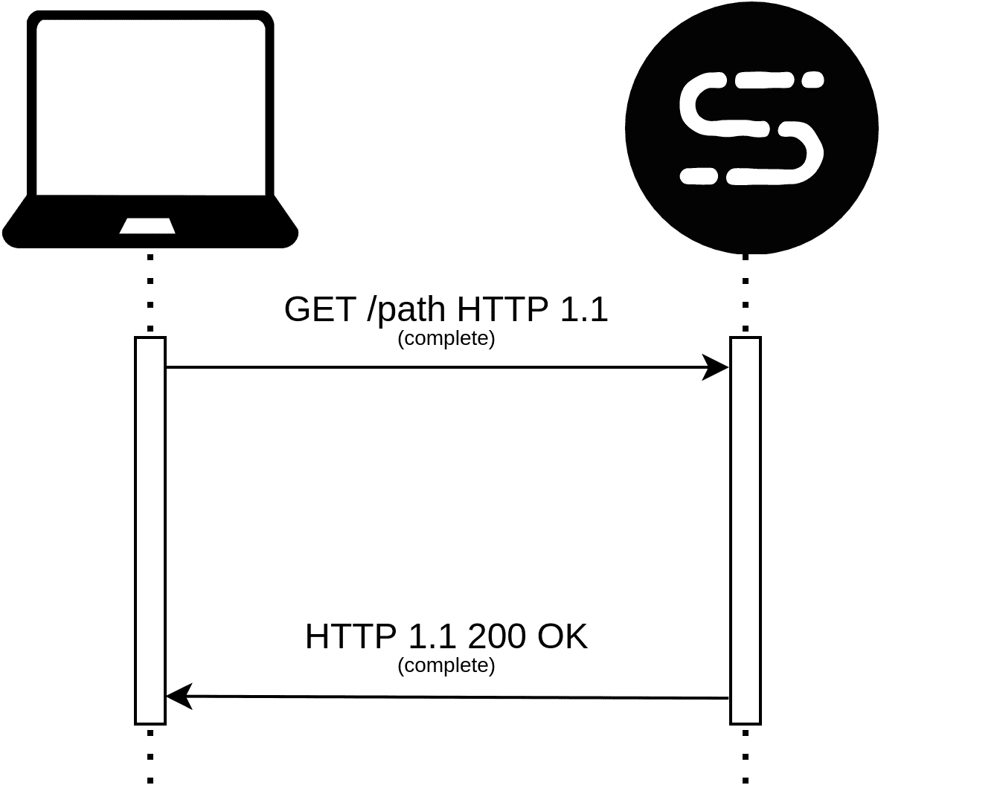
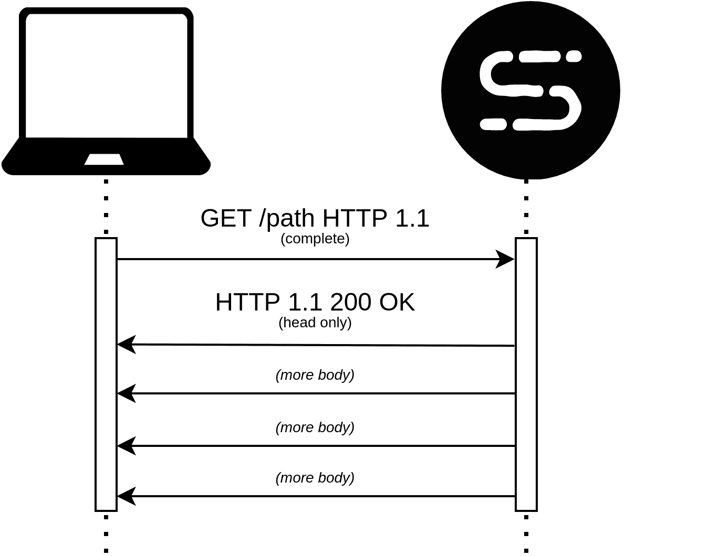

# 第五章：4 摄入 HTTP 数据

应用程序开发中的下一个构建块涉及**数据**。没有数据，Web 几乎没有实用性。我并不想在这里过于哲学化，但一个公理是，互联网的目的是促进数据从一地到另一地的传输。因此，对我们作为网络专业人士的发展来说，了解数据如何从我们的应用程序（我们在*第五章*，“处理和响应用户视图”中处理）传输出去，以及如何传输到我们的应用程序（这是本章的目的）至关重要。我们可以构建的最简单的应用程序只是提供数据。但为了成为参与全球知识交流的交互式 Web 应用程序，即使是简单的应用程序也必须能够从 Web 请求中提取数据。

没有接收数据的 Web 应用程序就像屏幕录制。观众可以来观看演示，但演讲者与观看的人没有任何*个人*联系。在 COVID-19 全球大流行期间，我很幸运还能参加几个 Python 会议。许多掌声应归功于那些推动前进、向社区提供技术会议中存在的分享和学习氛围的志愿者。然而，我必须指出，作为一个演讲者，我甚至不知道有多少人观看了我的内容。

这种模型可以用来向需要从中获取信息的人传播信息。然而，这种交易完全是单方面的。我的演示无法根据观众的线索进行调整，即使在聊天或问答环节，也缺少了人际交往的经验。同样，没有接收数据的 Web 应用程序在类似的原则下运行。服务器不知道谁在收听，无法根据用户输入改变其行为或内容。这类应用程序纯粹是为了传播数据和资源。

这种类型的 Web API 通常只有`GET`方法，因为它们完全是为了返回信息而存在的。它们可以用于传递有关天气、航班详情或其他许多人都可能希望访问的信息集中存储库的信息。

要构建一个真正交互式的 API，我们需要它不像屏幕录制那样操作，而更像视频聊天。对话的双方都将参与信息的来回传递。正是这种双向通信，我们将在本章中探讨。

如果你还记得我们之前的讨论，原始 HTTP 请求中有三个主要部分：**第一行**、**HTTP 头信息**和**正文**。到目前为止，我们一直专注于与 HTTP 方法和路径相关的 HTTP 请求的接收：这些信息都出现在 HTTP 请求的第一行中。

在本章中，我们将学习如何从客户端的所有三个部分获取数据。数据可以通过查询参数、头信息和当然还有正文本身传递给 Web 服务器。因此，在本章中，我们将探讨：

+   从 cookies 和头信息中提取数据

+   使用查询参数、上传的文件和 JSON 数据中的数据

+   验证接收到的数据是否符合预期

## 技术要求

在本章中，你应该拥有与之前章节相同的工具，以便能够跟随示例（IDE、现代 Python 和 curl）。你可以通过 GitHub 访问本章的源代码：[`github.com/PacktPublishing/Web-Development-with-Sanic/tree/main/chapters/04`](https://github.com/PacktPublishing/Web-Development-with-Sanic/tree/main/chapters/04)。

## 读取 cookies 和头信息

正如我们在本书的前几章中看到的那样，当任何 HTTP 客户端向 Web 服务器发送请求时，它包括一个或多个键/值对形式的头信息。这些头信息旨在成为客户端和服务器之间元对话的一部分。由于 HTTP 连接是一个双向交易，包括请求和响应，我们必须记住请求头和响应头之间的区别。

本章仍然只关注 HTTP 请求。因此，我们只涵盖与请求头相关的材料。这一点值得指出，因为有些头信息在请求和响应中都常见。一个这样的例子是*Content-Type*，它既可用于 HTTP 请求，也可用于 HTTP 响应。所以，例如，当我们在本节中讨论*Content-Type*时，它仅与 HTTP 请求相关。讨论响应头的时间和地点是存在的。你可以自由地跳过，或者与*第五章，处理和响应视图*一起阅读这一节，我们将讨论同一枚硬币的另一面。

### 头信息是灵活的

HTTP 头信息并非魔法。不存在预定义的、有限的头名称列表。此外，偏离被认为是*标准*的内容对您的应用程序没有任何影响。记得我们之前讨论 HTTP 方法时，我们说你可以发明自己的方法吗？好吧，你也有这样的控制和能力来创建自己的*头信息*。

这种做法实际上是受到鼓励并且很常见的。你熟悉**Cloudflare**吗？简而言之，Cloudflare 是一个流行的工具，用作 Web 应用的代理。我们将在*第八章，运行服务器*中进一步讨论代理。这个想法很简单：Cloudflare 运行一个 Web 服务器，一个请求进入他们的服务器，他们对它进行一些操作，然后将请求捆绑起来并发送到你的服务器。当他们这样做时，他们会包含他们自己的一套非标准头。例如，他们将通过`CF-Connection-IP`和`CF-IPCountry`头将请求转发给你，以提供一些关于 IP 地址及其来源位置的有用信息。

让我们想象一下，我们正在构建一个用于农民市场的 API。他们希望设置一个 Web API，以帮助协调市场中的各种参与者：农民、餐馆老板和消费者。我们想要构建的第一个端点将用于提供有关某一天市场摊位的信息：

```py
@app.get("/stalls/<market_date:ymd>")
async def market_stalls(request: Request, market_date: date):
    info = await fetch_stall_info(market_date)
    return json({"stalls": info})
```

来自此端点的响应内容不需要身份验证（关于这一点将在后面讨论），但确实应该针对每种用户类型进行定制。农民可能想知道有多少摊位可用。而消费者和餐馆老板可能更感兴趣的是了解将有哪些产品可供选择。因此，我们已经为同一端点确定了至少两种不同的使用场景。

一种选择可能是将这个单一端点拆分为两个：`/stalls/<market_date:ymd>/availability` 和 `/stalls/<market_date:ymd>/products`

然而，这确实给整体 API 设计增加了一些复杂性。此外，在这个上下文中使用的`availability`和`products`并不是真正的资源。给它们自己的端点可能会弄乱我们 API 到目前为止的结构。

我们真正想要表达的是，我们有一个单一的资源——一年中某一天的市场摊位集合——我们只想根据参与者类型以不同的方式展示这些资源。这实际上只有一个端点，但有两种不同的方式来展示相同的信息。

可能的另一种选择是使用查询参数（关于这些内容将在本章的*查询参数*部分进一步讨论）。这看起来可能是这样的：`/stalls/<market_date:ymd>?participant=farmer` 和 `/stalls/<market_date:ymd>?participant=consumer`。这也多少打破了查询参数的范式——至少是我喜欢使用它们的方式——它们通常被用来过滤和排序结果。

相反，我们将选择为我们的用例创建一个自定义头：`Participant-Type: farmer`。我们还将创建一个枚举来帮助我们验证和限制可接受的参与者：

```py
from enum import Enum, auto
class ParticipantType(Enum):
    UNKNOWN = auto()
    FARMER = auto()
    RESTAURANT = auto()
    CONSUMER = auto()
@app.get("/stalls/<market_date:ymd>")
async def market_stalls(request: Request, market_date: date):
    header = request.headers.get("participant-type", "unknown")
    try:
        paticipant_type = ParticipantType[header.upper()]
    except KeyError:
        paticipant_type = ParticipantType.UNKNOWN
    info = await fetch_stall_info(market_date, paticipant_type)
    return json(
        {
            "meta": {
                "market_date": market_date.isoformat(),
                "paticipant_type": paticipant_type.name.lower(),
            },
            "stalls": info,
        }
    )
```

当请求到来时，处理器将尝试读取头信息，期望存在一个有效的 `ParticipantType` 对象。如果没有 `Participant-Type` 头信息，或者传递的值是一个未知类型，我们将简单地回退到 `ParticipantType.UNKNOWN`。

> **重要提示**
> 
> 正如您在这个示例中可以看到的，`request.headers.get("participant-type")` 是小写的。这实际上并不重要。它可以是大写、小写，或者混合使用。所有头信息都将被读取为不区分大小写的键。因此，尽管 `request.headers` 对象是一个 `dict`，但它是一种特殊的字典，它不关心大小写。从 Sanic 获取头信息时，只使用小写字母是一种约定。请随意做您认为合理的事情。然而，我还是要提醒您，在整个项目中尽量保持一致性。如果在某些时候您看到 `headers.get("Content-Type")`，而在其他时候看到 `headers.get("content-type")`，可能会让人感到困惑。
> 
> **提示**
> 
> 枚举很棒。您真的应该在可能的地方都使用它们。虽然在这里使用枚举进行验证可能不是它们最明显的用例，但它们在需要传递某些类型的常量时非常有帮助。想象一下，在应用程序的深处需要记住：是 *restaurant-owner*、*restaurant_owner* 还是 *restaurant*？使用枚举可以帮助减少错误，提供了一个单一的地方来维护和更新，如果您的 IDE 支持，还可以提供代码补全。您将在本书中看到我以各种方式使用枚举。除了 `asyncio` 之外，标准库中的 `enum` 包可能是我最喜欢的之一。

回到我们的示例，我们现在将尝试使用几个不同的示例来调用我们的端点，看看它如何响应不同的头信息。

1.  我们将使用已知类型假装成农民来访问信息：

    ```py
    $ curl localhost:8000/stalls/2021-06-24 -H "Participant-Type: farmer"
    {
      "meta": {
        "market_date": "2021-06-24",
        "paticipant_type": "farmer"
      },
      "stalls": [...]
    }
    ```

1.  现在，我们将省略头信息，看看端点将如何响应任何类型的缺失：

    ```py
    $ curl localhost:8000/stalls/2021-06-24 
    {
      "meta": {
        "market_date": "2021-06-24",
        "paticipant_type": "unknown"
      },
      "stalls": [...]
    }
    ```

1.  最后，我们将使用我们没有预料到的一种类型来调用端点：

    ```py
    $ curl localhost:9898/stalls/2021-06-24 -H "Participant-Type: organizer"
    {
      "meta": {
        "market_date": "2021-06-24",
        "paticipant_type": "unknown"
      },
      "stalls": [...]
    }
    ```

我们已经成功实现了一个自定义 HTTP 头信息，我们的端点可以使用它来决定如何显示和定制输出。虽然我们将在 *第六章，响应周期之外* 覆盖中间件，但如果我们想在其他端点上重用 `Participant-Type` 头信息怎么办？这里有一个快速展示，使整个应用程序都能使用这个功能。

```py
@app.on_request
async def determine_participant_type(request: Request):
    header = request.headers.get("participant-type", "unknown")
    try:
        paticipant_type = ParticipantType[header.upper()]
    except KeyError:
        paticipant_type = ParticipantType.UNKNOWN
    request.ctx.paticipant_type = paticipant_type
@app.get("/stalls/<market_date:ymd>")
async def market_stalls(request: Request, market_date: date):
    info = await fetch_stall_info(market_date, request.ctx.paticipant_type)
    return json(
        {
            "meta": {
                "market_date": market_date.isoformat(),
                "paticipant_type": request.ctx.paticipant_type.name.lower(),
            },
            "stalls": info,
        }
    )
```

通过在中间件中评估头信息，我们现在可以将 `participant_type` 放在请求对象上，以便于访问。

我还想指出关于这个开发示例的最后一个要点是关于可测试性的心态。注意我们如何确定了端点的三种不同潜在用途：已知类型、缺少类型和未知类型。我们将在*第九章，最佳实践以改进你的 Web 应用程序*中讨论测试。然而，当我们继续阅读这本书时，提醒自己不仅要了解如何使用 Sanic，还要在发现问题时我们应该思考的类型。提前考虑应用程序的用途有助于我们理解我们可能想要测试的类型，因此也理解我们的应用程序需要处理的使用案例。

> **提示**
> 
> 还有一点值得指出的是，`request.ctx`对象可供你附加任何你想要的信息。这真的很强大，可以帮助传递信息，并将一些逻辑抽象为中间件，如上所示。请记住，这仅持续到请求结束。一旦有响应，`request.ctx`上的任何内容都将被销毁。对于整个应用程序的生命周期和单个客户端连接的生命周期，也存在类似的环境。这些分别是：`app.ctx`和`request.conn_info.ctx`。请参阅*第六章，响应周期之外*以获取有关这些`ctx`对象的更多信息。

虽然完全可以创建自己的头信息集——实际上，我强烈鼓励这样做——但确实存在一套在客户端和服务器之间标准化的常见头信息。在接下来的几节中，我们将探讨其中的一些内容。

#### 常见头信息

在 RFC 2731 的第五部分中有一组预定义的标准头信息。[`datatracker.ietf.org/doc/html/rfc7231#section-5`](https://datatracker.ietf.org/doc/html/rfc7231#section-5)。如果你有兴趣，放下这本书去阅读那一节。我们会等你回来。如果没有，让我们尝试提取一些亮点和一些你可能需要了解的重要请求头信息。

### 认证头

验证 Web 请求的主要机制之一是通过使用头信息。另一种基本方法是使用 cookies（技术上讲，cookies 也是一种头信息，但关于这一点将在*从 cookies 获取信息（yum!）*部分中进一步说明。）虽然确实存在不同类型的认证方案（基本认证、JWT 和会话令牌等），但它们通常具有相同的结构：使用授权头。

你可能刚刚注意到了一些奇怪的地方。我们在谈论*认证*，至少，这是本节标题的名称。但是，我们刚才说主要的*认证*头信息被称为*授权*。这怎么可能呢？

当我们更深入地讨论访问控制时，我们将在*第七章，处理安全关注点*中详细介绍这方面的更多细节，但提到这种区别以及这两个相关概念试图回答的基本问题是很值得的：

+   **认证**：我认识这个人吗？

+   **授权**：我应该让他们进入吗？

认证失败会导致*401 未授权*错误消息，而授权失败则是一个*403 禁止*错误消息。遗憾的是，互联网的历史中存在一个怪癖，这些术语被混淆了，并且它们以这种方式发展起来。它们是令人困惑且不一致的。

因此，尽管标题被称为*授权*，并且尽管其失败应该导致*未授权*响应，但我们仍然在专门讨论认证并回答问题：*我认识这个人吗？*

由于 Sanic 没有关于您应该如何构建应用程序的立场，我们显然在如何选择消费*授权*请求头方面有很大的自由。以下有三种主要策略：

+   **装饰器**

+   **中间件**

+   **蓝图**

让我们逐一看看这些：

#### 装饰器

首先，让我们通过一个装饰器的例子来看一下：

```py
from functools import wraps
from sanic.exceptions import Unauthorized
def authenticated(handler=None):
    def decorator(f):
        @wraps(f)
        async def decorated_function(request, *args, **kwargs):
            auth_header = request.headers.get("authorization")
            is_authenticated = await check_authentication(auth_header)
            if is_authenticated:
                return await f(request, *args, **kwargs)
            else:
                raise Unauthorized("who are you?")
        return decorated_function
    return decorator(handler) if handler else decorator
@app.route("/")
@authenticated
async def handler(request):
    return json({"status": "authenticated"})
```

这个例子中的核心是内部的`decorated_function`。这基本上是在说：在我们实际的处理程序（即`f`）运行之前，先运行`check_authentication`。这让我们有机会在*路由*中执行代码，但在我们到达实际定义的处理程序之前。

这种装饰器模式在 Sanic 中非常常见。不仅用于运行检查，还用于将参数注入我们的处理程序。如果您在应用程序中没有使用某种形式的装饰器，您就放弃了真正的力量。这是一种在端点之间复制逻辑的有用方式，我强烈建议您熟悉并习惯使用它们。在 Sanic 用户指南中可以找到一个非常有帮助的入门示例：[`sanicframework.org/en/guide/best-practices/decorators.html`](https://sanicframework.org/en/guide/best-practices/decorators.html)。

> **提示**
> 
> 注意到`handler=None`和最后一行返回吗？
> 
> def `authenticated(handler=None):`
> 
> `...`
> 
> **返回** `decorator(handler)` **如果** `handler` **否则** `decorator`
> 
> 我们这样做的原因是我们允许我们的装饰器以两种方式之一使用：要么通过`@authenticated`，要么通过`@authenticated()`。您必须决定哪一种（或是否两者都）适合您的需求。

#### 中间件

现在我们已经看到了装饰器是如何工作的，我们如何使用中间件实现相同的逻辑呢？在下一个例子中，我们将尝试实现装饰器示例提供的相同功能，但使用中间件：

```py
@app.on_request
async def do_check_authentication(request: Request):
    is_authenticated = await check_authentication(auth_header)
    if not is_authenticated:
        raise Unauthorized("who are you?")
```

这种方法的缺点是，我们刚刚锁定了我们的*整个*API！我们的`/stalls/<market_date:ymd>`端点怎么办，或者甚至是用于登录的端点？一种修复方法是检查请求是否有匹配的`Route`实例（它应该有，除非我们正在响应*404 Not Found*），如果有，确保它不是豁免路由之一。我们可以在下面通过交叉引用匹配路由的名称与一个明确的豁免端点列表来查看如何做到这一点：

```py
@app.on_request
async def do_check_authentication(request: Request):
    if request.route and request.route.name not in (
        "MyApp.login",
        "MyApp.market_stalls",
    ):
        is_authenticated = await check_authentication(auth_header)
        if not is_authenticated:
            raise Unauthorized("who are you?")
```

这次，在中间件中，我们查看路由的名称，看看它是否是我们知道应该安全的路由之一。

> **重要提示**
> 
> 作为一个简短的补充——因为我们之前没有见过——所有的路由都将有一个*名称*。当然，您可以手动命名它们：

```py
@app.route(..., name="hello_world")
```

> 很可能，我们只需让 Sanic 为我们命名路由。它将默认使用处理函数的名称，然后使用点符号将其附加到我们的应用程序名称（以及任何蓝图）上。这就是为什么我们看到`MyApp.login`和`MyApp.market_stalls`。它们假设我们的应用程序名为`MyApp`，我们豁免端点的处理函数分别是`login`和`market_stalls`。

*“等等？！你想要我保持豁免端点名称的列表？这听起来像是一场噩梦，难以维护！”* 真的。如果您只处理像这种简单用例的两个项目，这可能足够管理。但一旦我们真正开始构建应用程序，这可能会变得非常难以控制。请随意决定哪种模式更有意义。使用装饰器更加明确和清晰。然而，它会导致更多的代码重复。中间件替代方案更容易实现，并且更容易审计以确保我们没有忘记保护任何路由。然而，它的缺点是，它隐藏了一些功能，如果安全端点的列表增长，维护起来会更困难。如果您对哪种适合您的需求有疑问，我建议使用更明确的认证装饰器。然而，这确实表明通常有不同解决相同问题的方法。回到*第一章*，*Sanic 和异步框架的介绍*，如果这些解决方案中的一个看起来更*明显*正确，那么这很可能是您应该使用的方案。

#### 蓝图

这就是我们的第三个解决方案出现的地方：我们的朋友蓝图再次出现。这次，我们将继续使用中间件，但我们只将中间件应用于包含受保护端点的蓝图。

```py
protected = Blueprint("Protected")
@protected.route("/")
async def handler(request):
    return json({"status": "authenticated"})
@protected.on_request
async def do_check_authentication(request: Request):
    auth_header = request.headers.get("authorization")
    is_authenticated = await check_authentication(auth_header)
    if not is_authenticated:
        raise Unauthorized("who are you?")
```

由于我们将中间件放置在`“protected” Blueprint`上，它将只在该蓝图附加的路由上运行。这留下了其他所有内容都是开放的。

### 上下文头信息

这些标题为您提供了有关请求来源的网页浏览器的某些信息。通常，它们在分析和日志记录中非常有用，可以提供有关您的应用程序如何被使用的某些信息。我们将检查一些更常见的上下文标题。

+   **引用者** 这个标题包含将用户引导到当前请求的页面的名称。如果您想知道 API 请求是从您的应用程序的哪个页面发起的，这将非常有帮助。如果您的 API 不是为浏览器设计的，这可能就不那么重要了。是的，它拼写错误了。互联网并不完美。现在，让我们来一点趣闻知识：RFC 1945 于 1996 年作为 HTTP/1.0 协议的规范发布。发布它的团队中包括了蒂姆·伯纳斯-李（即万维网的发明者）。第 10.13 节介绍了`Referer`标题，但在规范中不小心拼错了！随后的规范和实现都采用了这个拼写错误，并且它已经伴随着我们近 30 年了。如果不是其他的话，这确实是对使用拼写检查器的一个警告。[`datatracker.ietf.org/doc/html/rfc1945#section-10.13`](https://datatracker.ietf.org/doc/html/rfc1945#section-10.13)

+   **来源** 这个标题与`Referer`类似。虽然`Referer`通常会包括请求来源的完整路径，但`Origin`标题只是 URL，通常形式为`<scheme>://<hostname>:<port>`，不包含路径。我们将在*第七章*，*处理安全关注点*中探讨我们如何使用它来保护我们的应用程序免受 CORS 攻击。

+   **用户代理** 这个标题几乎总是由每个 HTTP 客户端发送。它标识了访问您的 API 的应用程序类型。通常它是一个浏览器，但也可能是`curl`、Python 库或 Postman 或 Insomnia 等工具。

+   **主机** 在*第三章*，*路由和接收 HTTP 请求*中，我们看到了如何使用*虚拟主机*进行基于主机的路由。这是通过读取`Host`标题来实现的。虽然`Origin`是请求来源的域名，但`Host`是它将要到达的地方。通常，我们事先就知道这些信息。但是，有时我们可能有一个动态主机（如通配符子域名），或者多个域名指向一个应用程序。

+   **转发标题** 这包括`Forwarded`和许多以`X-Forwarded-*`开头的标题。通常，当你看到一个以`X-`开头的标题时，这意味着它已经成为常见的实践和使用的标题，但其实现并不一定是标准的。

这些头部是什么？它们包含有关 Web 请求的详细信息，并由中间代理（如 Nginx 或 Cloudflare）传递有关请求的相关详细信息。最常见的是 `X-Forwarded-For`。这是一个从原始请求到当前处理请求的服务器的所有 IP 地址列表（这与 tracert 不同）。这在尝试通过 IP 地址识别请求时非常有用且非常重要。

> **重要提示**
> 
> 与 *所有* 头部和输入数据一样，您绝对不应该假设传入的用户数据是准确和无害的。有人伪造头部非常简单。就像始终一样，我们在读取头部时需要谨慎，而不仅仅是接受它们字面上的意思。

### Sanic 为我们提取一些头部数据

Sanic 会自动从头部提取有关请求的信息，并将它们放置在 `Request` 对象上易于访问的属性中。这使得它们在需要时非常有用。以下是您可能会遇到的一些常见属性的参考。

| **请求属性** | **用于生成 HTTP 头部的属性** |
| --- | --- |
| `request.accept` | 接受 |
| `request.forwarded` | 转发 |
| `request.host` | 主机 |
| `request.id` | X-Request-ID（可以配置） |
| `request.remote_addr` | 转发，或 X-Forwarded-For（取决于第十一章 *完整真实世界示例* 中涵盖的更多配置） |
| `request.token` | 授权 |

表 4.1 - 提取的头部数据

> **提示**
> 
> 有时可能难以确定何时使用 `request.ip` 和何时使用 `request.remote_addr`。前者属性始终会被设置，并且始终返回连接到它的客户端的 IP 地址。这可能并不是你想要的。如果你的应用程序位于代理服务器后面，并且你需要依赖于 `X-Forwarded-For`，那么你想要的属性很可能是 `request.remote_addr`。

### 头部作为多字典

头部在 Sanic 中以多字典的形式存储。这是一种特殊的数据类型，它将同时作为一对一键值字典和一对多键值字典操作。为了说明这一点，以下是它们通常看起来像什么：

```py
one_to_one = {
  "fruit": "apples"
}
one_to_many = {
  "Fruit": ["apples", "bananas"]
}
```

Sanic 中的 Header 对象同时充当这两个角色。此外，它将键视为不区分大小写。你注意到在最后一个例子中键的大小写不同吗？使用标准字典，以下将是 False。

```py
"fruit" in one_to_one and "fruit" in one_to_many
```

然而，由于 HTTP 规范允许 HTTP 头部不区分大小写，Sanic 的 `Header` 对象也不区分大小写。但它如何处理一对一和多对一的问题？

再次强调，HTTP 规范允许将多个相同的头信息连接起来，而不会相互覆盖。Sanic 选择这种特殊的数据类型以确保符合标准。如果你不做任何特殊处理，只是将`Header`对象当作一个普通的 Python `dict`在你的应用程序中使用，它将正常工作。你可能甚至永远不会注意到它不是一个普通的字典。然而，你将只能访问每个头信息传递给它的第一个值。如果你需要支持相同头信息的多个值，你可以访问所有值的完整`列表`。

考虑以下示例：

```py
@app.route("/")
async def handler(request):
    return json(
        {
            "fruit_brackets": request.headers["fruit"],
            "fruit_get": request.headers.get("fruit"),
            "fruit_getone": request.headers.getone("fruit"),
            "fruit_getall": request.headers.getall("fruit"),
        }
    )
```

现在让我们用多个`Fruit`头信息来访问这个端点。

```py
$ curl localhost:7777/ -H "Fruit: apples" -H "Fruit: Bananas"
{
  "fruit_brackets": "apples",
  "fruit_get": "apples",
  "fruit_getone": "apples",
  "fruit_getall": [
    "apples",
    "Bananas"
  ]
}
```

使用方括号或`.get()`方法可以提供`apples`，因为这是第一个发送的`Fruit`头信息。更明确的使用方法是使用`.getone()`。或者，我们可以使用`.getall()`来返回完整的`Fruit`头信息值列表。再次强调，对于头键，大小写**不**重要。然而，对于值，大小写是重要的。注意在我们的示例中`Fruit`变成了`fruit`，但`Bananas`的大小写完全没有改变。

### 从饼干中获取信息（美味！）

建立一个没有饼干的 Web 应用程序就像没有饼干的餐后一样。当然，这是可以做到的。但为什么你要这样做呢？如果可以选择，请选择饼干。

开个玩笑，饼干显然是一个需要考虑的极其重要的话题。它们是许多丰富的 Web 应用程序用户体验的支柱。饼干本身也充满了潜在的安全陷阱。当我们谈论设置饼干（*第五章，处理和响应视图*）以及保护我们的 Web 应用程序（*第七章，处理安全关注*）时，安全问题通常更为关注。在这里，我们主要感兴趣的是如何访问饼干，以便我们可以从中读取数据。

Web 饼干是一个特殊的 HTTP 头信息：`Cookie`。这个头信息包含由 RFC 6265，§ 5.4 定义的结构化数据集。[`tools.ietf.org/html/rfc6265#section-5.4`](https://tools.ietf.org/html/rfc6265#section-5.4)。来自请求的传入饼干在 Sanic 中被当作一个普通的字典处理。

1.  为了更明确地了解饼干的结构，设置一个像这样的调试处理程序

    ```py
    @app.route("/cookies")
    async def cookies(request):
        return json(request.cookies)
    ```

1.  现在，我们将使用 curl 发送一些饼干：

    ```py
    $ curl localhost:7777/cookie -H "Cookie: name=value; name2=value2; name3=value3"
    {
      "name": "value",
      "name2": "value2",
      "name3": "value3"
    }
    ```

如你所见，数据只是一个简单的键/值字典。因此，访问饼干应该非常直接。像其他形式的数据一样，当然建议对这些数据进行怀疑处理。这些值并非不可篡改，并且很容易被伪造。尽管如此，它们是网络的重要组成部分，特别是如果你的应用程序需要支持前端 UI。

虽然使用饼干将成为你应用程序中数据的一个无价来源，但用户传递信息的主要方法将来自其他形式。接下来，我们将探讨从 Web 客户端到 Web 服务器的其他数据传递方法。

## 读取表单、查询参数、文件、JSON 等

现在我们已经了解了从路径和头部获取输入的方法，我们将把注意力转向更多经典类型的传递输入值。通常，我们认为请求数据是从请求体中来的那些信息片段。在我们转向请求体之前，HTTP 请求的第一行还有一个项目需要检查：**查询参数**。

### 查询参数

作为提醒，HTTP 请求的第一行看起来是这样的：

```py
GET /stalls/2021-07-01?type=fruit HTTP/1.1
```

如果你有过网络经验，你可能知道 URL 可以有一个由问号(`?`)与路径的其余部分分开的任意参数部分。这些被称为查询参数（或参数），以`key=value`的形式连接，并用与号(`&`)连接。有时它们被称为参数，有时称为参数。在这里，我们将称它们为参数，因为这是 Sanic 选择的方法，以便能够将它们与路径参数区分开来。

查询参数非常简单易用，我们可以在我们的请求实例中访问它们：

```py
@app.route("/")
async def handler(request: Request):
    print(request.args)
    return text(request.args.get("fruit"))
$ curl localhost:7777\?fruit=apples
apples
```

> **重要信息**
> 
> 你可能已经注意到我的`curl`命令中包含了`\?`而不是仅仅`?`。在某些命令行应用程序中，这是一个必要的模式，因为`?`本身可能有不同的含义。它也可以用引号括起来：`curl "localhost:7777?fruit=apples"`，但我更喜欢去掉引号，选择字符转义。

使用看起来很简单，对吧？嗯，等等。接下来的明显问题是当键重复时会发生什么？或者，当我们想要传递一个数据数组时会发生什么？

在互联网上通过查询参数传递数组数据并没有一种单一的标准方法。存在几种方法：

+   `?fruit[]=apples&fruit[]=bananas`

+   `?fruit=apples,bananas`

+   `?fruit=[apples,bananas]`

+   `?fruit=apples&fruit=bananas`

Sanic 最初拒绝了前三种方法，而是选择了第四种方案。快速浏览一下这三种被拒绝的模型，可以解释为什么选择这种模型是有道理的，以及我们如何继续使用它。

首先，`fruit[]`是一个对新手来说不太明显的结构，实际上是对键的劫持和修改。呃，不，谢谢。

其次，`fruit=apples,bananas`看起来不错，但如果我们只想传递一个字符串`apples,bananas`而不真正分开它们怎么办？嗯，这似乎是不可能的。传递。

第三，`fruit=[apples,bananas]`看起来更好，但仍然有些尴尬且不直观。它也面临着相同的歧义问题。`apples,bananas`是一个字符串，还是两个项目？

此外，第二种和第三种方案还面临如何处理重复键的问题。选择第一个？最后一个？合并？错误？再次，没有共识，不同的服务器处理方式不同。

最合理的方法似乎是第四种，它可以处理所有这些问题。保持简单：我们有一个键和一个值。没有更多。如果有重复的键，我们将其视为列表追加。没有数据丢失的惊喜，没有错误，数据完整性得到保持。

在我们最后的例子中，我们打印了 `request.args` 的值。这里是输出：

```py
{'fruit': ['apples']}
[INFO][127.0.0.1:53842]: GET http://localhost:7777/?fruit=apples  200 6
```

等等？！一个 `list`？我以为它是一个单一值：“`apples`”。至少响应是这样的。查询参数是一个特殊的字典，它包含列表，但有一个独特的 `.get()`，它将只从该列表中获取第一个值。如果你想获取所有元素，请使用 `.getlist().`

```py
@app.route("/")
async def handler(request: Request):
    return json(
        {
            "fruit_brackets": request.args["fruit"],
            "fruit_get": request.args.get("fruit"),
            "fruit_getlist": request.args.getlist("fruit"),
        }
    )
```

当我们现在访问这个端点时，我们可以看到这些值：

```py
$ curl localhost:7777\?fruit=apples\&fruit=bananas
{
  "fruit_brackets": ["apples","bananas"],
  "fruit_get": "apples",
  "fruit_getlist": ["apples","bananas"]
}
```

另一个值得注意的点是，`request.args` 并不是查看这些键/值对的唯一方式。我们还有 `request.query_args`，它只是所有传递的键值对的元组列表。上面的请求看起来可能像这样：

```py
request.query_args == [('fruit', 'apples'), ('fruit', 'bananas')]
```

这样的数据结构当然可以很容易地转换成标准的字典，如果需要的话。但请小心，因为你会丢失重复键的数据；只剩下每个重复键的最后一个：

```py
>>> dict( [('fruit', 'apples'), ('fruit', 'bananas')])
{'fruit': 'bananas'}
```

### 表单和文件

通过学习如何从查询参数中提取数据，我们无意中也就学会了如何获取表单数据和上传的文件数据！这是因为查询参数、表单和文件都操作相同。为了证明这一点，我们将设置几个端点，就像之前做的那样，看看会发生什么。

```py
@app.post("/form")
async def form_handler(request: Request):
    return json(request.form)
@app.post("/files")
async def file_handler(request: Request):
    return json(request.files)
```

接下来，我们将测试表单处理器。

```py
$ curl localhost:7777/form -F 'fruit=apples'                   
{"fruit":["apples"]}
$ curl localhost:7777/form -F 'fruit=apples' -F 'fruit=bananas'
{"fruit":["apples","bananas"]}
```

就像之前一样，我们看到它看起来像是一个带有列表的字典。嗯，那是因为它就是这样。但它仍然会像 `request.args` 一样表现。我们可以使用 `.get()` 来获取第一个项目，对于列表中的所有项目，我们可以使用 `.getlist()`。

```py
assert request.form.get("fruit") == "apples"
assert request.form.getlist("fruit") == ["apples","bananas"]
```

当然，我们也会看到相同的结果。

```py
$ curl localhost:7777/files -F 'po=@/tmp/purchase_order.txt'
{
"po": [
["text\/plain","product,qty\napples,99\n","purchase_order.txt"]
]
}
```

我们可能想更仔细地看看这个，看看它在做什么。

当你将文件上传到 Sanic 时，它将将其转换为 File 对象。`File` 对象实际上只是一个包含有关文件的基本信息的 `namedtuple`。如果我们执行 `print(request.files.get("po"))`，我们应该看到一个看起来像这样的对象：

```py
File(
    type='text/plain',
    body=b'product,qty\napples,99\n',
    name='purchase_order.txt'
)
```

> **提示**
> 
> 你不熟悉 `namedtuple` 吗？它们是建模简洁对象的一个非常好的工具。我强烈推荐使用它们，因为它们的行为就像元组一样，但具有使用点符号访问特定属性的便利性。只要不需要修改它们的内容，它们就可以作为字典的替代品。这就是为什么 Sanic 在这里使用它们作为文件对象的原因。它是一个方便的小结构，我们作为开发者很容易与之合作，同时保持数据的一些安全性，以免意外损坏。

### 消费 JSON 数据

争议性地，最重要的请求数据类型是 JSON。现代网络应用因为其简单性而拥抱并坚持使用 JSON 来序列化和传输数据。它支持基本类型的标量值，对人类来说易于阅读，易于实现，并且在许多编程语言中得到广泛支持。难怪它是默认的方法。

因此，Sanic 使之变得非常容易：

```py
@app.post("/")
async def handler(request: Request):
return json(request.json)
Our request JSON is converted to a Python dictionary.
$ curl localhost:7777 -d '{"foo": "bar"}'     
{"foo":"bar"}
```

我们现在已经看到了在单个请求中访问数据的所有典型方式。接下来，我们将学习如何将数据以多个块的形式流式传输到 Sanic。

## 获取流式数据

“流式”这个词已经成为一个有点儿时髦的术语。许多人在技术行业之外也经常使用它。这个词——以及它所代表的实际技术概念——随着媒体内容消费持续向云端迁移，已经成为社会的一个重要组成部分。那么，流式究竟是什么？对于那些对这个词的含义不完全清楚的人来说，我们将在继续前进之前简要地了解一下它。

流式是指从连接的一侧向另一侧发送多个连续的数据块。HTTP 模型的核心基础之一是，在客户端和服务器之间建立连接后，会有一个请求，然后是响应。客户端发送一个完整的 HTTP 请求消息，然后等待服务器发送一个完整的 HTTP 响应消息。它看起来是这样的：



图 4.1 - 正常的 HTTP 请求/响应周期

我喜欢把它们看作是*有限*的交易。请求和响应都有一个明确且已知的终点。这些有限的请求就是我们迄今为止一直在关注的。一个请求到来，服务器对其进行处理，然后发送一个响应。需要注意的是，请求和响应都是作为一个整体在一个单独的块中发送的。

我们之前没有讨论的一个头信息是 `Content-Length` 头信息。这个头信息可以在请求和响应中找到。关于何时*应该*发送以及何时*必须*发送的实际规范超出了本次讨论的范围。当需要时，Sanic 会为我们处理这个问题。我提到它是因为这个头信息正是它所声称的那样：HTTP 消息中内容的长度。这告诉接收方正在传输一个特定长度的消息。而且，在这里它很重要，因为当请求头信息发送时，消息的已知长度不一定能被计算出来。

如果有大量数据需要发送，可能会超过单个连接的承载能力，或者当连接打开时发送的数据不是 100%可用，会发生什么情况？流式传输是一种方法，连接的一侧通知另一侧它正在传输一些字节，但尚未完成。应该保持连接打开，以便发送更多数据。这种交互发生的方式是通过用`Transfer-Encoding: chunked`头替换`Content-Length`头。这是连接的一侧通知另一侧它应该继续接收数据，直到收到数据流关闭通知的方式。

当大多数非专业人士听到“流式传输”这个词时，他们首先想到的是流式媒体，如电影或音乐。他们可能会将这个概念描述为在完全下载之前消费媒体。这是正确的。流式传输是将数据分成多个 *块* 发送，而不是一次性发送。这非常高效，可以减少整体资源开销。如果支持，它允许接收方在需要时开始处理这些数据，而不是阻塞并等待其完成。所以，当你去看你最喜欢的电影时，你可以在整个文件下载完毕之前开始观看。

然而，流式传输不仅适用于媒体，而且不仅由服务器执行。我们关注两种基本类型：请求流式传输和响应流式传输。以下是这些流程的示例：


图 4.2 - HTTP 流式请求

在 *图 4.2* 中，我们看到流式请求的样子。一旦 HTTP 连接打开，客户端开始发送数据。但是，它不会一次性发送消息。相反，它将消息分成块，单独发送每个字节的块。



图 4.3 - HTTP 流式响应

*图 4.3* 中的流式响应基本上是流式请求的相反。请求是完整发送的，但服务器决定分块发送响应，直到完成。当人们谈论流式媒体时，他们指的是响应流。我们将在 *第五章*，*处理和响应视图* 中更详细地探讨这个选项，当我们讨论不同类型的响应时。

我们目前关注的是学习 *图 4.2* 中展示的请求流式传输。必须明确指出，在这两者之间，这无疑是使用较少的功能。当你在网上搜索 *流式 HTTP* 时，你可能会找到关于它的信息较少。尽管如此，在正确的情况下，它仍然是一个强大的工具。

那么，首先我们要问，何时应该考虑使用请求流？一个潜在的使用场景是如果客户端想要*预热*HTTP 连接。假设你正在构建一个股票交易平台。前端 UI 和后端服务器之间的延迟至关重要。毫秒级的差异可能对金融产生影响。你的任务是尽可能快地从前端获取数据。解决方案是在用户点击输入框时立即发起`POST`请求。同时，前端 UI 通过带有`Transfer-Encoding: chunked`头的 HTTP 连接打开，表示还有更多数据要来。因此，当用户输入值时，我们已执行操作并承受了与打开连接相关的任何开销。现在服务器处于警觉状态，等待用户按下*Enter*键后立即接收数据。

这个端点可能看起来是什么样子？

```py
async def read_full_body(request: Request):
    result = ""
    while True:
        body = await request.stream.read()
        if body is None:
            break
        result += body.decode("utf-8")
    return result
@app.post("/transaction", stream=True)
async def transaction(request: Request):
    body = await read_full_body(request)
    data = ujson.loads(body)
    await do_transaction(data)
    return text("Transaction recorded", status=201)
```

让我们一次指出几个重要的部分。

1.  我们需要告诉 Sanic 我们将在这里进行响应流。有两种选择：在路由定义中传递`stream=True`，或使用`@stream`装饰器。它们的工作方式相同，所以这更多是一个个人选择的问题。

    ```py
    from sanic.views import stream
    @app.post("/transaction", stream=True)
    async def transaction(request: Request):
        ...
    # OR
    @app.post("/transaction")
    @stream
    async def transaction(request: Request):
        ...
    ```

1.  应该有一个某种循环，继续从流中读取，直到它完成。我们如何知道它已经完成？将会有一个从流中读取空数据的情况。如果你跳过了`if body is None`行，你的服务器可能会陷入无限循环。当读取数据时，它是一个`bytes`字符串，所以你可能想将其转换为常规的`str`，就像我们在这里做的那样。

    ```py
    result = ""
    while True:
        body = await request.stream.read()
        if body is None:
            break
        result += body.decode("utf-8")
    ```

    重要的是要注意，在这个例子中，我们在继续处理请求之前完全读取了主体。另一种选择可能是将这些字节写入可以立即消费并对其采取行动的其他东西。我们很快就会看到一个这样的例子。

1.  你需要自己解码主体。在常规请求中，如果你发送 JSON 数据，Sanic 会为你解码。但在这里，我们只有原始字节（转换为字符串）。如果我们需要进一步处理，我们应该自己处理。在我们的例子中，我们使用`ujson.loads`，这是 Sanic 附带的一个快速将 JSON 转换为 Python `dict`的方法。

我们的例子之所以有效，是因为我们预期客户端会发送单个*延迟*输入。你可能还会在其他地方使用这种方法，比如文件上传。如果你预期会有大文件上传，你可能希望一收到字节就立即开始读取和写入。

下面是一个示例：

```py
@app.post("/upload")
@stream
async def upload(request: Request):
    filename = await request.stream.read()
    async with aiofiles.open(filename.decode("utf-8"), mode="w") as f:
        while True:
            body = await request.stream.read()
            if body is None:
                break
            await f.write(body.decode("utf-8"))
    return text("Done", status=201)
```

我们应该注意到这里的循环看起来与上一个非常相似。概念是相同的：循环直到没有更多内容可读。区别在于，我们不是将数据写入局部变量，而是使用`aiofiles`库异步地将字节写入文件。

您为什么要这样做呢？最大的原因可能是效率和内存利用。如果您使用常规的`request.files`访问器来读取文件数据，那么您实际上在处理它们之前会读取整个内容。如果涉及大文件，这可能会导致大量的内存使用。通过分块读取和写入，我们保持缓冲区的大小。

本章完全专注于读取数据的不同方法。我们知道我们可以从正文、文件、表单数据、流和查询参数中访问它。所有这些机制本身都缺少一个关键组件：验证。

## 数据验证

接下来我们要探讨的是本书中关于安全相关主题的第一部分。我们将在*第七章*，*处理安全关注点*中介绍更多概念。然而，这并不是一本关于安全的书。不幸的是，内容太多，无法在这本书中全部涵盖。针对安全这一章节，风险和潜在的缓解措施太多。因此，我们将针对那些不熟悉这些概念的人进行一般性讨论，然后展示一些在 Sanic 中解决该问题的方法。

这些主题中的第一个是数据验证。如果您在网络上有所涉猎，那么您就知道我在说什么，原因对您来说也很明显。您担心 SQL 注入攻击或 XSS 攻击。您知道盲目接受数据并据此采取行动可能带来的潜在威胁。我相信您已经知道这是绝对不允许的，并且您来这里是为了学习如何在 Sanic 中实施标准实践。如果您对数据验证的概念完全陌生，我建议您花些时间搜索其他在线材料，了解上述攻击带来的安全问题。

Web API 安全不是单一的方法。数据验证只是保护您的应用程序、资源和用户所需更大计划的一部分。本节的重点将主要放在现代 Web 应用程序中最常见的场景上：确保 JSON 数据符合预期。仅这些技术本身并不能使您的应用程序免受攻击。有关更多信息，请参阅*第七章*，*处理安全关注点*。我们的目标更为谦逊：当我们期望一个数字时，我们得到一个数字；当我们期望一个 UUID 时，我们得到一个 UUID。

如果您还记得*第三章*，*路由和接收 HTTP 请求*，我们实际上第一次接触到了数据验证。我们试图确保接收到的数据是已知冰淇淋口味列表中的一个。我们将在这里扩展这个概念。现在有很多库可以为我们完成这项工作。一些流行的选择包括 marshmallow、attrs 和 pydantic。在我们尝试利用现有的包之前，我们将尝试使用 Python 的数据类构建自己的验证库。

记住我们为什么要这样做是很好的。正如我们所知，Sanic 努力不替开发者做决定。数据验证是应用程序中最关键的部分之一，它可以从一个用例到另一个用例有很大的变化。因此，Sanic 核心项目没有为这一行为提供单一的方法，而是将选择权留给了你：开发者。当然，市面上有许多插件可以添加验证，但我们将尝试自己构建一个符合我们需求的插件。最终，我希望这能激发你自己在项目中的灵感，将原则应用到你自己独特的情境中。接下来的这一部分将偏离 Sanic，更多地关于 Python 编程的一般性。然而，最终我认为看到 Sanic 如何试图为你让路，让你实现自己的解决方案和业务逻辑，并且只在需要时介入，是有启发性的。

话虽如此，让我们开始吧。

### 第一步：开始并创建一个装饰器

我们需要做的第一件事是创建一个我们将要工作的框架。为了实现我们的目标，我们将严重依赖装饰器。这是一个绝佳的方法，因为它让我们可以创建针对每个路由的定义，但也可以根据需要轻松地在整个应用程序中重复我们的逻辑。我们追求的是类似以下这样的东西：

```py
@app.post("/stalls")
@validate
async def book_a_stall(request: Request, body: BookStallBody):
    ...
```

这个看起来界面非常干净。这将实现什么？

+   不重复：而不是明确告诉`validate`函数要做什么，我们将使用一些 Python 技巧从处理器签名中读取`body: BookStallBody`。

+   依赖注入：我们的`validate`函数将需要注入一个`body`参数。这意味着我们应该有一个干净的数据结构，其中包含我们想要的确切信息，并将其转换为预期的数据类型。如果缺少某些信息，应该抛出异常并导致失败响应。

+   类型注解：通过注解`body`参数，我们将从`mypy`和我们的 IDE 中获得有用的功能，以确保我们的代码干净、一致且无错误。

首先，我们想要创建一个既可以调用也可以不调用的装饰器。这将使我们既能使用`@validate`也能使用`@validate()`，这将使我们的体验更加灵活，更容易随着我们使用范围的扩大而扩展。我们之前在*第三章*，*路由和接收 HTTP 请求*中已经看到了一个例子。让我们看看最小化装饰器的样子：

```py
def validate(wrapped=None):
    def decorator(handler):
        @wraps(handler)
        async def decorated_function(request, *args, **kwargs):
            return await handler(request, *args, **kwargs)
        return decorated_function
    return decorator if wrapped is None else decorator(wrapped)
```

这样一来，我们就有一个最小可行的装饰器。显然，它目前还没有做任何有用的事情，但我们可以从这个基础上开始构建我们的验证逻辑。

### 第二步：阅读处理器签名

接下来，我们想要确定我们想要验证请求的哪些部分。我们将从 JSON 体开始。在我们的目标实现中，我们希望通过处理器签名来控制这一点。然而，我们有一个替代方案。例如，我们可以尝试这样做：

```py
@app.post("/stalls")
@validate(model=BookStallBody, location="body")
async def book_a_stall(request: Request, body: BookStallBody):
    ...
```

不可否认，这是一个**更简单**的装饰器来构建。在这个版本中，我们明确告诉`validate`函数，我们希望它在请求体中查找并验证一个名为`BookStallBody`的模型。但是，如果我们还想使用类型注解，由于我们需要将模型放入类型化函数参数中，我们最终会得到重复的代码。我们不会让困难吓倒我们！毕竟，我们知道这个装饰器将在我们的整个应用程序中到处使用。提前构建一个更好的版本将有助于我们在重用和扩展实现时走得更远。

那么，我们如何获取模型和位置信息呢？我们将使用 Python 标准库中的`typing`模块。在这里，我们需要非常小心。在处理装饰器时，我们需要记住，有不同层次的代码在不同的时间执行。由于我们正在评估处理器，我们只想这样做**一次**。如果我们设置错误，我们可能会在**每个请求**上执行设置代码！我们将尽力避免这种情况。

现在我们到了这里：

```py
import typing
def validate(wrapped=None):
    def decorator(handler):
        annotations = typing.get_type_hints(handler)
        body_model = None
        for param_name, annotation in annotations.items():
            if param_name == "body":
                body_model = annotation
        # Remainder of decorator skipped
```

我们检查处理器，遍历其中定义的参数。如果有一个名为`body`的参数，我们就获取它的注解并保存以供以后使用。

这种方法的潜在缺点之一是我们通过**只**允许我们的验证在名为`body`的参数上进行，把自己局限住了。如果我们有一个需要这样的 URL：`/path/to/<body>`，或者我们只是想给变量起一个不同的名字呢？让我们让这个装饰器稍微灵活一些。

```py
def validate(wrapped=None, body_arg="body"):
    def decorator(handler):
        annotations = typing.get_type_hints(handler)
        body_model = None
        for param_name, annotation in annotations.items():
            if param_name == body_arg:
                body_model = annotation
        @wraps(handler)
        async def decorated_function(request, *args, **kwargs):
            nonlocal body_model

            return await handler(request, *args, **kwargs)
        return decorated_function
    return decorator if wrapped is None else decorator(wrapped)
```

通过将 body 参数的名称移动到`body_arg`，我们就有灵活性在需要时重命名它。

### 第三步：建模

下一个关键部分是我们的模型。这可能是一个添加预构建库的地方；例如，前面提到的包之一。我当然建议你看看它们。有许多贡献者投入了大量时间构建、测试和支持这些包，它们将覆盖比我们的简单示例多得多的用例。但是，由于我们还在学习，我们将继续在 dataclasses 之上构建自己的验证逻辑。

让我们创建一个基本的有效负载，这是我们可能在端点上期望的。

```py
from dataclasses import dataclass
from enum import Enum, auto
class ProductType(Enum):
    def _generate_next_value_(name, *_):
        return name.lower()
    FRUIT = auto()
    VEGETABLES = auto()
    FISH = auto()
    MEAT = auto()
class ValidatorModel:
    def __post_init__(self):
        ...
@dataclass
class Product(ValidatorModel):
    name: str
    product_type: ProductType
@dataclass
class BookStallBody(ValidatorModel):
    name: str
    vendor_id: UUID
    description: str
    employees: int
    products: List[Product]
```

好吧，这里没有太多新内容。我们正在使用 Python 的 dataclasses 定义一些模型。如果你不熟悉它们，我鼓励你去查找它们。简而言之，它们是带有类型注解的数据结构，我们将很容易与之合作。它们的一个问题是类型注解在运行时**不**被强制执行。尽管我们说`BookStallBody.vendor_id`是一个`UUID`，Python 仍然会愉快地注入布尔值或其他类型的值。这就是`ValidatorModel`发挥作用的地方。我们将向`dataclass`添加一些简单的逻辑，以确保它使用正确的数据类型填充。

在这个简单的结构中添加的一个很好的技巧是，我们将`ProductType`定义为`Enum`。通过定义`_generate_next_value_`，我们强制每个枚举的值都是键的小写字符串值。例如：

```py
assert ProductType.FRUIT.value == "fruit"
```

> **提示**
> 
> 当你的应用程序处理任何类型的 ID 时，你应该尽量避免从数据库传递序列 ID 记录。许多常见的数据库在插入记录时都会增加行号。如果你的 API 依赖于这个 ID，你无意中向世界广播了关于应用程序状态的信息。坚持使用 UUID 或其他形式，这将为客户面向的应用程序增加一些神秘感。不要让你的数据库 ID 离开你的服务器。

### 第四步：模型初始化

最终，我们希望能够向我们的端点发送一个看起来像这样的 JSON 请求：

```py
{
    "name": "Adam's Fruit Stand",
    "vendor_id": "b716337f-98a9-4426-8809-2b52fbb807b3",
    "employees": 1,
    "description": "The best fruit you've ever tasted",
    "products": [
        {
            "name": "bananas",
            "product_type": "fruit"
        }
    ]
}
```

因此，我们的目标是把这个嵌套结构转换成 Python 对象。数据类可以帮我们走一段路。缺少的是具体的类型转换和嵌套。这正是我们的`ValidatorModel`类将为我们提供的：

```py
class ValidatorModel:
    def __post_init__(self):
        for field in fields(self.__class__):
            existing = getattr(self, field.name)
            hydrated = self._hydrate(field.type, existing)

            if hydrated:
                setattr(self, field.name, hydrated)
            elif type(existing) is not field.type:
                setattr(self, field.name, field.type(existing))

    def _hydrate(self, field_type, value):
        args = get_args(field_type)
        check_type = field_type
        if args:
            check_type = args[0]
        if is_dataclass(check_type):
            if isinstance(value, list):
                return [self._hydrate(check_type, item) for item in value]
            elif isinstance(value, dict):
                return field_type(**value)
        return None
```

这看起来可能有很多事情要做，但实际上非常简单。在创建了一个模型实例之后，我们遍历它的所有字段。实际上现在有两种选择：要么字段注解是另一个数据类，要么它是其他东西。如果是其他东西，那么我们只想确保将其转换为新的类型。

如果我们正在处理一个数据类，那么我们还有两个选项需要确定。要么它是一个单独的项目，要么是一个项目的列表。如果是列表，那么我们只需确保我们遍历所有值并尝试为每个单独的项目进行初始化。

承认，这不会涵盖所有用例。但既然我们正在创建自己的解决方案，我们只关心它是否涵盖了我们需要的情况，并且如果未来需要添加更多复杂性，它是否相对简单易维护。

这个解决方案会为我们做到这一点。

### 第五步：执行验证

现在我们模型能够处理嵌套逻辑并将所有值转换为所需的类型，我们需要将其重新连接到我们的装饰器上。

现在我们所处的位置：

```py
def validate(wrapped=None, body_arg="body"):
    def decorator(handler):
        annotations = get_type_hints(handler)
        body_model = None
        for param_name, annotation in annotations.items():
            if param_name == body_arg:
                body_model = annotation
        @wraps(handler)
        async def decorated_function(request, *args, **kwargs):
            nonlocal body_model
            nonlocal body_arg
            if body_model:
                kwargs[body_arg] = do_validation(body_model, request.json)
            return await handler(request, *args, **kwargs)
        return decorated_function
    return decorator if wrapped is None else decorator(wrapped)
```

重要的更改如下：

```py
if body_model:
    kwargs[body_arg] = do_validation(body_model, request.json)
```

这会将我们的原始 JSON 请求数据转换为可用的（并且注释良好的）数据结构。如果数据类型失败，应抛出异常。那么，那会是什么样子呢？

```py
from sanic.exceptions import SanicException
class ValidationError(SanicException):
    status_code = 400
def do_validation(model, data):
    try:
        instance = model(**data)
    except (ValueError, TypeError) as e:
        raise ValidationError(
            f"There was a problem validating {model} "
            f"with the raw data: {data}.\n"
            f"The encountered exception: {e}"
        ) from e
    return instance
```

如果我们的数据类模型无法将值转换为预期的类型，那么它应该引发一个`ValueError`或`TypeError`。我们希望捕获这两个中的一个，并将其转换为我们的`ValidationError`，原因有两个。首先，通过从`SanicException`派生，我们可以给异常一个`status_code`，当这个异常被引发时，Sanic 将自动知道返回一个`400`响应。*第九章*，*提高你的 Web 应用程序的最佳实践*讨论了更多关于异常处理的内容，这是另一个重要的考虑因素。现在，只需知道 Sanic 在调试和常规模式下都会为我们提供一些异常处理。

### 使用第三方包将问题提升到下一个层次

上一个部分中的输入验证确实有点薄弱。它对我们的非常有限的使用案例工作得很好，但缺乏从合适的包中实现的一些丰富性。如果你的未来项目需要一些定制的验证逻辑，那么，无论如何，使用启动你的项目所开始的内容。

然而，我们在这里将改变模式。我们不会使用普通的 vanilla 数据类和我们的自定义`ValidatorModel`，而是将使用第三方包。我们将保留我们构建的大部分内容，所以我们并不是完全采用现成的解决方案。

让我们看看如果我们使用 Pydantic 会是什么样子。

#### 使用 Pydantic 进行验证

Pydantic 是一个流行的 Python 创建模型包。它通常与类型注解配合得很好，甚至有 dataclasses 的即插即用替代品。因此，我们可以使用之前的示例，更改`dataclass`导入行，并移除`ValidatorModel`，我们就提升了我们的能力！

1.  我们将我们的模型更改为使用`Pydantic 数据类`：

    ```py
    from pydantic.dataclasses import dataclass
    ```

1.  移除`ValidatorModel`，因为它不再需要。

    ```py
    @dataclass
    class Product:
    name: str
    product_type: ProductType
    @dataclass
    class BookStallBody:
    name: str
    vendor_id: UUID
    description: str
    employees: int
    products: List[Product]
    @dataclass
    class PaginationQuery:
    limit: int = field(default=0)
    offset: int = field(default=0)
    ```

1.  唯一的另一个改变是确保`do_validation`将引发适当的错误消息（更多关于异常处理的内容请参阅*第六章*，*响应周期之外*）

    ```py
    def do_validation(model, data):
        try:
            instance = model(**data)
        except PydanticValidationError as e:
            raise ValidationError(
                f"There was a problem validating {model} "
                f"with the raw data: {data}.\n"
                f"The encountered exception: {e}"
            ) from e
        return instance
    ```

    这几乎是一个相同的解决方案。请查看 GitHub 仓库中的完整示例。我们现在有了处理更复杂验证逻辑的完整库的力量。也许我们应该稍微扩展我们的装饰器，以处理其他类型的输入验证。

1.  首先是一个模型，展示我们预期的查询参数将如何看起来。

    ```py
    from dataclasses import field
    @dataclass
    class PaginationQuery:
        limit: int = field(default=0)
        offset: int = field(default=0)
    ```

1.  然后，我们将装饰器扩展以处理正文和查询参数：

    ```py
    def validate(
        wrapped=None,
        body_arg="body",
        query_arg="query",
    ):
        def decorator(handler):
            annotations = get_type_hints(handler)
            body_model = None
            query_model = None
            for param_name, annotation in annotations.items():
                if param_name == body_arg:
                    body_model = annotation
                elif param_name == query_arg:
                    query_model = annotation
            @wraps(handler)
            async def decorated_function(request: Request, *args, **kwargs):
                nonlocal body_arg
                nonlocal body_model
                nonlocal query_arg
                nonlocal query_model
                if body_model:
                    kwargs[body_arg] = do_validation(body_model, request.json)
                if query_model:
                    kwargs[query_arg] = do_validation(query_model, dict(request.query_args))
                return await handler(request, *args, **kwargs)
            return decorated_function
        return decorator if wrapped is None else decorator(wrapped)
    ```

    在这个例子中，我们不仅寻找正文参数，还寻找查询参数。它们之间的实现看起来非常相似。我们现在可以在其他情况下重用我们的装饰器：

    ```py
    @app.get("/stalls/<market_date:ymd>")
    @validate
    async def check_stalls(
        request: Request,
        query: PaginationQuery,
        market_date: date,
    ):
        ...
    ```

现在是进行一个小实验的时候了。我们首先验证了请求 JSON。这被验证并作为`body`参数注入。然后我们看到扩展到`query`参数非常简单。你现在的挑战是放下这本书，看看你是否可以为常规表单和文件上传验证做出类似的实现。看看这里的方法，并参考我们在书中早些时候提到的`request.files`和`request.form`对象。

## 摘要

可以相当安全地假设所有 Web API 在某个时候都需要从用户那里获取一些输入。即使是只读 API，也常常可能允许过滤、搜索或分页数据。因此，要成为构建 Web 应用程序的专家，特别是 Sanic 应用程序的专家，你必须学会使用你手中的数据工具。

在本章中，我们涵盖了大量的内容。我们学习了如何从头部、cookie 和请求体中提取数据。当使用头部、表单数据、查询参数和文件数据时，我们发现这些对象可以作为常规字典操作，或者作为列表的字典，以符合 HTTP 标准，同时也适用于大多数常规用例。我们还看到请求体本身可以作为一个单独的数据块发送，也可以分多个数据块发送。

然而，可能最大的收获是读取数据不能，也不应该只走一条路径。提醒一下，Sanic 提供了构建最明显解决方案的工具。与其他许多项目可能会用如何在其特定 API 中实现表单数据检索的细节来填充类似的讨论不同，我们的大部分重点是如何与 Sanic 一起构建解决方案，而不是从 Sanic 中构建。这是一个试图不阻碍的框架。

例如，我们看到添加自定义和现成的验证逻辑非常简单。Sanic 没有告诉我们如何做。相反，它提供了一些便利，以帮助使我们的业务逻辑更容易构建。装饰器逻辑给了我们在整个应用程序中拥有可重用代码的灵活性。异常定义可以自动捕获和处理响应。使用 Sanic 构建应用程序更多的是构建结构良好的 Python 应用程序。

一旦收集并验证了信息，就需要对其进行处理。这是下一章的目的，我们将探讨如何处理和最终响应 Web 请求。
