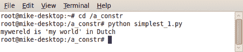
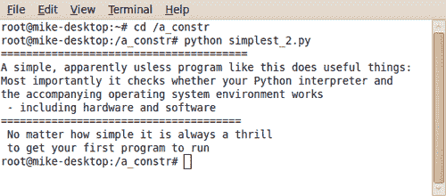
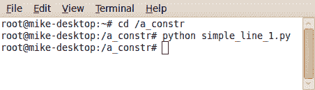
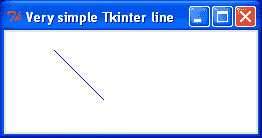

# 第一章. 启动你的引擎

在本章中，我们将涵盖：

+   最短的 Python 程序

+   确保 Python 模块存在

+   使用 Tkinter 的基本 Python GUI

+   在 Linux 下创建编译可执行文件

+   在 MS Windows 下创建编译可执行文件

# 简介

本书是使用神奇的 Python 语言创建和动画图形对象的代码食谱集合。为了创建和操作图形对象，Python 使用 Tkinter 模块。使用 Python 和 Tkinter 的先决条件显然是两者都已安装。它们都是免费和开源的，获取和安装它们的说明在网络上大量可用。只需在 Google 上搜索类似“安装 Python”的短语，你将有很多选择。

我们的首要任务是证明 Python 和 Tkinter 已安装且在我们的计算机上运行正常。在这本书中，我们使用 Python 版本 2.6。2010 年发布的 Python 3.0 需要一些语法上的更改，我们在这本书中不会使用。

让我们看看一些简单的测试来检查 Python 是否已安装。如果我们下载并安装 Windows 上的 Python，它将自动包括 Tkinter 作为其中一个基本模块，因此我们不需要单独获取和安装它。

# 运行最短的 Python 程序

我们需要一个单行 Python 程序，以证明 Python 解释器已安装且在我们的计算机平台上运行。

## 如何操作...

1.  创建一个名为 `construction_work` 或简称 `constr` 的文件夹（目录）。你将把所有的 Python 程序放在这个目录中。在一个文本编辑器中，例如 Linux 上的 **gedit** 或 Windows 上的记事本。如果我们正在 Windows 上工作，有一个名为 "Context" 的优秀编辑器可以免费从 [`www.contexteditor.org/`](http://www.contexteditor.org/) 下载。Context 对 Python 语法敏感，并具有一个有用的搜索和替换功能。

1.  输入以下行：

    ```py
    Print 'My wereld is "my world" in Dutch'

    ```

1.  将其保存为名为 `simple_1.py` 的文件，位于名为 `constr` 的目录中。

1.  如果你使用 MS Windows，请打开 X 终端或 DOS 窗口。

1.  切换到 `constr` 目录 - `simple_1.py` 所在的位置。

1.  输入`python simple_1.py`，你的程序将会执行。结果应该看起来像下面的截图：

1.  这证明了你的 Python 解释器工作正常，你的编辑器工作正常，并且你理解了运行本书中所有程序所需的所有内容。恭喜你。

    ```py
    """
    Program name: simplest_1.py
    Objective: Print text to the screen.
    Keywords: text, simplest
    =========================
    Printed "mywereld" on terminal.
    Author: Mike Ohlson de Fine
    """
    Print 'mywereld is "my world" in Dutch'

    ```

### 它是如何工作的...

你在 Linux X 终端或 MS Windows 的 DOS 终端中输入的任何指令都被视为操作系统命令。通过从你的 Python 程序存储的同一目录中启动这些命令，你不需要告诉 Python 和操作系统在哪里搜索你的代码。你也可以将代码存储在另一个目录中，但那时你需要在程序名称前加上路径。

### 还有更多...

尝试以下程序中显示的相同基本打印指令的较长版本。

所有在 """（三重引号）之间的文本纯粹是为了良好的文档记录。它是为程序员准备的，包括你。唉，人类的记忆是不完美的。痛苦的经验会说服你，在程序中提供相当完整的信息作为标题以及程序内的注释是明智的。

然而，为了节省空间和避免干扰，本书的其余部分省略了这些标题注释。

## 确保 Python 模块存在

这里是上一个程序的稍长版本。然而，以下模块在我们的程序中被命令“报到”以备使用，尽管它们在这个时候实际上并没有被使用：`Tkinter, math, random, time, tkFont`。

我们需要确保我们稍后将要使用的所有 Python 模块都存在并且可以被 Python 以及我们的代码访问。每个模块都是一个包含代码函数和对象的独立库，这些函数和对象经常被程序中的命令调用。

### 如何做...

1.  在文本编辑器中输入以下代码行。

1.  将其保存为名为 `simple_2.py` 的文件，放在之前提到的 `constr` 目录中。

1.  如前所述，如果你使用的是 MS Windows，请打开 X 终端或 DOS 窗口。

1.  切换到 `constr` 目录 - `simple_1.py` 所在的位置。

1.  输入 `python simple_2.py`，我们的程序应该执行。结果应该看起来像以下截图：

    +   这证明了你的 Python 解释器可以访问它将需要的必要库函数。

        ```py
        """
        Program name: simplest_2.py
        Objective: Send more than one line of text to the screen.
        Keywords: text, simple
        ======================================
        Author: Mike Ohlson de Fine
        """
        import Tkinter
        import math
        import random
        import time
        import tkFont
        print "======================================="
        print "A simple, apparently useless program like this does useful things:"
        print "Most importantly it checks whether your Python interpreter and "
        print "the accompanying operating system environment works"
        print " - including hardware and software"
        print "======================================"
        print " No matter how simple it is always a thrill"
        print " to get your first program to run"

        ```

#### 它是如何工作的...

`print` 命令是一条指令，用于将引号之间的任何文本（如“显示 *这些单词*”）写入或打印到连接到你的计算机的监视器屏幕上。它还会打印在 `print` 后面输入的任何命名变量或表达式的值。

例如：打印 "狗的 `名字:`"，`dog_name`。其中 `dog_name` 是用于存储一些数据的变量的名字。

`print` 命令在调试复杂代码序列时非常有用，因为即使执行因错误而未能完成，到达错误之前遇到的任何 `print` 命令都将被尊重。因此，通过在代码中巧妙地放置各种打印语句，你可以聚焦于导致程序崩溃的原因。

#### 还有更多...

当你第一次编写一段 Python 代码时，你通常有点不确定你对逻辑的理解是否完全正确。因此，我们希望以探索的方式观察指令执行的进度。能够看到至少部分代码是有效的非常有帮助。Python 的一个主要优势是它一次执行一条指令，并逐步执行。它只会在达到终点或编程错误阻止进度时停止。如果我们有一个 20 行的程序，只有前五行是正确的，其余的都是无法执行的垃圾，Python 解释器至少会执行前五行。这就是`print`命令真正强大的地方。

这就是如何使用 print 和 Python 解释器。当我们遇到代码问题，它就是无法工作，我们正在努力找出原因时，我们可以在程序的各个选定的点上插入 print 语句。这样，你可以得到一些变量的中间值作为你自己的私有状态报告。当我们想要关闭我们的 print 监视器时，我们只需在前面输入一个 hash（#）符号，这样就可以将它们转换成被动注释。稍后，如果你改变主意，想要再次激活 print，你只需移除前面的 hash 符号。

### 一个基本的 Tkinter 程序

在这里，我们尝试在 Python 程序中执行一个 Tkinter 命令。Tkinter 指令将创建一个画布，然后在上面画一条直线。

#### 如何做到这一点...

1.  在文本编辑器中，输入以下代码。

1.  将其保存为名为`simple_line_1.py`的文件，再次放在名为`constr`的目录中。

1.  如前所述，如果你使用的是 MS Windows，请打开一个 X 终端或 DOS 窗口。

1.  切换到`constr`目录 - `simple_line_1.py`所在的位置。

1.  输入`python simple_line_1.py`，你的程序应该执行。命令终端的结果应类似于以下截图：

1.  Tkinter 画布输出应类似于以下截图：

1.  这证明了你的 Python 解释器工作正常，你的编辑器工作正常，Tkinter 模块也工作正常。这不是一个微不足道的成就，你肯定准备好迎接伟大的事情。做得好。

    ```py
    #>>>>>>>>>>>>>>>>>>>>>>>>>>>>>>>>>>>>>>>
    from Tkinter import *
    root = Tk()
    root.title('Very simple Tkinter line')
    canvas_1 = Canvas(root, width=300, height=200, background="#ffffff")
    canvas_1.grid(row=0, column=0)
    canvas_1.create_line(10,20 , 50,70)
    root.mainloop()
    #>>>>>>>>>>>>>>>>>>>>>>>>>>>>>>>>>>>>>>>>

    ```

##### 它是如何工作的...

要画一条线，我们只需要给出起点和终点。

起点是`canvas_1.create_line(10,20, 50,70)`中的第一对数字。另一种方式，起点由坐标`x_start=10`和`y_start=20`给出。线的终点由第二对数字指定`x_end=50`和`y_end=70`。计量单位是像素。**像素**是我们屏幕上可以显示的最小点。

对于所有其他属性，如线条粗细或颜色，默认的`create_line()`方法值被使用。

然而，如果你想要更改颜色或粗细，你只需通过指定设置来完成。

#### 在 Windows 和 Linux 下创建一个编译后的可执行文件

我们如何创建和执行一个.exe 文件，使其能够运行我们编译后的 Python 和 Tkinter 程序？我们能否制作一个自包含的文件夹，在 MS Windows 或 Linux 发行版上运行，而这些发行版使用的 Python 版本与我们使用的不同？这两个问题的答案都是肯定的，实现这一目标的工具是一个名为`cx_Freeze`的开源程序。我们通常希望将我们的工作 Python 程序放在 U 盘上或在网络上下载，并且能够向朋友、同事或客户展示，而无需在客户端系统上下载 Python。`cx_Freeze`允许我们创建我们 Python 图形程序的发行版本。

##### 准备工作

您需要从[`cx-freeze.sourceforge.net/`](http://cx-freeze.sourceforge.net/)下载`cx_Freeze`。我们需要选择与我们所使用的 Python 版本相同版本的版本。目前，有从 2.4 版到 3.1 版的版本可供选择。

1.  MS Windows：下载`cx_Freeze-4.2.win32-py2.6.msi`，这是 Python 2.6 的 Windows 安装程序。如果我们有其他 Python 版本，那么我们必须从[`cx-freeze.sourceforge.net/`](http://cx-freeze.sourceforge.net/)选择适当的安装程序。

1.  保存并运行此安装程序。

1.  Windows 安装成功完成后，我们将看到一个名为`cx_Freeze`的文件夹，位于`\Python26\Lib\site-packages\`中。

1.  在终端中运行命令`apt-get install cx-freeze`。

1.  如果这不起作用，我们可能需要首先通过运行命令`apt-get install python-dev`安装一个具有开发能力的 Python 版本。然后返回并重复步骤 1。

1.  通过在命令终端中输入`python`来调用 Python 解释器进行成功测试。

1.  然后，在`>>>`提示符后，输入`import cx_Freeze`。如果解释器返回新行和`>>>`提示符，且没有任何抱怨，我们就成功了。

1.  如果我们想要打包为可执行文件的文件名为`walking_birdy_1.py`，位于名为`/constr`的文件夹中，那么我们准备一个特殊的设置文件如下。

    ```py
    #setup.py
    from cx_Freeze import setup, Executable
    setup(executables=[Executable("/constr/walking_birdy_1.py")])

    ```

1.  将其保存为`setup.py`。

1.  然后，在命令终端中运行

    ```py
    python /constr/setup.py build

    ```

1.  我们会在命令终端中看到许多系统编译命令滚动下来，最终会停止而不会出现错误信息。

1.  我们将在名为`build`的文件夹中找到完整的自包含可执行文件。在 Linux 下，我们将在家目录下的`/build/exe.linux-i686-2.6`中找到它。在 MS Windows 下，我们将在`C:\Python26\build\exe.win-py2.6`中找到它。

1.  我们只需要将包含所有内容的`build`文件夹复制到我们想要运行自包含程序的地方。

##### 它是如何工作的...

提醒一下。如果我们使用代码中的外部文件，如图片，那么文件的路径地址必须是绝对路径，因为它们被编码到或冻结到我们的 Python 程序的可执行版本中。有设置搜索路径的方法，可以在[`cx-freeze.sourceforge.net/cx_Freeze.html`](http://cx-freeze.sourceforge.net/cx_Freeze.html)查看。

例如，假设我们想在程序中使用一些 `GIF` 图片，并在其他计算机上展示它们。首先，我们将一个名为，例如，`/birdy_pics` 的文件夹放置在 U 盘上。在原始程序 `walking_birdy_1.py` 中，确保路径地址指向 U 盘上的 `/birdy_pics` 文件夹。编译后，将 `build` 文件夹复制到 U 盘上。现在，当我们双击可执行文件 `walking_birdy_1` 时，它可以在需要时定位到 U 盘上的图片。这些文件包含了程序所需的所有内容，你应该将整个目录内容分发给任何想要运行你的程序但不需要安装 Python 或 Tkinter 的用户。

另有一个名为 `py2exe` 的程序，它也能创建在 MS Windows 上运行的可执行文件。然而，它无法创建在 Linux 下运行的独立二进制可执行文件，而 `cx_Freeze`
