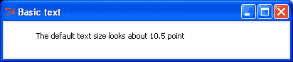
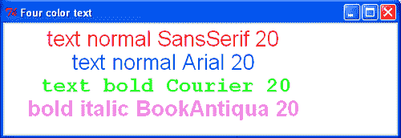
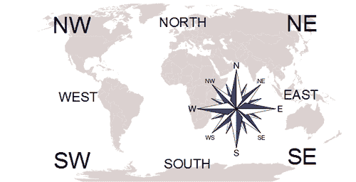
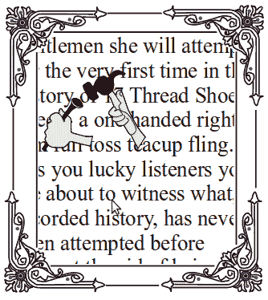
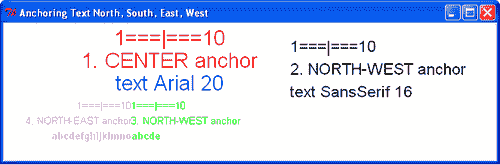
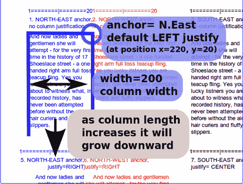
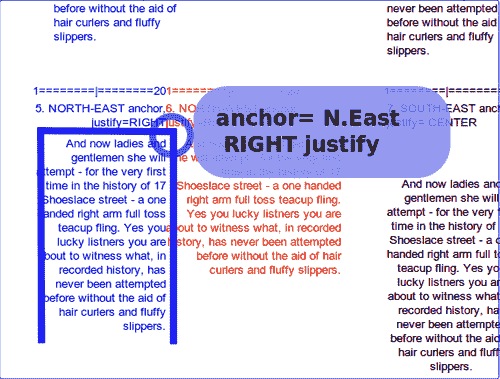
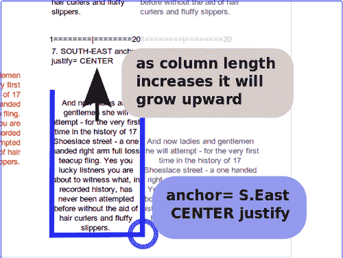
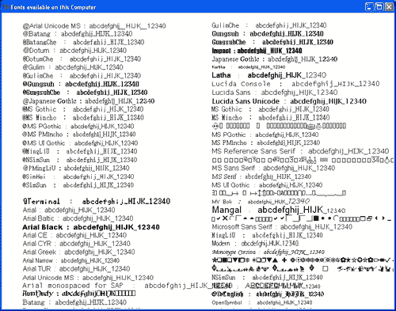

# 第三章。处理文本

在本章中，我们将介绍：

+   简单文本

+   文本字体类型、大小和颜色

+   文本北、南、东、西的位置

+   文本右对齐和左对齐的位置

+   平台上的可用字体

# 简介

文本可能很棘手。我们需要能够操作字体家族、大小、颜色和位置。位置反过来又要求我们指定文本必须开始的位置以及它应该被限制在哪些区域。

在本章中，我们专注于处理画布上的文本。

# 简单文本

这是如何在画布上放置文本的方法。

## 如何操作...

1.  在文本编辑器中，输入以下代码。

1.  将其保存为名为 `text_1.py` 的文件，位于名为 `constr` 的目录中。

1.  如前所述，如果您使用的是 MS Windows，请打开一个 X 终端或 DOS 窗口。

1.  切换到 `constr` 目录 - `text_1.py` 所在的位置。

1.  输入 `text_1.py`，你的程序应该会执行。

    ```py
    # text_1.py
    #>>>>>>>>>>
    from Tkinter import *
    root = Tk()
    root.title('Basic text')
    cw = 400 # canvas width
    ch = 50 # canvas height
    canvas_1 = Canvas(root, width=cw, height=ch, background="white")
    canvas_1.grid(row=0, column=1)
    xy = 150, 20
    canvas_1.create_text(xy, text=" The default text size looks \ about 10.5 point")
    root.mainloop()

    ```

### 它是如何工作的...

结果如下截图所示：



由于字体高度和字符间距以及文本窗口尺寸的相互干扰，将文本精确放置在屏幕上的位置可能很棘手。你可能需要花一些时间进行实验，才能得到你想要的文本。

### 还有更多...

将文本放置到画布上提供了作为常用 `print` 函数调试工具的有用替代品。您可以将许多变量的值发送到画布上进行显示，并观察它们的值变化。

正如将在动画章节中演示的那样，观察复杂数值关系相互作用的最简单方法是以某种方式对它们进行动画处理。

## 文本字体类型、大小和颜色

与为线条和形状指定属性的方式非常相似，字体类型、大小和颜色由 `create_text()` 方法的属性控制。

### 准备工作

这里不需要任何东西。

### 如何操作...

应使用第 1 个菜谱中的说明。

在编写、保存和执行此程序时，只需使用名称 `4color_text.py`。

```py
# 4color_text.py
#>>>>>>>>>>>>>>
from Tkinter import *
root = Tk()
root.title('Four color text')
cw = 500 # canvas width
ch = 140 # canvas height
canvas_1 = Canvas(root, width=cw, height=ch, background="white")
canvas_1.grid(row=0, column=1)
xy = 200, 20
canvas_1.create_text(200, 20, text=" text normal SansSerif 20", \ fill='red',\
width=500, font='SansSerif 20 ')
canvas_1.create_text(200, 50, text=" text normal Arial 20", \ fill='blue',\
width=500, font='Arial 20 ')
canvas_1.create_text(200, 80, text=" text bold Courier 20", \ fill='green',\
width=500, font='Courier 20 bold')
canvas_1.create_text(200, 110, text=" bold italic BookAntiqua 20",\
fill='violet', width=500, font='Bookantiqua 20 bold')
root.mainloop()
#>>>>>>>>>>>>>>>>>>>>>>>>>>>>>>>>>>>>

```

### 它是如何工作的...

结果如下截图所示：



在指定字体时存在的一个困难是决定哪些字体最适合你的需求。一旦你选择了字体，你可能会发现你的特定操作系统不支持该字体。幸运的是，Tkinter 的设计者通过在指定的字体不可用时选择合适的默认字体，使它变得相对防弹。

### 还有更多...

文本北、南、东、西的位置。

我们使用 Tkinter 可用的位置指定符在画布上放置文本。锚点位置、文本 x、y 位置、字体大小、列宽和文本对齐方式都相互作用，以控制页面上的文本外观。以下截图显示了定位文本时使用的罗盘命名法：



### 准备工作

在我们理解 Tkinter 使用的导航系统之前，将文本放置到画布上是棘手的。以下是它是如何工作的。所有文本都进入一个不可见的框中。这个框就像一个空的画框，放在板上的钉子上。Tkinter 画布是板，空的框架是我们输入的文本将要适应的框。钉子是 x 和 y 的位置。空的框架可以被移动，使得钉子在左上角（西北）或右下角（东南）或中心或其他角落或侧面。以下截图显示了包含文本的画布上的想象框架：



### 如何操作...

执行代码并观察各种文本位置指定符

控制文本的外观。

```py
# anchor_align_text_1.py
#>>>>>>>>>>>>>>>>>>>>>>>>>>>>>>>>>>>>>
from Tkinter import *
root = Tk()
root.title('Anchoring Text North, South, East, West')
cw = 650 # canvas width
ch = 180 # canvas height
canvas_1 = Canvas(root, width=cw, height=ch, background="white")
canvas_1.grid(row=0, column=1)
orig_x = 220
orig_y = 20
offset_y = 30
# 1\. DEFAULT CENTER JUSTIFICATION
# width is maximum line length.
canvas_1.create_text(orig_x, orig_y , \
text="1===|===10", fill='red', width=700, font='SansSerif 20 ')
canvas_1.create_text(orig_x, orig_y + offset_y, \
text="1\. CENTER anchor", fill='red', width=700, font='SansSerif 20 \ ')
canvas_1.create_text(orig_x, orig_y + 2 *offset_y, \
text="text Arial 20", fill='blue', width=700, font='SansSerif 20 ')
#===================================================================
orig_x = 380
# 2\. LEFT JUSTIFICATION
canvas_1.create_text(orig_x, orig_y, text="1===|===10",\
fill='black', anchor = NW, width=700, font='SansSerif 16 ')
canvas_1.create_text(orig_x, orig_y + offset_y, text="2\. NORTH-WEST \ anchor",\
fill='black', anchor = NW, width=700, font='SansSerif 16 ')
canvas_1.create_text(orig_x, orig_y + 2 *offset_y, fill='black',\
text="text SansSerif 16", anchor = NW, width=700, font='SansSerif \ 16 ')
#==================================================================
# 3\. DEFAULT TOP-LEFT (NW) JUSTIFICATION
orig_x = 170
orig_y = 102
offset_y = 20
canvas_1.create_text(orig_x, orig_y , anchor = NW ,text="1===|===10",\
fill='green', width=500, font='SansSerif 10 ')
canvas_1.create_text(orig_x, orig_y + 1 * offset_y, anchor = NW ,\
text="3\. NORTH-WEST anchor", fill='green', width=500, \ font='SansSerif 10 ')
#canvas_1.create_text(orig_x, orig_y + 2 * offset_y, anchor = NW,\
#text="abc", fill='green', width=700, font='SansSerif 10 ')
canvas_1.create_text(orig_x, orig_y + 2 * offset_y, anchor = NW, \
text="abcde", fill='green', width=500, font='Bookantiqua 10 bold')
#===================================================================
# 4\. DEFAULT Top-right (SE) JUSTIFICATION
canvas_1.create_text(orig_x, orig_y , anchor = NE ,\
text="1===|===10", fill='violet', width=500, font='SansSerif 10 ')
canvas_1.create_text(orig_x, orig_y + 1 * offset_y, anchor = NE ,\
text="4\. NORTH-EAST anchor", fill='violet', width=500, \ font='SansSerif 10 ')
#canvas_1.create_text(orig_x, orig_y + 2 * offset_y, anchor = NE, \
#text="abc",fill='violet', width=700, font='SansSerif 10 ')
canvas_1.create_text(orig_x, orig_y + 2 * offset_y, anchor = NE,\
text="abcdefghijklmno", fill='violet', width=500, font='Bookantiqua 10 bold')
root.mainloop()
#>>>>>>>>>>>>>>>>>>>>>>>>>>>>>>>>>>>>

```

### 它是如何工作的...

结果如下所示：



## 文本左对齐和右对齐的对齐方式

我们现在特别关注文本对齐与列锚点位置之间的交互。

### 准备中

以下代码包含一个段落，太长以至于无法适应单行。这就是我们看到术语对齐如何让我们决定是否希望文本对齐到列的右侧或左侧，或者甚至居中。列宽度以像素为单位指定，然后文本被调整以适应。

### 如何操作...

运行以下代码并观察列的高度仅限于画布的高度，但宽度、锚点位置、对齐方式和字体大小决定了文本如何在画布上布局。

```py
# justify_align_text_1.py
#>>>>>>>>>>>>>>>>>>>>>>>>>>>>>>>>>>>>>
from Tkinter import *
root = Tk()
root.title('North-south-east-west Placement with LEFT and RIGHT \ justification of Text')
cw = 850 # canvas width
ch = 720 # canvas height
canvas_1 = Canvas(root, width=cw, height=ch, background="white")
canvas_1.grid(row=0, column=1)
orig_x = 220
orig_y = 20
offset_y = 20
jolly_text = "And now ladies and gentlemen she will attempt - for the very first time in the history of 17 Shoeslace street - a one handed right arm full toss teacup fling. Yes you lucky listners you are about to witness what, in recorded history, has never been attempted before without the aid of hair curlers and fluffy slippers."
# width is maximum line length.
#=================================================================
# 1\. Top-left (NE) ANCHOR POINT, no column justification specified.
canvas_1.create_text(orig_x, orig_y + 1 * offset_y, anchor = NE \ ,text="1\. \
NORTH-EAST anchor, no column justification", fill='blue', width=200, \ font='Arial 10')
canvas_1.create_text(orig_x, orig_y + 3 * offset_y, anchor = NE, \ text=jolly_text,\
fill='blue', width=150, font='Arial 10')
#==================================================================
# 2\. Top-right (NW) ANCHOR POINT, no column justification specified.
canvas_1.create_text(orig_x, orig_y + 1 * offset_y, anchor = NW \ ,text="2\. \
NORTH-WEST ancho, no column justification", fill='red', width=200, \ font='Arial 10')
canvas_1.create_text(orig_x, orig_y + 3 * offset_y, anchor = NW, \ text= jolly_text,\
fill='red', width=200, font='Arial 10')
#==================================================================
orig_x = 600
canvas_1.create_text(orig_x, orig_y + 1 * offset_y, anchor = NE \ ,text="3\. \
SOUTH-EAST anchor, no column justification",fill='black', width=200, \ font='Arial 10')
canvas_1.create_text(orig_x, orig_y + 1 * offset_y, anchor = NW \ ,text="4\. \
SOUTH-WEST anchor, no column justification", fill='#666666', \ width=200, font='Arial 10')
#============================================================
orig_x = 600
orig_y = 280
# 3\. BOTTOM-LEFT (SW) JUSTIFICATION, no column justification # specified.
canvas_1.create_text(orig_x, orig_y + 2 * offset_y, anchor = SW, \ text=jolly_text,\
fill='#666666', width=200, font='Arial \ 10')
#==================================================================
# 4\. TOP-RIGHT (SE) ANCHOR POINT, no column justification specified.
canvas_1.create_text(orig_x, orig_y + 2 * offset_y, anchor = SE, \ text=jolly_text,\
fill='black', width=150, font='Arial 10')
#===================================================================
orig_y = 350
orig_x = 200
# 5\. Top-right (NE) ANCHOR POINT, RIGHT column justification # specified.
canvas_1.create_text(orig_x, orig_y + 1 * offset_y, anchor = NE , \ justify=RIGHT,\
text="5\. NORTH-EAST anchor, justify=RIGHT", fill='blue', width=200, \ font='Arial 10 ')
canvas_1.create_text(orig_x, orig_y + 3 * offset_y, anchor = NE, \ justify=RIGHT, \
text=jolly_text, fill='blue', width=150, font='Arial 10')
#===================================================================
# 6\. TOP-LEFT (NW) ANCHOR POINT, RIGHT column justification specified.
canvas_1.create_text(orig_x, orig_y + 1 * offset_y, anchor = NW \ ,text="6.\
NORTH-WEST anchor, justify=RIGHT", fill='red', width=200, \ font='Arial 10 ')
canvas_1.create_text(orig_x, orig_y + 3 * offset_y, anchor = NW, \ justify=RIGHT,\
text=jolly_text, fill='red', width=200, font='Arial 10')
#===================================================================
orig_x = 600
# Header lines for 7\. and 8.
canvas_1.create_text(orig_x, orig_y + 1 * offset_y, anchor = NE \ ,text="7\. \
SOUTH-EAST anchor, justify= CENTER", fill='black', width=160, \ font='Arial 10 ')
canvas_1.create_text(orig_x, orig_y + 1 * offset_y, anchor = NW , \ text="8.\
SOUTH-WEST anchor, justify= CENTER", fill='#666666', width=200, \ font='Arial 10 ')
#==================================================================
orig_y = 600
# 7\. TOP-RIGHT (SE) ANCHOR POINT, CENTER column justification # specified.
canvas_1.create_text(orig_x, orig_y + 4 * offset_y, anchor = SE, \ justify= CENTER,\
text=jolly_text, fill='black', width=150, font='Arial 10')
#===================================================================
# 8\. BOTTOM-LEFT (SW) ANCHOR POINT, CENTER column justification # specified.
canvas_1.create_text(orig_x, orig_y + 4 * offset_y, anchor = SW, \ justify= CENTER,\
text=jolly_text, fill='#666666', width=200, font='Arial 10')
root.mainloop()
#>>>>>>>>>>>>>>>>>>>>>>>>>>>>>>>>>>>>

```

### 它是如何工作的...

列宽度、锚点位置和对齐方式之间的交互是复杂的，最清晰解释结果的方式是通过执行后画布显示的注释图片。以下截图显示了右上角(NE)锚点，未指定对齐方式（默认左对齐）。



以下截图显示了右上角(SE)锚点，未指定对齐方式：



以下截图显示了右下角(SE)锚点，指定了居中对齐：



## 你电脑上所有可用的字体

发现你特定计算机上可用的字体，然后按默认大小打印每种字体的样本，全部按字母顺序排列。

解决选择合适字体问题的一个方案是执行一个可靠的程序来列出你使用平台上可用的字体，并将每种类型的示例打印到屏幕上。这就是下一个示例所做的事情。

### 如何操作...

应使用配方 1 中使用的说明。

当你编写、保存和执行此程序时，只需使用名称 `fonts_available.py`。

```py
# fonts_available.py
# ==================================
from Tkinter import *
import tkFont
root = Tk()
root.title('Fonts available on this Computer')
canvas = Canvas(root, width =930, height=830, background='white')
fonts_available = list( tkFont.families() )
fonts_available.sort()
text_sample = ' : abcdefghij_HIJK_12340'
# list the font names on the system console first.
for this_family in fonts_available :
print this_family
print '============================='
# Show first half on left half of screen .
for i in range(0,len(fonts_available)/2):
print fonts_available[i]
texty = fonts_available[i]
canvas.create_text(50,30 + i*20, text= texty + text_sample,\
fill='black', font=(texty, \ 12), anchor= "w")
# Show second half on right half of screen .
for i in range(len(fonts_available)/2,len(fonts_available)):
print fonts_available[i]
texty = fonts_available[i]
canvas.create_text(500,30 + (i-len(fonts_available)/2 )*20, \
text= texty+ text_sample, fill='black', \
font=(texty, 12),anchor= "w")
canvas.pack()
root.mainloop()

```

### 它是如何工作的...

结果如下所示，显示了特定操作系统上 Python 可用的所有字体。



当您想要选择令人愉悦且合适的字体时，这个程序非常有用。可用的字体在不同的平台上可能会有很大的差异。因此，在这里我们利用属于 **tkFont** 模块的 `families()` 方法，将字体家族的名称放入名为 `fonts_available` 的列表中。该列表使用 `fonts_available.sort()` 方法按字母顺序排序。

最后，使用了两个方便的功能。

首先，通过使用 `create_text` 方法的 `anchor= "w"` 属性将文本锚定在西部或左侧，使得字体列表看起来整洁。

其次，是 `len()` 函数在 `len(fonts_available)` 中的非常有用。

此函数会返回给您（在编程术语中称为“返回”）列表中的项目数量。当您不知道这个数字将会是多少时，它非常方便，用于定义 for 循环迭代应该进行多少次。在这个例子中，我们需要为列表中尚未发现的每个字体名称编写字体名称和文本样本的代码。
