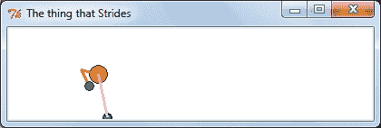
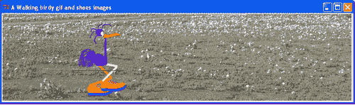
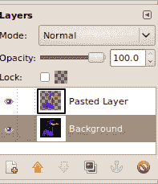
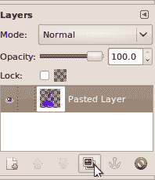
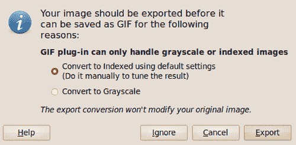
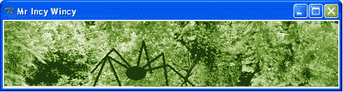
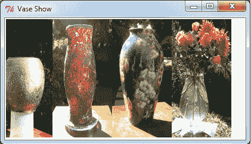
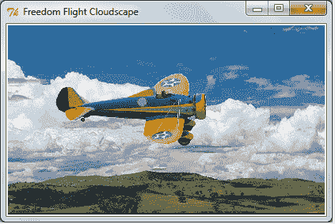

# 第七章. 合并光栅和矢量图片

在本章中，我们将涵盖：

+   GIF 沙滩球的简单动画

+   向量行走的生物

+   在卡拉罗行走穿着鞋的鸟

+   使用 Gimp 制作部分透明的图像

+   在宫殿里行走的外交官

+   森林中的蜘蛛

+   移动的图像带

+   连续的图像带

+   无尽的背景和飘过的云景

如第二章、*绘制基本形状*和第三章、*处理文本*中看到的矢量图形，可以通过简单的代数缩小和放大到任何大小和任何方向。它们可以通过基本的三角函数进行旋转动画。光栅图形是有限的。在代码执行时，它们不能动态地调整大小或旋转。它们更繁琐。然而，当我们结合矢量图形和光栅图形时，我们可以得到惊人的效果。Python 不能自己旋转`GIF`图像。有方法可以合理地模拟旋转，但在尝试了一些这些食谱之后，你会欣赏到这些限制。PIL 可以旋转它们，但不能在 Tkinter 画布上动态旋转。我们在这里探索一些可能性和解决方案。

因为我们在不改变和操作图像的实际属性，所以我们不需要在本章中使用 Python Imaging Library (PIL)。我们需要专门使用`GIF`格式的图像，因为 Tkinter 就是处理这种格式的。

我们还将看到如何使用"The GIMP"作为工具来准备适合动画的图像。

# GIF 沙滩球的简单动画

我们想要动画化一个光栅图像，该图像是从照片中提取的。

为了保持简单和清晰，我们只是将沙滩球的摄影图像（`GIF`格式）在黑色背景上移动。

## 准备中

我们需要一个合适的`GIF`图像，这是我们想要动画化的对象。一个例子，命名为`beachball.gif`，已经提供。

## 如何做...

从某处复制一个`.gif`文件并将其粘贴到你想要保存工作进度图片的目录中。

确保我们计算机文件系统中的路径指向要使用的图像。在下面的例子中，指令`ball = PhotoImage(file = "constr/pics2/beachball.gif")`表示要使用的图像将在名为`pics2`的目录（文件夹）中找到，它是另一个名为`constr`的文件夹的子文件夹。

然后执行以下代码。

```py
# photoimage_animation_1.py
#>>>>>>>>>>>>>>>>>>>>>>>>
from Tkinter import *
root = Tk()
root.title("Animating a Photo Beachball")
cycle_period = 100
cw = 320 # canvas width
ch = 120 # canvas height
canvas_1 = Canvas(root, width=cw, height=ch, bg="black")
canvas_1.grid(row=0, column=1)
posn_x = 10
posn_y = 10
shift_x = 2
shift_y = 1
ball = PhotoImage(file = "/constr/pics2/beachball.gif")
for i in range(1,100): # end the program after 100 position # shifts.
posn_x += shift_x
posn_y += shift_y
canvas_1.create_image(posn_x,posn_y,anchor=NW, image=ball)
canvas_1.update() # This refreshes the drawing on the # canvas.
canvas_1.after(cycle_period) # This makes execution pause for # 100 milliseconds.
canvas_1.delete(ALL) # This erases everything on the # canvas.
root.mainloop()

```

## 它是如何工作的...

沙滩球的图像在画布上移动的方式与第四章、*动画原理*中使用的方式完全相同。现在的不同之处在于，照片类型的图像总是占据屏幕的矩形区域。这个框的大小，称为边界框，是图像的大小。我们使用了黑色背景，所以沙滩球图像上的黑色角落看不见。

# 向量行走的生物

我们使用 第二章 的矢量图形和 第四章 的 *动画原理，处理文本*，制作一对行走腿。我们想使用这些腿与一些光栅图像的片段一起，看看我们能在制作吸引人的动画方面走多远。我们导入 Tkinter、math 和 time 模块。数学是必要的，以提供维持腿部各部分之间几何关系的三角学。



## 准备工作

我们将使用 Tkinter 和时间模块，就像在 第四章 中所做的那样，再次用于动画线条和圆的运动。你将在代码中看到一些三角学。如果你不喜欢数学，你可以直接复制粘贴代码，无需理解数学是如何工作的。然而，如果你是数学的朋友，观看正弦、余弦和正切一起工作，让一个孩子微笑是很有趣的。

## 如何做到这一点...

按照前一个图像所示执行程序。

```py
# walking_creature_1.py
# >>>>>>>>>>>>>>>>
from Tkinter import *
import math
import time
root = Tk()
root.title("The thing that Strides")
cw = 400 # canvas width
ch = 100 # canvas height
#GRAVITY = 4
chart_1 = Canvas(root, width=cw, height=ch, background="white")
chart_1.grid(row=0, column=0)
cycle_period = 100 # time between new positions of the ball # (milliseconds).
base_x = 20
base_y = 100
hip_h = 40
thy = 20
#===============================================
# Hip positions: Nhip = 2 x Nstep, the number of steps per foot per # stride.
hip_x = [0, 5, 10, 15, 20, 25, 30, 35, 40, 45, 50, 55, 60, 60, 60] #15
hip_y = [0, 8, 12, 16, 12, 8, 0, 0, 0, 8, 12, 16, 12, 8, 0] #15
step_x = [0, 10, 20, 30, 40, 50, 60, 60] # 8 = Nhip
step_y = [0, 35, 45, 50, 43, 32, 10, 0]
# The merging of the separate x and y lists into a single sequence.
#==================================
# Given a line joining two points xy0 and xy1, the base of an # isosceles triangle,
# as well as the length of one side, "thy" . This returns the # coordinates of the apex joining the equal-length sides.
def kneePosition(x0, y0, x1, y1, thy):
theta_1 = math.atan2((y1 - y0), (x1 - x0))
L1 = math.sqrt( (y1 - y0)**2 + (x1 - x0)**2)
if L1/2 < thy:
# The sign of alpha determines which way the knees bend.
alpha = -math.acos(L1/(2*thy)) # Avian
#alpha = math.acos(L1/(2*thy)) # Mammalian
else:
alpha = 0.0
theta_2 = alpha + theta_1
x_knee = x0 + thy * math.cos(theta_2)
y_knee = y0 + thy * math.sin(theta_2)
return x_knee, y_knee
def animdelay():
vector imagespair of walking legs, creatingchart_1.update() # This refreshes the drawing on the # canvas.
chart_1.after(cycle_period) # This makes execution pause for # 100 milliseconds.
chart_1.delete(ALL) # This erases *almost* everything on # the canvas.
# Does not delete the text from # inside a function.
bx_stay = base_x
by_stay = base_y
for j in range(0,11): # Number of steps to be taken - arbitrary.
astep_x = 60*j
bstep_x = astep_x + 30
cstep_x = 60*j + 15
aa = len(step_x) -1
for k in range(0,len(hip_x)-1):
# Motion of the hips in a stride of each foot.
cx0 = base_x + cstep_x + hip_x[k]
cy0 = base_y - hip_h - hip_y[k]
cx1 = base_x + cstep_x + hip_x[k+1]
cy1 = base_y - hip_h - hip_y[k+1]
chart_1.create_line(cx0, cy0 ,cx1 ,cy1)
chart_1.create_oval(cx1-10 ,cy1-10 ,cx1+10 ,cy1+10, \ fill="orange")
if k >= 0 and k <= len(step_x)-2:
# Trajectory of the right foot.
ax0 = base_x + astep_x + step_x[k]
ax1 = base_x + astep_x + step_x[k+1]
ay0 = base_y - step_y[k]
ay1 = base_y - step_y[k+1]
ax_stay = ax1
ay_stay = ay1
if k >= len(step_x)-1 and k <= 2*len(step_x)-2:
# Trajectory of the left foot.
bx0 = base_x + bstep_x + step_x[k-aa]
bx1 = base_x + bstep_x + step_x[k-aa+1]
by0 = base_y - step_y[k-aa]
by1 = base_y - step_y[k-aa+1]
bx_stay = bx1
by_stay = by1
aknee_xy = kneePosition(ax_stay, ay_stay, cx1, cy1, thy)
chart_1.create_line(ax_stay, ay_stay ,aknee_xy[0], \ aknee_xy[1], width = 3, fill="orange")
chart_1.create_line(cx1, cy1 ,aknee_xy[0], aknee_xy[1], \ width = 3, fill="orange")
chart_1.create_oval(ax_stay-5 ,ay1-5 ,ax1+5 ,ay1+5, \ fill="green")
chart_1.create_oval(bx_stay-5 ,by_stay-5 ,bx_stay+5 , \ by_stay+5, fill="blue")
bknee_xy = kneePosition(bx_stay, by_stay, cx1, cy1, thy)
chart_1.create_line(bx_stay, by_stay ,bknee_xy[0], \ bknee_xy[1], width = 3, fill="pink")
chart_1.create_line(cx1, cy1 ,bknee_xy[0], bknee_xy[1], \ width = 3, fill="pink")
animdelay()
root.mainloop()

```

## 它是如何工作的...

不深入细节，程序中的策略包括在走一步时定义一只脚的运动。这种运动由两个列表 `step_x（水平）` 和 `step_y（垂直）` 给出的八个相对位置定义。臀部运动由一对单独的 x 和 y 位置 `hip_x` 和 `hip_y` 给出。

使用三角学来计算膝盖的位置，假设大腿和小腿的长度相同。计算基于高中教授的正弦法则。是的，我们在学校确实学到了有用的东西！

将 *时间动画调节* 指令组装成一个函数 `animdelay()`。

## 还有更多...

在 Python 的 `math` 模块中，有两个反正切函数可用于根据两个相邻边的长度计算角度。`atan2(y,x)` 是最好的，因为它处理了正切在圆周上运行时所做的疯狂事情——当它通过 90 度及其倍数时，正切从负无穷大跳到正无穷大。

一个数学膝盖很乐意向前或向后弯曲以满足其方程。我们使角度的符号为负，以使向后弯曲的鸟膝盖为正，以使向前弯曲的哺乳动物膝盖为正。

### 更多信息部分 1

这个动态的行走臀部和大腿动作被用于以下食谱中，制作沙漠中的鸟、宫殿地面的外交官和森林中的蜘蛛行走。

# 在 Karroo 走路的穿鞋鸟

我们现在协调四个 `GIF` 图像和行走腿的动作，制作一只会走的 Apteryx（一种像几维鸟一样的不会飞的鸟）。



## 准备工作

我们需要以下 `GIF` 图像：

+   一幅合适的风景背景图

+   一只没有腿的鸟身体

+   一双鲜艳颜色的鞋子，让人微笑

+   之前食谱中的行走鸟类腿

使用的图像是`karroo.gif, apteryx1.gif`和`shoe1.gif`。请注意，鸟和鞋的图像具有透明背景，这意味着在鸟或鞋周围看不到矩形背景。在接下来的食谱中，我们将看到实现所需透明度的最简单方法。

## 如何操作...

以通常的方式执行程序。

```py
# walking_birdy_1.py
# >>>>>>>>>>>>>>>>
from Tkinter import *
import math
import time
root = Tk()
root.title("A Walking birdy gif and shoes images")
cw = 800 # canvas width
ch = 200 # canvas height
#GRAVITY = 4
chart_1 = Canvas(root, width=cw, height=ch, background="white")
chart_1.grid(row=0, column=0)
cycle_period = 80 # time between new positions of the bird # (milliseconds).
im_backdrop = "/constr/pics1/karoo.gif"
im_bird = "/constr/pics1/apteryx1.gif"
im_shoe = "/constr/pics1/shoe1.gif"
birdy =PhotoImage(file= im_bird)
shoey =PhotoImage(file= im_shoe)
backdrop = PhotoImage(file= im_backdrop)
chart_1.create_image(0 ,0 ,anchor=NW, image=backdrop)
base_x = 20
base_y = 190
hip_h = 70
thy = 60
#==========================================
# Hip positions: Nhip = 2 x Nstep, the number of steps per foot per # stride.
hip_x = [0, 5, 10, 15, 20, 25, 30, 35, 40, 45, 50, 55, 60, 60, 60] #15
hip_y = [0, 8, 12, 16, 12, 8, 0, 0, 0, 8, 12, 16, 12, 8, 0] #15
step_x = [0, 10, 20, 30, 40, 50, 60, 60] # 8 = Nhip
step_y = [0, 35, 45, 50, 43, 32, 10, 0]
#=============================================
# Given a line joining two points xy0 and xy1, the base of an # isosceles triangle,
# as well as the length of one side, "thy" this returns the # coordinates of
# the apex joining the equal-length sides.
def kneePosition(x0, y0, x1, y1, thy):
theta_1 = math.atan2(-(y1 - y0), (x1 - x0))
L1 = math.sqrt( (y1 - y0)**2 + (x1 - x0)**2)
alpha = math.atan2(hip_h,L1)
theta_2 = -(theta_1 - alpha)
x_knee = x0 + thy * math.cos(theta_2)
y_knee = y0 + thy * math.sin(theta_2)
return x_knee, y_knee
def animdelay():
Apteryx imageanimatingchart_1.update() # Refresh the drawing on the canvas.
chart_1.after(cycle_period) # Pause execution pause for 80 # milliseconds.
chart_1.delete("walking") # Erases everything on the canvas.
bx_stay = base_x
by_stay = base_y
for j in range(0,13): # Number of steps to be taken - arbitrary.
astep_x = 60*j
bstep_x = astep_x + 30
cstep_x = 60*j + 15
aa = len(step_x) -1
for k in range(0,len(hip_x)-1):
# Motion of the hips in a stride of each foot.
cx0 = base_x + cstep_x + hip_x[k]
cy0 = base_y - hip_h - hip_y[k]
cx1 = base_x + cstep_x + hip_x[k+1]
cy1 = base_y - hip_h - hip_y[k+1]
#chart_1.create_image(cx1-55 ,cy1+20 ,anchor=SW, \ image=birdy, tag="walking")
if k >= 0 and k <= len(step_x)-2:
# Trajectory of the right foot.
ax0 = base_x + astep_x + step_x[k]
ax1 = base_x + astep_x + step_x[k+1]
ay0 = base_y - 10 - step_y[k]
ay1 = base_y - 10 -step_y[k+1]
ax_stay = ax1
ay_stay = ay1
if k >= len(step_x)-1 and k <= 2*len(step_x)-2:
# Trajectory of the left foot.
bx0 = base_x + bstep_x + step_x[k-aa]
bx1 = base_x + bstep_x + step_x[k-aa+1]
by0 = base_y - 10 - step_y[k-aa]
by1 = base_y - 10 - step_y[k-aa+1]
bx_stay = bx1
by_stay = by1
chart_1.create_image(ax_stay-5 ,ay_stay + 10 ,anchor=SW, \ image=shoey, tag="walking")
chart_1.create_image(bx_stay-5 ,by_stay + 10 ,anchor=SW, \ image=shoey, tag="walking")
aknee_xy = kneePosition(ax_stay, ay_stay, cx1, cy1, thy)
chart_1.create_line(ax_stay, ay_stay-15 ,aknee_xy[0], \ aknee_xy[1], width = 5, fill="orange", tag="walking")
chart_1.create_line(cx1, cy1 ,aknee_xy[0], aknee_xy[1], \ width = 5, fill="orange", tag="walking")
Apteryx imageanimatingbknee_xy = kneePosition(bx_stay, by_stay, cx1, cy1, thy)
chart_1.create_line(bx_stay, by_stay-15 ,bknee_xy[0], \ bknee_xy[1], width = 5, fill="pink", tag="walking")
chart_1.create_line(cx1, cy1 ,bknee_xy[0], bknee_xy[1], \ width = 5, fill="pink", tag="walking")
chart_1.create_image(cx1-55 ,cy1+20 ,anchor=SW, image=birdy, \ tag="walking")
animdelay()
root.mainloop()
# >>>>>>>>>>>>>>>>>>>>>>>>>>>>>>>>>>>>>>>>>>>>>>>>>>>>>>>

```

## 它是如何工作的...

之前食谱中对三角学所做的评论也适用于这里。我们现在看到的是，一旦准备好了合适的`GIF`图像，矢量对象和位图图像可以很容易地结合起来。

## 还有更多...

对于想要在电脑上制作课程的教师及其学生，这些技术提供了各种可能性，如历史之旅和重演、地理之旅，以及科学实验。让学生们做项目讲述故事。动画年鉴？

# 使用 GIMP 制作具有透明背景的 GIF 图像

我们使用免费开源的 GIMP 图像编辑器将具有不透明背景的图像转换为具有透明背景的图像。

## 准备工作

我们可以在[`www.gimp.org/`](http://www.gimp.org/)获取**GIMP**（**GNU 图像处理程序**）。有适用于 Windows 和 Linux 的版本。GIMP 是一个优秀的软件包，值得学习如何使用。如果你不习惯它，可能会感到有些挫败，所以这个特定的食谱专门描述了将具有不透明背景的`.png`图像转换为具有透明背景的`.gif`图像的步骤。

在 Windows 系统中，你只需访问网站并点击**下载**按钮，它就会自动安装并立即可以使用。在 Linux 系统中，它通常已经预装了。对于基于 Debian 的 Linux 系统，使用`sudo apt-get install gimp`命令应该可以安装它，然后你就可以开始使用了。

## 如何操作...

这个食谱不涉及运行 Python 代码。相反，它是一系列在 GIMP GUI 上使用鼠标执行的操作。在以下说明中，点击**选择** | **反转**是“左键点击，选择，然后左键点击反转”的简称。

1.  打开 GIMP 并打开文件`apteryx1.png`。这是一只已经画好的卡通鸟。如何操作...

1.  点击**窗口** | **可停靠对话框** | **图层**。这将打开一个显示面板，显示我们正在工作的图像的所有图层。观察图层的变化是使用 GIMP 的秘诀。

1.  点击**选择** | **按颜色**，然后将光标箭头放在图像的黑色部分上并点击。你将看到围绕鸟轮廓的闪烁虚线。我们所做的是仅选择图片中的黑色部分进行修改。如何操作...

1.  点击**选择** | **反转**。这样做是将选择更改为除了黑色部分之外的所有内容。

1.  点击**编辑** | **复制**。这会选取所选部分的副本（除了黑色之外的所有内容）并将其放置在不可见的剪贴板上。

1.  点击**编辑** | **粘贴**。这将从剪贴板复制内容，并可能将其粘贴到我们现有的图像上。但在你完成下一步之前，粘贴的图像将处于一种无人地带。

1.  点击**图层** | **新建**。这会将图像粘贴部分牢固地放置在其自己的单独图层上。图层就像带有复合图像部分的透明玻璃片。当你对它们进行操作并更改一个图层时，其他图层保持不变。

1.  右键单击如图所示的**背景图层**，然后点击**删除图层**。这将丢弃由原始图像组成的背景图层。你会看到只剩下一个图层。它包含放置在透明背景上的鸟的图像。

1.  点击**文件** | **另存为**。在保存窗口中，输入`apteryx1.gif`作为文件名。

1.  关闭 GIMP。你将在你发送到的任何文件夹中找到带有透明背景的新`GIF`图像。在 Linux 系统中，透明区域显示为灰色棋盘图案。

## 它是如何工作的...

本章中使用的所有具有透明区域的图像都是用这种方式准备的。还有其他方法可以实现这一点，但这可能是最易得的。本章中的动画由一个较小的、部分透明的图像在较大的不透明图像上移动组成。

# 外交官在宫殿中行走

我们现在使用之前相同的腿，并适当着色，来动画化一个庄重的人。对于人类风格的行走，我们需要选择在代码中预先选择的正确的哺乳动物膝盖弯曲角度选项。


## 准备工作

我们需要以下`GIF`图像：

+   一个合适的风景背景图片

+   一个没有腿的人类身体

+   一双庄重的鞋子以彰显尊严

+   行走的哺乳动物腿

使用的图像是`palace.gif, ambassador.gif`和`ambassador_shoe1.gif`。和之前一样，人和鞋的图像都有透明的背景。

## 如何操作...

执行之前显示的程序。

```py
# walking_toff_1.py
# >>>>>>>>>>>>>>>>>
from Tkinter import *
import math
import time
root = Tk()
root.title("A Walking Toff in Natural Habitat - gif images")
cw = 800 # canvas width
ch = 200 # canvas height
#GRAVITY = 4
chart_1 = Canvas(root, width=cw, height=ch, background="white")
chart_1.grid(row=0, column=0)
cycle_period = 120 # time between new positions of the man # (milliseconds).
im_backdrop = "/constr/pics1/toff_bg.gif"
im_toff = "/constr/pics1/ambassador.gif"
im_shoe = "/constr/pics1/toff_shoe.gif"
toff =PhotoImage(file= im_toff)
shoey =PhotoImage(file= im_shoe)
backdrop = PhotoImage(file= im_backdrop)
chart_1.create_image(0 ,0 ,anchor=NW, image=backdrop)
base_x = 20
base_y = 190
hip_h = 60
thy = 25
#============================================
# Hip positions: Nhip = 2 x Nstep, the number of steps per foot per # stride.
hip_x = [0, 5, 10, 15, 20, 25, 30, 35, 40, 45, 50, 55, 60, 60, 60] #15
hip_y = [0, 4, 6, 8, 6, 4, 0, 0, 0, 4, 6, 8, 6, 4, 0] #15
step_x = [0, 10, 20, 30, 40, 50, 60, 60] # 8 = Nhip
step_y = [0, 15, 25, 30, 25, 22, 10, 0]
#============================================
# Given a line joining two points xy0 and xy1, the base of an # isosceles triangle,
# as well as the length of one side, "thy" this returns the # coordinates of
# the apex joining the equal-length sides.
def kneePosition(x0, y0, x1, y1, thy):
theta_1 = math.atan2((y1 - y0), (x1 - x0))
L1 = math.sqrt( (y1 - y0)**2 + (x1 - x0)**2)
if L1/2 < thy:
alpha = math.acos(L1/(2*thy))
else:
alpha = 0.0
theta_2 = alpha + theta_1
x_knee = x0 + thy * math.cos(theta_2)
y_knee = y0 + thy * math.sin(theta_2)
return x_knee, y_knee
def animdelay():
diplomat walking at palace recipechart_1.update() # Refresh the drawing on the canvas.
chart_1.after(cycle_period) # Pause execution for 120 # milliseconds.
chart_1.delete("walking") # Erases everything on the canvas.
bx_stay = base_x
by_stay = base_y
for j in range(0,13): # Number of steps to be taken - # arbitrary.
astep_x = 60*j
bstep_x = astep_x + 30
cstep_x = 60*j + 15
aa = len(step_x) -1
for k in range(0,len(hip_x)-1):
# Motion of the hips in a stride of each foot.
cx0 = base_x + cstep_x + hip_x[k]
cy0 = base_y - hip_h - hip_y[k]
cx1 = base_x + cstep_x + hip_x[k+1]
cy1 = base_y - hip_h - hip_y[k+1]
if k >= 0 and k <= len(step_x)-2:
# Trajectory of the right foot.
ax0 = base_x + astep_x + step_x[k]
ax1 = base_x + astep_x + step_x[k+1]
ay0 = base_y - 10 - step_y[k]
ay1 = base_y - 10 -step_y[k+1]
ax_stay = ax1
ay_stay = ay1
if k >= len(step_x)-1 and k <= 2*len(step_x)-2:
# Trajectory of the left foot.
bx0 = base_x + bstep_x + step_x[k-aa]
bx1 = base_x + bstep_x + step_x[k-aa+1]
by0 = base_y - 10 - step_y[k-aa]
by1 = base_y - 10 - step_y[k-aa+1]
bx_stay = bx1
by_stay = by1
# The shoes
chart_1.create_image(ax_stay-5 ,ay_stay + 10 ,anchor=SW, \ image=shoey, tag="walking")
chart_1.create_image(bx_stay-5 ,by_stay + 10 ,anchor=SW, \ image=shoey, tag="walking")
diplomat walking at palace recipe# Work out knee positions
aknee_xy = kneePosition(ax_stay, ay_stay, cx1, cy1, thy)
bknee_xy = kneePosition(bx_stay, by_stay, cx1, cy1, thy)
# Right calf.
chart_1.create_line(ax_stay, ay_stay-5 ,aknee_xy[0], \ aknee_xy[1], width = 5, fill="black", tag="walking")
# Right thigh.
chart_1.create_line(cx1, cy1 ,aknee_xy[0], aknee_xy[1], \ width = 5, fill="black", tag="walking")
# Left calf.
#bknee_xy = kneePosition(bx_stay, by_stay, cx1, cy1, thy)
chart_1.create_line(bx_stay, by_stay-5 ,bknee_xy[0], \ bknee_xy[1], width = 5, fill="black", tag="walking")
# Left thigh.
chart_1.create_line(cx1, cy1 ,bknee_xy[0], bknee_xy[1], \ width = 5, fill="black", tag="walking")
# Torso
chart_1.create_image(cx1-20 ,cy1+30 ,anchor=SW, \ image=toff, tag="walking")
animdelay() # Animation
root.mainloop()

```

## 它是如何工作的...

通过使用`GIF`图像中的透明通道进行图像组合所提供的大量可能性，使我们能够创建工作室质量的卡通动画。关于之前菜谱中提到的三角学的评论也适用于此处。

# 森林中的蜘蛛

我们现在结合哺乳动物和鸟类的腿的动作来创建一个看起来邪恶的蜘蛛。我们也是第一次引入移动背景。这里没有使用透明图像，因为整个蜘蛛是由动画矢量线和椭圆组成的。



## 准备工作

这里，我们需要一张长而窄的条带图片，其宽度远大于 Tkinter 画布提供的宽度。这并不是问题，并帮助我们创造蜘蛛穿越无尽森林的错觉。

## 如何做...

按照之前的方式执行显示的程序。

```py
# walker_spider_1.py
# >>>>>>>>>>>>>>>>
from Tkinter import *
import math
import time
root = Tk()
root.title("Mr Incy Wincy")
cw = 500 # canvas width
ch = 100 # canvas height
chart_1 = Canvas(root, width=cw, height=ch, background="white")
chart_1.grid(row=0, column=0)
cycle_period = 100 # time between new positions of thespider # (milliseconds).
base_x = 20
base_y = 100
avian = 1
ax = [ base_x, base_x+20, base_x+60 ]
ay = [ base_y, base_y, base_y ]
bx = [ base_x+90, base_x+130, base_x+170]
by = [ base_y, base_y, base_y ]
cx1 = base_x + 80
cy1 = base_y - 20
thy = 50
#=============================================
posn_x = 0
posn_y = 00
spider_backg = PhotoImage(file = "/constr/pics1/jungle_strip_1.gif")
mammal and bird leg motionscombining#===========================================
foot_lift = [10,10,5,-5,-10,-10] # 3 legs per side, each foot in # sequence = 18 moves
foot_stay = [ 0, 0,0, 0, 0, 0]
#========================================
# Given a line joining two points xy0 and xy1, the base of an # isosceles triangle,
# as well as the length of one side, "thy" this returns the # coordinates of
# the apex joining the equal-length sides - the position of the knee.
def kneePosition(x0, y0, x1, y1, thy, avian):
theta_1 = math.atan2((y1 - y0), (x1 - x0))
L1 = math.sqrt( (y1 - y0)**2 + (x1 - x0)**2)
if L1/2 < thy:
# The sign of alpha determines which way the knees bend.
if avian == 1:
alpha = -math.acos(L1/(2*thy)) # Avian
else:
alpha = math.acos(L1/(2*thy)) # Mammalian
else:
alpha = 0.0
theta_2 = alpha + theta_1
x_knee = x0 + thy * math.cos(theta_2)
y_knee = y0 + thy * math.sin(theta_2)
return x_knee, y_knee
def animdelay():
chart_1.update() # This refreshes the drawing on the # canvas.
chart_1.after(cycle_period) # This makes execution pause for 100 # milliseconds.
chart_1.delete(ALL) # This erases *almost* everything on # the canvas.
for j in range(0,11): # Number of steps to be taken - arbitrary.
mammal and bird leg motionscombiningposn_x -= 1
chart_1.create_image(posn_x,posn_y,anchor=NW, image=spider_backg)
for k in range(0,len(foot_lift)*3):
posn_x -= 1
chart_1.create_image(posn_x,posn_y,anchor=NW, \ image=spider_backg)
#cx1 += 3.5
cx1 += 2.6
# Phase 1
if k >= 0 and k <= 5:
ay[0] = base_y - 10 - foot_lift[k]
ax[0] += 8
by[0] = base_y - 10 - foot_lift[k]
bx[0] += 8
# Phase 2
if k > 5 and k <= 11:
ay[1] = base_y - 10 - foot_lift[k-6]
ax[1] += 8
by[1] = base_y - 10 - foot_lift[k-6]
bx[1] += 8
# Phase 3
if k > 11 and k <= 17:
ay[2] = base_y - 10 - foot_lift[k-12]
ax[2] += 8
by[2] = base_y - 10 - foot_lift[k-12]
bx[2] += 8
for i in range(0,3):
aknee_xy = kneePosition(ax[i], ay[i], cx1, cy1, thy, 1) # Mammal knee
bknee_xy = kneePosition(bx[i], by[i], cx1, cy1, thy, 0) # Bird knee
chart_1.create_line(ax[i], ay[i] ,aknee_xy[0], \ aknee_xy[1], width = 3)
chart_1.create_line(cx1, cy1 ,aknee_xy[0], \ aknee_xy[1], width = 3)
chart_1.create_line(bx[i], by[i] ,bknee_xy[0], \ bknee_xy[1], width = 3)
chart_1.create_line(cx1, cy1 ,bknee_xy[0], \ bknee_xy[1], width = 3)
chart_1.create_oval(cx1-15 ,cy1-10 ,cx1+15 , \ cy1+10, fill="black")
animdelay()
root.mainloop()

```

## 它是如何工作的...

制作蜘蛛行走看起来合理的本质艺术在于调整步长、身体离地高度和腿（腿节）长度，使它们彼此一致。稍微调整错误，腿就会打滑或看起来是由非常有弹性的材料制成的。

还有蜘蛛腿运动同步的问题。在这个食谱中，我们选择让肢体以配对序列移动。

## 还有更多...

真蜘蛛有八条腿，而不是像这个例子中的六条。你可以尝试添加额外的腿对作为一个挑战。真正的蜘蛛每条腿还有额外的节段。让腿的三角学工作对于数学天才来说是一个极好的挑战。

# 移动的图片带

我们制作一个像幻灯片一样的移动图片带。这与典型的幻灯片不同，因为它显示的是一张连续移动的条带，图片被放置在末端到末端。



## 准备工作

我们需要一套四张图片，所有图片大小相同。如果它们的大小不同，程序仍然可以工作，但看起来设计得不好。为这段代码提供的图片是：`brass_vase.gif, red_vase.gif, blue_vase.gif` 和 `glass_vase.gif`，高度为 200 像素，宽度为 100 像素。

## 如何做...

按照之前的方式执行显示的程序。

```py
# passing_show_1.py
# >>>>>>>>>>>>>>>>>>>>>>
from Tkinter import *
import math
import time
root = Tk()
root.title("Vase Show")
cw = 400 # canvas width
ch = 200 # canvas height
chart_1 = Canvas(root, width=cw, height=ch, background="white")
chart_1.grid(row=0, column=0)
cycle_period = 100 # time between new positions of the ball (milliseconds).
#=======================================================================
posn_x1 = 0
posn_x2 = 100
posn_x3 = 200
posn_x4 = 300
posn_y = 00
im_brass = PhotoImage(file = "/constr/pics1/brass_vase.gif")
im_red = PhotoImage(file = "/constr/pics1/red_vase.gif")
im_blue = PhotoImage(file = "/constr/pics1/blue_vase.gif")
im_glass = PhotoImage(file = "/constr/pics1/glass_vase.gif")
#=======================================================================
def animdelay():
chart_1.update() # This refreshes the drawing on the canvas.
chart_1.after(cycle_period) # This makes execution pause for 100 milliseconds.
chart_1.delete(ALL) # This erases *almost* everything on the canvas.
for j in range(0,400): # Number of steps to be taken - arbitrary.
posn_x1 -= 1
posn_x2 -= 1
posn_x3 -= 1
posn_x4 -= 1
chart_1.create_image(posn_x1,posn_y,anchor=NW, image=im_brass)
chart_1.create_image(posn_x2,posn_y,anchor=NW, image=im_red)
chart_1.create_image(posn_x3,posn_y,anchor=NW, image=im_blue)
chart_1.create_image(posn_x4,posn_y,anchor=NW, image=im_glass)
animdelay()
root.mainloop()
# >>>>>>>>>>>>>>>>>>>>>>>>>>>>>>>>>>>>>>>>>>>>>>>>>>>>>>>

```

## 它是如何工作的...

每张图片都有自己的 x 位置坐标 posn_x1，posn_x2 等。一个 'for' 循环在每次循环执行时将这些位置调整一个像素，导致图片逐渐向左移动。

# 连续的图片带

这个食谱扩展了之前示例中使用的位置调整机制，以维持连续的图片带。

## 准备工作

我们使用与之前食谱中相同的四张图片。

## 如何做...

按照之前完全相同的方式执行程序。

```py
# endless_passing_show_1.py
# >>>>>>>>>>>>>>>>>>>>>
from Tkinter import *
import math
import time
root = Tk()
root.title("Vase Show")
cw = 100 # canvas width
ch = 200 # canvas height
chart_1 = Canvas(root, width=cw, height=ch, background="black")
chart_1.grid(row=0, column=0)
cycle_period = 100 # time between new positions of the images milliseconds).
#==============================================
posn_x1 = 0
posn_x2 = 100
posn_x3 = 200
posn_x4 = 300
posn_y = 00
im_brass = PhotoImage(file = "/constr/pics1/brass_vase.gif")
im_red = PhotoImage(file = "/constr/pics1/red_vase.gif")
im_blue = PhotoImage(file = "/constr/pics1/blue_vase.gif")
im_glass = PhotoImage(file = "/constr/pics1/glass_vase.gif")
#=============================================
def animdelay():
chart_1.update() # This refreshes the drawing on the canvas.
chart_1.after(cycle_period) # This makes execution pause for 100 milliseconds.
chart_1.delete(ALL) # This erases *almost* everything on the canvas.
for j in range(0,600): # Number of steps to be taken - arbitrary.
posn_x1 -= 1
posn_x2 -= 1
posn_x3 -= 1
posn_x4 -= 1
chart_1.create_image(posn_x1,posn_y,anchor=NW, image=im_brass)
chart_1.create_image(posn_x2,posn_y,anchor=NW, image=im_red)
chart_1.create_image(posn_x3,posn_y,anchor=NW, image=im_blue)
chart_1.create_image(posn_x4,posn_y,anchor=NW, image=im_glass)
# The numerical parameters below could be turned into
# a 'for' loop and allow the loop to be compact and interminable.
if j == 100:
posn_x1 = 300
if j == 200:
posn_x2 = 300
if j == 400:
posn_x3 = 300
if j == 400:
posn_x4 = 300
animdelay()
root.mainloop()

```

## 它是如何工作的...

这个程序的小技巧是重置 x 位置坐标，`posn_1` 等，这些坐标控制图片在画布上退出后画布上的位置。位置坐标被重置到画布右侧 200 像素的位置。

# 无尽背景

下一个要实现的是创建一个看起来几乎是无限宽的全景。我们扩展了之前示例中使用的技术，制作了一个看起来似乎是无限长的背景图片。



## 准备工作

我们提供了一个经过处理的单一图像，其右侧边缘与左侧边缘完全吻合，如果它们并排放置，将创建一个无限连续的图像。在此编辑中使用了 GIMP 图像处理程序。用非常简化的解释来说，我们执行以下操作：

1.  我们复制图像的一部分，这部分在垂直方向上细节不多，这是我们进行裁剪的地方。

1.  然后将这部分粘贴到一端，以便两个图像有实质性的重叠。

1.  然后，包含复制和粘贴部分的顶层应用了模糊边缘的橡皮擦工具，这样我们就看不到从一幅图像到另一幅图像的过渡。

## 如何做到这一点...

执行以下代码。

```py
# passing_cloudscape_1.py
# >>>>>>>>>>>>>>>>
from Tkinter import *
import time
root = Tk()
root.title("Freedom Flight Cloudscape")
cw = 400 # canvas width
ch = 239 # canvas height
chart_1 = Canvas(root, width=cw, height=ch, background="black")
chart_1.grid(row=0, column=0)
cycle_period = 50 # time between new positions of the background # (milliseconds).
#=============================================
posn_x1 = 0
posn_x2 = 574
posn_plane_x = 60
posn_plane_y = 60
posn_y = 00
# Panorama image size = 574 x 239
im_one = PhotoImage(file = "/constr/pics1/continuous_clouds \ _panorama.gif")
im_two = PhotoImage(file = "/constr/pics1/continuous_clouds \ _panorama.gif")
im_plane = PhotoImage(file = "/constr/pics1/yellow_airplane_2.gif")
#===========================================
def animdelay():
chart_1.update() # This refreshes the drawing on the # canvas.
chart_1.after(cycle_period) # This makes execution pause for 50 # milliseconds.
chart_1.delete(ALL) # This erases *almost* everything on # the canvas.
num_cycles = 10 # Number of total cycles of the # loop.
k = 0
for j in range(0,num_cycles*1148): # Number of steps to be taken # arbitrary.
posn_x1 -= 1
posn_x2 -= 1
k += 1
chart_1.create_image(posn_x1,posn_y,anchor=NW, image=im_one)
chart_1.create_image(posn_x2,posn_y,anchor=NW, image=im_two)
chart_1.create_image(posn_plane_x,posn_plane_y,anchor=NW, \ image=im_plane)
if k == 574:
posn_x1 = 574
if k == 1148:
posn_x2 = 574
k = 0
posn_x1 = 0
animdelay()
root.mainloop()

```

## 它是如何工作的...

我们使用与之前食谱中相同的 x 坐标位置调整技术。这次我们选择调整位置为 574 的倍数，这是云景图像的像素宽度。我们还使用了透明背景的飞机图像。飞机保持静止。
