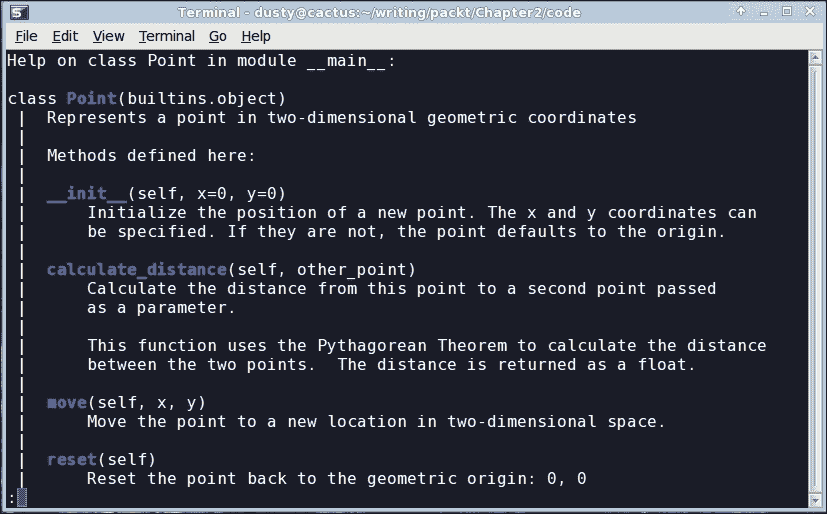
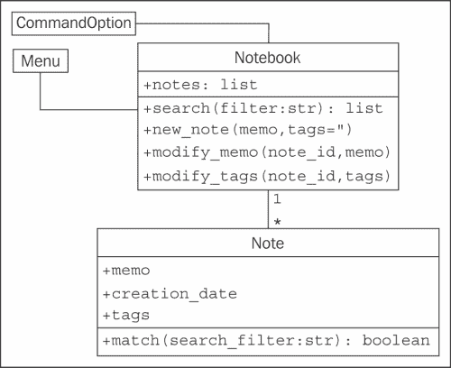

# 第二章：Python 中的对象

因此，我们现在手头有一个设计，并准备将该设计转化为一个可工作的程序！当然，通常情况下不会这样发生。在整本书中，我们将看到良好软件设计的示例和提示，但我们的重点是面向对象编程。因此，让我们看一下 Python 语法，以便我们可以创建面向对象的软件。

完成本章后，我们将了解：

+   如何在 Python 中创建类和实例化对象

+   如何向 Python 对象添加属性和行为

+   如何将类组织成包和模块

+   如何建议人们不要破坏我们的数据

# 创建 Python 类

我们不必写太多 Python 代码就能意识到 Python 是一种非常“干净”的语言。当我们想做某事时，我们只需去做，而不必经历很多设置。Python 中无处不在的“hello world”，正如你可能已经看到的，只有一行。

同样，Python 3 中最简单的类如下所示：

```py
class MyFirstClass:
    pass
```

这是我们的第一个面向对象的程序！类定义以`class`关键字开头。然后是一个名称（我们选择的）来标识类，并以冒号结束。

### 注意

类名必须遵循标准的 Python 变量命名规则（必须以字母或下划线开头，只能由字母、下划线或数字组成）。此外，Python 风格指南（在网上搜索“PEP 8”）建议使用**驼峰命名法**（以大写字母开头；任何后续单词也应以大写字母开头）命名类。

类定义行后面是缩进的类内容。与其他 Python 结构一样，缩进用于界定类，而不是像许多其他语言一样使用大括号或方括号。除非有充分的理由（例如适应其他人使用制表符缩进的代码），否则使用四个空格进行缩进。任何体面的编程编辑器都可以配置为在按下*Tab*键时插入四个空格。

由于我们的第一个类实际上并没有做任何事情，因此我们在第二行使用`pass`关键字来指示不需要采取进一步的行动。

我们可能认为这个最基本的类没有太多可以做的事情，但它确实允许我们实例化该类的对象。我们可以将该类加载到 Python 3 解释器中，以便可以与其进行交互。为此，将前面提到的类定义保存到名为`first_class.py`的文件中，然后运行命令`python -i first_class.py`。`-i`参数告诉 Python“运行代码，然后转到交互式解释器”。以下解释器会话演示了与该类的基本交互：

```py
>>> a = MyFirstClass()
>>> b = MyFirstClass()
>>> print(a)
<__main__.MyFirstClass object at 0xb7b7faec>
>>> print(b)
<__main__.MyFirstClass object at 0xb7b7fbac>
>>>

```

此代码从新类实例化了两个对象，命名为`a`和`b`。创建类的实例只需简单地输入类名，后跟一对括号。它看起来很像一个普通的函数调用，但 Python 知道我们正在“调用”一个类而不是一个函数，因此它知道它的工作是创建一个新对象。当打印时，这两个对象告诉我们它们是哪个类，以及它们所在的内存地址。在 Python 代码中很少使用内存地址，但在这里，它们表明涉及了两个不同的对象。

### 提示

**下载示例代码**

您可以从您在[`www.packtpub.com`](http://www.packtpub.com)的帐户中购买的所有 Packt 图书下载示例代码文件。如果您在其他地方购买了本书，您可以访问[`www.packtpub.com/support`](http://www.packtpub.com/support)并注册，以便直接通过电子邮件接收文件。

## 添加属性

现在，我们有一个基本的类，但它相当无用。它不包含任何数据，也不做任何事情。我们必须怎么做才能将属性分配给给定的对象？

事实证明，在类定义中我们不必做任何特殊的事情。我们可以使用点符号在实例化的对象上设置任意属性：

```py
class Point:
    pass

p1 = Point()
p2 = Point()

p1.x = 5
p1.y = 4

p2.x = 3
p2.y = 6

print(p1.x, p1.y)
print(p2.x, p2.y)
```

如果我们运行这段代码，结尾的两个`print`语句会告诉我们两个对象的新属性值：

```py
5 4
3 6

```

这段代码创建了一个没有数据或行为的空`Point`类。然后它创建了该类的两个实例，并分配给这些实例`x`和`y`坐标，以标识二维空间中的一个点。我们只需要使用*<object>.<attribute> = <value>*语法为对象的属性赋值。这有时被称为**点符号**。值可以是任何东西：Python 原语、内置数据类型或另一个对象。甚至可以是一个函数或另一个类！

## 让它做点什么

现在，拥有属性的对象很棒，但面向对象编程实际上是关于对象之间的交互。我们感兴趣的是调用导致这些属性发生变化的操作。是时候给我们的类添加行为了。

让我们模拟`Point`类上的一些操作。我们可以从一个名为`reset`的操作开始，将点移动到原点（原点是`x`和`y`都为零的点）。这是一个很好的入门操作，因为它不需要任何参数：

```py
class Point:
    def reset(self):
        self.x = 0
        self.y = 0

p = Point()
p.reset()
print(p.x, p.y)
```

这个`print`语句向我们展示了属性上的两个零：

```py
0 0

```

在 Python 中，方法的格式与函数完全相同。它以关键字`def`开头，后面跟着一个空格和方法的名称。然后是一组括号，其中包含参数列表（我们将在接下来讨论`self`参数），最后以冒号结束。下一行缩进包含方法内部的语句。这些语句可以是任意的 Python 代码，操作对象本身和任何传递给方法的参数。

### 自言自语

方法和普通函数之间的唯一区别是所有方法都有一个必需的参数。这个参数通常被命名为`self`；我从未见过程序员使用其他名称来命名这个变量（约定是一件非常有力的事情）。然而，没有什么能阻止你将其命名为`this`甚至`Martha`。

方法的`self`参数只是对方法被调用的对象的引用。我们可以访问该对象的属性和方法，就好像它是另一个对象一样。这正是我们在`reset`方法中设置`self`对象的`x`和`y`属性时所做的。

请注意，当我们调用`p.reset()`方法时，我们不必将`self`参数传递给它。Python 会自动为我们处理这个问题。它知道我们在调用`p`对象上的方法，所以会自动将该对象传递给方法。

然而，这个方法实际上只是一个恰好在类上的函数。我们可以在类上调用方法，显式地将我们的对象作为`self`参数传递：

```py
p = Point()
Point.reset(p)
print(p.x, p.y)
```

输出与上一个示例相同，因为在内部，发生了完全相同的过程。

如果我们在类定义中忘记包括`self`参数会发生什么？Python 会报错：

```py
>>> class Point:
...     def reset():
...         pass
...
>>> p = Point()
>>> p.reset()
Traceback (most recent call last):
 **File "<stdin>", line 1, in <module>
TypeError: reset() takes no arguments (1 given)

```

错误消息并不像它本应该的那样清晰（"你这个傻瓜，你忘记了`self`参数"会更有信息量）。只要记住，当你看到指示缺少参数的错误消息时，首先要检查的是你是否在方法定义中忘记了`self`。

### 更多参数

那么，我们如何向方法传递多个参数呢？让我们添加一个新的方法，允许我们将一个点移动到任意位置，而不仅仅是原点。我们还可以包括一个接受另一个`Point`对象作为输入并返回它们之间距离的方法：

```py
import math

class Point:
    def move(self, x, y):
        self.x = x
        self.y = y

    def reset(self):
        self.move(0, 0)

    def calculate_distance(self, other_point):
        return math.sqrt(
                (self.x - other_point.x)**2 +
                (self.y - other_point.y)**2)

# how to use it:
point1 = Point()
point2 = Point()

point1.reset()
point2.move(5,0)
print(point2.calculate_distance(point1))
assert (point2.calculate_distance(point1) ==
        point1.calculate_distance(point2))
point1.move(3,4)
print(point1.calculate_distance(point2))
print(point1.calculate_distance(point1))
```

结尾的`print`语句给出了以下输出：

```py
5.0
4.472135955
0.0

```

这里发生了很多事情。这个类现在有三种方法。`move`方法接受两个参数，`x`和`y`，并在`self`对象上设置这些值，就像前面示例中的旧`reset`方法一样。旧的`reset`方法现在调用`move`，因为重置只是移动到一个特定的已知位置。

`calculate_distance`方法使用不太复杂的勾股定理来计算两点之间的距离。我希望你理解这个数学（`**`表示平方，`math.sqrt`计算平方根），但这并不是我们当前重点学习的要求，我们的当前重点是学习如何编写方法。

前面示例的最后显示了如何使用参数调用方法的示例代码：只需在括号内包含参数，并使用相同的点表示法访问方法。我只是随机选择了一些位置来测试这些方法。测试代码调用每个方法并在控制台上打印结果。`assert`函数是一个简单的测试工具；如果`assert`后面的语句为`False`（或零、空或`None`），程序将会中止。在这种情况下，我们使用它来确保无论哪个点调用另一个点的`calculate_distance`方法，距离都是相同的。

## 初始化对象

如果我们不显式设置`Point`对象上的`x`和`y`位置，要么使用`move`，要么直接访问它们，我们就会得到一个没有真实位置的损坏的点。当我们尝试访问它时会发生什么呢？

好吧，让我们试试看。"试一试看"是 Python 学习中非常有用的工具。打开你的交互式解释器，然后开始输入。以下交互式会话显示了如果我们尝试访问一个缺失的属性会发生什么。如果你将前面的示例保存为文件，或者正在使用本书分发的示例，你可以使用命令`python -i filename.py`将其加载到 Python 解释器中：

```py
>>> point = Point()
>>> point.x = 5
>>> print(point.x)
5
>>> print(point.y)
Traceback (most recent call last):
 **File "<stdin>", line 1, in <module>
AttributeError: 'Point' object has no attribute 'y'

```

好吧，至少它抛出了一个有用的异常。我们将在第四章*预料之外*中详细介绍异常。你可能以前见过它们（特别是无处不在的**SyntaxError**，它意味着你输入了错误的东西！）。在这一点上，只要意识到它意味着出了问题就可以了。

输出对于调试是有用的。在交互式解释器中，它告诉我们错误发生在**第 1 行**，这只是部分正确的（在交互式会话中，一次只执行一行）。如果我们在文件中运行脚本，它会告诉我们确切的行号，这样很容易找到错误的代码。此外，它告诉我们错误是`AttributeError`，并给出了一个有用的消息告诉我们这个错误是什么意思。

我们可以捕获并从这个错误中恢复，但在这种情况下，感觉我们应该指定某种默认值。也许每个新对象默认应该是`reset()`，或者也许当用户创建对象时，我们可以强制用户告诉我们这些位置应该是什么。

大多数面向对象的编程语言都有**构造函数**的概念，这是一个特殊的方法，在创建对象时创建和初始化对象。Python 有点不同；它有一个构造函数*和*一个初始化器。构造函数很少使用，除非你在做一些奇特的事情。所以，我们将从初始化方法开始讨论。

Python 的初始化方法与任何其他方法相同，只是它有一个特殊的名称`__init__`。前导和尾随的双下划线意味着这是一个 Python 解释器将视为特殊情况的特殊方法。

### 注意

永远不要用前导和尾随的双下划线命名自己的函数。它对 Python 可能没有任何意义，但总有可能 Python 的设计者将来会添加一个具有该名称的特殊目的的函数，当他们这样做时，你的代码将会出错。

让我们从我们的`Point`类上的一个初始化函数开始，当实例化`Point`对象时，需要用户提供`x`和`y`坐标：

```py
class Point:
    def __init__(self, x, y):
        self.move(x, y)

    def move(self, x, y):
        self.x = x
        self.y = y

    def reset(self):
        self.move(0, 0)

# Constructing a Point
point = Point(3, 5)
print(point.x, point.y)
```

现在，我们的点永远不会没有`y`坐标！如果我们试图构造一个点而没有包括正确的初始化参数，它将失败并显示一个类似于我们之前忘记`self`参数时收到的**参数不足**错误。

如果我们不想让这两个参数成为必需的呢？那么，我们可以使用 Python 函数使用的相同语法来提供默认参数。关键字参数语法在每个变量名后添加一个等号。如果调用对象没有提供这个参数，那么将使用默认参数。变量仍然可用于函数，但它们将具有参数列表中指定的值。这里有一个例子：

```py
  class Point:
      def __init__(self, x=0, y=0):
          self.move(x, y)
```

大多数情况下，我们将初始化语句放在`__init__`函数中。但正如前面提到的，Python 除了初始化函数外还有一个构造函数。你可能永远不需要使用另一个 Python 构造函数，但知道它的存在是有帮助的，所以我们会简要介绍一下。

构造函数被称为`__new__`，而不是`__init__`，并且只接受一个参数；正在构造的类（在对象构造之前调用，因此没有`self`参数）。它还必须返回新创建的对象。当涉及到复杂的元编程时，这具有有趣的可能性，但在日常编程中并不是非常有用。实际上，你很少甚至从不需要使用`__new__`，`__init__`就足够了。

## 解释自己

Python 是一种非常易于阅读的编程语言；有些人可能会说它是自我说明的。然而，在进行面向对象编程时，编写清晰总结每个对象和方法做什么的 API 文档是很重要的。保持文档的最新状态是困难的；最好的方法是将其直接写入我们的代码中。

Python 通过使用**docstrings**来支持这一点。每个类、函数或方法头部都可以有一个标准的 Python 字符串作为定义后的第一行（以冒号结尾的行）。这一行应该与后续的代码缩进相同。

文档字符串只是用撇号（`'`）或引号（`"`）括起来的 Python 字符串。通常，文档字符串非常长，跨越多行（风格指南建议行长不超过 80 个字符），可以格式化为多行字符串，用匹配的三个撇号（`'''`）或三个引号（`"""`）括起来。

文档字符串应该清楚而简洁地总结所描述的类或方法的目的。它应该解释任何使用不是立即明显的参数，并且也是包含如何使用 API 的简短示例的好地方。任何使用 API 的用户应该注意的注意事项或问题也应该被记录下来。

为了说明文档字符串的用法，我们将以完全记录的`Point`类结束本节：

```py
import math

class Point:
    'Represents a point in two-dimensional geometric coordinates'

    def __init__(self, x=0, y=0):
        '''Initialize the position of a new point. The x and y coordinates can be specified. If they are not, the
           point defaults to the origin.'''
        self.move(x, y)

    def move(self, x, y):
        "Move the point to a new location in 2D space."
        self.x = x
        self.y = y

    def reset(self):
        'Reset the point back to the geometric origin: 0, 0'
        self.move(0, 0)

    def calculate_distance(self, other_point):
        """Calculate the distance from this point to a second
        point passed as a parameter.

        This function uses the Pythagorean Theorem to calculate the distance between the two points. The distance is
        returned as a float."""

        return math.sqrt(
                (self.x - other_point.x)**2 +
                (self.y - other_point.y)**2)
```

尝试在交互式解释器中键入或加载（记住，是`python -i filename.py`）这个文件。然后，在 Python 提示符下输入`help(Point)<enter>`。你应该会看到类的精美格式化文档，如下面的屏幕截图所示：



# 模块和包

现在，我们知道如何创建类和实例化对象，但是我们如何组织它们呢？对于小型程序，我们可以将所有类放入一个文件中，并在文件末尾添加一个小脚本来启动它们的交互。然而，随着项目的增长，很难在我们定义的许多类中找到需要编辑的类。这就是**模块**的用武之地。模块只是 Python 文件，没有别的。我们小程序中的单个文件就是一个模块。两个 Python 文件就是两个模块。如果我们在同一个文件夹中有两个文件，我们可以从一个模块中加载一个类以在另一个模块中使用。

例如，如果我们正在构建一个电子商务系统，我们可能会在数据库中存储大量数据。我们可以将所有与数据库访问相关的类和函数放入一个单独的文件中（我们将其命名为一些合理的东西：`database.py`）。然后，我们的其他模块（例如，客户模型、产品信息和库存）可以导入该模块中的类以访问数据库。

`import`语句用于导入模块或特定类或函数。我们已经在上一节的`Point`类中看到了一个例子。我们使用`import`语句获取 Python 的内置`math`模块，并在我们的`distance`计算中使用它的`sqrt`函数。

这是一个具体的例子。假设我们有一个名为`database.py`的模块，其中包含一个名为`Database`的类，以及一个名为`products.py`的第二个模块，负责与产品相关的查询。在这一点上，我们不需要太过考虑这些文件的内容。我们知道的是`products.py`需要实例化`database.py`中的`Database`类，以便可以在数据库中的产品表上执行查询。

`import`语句的语法有几种变体，可以用来访问类：

```py
import database
db = database.Database()
# Do queries on db
```

这个版本将`database`模块导入`products`命名空间（模块或函数中当前可访问的名称列表），因此可以使用`database.<something>`表示法访问`database`模块中的任何类或函数。或者，我们可以使用`from`...`import`语法只导入我们需要的一个类：

```py
from database import Database
db = Database()
# Do queries on db
```

如果由于某种原因，`products`已经有一个名为`Database`的类，我们不希望这两个名称混淆，我们可以在`products`模块内部使用时重命名该类：

```py
from database import Database as DB
db = DB()
# Do queries on db
```

我们也可以在一条语句中导入多个项目。如果我们的`database`模块还包含一个`Query`类，我们可以使用以下语法导入两个类：

```py
from database import Database, Query
```

一些来源表示，我们可以使用以下语法从`database`模块中导入所有类和函数：

```py
from database import *
```

不要这样做。每个有经验的 Python 程序员都会告诉你，你永远不应该使用这种语法。他们会使用模糊的理由，比如“它会使命名空间混乱”，这对初学者来说并不太有意义。避免使用这种语法的一个方法是使用它，并在两年后尝试理解你的代码。但我们可以通过一个快速的解释节省一些时间和两年的糟糕代码！

当我们在文件顶部明确导入`database`类时，使用`from database import Database`，我们可以很容易地看到`Database`类来自哪里。我们可能会在文件的后面 400 行使用`db = Database()`，我们可以快速查看导入来看`Database`类来自哪里。然后，如果我们需要澄清如何使用`Database`类，我们可以访问原始文件（或者在交互式解释器中导入模块并使用`help(database.Database)`命令）。然而，如果我们使用`from database import *`语法，要找到该类的位置就要花费更多的时间。代码维护变成了一场噩梦。

此外，大多数编辑器能够提供额外的功能，如可靠的代码补全、跳转到类的定义或内联文档，如果使用正常的导入。`import *`语法通常会完全破坏它们可靠地执行这些功能的能力。

最后，使用`import *`语法可能会将意外的对象带入我们的本地命名空间。当然，它将导入从被导入的模块中定义的所有类和函数，但它也将导入任何被导入到该文件中的类或模块！

模块中使用的每个名称都应该来自一个明确定义的地方，无论它是在该模块中定义的，还是从另一个模块中明确导入的。不应该有看起来像从空气中出现的魔术变量。我们应该*总是*能够立即确定我们当前命名空间中的名称来自哪里。我保证，如果你使用这种邪恶的语法，总有一天你会非常沮丧地发现“这个类到底是从哪里来的？”。

## 组织模块

随着项目逐渐发展成为越来越多模块的集合，我们可能会发现我们想要添加另一层抽象，一种在我们模块级别上的嵌套层次结构。然而，我们不能将模块放在模块中；毕竟，一个文件只能容纳一个文件，而模块只不过是 Python 文件而已。

文件可以放在文件夹中，模块也可以。**包**是文件夹中模块的集合。包的名称是文件夹的名称。我们只需要告诉 Python 一个文件夹是一个包，就是在文件夹中放置一个（通常是空的）名为`__init__.py`的文件。如果我们忘记了这个文件，我们将无法从该文件夹导入模块。

让我们把我们的模块放在我们的工作文件夹中的`ecommerce`包中，该文件夹还将包含一个`main.py`文件来启动程序。让我们另外在`ecommerce`包中添加另一个包，用于各种付款选项。文件夹层次结构将如下所示：

```py
parent_directory/
    main.py
    ecommerce/
        __init__.py
        database.py
        products.py
        payments/
            __init__.py
            square.py
            stripe.py
```

在包之间导入模块或类时，我们必须谨慎使用语法。在 Python 3 中，有两种导入模块的方式：绝对导入和相对导入。

### 绝对导入

**绝对导入**指定要导入的模块、函数或路径的完整路径。如果我们需要访问`products`模块内的`Product`类，我们可以使用以下任何语法来进行绝对导入：

```py
import ecommerce.products
product = ecommerce.products.Product()
```

或者

```py
from ecommerce.products import Product
product = Product()
```

或者

```py
from ecommerce import products
product = products.Product()
```

`import`语句使用句点运算符来分隔包或模块。

这些语句将从任何模块中起作用。我们可以在`main.py`、`database`模块中或两个付款模块中使用这种语法实例化`Product`类。实际上，假设包对 Python 可用，它将能够导入它们。例如，包也可以安装到 Python 站点包文件夹中，或者`PYTHONPATH`环境变量可以被定制以动态地告诉 Python 要搜索哪些文件夹以及它将要导入哪些包和模块。

因此，有了这些选择，我们选择哪种语法？这取决于你个人的口味和手头的应用。如果`products`模块内有几十个类和函数，我想要使用，通常我会使用`from ecommerce import products`语法导入模块名称，然后使用`products.Product`访问单个类。如果我只需要`products`模块中的一个或两个类，我可以直接使用`from ecommerce.proucts import Product`语法导入它们。我个人不经常使用第一种语法，除非我有某种名称冲突（例如，我需要访问两个完全不同的名为`products`的模块并且需要将它们分开）。做任何你认为使你的代码看起来更优雅的事情。

### 相对导入

当在一个包中使用相关模块时，指定完整路径似乎有点愚蠢；我们知道我们的父模块叫什么。这就是**相对导入**的用武之地。相对导入基本上是一种说法，即按照当前模块的位置来查找类、函数或模块。例如，如果我们在`products`模块中工作，我们想要从旁边的`database`模块导入`Database`类，我们可以使用相对导入：

```py
from .database import Database
```

`database`前面的句点表示“*在当前包内使用数据库模块*”。在这种情况下，当前包是包含我们当前正在编辑的`products.py`文件的包，也就是`ecommerce`包。

如果我们正在编辑`ecommerce.payments`包中的`paypal`模块，我们想说“*使用父包内的数据库包*”，这很容易通过两个句点来完成，如下所示：

```py
from ..database import Database
```

我们可以使用更多的句点来进一步上升层次。当然，我们也可以向下走一边，然后向上走另一边。我们没有足够深的示例层次结构来正确说明这一点，但是如果我们有一个包含`email`模块的`ecommerce.contact`包，并且想要将`send_mail`函数导入到我们的`paypal`模块中，以下将是一个有效的导入：

```py
from ..contact.email import send_mail
```

这个导入使用两个句点来表示*payments 包的父级*，然后使用正常的`package.module`语法来返回*up*到 contact 包。

最后，我们可以直接从包中导入代码，而不仅仅是包内的模块。在这个例子中，我们有一个名为`database.py`和`products.py`的`ecommerce`包，数据库模块包含一个从许多地方访问的`db`变量。如果这可以被导入为`import ecommerce.db`而不是`import ecommerce.database.db`，那不是很方便吗？

记住定义目录为包的`__init__.py`文件？这个文件可以包含我们喜欢的任何变量或类声明，并且它们将作为包的一部分可用。在我们的例子中，如果`ecommerce/__init__.py`文件包含这一行：

```py
from .database import db
```

然后我们可以从`main.py`或任何其他文件中使用这个导入来访问`db`属性：

```py
from ecommerce import db
```

如果把`__init__.py`文件看作是一个`ecommerce.py`文件，如果该文件是一个模块而不是一个包，这可能有所帮助。如果您将所有代码放在一个单独的模块中，然后决定将其拆分为多个模块的包，`__init__.py`文件仍然可以是其他模块与其交流的主要联系点，但代码可以在内部组织成几个不同的模块或子包。

我建议不要把所有的代码都放在一个`__init__.py`文件中。程序员不希望在这个文件中发生实际的逻辑，就像`from x import *`一样，如果他们正在寻找特定代码的声明并且找不到直到他们检查`__init__.py`，这可能会让他们困惑。

# 组织模块内容

在任何一个模块内，我们可以指定变量、类或函数。它们可以是一种方便的方式来存储全局状态而不会发生命名空间冲突。例如，我们一直在将`Database`类导入到各个模块中，然后实例化它，但是只有一个全局可用的`database`对象可能更有意义，来自`database`模块。`database`模块可能如下所示：

```py
class Database:
    # the database implementation
    pass

database = Database()
```

然后我们可以使用我们讨论过的任何导入方法来访问`database`对象，例如：

```py
from ecommerce.database import database
```

前面的类的一个问题是，`database`对象在模块首次导入时立即创建，这通常是在程序启动时。这并不总是理想的，因为连接到数据库可能需要一段时间，从而减慢启动速度，或者数据库连接信息可能尚不可用。我们可以延迟创建数据库，直到实际需要它，通过调用`initialize_database`函数来创建模块级变量：

```py
class Database:
    # the database implementation
    pass

database = None

def initialize_database():
    global database
    database = Database()
```

`global`关键字告诉 Python，`initialize_database`内部的数据库变量是我们刚刚定义的模块级变量。如果我们没有将变量指定为全局的，Python 会创建一个新的局部变量，当方法退出时会被丢弃，从而保持模块级值不变。

正如这两个例子所说明的，所有模块级代码都会在导入时立即执行。但是，如果它在方法或函数内部，函数会被创建，但它的内部代码直到调用函数时才会被执行。对于执行脚本（比如我们电子商务示例中的主要脚本）来说，这可能是一个棘手的问题。通常，我们会编写一个执行有用操作的程序，然后后来发现我们想要从另一个程序中导入该模块中的一个函数或类。然而，一旦我们导入它，任何模块级别的代码都会立即执行。如果我们不小心，我们可能会在真正只想要访问该模块中的一些函数时运行第一个程序。

为了解决这个问题，我们应该总是将我们的启动代码放在一个函数中（通常称为`main`），并且只在我们知道我们正在作为脚本运行模块时执行该函数，而不是在我们的代码被从另一个脚本中导入时执行。但是我们怎么知道这一点呢？

```py
class UsefulClass:
    '''This class might be useful to other modules.'''
    pass

def main():
    '''creates a useful class and does something with it for our module.'''
    useful = UsefulClass()
    print(useful)

if __name__ == "__main__":
    main()
```

每个模块都有一个`__name__`特殊变量（记住，Python 使用双下划线表示特殊变量，比如类的`__init__`方法），它指定了模块在导入时的名称。当模块直接用`python module.py`执行时，它不会被导入，所以`__name__`被任意设置为字符串`"__main__"`。制定一个规则，将所有脚本都包裹在`if __name__ == "__main__":`测试中，以防你写的某个函数有一天会被其他代码导入。

因此，方法放在类中，类放在模块中，模块放在包中。这就是全部吗？

实际上并非如此。这是 Python 程序中的典型顺序，但并非唯一可能的布局。类可以在任何地方定义。它们通常在模块级别定义，但也可以在函数或方法内部定义，就像这样：

```py
def format_string(string, formatter=None):
    '''Format a string using the formatter object, which
    is expected to have a format() method that accepts
    a string.'''
    class DefaultFormatter:
        '''Format a string in title case.'''
        def format(self, string):
            return str(string).title()

    if not formatter:
        formatter = DefaultFormatter()

    return formatter.format(string)

hello_string = "hello world, how are you today?"
print(" input: " + hello_string)
print("output: " + format_string(hello_string))
```

输出将如下所示：

```py
input: hello world, how are you today?
output: Hello World, How Are You Today?

```

`format_string`函数接受一个字符串和可选的格式化器对象，然后将该格式化器应用于该字符串。如果没有提供格式化器，它会创建一个自己的格式化器作为本地类并实例化它。由于它是在函数的作用域内创建的，这个类不能从函数外部的任何地方访问。同样，函数也可以在其他函数内部定义；一般来说，任何 Python 语句都可以在任何时候执行。

这些内部类和函数偶尔对于不需要或不值得拥有自己的作用域的一次性项目是有用的，或者只在单个方法内部有意义。然而，很少见到频繁使用这种技术的 Python 代码。

# 谁可以访问我的数据？

大多数面向对象的编程语言都有访问控制的概念。这与抽象有关。对象上的一些属性和方法被标记为私有，意味着只有该对象可以访问它们。其他的被标记为受保护，意味着只有该类和任何子类才能访问。其余的是公共的，意味着任何其他对象都可以访问它们。

Python 不这样做。Python 并不真的相信强制性的法律可能会在某一天妨碍你。相反，它提供了不受约束的指导方针和最佳实践。从技术上讲，类上的所有方法和属性都是公开可用的。如果我们想表明一个方法不应该公开使用，我们可以在文档字符串中放置一个注释，指出该方法仅供内部使用（最好还要解释公共 API 的工作原理！）。

按照惯例，我们还应该用下划线字符`_`作为属性或方法的前缀。Python 程序员会将其解释为“这是一个内部变量，在直接访问之前要三思”。但是在解释器内部并没有任何东西阻止他们在认为有利的情况下访问它。因为如果他们这样认为，我们为什么要阻止他们呢？我们可能不知道我们的类将来可能被用来做什么。

还有一件事可以强烈建议外部对象不要访问属性或方法：用双下划线`__`作为前缀。这将对相关属性进行**名称混淆**。这基本上意味着如果外部对象真的想要调用这个方法，它仍然可以这样做，但需要额外的工作，并且强烈表明你要求你的属性保持私有。例如：

```py
class SecretString:
    '''A not-at-all secure way to store a secret string.'''

    def __init__(self, plain_string, pass_phrase):
        self.__plain_string = plain_string
        self.__pass_phrase = pass_phrase

    def decrypt(self, pass_phrase):
        '''Only show the string if the pass_phrase is correct.'''
        if pass_phrase == self.__pass_phrase:
            return self.__plain_string
        else:
            return ''
```

如果我们加载这个类并在交互式解释器中测试它，我们会发现它隐藏了外部世界的纯文本字符串：

```py
>>> secret_string = SecretString("ACME: Top Secret", "antwerp")
>>> print(secret_string.decrypt("antwerp"))
ACME: Top Secret
>>> print(secret_string.__plain_text)
Traceback (most recent call last):
 **File "<stdin>", line 1, in <module>
AttributeError: 'SecretString' object has no attribute
'__plain_text'

```

看起来它起作用了；没有人可以在没有密码的情况下访问我们的`plain_text`属性，所以它一定是安全的。然而，在我们过于兴奋之前，让我们看看有多容易就能破解我们的安全性：

```py
>>> print(secret_string._SecretString__plain_string)
ACME: Top Secret

```

哦不！有人已经破解了我们的秘密字符串。幸好我们检查了！这就是 Python 名称混淆的工作原理。当我们使用双下划线时，属性会以`_<classname>`为前缀。当类内部的方法访问变量时，它们会自动解除混淆。当外部类希望访问它时，它们必须自己进行名称混淆。因此，名称混淆并不能保证隐私，它只是强烈建议。大多数 Python 程序员不会轻易触碰另一个对象上的双下划线变量，除非他们有极其充分的理由这样做。

然而，大多数 Python 程序员不会轻易触碰一个下划线变量，除非有充分的理由。因此，在 Python 中很少有使用名称混淆变量的好理由，这样做可能会带来麻烦。例如，名称混淆变量可能对子类有用，它必须自己进行混淆。如果其他对象想要访问你的隐藏信息，就让它们访问吧，只要让它们知道，使用单下划线前缀或一些清晰的文档字符串，你认为这不是一个好主意。

# 第三方库

Python 附带了一个可爱的标准库，其中包含了一系列在运行 Python 的每台机器上都可用的包和模块。然而，你很快会发现它并不包含你所需要的一切。当发生这种情况时，你有两个选择：

+   自己编写一个支持包

+   使用别人的代码

我们不会详细介绍如何将你的包转换成库，但是如果你有一个需要解决的问题，而你又不想编写代码（最好的程序员非常懒惰，更喜欢重用现有的经过验证的代码，而不是编写自己的代码），你可能可以在**Python 包索引**（**PyPI**）[`pypi.python.org/`](http://pypi.python.org/)上找到你想要的库。一旦确定了要安装的包，你可以使用一个叫做`pip`的工具来安装它。然而，`pip`并不随 Python 一起提供，但 Python 3.4 包含一个有用的工具叫做`ensurepip`，它会安装它：

```py
python -m ensurepip

```

这可能在 Linux、Mac OS 或其他 Unix 系统上失败，如果是这样，你需要成为 root 用户才能使其工作。在大多数现代 Unix 系统上，可以使用`sudo python -m ensurepip`来完成这个操作。

### 注意

如果你使用的是 Python 3.4 之前的版本，你需要自己下载并安装`pip`，因为`ensurepip`不存在。你可以按照[`pip.readthedocs.org/`](http://pip.readthedocs.org/)上的说明来做这件事。

一旦安装了`pip`并且知道要安装的包的名称，你可以使用以下语法来安装它：

```py
pip install requests

```

然而，如果这样做，你要么将第三方库直接安装到系统 Python 目录中，要么更有可能收到你没有权限这样做的错误。你可以强制以管理员身份安装，但 Python 社区的普遍共识是，你应该只使用系统安装程序将第三方库安装到系统 Python 目录中。

然而，Python 3.4 提供了`venv`工具。这个工具基本上为你在工作目录中提供了一个叫做*虚拟环境*的迷你 Python 安装。当你激活这个迷你 Python 时，与 Python 相关的命令将在该目录上运行，而不是在系统目录上运行。因此，当你运行`pip`或`python`时，它不会影响系统 Python。以下是如何使用它：

```py
cd project_directory
python -m venv env
source env/bin/activate  # on Linux or MacOS
env/bin/activate.bat     # on Windows

```

通常，你会为你工作的每个 Python 项目创建一个不同的虚拟环境。你可以将虚拟环境存储在任何地方，但我把我的放在与其余项目文件相同的目录中（但在版本控制中被忽略），所以首先我们`cd`进入那个目录。然后我们运行`venv`工具来创建一个名为`env`的虚拟环境。最后，我们使用最后两行中的一行（取决于操作系统，如注释中所示）来激活环境。每次我们想要使用特定的虚拟环境时，都需要执行这行命令，然后在完成这个项目的工作时使用`deactivate`命令。

虚拟环境是保持第三方依赖项分开的绝佳方式。通常会有不同的项目依赖于特定库的不同版本（例如，一个较旧的网站可能在 Django 1.5 上运行，而更新的版本则在 Django 1.8 上运行）。将每个项目放在单独的虚拟环境中可以轻松地在 Django 的任一版本中工作。此外，如果尝试使用不同的工具安装相同的包，它可以防止系统安装的软件包和`pip`安装的软件包之间发生冲突。

# 案例研究

为了把所有这些联系在一起，让我们构建一个简单的命令行笔记本应用程序。这是一个相当简单的任务，所以我们不会尝试使用多个包。然而，我们会看到类、函数、方法和文档字符串的常见用法。

让我们从一个快速分析开始：笔记是存储在笔记本中的简短备忘录。每个笔记应记录写作日期，并可以添加标签以便进行简单查询。应该可以修改笔记。我们还需要能够搜索笔记。所有这些事情都应该从命令行完成。

显而易见的对象是`Note`对象；不太明显的是`Notebook`容器对象。标签和日期似乎也是对象，但我们可以使用 Python 标准库中的日期和逗号分隔的字符串来表示标签。为了避免复杂性，在原型中，让我们不为这些对象定义单独的类。

`Note`对象具有`memo`本身，`tags`和`creation_date`的属性。每个笔记还需要一个唯一的整数`id`，以便用户可以在菜单界面中选择它们。笔记可以有一个修改笔记内容的方法和另一个修改标签的方法，或者我们可以让笔记本直接访问这些属性。为了使搜索更容易，我们应该在`Note`对象上放置一个`match`方法。这个方法将接受一个字符串，并且可以告诉我们笔记是否与字符串匹配，而不直接访问属性。这样，如果我们想修改搜索参数（例如搜索标签而不是笔记内容，或者使搜索不区分大小写），我们只需要在一个地方做就可以了。

`Notebook`对象显然具有笔记列表作为属性。它还需要一个搜索方法，返回过滤后的笔记列表。

但是我们如何与这些对象交互？我们已经指定了一个命令行应用程序，这意味着我们可以通过不同的选项运行程序来添加或编辑命令，或者我们有一种菜单可以让我们选择对笔记本进行不同的操作。我们应该尽量设计它，以便支持任一界面，并且将来可以添加其他界面，比如 GUI 工具包或基于 Web 的界面。

作为设计决策，我们现在将实现菜单界面，但会牢记命令行选项版本，以确保我们设计`Notebook`类时考虑到可扩展性。

如果我们有两个命令行界面，每个界面都与`Notebook`对象交互，那么`Notebook`将需要一些方法让这些界面进行交互。我们需要能够`add`一个新的笔记，并且通过`id`来`modify`一个现有的笔记，除了我们已经讨论过的`search`方法。界面还需要能够列出所有的笔记，但它们可以通过直接访问`notes`列表属性来实现。

我们可能会漏掉一些细节，但这给了我们一个非常好的代码概述。我们可以用一个简单的类图总结所有这些：



在编写任何代码之前，让我们为这个项目定义文件夹结构。菜单界面应该明显地在自己的模块中，因为它将是一个可执行脚本，并且我们将来可能会有其他可执行脚本访问笔记本。`Notebook`和`Note`对象可以一起存在于一个模块中。这些模块可以都存在于同一个顶级目录中，而不必将它们放在一个包中。一个空的`command_option.py`模块可以帮助我们在将来提醒我们计划添加新的用户界面。

```py
parent_directory/
    notebook.py
    menu.py
    command_option.py
```

现在让我们看一些代码。我们首先定义`Note`类，因为它似乎最简单。下面的示例完整地呈现了`Note`。示例中的文档字符串解释了它们如何完美地配合在一起。

```py
import datetime

# Store the next available id for all new notes
last_id = 0

class Note:
    '''Represent a note in the notebook. Match against a
    string in searches and store tags for each note.'''

    def __init__(self, memo, tags=''):
        '''initialize a note with memo and optional
        space-separated tags. Automatically set the note's
        creation date and a unique id.'''
        self.memo = memo
        self.tags = tags
        self.creation_date = datetime.date.today()
        global last_id
        last_id += 1
        self.id = last_id

    def match(self, filter):
        '''Determine if this note matches the filter
        text. Return True if it matches, False otherwise.

        Search is case sensitive and matches both text and
        tags.'''
        return filter in self.memo or filter in self.tags
```

在继续之前，我们应该快速启动交互式解释器并测试到目前为止的代码。经常测试，因为事情从来不按照你的期望工作。事实上，当我测试这个示例的第一个版本时，我发现我忘记了`match`函数中的`self`参数！我们将在第十章中讨论自动化测试，*Python 设计模式 I*。目前，只需使用解释器检查一些东西就足够了：

```py
>>> from notebook import Note
>>> n1 = Note("hello first")
>>> n2 = Note("hello again")
>>> n1.id
1
>>> n2.id
2
>>> n1.match('hello')
True
>>> n2.match('second')
False

```

看起来一切都表现如预期。让我们接下来创建我们的笔记本：

```py
class Notebook:
    '''Represent a collection of notes that can be tagged,
    modified, and searched.'''

    def __init__(self):
        '''Initialize a notebook with an empty list.'''
        self.notes = []

    def new_note(self, memo, tags=''):
        '''Create a new note and add it to the list.'''
        self.notes.append(Note(memo, tags))

    def modify_memo(self, note_id, memo):
        '''Find the note with the given id and change its
        memo to the given value.'''
        for note in self.notes:
            if note.id == note_id:
                note.memo = memo
                break

    def modify_tags(self, note_id, tags):
        '''Find the note with the given id and change its
        tags to the given value.'''
        for note in self.notes:
            if note.id == note_id:
                note.tags = tags
                break

    def search(self, filter):
        '''Find all notes that match the given filter
        string.'''
        return [note for note in self.notes if
                note.match(filter)]
```

我们稍后会整理一下。首先，让我们测试一下，确保它能正常工作：

```py
>>> from notebook import Note, Notebook
>>> n = Notebook()
>>> n.new_note("hello world")
>>> n.new_note("hello again")
>>> n.notes
[<notebook.Note object at 0xb730a78c>, <notebook.Note object at
 **0xb73103ac>]
>>> n.notes[0].id
1
>>> n.notes[1].id
2
>>> n.notes[0].memo
'hello world'
>>> n.search("hello")
[<notebook.Note object at 0xb730a78c>, <notebook.Note object at
 **0xb73103ac>]
>>> n.search("world")
[<notebook.Note object at 0xb730a78c>]
>>> n.modify_memo(1, "hi world")
>>> n.notes[0].memo
'hi world'

```

它确实有效。但代码有点混乱；我们的`modify_tags`和`modify_memo`方法几乎是相同的。这不是良好的编码实践。让我们看看如何改进它。

两种方法都试图在对笔记进行操作之前识别具有特定 ID 的笔记。因此，让我们添加一个方法来定位具有特定 ID 的笔记。我们将在方法名前加上下划线来表示该方法仅供内部使用，但当然，我们的菜单界面可以访问该方法，如果它想要的话：

```py
    def _find_note(self, note_id):
        '''Locate the note with the given id.'''
        for note in self.notes:
            if note.id == note_id:
                return note
        return None

    def modify_memo(self, note_id, memo):
        '''Find the note with the given id and change its
        memo to the given value.'''
        self._find_note(note_id).memo = memo
```

这应该暂时有效。让我们来看看菜单界面。该界面只需显示菜单并允许用户输入选择。以下是我们的第一次尝试：

```py
import sys
from notebook import Notebook, Note

class Menu:
    '''Display a menu and respond to choices when run.'''
    def __init__(self):
        self.notebook = Notebook()
        self.choices = {
                "1": self.show_notes,
                "2": self.search_notes,
                "3": self.add_note,
                "4": self.modify_note,
                "5": self.quit
                }

    def display_menu(self):
        print("""
Notebook Menu

1\. Show all Notes
2\. Search Notes
3\. Add Note
4\. Modify Note
5\. Quit
""")

    def run(self):
        '''Display the menu and respond to choices.'''
        while True:
            self.display_menu()
            choice = input("Enter an option: ")
            action = self.choices.get(choice)
            if action:
                action()
            else:
                print("{0} is not a valid choice".format(choice))

    def show_notes(self, notes=None):
        if not notes:
            notes = self.notebook.notes
        for note in notes:
            print("{0}: {1}\n{2}".format(
                note.id, note.tags, note.memo))

    def search_notes(self):
        filter = input("Search for: ")
        notes = self.notebook.search(filter)
        self.show_notes(notes)

    def add_note(self):
        memo = input("Enter a memo: ")
        self.notebook.new_note(memo)
        print("Your note has been added.")

    def modify_note(self):
        id = input("Enter a note id: ")
        memo = input("Enter a memo: ")
        tags = input("Enter tags: ")
        if memo:
            self.notebook.modify_memo(id, memo)
        if tags:
            self.notebook.modify_tags(id, tags)

    def quit(self):
        print("Thank you for using your notebook today.")
        sys.exit(0)

if __name__ == "__main__":
    Menu().run()
```

这段代码首先使用绝对导入导入笔记本对象。相对导入不起作用，因为我们还没有将我们的代码放入一个包中。`Menu`类的`run`方法重复显示菜单，并通过调用笔记本上的函数来响应选择。这是一种对 Python 相当特殊的习语；它是命令模式的一个轻量级版本，我们将在第十章中讨论，*Python 设计模式 I*。用户输入的选择是字符串。在菜单的`__init__`方法中，我们创建了一个将字符串映射到菜单对象本身的函数的字典。然后，当用户做出选择时，我们从字典中检索对象。`action`变量实际上是指特定的方法，并通过在变量后附加空括号（因为没有一个方法需要参数）来调用它。当然，用户可能输入了不合适的选择，所以我们在调用之前检查这个动作是否真的存在。

各种方法都要求用户输入并调用与之关联的`Notebook`对象上的适当方法。对于`search`实现，我们注意到在过滤了笔记之后，我们需要向用户显示它们，所以我们让`show_notes`函数充当双重职责；它接受一个可选的`notes`参数。如果提供了，它只显示过滤后的笔记，但如果没有提供，它会显示所有笔记。由于`notes`参数是可选的，`show_notes`仍然可以作为一个空菜单项调用，不带参数。

如果我们测试这段代码，我们会发现修改笔记不起作用。有两个错误，即：

+   当我们输入一个不存在的笔记 ID 时，笔记本会崩溃。我们永远不应该相信我们的用户输入正确的数据！

+   即使我们输入了正确的 ID，它也会崩溃，因为笔记 ID 是整数，但我们的菜单传递的是字符串。

后一个错误可以通过修改`Notebook`类的`_find_note`方法来解决，使用字符串而不是笔记中存储的整数进行比较，如下所示：

```py
    def _find_note(self, note_id):
        '''Locate the note with the given id.'''
        for note in self.notes:
            if str(note.id) == str(note_id):
                return note
        return None
```

我们只需在比较之前将输入（`note_id`）和笔记的 ID 都转换为字符串。我们也可以将输入转换为整数，但如果用户输入字母"a"而不是数字"1"，那么我们就会遇到麻烦。

通过修改笔记本上的两个`modify`方法，可以解决用户输入不存在的笔记 ID 的问题，检查`_find_note`是否返回了一个笔记，如下所示：

```py
    def modify_memo(self, note_id, memo):
        '''Find the note with the given id and change its
        memo to the given value.'''
        note = self._find_note(note_id)
        if note:
            note.memo = memo
            return True
        return False
```

这个方法已经更新为根据是否找到笔记返回`True`或`False`。菜单可以使用这个返回值来显示错误，如果用户输入了无效的笔记。不过，这段代码有点笨重；如果它引发异常会好看一些。我们将在第四章中介绍，*预料之外*。

# 练习

编写一些面向对象的代码。目标是使用本章学到的原则和语法，确保你可以使用它，而不仅仅是阅读它。如果你一直在做一个 Python 项目，回过头来看看，看看是否有一些对象可以创建，并添加属性或方法。如果项目很大，尝试将其分成几个模块，甚至包，并尝试使用语法。

如果你没有这样的项目，试着开始一个新的项目。它不必是你打算完成的东西，只需勾勒出一些基本的设计部分。你不需要完全实现所有东西，通常只需要一个`print("this method will do something")`就足以让整体设计就位。这被称为**自顶向下的设计**，在这种设计中，你先解决不同的交互并描述它们应该如何工作，然后再实际实现它们。相反的**自底向上的设计**，先实现细节，然后将它们全部联系在一起。这两种模式在不同的时候都很有用，但是对于理解面向对象的原则来说，自顶向下的工作流更合适。

如果你在想法上遇到困难，可以尝试编写一个待办事项应用程序。（提示：它会类似于笔记本应用程序的设计，但会有额外的日期管理方法。）它可以跟踪你每天想要做的事情，并允许你标记它们为已完成。

现在，尝试设计一个更大的项目。它不一定要实际做任何事情，但确保你尝试使用包和模块导入语法。在各种模块中添加一些函数，并尝试从其他模块和包中导入它们。使用相对导入和绝对导入。看看它们之间的区别，并尝试想象你何时想要使用每种导入方式。

# 总结

在本章中，我们学习了在 Python 中创建类并分配属性和方法是多么简单。与许多其他语言不同，Python 区分了构造函数和初始化器。它对访问控制有一种放松的态度。有许多不同级别的作用域，包括包、模块、类和函数。我们理解了相对导入和绝对导入之间的区别，以及如何管理不随 Python 一起提供的第三方包。

在下一章中，我们将学习如何使用继承来共享实现。
