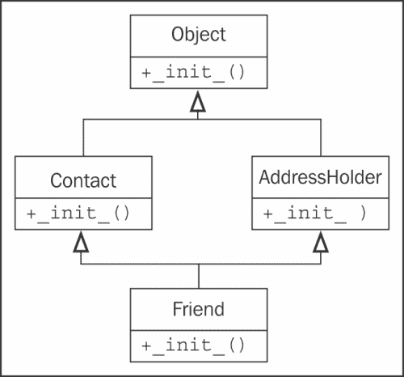
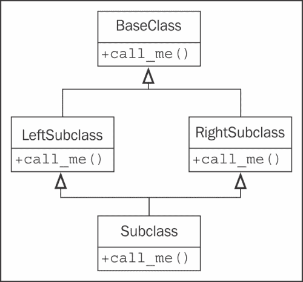
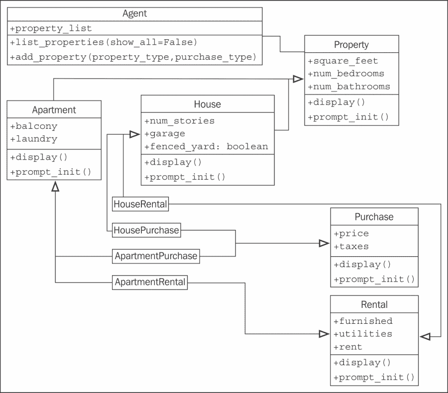

# 第三章：当对象相似时

在编程世界中，重复的代码被认为是邪恶的。我们不应该在不同的地方有相同或相似的代码的多个副本。

有许多方法可以合并具有类似功能的代码或对象。在本章中，我们将介绍最著名的面向对象原则：继承。如第一章中所讨论的，继承允许我们在两个或多个类之间创建*是*关系，将通用逻辑抽象为超类，并在子类中管理特定细节。特别是，我们将介绍 Python 的语法和原则：

+   基本继承

+   从内置继承

+   多重继承

+   多态和鸭子类型

# 基本继承

从技术上讲，我们创建的每个类都使用继承。所有 Python 类都是名为`object`的特殊类的子类。这个类在数据和行为方面提供的很少（它提供的行为都是双下划线方法，仅供内部使用），但它确实允许 Python 以相同的方式处理所有对象。

如果我们没有明确从不同的类继承，我们的类将自动从`object`继承。但是，我们可以明确声明我们的类派生自`object`，使用以下语法：

```py
class MySubClass(object):
    pass
```

这就是继承！从技术上讲，这个例子与我们在第二章中的第一个例子没有什么不同，因为如果我们没有明确提供不同的超类，Python 3 会自动从`object`继承。超类或父类是被继承的类。子类是继承自超类的类。在这种情况下，超类是`object`，而`MySubClass`是子类。子类也被称为从其父类派生，或者说子类扩展了父类。

正如您可能已经从示例中了解到的那样，继承需要比基本类定义多一点额外的语法。只需在类名后面的冒号之前的括号内包含父类的名称，但在类定义结束之前。这就是我们要告诉 Python 的所有内容，新类应该从给定的超类派生。

我们如何在实践中应用继承？继承的最简单和最明显的用法是向现有类添加功能。让我们从一个简单的联系人管理器开始，跟踪几个人的姓名和电子邮件地址。联系人类负责在一个类变量中维护所有联系人的列表，并为单个联系人初始化名称和地址：

```py
class Contact:
    **all_contacts = []

    def __init__(self, name, email):
        self.name = name
        self.email = email
        **Contact.all_contacts.append(self)

```

这个例子向我们介绍了类变量。`all_contacts`列表，因为它是类定义的一部分，被所有这个类的实例共享。这意味着只有一个`Contact.all_contacts`列表，我们可以访问为`Contact.all_contacts`。更不明显的是，我们也可以在从`Contact`实例化的任何对象上作为`self.all_contacts`访问它。如果在对象上找不到该字段，那么它将在类上找到，从而引用相同的单个列表。

### 提示

请注意这种语法，因为如果您使用`self.all_contacts`*设置*变量，您实际上将创建一个**新的**与该对象关联的实例变量。类变量仍然不变，并且可以作为`Contact.all_contacts`访问。

这是一个简单的类，允许我们跟踪每个联系人的一些数据。但是，如果我们的一些联系人也是我们需要从中订购物品的供应商呢？我们可以在`Contact`类中添加一个`order`方法，但这将允许人们意外地从客户或家庭朋友的联系人那里订购东西。相反，让我们创建一个新的`Supplier`类，它的行为类似于我们的`Contact`类，但有一个额外的`order`方法：

```py
class Supplier(Contact):
    def order(self, order):
        print("If this were a real system we would send "
                "'{}' order to '{}'".format(order, self.name))
```

现在，如果我们在我们信任的解释器中测试这个类，我们会发现所有的联系人，包括供应商，在他们的`__init__`中都接受了名字和电子邮件地址，但只有供应商有一个功能性的订单方法：

```py
>>> c = Contact("Some Body", "somebody@example.net")
>>> s = Supplier("Sup Plier", "supplier@example.net")
>>> print(c.name, c.email, s.name, s.email)
Some Body somebody@example.net Sup Plier supplier@example.net
>>> c.all_contacts
[<__main__.Contact object at 0xb7375ecc>,
 **<__main__.Supplier object at 0xb7375f8c>]
>>> c.order("I need pliers")
Traceback (most recent call last):
 **File "<stdin>", line 1, in <module>
AttributeError: 'Contact' object has no attribute 'order'
>>> s.order("I need pliers")
If this were a real system we would send 'I need pliers' order to
'Sup Plier '

```

因此，现在我们的`Supplier`类可以做任何联系人可以做的事情（包括将自己添加到`all_contacts`列表中），以及作为供应商需要处理的所有特殊事情。这就是继承的美妙之处。

## 扩展内置类型

这种继承的一个有趣的用法是向内置类添加功能。在前面看到的`Contact`类中，我们正在将联系人添加到所有联系人的列表中。如果我们还想按名称搜索该列表怎么办？嗯，我们可以在`Contact`类上添加一个搜索方法，但感觉这个方法实际上属于列表本身。我们可以使用继承来做到这一点：

```py
class ContactList(list):
    def search(self, name):
        '''Return all contacts that contain the search value
        in their name.'''
        matching_contacts = []
        for contact in self:
            if name in contact.name:
                matching_contacts.append(contact)
        return matching_contacts

class Contact:
    **all_contacts = ContactList()

    def __init__(self, name, email):
        self.name = name
        self.email = email
        self.all_contacts.append(self)
```

而不是将普通列表实例化为我们的类变量，我们创建一个新的`ContactList`类，它扩展了内置的`list`。然后，我们将这个子类实例化为我们的`all_contacts`列表。我们可以测试新的搜索功能如下：

```py
>>> c1 = Contact("John A", "johna@example.net")
>>> c2 = Contact("John B", "johnb@example.net")
>>> c3 = Contact("Jenna C", "jennac@example.net")
>>> [c.name for c in Contact.all_contacts.search('John')]
['John A', 'John B']

```

你是否想知道我们是如何将内置语法`[]`改变成我们可以继承的东西的？使用`[]`创建一个空列表实际上是使用`list()`创建一个空列表的简写；这两种语法的行为是相同的：

```py
>>> [] == list()
True

```

实际上，`[]`语法实际上是所谓的**语法糖**，在底层调用`list()`构造函数。`list`数据类型是一个我们可以扩展的类。事实上，列表本身扩展了`object`类：

```py
>>> isinstance([], object)
True

```

作为第二个例子，我们可以扩展`dict`类，它与列表类似，是在使用`{}`语法简写时构造的类：

```py
class LongNameDict(dict):
    def longest_key(self):
        longest = None
        for key in self:
            if not longest or len(key) > len(longest):
                longest = key
        return longest
```

这在交互式解释器中很容易测试：

```py
>>> longkeys = LongNameDict()
>>> longkeys['hello'] = 1
>>> longkeys['longest yet'] = 5
>>> longkeys['hello2'] = 'world'
>>> longkeys.longest_key()
'longest yet'

```

大多数内置类型都可以类似地扩展。常见的扩展内置类型包括`object`、`list`、`set`、`dict`、`file`和`str`。数值类型如`int`和`float`有时也会被继承。

## 覆盖和 super

因此，继承对于向现有类*添加*新行为非常有用，但是*改变*行为呢？我们的`contact`类只允许一个名字和一个电子邮件地址。对于大多数联系人来说，这可能已经足够了，但是如果我们想为我们的亲密朋友添加一个电话号码呢？

正如我们在第二章中看到的，*Python 中的对象*，我们可以很容易地通过在构造后在联系人上设置`phone`属性来做到这一点。但是，如果我们想在初始化时使这个第三个变量可用，我们必须覆盖`__init__`。覆盖意味着用子类中的新方法（具有相同名称）改变或替换超类的方法。不需要特殊的语法来做到这一点；子类新创建的方法会自动被调用，而不是超类的方法。例如：

```py
class Friend(Contact):
    def __init__(self, name, email, phone):
        self.name = name
        self.email = email
        self.phone = phone
```

任何方法都可以被覆盖，不仅仅是`__init__`。然而，在继续之前，我们需要解决这个例子中的一些问题。我们的`Contact`和`Friend`类有重复的代码来设置`name`和`email`属性；这可能会使代码维护复杂化，因为我们必须在两个或更多的地方更新代码。更令人担忧的是，我们的`Friend`类忽略了将自己添加到我们在`Contact`类上创建的`all_contacts`列表中。

我们真正需要的是一种执行`Contact`类上的原始`__init__`方法的方法。这就是`super`函数所做的；它将对象作为父类的实例返回，允许我们直接调用父方法：

```py
class Friend(Contact):
    def __init__(self, name, email, phone):
        **super().__init__(name, email)
        self.phone = phone
```

这个例子首先使用`super`获取父对象的实例，并在该对象上调用`__init__`，传入预期的参数。然后它进行自己的初始化，即设置`phone`属性。

### 注意

请注意，`super()`语法在较旧版本的 Python 中不起作用。就像列表和字典的[]和{}语法一样，它是更复杂结构的简写。当我们讨论多重继承时，我们很快会了解更多，但现在要知道，在 Python 2 中，您必须调用`super(EmailContact, self).__init__()`。特别注意第一个参数是子类的名称，而不是您想要调用的父类的名称，这可能有些人会期望。还要记住类在对象之前。我总是忘记顺序，所以 Python 3 中的新语法为我节省了很多时间。

`super()`调用可以在任何方法中进行，不仅仅是`__init__`。这意味着所有方法都可以通过覆盖和调用`super`进行修改。`super`的调用也可以在方法中的任何位置进行；我们不必在方法中的第一行进行调用。例如，我们可能需要在将参数转发给超类之前操纵或验证传入参数。

# 多重继承

多重继承是一个敏感的话题。原则上，它非常简单：从多个父类继承的子类能够访问它们两者的功能。实际上，这并不像听起来那么有用，许多专家程序员建议不要使用它。

### 提示

作为一个经验法则，如果您认为需要多重继承，您可能是错误的，但如果您知道需要它，您可能是正确的。

最简单和最有用的多重继承形式称为**mixin**。mixin 通常是一个不打算独立存在的超类，而是打算被其他一些类继承以提供额外功能。例如，假设我们想要为我们的`Contact`类添加一个功能，允许向`self.email`发送电子邮件。发送电子邮件是一个常见的任务，我们可能希望在许多其他类上使用它。因此，我们可以编写一个简单的 mixin 类来为我们发送电子邮件：

```py
class MailSender:
    def send_mail(self, message):
        print("Sending mail to " + self.email)
        # Add e-mail logic here
```

为了简洁起见，我们不会在这里包含实际的电子邮件逻辑；如果您有兴趣学习如何完成，可以查看 Python 标准库中的`smtplib`模块。

这个类并没有做任何特殊的事情（实际上，它几乎不能作为一个独立的类运行），但它确实允许我们定义一个新的类，描述了`Contact`和`MailSender`，使用多重继承：

```py
class EmailableContact(Contact, MailSender):
    pass
```

多重继承的语法看起来像类定义中的参数列表。在括号内不是包含一个基类，而是包含两个（或更多），用逗号分隔。我们可以测试这个新的混合体，看看 mixin 的工作情况：

```py
>>> e = EmailableContact("John Smith", "jsmith@example.net")
>>> Contact.all_contacts
[<__main__.EmailableContact object at 0xb7205fac>]
>>> e.send_mail("Hello, test e-mail here")
Sending mail to jsmith@example.net

```

`Contact`初始化器仍然将新联系人添加到`all_contacts`列表中，而 mixin 能够向`self.email`发送邮件，所以我们知道一切都在运作。

这并不难，你可能想知道关于多重继承的严重警告是什么。我们将在一分钟内深入讨论复杂性，但让我们考虑一些其他选项，而不是在这里使用 mixin：

+   我们本可以使用单一继承，并将`send_mail`函数添加到子类中。这样做的缺点是，电子邮件功能必须为任何需要电子邮件的其他类复制。

+   我们可以创建一个独立的 Python 函数来发送电子邮件，并在需要发送电子邮件时使用正确的电子邮件地址作为参数调用该函数。

+   我们本可以探索一些使用组合而不是继承的方法。例如，`EmailableContact`可以有一个`MailSender`对象，而不是继承它。

+   我们可以对`Contact`类进行猴子补丁（我们将在第七章中简要介绍猴子补丁，*Python 面向对象快捷方式*），在类创建后添加一个`send_mail`方法。这是通过定义一个接受`self`参数的函数，并将其设置为现有类的属性来完成的。

多重继承在混合来自不同类的方法时运行良好，但当我们必须调用超类的方法时，它变得非常混乱。有多个超类。我们怎么知道该调用哪一个？我们怎么知道以什么顺序调用它们？

让我们通过向我们的`Friend`类添加家庭地址来探讨这些问题。我们可能会采取一些方法。地址是表示联系人的街道、城市、国家和其他相关细节的字符串集合。我们可以将这些字符串中的每一个作为参数传递到`Friend`类的`__init__`方法中。我们也可以将这些字符串存储在元组或字典中，并将它们作为单个参数传递到`__init__`中。如果没有需要添加到地址的方法，这可能是最好的方法。

另一个选择是创建一个新的`Address`类来将这些字符串放在一起，然后将这个类的实例传递到我们的`Friend`类的`__init__`方法中。这种解决方案的优势在于，我们可以为数据添加行为（比如，一个给出方向或打印地图的方法），而不仅仅是静态存储它。这是组合的一个例子，正如我们在第一章中讨论的那样，*面向对象设计*。组合的“有一个”关系是这个问题的一个完全可行的解决方案，并且允许我们在其他实体中重用`Address`类，比如建筑物、企业或组织。

然而，继承也是一个可行的解决方案，这就是我们想要探讨的。让我们添加一个新的类来保存一个地址。我们将这个新类称为`AddressHolder`，而不是“Address”，因为继承定义了一个*是一个*的关系。说“Friend”是“Address”是不正确的，但由于朋友可以有一个“Address”，我们可以说“Friend”是`AddressHolder`。以后，我们可以创建其他实体（公司、建筑物）也持有地址。这是我们的`AddressHolder`类：

```py
class AddressHolder:
    def __init__(self, street, city, state, code):
        self.street = street
        self.city = city
        self.state = state
        self.code = code
```

非常简单；我们只需在初始化时将所有数据放入实例变量中。

## 菱形问题

我们可以使用多重继承将这个新类作为现有`Friend`类的父类。棘手的部分是，我们现在有两个父`__init__`方法，它们都需要被初始化。而且它们需要用不同的参数进行初始化。我们该怎么做呢？嗯，我们可以从一个天真的方法开始：

```py
class Friend(Contact, AddressHolder):
    def __init__(
        self, name, email, phone,street, city, state, code):
        Contact.__init__(self, name, email)
        AddressHolder.__init__(self, street, city, state, code)
        self.phone = phone
```

在这个例子中，我们直接调用每个超类的`__init__`函数，并显式地传递`self`参数。这个例子在技术上是有效的；我们可以直接在类上访问不同的变量。但是有一些问题。

首先，如果我们忽略显式调用初始化程序，可能会导致超类未初始化。这不会破坏这个例子，但在常见情况下可能导致难以调试的程序崩溃。例如，想象一下尝试向未连接的数据库插入数据。

其次，更加阴险的是，由于类层次结构的组织，可能会多次调用超类。看看这个继承图：



`Friend`类的`__init__`方法首先调用`Contact`的`__init__`，这隐式地初始化了`object`超类（记住，所有类都派生自`object`）。然后`Friend`调用`AddressHolder`的`__init__`，这又一次隐式初始化了`object`超类。这意味着父类已经被设置了两次。对于`object`类来说，这相对无害，但在某些情况下，可能会带来灾难。想象一下，每次请求都要连接两次数据库！

基类应该只被调用一次。一次，是的，但是什么时候？我们先调用`Friend`，然后是`Contact`，然后是`Object`，然后是`AddressHolder`？还是`Friend`，然后是`Contact`，然后是`AddressHolder`，然后是`Object`？

### 提示

方法的调用顺序可以通过修改类的`__mro__`（**方法解析顺序**）属性来动态调整。这超出了本书的范围。如果您认为您需要了解它，我建议阅读*Tarek Ziadé*的*Expert Python Programming*，*Packt Publishing*，或者阅读有关该主题的原始文档[`www.python.org/download/releases/2.3/mro/`](http://www.python.org/download/releases/2.3/mro/)。

让我们看一个更清楚地说明这个问题的第二个刻意的例子。这里有一个基类，其中有一个名为`call_me`的方法。两个子类覆盖了该方法，然后另一个子类使用多重继承扩展了这两个子类。这被称为菱形继承，因为类图的形状是菱形：



让我们将这个图表转换为代码；这个例子展示了方法何时被调用：

```py
class BaseClass:
    num_base_calls = 0
    def call_me(self):
        print("Calling method on Base Class")
        self.num_base_calls += 1

class LeftSubclass(BaseClass):
    num_left_calls = 0
    def call_me(self):
        **BaseClass.call_me(self)
        print("Calling method on Left Subclass")
        self.num_left_calls += 1

class RightSubclass(BaseClass):
    num_right_calls = 0
    def call_me(self):
        **BaseClass.call_me(self)
        print("Calling method on Right Subclass")
        self.num_right_calls += 1

class Subclass(LeftSubclass, RightSubclass):
    num_sub_calls = 0
    def call_me(self):
        **LeftSubclass.call_me(self)
        **RightSubclass.call_me(self)
        print("Calling method on Subclass")
        self.num_sub_calls += 1
```

这个例子简单地确保每个重写的`call_me`方法直接调用具有相同名称的父方法。它通过将信息打印到屏幕上来告诉我们每次方法被调用的次数。它还更新了类的静态变量，以显示它被调用的次数。如果我们实例化一个`Subclass`对象并调用它的方法一次，我们会得到这个输出：

```py
>>> s = Subclass()
>>> s.call_me()
Calling method on Base Class
Calling method on Left Subclass
Calling method on Base Class
Calling method on Right Subclass
Calling method on Subclass
>>> print(
... s.num_sub_calls,
... s.num_left_calls,
... s.num_right_calls,
... s.num_base_calls)
1 1 1 2

```

因此，我们可以清楚地看到基类的`call_me`方法被调用了两次。如果该方法正在执行实际工作，比如存款到银行账户，这可能会导致一些隐匿的错误。

多重继承需要记住的一点是，我们只想调用类层次结构中的“下一个”方法，而不是“父”方法。实际上，下一个方法可能不在当前类的父类或祖先上。`super`关键字再次来到我们的救援。事实上，`super`最初是为了使复杂形式的多重继承成为可能而开发的。这里是使用`super`编写的相同代码：

```py
class BaseClass:
    num_base_calls = 0
    def call_me(self):
        print("Calling method on Base Class")
        self.num_base_calls += 1

class LeftSubclass(BaseClass):
    num_left_calls = 0
    def call_me(self):
        **super().call_me()
        print("Calling method on Left Subclass")
        self.num_left_calls += 1

class RightSubclass(BaseClass):
    num_right_calls = 0
    def call_me(self):
        **super().call_me()
        print("Calling method on Right Subclass")
        self.num_right_calls += 1

class Subclass(LeftSubclass, RightSubclass):
    num_sub_calls = 0
    def call_me(self):
        **super().call_me()
        print("Calling method on Subclass")
        self.num_sub_calls += 1
```

变化非常小；我们只是用`super()`调用替换了天真的直接调用，尽管底部的子类只调用了一次`super`，而不是必须为左侧和右侧都进行调用。这个变化很简单，但当我们执行它时看看它的不同之处：

```py
>>> s = Subclass()
>>> s.call_me()
Calling method on Base Class
Calling method on Right Subclass
Calling method on Left Subclass
Calling method on Subclass
>>> print(s.num_sub_calls, s.num_left_calls, s.num_right_calls,
s.num_base_calls)
1 1 1 1

```

看起来不错，我们的基本方法只被调用了一次。但`super()`在这里实际上是在做什么呢？由于`print`语句是在`super`调用之后执行的，所以打印输出是每个方法实际执行的顺序。让我们从后往前看输出，看看是谁在调用什么。

首先，`Subclass`的`call_me`调用`super().call_me()`，这恰好是指`LeftSubclass.call_me()`。然后`LeftSubclass.call_me()`方法调用`super().call_me()`，但在这种情况下，`super()`指的是`RightSubclass.call_me()`。

特别注意：`super`调用*不*是在`LeftSubclass`的超类（即`BaseClass`）上调用方法。相反，它调用`RightSubclass`，即使它不是`LeftSubclass`的直接父类！这是*下一个*方法，而不是父方法。然后`RightSubclass`调用`BaseClass`，并且`super`调用确保了类层次结构中的每个方法都被执行一次。

## 不同的参数集。

当我们回到我们的`Friend`多重继承示例时，情况会变得复杂。在`Friend`的`__init__`方法中，我们最初调用了两个父类的`__init__`，*使用不同的参数*：

```py
Contact.__init__(self, name, email)
AddressHolder.__init__(self, street, city, state, code)
```

在使用`super`时，我们如何管理不同的参数集？我们不一定知道`super`将首先尝试初始化哪个类。即使我们知道，我们也需要一种方法来传递“额外”的参数，以便后续对其他子类的`super`调用接收正确的参数。

具体来说，如果第一次调用`super`将`name`和`email`参数传递给`Contact.__init__`，然后`Contact.__init__`再调用`super`，它需要能够将与地址相关的参数传递给“下一个”方法，即`AddressHolder.__init__`。

每当我们想要使用相同名称但具有不同参数集的超类方法时，这就是一个问题。最常见的情况是，您只想在`__init__`中使用完全不同的参数集调用超类，就像我们在这里所做的那样。即使对于常规方法，我们可能也希望添加仅对一个子类或一组子类有意义的可选参数。

遗憾的是，解决这个问题的唯一方法是从一开始就为其进行规划。我们必须设计基类参数列表，以接受不是每个子类实现都需要的关键字参数。最后，我们必须确保该方法自由接受意外参数并将它们传递给其`super`调用，以防它们对继承顺序中的后续方法是必要的。

Python 的函数参数语法提供了我们需要的所有工具，但它使整体代码看起来很笨重。看看`Friend`多重继承代码的正确版本：

```py
class Contact:
    all_contacts = []

    **def __init__(self, name='', email='', **kwargs):
        **super().__init__(**kwargs)
        self.name = name
        self.email = email
        self.all_contacts.append(self)

class AddressHolder:
    **def __init__(self, street='', city='', state='', code='',
            ****kwargs):
        super().__init__(**kwargs)
        self.street = street
        self.city = city
        self.state = state
        self.code = code

class Friend(Contact, AddressHolder):
    **def __init__(self, phone='', **kwargs):
        super().__init__(**kwargs)
        self.phone = phone
```

我们通过给所有参数赋予空字符串作为默认值，将所有参数更改为关键字参数。我们还确保包含了一个`**kwargs`参数来捕获我们特定方法不知道如何处理的任何额外参数。它通过`super`调用将这些参数传递给下一个类。

### 提示

如果您不熟悉`**kwargs`语法，它基本上会收集传递给方法的任何未在参数列表中明确列出的关键字参数。这些参数存储在一个名为`kwargs`的字典中（我们可以随意命名变量，但约定建议使用`kw`或`kwargs`）。当我们使用`**kwargs`语法调用不同的方法（例如`super().__init__`）时，它会解包字典并将结果作为普通关键字参数传递给方法。我们将在第七章中详细介绍这一点，*Python 面向对象的快捷方式*。

前面的例子做到了它应该做的事情。但它开始看起来凌乱，而且很难回答这个问题，*我们需要传递什么参数到* `Friend.__init__`？这是任何计划使用该类的人最关心的问题，因此应该在方法中添加一个文档字符串来解释正在发生的事情。

此外，即使这种实现方式也不足以实现在父类中*重用*变量。当我们将`**kwargs`变量传递给`super`时，字典不包括任何作为显式关键字参数包含的变量。例如，在`Friend.__init__`中，对`super`的调用在`kwargs`字典中没有`phone`。如果其他类中需要`phone`参数，我们需要确保它包含在传递的字典中。更糟糕的是，如果我们忘记这样做，调试将会很困难，因为超类不会抱怨，而只会将默认值（在这种情况下为空字符串）分配给变量。

有几种方法可以确保变量向上传递。假设`Contact`类因某种原因需要用`phone`参数初始化，并且`Friend`类也需要访问它。我们可以执行以下任一操作：

+   不要将`phone`作为显式关键字参数包含在内。相反，将其留在`kwargs`字典中。`Friend`可以使用语法`kwargs['phone']`查找它。当它将`**kwargs`传递给`super`调用时，`phone`仍然会在字典中。

+   将`phone`作为显式关键字参数，但在传递给`super`之前更新`kwargs`字典，使用标准字典语法`kwargs['phone'] = phone`。

+   将`phone`作为显式关键字参数，但使用`kwargs.update`方法更新`kwargs`字典。如果有多个参数需要更新，这是很有用的。您可以使用`dict(phone=phone)`构造函数或字典语法`{'phone': phone}`创建传递给`update`的字典。

+   将`phone`作为显式关键字参数，但使用语法`super().__init__(phone=phone, **kwargs)`将其明确传递给 super 调用。

我们已经讨论了 Python 中多重继承涉及的许多注意事项。当我们需要考虑所有可能的情况时，我们必须为它们做好规划，我们的代码会变得混乱。基本的多重继承可能很方便，但在许多情况下，我们可能希望选择更透明的方式来组合两个不同的类，通常使用组合或我们将在第十章中介绍的设计模式之一，*Python 设计模式 I*和第十一章中介绍的设计模式之一，*Python 设计模式 II*。

# 多态

我们在第一章中介绍了多态。这是一个描述简单概念的花哨名字：根据使用的子类不同，会发生不同的行为，而不必明确知道子类实际上是什么。举个例子，想象一个播放音频文件的程序。媒体播放器可能需要加载一个`AudioFile`对象，然后`play`它。我们会在对象上放一个`play()`方法，负责解压或提取音频并将其路由到声卡和扬声器。播放`AudioFile`的行为可能是非常简单的：

```py
audio_file.play()
```

然而，解压和提取音频文件的过程对于不同类型的文件是非常不同的。`.wav`文件是未压缩的，而`.mp3`、`.wma`和`.ogg`文件都有完全不同的压缩算法。

我们可以使用继承和多态来简化设计。每种类型的文件都可以由`AudioFile`的不同子类来表示，例如`WavFile`、`MP3File`。每个子类都会有一个`play()`方法，但是为了确保正确的提取过程，每个文件的这个方法都会有不同的实现。媒体播放器对象永远不需要知道它正在引用`AudioFile`的哪个子类；它只是调用`play()`，并且通过多态让对象来处理实际的播放细节。让我们看一个快速的骨架，展示这个可能是什么样子：

```py
class AudioFile:
    def __init__(self, filename):
        **if not filename.endswith(self.ext):
            raise Exception("Invalid file format")

        self.filename = filename

class MP3File(AudioFile):
    **ext = "mp3"
    def play(self):
        print("playing {} as mp3".format(self.filename))

class WavFile(AudioFile):
    **ext = "wav"
    def play(self):
        print("playing {} as wav".format(self.filename))

class OggFile(AudioFile):
    **ext = "ogg"
    def play(self):
        print("playing {} as ogg".format(self.filename))
```

所有音频文件都会检查初始化时是否给出了有效的扩展名。但是你有没有注意到父类中的`__init__`方法如何能够从不同的子类中访问`ext`类变量？这就是多态的作用。如果文件名不以正确的名称结尾，它会引发一个异常（异常将在下一章详细介绍）。`AudioFile`实际上并没有存储对`ext`变量的引用，但这并不妨碍它能够在子类上访问它。

此外，`AudioFile`的每个子类都以不同的方式实现了`play()`（这个例子实际上并不播放音乐；音频压缩算法确实值得一本单独的书！）。这也是多态的实际应用。媒体播放器可以使用完全相同的代码来播放文件，无论它是什么类型的；它不在乎它正在查看`AudioFile`的哪个子类。解压音频文件的细节被*封装*起来。如果我们测试这个例子，它会按照我们的期望工作：

```py
>>> ogg = OggFile("myfile.ogg")
>>> ogg.play()
playing myfile.ogg as ogg
>>> mp3 = MP3File("myfile.mp3")
>>> mp3.play()
playing myfile.mp3 as mp3
>>> not_an_mp3 = MP3File("myfile.ogg")
Traceback (most recent call last):
 **File "<stdin>", line 1, in <module>
 **File "polymorphic_audio.py", line 4, in __init__
 **raise Exception("Invalid file format")
Exception: Invalid file format

```

看看`AudioFile.__init__`如何能够检查文件类型，而实际上并不知道它正在引用哪个子类？

多态实际上是面向对象编程中最酷的东西之一，它使一些在早期范式中不可能的编程设计变得显而易见。然而，由于鸭子类型，Python 使多态变得不那么酷。Python 中的鸭子类型允许我们使用*任何*提供所需行为的对象，而无需强制它成为子类。Python 的动态性使这变得微不足道。下面的示例并不扩展`AudioFile`，但它可以使用完全相同的接口在 Python 中进行交互：

```py
class FlacFile:
    def __init__(self, filename):
        if not filename.endswith(".flac"):
            raise Exception("Invalid file format")

        self.filename = filename

    def play(self):
        print("playing {} as flac".format(self.filename))
```

我们的媒体播放器可以像扩展`AudioFile`一样轻松地播放这个对象。

多态是在许多面向对象的上下文中使用继承的最重要原因之一。因为在 Python 中，任何提供正确接口的对象都可以互换使用，这减少了对多态公共超类的需求。继承仍然可以用于共享代码，但如果所有被共享的只是公共接口，那么只需要鸭子类型。这种对继承的需求减少也减少了对多重继承的需求；通常，当多重继承似乎是一个有效的解决方案时，我们可以使用鸭子类型来模仿多个超类中的一个。

当然，仅仅因为一个对象满足特定的接口（通过提供所需的方法或属性）并不意味着它会在所有情况下都能正常工作。它必须以一种在整个系统中有意义的方式来满足该接口。仅仅因为一个对象提供了`play()`方法并不意味着它会自动与媒体播放器配合工作。例如，我们在第一章中的象棋 AI 对象，*面向对象设计*，可能有一个`play()`方法来移动棋子。即使它满足了接口，如果我们尝试将它插入到媒体播放器中，这个类很可能会以惊人的方式崩溃！

鸭子类型的另一个有用特性是，鸭子类型的对象只需要提供那些实际被访问的方法和属性。例如，如果我们需要创建一个虚假的文件对象来读取数据，我们可以创建一个具有`read()`方法的新对象；如果与对象交互的代码只会从文件中读取，我们就不必覆盖`write`方法。简而言之，鸭子类型不需要提供对象的整个接口，它只需要满足实际被访问的接口。

# 抽象基类

虽然鸭子类型很有用，但事先很难判断一个类是否会满足您需要的协议。因此，Python 引入了抽象基类的概念。**抽象基类**，或**ABCs**，定义了一个类必须实现的一组方法和属性，以便被视为该类的鸭子类型实例。该类可以扩展抽象基类本身，以便用作该类的实例，但它必须提供所有适当的方法。

实际上，很少需要创建新的抽象基类，但我们可能会发现需要实现现有 ABC 的实例的情况。我们将首先介绍实现 ABC，然后简要看看如何创建自己的 ABC（如果您确实需要的话）。

## 使用抽象基类

Python 标准库中存在的大多数抽象基类都位于`collections`模块中。其中最简单的之一是`Container`类。让我们在 Python 解释器中检查一下这个类需要哪些方法：

```py
>>> from collections import Container
>>> Container.__abstractmethods__
frozenset(['__contains__'])
```

因此，`Container`类恰好有一个需要实现的抽象方法，`__contains__`。您可以发出`help(Container.__contains__)`来查看函数签名应该是什么样子的：

```py
Help on method __contains__ in module _abcoll:__contains__(self, x) unbound _abcoll.Container method
```

因此，我们看到`__contains__`需要接受一个参数。不幸的是，帮助文件并没有告诉我们太多关于该参数应该是什么，但从 ABC 的名称和它实现的单个方法来看，很明显这个参数是用户要检查的容器是否包含的值。

这个方法由`list`、`str`和`dict`实现，用于指示给定值是否在该数据结构中。然而，我们也可以定义一个愚蠢的容器，告诉我们给定的值是否在奇数集合中：

```py
class OddContainer:
    def __contains__(self, x):
        if not isinstance(x, int) or not x % 2:
            return False
        return True
```

现在，我们可以实例化一个`OddContainer`对象，并确定，即使我们没有扩展`Container`，该类*是一个*`Container`对象：

```py
>>> from collections import Container
>>> odd_container = OddContainer()
>>> isinstance(odd_container, Container)
True
>>> issubclass(OddContainer, Container)
True
```

这就是为什么鸭子类型比经典多态更棒。我们可以创建*是一个*关系，而无需使用继承（或更糟糕的是，多重继承）的开销。

`Container` ABC 的有趣之处在于，任何实现它的类都可以免费使用`in`关键字。实际上，`in`只是语法糖，委托给`__contains__`方法。任何具有`__contains__`方法的类都是`Container`，因此可以通过`in`关键字进行查询，例如：

```py
>>> 1 in odd_container
True
>>> 2 in odd_container
False
>>> 3 in odd_container
True
>>> "a string" in odd_container
False
```

## 创建抽象基类

正如我们之前所看到的，不需要有一个抽象基类来实现鸭子类型。然而，想象一下，如果我们正在创建一个带有第三方插件的媒体播放器。在这种情况下，最好创建一个抽象基类来记录第三方插件应该提供的 API。`abc`模块提供了您需要的工具，但我提前警告您，这需要一些 Python 中最深奥的概念：

```py
import abc

class MediaLoader(metaclass=abc.ABCMeta):
    @abc.abstractmethod
    def play(self):
        pass

    @abc.abstractproperty
    def ext(self):
        pass

    @classmethod
    def __subclasshook__(cls, C):
        if cls is MediaLoader:
            attrs = set(dir(C))
            if set(cls.__abstractmethods__) <= attrs:
                return True

        return NotImplemented
```

这是一个复杂的示例，其中包含了本书后面才会解释的几个 Python 特性。它在这里包含是为了完整性，但您不需要理解所有内容就能理解如何创建自己的 ABC。

第一个奇怪的地方是`metaclass`关键字参数，它被传递到类中，而在通常情况下，您会看到父类列表。这是来自元类编程的神秘艺术中很少使用的构造。我们不会在本书中涵盖元类，所以您需要知道的是，通过分配`ABCMeta`元类，您正在赋予您的类超能力（或至少是超类）能力。

接下来，我们看到了`@abc.abstractmethod`和`@abc.abstractproperty`构造。这些是 Python 装饰器。我们将在第五章中讨论这些内容，*何时使用面向对象编程*。现在，只需知道通过将方法或属性标记为抽象，您声明该类的任何子类必须实现该方法或提供该属性，以便被视为该类的合格成员。

看看如果实现了或没有提供这些属性的子类会发生什么：

```py
>>> class Wav(MediaLoader):
...     pass
...
>>> x = Wav()
Traceback (most recent call last):
  File "<stdin>", line 1, in <module>
TypeError: Can't instantiate abstract class Wav with abstract methods ext, play
>>> class Ogg(MediaLoader):
...     ext = '.ogg'
...     def play(self):
...         pass
...
>>> o = Ogg()
```

由于`Wav`类未能实现抽象属性，因此无法实例化该类。该类仍然是一个合法的抽象类，但您必须对其进行子类化才能实际执行任何操作。`Ogg`类提供了这两个属性，因此可以实例化。

回到`MediaLoader` ABC，让我们解析一下`__subclasshook__`方法。基本上，它是在说，任何提供了该 ABC 的所有抽象属性的具体实现的类都应该被视为`MediaLoader`的子类，即使它实际上并没有继承自`MediaLoader`类。

更常见的面向对象语言在类的接口和实现之间有明确的分离。例如，一些语言提供了一个明确的`interface`关键字，允许我们定义一个类必须具有的方法，而不需要任何实现。在这样的环境中，抽象类是提供了接口和一些但不是所有方法的具体实现的类。任何类都可以明确声明它实现了给定的接口。

Python 的 ABCs 有助于提供接口的功能，而不会影响鸭子类型的好处。

## 解密魔术

如果您想要创建满足这个特定契约的抽象类，可以复制并粘贴子类代码而不必理解它。我们将在整本书中涵盖大部分不寻常的语法，但让我们逐行地概述一下。

```py
    @classmethod
```

这个装饰器标记方法为类方法。它基本上表示该方法可以在类上调用，而不是在实例化对象上调用：

```py
    def __subclasshook__(cls, C):
```

这定义了`__subclasshook__`类方法。 Python 解释器调用这个特殊方法来回答问题，“*类*`C`*是这个类的子类吗？*”

```py
        if cls is MediaLoader:
```

我们检查方法是否特别在这个类上调用，而不是在这个类的子类上调用。例如，这可以防止`Wav`类被认为是`Ogg`类的父类：

```py
            attrs = set(dir(C))
```

这一行的作用只是获取类的方法和属性集，包括其类层次结构中的任何父类：

```py
            if set(cls.__abstractmethods__) <= attrs:
```

这一行使用集合表示法来查看这个类中的抽象方法集是否在候选类中提供。请注意，它不检查方法是否已经被实现，只是检查它们是否存在。因此，一个类可以是一个子类，但仍然是一个抽象类本身。

```py
                return True
```

如果所有的抽象方法都已经被提供，那么候选类是这个类的子类，我们返回`True`。该方法可以合法地返回三个值中的一个：`True`，`False`或`NotImplemented`。`True`和`False`表示该类明确地是或不是这个类的子类：

```py
        return NotImplemented
```

如果任何条件都没有被满足（也就是说，这个类不是`MediaLoader`，或者并非所有抽象方法都已经被提供），那么返回`NotImplemented`。这告诉 Python 机制使用默认机制（候选类是否显式扩展了这个类？）进行子类检测。

简而言之，我们现在可以将`Ogg`类定义为`MediaLoader`类的子类，而不实际扩展`MediaLoader`类：

```py
>>> class Ogg():
...     ext = '.ogg'
...     def play(self):
...         print("this will play an ogg file")
...
>>> issubclass(Ogg, MediaLoader)
True
>>> isinstance(Ogg(), MediaLoader)
True
```

# 案例研究

让我们尝试用一个更大的例子把我们学到的一切联系在一起。我们将设计一个简单的房地产应用程序，允许代理人管理可供购买或租赁的房产。将有两种类型的属性：公寓和房屋。代理人需要能够输入有关新属性的一些相关细节，列出所有当前可用的属性，并标记属性为已售出或已出租。为简洁起见，我们不会担心编辑属性细节或在出售后重新激活属性。

该项目将允许代理人使用 Python 解释器提示与对象进行交互。在这个图形用户界面和 Web 应用程序的世界中，您可能会想知道为什么我们要创建这样看起来如此老式的程序。简而言之，窗口程序和 Web 应用程序都需要大量的知识和样板代码来使它们做所需的事情。如果我们使用这两种范式开发软件，我们将在 GUI 编程或 Web 编程中迷失，而失去我们试图掌握的面向对象的原则。

幸运的是，大多数 GUI 和 Web 框架都采用面向对象的方法，我们现在学习的原则将有助于理解未来的这些系统。我们将在第十三章*并发*中简要讨论它们，但完整的细节远远超出了一本书的范围。

从我们的要求来看，似乎有很多名词可以代表我们系统中的对象类。显然，我们需要代表一个属性。房屋和公寓可能需要单独的类。租赁和购买似乎也需要单独的表示。由于我们现在专注于继承，我们将探讨使用继承或多重继承来共享行为的方法。

`House`和`Apartment`都是物业的类型，所以`Property`可以是这两个类的超类。`Rental`和`Purchase`需要一些额外的考虑；如果我们使用继承，我们将需要有单独的类，例如`HouseRental`和`HousePurchase`，并使用多重继承来组合它们。与基于组合或关联的设计相比，这种感觉有点笨拙，但让我们试试看会得到什么。

那么，`Property`类可能与哪些属性相关联？无论是公寓还是房子，大多数人都想知道面积、卧室数量和浴室数量。（可能有许多其他属性可以建模，但是对于我们的原型，我们将保持简单。）

如果物业是一座房子，它将希望宣传楼层数，车库类型（连接的、独立的或没有），以及院子是否有围栏。公寓将希望指示是否有阳台，以及洗衣房是套房式的、投币式的，还是在外面。

两种属性类型都需要一个方法来显示该属性的特征。目前，没有其他行为是明显的。

租赁物业需要存储每月的租金，物业是否配备家具，以及是否包括公用事业，如果不包括，估计需要多少费用。购买物业需要存储购买价格和估计的年度物业税。对于我们的应用程序，我们只需要显示这些数据，所以我们可以简单地添加一个类似于其他类中使用的`display()`方法。

最后，我们将需要一个`Agent`对象，它保存所有属性的列表，显示这些属性，并允许我们创建新的属性。创建属性将涉及提示用户输入每种属性类型的相关细节。这可以在`Agent`对象中完成，但是`Agent`将需要了解很多关于属性类型的信息。这并没有充分利用多态性。另一种选择是将提示放在初始化器或每个类的构造函数中，但这将不允许将来在 GUI 或 Web 应用程序中应用这些类。更好的想法是创建一个静态方法来提示并返回提示的参数的字典。然后，`Agent`所需做的就是提示用户输入属性类型和付款方式，并要求正确的类实例化自己。

这是很多的设计！以下的类图可能会更清晰地传达我们的设计决策：



哇，这是很多的继承箭头！我认为不可能再添加另一个继承级别而不交叉箭头。多重继承是一件混乱的事情，即使在设计阶段也是如此。

这些类最棘手的方面将是确保在继承层次结构中调用超类方法。让我们从`Property`的实现开始：

```py
class Property:
    **def __init__(self, square_feet='', beds='',
            **baths='', **kwargs):
        super().__init__(**kwargs)
        self.square_feet = square_feet
        self.num_bedrooms = beds
        self.num_baths = baths

    def display(self):
        print("PROPERTY DETAILS")
        print("================")
        print("square footage: {}".format(self.square_feet))
        print("bedrooms: {}".format(self.num_bedrooms))
        print("bathrooms: {}".format(self.num_baths))
        print()

    def prompt_init():
        return dict(square_feet=input("Enter the square feet: "),
                beds=input("Enter number of bedrooms: "),
                baths=input("Enter number of baths: "))
    **prompt_init = staticmethod(prompt_init)

```

这个类非常直接了当。我们已经在`__init__`中添加了额外的`**kwargs`参数，因为我们知道它将在多重继承的情况下使用。我们还包括了对`super().__init__`的调用，以防我们不是多重继承链中的最后一个调用。在这种情况下，我们*消耗*了关键字参数，因为我们知道它们在继承层次结构的其他级别不会被需要。

在`prompt_init`方法中我们看到了一些新的东西。这个方法在初始创建后立即变成了一个静态方法。静态方法只与类相关联（类似于类变量），而不是特定的对象实例。因此，它们没有`self`参数。因为这个原因，`super`关键字不起作用（没有父对象，只有一个父类），所以我们直接在父类上调用静态方法。这个方法使用 Python 的`dict`构造函数来创建一个可以传递给`__init__`的值的字典。每个键的值都是通过调用`input`来提示的。

`Apartment`类扩展了`Property`，并且在结构上类似：

```py
class Apartment(Property):
    valid_laundries = ("coin", "ensuite", "none")
    valid_balconies = ("yes", "no", "solarium")

    def __init__(self, balcony='', laundry='', **kwargs):
        super().__init__(**kwargs)
        self.balcony = balcony
        self.laundry = laundry

    def display(self):
        super().display()
        print("APARTMENT DETAILS")
        print("laundry: %s" % self.laundry)
        print("has balcony: %s" % self.balcony)

    def prompt_init():
        parent_init = Property.prompt_init()
        laundry = ''
        while laundry.lower() not in \
                Apartment.valid_laundries:
            laundry = input("What laundry facilities does "
                    "the property have? ({})".format(
                    ", ".join(Apartment.valid_laundries)))
        balcony = ''
        while balcony.lower() not in \
                Apartment.valid_balconies:
            balcony = input(
                "Does the property have a balcony? "
                "({})".format(
                ", ".join(Apartment.valid_balconies)))
        parent_init.update({
            "laundry": laundry,
            "balcony": balcony
        })
        return parent_init
    prompt_init = staticmethod(prompt_init)
```

`display()`和`__init__()`方法使用`super()`调用它们各自的父类方法，以确保`Property`类被正确初始化。

`prompt_init`静态方法现在从父类获取字典值，然后添加一些自己的额外值。它调用`dict.update`方法将新的字典值合并到第一个字典中。然而，`prompt_init`方法看起来相当丑陋；它循环两次，直到用户使用结构相似但不同的变量输入有效输入。我们最好提取这个验证逻辑，这样我们就可以在一个位置维护它；这对以后的类也可能有用。

在所有关于继承的讨论中，我们可能会认为这是使用 mixin 的好地方。相反，我们有机会研究继承不是最佳解决方案的情况。我们要创建的方法将用于一个静态方法。如果我们从提供验证功能的类继承，那么这个功能也必须作为一个静态方法提供，不得访问类上的任何实例变量。如果它不访问任何实例变量，那么把它作为一个类有什么意义呢？为什么我们不把这个验证功能作为一个模块级函数，接受一个输入字符串和一个有效答案列表，然后就此打住呢？

让我们来看看这个验证函数会是什么样子：

```py
def get_valid_input(input_string, valid_options):
    input_string += " ({}) ".format(", ".join(valid_options))
    response = input(input_string)
    while response.lower() not in valid_options:
        response = input(input_string)
    return response
```

我们可以在解释器中测试这个函数，而不受我们一直在工作的所有其他类的影响。这是一个好迹象，这意味着我们设计的不同部分不会紧密耦合在一起，可以在不影响其他代码的情况下独立进行改进。

```py
>>> get_valid_input("what laundry?", ("coin", "ensuite", "none"))
what laundry? (coin, ensuite, none) hi
what laundry? (coin, ensuite, none) COIN
'COIN'

```

现在，让我们快速更新我们的`Apartment.prompt_init`方法，以使用这个新的验证函数：

```py
    def prompt_init():
        parent_init = Property.prompt_init()
        laundry = get_valid_input(
                "What laundry facilities does "
                "the property have? ",
                Apartment.valid_laundries)
        balcony = get_valid_input(
            "Does the property have a balcony? ",
            Apartment.valid_balconies)
        parent_init.update({
            "laundry": laundry,
            "balcony": balcony
        })
        return parent_init
    prompt_init = staticmethod(prompt_init)
```

这比我们原来的版本容易阅读（和维护！）。现在我们准备构建`House`类。这个类与`Apartment`有相似的结构，但是引用了不同的提示和变量：

```py
class House(Property):
    valid_garage = ("attached", "detached", "none")
    valid_fenced = ("yes", "no")

    def __init__(self, num_stories='',
            garage='', fenced='', **kwargs):
        super().__init__(**kwargs)
        self.garage = garage
        self.fenced = fenced
        self.num_stories = num_stories

    def display(self):
        super().display()
        print("HOUSE DETAILS")
        print("# of stories: {}".format(self.num_stories))
        print("garage: {}".format(self.garage))
        print("fenced yard: {}".format(self.fenced))

    def prompt_init():
        parent_init = Property.prompt_init()
        fenced = get_valid_input("Is the yard fenced? ",
                    House.valid_fenced)
        garage = get_valid_input("Is there a garage? ",
                House.valid_garage)
        num_stories = input("How many stories? ")

        parent_init.update({
            "fenced": fenced,
            "garage": garage,
            "num_stories": num_stories
        })
        return parent_init
    prompt_init = staticmethod(prompt_init)
```

这里没有新的东西可以探索，所以让我们继续讨论`Purchase`和`Rental`类。尽管它们似乎有不同的目的，但它们的设计也与我们刚刚讨论的类似：

```py
class Purchase:
    def __init__(self, price='', taxes='', **kwargs):
        super().__init__(**kwargs)
        self.price = price
        self.taxes = taxes

    def display(self):
        super().display()
        print("PURCHASE DETAILS")
        print("selling price: {}".format(self.price))
        print("estimated taxes: {}".format(self.taxes))

    def prompt_init():
        return dict(
            price=input("What is the selling price? "),
            taxes=input("What are the estimated taxes? "))
    prompt_init = staticmethod(prompt_init)

class Rental:
    def __init__(self, furnished='', utilities='',
            rent='', **kwargs):
        super().__init__(**kwargs)
        self.furnished = furnished
        self.rent = rent
        self.utilities = utilities

    def display(self):
        super().display()
        print("RENTAL DETAILS")
        print("rent: {}".format(self.rent))
        print("estimated utilities: {}".format(
            self.utilities))
        print("furnished: {}".format(self.furnished))

    def prompt_init():
        return dict(
            rent=input("What is the monthly rent? "),
            utilities=input(
                "What are the estimated utilities? "),
            furnished = get_valid_input(
                "Is the property furnished? ",
                    ("yes", "no")))
    prompt_init = staticmethod(prompt_init)

```

这两个类没有超类（除了`object`），但我们仍然调用`super().__init__`，因为它们将与其他类组合在一起，我们不知道`super`调用的顺序。接口与用于`House`和`Apartment`的接口类似，当我们将这四个类的功能组合在单独的子类中时，这是非常有用的。例如：

```py
class HouseRental(Rental, House):
    def prompt_init():
        init = House.prompt_init()
        init.update(Rental.prompt_init())
        return init
    prompt_init = staticmethod(prompt_init)
```

这有点令人惊讶，因为这个类本身既没有`__init__`方法也没有`display`方法！因为两个父类在这些方法中适当地调用了`super`，所以我们只需要扩展这些类，这些类就会按正确的顺序行为。当然，这在`prompt_init`中并不适用，因为它是一个不调用`super`的静态方法，所以我们要显式地实现这个方法。在我们写其他三种组合之前，我们应该测试这个类以确保它的行为正常：

```py
>>> init = HouseRental.prompt_init()
Enter the square feet: 1
Enter number of bedrooms: 2
Enter number of baths: 3
Is the yard fenced?  (yes, no) no
Is there a garage?  (attached, detached, none) none
How many stories? 4
What is the monthly rent? 5
What are the estimated utilities? 6
Is the property furnished?  (yes, no) no
>>> house = HouseRental(**init)
>>> house.display()
PROPERTY DETAILS
================
square footage: 1
bedrooms: 2
bathrooms: 3

HOUSE DETAILS
# of stories: 4
garage: none
fenced yard: no

RENTAL DETAILS
rent: 5
estimated utilities: 6
furnished: no

```

看起来它工作得很好。`prompt_init`方法正在提示所有超类的初始化器，并且`display()`也在合作地调用所有三个超类。

### 注意

在前面的例子中继承类的顺序很重要。如果我们写的是`class HouseRental(House, Rental)`而不是`class HouseRental(Rental, House)`，`display()`就不会调用`Rental.display()`！当在我们的`HouseRental`版本上调用`display`时，它指的是`Rental`方法的版本，它调用`super.display()`来获取`House`版本，再次调用`super.display()`来获取属性版本。如果我们颠倒了顺序，`display`就会指向`House`类的`display()`。当调用 super 时，它会在`Property`父类上调用方法。但是`Property`的`display`方法中没有调用`super`。这意味着`Rental`类的`display`方法不会被调用！通过按照我们的继承列表的顺序，我们确保`Rental`调用`super`，然后处理`House`层次结构的一面。你可能会认为我们可以在`Property.display()`中添加一个`super`调用，但这将失败，因为`Property`的下一个超类是`object`，而`object`没有`display`方法。修复这个问题的另一种方法是允许`Rental`和`Purchase`扩展`Property`类，而不是直接从`object`派生。（或者我们可以动态修改方法解析顺序，但这超出了本书的范围。）

现在我们已经测试过了，我们准备创建我们的其他组合子类：

```py
class ApartmentRental(Rental, Apartment):
    def prompt_init():
        init = Apartment.prompt_init()
        init.update(Rental.prompt_init())
        return init
    prompt_init = staticmethod(prompt_init)

class ApartmentPurchase(Purchase, Apartment):
    def prompt_init():
        init = Apartment.prompt_init()
        init.update(Purchase.prompt_init())
        return init
    prompt_init = staticmethod(prompt_init)

class HousePurchase(Purchase, House):
    def prompt_init():
        init = House.prompt_init()
        init.update(Purchase.prompt_init())
        return init
    prompt_init = staticmethod(prompt_init)
```

这应该是我们最紧张的设计了！现在我们所要做的就是创建`Agent`类，负责创建新的列表并显示现有的列表。让我们从更简单的存储和列出属性开始：

```py
class Agent:
    def __init__(self):
        self.property_list = []

    def display_properties(self):
        for property in self.property_list:
            property.display()
```

添加属性将首先需要查询属性类型以及属性是出售还是出租。我们可以通过显示一个简单的菜单来做到这一点。确定了这一点后，我们可以提取正确的子类，并使用我们已经开发的`prompt_init`层次结构提示所有细节。听起来简单吗？是的。让我们首先向`Agent`类添加一个字典类变量：

```py
    type_map = {
        ("house", "rental"): HouseRental,
        ("house", "purchase"): HousePurchase,
        ("apartment", "rental"): ApartmentRental,
        ("apartment", "purchase"): ApartmentPurchase
        }
```

这看起来有点滑稽！这是一个字典，其中键是两个不同字符串的元组，值是类对象。类对象？是的，类可以像*普通*对象或原始数据类型一样传递、重命名和存储在容器中。通过这个简单的字典，我们可以简单地劫持我们之前的`get_valid_input`方法，以确保我们获得正确的字典键并查找适当的类，就像这样：

```py
    def add_property(self):
        property_type = get_valid_input(
                "What type of property? ",
                ("house", "apartment")).lower()
        payment_type = get_valid_input(
                "What payment type? ",
                ("purchase", "rental")).lower()

        **PropertyClass = self.type_map[
            **(property_type, payment_type)]
        init_args = PropertyClass.prompt_init()
        **self.property_list.append(PropertyClass(**init_args))

```

这也许看起来有点滑稽！我们在字典中查找类并将其存储在名为`PropertyClass`的变量中。我们不知道确切可用的类是哪个，但类知道自己，所以我们可以多态地调用`prompt_init`来获取适合传递到构造函数的值的字典。然后我们使用关键字参数语法将字典转换为参数，并构造新对象来加载正确的数据。

现在我们的用户可以使用这个`Agent`类来添加和查看属性列表。添加功能来标记属性为可用或不可用，或编辑和删除属性也不需要太多工作。我们的原型现在已经足够好，可以带给房地产经纪人并展示其功能。以下是演示会话可能的工作方式：

```py
>>> agent = Agent()
>>> agent.add_property()
What type of property?  (house, apartment) house
What payment type?  (purchase, rental) rental
Enter the square feet: 900
Enter number of bedrooms: 2
Enter number of baths: one and a half
Is the yard fenced?  (yes, no) yes
Is there a garage?  (attached, detached, none) detached
How many stories? 1
What is the monthly rent? 1200
What are the estimated utilities? included
Is the property furnished?  (yes, no) no
>>> agent.add_property()
What type of property?  (house, apartment) apartment
What payment type?  (purchase, rental) purchase
Enter the square feet: 800
Enter number of bedrooms: 3
Enter number of baths: 2
What laundry facilities does the property have?  (coin, ensuite,
one) ensuite
Does the property have a balcony? (yes, no, solarium) yes
What is the selling price? $200,000
What are the estimated taxes? 1500
>>> agent.display_properties()
PROPERTY DETAILS
================
square footage: 900
bedrooms: 2
bathrooms: one and a half

HOUSE DETAILS
# of stories: 1
garage: detached
fenced yard: yes
RENTAL DETAILS
rent: 1200
estimated utilities: included
furnished: no
PROPERTY DETAILS
================
square footage: 800
bedrooms: 3
bathrooms: 2

APARTMENT DETAILS
laundry: ensuite
has balcony: yes
PURCHASE DETAILS
selling price: $200,000
estimated taxes: 1500

```

# 练习

看看你的工作空间中的一些物理物体，看看你是否能用继承层次结构描述它们。人类几个世纪以来一直在将世界划分成这样的分类，所以这不应该难。在对象类之间是否存在一些非明显的继承关系？如果你要在计算机应用程序中对这些对象建模，它们会共享哪些属性和方法？哪些属性需要多态地重写？它们之间会有完全不同的属性吗？

现在，写一些代码。不是为了物理层次结构；那太无聊了。物理物品比方法有更多的属性。只是想想你过去一年想要解决的宠物编程项目，但从未着手解决过。无论你想解决什么问题，都试着想一些基本的继承关系。然后实施它们。确保你也注意到你实际上不需要使用继承的关系。有没有地方你可能想要使用多重继承？你确定吗？你能看到任何你想要使用 mixin 的地方吗？试着拼凑一个快速的原型。它不必有用，甚至部分工作。你已经看到如何使用`python -i`测试代码了；只需写一些代码并在交互式解释器中测试它。如果它有效，就写更多。如果不行，就修复它！

现在，看看房地产的例子。这实际上是多重继承的一种非常有效的应用。不过，我必须承认，当我开始设计时，我有些怀疑。看看原始问题，看看你是否能想出另一种只使用单一继承来解决它的设计。你会如何使用抽象基类来做到这一点？还有一种不使用继承的设计吗？你认为哪种是最优雅的解决方案？优雅是 Python 开发的主要目标，但每个程序员对什么是最优雅的解决方案有不同的看法。有些人倾向于使用组合来更清晰地思考和理解问题，而其他人则认为多重继承是最有用的模型。

最后，尝试向这三种设计添加一些新功能。任何你喜欢的功能都可以。我想看到一种区分可用和不可用属性的方法，首先。如果已经被租出去，对我来说没什么用！

哪种设计最容易扩展？哪种最难？如果有人问你为什么这样认为，你能解释吗？

# 摘要

我们已经从简单的继承，这是面向对象程序员工具箱中最有用的工具之一，一直到多重继承，这是最复杂的工具之一。继承可以用来向现有类和内置类添加功能。将相似的代码抽象成父类可以帮助增加可维护性。可以使用`super`调用父类上的方法，并且在使用多重继承时，必须安全地格式化参数列表，以使这些调用正常工作。

在下一章中，我们将讨论处理特殊情况的微妙艺术。
