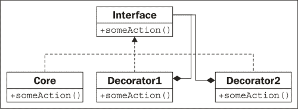
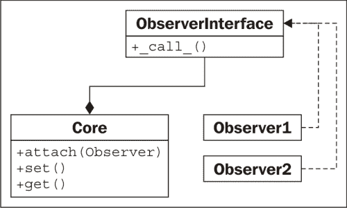
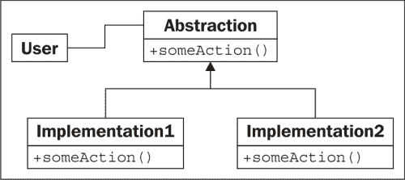
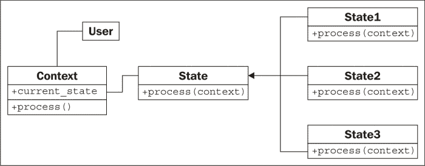
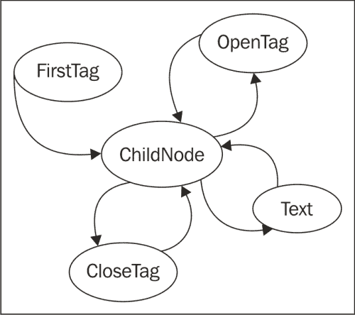
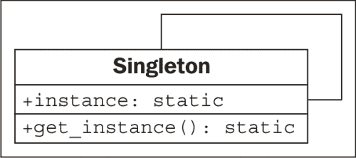
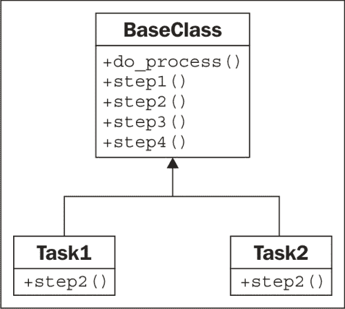

# 第十章：Python 设计模式 I

在上一章中，我们简要介绍了设计模式，并介绍了迭代器模式，这是一个非常有用和常见的模式，已经被抽象成编程语言核心的一部分。在本章中，我们将回顾其他常见的模式，以及它们在 Python 中的实现。与迭代一样，Python 通常提供替代语法，以使处理此类问题更简单。我们将介绍这些模式的“传统”设计和 Python 版本。总之，我们将看到：

+   许多特定的模式

+   Python 中每种模式的典型实现

+   Python 语法以替换某些模式

# 装饰器模式

装饰器模式允许我们用其他对象包装提供核心功能的对象，从而改变这个功能。使用装饰对象的任何对象将与未装饰的对象完全相同地交互（即，装饰对象的接口与核心对象的接口相同）。

装饰器模式有两个主要用途：

+   增强组件发送数据到第二个组件的响应

+   支持多个可选行为

第二个选项通常是多重继承的一个合适替代方案。我们可以构建一个核心对象，然后在该核心周围创建一个装饰器。由于装饰器对象具有与核心对象相同的接口，因此我们甚至可以将新对象包装在其他装饰器中。在 UML 中的样子如下：



在这里，**Core**和所有装饰器都实现了特定的**接口**。装饰器通过组合维护对**接口**的另一个实例的引用。在调用时，装饰器在调用其包装的接口之前或之后进行一些附加处理。包装对象可以是另一个装饰器，也可以是核心功能。虽然多个装饰器可以相互包装，但是所有这些装饰器中的对象提供了核心功能。

## 装饰器示例

让我们看一个网络编程的例子。我们将使用 TCP 套接字。`socket.send()`方法接受输入字节的字符串，并将其输出到另一端的接收套接字。有很多库接受套接字并访问此函数以在流上发送数据。让我们创建这样一个对象；它将是一个交互式 shell，等待客户端的连接，然后提示用户输入一个字符串响应：

```py
import socket

def respond(client):
    response = input("Enter a value: ")
    **client.send(bytes(response, 'utf8'))
    client.close()

server = socket.socket(socket.AF_INET, socket.SOCK_STREAM)
server.bind(('localhost',2401))
server.listen(1)
try:
    while True:
        client, addr = server.accept()
        respond(client)
finally:
    server.close()
```

`respond`函数接受一个套接字参数，并提示发送回复的数据，然后发送它。要使用它，我们构造一个服务器套接字，并告诉它在本地计算机上的端口`2401`上进行监听（我随机选择了端口）。当客户端连接时，它调用`respond`函数，该函数交互地请求数据并做出适当的响应。要注意的重要事情是，`respond`函数只关心套接字接口的两种方法：`send`和`close`。为了测试这一点，我们可以编写一个非常简单的客户端，连接到相同的端口并在退出之前输出响应：

```py
import socket

client = socket.socket(socket.AF_INET, socket.SOCK_STREAM)
client.connect(('localhost', 2401))
print("Received: {0}".format(client.recv(1024)))
client.close()
```

要使用这些程序：

1.  在一个终端中启动服务器。

1.  打开第二个终端窗口并运行客户端。

1.  在服务器窗口的**输入值：**提示中，输入一个值并按回车键。

1.  客户端将接收您输入的内容，将其打印到控制台并退出。再次运行客户端；服务器将提示输入第二个值。

现在，再次查看我们的服务器代码，我们看到两个部分。`respond`函数将数据发送到套接字对象中。剩下的脚本负责创建该套接字对象。我们将创建一对装饰器，定制套接字行为，而无需扩展或修改套接字本身。

让我们从一个“日志记录”装饰器开始。在将数据发送到客户端之前，该对象会将发送到服务器控制台的任何数据输出：

```py
class LogSocket:
    def __init__(self, socket):
        self.socket = socket

 **def send(self, data):
 **print("Sending {0} to {1}".format(
 **data, self.socket.getpeername()[0]))
 **self.socket.send(data)

 **def close(self):
 **self.socket.close()

```

这个类装饰了一个套接字对象，并向客户端套接字提供`send`和`close`接口。一个更好的装饰器还应该实现（并可能自定义）所有剩余的套接字方法。它还应该正确实现`send`的所有参数（实际上接受一个可选的标志参数），但让我们保持我们的例子简单！每当在这个对象上调用`send`时，它都会在将数据发送到客户端之前将输出记录到屏幕上，使用原始套接字。

我们只需要改变原始代码中的一行，就可以使用这个装饰器。我们不再用套接字调用`respond`，而是用一个装饰过的套接字调用它：

```py
respond(LogSocket(client))
```

虽然这很简单，但我们必须问自己为什么我们不直接扩展套接字类并覆盖`send`方法。我们可以调用`super().send`在记录后执行实际发送。这种设计也没有问题。

当面临装饰器和继承之间的选择时，只有在我们需要根据某些条件动态修改对象时，才应该使用装饰器。例如，我们可能只想在服务器当前处于调试模式时启用日志装饰器。当我们有多个可选行为时，装饰器也比多重继承更胜一筹。例如，我们可以编写第二个装饰器，每当调用`send`时，它都使用`gzip`压缩数据：

```py
import gzip
from io import BytesIO

class GzipSocket:
    def __init__(self, socket):
        self.socket = socket

    def send(self, data):
        buf = BytesIO()
        zipfile = gzip.GzipFile(fileobj=buf, mode="w")
        zipfile.write(data)
        zipfile.close()
 **self.socket.send(buf.getvalue())

    def close(self):
        self.socket.close()
```

这个版本中的`send`方法在发送到客户端之前压缩传入的数据。

现在我们有了这两个装饰器，我们可以编写代码，在响应时动态地在它们之间切换。这个例子并不完整，但它说明了我们可能遵循的混合装饰器的逻辑：

```py
        client, addr = server.accept()
        if log_send:
            client = LoggingSocket(client)
        if client.getpeername()[0] in compress_hosts:
            client = GzipSocket(client)
        respond(client)
```

这段代码检查了一个名为`log_send`的假设配置变量。如果启用了它，它会将套接字包装在`LoggingSocket`装饰器中。类似地，它检查连接的客户端是否在已知接受压缩内容的地址列表中。如果是，它会将客户端包装在`GzipSocket`装饰器中。请注意，这两个装饰器中的任何一个、两个或都可能被启用，取决于配置和连接的客户端。尝试使用多重继承来编写这个，并看看你会有多困惑！

## Python 中的装饰器

装饰器模式在 Python 中很有用，但也有其他选择。例如，我们可能能够使用我们在第七章中讨论过的猴子补丁来获得类似的效果。单继承，其中“可选”计算是在一个大方法中完成的，也是一个选择，多重继承不应该被写入，只是因为它对先前看到的特定示例不合适！

在 Python 中，对函数使用这种模式是非常常见的。正如我们在之前的章节中看到的，函数也是对象。事实上，函数装饰是如此常见，以至于 Python 提供了一种特殊的语法，使得很容易将这样的装饰器应用到函数上。

例如，我们可以更一般地看待日志示例。我们可能会发现，与其仅在套接字上发送调用，不如记录对某些函数或方法的所有调用会更有帮助。以下示例实现了一个刚好做到这一点的装饰器：

```py
import time

def log_calls(func):
 **def wrapper(*args, **kwargs):
        now = time.time()
        print("Calling {0} with {1} and {2}".format(
            func.__name__, args, kwargs))
 **return_value = func(*args, **kwargs)
        print("Executed {0} in {1}ms".format(
            func.__name__, time.time() - now))
        return return_value
 **return wrapper

def test1(a,b,c):
    print("\ttest1 called")

def test2(a,b):
    print("\ttest2 called")

def test3(a,b):
    print("\ttest3 called")
    time.sleep(1)

test1 = log_calls(test1)
test2 = log_calls(test2)
test3 = log_calls(test3)

test1(1,2,3)
test2(4,b=5)
test3(6,7)
```

这个装饰器函数与我们之前探讨的示例非常相似；在那些情况下，装饰器接受一个类似套接字的对象，并创建一个类似套接字的对象。这一次，我们的装饰器接受一个函数对象，并返回一个新的函数对象。这段代码由三个独立的任务组成：

+   一个名为`log_calls`的函数，接受另一个函数

+   这个函数定义了（内部）一个名为`wrapper`的新函数，在调用原始函数之前做一些额外的工作

+   这个新函数被返回

三个示例函数演示了装饰器的使用。第三个示例包括一个睡眠调用来演示定时测试。我们将每个函数传递给装饰器，装饰器返回一个新函数。我们将这个新函数赋给原始变量名，有效地用装饰后的函数替换了原始函数。

这种语法允许我们动态地构建装饰函数对象，就像我们在套接字示例中所做的那样；如果我们不替换名称，甚至可以为不同情况保留装饰和非装饰版本。

通常这些装饰器是应用于不同函数的永久性通用修改。在这种情况下，Python 支持一种特殊的语法，在函数定义时应用装饰器。当我们讨论`property`装饰器时，我们已经看到了这种语法；现在，让我们了解一下它是如何工作的。

我们可以使用`@decorator`语法一次完成所有操作，而不是在方法定义之后应用装饰器函数：

```py
@log_calls
def test1(a,b,c):
    print("\ttest1 called")
```

这种语法的主要好处是我们可以很容易地看到函数在定义时已经被装饰。如果装饰器是后来应用的，阅读代码的人可能会错过函数已经被修改的事实。回答类似“为什么我的程序将函数调用记录到控制台？”这样的问题可能会变得更加困难！然而，这种语法只能应用于我们定义的函数，因为我们无法访问其他模块的源代码。如果我们需要装饰第三方库中的函数，我们必须使用之前的语法。

装饰器语法比我们在这里看到的要复杂得多。我们没有空间在这里涵盖高级主题，所以请查看 Python 参考手册或其他教程获取更多信息。装饰器可以被创建为可调用对象，而不仅仅是返回函数的函数。类也可以被装饰；在这种情况下，装饰器返回一个新类，而不是一个新函数。最后，装饰器可以接受参数，以便根据每个函数的情况进行自定义。

# 观察者模式

观察者模式对于状态监控和事件处理情况非常有用。这种模式允许一个给定的对象被一个未知和动态的“观察者”对象组监视。

每当核心对象上的值发生变化时，它都会通过调用`update()`方法来通知所有观察者对象发生了变化。每个观察者在核心对象发生变化时可能负责不同的任务；核心对象不知道或不关心这些任务是什么，观察者通常也不知道或不关心其他观察者在做什么。

这里是 UML：



## 一个观察者示例

观察者模式可能在冗余备份系统中很有用。我们可以编写一个维护特定值的核心对象，然后让一个或多个观察者创建该对象的序列化副本。这些副本可以存储在数据库中，远程主机上，或者本地文件中。让我们使用属性来实现核心对象：

```py
class Inventory:
    def __init__(self):
        self.observers = []
        self._product = None
        self._quantity = 0

    def attach(self, observer):
        self.observers.append(observer)

    @property
    def product(self):
        return self._product
    @product.setter
    def product(self, value):
        self._product = value
        self._update_observers()

    @property
    def quantity(self):
        return self._quantity
    @quantity.setter
    def quantity(self, value):
        self._quantity = value
        self._update_observers()

    def _update_observers(self):
        for observer in self.observers:
            observer()
```

这个对象有两个属性，当设置时，会在自身上调用`_update_observers`方法。这个方法只是循环遍历可用的观察者，并让每个观察者知道发生了一些变化。在这种情况下，我们直接调用观察者对象；对象将必须实现`__call__`来处理更新。在许多面向对象的编程语言中，这是不可能的，但在 Python 中这是一个有用的快捷方式，可以帮助我们的代码更易读。

现在让我们实现一个简单的观察者对象；这个对象只会将一些状态打印到控制台上：

```py
class ConsoleObserver:
    def __init__(self, inventory):
        self.inventory = inventory

 **def __call__(self):
        print(self.inventory.product)
        print(self.inventory.quantity)
```

这里没有什么特别激动人心的；观察对象在初始化程序中设置，当观察者被调用时，我们会“做一些事情”。我们可以在交互式控制台中测试观察者：

```py
>>> i = Inventory()
>>> c = ConsoleObserver(i)
>>> i.attach(c)
>>> i.product = "Widget"
Widget
0
>>> i.quantity = 5
Widget
5

```

将观察者附加到库存对象后，每当我们更改两个观察属性中的一个时，观察者都会被调用并调用其动作。我们甚至可以添加两个不同的观察者实例：

```py
>>> i = Inventory()
>>> c1 = ConsoleObserver(i)
>>> c2 = ConsoleObserver(i)
>>> i.attach(c1)
>>> i.attach(c2)
>>> i.product = "Gadget"
Gadget
0
Gadget
0

```

这次当我们更改产品时，有两组输出，每个观察者一个。这里的关键思想是我们可以轻松地添加完全不同类型的观察者，同时备份数据到文件、数据库或 Internet 应用程序。

观察者模式将被观察的代码与观察的代码分离。如果我们不使用这种模式，我们将不得不在每个属性中放置代码来处理可能出现的不同情况；记录到控制台，更新数据库或文件等。所有这些任务的代码都将混在观察对象中。维护它将是一场噩梦，并且在以后的日期添加新的监视功能将是痛苦的。

# 策略模式

策略模式是面向对象编程中抽象的常见演示。该模式在不同对象中实现了单个问题的不同解决方案。客户端代码可以在运行时动态选择最合适的实现。

通常，不同的算法有不同的权衡；一个可能比另一个更快，但使用的内存更多，而第三个算法可能在多个 CPU 存在或提供分布式系统时最合适。这是 UML 中的策略模式：



连接到策略模式的**用户**代码只需要知道它正在处理**抽象**接口。所选择的实际实现以不同的方式执行相同的任务；无论如何，接口都是相同的。

## 策略示例

策略模式的典型示例是排序例程；多年来，已经发明了许多用于对对象集合进行排序的算法；快速排序、合并排序和堆排序都是具有不同特性的快速排序算法，每种算法在不同情况下都有用，具体取决于输入的大小和类型，它们的顺序有多乱，以及系统的要求。

如果我们有需要对集合进行排序的客户端代码，我们可以将其传递给具有`sort()`方法的对象。该对象可以是`QuickSorter`或`MergeSorter`对象，但无论哪种情况，结果都将是相同的：排序后的列表。用于排序的策略从调用代码中抽象出来，使其模块化和可替换。

当然，在 Python 中，我们通常只调用`sorted`函数或`list.sort`方法，并相信它会以接近最佳的方式进行排序。因此，我们确实需要看一个更好的例子。

让我们考虑一个桌面壁纸管理器。当图像显示在桌面背景上时，可以以不同的方式调整到屏幕大小。例如，假设图像小于屏幕，则可以在屏幕上平铺，居中显示，或者缩放以适应。还有其他更复杂的策略可以使用，例如缩放到最大高度或宽度，与纯色、半透明或渐变背景颜色结合，或其他操作。虽然我们可能希望稍后添加这些策略，但让我们从基本策略开始。

我们的策略对象需要两个输入；要显示的图像和屏幕宽度和高度的元组。它们各自返回一个新的图像，大小与屏幕相同，并根据给定的策略进行调整。您需要使用`pip3 install pillow`安装`pillow`模块，以使此示例工作。

```py
from PIL import Image

class TiledStrategy:
    def make_background(self, img_file, desktop_size):
        in_img = Image.open(img_file)
        out_img = Image.new('RGB', desktop_size)
        num_tiles = [
            o // i + 1 for o, i in
            zip(out_img.size, in_img.size)
        ]
        for x in range(num_tiles[0]):
            for y in range(num_tiles[1]):
                out_img.paste(
                    in_img,
                    (
                        in_img.size[0] * x,
                        in_img.size[1] * y,
                        in_img.size[0] * (x+1),
                        in_img.size[1] * (y+1)
                    )
                )
        return out_img

class CenteredStrategy:
    def make_background(self, img_file, desktop_size):
        in_img = Image.open(img_file)
        out_img = Image.new('RGB', desktop_size)
        left = (out_img.size[0] - in_img.size[0]) // 2
        top = (out_img.size[1] - in_img.size[1]) // 2
        out_img.paste(
            in_img,
            (
                left,
                top,
                left+in_img.size[0],
                top + in_img.size[1]
            )
        )
        return out_img

class ScaledStrategy:
    def make_background(self, img_file, desktop_size):
        in_img = Image.open(img_file)
        out_img = in_img.resize(desktop_size)
        return out_img
```

这里我们有三种策略，每种策略都使用`PIL`来执行它们的任务。各个策略都有一个`make_background`方法，接受相同的参数集。一旦选择了适当的策略，就可以调用它来创建一个正确大小的桌面图像版本。`TiledStrategy`循环遍历可以适应图像宽度和高度的输入图像数量，并将其重复复制到每个位置。`CenteredStrategy`计算出需要在图像的四个边缘留下多少空间来使其居中。`ScaledStrategy`强制图像到输出大小（忽略纵横比）。

考虑如果没有策略模式，如何在这些选项之间进行切换。我们需要把所有的代码放在一个很大的方法中，并使用一个笨拙的`if`语句来选择预期的选项。每次我们想要添加一个新的策略，我们都需要使方法变得更加笨拙。

## Python 中的策略

策略模式的前面的经典实现，在大多数面向对象的库中非常常见，但在 Python 编程中很少见。

这些类分别代表什么都不做，只提供一个函数的对象。我们可以轻松地称这个函数为`__call__`，并直接使对象可调用。由于没有与对象关联的其他数据，我们只需要创建一组顶级函数，并将它们作为我们的策略传递。

因此，设计模式哲学的反对者会说，“因为 Python 有一流函数，策略模式是不必要的”。事实上，Python 的一流函数允许我们以更直接的方式实现策略模式。知道模式存在仍然可以帮助我们选择程序的正确设计，但使用更可读的语法来实现它。策略模式，或者它的顶级函数实现，应该在我们需要允许客户端代码或最终用户从同一接口的多个实现中进行选择时使用。

# 状态模式

状态模式在结构上类似于策略模式，但其意图和目的是非常不同的。状态模式的目标是表示状态转换系统：在这些系统中，一个对象可以处于特定状态，某些活动可能会驱使它转移到不同的状态。

为了使这个工作起来，我们需要一个管理者，或者提供切换状态接口的上下文类。在内部，这个类包含一个指向当前状态的指针；每个状态都知道它被允许处于哪些其他状态，并且会根据在其上调用的动作来过渡到这些状态。

因此，我们有两种类型的类，上下文类和多个状态类。上下文类维护当前状态，并将动作转发给状态类。状态类通常对于调用上下文的任何其他对象都是隐藏的；它就像一个黑匣子，偶然会在内部执行状态管理。在 UML 中它是这样的。



## 状态示例

为了说明状态模式，让我们构建一个 XML 解析工具。上下文类将是解析器本身。它将以字符串作为输入，并将工具放在初始解析状态中。各种解析状态将吃掉字符，寻找特定的值，当找到该值时，转换到不同的状态。目标是为每个标签及其内容创建一个节点对象树。为了保持事情可管理，我们只解析 XML 的一个子集 - 标签和标签名称。我们将无法处理标签上的属性。它将解析标签的文本内容，但不会尝试解析“混合”内容，其中包含文本内的标签。这是一个我们将能够解析的“简化 XML”文件的例子：

```py
<book>
    <author>Dusty Phillips</author>
    <publisher>Packt Publishing</publisher>
    <title>Python 3 Object Oriented Programming</title>
    <content>
        <chapter>
            <number>1</number>
            <title>Object Oriented Design</title>
        </chapter>
        <chapter>
            <number>2</number>
            <title>Objects In Python</title>
        </chapter>
    </content>
</book>
```

在查看状态和解析器之前，让我们考虑一下这个程序的输出。我们知道我们想要一个`Node`对象的树，但`Node`是什么样子呢？显然，它需要知道它正在解析的标签的名称，并且由于它是一棵树，它可能需要维护指向父节点的指针和按顺序排列的节点子节点列表。有些节点有文本值，但不是所有节点都有。让我们先看看这个`Node`类：

```py
class Node:
    def __init__(self, tag_name, parent=None):
        self.parent = parent
        self.tag_name = tag_name
        self.children = []
        self.text=""

    def __str__(self):
        if self.text:
            return self.tag_name + ": " + self.text
        else:
            return self.tag_name
```

这个类在初始化时设置默认属性值。提供`__str__`方法来帮助可视化树结构完成时的情况。

现在，看看示例文档，我们需要考虑解析器可能处于哪些状态。显然，它将从尚未处理任何节点的状态开始。我们需要一个状态来处理开放标签和关闭标签。当我们在具有文本内容的标签内部时，我们还需要将其处理为单独的状态。

状态切换可能会很棘手；我们如何知道下一个节点是开放标签、关闭标签还是文本节点？我们可以在每个状态中放入一些逻辑来解决这个问题，但实际上创建一个新状态来唯一目的是确定下一个要切换到的状态更有意义。如果我们将这个过渡状态称为**ChildNode**，我们最终得到以下状态：

+   **FirstTag**

+   **ChildNode**

+   **OpenTag**

+   **CloseTag**

+   **Text**

**FirstTag**状态将切换到**ChildNode**，负责决定切换到其他三个状态中的哪一个；当这些状态完成时，它们将切换回**ChildNode**。以下状态转换图显示了可用的状态更改：



状态负责获取“字符串的剩余部分”，处理它们所知道的部分，然后告诉解析器处理剩下的部分。现在，首先构造`Parser`类：

```py
class Parser:
    def __init__(self, parse_string):
        self.parse_string = parse_string
        self.root = None
        self.current_node = None

        self.state = FirstTag()

    def process(self, remaining_string):
        remaining = self.state.process(remaining_string, self)
        if remaining:
            self.process(remaining)

    def start(self):
        self.process(self.parse_string)
```

初始化程序在类上设置了一些变量，个别状态将访问这些变量。`parse_string`实例变量是我们试图解析的文本。`root`节点是 XML 结构中的“顶部”节点。`current_node`实例变量是我们当前正在向其添加子节点的变量。

这个解析器的重要特性是`process`方法，它接受剩余的字符串，并将其传递给当前状态。解析器（`self`参数）也被传递到状态的`process`方法中，以便状态可以操作它。状态预计在完成处理时返回未解析字符串的剩余部分。然后解析器递归调用这个剩余字符串上的`process`方法来构造树的其余部分。

现在，让我们来看看`FirstTag`状态：

```py
class FirstTag:
    def process(self, remaining_string, parser):
        i_start_tag = remaining_string.find('<')
        i_end_tag = remaining_string.find('>')
        tag_name = remaining_string[i_start_tag+1:i_end_tag]
        root = Node(tag_name)
        parser.root = parser.current_node = root
 **parser.state = ChildNode()
        **return remaining_string[i_end_tag+1:]

```

这个状态找到第一个标签的开放和关闭尖括号的索引（`i_`代表索引）。您可能认为这个状态是不必要的，因为 XML 要求在开放标签之前没有文本。但是，可能需要消耗空白字符；这就是为什么我们搜索开放尖括号而不是假设它是文档中的第一个字符。请注意，此代码假定输入文件有效。正确的实现将严格测试无效输入，并尝试恢复或显示极具描述性的错误消息。

该方法提取标签的名称并将其分配给解析器的根节点。它还将其分配给`current_node`，因为接下来我们将向其添加子节点。

然后是重要的部分：该方法将解析器对象上的当前状态更改为`ChildNode`状态。然后返回字符串的剩余部分（在开放标签之后）以便进行处理。

`ChildNode`状态，看起来相当复杂，结果却只需要一个简单的条件：

```py
class ChildNode:
    def process(self, remaining_string, parser):
        stripped = remaining_string.strip()
        if stripped.startswith("</"):
            parser.state = CloseTag()
        elif stripped.startswith("<"):
            parser.state = OpenTag()
        else:
            parser.state = TextNode()
        return stripped
```

“strip（）”调用从字符串中删除空格。然后解析器确定下一个项是开放标签、关闭标签还是文本字符串。根据发生的可能性，它将解析器设置为特定状态，然后告诉它解析字符串的其余部分。

`OpenTag`状态类似于`FirstTag`状态，只是它将新创建的节点添加到先前的`current_node`对象的`children`中，并将其设置为新的`current_node`。然后在继续之前将处理器放回`ChildNode`状态：

```py
class OpenTag:
    def process(self, remaining_string, parser):
        i_start_tag = remaining_string.find('<')
        i_end_tag = remaining_string.find('>')
        tag_name = remaining_string[i_start_tag+1:i_end_tag]
        node = Node(tag_name, parser.current_node)
        parser.current_node.children.append(node)
        parser.current_node = node
        parser.state = ChildNode()
        return remaining_string[i_end_tag+1:]
```

`CloseTag`状态基本上做相反的事情；它将解析器的`current_node`设置回父节点，以便可以将外部标签中的任何进一步的子节点添加到其中：

```py
class CloseTag:
    def process(self, remaining_string, parser):
        i_start_tag = remaining_string.find('<')
        i_end_tag = remaining_string.find('>')
        assert remaining_string[i_start_tag+1] == "/"
        tag_name = remaining_string[i_start_tag+2:i_end_tag]
        assert tag_name == parser.current_node.tag_name
        parser.current_node = parser.current_node.parent
        parser.state = ChildNode()
        return remaining_string[i_end_tag+1:].strip()
```

两个`assert`语句有助于确保解析字符串一致。方法末尾的`if`语句确保处理器在完成时终止。如果节点的父节点是`None`，则意味着我们正在处理根节点。

最后，`TextNode`状态非常简单地提取下一个关闭标签之前的文本，并将其设置为当前节点的值：

```py
class TextNode:
    def process(self, remaining_string, parser):
        i_start_tag = remaining_string.find('<')
        text = remaining_string[:i_start_tag]
        parser.current_node.text = text
        parser.state = ChildNode()
        return remaining_string[i_start_tag:]
```

现在我们只需在我们创建的解析器对象上设置初始状态。初始状态是一个`FirstTag`对象，所以只需将以下内容添加到`__init__`方法中：

```py
        self.state = FirstTag()
```

为了测试这个类，让我们添加一个主脚本，从命令行打开一个文件，解析它，并打印节点：

```py
if __name__ == "__main__":
    import sys
    with open(sys.argv[1]) as file:
        contents = file.read()
        p = Parser(contents)
        p.start()

        nodes = [p.root]
        while nodes:
            node = nodes.pop(0)
            print(node)
            nodes = node.children + nodes
```

这段代码打开文件，加载内容，并解析结果。然后按顺序打印每个节点及其子节点。我们最初在节点类上添加的`__str__`方法负责格式化节点以进行打印。如果我们在之前的示例上运行脚本，它将输出树如下：

```py
book
author: Dusty Phillips
publisher: Packt Publishing
title: Python 3 Object Oriented Programming
content
chapter
number: 1
title: Object Oriented Design
chapter
number: 2
title: Objects In Python

```

将此与原始简化的 XML 文档进行比较告诉我们解析器正在工作。

## 状态与策略

状态模式看起来与策略模式非常相似；实际上，两者的 UML 图是相同的。实现也是相同的；我们甚至可以将我们的状态编写为一等函数，而不是将它们包装在对象中，就像策略建议的那样。

虽然这两种模式具有相同的结构，但它们解决的问题完全不同。策略模式用于在运行时选择算法；通常，针对特定用例只会选择其中一个算法。另一方面，状态模式旨在允许在某些过程发展时动态地在不同状态之间切换。在代码中，主要区别在于策略模式通常不知道其他策略对象。在状态模式中，状态或上下文需要知道它可以切换到哪些其他状态。

## 状态转换作为协程

状态模式是面向对象的标准解决方案，用于状态转换问题。但是，这种模式的语法相当冗长。通过构造对象为协程，您可以获得类似的效果。还记得我们在第九章中构建的正则表达式日志文件解析器吗？那是一个伪装的状态转换问题。该实现与定义状态模式中使用的所有对象（或函数）的实现之间的主要区别在于，协程解决方案允许我们将更多的样板代码编码为语言结构。有两种实现，但没有一种本质上比另一种更好，但您可能会发现协程更易读，根据“易读”的定义（首先您必须了解协程的语法！）。

# 单例模式

单例模式是最具争议的模式之一；许多人指责它是一种“反模式”，一种应该避免而不是推广的模式。在 Python 中，如果有人使用单例模式，几乎可以肯定他们做错了什么，可能是因为他们来自更严格的编程语言。

那么为什么要讨论它呢？单例是所有设计模式中最著名的之一。它在过度面向对象的语言中很有用，并且是传统面向对象编程的重要部分。更相关的是，单例背后的思想是有用的，即使我们在 Python 中以完全不同的方式实现了这个思想。

单例模式背后的基本思想是允许某个对象的确切一个实例存在。通常，这个对象是一种类似于我们在第五章中讨论的管理类，*何时使用面向对象编程*。这些对象通常需要被各种其他对象引用，并且将对管理对象的引用传递给需要它们的方法和构造函数可能会使代码难以阅读。

相反，当使用单例时，单独的对象从类中请求管理对象的单个实例，因此无需传递对它的引用。UML 图表并未完全描述它，但为了完整起见，这里是：



在大多数编程环境中，通过使构造函数私有（以便没有人可以创建它的其他实例），然后提供一个静态方法来检索单个实例来强制实施单例。该方法在第一次调用时创建一个新实例，然后在每次再次调用时返回相同的实例。

## 单例实现

Python 没有私有构造函数，但为此，它有更好的东西。我们可以使用`__new__`类方法来确保只创建一个实例：

```py
class OneOnly:
    _singleton = None
    def __new__(cls, *args, **kwargs):
        if not cls._singleton:
            cls._singleton = super(OneOnly, cls
                ).__new__(cls, *args, **kwargs)
        return cls._singleton
```

当调用`__new__`时，通常会构造该类的新实例。当我们重写它时，我们首先检查我们的单例实例是否已创建；如果没有，我们使用`super`调用来创建它。因此，无论何时我们在`OneOnly`上调用构造函数，我们总是得到完全相同的实例：

```py
>>> o1 = OneOnly()
>>> o2 = OneOnly()
>>> o1 == o2
True
>>> o1
<__main__.OneOnly object at 0xb71c008c>
>>> o2
<__main__.OneOnly object at 0xb71c008c>

```

这两个对象是相等的，并且位于相同的地址；因此，它们是同一个对象。这种特定的实现并不是非常透明，因为不明显地创建了一个单例对象。每当我们调用构造函数时，我们期望得到该对象的一个新实例；在这种情况下，这个约定被违反了。也许，如果我们真的认为需要一个单例，类上的良好文档字符串可以缓解这个问题。

但我们并不需要它。Python 程序员不喜欢强迫他们的代码使用者进入特定的思维方式。我们可能认为一个类只需要一个实例，但其他程序员可能有不同的想法。单例可能会干扰分布式计算、并行编程和自动化测试，例如。在所有这些情况下，拥有特定对象的多个或替代实例可能非常有用，即使“正常”操作可能永远不需要一个。

模块变量可以模拟单例

通常，在 Python 中，可以使用模块级变量来充分模拟单例模式。它不像单例那样“安全”，因为人们随时可以重新分配这些变量，但与我们在第二章中讨论的私有变量一样，在 Python 中是可以接受的。如果有人有正当理由更改这些变量，我们为什么要阻止他们呢？它也不会阻止人们实例化对象的多个实例，但同样，如果他们有正当理由这样做，为什么要干涉呢？

理想情况下，我们应该为它们提供一种机制来访问“默认单例”值，同时也允许它们在需要时创建其他实例。虽然从技术上讲根本不是单例，但它提供了最符合 Python 风格的单例行为机制。

使用模块级变量而不是单例，我们在定义类之后实例化类的实例。我们可以改进我们的状态模式以使用单例。我们可以创建一个模块级变量，而不是在每次改变状态时创建一个新对象，这样始终可以访问该变量：

```py
class FirstTag:
    def process(self, remaining_string, parser):
        i_start_tag = remaining_string.find('<')
        i_end_tag = remaining_string.find('>')
        tag_name = remaining_string[i_start_tag+1:i_end_tag]
        root = Node(tag_name)
        parser.root = parser.current_node = root
 **parser.state = child_node
        return remaining_string[i_end_tag+1:]

class ChildNode:
    def process(self, remaining_string, parser):
        stripped = remaining_string.strip()
        if stripped.startswith("</"):
 **parser.state = close_tag
        elif stripped.startswith("<"):
 **parser.state = open_tag
        else:
 **parser.state = text_node
        return stripped

class OpenTag:
    def process(self, remaining_string, parser):
        i_start_tag = remaining_string.find('<')
        i_end_tag = remaining_string.find('>')
        tag_name = remaining_string[i_start_tag+1:i_end_tag]
        node = Node(tag_name, parser.current_node)
        parser.current_node.children.append(node)
        parser.current_node = node
 **parser.state = child_node
        return remaining_string[i_end_tag+1:]
class TextNode:
    def process(self, remaining_string, parser):
        i_start_tag = remaining_string.find('<')
        text = remaining_string[:i_start_tag]
        parser.current_node.text = text
 **parser.state = child_node
        return remaining_string[i_start_tag:]

class CloseTag:
    def process(self, remaining_string, parser):
        i_start_tag = remaining_string.find('<')
        i_end_tag = remaining_string.find('>')
        assert remaining_string[i_start_tag+1] == "/"
        tag_name = remaining_string[i_start_tag+2:i_end_tag]
        assert tag_name == parser.current_node.tag_name
        parser.current_node = parser.current_node.parent
 **parser.state = child_node
        return remaining_string[i_end_tag+1:].strip()

first_tag = FirstTag()
child_node = ChildNode()
text_node = TextNode()
open_tag = OpenTag()
close_tag = CloseTag()

```

我们所做的只是创建可以重复使用的各种状态类的实例。请注意，即使在定义变量之前，我们也可以在类内部访问这些模块变量？这是因为类内部的代码直到调用方法时才会执行，到这个时候整个模块都将被定义。

这个例子的不同之处在于，我们不是浪费内存创建必须进行垃圾回收的大量新实例，而是为每个状态重用单个状态对象。即使同时运行多个解析器，也只需要使用这些状态类。

当我们最初创建基于状态的解析器时，您可能会想知道为什么我们没有将解析器对象传递给每个单独的状态的`__init__`，而是像我们所做的那样将其传递给 process 方法。然后状态可以被引用为`self.parser`。这是状态模式的一个完全有效的实现，但它不允许利用单例模式。如果状态对象保持对解析器的引用，那么它们就不能同时用于引用其他解析器。

### 提示

请记住，这是两种不同目的的模式；单例模式的目的可能有助于实现状态模式，但这并不意味着这两种模式有关联。

# 模板模式

模板模式对于消除重复代码很有用；它是支持我们在第五章中讨论的**不要重复自己**原则的实现，*何时使用面向对象编程*。它设计用于在需要完成一些具有部分但不完全相同步骤的几个不同任务的情况下。通用步骤在基类中实现，不同的步骤在子类中被覆盖以提供自定义行为。在某种程度上，它类似于广义策略模式，只是使用基类共享算法的相似部分。以下是它的 UML 格式：



## 模板示例

让我们以创建一个汽车销售报告为例。我们可以在 SQLite 数据库表中存储销售记录。SQLite 是一个简单的基于文件的数据库引擎，允许我们使用 SQL 语法存储记录。Python 3 在其标准库中包含了 SQLite，因此不需要额外的模块。

我们有两个需要执行的常见任务：

+   选择所有新车销售并以逗号分隔的格式将其输出到屏幕上

+   输出所有销售人员及其总销售额的逗号分隔列表，并将其保存到可以导入电子表格的文件中

这些似乎是非常不同的任务，但它们有一些共同的特点。在这两种情况下，我们都需要执行以下步骤：

1.  连接到数据库。

1.  构建一个查询以获取新车辆或总销售额。

1.  发出查询。

1.  将结果格式化为逗号分隔的字符串。

1.  将数据输出到文件或电子邮件。

这两个任务的查询构建和输出步骤不同，但其余步骤相同。我们可以使用模板模式将通用步骤放入基类中，将不同的步骤放入两个子类中。

在开始之前，让我们创建一个数据库并使用几行 SQL 将一些示例数据放入其中：

```py
import sqlite3

conn = sqlite3.connect("sales.db")

conn.execute("CREATE TABLE Sales (salesperson text, "
        "amt currency, year integer, model text, new boolean)")
conn.execute("INSERT INTO Sales values"
        " ('Tim', 16000, 2010, 'Honda Fit', 'true')")
conn.execute("INSERT INTO Sales values"
        " ('Tim', 9000, 2006, 'Ford Focus', 'false')")
conn.execute("INSERT INTO Sales values"
        " ('Gayle', 8000, 2004, 'Dodge Neon', 'false')")
conn.execute("INSERT INTO Sales values"
        " ('Gayle', 28000, 2009, 'Ford Mustang', 'true')")
conn.execute("INSERT INTO Sales values"
        " ('Gayle', 50000, 2010, 'Lincoln Navigator', 'true')")
conn.execute("INSERT INTO Sales values"
        " ('Don', 20000, 2008, 'Toyota Prius', 'false')")
conn.commit()
conn.close()
```

希望即使您不懂 SQL，也能看出这里发生了什么；我们创建了一个表来保存数据，并使用六个插入语句添加了销售记录。数据存储在名为`sales.db`的文件中。现在我们有一个示例可以用来开发我们的模板模式。

由于我们已经概述了模板必须执行的步骤，我们可以从定义包含这些步骤的基类开始。每个步骤都有自己的方法（以便轻松地选择性地覆盖任何一个步骤），并且我们还有一个管理方法，依次调用这些步骤。没有任何方法内容，它可能看起来像这样：

```py
class QueryTemplate:
    def connect(self):
        pass
    def construct_query(self):
        pass
    def do_query(self):
        pass
    def format_results(self):
        pass
    def output_results(self):
        pass

 **def process_format(self):
        self.connect()
        self.construct_query()
        self.do_query()
        self.format_results()
        self.output_results()
```

`process_format`方法是外部客户端要调用的主要方法。它确保每个步骤按顺序执行，但它不在乎该步骤是在这个类中实现还是在子类中实现。对于我们的例子，我们知道两个类之间的三个方法将是相同的：

```py
import sqlite3

class QueryTemplate:
    def connect(self):
 **self.conn = sqlite3.connect("sales.db")

    def construct_query(self):
 **raise NotImplementedError()

    def do_query(self):
 **results = self.conn.execute(self.query)
 **self.results = results.fetchall()

    def format_results(self):
 **output = []
 **for row in self.results:
 **row =[str(i) for i in row]
 **output.append(", ".join(row))
 **self.formatted_results = "\n".join(output)

    def output_results(self):
 **raise NotImplementedError()

```

为了帮助实现子类，两个未指定的方法会引发`NotImplementedError`。这是在 Python 中指定抽象接口的常见方式，当抽象基类看起来太笨重时。这些方法可以有空实现（使用`pass`），或者可以完全未指定。然而，引发`NotImplementedError`有助于程序员理解该类是要被子类化并且这些方法被重写；空方法或不存在的方法更难以识别需要被实现并且如果我们忘记实现它们时调试。

现在我们有一个模板类，它处理了乏味的细节，但足够灵活，可以执行和格式化各种查询。最好的部分是，如果我们想要将数据库引擎从 SQLite 更改为另一个数据库引擎（例如 py-postgresql），我们只需要在这里，在这个模板类中做，而不必触及我们可能编写的两个（或两百个）子类。

现在让我们来看看具体的类：

```py
import datetime
class NewVehiclesQuery(QueryTemplate):
 **def construct_query(self):
        self.query = "select * from Sales where new='true'"

 **def output_results(self):
        print(self.formatted_results)

class UserGrossQuery(QueryTemplate):
 **def construct_query(self):
        self.query = ("select salesperson, sum(amt) " +
        " from Sales group by salesperson")

 **def output_results(self):
        filename = "gross_sales_{0}".format(
                datetime.date.today().strftime("%Y%m%d")
                )
        with open(filename, 'w') as outfile:
            outfile.write(self.formatted_results)
```

这两个类实际上相当简短，考虑到它们的功能：连接到数据库，执行查询，格式化结果并输出它们。超类处理了重复的工作，但让我们轻松地指定那些在任务之间变化的步骤。此外，我们还可以轻松地更改在基类中提供的步骤。例如，如果我们想要输出除逗号分隔字符串之外的其他内容（例如：要上传到网站的 HTML 报告），我们仍然可以重写`format_results`。

# 练习

在撰写本章时，我发现很难，但也非常有教育意义，找到应该使用特定设计模式的好例子。与其像我在之前的章节中建议的那样检查当前或旧项目以查看可以应用这些模式的地方，不如考虑这些模式和可能出现的不同情况。尝试超越自己的经验。如果你当前的项目是银行业务，考虑在零售或销售点应用这些设计模式。如果你通常编写 Web 应用程序，考虑在编写编译器时使用设计模式。

看看装饰器模式，并想出一些适用它的好例子。专注于模式本身，而不是我们讨论的 Python 语法；它比实际模式更一般。然而，装饰器的特殊语法是你可能想要寻找现有项目中适用的地方。

使用观察者模式的一些好领域是什么？为什么？不仅考虑如何应用模式，还要考虑如何在不使用观察者的情况下实现相同的任务？选择使用它会得到什么，或失去什么？

考虑策略模式和状态模式之间的区别。在实现上，它们看起来非常相似，但它们有不同的目的。你能想到模式可以互换的情况吗？重新设计一个基于状态的系统以使用策略，或者反之亦然，是否合理？设计实际上会有多大的不同？

模板模式是继承的明显应用，可以减少重复的代码，你可能以前就使用过它，只是不知道它的名字。试着想出至少半打不同的场景，它在这些场景中会有用。如果你能做到这一点，你将会在日常编码中经常找到它的用武之地。

# 摘要

本章详细讨论了几种常见的设计模式，包括示例、UML 图和 Python 与静态类型面向对象语言之间的差异讨论。装饰器模式通常使用 Python 更通用的装饰器语法来实现。观察者模式是一种有用的方式，可以将事件与对这些事件采取的行动分离开来。策略模式允许选择不同的算法来完成相同的任务。状态模式看起来类似，但实际上是用来表示系统可以使用明确定义的操作在不同状态之间移动。单例模式在一些静态类型语言中很受欢迎，但在 Python 中几乎总是反模式。

在下一章中，我们将结束对设计模式的讨论。
