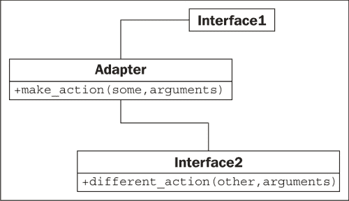
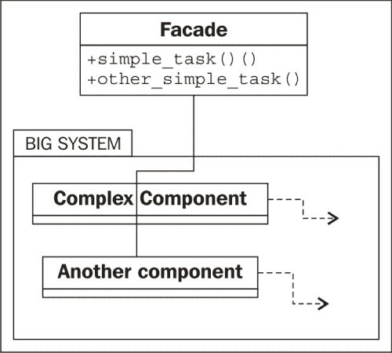
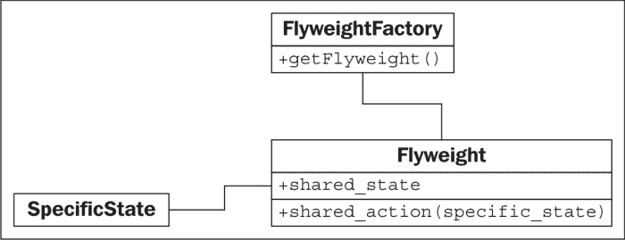
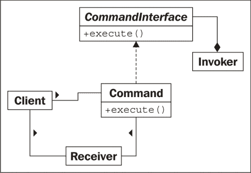
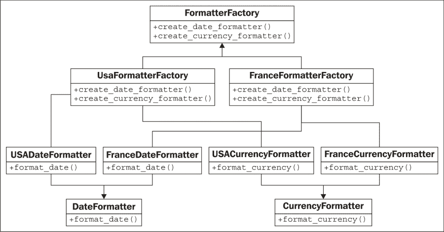
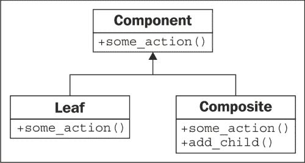
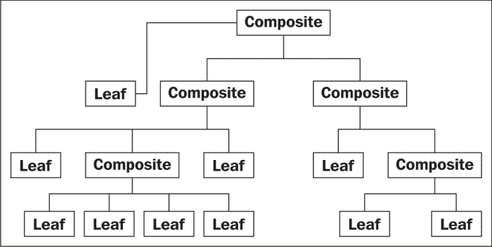

# 第十一章：Python 设计模式 II

在本章中，我们将介绍几种设计模式。我们将再次介绍经典的示例以及 Python 中的任何常见替代实现。我们将讨论：

+   适配器模式

+   外观模式

+   延迟初始化和享元模式

+   命令模式

+   抽象工厂模式

+   组合模式

# 适配器模式

与我们在第八章中审查的大多数模式不同，*字符串和序列化*，适配器模式旨在与现有代码交互。我们不会设计一个全新的实现适配器模式的对象集。适配器用于允许两个现有对象一起工作，即使它们的接口不兼容。就像显示适配器允许 VGA 投影仪插入 HDMI 端口一样，适配器对象位于两个不同接口之间，实时进行翻译。适配器对象的唯一目的是执行这项翻译工作。适应可能涉及各种任务，例如将参数转换为不同的格式，重新排列参数的顺序，调用不同命名的方法或提供默认参数。

在结构上，适配器模式类似于简化的装饰器模式。装饰器通常提供与它们替代的相同接口，而适配器在两个不同的接口之间进行映射。这是它的 UML 形式：



在这里，**Interface1**期望调用名为**make_action(some, arguments)**的方法。我们已经有了完美的**Interface2**类，它做了我们想要的一切（为了避免重复，我们不想重写它！），但它提供了一个名为**different_action(other, arguments)**的方法。**Adapter**类实现了**make_action**接口，并将参数映射到现有接口。

这里的优势在于，从一个接口到另一个接口的映射代码都在一个地方。另一种方法将非常丑陋；每当我们需要访问这段代码时，我们都必须在多个地方执行翻译。

例如，想象一下我们有以下现有类，它接受格式为“YYYY-MM-DD”的字符串日期并计算当天的人的年龄：

```py
class AgeCalculator:
    def __init__(self, birthday):
        self.year, self.month, self.day = (
                int(x) for x in birthday.split('-'))

    def calculate_age(self, date):
        year, month, day = (
                int(x) for x in date.split('-'))
        age = year - self.year
        if (month,day) < (self.month,self.day):
            age -= 1
        return age
```

这是一个非常简单的类，它做了它应该做的事情。但是我们不得不想一下程序员在想什么，使用一个特定格式的字符串，而不是使用 Python 非常有用的内置`datetime`库。作为一名负责任的程序员，我们尽可能地重用代码，我们编写的大多数程序将与`datetime`对象交互，而不是字符串。

我们有几种选择来解决这种情况；我们可以重写类以接受`datetime`对象，这可能更准确。但是，如果这个类是由第三方提供的，我们不知道或无法更改其内部结构，我们需要尝试其他方法。我们可以使用现有的类，每当我们想要计算`datetime.date`对象上的年龄时，我们可以调用`datetime.date.strftime('%Y-%m-%d')`将其转换为正确的格式。但是这种转换会发生在很多地方，更糟糕的是，如果我们将`%m`误写为`%M`，它将给出当前分钟而不是输入的月份！想象一下，如果你在十几个不同的地方写了这个，只有在意识到错误时才能回去更改它。这不是可维护的代码，它违反了 DRY 原则。

相反，我们可以编写一个适配器，允许将普通日期插入普通的`AgeCalculator`类中：

```py
import datetime
class DateAgeAdapter:
    def _str_date(self, date):
        return date.strftime("%Y-%m-%d")

    def __init__(self, birthday):
        birthday = self._str_date(birthday)
 **self.calculator = AgeCalculator(birthday)

    def get_age(self, date):
        date = self._str_date(date)
 **return self.calculator.calculate_age(date)

```

这个适配器将`datetime.date`和`datetime.time`（它们对`strftime`有相同的接口）转换为我们原始的`AgeCalculator`可以使用的字符串。现在我们可以使用原始代码来使用我们的新接口。我将方法签名更改为`get_age`，以演示调用接口可能也在寻找不同的方法名，而不仅仅是不同类型的参数。

创建一个类作为适配器是实现这种模式的常见方式，但通常情况下，在 Python 中还有其他方法可以实现。继承和多重继承可以用于向类添加功能。例如，我们可以在`date`类上添加一个适配器，以便它与原始的`AgeCalculator`类一起使用：

```py
import datetime
class AgeableDate(datetime.date):
    def split(self, char):
        return self.year, self.month, self.day
```

正是这样的代码让人怀疑 Python 是否应该合法。我们已经为我们的子类添加了一个`split`方法，它接受一个参数（我们忽略）并返回一个年、月和日的元组。这与原始的`AgeCalculator`类完美配合，因为代码在特殊格式的字符串上调用`strip`，而在这种情况下，`strip`返回一个年、月和日的元组。`AgeCalculator`代码只关心`strip`是否存在并返回可接受的值；它并不关心我们是否真的传入了一个字符串。它真的能工作：

```py
>>> bd = AgeableDate(1975, 6, 14)
>>> today = AgeableDate.today()
>>> today
AgeableDate(2015, 8, 4)
>>> a = AgeCalculator(bd)
>>> a.calculate_age(today)
40

```

它能工作，但这是一个愚蠢的想法。在这种特定情况下，这样的适配器很难维护。我们很快会忘记为什么需要向`date`类添加`strip`方法。方法名是模棱两可的。这可能是适配器的性质，但显式创建适配器而不是使用继承通常可以澄清其目的。

有时候，我们可以使用猴子补丁来给现有的类添加方法，而不是继承。它不适用于`datetime`对象，因为它不允许在运行时添加属性，但在普通类中，我们可以添加一个新方法，以提供调用代码所需的适应接口。或者，我们可以扩展或猴子补丁`AgeCalculator`本身，以用更适合我们需求的方法替换`calculate_age`方法。

最后，通常可以将函数用作适配器；这显然不符合适配器模式的实际设计，但如果我们记得函数本质上是带有`__call__`方法的对象，它就成为一个明显的适配器适应。

# 外观模式

外观模式旨在为复杂的组件系统提供一个简单的接口。对于复杂的任务，我们可能需要直接与这些对象交互，但通常系统有一个“典型”的用法，这些复杂的交互并不是必要的。外观模式允许我们定义一个新对象，封装了系统的典型用法。每当我们想要访问常见功能时，我们可以使用单个对象的简化接口。如果项目的另一部分需要访问更复杂的功能，它仍然可以直接与系统交互。外观模式的 UML 图表实际上取决于子系统，但在模糊的方式下，它看起来像这样：



外观在许多方面类似于适配器。主要区别在于，外观试图从复杂的接口中抽象出一个简单的接口，而适配器只是试图将一个现有的接口映射到另一个接口。

让我们为一个电子邮件应用程序编写一个简单的外观。Python 中用于发送电子邮件的低级库，正如我们在第七章中看到的那样，*Python 面向对象的快捷方式*，非常复杂。用于接收消息的两个库甚至更糟。

有一个简单的类可以让我们发送单个电子邮件，并列出当前在 IMAP 或 POP3 连接中的收件箱中的电子邮件将是很好的。为了保持我们的示例简短，我们将坚持使用 IMAP 和 SMTP：两个完全不同的子系统，碰巧处理电子邮件。我们的外观只执行两项任务：向特定地址发送电子邮件，并在 IMAP 连接上检查收件箱。它对连接做了一些常见的假设，比如 SMTP 和 IMAP 的主机位于同一地址，它们的用户名和密码相同，并且它们使用标准端口。这涵盖了许多电子邮件服务器的情况，但如果程序员需要更多的灵活性，他们可以绕过外观直接访问这两个子系统。

该类使用电子邮件服务器的主机名、用户名和密码进行初始化：

```py
import smtplib
import imaplib

class EmailFacade:
    def __init__(self, host, username, password):
        self.host = host
        self.username = username
        self.password = password
```

`send_email`方法格式化电子邮件地址和消息，并使用`smtplib`发送它。这不是一个复杂的任务，但需要相当多的调整来将传递到外观中的“自然”输入参数转换为正确的格式，以使`smtplib`能够发送消息：

```py
    def send_email(self, to_email, subject, message):
        if not "@" in self.username:
            from_email = "{0}@{1}".format(
                    self.username, self.host)
        else:
            from_email = self.username
        message = ("From: {0}\r\n"
                "To: {1}\r\n"
                "Subject: {2}\r\n\r\n{3}").format(
                    from_email,
                    to_email,
                    subject,
                    message)

        smtp = smtplib.SMTP(self.host)
        smtp.login(self.username, self.password)
        smtp.sendmail(from_email, [to_email], message)
```

方法开头的`if`语句捕获了`username`是否是整个“from”电子邮件地址，还是`@`符号左侧的部分；不同的主机以不同的方式处理登录详细信息。

最后，获取当前收件箱中的消息的代码是一团糟；IMAP 协议过度设计，而`imaplib`标准库只是协议的薄层封装：

```py
    def get_inbox(self):
        mailbox = imaplib.IMAP4(self.host)
        mailbox.login(bytes(self.username, 'utf8'),
            bytes(self.password, 'utf8'))
        mailbox.select()
        x, data = mailbox.search(None, 'ALL')
        messages = []
        for num in data[0].split():
            x, message = mailbox.fetch(num, '(RFC822)')
            messages.append(message[0][1])
        return messages
```

现在，如果我们把所有这些加在一起，我们就有了一个简单的外观类，可以以相当简单的方式发送和接收消息，比直接与这些复杂的库进行交互要简单得多。

尽管在 Python 社区中很少被命名，但外观模式是 Python 生态系统的一个组成部分。因为 Python 强调语言的可读性，语言及其库倾向于为复杂的任务提供易于理解的接口。例如，`for`循环，`list`推导和生成器都是对更复杂的迭代器协议的外观。`defaultdict`实现是一个外观，它在字典中键不存在时抽象掉烦人的边缘情况。第三方的 requests 库是一个强大的外观，可以覆盖不太可读的 HTTP 请求库。

# 减少内存占用的设计模式

减少内存占用的设计模式是一种内存优化模式。初学者 Python 程序员往往忽视内存优化，认为内置的垃圾收集器会处理它们。这通常是可以接受的，但是在开发具有许多相关对象的较大应用程序时，关注内存问题可能会有巨大的回报。

减少内存占用的设计模式基本上确保共享状态的对象可以使用相同的内存来存储该共享状态。通常只有在程序表现出内存问题后才会实施它。在某些情况下，从一开始设计最佳配置可能是有意义的，但请记住，过早优化是创建一个过于复杂以至于无法维护的程序的最有效方式。

让我们来看看减少内存占用的设计模式的 UML 图：



每个**享元**都没有特定的状态；每当它需要对**特定状态**执行操作时，该状态需要被调用代码传递给**享元**。传统上，返回享元的工厂是一个单独的对象；它的目的是为了根据标识该享元的键返回一个享元。它的工作方式类似于我们在第十章中讨论的单例模式，*Python 设计模式 I*；如果享元存在，我们返回它；否则，我们创建一个新的。在许多语言中，工厂被实现为`Flyweight`类本身上的静态方法，而不是作为一个单独的对象。

想象一下汽车销售的库存系统。每辆汽车都有一个特定的序列号和特定的颜色。但是关于那辆车的大部分细节对于特定车型的所有车辆来说都是相同的。例如，本田 Fit DX 车型是一辆几乎没有特色的车。LX 车型有空调、倾斜、巡航和电动窗户和锁。Sport 车型有时尚的轮毂、USB 充电器和扰流板。如果没有享元模式，每个单独的汽车对象都必须存储一个长长的列表，其中包含它拥有或不拥有的功能。考虑到本田一年销售的汽车数量，这将导致大量的内存浪费。使用享元模式，我们可以为与车型相关的功能列表拥有共享对象，然后简单地引用该车型，以及序列号和颜色，用于单独的车辆。在 Python 中，享元工厂通常使用那个奇怪的`__new__`构造函数来实现，类似于我们在单例模式中所做的。与单例模式不同，单例模式只需要返回类的一个实例，我们需要能够根据键返回不同的实例。我们可以将项目存储在字典中，并根据键查找它们。然而，这种解决方案存在问题，因为只要项目在字典中，它就会一直保留在内存中。如果我们卖完了 LX 车型的 Fit，那么 Fit 享元就不再需要了，但它仍然会留在字典中。当然，我们可以在卖车时清理它，但这不是垃圾收集器的作用吗？

我们可以利用 Python 的`weakref`模块来解决这个问题。这个模块提供了一个`WeakValueDictionary`对象，基本上允许我们在字典中存储项目，而垃圾收集器不会关心它们。如果一个值在一个弱引用字典中，并且在应用程序的任何其他地方都没有对该对象的其他引用（也就是说，我们卖完了 LX 车型），垃圾收集器最终会为我们清理它。

让我们首先为我们的汽车享元构建工厂：

```py
import weakref

class CarModel:
 **_models = weakref.WeakValueDictionary()

    def __new__(cls, model_name, *args, **kwargs):
 **model = cls._models.get(model_name)
        if not model:
            model = super().__new__(cls)
 **cls._models[model_name] = model

        return model
```

基本上，每当我们用给定的名称构造一个新的享元时，我们首先在弱引用字典中查找该名称；如果存在，我们返回该模型；如果不存在，我们创建一个新的。无论哪种方式，我们都知道`__init__`方法在每次调用时都会被调用，无论它是一个新的还是现有的对象。因此，我们的`__init__`方法可以看起来像这样：

```py
    def __init__(self, model_name, air=False, tilt=False,
            cruise_control=False, power_locks=False,
            alloy_wheels=False, usb_charger=False):
 **if not hasattr(self, "initted"):
            self.model_name = model_name
            self.air = air
            self.tilt = tilt
            self.cruise_control = cruise_control
            self.power_locks = power_locks
            self.alloy_wheels = alloy_wheels
            self.usb_charger = usb_charger
            self.initted=True
```

`if`语句确保我们只在第一次调用`__init__`时初始化对象。这意味着我们以后可以只用车型名称调用工厂，并得到相同的享元对象。然而，如果享元没有外部引用存在，它将被垃圾收集，我们必须小心不要意外地创建一个具有空值的新享元。

让我们为我们的享元添加一个方法，假设它查找特定车型的序列号，并确定它是否曾经参与过任何事故。这个方法需要访问汽车的序列号，这个序列号因汽车而异；它不能与享元一起存储。因此，这些数据必须由调用代码传递给方法：

```py
 **def check_serial(self, serial_number):
        print("Sorry, we are unable to check "
                "the serial number {0} on the {1} "
                "at this time".format(
                    serial_number, self.model_name))
```

我们可以定义一个存储额外信息的类，以及对享元的引用：

```py
class Car:
    def __init__(self, model, color, serial):
        self.model = model
        self.color = color
        self.serial = serial

    def check_serial(self):
        return self.model.check_serial(self.serial)
```

我们还可以跟踪可用模型以及停车场上的个别汽车：

```py
>>> dx = CarModel("FIT DX")
>>> lx = CarModel("FIT LX", air=True, cruise_control=True,
... power_locks=True, tilt=True)
>>> car1 = Car(dx, "blue", "12345")
>>> car2 = Car(dx, "black", "12346")
>>> car3 = Car(lx, "red", "12347")

```

现在，让我们演示弱引用的工作方式：

```py
>>> id(lx)
3071620300
>>> del lx
>>> del car3
>>> import gc
>>> gc.collect()
0
>>> lx = CarModel("FIT LX", air=True, cruise_control=True,
... power_locks=True, tilt=True)
>>> id(lx)
3071576140
>>> lx = CarModel("FIT LX")
>>> id(lx)
3071576140
>>> lx.air
True

```

`id`函数告诉我们对象的唯一标识符。当我们在删除对 LX 模型的所有引用并强制进行垃圾回收后第二次调用它时，我们看到 ID 已经改变了。`CarModel __new__`工厂字典中的值已被删除，并创建了一个新的值。然而，如果我们尝试构造第二个`CarModel`实例，它将返回相同的对象（ID 相同），即使我们在第二次调用中没有提供任何参数，`air`变量仍然设置为`True`。这意味着对象第二次没有被初始化，就像我们设计的那样。

显然，使用享元模式可能比只在单个汽车类上存储特性更复杂。我们何时应该选择使用它呢？享元模式旨在节省内存；如果我们有数十万个相似的对象，将相似的属性合并到享元中对内存消耗会产生巨大影响。通常，用于优化 CPU、内存或磁盘空间的编程解决方案会导致比未经优化的代码更复杂。因此，在决定代码可维护性和优化之间进行权衡时，重要的是要权衡权衡。在选择优化时，尽量使用享元等模式，以确保优化引入的复杂性局限于代码的单个（有良好文档记录的）部分。

# 命令模式

命令模式在必须执行的操作和在以后通常由对象调用这些操作之间增加了一层抽象。在命令模式中，客户端代码创建一个`Command`对象，可以在以后执行。这个对象知道一个接收者对象，在命令在其上执行时管理自己的内部状态。`Command`对象实现了一个特定的接口（通常有一个`execute`或`do_action`方法，并且还跟踪执行操作所需的任何参数。最后，一个或多个`Invoker`对象在正确的时间执行命令。

这是 UML 图：



命令模式的一个常见示例是在图形窗口上的操作。通常，一个操作可以通过菜单栏上的菜单项、键盘快捷键、工具栏图标或上下文菜单来调用。这些都是`Invoker`对象的示例。实际发生的操作，例如`Exit`、`Save`或`Copy`，是`CommandInterface`的实现。用于接收退出的 GUI 窗口，用于接收保存的文档，以及用于接收复制命令的`ClipboardManager`，都是可能的`Receivers`的示例。

让我们实现一个简单的命令模式，为`Save`和`Exit`操作提供命令。我们将从一些适度的接收者类开始：

```py
import sys

class Window:
    def exit(self):
        sys.exit(0)

class Document:
    def __init__(self, filename):
        self.filename = filename
        self.contents = "This file cannot be modified"

    def save(self):
        with open(self.filename, 'w') as file:
            file.write(self.contents)
```

这些模拟类模拟了在工作环境中可能会做更多事情的对象。窗口需要处理鼠标移动和键盘事件，文档需要处理字符插入、删除和选择。但是在我们的示例中，这两个类将做我们需要的事情。

现在让我们定义一些调用者类。这些将模拟可能发生的工具栏、菜单和键盘事件；再次强调，它们实际上并没有连接到任何东西，但我们可以看到它们与命令、接收者和客户端代码是解耦的：

```py
class ToolbarButton:
    def __init__(self, name, iconname):
        self.name = name
        self.iconname = iconname

    def click(self):
 **self.command.execute()

class MenuItem:
    def __init__(self, menu_name, menuitem_name):
        self.menu = menu_name
        self.item = menuitem_name

    def click(self):
 **self.command.execute()

class KeyboardShortcut:
    def __init__(self, key, modifier):
        self.key = key
        self.modifier = modifier

    def keypress(self):
 **self.command.execute()

```

注意各种动作方法如何在各自的命令上调用`execute`方法？这段代码没有显示在每个对象上设置`command`属性。它们可以被传递到`__init__`函数中，但是因为它们可能会被更改（例如，使用可定制的按键绑定编辑器），所以在对象之后设置属性更有意义。

现在，让我们连接命令本身：

```py
class SaveCommand:
    def __init__(self, document):
        self.document = document

    def execute(self):
        self.document.save()

class ExitCommand:
    def __init__(self, window):
        self.window = window

    def execute(self):
        self.window.exit()
```

这些命令很简单；它们展示了基本的模式，但重要的是要注意，如果需要的话，我们可以存储状态和其他信息与命令。例如，如果我们有一个插入字符的命令，我们可以维护当前正在插入的字符的状态。

现在我们所要做的就是连接一些客户端和测试代码，使命令起作用。对于基本测试，我们可以在脚本的末尾包含以下内容：

```py
window = Window()
document = Document("a_document.txt")
save = SaveCommand(document)
exit = ExitCommand(window)

save_button = ToolbarButton('save', 'save.png')
save_button.command = save
save_keystroke = KeyboardShortcut("s", "ctrl")
save_keystroke.command = save
exit_menu = MenuItem("File", "Exit")
exit_menu.command = exit
```

首先我们创建两个接收者和两个命令。然后我们创建几个可用的调用者，并在每个调用者上设置正确的命令。为了测试，我们可以使用`python3 -i filename.py`，并运行像`exit_menu.click()`这样的代码，这将结束程序，或者`save_keystroke.keystroke()`，这将保存虚假文件。

不幸的是，前面的例子并不像 Python。它们有很多“样板代码”（不完成任何任务，只提供模式结构），而且`Command`类彼此之间都非常相似。也许我们可以创建一个通用的命令对象，以函数作为回调？

事实上，为什么要麻烦呢？我们可以为每个命令使用函数或方法对象吗？我们可以编写一个函数，直接将其用作命令，而不是具有`execute()`方法的对象。这是 Python 中命令模式的常见范例：

```py
import sys

class Window:
    def exit(self):
        sys.exit(0)

class MenuItem:
    def click(self):
        self.command()

window = Window()
menu_item = MenuItem()
menu_item.command = window.exit

```

现在看起来更像 Python。乍一看，它看起来像我们完全删除了命令模式，并且紧密连接了`menu_item`和`Window`类。但是如果我们仔细看，我们会发现根本没有紧密耦合。任何可调用对象都可以设置为`MenuItem`上的命令，就像以前一样。`Window.exit`方法可以附加到任何调用者上。命令模式的大部分灵活性都得到了保留。我们为可读性牺牲了完全解耦，但在我看来，以及许多 Python 程序员看来，这段代码比完全抽象的版本更易于维护。

当然，由于我们可以向任何对象添加`__call__`方法，我们并不局限于函数。前面的例子是一种有用的快捷方式，当被调用的方法不必维护状态时，但在更高级的用法中，我们也可以使用这段代码：

```py
class Document:
    def __init__(self, filename):
        self.filename = filename
        self.contents = "This file cannot be modified"

    def save(self):
        with open(self.filename, 'w') as file:
            file.write(self.contents)

class KeyboardShortcut:
    def keypress(self):
        self.command()
class SaveCommand:
    def __init__(self, document):
        self.document = document

 **def __call__(self):
 **self.document.save()

document = Document("a_file.txt")
shortcut = KeyboardShortcut()
save_command = SaveCommand(document)
shortcut.command = save_command
```

这里有一些看起来像第一个命令模式的东西，但更符合习惯。正如你所看到的，让调用者调用可调用对象而不是具有执行方法的命令对象并没有限制我们的任何方式。事实上，这给了我们更多的灵活性。当适用时，我们可以直接链接到函数，但是当情况需要时，我们也可以构建一个完整的可调用命令对象。

命令模式通常被扩展以支持可撤销的命令。例如，文本程序可能会将每个插入操作包装在一个单独的命令中，该命令不仅具有`execute`方法，还具有`undo`方法，用于删除该插入。图形程序可能会将每个绘图操作（矩形、线条、自由像素等）包装在一个命令中，该命令具有`undo`方法，将像素重置为其原始状态。在这种情况下，命令模式的解耦显然更有用，因为每个操作都必须维护足够的状态以便在以后的某个日期撤消该操作。

# 抽象工厂模式

抽象工厂模式通常用于当我们有多种可能的系统实现取决于一些配置或平台问题时。调用代码从抽象工厂请求对象，不知道将返回什么类的对象。返回的底层实现可能取决于各种因素，如当前区域设置、操作系统或本地配置。

抽象工厂模式的常见例子包括操作系统独立工具包的代码、数据库后端和特定国家的格式化程序或计算器。一个操作系统独立的 GUI 工具包可能使用一个抽象工厂模式，在 Windows 下返回一组 WinForm 小部件，在 Mac 下返回一组 Cocoa 小部件，在 Gnome 下返回一组 GTK 小部件，在 KDE 下返回一组 QT 小部件。Django 提供了一个抽象工厂，根据当前站点的配置设置返回一组与特定数据库后端交互的对象关系类（MySQL、PostgreSQL、SQLite 等）。如果应用程序需要在多个地方部署，每个地方可以通过仅更改一个配置变量来使用不同的数据库后端。不同的国家有不同的系统来计算零售商品的税额、小计和总额；抽象工厂可以返回特定的税收计算对象。

抽象工厂模式的 UML 类图很难理解，没有具体的例子，所以让我们先创建一个具体的例子。我们将创建一组依赖于特定区域设置的格式化程序，帮助我们格式化日期和货币。将有一个选择特定工厂的抽象工厂类，以及一对示例具体工厂，一个用于法国，一个用于美国。每个工厂将创建日期和时间的格式化程序对象，可以查询以格式化特定值。这是图表：



将该图像与之前更简单的文本进行比较，可以看出图片并不总是价值千言万语，尤其是考虑到我们甚至没有在这里允许工厂选择代码。

当然，在 Python 中，我们不必实现任何接口类，所以我们可以丢弃`DateFormatter`、`CurrencyFormatter`和`FormatterFactory`。格式化类本身非常简单，但冗长：

```py
class FranceDateFormatter:
    def format_date(self, y, m, d):
        y, m, d = (str(x) for x in (y,m,d))
        y = '20' + y if len(y) == 2 else y
        m = '0' + m if len(m) == 1 else m
        d = '0' + d if len(d) == 1 else d
        return("{0}/{1}/{2}".format(d,m,y))

class USADateFormatter:
    def format_date(self, y, m, d):
        y, m, d = (str(x) for x in (y,m,d))
        y = '20' + y if len(y) == 2 else y
        m = '0' + m if len(m) == 1 else m
        d = '0' + d if len(d) == 1 else d
        return("{0}-{1}-{2}".format(m,d,y))

class FranceCurrencyFormatter:
    def format_currency(self, base, cents):
        base, cents = (str(x) for x in (base, cents))
        if len(cents) == 0:
            cents = '00'
        elif len(cents) == 1:
            cents = '0' + cents

        digits = []
        for i,c in enumerate(reversed(base)):
            if i and not i % 3:
                digits.append(' ')
            digits.append(c)
        base = ''.join(reversed(digits))
        return "{0}€{1}".format(base, cents)

class USACurrencyFormatter:
    def format_currency(self, base, cents):
        base, cents = (str(x) for x in (base, cents))
        if len(cents) == 0:
            cents = '00'
        elif len(cents) == 1:
            cents = '0' + cents
        digits = []
        for i,c in enumerate(reversed(base)):
            if i and not i % 3:
                digits.append(',')
            digits.append(c)
        base = ''.join(reversed(digits))
        return "${0}.{1}".format(base, cents)
```

这些类使用一些基本的字符串操作来尝试将各种可能的输入（整数、不同长度的字符串等）转换为以下格式：

|   | 美国 | 法国 |
| --- | --- | --- |
| **日期** | mm-dd-yyyy | dd/mm/yyyy |
| **货币** | $14,500.50 | 14 500€50 |

在这段代码中，输入显然可以进行更多的验证，但是让我们保持简单和愚蠢，以便进行这个例子。

现在我们已经设置好了格式化程序，我们只需要创建格式化程序工厂：

```py
class USAFormatterFactory:
    def create_date_formatter(self):
        return USADateFormatter()
    def create_currency_formatter(self):
        return USACurrencyFormatter()

class FranceFormatterFactory:
    def create_date_formatter(self):
        return FranceDateFormatter()
    def create_currency_formatter(self):
        return FranceCurrencyFormatter()
```

现在我们设置选择适当格式化程序的代码。由于这种事情只需要设置一次，我们可以将其设置为单例——但是单例在 Python 中并不是很有用。让我们将当前格式化程序作为模块级变量：

```py
country_code = "US"
factory_map = {
        "US": USAFormatterFactory,
        "FR": FranceFormatterFactory}
formatter_factory = factory_map.get(country_code)()
```

在这个例子中，我们硬编码了当前的国家代码；在实践中，它可能会检查区域设置、操作系统或配置文件来选择代码。这个例子使用字典将国家代码与工厂类关联起来。然后我们从字典中获取正确的类并实例化它。

当我们想要为更多的国家添加支持时，很容易看出需要做什么：创建新的格式化程序类和抽象工厂本身。请记住，`Formatter`类可能会被重用；例如，加拿大的货币格式与美国相同，但其日期格式比其南邻更合理。

抽象工厂通常返回一个单例对象，但这并不是必需的；在我们的代码中，它每次调用时都返回每个格式化程序的新实例。没有理由不能将格式化程序存储为实例变量，并为每个工厂返回相同的实例。

回顾这些例子，我们再次看到，对于工厂来说，似乎有很多样板代码在 Python 中并不感觉必要。通常，可能需要抽象工厂的要求可以更容易地通过为每种工厂类型（例如：美国和法国）使用单独的模块来实现，并确保在工厂模块中访问正确的模块。这些模块的包结构可能如下所示：

```py
localize/
    __init__.py
    backends/
        __init__.py
        USA.py
        France.py
        …
```

这个技巧在`localize`包的`__init__.py`中可以包含将所有请求重定向到正确后端的逻辑。有多种方法可以实现这一点。

如果我们知道后端永远不会动态更改（即在没有重新启动的情况下），我们可以在`__init__.py`中放一些`if`语句来检查当前的国家代码，并使用通常不可接受的`from .backends.USA import *`语法从适当的后端导入所有变量。或者，我们可以导入每个后端并设置一个`current_backend`变量指向特定的模块：

```py
from .backends import USA, France

if country_code == "US":
    current_backend = USA
```

根据我们选择的解决方案，我们的客户端代码将不得不调用`localize.format_date`或`localize.current_backend.format_date`来获取以当前国家区域设置格式化的日期。最终结果比原始的抽象工厂模式更符合 Python 的风格，并且在典型的使用情况下同样灵活。

# 组合模式

组合模式允许从简单组件构建复杂的类似树状结构的结构。这些组件，称为组合对象，能够表现得像容器和变量，具体取决于它们是否有子组件。组合对象是容器对象，其中内容实际上可能是另一个组合对象。

传统上，组合对象中的每个组件必须是叶节点（不能包含其他对象）或复合节点。关键是复合和叶节点都可以具有相同的接口。UML 图非常简单：



然而，这种简单的模式允许我们创建复杂的元素排列，所有这些元素都满足组件对象的接口。以下是这样一个复杂排列的具体实例：



组合模式通常在文件/文件夹样式的树中非常有用。无论树中的节点是普通文件还是文件夹，它仍然受到移动、复制或删除节点等操作的影响。我们可以创建一个支持这些操作的组件接口，然后使用组合对象来表示文件夹，使用叶节点来表示普通文件。

当然，在 Python 中，我们可以再次利用鸭子类型来隐式提供接口，因此我们只需要编写两个类。让我们首先定义这些接口：

```py
class Folder:
    def __init__(self, name):
        self.name = name
        self.children = {}

    def add_child(self, child):
        pass

    def move(self, new_path):
        pass

    def copy(self, new_path):
        pass

    def delete(self):
        pass

class File:
    def __init__(self, name, contents):
        self.name = name
        self.contents = contents

    def move(self, new_path):
        pass

    def copy(self, new_path):
        pass

    def delete(self):
        pass
```

对于每个文件夹（复合）对象，我们维护一个子对象的字典。通常，列表就足够了，但在这种情况下，使用字典来按名称查找子对象将很有用。我们的路径将被指定为由`/`字符分隔的节点名称，类似于 Unix shell 中的路径。

考虑涉及的方法，我们可以看到移动或删除节点的行为方式是相似的，无论它是文件节点还是文件夹节点。然而，复制对于文件夹节点必须进行递归复制，而复制文件节点是一个微不足道的操作。

为了利用相似的操作，我们可以将一些常见的方法提取到一个父类中。让我们将被丢弃的`Component`接口更改为基类：

```py
class Component:
 **def __init__(self, name):
 **self.name = name

    def move(self, new_path):
        new_folder =get_path(new_path)
        del self.parent.children[self.name]
        new_folder.children[self.name] = self
        self.parent = new_folder

    def delete(self):
        del self.parent.children[self.name]

class Folder(Component):
    def __init__(self, name):
 **super().__init__(name)
        self.children = {}

    def add_child(self, child):
        pass

    def copy(self, new_path):
        pass

class File(Component):
    def __init__(self, name, contents):
 **super().__init__(name)
        self.contents = contents

    def copy(self, new_path):
        pass

root = Folder('')
def get_path(path):
 **names = path.split('/')[1:]
 **node = root
 **for name in names:
 **node = node.children[name]
 **return node

```

我们已经在`Component`类上创建了`move`和`delete`方法。它们都访问一个我们尚未设置的神秘的`parent`变量。`move`方法使用一个模块级的`get_path`函数，根据路径从预定义的根节点找到一个节点。所有文件都将被添加到这个根节点或该节点的子节点。对于`move`方法，目标应该是一个当前存在的文件夹，否则我们会得到一个错误。就像技术书籍中的许多示例一样，错误处理是非常缺乏的，以帮助专注于正在考虑的原则。

让我们首先设置那个神秘的`parent`变量；这发生在文件夹的`add_child`方法中：

```py
    def add_child(self, child):
        child.parent = self
        self.children[child.name] = child
```

好了，这就够简单的了。让我们看看我们的复合文件层次结构是否正常工作：

```py
$ python3 -i 1261_09_18_add_child.py

>>> folder1 = Folder('folder1')
>>> folder2 = Folder('folder2')
>>> root.add_child(folder1)
>>> root.add_child(folder2)
>>> folder11 = Folder('folder11')
>>> folder1.add_child(folder11)
>>> file111 = File('file111', 'contents')
>>> folder11.add_child(file111)
>>> file21 = File('file21', 'other contents')
>>> folder2.add_child(file21)
>>> folder2.children
{'file21': <__main__.File object at 0xb7220a4c>}
>>> folder2.move('/folder1/folder11')
>>> folder11.children
{'folder2': <__main__.Folder object at 0xb722080c>, 'file111': <__main__.File object at 0xb72209ec>}
>>> file21.move('/folder1')
>>> folder1.children
{'file21': <__main__.File object at 0xb7220a4c>, 'folder11': <__main__.Folder object at 0xb722084c>}

```

是的，我们可以创建文件夹，将文件夹添加到其他文件夹中，将文件添加到文件夹中，并对它们进行移动！在文件层次结构中，我们还能要求什么呢？

嗯，我们可以要求实现复制，但为了节约树木，让我们把它作为一个练习留下。

复合模式对各种类似树状结构非常有用，包括 GUI 小部件层次结构、文件层次结构、树集、图形和 HTML DOM。按照传统的实现方式，在 Python 中实现时，它可以是一个有用的模式，就像之前的示例所演示的那样。有时，如果只创建了一个浅树，我们可以使用列表的列表或字典的字典，并且不需要实现自定义组件、叶子和复合类。其他时候，我们可以只实现一个复合类，并将叶子和复合对象视为一个类。另外，Python 的鸭子类型可以很容易地将其他对象添加到复合层次结构中，只要它们具有正确的接口。

# 练习

在深入研究每个设计模式的练习之前，先花点时间为上一节中的`File`和`Folder`对象实现`copy`方法。`File`方法应该非常简单；只需创建一个具有相同名称和内容的新节点，并将其添加到新的父文件夹中。`Folder`上的`copy`方法要复杂得多，因为你首先必须复制文件夹，然后递归地将它的每个子项复制到新位置。你可以不加选择地在子项上调用`copy()`方法，无论每个子项是文件还是文件夹对象。这将彰显出复合模式有多么强大。

现在，和上一章一样，看看我们讨论过的模式，并考虑你可能实现它们的理想位置。您可能希望将适配器模式应用于现有代码，因为当与现有库进行接口时通常适用，而不是新代码。您如何使用适配器来强制两个接口正确地相互交互？

你能想到一个足够复杂的系统来证明使用外观模式是合理的吗？考虑外观在现实生活中的使用情况，比如汽车的驾驶员界面，或者工厂中的控制面板。在软件中也是类似的，只不过外观接口的用户是其他程序员，而不是受过培训的人。在你最新的项目中，是否有复杂的系统可以从外观模式中受益？

你可能没有任何巨大的、占用内存的代码，可以从享元模式中受益，但你能想到它可能有用的情况吗？任何需要处理大量重叠数据的地方，都可以使用享元。在银行业中会有用吗？在 Web 应用程序中呢？享元模式在什么时候是有意义的？什么时候又是多余的？

命令模式呢？你能想到任何常见（或更好的是，不常见的）例子，表明从调用中分离出动作会很有用吗？看看你每天使用的程序，想象它们内部是如何实现的。很可能它们中的许多都在某种情况下使用了命令模式。

抽象工厂模式，或者我们讨论过的更具 Python 风格的派生模式，对于创建一键配置的系统非常有用。你能想到这样的系统在哪些地方会有用吗？

最后，考虑一下组合模式。在编程中，我们周围都有类似树的结构；其中一些，比如我们的文件层次结构示例，是显而易见的；其他一些则相当微妙。可能会出现哪些情况，组合模式会很有用呢？你能想到在自己的代码中可以使用它的地方吗？如果你稍微调整一下模式；例如，包含不同类型的叶子或组合节点，用于不同类型的对象？

# 总结

在本章中，我们详细介绍了几种设计模式，包括它们的经典描述以及在 Python 中实现它们的替代方法，Python 通常比传统的面向对象语言更灵活和多才多艺。适配器模式用于匹配接口，而外观模式适用于简化接口。享元模式是一个复杂的模式，只有在需要内存优化时才有用。在 Python 中，命令模式通常更适合使用一等函数作为回调来实现。抽象工厂允许根据配置或系统信息在运行时分离实现。组合模式通常用于类似树的结构。

在下一章中，我们将讨论测试 Python 程序的重要性，以及如何进行测试。
