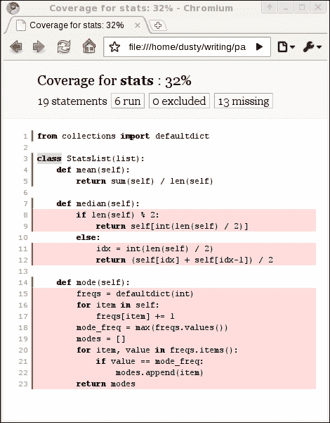

# 第十二章：测试面向对象的程序

技术娴熟的 Python 程序员一致认为测试是软件开发中最重要的方面之一。尽管本章放在书的末尾，但它并不是一个事后想法;到目前为止我们所学的一切都将帮助我们编写测试。我们将学习：

+   单元测试和测试驱动开发的重要性

+   标准的`unittest`模块

+   `py.test`自动化测试套件

+   `mock`模块

+   代码覆盖率

+   使用`tox`进行跨平台测试

# 为什么要测试？

许多程序员已经知道测试代码的重要性。如果你是其中之一，请随意略过本节。你会发现下一节——我们实际上如何在 Python 中进行测试——更加有趣。如果你还不相信测试的重要性，我保证你的代码是有问题的，只是你不知道而已。继续阅读!

有人认为测试在 Python 代码中更为重要，因为它的动态性;编译语言如 Java 和 C++有时被认为在某种程度上更“安全”，因为它们在编译时强制执行类型检查。然而，Python 测试很少检查类型。他们检查值。他们确保正确的属性在正确的时间设置，或者序列具有正确的长度，顺序和值。这些更高级的东西需要在任何语言中进行测试。Python 程序员比其他语言的程序员进行更多测试的真正原因是在 Python 中测试是如此容易!

但是为什么要测试？我们真的需要测试吗？如果我们不测试会怎样？要回答这些问题，请从头开始编写一个井字棋游戏，完全不进行任何测试。在完全编写完成之前不要运行它。如果让两个玩家都是人类玩家（没有人工智能），实现井字棋是相当简单的。你甚至不必尝试计算谁是赢家。现在运行你的程序。并修复所有错误。有多少错误？我在我的井字棋实现中记录了八个错误，我不确定是否都捕捉到了。你呢？

我们需要测试我们的代码以确保它能正常工作。运行程序，就像我们刚刚做的那样，并修复错误是一种粗糙的测试形式。Python 程序员可以编写几行代码并运行程序，以确保这些行正在做他们期望的事情。但是更改几行代码可能会影响开发人员没有意识到将受到更改影响的程序的部分，因此不会测试它。此外，随着程序的增长，解释器可以通过代码的各种路径也在增长，手动测试所有这些路径很快就变得不可能。

为了解决这个问题，我们编写自动化测试。这些是自动运行某些输入通过其他程序或程序部分的程序。我们可以在几秒钟内运行这些测试程序，并覆盖比一个程序员每次更改某些东西时想到的更多可能的输入情况。

编写测试的四个主要原因：

+   确保代码按照开发人员的预期工作

+   确保代码在进行更改时继续工作

+   确保开发人员理解了要求

+   确保我们正在编写的代码具有可维护的接口

第一点确实不能证明编写测试所需的时间;我们可以在交互式解释器中直接测试代码。但是，当我们必须多次执行相同的测试操作序列时，自动化这些步骤一次然后在需要时运行它们需要的时间更少。无论是在初始开发还是维护版本期间，改变代码时都要运行测试是个好主意。当我们有一套全面的自动化测试时，我们可以在代码更改后运行它们，并知道我们没有无意中破坏任何被测试的东西。

最后两点更有趣。当我们为代码编写测试时，它有助于我们设计代码所采用的 API、接口或模式。因此，如果我们误解了需求，编写测试可以帮助突出这种误解。另一方面，如果我们不确定如何设计一个类，我们可以编写一个与该类交互的测试，这样我们就知道测试它的最自然方式是什么。事实上，通常在编写我们要测试的代码之前编写测试是有益的。

## 测试驱动开发

“先写测试”是测试驱动开发的口头禅。测试驱动开发将“未经测试的代码是有问题的代码”概念推进了一步，并建议只有未编写的代码才应该未经测试。在编写代码之前不要编写任何代码，直到为该代码编写了测试。因此，第一步是编写一个证明代码可以工作的测试。显然，测试将失败，因为代码还没有被编写。然后编写确保测试通过的代码。然后为下一段代码编写另一个测试。

测试驱动开发是有趣的。它允许我们构建小的谜题来解决。然后我们实现解决谜题的代码。然后我们制作一个更复杂的谜题，编写解决新谜题的代码，而不会解决以前的谜题。

测试驱动方法论有两个目标。第一个目标是确保测试确实被编写。在编写了代码之后，很容易说：“嗯，它似乎可以工作。我不必为此编写任何测试。这只是一个小改动，不可能出错。”如果测试在编写代码之前已经编写好，我们将确切地知道它何时能够工作（因为测试将通过），并且在将来，如果我们或其他人做出的更改破坏了它，我们也会知道。

其次，首先编写测试强迫我们考虑代码将如何进行交互。它告诉我们对象需要具有哪些方法以及如何访问属性。它帮助我们将初始问题分解为更小的、可测试的问题，然后将经过测试的解决方案重新组合成更大的、同样经过测试的解决方案。编写测试因此可以成为设计过程的一部分。通常，如果我们为一个新对象编写测试，我们会发现设计中的异常，这会迫使我们考虑软件的新方面。

举个具体的例子，想象一下编写代码，使用对象关系映射器将对象属性存储在数据库中。在这种对象中使用自动分配的数据库 ID 是很常见的。我们的代码可能会为各种目的使用这个 ID。如果我们为这样的代码编写测试，在编写之前，我们可能会意识到我们的设计是有问题的，因为对象在保存到数据库之前是没有这些 ID 的。如果我们想在测试中操作一个对象而不保存它，它会在我们基于错误前提编写代码之前突出显示这个问题。

测试使软件更好。在发布软件之前编写测试可以使软件在最终用户看到或购买有错误的版本之前变得更好（我曾为奉行“用户可以测试”的理念的公司工作过。这不是一个健康的商业模式！）。在编写软件之前编写测试可以使软件第一次编写时变得更好。

# 单元测试

让我们从 Python 的内置测试库开始探索。该库提供了一个**单元测试**的通用接口。单元测试专注于在任何一个测试中测试尽可能少的代码。每个测试都测试可用代码的一个单元。

这方面的 Python 库被称为`unittest`，这并不奇怪。它提供了几个工具来创建和运行单元测试，其中最重要的是`TestCase`类。这个类提供了一组方法，允许我们比较值，设置测试，并在测试完成时进行清理。

当我们想要为特定任务编写一组单元测试时，我们创建一个`TestCase`的子类，并编写单独的方法来进行实际测试。这些方法必须都以`test`开头。遵循这个约定时，测试会自动作为测试过程的一部分运行。通常，测试会在对象上设置一些值，然后运行一个方法，并使用内置的比较方法来确保计算出了正确的结果。以下是一个非常简单的例子：

```py
import unittest

class CheckNumbers(unittest.TestCase):
    def test_int_float(self):
 **self.assertEqual(1, 1.0)

if __name__ == "__main__":
    unittest.main()
```

这段代码简单地继承了`TestCase`类，并添加了一个调用`TestCase.assertEqual`方法的方法。这个方法要么成功，要么引发异常，这取决于这两个参数是否相等。如果我们运行这段代码，`unittest`的`main`函数将给我们以下输出：

```py
.
--------------------------------------------------------------
Ran 1 test in 0.000s

OK

```

你知道浮点数和整数可以比较相等吗？让我们添加一个失败的测试：

```py
    def test_str_float(self):
        self.assertEqual(1, "1")
```

这段代码的输出更加阴险，因为整数和字符串不被视为相等：

```py
.F
============================================================
FAIL: test_str_float (__main__.CheckNumbers)
--------------------------------------------------------------
Traceback (most recent call last):
 **File "simplest_unittest.py", line 8, in test_str_float
 **self.assertEqual(1, "1")
AssertionError: 1 != '1'

--------------------------------------------------------------
Ran 2 tests in 0.001s

FAILED (failures=1)

```

第一行的点表示第一个测试（我们之前写的那个）成功通过；其后的`F`字母表示第二个测试失败。然后，在最后，它给出了一些信息性的输出，告诉我们测试失败的原因和位置，以及失败的数量总结。 

我们可以在一个`TestCase`类上有尽可能多的测试方法；只要方法名以`test`开头，测试运行器就会将每个方法作为单独的测试执行。每个测试应该完全独立于其他测试。上一个测试的结果或计算不应该对当前测试产生影响。编写良好的单元测试的关键是尽可能保持每个测试方法的长度短，每个测试用例测试代码的一个小单元。如果你的代码似乎无法自然地分解成这样可测试的单元，这可能是你的设计需要重新思考的迹象。

## 断言方法

测试用例的一般布局是将某些变量设置为已知值，运行一个或多个函数、方法或进程，然后使用`TestCase`断言方法来“证明”正确的预期结果是通过的。

有一些不同的断言方法可用于确认已经实现了特定的结果。我们刚刚看到了`assertEqual`，如果两个参数未通过相等检查，它将导致测试失败。相反，`assertNotEqual`将在两个参数比较相等时失败。`assertTrue`和`assertFalse`方法各自接受一个表达式，并在表达式未通过`if`测试时失败。这些测试不是检查布尔值`True`或`False`。相反，它们测试与使用`if`语句相同的条件：`False`、`None`、`0`或空列表、字典、字符串、集合或元组会通过调用`assertFalse`方法，而非零数、包含值的容器或值`True`在调用`assertTrue`方法时会成功。

有一个`assertRaises`方法，可以用来确保特定的函数调用引发特定的异常，或者可以作为上下文管理器来包装内联代码。如果`with`语句内的代码引发了正确的异常，测试通过；否则，测试失败。以下是两个版本的示例：

```py
import unittest

def average(seq):
    return sum(seq) / len(seq)

class TestAverage(unittest.TestCase):
    def test_zero(self):
 **self.assertRaises(ZeroDivisionError,
 **average,
 **[])

    def test_with_zero(self):
 **with self.assertRaises(ZeroDivisionError):
            average([])

if __name__ == "__main__":
    unittest.main()
```

上下文管理器允许我们以通常的方式编写代码（通过调用函数或直接执行代码），而不必在另一个函数调用中包装函数调用。

还有其他几种断言方法，总结如下表：

| 方法 | 描述 |
| --- | --- |
| `assertGreater``assertGreaterEqual``assertLess``assertLessEqual` | 接受两个可比较的对象，并确保命名的不等式成立。 |
| `assertIn``assertNotIn` | 确保元素是（或不是）容器对象中的元素。 |
| `assertIsNone``assertIsNotNone` | 确保元素是（或不是）确切的值`None`（但不是其他假值）。 |
| `assertSameElements` | 确保两个容器对象具有相同的元素，忽略顺序。 |
| `assertSequenceEqualassertDictEqual``assertSetEqual``assertListEqual``assertTupleEqual` | 确保两个容器具有相同顺序的相同元素。如果失败，显示一个代码差异，比较两个列表的差异位置。最后四种方法还测试列表的类型。 |

每个断言方法都接受一个名为`msg`的可选参数。如果提供，它将包含在错误消息中，如果断言失败。这对于澄清预期的内容或解释可能导致断言失败的错误的位置非常有用。

## 减少样板代码和清理

写了一些小测试之后，我们经常发现我们必须为几个相关的测试做相同的设置代码。例如，以下`list`子类有三种用于统计计算的方法：

```py
from collections import defaultdict

class StatsList(list):
    def mean(self):
        return sum(self) / len(self)

    def median(self):
        if len(self) % 2:
            return self[int(len(self) / 2)]
        else:
            idx = int(len(self) / 2)
            return (self[idx] + self[idx-1]) / 2

    def mode(self):
        freqs = defaultdict(int)
        for item in self:
            freqs[item] += 1
        mode_freq = max(freqs.values())
        modes = []
        for item, value in freqs.items():
            if value == mode_freq:
                modes.append(item)
        return modes
```

显然，我们将要测试这三种方法中每一种具有非常相似的输入的情况；我们将要看看空列表或包含非数字值的列表或包含正常数据集的列表会发生什么。我们可以使用`TestCase`类上的`setUp`方法为每个测试进行初始化。这个方法不接受任何参数，并允许我们在每次测试运行之前进行任意设置。例如，我们可以按照以下方式测试所有三种方法在相同的整数列表上：

```py
from stats import StatsList
import unittest

class TestValidInputs(unittest.TestCase):
    **def setUp(self):
        self.stats = StatsList([1,2,2,3,3,4])

    def test_mean(self):
        self.assertEqual(self.stats.mean(), 2.5)

    def test_median(self):
        self.assertEqual(self.stats.median(), 2.5)
        self.stats.append(4)
        self.assertEqual(self.stats.median(), 3)

    def test_mode(self):
        self.assertEqual(self.stats.mode(), [2,3])
        self.stats.remove(2)
        self.assertEqual(self.stats.mode(), [3])

if __name__ == "__main__":
    unittest.main()
```

如果我们运行这个例子，它表明所有测试都通过了。首先注意到`setUp`方法从未在三个`test_*`方法内显式调用过。测试套件会代表我们执行这个操作。更重要的是注意`test_median`如何改变列表，通过向其中添加额外的`4`，然而当调用`test_mode`时，列表已经返回到`setUp`中指定的值（如果没有的话，列表中会有两个四，并且`mode`方法会返回三个值）。这表明`setUp`在每个测试之前被单独调用，以确保测试类从一个干净的状态开始。测试可以以任何顺序执行，一个测试的结果不应该依赖于任何其他测试。

除了`setUp`方法，`TestCase`还提供了一个无参数的`tearDown`方法，它可以用于在类的每个测试运行后进行清理。如果清理需要除了让对象被垃圾回收之外的其他操作，这是很有用的。例如，如果我们正在测试进行文件 I/O 的代码，我们的测试可能会创建新文件作为测试的副作用；`tearDown`方法可以删除这些文件，并确保系统处于测试运行之前的相同状态。测试用例不应该具有副作用。一般来说，我们根据它们共同的设置代码将测试方法分组到单独的`TestCase`子类中。需要相同或类似设置的几个测试将放在一个类中，而需要不相关设置的测试将放在另一个类中。

## 组织和运行测试

一个单元测试集合很快就会变得非常庞大和难以管理。一次性加载和运行所有测试很快就会变得复杂。这是单元测试的主要目标；应该很容易运行我们程序上的所有测试，并快速得到一个“是或否”的答案，回答“我的最近的更改是否破坏了任何现有的测试？”的问题。

Python 的`discover`模块基本上是在当前文件夹或子文件夹中查找以`test`开头的模块。如果在这些模块中找到任何`TestCase`对象，就会执行测试。这是一个无痛的方式来确保我们不会错过运行任何测试。要使用它，请确保你的测试模块的名称是`test_<something>.py`，然后运行命令`python3 -m unittest discover`。

## 忽略损坏的测试

有时，测试可能会失败，但我们不希望测试套件报告失败。这可能是因为一个破损或未完成的功能已经编写了测试，但我们目前并不专注于改进它。更常见的情况是，因为某个功能仅在特定平台、Python 版本或特定库的高级版本上可用。Python 为我们提供了一些装饰器，用于标记测试为预期失败或在已知条件下跳过。

装饰器是：

+   `expectedFailure()`

+   `skip(reason)`

+   `skipIf(condition, reason)`

+   `skipUnless(condition, reason)`

这些是使用 Python 装饰器语法应用的。第一个不接受任何参数，只是告诉测试运行器在失败时不记录测试为失败。`skip`方法更进一步，甚至不会运行测试。它期望一个描述为什么跳过测试的字符串参数。另外两个装饰器接受两个参数，一个是布尔表达式，指示是否应该运行测试，另一个是类似的描述。在使用时，这三个装饰器可能会像这样应用：

```py
import unittest
import sys

class SkipTests(unittest.TestCase):
 **@unittest.expectedFailure
    def test_fails(self):
        self.assertEqual(False, True)

 **@unittest.skip("Test is useless")
    def test_skip(self):
        self.assertEqual(False, True)

 **@unittest.skipIf(sys.version_info.minor == 4,
 **"broken on 3.4")
    def test_skipif(self):
        self.assertEqual(False, True)

 **@unittest.skipUnless(sys.platform.startswith('linux'),
 **"broken unless on linux")
    def test_skipunless(self):
        self.assertEqual(False, True)

if __name__ == "__main__":
    unittest.main()
```

第一个测试失败，但被报告为预期失败；第二个测试从未运行。其他两个测试可能会运行，也可能不会，这取决于当前的 Python 版本和操作系统。在我运行 Python 3.4 的 Linux 系统上，输出如下：

```py
xssF
=============================================================
FAIL: test_skipunless (__main__.SkipTests)
--------------------------------------------------------------
Traceback (most recent call last):
 **File "skipping_tests.py", line 21, in test_skipunless
 **self.assertEqual(False, True)
AssertionError: False != True

--------------------------------------------------------------
Ran 4 tests in 0.001s

FAILED (failures=1, skipped=2, expected failures=1)

```

第一行上的`x`表示预期失败；两个`s`字符代表跳过的测试，`F`表示真正的失败，因为在我的系统上，`skipUnless`的条件为`True`。

# 使用 py.test 进行测试

Python `unittest`模块需要大量样板代码来设置和初始化测试。它基于非常流行的 Java 的 JUnit 测试框架。它甚至使用相同的方法名称（您可能已经注意到它们不符合 PEP-8 命名标准，该标准建议使用下划线而不是 CamelCase 来分隔方法名称中的单词），以及测试布局。虽然这对于在 Java 中进行测试是有效的，但不一定是 Python 测试的最佳设计。

因为 Python 程序员喜欢他们的代码简洁而简单，所以在标准库之外开发了其他测试框架。其中两个较受欢迎的是`py.test`和`nose`。前者更为健壮，而且支持 Python 3 的时间更长，因此我们将在这里讨论它。

由于`py.test`不是标准库的一部分，您需要自己下载和安装它；您可以从[`pytest.org/`](http://pytest.org/)的`py.test`主页获取它。该网站提供了各种解释器和平台的全面安装说明，但通常您可以使用更常见的 Python 包安装程序 pip。只需在命令行上键入`pip install pytest`，您就可以开始使用了。

`py.test`的布局与`unittest`模块有很大不同。它不要求测试用例是类。相反，它利用了 Python 函数是对象的事实，并允许任何命名正确的函数像测试一样行为。它不是提供一堆用于断言相等的自定义方法，而是使用`assert`语句来验证结果。这使得测试更易读和易维护。当我们运行`py.test`时，它将从当前文件夹开始搜索该文件夹或子包中以`test_`开头的任何模块。如果此模块中的任何函数也以`test`开头，它们将作为单独的测试执行。此外，如果模块中有任何以`Test`开头的类，该类上以`test_`开头的任何方法也将在测试环境中执行。

让我们将我们之前编写的最简单的`unittest`示例移植到`py.test`：

```py
def test_int_float():
    assert 1 == 1.0
```

对于完全相同的测试，我们编写了两行更易读的代码，与我们第一个`unittest`示例中需要的六行相比。

但是，我们并不禁止编写基于类的测试。类可以用于将相关测试分组在一起，或者用于需要访问类上相关属性或方法的测试。这个例子展示了一个扩展类，其中有一个通过的测试和一个失败的测试；我们将看到错误输出比`unittest`模块提供的更全面：

```py
class TestNumbers:
    def test_int_float(self):
        assert 1 == 1.0

    def test_int_str(self):
        assert 1 == "1"
```

请注意，类不必扩展任何特殊对象才能被选为测试（尽管`py.test`可以很好地运行标准的`unittest TestCases`）。如果我们运行`py.test <filename>`，输出如下：

```py
============== test session starts ==============
python: platform linux2 -- Python 3.4.1 -- pytest-2.6.4
test object 1: class_pytest.py

class_pytest.py .F

=================== FAILURES====================
___________ TestNumbers.test_int_str ____________

self = <class_pytest.TestNumbers object at 0x85b4fac>

 **def test_int_str(self):
>       assert 1 == "1"
E       assert 1 == '1'

class_pytest.py:7: AssertionError
====== 1 failed, 1 passed in 0.10 seconds =======

```

输出以有关平台和解释器的一些有用信息开始。这对于在不同系统之间共享错误很有用。第三行告诉我们正在测试的文件的名称（如果有多个测试模块被选中，它们都将被显示），然后是在`unittest`模块中看到的熟悉的`.F`；`.`字符表示通过的测试，而字母`F`表示失败。

所有测试运行完毕后，将显示每个测试的错误输出。它呈现了本地变量的摘要（在本例中只有一个：传递到函数中的`self`参数），错误发生的源代码以及错误消息的摘要。此外，如果引发的异常不是`AssertionError`，`py.test`将向我们呈现完整的回溯，包括源代码引用。

默认情况下，`py.test`在测试成功时会抑制`print`语句的输出。这对于测试调试很有用；当测试失败时，我们可以向测试中添加`print`语句，以检查测试运行时特定变量和属性的值。如果测试失败，这些值将被输出以帮助诊断。然而，一旦测试成功，`print`语句的输出就不会显示，可以轻松忽略。我们不必通过删除`print`语句来“清理”输出。如果测试因未来更改而再次失败，调试输出将立即可用。

## 设置和清理的一种方法

`py.test`支持类似于`unittest`中使用的设置和清理方法，但它提供了更多的灵活性。我们将简要讨论这些，因为它们很熟悉，但它们没有像在`unittest`模块中那样被广泛使用，因为`py.test`为我们提供了强大的 funcargs 功能，我们将在下一节中讨论。

如果我们正在编写基于类的测试，我们可以使用两个名为`setup_method`和`teardown_method`的方法，基本上与`unittest`中调用`setUp`和`tearDown`的方式相同。它们在类中的每个测试方法之前和之后被调用，以执行设置和清理任务。不过，与`unittest`方法有一个区别。这两个方法都接受一个参数：表示被调用方法的函数对象。

此外，`py.test`还提供了其他设置和清理函数，以便更多地控制设置和清理代码的执行时间。`setup_class`和`teardown_class`方法预期是类方法；它们接受一个表示相关类的单个参数（没有`self`参数）。

最后，我们有`setup_module`和`teardown_module`函数，它们在该模块中的所有测试（在函数或类中）之前和之后立即运行。这些可以用于“一次性”设置，例如创建将被模块中所有测试使用的套接字或数据库连接。要小心使用这个，因为如果设置的对象存储状态，它可能会意外地引入测试之间的依赖关系。

这个简短的描述并没有很好地解释这些方法究竟在什么时候被调用，所以让我们看一个例子，确切地说明了它们何时被调用：

```py
def setup_module(module):
    print("setting up MODULE {0}".format(
        module.__name__))

def teardown_module(module):
    print("tearing down MODULE {0}".format(
        module.__name__))

def test_a_function():
    print("RUNNING TEST FUNCTION")

class BaseTest:
 **def setup_class(cls):
        print("setting up CLASS {0}".format(
            cls.__name__))

 **def teardown_class(cls):
        print("tearing down CLASS {0}\n".format(
            cls.__name__))

 **def setup_method(self, method):
        print("setting up METHOD {0}".format(
            method.__name__))

 **def teardown_method(self, method):
        print("tearing down  METHOD {0}".format(
            method.__name__))

class TestClass1(BaseTest):
    def test_method_1(self):
        print("RUNNING METHOD 1-1")

    def test_method_2(self):
        print("RUNNING METHOD 1-2")

class TestClass2(BaseTest):
    def test_method_1(self):
        print("RUNNING METHOD 2-1")

    def test_method_2(self):
        print("RUNNING METHOD 2-2")
```

`BaseTest`类的唯一目的是提取四个方法，否则这些方法将与测试类相同，并使用继承来减少重复代码的数量。因此，从`py.test`的角度来看，这两个子类不仅每个都有两个测试方法，还有两个设置和两个拆卸方法（一个在类级别，一个在方法级别）。

如果我们使用`py.test`运行这些测试，并且禁用`print`函数输出抑制（通过传递`-s`或`--capture=no`标志），它们会向我们显示各种函数在与测试本身相关的情况下被调用的时间：

```py
py.test setup_teardown.py -s
setup_teardown.py
setting up MODULE setup_teardown
RUNNING TEST FUNCTION
.setting up CLASS TestClass1
setting up METHOD test_method_1
RUNNING METHOD 1-1
.tearing down  METHOD test_method_1
setting up METHOD test_method_2
RUNNING METHOD 1-2
.tearing down  METHOD test_method_2
tearing down CLASS TestClass1
setting up CLASS TestClass2
setting up METHOD test_method_1
RUNNING METHOD 2-1
.tearing down  METHOD test_method_1
setting up METHOD test_method_2
RUNNING METHOD 2-2
.tearing down  METHOD test_method_2
tearing down CLASS TestClass2

tearing down MODULE setup_teardown

```

模块的设置和拆卸方法在会话的开始和结束时执行。然后运行单个模块级别的测试函数。接下来，执行第一个类的设置方法，然后执行该类的两个测试。这些测试分别包裹在单独的`setup_method`和`teardown_method`调用中。测试执行完毕后，调用类的拆卸方法。在第二个类之前，发生了相同的顺序，最后调用`teardown_module`方法，确切地调用一次。

## 设置变量的完全不同的方法

各种设置和拆卸函数的最常见用途之一是确保在运行每个测试方法之前，某些类或模块变量可用，并具有已知的值。

`py.test`提供了一种完全不同的方法来使用所谓的**funcargs**，即函数参数。Funcargs 基本上是预定义在测试配置文件中的命名变量。这使我们能够将配置与测试的执行分开，并允许 funcargs 在多个类和模块中使用。

要使用它们，我们向测试函数添加参数。参数的名称用于在特殊命名的函数中查找特定的参数。例如，如果我们想测试我们在演示`unittest`时使用的`StatsList`类，我们将再次想要重复测试一个有效整数列表。但是，我们可以这样编写我们的测试，而不是使用设置方法：

```py
from stats import StatsList

def pytest_funcarg__valid_stats(request):
    return StatsList([1,2,2,3,3,4])

def test_mean(valid_stats):
    assert valid_stats.mean() == 2.5

def test_median(valid_stats):
    assert valid_stats.median() == 2.5
    valid_stats.append(4)
    assert valid_stats.median() == 3

def test_mode(valid_stats):
    assert valid_stats.mode() == [2,3]
    valid_stats.remove(2)
    assert valid_stats.mode() == [3]
```

三个测试方法中的每一个都接受一个名为`valid_stats`的参数；这个参数是通过调用文件顶部定义的`pytest_funcarg__valid_stats`函数创建的。如果 funcarg 需要多个模块使用，它也可以在名为`conftest.py`的文件中定义。`conftest.py`文件由`py.test`解析，以加载任何“全局”测试配置；它是一种用于自定义`py.test`体验的捕捉所有的文件。

与其他`py.test`功能一样，返回 funcarg 的工厂的名称很重要；funcargs 是被命名为`pytest_funcarg__<identifier>`的函数，其中`<identifier>`是一个可以在测试函数中用作参数的有效变量名。这个函数接受一个神秘的`request`参数，并返回要传递给各个测试函数的对象。对于每次调用单个测试函数，都会新创建一个 funcarg；这使我们能够在一个测试中更改列表，并知道它将在下一个测试中被重置为其原始值。

Funcargs 可以做的远不止返回基本变量。传递给 funcarg 工厂的`request`对象提供了一些极其有用的方法和属性，以修改 funcarg 的行为。`module`、`cls`和`function`属性允许我们准确地看到哪个测试正在请求 funcarg。`config`属性允许我们检查命令行参数和其他配置数据。

更有趣的是，请求对象提供了一些方法，允许我们对 funcarg 进行额外的清理，或者在测试之间重用它，这些方法否则将被限制在特定范围的设置和拆卸方法中。

`request.addfinalizer`方法接受一个回调函数，在每个使用 funcarg 的测试函数之后执行清理。这提供了一个类似于拆卸方法的功能，允许我们清理文件、关闭连接、清空列表或重置队列。例如，以下代码通过创建一个临时目录`funcarg`来测试`os.mkdir`功能：

```py
import tempfile
import shutil
import os.path

def pytest_funcarg__temp_dir(request):
    dir = tempfile.mkdtemp()
    print(dir)

    def cleanup():
        shutil.rmtree(dir)
 **request.addfinalizer(cleanup)
    return dir

def test_osfiles(temp_dir):
    os.mkdir(os.path.join(temp_dir, 'a'))
    os.mkdir(os.path.join(temp_dir, 'b'))
    dir_contents = os.listdir(temp_dir)
    assert len(dir_contents) == 2
    assert 'a' in dir_contents
    assert 'b' in dir_contents
```

funcarg 为文件创建一个新的空临时目录。然后它添加一个 finalizer 调用，在测试完成后删除该目录（使用`shutil.rmtree`，递归删除目录及其中的所有内容）。文件系统的状态将保持与开始时相同。

我们可以使用`request.cached_setup`方法创建持续时间超过一个测试的函数参数变量。当设置一个昂贵的操作并且可以被多个测试重复使用时，这是非常有用的，只要资源重用不会破坏测试的原子性或单元性质（以便一个测试不依赖于先前的测试并且不受其影响）。例如，如果我们要测试以下回显服务器，我们可能只想在单独的进程中运行服务器的一个实例，然后让多个测试连接到该实例：

```py
import socket

s = socket.socket(socket.AF_INET, socket.SOCK_STREAM)
s.setsockopt(socket.SOL_SOCKET, socket.SO_REUSEADDR, 1)
s.bind(('localhost',1028))
s.listen(1)

    while True:
        client, address = s.accept()
        data = client.recv(1024)
        client.send(data)
        client.close()
```

这段代码的作用只是在特定端口上监听并等待来自客户端套接字的输入。当它接收到输入时，它会将相同的值发送回去。为了测试这一点，我们可以在单独的进程中启动服务器，并将结果缓存以供多个测试使用。以下是测试代码的样子：

```py
import subprocess
import socket
import time

def pytest_funcarg__echoserver(request):
 **def setup():
 **p = subprocess.Popen(
 **['python3', 'echo_server.py'])
 **time.sleep(1)
 **return p

 **def cleanup(p):
 **p.terminate()

 **return request.cached_setup(
 **setup=setup,
 **teardown=cleanup,
 **scope="session")

def pytest_funcarg__clientsocket(request):
    s = socket.socket(socket.AF_INET, socket.SOCK_STREAM)
    s.connect(('localhost', 1028))
    request.addfinalizer(lambda: s.close())
    return s

def test_echo(echoserver, clientsocket):
    clientsocket.send(b"abc")
    assert clientsocket.recv(3) == b'abc'

def test_echo2(echoserver, clientsocket):
    clientsocket.send(b"def")
    assert clientsocket.recv(3) == b'def'
```

我们在这里创建了两个 funcarg。第一个在单独的进程中运行回显服务器，并返回进程对象。第二个为每个测试实例化一个新的套接字对象，并在测试完成时关闭它，使用`addfinalizer`。我们目前感兴趣的是第一个 funcarg。它看起来很像传统的单元测试设置和拆卸。我们创建一个`setup`函数，不接受任何参数并返回正确的参数；在这种情况下，实际上测试忽略了进程对象，因为它们只关心服务器是否正在运行。然后，我们创建一个`cleanup`函数（函数的名称是任意的，因为它只是我们传递给另一个函数的对象），它接受一个参数：`setup`返回的参数。这个清理代码终止了进程。

父函数不直接返回 funcarg 的结果，而是返回对`request.cached_setup`调用的结果。它接受`setup`和`teardown`函数的两个参数（我们刚刚创建的），以及一个`scope`参数。这个最后一个参数应该是三个字符串之一："function"、"module"或"session"；它决定了参数的缓存时间。在这个例子中，我们将其设置为"session"，因此它在整个`py.test`运行期间都被缓存。直到所有测试运行完毕之前，进程都不会被终止或重新启动。当然，"module"作用域只在该模块中缓存它，而"function"作用域则更像一个普通的 funcarg，因为它在每个测试函数运行后都会被重置。

## 使用 py.test 跳过测试

与`unittest`模块一样，经常需要在`py.test`中跳过测试，原因有很多：被测试的代码尚未编写、测试只在某些解释器或操作系统上运行、或者测试很耗时，只应在特定情况下运行。

我们可以在代码的任何地方使用`py.test.skip`函数跳过测试。它接受一个参数：描述为什么要跳过的字符串。这个函数可以在任何地方调用；如果我们在测试函数内部调用它，测试将被跳过。如果我们在模块级别调用它，那么该模块中的所有测试都将被跳过。如果我们在 funcarg 函数内部调用它，那么调用该 funcarg 的所有测试都将被跳过。

当然，在所有这些位置，通常希望只有在满足或不满足某些条件时才跳过测试。由于我们可以在 Python 代码的任何地方执行`skip`函数，我们可以在`if`语句内执行它。因此，我们可以编写一个看起来像这样的测试：

```py
import sys
import py.test

def test_simple_skip():
    if sys.platform != "fakeos":
 **py.test.skip("Test works only on fakeOS")

    fakeos.do_something_fake()
    assert fakeos.did_not_happen
```

这实际上是一些非常愚蠢的代码。没有名为`fakeos`的 Python 平台，因此这个测试将在所有操作系统上跳过。它展示了我们如何有条件地跳过测试，由于`if`语句可以检查任何有效的条件，我们对何时跳过测试有很大的控制权。通常，我们会检查`sys.version_info`来检查 Python 解释器版本，`sys.platform`来检查操作系统，或者`some_library.__version__`来检查我们是否有足够新的给定 API 版本。

由于基于某个条件跳过单个测试方法或函数是测试跳过的最常见用法之一，`py.test`提供了一个方便的装饰器，允许我们在一行中执行此操作。该装饰器接受一个字符串，其中可以包含任何可执行的 Python 代码，该代码将求值为布尔值。例如，以下测试只会在 Python 3 或更高版本上运行：

```py
import py.test

@py.test.mark.skipif("sys.version_info <= (3,0)")
def test_python3():
    assert b"hello".decode() == "hello"
```

`py.test.mark.xfail`装饰器的行为类似，只是它标记一个测试为预期失败，类似于`unittest.expectedFailure()`。如果测试成功，它将被记录为失败；如果失败，它将被报告为预期行为。在`xfail`的情况下，条件参数是可选的；如果没有提供，测试将被标记为在所有条件下预期失败。

# 模拟昂贵的对象

有时，我们想要测试需要提供一个对象的代码，这个对象可能很昂贵或者很难构建。虽然这可能意味着您的 API 需要重新思考，以拥有一个更可测试的接口（通常意味着一个更可用的接口），但我们有时会发现自己编写的测试代码有大量样板代码来设置与被测试代码只是偶然相关的对象。

例如，假设我们有一些代码，用于在键值存储中跟踪航班状态（如`redis`或`memcache`），以便我们可以存储时间戳和最新状态。这样的基本版本代码可能如下所示：

```py
import datetime
import redis

class FlightStatusTracker:
    ALLOWED_STATUSES = {'CANCELLED', 'DELAYED', 'ON TIME'}

    def __init__(self):
        self.redis = redis.StrictRedis()

    def change_status(self, flight, status):
        status = status.upper()
        if status not in self.ALLOWED_STATUSES:
            raise ValueError(
                   "{} is not a valid status".format(status))

        key = "flightno:{}".format(flight)
        value = "{}|{}".format(
            datetime.datetime.now().isoformat(), status)
        self.redis.set(key, value)
```

在`change_status`方法中，有很多事情我们应该测试。我们应该检查如果传入了错误的状态，它是否引发了适当的错误。我们需要确保它将状态转换为大写。我们可以看到当在`redis`对象上调用`set()`方法时，键和值是否具有正确的格式。

然而，在我们的单元测试中不需要检查`redis`对象是否正确存储数据。这是绝对应该在集成或应用程序测试中进行测试的内容，但在单元测试级别，我们可以假设 py-redis 开发人员已经测试过他们的代码，并且这个方法确实符合我们的要求。通常，单元测试应该是自包含的，不依赖于外部资源的存在，比如正在运行的 Redis 实例。

相反，我们只需要测试`set()`方法被调用的次数是否正确，以及传入的参数是否正确。我们可以在测试中使用`Mock()`对象来替换有问题的方法，以便我们可以内省。以下示例说明了模拟的使用：

```py
from unittest.mock import Mock
import py.test
def pytest_funcarg__tracker():
    return FlightStatusTracker()

def test_mock_method(tracker):
 **tracker.redis.set = Mock()
    with py.test.raises(ValueError) as ex:
        tracker.change_status("AC101", "lost")
    assert ex.value.args[0] == "LOST is not a valid status"
 **assert tracker.redis.set.call_count == 0

```

这个使用`py.test`语法编写的测试断言在传入不合适的参数时会引发正确的异常。此外，它为`set`方法创建了一个模拟对象，并确保它从未被调用。如果被调用了，这意味着我们的异常处理代码中存在错误。

在这种情况下，简单地替换方法效果很好，因为被替换的对象最终被销毁了。然而，我们经常希望仅在测试期间替换函数或方法。例如，如果我们想测试模拟方法中的时间戳格式，我们需要确切地知道`datetime.datetime.now()`将返回什么。然而，这个值会随着运行而改变。我们需要一种方法将其固定到一个特定的值，以便我们可以进行可预测的测试。

还记得猴子补丁吗？临时将库函数设置为特定值是其极好的用法。模拟库提供了一个修补上下文管理器，允许我们用模拟对象替换现有库的属性。当上下文管理器退出时，原始属性会自动恢复，以免影响其他测试用例。下面是一个例子：

```py
from unittest.mock import patch
def test_patch(tracker):
    tracker.redis.set = Mock()
 **fake_now = datetime.datetime(2015, 4, 1)
 **with patch('datetime.datetime') as dt:
 **dt.now.return_value = fake_now
        tracker.change_status("AC102", "on time")
    dt.now.assert_called_once_with()
 **tracker.redis.set.assert_called_once_with(
 **"flightno:AC102",
 **"2015-04-01T00:00:00|ON TIME")

```

在这个示例中，我们首先构造了一个名为`fake_now`的值，我们将把它设置为`datetime.datetime.now`函数的返回值。我们必须在修补`datetime.datetime`之前构造这个对象，否则我们会在构造它之前调用修补的`now`函数！

`with`语句邀请修补程序用模拟对象替换`datetime.datetime`模块，并将其返回为值`dt`。模拟对象的好处是，每当您访问该对象的属性或方法时，它都会返回另一个模拟对象。因此，当我们访问`dt.now`时，它会给我们一个新的模拟对象。我们将该对象的`return_value`设置为我们的`fake_now`对象；这样，每当调用`datetime.datetime.now`函数时，它将返回我们的对象，而不是一个新的模拟对象。

然后，在使用已知值调用我们的`change_status`方法之后，我们使用模拟类的`assert_called_once_with`函数来确保`now`函数确实被调用了一次，且没有参数。然后我们再次调用它，以证明`redis.set`方法被调用时，参数的格式与我们预期的一样。

前面的例子很好地说明了编写测试如何指导我们的 API 设计。`FlightStatusTracker`对象乍一看似乎很合理；我们在对象构造时构建了一个`redis`连接，并在需要时调用它。然而，当我们为这段代码编写测试时，我们发现，即使我们在`FlightStatusTracker`上模拟了`self.redis`变量，`redis`连接仍然必须被构造。如果没有运行 Redis 服务器，这个调用实际上会失败，我们的测试也会失败。

我们可以通过在`setUp`方法中模拟`redis.StrictRedis`类来解决这个问题。然而，一个更好的想法可能是重新思考我们的示例。与其在`__init__`中构造`redis`实例，也许我们应该允许用户传入一个，就像下面的示例中一样：

```py
    def __init__(self, redis_instance=None):
        self.redis = redis_instance if redis_instance else redis.StrictRedis()
```

这使我们能够在测试时传入一个模拟对象，这样`StrictRedis`方法就不会被构造。然而，它也允许任何与`FlightStatusTracker`交互的客户端代码传入他们自己的`redis`实例。他们可能有各种各样的原因想要这样做。他们可能已经为其代码的其他部分构造了一个`redis`实例。他们可能已经创建了一个优化的`redis` API 实现。也许他们有一个将指标记录到内部监控系统的实例。通过编写单元测试，我们发现了一个使用案例，使我们的 API 从一开始就更加灵活，而不是等待客户要求支持他们的特殊需求。

这是对模拟代码奇迹的简要介绍。自 Python 3.3 以来，模拟是标准的`unittest`库的一部分，但正如你从这些例子中看到的，它们也可以与`py.test`和其他库一起使用。模拟还有其他更高级的功能，当你的代码变得更加复杂时，你可能需要利用这些功能。例如，你可以使用`spec`参数邀请模拟模仿现有的类，以便在代码尝试访问模仿类上不存在的属性时引发错误。你还可以构造模拟方法，每次调用时返回不同的参数，通过将列表作为`side_effect`参数传递。`side_effect`参数非常灵活；你还可以使用它在调用模拟时执行任意函数或引发异常。

一般来说，我们在使用模拟时应该非常节俭。如果我们发现自己在给定的单元测试中模拟了多个元素，我们可能最终测试的是模拟框架，而不是我们真正的代码。这毫无用处；毕竟，模拟已经经过了充分的测试！如果我们的代码经常这样做，这可能是我们正在测试的 API 设计不好的另一个迹象。模拟应该存在于被测试代码和它们接口的库之间的边界上。如果这种情况没有发生，我们可能需要改变 API，以便在不同的地方重新划定边界。

# 测试多少是足够的？

我们已经确定未经测试的代码是有问题的代码。但是我们如何知道我们的代码被测试得有多好？我们如何知道我们的代码有多少被测试，有多少是有问题的？第一个问题更重要，但很难回答。即使我们知道我们已经测试了应用程序中的每一行代码，我们也不知道我们是否已经适当地测试了它。例如，如果我们编写了一个统计测试，只检查当我们提供一个整数列表时会发生什么，如果用于浮点数、字符串或自定义对象的列表，它可能仍然会失败。设计完整的测试套件的责任仍然在程序员身上。

第二个问题——我们的代码有多少实际被测试——很容易验证。代码覆盖本质上是程序执行的代码行数的估计。如果我们知道这个数字和程序中的代码行数，我们就可以估计实际被测试或覆盖的代码百分比。如果我们另外有一个指示哪些行没有被测试，我们可以更容易地编写新的测试来确保这些行不会出错。

测试代码覆盖率最流行的工具叫做`coverage.py`。它可以像大多数其他第三方库一样使用`pip install coverage`命令进行安装。

我们没有空间来涵盖覆盖 API 的所有细节，所以我们只看一些典型的例子。如果我们有一个运行所有单元测试的 Python 脚本（例如，使用`unittest.main`，自定义测试运行器或`discover`），我们可以使用以下命令进行覆盖分析：

```py
coverage run coverage_unittest.py

```

这个命令将正常退出，但它会创建一个名为`.coverage`的文件，其中包含运行的数据。现在我们可以使用`coverage report`命令来获取代码覆盖的分析：

```py
>>> coverage report

```

输出如下：

```py
Name                           Stmts   Exec  Cover
--------------------------------------------------
coverage_unittest                  7      7   100%
stats                             19      6    31%
--------------------------------------------------
TOTAL                             26     13    50%

```

这个基本报告列出了被执行的文件（我们的单元测试和一个导入的模块）。还列出了每个文件中的代码行数，以及测试执行的代码行数。然后将这两个数字合并，估计代码覆盖的数量。如果我们在报告命令中传递`-m`选项，它还会额外添加一个看起来像这样的列：

```py
Missing
-----------
8-12, 15-23

```

这里列出的行范围标识了在测试运行期间未执行的`stats`模块中的行。

我们刚刚运行代码覆盖工具的示例使用了我们在本章前面创建的相同的 stats 模块。然而，它故意使用了一个失败的单一测试来测试文件中的大量代码。这是测试：

```py
from stats import StatsList
import unittest

class TestMean(unittest.TestCase):
    def test_mean(self):
        self.assertEqual(StatsList([1,2,2,3,3,4]).mean(), 2.5)

if __name__ == "__main__":

    unittest.main()
```

这段代码没有测试中位数或模式函数，这对应于覆盖输出告诉我们缺失的行号。

文本报告已经足够了，但如果我们使用命令`coverage html`，我们可以得到一个更漂亮的交互式 HTML 报告，我们可以在 Web 浏览器中查看。网页甚至会突出显示源代码中测试和未测试的行。它看起来是这样的：



我们也可以使用`coverage.py`模块与`py.test`一起使用。我们需要安装`py.test`的代码覆盖插件，使用`pip install pytest-coverage`。该插件为`py.test`添加了几个命令行选项，其中最有用的是`--cover-report`，可以设置为`html`、`report`或`annotate`（后者实际上修改源代码以突出显示任何未覆盖的行）。

不幸的是，如果我们可以在本章的这一部分上运行覆盖报告，我们会发现我们并没有覆盖大部分关于代码覆盖的知识！可以使用覆盖 API 来从我们自己的程序（或测试套件）中管理代码覆盖，并且`coverage.py`接受许多我们尚未涉及的配置选项。我们还没有讨论语句覆盖和分支覆盖之间的区别（后者更有用，并且是最近版本的`coverage.py`的默认值），或其他风格的代码覆盖。

请记住，虽然 100%的代码覆盖是我们应该努力追求的一个远大目标，但 100%的覆盖是不够的！仅仅因为一个语句被测试了，并不意味着它对所有可能的输入都进行了适当的测试。

# 案例研究

让我们通过编写一个小型的、经过测试的密码应用程序来走一遍测试驱动开发。不用担心，你不需要理解复杂的现代加密算法（如 Threefish 或 RSA）背后的数学原理。相反，我们将实现一个被称为维吉尼亚密码的十六世纪算法。该应用程序只需要能够使用这个密码对消息进行编码和解码，给定一个编码关键字。

首先，我们需要了解如果我们手动应用密码，它是如何工作的（没有计算机）。我们从这样的表开始：

```py
A B C D E F G H I J K L M N O P Q R S T U V W X Y Z
B C D E F G H I J K L M N O P Q R S T U V W X Y Z A
C D E F G H I J K L M N O P Q R S T U V W X Y Z A B
D E F G H I J K L M N O P Q R S T U V W X Y Z A B C
E F G H I J K L M N O P Q R S T U V W X Y Z A B C D
F G H I J K L M N O P Q R S T U V W X Y Z A B C D E
G H I J K L M N O P Q R S T U V W X Y Z A B C D E F
H I J K L M N O P Q R S T U V W X Y Z A B C D E F G
I J K L M N O P Q R S T U V W X Y Z A B C D E F G H
J K L M N O P Q R S T U V W X Y Z A B C D E F G H I
K L M N O P Q R S T U V W X Y Z A B C D E F G H I J
L M N O P Q R S T U V W X Y Z A B C D E F G H I J K
M N O P Q R S T U V W X Y Z A B C D E F G H I J K L
N O P Q R S T U V W X Y Z A B C D E F G H I J K L M
O P Q R S T U V W X Y Z A B C D E F G H I J K L M N
P Q R S T U V W X Y Z A B C D E F G H I J K L M N O
Q R S T U V W X Y Z A B C D E F G H I J K L M N O P
R S T U V W X Y Z A B C D E F G H I J K L M N O P Q
S T U V W X Y Z A B C D E F G H I J K L M N O P Q R
T U V W X Y Z A B C D E F G H I J K L M N O P Q R S
U V W X Y Z A B C D E F G H I J K L M N O P Q R S T
V W X Y Z A B C D E F G H I J K L M N O P Q R S T U
W X Y Z A B C D E F G H I J K L M N O P Q R S T U V
X Y Z A B C D E F G H I J K L M N O P Q R S T U V W
Y Z A B C D E F G H I J K L M N O P Q R S T U V W X
Z A B C D E F G H I J K L M N O P Q R S T U V W X Y
```

给定一个关键字 TRAIN，我们可以这样编码消息 ENCODED IN PYTHON：

1.  重复关键字和消息在一起，以便从一个到另一个映射字母变得容易：

```py
E N C O D E D I N P Y T H O N    T R A I N T R A I N T R A I N
```

1.  对于明文中的每个字母，找到以该字母开头的行在表中的位置。

1.  找到与所选明文字母的关键字字母相关联的列。

1.  编码字符位于这一行和列的交点处。

例如，以 E 开头的行与以 T 开头的列相交于字符 X。因此，密文的第一个字母是 X。以 N 开头的行与以 R 开头的列相交于字符 E，导致密文 XE。C 与 A 相交于 C，O 与 I 相交于 W。D 和 N 映射到 Q，而 E 和 T 映射到 X。完整的编码消息是 XECWQXUIVCRKHWA。

解码基本上遵循相反的过程。首先，找到具有共享关键字的字符（T 行），然后找到该行中编码字符（X）的位置。明文字符位于该行的列顶部（E）。

## 实施它

我们的程序将需要一个`encode`方法，它接受关键字和明文并返回密文，以及一个`decode`方法，它接受关键字和密文并返回原始消息。

但是，我们不仅仅是编写这些方法，让我们遵循测试驱动的开发策略。我们将使用`py.test`进行单元测试。我们需要一个`encode`方法，我们知道它该做什么；让我们先为该方法编写一个测试：

```py
def test_encode():
    cipher = VigenereCipher("TRAIN")
    encoded = cipher.encode("ENCODEDINPYTHON")
    assert encoded == "XECWQXUIVCRKHWA"
```

这个测试自然会失败，因为我们没有在任何地方导入`VigenereCipher`类。让我们创建一个新模块来保存该类。

让我们从以下`VigenereCipher`类开始：

```py
class VigenereCipher:
    def __init__(self, keyword):
        self.keyword = keyword

    def encode(self, plaintext):
 **return "XECWQXUIVCRKHWA"

```

如果我们在我们的测试类顶部添加一行`from vigenere_cipher import VigenereCipher`并运行`py.test`，前面的测试将通过！我们完成了我们的第一个测试驱动开发周期。

显然，返回一个硬编码的字符串并不是密码类的最明智的实现，所以让我们添加第二个测试：

```py
def test_encode_character():
    cipher = VigenereCipher("TRAIN")
    encoded = cipher.encode("E")
    assert encoded == "X"
```

啊，现在那个测试会失败。看来我们要更加努力了。但我突然想到了一件事：如果有人尝试对一个带有空格或小写字符的字符串进行编码会怎么样？在我们开始实现编码之前，让我们为这些情况添加一些测试，这样我们就不会忘记它们。预期的行为将是去除空格，并将小写字母转换为大写：

```py
def test_encode_spaces():
    cipher = VigenereCipher("TRAIN")
    encoded = cipher.encode("ENCODED IN PYTHON")
    assert encoded == "XECWQXUIVCRKHWA"

def test_encode_lowercase():
    cipher = VigenereCipher("TRain")
    encoded = cipher.encode("encoded in Python")
    assert encoded == "XECWQXUIVCRKHWA"
```

如果我们运行新的测试套件，我们会发现新的测试通过了（它们期望相同的硬编码字符串）。但是如果我们忘记考虑这些情况，它们以后应该会失败。

现在我们有了一些测试用例，让我们考虑如何实现我们的编码算法。编写代码使用像我们在早期手动算法中使用的表是可能的，但考虑到每一行只是一个按偏移字符旋转的字母表，这似乎很复杂。事实证明（我问了维基百科），我们可以使用模算术来组合字符，而不是进行表查找。给定明文和关键词字符，如果我们将两个字母转换为它们的数值（A 为 0，Z 为 25），将它们相加，并取余数模 26，我们就得到了密文字符！这是一个简单的计算，但由于它是逐个字符进行的，我们可能应该将它放在自己的函数中。在这之前，我们应该为新函数编写一个测试：

```py
from vigenere_cipher import combine_character
def test_combine_character():
    assert combine_character("E", "T") == "X"
    assert combine_character("N", "R") == "E"
```

现在我们可以编写代码使这个函数工作。老实说，我在完全正确之前不得不运行测试几次；首先我返回了一个整数，然后我忘记了将字符从零基础的比例转回到正常的 ASCII 比例。有了测试可用，很容易测试和调试这些错误。这是测试驱动开发的另一个好处。

```py
def combine_character(plain, keyword):
    plain = plain.upper()
    keyword = keyword.upper()
    plain_num = ord(plain) - ord('A')
    keyword_num = ord(keyword) - ord('A')
    return chr(ord('A') + (plain_num + keyword_num) % 26)
```

现在`combine_characters`已经经过测试，我以为我们已经准备好实现我们的`encode`函数了。然而，在该函数内部我们首先需要一个与明文一样长的关键词字符串的重复版本。让我们先实现一个函数。哎呀，我是说让我们先实现测试！

```py
def test_extend_keyword():
    cipher = VigenereCipher("TRAIN")
    extended = cipher.extend_keyword(16)
    assert extended == "TRAINTRAINTRAINT"
```

在编写这个测试之前，我期望将`extend_keyword`作为一个独立的函数，接受一个关键词和一个整数。但是当我开始起草测试时，我意识到将其作为`VigenereCipher`类的辅助方法更合理。这显示了测试驱动开发如何帮助设计更合理的 API。这是方法的实现：

```py
    def extend_keyword(self, number):
        repeats = number // len(self.keyword) + 1
        return (self.keyword * repeats)[:number]
```

再次，这需要几次测试才能做对。最后我添加了第二个版本的测试，一个有十五个字母，一个有十六个字母，以确保它在整数除法有偶数的情况下也能正常工作。

现在我们终于准备好编写我们的`encode`方法了：

```py
    def encode(self, plaintext):
        cipher = []
        keyword = self.extend_keyword(len(plaintext))
        for p,k in zip(plaintext, keyword):
            cipher.append(combine_character(p,k))
        return "".join(cipher)
```

看起来正确。我们的测试套件现在应该通过了，对吗？

实际上，如果我们运行它，我们会发现仍然有两个测试失败。我们完全忘记了空格和小写字符！我们写了这些测试来提醒我们是一件好事。我们将不得不在方法的开头添加这一行：

```py
        plaintext = plaintext.replace(" ", "").upper()
```

### 提示

如果我们在实现某事的过程中对一个特殊情况有了想法，我们可以创建一个描述这个想法的测试。我们甚至不需要实现这个测试；我们可以运行`assert False`来提醒我们以后再实现它。失败的测试永远不会让我们忘记这个特殊情况，它不能被忽视，就像提交任务一样。如果修复实现需要一段时间，我们可以将测试标记为预期失败。

现在所有的测试都成功通过了。这一章非常长，所以我们将压缩解码的示例。以下是一些测试：

```py
def test_separate_character():
    assert separate_character("X", "T") == "E"
    assert separate_character("E", "R") == "N"

def test_decode():
    cipher = VigenereCipher("TRAIN")
    decoded = cipher.decode("XECWQXUIVCRKHWA")
    assert decoded == "ENCODEDINPYTHON"
```

这是`separate_character`函数：

```py
def separate_character(cypher, keyword):
    cypher = cypher.upper()
    keyword = keyword.upper()
    cypher_num = ord(cypher) - ord('A')
    keyword_num = ord(keyword) - ord('A')
    return chr(ord('A') + (cypher_num - keyword_num) % 26)
```

还有`decode`方法：

```py
    def decode(self, ciphertext):
        plain = []
        keyword = self.extend_keyword(len(ciphertext))
        for p,k in zip(ciphertext, keyword):
            plain.append(separate_character(p,k))
        return "".join(plain)
```

这些方法与编码时使用的方法非常相似。有了所有这些编写并通过的测试，我们现在可以回过头修改我们的代码，知道它仍然安全地通过了测试。例如，如果我们用这些重构后的方法替换我们现有的`encode`和`decode`方法，我们的测试仍然通过：

```py
    def _code(self, text, combine_func):
        text = text.replace(" ", "").upper()
        combined = []
        keyword = self.extend_keyword(len(text))
        for p,k in zip(text, keyword):
            combined.append(combine_func(p,k))
        return "".join(combined)

    def encode(self, plaintext):
        return self._code(plaintext, combine_character)

    def decode(self, ciphertext):
        return self._code(ciphertext, separate_character)
```

这是测试驱动开发的最终好处，也是最重要的。一旦测试编写完成，我们可以尽情改进我们的代码，而且可以确信我们的更改没有破坏我们一直在测试的任何东西。此外，我们知道我们的重构何时完成：当所有测试都通过时。

当然，我们的测试可能并不全面测试我们需要的一切；维护或代码重构仍然可能导致未经诊断的错误，这些错误在测试中不会显示出来。自动化测试并不是绝对可靠的。然而，如果出现错误，仍然可以遵循测试驱动的计划；第一步是编写一个测试（或多个测试），复制或“证明”所讨论的错误正在发生。这当然会失败。然后编写代码使测试停止失败。如果测试全面，错误将被修复，我们将知道它是否再次发生，一旦我们运行测试套件。

最后，我们可以尝试确定我们的测试在这段代码上的运行情况。安装了`py.test`覆盖插件后，`py.test –coverage-report=report`告诉我们我们的测试套件覆盖了 100%的代码。这是一个很好的统计数据，但我们不应该对此过于自负。当编码带有数字的消息时，我们的代码还没有经过测试，因此其行为是未定义的。

# 练习

练习测试驱动开发。这是你的第一个练习。如果你开始一个新项目，这样做会更容易，但如果你有现有的代码需要处理，你可以开始为你实现的每个新功能编写测试。随着你对自动化测试的热爱增加，这可能会变得令人沮丧。未经测试的旧代码将开始感觉僵化和紧密耦合，并且维护起来会变得不舒服；你会开始感觉到你所做的更改正在破坏代码，而你却无法知道，因为没有测试。但是如果你从小处开始，添加测试将改善，随着时间的推移，代码库会得到改善。

因此，要开始尝试测试驱动开发，可以开始一个新项目。一旦你开始意识到写测试的好处（你会的），并意识到写测试所花费的时间很快就能通过更易于维护的代码得到回报，你就会想要开始为现有代码编写测试。这就是你应该开始做的时候，而不是之前。为我们“知道”有效的代码编写测试是无聊的。在意识到我们认为有效的代码实际上有多糟糕之前，很难对项目产生兴趣。

尝试使用内置的`unittest`模块和`py.test`编写相同的一组测试。你更喜欢哪个？`unittest`更类似于其他语言中的测试框架，而`py.test`可以说更符合 Python 的风格。两者都允许我们编写面向对象的测试，并轻松测试面向对象的程序。

在我们的案例研究中，我们使用了`py.test`，但我们没有涉及任何使用`unittest`不容易进行测试的功能。尝试调整测试以使用测试跳过或 funcargs。尝试各种设置和拆卸方法，并将它们与 funcargs 进行比较。哪种对你来说更自然？

在我们的案例研究中，我们有很多使用类似`VigenereCipher`对象的测试；尝试重新设计这段代码以使用 funcarg。这样能节省多少行代码？

尝试对你编写的测试运行覆盖率报告。你有没有漏掉测试任何代码行？即使你有 100%的覆盖率，你是否测试了所有可能的输入？如果你在进行测试驱动开发，100%的覆盖率应该自然而然地遵循，因为你会在满足该测试的代码之前编写测试。然而，如果为现有代码编写测试，很可能会有未经测试的边缘情况。

仔细考虑一下某种程度上不同的值：当你期望完整的列表时却得到空列表，与中间整数相比的零或一或无穷大，不能精确到小数位的浮点数，当你期望数字时得到字符串，或者当你期望有意义的东西时得到无处不在的`None`值。如果你的测试涵盖了这些边缘情况，你的代码将会很好。

# 总结

我们终于涵盖了 Python 编程中最重要的主题：自动化测试。测试驱动开发被认为是最佳实践。标准库`unittest`模块提供了一个很好的开箱即用的测试解决方案，而`py.test`框架具有一些更 Pythonic 的语法。模拟可以用于在我们的测试中模拟复杂的类。代码覆盖率给出了我们的代码有多少被我们的测试运行的估计，但它并不告诉我们我们已经测试了正确的东西。

在下一章中，我们将进入一个完全不同的主题：并发。
