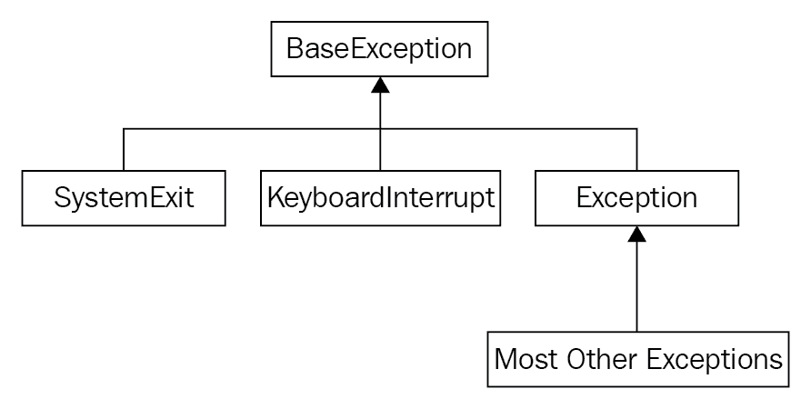

# 第四章：预期意外

程序非常脆弱。如果代码总是返回有效结果，那将是理想的，但有时无法计算出有效结果。例如，不能除以零，或者访问一个包含五个元素的列表中的第八个元素。

在过去，绕过这种情况的唯一方法是对每个函数的输入进行严格检查，以确保它们有意义。通常，函数有特殊的返回值来指示错误条件；例如，它们可以返回一个负数来表示无法计算出正值。不同的数字可能表示不同的错误发生。调用此函数的任何代码都必须显式检查错误条件并相应地操作。许多开发者懒得这样做，程序就直接崩溃了。然而，在面向对象的世界里，情况并非如此。

在本章中，我们将研究**异常**，这些是仅在需要处理时才需要处理的特殊错误对象。特别是，我们将涵盖以下内容：

+   如何引发异常

+   当异常发生时如何恢复

+   如何以不同的方式处理不同类型的异常

+   当异常发生时的清理工作

+   创建新的异常类型

+   使用异常语法进行流程控制

# 抛出异常

从原则上讲，异常只是一个对象。有众多不同的异常类可供使用，我们也可以轻松地定义更多的自定义异常。它们共有的一个特点是它们都继承自一个内置类，称为`BaseException`。当这些异常对象在程序的流程控制中被处理时，它们会变得特殊。当异常发生时，本应发生的一切都没有发生，除非在异常发生时本应发生。这说得通吗？别担心，它会！

引发异常的最简单方法就是做些愚蠢的事情。很可能你已经这样做过了，并看到了异常输出。例如，任何时候 Python 遇到它无法理解的程序中的行，它就会以`SyntaxError`退出，这是一种异常。这里有一个常见的例子：

```py
>>> print "hello world"
 File "<stdin>", line 1
 print "hello world"
 ^
SyntaxError: invalid syntax  
```

这个`print`语句在 Python 2 及更早版本中是一个有效的命令，但在 Python 3 中，因为`print`是一个函数，我们必须将参数放在括号内。所以，如果我们把前面的命令输入到 Python 3 解释器中，我们会得到`SyntaxError`。

除了`SyntaxError`之外，以下示例中展示了其他一些常见的异常：

```py
>>> x = 5 / 0
Traceback (most recent call last):
 File "<stdin>", line 1, in <module>
ZeroDivisionError: int division or modulo by zero

>>> lst = [1,2,3]
>>> print(lst[3])
Traceback (most recent call last):
 File "<stdin>", line 1, in <module>
IndexError: list index out of range

>>> lst + 2
Traceback (most recent call last):
 File "<stdin>", line 1, in <module>
TypeError: can only concatenate list (not "int") to list

>>> lst.add
Traceback (most recent call last):
 File "<stdin>", line 1, in <module>
AttributeError: 'list' object has no attribute 'add'

>>> d = {'a': 'hello'}
>>> d['b']
Traceback (most recent call last):
 File "<stdin>", line 1, in <module>
KeyError: 'b'

>>> print(this_is_not_a_var)
Traceback (most recent call last):
 File "<stdin>", line 1, in <module>
NameError: name 'this_is_not_a_var' is not defined  
```

有时，这些异常是我们程序中存在问题的指示（在这种情况下，我们会转到指示的行号并修复它），但它们也出现在合法情况下。`ZeroDivisionError` 错误并不总是意味着我们收到了无效的输入。它也可能意味着我们收到了不同的输入。用户可能不小心输入了零，或者故意这样做，或者它可能代表一个合法的值，例如空银行账户或新生儿的年龄。

你可能已经注意到所有前面的内置异常都以名称 `Error` 结尾。在 Python 中，`error` 和 `Exception` 这两个词几乎可以互换使用。错误有时被认为比异常更严重，但它们以完全相同的方式处理。确实，前面示例中的所有错误类都以 `Exception`（它扩展了 `BaseException`）作为它们的超类。

# 抛出异常

我们将在稍后了解如何响应这样的异常，但首先，让我们了解如果我们正在编写一个需要通知用户或调用函数输入无效的程序，我们应该做什么。我们可以使用 Python 使用的完全相同的机制。这里有一个简单的类，它只将偶数整数的项添加到列表中：

```py
class EvenOnly(list): 
    def append(self, integer): 
        if not isinstance(integer, int): 
 raise TypeError("Only integers can be added") 
        if integer % 2: 
 raise ValueError("Only even numbers can be added") 
        super().append(integer) 
```

这个类扩展了我们在 第二章 中讨论的 `list` 内置类型，并覆盖了 `append` 方法来检查两个条件，确保项目是一个偶数整数。我们首先检查输入是否是 `int` 类型的实例，然后使用取模运算符来确保它可以被 2 整除。如果两个条件中的任何一个不满足，`raise` 关键字就会引发异常。`raise` 关键字后面跟着要抛出的异常对象。在前面的示例中，从内置的 `TypeError` 和 `ValueError` 类中构建了两个对象。抛出的对象可以同样容易地是我们自己创建的新 `Exception` 类的实例（我们很快就会看到），或者是在其他地方定义的异常，甚至是一个之前已抛出并处理的 `Exception` 对象。

如果我们在 Python 解释器中测试这个类，我们可以看到当发生异常时，它正在输出有用的错误信息，就像之前一样：

```py
>>> e = EvenOnly()
>>> e.append("a string")
Traceback (most recent call last):
 File "<stdin>", line 1, in <module>
 File "even_integers.py", line 7, in add
 raise TypeError("Only integers can be added")
TypeError: Only integers can be added

>>> e.append(3)
Traceback (most recent call last):
 File "<stdin>", line 1, in <module>
 File "even_integers.py", line 9, in add
 raise ValueError("Only even numbers can be added")
ValueError: Only even numbers can be added
>>> e.append(2)
```

虽然这个类在演示异常行为方面很有效，但它并不擅长其工作。仍然可以通过使用索引表示法或切片表示法将其他值放入列表中。所有这些都可以通过覆盖其他适当的方法来避免，其中一些是魔法双下划线方法。

# 异常的影响

当抛出异常时，它似乎会立即停止程序执行。在异常抛出后应该运行的任何行都不会执行，除非处理了异常，否则程序将以错误消息退出。看看这个基本函数：

```py
def no_return(): 
    print("I am about to raise an exception") 
    raise Exception("This is always raised") 
    print("This line will never execute") 
    return "I won't be returned" 
```

如果我们执行这个函数，我们会看到第一个`print`调用执行了，然后抛出了异常。第二个`print`函数调用从未执行，`return`语句也没有执行：

```py
>>> no_return()
I am about to raise an exception
Traceback (most recent call last):
 File "<stdin>", line 1, in <module>
 File "exception_quits.py", line 3, in no_return
 raise Exception("This is always raised")
Exception: This is always raised  
```

此外，如果我们有一个调用另一个抛出异常的函数的函数，那么在第二个函数被调用之后的第一个函数中，没有任何代码被执行。抛出异常会停止所有执行，直到它被处理或迫使解释器退出。为了演示，让我们添加一个调用前面那个函数的第二个函数：

```py
def call_exceptor(): 
    print("call_exceptor starts here...") 
    no_return() 
    print("an exception was raised...") 
    print("...so these lines don't run") 
```

当我们调用这个函数时，我们会看到第一个`print`语句执行了，以及`no_return`函数中的第一行。但是一旦抛出异常，其他什么都不会执行：

```py
>>> call_exceptor()
call_exceptor starts here...
I am about to raise an exception
Traceback (most recent call last):
 File "<stdin>", line 1, in <module>
 File "method_calls_excepting.py", line 9, in call_exceptor
 no_return()
 File "method_calls_excepting.py", line 3, in no_return
 raise Exception("This is always raised")
Exception: This is always raised  
```

我们很快就会看到，当解释器实际上没有采取捷径立即退出时，我们可以在两种方法中都对异常做出反应和处理。确实，异常可以在最初抛出后的任何级别进行处理。

从底部到顶部查看异常的输出（称为跟踪回溯），并注意两种方法都被列出。在`no_return`内部，异常最初被抛出。然后，就在那上面，我们看到在`call_exceptor`内部调用了那个讨厌的`no_return`函数，异常*冒泡*到了调用方法。从那里，它又上升了一个级别到主解释器，它不知道如何处理它，于是放弃了，并打印了跟踪回溯。

# 处理异常

现在，让我们看看异常的另一面。如果我们遇到异常情况，我们的代码应该如何对此做出反应或从中恢复？我们通过将可能抛出异常的任何代码（无论是异常代码本身，还是调用任何可能在其内部抛出异常的函数或方法）包裹在`try...except`子句中来处理异常。最基本的结构如下：

```py
try: 
    no_return() 
except: 
    print("I caught an exception") 
print("executed after the exception") 
```

如果我们使用现有的`no_return`函数运行这个简单的脚本——正如我们所知，这个函数总是抛出异常——我们会得到以下输出：

```py
I am about to raise an exception 
I caught an exception 
executed after the exception 
```

`no_return`函数愉快地告诉我们它即将抛出异常，但我们愚弄了它并捕获了异常。一旦捕获，我们就能够清理自己的事情（在这种情况下，通过输出我们正在处理这种情况），然后继续前进，没有任何来自那个讨厌的函数的干扰。`no_return`函数中的其余代码仍未执行，但是调用函数的代码能够恢复并继续执行。

注意`try`和`except`周围的缩进。`try`子句包裹了可能抛出异常的任何代码。然后`except`子句回到与`try`行相同的缩进级别。处理异常的任何代码都在`except`子句之后缩进。然后正常代码在原始缩进级别上继续执行。

前面代码的问题在于它会捕获任何类型的异常。如果我们正在编写可能引发`TypeError`和`ZeroDivisionError`的代码怎么办？我们可能想捕获`ZeroDivisionError`，但让`TypeError`传播到控制台。你能猜到语法吗？

下面是一个相当愚蠢的函数，它只是做这件事：

```py
def funny_division(divider):
    try:
        return 100 / divider
 except ZeroDivisionError:
        return "Zero is not a good idea!"

print(funny_division(0))
print(funny_division(50.0))
print(funny_division("hello"))
```

函数通过`print`语句进行测试，这些语句显示了它按预期行为：

```py
Zero is not a good idea!
2.0
Traceback (most recent call last):
 File "catch_specific_exception.py", line 9, in <module>
 print(funny_division("hello"))
 File "catch_specific_exception.py", line 3, in funny_division
 return 100 / divider
TypeError: unsupported operand type(s) for /: 'int' and 'str'.  
```

输出的第一行显示，如果我们输入`0`，我们会得到适当的模拟。如果我们用一个有效的数字调用（注意，它不是一个整数，但它仍然是一个有效的除数），它将正确运行。然而，如果我们输入一个字符串（你想知道如何得到`TypeError`，对吧？），它会抛出一个异常。如果我们使用一个空的`except`子句，没有指定`ZeroDivisionError`，它就会指责我们在发送字符串时除以零，这根本不是一种合适的行为。

*裸除*语法通常是不被推荐的，即使你真的想捕获所有异常的实例。使用`except Exception:`语法来显式捕获所有异常类型。这告诉读者你打算捕获异常对象及其所有`Exception`的子类。裸除语法实际上等同于使用`except BaseException:`, 它实际上会捕获非常罕见的系统级异常，我们将在下一节中看到。如果你真的想捕获它们，请显式使用`except BaseException:`，这样任何阅读你代码的人都知道你没有忘记指定你想要捕获的异常类型。

我们甚至可以捕获两个或更多不同类型的异常，并用相同的代码处理它们。以下是一个引发三种不同类型异常的示例。它使用相同的异常处理程序处理`TypeError`和`ZeroDivisionError`，但如果你提供数字`13`，它可能会引发`ValueError`错误：

```py
def funny_division2(divider):
    try:
        if divider == 13:
            raise ValueError("13 is an unlucky number")
        return 100 / divider
 except (ZeroDivisionError, TypeError):
        return "Enter a number other than zero"

for val in (0, "hello", 50.0, 13):

    print("Testing {}:".format(val), end=" ")
    print(funny_division2(val))
```

底部的`for`循环遍历几个测试输入并打印结果。如果你对`print`语句中的`end`参数感到好奇，它只是将默认的尾随换行符转换为一个空格，以便与下一行的输出连接。下面是程序的运行结果：

```py
Testing 0: Enter a number other than zero
Testing hello: Enter a number other than zero
Testing 50.0: 2.0
Testing 13: Traceback (most recent call last):
 File "catch_multiple_exceptions.py", line 11, in <module>
 print(funny_division2(val))
 File "catch_multiple_exceptions.py", line 4, in funny_division2
 raise ValueError("13 is an unlucky number")
ValueError: 13 is an unlucky number  
```

数字`0`和字符串都被`except`子句捕获，并打印出适当的错误信息。来自数字`13`的异常没有被捕获，因为它是一个`ValueError`，它没有被包含在正在处理的异常类型中。这一切都很好，但如果我们想捕获不同的异常并对它们做不同的事情呢？或者，我们可能想在处理异常后允许它继续向上冒泡到父函数，就像它从未被捕获一样？

我们不需要任何新的语法来处理这些情况。我们可以堆叠`except`子句，并且只有第一个匹配的子句将被执行。对于第二个问题，没有参数的`raise`关键字，如果我们在异常处理程序内部，将重新抛出最后一个异常。观察以下代码：

```py
def funny_division3(divider):
    try:
        if divider == 13:
            raise ValueError("13 is an unlucky number")
        return 100 / divider
 except ZeroDivisionError:
        return "Enter a number other than zero"
 except TypeError:
        return "Enter a numerical value"
 except ValueError:
        print("No, No, not 13!")
        raise
```

最后一行重新抛出了`ValueError`错误，因此在输出`No, No, not 13!`之后，它将再次抛出异常；我们仍然会在控制台上得到原始的堆栈跟踪。

如果我们像前面示例中那样堆叠异常子句，即使有多个子句匹配，也只会运行第一个匹配的子句。那么如何有多个子句匹配呢？记住，异常是对象，因此可以被继承。正如我们将在下一节中看到的，大多数异常都扩展了`Exception`类（它本身是从`BaseException`派生的）。如果我们先捕获`Exception`，然后再捕获`TypeError`，那么只有`Exception`处理程序将被执行，因为`TypeError`是通过继承成为`Exception`的。

这在我们要专门处理某些异常，然后以更一般的情况处理所有剩余异常的情况下很有用。我们可以在捕获所有特定异常之后简单地捕获`Exception`，并在那里处理一般情况。

通常，当我们捕获一个异常时，我们需要对`Exception`对象本身有一个引用。这通常发生在我们使用自定义参数定义自己的异常时，但也可能与标准异常相关。大多数异常类在其构造函数中接受一组参数，我们可能希望在异常处理程序中访问这些属性。如果我们定义自己的`Exception`类，我们甚至可以在捕获它时调用自定义方法。捕获异常作为变量的语法使用`as`关键字：

```py
try: 
    raise ValueError("This is an argument") 
except ValueError as e: 
    print("The exception arguments were", e.args) 
```

如果我们运行这个简单的片段，它将打印出我们初始化`ValueError`时传递的字符串参数。

我们已经看到了处理异常语法的几种变体，但我们仍然不知道如何在不考虑是否发生异常的情况下执行代码。我们也不能指定仅在未发生异常时才应执行的代码。两个额外的关键字`finally`和`else`可以提供缺失的部分。它们都不需要任何额外的参数。以下示例随机选择一个异常来抛出，并抛出它。然后运行一些不太复杂的异常处理代码，以说明新引入的语法：

```py
import random 
some_exceptions = [ValueError, TypeError, IndexError, None] 

try: 
    choice = random.choice(some_exceptions) 
    print("raising {}".format(choice)) 
    if choice: 
        raise choice("An error") 
except ValueError: 
    print("Caught a ValueError") 
except TypeError: 
    print("Caught a TypeError") 
except Exception as e: 
    print("Caught some other error: %s" % 
        ( e.__class__.__name__)) 
else: 
    print("This code called if there is no exception") 
finally: 
    print("This cleanup code is always called") 
```

如果我们多次运行这个示例——它几乎说明了所有可能的异常处理场景——每次运行的结果都会不同，这取决于`random`选择的哪个异常。以下是一些示例运行结果：

```py
$ python finally_and_else.py
raising None
This code called if there is no exception
This cleanup code is always called

$ python finally_and_else.py
raising <class 'TypeError'>
Caught a TypeError
This cleanup code is always called

$ python finally_and_else.py
raising <class 'IndexError'>
Caught some other error: IndexError
This cleanup code is always called

$ python finally_and_else.py
raising <class 'ValueError'>
Caught a ValueError
This cleanup code is always called  
```

注意`finally`子句中的`print`语句无论发生什么都会被执行。这在我们的代码运行完成后需要执行某些任务时非常有用（即使发生了异常）。一些常见的例子包括以下内容：

+   清理一个打开的数据库连接

+   关闭一个打开的文件

+   在网络上发送关闭握手

当我们从 `try` 子句内部执行 `return` 语句时，`finally` 子句也非常重要。即使不执行 `try...finally` 子句之后的任何代码，`finally` 处理器仍然会在返回值之前执行。

此外，请注意在没有抛出异常时的输出：`else` 和 `finally` 子句都会被执行。`else` 子句可能看起来是多余的，因为只有当没有抛出异常时才应该执行的代码可以直接放在整个 `try...except` 块之后。区别在于，如果捕获并处理了异常，`else` 块将不会被执行。当我们讨论使用异常作为流程控制时，我们将会看到更多关于这一点的内容。

在 `try` 块之后可以省略任何 `except`、`else` 和 `finally` 子句（尽管单独的 `else` 是无效的）。如果你包含多个子句，`except` 子句必须首先出现，然后是 `else` 子句，最后是 `finally` 子句。`except` 子句的顺序通常是按照从最具体到最通用的顺序排列。

# 异常层次结构

我们已经看到了几个最常见的内建异常，你可能会在常规的 Python 开发过程中遇到其余的异常。正如我们之前注意到的，大多数异常都是 `Exception` 类的子类。但并非所有异常都是这样。实际上，`Exception` 本身是从一个叫做 `BaseException` 的类继承而来的。实际上，所有异常都必须扩展 `BaseException` 类或其子类。

有两个关键的内建异常类 `SystemExit` 和 `KeyboardInterrupt` 直接从 `BaseException` 继承，而不是从 `Exception` 继承。`SystemExit` 异常在程序自然退出时抛出，通常是因为我们在代码的某个地方调用了 `sys.exit` 函数（例如，当用户选择了退出菜单项，点击窗口上的 *关闭* 按钮，或者输入命令关闭服务器）。这个异常被设计成允许我们在程序最终退出之前清理代码。然而，我们通常不需要显式地处理它，因为清理代码可以在 `finally` 子句内部发生。

如果我们处理了它，我们通常会重新抛出异常，因为捕获它将阻止程序退出。当然，有些情况下我们可能希望停止程序退出；例如，如果有未保存的更改，我们希望提示用户他们是否真的想要退出。通常，如果我们处理 `SystemExit`，那是因为我们想要对它进行特殊处理，或者直接预期它。我们特别不希望它在捕获所有正常异常的通用子句中被意外捕获。这就是为什么它直接从 `BaseException` 继承而来。

`KeyboardInterrupt`异常在命令行程序中很常见。当用户使用操作系统相关的键组合（通常是*Ctrl* + *C*）明确中断程序执行时，会抛出此异常。这是用户故意中断正在运行程序的标准方式，并且像`SystemExit`一样，几乎总是应该通过终止程序来响应。同样，它应该在`finally`块内处理任何清理任务。

下面是一个完全展示层次的类图：



当我们使用没有指定任何异常类型的`except:`子句时，它将捕获`BaseException`的所有子类；也就是说，它将捕获所有异常，包括两个特殊的异常。由于我们几乎总是希望对这些异常进行特殊处理，因此在不提供参数的情况下使用`except:`是不明智的。如果你想要捕获除`SystemExit`和`KeyboardInterrupt`之外的所有异常，请显式捕获`Exception`。大多数 Python 开发者假设没有类型的`except:`是一个错误，并在代码审查中标记它。如果你真的想捕获所有异常，只需显式使用`except BaseException:`。

# 定义我们自己的异常

有时，当我们想要抛出一个异常时，我们会发现没有内置的异常是合适的。幸运的是，定义我们自己的新异常非常简单。类的名称通常被设计用来传达出了什么问题，我们可以在初始化器中提供任意参数以包含额外的信息。

我们所需要做的就是从`Exception`类继承。我们甚至不需要向类中添加任何内容！当然，我们也可以直接扩展`BaseException`，但我从未遇到过这种用法有意义的场景。

在银行应用程序中，我们可能会使用以下简单的异常：

```py
class InvalidWithdrawal(Exception): 
    pass 

raise InvalidWithdrawal("You don't have $50 in your account") 
```

最后一行展示了如何抛出新定义的异常。我们能够向异常传递任意数量的参数。通常使用字符串消息，但任何可能在后续异常处理中有用的对象都可以存储。`Exception.__init__`方法被设计成接受任何参数并将它们存储为一个名为`args`的属性的元组。这使得定义异常变得更加容易，无需覆盖`__init__`。

当然，如果我们确实想自定义初始化器，我们完全可以这样做。以下是一个初始化器接受当前余额和用户想要取出的金额的异常。此外，它还添加了一个计算请求透支程度的方法：

```py
class InvalidWithdrawal(Exception): 
    def __init__(self, balance, amount): 
        super().__init__(f"account doesn't have ${amount}") 
        self.amount = amount 
        self.balance = balance 

    def overage(self): 
        return self.amount - self.balance 

raise InvalidWithdrawal(25, 50) 
```

结尾的`raise`语句展示了如何构造这个异常。正如你所见，我们可以对异常做任何我们会对其他对象做的事情。

如果抛出了`InvalidWithdrawal`异常，以下是我们的处理方式：

```py
try: 
    raise InvalidWithdrawal(25, 50) 
except InvalidWithdrawal as e: 
    print("I'm sorry, but your withdrawal is " 
            "more than your balance by " 
            f"${e.overage()}") 
```

在这里，我们看到`as`关键字的有效使用。按照惯例，大多数 Python 程序员将异常命名为`e`或`ex`变量，尽管，像往常一样，你可以自由地将其命名为`exception`或如果你喜欢的话，`aunt_sally`。

定义我们自己的异常有很多原因。通常，向异常添加信息或以某种方式记录它是有用的。但自定义异常的真正价值在于创建一个框架、库或 API，这些框架、库或 API 是打算供其他程序员使用的。在这种情况下，务必确保你的代码抛出的异常对客户端程序员有意义。它们应该易于处理，并清楚地描述发生了什么。客户端程序员应该能够轻松地看到如何修复错误（如果它反映了他们代码中的错误）或处理异常（如果它是他们需要了解的情况）。

异常并不特殊。新手程序员往往认为异常仅适用于特殊情况。然而，特殊情况的定义可能很模糊，并且容易引起误解。考虑以下两个函数：

```py
def divide_with_exception(number, divisor): 
    try: 
        print(f"{number} / {divisor} = {number / divisor}") 
    except ZeroDivisionError: 
        print("You can't divide by zero") 

def divide_with_if(number, divisor): 
    if divisor == 0: 
        print("You can't divide by zero") 
    else: 
        print(f"{number} / {divisor} = {number / divisor}") 
```

这两个函数的行为相同。如果`divisor`为零，会打印错误消息；否则，会显示打印除法结果的消息。我们可以通过使用`if`语句测试它来避免`ZeroDivisionError`被抛出。同样，我们可以通过显式检查参数是否在列表范围内来避免`IndexError`，通过检查键是否在字典中来避免`KeyError`。

但我们不应该这样做。一方面，我们可能编写了一个`if`语句来检查索引是否低于列表的参数，但忘记了检查负值。

记住，Python 列表支持负索引；`-1`指的是列表中的最后一个元素。

最终，我们会发现这个问题，并不得不找到所有检查代码的地方。但如果我们只是捕获`IndexError`并处理它，我们的代码就会正常工作。

Python 程序员倾向于遵循“先行动后道歉”的模式，也就是说，他们先执行代码，然后处理可能出现的任何错误。另一种选择“三思而后行”通常不太受欢迎。这有几个原因，但最主要的原因是，在代码的正常路径中寻找不会出现的不寻常情况并不需要消耗 CPU 周期。因此，明智的做法是使用异常来处理特殊情况，即使这些情况只有一点点特殊。进一步地，我们可以看到异常语法在流程控制方面也是有效的。就像`if`语句一样，异常可以用于决策、分支和消息传递。

想象一下一家销售小工具和配件的公司库存应用程序。当客户进行购买时，该商品要么有库存，在这种情况下，商品将从库存中移除，并返回剩余商品的数量，要么可能缺货。现在，在库存应用程序中缺货是完全正常的事情。这绝对不是一个异常情况。但如果缺货，我们应该返回什么？一个表示缺货的字符串？一个负数？在这两种情况下，调用方法都必须检查返回值是正整数还是其他东西，以确定是否缺货。这似乎有点混乱，尤其是如果我们忘记在代码的某个地方做这件事。

相反，我们可以引发`OutOfStock`异常，并使用`try`语句来控制程序流程。这说得通吗？此外，我们还想确保我们不向两个不同的客户出售相同的商品，或者出售尚未有库存的商品。实现这一点的办法之一是将每种类型的商品锁定，以确保一次只能有一个人更新它。用户必须锁定商品，操作商品（购买、增加库存、计算剩余数量...），然后解锁商品。以下是一个不完整的`Inventory`示例，其中包含文档字符串，描述了一些方法应该做什么：

```py
class Inventory:
    def lock(self, item_type):
        """Select the type of item that is going to
        be manipulated. This method will lock the
        item so nobody else can manipulate the
        inventory until it's returned. This prevents
        selling the same item to two different
        customers."""
        pass

    def unlock(self, item_type):
        """Release the given type so that other
        customers can access it."""
        pass

    def purchase(self, item_type):
        """If the item is not locked, raise an
        exception. If the item_type does not exist,
        raise an exception. If the item is currently
        out of stock, raise an exception. If the item
        is available, subtract one item and return
        the number of items left."""
        pass
```

我们可以将这个对象原型交给一个开发者，让他们实现所需的方法，同时我们专注于编写需要执行购买的代码。我们将使用 Python 强大的异常处理来考虑不同的分支，具体取决于购买的方式：

```py
item_type = "widget"
inv = Inventory()
inv.lock(item_type)
try:
    num_left = inv.purchase(item_type)
except InvalidItemType:
    print("Sorry, we don't sell {}".format(item_type))
except OutOfStock:
    print("Sorry, that item is out of stock.")
else:
    print("Purchase complete. There are {num_left} {item_type}s left")
finally:
    inv.unlock(item_type)
```

请注意如何使用所有可能的异常处理子句来确保在正确的时间执行正确的操作。尽管`OutOfStock`不是一个非常异常的情况，但我们仍然能够使用异常来适当地处理它。同样的代码也可以用`if...elif...else`结构来编写，但这样阅读和维护起来可能不会那么容易。

我们还可以使用异常在方法之间传递消息。例如，如果我们想通知客户预计何时该商品会再次有库存，我们可以在构造`OutOfStock`对象时确保它需要一个`back_in_stock`参数。然后，当我们处理异常时，我们可以检查这个值并向客户提供更多信息。附加到对象上的信息可以轻松地在程序的两个不同部分之间传递。异常甚至可以提供一个方法，指示库存对象重新订购或补货一个商品。

使用异常进行流程控制可以设计出一些实用的程序。从这个讨论中，我们应该吸取的重要一点是，异常并不是我们应该试图避免的坏东西。发生异常并不意味着你应该阻止这种特殊情况发生。相反，这只是两个可能没有直接相互调用的代码部分之间传递信息的一种强大方式。

# 案例研究

我们一直都在以相当低级的细节层次来探讨异常的使用和处理——语法和定义。本案例研究将帮助我们将其与之前的章节联系起来，以便我们能够看到异常在对象、继承和模块的更大背景下是如何被使用的。

今天，我们将设计一个简单的中心认证和授权系统。整个系统将被放置在一个模块中，其他代码将能够查询该模块对象以进行认证和授权。我们应该从一开始就承认，我们不是安全专家，我们设计的系统可能存在许多安全漏洞。我们的目的是研究异常，而不是确保系统的安全性。然而，对于其他代码可以与之交互的基本登录和权限系统来说，这已经足够了。如果其他代码需要变得更加安全，我们可以在不更改 API 的情况下，让安全或密码学专家审查或重写我们的模块。

认证是确保用户确实是他们所说的那个人的过程。我们将遵循当今常见的网络系统，这些系统使用用户名和私有密码组合。其他认证方法包括语音识别、指纹或视网膜扫描仪以及身份证。

另一方面，授权完全是关于确定一个给定的（已认证的）用户是否有权执行特定的操作。我们将创建一个基本的权限列表系统，该系统存储了允许执行每个操作的具体人员名单。

此外，我们还将添加一些管理功能，以便将新用户添加到系统中。为了简洁起见，我们将省略密码编辑或权限更改，一旦添加，但这些（非常必要的）功能当然可以在未来添加。

现在我们进行简单的分析；接下来让我们进行设计。显然，我们需要一个`User`类来存储用户名和加密密码。这个类还将允许用户通过检查提供的密码是否有效来登录。我们可能不需要`Permission`类，因为那些可以只是将字符串映射到用户列表的字典。我们应该有一个中央的`Authenticator`类来处理用户管理和登录或注销。拼图的最后一块是一个`Authorizor`类，它处理权限并检查用户是否可以执行活动。我们将在`auth`模块中提供这些类的单个实例，以便其他模块可以使用这个中央机制来满足它们所有的认证和授权需求。当然，如果他们想要为非中央授权活动实例化这些类的私有实例，他们可以自由这样做。

我们还将随着进程定义几个异常。我们将从一个特殊的`AuthException`基类开始，该类接受一个`username`和可选的`user`对象作为参数；我们大部分的自定义异常都将从这个类继承。

让我们先构建`User`类；它看起来足够简单。新用户可以用用户名和密码初始化。密码将被加密存储，以减少其被盗的机会。我们还需要一个`check_password`方法来测试提供的密码是否正确。以下是完整的类定义：

```py
import hashlib

class User:
    def __init__(self, username, password):
        """Create a new user object. The password
        will be encrypted before storing."""
        self.username = username
        self.password = self._encrypt_pw(password)
        self.is_logged_in = False

    def _encrypt_pw(self, password):
        """Encrypt the password with the username and return
        the sha digest."""
        hash_string = self.username + password
        hash_string = hash_string.encode("utf8")
        return hashlib.sha256(hash_string).hexdigest()

    def check_password(self, password):
        """Return True if the password is valid for this
        user, false otherwise."""
        encrypted = self._encrypt_pw(password)
        return encrypted == self.password
```

由于加密密码的代码在`__init__`和`check_password`方法中都需要，所以我们将其提取到它自己的方法中。这样，如果有人意识到它不安全并且需要改进，就只需要在一个地方进行更改。这个类可以很容易地扩展，包括强制或可选的个人详细信息，如姓名、联系信息和出生日期。

在我们编写添加用户（将在尚未定义的`Authenticator`类中发生）的代码之前，我们应该检查一些用例。如果一切顺利，我们可以添加一个具有用户名和密码的用户；`User`对象被创建并插入到字典中。但是，如果一切都不顺利，会有哪些情况呢？显然，我们不希望添加一个在字典中已经存在的用户名的用户。如果我们这样做，我们将覆盖现有用户的数据，新用户可能会获得该用户的权限。因此，我们需要一个`UsernameAlreadyExists`异常。此外，出于安全考虑，我们可能需要如果密码太短就抛出异常。这两个异常都将扩展我们之前提到的`AuthException`。因此，在编写`Authenticator`类之前，让我们定义这三个异常类：

```py
class AuthException(Exception): 
    def __init__(self, username, user=None): 
        super().__init__(username, user) 
        self.username = username 
        self.user = user 

class UsernameAlreadyExists(AuthException): 
    pass 

class PasswordTooShort(AuthException): 
    pass 
```

`AuthException` 需要一个用户名，并有一个可选的用户参数。这个第二个参数应该是与该用户名关联的 `User` 类的实例。我们定义的两个特定异常只需要通知调用类存在异常情况，所以我们不需要向它们添加任何额外的方法。

现在，让我们开始编写 `Authenticator` 类。它可以简单地是一个将用户名映射到用户对象的映射，所以我们将在初始化函数中使用字典。添加用户的方法需要在创建新的 `User` 实例并将其添加到字典之前检查两个条件（密码长度和先前存在的用户）：

```py
class Authenticator:
    def __init__(self):
        """Construct an authenticator to manage
        users logging in and out."""
        self.users = {}

    def add_user(self, username, password):
        if username in self.users:
            raise UsernameAlreadyExists(username)
        if len(password) < 6:
            raise PasswordTooShort(username)
        self.users[username] = User(username, password)
```

当然，如果我们现在不考虑异常，我们可能只想让这个方法根据登录是否成功返回 `True` 或 `False`。但是我们在考虑异常，这可能是使用它们处理非异常情况的好地方。例如，如果我们想引发不同的异常，比如用户名不存在或密码不匹配。这将允许任何尝试登录用户的人优雅地使用 `try`/`except`/`else` 子句来处理这种情况。所以，首先我们添加这些新异常：

```py
class InvalidUsername(AuthException): 
    pass 

class InvalidPassword(AuthException): 
    pass 
```

然后，我们可以在 `Authenticator` 类中定义一个简单的 `login` 方法，如果需要，它会引发这些异常。如果不，它将标记 `user` 为已登录并返回以下内容：

```py
    def login(self, username, password): 
        try: 
            user = self.users[username] 
        except KeyError: 
            raise InvalidUsername(username) 

        if not user.check_password(password): 
            raise InvalidPassword(username, user) 

        user.is_logged_in = True 
        return True 
```

注意如何处理 `KeyError`。这本来可以用 `if username not in self.users:` 来处理，但我们选择直接处理异常。我们最终消耗了这个第一个异常，并引发了一个更适合用户界面 API 的新异常。

我们还可以添加一个方法来检查特定的用户名是否已登录。在这里决定是否使用异常会更复杂。如果用户名不存在，我们应该引发异常吗？如果用户未登录，我们应该引发异常吗？

为了回答这些问题，我们需要思考如何访问该方法。通常情况下，这种方法将被用来回答是/否问题，*我应该允许他们访问<某物>?* 答案将是，y*es，用户名有效且已登录*，或者 *no，用户名无效或他们未登录*。因此，布尔返回值就足够了。这里不需要使用异常，只是为了使用异常：

```py
    def is_logged_in(self, username): 
        if username in self.users: 
            return self.users[username].is_logged_in 
        return False 
```

最后，我们可以在我们的模块中添加一个默认的认证器实例，以便客户端代码可以通过 `auth.authenticator` 容易地访问它：

```py
authenticator = Authenticator() 
```

这行代码位于模块级别，在任何类定义之外，因此 `authenticator` 变量可以通过 `auth.authenticator` 访问。现在我们可以开始编写 `Authorizor` 类，它将权限映射到用户。`Authorizor` 类不应允许未登录的用户访问权限，因此它们需要一个对特定认证器的引用。我们还需要在初始化时设置权限字典：

```py
class Authorizor: 
    def __init__(self, authenticator): 
        self.authenticator = authenticator 
        self.permissions = {} 
```

现在，我们可以编写添加新权限和设置每个权限关联的用户的方法：

```py
    def add_permission(self, perm_name): 
        '''Create a new permission that users 
        can be added to''' 
        try: 
            perm_set = self.permissions[perm_name] 
        except KeyError: 
            self.permissions[perm_name] = set() 
        else: 
            raise PermissionError("Permission Exists") 

    def permit_user(self, perm_name, username): 
        '''Grant the given permission to the user''' 
        try: 
            perm_set = self.permissions[perm_name] 
        except KeyError: 
            raise PermissionError("Permission does not exist") 
        else: 
            if username not in self.authenticator.users: 
                raise InvalidUsername(username) 
            perm_set.add(username) 
```

第一个方法允许我们创建一个新的权限，除非它已经存在，在这种情况下会引发异常。第二个方法允许我们向权限添加一个用户名，除非权限或用户名还不存在。

我们使用 `set` 而不是 `list` 作为用户名，这样即使你多次授予用户权限，集合的性质意味着用户只会在集合中出现一次。我们将在后面的章节中进一步讨论集合。

两个方法都会引发 `PermissionError` 错误。这个新错误不需要用户名，所以我们将它直接扩展为 `Exception`，而不是我们的自定义 `AuthException`：

```py
class PermissionError(Exception): 
    pass 
```

最后，我们可以添加一个方法来检查用户是否具有特定的 `permission`。为了获得访问权限，他们必须同时登录到认证器，并且在该权限被授予访问权限的人群中。如果这两个条件中的任何一个不满足，都会引发异常：

```py
    def check_permission(self, perm_name, username): 
        if not self.authenticator.is_logged_in(username): 
            raise NotLoggedInError(username) 
        try: 
            perm_set = self.permissions[perm_name] 
        except KeyError: 
            raise PermissionError("Permission does not exist") 
        else: 
            if username not in perm_set: 
                raise NotPermittedError(username) 
            else: 
                return True 
```

这里有两个新的异常；它们都接受用户名，所以我们将它们定义为 `AuthException` 的子类：

```py
class NotLoggedInError(AuthException): 
    pass 

class NotPermittedError(AuthException): 
    pass 
```

最后，我们可以添加一个默认的 `authorizor` 来与我们的默认认证器配合使用：

```py
authorizor = Authorizor(authenticator) 
```

这样就完成了一个基本的认证/授权系统。我们可以在 Python 提示符下测试该系统，检查用户 `joe` 是否被允许在油漆部门执行任务：

```py
>>> import auth
>>> auth.authenticator.add_user("joe", "joepassword")
>>> auth.authorizor.add_permission("paint")
>>> auth.authorizor.check_permission("paint", "joe")
Traceback (most recent call last):
 File "<stdin>", line 1, in <module>
 File "auth.py", line 109, in check_permission
 raise NotLoggedInError(username)
auth.NotLoggedInError: joe
>>> auth.authenticator.is_logged_in("joe")
False
>>> auth.authenticator.login("joe", "joepassword")
True
>>> auth.authorizor.check_permission("paint", "joe")
Traceback (most recent call last):
 File "<stdin>", line 1, in <module>
 File "auth.py", line 116, in check_permission
    raise NotPermittedError(username)
auth.NotPermittedError: joe
>>> auth.authorizor.check_permission("mix", "joe")
Traceback (most recent call last):
 File "auth.py", line 111, in check_permission
 perm_set = self.permissions[perm_name]
KeyError: 'mix'

During handling of the above exception, another exception occurred:
Traceback (most recent call last):
 File "<stdin>", line 1, in <module>
 File "auth.py", line 113, in check_permission
 raise PermissionError("Permission does not exist")
auth.PermissionError: Permission does not exist
>>> auth.authorizor.permit_user("mix", "joe")
Traceback (most recent call last):
 File "auth.py", line 99, in permit_user
 perm_set = self.permissions[perm_name]
KeyError: 'mix'

During handling of the above exception, another exception occurred:

Traceback (most recent call last):
 File "<stdin>", line 1, in <module>
 File "auth.py", line 101, in permit_user
 raise PermissionError("Permission does not exist")
auth.PermissionError: Permission does not exist
>>> auth.authorizor.permit_user("paint", "joe")
>>> auth.authorizor.check_permission("paint", "joe")
True  
```

虽然前面的输出很冗长，但它显示了我们的所有代码和大部分异常的实际操作，但要真正理解我们定义的 API，我们应该编写一些实际使用它的异常处理代码。以下是一个基本的菜单界面，允许某些用户更改或测试程序：

```py
import auth

# Set up a test user and permission
auth.authenticator.add_user("joe", "joepassword")
auth.authorizor.add_permission("test program")
auth.authorizor.add_permission("change program")
auth.authorizor.permit_user("test program", "joe")

class Editor:
    def __init__(self):
        self.username = None
        self.menu_map = {
            "login": self.login,
            "test": self.test,
            "change": self.change,
            "quit": self.quit,
        }

    def login(self):
        logged_in = False
        while not logged_in:
            username = input("username: ")
            password = input("password: ")
            try:
                logged_in = auth.authenticator.login(username, password)
            except auth.InvalidUsername:
                print("Sorry, that username does not exist")
            except auth.InvalidPassword:
                print("Sorry, incorrect password")
            else:
                self.username = username

    def is_permitted(self, permission):
        try:
            auth.authorizor.check_permission(permission, self.username)
        except auth.NotLoggedInError as e:
            print("{} is not logged in".format(e.username))
            return False
        except auth.NotPermittedError as e:
            print("{} cannot {}".format(e.username, permission))
            return False
        else:
            return True

    def test(self):
        if self.is_permitted("test program"):
            print("Testing program now...")

    def change(self):
        if self.is_permitted("change program"):
            print("Changing program now...")

    def quit(self):
        raise SystemExit()

    def menu(self):
        try:
            answer = ""
            while True:
                print(
                    """
Please enter a command:
\tlogin\tLogin
\ttest\tTest the program
\tchange\tChange the program
\tquit\tQuit
"""
                )
                answer = input("enter a command: ").lower()
                try:
                    func = self.menu_map[answer]
                except KeyError:
                    print("{} is not a valid option".format(answer))
                else:
                    func()
        finally:
            print("Thank you for testing the auth module")

Editor().menu()
```

这个相当长的例子在概念上非常简单。`is_permitted` 方法可能是最有趣的；这是一个主要内部方法，由 `test` 和 `change` 方法调用，以确保在继续之前用户被允许访问。当然，这两个方法都是占位符，但我们不是在这里编写编辑器；我们是在通过测试一个认证和授权框架来展示异常和异常处理器的使用。

# 练习

如果你以前从未处理过异常，你需要做的第一件事是查看你以前写的任何 Python 代码，并注意是否有应该处理异常的地方。你会如何处理它们？你是否需要处理它们？有时，让异常传播到控制台是向用户传达信息的最有效方式，特别是如果用户也是脚本的编写者。有时，你可以从错误中恢复，并允许程序继续运行。有时，你只能将错误重新格式化为用户可以理解的形式，并将其显示给他们。

一些常见的地方包括文件输入/输出（你的代码是否尝试读取一个不存在的文件？），数学表达式（你正在除的值是否为零？），列表索引（列表是否为空？），以及字典（键是否存在？）。问问自己是否应该忽略问题，通过检查值来处理它，或者使用异常来处理它。特别注意那些你可能使用了 `finally` 和 `else` 的区域，以确保在所有条件下正确执行代码。

现在编写一些新的代码。想想一个需要身份验证和授权的程序，并尝试编写一些使用我们在案例研究中构建的 `auth` 模块的代码。如果模块不够灵活，请随意修改它。尝试处理

以合理的方式处理所有异常。如果你在构思需要身份验证的内容时遇到困难，可以尝试向 第二章 的记事本示例添加授权，*Python 中的对象*，或者向 `auth` 模块本身添加授权——如果任何人都可以开始添加权限，那么它就不是一个非常有用的模块了！也许在允许添加或更改权限之前，需要管理员用户名和密码。

最后，尝试思考在你的代码中可以抛出异常的地方。这可以是你在编写的代码中，或者你可以作为一个练习编写一个新的项目。你可能设计一个旨在供他人使用的简单框架或 API 会更有运气；异常是代码与他人的卓越沟通工具。记住，将任何自抛出的异常作为 API 的一部分进行设计和文档化，否则他们不知道如何处理它们！

# 摘要

在本章中，我们深入探讨了异常的创建、处理、定义和操作等细节。异常是一种强大的方式，可以在不要求调用函数显式检查返回值的情况下，传达异常情况或错误条件。Python 中有许多内置的异常，抛出它们非常简单。处理不同异常事件有不同的语法。

在下一章中，我们将讨论如何将我们迄今为止所学的一切结合起来，以探讨面向对象编程原则和结构在 Python 应用程序中应该如何最佳应用。
