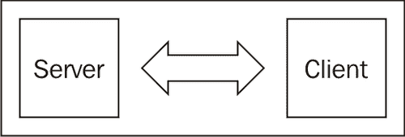
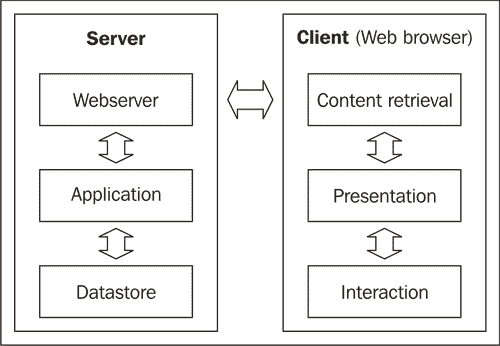
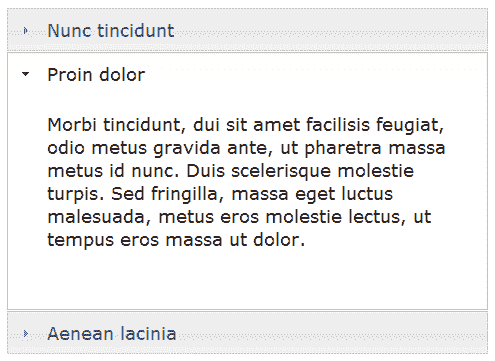
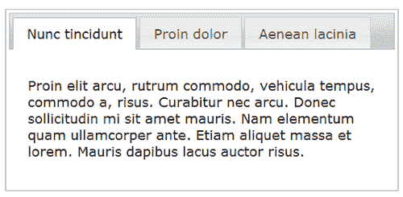
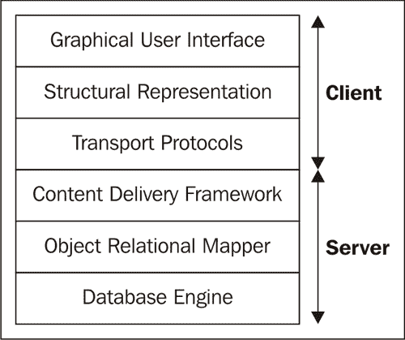
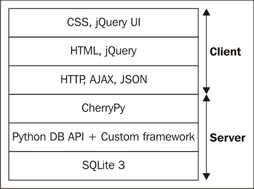

# 第一章. 选择你的工具

> 在本章中，我们将探讨设计 Web 应用程序的许多方面。目的是为你提供一个概述，这可能有助于你在后续章节中识别组件，并对你了解用于决定使用哪个工具或库的论据有所启发。
> 
> 此外，由于本书不仅涵盖开发示例应用程序，我们还展示了在设计不直接涉及编码的应用程序时相关的一些问题，如安全或可用性。

在本章中，我们将：

+   识别构成 Web 应用程序的组件

+   选择合适的工具

+   考虑到为可维护性和可用性设计意味着什么

有很多内容需要覆盖，所以让我们开始吧。

# 识别 Web 应用程序的组件

一个 Web 应用程序不是一个单一的对象。在设计这样的应用程序时，如果你将应用程序视为一系列相关对象，每个对象都有其明确的目的，这可能会帮助你集中注意力。这可以通过多个级别的细节来完成，甚至从高空俯瞰也可能已经提供了一些有价值的见解。

# 采取行动，了解 Web 应用程序概述

从以下图片中可以看出，Web 应用程序不是一个单一的事物。它由位于服务器上的部分和运行在用户计算机上的部分组成。这两部分同样重要；尽管服务器可能持有应用程序数据并实现根据用户请求修改数据的逻辑，但数据是由运行在客户端计算机浏览器上的 Web 应用程序部分显示的，用户通过与浏览器中的用户界面组件交互来表示其请求，例如，通过点击“确定”按钮。

+   思考你的应用程序，并考虑服务器端和客户端。查看单个部分的优势在于我们可能会做出对特定部分最优的选择。

+   查看客户端的一般要求。例如，因为我们希望为用户提供一个复杂的用户界面，所以我们选择了 jQuery UI 库。这个决定并没有触及到服务器端的整体设计决策，因为除了提供 jQuery UI 库所包含的文件外，用户界面库的选择对数据库引擎或服务器操作系统的选择等没有影响。

+   查看服务器端的要求。例如，考虑使用哪种实现语言。我们选择 Python 作为实现服务器端代码的语言，但如果我们有充分的理由切换到 C#，我们可以在不改变客户端任何内容的情况下做到这一点。

如果我们进一步观察我们的网络应用，会出现许多相互作用的层，每一层都封装了明确的功能部分。每当两层接触时，信息都会通过一个定义良好的接口（API）流动。这有助于概念上的分离（我们的应用只与数据库层通信以存储和检索持久数据，并且只与网络服务器通信以在请求时返回数据），但在实践中，这些层之间的分离在所有情况下并不总是完全清晰。例如，我们应用的客户端部分实际上是网络服务器的一个组成部分。

这个网络应用的基本架构图几乎与常规的客户端-服务器架构完全相同。然而，当我们更仔细地观察客户端的实现以及客户端与服务器之间的交互时，我们会发现一些差异，正如我们将在下一节中更近距离观察到的。

## 发生了什么？

在确定了应用的两部分之后，我们现在可以更深入地观察每一部分。

这将使我们能够获得更详细的图像，这将帮助我们就构成我们应用的小组件做出明智的决定。

主要组件很容易识别：

+   数据存储在服务器上保存数据（通常是一个数据库引擎，有时只是文件系统上的文件）。

+   服务器端应用处理从网络服务器传递过来的请求。

+   网络服务器将这些响应再次转发给客户端，并且可能还会提供静态文件。

网络浏览器负责运行应用的客户端部分，但在浏览器内部，我们可以识别出几个活动层。这些包括：

+   获取内容以结构化数据（通常是 HTML 文件）

+   运行 JavaScript 代码以增强数据的展示效果

+   允许与用户交互

当然，我们可以进一步放大以揭示更多细节，比如客户端和服务器上的操作系统，甚至硬件和网络组件，尽管偶尔有用，但通常会过度。在主要组件明确识别后，我们可以采取下一步，选择合适的工具来实现这些组件。

# 选择合适的工具

如果你想要开发高质量的应用，你需要合适的工具。当然，工具并不能保证质量，但它们可以使生活变得更加容易。在开发网络应用时，你需要考虑两种类型的工具：用于设计、构建、测试和部署应用的工具，如编辑器、版本管理系统、测试框架，可能还有打包工具，以及将应用交付给最终用户的工具。最后一组工具包括从服务器操作系统、网络服务器、数据库引擎，一直到网络浏览器和用于显示和与应用交互的 JavaScript 库的整个组件链。

当我们开始一个项目时，我们必须知道我们需要哪些工具，并理解这些工具众多变体的功能和限制。例如，有相当多的 JavaScript 库可以用来提供跨浏览器的用户交互兼容性。

关键在于做出明智的选择。这些选择不一定局限于开源工具。如果预算允许，利用许多商业开发工具和库提供的特殊功能可能是有益的，但在这本书中，我们限制自己使用开源和/或免费资源。这在小型项目中是有意义的，因为工具和许可证的成本可能会在预算中造成重大缺口。

在部署环境中，可能不存在使用免费工具的机会。你很可能在自己的 Linux 服务器上开发应用程序，但测试和部署它却在 Windows 服务器上。后者需要许可证，而这不会是免费的，即使是开源选项也不总是免费的。如今，许多公司转向将他们的应用程序部署到云端，尽管这些机器可能运行的是开源操作系统，但你不仅需要为 CPU 功率和带宽付费，还需要为支持付费，这在应用程序运行不正常时会损失金钱。然而，使用开源工具通常能给你提供更广泛的选择，因为许多工具在任何平台上都能运行得同样好。

在接下来的章节中，我们将探讨构成工具链的许多组件，并尝试展示在本书开发应用程序时使用的论据，以及（如果有的话）有哪些可行的替代方案。请注意，有些论据相当主观，最终做出的选择并不一定意味着替代方案不好；我们当然不是试图就哪个工具更好而引发争论。我们只是按照我们的看法列出应用程序开发的要求，并尝试找到适合任务的工具。在某些情况下，另一个工具可能更好，但为了这本书，我们试图找到可以用于所有示例应用程序的匹配的工具集，这些工具是免费的（就像啤酒一样），并且易于学习和使用。

# 选择交付框架的时间，也称为 Web 服务器

在本章的第一节中，我们展示了 Web 应用程序同时存在于两个领域，即在服务器和客户端。为了向客户端提供信息并接收相应的响应，我们的 Web 应用程序需要在服务器上具备两个重要元素：一个交付框架和一个用于组合内容并响应请求的应用程序。

交付框架可能是一个功能齐全的通用 Web 服务器，如 Apache 或 Microsoft Information Server，尽管这些服务器非常灵活，提供了许多选项来调整 Web 服务器以满足您的特定需求，但它们确实需要相当长的时间来熟悉，并且需要额外的关注来将这些服务器与您应用程序的动态内容集成。如果性能至关重要或您的项目要求您的应用程序必须作为这些服务器的一部分部署，您可能别无选择，但否则，值得考虑使用更简单或提供集成优势的替代方案。

那么，我们需要什么？

+   一个相当轻量级的 Web 服务器，易于配置和维护

+   这使得静态和动态内容的平滑集成成为可能

+   它附带可重用组件，简化了开发过程

+   它是积极维护和开发的

考虑到这些要求，我们选择的交付框架是 CherryPy。

## 刚才发生了什么？

CherryPy 非常适合。其主要优势包括：

+   CherryPy 是用 Python 编写的，提供动态内容的组件作为与 CherryPy 核心紧密集成的 Python 类编写。

+   CherryPy 附带了一系列**工具**；可重用的组件，可用于实现从自定义错误页面到会话管理的一切。

+   CherryPy 作为更大 TurboGears 网络的核心 Web 服务器，有着可靠的记录。

+   最后，CherryPy 正在积极开发中，并拥有庞大的用户群体。

使用 Python 编写的缺点是性能可能不是最佳，但我们在下一节中会探讨这个问题。

# 选择服务器端脚本语言的时间到了

在开发 Web 应用程序时，您几乎可以选择使用任何编程语言，因此我们必须考虑我们项目中的重要因素，并在必要时做出权衡。

+   考虑到开发时间与性能相比的重要性。如果 CPU 资源稀缺或您不想以可读的格式分发源代码，可以使用 C#或 C++等编译型语言。但当开发时间非常宝贵时，使用脚本语言通常可以节省时间，因为它们使得以增量方式开发应用程序变得更容易，甚至可以交互式地输入命令以查看可能的结果，并将这些试验后来整合到代码中。

    性能通常不是问题，尤其是在使用编译成中间字节码的脚本语言时，例如 Python 和 Perl 等语言。虽然脚本语言每次运行时都会被编译，但当程序是一个长期运行的 Web 应用时，这种影响微乎其微。

+   考虑调试的重要性。解释型语言通常比编译型语言更容易调试，因为调试器可以访问更多可能交互式探索的信息，如果出现问题，并且你可以通过交互式调用函数来尝试你编写的任何模块，以查看会发生什么。

+   超越项目本身。一旦实施并部署，你的应用程序可能会拥有漫长而快乐的生命，但这不可避免地意味着会有对较小或较大更改的请求，选择合适的语言可以帮助减少维护工作量。与通常具有相当低级指令和语言结构的编译型语言相比，解释型语言具有（非常）高级的结构，这使得代码紧凑，能在少量语句中包含大量意义。这不仅更容易阅读，而且也更快地被解释，最终这些高级结构一旦被解释，将以（几乎）编译的速度运行，使得性能差异有时难以察觉。更多的意义和更少的代码确实使得阅读更容易，这在维护代码时是一个巨大的好处。

最后，选择用于实现 Web 应用程序的语言至少部分是一个口味问题，但在这本书中，我们选择 Python，因为它在考虑不同因素之间提供了最佳权衡。

## 刚才发生了什么？

现在我们已经选择了 Python 作为我们的服务器端脚本语言，让我们好好看看这些论点：

+   Python 易于阅读，因此易于学习和维护。尽管 Python 在许多地方将空白视为有意义的，这在编程语言中相对独特，但这确实大大增强了可读性。

+   Python 是一种非常高级的语言，包含了诸如列表推导和函数式编程等概念。这允许编写紧凑的程序，在少量代码中包含大量功能，增强了可读性并减少了维护工作量。

+   Python“自带电池”。Python 附带大量精心设计和维护良好的库（模块），提供从访问`.csv`文件和解析 XML 到使用少量代码构建 HTTP 服务器的功能，这些模块至少与语言本身一样有良好的文档。这意味着我们可以减少开发时间，因为在许多情况下，我们不必自己重新发明轮子。

+   Python 有许多第三方模块。即使某个模块没有包含在发行版中，也有可能有人已经编写了你正在寻找的模块。

+   Python 是一种面向对象的语言。这通常被认为是一件好事，因为它有助于数据抽象，但它对开发数据库驱动应用程序的人们的吸引力主要在于它允许以自然的方式将表映射到类型（类）。汽车表中的记录可以映射到‘Car’类，然后可以像处理字符串或列表等本地类一样操作这个类的实例。这又使得阅读代码和因此维护代码变得更加容易。

+   Python 可在许多云平台上使用。要在服务器上运行 Python 程序，你需要在那个服务器上部署 Python。如果你有完全的访问权限，这可能不是问题，实际上，托管公司提供（虚拟）机器，这些机器已经安装了 Python，但对于像 Google Gears 这样的非常轻量级的云平台，你的可用语言选择可能有限。然而，Python（与 Java 一起）在 Google Gears 中得到完全支持，尽管这并不是本书中示例应用程序的考虑因素，但它可能对你的应用程序是。

本书使用的 Python 版本是 3 版（写作时为 3.2 版）。尽管并非所有第三方模块都已（尚未）移植到这个新版本，但如果你想要以未来证明的方式开发，这是最好的版本。

### 注意

目前 Python 的多线程能力并不允许最优地使用多核处理器。大多数 Python 的实现并不允许真正并行地运行独立的线程。然而，这远没有你想象的那么糟糕，因为这个限制主要适用于解释型 Python 代码，并不一定适用于在例如操作系统内核中运行的代码。而且，由于在 Web 服务器中，大量时间被花费在等待网络上的数据包发送或接收，这通常不会影响你的 Python 代码的性能。在将来，Python 的多线程实现可能会改变，但这是一个激烈争论的话题。更多关于这个话题的信息可以通过搜索“Python 3 GIL”来找到。

# 选择数据库引擎的时间

任何 Web 应用程序的关键要求之一是它必须能够访问某种形式的持久存储。这可能用于存储核心数据，如汽车零部件目录，但密码文件也需要某种形式的持久存储。

通常，在文件系统中存储信息是可能的，实际上，我们在这本书中开发的一些应用程序就是这样做的，但如果你有大量的结构化数据或者你发现很多人同时想要访问这些数据，通常将数据存储在数据库中并通过数据库引擎访问这些数据是一个更好的选择。

当选择数据库引擎时，你应该考虑以下因素：

+   它是否提供了您需要的功能？数据库引擎是复杂的软件组件，通常提供很多功能，通常比您需要的还要多。虽然这听起来可能是一个优点，但所有这些功能都必须由开发者学习才能利用它们，并且可能会使您的代码复杂化，从而增加维护应用程序的努力。

+   它是否易于安装和维护？数据库引擎通常作为独立的应用程序运行，通过网络进行访问。这意味着它们必须单独安装、测试和维护。这可能会显著增加部署应用程序所需的努力。而且，安装甚至不是全部；您还必须考虑运营问题，例如，设置合适的备份方案需要多少努力，或者如何监控数据库的可用性。

+   它是否提供了一个易于从您选择的编程语言使用的 API，并且这个 API 是否提供了访问所有必要功能的能力？

+   最后，它是否足够高效，能够迅速响应当前应用程序的需求，即使在高峰期也是如此？

Python 提供了一个标准化的 API 来访问许多可用的数据库引擎，包括 MySQL 和 PostgreSQL。完全符合其“内置电池”的哲学，Python 还内置了一个数据库引擎和一个模块来访问它。这个数据库被称为 SQLite，是一种所谓的嵌入式数据库：它不是作为一个可以通过某种进程间通信方式访问的独立进程运行，而是作为使用它的程序的组成部分。它的唯一外部部分是包含数据库本身数据的单个文件，并且可能被包含 SQLite 引擎的其他程序共享。由于它符合我们的要求，SQLite 将成为我们在本书中开发的应用程序所使用的数据库引擎。

## 刚才发生了什么？

我们选择 SQLite 作为许多应用程序的数据库是很容易得到解释的：

+   虽然它不像 MySQL 那样功能丰富，但它确实提供了我们需要的功能。

+   由于 SQLite 随 Python 一起提供，安装实际上是一个不费脑力的过程。

+   `sqlite3`模块提供的 API 可以访问所有功能。

+   它的性能足以满足我们的需求（尽管在事先很难做出关于性能的声明）。

支持在我们的应用程序中使用 SQLite 的主要论据不是它的速度、小内存占用或可靠性（尽管这些当然不是缺点，因为 SQLite 作为移动电话设备的数据库引擎的选择证明了这一点），而是因为它嵌入到你的程序中，从而消除了需要单独配置和维护数据库引擎的需求。这大大减少了维护工作，因为数据库引擎是需求苛刻的生物，需要大量的照顾和喂养。此外，因为它包含在 Python 中，所以在部署应用程序时减少了外部依赖的数量。

最后一个论据是它的类型系统与 Python 的类型系统非常相似；与许多其他数据库引擎相比，SQLite 允许你在列中存储任何值，无论在创建该列时如何对其进行类型化，就像你可以在最初用于存储整数值的 Python 变量中存储字符串一样。这种类型之间的紧密对应关系使得将 Python 值直观地映射到数据库中存储的值成为可能，这是我们将在遇到第一个使用 SQLite 的应用程序时密切研究的优势。

### 小贴士

Python 的集成非常紧密，以至于可以在用于查询 SQLite 的 SQL 表达式中使用 Python 函数。与其它数据库引擎相比，SQLite 的原生函数集相当小，但使用 Python 函数的能力完全消除了这一限制。例如，添加来自 Python 的 `hashlib` 模块的哈希函数非常简单，这在实现密码数据库时非常方便。

# 行动时间：决定对象关系映射器

关系型数据库引擎，如 SQLite，使用由行和列组成的表作为它们的主要数据抽象模型。面向对象的语言，如 Python，定义类以实例化具有属性的对象。这些概念之间存在相当多的对应关系，因为类定义模仿表定义，其中具有属性的实例对象与具有列的记录相关联，但维护这种关系的完整性并不那么简单。

问题不仅在于定义表和类的不同语言。关系型数据库中的主要问题是维护引用完整性。例如，如果你有一个表示汽车零件的记录，它引用了另一个表示汽车类型的记录，那么关系型数据库允许你定义在例如汽车类型记录被删除时执行显式操作的明确操作。当然，这些约束也可以在 Python 数据结构中实现，但这需要付出相当大的努力。

最后，大多数数据库引擎要求每个列都有固定的数据类型，而 Python 变量和属性可以引用任何类型的数据。这种限制在 SQLite 中不存在，但即使是 SQLite 也无法在不进行转换的情况下存储一切。例如，一个 Python 变量可能引用一个对象列表，这是无法存储在关系数据库的单个列中的。

尽管如此，我们非常希望有一种方法可以存储对象实例在关系数据库中，或者至少存储这些对象实例中的数据，并且有定义类与表之间关系的方式，以便进行维护。为此，许多人已经设计了以对象关系映射器形式存在的解决方案。对于 Python 来说，存在许多既成熟又健壮的工具（如 SQLAlchemy）。

在决定使用哪个工具时，你应该至少考虑以下因素：

+   学习使用它将花费多少时间。这些工具通常非常灵活，而且通常需要相当多的努力来学习。

+   它将如何影响开发和维护？复杂的工具可能有助于解决创建一个有效的和高效的类与表之间的映射的挑战，但可能需要一种会削弱你对实现清晰概述的成语。如果你的数据模型由许多类组成，并且性能是一个重要的考虑因素，那么这可能是值得的，但对于较小的项目来说，增加的复杂性可能会在显著影响开发时间时成为一个很大的缺点。

因为这本书的重点在于理解实现 Web 应用程序和持久存储的选择，使用像对象关系映射器这样的复杂工具可能会隐藏所有必要的方面，这些方面对于获得理解是必要的。

因此，我们不会在本书的示例中使用第三方对象关系映射器，而是在每一章中实现越来越通用的存储解决方案，在遇到具体要求时解决它们。我们将看到，在许多情况下，对象关系映射器是多余的，但在最后几章中，我们将自己构建一个简单的框架，不仅提供一个工具，而且还能深入了解将复杂的类集合映射到数据库表中的复杂性。

# 选择演示框架的行动时间

Web 应用程序可能完全关于在 Web 浏览器中访问和操作数据，但应用程序的外观和感觉对用户来说同样重要。一个非直观、反应迟缓或在某些主流浏览器上无法工作的用户界面不会鼓励用户再次使用你的应用程序。

HTML，这种常用于显示内容的标记语言，确实允许通过使用`<form>`元素以及使用层叠样式表来呈现页面样式，但它的使用有一些主要的缺点：

+   从基本构建块创建类似于常用应用程序的用户界面组件相当困难。

+   使用 HTML 感觉迟缓，因为每个表单在提交时都会获取一个全新的页面。

幸运的是，所有主流浏览器都支持 JavaScript，并且可以使用该语言添加全新的交互级别。然而，为了消除浏览器之间所有不一致性，当您使用一个处理这些不一致性并添加跨浏览器兼容的用户界面组件（控件）的 JavaScript 库时，您可以节省大量的开发时间。

虽然这些库在客户端使用，但 HTML 页面可以以这种方式组成，指示浏览器从中央源获取这些库，例如，为 Web 应用程序提供服务的同一服务器。这样，使用这些库对浏览器没有额外的要求。

选择合适的库时需要考虑的一些要点是：

+   它真的具有跨浏览器兼容性吗？并非所有库都支持每个浏览器。如果您的应用程序仍然需要与相当旧的浏览器一起工作，这可能会很重要。

+   它是否提供了您需要的图形组件和功能？

+   它是否设计良好、文档齐全、可扩展且实施一致？毕竟，这样的库应该相对容易学习，而且没有任何库可以提供一切，可扩展性以及扩展它的难易程度都是重要的考虑因素。

+   它是否拥有活跃的用户社区？在这里这一点尤为重要，因为这样的社区不仅可能回答您的问题，还可能是一个可重用组件的良好来源。

基于这些考虑，我们选择使用两个紧密相连的 JavaScript 库：jQuery 和 jQuery UI。

## 刚才发生了什么？

让我们来看看为什么 jQuery 和 jQuery UI 是如此好的选择。

jQuery 提供了在页面上选择和操作 HTML 元素的功能，而 jQuery UI 提供了一系列复杂的控件和效果。共同使用，它们提供了许多优势：

+   jQuery 不仅隐藏了浏览器的不一致性，而且其方法在即使不支持 CSS3 样式的浏览器上也使用 CSS3 兼容的选择器。

+   这两个库都得到了广泛的使用，积极维护，免费，并且以小型文件的形式分发。后者很重要，因为您需要考虑这些文件需要从服务器传输到客户端，所以任何节省的带宽都是好的。

+   jQuery UI 提供了一套设计精良、外观专业的图形组件和效果。

这些库广泛采用的其他优点包括，有许多资源可以帮助你入门，以及许多人编写了插件来进一步扩展这些库的可用性。正如我们将在许多场合看到的那样，高效开发良好应用程序的本质通常就是选择适合这项工作的正确插件。

# 设计以维护性和可用性为导向

想出如何实现某些 Web 应用程序的伟大想法是一回事，但以使其易于维护和使用的方式设计应用程序则是另一回事。考虑到这些因素进行设计，将使专业应用程序和一般应用程序之间产生巨大的差异。

## 测试

每个人都会同意在部署应用程序之前对其进行测试是有意义的，但彻底的测试需要一些严肃的努力。测试通常被认为很无聊，甚至可能分散对“真正”开发工作的注意力，这与编写文档有着相似的气息。

然而，测试能让你更好地了解你交付的应用程序的质量，而无论测试框架多么简单，总比没有要好，尤其是在我们这本书中探讨的小到中等规模的 Web 应用程序中，因为这些应用程序往往由非常小的团队快速原型设计，并且随着洞察力的进步和客户需求的变化，经常更改代码。拥有一个测试套件可以确保至少代码中不改变的部分能够按预期执行。

当然，不是所有东西都可以测试，测试你代码一部分所需的工具应该易于使用，否则就没有继续使用它们的动力。我们将查看我们开发的 Python 模块中的**单元测试**。单元测试是一种尝试定义独立代码片段（例如，单个方法）的行为，并检查此代码是否产生预期结果的方法。如果代码的实现发生变化，但测试仍然没有显示失败，我们知道新的实现可以安全使用。

# 选择测试框架的行动时间

在选择测试框架时，请自问以下问题：

+   我想测试什么？你不能测试一切，开发测试需要时间。

+   编写和维护测试有多容易？这个问题对于开发测试和一般代码开发同样相关。

+   执行测试需要多少努力？如果测试容易自动化，它们可以作为额外的检查作为部署的一部分运行。

仅就 Python 而言，就有相当多的测试框架可用，但我们将选择与 Python 一起分发的`unittest`模块。请注意，尽管我们选择只为应用程序的 Python 部分编写自动化测试，但这并不意味着我们没有测试 JavaScript 部分，但用户交互往往不太适合自动化测试，所以我们在这本书中不涉及这一点。

## 刚才发生了什么？

对于 Python 单元测试，我们限制自己使用与 Python 一起分发的`unittest`模块，因为这不会引入任何对外部工具的新依赖，而且也因为：

+   它的学习和使用相对简单。

+   如果测试失败，它会产生清晰的错误信息。

+   它易于自动化，并且可以轻松集成，例如，与设置脚本集成。

## 版本管理

版本管理工具通常不是网络应用程序的一部分，也不是开发网络应用程序的严格要求。然而，当你想要跟踪代码的变化，尤其是当文件数量持续增长时，版本管理工具是无价的。

大多数版本控制工具都集成了显示版本差异的功能，并且所有工具都有注释版本或修订的功能，以便清晰地标记它们。广泛使用的开源解决方案包括 **git** 和 **svn**。

它们都可以作为服务器运行，并通过网页浏览器访问，但同时也提供了命令行工具，而 svn 甚至还在 Windows 文件资源管理器中提供了非常用户友好的集成。它们各有优缺点，很难明确地说出哪个是赢家。这本书及其伴随的示例都是使用 svn 维护的，主要是因为 Windows 客户端的使用简便性。

## 可用性

网络应用程序是为最终用户构建的，而不是为开发者。设计一个易于使用的界面并不总是容易。实际上，设计真正优秀的界面是困难的，需要相当多的技能和知识。然而，这并不意味着没有一些可以帮你避免可用性灾难的经验法则。我们将在以下章节中探讨一些这些法则。

### 符合常见 GUI 范式的美观设计

如果界面组件已经熟悉，应用程序的使用就会更加容易。因此，通常查看那些成功并被许多人使用的应用程序是个好主意。

在许多应用程序中，一个常见的担忧是需要在小空间内展示大量信息。因此，许多现代应用程序使用手风琴菜单和/或标签页界面来组织数据，如下面的截图所示：

手风琴菜单非常适合在侧边栏中显示大量信息，但还可以通过标签页展示更多信息：

在常见的办公生产力软件、网络浏览器和 CRM 应用程序的最新版本中都可以找到这些例子。仔细查看你喜欢的应用程序可能是一个好的开始。在这本书中开发的大型应用程序中，我们肯定会参考一些可能作为灵感的键应用程序。

### 可定制的

选择一个一致且令人愉悦的色彩方案和字体可以使应用程序更加协调，因此使用起来更加愉悦。信息过载可能会让人感到困惑，而使用混乱的色彩方案或多种不同的字体也不会有助于对展示的数据有一个全面的了解。

但是，无论你的用户界面是否支持易于更改的主题概念，这在其他领域也起着重要作用。你可能希望你的 Web 应用程序能够很好地融入你的网站的其他部分，或者传达某种公司或品牌身份。使用一致的色彩方案会有所帮助。甚至可能希望向最终用户提供主题选择，例如，为视力受损的人提供高对比度主题以改善可读性。该库完全支持主题的使用，并使得将这种可定制性扩展到我们自行设计的 widget 变得简单。

### 跨浏览器兼容

Web 应用程序通常针对特定的受众，因此，可能只有单一浏览器被指定为需求，但通常，我们不希望拒绝用户使用他们/她们的 favorite 浏览器。jQuery 消除了支持多个浏览器的大部分痛苦。我们的应用程序是为 Internet Explorer 8、Firefox 3.x 和 Google Chrome 设计的，但可能也会在大多数其他浏览器上运行。请注意，“可能”可能不够好，并且始终在所需平台上具体测试你的应用程序是一个好主意！

### 跨平台兼容

在客户端，Web 浏览器是我们需要关注的链中的关键组件，因此，它所运行的操作系统很可能不会成为问题来源。

在服务器端，我们也希望保持我们的选择开放。幸运的是，Python 是一个跨平台解决方案，因此，任何在 Windows 上运行的 Python 程序通常也可以在 GNU/Linux 上运行，反之亦然。

然而，当我们使用不随 Python 一起分发且不是纯 Python 的模块时，我们应该小心。这些模块可能在每个平台上都可用，但最好事先进行检查。本书中的应用程序仅使用标准 Python 分发中的模块，除了 CherryPy，它是一个纯 Python 模块，应该能在每个平台上运行。

## 可维护性

编写代码是一项艰苦的工作，维护它可能更加困难。我们之前在讨论测试框架的使用时简要提到了这个问题，但维护代码不仅仅是能够测试它。

### 遵循标准

创建易于维护的代码的一个重要概念是遵循标准。遵循标准意味着其他人有更大的机会理解你的代码。

例如，SQL 是一种大多数数据库引擎都理解的查询语言。因此，对于维护代码的人来说，我们使用哪种引擎不太相关，因为他们不必学习一种晦涩的查询语言。

另一个例子是客户端和服务器之间的通信。我们可以自己设计协议，在 JavaScript 中构建请求，并在 Python 中响应这些请求，但使用像 AJAX 这样的文档化标准来通信以及 JSON 来编码数据要少出错得多。这也节省了文档，因为人们可以参考任何数量的书籍，如果他们想了解更多关于这些标准的信息。

### 注意

标准并不一定意味着“由某个独立组织批准”。许多标准是非正式的，但它们因为每个人都使用并撰写它们而工作。AJAX 和 JSON 就是这样的例子。此外，Python 编程语言是一个事实上的标准，而 JavaScript 享有正式标准（这并不意味着所有实现都遵循标准）。

## 安全性

安全性通常被认为是一个晦涩或神秘的主题，但安全性涵盖了众多实际的问题，这些问题甚至在最小的 Web 应用中也发挥着作用。我们不想任何人访问付费的 Web 应用，例如。然而，安全性不仅仅是访问控制，我们将在下一节简要介绍一些安全性的方面。

### 可靠的

Web 应用在使用上应该是可靠的。没有什么比在填写抵押贷款申请过程中遇到服务器端错误更令人烦恼的了。作为开发人员和测试人员，你应该彻底测试软件，希望捕捉到任何错误，但在实施应用之前，应该考虑软件及其使用的库的可靠性。

你应该特别小心在生产软件中使用某个库的最新和最酷的功能。当快速制作一些原型或概念应用时，这可能会很有趣，但请问问自己，你的客户是否真的需要这个前沿功能，他们是否不如使用经过验证和测试的版本更好。

许多开源项目（包括 Python）开发和维护所谓的稳定分支和开发分支，以展示新功能。你应该在生产应用中使用前者，而后者应该在别处尝试。

### 强健的

应用程序不仅应该尽可能无错误，而且在压力下也应该表现良好。在负载下，性能应该尽可能高，但同样重要的是，你应该知道当负载达到某个阈值时，你期待的是什么。

不幸的是，性能调优是想象中最棘手的工作之一，因为链中的所有组件都可能发挥作用。服务器端考虑的是使用的数据库引擎的性能、脚本语言和 Web 服务器。

在客户端，展示框架的质量和 Web 浏览器的整体性能很重要，而在服务器和客户端之间是底层网络特性的未知领域。

由于有这么多变量，提前设计一个最优解并不容易。然而，我们可以测试单个组件的性能，看看该组件是否是瓶颈。例如，如果刷新一个由 Web 应用提供的页面需要三秒钟，如果你可以独立计时数据库访问，那么你可以排除数据库引擎作为瓶颈。在创建单元测试时获得的知识可以在这里重用，因为我们已经知道如何隔离某些功能，添加一个计时器并断言查询的响应足够快可以成为一个测试本身。

使用像 Firebug 这样的工具单独测量获取 Web 组件所需的时间和在浏览器中渲染它的时间是完全可行的，并可以了解客户端或服务器是否是瓶颈。（Firebug 是 Firefox 的一个扩展，可以在[`getfirebug.com/`](http://getfirebug.com/)找到）。

### 访问控制和身份验证

在本书中我们开发的几乎每个应用中，我们都实现了一些形式的身份验证方案。大多数时候，我们将使用简单的用户名/密码组合来验证用户是否是他/她声称的人。一旦用户经过验证，我们就可以决定只提供某些信息，例如，只提供他/她所属的任务列表，而不提供任何其他用户的任务。

然而，是否允许访问信息并不总是那么基本。即使在简单的应用中，也可能存在一些用户应该比其他人有更多的权限，例如添加新用户或重置密码。如果用户被允许执行的不同事情的数量很少，这很容易实现，但如果情况更复杂，那么实现起来就不那么容易，更不用说维护了。

因此，在本书的后续章节中介绍的更复杂的应用中，我们将采用基于角色的访问控制的概念。其思想是定义角色，描述在承担某个角色时允许执行哪些操作。例如，在客户关系管理应用中，可能有三个角色：销售人员，他只能访问其客户的资料；销售经理，可以访问所有信息；管理员，可能无法访问任何信息，但允许备份和恢复信息，例如。

一旦这些角色的权限明确，我们就可以将这些角色中的任何一个或所有与特定人员关联。例如，一个小的组织可能有一个技术熟练的销售人员，他也可以承担管理员角色，但仍然无法以这种方式访问除他自己的客户以外的任何客户信息。

如果与某个角色关联的权限发生变化，我们不必为可能承担该角色的每个人重复此信息，从而使管理变得更加简单。

### 保密性

在某些应用程序中，我们可能想确保没有人正在监听浏览器和 Web 服务器之间传输的数据。毕竟，通常你不知道你的数据走的是哪条路，因为它通过互联网路由，在任何时候都可能有人可以拦截你的数据。

确保机密性的最简单方法是使用连接级加密，HTTPS 协议正是这样做的。我们使用的 Web 服务器 CherryPy 当然能够通过 HTTPS 提供服务，配置它这样做相当简单，但它涉及到创建签名证书，这超出了这本书的范围。有关更多信息，请参阅[`www.cherrypy.org/wiki/ServerObject`](http://www.cherrypy.org/wiki/ServerObject)。

### 完整性

在这个背景下，我们讨论的最后一个安全方面是数据完整性。数据的损坏可能并不总是可以防止的，但通过适当的备份和恢复协议，可以防止大规模的破坏。

然而，数据损坏也潜伏在非常小的角落里。最棘手的事情之一是插入错误数据的可能性。例如，如果可以输入月份范围在 1-12 之外的日期，如果应用程序在其他地方依赖于日期具有正确的格式，那么可能会发生非常奇怪的事情。

因此，通过在客户端构建某种形式的验证来防止用户输入错误数据是很重要的。一个很好的例子是 jQuery UI 的`datepicker`小部件，我们将在第三章中遇到，*任务列表 I：持久性*。如果一个文本输入字段被`datepicker`装饰，用户只能通过选择`datepicker`中的日期来输入日期。这对最终用户来说是一个很大的帮助，但我们永远不应该依赖于客户端验证，因为我们的客户端验证可能不足（因为它包含错误或没有检查所有情况），而且绝对不能防止恶意用户连接到服务器并主动插入错误数据。我们确实需要服务器端输入验证来防止这种情况，我们将在其中遇到一些例子。

关键在于提供两个方面：作为最后手段的服务器端验证和作为用户辅助的客户端验证。

### 关于安全的最后一点

安全性是复杂且棘手的，细节很容易被忽视。你可能知道你有一扇由 10 厘米橡木制成的门，配有最先进的钢锁，但如果你忘记锁上后门，所有这些橡木和钢都没有作用。在这本书提到的所有主题中，安全是你应该总是与专家讨论的一个主题。即使是专家也不能给你保证，但重新审视安全需求可能会让你避免麻烦。确保你在安全的环境中运行这本书提供的示例应用程序，并有一个管理良好的防火墙。

## 帮助，我感到困惑！

阅读本章后，你可能会有这样的感觉：即使使用正确的工具，开发 Web 应用也是极其复杂的！可能有那么多因素在起作用！不过，不要气馁。

# 行动时间：保持概览

如果你仔细观察，你会发现这并不是什么火箭科学，最多只需要常识和对细节的关注，在每一章中，我们都会用直接的语言突出相关的问题，当它相关时。记住，这是一本实用的书，会有许多详细检查的工作示例，我们不会让你淹没在理论中，而是只给你足够的信息来完成工作。

在开发过程的每一步，都要问自己以下问题？

+   需要做什么？没有必要同时处理所有事情，实际上这是不可能的。首先形成一个高级的想法，然后在下一级识别组件。当大纲还不清晰时，不要被细节所困扰。

+   应用程序涉及哪些组件？在开发某个功能时，确定涉及的具体组件。识别层和组件的整体想法是为了在开发时能够专注于应用程序的有限部分。

    这可能并不总是完美无缺，但它确实有助于保持专注。例如，当开发表示层的一部分时，你可能会发现需要额外的内容，这些内容应由交付层提供。与其立即将注意力转向那个交付层，通常更简单的是定义所需的内容，并完成你正在工作的表示层部分。

+   需求是什么？没有必要实现不需要的功能。这听起来可能很显然，但许多开发者仍然会陷入这个陷阱。当然，设计尽可能灵活的代码很有吸引力，但这需要花费大量时间，而且随着需求的变化，它可能不足以证明足够灵活。相反，更好的做法是编写易于理解的代码，这样在需求不可避免地发生变化时，处理这些变化所需的时间会更少。

## 刚才发生了什么？

当提出这些问题并考虑到本章中我们做出的选择时，绘制一幅新图来展示我们将使用的技术可能会有所帮助：

构成 Web 应用的服务器和客户端的不同组件可以想象成一个分层堆栈。对于每一层，我们都选择了一种或几种技术，如下面的图所示：

我们遇到的每个应用都将基于这个模型，所以如果你觉得你失去了方向，偶尔参考这个图可能会有所帮助。

在阅读这本书之后，你可能会感到编写好的、可用的网络应用程序可能比你最初想象的要复杂一些，但这对即使是规模最小的团队来说也是可以达到的。凭借所有的新知识和实践经验，你甚至不需要在最小的项目中妥协质量。

# 摘要

本章为我们提供了对创建高质量网络应用程序所涉及的组件和技术的概述的先导。具体来说，我们探讨了：

+   构成网络应用程序的组件。

+   我们选择实现这些组件的技术。

+   哪些其他问题在设计过程中发挥作用，比如安全和可用性。

带着这些额外的知识，没有什么可以阻止我们用 Python 编写我们的第一个网络应用程序，这正是我们在下一章将要做的。
