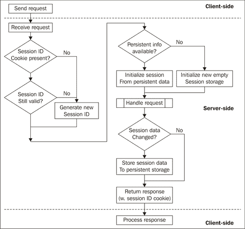
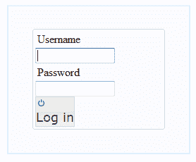
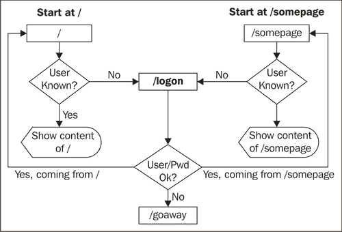
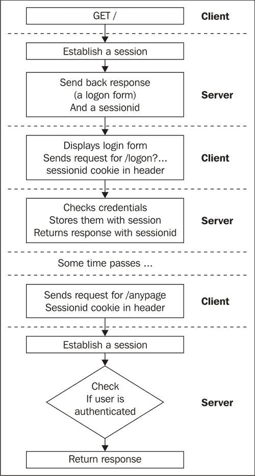
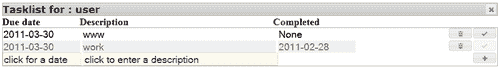
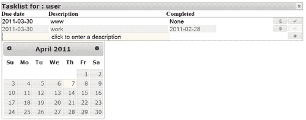
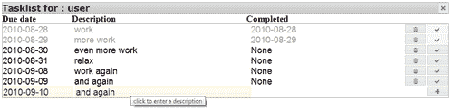
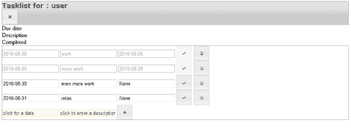
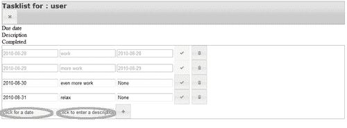
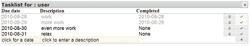

# 第三章。任务列表 I：持久性

> 在上一章中，我们学习了如何向用户传递内容。这些内容包括用于结构化信息的 HTML 标记以及一些 JavaScript 库和代码来创建用户界面。
> 
> 我们注意到这还不是一款完整的网络应用程序；它缺少在服务器上存储信息的功能，也没有识别不同用户或验证他们的方法。在本章中，我们将设计一个简单的任务列表应用程序时解决这两个问题。
> 
> 这个任务列表应用程序将能够为多个用户提供服务，并在服务器上存储每个用户的任务列表。

具体来说，我们将探讨：

+   如何设计任务列表应用程序

+   如何实现登录界面

+   会话是什么以及它是如何使我们能够同时与不同用户一起工作的

+   如何与服务器交互并添加或删除任务

+   如何使用 jQuery UI 的日期选择器小部件使输入日期变得吸引人且简单

+   如何设置按钮元素的样式并提供工具提示和内联标签给输入元素

# 设计任务列表应用程序

设计应用程序应该从对预期的明确想法开始。这不仅是为了确定技术需求，而且同样重要的是，为了定义清晰的边界，这样我们就不至于在那些只是“锦上添花”的事情上浪费时间。如果项目中有剩余时间，锦上添花的功能是可以添加的。

因此，让我们列出我们任务列表应用程序的相关功能清单。其中一些可能看起来很明显，但正如我们将看到的，这些直接影响了我们必须做出的某些实现选择，例如：

+   应用程序将由多个用户使用

+   任务列表应该无限期地存储

+   任务列表可能包含无限数量的任务，但用户界面是为最多 25 个任务左右的最佳性能设计的

+   任务可以添加、删除和标记为完成

尽管这份列表并不详尽，但它有一些重要的含义。

由于任务列表应用程序将由多个用户使用，这意味着我们必须识别和授权想要使用它的人。换句话说，我们需要某种登录界面和一种检查人们是否与某种密码数据库匹配的方法。因为我们不希望用户每次刷新或更改任务列表时都要进行身份验证，所以我们需要一种实现**会话**概念的方法。

网络应用程序使用无状态的 HTTP 协议。这意味着，从服务器的角度来看，每个请求都是一个单独的、无关的事件，并且服务器不会保留任何信息。如果我们想执行一系列相关操作，这显然会给我们带来问题。解决方案是要求网络浏览器在应用程序识别用户后，将一小块信息随每个请求一起发送给应用程序。

这可能通过多种方式实现。服务器可能在其生成的任何网页中的所有链接中添加一个额外的参数，通常称为**会话 ID**，或者使用更通用的**cookie**概念。

一旦服务器要求网页浏览器存储 cookie，这个 cookie 就会随后续对同一网站的每个请求一起发送。cookie 的优势在于，常见的 Web 应用框架（如 CherryPy）已经配备了处理它们的功能，使用 cookie 实现会话比设计应用程序以更改它生成的所有超链接以包含适当的会话 ID 要简单得多。劣势可能在于，人们可能会阻止浏览器存储 cookie，因为一些网站使用它们来跟踪他们的点击行为。

我们优先考虑实现的简单性，并选择使用 cookie。如果用户想要阻止 cookie，这并不是一个大问题，因为大多数浏览器也提供了选择性地允许来自指定网站的 cookie 的选项。

以下图像展示了 CherryPy 如何借助 cookie 管理会话：



这一切始于客户端（网页浏览器）向 CherryPy 发送请求。在收到请求后，首先检查的是网页浏览器是否发送了一个带有会话 ID 的 cookie。如果没有，将生成一个新的会话 ID。此外，如果有一个带有会话 ID 的 cookie，如果这个 ID 不再有效（例如，因为已过期，或者是一个来自非常旧的交互的残留物，且不存在于当前的会话 ID 缓存中），CherryPy 也会生成一个新的会话 ID。

在这个阶段，如果这是一个新的会话，则不会存储任何持久信息，但如果是一个现有的会话，则可能存在可用的持久数据。如果有，CherryPy 会创建一个`Session`对象，并用可用的持久数据初始化它。如果没有，它将创建一个空的`Session`对象。这个对象作为全局变量`cherrypy.session`可用。

CherryPy 的下一步是传递控制权到将处理请求的函数。这个处理程序可以访问`Session`对象，并可能对其进行更改，例如，通过存储额外的信息以供以后重用。（注意，`Session`对象的行为类似于字典，因此您可以使用`cherrypy.session['key']=value`简单地使用键将值关联起来。对键和值的唯一限制是，如果持久存储在磁盘上，它们必须是可序列化的）。

然后在返回处理程序生成的结果之前，CherryPy 会检查`Session`对象是否已更改。如果（并且仅当）它已更改，则将`Session`对象的内容保存到更持久的存储中。

最后，返回响应，并附带一个带有会话 ID 的 cookie。

# 创建登录界面的操作时间

我们的首要任务是创建一个简单的应用程序，它所做的不仅仅是向用户提供登录界面。它将成为我们的任务列表应用程序以及许多其他应用程序的起点。

本例代码以及本书中的大多数其他示例代码均可在 Packt 网站找到。如果您尚未下载，这可能是一个下载的好时机。

将以下代码片段输入并保存到与本章其他文件相同的目录中（第三章中的示例代码）的名为`logonapp.py`的文件中：

**Chapter3/logonapp.py**

```py
import cherrypy
import logon
class Root(object):
logon = logon.Logon(path="/logon",
					authenticated="/",
					not_authenticated="/goaway")
@cherrypy.expose
def index(self):
		username=logon.checkauth('/logon')
		return '''
	<html><body>
	<p>Hello user <b>%s</b></p>
	</body></html>'''%username
@cherrypy.expose
def goaway(self):
		return '''
	<html>
	<body><h1>Not authenticated, please go away.</h1>
	</body></html>'''
@cherrypy.expose def somepage(self):
		username=logon.checkauth('/logon',returntopage=True)
		return '''<html> 
				  <body><h1>This is some page.</h1> 
				  </body> 
				  </html>'''
if __name__ == "__main__":
	import os.path
	current_dir = os.path.dirname(os.path.abspath(__file__))
	cherrypy.quickstart(Root(),config={
			'/': {'tools.sessions.on': True }
			}
			)

```

如果您现在运行`logonapp.py`，一个非常简单的应用程序将在端口 8080 上可用。当访问顶级页面`http://localhost:8080/`时，它会向用户展示登录界面。以下是一个示例：



如果输入了正确的用户名/密码组合，将显示欢迎信息。如果输入了未知用户名或错误的密码，用户将被重定向到`http://localhost:8080/goaway`。

`somepage()`方法（突出显示）返回一个包含（可能）一些有用内容的页面。如果用户尚未认证，将显示登录界面，并在输入正确的凭据后，用户将被引导回`http://localhost:8080/somepage`。

下文展示了登录示例应用程序中的完整网页树以及用户可能选择的可能路径：



### 小贴士

登录 + 会话 ID 与 HTTP 基本认证

### 小贴士

您可能会想知道为什么我们选择不重用 CherryPy 捆绑的`auth_basic`工具，该工具提供基本认证（有关此工具的更多信息，请参阅[`www.cherrypy.org/wiki/BuiltinTools#tools.auth_basic`](http://www.cherrypy.org/wiki/BuiltinTools#tools.auth_basic)）。如果我们只想检查用户是否有权访问单个页面，这将是一个不错的选择。基本认证足以验证用户身份，但没有会话的概念。这意味着我们在处理同一用户的后续请求时，缺乏存储需要访问的数据的方法。我们在这里使用的`sessions`工具确实提供了这项附加功能。

## 刚才发生了什么？

`logonapp.py`的魔法之一是通过在 CherryPy 中启用'sessions'工具实现的。这是通过将`tools.sessions.on`键与值为`True`传递给`quickstart()`函数的配置字典来完成的。

然而，在`logonapp.py`中的大部分艰苦工作实际上是由模块`logon:`完成的

**Chapter3/logon.py**

```py
import cherrypy
import urllib.parse def checkauth(logonurl="/", returntopage=False):
	returnpage=''
if returntopage:
	returnpage='?returnpage='
			+ cherrypy.request.script_name
			+ cherrypy.request.path_info
auth = cherrypy.session.get('authenticated',None)
if auth == None :
	raise cherrypy.HTTPRedirect(logonurl+returnpage)
return auth class Logon:
	base_page = '''
<!DOCTYPE HTML PUBLIC "-//W3C//DTD HTML 4.01//EN"
"http://www.w3.org/TR/html4/strict.dtd">
<html>
<head>
<script type="text/javascript" src="img/jquery.js" ></script>
<script type="text/javascript" src="img/jquery-ui.js" ></script>
<style type="text/css" title="currentStyle">
	@import "/jquerytheme.css";
	@import "/static/css/logon.css";
</style>
</head>
<body id="logonscreen">
<div id="content">
%s
</div>
<script type="text/javascript">$("button").button({icons: {primary: 'ui-icon-power'}})</script>
</body>
</html>
'''
	logon_screen = base_page % '''
<form class="login" action="%s/logon" method="GET">
<fieldset>
<label for="username">Username</label>
<input id="username" type="text" name="username" />
<script type="text/javascript">$("#username").focus()</script>
<label for="password">Password</label>
<input id="password" type="password" name="password" />
<input type="hidden" name="returnpage" value="%s" />
<button type="submit" class="login-button" value="Log in">
Log in
</button>
</fieldset>
</form>
'''
	not_authenticated =
		base_page % '''<h1>Login or password not correct</h1>''' def __init__(self, path="/logon",
					authenticated="/", not_authenticated="/"):
	self.path=path
	self.authenticated=authenticated
	self.not_authenticated=not_authenticated
@staticmethod def checkpass(username,password):
	if username=='user' and password=='secret': return True
	return False
@cherrypy.expose def index(self,returnpage=''): 
	return Logon.logon_screen % (
				self.path,urllib.parse.quote(returnpage))
@cherrypy.expose def logon(self,username,password,returnpage=''):
	returnpage = urllib.parse.unquote(returnpage)
	if Logon.checkpass(username,password):
		cherrypy.session['authenticated']=username
		if returnpage != '':
			raise cherrypy.InternalRedirect(returnpage)
		else:
			raise cherrypy.InternalRedirect(
								self.authenticated)
	raise cherrypy.InternalRedirect(self.not_authenticated)
@cherrypy.expose def logoff(self,logoff):
	cherrypy.lib.sessions.expire()
	cherrypy.session['authenticated']=None
	raise cherrypy.InternalRedirect(self.not_authenticated)

```

登录模块实现了一个实用函数 `checkauth()`（突出显示）。此函数设计为可以从 CherryPy 应用程序的任何位置调用。如果用户已经认证，它将返回用户名；否则，它将重定向用户到应显示登录界面的 URL。如果 `returnpage` 参数为真，则此 URL 将增加一个额外的参数 `returnpage`，包含调用 `checkauth()` 的页面的 URL。登录页面（或者更确切地说，实现它的处理程序）应该设计为在认证成功时将用户重定向到该参数中的 URL。

正如我们所见，`checkauth()` 函数的典型用途是在每个处理需要认证内容的页面调用它。

`checkauth()` 本身只做两件事：首先，它通过连接 `cherrypy.request` 对象中可用的 `script_name` 和 `path_info` 属性来确定要返回的页面（如果需要）。第一个包含 CherryPy 树挂载的路径，最后一个包含该树中的路径。它们共同形成了调用此 `checkauth()` 函数的处理器的完整路径。

`checkauth()` 函数的第二个作用是确定 `cherrypy.session`（一个类似于 Session 对象的字典）是否包含一个 `authenticated` 键。如果包含，则返回关联的值；如果不包含，则重定向到登录页面。

`cherrypy.session` 变量是一个 `cherrypy.lib.sessions.Session` 对象，对每个请求都可用。它像字典一样工作，并且最初它没有任何键。当为第一个新键分配值时，会创建一个与会话 ID 关联的持久对象。在完成请求后，`Session` 对象被存储，其会话 ID 作为响应头中的 `session_id` cookie 的值传递。如果后续请求包含带有 `session_id` cookie 的请求头，则从存储中检索具有相应会话 ID 的 `Session` 对象，使任何保存的键/值对再次可用。

默认的存储方案是将数据保存在内存中。这既快又简单，但缺点是重启 CherryPy 服务器将丢弃这些数据，实际上会过期所有会话。这可能适用于短暂的会话，但如果需要更持久的解决方案，可以将会话信息存储为文件（通过设置 `tools.sessions.storage_type` 配置键为 `"file"`）或者甚至存储到数据库后端。有关会话的更多信息，请参阅 CherryPy 在线文档中的相关内容，网址为 [`cherrypy.org/wiki/CherryPySessions`](http://cherrypy.org/wiki/CherryPySessions)。

会话期间客户端和服务器之间通信的各个步骤在以下插图中有展示：



`logon` 模块的大部分功能由 `Logon` 类提供。它实现了几个方法（这些方法在上一页列出的代码中也被突出显示）：

+   `__init__()` 将初始化一个 `Logon` 实例，以保存此 `Logon` 实例在处理程序树中挂载的路径，以及重定向到成功和失败认证的默认 URL。

+   `checkpass()` 是一个静态函数，它接受一个用户名和一个密码，如果这些是匹配的配对，则返回 `True`。它被设计为可以通过更合适的定义来覆盖。

`Logon` 还向 CherryPy 引擎公开了三个处理程序方法：

+   `index()` 是一个将实际登录屏幕提供给用户的方法

+   当用户点击登录按钮时，`logon()` 会传递用户名和密码

+   `logoff()` 将使会话过期，导致后续对 `checkauth()` 的调用将用户重定向到登录屏幕

`Logon` 类还包含一些类变量，用于保存 `index()` 方法显示的 HTML。让我们详细看看这些方法。

### 注意

那么关于安全性呢？我们在这里设计的 `Logon` 类没有防止人们窃听传输 HTTP 流量的线缆的设施，如果他们有权访问这些线缆。这是因为我们未加密地传输密码。我们可能自己实现某种加密方案，但如果你的设计需要某种保护形式，通过安全的 HTTPS 通道进行通信可能更好、更简单。CherryPy 可以配置为使用 HTTPS 而不是 HTTP。更多相关信息可以在：[`cherrypy.org/wiki/ServerObject`](http://cherrypy.org/wiki/ServerObject) 找到。

## 突击测验会话 ID

1.  如果客户端不断发送新的会话 ID，最终不会填满服务器上的所有存储空间吗？

1.  如果客户端禁用了 cookie，会话 ID 的生成会发生什么？

    a. 服务器将停止生成新的会话 ID，反复返回相同的 ID

    b. 服务器将停止返回新的会话 ID

    c. 服务器将继续生成并返回新的会话 ID

## 提供登录屏幕

`index()` 方法将 HTML 提供给用户，以显示登录屏幕。在其核心，这个 HTML 是一个 `<form>` 元素，包含三个 `<input>` 元素：一个常规文本输入，用户可以输入他的/她的用户名；一个密码输入（将隐藏在此字段中输入的字符）；以及一个具有 `hidden` 属性的 `<input>` 元素。《form》元素有一个 `action` 属性，它包含当用户点击登录按钮时将处理表单变量的脚本的 URL。此 URL 通过将 `/logon` 添加到 `Logon` 实例在 CherryPy 树中挂载的路径来构造，以指向我们的 `Logon` 类的 `logon()` 方法。

我们标记为隐藏的 `<input>` 元素被初始化为保存用户在 `logon()` 成功验证用户时将被重定向到的 URL。

构成登录界面的表单还包含一小段 JavaScript：

```py
$("#username").focus()

```

它使用 jQuery 选择将接收用户名的输入元素，并给它聚焦。通过将光标放在这个字段中，我们节省了用户在输入用户名之前先指向并点击用户名字段的努力。现在他可以立即开始输入。请注意，此代码片段不是放在文档的末尾，而是在`<input>`元素之后，以确保在`<input>`元素定义后立即执行。登录页面如此之小，这可能无关紧要，但在页面加载缓慢的情况下，如果等到整个页面加载完毕才切换焦点，按键可能会被误导向。

### 注意

注意，我们构建的登录表单有一个带有`action="GET"`属性的`<form>`元素。这没问题，但有一个缺点：使用`GET`方法传递的参数会被附加到 URL 上，并可能出现在服务器的日志文件中。这在调试时很方便，但可能不适合生产环境，因为这可能会使密码暴露。不过，可以将`action`属性更改为`POST`，而无需更改处理请求的 Python 代码，因为 CherryPy 会处理这些细节。传递给`POST`方法的参数不会被记录，因此`POST`方法可能更适合密码验证请求。

## 设置会话

`logon()`方法将表单中所有`<input>`元素的值作为参数传递。`username`和`password`参数传递给`checkpass()`方法，如果用户的凭据正确，我们通过将用户名与我们的会话存储中的认证密钥关联来建立会话，即`cherrypy.session['authenticated']=username`。

这将产生这样的效果，即发送到浏览器的每个响应都将包含一个带有会话 ID 的 cookie，并且任何包含此 cookie 的后续对 CherryPy 的请求都将导致该请求的处理程序能够访问相同的会话存储。

在成功认证后，`logon()`会将用户重定向到传递给它的返回页面，如果没有传递，则重定向到`Logon`实例初始化时传递的默认页面。如果认证失败，用户将被重定向到非授权页面。

## 过期会话

提供了`logoff()`方法，以提供主动过期会话的可能性。默认情况下，会话在 60 分钟后过期，但用户可能希望明确注销，无论是为了确保没有人偷偷摸摸地坐在他的键盘后面继续以他的名义操作，还是为了以不同的身份登录。因此，在大多数应用程序中，你都会找到一个独立的注销按钮，通常位于右上角。此按钮（或只是一个链接）必须指向由`logoff()`方法处理的 URL，并且将立即通过删除所有会话数据来使会话无效。

注意，我们必须采取特殊预防措施以防止浏览器缓存 `logoff()` 方法的响应，否则它可能只是简单地重新显示上一次按下注销按钮时的响应，而没有实际上调用 `logoff()`。因为 `logoff()` 总是引发一个 `InternalRedirect` 异常，实际的响应来自不同的来源。例如，这个来源，`Root` 类中的 `goaway()` 方法必须配置为返回正确的响应头，以防止网络浏览器缓存结果。这是通过在 `logonapp.py` 中配置 `goaway()` 方法并使用 CherryPy 的 expires 工具来实现的，如下所示：

**Chapter3/logonapp.py**

```py
@cherrypy.expose
	def goaway(self):
			return '''
<html><body>
<h1>Not authenticated, please go away.</h1>
</body></html>
''' goaway._cp_config = {
		'tools.expires.on':True,
		'tools.expires.secs':0,
		'tools.expires.force':True}

```

突出的行是我们配置处理程序（`goaway()` 方法）通过将配置字典分配给 `_cp_config` 变量来在响应中设置过期头。

### 注意

将变量分配给函数的一部分可能看起来很奇怪，但 Python 中的函数和方法只是对象，任何对象都可以有变量。对象定义后，还可以为新变量分配对象。在调用处理程序时，CherryPy 会检查该处理程序是否有 `_cp_config` 变量，并相应地执行。注意，`@cherrypy.expose` 装饰器也仅仅是将处理程序的 `expose` 变量设置为 `true`。

## 让英雄尝试在电子表格应用程序中添加一个登录界面

在上一章中，我们创建了一个提供电子表格的应用程序。如果你只想向经过身份验证的用户提供这个电子表格，我们使用上一节中介绍的登录模块需要做哪些更改？

提示：你需要做三件事，其中一件涉及到在 CherryPy 树上挂载 `Logon` 类的实例，另一件是更改提供电子表格的处理程序以检查身份验证，最后你需要启用会话。

一个示例实现可以作为 `spreadsheet3.py` 提供。

## 设计任务列表

现在我们已经探讨了用户身份验证的方法，让我们来看看任务列表本身的实现。

如果任务列表的内容在浏览器关闭后消失，那么这个任务列表将无法使用。因此，我们需要某种方法来持久化存储这些任务列表。我们可以使用数据库，本书中的许多示例应用程序确实使用数据库来存储数据。对于这个应用程序，我们将选择使用文件系统作为存储介质，简单地将任务存储为包含任务信息的文件，并为每个用户设置单独的目录。如果我们处理大量的用户或非常长的任务列表，这种实现的性能可能不足以满足需求，但通过使用简单的文件进行存储，我们不需要设计数据库模式，这可以节省我们很多时间。

通过限制任务列表的长度，我们的用户界面可以保持相对简单，因为不需要分页或搜索。这并不意味着用户界面不应该易于使用！我们将集成 jQuery UI 的**日期选择器**小部件来帮助用户选择日期，并将工具提示添加到用户界面组件中，以提供我们任务列表应用程序的浅学习曲线。

最终要求大致定义了我们理解的任务是什么以及我们打算如何处理它：任务有一个描述和一个截止日期，因为它可以被标记为完成，所以它应该能够存储这一事实。此外，我们将此应用程序限制在添加和删除任务。我们明确不提供任何修改任务的方法，除了将其标记为完成。

# 运行 tasklist.py 时的行动时间

让我们先看看应用程序的外观：

1.  从本章的代码目录启动`tasklist.py`。

1.  将你的浏览器指向`http://localhost:8080`。

1.  在登录屏幕上，输入**用户**作为用户名，输入**秘密**作为密码。

1.  你现在看到的是一个看起来相当简陋且空的任务列表：

你应该能够在输入框中输入日期和描述，然后按下添加按钮来添加一个新任务。输入日期可以通过 jQuery UI 的日期选择器小部件来实现，一旦你点击日期输入字段，它就会弹出，如下截图所示：



一旦你添加了一个或多个任务，你现在可以通过点击带有小垃圾桶图标按钮来删除这些任务，或者通过点击带有勾选图标按钮来标记它为完成。标记为完成的任务根据所选主题会有略微不同的背景颜色。如果你将任务标记为完成，其完成日期将会是今天。你可以通过点击任务的完成日期（对于未完成的任务显示为**None**）来选择不同的日期。选择日期后，点击完成按钮，所选日期将被存储为完成日期。以下截图展示了带有众多条目的任务列表：



有一些隐藏的魔法可能不会立即明显。首先，所有任务都是根据它们的**截止日期**进行排序的。这是通过一些 JavaScript 和一个 jQuery 插件在客户端完成的，正如我们将在 JavaScript 部分看到的那样。同样，工具提示也是通过一些 JavaScript 完成的。在每个按钮上的悬停工具提示以及`<input>`元素内的内联帮助文本都是通过相同的脚本添加的。我们将对此进行深入探讨。

## 刚才发生了什么？

`tasklist.py`相当直接，因为它将大部分工作委托给了两个模块：我们在前面的章节中遇到的`logon`模块和一个处理显示和操作任务列表的`task`模块。

以下代码中突出显示的行显示了应用程序的核心。它使用合适的配置启动 CherryPy。请注意，我们启用了会话工具，这样我们就可以实际使用`logon`模块。此外，我们以这种方式构建 jQuery UI 主题样式表的路径，使其依赖于`theme`变量，以便简化应用程序主题的更改（第二次突出显示）。

我们传递给`quickstart()`的`Root`类实例创建了一个简单的树：

```py
/
/logon
/logon/logon
/logon/logoff
/task
/task/add
/task/mark

```

最高级 URL `/`通过调用`Logon`实例的`index()`方法返回与`/login`相同的内文。我们本可以使用`InternalRedirect`异常，但这同样简单。以`/task`开头的路径都由`Task`类的一个实例处理：

**第三章/tasklist.py**

```py
import cherrypy
import os.path
import logon
import task
current_dir = os.path.dirname(os.path.abspath(__file__))
theme = "smoothness"
class Root(object):
	task = task.Task(logoffpath="/logon/logoff")
	logon = logon.Logon(path="/logon",
				authenticated="/task",
				not_authenticated="/")
	@cherrypy.expose
	def index(self):
			return Root.logon.index()
if __name__ == "__main__": cherrypy.quickstart(Root(),config={
	'/':
	{ 'log.access_file':os.path.join(current_dir,"access.log"),
	'log.screen': False,
	'tools.sessions.on': True
	},
	'/static':
	{ 'tools.staticdir.on':True,
	'tools.staticdir.dir':os.path.join(current_dir,"static")
	},
	'/jquery.js':
	{ 'tools.staticfile.on':True,
	'tools.staticfile.filename':os.path.join(current_dir,
	"static","jquery","jquery-1.4.2.js")
	},
	'/jquery-ui.js':
	{ 'tools.staticfile.on':True,
	'tools.staticfile.filename':os.path.join(current_dir,
	"static","jquery","jquery-ui-1.8.1.custom.min.js")
	},
	'/jquerytheme.css':
	{ 'tools.staticfile.on':True,
	'tools.staticfile.filename':os.path.join(current_dir,
	"static","jquery","css",theme,"jquery-ui-1.8.4.custom.css")
	},
	'/images':
	{ 'tools.staticdir.on':True, 'tools.staticdir.dir':os.path.join(current_dir,
	"static","jquery","css",theme,"images")
	}
})

```

# Python：任务模块

`task`模块在`task.py`文件中实现。让我们看看构成这个文件的各个部分。

# 实现任务模块的行动时间

看看`task.py`中的 Python 代码：

**第三章/task.py**

```py
import cherrypy
import json
import os
import os.path
import glob
from configparser import RawConfigParser as configparser
from uuid import uuid4 as uuid
from datetime import date
import logon

```

这一部分很好地展示了 Python 的“内置电池”哲学：除了`cherrypy`模块和我们的`logon`模块之外，我们还需要相当多的特定功能。例如，为了生成唯一的标识符，我们使用`uuid`模块，为了操作日期，我们使用`datetime`模块。所有这些功能都已经包含在 Python 中，为我们节省了大量的开发时间。下一部分是定义将包含我们的任务列表的基本 HTML 结构：

**第三章/task.py**

```py
base_page = '''
<!DOCTYPE HTML PUBLIC "-//W3C//DTD HTML 4.01//EN" "http://www.w3.org/TR/html4/strict.dtd">
<html>
<head>
<script type="text/javascript" src="img/jquery.js" ></script>
<script type="text/javascript" src="img/jquery-ui.js" ></script>
<style type="text/css" title="currentStyle"> @import "/static/css/tasklist.css";
	@import "/jquerytheme.css";
</style> <script type="text/javascript" src="img/sort.js" ></script>
<script type="text/javascript" src="img/tooltip.js" ></script>
<script type="text/javascript" src="img/tasklist.js" ></script>
</head>
<body id="%s">
<div id="content">
%s
</div>
</body>
</html>
'''

```

结构再次很简单，但除了 jQuery UI 所需的主题样式表（以及我们添加到页面上的元素重用的样式表）之外，我们还需要一个针对我们的任务列表应用程序的特定样式表。它定义了构成我们的任务列表的元素的具体布局属性（首先突出显示）。突出显示的`<script>`元素表明，除了 jQuery 和 jQuery UI 库之外，我们还需要一些额外的库。每个库都值得解释。

## 刚才发生了什么？

第一个 JavaScript 库是`sort.js`，这是 James Padolsey（http://james.padolsey.com/tag/plugins/）的一个代码片段，它为我们提供了一个插件，允许我们排序 HTML 元素。我们需要这个插件来按截止日期排序任务列表。

第二个是 `tooltip.js`，它结合了来自多个来源的多种技术来实现我们的按钮的提示框以及`<input>`元素的行内标签。jQuery 有很多可用的提示框插件，但编写我们自己的插件可以给我们提供一些有价值的见解，因此我们将在后面的部分深入探讨这个文件。

最后一个是 `tasklist.js`。它使用了所有的 JavaScript 库和插件来实际样式化和排序任务列表中的元素。

`task.py` 的下一部分确定了我们从哪里运行应用程序的目录。我们需要这部分信息，因为我们把单个任务作为文件存储在这个目录的相对位置。`gettaskdir()` 函数负责确定给定用户名的确切路径（突出显示）。如果这些目录还不存在，它还会使用 `os.makedirs()` 函数创建 `taskdir` 目录和以用户名命名的子目录（注意函数名中的最后一个 's'：如果它们还不存在，这个函数将创建所有中间目录）：

**第三章/task.py**

```py
current_dir = os.path.dirname(os.path.abspath(__file__)) def gettaskdir(username):
	taskdir = os.path.join(current_dir,'taskdir',username)
	# fails if name exists but is a file instead of a directory
	if not os.path.exists(taskdir):
			os.makedirs(taskdir)
	return taskdir

```

`Task` 类定义了 CherryPy 可能用来显示和操作任务列表的处理程序。`__init__()` 方法存储了一个位置路径，用户可以通过它结束会话。这个路径被其他方法用来创建合适的注销按钮。

`index()` 方法将向用户展示所有任务以及一个额外行，可以在其中定义新任务。正如我们所看到的，每个任务都附有删除任务或将其标记为完成的按钮。我们首先通过调用 `logon` 模块中的 `checkauth()` 函数来检查用户是否已认证（突出显示）。如果这个调用返回，我们就有一个有效的用户名，然后我们可以确定存储该用户任务的位置。

一旦我们知道这个目录，我们就使用 Python `glob` 模块的 `glob()` 函数检索具有 `.task` 扩展名的文件列表。我们将这个列表存储在 `tasklist` 变量中：

**第三章/task.py**

```py
class Task(object):
def __init__(self,logoffpath="/logoff"):
	self.logoffpath=logoffpath
@cherrypy.expose
def index(self): username = logon.checkauth()
	taskdir = gettaskdir(username)
	tasklist = glob.glob(os.path.join(taskdir,'*.task'))

```

接下来，我们创建一个 `tasks` 变量，它将保存我们在遍历任务列表时构建的字符串列表。它使用一些元素初始化，这些元素共同构成了任务列表的标题。例如，它包含一个带有注销按钮的小表单以及列表上方列的标题。下一步是遍历表示任务的全部文件（突出显示），并创建一个带有适当内容以及删除和完成按钮的表单。

每个 `.task` 文件的结构与 Microsoft Windows 的 `.ini` 文件一致。这些文件可以使用 Python 的 `configparser` 模块进行操作。`.task` 文件结构为一个 `[task]` 部分，包含三个可能的键。这是一个格式示例：

```py
[task]
description = something
duedate = 2010-08-26
completed = 2010-08-25

```

当我们初始化一个`configparser`对象时，我们传递给它一个包含默认值的字典，以防任何这些键缺失。当我们将打开的文件描述符传递给其`readfp()`方法时，`configparser`会读取一个文件。然后，可以使用`get()`方法检索给定部分中任何键的值，该方法将部分和键作为参数。如果键缺失，它将提供初始化时提供的默认值。第二个突出显示的行显示了如何使用它来检索`description`键的值。

接下来，我们为每个`.task`文件构建一个表单。它包含只读`<input>`元素来显示**截止日期、描述**和完成日期，以及删除任务或标记为完成的按钮。当点击这些按钮时，表单的内容会传递到`/task/mark` URL（由`mark()`方法处理）。该方法需要知道要更新哪个文件。因此，它被传递一个隐藏值：文件的基名。也就是说，没有前导目录的文件名，并且去除了其`.task`扩展名：

**Chapter3/task.py**

```py
				tasks = [
'''
<div class="header">
Tasklist for user <span class="highlight">%s</span>
	<form class="logoff" action="%s" method="GET">
		<button type="submit" name="logoffurl"
				class="logoff-button" value="/">Log off
		</button>
	</form>
</div>
'''%(username,self.logoffpath),
'''
<div class="taskheader">
	<div class="left">Due date</div>
	<div class="middle">Description</div>
	<div class="right">Completed</div>
</div>
''','<div id="items" class="ui-widget-content">'] for filename in tasklist:
			d = configparser(
			defaults={'description':'',
					'duedate':'',
					'completed':None})
			id = os.path.splitext(os.path.basename(filename))[0]
			d.readfp(open(filename)) description = d.get('task','description')
			duedate = d.get('task','duedate')
			completed = d.get('task','completed')
			tasks.append(
'''
<form class="%s" action="mark" method="GET">
	<input type="text" class="duedate left"
			name="duedate" value="%s" readonly="readonly" />
	<input type="text" class="description middle"
			name="description" value="%s" readonly="readonly" />
	<input type="text" class="completed right editable-date tooltip"
			title="click to select a date, then click done"
			name="completed" value="%s" />
	<input type="hidden" name="id" value="%s" />
	<button type="submit" class="done-button"
			name="done" value="Done" >Done
	</button>
	<button type="submit" class="del-button"
			name="delete" value="Del" >Del
	</button>
</form>
'''%('notdone' if completed==None else 'done',
	duedate,description,completed,id))
		tasks.append(
'''
<form class="add" action="add" method="GET">
	<input type="text" class="duedate left editable-date tooltip"
			name="duedate" title="click to select a date" />
	<input type="text" class="description middle tooltip"
			title="click to enter a description" name="description"/>
	<button type="submit" class="add-button"
			name="add" value="Add" >Add
	</button>
</form>
</div>
''')
		return base_page%('itemlist',"".join(tasks))

```

最后，我们添加一个具有相同类型输入字段（**截止日期**和**描述**）的额外表单，但这次没有标记为只读。这个表单有一个单独的按钮，会将内容提交到`/task/add` URL。这些将通过`add()`方法处理。`index()`方法实际返回的内容是由所有这些生成的行连接在一起，并嵌入到`base_page`变量的 HTML 中。

## 添加新任务

新任务是通过`add()`方法创建的。除了添加按钮的值（这并不相关）之外，它还将接受一个`description`和一个`duedate`作为参数。为了防止意外，它首先检查用户是否已认证，如果是，它确定这个用户的`taskdir`是什么。

我们正在添加一个新任务，因此我们想要在这个目录中创建一个新文件。为了保证它有一个唯一的名称，我们从这个目录的路径和 Python 的`uuid()`函数从`uuid`模块提供的全局唯一 ID 对象构造这个文件名。`uuid`对象的`.hex()`方法返回一个由十六进制数字组成的长字符串 ID，我们可以将其用作有效的文件名。为了使我们能够识别这个文件为任务文件，我们添加了`.task`扩展名（已突出显示）。

因为我们希望我们的文件可以被`configparser`对象读取，我们将使用`configparser`对象创建它，并向其中添加一个`task`部分，使用`add_section()`方法，并使用`set()`方法添加`description`和`duedate`键。然后我们打开一个用于写入的文件，并使用上下文管理器（`with`子句）中的文件句柄来操作该文件，从而确保如果在访问此文件时发生任何错误，它将被关闭，我们将再次将用户重定向到那个任务列表。请注意，我们使用由单个点组成的相对 URL 来获取索引页面。因为`add()`方法处理类似`/task/add`的 URL，重定向到`.`（单个点）将意味着用户将被重定向到`/task/`，这由`index()`方法处理：

**第三章/task.py**

```py
@cherrypy.expose
def add(self,add,description,duedate):
	username = logon.checkauth()
	taskdir = gettaskdir(username) filename = os.path.join(taskdir,uuid().hex+'.task')
	d=configparser()
	d.add_section('task')
	d.set('task','description',description)
	d.set('task','duedate',duedate)
	with open(filename,"w") as file:
		d.write(file)
	raise cherrypy.InternalRedirect(".")

```

## 删除任务

删除或标记任务为完成都由`mark()`方法处理。除了 ID（现有`.task`文件的基名）外，它还接受`duedate`、`description`和`completed`参数。它还接受可选的`done`和`delete`参数，这些参数根据是否点击了完成或删除按钮而设置。

再次，首先的行动是确定用户是否已认证以及相应的任务目录是什么。有了这些信息，我们可以构建我们将要操作的文件名。我们注意检查`id`参数的有效性。我们期望它只包含十六进制字符的字符串，一种验证方法是将它使用`int()`函数转换，以 16 为基数参数。这样，我们防止恶意用户将文件路径传递给另一个用户的目录。尽管 32 个字符的随机字符串很难猜测，但小心总是好的。

下一步是查看我们是否正在对完成按钮的点击进行操作（以下代码中突出显示）。如果是，我们使用`configparser`对象读取文件，并更新其`completed`键。

`completed`键要么是我们作为`completed`参数传递的日期，要么是如果该参数为空或`None`时的当前日期。一旦我们更新了`configparser`对象，我们再次使用`write()`方法将其写回文件。

另一种可能性是我们正在对删除按钮的点击进行操作；在这种情况下，将设置`delete`参数。如果是这样，我们只需使用 Python 的`os`模块中的`unlink()`函数删除文件：

**第三章/task.py**

```py
@cherrypy.expose
def mark(self,id,duedate,description,
			completed,done=None,delete=None):
	username = logon.checkauth()
	taskdir = gettaskdir(username)
	try:
			int(id,16)
	except ValueError:
			raise cherrypy.InternalRedirect(self.logoffpath)
	filename = os.path.join(taskdir,id+'.task') if done=="Done":
			d=configparser()
			with open(filename,"r") as file:
				d.readfp(file)
			if completed == "" or completed == "None":
				completed = date.today().isoformat()
			d.set('task','completed',completed)
			with open(filename,"w") as file:
				d.write(file)
elif delete=="Del":
			os.unlink(filename)
raise cherrypy.InternalRedirect(".")

```

# JavaScript: tasklist.js

我们提供给最终用户的按钮需要配置为以适当的方式响应用户的点击，并且如果这些按钮显示一些直观的图标那就更好了。这就是我们在`tasklist.js`中要处理的事情。

# 为按钮添加样式的时间

`tasklist.js`完成的工作主要涉及样式化`<button>`元素，并为`<input>`元素添加工具提示和内联标签。到目前为止的结果如下截图所示：



## 刚才发生了什么？

如`tasklist.js`的第一行所示（代码从下一页开始），要完成的工作是在加载完整文档后通过传递给 jQuery 的`$(document).ready()`函数来安排。

第一步是向任何带有`header`类的元素添加`ui-widget`和`ui-widget-header`类。这将使这些元素以与所选主题一致的方式被样式化。

然后我们配置添加按钮（或者更确切地说，任何带有`add-button`类的元素）作为 jQuery UI 按钮小部件。传递给它的选项对象将配置它不显示文本，而只显示一个表示粗加号的单一图标。我们还向按钮的点击处理器中添加了一个额外的函数，该函数检查任何带有`inline-label`类的元素，看其内容是否与其`title`属性的内容相同。如果是这样，我们将内容设置为空字符串，因为这表示用户没有在这个元素中填写任何内容，我们不希望将内联标签的文本存储为我们新任务的（关于这一点，请参阅关于提示的章节）。请注意，我们没有做任何防止点击事件传播的事情，所以如果这个按钮是`submit`类型（并且我们的添加按钮是），`submit`操作仍然会被执行。

所有带有`del-button`类（突出显示）的元素随后被应用了一个垃圾桶的图标。按钮还接收一个额外的点击处理器，该处理器将从它们的兄弟元素（同一表单中的输入字段）中移除禁用属性，以确保提交操作能够接收到标记为禁用的字段的内容。

接下来，其他`<button>`元素被添加了适当的图标，并且对于任何文本或密码`<input>`元素，我们添加一个`textinput`类来标记它以便于提示库使用。

在第二行突出显示的代码中，我们遇到了 jQuery UI 的日期选择器小部件。日期选择器小部件极大地简化了用户输入日期的过程，并且现在在要求用户输入日期的任何 Web 应用程序或网站上几乎是标准配置。jQuery UI 的日期选择器使用起来非常简单，但提供了大量的配置选项（所有这些选项都有文档记录在[`jqueryui.com/demos/datepicker/`](http://jqueryui.com/demos/datepicker/)）。

我们使用`dateFormat`选项来配置日期选择器，以便将日期存储为 YYYY-MM-DD 格式。日期选择器有许多预定义的格式，而这个格式恰好是一个国际标准，并且适合以简单的方式排序日期。我们还配置了日期选择器，当用户关闭日期选择器时调用一个函数。这个函数会移除任何`inline-label`类，防止新输入的日期出现在与任何内联标签相关的颜色中（正如我们稍后看到的，当查看`tasklist.css`时，我们以独特的方式为带有`inline-label`类的任何元素的样式设置颜色）。

之前，我们提到过我们想要按截止日期顺序展示任务列表。因此，我们将 `sort.js` 中的 `sort()` 插件应用于所有具有 `duedate` 类的 `<input>` 元素。`sort()` 函数接受两个参数。第一个参数是一个比较函数，它接收两个元素进行比较。在我们的情况下，那将是包含 YYYY-MM-DD 格式日期的 `<input>` 元素，因此我们可以简单地比较这些元素的值作为文本，并返回正负一。第二个参数是一个不接受任何参数的函数，应该返回要排序的元素。具有截止日期的输入元素作为该函数内的 `this` 变量可用，我们使用它来返回输入元素的父元素。这个父元素将是包含它的 `<form>` 元素，因为我们把每个任务表示为一个表单，我们希望这些表单被排序，而不仅仅是这些表单内的 `<input>` 元素。

`tasklist.js` 中的最后一组操作将 `disabled` 属性添加到具有 `done` 类的元素内的任何 `<input>` 元素，并禁用任何完成按钮。这将确保标记为完成的任务不能被更改：

**第三章/tasklist.js**

```py
$(document).ready(function(){
	$(".header").addClass("ui-widget ui-widget-header");
	$(".add-button").button(
		{icons:{primary: 'ui-icon-plusthick' },
		text:false}).click(function(){
		$(".inline-label").each(function() {
				if($(this).val() === $(this).attr('title')) {
					$(this).val('');
				};
	})
}); $(".del-button").button( 
	{icons:{primary: 'ui-icon-trash' },
	text:false}).click(function(){
		$(this).siblings("input").removeAttr("disabled");
});
$(".done-button").button( {icons: {primary:'ui-icon-check'},
							text:false});
$(".logoff-button").button({icons: {primary:'ui-icon-closethick'},
							text:false});
$(".login-button").button( {icons: {primary:'ui-icon-play'},
							text:false});
$(":text").addClass("textinput");
$(":password").addClass("textinput"); $( ".editable-date" ).datepicker({
		dateFormat: $.datepicker.ISO_8601,
		onClose: function(dateText,datePicker){
		if(dateText != ''){$(this).removeClass("inline-label");}}
	});
$("#items form input.duedate").sort(
		function(a,b){return $(a).val() > $(b).val() ? 1 : -1;},
		function(){ return this.parentNode; }).addClass(
												"just-sorted");
$(".done .done-button").button( "option", "disabled", true );
$(".done input").attr("disabled","disabled");
});

```

# JavaScript: tooltip.js

`tooltip.js` 这个名字有点误导，因为它最有趣的部分并不是关于工具提示，而是内联标签。内联标签是一种通过将文本放在文本输入元素内部来传达有用信息的方式，而不是通过悬停工具提示。当用户点击输入字段并开始输入时，这些文本就会消失。网上可以找到许多实现方式，但我找到的最清晰、最简洁的一个来自[`trevordavis.net/blog/tutorial/jquery-inline-form-labels/`](http://trevordavis.net/blog/tutorial/jquery-inline-form-labels/)。

# 实现内联标签的时间

再次看看任务列表的截图：



高亮部分显示了我们所指的内联标签。输入字段显示一些有用的文本来指示其用途，当我们点击这样的字段时，这些文本将消失，我们可以输入自己的文本。如果我们点击输入字段外的地方而没有输入任何文本就取消输入，内联标签将再次显示。

## 刚才发生了什么？

`tooltip.js` 展示了一些重要的概念：首先是如何将一个函数应用于选择集的每个成员（高亮显示）。在这种情况下，我们将该函数应用于所有具有 `title` 属性的 `<input>` 元素。在传递给 `each()` 方法的函数中，选中的 `<input>` 元素在 `this` 变量中可用。如果一个 `<input>` 元素的全部内容为空，我们将其内容更改为 `title` 属性的内容，并给 `<input>` 元素添加 `inline-label` 类。这样，如果我们愿意，我们可以以不同的方式样式化内联标签的文本，例如，使其稍微轻一些，以便不那么突出。

展示的第二个概念是绑定到**焦点**和**模糊**事件。当用户点击`<input>`元素或使用*Tab*键导航到它时，它会获得焦点。我们可以通过向`focus()`方法传递一个函数来对此事件进行操作。在这个函数中，获得焦点的`<input>`元素再次在`this`变量中可用，我们检查这个`<input>`元素的内容是否与其`title`属性的内容相等。如果是这样，那么用户尚未更改内容，因此我们通过将空字符串分配给它来清空这个元素（突出显示）。

同一行还展示了 jQuery 中的另一个重要概念，即**链式调用**。大多数 jQuery 方法（如本例中的`val()`）返回它们所作用的选择，允许对同一选择应用其他方法。在这里，我们应用`removeClass()`来移除`inline-label`类，以显示用户在此`<input>`元素中输入的文本，并使用常规字体和颜色。

我们还处理失去焦点的情况（通常称为*模糊*），例如，当用户点击`<input>`元素外部或使用*Tab*键导航到另一个元素时。因此，我们向`blur()`方法传递一个函数。这个函数检查`<input>`元素的内容是否为空。如果是这样，那么用户没有输入任何内容，我们再次插入`title`属性的内容，并用`inline-label`类标记该元素。

**第三章/tooltip.js**

```py
$(document).ready(function() { $('input[title]').each(function() {
		if($(this).val() === '') {
			$(this).val($(this).attr('title'));
			$(this).addClass('inline-label');
		}
		$(this).focus(function() {
			if($(this).val() === $(this).attr('title')) { $(this).val('').removeClass('inline-label');
			}
		});
		$(this).blur(function() {
			if($(this).val() === '') {
				$(this).val($(this).attr('title'));
				$(this).addClass('inline-label');
			}
		});
	});
});

```

## CSS: tasklist.css

如果没有一些额外的样式来调整布局，我们的任务列表应用程序看起来可能会有些杂乱，就像之前看到的那样。

我们的主要挑战是对齐所有列并将所有按钮一致地移动到右侧。构成 HTML 标记中列的所有元素都带有类来表示它们属于左侧、中间或右侧列。我们只需根据它们的类设置它们的宽度（突出显示）即可对齐这些列。

`tasklist.css`的其余大部分内容涉及将元素浮动到右侧（如按钮）或左侧（容器，如具有`id`属性`content`的`<div>`元素）。大多数容器不仅向左浮动，而且明确设置为 100%的宽度，以确保它们填充它们所包含的元素。这并不总是必要的，但如果我们不加以注意，如果元素没有填满其包含的元素，包围元素的背景色可能会显示出来：

**第三章/tasklist.css**

```py
input[type="text"] {
	font-size:1.1em;
	margin:0;
	border:0;
	padding:0;} .left, .right { width: 8em; }
.middle { width: 20em;}
form {
	float:left;
	border:0;
margin:0;
padding:0;
	clear:both;
	width:100%; }
form.logoff{
float:right;
	border:0;
margin:0;
padding:0;
	clear:both;
width:auto;
	font-size:0.5em;}
#items { float:left; clear:both; width:100%; }
.header { width:100%; }
.taskheader, .header, #content{ float:left; clear:both;}
.taskheader div { float:left; font-size:1.1em; font-weight:bold;}
.logoff-button, .done-button, .del-button, .add-button { float:right;}
.done-button, .add-button, .del-button { width: 6em; height: 1.1em; }
#content { min-width:900px;}

```

注意，我们的样式表仅处理测量和字体大小。任何着色都是通过选择的 jQuery UI 主题应用的。应用了样式后，应用程序看起来整洁多了：



## 突击测验样式屏幕元素

1.  在`tasklist.js`中，我们明确配置了所有按钮仅显示图标而不显示任何文本。但如果我们想同时显示图标和一些文本，我们该怎么办？

1.  如果我们没有明确设置组成任务的表单的宽度为 100%，最大的缺点会是什么？

## 尝试一下：更改日期选择器的日期格式

将日期显示为 ISO 8701（或 YYYY-MM-DD）并不是所有人的可读日期格式。对许多人来说，默认的 mm/dd/yy 格式要容易阅读得多。你将如何修改 `tasklist.js` 以使用这种默认日期格式显示任务？提示：仅当调用 `datepicker()` 插件时省略 `dateFormat` 选项是不够的，你还需要更改比较函数以适当地排序任务。

对于那些不耐烦或好奇的读者：一个示例实现作为 `tasklist2.js` 提供（启动 `tasklist2.py` 以查看效果）。

## 尝试一下：从一个不同的 URL 提供任务列表

衡量一段代码的可重用性的一个方法，是在你设计它时还没有考虑到的情境中使用它。当然，这并不意味着我们的任务模块应该能够作为一个汽车制造厂的控制系统应用程序，但如果我们希望它成为从同一根目录提供的一组应用程序的一部分，我们需要做些什么改变吗？

假设我们想要从 URL [/apps/task](http:///apps/task) 而不是 [/task](http:///task) 提供任务列表应用程序，我们需要做哪些更改？

提示：在 CherryPy 中，你可以通过将对象实例分配给传递给 `quickstart()` 方法的对象实例的类变量来创建一个 URL 树。

一种可能的实现可以在 `tasklistapp.py` 中找到。

# 摘要

在本章中，我们学习了关于会话管理和在服务器上存储持久信息的大量内容。具体来说，我们看到了如何设计任务列表应用程序并实现登录界面。我们了解了会话是什么，以及它是如何使我们能够同时与不同用户工作的，以及如何与服务器交互、添加或删除任务。我们还学习了如何使用 jQuery UI 的日期选择器小部件使输入日期变得吸引人且简单，以及如何对按钮元素进行样式化，并为输入元素提供工具提示和内联标签。

现在你对在服务器上存储数据有了更多了解，你可能想知道在服务器文件系统上以纯文件形式存储信息是否是最方便的解决方案。在许多情况下，这并不是最佳选择，可能需要一个数据库，这正是下一章的主题。
