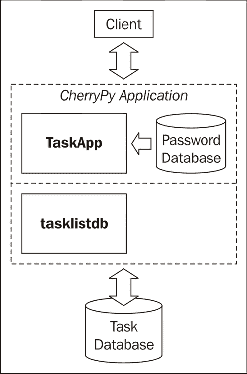
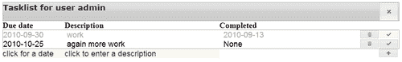

# 第四章：任务列表 II：数据库和 AJAX

> 在本章中，我们将重构我们的任务列表应用程序。它将在服务器上使用数据库引擎来存储条目，并使用 jQuery 的 AJAX 功能动态更新网络应用程序的内容。在服务器端，我们将学习如何使用 Python 的内置 SQLite 数据库引擎。在展示方面，我们将遇到 jQuery UI 的事件系统，并学习如何响应用户的鼠标点击。

在本章中，我们将：

+   学习使用数据库引擎的一些好处

+   熟悉 SQLite，Python 一起分发的数据库引擎

+   使用 SQLite 实现密码数据库

+   学习如何设计和开发一个数据库驱动的任务列表应用程序

+   实现一个测试框架

+   学习如何使用 AJAX 调用使网络应用程序更具响应性

+   看看如何在不使用`<form>`元素的情况下实现交互式应用程序

那么，让我们开始吧...

# 与文件系统相比，数据库的优势

将记录存储在文件系统上的单独文件中可能很简单，但确实有几个缺点：

+   您必须定义自己的接口来访问这些文件并解析其内容。这比听起来要严重得多，因为它迫使您开发并测试大量您本可以从现有库中免费获得的具体功能

+   访问单个文件比从数据库表中选择记录要慢得多。如果您知道您想要哪个记录（就像在我们的任务列表应用程序中那样），这可能可行，但如果你想要根据某些属性的值来选择记录，那就绝对不可行。这将需要打开每个文件并检查某些属性是否与您的标准匹配。在一个包含数百个或更多条目的数据集中，这将非常慢

+   此外，实现事务也很困难。如果我们想保证一组操作要么全部成功，要么在部分操作失败时回滚，那么如果我们想在文件系统上使用文件，我们就必须自己编写非常复杂的代码

+   当在文件系统上使用文件时，定义和维护记录之间的关系很麻烦，尽管我们的任务列表应用程序非常简单，但几乎任何其他应用程序都有多个逻辑对象以及它们之间的关系，因此这是一个严重的问题。

# 选择一个数据库引擎

可供 Python 访问的数据库引擎有很多，包括商业的和开源的（http://wiki.python.org/moin/DatabaseInterfaces）。选择正确的数据库不是一件简单的事情，因为它不仅可能取决于功能需求，还可能取决于性能、可用预算以及难以定义的需求，如易于维护。

在本书中我们开发的应用程序中，我们选择使用 SQLite 数据库引擎（[`www.sqlite.org`](http://http://www.sqlite.org)）出于多个原因。首先，它是免费的，并且包含在 Python 的标准发行版中。这对写书的人来说很重要，因为它意味着能够运行 Python 的每个人都可以访问 SQLite 数据库引擎。然而，这并不是一个玩具数据库：事实上，SQLite 是许多智能手机和像 Firefox 这样的高知名度应用程序中使用的数据库，用于存储配置和书签等信息。此外，它可靠且健壮，而且速度相当快。

它确实也有一些缺点：首先，它使用自己的 SQL 方言（用于与数据库交互的语言），但公平地说，大多数数据库引擎都使用自己的方言。

更严重的是，SQLite 的重点在于嵌入式系统，最明显的后果是它没有提供限制用户访问表和列子集的功能。在文件系统中只有一个文件包含数据库的内容，对该文件的访问权限由其所在的文件系统决定。

最后一个问题与其说是缺点，不如说是一个需要认真注意的点：SQLite 不强制执行类型。在许多数据库中，为列定义的类型严格决定了你可以存储在该列中的内容。当一列被定义为 INTEGER 时，通常数据库引擎不会允许你存储字符串或布尔值，而 SQLite 则允许这样做。一旦你将其与 Python 管理变量的方式进行比较，这并不像听起来那么奇怪。在 Python 中，定义一个变量并将其分配一个整数是完全可以接受的，稍后可以将字符串分配给同一个变量。Python 中的变量就像 SQLite 中的列一样；它只是一个指向值的指针，而这个值不仅仅是值本身，还与一个显式关联的类型相关联。

可用性、可靠性和类型系统与 Python 原生处理值的方式紧密相似，这使得 SQLite 在许多应用程序中成为一个非常适合的数据库引擎，尽管具体的应用程序可能需要其他数据库引擎，如 PostgreSQL 或 MySQL 来更好地满足需求。如果您的应用程序将在已经提供 MySQL 的 Web 服务器上运行，那么后者可能是一个有吸引力的替代方案。

# 数据库驱动认证

在我们开始设计数据库驱动的任务列表应用程序之前，让我们首先熟悉 SQLite 在看似更简单的一组要求中的使用情况：在数据库中存储用户名/密码组合，并重构 Logon 类以与该数据库交互。

功能需求看似简单：验证用户名/密码组合是否有效，我们只需确认提供的用户名/密码组合是否存在于用户名和密码表中。这样的表包含两列，一列名为`username`，另一列名为`password`。由于将密码以明文形式存储从来都不是一个好主意，我们使用哈希函数加密密码，这样即使密码数据库被破坏，坏人也会很难恢复密码。这意味着，当然，我们必须使用相同的哈希函数对给定的密码进行哈希处理，然后再将其与存储的用户名对应的密码进行比较，但这并不会增加太多复杂性。

增加复杂性的是，CherryPy 是多线程的，这意味着 CherryPy 由多个轻量级进程访问相同的数据组成。尽管 SQLite 的开发者认为线程是邪恶的([`www.sqlite.org/faq.html#q6`](http://www.sqlite.org/faq.html#q6))，但在应用程序中花费大量时间等待的情况下，线程是非常有意义的。这当然适用于花费大量时间等待网络流量完成的 Web 应用程序，即使在宽带连接的时代也是如此。利用这种等待时间最有效的方法是启用不同的线程来服务另一个连接，这样更多的用户可以享受到更好的交互体验。

### 注意

**哈希函数**（或者更具体地说，加密哈希函数）以某种方式将任何输入字符串转换为有限长度的输出字符串，使得两个不同的输入字符串产生相同输出字符串的可能性非常低。此外，从输入到输出的转换是一个单向操作，或者至少从输出构造输入将需要大量的计算能力。已知有许多有用的哈希函数，其中最流行的是 Python 的`hashlib`模块中可用的。我们这里使用的特定哈希函数称为`SHA1`。

更多关于哈希的信息可以在 Python 文档中找到，链接为[`docs.python.org/py3k/library/hashlib.html`](http://docs.python.org/py3k/library/hashlib.html)，或者在维基百科上查看[`en.wikipedia.org/wiki/Cryptographic_hash_function`](http://en.wikipedia.org/wiki/Cryptographic_hash_function)。

然而，在 SQLite 中，连接对象不能在多个线程之间共享。这并不意味着我们不能在多线程环境中使用 SQLite（尽管线程是邪恶的），但这确实意味着如果我们想从不同的线程访问相同的 SQLite 数据库，每个线程都必须使用为该线程独家创建的连接对象。

幸运的是，指导 CherryPy 在启动新线程时调用一个函数，并让该函数创建一个新的数据库连接，这相当简单，我们将在下一节中看到。如果我们使用许多不同的线程，这可能会造成浪费，因为连接对象会占用一些内存，但只有几十个线程，这并不会造成太大的问题（CherryPy 的默认线程数是 10，可以通过 `server.thread_pool` 配置选项进行配置）。如果内存消耗是一个问题，还有其他解决方案可用，例如，可以是一个单独的工作线程来处理所有数据库交互，或者是一小群这样的线程。这个起点可能是[`tools.cherrypy.org/wiki/Databases`](http://tools.cherrypy.org/wiki/Databases)。

# 使用数据库进行行动认证

为了说明如何使用数据库驱动的用户认证，运行 `logondbapp.py`。它将向您展示一个登录界面，与上一章中显示的非常相似。您可以输入内置的用户名/密码组合 admin/admin，之后您将看到一个欢迎页面。

为了使这个迷你应用程序能够与基于数据库的用户认证版本一起工作，我们只需要将 Logon 类的实例引用替换为 `LogonDB` 类的一个实例，如以下代码中高亮显示的那样（完整的代码作为 `logondbapp.py` 提供）：`

**Chapter4/logondbdb.py**

```py
import cherrypy
import logondb
class Root(object): logon = logondb.LogonDB(path="/logon", authenticated="/", not_
authenticated="/goaway", db="/tmp/pwd.db")
	@cherrypy.expose
	def index(self):
		username=Root.logon.checkauth('/logon')
		return '<html><body><p>Hello user <b>%s</b></p></body></
html>'%username
	@cherrypy.expose
	def goaway(self):
		return '<html><body><h1>Not authenticated, please go away.</h1></
body></html>'
	goaway._cp_config = {'tools.expires.on':True,'tools.expires.
secs':0,'tools.expires.force':True}
	@cherrypy.expose
	def somepage(self):
		username=Root.logon.checkauth('/logon',returntopage=True)
		return '<html><body><h1>This is some page.</h1></body></html>'
if __name__ == "__main__":
	import os.path
	current_dir = os.path.dirname(os.path.abspath(__file__))
	root = Root() def connect(thread_index):
		root.logon.connect()
	cherrypy.engine.subscribe('start_thread', connect)
	cherrypy.quickstart(root,config={ ... } )

```

与之前的实现相比，另一个重要的区别是高亮显示的 `connect()` 函数的定义，这个函数应该在 CherryPy 启动每个新线程时调用。它调用 `LogonDB` 实例的 `connect()` 方法来创建一个针对给定线程唯一的数据库连接对象。我们使用 `cherrypy.engine.subscribe()` 函数注册这个函数，并让它在每个 CherryPy 启动的新线程开始时调用我们的 `connect()` 函数。

## 刚才发生了什么？

我们 `Logon` 类的数据库版本 `LogonDB` 从 `Logon` 类继承了很多内容。具体来说，所有与 HTML 相关的逻辑都被重用了。`LogonDB` 重写了 `__init__()` 方法来存储数据库文件的路径，并确保如果数据库文件不存在，则使用 `initdb()` 方法初始化数据库（高亮显示）。它还重写了 `checkpass()` 方法，因为这个方法现在必须验证有效的用户名/密码对是否存在于数据库表中。

**Chapter4/logondb.py**

```py
import logon
import sqlite3
from hashlib import sha1 as hash
import threading
import cherrypy class LogonDB(logon.Logon):
	def __init__( self,path="/logon", authenticated="/", not_
authenticated="/", db="/tmp/pwd.db"):
		super().__init__(path,authenticated,not_authenticated)
		self.db=db
		self.initdb()
	@staticmethod
	def _dohash(s):
		h = hash()
		h.update(s.encode())
		return h.hexdigest() def checkpass(self,username,password):
		password = LogonDB._dohash(password)
		c = self.data.conn.cursor()
		c.execute("SELECT count(*) FROM pwdb WHERE username = ? AND 
password = ?",(username,password))
		if c.fetchone()[0]==1 :return True
		return False
	def initdb(self):
		conn=sqlite3.connect(self.db)
		c = conn.cursor() c.execute("CREATE TABLE IF NOT EXISTS pwdb(username unique not 
null,password not null);")
		c.execute('INSERT OR IGNORE INTO pwdb 
VALUES("admin",?)',(LogonDB._dohash("admin"),))
		conn.commit()
		conn.close()
		self.data=threading.local()
	def connect(self):
		'''call once for every thread as sqlite connection objects cannot 
be shared among threads.'''
		self.data.conn = sqlite3.connect(self.db)

```

数据库的定义由一个名为 `pwdb` 的单表组成，该表在突出显示的行中定义（并且只有当该表尚不存在时）。`pwdb` 表由两列组成，即 `username` 和 `password`。通过将这两列都标记为 `not null`，我们确保不能在它们中输入任何空值。`username` 列也被标记为 `unique`，因为用户名只能出现一次。这种单表数据库模式可以用以下图表表示，其中每个列都有一个带有名称的标题和列出特定列属性的几行（随着我们的数据库设计变得更加复杂，我们将更多地依赖这些图表，而不是详细展示 SQL 代码）：

| Pwdb |   |
| --- | --- |
| 用户名 | 密码 |
| --- | --- |
| not nullunique | not null |

### 备注

熟悉其他 SQL 方言的人可能会注意到列定义缺少任何类型。这是故意的：SQLite 允许我们在列中存储任何类型的值，就像 Python 允许我们在变量中存储任何类型的值一样。值的类型直接与值相关联，而不是与列或变量相关联。SQLite 支持亲和力或首选类型的概念，我们将在本书中创建的其他表中遇到这一点。

除了创建表（在 `initdb()` 方法中突出显示）之外，如果需要，我们还会用管理员/管理员组合（admin/admin）初始化它，如果管理员用户名尚不存在。如果它已经存在，我们就让它保持原样，因为我们不希望重置已更改的密码，但我们确实想确保存在一个管理员用户名。这是通过 `insert or ignore` 语句实现的，因为将 `admin` 用户名插入到已包含一个的表中会因唯一约束而失败。添加非标准或 `ignore` 子句将忽略此类情况，换句话说，如果已经存在，它将不会插入具有管理员用户名的记录。

`insert` 语句还说明了我们存储密码不是以明文形式，而是以散列值（这些散列值非常难以再次转换为明文）的形式。我们在这里使用的散列方法是 SHA1，它作为 `hash()` 从 Python 的 `hashlib` 模块导入。从明文到散列值的转换由 `_dohash()` 静态方法（通过其名称前的下划线标记为私有，但请注意，在 Python 中，这仅是一种约定，因为实际上并没有真正的私有方法）处理。

### 备注

在这个例子中，我们存储密码的方式对于生产环境来说仍然不够安全，但实现更安全的解决方案超出了本书的范围。我强烈建议阅读 [`www.aspheute.com/english/20040105.asp`](http://www.aspheute.com/english/20040105.asp) 了解更多关于这个主题的内容。

`initdb()` 方法还负责使用 `threading.local()` 函数创建一个对象，该对象可以用来存储线程本地的数据。因为通常线程中的所有数据都是共享的，我们必须使用这个函数来创建一个地方来存储每个线程不同的数据库连接对象。如果我们把这样的连接对象存储在全局变量中，每个线程都会访问相同的数据库连接，这是 SQLite 不允许的。

我们将密码存储为散列值的事实意味着检查用户名/密码组合必然涉及到在检查存在性之前将明文密码转换为散列值。这通过 `checkpass()` 方法（突出显示）实现。密码参数在传递给 `execute()` 方法之前，使用 `_dohash()` 方法进行转换。

SQL 语句本身计算 `pwdb` 表中包含给定用户名和（散列的）密码的行数，并检索结果。结果是包含单个值的单行，即匹配行的数量。如果这个数量是 1，我们就有一个有效的用户名/密码组合，否则没有。我们不会区分用户名未知的情况或是否存在多个包含相同用户名的行。这是因为后者由于用户名列上的 `unique` 约束而不太可能发生。

## 尝试添加新的用户名/密码的英雄

我们的 `LogonDB` 类还没有一个方法可以将新的用户名/密码组合添加到数据库中。你将如何实现一个？

提示：你需要提供一个公开的方法，该方法提供一个带有表单的页面，可以在其中输入新的用户名和密码，以及一个可能作为 `<form>` 元素的 action 属性的方法，并将用户名和密码作为参数传递。

注意，这个方法必须检查用户是否已认证，而且还必须检查添加新用户名/密码的用户是否是管理员，否则每个人都可以添加新账户！`logondb.py` 中已经提供了一个示例实现。

## Tasklist II 存储任务到数据库中

现在我们已经看到了如何使用数据库引擎来存储持久数据，以及如何从 CherryPy 应用程序中访问这些数据，让我们将新知识应用到我们在上一章中设计的任务列表应用程序中。当然，一个应用程序不仅仅是存储数据，我们还将重新设计用户界面，使其更具响应性，并且稍微简单一些以维护。

### 通过 AJAX 提高交互性

当你查看独立于 PC 的独立应用程序与 Web 应用程序之间的差异时，你可能会在第一眼看到一些细微的差异。然而，如果你更仔细地观察，你会发现一个主要差异：在独立应用程序中，当显示发生变化时，只有实际修改的屏幕元素会被重新绘制。

在传统的网页中，这完全不同。例如，点击一个改变列表排序顺序的按钮，可能会不仅检索并重新绘制那个列表，还可能检索一个完整的页面，包括所有侧边栏、导航标题、广告等等。

如果未修改的内容在互联网上检索缓慢，整个网页可能会感觉反应迟缓，尤其是如果整个网页都在等待最后一块信息的到来以展示其全部魅力。当网页发展到模仿应用程序时，这种交互体验的差异很快变成了一个麻烦，人们开始考虑解决方案。

这些解决方案中最突出的一种是 AJAX。它是异步 JavaScript 和 XML 的缩写，即一种使用浏览器内置的 JavaScript 功能检索数据的方法。如今，每个浏览器都支持 AJAX，jQuery 库平滑了大多数浏览器的不一致性。名称中的 XML 部分不再相关，因为 AJAX 调用可能检索的数据几乎可以是任何东西：除了 XML 和其近亲 HTML 之外，**JavaScript 对象表示法**（JSON）是一种流行的数据传输格式，它可以通过浏览器中的 JavaScript 解释器比 XML 更简单地处理数据。

AJAX 名称中的异步部分仍然相关：大多数 AJAX 调用在检索数据后会立即返回，而不等待结果。然而，当数据检索完成时，它们会调用一个函数。这确保了应用程序的其他部分不会停滞，并且可以改善整个 Web 应用程序的交互体验。

# 使用 AJAX 获取时间的时间操作

输入以下代码并运行它。如果你将你的网络浏览器指向熟悉的 [`localhost:8080`](http://localhost:8080) 地址，你将看到下面的图片，时间大约每五秒变化一次。（代码也作为 `timer.py` 提供）


## 刚才发生了什么？

我们的小 CherryPy 应用程序只提供两种方法（在代码中都已突出显示）。`index()` 方法返回一个极简的 HTML 页面，其中包含一些静态文本和一小段 JavaScript 代码，负责从服务器检索当前时间。它还包含一个 `time()` 方法，该方法简单地返回纯文本格式的当前时间。

**Chapter4/timer.py**

```py
import cherrypy
import os.path
from time import asctime
current_dir = os.path.dirname(os.path.abspath(__file__))
class Root(object):
	@cherrypy.expose def index(self):
		return '''<html>
		<head><script type="text/javascript" src="img/jquery.js" ></script></
head>
		<body><h1>The current time is ...</h1><div id="time"></div>
		<script type="text/javascript"> window.setInterval(function(){$.ajax({url:"time",cache:false,success:
function(data,status,request){
			$("#time").html(data);
		}});},5000);
		</script>
		</body>
		</html>'''
	@cherrypy.expose def time(self,_=None):
		return asctime()
cherrypy.quickstart(Root(),config={
	'/jquery.js':
	{ 'tools.staticfile.on':True,
	'tools.staticfile.filename':os.path.join(current_
dir,"static","jquery","jquery-1.4.2.js")
	}
})

```

魔法在于那小块 JavaScript（已突出显示）。此脚本在静态页面加载后执行，并调用 `window` 对象的 `setInterval()` 方法。`setInterval()` 方法的参数是一个匿名函数和一个以毫秒为单位的时间间隔。我们将时间间隔设置为五秒。传递给 `setInterval()` 的函数在每个间隔结束时被调用。

在这个例子中，我们向 `setInterval()` 传递一个匿名函数，该函数依赖于 jQuery 的 `ajax()` 函数来检索时间。`ajax()` 函数的唯一参数是一个对象，该对象可能包含许多选项。`url` 选项告诉使用哪个 URL 来检索数据，在这种情况下，相对 URL `time`（相对于嵌入脚本的页面提供的内容，`/`，因此它实际上指的是 `http://localhost:8080/time`)。

`cache` 选项被设置为 `false` 以防止浏览器在指令获取它已经看到的 URL 的时间时使用缓存的结果。这是通过底层 JavaScript 库通过在 URL 后附加一个额外的 `_` 参数（即该参数的名称，由一个单下划线组成）来确保的。这个额外的参数包含一个随机数，因此浏览器会将每次调用视为对新的 URL 的调用。`time()` 方法被定义为接受此参数，因为否则 CherryPy 会引发异常，但参数的内容会被忽略。

`success` 选项被设置为当数据成功接收时将被调用的函数。当函数被调用时，它将接收三个参数：由 `ajax()` 函数检索到的数据、状态和原始请求对象。我们在这里只使用数据。

我们选择具有 `time` ID 的 `<div>` 元素，并通过将其数据传递给其 `html()` 方法来替换其内容。请注意，尽管 `time()` 方法只是生成文本，但它也可以通过这种方式返回包含一些标记的文本。

我们明确指令 `ajax()` 函数不要缓存查询的结果，但我们也可能用 CherryPy 的 `expires` 工具装饰我们的 `time()` 方法。这将指令 `time()` 方法在响应中插入正确的 http 头部，以指示浏览器不要缓存结果。这在上面的代码（在 `timer2.py` 中可用）中得到了说明。

```py
@cherrypy.tools.expires(secs=0,force=True)
	@cherrypy.expose
	def time(self,_=None):
		return asctime()

```

使用 `@cherrypy.tools.expires` 装饰器意味着我们不必指令 `ajax()` 方法不要缓存结果，这给了我们使用快捷方法的选择。然后，JavaScript 代码可以被重写为使用 jQuery 的 `load()` 方法，如下所示：

```py
<script type="text/javascript">
window.setInterval(function(){$("#time").load("time");},5000);
</script>

```

`load()` 方法被传递了它将从中检索数据的 URL，并且在成功的情况下，会用接收到的数据替换选定的 `DOM 元素` 的内容。

### 注意

jQuery 提供了许多 AJAX 快捷方法，并且所有这些方法都共享一组通用的默认设置，可以使用 `ajaxSetup()` 函数来设置。例如，为了确保所有 AJAX 方法都不会缓存任何返回的结果，我们可以这样调用它：`$.ajaxSetup({cache:false})`；

## 重新设计任务列表应用程序

任务列表应用程序将包括两部分：一个用于身份验证的部分，我们将重用 `LogonDB` 类和新的 `TaskApp` 类。`TaskApp` 类将实现提供已验证用户所有任务概览页面所需的方法，以及响应 AJAX 请求的额外方法。

不同于文件系统，SQLite 将被用来存储所有用户的任务。请注意，这是一个与用于存储用户名和密码的数据库分开的独立数据库。这样的设置使我们能够将身份验证功能与其他关注点分开，从而便于重用。一旦用户通过身份验证，我们当然会使用他的/她的用户名来识别属于他/她的任务。

对任务数据库的访问将被封装在 `tasklistdb` 模块中。它提供了类和方法来检索、添加和修改特定用户的任务。它不关心检查访问权限，因为这属于 `TaskApp` 类的责任。你可以将这种分离想象成一个双层模型，顶层检查用户凭据并提供服务，底层实际与数据库交互。



## 数据库设计

我们的任务数据库（数据库 *模式*）的设计非常简单。它由一个包含定义任务的列的单个表组成。

| 任务 |   |   |   |   |
| --- | --- | --- | --- | --- |
| task_id | description | duedate | completed | user_id |
| --- | --- | --- | --- | --- |
| integerprimary keyautoincrement |   |   |   |   |

大多数列没有定义特定的类型，因为 SQLite 允许我们在列中存储任何内容。此外，大多数列没有特殊的约束，除了我们指定的 `task_id` 列，我们将其指定为主键。我们明确地将 `task_id` 列类型指定为整数，并指定为 `autoincrement`。这样，我们不必显式设置此列的值，每次我们向表中添加新任务时，都会为我们插入一个新的唯一整数。

# 创建任务数据库的时间

首先，让我们花些时间熟悉创建新数据库所需的步骤。

输入以下代码并运行它（它也作为 `taskdb1.py` 提供）。

**第四章/taskdb1.py**

```py
import sqlite3
database=':memory:'
connection = sqlite3.connect(database) cursor=connection.executescript('''
create table if not exists task (
	task_id integer primary key autoincrement,
	description,
	duedate,
	completed,
	user_id
);
''')
connection.commit() sql = '''insert into task (description,duedate,completed,user_id) values(?,?,?,?)'''
cursor.execute(sql,('work' 			,'2010-01-01',None,'alice'))
cursor.execute(sql,('more work' 	,'2010-02-01',None,'alice'))
cursor.execute(sql,('work' 			,'2010-03-01',None,'john'))
cursor.execute(sql,('even more work','2010-04-01',None,'john'))
connection.commit()
connection.close()

```

它将在内存中创建一个临时数据库，并定义一个任务表。它还使用 INSERT 语句向此表填充多个任务。

## 刚才发生了什么？

在建立数据库连接后，第一个任务是创建`task`表（已突出显示）。在这里，我们使用`connection`对象的`executescript()`方法，因为这个方法允许我们一次传递多个 SQL 语句。在这里，我们的数据库模式由一个单独的`create`语句组成，所以`execute()`方法也可以做到这一点，但通常在创建数据库时，我们会创建多个表，然后将所有必要的 SQL 语句一起传递是非常方便的。

当你查看`create`语句时，你可能注意到它包含一个`if not exists`子句。在这个例子中，这是完全多余的，因为一个新打开的内存数据库总是空的，但如果我们数据库位于磁盘上，它可能已经包含我们想要的全部表。一旦我们创建了表，我们就使用`commit()`方法将我们的更改提交到数据库。

第二行突出显示的行显示了如何创建一个插入语句，该语句将向任务表插入新记录。我们将插入的值是占位符，每个占位符都由一个问号表示。在接下来的四行中，我们执行这个插入语句，并提供一个包含将被插入占位符位置的值的元组。

# 使用选择语句检索信息的操作时间

在 SQL 中，`select`语句可以用来从数据库中检索记录。你将如何表达一个查询来检索属于用户 john 的所有任务？

答案：`select * from task where user_id = 'john'`

我们可以将此在 Python 中实现如下（仅显示相关行，完整的实现可在`taskdb2.py`中找到）：

**第四章/任务 tdb2.py**

```py
connection.row_factory = sqlite3.Row
sql = """select * from task where user_id = 'john'""" cursor.execute(sql)
tasks = cursor.fetchall()
for t in tasks:
	print(t['duedate'],t['description'])

```

## 刚才发生了什么？

代码的第一行通常放置在建立数据库连接之后，并确保从`fetchone()`或`fetchall()`方法返回的任何行都不是普通的元组，而是`sqlite3.Row`对象。这些对象的行为就像元组一样，但它们的字段可以通过它们所代表的列的名称进行索引。

查询通过将其传递给游标的`execute()`方法（已突出显示）来执行，然后使用`fetchall()`方法检索结果，该方法将返回一个元组列表，每个元组代表一个匹配的记录，其元素等于列。我们通过索引我们感兴趣的列名来打印这些元素的一部分。

当运行`taskdb2.py`时，输出将显示一个任务记录列表，每个记录都有一个日期和描述：

```py
 C:\Tasklist II>python taskdb2.py
2010-03-01 work
2010-04-01 even more work

```

## 使用变量选择标准进行的小测验

大多数时候，我们希望传递`user_id`作为变量进行匹配。正如我们在`taskdb1.py`中使用的插入语句中看到的，使用`?`作为占位符来构造查询是可能的。这样，我们可以将包含`user_id`的变量传递给执行方法。你将如何重构代码以选择包含在变量`username`中的`user_id`的所有记录？

## TaskDB 与数据库接口

现在我们已经准备好实现任务列表应用程序所需的数据库接口的实际代码了。

数据库接口层必须提供初始化数据库的功能，并提供创建、检索、更新和删除任务（统称为 **CRUD**）的线程安全方式，以及为给定用户列出所有任务的功能。执行这些操作的代码包含在两个类中，`Task` 和 `TaskDB`（两者都位于 `tasklistdb.py` 文件中）。`TaskDB` 封装了数据库连接，并包含初始化数据库的代码以及检索任务选择和创建新任务的方法。这些任务作为 `Task` 类的实例实现，`Task` 实例可以被更新或删除。

# 是时候连接到数据库了

让我们先看看 `TaskDB` 类。它由一个构造函数 `__init__()` 组成，该构造函数接受数据库将驻留的文件名作为参数。它调用一个私有方法来初始化这个数据库，并且像 `LogonDB` 类一样，为每个线程创建一些存储来保存连接对象（已突出显示）。它还定义了一个 `connect()` 方法，该方法应该为每个线程调用一次，并存储一个特定于线程的连接对象。它还将连接的 `row_factory` 属性设置为 `sqlite3.Row`。这会导致例如 `fetchall()` 返回的元组具有它们所代表的列的名称。这对于 `t['user_id']` 比如来说，比 `t[1]` 这样的方式更有自解释性。

**第四章/tasklistdb.py**

```py
class TaskDB:
	def __init__(self,db): self.data = threading.local()
		self.db = db
		self._initdb()
	def connect(self):
		'''call once for every thread'''
		self.data.conn = sqlite3.connect(self.db)
		self.data.conn.row_factory = sqlite3.Row

```

## 刚才发生了什么？

`__init__()` 方法的代码并没有在数据库中初始化任何表，而是委托给 `_initdb()` 方法。这个方法以下划线开头，因此按照惯例是私有的（但仅按惯例）。它的目的是仅从 `__init__()` 中调用，并在必要时初始化数据库。它打开到数据库的连接并执行一个多行语句（已突出显示）。在这里，我们使用 `create if not exists` 来创建 `task` 表，但仅当它尚未存在时。因此，如果我们第一次启动应用程序，数据库将完全为空，这个语句将创建一个名为 task 的新表。如果我们稍后再次启动应用程序，这个语句将不会做任何事情。在关闭连接之前，我们提交我们的更改。

**第四章/tasklistdb.py**

```py
def _initdb(self):
	'''call once to initialize the metabase tables'''
	conn = sqlite3.connect(self.db) conn.cursor().executescript('''
	create table if not exists task (
		task_id integer primary key autoincrement,
		description,
		duedate,
		completed,
		user_id
	);
	'''
	)
	conn.commit()
	conn.close()

```

# 是时候存储和检索信息了

`TaskDB` 类的最后一部分定义了三个方法，`create()` 方法将创建一个全新的 `Task` 实例，`retrieve()` 方法将根据给定的 `task_id` 从 `task` 表中检索一个任务，并将其作为 `Task` 实例返回，还有 `list()` 方法将返回给定用户的 `task_ids` 列表。

我们将 `retrieve()` 和 `list()` 分离，因为检索一个包含所有属性的完整对象可能相当昂贵，并且并不总是需要的。例如，如果我们选择一个包含数千个任务的列表，我们可能会将它们显示为每页大约二十个任务的页面。如果我们需要检索所有这些任务的完整信息，我们可能需要等待一段时间，所以我们可能会选择仅实例化第一页的全部，并在用户翻页时按需获取其余部分。在这本书中，我们还会遇到这种模式几次。

`create()` 方法本身只是将所有参数传递给 `Task` 构造函数，以及包含数据库连接的线程局部存储。它返回生成的 `Task` 实例。

`retrieve()` 方法接受用于检索的用户名和任务 ID。用户名作为合理性检查，但不是严格必要的。如果找到与 `task_id` 和 `username` 都匹配的记录，则创建并返回一个 `Task` 实例（高亮显示）。如果没有找到这样的记录，则抛出 `KeyError` 异常。

`list()` 方法返回给定用户的 `task_ids` 列表。它通过从每个元组的第一个（也是唯一一个）元素中获取来构造这个列表（高亮显示）。

**第四章/tasklistdb.py**

```py
	def create (self, user=None, id=None, description='', duedate=None, 
completed=None):
		return Task(self.data, user=user, id=id, description=description, 
duedate=duedate, completed=completed)
	def retrieve(self, user,id):
		sql = """select * from task where task_id = ? and user_id = ?"""
		cursor = self.data.conn.cursor()
		cursor.execute(sql,(id,user))
		tasks = cursor.fetchall()
		if len(tasks): return self.create(user, tasks[0]['task_id'], tasks[0]
['description'], tasks[0]['duedate'], tasks[0]['completed']) 
		raise KeyError('no such task')
	def list(self,user):
		sql = '''select task_id from task where user_id = ?'''
		cursor = self.data.conn.cursor()
		cursor.execute(sql,(user,)) return [row[0] for row in cursor.fetchall()]

```

`Task` 构造函数接受一些可选参数，包括强制性的用户名和一个指向包含数据库连接的线程局部数据的 `taskdb` 参数。如果未提供 `duedate` 参数，它将分配今天的日期（高亮显示）。

## 刚才发生了什么？

上一段代码中 `Task` 实例的构建值得仔细研究。根据 `id` 参数的值，构造函数可以执行两件事。

如果已知 `id`，则此 `Task` 实例将基于从数据库查询中检索到的数据构建，因此不需要做更多的事情，因为所有参数都已作为实例变量存储。

然而，如果没有提供 `id`（或 `None`），我们显然正在创建一个全新的 `Task` 实例，它尚未存在于数据库中。因此，我们必须使用 `insert` 语句将其插入到任务表中（高亮显示）。

我们没有将新的 `task_id` 作为值传递给这个 `insert` 语句，但因为它将 `task_id` 列定义为 `integer primary key autoincrement`，所以会为我们创建一个。这个生成的数字可以通过游标的 `lastrowid` 属性获取，并且我们将它存储起来以供以后重用。所有这些都是 SQLite 特有的，更多详细信息，请参考信息框。

### 注意

只有`integer primary key`列可以被定义为`autoincrement`，只有`integer primary key autoincrement`列会被映射到内部的`rowid`列（而且这甚至不是一个真正的列）。所有这些都是非常有用的，但也非常具有 SQLite 特性。关于这个主题的更多信息可以在 SQLite FAQ 中找到，网址为[`www.sqlite.org/faq.html`](http://www.sqlite.org/faq.html)，以及 SQL 参考中关于 rowid 的部分，网址为[`www.sqlite.org/lang_createtable.html#rowid`](http://www.sqlite.org/lang_createtable.html#rowid)。

**Chapter4/tasklistdb.py**

```py
class Task:
	def __init__(self,taskdb,user,id=None,description='',duedate=None,
completed=None):
	self.taskdb=taskdb
	self.user=user
	self.id=id
	self.description=description
	self.completed=completed self.duedate=duedate if duedate != None else date.today().
isoformat()
	if id == None:
		cursor = self.taskdb.conn.cursor() sql = '''insert into task (description,duedate,completed,user_
id) values(?,?,?,?)'''
		cursor.execute(sql,(self.description,self.duedate,self.
completed,self.user))
		self.id = cursor.lastrowid
		self.taskdb.conn.commit()

```

# 更新和删除信息的时机

更新`Task`记录的操作主要是构造正确的`update`查询。`update`会更改与`where`子句中条件匹配的任何记录。它只会更改其`set`子句中提到的列，所以我们首先构造这个`set`子句（已突出显示）。

将参数列表连接并插入到 SQL 查询中可能有点过度，但如果我们稍后想添加一个额外的属性，这将非常简单（而且我们的 SQL 查询字符串现在可以放在一行中，这使得它更容易阅读和排版）。

一旦我们执行了插入操作，我们会检查受影响的行数。这个值可以通过`cursor`对象的`rowcount`属性获得，并且应该为`1`，因为我们使用了唯一的`task_id`来选择记录。如果不是`1`，那么就发生了奇怪的事情，我们会回滚插入操作并抛出异常。如果一切顺利，我们会提交我们的更改。

**Chapter4/tasklistdb.py**

```py
def update(self,user):
	params= []
	params.append('description = ?')
	params.append('duedate = ?')
	params.append('completed = ?')
	sql = '''update task set %s where task_id = ? and user_id = ?''' sql = sql%(",".join(params))
	conn = self.taskdb.conn
	cursor = conn.cursor()
	cursor.execute(sql, (self.description,self.duedate,self.
completed,self.id,user))
	if cursor.rowcount != 1 :
		debug('updated',cursor.rowcount)
		debug(sql)
		conn.rollback()
		raise DatabaseError('update failed')
	conn.commit()

```

要删除具有给定任务 ID 的任务，我们只需在`task`表上执行一个`delete query`，在`where`子句中有一个表达式与我们的`task_id`匹配，就像我们为更新所做的那样。我们确实检查我们的删除查询只影响一条记录（已突出显示），否则回滚。这种情况不应该发生，但宁可信其有，不可信其无。

```py
def delete(self,user):
	sql = '''delete from task where task_id = ? and user_id = ?'''
	conn = self.taskdb.conn
	cursor = conn.cursor()
	cursor.execute(sql,(self.id,user)) if cursor.rowcount != 1:
		conn.rollback()
		raise DatabaseError('no such task')
	conn.commit()

```

## 测试

在没有测试的情况下开发软件有点像闭着眼睛开车：如果道路是直的，你可能会走得很远，但很可能会在几秒钟内撞车。换句话说，测试是好的。

然而，彻底测试一个应用程序确实需要时间，因此尽可能自动化测试过程是有意义的。如果测试可以轻松执行，这将鼓励开发者经常运行这些测试。当实现发生变化时，这是非常理想的。它还可以在发布新版本之前作为一个理智的检查。所以尽管编写严肃的测试可能有时需要花费与编写代码一样多的时间，但这是一种稳健的投资，因为它可能防止许多不愉快的惊喜，如果代码被更改或代码部署的环境发生变化。

你可能想测试应用程序的许多方面，但并非所有都适合自动测试，例如用户交互（尽管像 Selenium 这样的工具可以让你走得很远。关于这个工具的更多信息可以在 [`seleniumhq.org/`](http://seleniumhq.org/) 找到）)。然而，其他部分相当简单就可以自动化。

Python 内置的 `unittest` 模块简化了重复测试代码小功能单元的任务。单元测试的想法是隔离小块代码，并通过断言任何数量的期望来定义其预期行为。如果这些断言中的任何一个失败，测试就会失败。（单元测试的内容远不止这本书能完全涵盖的。在这里，我们只介绍最基本的内容，以让你尝到一些可能性，并介绍一些旨在让你了解示例代码中提供的测试套件的例子。如果你想要了解更多关于 Python 单元测试的信息，一个好的起点是 *Daniel Arbuckle 著，Packt Publishing 出版，978-1-847198-84-6* 的 *Python Testing*）。

Python 的 `unittest` 模块包含许多类和函数，使我们能够编写和运行测试组及其相关的断言。例如，假设我们有一个名为 `factorial` 的模块，它定义了一个名为 `fac()` 的函数来计算阶乘。

一个数 n 的阶乘是从 1 到 n（包括 n）所有数的乘积。例如，`fac(4) = 4 * 3 * 2 * 1 = 24`。0 是一个特例，因为 0 的阶乘等于 1。阶乘只对整数 >= 0 定义，因此我们设计我们的代码，如果参数 `n` 不是一个 `int` 或者是负数（突出显示），则抛出 `ValueError` 异常。阶乘本身是通过递归计算的。如果 `n` 是零或一，我们返回一，否则我们返回 `n` 减一的阶乘乘以 `n`：

**第四章/factorial.py**

```py
def fac(n): if n < 0 : raise ValueError("argument is negative")
	if type(n) != int : raise ValueError("argument is not an integer")
	if n == 0 : return 1
	if n == 1 : return 1
	return n*fac(n-1)

```

代码以 `factorial.py` 的形式提供。

# 测试 factorial.py 的行动时间

伴随 `factorial.py` 的测试套件被称为 `test_factorial.py`。运行它，你应该看到类似以下的输出：

```py
 python test_factorial.py
...
----------------------------------------------------------------------
Ran 3 tests in 0.000s
OK

```

执行了三个测试，显然一切顺利。

## 刚才发生了什么？

`test_factorial.py` 中的代码首先导入我们想要测试的模块（阶乘）和 `unittest` 模块。然后我们定义一个名为 `Test`（突出显示）的单个类，它继承自 `unittest.TestCase`。通过继承这个类，我们的类将被测试运行器识别为测试用例，并将为我们提供一系列 **断言** 方法。

我们的 `Test` 类可以包含任何数量的方法。以 `test_` 开头名称的方法将被测试运行器识别为测试。因为失败测试的名称将被打印出来，所以给这些测试起一个反映其目的的合理名称是有用的。在这里，我们定义了三个这样的方法：`test_number()`、`test_zero()` 和 `test_illegal()`。

**第四章/test_factorial.py**

```py
import unittest
from factorial import fac class Test(unittest.TestCase):
	def test_number(self):
		self.assertEqual(24,fac(4))
		self.assertEqual(120,fac(5))
		self.assertEqual(720,fac(6))
	def test_zero(self):
		self.assertEqual(1,fac(0))
	def test_illegal(self):
		with self.assertRaises(ValueError):
			fac(-4)
		with self.assertRaises(ValueError):
			fac(3.1415)
if __name__ == '__main__':
	unittest.main()

```

`test_number()`测试了多个常规案例，以查看我们的函数是否返回合理的结果。在这种情况下，我们检查了三个不同的数字，并使用从`TestCase`类继承的`assertEquals()`方法来检查计算出的值（作为第二个参数传递）是否等于预期的值（第一个参数）。

`test_zero()`断言零的特殊情况确实返回 1。它再次使用`assertEqual()`方法来检查预期的值（1）是否与返回的值匹配。

`test_illegal()`最终断言只接受正数参数（或者更确切地说，它断言负值正确地引发了一个`ValueError`异常），并且`fac()`的参数应该是`int`或者也应该引发`ValueError`。

它使用了`TestCase`提供的`assertRaises()`方法。`assertRaises()`将返回一个对象，该对象可以用作 with 语句中的上下文管理器。实际上，它将捕获任何异常并检查它是否是预期的异常。如果不是，它将标记测试为失败。

这些方法在单元测试中显示出一种熟悉的模式：相当少量的测试检查单元在正常情况下是否表现正确，而大部分测试通常都致力于特殊案例（通常被称为边界案例）。同样重要的是，对非法案例被正确标记为非法的测试投入了大量的努力。

在`test_factorial.py`的最后，我们发现了一个对测试运行器`unittest.main()`的调用。它将寻找任何从`TestCase`派生的定义好的类，并运行任何以`test_`开头的方法，统计结果。

## 现在我们得到了什么？

如果我们改变`fac()`的实现，例如，不使用递归的代码如下，我们可以通过再次运行`test_factorial.py`来快速检查它是否按预期工作。

```py
from functools import reduce
def fac(n):
	if n < 0 : raise ValueError("factorial of a negative number is not 
defined")
	if type(n) != int : raise ValueError("argument is not an integer")
	if n == 0 : return 1
	if n == 1 : return 1 return reduce(lambda x,y:x*y,range(3,n+1))

```

特殊情况的处理保持不变，但突出显示的行显示我们现在使用`functools`模块中的`reduce()`函数来计算阶乘。`reduce()`函数将一个函数应用于列表中的第一对项目，然后再次应用于这个结果和每个剩余的项目。通过传递`reduce()`一个将返回两个参数乘积的函数，在这种情况下，我们的 lambda 函数，可以计算出列表中所有数字的乘积。

### 注意

更多关于`reduce()`函数的信息可以在`functools`模块的文档中找到，这是 Python 强大的函数式编程库：[`docs.python.org/py3k/library/functools.html`](http://docs.python.org/py3k/library/functools.html)。

## 快速问答：找出错误

1.  你能预测前一段代码中可能出现的任何错误吗？哪个测试方法会失败？

    +   `test_number()`

    +   `test_zero()`

    +   `test_illegal()`

# 为 tasklistdb.py 编写单元测试的时间

运行`test_tasklistdb.py`（本章节代码分发中提供）。输出应该是一个测试结果列表：

```py
 python test_tasklistdb.py
......
----------------------------------------------------------------------
Ran 6 tests in 1.312s
OK

```

## 刚才发生了什么？

让我们看看在`test_tasklistdb.py`中定义的一个类，`DBentityTest`。`DBentityTest`包含许多以`test_`开头的方法。这些是实际的测试，它们验证一些常见操作（如检索或删除任务）是否按预期执行。

**第四章/test_tasklistdb.py**

```py
from tasklistdb import TaskDB, Task, AuthenticationError, 
DatabaseError
import unittest
from os import unlink,close
from tempfile import mkstemp
(fileno,database) = mkstemp()
close(fileno)
class DBentityTest(unittest.TestCase): def setUp(self):
		try:
			unlink(database)
		except:
			pass
		self.t=TaskDB(database)
		self.t.connect()
		self.description='testtask'
		self.task = self.t.create(user='testuser',description=self.
description)
	def tearDown(self):
		self.t.close()
		try:
			unlink(database)
		except:
			pass
	def test_retrieve(self):
		task = self.t.retrieve('testuser',self.task.id)
		self.assertEqual(task.id,self.task.id)
		self.assertEqual(task.description,self.task.description)
		self.assertEqual(task.user,self.task.user)
	def test_list(self):
		ids = self.t.list('testuser')
		self.assertListEqual(ids,[self.task.id])
	def test_update(self):
		newdescription='updated description' self.task.
description=newdescription
		self.task.update('testuser')
		task = self.t.retrieve('testuser',self.task.id)
		self.assertEqual(task.id,self.task.id)
		self.assertEqual(task.duedate,self.task.duedate)
		self.assertEqual(task.completed,self.task.completed)
		self.assertEqual(task.description,newdescription)
	def test_delete(self):
		task = self.t.create('testuser',description='second task')
		ids = self.t.list('testuser')
		self.assertListEqual(sorted(ids),sorted([self.task.id,task.id]))
		task.delete('testuser')
		ids = self.t.list('testuser')
		self.assertListEqual(sorted(ids),sorted([self.task.id]))
		with self.assertRaises(DatabaseError):
			task = self.t.create('testuser',id='short')
			task.delete('testuser')
if __name__ == '__main__':
	unittest.main(exit=False)

```

所有这些`test_`方法都依赖于一个初始化的数据库，该数据库至少包含一个任务和一个对此数据库的开放连接。为了避免为每个测试重复此设置，`DBentityTest`包含一个特殊的方法`setUp()`（突出显示），它会删除任何之前测试中遗留的测试数据库，然后实例化一个`TestDB`对象。这将使用适当的表定义初始化数据库。然后它连接到这个新数据库并创建一个单独的任务对象。现在所有测试都可以依赖于它们的初始环境是相同的。提供了一个相应的`tearDown()`方法来关闭数据库连接并删除数据库文件。

用于存储临时数据库的文件是用 Python 的`tempfile`模块中的`mkstemp()`函数创建的，并存储在全局变量`database`中。（`mkstemp()`还返回打开文件的文件句柄编号，我们立即使用它来关闭文件，因为我们只对文件名感兴趣。）

`test_list()`和`test_delete()`方法引入了一个新的断言：`assertListEqual()`。这个断言检查两个列表是否有相同的项（并且顺序相同，因此有`sorted()`调用）。`unittest`模块包含一系列专门用于特定比较的断言。有关`unittest`模块的更多详细信息，请检查 Python 的在线文档（http://docs.python.org/py3k/library/unittest.html）。

### 注意

本书我们开发的大多数模块都附带了一套单元测试。我们不会对这些测试进行任何详细检查，但检查其中的一些可能是有教育意义的。如果你在实验代码时，你肯定应该使用它们，因为这正是它们的目的。

## 为 AJAX 设计

使用 AJAX 检索数据不仅有可能使任务列表应用程序更响应，而且还会使其更简单。这是因为 HTML 将更简单，因为将不需要我们为适应各种删除和完成按钮而创建的许多`<form>`元素。相反，我们将简单地处理按钮的点击事件，并调用我们的 CherryPy 应用程序中的小方法。所有这些函数必须做的只是执行操作并返回 ok，而在我们应用程序的先前版本中，我们必须返回一个全新的页面。

事实上，除了`<head>`中的几个`<script>`元素外，主体中的核心 HTML 相当简短（为了简洁起见，省略了`<header>`元素和具有`taskheader`类的`<div>`元素中的额外元素）：

```py
<body id="itemlist">
	<div id="content">
		<div class="header"></div>
		<div class="taskheader"></div>
		<div id="items"></div>
		<div class="item newitem">
			<input type="text" class="duedate left editable-date tooltip"
				name="duedate" title="click for a date" />
			<input type="text" class="description middle tooltip"
				title="click to enter a description" name="description"/>
			<button type="submit" class="add-button"
				name="add" value="Add" >Add</button>
		</div>
	</div>
</body>

```

包含输入字段和提交按钮的 `<div>` 元素占据了大部分空间。它结构化了允许用户添加新任务的元素。具有 ID `items` 的 `<div>` 元素将保存任务列表，并将通过 AJAX 调用初始化和管理。

`tasklistajax.js` 中的 JavaScript 代码实现了多个目标：

+   初始化项目列表

+   使用交互式小部件（如 `datepicker`）进行样式设计和增强 UI 元素

+   根据按钮点击维护和刷新任务列表

让我们看看 `tasklistajax.js`。

**第四章/static/js/tasklistajax.js**

```py
$.ajaxSetup({cache:false});$.ajaxSetup({cache:false});
function itemmakeup(data,status,req){
	$(".done-button").button( {icons: {primary: 'ui-icon-check' 
}, text:false});
	$(".del-button").button( {icons: {primary: 'ui-icon-trash' }, 
text:false}); $("#items input.duedate").sort(
		function(a,b){return $(a).val() > $(b).val() ? 1 : -1;},
		function(){ return this.parentNode; }).addClass("just-sorted");
		// disable input fields and done button on items that are already 
marked as completed
	$(".done .done-button").button( "option", "disabled", true );
	$(".done input").attr("disabled","disabled");
	$( "#items .editable-date" ).datepicker({
		dateFormat: $.datepicker.ISO_8601,
		onClose: function(dateText,datePicker){ if(dateText != '')
{$(this).removeClass("inline-label");}}
	});
};
$(document).ready(function(){
	$(".header").addClass("ui-widget ui-widget-header"); $(".add-button").button( {icons: {primary: 'ui-icon-plusthick' }, 
text:false}).click(function(){
		$(".inline-label").each(function() {
	if($(this).val() === $(this).attr('title')) {
		$(this).val('');
	};
		})
	var dd=$(this).siblings(".duedate").val();
	var ds=$(this).siblings(".description").val();
	$.get("add",{description:ds, duedate:dd},function(data,status,req)
{
		$("#items").load("list",itemmakeup);
	});
		return false; // prevent the normal action of the button click
	});
	$(".logoff-button").button({icons: {primary: 'ui-icon-
closethick'}, text:false}).click(function(){
	location.href = $(this).val();
	return false;
	});
	$(".login-button").button( {icons: {primary: 'ui-icon-play' }, 
text:false});
	$(":text").addClass("textinput");
	$(":password").addClass("textinput");
	$( ".editable-date" ).datepicker({
		dateFormat: $.datepicker.ISO_8601,
		onClose: function(dateText,datePicker){ if(dateText != '')
{$(this).removeClass("inline-label");}}
	});
	// give username field focus (only if it's there)
	$("#username").focus();
	$(".newitem input").addClass("ui-state-highlight"); $(".done-button").live("click",function(){
		var item=$(this).siblings("[name='id']").val();
		var done=$(this).siblings(".completed").val();
		$.get("done",{id:item, completed:done},function(data,status,req)
{
			$("#items").load("list",itemmakeup);
		});
		return false;
	}); $(".del-button").live("click",function(){
		var item=$(this).siblings("[name='id']").val();
		$.get("delete",{id:item},function(data,status,req){
			$("#items").load("list",itemmakeup);
		});
		return false;
	}); $("#items").load("list",itemmakeup); // get the individual task 
items
});

```

第一行设置了所有我们将使用的 AJAX 调用的默认值。它确保浏览器不会缓存任何结果。

在页面加载后初始化项目列表是在代码的最后一行突出显示的。它使用一个将被我们的应用程序处理的 URL 调用 `load()` 方法，并将返回任务列表。如果 `load()` 调用成功，它不仅会在选定的 `<div>` 元素中插入这些数据，还会调用作为第二个参数传递给它的函数 `itemmakeup()`。该函数 `itemmakeup()` 在文件开头定义。它将为具有 `done-button` 或 `del-button` 类的任何 `<button>` 元素添加合适的图标。我们在这里不会添加任何事件处理器到这些按钮，这将在稍后完成。

接下来，我们使用 `sort` 插件对项目（突出显示）进行排序，即选择任何具有 `duedate` 类的输入字段，这些字段是具有 ID `items` 的 `<div>` 元素的子元素（我们不希望考虑例如新项目 `<div>` 中的输入字段）。

排序插件以 sort.js 的形式提供，基于詹姆斯·帕多塞（James Padolsey）的代码：[`james.padolsey.com/javascript/sorting-elements-with-jquery/`](http://james.padolsey.com/javascript/sorting-elements-with-jquery/)。该插件可以排序任何 HTML 元素列表，并接受两个参数。第一个参数是一个比较函数，它将返回 1 或-1，第二个参数是一个函数，当给定一个元素时，将返回应该实际移动的元素。这允许我们在交换包含它们的父元素的同时比较子元素的值。

例如，这里我们比较的是截止日期。也就是说，通过它们的 `val()` 方法检索的所选 `<input>` 元素的内容，但我们不是对实际的输入字段进行排序，而是对包含构成任务的全部元素的 `<div>` 元素进行排序。

最后，`itemmakeup()` 确保带有 `done` 类的任何按钮都被禁用，以及具有该类的任何输入元素，以防止修改已完成任务，并将具有 `editable-date` 类的任何输入元素转换为数据选择器小部件，以便用户在标记任务为已完成之前选择完成日期。

### 点击处理器

除了样式化元素外，`$(document).ready()`函数还为添加、完成和删除按钮添加了点击处理器（突出显示）。

当页面创建时，只创建一个添加按钮，因此我们可以使用`click()`方法添加点击处理器。然而，每次刷新项目列表时，新的完成和删除按钮可能会出现。为了确保新出现的与现有按钮具有相同选择标准的按钮接收相同的事件处理器，我们调用`live()`方法。

### 注意

jQuery 的`live()`方法将确保任何事件处理器都附加到任何现在或将来符合某些标准的元素上。有关 jQuery 事件方法的更多信息，请参阅[`api.jquery.com/category/events/`](http://api.jquery.com/category/events/)。

除了将事件处理器绑定到按钮的方式外，所有按钮的点击操作都是相似的。我们通过从按钮的兄弟元素中选择适当的输入元素，使用`siblings()`方法检索要传递给服务器的数据。由于每个任务都由列表中的自己的`<div>`元素表示，而`<button>`和`<input>`元素都是该`<div>`元素的子元素，因此选择兄弟输入元素仅确保我们引用的是单个任务的元素。

要更好地理解我们使用`siblings()`方法选择的元素，请查看为项目列表生成的某些（简化后的）HTML 代码：

```py
<div id="items">
	<div class="item"><input name=""/> … <button name="done"></div
	<div class="item"><input name=""/> … <button name="done"></div
	…
</div>

```

因此，代表任务的每个`<div>`都包含多个`<input>`元素和一些`<button>`元素。任何`<button>`元素的兄弟元素是同一`<div>`内的元素（不包括按钮本身）。

当我们从输入元素收集到相关数据后，这些数据随后被传递给一个`get()`调用。`get()`函数是另一个 AJAX 快捷方式，它将向其第一个参数（每个按钮类型都不同）指定的 URL 发出 HTTP GET 请求。传递给`get()`函数的数据作为参数附加到 GET 请求中。成功后，将调用`get()`的第三个参数传递的函数。这是在页面首次加载时用于刷新项目列表的相同`itemmakeup()`函数。

## 应用程序

在实现交互性和访问数据库的手段就绪之后，我们仍然需要定义一个可以作为 CherryPy 应用程序的类。它作为`taskapp.py`提供，这里我们只展示相关的部分（省略了`index()`方法，因为它只是简单地传递了之前显示的 HTML）。

**第四章/taskapp.py**

```py
class TaskApp(object):
	def __init__(self,dbpath,logon,logoffpath):
		self.logon=logon
		self.logoffpath=logoffpath self.taskdb=TaskDB(dbpath)
	def connect(self):
		self.taskdb.connect()

```

`TaskApp`的构造函数存储对`LogonDB`实例的引用，以便在公开的方法中调用其`checkauth()`方法以验证用户。它还存储`logoffpath`，这是一个指向将结束用户会话的页面的 URL。`dbpath`参数是包含任务列表数据库的文件名。它用于创建一个`TaskDB`实例，在后续方法中使用以访问数据（突出显示）。

对于每个新的 CherryPy 线程，应该调用`connect()`方法，它简单地调用`TaskDB`实例上的相应方法。

为了处理应用程序的 AJAX 调用，`TaskApp`公开了四个简短的方法：`list()`用于生成任务列表，`add()`用于添加新任务，以及`done()`和`delete()`分别用于标记任务为完成或删除任务。所有这些方法都接受一个名为`_`（单个下划线）的占位符参数，该参数被忽略。它是通过浏览器中的 AJAX 调用添加的，以防止结果缓存。

`list()`是最长的一个，它从验证发出请求的用户开始（突出显示）。如果用户已登录，这将产生用户名。然后，将此用户名作为参数传递给`taskdb.list()`方法，以检索属于此用户的所有任务 ID。

每个 ID 都会创建一个`Task`实例，该实例包含该任务的所有信息（突出显示）。这些信息用于构建构成屏幕上可视化的任务的 HTML。最后，所有单个任务的 HTML 都被连接起来并返回给浏览器。

**第四章/taskapp.py**

```py
@cherrypy.expose
def list(self,_=None): username = self.logon.checkauth()
	tasks = []
	for t in self.taskdb.list(username): task=self.taskdb.retrieve(username,t)
		tasks.append('''<div class="item %s">
		<input type="text" class="duedate left" name="duedate" 
value="%s" readonly="readonly" />
		<input type="text" class="description middle" name="description" 
value="%s" readonly="readonly" />
		<input type="text" class="completed right editable-date tooltip" 
title="click to select a date, then click done" name="completed" 
value="%s" />
		<input type="hidden" name="id" value="%s" />
		<button type="submit" class="done-button" name="done" 
value="Done" >Done</button>
		<button type="submit" class="del-button" name="delete" 
value="Del" >Del</button>
		</div>'''%('notdone' if task.completed==None else 'done',task.
duedate,task.description,task.completed,task.id))
	return '\n'.join(tasks)

```

其他方法彼此之间非常相似。`add()`方法接受`description`和`duedate`作为参数，并将它们与用户认证后获得的用户名一起传递给`TaskDB`实例的`create()`方法。它返回`ok`以表示成功。（注意，空字符串也可以做到这一点：重要的是返回代码，但这使得代码阅读者更容易理解）。

`delete()`方法（突出显示）有一个相关的参数，`id`。此 ID 与用户名一起使用，以检索一个`Task`实例。然后调用此实例的`delete()`方法，从数据库中删除此任务。

`done()`方法（突出显示）也接受一个`id`参数和`completed`参数。后者要么包含一个日期，要么为空，在这种情况下，它被设置为今天的日期。以与`delete()`方法相同的方式检索`Task`实例，但现在将其`completed`属性设置为同名参数的内容，并调用其`update()`方法以同步此更新与数据库。

**第四章/taskapp.py**

```py
@cherrypy.expose def add(self,description,duedate,_=None):
	username = self.logon.checkauth()
	task=self.taskdb.create(user=username, description=description, 
duedate=duedate)
	return 'ok'
@cherrypy.expose def delete(self,id,_=None):
	username = self.logon.checkauth()
	task=self.taskdb.retrieve(username,id)
	task.delete(username)
	return 'ok'
@cherrypy.expose def done(self,id,completed,_=None):
	username = self.logon.checkauth()
	task=self.taskdb.retrieve(username,id)
	if completed == "" or completed == "None":
		completed = date.today().isoformat()
	task.completed=completed
	task.update(username)
	return 'ok'

```

# 将所有这些放在一起的时间

现在我们已经准备好了所有必要的组件（即`tasklistdb.py`、`taskapp.py`和`tasklistajax.js`），将它们组合起来就很简单了。如果你运行下面的代码（作为`tasklist.py`提供）并将你的浏览器指向[`localhost:8080/`](http://localhost:8080/)，你将看到一个熟悉的登录界面。在输入一些凭据（默认配置的用户名是 admin，密码也是 admin）后，结果界面将几乎与我们在上一章中开发的应用程序相同，如下面的截图所示：



## 刚才发生了什么？

对于 CherryPy 应用程序，我们需要一个根类，它可以作为我们为用户服务的页面树的根。再次强调，我们把这个类简单地命名为`Root`，并将我们的`TaskApp`应用程序的一个实例分配给`task`变量，将`LogonDB`应用程序的一个实例分配给`logon`变量（在下面的代码中突出显示）。与`index()`方法一起，这将创建一个看起来像这样的页面树：

```py
/
/logon
/task

```

如果用户从顶级页面或登录页面开始，在成功认证后，他/她将被重定向到`/task`页面。在`/task`页面下方，当然还有其他实现 AJAX 通信服务器端的页面，例如`/task/add`。

**第四章/tasklist.py**

```py
import cherrypy
from taskapp import TaskApp
from logondb import LogonDB
import os.path
current_dir = os.path.dirname(os.path.abspath(__file__))
theme = "smoothness"
class Root(object): logon = LogonDB()
	task = TaskApp(dbpath='/tmp/taskdb.db', logon=logon, logoffpath="/
logon/logoff")
	@cherrypy.expose
	def index(self):
		return Root.logon.index(returnpage='/task')
if __name__ == "__main__":
	Root.logon.initdb() def connect(thread_index):
		Root.task.connect()
		Root.logon.connect()
	# Tell CherryPy to call "connect" for each thread, when it starts up
	cherrypy.engine.subscribe('start_thread', connect)
	cherrypy.quickstart(Root(),config={
	'/':
	{ 'log.access_file' : os.path.join(current_dir,"access.log"),
	'log.screen': False,
	'tools.sessions.on': True
	},
	'/static':
	{ 'tools.staticdir.on':True,
	'tools.staticdir.dir':os.path.join(current_dir,"static")
	},
	'/jquery.js':
	{ 'tools.staticfile.on':True,
	'tools.staticfile.filename':os.path.join(current_
dir,"static","jquery","jquery-1.4.2.js")
	},
	'/jquery-ui.js':
	{ 'tools.staticfile.on':True,
	'tools.staticfile.filename':os.path.join(current_
dir,"static","jquery","jquery-ui-1.8.1.custom.min.js")
	},
	'/jquerytheme.css':
	{ 'tools.staticfile.on':True,
	'tools.staticfile.filename':os.path.join(current_dir,"static",
"jquery","css",theme,"jquery-ui-1.8.4.custom.css")
	},
	'/images':
	{ 'tools.staticdir.on':True,
	'tools.staticdir.dir':os.path.join(current_dir,"static","jquery",
"css",theme,"images")
	}
})

```

在以通常的方式通过调用`quickstart()`函数启动 CherryPy 应用程序之前，我们首先初始化认证数据库并创建一个名为`connect()`（突出显示）的函数。这是我们将在 CherryPy 启动每个新线程时注册的函数。该函数将创建连接到包含认证和任务列表数据的 SQLite 数据库。

# 尝试定期刷新项目列表

如果你从家里访问任务列表并保持应用程序打开，然后从例如工作地点访问它，除非你手动刷新页面，否则你在工作地点对列表所做的任何更改都不会在家庭中可见。这是因为没有实现定期刷新任务列表的功能；它只在点击按钮发起某些操作后才会刷新。

你该如何实现定期刷新？提示：在第一个 AJAX 示例中，我们遇到了 JavaScript 的`setInterval()`方法。你能想出一个方法，使用`load()`方法让它替换包含任务列表的`<div>`元素的 内容吗？

`tasklistajax2.js`中提供了一个示例实现。你可以将其重命名为`tasklistajax.js`并运行`tasklist.py`，或者运行`tasklist2.py`。

# 摘要

在本章中，我们学到了很多关于使用数据库来存储持久数据的知识。

具体来说，我们涵盖了：

+   使用数据库引擎的好处

+   如何使用 Python 附带分发的 SQLite 数据库引擎

+   如何实现密码数据库

+   如何设计和开发一个数据库驱动的任务列表应用程序

+   如何使用 Python 的 `unittest` 模块实现单元测试

+   如何使用 AJAX 调用来使 Web 应用程序更具响应性

我们还讨论了如何使 Web 应用程序能够响应用户的鼠标点击，并从服务器请求新数据，而不使用 `<form>` 元素，而是使用 jQuery 的 `click()` 和 `live()` 方法。

现在我们已经迈出了使用数据库的第一步，我们准备创建更复杂的数据库设计，包括多个表，并探讨定义这些表之间关系的方法，这是下一章的主题。
