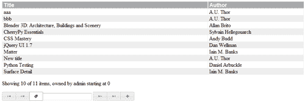

# 第五章. 实体和关系

> 大多数现实生活中的应用程序都包含多个实体，并且通常这些实体之间有很多关系。在数据库建模中，这些关系是强项之一。在本章中，我们将开发一个应用程序来维护多个用户的图书列表。

在本章中，我们将：

+   设计和实现一个由多个实体和关系组成的数据模型

+   实现可重用的实体和关系模块

+   深入探讨清晰分离功能层的重要性

+   并且遇到 jQuery UI 的自动完成小部件

因此，让我们开始吧...

# 设计一个图书数据库

在我们开始设计我们的应用程序之前，让我们先好好看看它需要处理的不同的实体。我们识别出的实体有书、作者和用户。一本书可能有多个属性，但在这里我们限制自己只包括标题、ISBN（国际标准书号）和出版社。作者只有一个名字，但当然，如果我们想用额外的属性来扩展它，比如出生日期或国籍，我们总是可以稍后添加。最后，用户是一个具有单个属性的实体，即用户 ID。

下一个重要的部分是要对这些实体之间的关系有一个清晰的理解。一本书可能由一位或多位作者撰写，因此我们需要在图书实体和作者实体之间定义一个关系。此外，任何数量的用户都可能拥有一本书的副本。这是我们不得不定义的另一个关系，这次是在图书实体和用户实体之间。以下图表可能有助于更清楚地看到这些实体及其关系：


这三个实体及其之间的关系需要在两个领域中进行表示：作为数据库表和作为 Python 类。现在我们可以像我们在上一章为 `tasklist` 应用程序所做的那样，分别对每个实体和关系进行建模，但所有实体都共享很多共同的功能，因此有大量的重用机会。重用意味着更少的代码，更少的代码等于更少的维护，并且通常有更好的可读性。那么，让我们看看我们需要定义一个可重用的 `Entity` 类需要什么。

## 实体类

从我们之前章节中学到的知识，我们已经知道每个代表实体的类都需要实现一个共享的功能集：

+   它需要能够验证数据库中是否存在相应的表，如果不存在则创建一个。

+   需要实现一种以线程安全的方式管理数据库连接的方法。

此外，每个实体都应该提供一个 **CRUD** 接口：

+   *创建* 新的对象实例

+   *检索* 单个对象实例以及找到符合某些标准的实例

+   *更新* 对象实例的属性并将这些数据同步到数据库中

+   *删除* 对象实例

这有很多共享功能，但当然一本书和作者并不相同：它们在属性的数量和类型上有所不同。在我们查看实现之前，让我们说明我们如何希望使用 `Entity` 类来定义一个特定的实体，例如一辆车。

# 使用 `Entity` 类进行操作的时间

让我们首先定义我们希望如何使用 `Entity` 类，因为我们要创建的接口必须尽可能接近我们希望在代码中表达的东西。以下示例显示了我们的想法（作为 `carexample.py` 提供）：`

**Chapter5/carexample.py**

```py
from entity import Entity
class Car(Entity): pass Car.threadinit('c:/tmp/cardatabase.db')
Car.inittable(make="",model="",licenseplate="unique")
mycar = Car(make="Volvo",model="C30",licenseplate="12-abc-3")
yourcar = Car(make="Renault",model="Twingo",licenseplate="ab-cd-12")
allcars = Car.list()
for id in allcars:
	car=Car(id=id)
	print(car.make, car.model, car.licenseplate)

```

我们的想法是创建一个 `Car` 类，它是 `Entity` 的子类。因此，我们必须采取以下步骤：

1.  从 `entity` 模块导入 `Entity` 类。

1.  定义 `Car` 类。这个类的主体完全为空，因为我们只是从 `Entity` 类继承所有功能。当然，我们可以添加特定的功能，但通常这不应该必要。

1.  初始化数据库连接。在我们能够处理 `Car` 实例之前，应用程序必须为每个线程初始化数据库连接。在这个例子中，我们没有创建额外的线程，所以只有一个需要连接到数据库的应用程序的主线程。我们在这里使用 `threadinit()` 方法（已突出显示）创建了一个连接。

1.  确保数据库中存在适当的表，并且具有必要的列。因此，我们使用 `inittable()` 方法，并使用指定我们的实体属性（可能包括如何将它们定义为数据库表中的列的额外信息）的参数调用它。我们在这里定义了三个列：`make, model` 和 `licenseplate`。记住，SQLite 不需要显式类型，所以 `make` 和 `model` 只传递了一个空字符串作为值的参数。然而，在这个例子中，`licenseplate` 属性被添加了一个 `unique` 约束。

现在我们可以处理 `Car` 实例了，正如创建两个不同对象或检索数据库中所有 `Car` 记录的 ID 并使用这些 ID 实例化 `Car` 对象以打印 `Car` 的各种属性的最后几行所示。

这是我们希望它工作的方式。下一步是实现这一点。

## 刚才发生了什么？

之前的示例展示了我们如何从 `Entity` 派生出 `Car` 类并使用它。但 `Entity` 类是什么样子呢？

`Entity` 类的定义从定义一个类变量 `threadlocal` 和一个类方法 `threadinit()` 开始，用于使用一个包含每个线程本地数据（即 `entity.py` 中的完整代码）的对象初始化这个变量。

如果这个`threadlocal`对象还没有`connection`属性，则会创建一个新的数据库连接（高亮显示），并且我们通过设置其`row_factory`属性为`sqlite.Row`来配置这个连接，因为这将使我们能够通过名称访问结果中的列。

我们还执行一个单独的`pragma foreign_keys=1`语句来启用外键的强制执行。正如我们将看到的，在讨论关系的实现时，这对于维护没有悬空引用的数据库至关重要。这个`pragma`必须为每个连接单独设置；因此，我们将其放在线程初始化方法中。

**Chapter5/entity.py**

```py
import sqlite3 as sqlite
import threading
class Entity:
	threadlocal = threading.local()
	@classmethod
	def threadinit(cls,db): if not hasattr(cls.threadlocal,'connection') or 
cls.threadlocal.connection is None:
				cls.threadlocal.connection=sqlite.connect(db)
				cls.threadlocal.connection.row_factory = sqlite.Row
				cls.threadlocal.connection.execute("pragma foreign_
keys=1")
			else:
				pass #print('threadinit thread has a connection 
object already')

```

接下来是`inittable()`方法。这个方法应该只调用一次，以验证为这个实体所需的表已经存在，或者如果不存在，则定义一个具有合适列的表。它接受任意数量的键值参数。键的名称对应于列的名称，这样的键的值可能是一个空字符串或带有额外属性（例如，`unique`或显式的类型如`float`）的字符串。

### 注意

虽然 SQLite 允许你在列中存储任何类型的值，但你仍然可以定义一个类型。这个类型（或者更准确地说，**亲和性**）是 SQLite 在存储到列中时尝试将值转换成的类型。如果它不成功，则值将按原样存储。例如，将列定义为`float`可能节省很多空间。更多关于这些亲和性的信息可以在[`www.sqlite.org/datatype3.html`](http://www.sqlite.org/datatype3.html)找到。

**Chapter5/entity.py**

```py
@classmethod
def inittable(cls,**kw):
		cls.columns=kw
		connection=cls.threadlocal.connection
		coldefs=",".join(k+' '+v for k,v in kw.items()) sql="create table if not exists %s (%s_id integer primary 
key autoincrement, %s);"%(cls.__name__,cls.__name__,coldefs)
		connection.execute(sql)
		connection.commit()

```

列定义存储在`columns`类变量中，供`__init__()`方法稍后使用，并将它们连接成一个字符串。然后，这个字符串与类的名称（在（可能派生的）类的`__name__`属性中可用）一起用于组成创建表的 SQL 语句（高亮显示）。

除了基于键值参数定义的列之外，我们还可以创建一个自动填充唯一整数的主键列。这样，我们确保以后可以引用表中的每一行，例如，从一个定义关系的桥接表中。

当我们考虑之前的汽车示例时，我们看到一个 Python 语句如下：

```py
Car.inittable(make="",model="",licenseplate="unique")

```

转换为以下 SQL 语句：

```py
create table if not exists Car (
Car_id integer primary key autoincrement,
make ,
licenseplate unique,
model
);

```

注意，我们传递给`inittable()`方法的键值参数的顺序不一定被保留，因为这些参数被存储在一个`dict`对象中，而常规的`dict`对象不保留其键的顺序。

### 注意

有时保留字典中键的顺序是非常希望的。在这种情况下，列顺序并不重要，但 Python 在其 `collections` 模块中确实提供了一个 `OrderedDict` 类（见 [`docs.python.org/library/collections.html#collections.OrderedDict`](http://docs.python.org/library/collections.html#collections.OrderedDict)），我们可以使用它。然而，这将阻止我们使用关键字来定义每个列。

还要注意，没有实现任何形式的合理性检查：任何东西都可以作为列定义中的一个值的参数传递。是否合理留给 SQLite 在通过 `execute()` 方法将 SQL 语句传递给数据库引擎时判断。

此方法如果 SQL 语句中存在语法错误，将引发 `sqlite3.OperationalError`。然而，许多问题只是被忽略。如果我们传递一个像 `licenseplate="foo"` 这样的参数，它将愉快地继续，假设 `foo` 是它不认识的一种类型，所以它被简单地忽略了！如果执行没有引发异常，我们最后将提交我们的更改到数据库。

## 尝试检查你的输入

对传递的参数静默忽略不是一个好习惯。没有明确的检查，开发者可能甚至不知道他/她做错了什么，这可能会在以后产生反效果。

你会如何实现代码来限制值到一个有限的指令集？

提示：SQL 列定义中的类型和约束大多由单个单词组成。例如，你可以将每个单词与允许的类型列表进行核对。

# 创建实例的时间

我们接下来要查看的方法是构造函数 `__init__()` 方法。它将用于创建实体的单个实例。构造函数可以通过两种方式调用：

+   使用单个 `id` 参数，在这种情况下，将从数据库中检索现有记录，并用该记录的列值初始化实例，或者

+   使用多个关键字参数来创建一个新实例并将其保存为新的数据库记录

实现此行为的代码如下所示：

**第五章/entity.py**

```py
def __init__(self,id=None,**kw): for k in kw:
			if not k in self.__class__.columns :
				raise KeyError("unknown column")
		cursor=self.threadlocal.connection.cursor()
		if id:
			if len(kw):
				raise KeyError("columns specified on 
retrieval")
			sql="select * from %s where %s_id = ?"%(
			self.__class__.__name__,self.__class__.__name__)
			cursor.execute(sql,(id,))
			entities=cursor.fetchall() if len(entities)!=1 : 
				raise ValueError("not a singular entity")
			self.id=id
			for k in self.__class__.columns: setattr(self,k,entities[0][k])
		else:
			cols=[]
			vals=[]
			for c,v in kw.items():
				cols.append(c)
				vals.append(v)
				setattr(self,c,v)
			cols=",".join(cols)
			nvals=",".join(["?"]*len(vals)) sql="insert into %s (%s) values(%s)"%(
			self.__class__.__name__,cols,nvals)
			try:
				with self.threadlocal.connection as conn:
					cursor=conn.cursor() cursor.execute(sql,vals)
					self.id=cursor.lastrowid
			except sqlite.IntegrityError:
					raise ValueError("duplicate value for unique 
col")

```

代码反映了这种双重用途。在检查所有关键字确实指向先前定义的列（突出显示）之后，它检查是否传递了 `id` 参数。如果是，则不应有其他任何关键字参数。如果有额外的关键字，将引发异常。如果存在 `id` 参数，接下来将构建一个 SQL 语句，该语句将从相关表中检索记录。每条记录的主键应与 ID 匹配。

## 刚才发生了什么？

因为主键是唯一的，所以这最多匹配一条记录，这是在我们检索匹配的记录后验证的。如果我们没有获取到正好一条（1）记录，将引发异常（突出显示）。

如果一切顺利，我们将使用内置的 `setattr()` 函数初始化我们正在创建的实例的属性。我们检索到的记录的列可以通过名称访问，因为我们已将连接对象的 `row_factory` 属性初始化为 `sqlite3.Row`。我们还存储了列的名称在 `columns` 类变量中，这使得我们可以使用相应的列名称的值来初始化实例的属性（高亮显示）。

使用以下方式创建一个 `Car` 实例：

```py
Car(id=1)

```

将导致如下 SQL 语句：

```py
select * from Car where Car_id = ?

```

其中问号是传递给 `execute()` 方法的实际值的占位符。

如果没有提供 `id` 参数，则执行代码的第二分支（从 `else` 子句开始）。在这种情况下，我们将分离关键字名称和值，并设置我们正在创建的实例的属性。然后，关键字名称和值用于构建一个 SQL 语句，以在与此 `Entity` 相关的表中插入一行（高亮显示）。例如：

```py
Car(make="Volvo", model="C30", licenseplate="12-abc-3")

```

将给出：

```py
insert into Car (make,model,licenseplate) values(?,?,?)

```

问号再次是用于传递给 `execute()` 方法的值的占位符。

如果调用 `execute()` 方法（高亮显示）顺利，我们将使用 `lastrowid` 属性的值初始化我们正在创建的实例的 `id` 属性。因为我们定义了主键为一个 `primary key integer autoincrement` 列，并且在插入语句中没有指定它，所以主键将保留一个新唯一的整数，这个整数作为 `lastrowid` 属性可用。

### 注意

这非常特定于 SQLite，并且主键应该以完全相同的方式定义，才能使这一点成立。更多关于此的信息可以在 [`www.sqlite.org/lang_createtable.html#rowid`](http://www.sqlite.org/lang_createtable.html#rowid) 找到。

任何可能由于违反唯一性约束而引发的 `sqlite3.IntegrityError` 都会被捕获并重新引发为带有稍微更有意义文本的 `ValueError`。

`update()` 方法用于同步实例与数据库。它可以有两种用法：我们首先可以更改实例的任何属性，然后调用 `update()`，或者我们可以传递关键字参数给 `update()`，让 `update()` 更改相应的属性并将实例同步到数据库。这两种方式甚至可以结合使用。无论如何，一旦 `update()` 返回，数据库将保留所有对应于列的所有属性的当前值。因此，以下两段代码是等效的：

```py
car.update(make='Peugeot')

```

并且：

```py
car.make='Peugeot'
car.update()

```

我们传递给 `update()` 的任何关键字参数都应该匹配列名称，否则将引发异常（高亮显示）。

**第五章/entity.py**

```py
def update(self,**kw): for k in kw:
			if not k in self.__class__.columns :
				raise KeyError("unknown column")
		for k,v in kw.items():
			setattr(self,k,v)
		updates=[]
		values=[]
		for k in self.columns:
			updates.append("%s=?"%k)
			values.append(getattr(self,k))
		updates=",".join(updates)
		values.append(self.id)
		sql="update %s set %s where %s_id = ?"%(
		self.__class__.__name__, updates, self.__class__.__name__)
		with self.threadlocal.connection as conn:
			cursor=conn.cursor()
			cursor.execute(sql, values) if cursor.rowcount != 1 :
				raise ValueError(
				"number of updated entities not 1 (%d)" %
				cursor.rowcount)

```

列名称和相应的属性值随后用于构建一个 SQL 语句来更新具有这些值的记录，但仅限于与我们要更新的实例的 ID 匹配的单个记录。SQL 语句可能看起来像这样：

```py
update Car set make=?, model=?, licenseplate=? where Car_id = ?

```

再次使用问号作为我们传递给 `execute()` 方法的值的占位符。

在执行此语句后，我们通过验证受影响的记录数确实是 1 来进行合理性检查。就像插入语句一样，这个数字在更新语句之后作为游标对象的 `rowcount` 属性可用（高亮显示）。

实例的删除是通过 `Entity` 类的 `delete()` 方法实现的，主要是由一个 SQL 语句组成，该语句将删除具有与实例的 `id` 属性相等的键的记录。生成的 SQL 看起来像这样：

```py
delete from Car where Car_id = ?

```

就像在 `update()` 方法中一样，我们以一个合理性检查结束，以验证仅影响了一条记录（高亮显示）。请注意，`delete()` 只会删除数据库中的记录，而不会删除调用它的 Python 实例。如果没有其他东西引用此对象实例，它将被 Python 的垃圾回收器自动删除：

**第五章/entity.py**

```py
def delete(self):
		sql="delete from %s where %s_id = ?"%(
		self.__class__.__name__,self.__class__.__name__)
		with self.threadlocal.connection as conn:
				cursor=conn.cursor()
				cursor.execute(sql,(self.id,)) if cursor.rowcount != 1 :
					raise ValueError(
					"number of deleted entities not 1 (%d)" %
					cursor.rowcount)

```

我们遇到的最后一个方法是类方法 `list()`。当不带参数调用时，此方法可以用来检索实体的所有实例的 ID，或者检索与作为参数传递的某些标准匹配的实例的 ID。例如：

```py
Car.list()

```

将返回数据库中所有汽车的 ID 列表，而：

```py
Car.list(make='Volvo')

```

将返回数据库中所有沃尔沃的 ID。

**第五章/entity.py**

```py
@classmethod
def list(cls,**kw): sql="select %s_id from %s"%(cls.__name__,cls.__name__) 
		cursor=cls.threadlocal.connection.cursor()
		if len(kw):
				cols=[]
				values=[]
				for k,v in kw.items():
						cols.append(k)
						values.append(v) whereclause = " where "+",".join(c+"=?" for c in 
cols)
				sql += whereclause
				cursor.execute(sql,values)
		else:
				cursor.execute(sql)
		for row in cursor.fetchall():
				yield row[0]

```

实现很简单，从创建一个选择表中选择所有 ID 的 SQL 语句开始（高亮显示）。一个例子将是：

```py
select Car_id from Car

```

如果向 `list()` 方法传递了任何关键字参数，这些参数将用于构建一个 `where` 子句，该子句将限制返回的 ID 仅限于与记录匹配的 ID。这个 `where` 子句被附加到我们的通用选择语句（高亮显示）。例如：

```py
select Car_id from Car where make=?

```

在调用 `execute()` 方法之后，我们通过使用 `yield` 语句产生所有 ID。通过使用 `yield` 语句，我们已经将 `list()` 方法标识为一个 **生成器**，它将逐个返回找到的 ID，而不是一次性返回。如果我们愿意，我们仍然可以像处理列表一样操作这个生成器，但对于非常大的结果集，生成器可能是一个更好的选择，因为它确实消耗更少的内存，例如。

## 关系类

`Relation` 类用于管理实体各个实例之间的关系。如果我们有 `Car` 实体以及 `Owner` 实体，我们可能希望定义一个 `CarOwner` 类，它为我们提供识别特定车主拥有的特定汽车的功能。

与实体一样，通用关系共享许多共同的功能：我们必须能够创建两个实体之间的新关系，删除关系，以及根据主实体列出相关实体，例如列出特定汽车的或特定车主的所有汽车。

关系存储在数据库中的一个表中，通常称为**桥接表**，其中包含存储相关实体 ID 的列的记录。当应用程序开始使用（`Relation`类的子类）时，我们必须验证相应的表是否存在，如果不存在，则创建它。

# 使用`Relation`类进行操作的时间

让我们看看我们如何使用我们的`Relation`类：

**Chapter5/carexample2.py**

```py
from entity import Entity
from relation import Relation
class Car(Entity): pass
class Owner(Entity): pass
Car.threadinit('c:/tmp/cardatabase2.db')
Car.inittable(make="",model="",licenseplate="unique")
Owner.threadinit('c:/tmp/cardatabase2.db')
Owner.inittable(name="") class CarOwner(Relation): pass
CarOwner.threadinit('c:/tmp/cardatabase2.db')
CarOwner.inittable(Car,Owner)
mycar = Car(make="Volvo",model="C30",licenseplate="12-abc-3")
mycar2 = Car(make="Renault",model="Coupe",licenseplate="45-de-67")
me = Owner(name="Michel") CarOwner.add(mycar,me)
CarOwner.add(mycar2,me)
owners = CarOwner.list(mycar)
for r in owners:
	print(Car(id=r.a_id).make,'owned by',Owner(id=r.b_id).name)
owners = CarOwner.list(me)
for r in owners:
	print(Owner(id=r.b_id).name,'owns a',Car(id=r.a_id).make)

```

+   如前所述，我们首先定义一个`Car`类，然后定义一个`Owner`类，因为我们定义并初始化的`CarOwner`类只有在关系中的实体存在时才有意义。高亮行显示，定义和初始化关系遵循与初始化实体相同的一般模式。

+   然后，我们创建了两个`Car`实体和一个`Owner`实体，并在这两个实体之间建立了关系（第二组高亮行）。

+   最后几行显示了如何查找并打印一辆车的车主或车主拥有的车辆。

许多`Relation`类的要求与`Entity`类的要求相似，所以当我们查看代码时，一些部分看起来会很熟悉。

## 刚才发生了什么？

我们遇到的第一种方法是`threadinit()`类方法（完整代码可在`relation.py`中找到）。它与我们在`Entity`类中遇到的方法相同，并且应该为每个线程调用一次。

**Chapter5/relation.py**

```py
@classmethod
def threadinit(cls,db):
		if not hasattr(cls.threadlocal,'connection') or 
cls.threadlocal.connection is None:
				cls.threadlocal.connection=sqlite.connect(db)
				cls.threadlocal.connection.row_factory = sqlite.Row
				cls.threadlocal.connection.execute(
													"pragma 
foreign_keys=1")

```

`inittable()`类方法是我们在启动应用程序时应该调用一次的方法：

**Chapter5/relation.py**

```py
@classmethod
def inittable(cls, entity_a, entity_b,
							reltype="N:N", cascade=None): sql='''create table if not exists %(table)s (
			%(a)s_id references %(a)s on delete cascade,
			%(b)s_id references %(b)s on delete cascade,
			unique(%(a)s_id,%(b)s_id)
	);
	'''%{'table':cls.__name__,
				'a':entity_a.__name__,'b':entity_b.__name__}
	with cls.threadlocal.connection as conn:
			cursor=conn.cursor()
			cursor.execute(sql)
	cls.columns=[entity_a.__name__,entity_b.__name__]

```

它接受参与关系的两个类作为参数，以构建一个适当的 SQL 语句来创建一个桥接表（如果尚不存在）（高亮显示）。

例如，`CarOwner.inittable(Car,Owner)`将产生如下语句：

```py
create table if not exists CarOwner (
				Car_id references Car on delete cascade,
				Owner_id references Owner on delete cascade,
				unique(Car_id,Owner_id)

```

在这里有几个有趣的事情需要注意。这里有两列，每列都通过`references`子句引用一个表。因为我们没有在表中明确指出*哪一列*是我们引用的，所以引用是针对主键的。这是一种方便的记录方式，并且它之所以有效，是因为我们总是为任何表示实体的表定义一个合适的主键。

另一个需要注意的事项是`on delete cascade`子句。这有助于我们维护所谓的**引用完整性**。它确保当被引用的记录被删除时，引用它的桥接表中的记录也会被删除。这样，就不会有指向不存在实体的关系的表中的条目。为了确保实际上执行了引用完整性检查，必须为每个数据库连接执行`pragma foreign_keys = 1`指令。这在`threadinit()`方法中得到了处理。

最后，对这两个列有 `unique` 约束。这实际上确保了我们只为两个实体之间的每个关系在这个表中维护最多一个条目。也就是说，如果我拥有一辆车，我只能进入这个特定的关系一次。

如果此语句的执行顺利，`inittable()` 方法将存储在 `columns` 类变量中，该变量引用此关系所涉及的实体类名称。

## 快速问答：如何检查一个类

我们如何确保传递给 `initdb()` 方法的类是 `Entity` 的子类？

## 关系实例

`__init__()` 方法构建一个 `Relation` 实例，即我们使用它来记录两个特定实体之间的关系。

**Chapter5/relation.py**

```py
def __init__(self,a_id,b_id,stub=False):
		self.a_id=a_id
		self.b_id=b_id
		if stub : return
		cols=self.columns[0]+"_id,"+self.columns[1]+"_id"
		sql='insert or replace into %s (%s) values(?,?)'%(
			self.__class__.__name__,cols)
		with self.threadlocal.connection as conn:
			cursor=conn.cursor()
			cursor.execute(sql,(a_id,b_id))
			if cursor.rowcount!=1:
					raise ValueError()

```

它接受涉及此特定关系的两个 `Entity` 实例的 ID 和一个 `stub` 参数。

`__init__()` 方法不应该直接调用，因为它不知道也不检查传递给它的 ID 是否有意义。如果 `stub` 参数为真，它简单地存储这些 ID；如果不是，它就在表中插入一条记录。

通常，我们会使用 `add()` 方法来创建一个新的关系，并进行所有必要的类型检查。将此分离是有意义的，因为所有这些检查都很昂贵，如果我们知道我们传递的 ID 是正确的，则这些检查是不必要的。例如，`Relation` 类的 `list()` 方法仅检索有效的 ID 对，这样我们就可以使用 `__init__()` 方法而无需进行昂贵的额外检查。

构造的 SQL 语句可能看起来像这样，对于一个新的 `CarOwner` 关系：

```py
insert or replace into CarOwner (Car_id,Owner_id) values(?,?)

```

如果我们尝试在这两个实体之间插入第二个关系，这两个列上的 `unique` 约束将违反。如果是这样，`insert or replace` 子句将确保插入语句不会失败，但仍然只有一个包含这两个 ID 的记录。

注意，插入语句可能会因为其他原因失败。如果我们尝试插入的任何一个 ID 都不指向它所引用的表中的现有记录，它将抛出异常 `sqlite3.IntegrityError: foreign key constraint failed`。

最后，在最后一行进行最终的健康检查，使用 `rowcount` 属性来验证只插入了一个记录。

`add()` 方法确实通过检查通过给它的实例的类名与由 `inittable()` 方法存储的列名是否匹配来确保这些实例的顺序正确。如果这不正确，它会抛出一个 `ValueError()` 异常，否则它会通过调用类构造函数并传递两个 ID 来实例化一个新的关系。

**Chapter5/relation.py**

```py
@classmethod
def add(cls,instance_a,instance_b):
		if instance_a.__class__.__name__ != cls.columns[0] :
				raise ValueError("instance a, wrong class")
		if instance_b.__class__.__name__ != cls.columns[1] :
				raise ValueError("instance b, wrong class")
		return cls(instance_a.id,instance_b.id)

```

`list()` 方法旨在返回零个或多个 `Relation` 对象的列表。

**Chapter5/relation.py**

```py
@classmethod
def list(cls,instance):
		sql='select %s_id,%s_id from %s where %s_id = ?'%(
				cls.columns[0],cls.columns[1],
				cls.__name__,instance.__class__.__name__)
		with cls.threadlocal.connection as conn:
				cursor=conn.cursor()
				cursor.execute(sql,(instance.id,))
				return [cls(r[0],r[1],stub=True)
								for r in cursor.fetchall()]

```

它需要适用于关系的两边：如果我们向 `CarOwner` 类的 `list()` 方法传递一个 `Car` 实例，例如，我们应该找到所有 `Car_id` 列与 `Car` 实例的 `id` 属性匹配的记录。

同样，如果我们传递一个`Owner`实例，我们应该找到所有`Owner_id`列与`Owner`实例的`id`属性匹配的记录。但正因为我们在表示关系的表中给出了有意义的列名，这些列名是从类名派生出来的，所以这相当直接。例如，为`CarOwner.list(car)`构建的 SQL 可能如下所示：

```py
select Car_id,Owner_id from CarOwner where Car_id = ?

```

而 SQL 查询`CarOwner.list(owner)`可能看起来如下所示：

```py
select Car_id,Owner_id from CarOwner where Owner_id = ?

```

这是通过引用作为参数传递的实例的类名（突出显示）来实现的。

执行此 SQL 语句后，使用`fetchall()`方法检索结果，并将其作为关系实例的列表返回。请注意，如果没有任何匹配的关系，此列表可能为零长度。

为`Relation`类定义的最后一个值得注意的是`delete()`方法。

**Chapter5/relation.py**

```py
def delete(self):
		sql='delete from %s where %s_id = ? and %s_id = ?'%(
			self.__class__.__name__,self.columns[0],self.columns[1])
		with self.threadlocal.connection as conn:
			cursor=conn.cursor()
			cursor.execute(sql,(self.a_id,self.b_id))
			if cursor.rowcount!=1:
					raise ValueError()

```

它构建了一个 SQL 删除语句，在我们的`CarOwner`示例中可能如下所示：

```py
delete from CarOwner where Car_id = ? and Owner_id = ?

```

最后一条语句中我们执行的健全性检查意味着如果删除的记录数不是恰好一条，则会引发异常。

### 注意

如果没有恰好一条记录被删除，那会意味着什么？

如果多于一个，那将表明一个严重的问题，因为所有约束都是为了防止有超过一条记录描述相同的关系，但如果为零，这通常意味着我们试图删除相同的关系多次。

你可能会想知道为什么没有方法可以以任何方式更新`Relation`对象。原因是这几乎没有任何意义：两个实体实例之间要么存在关系，要么不存在。例如，如果我们想转移一辆车的所有权，简单地删除车辆和当前车主之间的关系，然后添加车辆和新车主之间的关系就足够简单了。

现在我们已经有一个简单的实体和关系框架，让我们看看我们如何使用这个框架来实现我们图书应用程序的基础。

# 定义图书数据库的时间到了

下一步是创建一个名为`booksdb.py`的模块，该模块使用`entity`和`relation`模块来构建一个数据模型，该模型可以方便地被交付层（处理向客户端提供内容的 Web 应用程序部分）使用。因此，我们必须定义`Book, Author`和`User`实体以及`BookAuthor`关系和`UserBook`关系。

我们还将提供一些更高级别的函数，例如，一个`newbook()`函数，该函数检查给定标题的书籍是否已经存在，并且只有当作者不同时（可能是因为他们写了同一标题的书籍）才创建新的`Book`实例。

在上下文中以有意义的术语对数据进行建模的独立层使得理解正在发生的事情变得更容易。它还使交付层更加简洁，因此更容易维护。

## 刚才发生了什么？

在导入`Entity`和`Relation`类之后，我们首先定义适当的实体和关系（完整的代码作为`booksdb.py`提供）。我们遇到的第一个函数是`threadinit()`（高亮显示）。这是一个便利函数，它调用我们定义的不同实体和关系的所有单个`threadinit()`方法：

**第五章/booksdb.py**

```py
from entity import Entity
from relation import Relation
class Book(Entity):
	pass
class Author(Entity):
	pass
class User(Entity):
	pass
class BookAuthor(Relation):
	pass
class UserBook(Relation):
	pass def threadinit(db):
	Book.threadinit(db)
	Author.threadinit(db)
	User.threadinit(db)
	BookAuthor.threadinit(db)
	UserBook.threadinit(db)

```

同样，`inittable()`函数是一个便利函数，它调用所有必要的`inittable()`方法：

**第五章/booksdb.py**

```py
def inittable():
	Book.inittable(title="",isbn="unique",publisher="")
	Author.inittable(name="")
	User.inittable(userid="unique not null")
	BookAuthor.inittable(Book,Author)
	UserBook.inittable(User,Book)

```

它将`Book`定义为`Entity`的子类，具有`title`、唯一的`isbn`和`publisher`属性。`Author`被定义为具有仅`name`属性的`Entity`子类，而`User`作为具有唯一且不能为空的`userid`的`Entity`。此外，`Book`和`Author`以及`User`和`Book`之间存在的关联在这里被初始化。

应使用`newbook()`函数将新书添加到数据库中：

**第五章/booksdb.py**

```py
def newbook(title,authors,**kw):
	if not isinstance(title,str) :
			raise TypeError("title is not a str")
	if len(title)<1 :
			raise ValueError("title is empty")
	for a in authors :
			if not isinstance(a,Author) :
				raise TypeError("authors should be of type Author")
bl=list(Book.list(title=title,**kw)) if len(bl) == 0:
				b=Book(title=title,**kw)
elif len(bl) == 1:
				b=Book(id=bl[0])
else:
	raise ValueError("multiple books match criteria")
lba=list(BookAuthor.list(b))
if len(authors):
	lba=[Author(id=r.b_id) for r in lba]
	for a in authors:
			known=False
			for a1 in lba:
					if a.id == a1.id :
							known=True
							break
			if not known:
					r=BookAuthor.add(b,a)
return b

```

需要一个`title`参数和一个`Author`对象的列表以及任意数量的可选关键词来选择一本独特的书籍，如果标题不足以识别书籍的话。如果找不到具有给定标题和附加关键词的书籍，将创建一个新的`Book`对象（高亮显示）。如果找到多个符合标准的书籍，将引发异常。

下一步是检索与这本书相关的作者列表。此列表用于检查传递给`newbook()`函数的作者列表中是否有任何作者尚未与这本书关联。如果没有，则添加这个新作者。这确保我们不会尝试将作者与同一本书关联多次，同时也使得向现有书籍的作者列表中添加作者成为可能。

`newauthor()`函数验证传递给参数的名字不为空，并且确实是一个字符串（高亮显示）：

**第五章/booksdb.py**

```py
def newauthor(name): if not isinstance(name,str) :
			raise TypeError("name is not a str")
	if len(name)<1 :
			raise ValueError("name is empty")
	al=list(Author.list(name=name))
	if len(al) == 0:
				a=Author(name=name)
	elif len(al) == 1:
				a=Author(id=al[0])
	else:
			raise ValueError("multiple authors match criteria")
	return a

```

然后它检查是否已存在具有该名称的作者。如果没有，则创建一个新的`Author`对象并返回。如果只找到一个`Author`，则返回该`Author`而不创建新的。如果相同的名称匹配多个`Author`，则引发异常，因为我们的当前数据模型不提供具有相同名称的多个作者的概念。

注册书籍的应用程序通常用于查看我们是否已经拥有这本书。因此，列出符合一组标准书籍的功能应该相当灵活，以便为最终用户提供足够的功能，使查找书籍尽可能简单，即使书籍数量达到数千本。

`listbooks()`函数试图封装必要的功能。它接受多个关键字参数，用于匹配任意数量的书籍。如果存在`user`参数，返回的结果将限制为该用户拥有的书籍。同样，`author`参数将结果限制为该作者所写的书籍。`pattern`参数可能是一个字符串，它将返回的书籍限制为标题包含`pattern`参数中文本的书籍。

由于匹配的书籍数量可能非常大，`listbooks()`函数接受两个额外的参数以返回较小的子集。这样，交付层可以分页提供结果列表。`offset`参数确定子集的起始位置和返回结果的数量。如果`limit`为`-1`，则返回从给定`offset`开始的全部结果。例如：

```py
booksdb.listbooks(user=me,pattern="blind",limit=3)

```

将返回我拥有的标题中包含“盲”文字的前三本书。

给定这些要求，`listbooks()`的实现相当直接：

**第五章/booksdb.py**

```py
def listbooks(user=None,author=None,offset=0,limit=-1,pattern=""):
	lba={}
	lbu={}
	if not user is None:
			if not isinstance(user,User):
					raise TypeError("user argument not a User") lbu={r.b_id for r in UserBook.list(user)}
	if not author is None:
			if not isinstance(author,Author):
					raise TypeError("author argument not an Author")
			lba={r.a_id for r in BookAuthor.list(author)}
	if user is None and author is None: lb={b for b in Book.list()}
	else:
			if len(lbu)==0 : lb=lba
			elif len(lba)==0 : lb=lbu
			else : lb = lba & lbu
	books = [Book(id=id) for id in lb] books = sorted(books,key=lambda book:book.title.lower())
	if pattern != "" :
			pattern = pattern.lower()
			books = [b for b in books
								if b.title.lower().find(pattern)>=0 ]
	if limit<0 :
			limit=len(books)
	else:
			limit=offset+limit
	return len(books),books[offset:limit]

```

它首先检查任何`user`参数确实是一个`User`实体的实例，然后找到该用户拥有的所有书籍（突出显示）并将此列表转换为**集合**。以类似的方式检查任何`author`参数。如果没有指定作者或用户，我们只需检索所有书籍的列表（突出显示）并将其转换为集合即可。

使用集合非常方便，因为集合永远不会包含重复项，并且可以轻松地进行操作。例如，如果我们有一个与作者关联的非空书籍集合以及一个用户拥有的非空书籍集合，我们可以使用`&`运算符获取它们的**交集**（即既被给定所有者拥有又被给定作者所写）。

无论哪种方式，我们最终都会得到一个包含书籍 ID 的`lb`列表。然后，将这个 ID 列表转换为`Book`对象，并按标题排序，以确保在处理偏移量时结果的一致性（突出显示）。下一步是减少结果数量，只保留标题中包含`pattern`参数中文本的书籍。

### 注意

所有这些匹配、排序和过滤也可以使用 SQL 完成，并且可能更加高效。然而，这意味着 SQL 将相当复杂，我们将会破坏`entity`和`relation`模块中定义的低级数据库操作与在这里`booksdb`中定义的更高级操作的清晰区分。如果效率更重要，那将是一个合理的论点，但在这里我们选择清晰的分离以帮助理解，因为 Python 比 SQL 更容易阅读。

现在剩下的只是根据`offset`和`limit`参数从书籍列表中返回适当的切片，如`listbooks()`函数的最后一行所示。请注意，我们实际上返回一个元组，第一个元素是匹配书籍的总数，第二个元素是实际的匹配书籍列表。这使得向最终用户展示信息变得简单，例如“显示第 20-29 项，共 311 项”。

`listauthors()`函数要么在给定`book`参数的情况下返回与书籍关联的作者列表，要么返回所有作者列表：

**第五章/booksdb.py**

```py
def listauthors(book=None):
	if not book is None:
			if not isinstance(book,Book):
					raise TypeError("book argument not a Book")
			la=[r.b_id for r in BookAuthor.list(book)]
	else:
			la=Author.list()
	return [Author(id=id) for id in la]

```

它确实确保任何`book`参数确实是一个`Book`实体的实例。

可以调用`checkuser()`来查看是否已经存在具有给定用户名的用户，如果不存在，则创建一个：

**第五章/booksdb.py**

```py
def checkuser(username):
	users=list(User.list(userid=username))
	if len(users):
			return User(id=users[0])
	return User(userid=username)

```

任何使用此应用程序的用户都应该有一个相应的`User`实体，如果他/她想要能够注册他/她的书籍所有权。此函数确保这是可能的。

注意，我们的应用程序在此级别不*认证*用户，这留给传输层，正如我们将看到的。传输层使用的任何认证数据库都与我们的书籍数据库中的`User`实体完全分开。例如，传输层可以使用系统密码数据库来认证用户，并在认证成功后将用户名传递给此层。如果在此点，用户尚未存在于我们的书籍数据库中，我们可以通过调用`checkuser()`函数来确保他/她存在。

`addowner()`和`delowner()`函数用于建立或删除书籍与用户之间的特定所有权关系。这两个函数都是`Relation`类中底层方法的薄包装，但添加了一些额外的类型检查。

**第五章/booksdb.py**

```py
def addowner(book,user):
	if not isinstance(book,Book):
			raise TypeError("book argument not a Book")
	if not isinstance(user,User):
			raise TypeError("user argument not a User")
	return UserBook.add(user,book)
def delowner(book,user):
	if not isinstance(book,Book):
			raise TypeError("book argument not a Book")
	if not isinstance(user,User):
			raise TypeError("user argument not a User")
	UserBook(user.id,book.id,stub=True).delete()

```

在下一节中，我们将利用这个基础来实现传输层。

## 突击测验：如何选择有限数量的书籍

你将如何从数据库中所有书籍的列表中选择第三页的 10 本书？

## 尝试英雄般地清理书籍数据库

`booksdb.py`缺少`delbooks()`函数，因为我们不会在我们的最终应用程序中提供此功能。仅仅删除所有权并保留书籍原样，即使它没有任何所有者，也不是一个缺点，因为其他用户可以通过引用此现有书籍来注册所有权，而无需再次输入。然而，偶尔我们可能想要清理数据库。你将如何实现一个删除所有无所有者书籍的函数？

## 传输层

由于我们在`entity, relation`和`booksdb`模块上建立了坚实的基础，我们现在可以干净地将交付层与应用程序的其余部分分离。交付层仅由几个 CherryPy 应用程序组成。为了验证用户身份，我们将重用我们在前几章中遇到的登录应用程序，而应用程序的其余部分则由一个包含提供两个主要屏幕所需方法的`Books`类组成：一个可导航和可过滤的书籍列表和一个用于向数据库添加新书籍的屏幕。

# 设计交付层的时间

为了设计这些屏幕，通常方便的做法是绘制一些草图，以便有一个屏幕的视觉表示。这使得与客户讨论功能变得容易得多。

有许多优秀的应用程序可以帮助你绘制一些原型（例如，微软的 Expression Blend 或 Kaxaml [`kaxaml.com/`](http://kaxaml.com)），但通常，尤其是在设计应用程序的早期阶段，简单的草图就足够了，即使它是手绘的。插图显示了我在制作草图时使用的草图，两者都是用 GIMP（http://www.gimp.org/）完成的：


第一张图是用户可以与之交互的书籍列表屏幕草图，第二张图显示了添加新书籍的屏幕可能的样子。


这样的图像很容易在讨论期间打印和标注，而不需要计算机应用程序，你只需要一支笔或铅笔。另一种有用的设计技术是在白板上绘制一些轮廓，并在讨论功能时添加细节。在会议结束时，你可以用你的手机拍下白板的照片，并将其作为起点。设计很可能会在开发过程中发生变化，而从这个简单的起点开始可以节省大量的努力，这些努力可能需要在以后撤销。

当我们查看列出书籍的屏幕设计时，我们立即看到关键功能都在**按钮栏**中。值得注意的是，我们将不得不实现以下功能：

+   显示书籍列表

+   在此列表中向前和向后翻页

+   将书籍列表限制为当前用户拥有的书籍

+   根据标题中出现的单词过滤书籍列表

添加新书籍的屏幕设计看似简单。用户必须能够输入标题和作者以表明他拥有这本书，但这意味着在后台，我们至少有以下场景需要检查：

+   数据库中没有具有给定标题的书籍

+   存在具有给定标题但没有给定作者的书籍

+   已知书籍和作者的组合

在第一种情况下，我们必须创建一个新的`Book`实体，如果作者未知，还可能创建一个新的`Author`实体。

在第二种情况下，我们还将创建一个新的`Book`实体，因为不同的作者可能以相同的标题写书。在一个更复杂的应用中，我们可能能够根据 ISBN 进行区分。

在最后一种情况下，我们不需要创建新的`Book`或`Author`实体，但我们仍然需要确保我们注册了那本特定书籍的所有权。

最终要求是使用户感到方便。如果有很多用户在数据库中录入书籍，那么有人注册他/她拥有的新书时，这本书可能已经在数据库中。为了节省用户输入，如果我们能在用户输入时显示可能的标题和作者列表，那就很好了。这被称为自动完成，结合 jQuery UI 和 Python 实现起来相当直接。


当`booksweb.py`启动时，书籍列表将看起来像前面的图像，接下来显示添加新书的页面。我们将在本章的最后部分增强这些外观，但首先我们关注`booksweb.py`中交付层的实现。


自动完成是客户端输入验证的紧密伴侣。通过向用户提供一个选择列表，我们降低了用户输入类似标题但拼写略有不同的情况的风险。当然，还有一些额外的检查要做：例如，标题可能不能为空。如果用户确实输入了错误，也应该有一些反馈，以便他/她可以纠正错误。

当然，客户端验证是一个有用的工具，可以增强用户体验，但它不能保护我们免受恶意尝试破坏我们数据的风险。因此，我们还实施了一些服务器端检查。

## 刚才发生了什么？

我们首先创建一个全局变量，它包含我们将同时在书单屏幕和添加书籍屏幕中使用的 HTML（完整的代码作为`booksweb.py`提供）：

**第五章/booksweb.py**

```py
with open('basepage.html') as f:
	basepage=f.read(-1)

```

我们是从一个单独的文件中读取它，而不是将其作为字符串存储在模块内部。将 HTML 存储在单独的文件中使得编辑变得容易得多，因为编辑器可以使用语法高亮显示 HTML，而不是仅仅将其标记为 Python 中的字符串字面量。该文件作为`basepage.html`提供：

**第五章/basepage.html**

```py
<html><head><title>Books</title> <script src="http://ajax.googleapis.com/ajax/libs/jquery/1.4.2/jquery.
min.js" type="text/javascript"></script>
<script src="http://ajax.googleapis.com/ajax/libs/jqueryui/1.8.3/
jquery-ui.min.js" type="text/javascript"></script>
<link rel="stylesheet" href="http://ajax.googleapis.com/ajax/libs/
jqueryui/1.8.3/themes/smoothness/jquery-ui.css" type="text/css" 
media="all" />
<link rel="stylesheet" href="http:///books.css" type="text/css" media="all" 
/>
</head><body>
<div id="content">%s</div>
<script src="img/booksweb.js" type="text/javascript"></script>
</body>
</html>

```

这次，我们选择将所有外部库从 Google 的内容交付网络（突出显示）中整合进来。

你可能不想在生产应用程序中依赖外部机构，但在开发过程中，这确实是一个优势，因为你不必携带这些文件。即使在生产环境中，这个选择也可能是有意义的，因为这个选项将减少对服务器的请求次数并最小化带宽。同样，我们引用了 Google 的内容交付网络（CDN）上我们选择的主题（Smoothness）的相关样式表和文件。

### 注意

除了 Google 之外，许多其他大型玩家也提供内容交付网络（CDN），你可以使用。即使是 Microsoft（http://www.asp.net/ajaxlibrary/cdn.ashx）也在其 CDN 上提供对 jQuery 和 jQuery UI 库的免费访问。

头部部分还包含一个指向附加样式表 `books.css` 的链接，该样式表将用于调整不是 jQuery UI 小部件的元素布局和样式。

主体是一个单独的 `<div>` 元素，其中包含一个 `%s` 占位符，用于填充不同相关标记以用于书单和新书页面，之后是一个 `<script>` 标签，它将为特定页面内的其他脚本元素提供常用功能。

`booksweb.py` 继续定义 `Books` 类，该类将作为 CherryPy 框架中此应用程序的中心应用。

**第五章/booksweb.py**

```py
class Books():
	def __init__(self,logon,logoffpath):
			self.logon=logon
			self.logoffpath=logoffpath
	@cherrypy.expose
	def index(self):
			username = self.logon.checkauth()
			return basepage % '<div id="booklist"></div>'

```

`index()` 函数使用单个 `<div>` 元素提供 `basepage.html`，该元素将包含内容。

`list()` 方法将在 `booksweb.js` 中定义的 JavaScript 函数加载后调用，并用于最初填充内容 `<div>`，以及当导航按钮栏中的按钮被按下时刷新此 div 的内容。

在我们检查 `list()` 和 `addbook()` 方法之前，让我们看看 `booksweb.js` 中的 JavaScript，以了解这些方法是如何从客户端的 AJAX 调用中调用的（完整的 JavaScript 代码作为 `booksweb.js` 提供）。

**第五章/booksweb.js**

```py
$.ajaxSetup({cache:false,type:"GET"});

```

在 `booksweb.js` 中遇到的第一项活动是为所有 AJAX 调用设置全局默认值。我们禁用缓存以确保浏览器每次我们请求它时都执行 AJAX 调用，而不会检查它是否之前已经对同一 URL 执行了调用，否则我们实际上不会刷新我们书单的内容。

为了调试目的，我们还确保每个 AJAX 调用都使用 HTTP `GET` 方法，因为在 `POST` 调用中，参数通常不会被记录，而在 `GET` 调用中，参数是请求 URL 的一部分。

我们接下来遇到的 `prepnavbar()` 函数是我们的工作马：每次我们通过 URL `/books/list` 获取书籍列表时，一旦请求完成，就会调用 `prepnavbar()` 一次。

**第五章/booksweb.js**

```py
function prepnavbar(response, status, XMLHttpRequest){
	$("#firstpage").button({
				text: false,
				icons: {
						primary: "ui-icon-seek-start"
				}
	});
	$("#previouspage").button({
				text: false,
				icons: {
						primary: "ui-icon-seek-prev"
				}
	});
	$("#mine").button({
				text: false,
				icons: {
						primary: "ui-icon-tag"
				}
	});
	$("#nextpage").button({
				text: false,
				icons: {
						primary: "ui-icon-seek-next"
				}
	});
	$("#lastpage").button({
				text: false,
				icons: {
						primary: "ui-icon-seek-end"
				}
	});
	$("#addbook").button({
				text: false,
				icons: {
						primary: "ui-icon-plusthick"
				}
	});
	t=$("#toolbar").buttonset();
	$("span",t).css({padding:"0px"});
	$(".bookrow:odd").addClass('oddline');
};
$("#booklist").load('/books/list',prepnavbar);$("#booklist").load('/
books/list',prepnavbar);

```

`/books/list` 返回的 HTML 不仅包含匹配的书籍，还包括导航按钮本身以及返回的匹配书籍数量的附加信息。这些导航按钮尚未进行样式设置，配置此任务由 `prepnavbar()` 函数完成。

它将每个按钮（除了用于按文本过滤的输入按钮）样式化为一个没有文本但有适当图标的 jQuery UI 按钮小部件。它还向 `bookrow` 类的每个奇数行添加 `oddline` 类，这样我们就可以在我们的样式表中引用这个类，例如，给它添加独特的斑马条纹。

当 `booksweb.js` 执行时，页面的内容由一个空的 `<div>` 组成。这个 `<div>` 元素被调用 `/books/list` URL 并带有参数（最后一行）返回的 HTML 填充。`prepnavbar()` 函数作为 `load()` 方法的第二个参数传递，并在数据加载完成后被调用。

`booksweb.js` 的剩余部分充满了为所有导航按钮添加实时点击处理器的代码。

**第五章/booksweb.js**

```py
function getparams(){
	var m=0;
	// apparently the checked attr of a checkbox is magic:
// it returns true/false, not the contents!
	if ( $("#mine").attr("checked")==true ) { m = 1}
	return { offset:Number($("#firstid").text()),
			limit:Number($("#limitid").text()),
				filter:$("#filter").val(),
				mine:m
			};
};
$("#mine").live('click',function(){
	// this function is fired *after* the click
// toggled the checked attr
	var data = getparams();
	if (data.mine) {
			$("#mine").removeAttr("checked");
	} else {
			$("#mine").attr("checked","yes");
	}
	$("#booklist").load('/books/list',data,prepnavbar);
	return true;
}); $("#firstpage").live('click',function(){
	var data = getparams();
	data.offset=0;
	$("#booklist").load('/books/list',data,prepnavbar);
	return true;
});
$("#previouspage").live('click',function(){
	var data = getparams();
	data.offset -= data.limit;
	if(data.offset<0){ data.offset=0;}
	$("#booklist").load('/books/list',data,prepnavbar);
	return true;
});
$("#nextpage").live('click',function(){
	var data = getparams();
	var n=Number($("#nids").text())
	data.offset += data.limit;
	if(data.offset>=n){ data.offset=n-data.limit;}
	if(data.offset<0){ data.offset=0;}
	$("#booklist").load('/books/list',data,prepnavbar);
	return true;
});
$("#lastpage").live('click',function(){
	var data = getparams();
	var n=Number($("#nids").text())
	data.offset = n-data.limit;
	if(data.offset<0){ data.offset=0;}
	$("#booklist").load('/books/list',data,prepnavbar);
	return true;
});
$("#filter").live('keyup',function(event){
	if (event.keyCode == '13') {
			event.preventDefault();
			data = getparams();
			data.offset=0;
			$("#booklist").load('/books/list',data,prepnavbar);
	}
	return true;
});
$("#addbook").live('click',function(){
	window.location.href="http:///books/addbook";
	return true;
});

```

任何匹配其选择器的元素都将附加一个实时处理程序，即使这些元素在文档中尚未存在。这将确保当我们重新加载包含新导航按钮的书籍列表时，我们在这里定义的点击处理程序也将绑定到这些新按钮上。

这些处理程序中的每一个都会调用 `getparams()` 函数来检索包含 `id="info"` 的 `<p>` 元素中的信息。这些数据作为 JavaScript 对象返回，可以传递给 `load()` 方法。`load()` 方法将在此对象中附加的属性作为参数附加到它调用的 URL 上。对象中的信息反映了当前列出的书籍，每个处理程序都会根据其功能修改这些数据。

例如，`#firstpage` 按钮的处理程序（高亮显示）修改了 `offset` 属性。它在调用 `/books/load` 以检索第一组书籍之前，将其简单地设置为零。

`#previouspage` 按钮的处理程序从偏移量中减去 `limit` 属性的值以获取包含书籍的前一页，但确保偏移量不小于零。其他可点击按钮的处理程序在调用 `/books/load` 之前执行类似操作。

例外的是 `#mine` 按钮的处理程序，它不操作偏移量，而是切换 `checked` 属性。

`#pattern` 输入元素也有所不同。它不对点击做出反应，而是在按下 *回车* 键时做出反应。如果按下该键，它也会像其他处理程序一样调用 `getparams()`。以这种方式检索到的对象也将包含一个 `pattern` 属性，该属性包含用户刚刚输入的 `#pattern` 输入元素的值。将 `offset` 属性设置为零以确保当我们传递新的模式值时，我们从列表的开始处查看结果列表。

让我们回到 `booksweb.py` 的服务器端，看看 `list()` 方法是如何实现的。

**第五章/booksweb.py**

```py
@cherrypy.expose
def list(self,offset=0,limit=10,mine=1,pattern="",_=None):
		username = self.logon.checkauth()
		userid=booksdb.checkuser(username)
		try:
			offset=int(offset) if offset<0 : raise ValueError("offset < 0")
		except ValueError:
			raise TypeError("offset not an integer")
		try:
			limit=int(limit)
			if limit<-1 : raise ValueError("limit < -1")
		except ValueError:
			raise TypeError("limit not an integer")
		try:
			mine=int(mine)
		except ValueError:
			raise TypeError("mine not an integer")
		if not mine in (0,1) :
			raise ValueError("mine not in (0,1)")
		if len(pattern)>100 :
			raise ValueError("length of pattern > 100")
		# show titles
		yield '<div class="columnheaders"><div class="title">Title</
div><div class="author">Author</div></div>'
		# get matching books
		if mine==0 : userid=None
		n,books = booksdb.listbooks(user=userid,
				offset=offset,limit=limit,pattern=pattern)
		# yield them as a list of divs
		for b in books: a1=booksdb.listauthors(b)[0]
				yield '''<div id="%d" class="bookrow">
<div class="title">%s</div>
<div class="author">%s</div>
</div>'''%(b.id,b.title,a1.name)
		# yield a line of navigation buttons
		yield '''<div id="navigation">
<p id="info">Showing
<span id="limitid">%d</span> of
<span id="nids">%d</span> items,
owned by <span id="owner">%s</span> starting at
<span id="firstid">%d</span>
</p>
<div id="toolbar">
<button id="firstpage" value="First">First</button>
<button id="previouspage" value="Previous">Prev</button>
<input id="mine" type="checkbox" %s /><label for="mine">Mine</label>
<input id="pattern" type="text" value="%s" />
<button id="nextpage" value="Next" >Next</button>
<button id="lastpage" value="Last" >Last</button>
<button id="addbook" value="Add">Add</button>
</div>
</div>'''%(limit,n,username if mine else "all",
					offset,'checked="yes"'if mine else "", pattern)

```

`list()`方法接受多个关键字参数以确定要返回哪些书籍。它不会返回一个完整的 HTML 页面，而只是返回一个代表书籍选择的`<div>`元素列表，以及一些关于所选书籍数量和用于浏览列表的按钮元素的一些附加信息：

+   `offset`参数确定匹配书籍列表的起始位置。计数从 0 开始。

+   `limit`参数确定要返回的匹配书籍数量。这是一个最大值，如果没有足够的书籍，将返回更少的书籍。当我们有 14 本匹配的书籍时，偏移量为 10，限制为 10，将返回从 13 到 10 的 10 本书。

+   如果`mine`参数非零，匹配的书籍列表将限制为请求用户拥有的书籍。

+   如果`pattern`参数不是一个空字符串，匹配的书籍列表将限制为包含该模式字符串的标题的书籍。

+   `_`（下划线）参数被忽略。我们在`booksweb.js`中配置了我们的 AJAX 调用不要缓存，jQuery 通过在请求的 URL 中每次附加一个具有随机值的`_`参数来防止缓存。这样，浏览器每次看到的 URL 都会不同，这将防止缓存。

`list()`方法的实现首先验证用户是否已登录，然后检索相应的`User`对象。接下来的步骤系统地验证传递给方法的方法参数，并在验证失败时引发`ValueError`或`TypeError`。例如，`offset`参数应该大于或等于零（突出显示）。

一旦参数得到验证，这些参数就会被传递给`booksdb.listbooks()`函数，该函数将负责实际的筛选并将返回一个元组，包含匹配的书籍数量和按标题排序的实际书籍列表。

这个书籍列表用于遍历并生成适当的 HTML 标记。对于每一本书，我们获取书籍的作者（突出显示），然后生成一个包含 HTML 标记的字符串。这个 HTML 包含书籍的标题和第一作者的名字。如果我们还想展示更多信息，例如书籍的 ISBN，我们很容易在这里添加。通过使用`yield`逐个返回结果，我们避免了在返回之前先构建一个完整的字符串的麻烦。

最后的`yield`语句包含一个具有`id="navigation"`的`<div>`元素。我们选择返回完整的导航标记，包括按钮，以便我们能够轻松设置这些按钮的值。例如，`<input>`模式元素应该显示我们当前过滤的文本。我们可以将其作为单独的信息传递，并使用客户端 JavaScript 来设置这些值，但这会使 JavaScript 变得相当复杂。

尽管如此，`offset`和`limit`值以及匹配的书籍总数都返回在`<p>`元素内。这服务于两个目的：我们可以将其显示为用户的信息消息，但它也是导航按钮正常工作的必要信息。

# 添加新书的时间到了

将新书添加到数据库的屏幕是一个简单的表单。我们需要实现的是：

+   一些 HTML，使其能够显示表单

+   我们 CherryPy 应用程序中的一个方法，将生成此 HTML

+   在此表单提交后处理输入的方法

在这里不需要实现两种不同的方法，因为基于传递给方法的参数，我们可以决定是返回表单还是处理同一表单的提交内容。虽然设计一个执行两项任务的方法可能被认为是不好的做法，但它确实将相关的功能放在一起。

## 刚才发生了什么？

`addbookform`类变量包含一个模板，该模板引用了多个字符串变量以进行插值。还有一个`<script>`元素，用于添加一些额外的功能，我们稍后将其检查：

**Chapter5/booksweb.py**

```py
	addbookform='''<div id="newbook">
<form action="addbook" method="get">
<fieldset><legend>Add new book</legend>
<input name="title" id="title" type="text" value="%(title)s" 
%(titleerror)s />
<label for="title">Title</label>
<input name="author" id="author" type="text" value="%(author)s" 
%(authorerror)s />
<label for="author">Author</label>
</fieldset>
<div class="buttonbar">
<button name="submit" type="submit" value="Add">Add</button>
<button name="cancel" type="submit" value="Cancel">Cancel</button>
</div>
</form>
<div id="errorinfo"></div>
</div>'''

```

`addbook()` 方法本身既用于显示初始屏幕，也用于处理结果，即它作为`<form>`元素的动作属性的靶标，并处理来自各种`<input>`和`<button>`元素的值。

因此，所有参数都是具有默认值的键值参数。如果它们全部缺失，`addbook()` 将构建一个空表单，否则它将检查并处理信息。在后一种情况下，将有两种可能的场景：值是正确的，在这种情况下，将添加新书，并将用户返回到包含书籍列表的页面，或者一个或多个值不正确，在这种情况下，将再次呈现表单，带有适当的错误标记，但用户输入的值仍然保留以供编辑。

**Chapter5/booksweb.py**

```py
@cherrypy.expose
def addbook(self,title=None,author=None,submit=None,cancel=None):
		username = self.logon.checkauth()
		userid=booksdb.checkuser(username)
		if not cancel is None: raise cherrypy.HTTPRedirect("/books")
		data=defaultdict(str)
		if submit is None:
				return basepage%(Books.addbookform%data)
		if title is None or author is None:
				raise cherrypy.HTTPError(400,'missing argument')
		data['title']=title
		data['author']=author
		try:
				a=booksdb.newauthor(author)
				try:
						b=booksdb.newbook(title,[a])
						booksdb.addowner(b,userid)
						raise cherrypy.HTTPRedirect("/books")
				except ValueError as e:
data['titleerror']= 'class="inputerror ui-state-error" 
title="%s"'%str(e)
			except ValueError as e:
data['authorerror']= 'class="inputerror ui-state-error" 
title="%s"'%str(e)
			return basepage%(Books.addbookform%data)

```

`addbook()` 方法首先验证用户是否已登录，如果是，则获取相应的`User`对象。下一步是检查表单中包含的取消按钮是否被点击，如果是，则`cancel`参数将包含一个值，并将用户重定向到书籍列表（突出显示）。

接下来，我们创建一个默认字典，它将为每个访问的缺失键返回一个空字符串。这个默认字典将被用作`addbookform`中字符串的插值数据。这样，如果我们想设置多个插值变量（例如，`<input>`元素的`value`属性中的`%(title)s`），但如果我们省略了任何内容，它将被自动替换为空字符串。

如果`submit`参数等于 None，这意味着它不存在，因此调用`addbook()`来显示空表单，这正是所做之事（高亮显示）。因为此时`data`中没有任何键，所以所有插入变量都将产生空字符串，从而得到一个空表单。

如果`submit`参数不为 None，我们正在处理表单中的值。首先我们进行合理性检查。如果`title`或`author`参数中任何一个缺失，我们抛出一个异常（高亮显示）。即使用户未能输入其中任何一个，相应的值也会出现在参数中，但作为空字符串。所以，如果这些参数中任何一个完全缺失，这不能是用户操作的结果，因此抛出异常是有意义的。

如果两个参数都存在，我们将它们保存在默认字典中，这样我们就可以在需要再次显示表单时，将其作为默认值显示。

下一步是尝试从`booksdb`模块中的`newauthor()`函数。它要么返回一个有效的`Author`对象（因为我们已经知道作者或者创建了一个新的作者）或者抛出一个异常。这样的异常会被捕获，并将错误文本添加到字典中的`authorerror`键，以及一些 HTML 类属性，这将使我们能够以适当的方式显示相应的`<input>`元素，以指示错误状态。

一旦我们有一个有效的`Author`对象，我们将使用相同的方法来检索一个有效的`Book`对象。这可能会失败（主要如果`title`参数是空字符串），在这种情况下，我们将`titleerror`键设置在字典中。

我们通过调用`addowner()`函数在用户和书籍之间建立所有权关系，然后将用户重定向到列出书籍的页面。

如果出现任何问题，我们会捕获一些异常，最终回到返回语句，这将再次返回表单，但这次字典将包含一些将被插入的键，从而产生合适的默认值（例如，如果`title`参数为空，但`author`参数不为空，用户不必再次输入作者的姓名）以及遇到的错误信息。

所有这些字符串插入可能有点令人畏惧，所以让我们简要地看一下一个例子。`addbookform`变量中标题`<input>`元素的定义如下：

```py
<input name="title" id="title" type="text" value="%(title)s" 
%(titleerror)s />

```

如果我们想向用户显示一个空表单，字符串将与一个不包含任何键的默认字典进行插入。因此，引用`%(title)s`和`%(titlerror)s`将产生空字符串，结果如下：

```py
<input name="title" id="title" type="text" value="" />

```

一个不带默认值的普通`<input>`元素。

现在如果定位或创建作者出现问题，字典将包含`title`键但没有`titleerror`键（但会有`authorerror`键）。假设用户输入的书名是“一本书名”，那么最终的插值将看起来像这样：

```py
<input name="title" id="title" type="text" value="A book title" />

```

最后，如果标题出现了错误，例如，因为用户没有输入书名，`title`键将存在（尽管在这种情况下，是一个空字符串）以及`titleerror`键。`titleerror`键的值包含错误消息作为 HTML 的`title`属性，以及一个看起来像这样的 HTML`class`属性：

```py
class="inputerror ui-state-error" title="title is empty"

```

因此，最终的插值结果将是：

```py
<input name="title" id="title" type="text" value="" class="inputerror 
ui-state-error" title="title is empty" />

```

## 自动完成

当我们展示了显示添加新书表单的页面的 HTML 标记时，我们跳过了末尾的`<script>`元素。这个脚本元素用于通过**自动完成**增强标题和作者`<input>`元素。

# 使用具有自动完成的输入字段执行操作的时间

在放置了`<script>`元素之后，输入元素现在可以通过 AJAX 调用检索可能的完成项。现在，当我们在一个输入字段中输入一些字符时，我们会看到一个选择列表，如图像所示：


让我们详细看看这是如何在 JavaScript 中实现的，令人惊讶的是，只有几行代码。

## 刚才发生了什么？

如果我们再次查看代码，我们会看到我们在`#title`和`#author <input>`元素上都调用了`autocomplete()`方法，但每个都有不同的源参数。jQuery UI 中的**自动完成小部件**非常灵活且易于应用（显示的代码是`booksweb.py`的一部分，但我们之前跳过了这部分）：

**第五章/booksweb.py**

```py
<script>
$("#title" ).autocomplete({ source:'/books/gettitles',
											minLength:2}).focus();
$("#author").autocomplete({ source:'/books/getauthors',
											minLength:2});
</script>

```

我们传递给`autocomplete()`方法的选项对象的`source`属性包含一个 URL，该 URL 将用于检索已输入字符的可能完成项列表。

`minLength`属性确保只有在用户输入至少两个字符后，我们才开始寻找可能的完成项，否则列表可能会非常大，而且帮助不大。请注意，仍然可以在输入字段中输入一个全新的值。用户没有义务从显示的列表中选择一个项目，并且可以继续输入。

自动完成小部件将已输入的文本作为`term`参数添加到`source` URL 中。当用户在`#author <input>`元素中输入`foo`时，这将导致对类似`/books/getauthors?term=foo&_=12345678`的 URL 的调用。

这意味着`gettitles()`和`getauthors()`方法都将接受一个`term`参数（以及一个`_`（下划线）参数以确保没有缓存）：

**第五章/booksweb.py**

```py
@cherrypy.expose
	def getauthors(self,term,_=None):
			return json.dumps(booksdb.getauthors(term))
@cherrypy.expose
def gettitles(self,term,_=None):
			titles=json.dumps(booksdb.gettitles(term))
			return titles

```

两种方法只是将请求传递给相应的 `booksdb` 函数，但由于自动完成小部件期望结果为 JSON 编码的字符串，我们在返回之前使用 `json.dumps()` 函数将列表转换为字符串：

**Chapter5/booksdb.py**

```py
def gettitles(term):
	titles=Book.getcolumnvalues('title')
	re=compile(term,IGNORECASE)
	return list(takewhile(lambda x:re.match(x),
							dropwhile(lambda x:not re.match(x),titles)))
def getauthors(term):
	names=Author.getcolumnvalues('name')
	re=compile(term,IGNORECASE)
	return list(takewhile(lambda x:re.match(x),
							dropwhile(lambda x:not re.match(x),names)))

```

`booksdb.py` 中的 `getauthors()` 和 `gettitles()` 函数可以简单地检索 `Author` 或 `Book` 对象的列表，并提取 `name` 或 `title` 属性。然而，这样做相当慢，因为创建大量对象在处理能力方面成本很高。此外，因为我们真正感兴趣的是字符串列表而不是整个对象，所以在 `Entity` 类中实现一个 `getcolumnvalues()` 方法是值得的：

**Chapter5/entity.py**

```py
@classmethod
def getcolumnvalues(cls,column):
		if not column in cls.columns :
				raise KeyError('unknown column '+column) sql="select %s from %s order by lower(%s)"%(column,
				cls.__name__,column)
		cursor=cls.threadlocal.connection.cursor()
		cursor.execute(sql)
		return [r[0] for r in cursor.fetchall()]

```

`getcolumnvalues()` 首先检查请求的列是否存在于这个 `Entity`（子）类中，如果不存在则抛出异常。然后它构建一个 SQL 语句来返回请求列中的值，排序时不考虑大小写（高亮显示）。结果是包含单个元素的元组列表，在返回之前将其转换为简单的项目列表。

## 展示层

现在我们已经实现了传输层，应用程序几乎可以使用，但边缘看起来有点粗糙。尽管由于使用了 jQuery UI 小部件内置的样式，一些组件看起来相当不错，但其他部分需要一些重大的调整。

# 使用增强的展示层进行操作的时间

额外的 JavaScript 代码和 CSS 信息分别包含在 `booksweb.js` 和 `booksweb.css` 中。以下插图显示了书籍列表页面和添加新书籍页面的最终结果：



我们添加了一些斑马条纹以帮助可读性，并更改了列标题的外观。


添加书籍的页面使用了与书籍列表页面上的按钮相同的样式。同时，布局得到了清理，并添加了功能以清晰可见的方式呈现任何返回的错误（在最后一个示例中，标题为空，因此背景为红色）。


## 刚才发生了什么？

为了实现前图中看到的变化，我们在 `booksweb.js` 中添加了以下几行 JavaScript：

**Chapter5/booksweb.js**

```py
$(".buttonbar").buttonset();
$("#newbook button[name=submit]").button({
				text: false,
				icons: {
						primary: "ui-icon-plusthick"
				}
});
$("#newbook button[name=cancel]").button({
				text: false,
				icons: {
						primary: "ui-icon-trash"
				}
});

```

这种效果仅仅是改变按钮的外观，而不是通过某种事件处理器添加功能，因为不需要这样做。页面包含一个带有有效 `action` 属性的常规 `<form>` 元素，因此我们的提交和取消按钮将按预期工作。

其余的更改，包括边框、字体和颜色，都在 `booksweb.css` 中实现，这里我们不对其进行检查，因为其中包含的 CSS 非常简单。

# 摘要

在本章中，我们关于围绕由多个实体和关系组成的数据模型设计和实现 Web 应用学到了很多。

具体来说，我们涵盖了：

+   如何设计数据模型

+   如何创建可重用的实体和关系框架

+   如何在数据库、对象层和交付层之间保持清晰的分离

+   如何使用 jQuery UI 的自动完成小部件实现自动完成

我们还讨论了输入验证的重要性，包括客户端和服务器端。

我们尚未充分发挥我们的实体和关系框架以及输入验证的潜力，输入验证可能涉及更多。为了锻炼我们的新技能并扩展它们，下一章将介绍设计和构建一个维基应用。
