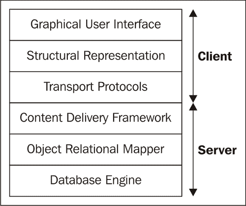

# 第六章：建立维基

> 现在，维基是一个广为人知的工具，它能够以合作的方式让人们维护知识体系。维基百科（http://wikipedia.org）可能是今天最著名的维基示例，但无数的论坛都使用某种维基，并且存在许多工具和库来实现维基应用程序。
> 
> 在本章中，我们将开发自己的维基，在这个过程中，我们将关注构建 Web 应用程序的两个重要概念。第一个是数据层的设计。我们将基于上一章创建的简单框架进行构建，并尝试确定我们当前实现中的局限性。我们将构建的维基应用程序是一个很好的测试案例，因为它比之前开发的图书数据库要复杂得多。
> 
> 第二个是输入验证。维基通常是一个非常公开的应用程序，甚至可能不采用基本的身份验证方案来识别用户。这使得向维基贡献变得非常简单，但同时也使得维基在某种程度上容易受到攻击，因为任何人都可以在维基页面上放置任何内容。因此，验证任何提交的更改内容是一个好主意。例如，您可以移除任何 HTML 标记或禁止外部链接。
> 
> 以有意义的方式增强用户交互通常与输入验证密切相关。正如我们在上一章中看到的，客户端输入验证有助于防止用户输入不希望的内容，因此它是任何应用程序的有价值补充，但不能替代服务器端输入验证，因为我们不能信任外部世界不会试图以未预期的方式访问我们的服务器。
> 
> 当我们在本章开发我们的维基应用程序时，我们将明确处理输入验证和用户交互。

在本章中，我们将：

+   为维基应用程序实现数据层

+   实现交付层

+   仔细研究输入验证

+   遇到 jQuery UI 的对话框小部件

因此，让我们开始吧...

# 数据层

一个维基由许多我们可以识别的独立实体组成。我们将通过重用之前开发的实体/关系框架来实现这些实体及其之间的关系。

# 设计维基数据模型的时间

与任何应用程序一样，当我们开始开发我们的维基应用程序时，我们必须首先采取一些步骤来创建一个可以作为开发起点的数据模型：

1.  识别在应用程序中扮演角色的每个实体。这可能会取决于需求。例如，因为我们希望用户能够更改主题的标题，并且我们希望存档内容的修订版本，所以我们定义了单独的主题和页面实体。

1.  识别实体之间的直接关系。我们决定定义独立的主题和页面实体意味着它们之间存在关系，但还可以识别更多关系，例如主题和标签之间的关系。不要指定间接关系：所有标记相同标签的主题在某种程度上是相关的，但通常没有必要记录这些间接关系，因为它们可以从记录的主题和标签之间的关系中轻易推断出来。

图像显示了我们在维基应用程序中可以识别的不同实体和关系。请注意，与书籍应用程序一样，用户是一个独立的实体，与例如密码数据库中的任何用户都不同。

在图中，我们说明了这样一个事实：一个`主题`可能拥有多个`页面`，而`页面`通过将页面表示为矩形堆叠和将`用户`表示为单个矩形的方式，以一种相当非正式的方式引用单个用户。这样，我们可以一眼抓住关系的最相关方面。当我们想要显示更多关系或具有不同特性的关系时，使用更正式的方法和工具可能是个好主意。一个好的起点是维基百科上的 UML 条目：[`en.wikipedia.org/wiki/Unified_Modelling_Language`](http://en.wikipedia.org/wiki/Unified_Modelling_Language)。


## 刚才发生了什么？

在我们的数据模型中确定了实体和关系之后，我们可以看看它们的特定品质。

维基中的基本实体是`主题`。在这个上下文中，主题基本上是一个描述该主题内容的标题。一个主题可以关联任意数量的页面。每个`页面`实例代表一个修订版；最新的修订版是主题的*当前版本*。每次编辑主题时，都会在数据库中存储一个新的修订版。这样，如果我们犯了错误，可以简单地回滚到早期版本，或者比较两个修订版的内容。为了简化修订版的识别，每个修订版都有一个修改日期。我们还维护了`页面`和修改该`页面`的`用户`之间的关系。

在我们将要开发的维基应用程序中，也可以将任意数量的标签与主题关联。`标签`实体简单地由一个`标签`属性组成。重要的是存在于`主题`实体和`标签`实体之间的关系。

与`标签`类似，`单词`实体由一个属性组成。同样，重要的是关系，这次是`主题`与任意数量的`单词`之间的关系。我们将维护这种关系以反映主题当前版本（即页面的最后修订版）中使用的单词。这将允许我们有相当响应的全文本搜索功能。

我们遇到的最后一个实体是`Image`实体。我们将使用它来存储与文本页面一起的图片。我们不会在主题和图片之间定义任何关系。图片可能会在主题的文本中提到，但除了这个文本引用之外，我们不会维护正式的关系。如果我们想维护这样的关系，每次存储页面的新修订时，我们就必须扫描图片引用，并且如果尝试引用一个不存在的图片，我们可能还需要发出某种信号。在这种情况下，我们选择忽略这一点：数据库中不存在的图片引用将简单地显示为无：

```py
from entity import Entity
from relation import Relation
class User(Entity): pass
class Topic(Entity): pass
class Page(Entity): pass
class Tag(Entity): pass
class Word(Entity): pass
class Image(Entity): pass
class UserPage(Relation): pass
class TopicPage(Relation): pass
class TopicTag(Relation): pass
class ImagePage(Relation): pass
class TopicWord(Relation): pass
def threadinit(db):
	User.threadinit(db)
	Topic.threadinit(db)
	Page.threadinit(db)
	Tag.threadinit(db)
	Word.threadinit(db)
	Image.threadinit(db)
	UserPage.threadinit(db)
	TopicPage.threadinit(db)
	TopicTag.threadinit(db)
	ImagePage.threadinit(db)
	TopicWord.threadinit(db) **def inittable():**
	User.inittable(userid="unique not null")
	Topic.inittable(title="unique not null") **Page.inittable(content="",**
						modified="not null default CURRENT_TIMESTAMP")
	Tag.inittable(tag="unique not null")
	Word.inittable(word="unique not null")
	Image.inittable(type="",data="blob",title="",
						modified="not null default CURRENT_TIMESTAMP",
						description="")
	UserPage.inittable(User,Page)
	TopicPage.inittable(Topic,Page)
	TopicTag.inittable(Topic,Tag)
	TopicWord.inittable(Topic,Word) 
```

**因为我们可以重用我们之前开发的实体和关系模块，所以数据库层的实际实现很简单（完整代码作为`wikidb.py`提供）。在导入这两个模块后，我们首先为我们在数据模型中确定的所有实体定义一个`Entity`的子类。所有这些类都是直接使用的，因此它们的主体只有一个`pass`语句。**

**同样，我们为我们的 wiki 应用程序中需要实现的每个关系定义一个`Relation`的子类。**

**所有这些`Entity`和`Relation`子类仍然需要在每次应用程序启动时调用一次初始化代码，这就是便利函数`initdb()`的作用所在。它捆绑了每个实体和关系的初始化代码（突出显示）。**

**我们在这里定义的许多实体都很简单，但其中一些需要更仔细的检查。`Page`实体包含一个`modified`列，该列有一个`non null`约束。它还有一个默认值：`CURRENT_TIMESTAMP`（突出显示）。这个默认值是 SQLite 特定的（其他数据库引擎将会有其他指定此类默认值的方式），如果我们创建一个新的`Page`记录而没有明确设置值，它将初始化修改列到当前日期和时间。**

**`Image`实体也有一个稍微不同的定义：它的`data`列被明确定义为具有`blob`亲和力。这将使我们能够在这个表中无任何问题地存储二进制数据，这是我们存储和检索图片中包含的二进制数据所必需的。当然，SQLite 会高兴地存储我们传递给这个列的任何东西，但如果我们传递一个字节数组（而不是字符串），那么这个数组将按原样存储。**

**# 传输层**

在数据层的基础上，即数据层就绪后，我们在开发传输层时在此基础上构建。在传输层和数据库层之间，还有一个额外的层，它封装了特定领域的知识（即，它知道如何验证新`Topic`实体的标题是否符合我们在将其存储在数据库之前设定的要求）：



我们的应用程序中的每个不同层都在其自己的文件或文件中实现。很容易混淆，所以在我们进一步深入研究这些文件之前，先看看以下表格。它列出了组成 wiki 应用程序的不同文件，并引用了在第一章中引入的层名称，“选择你的工具”（如前图所示）。

| 文件 | 层 |   |
| --- | --- | --- |
| `wikiweb.py` | 内容交付框架 | 我们的主要 CherryPy 应用程序 |
| `wiki.py` | 对象关系映射器 | 领域特定部分；由`wikiweb.py`导入 |
| `wikidb.py` | 对象关系映射器 | 领域无关部分；由`wikiweb.py`导入 |
| `basepage.html` | 结构表示 | 由`wikiweb.py`用于向客户端提供页面 |
| `wikiweb.js` | 图形用户界面 | 在`basepage.html`中引用；实现鼠标点击等用户交互。 |
| `wiki.css` | 图形用户界面 | 在`basepage.html`中引用；实现图形组件的布局。 |

我们首先关注主要 CherryPy 应用程序，以了解应用程序的行为。

# 实施开篇屏幕的时间

wiki 应用程序的开篇屏幕显示了右侧所有定义的主题列表以及几种在左侧定位主题的方法。请注意，它看起来仍然相当粗糙，因为我们还没有应用任何样式表：


让我们首先采取一些步骤来识别底层结构。这个结构就是我们希望在 HTML 标记中表示的结构：

+   识别出分组在一起的相关信息。这些构成了结构化网页的骨干。在这种情况下，左侧的搜索功能形成了一个与右侧主题列表不同的元素组。

+   在这些更大的组内识别出不同的功能部分。例如，组成单词搜索的元素（输入字段和搜索按钮）是这样的一个功能部分，标签搜索和标签云也是如此。

+   尝试识别任何隐藏的功能，即将成为 HTML 标记一部分的必要信息，但在页面上并不直接可见。在我们的例子中，我们有 jQuery 和 JQuery UI JavaScript 库的链接以及 CSS 样式表的链接。

识别这些不同的部分不仅有助于组合出反映页面结构的 HTML 标记，而且有助于在交付层中识别必要的功能，因为每个功能部分都关注服务器处理和生成的特定信息。

## 刚才发生了什么？

让我们更详细地看看我们已识别的开篇页面的结构。

最值得注意的是三个搜索输入字段，可以根据它们正文中的单词、实际标题或与主题关联的标签来定位主题。这些搜索字段具有自动完成功能，允许使用逗号分隔的列表。在同一列中，还有一个用于显示标签云的空间，这是一个按字母顺序排列的标签列表，字体大小取决于带有该标签的主题数量。

## 结构组件

该打开页面的 HTML 标记如下所示。它作为文件`basepage.html`提供，该文件的内容通过`Wiki`类实现的数据层中的多种方法提供，每种方法都包含合适的内容段。此外，一些内容将通过 AJAX 调用填充，正如我们稍后将看到的：

**Chapter6/basepage.html**

```py
<html>
	<head>
			<title>Wiki</title>
			<script
					src=
"http://ajax.googleapis.com/ajax/libs/jquery/1.4.2/jquery.min.js"
					type="text/javascript">
			</script>
			<script
					src=
"http://ajax.googleapis.com/ajax/libs/jqueryui/1.8.3/jquery-ui.min.js"
					type="text/javascript">
			</script>
			<link rel="stylesheet"
					href="http://ajax.googleapis.com/ajax/libs/
jqueryui/1.8.3/themes/smoothness/jquery-ui.css"
					type="text/css" media="all" />
			<link rel="stylesheet" href="http:///wiki.css"
					type="text/css" media="all" />
	</head>
	<body> <div id="navigation">
					<div class="navitem">
						<a href="http://./>Wiki Home</a>
					</div>
					<div class="navitem">
						<span class="label">Search topic</span>
						<form id="topicsearch">
								<input type="text" >
								<button type="submit" >Search</button>
						</form>
					</div>
					<div class="navitem">
						<span class="label">Search word</span>
						<form id="wordsearch">
								<input type="text" >
								<button type="submit" >Search</button>
						</form>
					</div>
					<div class="navitem">
						<span class="label">Search tag</span>
						<form id="tagsearch">
								<input type="text" >
								<button type="submit" >Search</button>
						</form>
					</div>
					<div class="navitem">
						<p id="tagcloud">Tag cloud</p>
					</div>
			</div> <div id="content">%s</div>
			<script src="img/wikiweb.js" type="text/javascript"></script>
	</body>
</html>

```

`<head>`元素包含指向 CSS 样式表的链接和引用 jQuery 库的`<script>`元素。这次，我们再次选择从公共内容交付网络检索这些库。

突出显示的行显示了定义页面结构的顶级`<div>`元素。在这种情况下，我们已识别出导航部分和内容部分，并在 HTML 标记中反映了这一点。

导航部分包含搜索功能，每个功能都在自己的`<div>`元素中。内容部分目前只包含一个占位符`%s`，该占位符将由提供此标记的方法填充。在标记的末尾之前，有一个最终的`<script>`元素，它引用了一个将执行我们应用程序特定操作的 JavaScript 文件，我们将在稍后检查这些文件。

## 应用程序方法

上一节的标记由`Wiki`类的`index()`方法提供，该类的一个实例可以挂载为 CherryPy 应用程序。例如，`index()`方法是我们生成打开屏幕（完整文件作为`wikiweb.py`提供，并包含我们将在以下部分检查的几个其他方法）的标记的地方：

**Chapter6/wikiweb.py**

```py
@cherrypy.expose
def index(self): item = '<li><a href="http://show?topic=%s">%s</a></li>'
		topiclist = "\n".join(
				[item%(t,t)for t in wiki.gettopiclist()])
		content = '<div id="wikihome"><ul>%s</ul></div>'%(
				topiclist,)
		return basepage % content

```

首先，我们为主页主要区域（突出显示）中将要显示的每个主题定义标记。该标记由一个包含锚元素的列表项组成，该锚元素引用显示打开屏幕的页面的相对 URL。使用相对 URL 允许我们将实现此应用程序部分的功能的类挂载在为 CherryPy 应用程序提供服务的树中的任何位置。将提供此 URL 的`show()`方法接受一个主题参数，其值将在下一行中为数据库中存在的每个主题进行插值。

结果被连接成一个字符串，然后将其插值到另一个字符串中，该字符串封装了我们刚刚生成的所有列表项，在一个无序列表（标记中的`<ul>`元素）中，并最终作为`basepage`变量的插值内容返回。

在 `index()` 方法的定义中，我们看到一个在维基应用程序中经常重复的模式：交付层中的方法，如 `index()`，关注于构建和向客户端提供标记，并将实际检索信息委托给一个了解维基本身的所有信息的模块。在这里，主题列表是由 `wiki.gettopiclist()` 函数生成的，而 `index()` 将这些信息转换为标记。这些活动的分离有助于保持代码的可读性，从而便于维护。

# 实现维基主题屏幕的行动时间

当我们请求形式为 `show?topic=value` 的 URL 时，这将导致调用 `show()` 方法。如果 `value` 等于一个现有主题，以下（尚未样式化）的屏幕就是结果：


正如首页一样，我们采取了以下步骤：

+   识别屏幕上的主要区域

+   识别特定的功能

+   识别任何隐藏的功能

页面结构与首页非常相似，具有相同的导航项，但与主题列表不同，我们看到了请求的主题内容以及一些附加信息，如与该主题相关的标签和一个可以点击以编辑该主题内容的按钮。毕竟，协同编辑内容是维基的核心所在。

我们故意选择不通过 AJAX 调用仅刷新首页的一部分内容，而是选择了一个简单的链接来替换整个页面。这样，浏览器地址栏中将有一个明确的 URL 指向该主题。这允许轻松地进行书签。如果使用 AJAX 调用，浏览器地址栏中可见的首页 URL 将保持不变，尽管有方法可以缓解这个问题，但我们在这里选择了这个简单的解决方案。

## 刚才发生了什么？

由于我们确定的主要结构与首页几乎完全相同，因此 `show()` 方法将重用 `basepage.html` 中的标记。

**第六章/wikiweb.py**

```py
@cherrypy.expose
def show(self,topic):
		topic = topic.capitalize() currentcontent,tags = wiki.gettopic(topic)
		currentcontent = "".join(wiki.render(currentcontent))
		tags = ['<li><a href="http://searchtags?tags=%s">%s</a></li>'%(
										t,t) for t in tags]
		content = '''
		<div>
				<h1>%s</h1><a href="edit?topic=%s">Edit</a>
		</div>
		<div id="wikitopic">%s</div>
		<div id="wikitags"><ul>%s</ul></div>
		<div id="revisions">revisions</div>
		''' % ( topic, topic, currentcontent,"\n".join(tags))
		return basepage % content

```

`show()` 方法将大部分工作委托给下一节将要讨论的 `wiki.gettopic()` 方法（已突出显示），并专注于创建将发送给客户端的标记。`wiki.gettopic()` 将返回一个元组，其中包含主题的当前内容和与该主题相关联的标签列表。

这些标签被转换为指向 `searchtags` URL 的锚点的 `<li>` 元素。这个标签列表为读者提供了一个简单的方法，通过单次点击即可找到相关主题。`searchtags` URL 接受一个 `tags` 参数，因此这样构造的单个 `<li>` 元素可能看起来像这样：`<li><a href="http://searchtags?tags=Python">Python</a></li>`。

内容和可点击的标签列表嵌入在`basepage`的标记中，以及一个指向`edit` URL 的锚点。稍后，我们将为此锚点设置样式，使其看起来像按钮，当用户点击它时，它将显示一个可以编辑内容的页面。

# 编辑 wiki 主题的时间

在上一节中，我们展示了如何向用户展示主题的内容，但 wiki 不仅仅是关于找到主题，还必须向用户提供一种编辑内容的方式。以下截图显示了此编辑屏幕：


除了左侧的导航栏外，在编辑区域内，我们还可以指出以下功能：

+   用于更改主题标题的元素。

+   修改与主题关联的标签（如果有）。

+   一个大文本区域用于编辑主题的内容。在文本区域的顶部，我们可以看到一些按钮，可以用来插入对其他主题、外部链接和图片的引用。

+   一个将更改提交到服务器的**保存**按钮。

## 刚才发生了什么？

`wikiweb.py`中的`edit()`方法负责显示编辑屏幕以及处理用户点击保存按钮后输入的信息：

**第六章/wikiweb.py**

```py
@cherrypy.expose
def edit(self,topic,
					content=None,tags=None,originaltopic=None):
	user = self.logon.checkauth(
			logonurl=self.logon.path, returntopage=True) if content is None :
			currentcontent,tags = wiki.gettopic(topic)
			html = '''
			<div id="editarea">
					<form id="edittopic" action="edit"
							method="GET">
							<label for="topic"></label>
							<input name="originaltopic"
									type="hidden" value="%s">
							<input name="topic" type="text"
									value="%s">
							<div id="buttonbar">
									<button type="button" 
											id="insertlink">
											External link
									</button>
									<button type="button" 
											id="inserttopic">
											Wiki page
									</button>
									<button type="button" 
											id="insertimage">
											Image
									</button>
							</div>
							<label for="content"></label>
							<textarea name="content"
									cols="72" rows="24" >
									%s
							</textarea>
							<label for="tags"></label>
							<input name="tags" type="text" 
									value="%s">
							<button type="submit">Save</button>
							<button type="button">Cancel</button>
							<button type="button">Preview</button>
					</form>
			</div>
			<div id="previewarea">preview</div>
			<div id="imagedialog">%s</div>
			<script>
					$("#imagedialog").dialog(
								{autoOpen:false,
								width:600,
								height:600});
			</script>
			'''%(topic, topic, currentcontent,
								", ".join(tags),
								"".join(self.images()))
			return basepage % html
		else :
			wiki.updatetopic(originaltopic,topic,content,tags)
			raise cherrypy.HTTPRedirect('show?topic='+topic)

```

`edit()`方法的第一个优先级是验证用户是否已登录，因为我们只想让已知的用户编辑主题。通过将`returntopage`参数设置为 true，`checkauth()`方法将在用户验证后返回此页面。

`edit()` 方法旨在显示主题的编辑屏幕，并在用户点击**保存**按钮时处理此编辑的结果，因此需要相当多的参数。

区分是基于`content`参数。如果此参数不存在（高亮显示），则方法将生成标记来显示编辑屏幕中的各种元素。如果内容参数不等于`None`，则`edit()`方法是在提交编辑屏幕中显示的表单内容后调用的，在这种情况下，我们将实际更新内容的工作委托给`wiki.updatetopic()`方法。最后，我们将客户端重定向到将再次以最终形式显示编辑内容的 URL，而不显示编辑工具。

到目前为止，你可能想知道为什么会有`topic`和`originaltopic`参数。为了允许用户在标题被用于查找我们正在编辑的主题实体时更改主题的标题，我们将主题的标题作为隐藏变量传递到编辑表单中，并使用此值检索原始主题实体，这是必要的策略，因为在此点，我们可能有一个新的标题，但仍然需要找到仍然以旧标题存在于数据库中的相关主题。

### 注意

**跨站请求伪造**

当我们处理发送给`edit()`函数的数据时，我们确保只有经过认证的用户提交任何内容。不幸的是，如果用户被诱骗代表其他人发送经过认证的请求，这可能还不够。这被称为**跨站请求伪造**（CSRF），尽管有防止这种攻击的方法，但这些方法超出了本例的范围。然而，有安全意识的人应该了解这些漏洞，一个好的起点是[`www.owasp.org/index.php/Main_Page`](http://www.owasp.org/index.php/Main_Page)，以及针对 Python 的特定讨论[`www.pythonsecurity.org/`](http://www.pythonsecurity.org/)。

## 快速问答

我们可以将哪个`Topic`实体的属性传递以获取我们正在编辑的主题的引用？

# 其他功能

在打开屏幕以及显示主题内容和编辑页面的页面上，有很多隐藏的功能。我们已经在`wiki`模块中遇到了几个函数，我们将在本节中详细检查它们，以及一些 JavaScript 功能来增强用户界面。

# 选择图像的行动时间

在允许我们编辑主题的页面上，我们半隐藏了一个重要元素：插入图像的对话框。如果点击插入图像按钮，会出现一个对话框，如下面的图像所示：


因为对话框在某种程度上是一个独立的页面，所以我们采取相同的步骤来识别功能组件：

+   识别主要结构

+   识别特定功能组件

+   识别隐藏功能

对话框由两种形式组成。顶部的一种包含一个输入字段，可以用来根据给定的标题查找图像。它将增加 jQuery UI 的自动完成功能。

第二种形式允许用户在上传新文件的同时，对话框中填充任意数量的图像。点击任意一个图像将关闭对话框，并在编辑页面的文本区域中插入对该图像的引用。也可以通过点击右上角的小关闭按钮或按*Esc*键不选择图像而再次关闭对话框。

## 刚才发生了什么？

整个对话框由`images()`方法提供的标记组成。

**Chapter6/wikiweb.py**

```py
@cherrypy.expose
def images(self,title=None,description=None,file=None):
		if not file is None:
				data = file.file.read()
				wikidb.Image(title=title,description=description,
						data=data,type=str(file.content_type))
		yield '''
		<div> <form>
						<label for="title">select a title</label>
						<input name="title" type="text">
						<button type="submit">Search</button>
				</form>
				<form method="post" action="./images"
						enctype="multipart/form-data">
						<label for="file">New image</label> <input type="file" name="file">
						<label for="title">Title</label>
						<input type="text" name="title">
						<label for="description">Description</label>
						<textarea name="description"
								cols="48" rows="3"></textarea>
						<button type="submit">Upload</button>
				</form>
		</div>
		'''
		yield '<div id="imagelist">\n'
		for img in self.getimages():
				yield img
			yield '</div>'

```

这里有一些需要很好理解的技巧：从`edit()`方法中，我们调用这个`images()`方法来提供我们插入到请求`edit` URL 的客户端页面中的标记，但由于我们用`@cherrypy.expose`装饰器装饰了`images()`方法，所以`images()`方法对外部可见，并且可以通过`images` URL 进行请求。如果以这种方式访问，CherryPy 将负责添加正确的响应头。

能够以这种方式调用此方法有两个用途：因为对话框是一个非常复杂的页面，包含许多元素，我们可能检查它的外观而不会被它作为对话框的一部分所打扰，并且我们可以将其用作图像对话框中表单的目标，该表单允许我们上传新的图像。与 `edit()` 方法一样，区别再次基于是否存在某个参数。用于此目的的参数是 `file`，如果此方法在响应图像提交时被调用（已突出显示），则将包含一个 `file` 对象。

`file` 对象是一个 `cherrypy.file` 对象，不是一个 Python 内置的 `file` 对象，并且有几个属性，包括一个名为 `file` 的属性，它是一个常规的 Python 流对象。这个 Python 流对象充当 CherryPy 创建的临时文件的接口，用于存储上传的文件。我们可以使用流的 `read()` 方法来获取其内容。

### 注意

对于所有关于 `file` 的引用，我同意这可能有点令人困惑。如果需要，请阅读两遍并放松。此摘要可能很有用：

**此项目有一个 which 是 a**

`images()` 方法的 `file` 参数 `herrypy.file` 对象

一个 `cherrypy.file` 对象的 `file` 属性 Python `stream` 对象

一个 Python `stream` 对象的 `name` 属性，是磁盘上文件的名称

Python 流可以属于多个类，其中所有类都实现了相同的 API。有关 Python 流的详细信息，请参阅 [`docs.python.org/py3k/library/functions.html#open`](http://docs.python.org/py3k/library/functions.html#open)。

`cherrypy.file` 还有一个 `content_type` 属性，其字符串表示形式我们与标题和二进制数据一起使用来创建一个新的 `Image` 实例。

下一步是展示将生成对话框的 HTML 标记，可能包括上传的图像。此标记包含两个表单。

第一个（在上一个代码片段中突出显示）由一个输入字段和一个提交按钮组成。当我们在检查 `wikiweb.js` 时，我们将看到输入字段将增加自动完成功能。当点击提交按钮时，它将替换图像选择。这也在 `wikiweb.js` 中实现，通过添加一个点击处理程序，该处理程序将对 `getimages` URL 执行 AJAX 调用。

下一个形式是文件上传表单。使其成为文件上传表单的是类型为 `file` 的 `<input>` 元素（已突出显示）。幕后，CherryPy 将将文件类型 `<input>` 元素的 内容存储在一个临时文件中，并通过提交表单将其传递给服务请求 URL 的方法。

还有一点魔法需要注意：我们将对话框的标记作为 `edit()` 方法提供的标记的一部分插入，但对话框只有在用户点击插入图像按钮时才会显示。这种魔法是由 jQuery UI 的对话框小部件执行的，我们通过调用其 `dialog` 方法来转换包含对话框标记的 `<div>` 元素，如 `edit()` 方法提供的以下标记片段所示：

```py
<script>$("#imagedialog").dialog({autoOpen:false});</script>

```

通过将 `autoOpen` 选项设置为 false，我们确保在页面加载后对话框保持隐藏，毕竟，对话框只有在用户点击插入图像按钮时才应该打开。

打开对话框是通过几段 JavaScript 代码完成的（完整代码作为 `wikiweb.js` 提供）。第一段代码将一个点击处理程序与插入图像按钮关联起来，该处理程序将 `open` 选项传递给对话框，使其显示：

**第六章/wikiweb.js**

```py
$("#insertimage").click(function(){
	$("#imagedialog").dialog("open");
});

```

注意，对话框的默认操作是在按下 *Escape* 键时关闭自身，所以我们不必对此做任何事情。

在对话框中，我们必须配置显示的图像，以便在点击时在文本区域中插入引用，然后关闭对话框。我们通过配置一个 `live` 处理程序来为 `click` 事件完成此操作。一个 `live` 处理程序将应用于匹配选择器（在这种情况下，具有 `selectable-image` 类的图像）的元素，即使它们尚未存在。这是至关重要的，因为我们可能上传新的图像，这些图像在对话框首次加载时尚未出现在图像列表中：

**第六章/wikiweb.js**

```py
$(".selectable-image").live('click',function(){
	$("#imagedialog").dialog("close");
	var insert = "<" + $(this).attr("id").substring(3) + "," + 
$(this).attr("alt") + ">"; var Area = $("#edittopic textarea");
	var area = Area[0];
	var oldposition = Area.getCursorPosition();
var pre = area.value.substring(0, oldposition);
	var post = area.value.substring(oldposition);
	area.value = pre + insert + post;
	Area.focus().setCursorPosition(oldposition + insert.length);
});

```

此处理程序的第一项活动是关闭对话框。下一步是确定我们想要插入文本区域（高亮显示）的文本。在这种情况下，我们决定将数据库中图像的引用表示为一个数字，后面跟着一个尖括号内的描述。例如，数据库中的图像编号 42 可能表示为`<42,"Picture of a shovel">`。当我们检查 `wikiweb.py` 中的 `render()` 方法时，我们将看到我们将如何将这种尖括号表示法转换为 HTML 标记。

函数的其余部分涉及将此引用插入 `<textarea>` 元素。因此，我们首先检索匹配我们的文本区域（高亮显示）的 jQuery 对象，并且由于这样的选择始终是一个数组，我们需要访问 `<textarea>` 元素的底层 JavaScript 功能，所以我们获取第一个元素。

`<textarea>` 元素的 `value` 属性包含正在编辑的文本，我们将此文本分为光标位置之前的部分和之后的部分，然后再次将其与我们的图像引用组合。然后我们确保文本区域再次获得焦点（当用户使用对话框时可能会改变），并将光标定位在刚插入文本之后的位置。

# 实现标签云的时间到了

我们之前确定的一个独特功能是所谓的标签云。


在所有页面的导航部分中显示的标签云是一个按字母顺序排序的标签列表。单个标签的样式表示带有此标签的主题的相对数量。点击标签将显示相关主题的列表。在这个实现中，我们只改变了字体大小，但我们也可以选择通过改变颜色来增加额外的效果。

在我们实现标签云之前，我们应该退后一步，仔细看看我们需要实现什么：

+   我们需要检索一个标签列表

+   我们需要对这些进行排序

+   我们需要展示标记。这个标记应该包含指向一个合适的 URL 的链接，该 URL 将表示带有此标签的主题列表。此外，这个标记必须以某种方式表明具有此标签的主题的相对数量，以便可以适当地进行样式化。

最后一个要求又是将结构从表示中分离出来的问题。通过更改样式表来适应特定的样式比更改结构标记更容易。

## 刚才发生了什么？

如果我们查看表示示例标签云的 HTML，我们会注意到标签由具有表示其权重的`class`属性的`<span>`元素表示。在这种情况下，我们将权重的范围分为五个部分，从对最不重要的标签的`weight0`类到对最重要的标签的`weight4`类：

```py
<span class="weight1"><a href="http://searchtags?tags=Intro">Intro</a></span>
<span class="weight1"><a href="http://searchtags?tags=Main">Main</a></span>
<span class="weight4"><a href="http://searchtags?tags=Python">Python</a></
span>
<span class="weight2"><a href="http://searchtags?tags=Tutorial">Tutorial</a></
span>

```

我们用来表示这些权重的实际字体大小由`wiki.css`中的样式决定。

```py
.weight0 { font-size:60%; }
.weight1 { font-size:70%; }
.weight2 { font-size:80%; }
.weight3 { font-size:90%; }
.weight4 { font-size:100%; }

```

标签云本身是由`wikiweb.py`中的`tagcloud()`方法提供的。

**Chapter6/wikiweb.py**

```py
@cherrypy.expose
def tagcloud(self,_=None):
		for tag,weight in wiki.tagcloud():
				yield '''
				<span class="weight%s">
						<a href="http://searchtags?tags=%s">%s</a>
				</span>'''%(weight,tag,tag)

```

此方法遍历从`wiki.tagcloud()`（突出显示）检索到的所有元组。这些元组由一个权重和一个标签名称组成，并将它们转换为链接，并封装在一个具有合适`class`属性的`<span>`元素中：

**Chapter6/wiki.py**

```py
def tagcloud():
	tags = sorted([wikidb.Tag(id=t) for t in wikidb.Tag.list()],
							key=attrgetter('tag'))
	totaltopics=0
	tagrank = []
	for t in tags:
		topics = wikidb.TopicTag.list(t)
		if len(topics):
				totaltopics += len(topics)
				tagrank.append((t.tag,len(topics)))
	maxtopics = max(topics for tag,topics in tagrank)
	for tag,topics in tagrank:
		yield tag, int(5.0*topics/(maxtopics+1)) # map to 0 - 4

```

`wiki.py`中的`tagcloud()`函数首先检索所有`Tag`对象的列表，并根据它们的`tag`属性进行排序。接下来，它遍历所有这些标签，检索它们的相关主题（突出显示）。然后，它通过检查主题列表的长度来检查是否真的有主题。一些标签可能没有任何相关主题，并且不会计入这次排名操作。

### 小贴士

当一个标签从主题中移除时，如果它不再有任何相关主题，我们实际上不会删除该标签本身。这可能会导致未使用的标签积累，如果需要，你可能想实现一些清理方案。

如果一个标签确实有相关主题，主题的数量将被加到总数中，并且一个包含标签名称和主题数量的元组将被附加到`tagrank`列表中。由于我们的`Tag`对象列表已经排序，当我们完成主题计数后，`tagrank`也将被排序。

为了确定标签的相对权重，我们再次迭代，这次是遍历`tagrank`列表以找到与任何标签关联的主题的最大数量。然后，在最后的迭代中，我们提供一个包含标签名称及其相对权重的元组，其中相对权重是通过将主题数量除以我们遇到的最大数量（加一，以防止除以零错误）来计算的。这个权重将在零和一（不包括）之间，通过将这个数乘以 5 并向下取整到整数，可以得到一个介于 0 到 4（包括）之间的整数。

# 搜索单词的行动时间

为了能够找到包含一个或多个特定单词的所有主题的列表，我们在导航区域向用户提供一个搜索表单。在设计此类表单时需要考虑以下因素：

+   用户必须能够输入多个单词以找到包含所有这些单词的内容的主题

+   搜索应该是大小写不敏感的

+   定位这些主题应该很快，即使我们有很多主题并且文本量很大

+   自动完成将有助于帮助用户指定实际上是某些主题内容部分的单词

所有这些考虑因素将决定我们如何在交付层和展示层实现该功能。

## 发生了什么？

导航区域中的搜索选项和在编辑屏幕中的标签输入字段都具备自动完成功能。我们在上一章中遇到了自动完成功能，当时它被用来显示标题和作者列表。

在维基应用程序中的单词和标签搜索字段中，我们希望更进一步。在这里，我们希望对以逗号分隔的项目列表进行自动完成。插图显示了如果我们输入一个单词会发生什么，以及当我们输入第二个单词时会发生什么：


我们不能简单地将带有逗号的物品列表发送到服务器，因为在那种情况下，我们无法强制设置最小字符限制。当然，对于第一个单词来说，这是可行的，但一旦第一个单词出现在输入字段中，每个后续字符的输入都会导致向服务器发送请求，而我们所希望的是，当第二个单词的最小字符数达到时才发生。

幸运的是，jQuery UI 网站已经展示了如何在这种情况下使用自动完成小部件的示例（请查看[`jqueryui.com/demos/autocomplete/#multiple-remote)`](http://jqueryui.com/demos/autocomplete/#multiple-remote)中的示例）。由于这个在线示例的注释中解释得相当清楚，我们这里不再列出，但请注意，技巧在于，除了向自动完成小部件提供源 URL 之外，还提供了一个回调函数，该函数将代替直接检索信息而被调用。此回调函数可以访问输入字段中的逗号分隔项字符串，并且可以仅使用列表中的最后一个项调用远程源。

在交付方面，单词搜索功能由两个方法表示。第一个方法是`wikiweb.py`中的`getwords()`方法：

**Chapter6/wikiweb.py**

```py
@cherrypy.expose
def getwords(self,term,_=None): term = term.lower()
		return json.dumps(
				[t for t in wikidb.Word.getcolumnvalues('word')
						if t.startswith(term)])

```

`getwords()`将返回一个以`term`参数中的字符开头的单词列表，并将其作为 JSON 序列化字符串返回，以便用于我们将添加到单词搜索表单输入字段的自动完成函数。单词在数据库中以小写形式存储。因此，在匹配任何单词之前，`term`参数也被转换为小写（高亮显示）。请注意，`json.dumps()`的参数用方括号括起来，以将列表推导式返回的生成器转换为列表。这是必要的，因为`json.dumps`不接受生成器。

第二种方法称为`searchwords()`，它将返回一个包含所有以逗号分隔的单词字符串传递给它的主题的列表，这些主题包含所有传递给它的单词。列表将按主题名称进行字母排序：

**Chapter6/wikiweb.py**

```py
@cherrypy.expose
def searchwords(self,words):
		yield '<ul>\n'
		for topic in sorted(wiki.searchwords(words)):
				yield '<li><a href="http://show?topic=%s">%s</a></li>'%(
						topic,topic)
		yield '</ul>\n'

```

注意，`searchwords()`返回的标记不是完整的 HTML 页面，因为它将在用户点击搜索按钮时异步调用，并将结果替换内容部分。

同样，实际上找到包含这些单词的主题的艰苦工作不是在交付层完成的，而是委托给`wiki.searchwords()`函数：

**Chapter6/wiki.py**

```py
def searchwords(words):
	topics = None
	for word in words.split(','): word = word.strip('.,:;!? ').lower() # a list with a final 
comma will yield an empty last term
			if word.isalnum():
					w = list(wikidb.Word.list(word=word))
					if len(w):
							ww = wikidb.Word(id=w[0]) wtopic = set( w.a_id for w in wikidb.
TopicWord.list(ww) )
							if topics is None :
									topics = wtopic
							else:
									topics &= wtopic
							if len(topics) == 0 :
									break
if not topics is None:
		for t in topics:
				yield wikidb.Topic(id=t).title

```

这个`searchwords()`函数首先通过分割其`word`参数中的逗号分隔项，并通过去除每个项的前导、尾随标点符号和空白字符以及将其转换为小写（高亮显示）来清理每个项。

下一步是仅考虑仅由字母数字字符组成的项，因为这些是唯一作为单词实体存储的，以防止无意义的缩写或标记的污染。

我们通过调用`Word`类的`list()`方法来检查项目是否存在于数据库中。这将返回一个空列表或只包含单个 ID 的列表。在后一种情况下，这个 ID 被用来构建一个`Word`实例，我们使用它通过调用`TopicWord`类的`list()`方法（突出显示）来检索与该单词关联的`Topic` ID 列表，并将其转换为集合以便于操作。

如果这是我们检查的第一个单词，`topics`变量将包含`None`，我们只需将其赋值为集合。如果`topic`变量已经包含一个集合，我们用存储的集合和我们现在检查的单词关联的主题 ID 集合的交集来替换这个集合。两个集合的交集是通过`&`运算符（在这种情况下，直接替换左侧，因此是`&=`变体）计算的。交集的结果将是我们有一个包含所有已检查单词的主题 ID 集合。

如果结果集合包含任何 ID，这些 ID 将被转换为`Topic`实例以获取它们的`title`属性。

# 输入验证的重要性

任何传递给服务 wiki 应用的方法的参数，都可能损害该应用。这听起来可能有点悲观，但请记住，在设计应用时，你不能依赖于公众的善意，尤其是当应用可以通过互联网访问，而你的公众可能包括愚蠢的搜索引擎机器人或更糟糕的情况。

我们可以通过实施某种身份验证方案，仅授予我们认识的人编辑页面的权限来限制风险，但我们不希望这些人通过插入各种 HTML 标记、不存在或甚至恶意的 JavaScript 片段来破坏主题的外观。因此，在我们将内容存储到数据库之前，我们希望去除内容中存在的任何不受欢迎的 HTML 元素，这个过程通常被称为*清洗*。

### 注意

在这个网页上深入探讨了防止跨站脚本攻击（XSS）（正如在网页中包含不受欢迎的代码所称呼的）：[`www.pythonsecurity.org/wiki/cross-sitescripting/`](http://www.pythonsecurity.org/wiki/cross-sitescripting/).

# 清洗内容的时间

许多维基不允许使用任何 HTML 标记，而是使用更简单的标记方法来表示项目符号列表、标题等。

考虑以下内容：

+   用户能否理解一些 HTML 标记，或者完全选择不使用 HTML 标记？

+   维基将包含什么？仅仅是文本，还是也包括外部引用或存储在维基中的二进制对象（如图片）的引用？

对于这个维基，我们将实施一种混合方法。我们将允许一些 HTML 标记，如`<b>`和`<ul>`，但不允许任何链接。维基中主题的引用可以输入为`[Topic]`，而外部页面的链接可以表示为`{www.example.org}`。存储在维基中的图片可以引用为`<143>`。每种类型的引用都可以有一个可选的描述。以下是一个用户输入的示例标记：

```py
This topic is tried with a mix of legal and illegal markup.
A <b>list</b> is fine:
<ul>
<li>One</li>
<li>Two</li>
<li>Three</li>
</ul>
A link using an html tag referring to a <a href="http://www.example.
com" target="blank">nasty popup</a>.
A legal link uses braces {http://www.example.com, "A link"}

```

当查看时，它将看起来像以下图片：


## 刚才发生了什么？

当我们在`wikiweb.py`中遇到`edit()`方法时，我们看到实际更新主题内容的工作被委托给了`wiki.py`中的`updatetopic()`函数，因此让我们看看这个函数是如何组织的：

**第六章/wiki.py**

```py
def updatetopic(originaltopic,topic,content,tags):
	t=list(wikidb.Topic.list(title=originaltopic))
	if len(t) == 0 :
			t=wikidb.Topic(title=topic)
	else:
			t=wikidb.Topic(id=t[0])
			t.update(title=topic)
	content=scrub(content)
	p=wikidb.Page(content=content)
	wikidb.TopicPage(t.id,p.id)
	# update word index
	newwords = set(splitwords(content))
	wordlist = wikidb.TopicWord.list(t)
	topicwords = { wikidb.Word(id=w.b_id).word:w
								for w in wordlist }
	updateitemrelation(t,topicwords,newwords,
			wikidb.Word,'word',wikidb.TopicWord)
	# update tags
	newtags = set(t.capitalize()
								for t in [t.strip()
										for t in tags.split(',')] if 
t.isalnum())
	taglist = wikidb.TopicTag.list(t)
	topictags = { wikidb.Tag(id=t.b_id).tag:t
								for t in taglist }
	updateitemrelation(t,topictags,newtags,
			wikidb.Tag,'tag',wikidb.TopicTag)

```

首先它会检查主题是否已经存在，通过检索具有匹配`originaltopic`参数的`title`属性的`Topic`对象列表。如果这个列表为空，它会创建一个新的主题（高亮显示），否则我们更新找到的第一个匹配主题的`title`属性。（有关`edit()`方法的解释，请参阅背后的原因）。

然后它调用`scrub()`函数来清理内容，然后创建一个新的`Page`实例来存储这些内容，并将其与`Topic`实例`t`关联起来。因此，每次我们更新内容时，我们都会创建一个新的修订版，旧的修订版仍然可用于比较。

下一步是更新主题中使用的单词列表。因此，我们通过将内容传递给`splitwords()`函数（此处未显示，可在`wiki.py`中找到）并将单词列表转换为集合来创建一个唯一的单词集。将列表转换为集合将删除任何重复的项目。

我们将单词集转换为以`Word`对象为键、单词本身为值的字典，并调用`updateitemrelation()`函数来执行更新。

同样的场景也用于与主题相关联的任何标签。`updateitemrelation()`函数可能看起来令人畏惧，但这主要是因为它被设计得足够通用，可以处理任何`Relation`，而不仅仅是`Topic`和`Word`或`Topic`和`Tag`之间的关系。通过设计一个通用的函数，我们维护的代码更少，这很好，尽管在这种情况下，可读性可能受到了过多的损害。

**第六章/wiki.py**

```py
def updateitemrelation(p,itemmap,newitems,Entity,attr,Relation):
	olditems = set()
	for item in itemmap:
			if not item in newitems:
					itemmap[item].delete()
			else:
					olditems.add(item) for item in newitems - olditems:
			if not item in itemmap:
					ilist = list(Entity.list(**{attr:item}))
					if (len(ilist)):
							i = Entity(id=ilist[0])
					else:
							i = Entity(**{attr:item})
					Relation.add(p,i)

```

首先，我们确定与主实体`p`当前关联的任何项目是否不在新的项目列表中。如果是这样，它们将被删除，也就是说，主实体与项目之间的记录关系将从数据库中删除，否则我们将它们存储在`olditems`集中。

下一步确定 `newitems` 和 `olditems`（突出显示）之间的差异。结果表示那些需要与主要实体关联的项目，但可能尚未存储在数据库中。这是通过使用 `list()` 方法查找任何实体来确定的，如果没有找到实体，则创建一个。最后，我们在主要实体和项目之间添加一个新的关系

`scrub()` 方法用于从内容中移除任何未明确列出为允许的 HTML 标签：

**第六章/wiki.py**

```py
def scrub(content): parser = Scrubber(('ul','ol','li','b','i','u','em','code','pre','h1',
'h2','h3','h4'))
	parser.feed(content)
	return "".join(parser.result)

```

为了这个目的，它实例化了一个具有非常有限允许标签列表（突出显示）的 `Scrubber` 对象，并将内容传递给其 `feed()` 方法。然后，结果可以在 `Scrubber` 实例的结果属性中找到：

**第六章/wiki.py**

```py
class Scrubber(HTMLParser):
	def __init__(self,allowed_tags=[]):
			super().__init__()
			self.result = []
			self.allowed_tags = set(allowed_tags)
	def handle_starttag(self, tag, attrs):
			if tag in self.allowed_tags:
					self.result.append('<%s %s>'%(tag,
								" ".join('%s="%s"'%a for a in attrs)))
	def handle_endtag(self, tag):
			if tag in self.allowed_tags:
					self.result.append('</'+tag+'>')
	def handle_data(self,data):
			self.result.append(data)

```

`Scrubber` 类是 Python 的 `html.parser` 模块中提供的 `HTMLParser` 类的子类。我们在这里覆盖了适当的方法来处理开始和结束标签以及数据，并忽略其他部分（如处理指令等）。只有当开始和结束标签存在于允许的标签列表中时，它们才会被附加到结果中。常规数据（即文本）简单地附加到结果中。

# 动作时间：渲染内容

我们在文本区域编辑器中添加了特定的 JavaScript 功能，以插入对外部网站、其他维基主题和维基图片的引用，这些引用是我们自己设计的格式，不能被解释为 HTML。现在我们必须提供将这种表示法转换为客户端可以理解的代码。

## 刚才发生了什么？

识别那些需要转换为 HTML 的项目主要通过使用正则表达式完成。因此，我们首先定义了三个正则表达式，每个代表一个独特的模式。请注意，我们在这里使用原始字符串以防止转义字符的解释。在正则表达式中，反斜杠是有意义的，如果我们不使用原始字符串，我们就必须用反斜杠转义每个反斜杠，这将导致一个难以阅读的反斜杠海洋：

**第六章/wiki.py**

```py
topicref = re.compile(r'\[\s*([^,\]]+?)(\s*,\s*([^\]]+))?\s*\]')
linkref = re.compile(r'\{\s*([^,\}]+?)(\s*,\s*([^\}]+))?\s*\}')
imgref = re.compile(r'\<\s*(\d+?)(\s*,\s*([^\>]*))?\s*\>')

```

### 注意

想了解更多关于 Python 正则表达式的信息，请查看 [`docs.python.org/py3k/library/re.html`](http://docs.python.org/py3k/library/re.html) 或查阅附录中的阅读清单。

接下来，我们定义了三个实用函数，每个模式一个。每个函数接受一个表示匹配模式的 `match` 对象，并返回一个可以在 HTML 中使用以显示或链接到该引用的字符串：

**第六章/wiki.py**

```py
def topicrefreplace(matchobj):
	ref=matchobj.group(1)
	txt=matchobj.group(3) if (not matchobj.group(3)
								is None) else matchobj.group(1)
	nonexist = ""
	if(len(list(wikidb.Topic.list(title=ref)))==0):
			nonexist = " nonexisting"
	return '<a href="http://show?topic=%s" class="topicref%s">%s</a>'%(
							ref,nonexist,txt)
def linkrefreplace(matchobj):
	ref=matchobj.group(1)
	txt=matchobj.group(3) if (not matchobj.group(3)
							is None) else matchobj.group(1)
	ref=urlunparse(urlparse(ref,'http'))
	return '<a href="http://%s class="externalref">%s</a>'%(ref,txt)
def imgrefreplace(matchobj):
	ref=matchobj.group(1)
	txt=matchobj.group(3) if (not matchobj.group(3)
							is None) else matchobj.group(1)
	return ''''''%(ref,txt)
def render(content):
	yield '<p>\n'
	for line in content.splitlines(True):
			line = re.sub(imgref ,imgrefreplace ,line)
			line = re.sub(topicref,topicrefreplace,line)
			line = re.sub(linkref ,linkrefreplace ,line) if len(line.strip())==0 : line = '</p>\n<p>'
			yield line
	yield '</p>\n'

```

`render()` 函数接受一个包含要转换为 HTML 的内容的字符串。对于内容中的每一行，它尝试找到预定义的模式，并通过将适当的函数传递给 `re.sub()` 方法来转换它们。如果一行只包含空白字符，则生成适当的 HTML 以结束一个段落（突出显示）。

# 摘要

在本章中，我们关于实现由多个实体及其关系组成的网络应用学到了很多。

具体来说，我们涵盖了：

+   如何创建一个准确描述实体和关系的模型

+   如何创建一个具有安全意识且对传入数据谨慎处理的传输层

+   如何使用 jQuery UI 的对话框小部件并扩展自动完成小部件的功能

我们也遇到了一些限制，尤其是在我们的实体/关系框架中。例如：

+   初始化数据库的工作量很大，因为每个实体和关系都需要自己的初始化代码

+   在检索实体时指定排序顺序等事项很不方便

+   难以统一检查输入值或显示格式

+   难以区分不同类型的关联，如一对一或多对多

这对于我们中等复杂度的维基应用来说几乎不构成问题，但更复杂的应用只能通过一个更灵活的框架来构建，这正是下一章的主题。**
