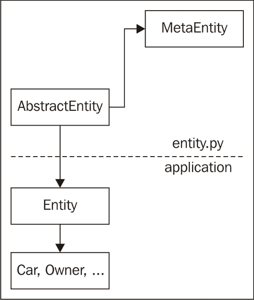
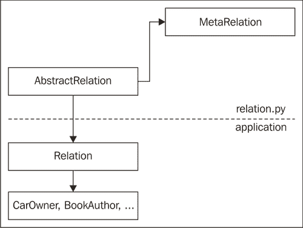
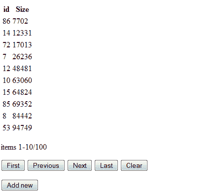
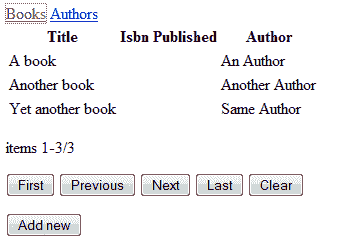

# 第七章。重构代码以实现重用

> 在做了一段时间的大量工作之后，退一步批判性地审视你的工作，看看是否可以做得更好，通常是一个好主意。通常，在开发过程中获得的见解可以很好地应用于任何新的代码，甚至如果好处如此之大以至于值得额外的工作，还可以用于重构现有代码。
> 
> 通常，这种关键的重新评估是由观察到的应用程序的不足之处所激发的，比如性能不佳，或者注意到请求的更改所需的时间比我们希望的要多，因为代码的设计不是最优的。
> 
> 现在我们已经在上一章中基于简单的实体/关系框架设计和实现了几个应用程序，现在是时候进行批判性的审视，看看是否有改进的空间。

# 是时候采取行动，进行批判性的审视

检查每一块主要的代码（通常是您实现的 Python 模块），并问自己以下问题：

+   我能否在不做任何修改的情况下重用它？

+   实际使用该模块需要多少额外的代码？

+   你真的理解了文档（即使是你自己写的）吗？

+   代码中有多少是重复的？

+   添加新功能有多容易？

+   它的表现如何？

当我们对我们开发的实体和关系模块提出这些问题时，我们发现：

+   重新使用这些模块非常容易

+   但它们确实需要相当多的额外代码，例如，初始化表和线程

此外，我们故意编写了特定的模块来处理特定领域的代码，如输入验证，但值得检查此代码，看看我们是否可以发现模式并增强我们的框架以更好地支持这些模式。一个例子是我们经常需要自动完成，因此值得看看这是如何实现的。

在书籍应用程序中，我们在性能方面几乎没有解决大量书籍的浏览方式，这确实需要关注，如果我们希望在我们的框架中重用，特别是在处理大量列表的环境中。

## 刚才发生了什么？

现在我们已经指出了几个可能改进我们的框架模块的领域，现在是时候考虑这是否值得付出努力。

框架模块旨在被许多应用程序重用，所以一个允许模块以更少的额外代码使用的设计重制是一个好主意，因为代码越少意味着维护越少。当然，重写可能意味着如果现有应用程序想要使用这些新版本，它们可能需要重写，但这是为了更好的维护而付出的代价。

重构现有功能通常问题不大，但得益于良好的测试框架来检查新的实现是否仍然按预期行为，会带来很大的好处。同样，添加全新的功能可能问题更少，因为现有应用程序还没有使用这个功能。

因为在我们的情况下，我们认为优势大于劣势，所以我们将重新工作实体/关系框架。我们不仅将关注使用更少的代码，而且还将关注使新的实体和关系类的定义更容易阅读。这将提供更直观地使用这些类。

我们还将专门设置一个部分来开发浏览实体列表的功能，即使列表很大且需要排序或过滤，这种方式也能很好地扩展。

# 重构

我们将首先重构的是我们如何使用`Entity`类的方式。我们的目标是实现更直观的使用，无需显式初始化数据库连接。为了了解可能实现的功能，让我们首先看看我们如何使用重构的`entity`模块的例子。

# 定义新实体的时间：它应该看起来是什么样子

输入并运行以下代码（也可作为`testentity.py`使用）。它将使用重构的`entity`模块来定义一个`MyEntity`类，并处理这个类的几个实例。我们将创建、列出和更新实例，甚至可以看到更新失败，因为我们尝试分配一个无法通过属性验证的值：

**第七章/testentity.py**

```py
from entity import *
class Entity(AbstractEntity):
	database="/tmp/abc.db"
class MyEntity(Entity): a=Attribute(unique=True, notnull=True, affinity='float',
		displayname='Attribute A', validate=lambda x:x<5)
a=MyEntity(a=3.14)
print(MyEntity.list())
e=MyEntity.list(pattern=[('a',3.14)])[0]
print(e)
e.delete()
a=MyEntity(a=2.71)
print([str(e) for e in MyEntity.list()])
a.a=1
a.update()
print([str(e) for e in MyEntity.list()])
a.a=9

```

打印函数产生的输出应该看起来类似于以下列出的行，包括由无效更新尝试引发的异常：

```py
 [MyEntity(id=5)]
<MyEntity: Atrribute A=3.14, id=5>
['<MyEntity: Atrribute A=2.71, id=6>']
['<MyEntity: Atrribute A=1.0, id=6>']
Traceback (most recent call last):
File "testentity.py", line 25, in <module>
	a.a=9
File "C:\Documents and Settings\Michel\Bureaublad\MetaBase\Books II\entity.py"
, line 117, in __setattr__
	raise AttributeError("assignment to "+name+" does not validate")
AttributeError: assignment to a does not validate

```

## 刚才发生了什么？

我们首先注意到，没有显式初始化任何数据库，也没有任何代码显式初始化任何线程。所需的一切只是从`entity`模块提供的`AbstractEntity`类中派生实体类，并定义一个指向用作数据库的文件的数据库类变量。

接下来，尽管我们以与之前类似的方式定义了一个特定的类（在这个例子中是 MyEntity），我们现在通过定义类变量来指定任何属性，这些变量被分配了`Attribute`实例。在示例中，我们只为单个属性`a`（突出显示）这样做。`Attribute`实例封装了关于约束的大量知识，并允许定义默认值和验证函数。

创建实例并没有什么不同，但正如第二个`list()`示例所示，这种实现允许过滤，因此不需要检索所有实例 ID，将它们实例化为真正的对象并比较它们的属性。

对`a`属性的最终赋值展示了验证功能的作用。它引发了一个`AttributeError`异常，因为尝试将 9 赋值给它触发了我们的验证函数。

这些新且不那么繁琐的语义主要归功于使用元类所能实现的功能，我们将在下一节中探讨这个概念。

## 元类

虽然 Python 文档警告说使用元类会让你的头爆炸（例如，阅读`http://www.python.org/doc/newstyle/`），但它们并不那么危险：它们可能会引起头痛，但这些头痛在实验和重新阅读文档之后大多会消失。

元类允许你在定义最终成为程序员可用的类定义之前检查和修改类的定义。这是可能的，因为在 Python 中，类本身也是对象；具体来说，它们是元类的实例。当我们实例化一个对象时，我们可以通过定义`__init__()`和`__new__()`方法来控制这个实例的初始化方式。同样，我们也可以通过在其元类中定义合适的`__init__()`和`__new__()`方法来控制类的初始化方式。

正如所有类最终都是`object`类的子类一样，所有元类都源自`type`元类。这意味着，如果我们想让我们的类成为不同类型的元类的实例，我们必须继承`type`并定义我们的类。

在阅读了前面的段落之后，你可能仍然担心你的头可能会爆炸，但像大多数事情一样，一个例子要简单得多。

# 使用元类进行操作的时间

假设我们想要验证我们定义的类总是有一个`__info__()`方法。我们可以通过定义一个合适的元类，并使用对该元类的引用来检查任何新定义的类来实现这一点。看看下面的示例代码（也作为`metaclassexample.py`可用）：`

**Chapter7/metaclassexample.py**

```py
class hasinfo(type):
	def __new__(metaclass, classname, baseclasses, classdict):
		if len(baseclasses) and not '__info__' in classdict:
			raise TypeError('does not have __info__')
		return type.__new__(metaclass,
				classname, baseclasses, classdict)
class withinfo(metaclass=hasinfo):
	pass
class correct(withinfo):
	def __info__(self): pass
class incorrect(withinfo):
	pass

```

这将对`incorrect`类引发异常，但不会对`correct`类引发异常。

## 刚才发生了什么？

如你所见，元类的`__new__()`方法接收一些重要的参数。首先，元类本身和正在定义的类的`classname`，一个（可能为空）的`baseclasses`列表，最后是类字典。最后一个参数非常重要。

当我们使用类定义语句定义一个类时，我们在这里定义的所有方法和类变量最终都会出现在一个字典中。一旦这个类完全定义，这个字典将作为类的`__dict__`属性可用。这是传递给元类的`__new__()`方法的字典，我们可以随意检查和修改这个字典。

在这个例子中，我们只是检查这个类字典中是否存在一个名为`__info__`的键，如果不存在则引发异常。（我们并不真正检查它是否是一个方法，但这当然也是可能的）。如果一切顺利，我们调用`type`（所有元类的母亲）的`__new__()`方法，因为这个方法将负责在当前作用域中使类定义可用。

然而，这里有一个额外的技巧。`withinfo`类在抽象意义上定义了需要`__info__()`方法，因为它引用了`hasinfo`元类，但它本身并没有定义它。然而，因为它引用了`hasinfo`元类，所以会引发异常，因为它的类字典是以与子类相同的方式检查的。为了防止这种情况，我们只有在类是子类的情况下才检查`__info__()`方法的存在，也就是说，当基类列表（在`baseclasses`参数中可用）不为空时。

检查必需的方法是好的，但有了这么多信息，可以做更多的事情。在下一节中，我们利用这种能力来确保新类的定义将负责在数据库后端创建合适的表。

## MetaEntity 和 AbstractEntity 类

除了创建数据库表之外，如果需要，我们将定义的元类还将检查分配给任何类变量的`Attribute`实例，以构建显示名称和验证函数的字典。这样，子类可以很容易地通过使用列名作为键来检查是否存在这样的属性，从而避免了再次检查所有类变量的需要。



# 实现 MetaEntity 和 AbstractEntity 类的时间

让我们看看这是如何完成的：

**Chapter7/entity.py**

```py
class Attribute:
	def __init__(self, unique=False, notnull=False,
								default=None, affinity=None, validate=None,
								displayname=None, primary=False): self.coldef = (
				(affinity+' ' if not affinity is None else '') +
				('unique ' if unique else '') +
				('not null ' if notnull else '') +
				('default %s '%default if not default is None else '')
		)
		self.validate = validate
		self.displayname = displayname
		self.primary = primary

```

`Attribute`类主要是用来以结构化的方式存储关于属性的信息的载体。我们本可以使用字符串并解析它们，但通过使用`Attribute`类，可以明确识别出作为数据库列存储的属性类变量。这样，我们仍然可以定义具有不同目的的类变量。此外，编写解析器是一项大量工作，而检查参数则容易得多。

突出的代码显示，大多数参数都用于创建一个字符串，该字符串可以用作创建表语句的一部分的列定义。其他参数（displayname 和`validate`）则直接存储以供将来参考：

**Chapter7/entity.py**

```py
class MetaEntity(type):
	@classmethod
	def __prepare__(metaclass, classname, baseclasses, **kwds):
		return collections.OrderedDict()
	@staticmethod
	def findattr(classes,attribute):
		a=None
		for c in classes:
			if hasattr(c,attribute):
				a=getattr(c,attribute)
				break
			if a is None:
				for c in classes:
					a = MetaEntity.findattr(c.__bases__,attribute)
					if not a is None:
						break
			return a
	def __new__(metaclass,classname,baseclasses,classdict):
		def connect(cls):
			if not hasattr(cls._local,'conn'):
				cls._local.conn=sqlite.connect(cls._database)
				cls._local.conn.execute('pragma foreign_keys = 1')
				cls._local.conn.row_factory = sqlite.Row
			return cls._local.conn
		entitydefinition = False if len(baseclasses):
			if not 'database' in classdict:
				classdict['_database']=MetaEntity.findattr(
							baseclasses,'database')
				if classdict['_database'] is None:
					raise AttributeError(
						'''subclass of AbstractEntity has no
						database class variable''')
					entitydefinition=True
			if not '_local' in classdict:
				classdict['_local']=MetaEntity.findattr(
							baseclasses,'_local')
			classdict['_connect']=classmethod(connect) classdict['columns']=[
				k for k,v in classdict.items()
					if type(v) == Attribute]
			classdict['sortorder']=[]
			classdict['displaynames']={
				k:v.displayname if v.displayname else k
				for k,v in classdict.items()
				if type(v) == Attribute}
			classdict['validators']={
				k:v.validate for k,v in classdict.items()
				if type(v) == Attribute
					and not v.validate is None} classdict['displaynames']['id']='id'
			PrimaryKey = Attribute()
			PrimaryKey.coldef = 'integer primary key '
			PrimaryKey.coldef+= 'autoincrement'
			if entitydefinition:
				sql = 'create table if not exists '
				sql+= classname +' ('
				sql+= ", ".join([k+' '+v.coldef
					for k,v in [('id',PrimaryKey)]
							+list(classdict.items())
							if type(v) == Attribute])
				sql+= ')'
				conn = sqlite.connect(classdict['_database'])
				conn.execute(sql)
			for k,v in classdict.items():
				if type(v) == Attribute:
					if v.primary:
						classdict['primary']=property(
							lambda self:getattr(self,k))
						classdict['primaryname']=k
						break
			if not 'primary' in classdict:
				classdict['primary']=property(
					lambda self:getattr(self,'id'))
				classdict['primaryname']='id'
		return type.__new__(metaclass,
			classname,baseclasses,classdict)

```

我们将使用的元类来同步数据库表的创建和实体类的创建被称为`MetaEntity`。它的`__new__()`方法是所有动作发生的地方，但还有一个重要的附加方法：`__prepare__()`。

调用`__prepare__()`方法以提供一个可以用作类字典的对象。默认情况下，由`type`类提供，只是返回一个常规 Python `dict`对象。这里我们返回一个有序字典，这是一个将记住其键的输入顺序的字典。这将使我们能够使用类变量声明的顺序，例如，将其用作显示列的默认顺序。如果没有有序字典，我们就无法控制，并且必须提供单独的信息。

`__new__()`方法首先检查我们是否是`MetaEntity`的子类，通过检查基类列表是否非零（突出显示），因为`MetaEntity`本身没有数据库后端。

然后它检查数据库类变量是否已定义。如果没有，我们是一个具有数据库后端的特定实体，我们尝试在我们的超类中定位数据库类变量。如果我们找到了它，我们将其本地存储；如果没有找到，我们抛出异常，因为我们无法在没有数据库引用的情况下运行。

`AbstractEntity`类将定义一个`_local`类变量，它包含对线程局部存储的引用，子类将有自己的`_local`变量，它指向相同的线程局部存储。

下一步是从所有引用`Attribute`实例的类变量中收集各种信息。首先我们收集一个列名称列表（突出显示）。记住，因为我们使类字典成为一个有序字典，所以这些列名称将是它们定义的顺序。

同样，我们定义了一个显示名称列表。如果任何属性没有`displayname`属性，其显示名称将与列名称相同。我们还构建了一个验证器字典，即按列名称索引的字典，它包含一个在将值分配给列之前验证任何值的函数。

每个实体都将有一个`id`属性（以及数据库表中的对应列），它将自动创建，无需显式定义。因此，我们单独添加其`displayname`，并构建一个特殊的属性实例（突出显示）。

这个特殊`Attribute`的`coldef`属性以及其他`Attribute`实例的`coldef`属性将用于组成一个 SQL 语句，该语句将创建具有正确列定义的表。

最后，我们将修改后的类字典、原始基类列表和类名一起传递给类型类的`__new__()`方法，该方法将负责实际的类构造。

任何`Entity`的其余功能不是由其元类实现的，而是以常规方式实现的，即在类中提供所有实体都应该继承的方法：`AbstractEntity：`

**第七章/entity.py**

```py
 class AbstractEntity(metaclass=MetaEntity):
	_local = threading.local()
	@classmethod
	def listids(cls,pattern=None,sortorder=None): sql = 'select id from %s'%(cls.__name__,)
		args = []
		if not pattern is None and len(pattern)>0:
				for s in pattern:
						if not (s[0] in cls.columns or s[0]=='id'):
								raise TypeError('unknown column '+s[0])
				sql += " where "
				sql += " and ".join("%s like ?"%s[0] for s in 
pattern)
				args+= [s[1] for s in pattern]
		if sortorder is None:
			if not cls.sortorder is None :
					sortorder = cls.sortorder
		else:
			for s in sortorder:
					if not (s[0] in cls.columns or s[0]=='id'):
							raise TypeError('unknown column '+s[0])
					if not s[1] in ('asc', 'desc') :
							raise TypeError('illegal sort 
argument'+s[1])
		if not (sortorder is None or len(sortorder) == 0):
			sql += ' order by '
			sql += ','.join(s[0]+' '+s[1] for s in sortorder)
		cursor=cls._connect().cursor()
		cursor.execute(sql,args)
		return [r['id'] for r in cursor]
	@classmethod
	def list(cls,pattern=None,sortorder=None):
		return [cls(id=id) for id in cls.listids(
				sortorder=sortorder,pattern=pattern)]
	@classmethod
	def getcolumnvalues(cls,column):
		if not column in cls.columns :
			raise KeyError('unknown column '+column)
		sql ="select %s from %s order by lower(%s)"
		sql%=(column,cls.__name__,column)
		cursor=cls._connect().cursor()
		cursor.execute(sql)
		return [r[0] for r in cursor.fetchall()]
	def __str__(self):
		return '<'+self.__class__.__name__+': '+", ".join(
				["%s=%s"%(displayname, getattr(self,column))
				for column,displayname
				in self.displaynames.items()])+'>'
	def __repr__(self):
		return self.__class__.__name__+"(id="+str(self.id)+")"
	def __setattr__(self,name,value):
		if name in self.validators :
			if not self.validatorsname:
				raise AttributeError(
					"assignment to "+name+" does not 
validate")
		object.__setattr__(self,name,value)
	def __init__(self,**kw): if 'id' in kw:
				if len(kw)>1 :
						raise AttributeError('extra keywords besides 
id')
				sql = 'select * from %s where id = ?'
				sql%= self.__class__.__name__
				cursor = self._connect().cursor()
				cursor.execute(sql,(kw['id'],))
				r=cursor.fetchone()
				for c in self.columns:
						setattr(self,c,r[c])
				self.id = kw['id']
			else:
				rels={}
				attr={}
				for col in kw:
						if not col in self.columns:
								rels[col]=kw[col]
						else:
								attr[col]=kw[col]
				name = self.__class__.__name__
				cols = ",".join(attr.keys())
				qmarks = ",".join(['?']*len(attr))
				if len(cols):
						sql = 'insert into %s (%s) values (%s)'
						sql%= (name,cols,qmarks)
				else:
						sql = 'insert into %s default values'%name
				with self._connect() as conn:
						cursor = conn.cursor()
						cursor.execute(sql,tuple(attr.values())) self.id = cursor.lastrowid
	def delete(self):
		sql = 'delete from %s where id = ?'
		sql%= self.__class__.__name__
		with self._connect() as conn:
						cursor = conn.cursor()
						cursor.execute(sql,(self.id,))
	def update(self,**kw):
		for k,v in kw.items():
				setattr(self,k,v)
		sets = []
		vals = []
		for c in self.columns:
				if not c == 'id':
						sets.append(c+'=?')
						vals.append(getattr(self,c))
		table = self.__class__.__name__
		sql = 'update %s set %s where id = ?'
		sql%=(table,",".join(sets))
		vals.append(self.id)
		with self._connect() as conn:
					cursor = conn.cursor()
					cursor.execute(sql,vals)

```

## 刚才发生了什么

`AbstractEntity`提供了一些方法来提供 CRUD 功能：

+   一个构造函数，用于引用数据库中的现有实体或创建新的实体

+   `list()`和`listids()`，用于查找符合某些标准的实例

+   `update()`，用于同步实体的更改属性与数据库

+   `delete()`，用于从数据库中删除实体

它还定义了特殊的 Python 方法`__str__(), __repr__()`, 和`__setattr__()`，以便以可读的方式呈现实体并验证对属性的赋值。

显然，`AbstractEntity`指的是`MetaEntity`元类（突出显示）。它还定义了一个`_local`类变量，该变量引用线程局部存储。`MetaEntity`类将确保这个引用（但不包括其内容）被复制到所有子类以实现快速访问。通过在这里定义它，我们将确保所有子类都引用相同的线程局部存储，更重要的是，每个线程将使用相同的数据库连接，而不是为每个不同的实体使用单独的数据库连接。

`listids()`类方法将返回符合其`pattern`参数中指定标准的实体 ID 列表，或者在没有给出标准时返回所有实体的 ID。它将使用`sortorder`参数来按所需顺序返回 ID 列表。`sortorder`和`pattern`都是一个元组列表，每个元组的第一项是列名。第二项将是用于与`pattern`参数匹配的字符串，或者对于`sortorder`参数是`asc`或`desc`，分别表示升序或降序排序。

构建检索任何匹配 ID 的 SQL 语句时，首先创建`select`部分（突出显示），因为这将不受任何附加限制的影响。接下来，我们检查是否有任何`pattern`组件被指定，如果有，则为每个`pattern`项添加一个`where`子句。我们指定的匹配使用 SQL 的`like`运算符，这通常仅定义在字符串上，但如果我们使用 like 运算符，SQLite 会将任何参数转换为字符串。使用 like 运算符将允许我们使用 SQL 通配符（例如，`%`）。

下一个阶段是检查是否在`sortorder`参数中指定了任何排序项。如果没有，我们使用`sortorder`类变量中存储的默认排序顺序（在我们的当前实现中仍然将是`None`）。如果有指定了项，我们将添加一个按顺序子句并为每个排序项添加指定。一个典型的 SQL 语句可能看起来像`select id from atable where col1 like ? and col2 like ? order by col1 asc`。

最后，我们使用由元类添加的`_connect()`方法来检索一个数据库连接（如果需要，则建立连接），我们可以使用它来执行 SQL 查询并检索 ID 列表。

`list()`方法与`listids()`方法非常相似，并接受相同的参数。然而，它将通过使用每个 ID 作为参数调用实体的构造函数，返回实体实例的列表，而不是仅返回 ID 列表。如果这些 ID 本身就是我们想要处理的，这将很方便，但通常 ID 列表更容易操作。因此，我们提供了这两种方法。

能够检索实体列表是件好事，但我们还必须有一种方法来创建一个新的实例，并检索与已知 ID 记录相关联的所有信息。这就是实体构造函数，即`__init__()`方法的作用所在。

### 注意

严格来说，`__init__()`不是一个构造函数，而是一个在实例构建后初始化实例的方法。

如果向`__init__()`传递单个 ID 关键字参数（突出显示），将检索与该 ID 匹配的记录的所有列，并使用`setattr()`内置函数设置相应的参数（即与列名称相同的属性）。

如果向`__init__()`传递了多个关键字参数，则每个参数应该是已定义列的名称。如果不是，将引发异常。否则，使用关键字及其值来构造插入语句。如果定义的列数多于提供的关键字数，这将导致插入默认值。默认值通常是`NULL`，除非在定义`Entity`时为该列指定了`default`参数。如果`NULL`是默认值且列有`non null`约束，将引发异常。

因为 ID 列被定义为`autoincrement`列，我们没有指定显式的 ID 值，所以 ID 值将等于`rowid`，这是我们作为游标对象的`lastrowid`属性检索的值（突出显示）。

## 尝试一次性检索实例的英雄

首先检索 ID 列表，然后实例化实体意味着我们必须使用单独的 SQL 语句检索每个实体的所有属性。如果实体列表很大，这可能会对性能产生负面影响。

创建一个`list()`方法的变体，它不会逐个将选定的 ID 转换为实体实例，而是使用单个选择语句检索所有属性，并使用这些属性来实例化实体。

## 关系

定义实体之间的关系应该与定义实体本身一样方便，而且有了元类的力量，我们可以使用相同的概念。但让我们首先看看我们如何使用这样的实现。

# 定义新关系的行动时间：它应该看起来如何

以下示例代码显示了如何使用`Relation`类（也在`relation.py`中可用）：`

**Chapter7/relation.py**

```py
from os import unlink
db="/tmp/abcr.db"
try:
	unlink(db)
except:
	pass
class Entity(AbstractEntity):
	database=db
class Relation(AbstractRelation):
	database=db
class A(Entity): pass
class B(Entity): pass
class AB(Relation):
	a=A
	b=B
a1=A()
a2=A()
b1=B()
b2=B()
a1.add(b1)
a1.add(b2)
print(a1.get(B))
print(b1.get(A))

```

## 刚才发生了什么？

在定义了一些实体之后，定义这些实体之间的关系遵循相同的模式：我们定义一个 `Relation` 类，它是 `AbstractRelation` 的子类，以建立对将使用的数据库的引用。

然后，我们通过子类化 `Relation` 并定义两个类变量 `a` 和 `b` 来定义两个实体之间的实际关系，这两个变量分别引用构成关系每一半的 `Entity` 类。

如果我们实例化了一些实体，我们可以通过使用 `add()` 方法在这些实例之间定义一些关系，并通过 `get()` 方法检索相关实体。

注意，这些方法是在 `Entity` 实例上调用的，这比在 `Relation` 类中使用类方法要自然得多。这些 `add()` 和 `get()` 方法是由 `MetaRelation` 元类添加到这些实体类中的，在下一节中，我们将看到这是如何实现的。

关系类的类图几乎与实体类的类图相同：



## 实现 MetaRelation 和 AbstractRelation 类

`AbstractRelation` 类的实现非常简约，因为它仅用于创建一些线程局部存储并与 `MetaRelation` 元类建立关系：

**Chapter7/relation.py**

```py
class AbstractRelation(metaclass=MetaRelation):
	_local = threading.local()

```

没有指定任何方法，因为元类将负责向实体类添加适合此关系的方法。

`MetaRelation` 类有两个目标：创建一个数据库表，该表将保存每个单独关系的记录，并向涉及的实体类添加方法，以便可以创建、删除和查询关系：

**Chapter7/relation.py**

```py
class MetaRelation(type):
	@staticmethod
	def findattr(classes,attribute):
		a=None
		for c in classes:
			if hasattr(c,attribute):
				a=getattr(c,attribute)
				break
		if a is None:
			for c in classes:
				a = MetaRelation.findattr(c.__bases__,attribute)
				if not a is None:
					break
		return a
	def __new__(metaclass,classname,baseclasses,classdict):
		def connect(cls):
			if not hasattr(cls._local,'conn'):
				cls._local.conn=sqlite.connect(cls._database)
				cls._local.conn.execute('pragma foreign_keys = 1')
				cls._local.conn.row_factory = sqlite.Row
			return cls._local.conn
		def get(self,cls):
			return getattr(self,'get'+cls.__name__)()
		def getclass(self,cls,relname):
			clsname = cls.__name__
			sql = 'select %s_id from %s where %s_id = ?'%(
				clsname,relname,self.__class__.__name__)
			cursor=self._connect().cursor()
			cursor.execute(sql,(self.id,))
			return [cls(id=r[clsname+'_id']) for r in cursor]
		def add(self,entity):
			return getattr(self,
				'add'+entity.__class__.__name__)(entity)
		def addclass(self,entity,Entity,relname):
			if not entity.__class__ == Entity :
				raise TypeError(
					'entity not of the required class')
			sql = 'insert or replace into %(rel)s '
			sql+= '(%(a)s_id,%(b)s_id) values (?,?)'
			sql%= { 'rel':relname,
				'a':self.__class__.__name__,
				'b':entity.__class__.__name__}
			with self._connect() as conn:
				cursor = conn.cursor()
				cursor.execute(sql,(self.id,entity.id))
		relationdefinition = False
		if len(baseclasses):
			if not 'database' in classdict:
				classdict['_database']=MetaRelation.findattr(
					baseclasses,'database')
				if classdict['_database'] is None:
					raise AttributeError(
						'''subclass of AbstractRelation has no
						database class variable''') relationdefinition=True
				if not '_local' in classdict:
					classdict['_local']=MetaRelation.findattr(
						baseclasses,'_local')
				classdict['_connect']=classmethod(connect)
				if relationdefinition:
					a = classdict['a']
					b = classdict['b'] if not issubclass(a,AbstractEntity) :
						raise TypeError('a not an AbstractEntity')
					if not issubclass(a,AbstractEntity) :
						raise TypeError('b not an AbstractEntity')
						sql = 'create table if not exists %(rel)s '
						sql+= '( %(a)s_id references %(a)s '
						sql+= 'on delete cascade, '
						sql+= '%(b)s_id references %(b)s '
						sql+= 'on delete cascade, '
						sql+= 'unique(%(a)s_id,%(b)s_id))'
						sql%= { 'rel':classname,
							'a':a.__name__,
							'b':b.__name__}
						conn = sqlite.connect(classdict['_database'])
						conn.execute(sql) setattr(a,'get'+b.__name__,
							lambda self:getclass(self,b,classname))
						setattr(a,'get',get) setattr(b,'get'+a.__name__,
							lambda self:getclass(self,a,classname))
						setattr(b,'get',get) setattr(a,'add'+b.__name__,
						lambda self,entity:addclass(self,
									entity,b,classname))
						setattr(a,'add',add) setattr(b,'add'+a.__name__,
						lambda self,entity:addclass(self,
									entity,a,classname))
						setattr(b,'add',add)
				return type.__new__(metaclass,
							classname,baseclasses,classdict)

```

与 `MetaEntity` 类的情况一样，`MetaRelation` 通过其 `__new__()` 方法执行其魔法。

首先，我们检查是否正在创建 `AbstractRelation` 的子类，通过检查 `baseclasses` 参数的长度（记住 `MetaRelation` 被定义为 `AbstractRelation` 的元类，这意味着不仅其子类，而且 `AbstractRelation` 本身也将由元类机制处理，这在实际中并不是必需的）。

如果是子类，我们将数据库和线程局部存储引用复制到类字典中，以便快速访问。

如果没有指定 `database` 属性，我们知道正在定义的类是 `Relation` 的子类，即一个特定的关系类，并在 `relationdefinition` 变量中标记这一点（突出显示）。

如果我们处理的是关系的一个具体定义，我们必须找出涉及哪些实体。这是通过检查类字典中名为 `a` 和 `b` 的属性来完成的，这些属性应该是 `AbstractEntity` 的子类（突出显示）。这两个都是关系的两半，它们的名称用于创建一个桥接表，如果尚未存在的话。

如果我们定义一个像这样的关系：

```py
class Owner(Relation):
	a=Car
	b=User

```

生成的 SQL 语句将是：

```py
create table if not exists Owner (
	Car_id references Car on delete cascade,
	User_id references User on delete cascade,
	unique(Car_id,User_id)
)

```

每一列都引用了相应表的主键（因为我们只指定了在引用子句中的表），`on delete cascade`约束将确保如果一个实体被删除，关系也会被删除。最后的`unique`约束将确保如果存在特定实例之间的关系，将只有一个记录反映这一点。

### 向现有类添加新方法

`__new__()`方法的最后一部分处理在涉及此关系的实体类中插入方法。向其他类添加方法可能听起来像魔法，但在 Python 中，类本身也是对象，并且有包含类属性值的类字典。方法只是恰好具有函数定义值的属性。

因此，我们可以在运行时向任何类添加新方法，只需将一个对合适函数的引用赋给类的属性。`MetaEntity`类在创建之前只修改了`Entity`类的类字典。`MetaRelation`类更进一步，不仅修改了`Relation`类的类字典，还修改了涉及的`Entity`类的类字典。

### 小贴士

在运行时更改类定义不仅限于元类，但应该谨慎使用，因为我们期望类在代码的任何地方都能保持一致的行为。

如果我们有两个类，`A`和`B`，我们想确保每个类都有自己的 get 和 add 方法。也就是说，我们想确保`A`类有`getB()`和`addB()`方法，而`B`类有`getA()`和`addA()`方法。因此，我们定义了通用的`getclass()`和`addclass()`函数，并将这些函数与定制 lambda 函数一起分配给相关类中的命名属性（高亮显示）。

如果我们再次假设实体类被称为`A`和`B`，我们的关系被称为`AB`，那么这个赋值：

```py
setattr(a,'get'+b.__name__,lambda self:getclass(self,b,classname))

```

这意味着 A 类将现在有一个名为`getB`的方法，如果在这个`A`类的实例（如`a1.getB()`）上调用该方法，它将导致对`getclass`的调用，如下所示：

```py
getclass(a1,B,'AB')

```

我们还创建（或重新定义）了一个`get()`方法，当给定一个类作为参数时，将找到相应的`getXXX`方法。

`getclass()`方法定义如下：

```py
			def getclass(self,cls,relname):
					clsname = cls.__name__
					sql = 'select %s_id from %s where %s_id = 
?'%(clsname,relname,self.__class__.__name__)
					cursor=self._connect().cursor()
					cursor.execute(sql,(self.id,))
					return [cls(id=r[clsname+'_id']) for r in cursor]

```

首先，它构建一个 SQL 语句。如果`getclass()`被调用为`getclass(a1,B,'AB')`，这个语句可能看起来像这样：

```py
select B_id from AB where A_id = ?

```

然后它使用`self.id`作为参数执行这个语句。返回的结果是一个包含实例 ID 的列表。

添加功能遵循相同的模式，所以我们只需快速查看`addclass()`函数。它首先检查我们试图添加的实体是否属于所需的类。注意，如果我们调用`a1.addB(b1)`这样的函数，它将引用由`MetaRelation`类插入的函数，然后将以`addclass(a1,b1,B,'AB')`的方式调用。

随后构建的 SQL 语句可能看起来像这样：

```py
insert or replace into AB (A_id,B_id) values (?,?)

```

由于我们之前指定的唯一约束，如果第二个插入操作指定了相同的特定关系，可能会失败，在这种情况下，我们将替换记录（这实际上忽略了失败）。这样，我们可以在具有相同参数的情况下调用`add()`两次，但最终仍然只有一个关系记录。

## 浏览实体列表

用户与一组实体进行交互的最重要工具之一是表格。表格提供了一种逻辑接口，用于翻页浏览数据列表，并在列中展示相关属性。此类表格界面通常还包含排序选项，即根据一个或多个属性进行排序，以及钻取功能，即仅显示具有特定属性值的实体。

# 使用基于表格的实体浏览器进行操作的时间

运行`browse.py`并将您的浏览器指向`http://localhost:8080`。启动了一个小型示例应用程序，显示了随机数据列表，如下面的图像所示：



这个看起来相当简朴的界面可能缺少大多数视觉装饰，但它仍然完全功能。您可以通过点击底部的按钮栏中的相应按钮来翻页浏览数据列表，通过点击一个或多个标题来更改列表的排序顺序（这将循环通过升序、降序或完全不排序，但目前没有任何视觉反馈）或通过点击列中的一个值来减少显示的项目列表，这将导致显示具有此列相同值的项的列表。通过点击**清除**按钮，可以再次显示所有项目。

## 刚才发生了什么？

`browse`模块（作为`browse.py`提供）包含的不仅仅是示例应用程序。它还定义了一个可重用的`Browse`类，可以用对`Entity`的引用进行初始化，并用作 CherryPy 应用程序。`Browse`类还可以接受参数，指定是否以及哪些列应该显示。

它的最佳用途可以通过查看示例应用程序来展示：

**第七章/browse.py**

```py
from random import randint
import os
current_dir = os.path.dirname(os.path.abspath(__file__))
class Entity(AbstractEntity):
	database='/tmp/browsetest.db'
class Number(Entity):
	n = Attribute(displayname="Size")
n=len(Number.listids())
if n<100:
	for i in range(100-n):
		Number(n=randint(0,1000000))
root = Browse(Number, columns=['id','n'],
	sortorder=[('n','asc'),('id','desc')])
cherrypy.quickstart(root,config={
	'/':
	{ 'log.access_file' :
			os.path.join(current_dir,"access.log"),
	'log.screen': False,
	'tools.sessions.on': True
	}
})

```

它初始化了一个`Browse`类的实例，该实例以一个必选参数作为`Entity`的子类，在本例中是`Number`。它还接受一个`columns`参数，该参数接受一个列表，指定要在表格列中显示哪些属性及其顺序。它还接受一个`sortorder`参数，该参数是一个元组列表，指定要在哪些列上排序以及排序方向。

然后，将此`Browse`类的实例传递给 CherryPy 的`quickstart()`函数，以向客户端提供功能。同样简单的方法是挂载两个不同的`Browse`实例，每个实例在自定义根应用程序中服务于不同的`Entity`类。

所有这些是如何实现的？让我们首先看看`__init__()`方法：

**第七章/browse.py**

```py
class Browse:
	def __init__(self,entity,columns=None,
		sortorder=None,pattern=None,page=10,show="show"): if not issubclass(entity,AbstractEntity) :
				raise TypeError()
		self.entity = entity
		self.columns = entity.columns if columns is None else 
columns
		self.sortorder = [] if sortorder is None else sortorder
		self.pattern = [] if pattern is None else pattern
		self.page = page
		self.show = show
		self.cache= {}
		self.cachelock=threading.Lock()
		self.cachesize=3
		for c in self.columns:
			if not (c in entity.columns or c == 'id') and not (
						hasattr(self.entity,'get'+c.__name__)) :
					raise ValueError('column %s not defined'%c)
		if len(self.sortorder) > len(self.columns) :
			raise ValueError()
		for s in self.sortorder:
			if s[0] not in self.columns and s[0]!='id':
					raise ValueError(
						'sorting on column %s not 
possible'%s[0])
			if s[1] not in ('asc','desc'):
					raise ValueError(
						'column %s, %s is not a valid sort 
order'%s)
		for s in self.pattern:
			if s[0] not in self.columns and s[0]!='id':
					raise ValueError(
						'filtering on column %s not 
possible'%s[0])
		if self.page < 5 :
					raise ValueError()

```

`__init__()`方法接受相当多的参数，其中只有`entity`参数是必需的。它应该是`AbstractEntity`的子类，并在高亮代码中进行检查。

如果缺少参数，所有参数都会被存储并初始化为合适的默认值。

`columns`参数默认为为实体定义的所有列的列表，我们验证我们想要显示的任何列实际上都为实体定义了。

同样，我们验证`sortorder`参数（一个包含列名及其排序方向的元组列表）包含的项不超过列的数量（因为对同一列进行多次排序是不合理的），并且指定的排序方向是`asc`或`desc`（分别表示升序和降序）。

`pattern`参数，一个包含列名和要过滤的值的元组列表，以类似的方式处理，以查看是否只过滤了定义的列。请注意，过滤或排序在自身未显示的列上是完全有效的。这样，我们可以在不担心太多列的情况下显示大型数据集的子集。

最后的合理性检查是在`page`参数上进行的，该参数指定了每页要显示的行数。行数过少会显得尴尬，而负值没有意义，所以我们决定每页至少显示五行：

**第七章 browse.py**

```py
@cherrypy.expose
def index(self, _=None, start=0,
	pattern=None, sortorder=None, cacheid=None,
	next=None,previous=None, first=None, last=None,
	clear=None):
	if not clear is None :
		pattern=None
	if sortorder is None :
		sortorder = self.sortorder
	elif type(sortorder)==str:
		sortorder=[tuple(sortorder.split(','))]
	elif type(sortorder)==list:
		sortorder=[tuple(s.split(',')) for s in sortorder]
	else:
		sortorder=None
	if pattern is None :
		pattern = self.pattern
	elif type(pattern)==str:
		pattern=[tuple(pattern.split(','))]
	elif type(pattern)==list:
		pattern=[tuple(s.split(',',1)) for s in pattern]
	else:
		pattern=None
	ids = self.entity.listids(
		pattern=pattern,sortorder=sortorder)
	start=int(start) if not next is None :
		start+=self.page
	elif not previous is None :
		start-=self.page
	elif not first is None :
		start=0
	elif not last is None :
		start=len(ids)-self.page
	if start >= len(ids) :
		start=len(ids)-1
	if start<0 :
		start=0
	yield '<table class="entitylist" start="%d" page="%d">\
n'%(start,self.page)
	yield '<thead><tr>'
	for col in self.columns:
		if type(col) == str :
			sortclass="notsorted"
			for s in sortorder:
				if s[0]==col :
					sortclass='sorted-'+s[1]
					break
			yield '<th class="%s">'%sortclass+self.entity.
displaynames[col]+'</th>'
			else :
				yield '<th>'+col.__name__+'</th>'
			yield '</tr></thead>\n<tbody>\n' entities = [self.entity(id=i)
					for i in ids[start:start+self.page]]
			for e in entities:
				vals=[]
				for col in self.columns:
					if not type(col) == str:
						vals.append(
							"".join(
							['<span class="related" entity="%s" >%s</span> ' % (r.__
class__.__name__, r.primary) for r in e.get(col)]))
					else:
						vals.append(str(getattr(e,col)))
				yield ('<tr id="%d"><td>'
					+ '</td><td>'.join(vals)+'</td></tr>\n')%(e.id,)
			yield '</tbody>\n</table>\n'
			yield '<form method="GET" action=".">'
			yield '<div class="buttonbar">'
			yield '<input name="start" type="hidden" value="%d">\n'%start
			for s in sortorder:
				yield '<input name="sortorder" type="hidden" value="%s,%s">\n'%s
			for f in pattern:
				yield '<input name="pattern" type="hidden" value="%s,%s">\n'%f
			yield '<input name="cacheid" type="hidden" value="%s">'%cacheid
			yield '<p class="info">items %d-%d/%d</p>'%(start+1,start+len 
(entities),len(ids))
			yield '<button name="first" type="submit">First</button>\n'
			yield '<button name="previous" type="submit">Previous</button>\n'
			yield '<button name="next" type="submit">Next</button>\n'
			yield '<button name="last" type="submit">Last</button>\n'
			yield '<button name="clear" type="submit">Clear</button>\n'
			yield '</div>'
			yield '</form>'
			# no name attr on the following button otherwise it may be sent as 
an argument!
			yield '<form method="GET" action="add"><button type="submit">Add 
new</button></form>'

```

表的初始显示以及分页、排序和过滤都由同一个`index()`方法处理。要了解它可能接受的全部参数，查看它为我们示例应用程序生成的 HTML 标记可能会有所帮助。

### 注意

`Browse`类的`index()`方法不是唯一一个需要向客户端发送大量 HTML 的地方。这可能会变得难以阅读，因此也难以维护，使用模板可能是一个更好的解决方案。选择与 CherryPy 兼容的模板解决方案的好起点是[`www.cherrypy.org/wiki/ChoosingATemplatingLanguage`](http://www.cherrypy.org/wiki/ChoosingATemplatingLanguage)。

# 检查 HTML 标记的行动时间

让我们看看`index()`方法生成的 HTML 标记是什么样的：

```py
<table class="entitylist" start="0" page="10">
	<thead>
		<tr>
				<th class="sorted-desc">id</th>
				<th class="sorted-asc">Size</th>
		</tr>
	</thead>
	<tbody>
		<tr id="86"><td>86</td><td>7702</td></tr>
		<tr id="14"><td>14</td><td>12331</td></tr>
		<tr id="72"><td>72</td><td>17013</td></tr>
		<tr id="7"><td>7</td><td>26236</td></tr>
		<tr id="12"><td>12</td><td>48481</td></tr>
		<tr id="10"><td>10</td><td>63060</td></tr>
		<tr id="15"><td>15</td><td>64824</td></tr>
		<tr id="85"><td>85</td><td>69352</td></tr>
		<tr id="8"><td>8</td><td>84442</td></tr>
		<tr id="53"><td>53</td><td>94749</td></tr>
	</tbody>
</table>
<form method="GET" action=".">
	<div class="buttonbar">
		<input name="start" type="hidden" value="0">
		<input name="sortorder" type="hidden" value="n,asc">
		<input name="sortorder" type="hidden" value="id,desc">
		<input name="cacheid" type="hidden"
				value="57ec8e0a53e34d428b67dbe0c7df6909">
		<p class="info">items 1-10/100</p>
		<button name="first" type="submit">First</button>
		<button name="previous" type="submit">Previous</button>
		<button name="next" type="submit">Next</button>
		<button name="last" type="submit">Last</button>
		<button name="clear" type="submit">Clear</button>
	</div>
</form>
<form method="GET" action="add">
	<button type="submit">Add new</button>
</form>

```

除了实际的表格之外，我们还有一个包含相当多的`<button>`和`<input>`元素的`<form>`元素，尽管大多数元素的类型属性被设置为隐藏。

`<form>`元素有一个动作属性 "."（一个单独的点），这将导致表单中的所有信息都提交到生成此表单的同一 URL，因此数据将由我们现在正在检查的同一个`index()`方法处理。当点击任何具有`type`属性等于`submit`的`<button>`元素时，将触发提交，在这种情况下，不仅会发送`<input>`元素，还会发送被点击的按钮的名称。

### 注意

注意，任何需要发送到服务器的`<input>`元素都应该有一个`name`属性。省略`name`属性会导致它被遗漏。《input>`元素如果`type`等于`hidden`并且有`name`属性，也会被发送。隐藏的`<input>`元素不会显示，但它们在将与表单相关的重要信息保持在一起方面发挥着重要作用。

表单中第一个隐藏的`<input>`元素存储了当前在表中显示的项目起始索引。通过将其作为隐藏元素添加，我们可以在点击**下一页**或**上一页**按钮时计算要显示的项目。

我们还希望记住项目是如何排序的。因此，我们包括了一些具有`name`属性等于`sortorder`的隐藏输入元素，每个元素都有一个由逗号分隔的列名和排序方向组成的值。

当表单提交时，具有相同名称的输入元素按顺序作为参数添加到`action` URL 中，CherryPy 将识别此模式并将它们转换为值列表。在这个例子中，`Browse`类的`index()`方法接收这个列表作为其`sortorder`参数。任何`pattern`值也作为隐藏的`<input>`元素存在，并以相同的方式处理。

表单中还包含一个包含有关项目数量和当前页面上实际显示的项目信息的`info`类`<p>`元素。表单的最后部分是一系列提交按钮。

## 刚才发生了什么？

`index()`方法可以不带任何参数调用，也可以调用它显示的表单的任何或所有内容。如果客户端 JavaScript 代码想要在防止浏览器缓存的情况下异步调用它，它甚至可以传递一个带有随机值的`_`（下划线）参数，该参数将被忽略。

其余的参数都是相关的，并且在执行之前会进行检查。

我们希望`sortorder`变量包含一个由列名和排序方向组成的元组列表，但 CherryPy 将输入元素的值简单地解释为字符串，因此我们必须通过在逗号分隔符上分割这些字符串来将这个字符串列表转换为元组列表。我们既不检查列名的有效性，也不检查排序方向的有效性，因为这将由执行实际工作的代码来完成。

`pattern`变量以类似的方式处理，但由于我们可能想要根据包含逗号的价值进行筛选，我们在这里不能简单地使用`split()`方法，而必须传递一个限制为 1 的参数，以限制其分割到遇到的第一个逗号。

接下来，我们将`sortorder`和`pattern`变量传递给与这个`Browse`实例一起存储的实体的`listids()`类方法。它将返回匹配`pattern`标准（如果没有指定模式，则为所有实例）的实例 ID 列表，并按正确顺序排序。请注意，由于实例的数量可能很大，我们在这里不使用`list()`方法，因为一次性将所有 ID 转换为实体实例可能会使应用程序无响应。我们将根据起始和页面变量将那些 ID 转换为我们将实际在页面上显示的实例。

为了计算新的起始索引，我们必须检查我们是否正在操作分页按钮之一（突出显示），如果我们在**下一页**或**上一页**按钮上点击，则添加或减去页面长度。如果点击了**第一页**按钮，我们将起始索引设置为 0。如果点击了**最后一页**按钮，我们将起始索引设置为项目总数减去页面长度。如果这些计算中的任何一个导致起始索引小于零，我们将它设置为 0。

下一步是生成实际输出，每次生成一行，从`<table>`元素开始。我们的表格由一个头部和一个主体组成，头部由一个包含`<th>`元素的单一行组成，每个`<th>`元素包含我们展示的列的显示名称，如果它代表实体的属性，或者如果它代表相关实体，则包含类的名称。与该列关联的任何排序顺序都表示在其`class`属性中，因此我们可以使用 CSS 使其对用户可见。

为了显示表格主体的行，我们将选择中的相关 ID 转换为实际实体（突出显示）并为每个属性生成`<td>`元素。如果列引用相关实体，则显示它们的属性，每个相关实体都封装在其自己的`<span>`元素中。后者将使我们能够将相关操作与每个单独的项目相关联，例如，当它被点击时显示完整内容。

最终的长列表`yield`语句用于生成带有许多隐藏输入元素的形式，每个输入元素记录传递给`index()`方法的参数。

## 缓存

在典型应用程序中浏览列表的大部分活动是向前和向后翻页。如果我们每次向前翻一页都需要检索实体的完整列表，那么如果列表很大或排序和过滤很复杂，应用程序可能会感觉响应缓慢。因此，实现某种缓存方案可能是明智的。

虽然有几个方面需要考虑：

+   我们的 CherryPy 应用程序是支持多线程的，因此我们应该意识到这一点，尤其是在将东西存储在缓存中时，因为我们不希望线程破坏共享缓存。

+   由于资源有限，我们必须制定某种方案来限制缓存的项数。

+   我们必须克服 HTTP 协议无状态的局限性：每次客户端发出请求时。这个请求应该包含所有必要的信息，以确定我们是否为他缓存了可用的内容，当然我们必须理解每个请求可能由不同的线程来处理。

如果我们更改`index()`中检索匹配 ID 的行，这些要求就可以得到满足：

**第七章/browse.py**

```py
			if not (next is None and previous is None
								and first is None and last is None):
					cacheid=self.iscached(cacheid,sortorder,pattern)
			else:
					cacheid=None
			if cacheid is None:
					ids = self.entity.listids(
							pattern=pattern,sortorder=sortorder)
					cacheid = self.storeincache(ids,sortorder,pattern)
			else:
					ids = self.getfromcache(cacheid,sortorder,pattern)
					if ids == None:
							ids = self.entity.listids(
									pattern=pattern,sortorder=sortorder)
							cacheid = self.storeincache(ids,sortorder, 
pattern)

```

因为我们将在一个隐藏的`<input>`元素中存储一个唯一的`cacheid`，所以在表单提交时，它将被作为参数传递。我们使用这个`cachid`与`sortorder`和`pattern`参数一起，通过`iscached()`方法检查之前检索到的 ID 列表是否存在于缓存中。传递`sortorder`和`pattern`参数将使`iscached()`方法能够确定这些参数是否已更改，并使缓存条目失效。

`iscached()`如果缓存中存在`cacheid`，将返回`cacheid`；如果不存在，将返回`None`。如果`cacheid`确实存在，但`sortorder`或`pattern`参数已更改，`iscached()`也将返回`None`。

接下来，我们检查`cacheid`是否为`None`。这看起来可能是多余的，但如果`index()`是第一次被调用（即没有参数），则提交按钮的任何参数都不会存在，我们也不会检查缓存。

### 注意

这是故意的：如果我们稍后再次访问这个列表，我们希望得到一组新的项目，而不是一些旧的缓存项目。毕竟，数据库的内容可能已经改变。

如果`cacheid`是`None`，我们将检索一个新的 ID 列表并将其与`sortorder`和`pattern`参数一起存储在缓存中。`storeincache()`方法将为我们返回一个新的`cacheid`，以便我们存储在隐藏的`<input>`元素中。

如果`cacheid`不是`None`，我们使用`getfromcache()`方法从缓存中检索 ID 列表。我们检查返回的值，因为在我们检查缓存中键的存在和检索相关数据之间，缓存可能已经被清除，在这种情况下，我们仍然调用`listids()`方法。

`iscached()`、`getfromcache()`和`storeincache()`方法的实现负责处理所有线程安全问题：

```py
			def chash(self,cacheid,sortorder,pattern):
					return cacheid + '-' + hex(hash(str(sortorder))) + '-' + 
hex(hash(str(pattern)))
			def iscached(self,cacheid,sortorder,pattern):
					h=self.chash(cacheid,sortorder,pattern)
					t=False
					with self.cachelock:
							t = h in self.cache
							if t :
									self.cache[h]=(time(),self.cache[h][1])
					return cacheid if t else None
			def cleancache(self):
					t={}
					with self.cachelock:
							t={v[0]:k for k,v in self.cache.items()}
					if len(t) == 0 :
							return
					limit = time()
					oldest = limit
					limit -= 3600
					key=None
					for tt,k in t.items():
							if tt<limit:
									with self.cachelock:
											del self.cache[k]
							else:
								if tt<oldest:
										oldest = tt
										key = k
					if key:
							with self.cachelock:
								del self.cache[key]
			def storeincache(self,ids,sortorder,pattern):
					cacheid=uuid().hex
					h=self.chash(cacheid,sortorder,pattern)
					if len(self.cache)>self.cachesize :
							self.cleancache()
					with self.cachelock:
							self.cache[h]=(time(),ids)
					return cacheid
			def getfromcache(self,cacheid,sortorder,pattern):
					ids=None
					h=self.chash(cacheid,sortorder,pattern)
					with self.cachelock:
							try:
									ids=self.cache[h][1]
							except KeyError:
									pass
					return ids

```

所有方法都使用`chash()`方法从`cacheid`和`sortorder`以及`pattern`参数创建一个唯一的键。`iscached()`等待获取锁以检查这个唯一值是否存在于缓存中。如果存在，它将更新相关值，一个由时间戳和 ID 列表组成的元组。通过在这里更新这个时间戳，我们减少了在检查存在性和实际检索之间，这个项目可能被从缓存中清除的机会。

`getfromcache()`方法使用与`iscached()`相同的方式通过`chash()`方法创建一个唯一的键，并在使用该键从缓存中检索值之前等待获取锁。如果这失败了，将会引发一个`KeyError`，这将会被捕获，导致返回`None`值，因为这是 IDs 变量初始化时的值。

`storeincache()`方法首先使用 Python 的`uuid`模块中的一个`uuid()`函数创建一个新的`cacheid`，本质上创建了一个随机的十六进制字符字符串。结合`sortorder`和`pattern`参数，这个新的`cacheid`被用来生成一个唯一的键。

在我们将 ID 列表存储到缓存之前，我们会通过比较缓存中的键数与我们准备接受的最大长度来检查是否有剩余空间。如果没有剩余空间，我们会通过调用`cleancache()`方法来腾出空间，该方法会删除任何过旧的条目。然后我们在获取锁之后将 ID 与时间戳一起存储，并返回刚刚生成的`cacheid`。

我们缓存机制中的最后一个齿轮是`cleancache()`方法。在获取锁之后，会构建一个反向映射，将时间戳映射到键上。如果这个映射包含任何项，我们就用它来定位任何超过一小时的旧键。这些键在获取锁后会删除。

### 注意

尽快获取锁并释放，而不是一次性获取锁并执行所有与缓存相关的业务，确保访问缓存的其它线程不需要等待很长时间，这保持了整个应用程序的响应性。

如果条目的年龄小于一小时，我们会记录下来，看看剩下的哪个是最老的，以便在最后删除它。这样，我们确保我们总是至少退休一个条目，即使没有特别旧的条目。

# 再次审视书籍应用程序

在有了这么多灵活的代码之后，构建我们书籍应用程序的新版简洁版本变得非常直接。

# 创建书籍应用程序的时间，再来一次

运行`books2.py`中的代码，并将您的网络浏览器指向[`localhost:8080`](http://localhost:8080)。

登录后（将出现默认的用户名/密码组合 admin/admin），您将看到一个可以浏览的实体列表（书籍和作者），点击**书籍**后，将出现一个屏幕，其外观与一般的浏览应用程序非常相似（页面仍然看起来很简朴，因为此时还没有添加 CSS）:



多亏了 JavaScript 的强大功能，我们的浏览屏幕被嵌入到页面中，而不是独立运行，但所有功能都得到了保留，包括向前和向后跳转以及排序。可以通过点击**添加新**按钮添加新的书籍或作者。

## 刚才发生了什么？

当我们查看`books2.py`中的代码时，我们看到其主要部分由实体、关系和特定的`Browse`实体定义组成，这些实体组合在一起形成 CherryPy 应用程序：

**第七章/books2.py**

```py
import os
import cherrypy
from entity import AbstractEntity, Attribute
from relation import AbstractRelation
from browse import Browse
from display import Display
from editor import Editor
from logondb import LogonDB
db="/tmp/book2.db"
class Entity(AbstractEntity):
	database = db
class Relation(AbstractRelation):
	database = db
class User(Entity):
	name = Attribute(notnull=True, unique=True,
			displayname="Name")
class Book(Entity):
	title = Attribute(notnull=True, displayname="Title")
	isbn = Attribute(displayname="Isbn")
	published = Attribute(displayname="Published")
class Author(Entity):
	name = Attribute(notnull=True, unique=True,
			displayname="Name", primary=True)
class OwnerShip(Relation):
	a = User
	b = Book
class Writer(Relation):
	a = Book
	b = Author logon = LogonDB()
class AuthorBrowser(Browse):
	display = Display(Author)
	edit = Display(Author, edit=True, logon=logon)
	add = Display(Author, add=True, logon=logon)
class BookBrowser(Browse):
	display = Display(Book)
	edit = Display(Book, edit=True, logon=logon,
			columns=Book.columns+[Author])
	add = Display(Book, add=True, logon=logon,
			columns=Book.columns+[Author])
with open('basepage.html') as f:
	basepage=f.read(-1)
books applicationbooks applicationcreatingclass Root():
	logon = logon
	books = BookBrowser(Book,
			columns=['title','isbn','published',Author])
	authors = AuthorBrowser(Author)
	@cherrypy.expose
	def index(self):
			return Root.logon.index(returnpage='../entities')
	@cherrypy.expose
	def entities(self): username = self.logon.checkauth()
		if username is None :
			raise HTTPRedirect('.')
		user=User.list(pattern=[('name',username)])
		if len(user) < 1 :
			User(name=username)
		return basepage%'''<div class="navigation">
		<a href="books">Books</a>
		<a href="authors">Authors</a>
		</div><div class="content">
		</div>
		<script>
				... Javascript omitted ...
		</script>
		'''
cherrypy.engine.subscribe('start_thread',
	lambda thread_index: Root.logon.connect())
current_dir = os.path.dirname(os.path.abspath(__file__))
cherrypy.quickstart(Root(),config={
		'/':
		{ 'log.access_file' :
				os.path.join(current_dir,"access.log"),
		'log.screen': False,
		'tools.sessions.on': True
		}
	})

```

在导入所需的模块后，我们定义`User`、`Book`和`Author`实体以及一个`OwnerShip`类，以定义书籍与用户之间的关系。同样，我们定义一个`Writer`类，用于定义书籍与其作者之间的关系。

下一步是创建一个`LogonDB`类的实例（突出显示），它将在我们的 CherryPy 应用程序的许多部分中使用，以验证用户是否已认证。

CherryPy 应用程序的主体由两个`Browse`类组成，一个用于书籍，另一个用于作者。每个类都有显示、编辑和添加类变量，这些变量指向由`Display`实例提供服务的我们应用程序的进一步分支。

我们定义的`Root`类将所有这些内容串联起来。它引用其`logon`类变量中创建的`LogonDb`实例，其`books`和`authors`类变量指向先前定义的`Browse`实例。它还定义了一个`index()`方法，如果用户尚未认证，则仅显示登录界面；如果已认证，则将用户重定向到实体页面。为该页面提供服务的是`entities()`方法，确保数据库中存在相应的用户（突出显示），并展示一个包含导航`div`和内容`div`的基本页面，当点击导航部分中的链接之一时，这些`div`将被填充，并有一些 JavaScript 代码将所有内容串联起来。

在我们检查 JavaScript 之前，看看这个插图可能会有助于了解应用程序树的结构：

| 路径 | 方法 |
| --- | --- |
| `/` | `Root.index()` |
| `/entities` | `Root.entities()` |
| `/logon` | `LogonDB.index()` |
| `/books` | `BooksBrowser.index()` |
| `/add` | `Display().index()` |
| `/edit` | `Display().index()` |
| `/display` | `Display().index()` |
| `/authors` | `AuthorBrowser.index()` |
| `/add` | `Display().index()` |
| `/edit` | `Display().index()` |
| `/display` | `Display().index()` |

（注意，`编辑、添加`和`显示`分支分别由`Display`的不同实例提供服务）。

之前我们看到我们创建的`Browse`类能够独立运行：点击任何按钮都会引用最初提供表单的相同 URL。这种设置使得在应用程序树的不同部分使用不同的`Browse`实例成为可能，但在这里我们希望通过 AJAX 调用用`Browse`实例生成的表单替换页面的一部分。问题在于，如果没有`action`属性，提交表单将导致对当前 URL 的请求，即表单嵌入的页面所引用的 URL，而不是生成表单的 URL。

幸运的是，我们可以通过更改新加载表单的 `action` 属性来指向提供这些表单的 URL，以使用 jQuery 解决这个问题：

**第七章/books2.py**

```py
	$.ajaxSetup({cache:false,type:"GET"}); $(".navigation a").click(function (){
		var rel = $(this).attr('href');
		function shiftforms(){
			$(".content form").each(function(i,e){
			$(e).attr('action',
				rel+'/'+$(e).attr('action'));
				$('[type=submit]',e).bind('click',
					function(event){
					var f = $(this).parents('form');
					var n = $(this).attr('name');
					if (n != ''){
						n = '&'+n+'='+$(this).attr('value');}
					$(".content").load(f.attr('action'),
						f.serialize()+n,shiftforms);
					return false;
				});
			});
		};
		// change action attributes of form elements
		$(".content").load($(this).attr('href'),shiftforms);
		return false;
	});

```

这是通过向导航区域中的链接添加点击事件处理程序来实现的。这不仅会阻止默认操作，还会加载由 `href` 属性引用的 URL 生成的 HTML，并传递一个回调函数，该函数将改变任何新加载的 `<form>` 元素的操作属性（突出显示）。

`shiftforms()` 函数首先将原始的 `href` 内容添加到 `action` 属性中，然后为每个具有等于提交的 `type` 属性的按钮或输入元素绑定一个点击处理程序。

仅向表单添加提交处理程序是不够的，因为我们不希望 `<form>` 执行其默认操作。当表单提交时，页面内容会被替换，这不是我们想要的。相反，我们想要替换内容 `div` 的内容，因此我们必须自己 `load()` 表单的 `action` 属性中的 URL。

这也意味着我们必须将表单的内容序列化以添加为 URL 的参数，但 jQuery 的 `serialize()` 函数不会序列化提交按钮。因此，我们最终需要为提交按钮添加点击处理程序，以便能够确定被点击的提交按钮，这样我们就可以构建一个完整的参数列表，包括提交按钮的名称和值。

# 摘要

我们对迄今为止开发的框架进行了批判性的审视，并对框架进行了改进，使其更具可扩展性和易于开发者使用。

具体来说，我们涵盖了：

+   如何避免显式数据库和线程初始化。

+   如何运用 Python 元类的强大功能来同步 Python 类及其对应的数据库表的创建。

+   如何使用相同的元类来改变现有类的定义，以便在处理关系时创建一个更直观的接口。

+   如何实现一个 `Browse` 类，以高效的方式使用缓存在大型实体集合中导航。

+   如何使用这个重构的框架以更简单的方式重写书籍应用。

我们仍然忽略了几个问题，包括如何显示和编辑实例。在最后三章中，我们将开发一个客户关系管理应用，并填补最后的细节，包括如何限制某些操作给特定人员以及如何允许最终用户自定义应用。
