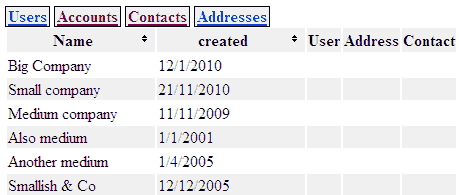
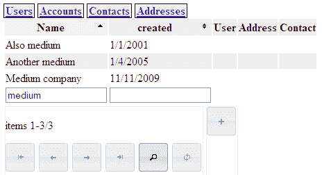
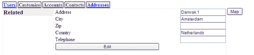
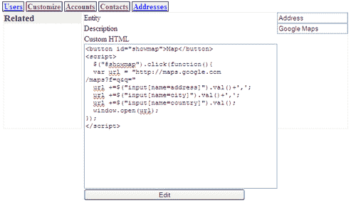
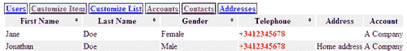
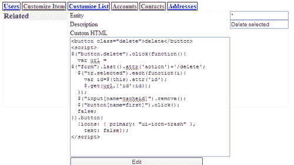
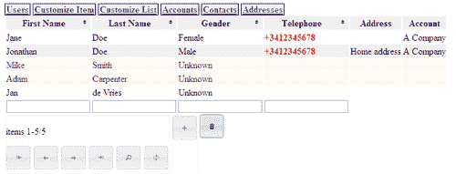

# 第十章. 定制 CRM 应用程序

> 在本章的最后，我们将向我们的框架添加功能，以便进行一些收尾工作。

具体来说，我们将看到：

+   需要什么来增强用户界面，以便在框架中使用排序和筛选功能

+   我们如何为最终用户提供自定义应用程序的手段，而无需编程

+   如何使用这些自定义来增强项目和项目列表的显示

+   如何使用来自外部来源的信息，如 Google Maps，来增强存储的信息

# 操作时间排序

当我们在第八章（Chapter 8` 方法中的底层功能时，我们已经处理了排序和筛选。

我们还没有允许任何用户交互来使显示的实体列表可排序。所缺少的是实现这一功能的 JavaScript 代码和一些 CSS。看看下面的截图，注意列表顶部账户旁边的一些表头旁边的小箭头图标：



当你运行 `crm2.py` 时，你可以亲自尝试排序选项。

点击带有小双箭头标记的列一次，将按该特定列的升序排序列表。表头将改变其背景颜色以指示列表现在已排序，小图标将变成一个单向上箭头。

再次点击它将按降序排序列表，这将通过一个指向下的小箭头图标来表示。最后一次点击将使项目列表无序，就像点击重置按钮一样（未显示）。

## 刚才发生了什么？

这种排序行为是通过几个小部分实现的：

+   与表头关联的 jQuery 点击处理程序

+   一些 CSS 代码来为这些表头添加合适的图标

+   对生成表格的 Python 代码进行的一些小修改，以便在浏览器中更容易跟踪排序状态。

首先，让我们看看需要添加到 JavaScript 中的内容（完整的文件作为 `browse.js` 提供）：`

**第十章/browse.js**

```py
$(".notsorted").live('click',function(){
	$("input[name=sortorder]").remove();
	$(".content form").first() 
	.append('<input type="hidden" name="sortorder" value="' 
			+$("div.colname",this).text()+',asc">');
	$("button[name=first]").click();
}).live('mouseenter mouseleave',function(){
	$(this).toggleClass("ui-state-highlight");
});
$(".sorted-asc").live('click',function(){
	//alert('sorted-asc '+$(this).text())
	$("input[name=sortorder]").remove(); $(".content form").first() 
	.append('<input type="hidden" name="sortorder" value="' 
			+$("div.colname",this).text()+',desc">');
	$("button[name=first]").click();
}).live('mouseenter mouseleave',function(){
	$(this).toggleClass("ui-state-highlight");
});
$(".sorted-desc").live('click',function(){
	//alert('sorted-desc '+$(this).text())
	$("button[name=clear]").click();
}).live('mouseenter mouseleave',function(){
	$(this).toggleClass("ui-state-highlight");
});

```

安装点击处理程序本身很简单，但它们需要完成的任务稍微复杂一些。

点击处理程序必须首先确定哪个列将用作排序键。被点击的元素作为 `this` 可用于处理程序，这将使我们能够访问包含列名称的 `<div>` 元素，该元素位于表头内。这个 `<div>` 元素没有显示，因为它的 `display` 属性将被设置为 `none`。它是添加的，因为我们需要访问列的规范名称。`<th>` 元素本身只包含列的显示名称，这可能与规范名称不同。

这个排序键必须传递给应用服务器，为此我们将使用现有的机制：如果我们通过导航按钮触发表单的提交并确保传递了正确的排序参数，我们几乎就完成了。这该如何实现呢？

jQuery 提供了方便的方法来将新的 HTML 元素插入到现有的标记中（突出显示）。从列名中，我们通过添加`asc`或`desc`来构造一个合适的值，用逗号分隔，并使用这个值作为具有`sortorder`名称的新隐藏输入元素的值，然后使用`append()`方法将其插入到第一个`<form>`元素中。页面中的第一个表单是包含导航按钮的表单元素。

由于这些相同类型的隐藏`<input>`元素用于在用户翻页浏览项目列表时维护状态，我们首先删除任何具有`name`属性等于`sortorder`的`<input>`元素，以确保这些元素反映的是新选定的排序顺序，而不是任何旧的排序顺序。删除操作是通过名为`remove()`的方法完成的。

最后一步是提交表单。我们可以直接触发提交事件，但由于我们有多个具有`type`属性等于`submit`的按钮，我们必须更加具体。

在按钮上无法触发`submit`事件，只能是在表单上，但可以在按钮上触发`click`事件，从而模拟用户交互。一旦在具有`name`属性为`first`的按钮上触发`click`事件，表单将连同所有其`<input>`元素一起提交，包括隐藏的元素，以及表示排序顺序的新增或替换的元素。

对于已经按升序排序并带有`sorted-asc`类的`<th>`元素的处理器几乎相同。我们做的唯一改变是将具有`name=sortorder`的隐藏`<input>`元素的值改为带有`,`后缀的列名，而不是`asc`后缀。

当`<th>`元素已经按降序排序时，点击它将循环回到显示未排序状态，因此这个点击处理器甚至更简单，它只是触发清除按钮的点击处理器，这将导致列表未排序。

`Browse`类中的`index()`方法的变化如下（完整代码可在`browse.py`中找到）：`

**第十章/browse.py**

```py
yield '<thead><tr>'
				for col in self.columns:
					if type(col) == str :
						sortclass="notsorted"
						iconclass="ui-icon ui-icon-triangle-2-n-s"
						for s in sortorder:
								if s[0]==col :
									sortclass='sorted-'+s[1] iconclass=' ui-icon ui-icon-
triangle-1-%s'%({'asc':'n','desc':'s'}[s[1]])
									break
						yield '<th class="%s"><div class="colname" 
style="display:none">%s</div>'%(sortclass,col)+self.entity.
displaynames[col]+'<span class="%s"><span></th>'%iconclass
				else :
						yield '<th>'+col.__name__+'</th>'
		yield '</tr></thead>\n<tbody>\n'

```

我们应用程序中的 Python 代码几乎不需要改变，以适应这种交互方式。我们只是给列的`<th>`元素添加一个表示排序状态的类。

它是`notsorted, sorted-asc`或`sorted-desc`之一。我们还插入一个`<div>`元素来保存列的真实名称，以及一个带有合适的 jQuery UI 图标类的空`<span>`元素来保存表示排序状态的图标（突出显示）。

`sortorder` 列表包含多个元组，每个元组都有一个要排序的列的名称作为第一个元素，以及 `asc` 或 `desc` 作为第二个元素。第二个元素用作字典的索引，该字典将 `asc` 映射到 `n`，将 `desc` 映射到 `s`，从而选择 `ui-icon-triangle-1-n` 或 `ui-icon-triangle-1-s` 类。将这些类与 `ui-icon` 类一起附加，这就是我们需要让 jQuery UI 样式表渲染我们的 `<span>` 元素并带有有意义图标的全部。

### 注意

许多类似箭头的图标，在 jQuery UI 中可用，遵循与这里的小三角形相似的命名模式。最后的部分表示一个罗盘方向（这里 `n` 表示北，或向上）和数字表示图标中描绘了多少个箭头（这里只有一个，但有许多双头变体）。

对于当前按升序排序的名为 `time` 的列，生成的 HTML 可能看起来像这样：

```py
<th class="sorted-asc">
<div class="colname" style="display:none">time</div>
Time
<span class="ui-icon ui-icon-triangle-1-n"><span>
</th>

```

除了图标外，我们还在 `base.css` 中添加了一些额外的样式，使标题更易于识别：

**第十章/base.css**

```py
th.notsorted { padding-right:1px; border:solid 1px #f0f0f0; }
th.sorted-asc { padding-right:1px; border:solid 1px #f0f0f0; 
background-color: #fff0f0; }
th.sorted-desc { padding-right:1px; border:solid 1px #f0f0f0; 
background-color: #fffff0; }
th span { float:right; }

```

表头本身只是用浅灰色进行了样式化，但将包含图标的 `<span>` 元素浮动到右侧是很重要的，否则它会在列标题的下方而不是旁边移动。

# 动作过滤时间

我们用于排序的几乎相同的方法也可以用于过滤，只是这一次不是点击列标题就能完成，我们必须为用户提供一种输入过滤值的方法。查看以下屏幕截图或通过再次运行 `crm2.py` 来自己过滤数据：



如果你将值插入到表格下方列的任何输入字段中，并点击过滤按钮（带有放大镜图标的按钮），要显示的项目列表将减少到与过滤值匹配的项目。请注意，排序和过滤可以组合使用，并且点击清除按钮将删除排序和过滤设置。

## 刚才发生了什么？

让我们看看 JavaScript 代码：

**第十章/browse.js**

```py
$("button[name=search]").button({
	icons: {
		primary: "ui-icon-search"
		},
		text: false
}).click(function(){ $("input[name=pattern]", $(".content form").first()).remove();
		$("input[name=pattern]").each(function(i,e){
			var val=$(e).val();
			var col=$(e).next().text();
			$(".content form").first() 
			.append(
			'<input type="hidden" name="pattern" value="' 
			+col+','+val+'">');
	});
		$("button[name=first]").click();
});

```

大部分工作是在搜索按钮的点击处理程序中完成的。当点击搜索按钮时，我们必须在第一个表单中构建隐藏的 `<input>` 元素，其 `name` 属性等于 `pattern`，因为正是这些隐藏的过滤输入将在我们触发表单提交时作为参数传递给动作 URL。

注意 jQuery 函数（$）的第二个参数，它选择一个`<input>`元素（突出显示）。提供给用户输入模式值的所有可见`<input>`元素以及包含导航按钮的表单中的隐藏元素都具有相同的`name`属性（模式）。我们不希望删除可见的元素，因为它们包含我们感兴趣的模式值。因此，我们将选择限制在第一个表单的上下文中，该表单作为第二个参数传递。

之后，我们只剩下可见的`<input>`元素，我们使用`.each()`方法遍历它们。我们收集`<input>`元素的价值及其下一个兄弟元素的内容，该兄弟元素将是一个包含要过滤的列的真实名称的（隐藏的）`<span>`元素。这些元素一起用于构建一个新隐藏的`<input>`元素，该元素将被附加到将要提交的表单中。

在元素插入后，我们通过触发具有等于`first`属性的`name`属性的提交按钮的点击处理程序来提交此表单。

**第十章/browse.py**

```py
			yield '<tfoot><tr>'
			for col in self.columns:
				if type(col)==str:
					filtervalue=dict(pattern).get(col,'')
					yield '''<td><input name="pattern" 
							value="%s"><span 
							style="display:none">%s</span> 
							</td>'''%(filtervalue,col)
			yield '</tr></tfoot>\n'

```

在我们网络应用程序的 Python 部分中，唯一需要更改的是插入适当的`<input>`元素，这些元素使用当前的模式值初始化，以向用户提供可见的反馈。当前过滤值为 ABC 的列的 HTML 结果可能如下所示：

```py
<td>
<input name="pattern" value="ABC">
<span style="display:none">name</span>
</td>

```

# 定制

无论你的应用程序设计得多好、多么详尽，用户总是希望从中获得更多功能。当然，有了适当的框架和良好的代码文档，更改不应成为大问题，但另一方面，你也不想仅仅因为需要一些小的定制就重新启动应用程序。

许多关于应用程序的请求将关注用户界面的可用性，例如，小部件的不同行为或与显示信息相关的某些附加功能，如检查输入文本的拼写，查找与显示的公司相关的股票市场信息，或屏幕上某个价值的当前汇率以不同货币表示。包括微软、雅虎和谷歌在内的许多公司提供各种免费 API，可用于增强值的显示。

# 定制实体显示的行动时间

假设我们想通过简单地点击地址旁边的按钮，让最终用户能够通过谷歌地图定位地址。运行`crmcustomize.py`并添加新地址或编辑现有地址。编辑/添加屏幕将类似于以下内容：



当你点击**地图**按钮时，将打开一个新窗口，显示该地址的地图，只要谷歌地图能够找到它。

这种功能是由最终用户添加的，无需重新启动服务器。注意，在打开屏幕中，我们有一个新的菜单，**自定义**。如果选择该菜单，我们会看到一个熟悉的界面，显示为不同实体添加的自定义设置列表。如果我们双击带有 Google Maps 描述的`地址`，我们会得到一个编辑屏幕，如下面的插图所示：



快速浏览一下就会显示，这种自定义本身仅仅是 HTML 与一些 JavaScript 的混合，这些 JavaScript 是在每次我们为`地址`实体打开编辑或添加屏幕时添加到应用程序生成的标记中的。

### 注意

允许任何最终用户自定义应用程序可能并不总是好主意。你可能希望将一些或所有自定义选项限制为最终用户的一个子集。基于角色的访问控制再次是一种管理权限的合适方式。

## 刚才发生了什么？

让我们先看看自定义本身，以了解可以完成什么。代码由几行 HTML 和一段嵌入的 JavaScript 组成：

**Chapter10/customization.html**

```py
<button id="showmap">Map</button>
<script>
$("#showmap").click(function(){
	var url = "http://maps.google.com/maps?f=q&q="
	url +=$("input[name=address]").val()+',';
	url +=$("input[name=city]").val()+',';
	url +=$("input[name=country]").val();
	window.open(url);
});
</script>

```

由于我们的应用程序本身依赖于 jQuery，任何自定义代码都可以使用这个库，因此在我们定义了一个合适的按钮之后，我们添加了一个点击处理程序（突出显示）来从几个`<input>`元素的值构建一个 Google Maps URL，这些元素将出现在`地址`的编辑或添加页面上，特别是`地址`、`城市`和`国家`。然后，这个 URL 通过`window.open()`方法传递，以打开一个新屏幕或标签页，显示此查询的结果。

### 注意

当使用 Google Maps API 时，可能会获得更好的结果，请参阅[`code.google.com/intl/nl/apis/maps/documentation/javascript`](http://code.google.com/intl/nl/apis/maps/documentation/javascript)。

我们需要在我们的框架中更改什么以允许这种简单的最终用户自定义？

我们需要几个相关组件来使这个功能正常工作：

+   `Display`类需要被修改以生成适合显示实例的定制代码。

+   我们需要一种方法将自定义存储在数据库中，与应用程序的其他部分一起。

+   我们需要允许一种方式来编辑这些自定义设置。

让我们详细看看这些要求。最重要的部分是存储这些信息的方法。就像我们为基于角色的访问控制所做的那样，我们实际上可以再次使用我们的框架；这次是通过定义一个`custom`类。这个`custom`类将创建一个`DisplayCustomization`类，并为从`AbstractEntity`类派生的所有实体提供对其的访问。在实体模块中需要的更改是适度的（完整的代码可在`rbacentity.py`中找到）：

**Chapter10/rbacentity.py**

```py
class custom:
	def __init__(self,db):
		class CustomEntity(AbstractEntity):
			database=db
		class DisplayCustomization(CustomEntity):
			entity = Attribute(notnull= True, 
					displayname = "Entity")
			description = Attribute(displayname = "Description")
			customhtml = Attribute(displayname = "Custom HTML", 
						htmlescape=True, displayclass="mb-textarea")
		self.DisplayCustomization = DisplayCustomization
	def getDisplayCustomization(self):
		return self.DisplayCustomization
	def getDisplayCustomHTML(self,entity):
		return "".join(dc.customhtml for dc in self.
DisplayCustomization.list(pattern=[('entity',entity)]))

```

现在我们已经可以访问这个存储自定义功能的地方，任何应用程序都可以使用它，但同时也必须提供一个方式让应用程序用户编辑这些自定义功能。这涉及到定义一个`Browse`类并添加一个链接来提供访问。这是在`crmcustomize`应用程序中是如何实现的，如下例所示（仅显示相关更改，完整代码可在`crmcustomize.py`中找到）： 

**第十章/crmcustomize.py**

```py
...
displaycustom = User._custom().getDisplayCustomization()
class DisplayCustomizationBrowser(Browse):
	edit = Display(displaycustom, edit=True, logon=logon)
	add = Display(displaycustom, add=True, logon=logon)
...
class Root():
	logon = logon
	user = UserBrowser(User)
	account = AccountBrowser(Account, 
				columns=Account.columns+[User,Address,Contact])
	contact = ContactBrowser(Contact, 
				columns=Contact.columns+[Address,Account])
	address = AddressBrowser(Address)
	displaycustomization = DisplayCustomizationBrowser(displaycustom, 
		columns=['entity','description'])
	@cherrypy.expose
	def index(self):
			return Root.logon.index(returnpage='../entities')
	@cherrypy.expose
	def entities(self):
		username = self.logon.checkauth()
		if username is None : raise HTTPRedirect('.')
		user=User.list(pattern=[('name',username)])
		if len(user) < 1 : User(name=username)
		return basepage%'''<div class="navigation">
		<a href="user">Users</a>
		<a href="displaycustomization">Customize</a>
		<a href="http://account">Accounts</a>
		<a href="contact">Contacts</a>
		<a href="http://address">Addresses</a>
		</div><div class="content">
		</div>
		<script src="img/browse.js" type="text/javascript"></script>
		'''

```

最后一步是使用检索和传递这些自定义功能的方法来增强显示模块。这是通过在`index()`方法的末尾添加几行代码来完成的，如下所示：

**第十章/display.py**

```py
yield self.entity._custom().getDisplayCustomHTML('*')
yield self.entity._custom().getDisplayCustomHTML(self.entity.__name__)

```

检索是相当直接的，我们实际上检索了两部分自定义功能：一部分是我们正在显示的特定实体，另一部分是对所有实体都相关的自定义代码。用户可以使用特殊实体名称*（单个星号字符）添加此类自定义。通过在提供的标记中首先放置一般自定义功能，我们可以覆盖为通用情况提供的任何内容，以特定实体的自定义功能来替代。

然而，在`Display`类的代码中还需要一些技巧。因为自定义代码可能包含 HTML，包括包含 JavaScript 的`<script>`元素和包含 CSS 的`<style>`元素，当我们显示用于编辑自定义代码的表单时，这些表单本身就是 HTML，我们可能会遇到麻烦。因此，我们需要某种方法来转义此代码，以防止输入框中的内容被解释为 HTML。

这是以以下方式实现的（以下是对`Attribute`类的相关更改）：

**第十章/rbacentity.py**

```py
class Attribute:
	def __init__(self,
			unique =False,
			notnull =False,
			default =None,
			affinity =None,
			validate =None,
			displayname =None,
			primary =False,
			displayclass =None,
			htmlescape =False):
			self.unique =unique
			self.notnull =notnull
			self.default =default
			self.affinity=affinity
			self.coldef = ( 
				affinity+' ' if not affinity is None else '') 
				+ ('unique ' if unique else '') 
				+ ('not null ' if notnull else '') 
				+ ('default %s '%default if not default is None else '')
			self.validate = validate?
			self.displayname = displayname
			self.primary = primary
			self.displayclass = displayclass
			self.htmlescape = htmlescape

```

实体模块中提供的`Attribute`类被扩展以接受额外的`htmlescape`参数。如果我们将其设置为`True`，则表示应在此属性显示在页面之前对其进行转义。

`MetaEntity`类还需要扩展以在`Attribute`类的新功能上操作：

**第十章/rbacentity.py**

```py
classdict['htmlescape']={ k:v.htmlescape 
			for k,v in classdict.items() if type(v) == Attribute}

```

`MetaEntity`类被修改为将任何`htmlescape`属性存储在`htmlescape`类的属性中，这是一个按属性名称索引的字典。

到目前为止，我们可以创建带有标记为转义的属性的新实体，但`Display`类本身必须对此信息采取行动。因此，我们在`Display`类的`index()`方法中添加以下行：

**第十章/display.py**

```py
val=getattr(e,c)
if self.entity.htmlescape[c] :
		val=escape(val,{'"':'&quot;','\n':'
'})
		line='''<input type="text" name="%s" 
				value="%s" 
				class="%s">'''%(c,val,displayclass)

```

在`Display`类的`index()`方法中，在构建`<input>`元素之前，我们现在可以检查这个`htmlescape`字典，看看是否应该转义属性的值，如果是这样，就使用 Python 的`xml.sax.saxutils`模块中提供的`escape()`函数来转换可能干扰的任何字符。

### 注意

**注意事项：**

允许人们使用 HTML 和 JavaScript 定制应用程序固有的风险。当我们开发 wiki 应用程序时，我们通过清除不想要的 HTML 输入来限制页面上允许的输入。如果你对安全（你应该这样）认真负责，你必须考虑你将允许的定制内容，特别是为了防止跨站脚本（XSS）。例如，检查[`www.owasp.org/`](http://www.owasp.org/)了解更多关于此和其他安全主题的信息。

# 定制实体列表的操作时间

当然，如果我们为用户提供定制单个实体显示的机会，那么为实体列表提供相同的功能也是有意义的。如果你运行`crm4.py`并点击**联系人**菜单项，你会看到一个如下列表：



你会注意到在包含电话号码的列中，以加号开头的那些电话号码以粗体显示。这将给出一个明显的提示，这可能是一个需要电话交换机上特殊代码的外国号码。

## 刚才发生了什么？

定制本身是一小段 JavaScript 代码，它被插入到显示联系人列表的页面末尾：

**第十章/customizationexample3.html**

```py
<script>
var re = new RegExp("^\\s*\\+"); $("td:nth-child(4)").each(function(i){
	if($(this).text().match(re)){
		$(this).css({'font-weight':'bold'})
	};
});
</script>

```

它使用 jQuery 遍历所有`<td>`元素，这是它们父元素的第四个子元素（一个`<tr>`元素，代码被突出显示）。如果该元素包含的文本与以可选空白和一个加号开头的文本匹配（正则表达式本身在脚本的第 一行定义），我们将该元素的`font-weight` CSS 属性设置为`bold`。

就像对`Display`的定制一样，我们需要添加一些方式来存储这些定制。在实体模块中对`custom`类的修改是直接的，并且复制了为`Display`设置的模板（完整的代码可在`rbacentity.py`中找到）：

**第十章/rbacentity.py**

```py
def __init__(self):
		...
		class BrowseCustomization(CustomEntity):
			entity = Attribute(notnull= True, displayname = "Entity")
			description = Attribute(displayname = "Description")
			customhtml = Attribute(displayname = "Custom HTML", 
				htmlescape=True, displayclass="mb-textarea")
		self.BrowseCustomization = BrowseCustomization
		...
def getBrowseCustomization(self):
		return self.BrowseCustomization
def getBrowseCustomHTML(self,entity):
		return "".join(dc.customhtml 
		for dc in self.BrowseCustomization.list( 
					pattern=[('entity',entity)]))

```

在`browse.py`中定义的`Browse`类也需要扩展，以便检索和传递定制（以下是从`browse.py`中显示的相关行）：

**第十章/browse.py**

```py
yield self.entity._custom().getBrowseCustomHTML('*')
yield self.entity._custom().getBrowseCustomHTML(self.entity.__name__)

```

最后一步是为用户提供一个编辑定制的链接。这是在主应用程序（作为`crm4.py`提供）中通过添加这些行来完成的，再次遵循为显示定制设置的模板（与浏览定制相关的行被突出显示）：

**第十章/crm4.py**

```py
displaycustom = User._custom().getDisplayCustomization() browsecustom = User._custom().getBrowseCustomization()
class DisplayCustomizationBrowser(Browse):
	edit = Display(displaycustom, edit=True, logon=logon)
	add = Display(displaycustom, add=True, logon=logon) class BrowseCustomizationBrowser(Browse):
	edit = Display(browsecustom, edit=True, logon=logon)
	add = Display(browsecustom, add=True, logon=logon)
with open('basepage.html') as f:
	basepage=f.read(-1)
class Root():
	logon = logon
	user = UserBrowser(User)
	account = AccountBrowser(Account, 
				columns=Account.columns+[User,Address,Contact])
	contact = ContactBrowser(Contact, 
				columns=Contact.columns+[Address,Account])
	address = AddressBrowser(Address)
	displaycustomization = DisplayCustomizationBrowser( 
				displaycustom,columns=['entity','description']) browsecustomization = BrowseCustomizationBrowser( 
				browsecustom,columns=['entity','description'])
	@cherrypy.expose
	def index(self):
		return Root.logon.index(returnpage='../entities')
	@cherrypy.expose
	def entities(self):
		username = self.logon.checkauth()
	if username is None : raise HTTPRedirect('.')
	user=User.list(pattern=[('name',username)])
	if len(user) < 1 : User(name=username)
	return basepage%'''<div class="navigation">
	<a href="user">Users</a>
	<a href="displaycustomization">Customize Item</a> <a href="http://browsecustomization">Customize List</a>
	<a href="http://account">Accounts</a>
	<a href="contact">Contacts</a>
	<a href="http://address">Addresses</a>
	</div><div class="content">
	</div>
	<script src="img/browse.js" type="text/javascript"></script>
	'''

```

我们当然不仅限于客户端的操作。因为我们可以利用 jQuery 的所有 AJAX 功能，我们可以做相当复杂的事情。

我们的实体浏览器已经具有在单击一次时将行标记为选中的功能。然而，我们没有为这个选择实现任何有用的操作。

当我们最初实现`Display`类时，我们添加了一个`delete()`方法并将其暴露给 CherryPy 引擎。我们并没有以任何方式使用这个方法。现在，由于我们可以自定义实体浏览器，我们可以纠正这一点并实现一些功能，添加一个按钮，当点击时将删除所有选定的条目。请注意，在真实的应用程序中从一开始就提供这样的基本功能可能更有意义，但这确实展示了可能实现的功能。

# 添加删除按钮的时间

再次运行`crm4.py`，然后在**定制列表**菜单中添加一个适用于所有实体（因此标记为`*`）的项目，如下所示：



例如，如果我们现在打开联系人列表，我们会看到一个带有垃圾桶图标的新按钮：



## 刚才发生了什么？

我们添加的自定义包括一些 HTML 来定义`<button>`元素和一些 JavaScript 来将其渲染为漂亮的垃圾桶按钮并对其点击进行操作：

**第十章/定制示例 4.html**

```py
<button class="delete">delete</button>
<script>
$("button.delete").click(function(){ var url = $("form").last().attr('action')+'/delete';
	$("tr.selected").each(function(i){
			var id=$(this).attr('id');
			$.get(url,{'id':id});
	});
	$("input[name=cacheid]").remove();
	$("button[name=first]").click();
	false;
}).button({icons: { primary: "ui-icon-trash" },text: false});
</script>

```

点击处理程序从实体列表中的最后一个表单中获取`action`属性（突出显示）。这个表单包含添加按钮，因此这个`action`属性将指向由`Display`实例的`index()`方法服务的 URL。我们只需将其添加`delete`即可使其指向将由`delete()`方法服务的 URL。

下一步是遍历所有具有`selected`类的`<tr>`元素，并使用 jQuery 的`get()`方法从添加为参数的`<tr>`元素中获取具有`id`属性的 URL。

最后，我们必须重新显示实体列表以显示删除的效果。如果列表已被过滤和/或排序，我们希望保留这些设置，但我们仍然必须删除包含`cacheid`的隐藏`<input>`元素，否则我们将展示旧列表。删除它后，我们触发第一个按钮的点击处理程序以启动重新加载。

与几乎每个 jQuery 方法一样，`click()`方法返回它被调用的选定元素，因此我们可以将`button()`方法链接到我们的按钮元素上，以添加适当的图标。

# 摘要

这最后一章全部关于完善我们的 CRM 应用程序。我们增强了用户界面以利用底层框架的排序和过滤功能，重用了框架本身来存储和管理用户自定义，并通过从 Google Maps 检索数据来增强项目显示和项目列表，展示了这些自定义的强大功能。

# 附录 A.资源参考

> 在不重复书中给出的每个参考的情况下，本附录列出了一些资源，这些资源提供了关于人们构建 Web 应用程序的各种感兴趣主题的良好和全面的信息。

# 良好的离线参考书籍

有时候，放下键盘，放松一下，读一些关于我们最喜欢的主题的书（或电子阅读器）是很不错的。以下是一些我经常参考的参考书籍（一些 ISBN 可能反映电子书版本）：

尤其对于熟悉 Python 的人来说，拥有一些关于 JavaScript 和 jQuery 库的好书是非常方便的。以下三本书是很好的入门选择：

+   **《学习 JavaScript，第二版》，Shelley Powers 著，O'Reilly 出版社，978-0-596-52187-5**

    对 JavaScript 基础的综合介绍。

+   **《jQuery 食谱》，Cody Lindley 著，O'Reilly 出版社，978-0-596-15977-1**

    介绍了如何使用 jQuery 解决常见需求的大量实用示例。

+   **《jQuery UI 1.7》，Dan Wellman 著，Packt 出版社，978-1-847199-72-0**

    对 jQuery UI 库的所有功能进行逐步解释，包括像拖放这样的高级功能。

Python 在网上有非常好的文档。特别是对与 Python 一起分发的标准模块的覆盖非常出色，但要深入了解语言本身以及 3.0 版本中添加的功能，这本书是一个很好的起点：**《Python 3 编程》，Mark Summerfield 著，Addison Wesley 出版社，978-0-32168056-3**

以下所有书籍都涵盖了在这本书中扮演重要角色的 Python 主题：

+   **《Python 测试入门指南》，Daniel Arbuckle 著，Packt 出版社，978-1847198-84-6**

    测试不必困难，这本书展示了原因。

+   **《CherryPy 基础教程》，Sylvain Hellegouarch 著，Packt 出版社，978-1904811-84-8**

    我们在这本书的示例中广泛使用的 CherryPy 应用程序服务器功能强大得多。由其主要开发者撰写，本书涵盖了所有功能，并提供了某些网络应用的实用示例。

+   **《使用 SQLite》，Jay A. Kreibich 著，O'Reilly 出版社，978-0-596-52118-9**

    本书展示了 SQLite 的能力，甚至是对数据库设计和 SQL 使用的良好介绍。它不是针对 Python 的（SQLite 在许多地方比 Python 本身使用得更多）。

+   **《精通正则表达式，第三版》，O'Reilly 出版社，978-0-596-52812-6**

    这本书涵盖了关于正则表达式的所有知识。它主要不是针对 Python 的，但由于 Python 的正则表达式库与 Perl 中的非常相似，几乎所有示例都可以直接在 Python 中使用。

+   **《CSS 精通》，Andy Budd 著，Friends of Ed 出版社，978-159059-614-2**

    当然，jQuery UI 并没有涵盖所有样式问题，CSS 也可能很棘手。这本书是我找到的最易读的之一。

# 其他网站、维基和博客

关于书中使用的工具和资源的更多信息可以在网上找到。

## 工具和框架

+   [`www.cherrypy.org/`](http://www.cherrypy.org/)

    本书示例中使用的纯 Python 应用程序服务器。

+   [`projects.apache.org/projects/http_server.html`](http://projects.apache.org/projects/http_server.html)

    Apache 不仅仅是一个 Web 服务器，但这个链接直接指向这个工作马。

+   [`jquery.com/`](http://jquery.com/)

    [`jqueryui.com/`](http://jqueryui.com/%20)

    整本书中用于增强用户界面的 JavaScript 库的所有内容。

+   [`www.prototypejs.org/`](http://www.prototypejs.org/)

    [`www.sencha.com/products/extjs/`](http://www.sencha.com/products/extjs/%20)

    [`mootools.net/`](http://mootools.net/%20)

    [`dojotoolkit.org/`](http://dojotoolkit.org/)

    jQuery/jQuery UI 库的可能替代品。每个都有自己的优点和缺点。

+   [`sqlite.org/`](http://sqlite.org/)

    [`wiki.python.org/moin/DatabaseInterfaces`](http://wiki.python.org/moin/DatabaseInterfaces)

    随 Python 捆绑的嵌入式数据库引擎及其与 Python 兼容的替代数据库引擎列表。

+   [`www.aminus.net/dejavu`](http://www.aminus.net/dejavu)

    [`www.djangoproject.com/`](http://www.djangoproject.com/%20)

    [`www.sqlalchemy.org/`](http://www.sqlalchemy.org/%20)

    [`elixir.ematia.de/trac/`](http://elixir.ematia.de/trac/%20)

    一些高质量的面向对象关系映射器。

+   [`subversion.apache.org/`](http://subversion.apache.org/)

    [`git-scm.com/`](http://git-scm.com/%20)

    都很好！广泛使用的版本管理工具。

+   [`code.google.com/apis/libraries/devguide.html`](http://code.google.com/apis/libraries/devguide.html)

    [`www.asp.net/ajaxlibrary/cdn.ashx`](http://www.asp.net/ajaxlibrary/cdn.ashx%20)

    内容交付框架可以显著减少您自己的 Web 服务器负载。

+   [`pypi.python.org/pypi`](http://pypi.python.org/pypi)

    Python 包索引。列出数千个可用于 Python 的包。在重新发明轮子之前先查看这个。

+   [`www.datatables.net/`](http://www.datatables.net/)

    [`www.appelsiini.net/projects/jeditable`](http://www.appelsiini.net/projects/jeditable)

    两个非常强大的 jQuery 插件。都是如何扩展 jQuery 的优秀示例。

+   [`getfirebug.com/`](http://getfirebug.com/)

    Firefox 浏览器的扩展。在调试 Web 应用程序时非常有用。

+   [`seleniumhq.org`](http://seleniumhq.org)

    一个用于测试用户界面/网页的工具。

+   [`www.owasp.org/index.php/Main_Page`](http://www.owasp.org/index.php/Main_Page)

    保护您的应用程序非常重要。在这个网站上，您可以找到关于一般原则以及特定攻击模式（及其补救措施）的信息。

## 新闻源

+   [`planet.python.org/`](http://planet.python.org/)

    关于 Python 的大量博客集合。

+   [`michelanders.blogspot.com/`](http://michelanders.blogspot.com/)

    作者关于用 Python 编写 Web 应用的博客。

# 附录 B. 临时测验答案

# 第二章，创建一个简单的电子表格

## 使用 CherryPy 提供内容

答案：

将`index()`方法重命名为`content()`

记住，为了服务由 URL 指定的内容，例如 [`127.0.0.1/content`](http://127.0.0.1/content)，CherryPy 会寻找在传递给 `quickstart()` 函数的对象实例中名为 `content()` 的方法。稍后，我们将看到也可以构建类层次结构，使 CherryPy 能够服务类似 `http://127.0.0.1/app/toplevel/content` 的 URL。

## 向按钮添加图标

答案：

`$("button").button({icons: {primary: 'ui-icon-refresh'}})`

与许多 jQuery 和 jQuery UI 插件一样，按钮小部件接受一个 `options` 对象作为参数。这个 `options` 对象可能有许多属性，其中之一是 `icons` 属性。这个属性的值本身也是一个对象，它的 `primary` 属性决定了将在按钮上显示的许多标准图标中的哪一个。请参阅按钮小部件的在线文档以查看所有选项：[`jqueryui.com/demos/button/`](http://jqueryui.com/demos/button/)，并查看 jQuery UI 的 themeroller 页面 [`jqueryui.com/themeroller/`](http://jqueryui.com/themeroller/) 以了解给定主题的所有可用图标。

## 向 unitconverter 实例添加转换

答案：

```py
$("#example").unitconverter({'cubic feet_litres':1.0/28.3168466 })

```

## 修改选项默认值

答案：b

# 第三章，任务列表 I：持久性

## 会话 ID

答案 1：

不，CherryPy 只有在准备响应时向会话数据写入某些内容时，才会将会话数据保存到持久存储中。如果收到未知的会话 ID，应用程序无法识别用户，并将此信号发送给客户端，但它不会在会话数据中存储任何内容。

答案 2：

c，因为不存储 cookie 的客户端永远不会发送包含会话 ID 的请求，服务器将生成一个新的。

## 屏幕元素样式

答案 1：

要么在传递给 `button()` 函数的 `options` 对象中省略 `text:false`，要么显式地使用 `text:true` 来显示它。

答案 2：

包围 `<form>` 元素的 `<div>` 元素可能更宽，不合适的背景颜色可能会在表单未覆盖完整宽度的地方显示。

# 第四章，任务列表 II：数据库和 AJAX

## 使用变量选择标准

答案：

`cursor.execute('select * from task where user_id = ?',(username,))`

一个可工作的实现可以在 `taskdb3.py` 中找到。请注意，由于查询中可能存在多个占位符，我们传递这些占位符的实际值作为元组。Python 语法的一个特性要求元组必须定义为包含逗号分隔的表达式的括号，即使只包含一个项目，元组也必须包含逗号。因此，`(username,)` 是一个只有一个项目的元组。

## 查找错误

答案：

`test_number()`

它将在第一个断言中失败，输出如下：

```py
python.exe test_factorial.py
.F.
======================================================================
FAIL: test_number (__main__.Test)
----------------------------------------------------------------------
Traceback (most recent call last):
File "test_factorial.py", line 7, in test_number
self.assertEqual(24,fac(4))
AssertionError: 24 != 12
----------------------------------------------------------------------
Ran 3 tests in 0.094s
FAILED (failures=1)

```

代码仍然没有说明哪里出了问题，但现在你知道新的实现并没有正确地计算一个数的阶乘。这次解决方案可能并不难找到：`range()` 函数应该传递 `2` 作为其第一个参数，因为代码中只有 `0` 和 `1` 被视为特殊情况。

# 第五章，实体和关系

## 如何检查一个类

答案：

Python 的内置函数 `issubclass()` 可以提供我们需要的信息。例如，检查 `instance_a` 属性可能实现如下：

```py
if not issubclass(instance_a, Entity) : raise TypeError()

```

## 如何选择有限数量的书籍

答案：

`booksdb.list(offset=20,limit=10)`

# 第六章，构建一个维基

## 突击测验

答案：

`id`，因为它也是唯一的。
