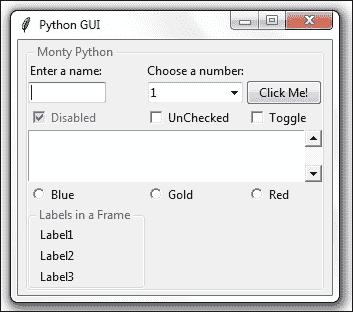

# 第二章：布局管理

在本章中，我们将使用 Python 3 来搭建我们的图形用户界面：

+   在标签框架小部件中排列多个标签

+   使用填充来为小部件周围添加空间

+   小部件如何动态扩展 GUI

+   通过在框架内嵌套框架来对齐 GUI 小部件

+   创建菜单栏

+   创建标签式小部件

+   使用网格布局管理器

# 简介

在本章中，我们将探讨如何在窗口小部件内部排列小部件以创建我们的 Python 图形用户界面。掌握 GUI 布局设计的根本原理将使我们能够创建外观出色的 GUI。有一些技术将帮助我们实现这种布局设计。

网格布局管理器是 tkinter 内置的最重要的布局工具之一，我们将要使用它。

我们可以非常容易地使用 tk 创建菜单栏、标签控制（即笔记本）以及许多其他小部件。

tk 中缺少一个开箱即用的状态栏组件。

在本章中，我们不必费心手工制作这个小部件，但它是可以完成的。

# 在标签框架小部件中排列多个标签

`LabelFrame`小部件允许我们以有组织的方式设计我们的 GUI。我们仍然使用网格布局管理器作为我们的主要布局设计工具，但通过使用`LabelFrame`小部件，我们对 GUI 设计有了更多的控制。

## 准备就绪

我们开始在我们的 GUI 中添加越来越多的控件，并在接下来的菜谱中使 GUI 完全功能化。在这里，我们开始使用`LabelFrame`控件。我们将重用上一章最后一个菜谱中的 GUI。

## 如何做到这一点...

在 Python 模块的底部主事件循环上方添加以下代码：

```py
# Create a container to hold labels
labelsFrame = ttk.LabelFrame(win, text=' Labels in a Frame ') # 1
labelsFrame.grid(column=0, row=7)

# Place labels into the container element # 2
ttk.Label(labelsFrame, text="Label1").grid(column=0, row=0)
ttk.Label(labelsFrame, text="Label2").grid(column=1, row=0)
ttk.Label(labelsFrame, text="Label3").grid(column=2, row=0)

# Place cursor into name Entry
nameEntered.focus()
```


### 注意

我们可以通过修改代码轻松地垂直对齐标签，如下所示。请注意，我们唯一需要做的更改是在列和行编号上。

```py
# Place labels into the container element – vertically # 3
ttk.Label(labelsFrame, text="Label1").grid(column=0, row=0)
ttk.Label(labelsFrame, text="Label2").grid(column=0, row=1)
ttk.Label(labelsFrame, text="Label3").grid(column=0, row=2)
```


## 它是如何工作的...

评论 # 1：在这里，我们将创建我们的第一个 ttk LabelFrame 小部件，并为框架命名。父容器是 `win`，即我们的主窗口。

在注释# 2 之后的三个行创建标签名称并将它们放置在 LabelFrame 中。我们正在使用重要的网格布局工具来排列 LabelFrame 内的标签。这个布局管理器的列和行属性赋予我们控制 GUI 布局的能力。

### 注意事项

我们标签的父容器是 LabelFrame，而不是主窗口的`win`实例变量。在这里我们可以看到布局层次结构的开始。

突出的注释 # 3 展示了如何通过列和行属性轻松更改我们的布局。注意我们如何将列更改为 0，以及我们如何通过按顺序编号行值来垂直堆叠我们的标签。

### 注意事项

ttk 的名字代表 "主题化的 tk"。Tk 8.5 中引入了 tk 主题化的控件集。

## 还有更多...

在本章后面的食谱中，我们将嵌入 LabelFrame(s)到 LabelFrame(s)中，通过嵌套它们来控制我们的 GUI 布局。

# 使用填充来为小部件周围添加空间

我们的图形用户界面正在顺利创建。接下来，我们将通过在它们周围添加一些空间来改善我们小部件的视觉外观，这样它们就可以呼吸了...

## 准备就绪

虽然 tkinter 可能曾因创建丑陋的 GUI 而声名狼藉，但自从 8.5 版本（随 Python 3.4.x 一起发布）以来，这一情况已经发生了显著变化。你只需知道如何使用可用的工具和技术。这正是我们接下来要做的。

## 如何做到这一点...

首先展示的是围绕小部件添加间距的流程方式，然后我们将使用循环以更优的方式实现相同的效果。

我们的 LabelFrame 在底部与主窗口融合时看起来有点紧凑。现在我们来修复这个问题。

修改以下代码行，通过添加`padx`和`pady`：

```py
labelsFrame.grid(column=0, row=7, padx=20, pady=40)
```

现在 我们的 LabelFrame 获得了一些呼吸空间：


## 它是如何工作的...

在 tkinter 中，通过使用名为`padx`和`pady`的内置属性来添加水平和垂直空间。这些属性可以用来在许多小部件周围添加空间，分别改善水平和垂直对齐。我们硬编码了 20 像素的空间到 LabelFrame 的左右两侧，并在框架的顶部和底部添加了 40 像素的空间。现在我们的 LabelFrame 比之前更加突出。

### 注意

上面的截图仅显示了相关更改。

我们可以使用循环来在包含在 LabelFrame 中的标签周围添加空格：

```py
for child in labelsFrame.winfo_children(): 
    child.grid_configure(padx=8, pady=4)
```

现在 LabelFrame 小部件内的标签周围也有一些空间：


`grid_configure()` 函数使我们能够在主循环显示之前修改 UI 元素。因此，当我们首次创建小部件时，我们不必硬编码值，而是可以先工作在布局上，然后在文件末尾创建 GUI 之前调整间距。这是一个值得了解的技巧。

`winfo_children()` 函数返回属于 `labelsFrame` 变量的所有子元素的列表。这使得我们可以遍历它们，并为每个标签分配填充。

### 注意事项

注意事项之一是标签右侧的间距实际上并不明显。这是因为 LabelFrame 的标题长度超过了标签的名称。我们可以通过使标签的名称更长来实验这个问题。

```py
ttk.Label(labelsFrame, text="Label1 -- sooooo much loooonger...").grid(column=0, row=0)
```

现在我们的 GUI 看起来如下。注意现在在点旁边的长标签右侧增加了一些空间。最后一个点没有接触到 LabelFrame，如果没有增加空间，它本会触碰到。


我们还可以移除 LabelFrame 的名称来观察`padx`对定位我们的标签有何影响。


# 小部件如何动态扩展 GUI

你可能已经注意到了在之前的截图和运行代码的过程中，小部件具有扩展自身以适应所需空间来视觉显示文本的能力。

### 注意事项

Java 引入了动态 GUI 布局管理的概念。相比之下，像 VS.NET 这样的可视化开发 IDE 以可视化的方式布局 GUI，基本上是硬编码 UI 元素的 x 和 y 坐标。

使用 `tkinter`，这种动态能力既带来优势也带来一点挑战，因为有时候我们更希望我们的 GUI 不要那么动态地扩展！嗯，我们是动态的 Python 程序员，所以我们可以找出如何充分利用这种出色的行为！

## 准备就绪

在上一道菜谱的开始部分，我们添加了一个标签框架小部件。这使我们的部分控件移动到了第 0 列的中心。我们可能不希望对 GUI 布局进行这种修改。接下来，我们将探讨一些修复此问题的方法。

## 如何做到这一点...

让我们先意识到在我们 GUI 布局中正在发生的微妙细节，以便更好地理解它。

我们正在使用网格布局管理器小部件，并且它以零为基础的网格排列我们的小部件。

| 行 0; 列 0 | 行 0; 列 1 | 行 0; 列 2 |
| --- | --- | --- |
| 第 1 行；第 0 列 | 第 1 行；第 1 列 | 第 1 行；第 2 列 |

使用网格布局管理器时，所发生的情况是任何给定列的宽度由该列中最长名称或小部件决定。这会影响所有行。

通过添加我们的 LabelFrame 小部件，并给它一个比像左上角的标签和其下方的文本输入框这样的硬编码尺寸小部件更长的标题，我们动态地将这些小部件移动到第 0 列的中心，为这些小部件的左右两侧添加空间。

偶然的是，因为我们使用了粘性属性来设置 Checkbutton 和 ScrolledText 小部件，所以它们仍然附着在框架的左侧。

让我们更详细地查看本章第一道菜谱的截图：


我们添加了以下代码来创建 LabelFrame，然后在这个框架中放置了标签：

```py
# Create a container to hold labels
labelsFrame = ttk.LabelFrame(win, text=' Labels in a Frame ')
labelsFrame.grid(column=0, row=7)
```

由于 LabelFrame 的文本属性，即显示为 LabelFrame 标题的文本，比我们的**输入一个名称：**标签和其下方的文本框输入都要长，因此这两个小部件会根据列 0 的新宽度动态居中。

列 0 中的 Checkbutton 和 Radiobutton 小部件没有居中，因为我们创建这些小部件时使用了`sticky=tk.W`属性。

对于 ScrolledText 小部件，我们使用了`sticky=tk.WE,`，这会将小部件绑定到框架的西边（即左边）和东边（即右边）。

让我们从 ScrolledText 小部件中移除粘性属性，并观察这种变化带来的效果。

```py
scr = scrolledtext.ScrolledText(win, width=scrolW, height=scrolH, wrap=tk.WORD)
#### scr.grid(column=0, sticky='WE', columnspan=3)
scr.grid(column=0, columnspan=3)
```

现在我们的 GUI 在 ScrolledText 小部件的左右两侧都增加了新的空间。因为我们使用了`columnspan=3`属性，所以我们的 ScrolledText 小部件仍然跨越了所有三个列。


如果我们移除 `columnspan=3`，我们会得到以下 GUI，这并不是我们想要的。现在我们的 ScrolledText 只占据了列 0，并且，由于其大小，它拉伸了布局。


要将布局恢复到添加 LabelFrame 之前的状态，一种方法是通过调整网格列位置。将列值从 0 更改为 1。

```py
labelsFrame.grid(column=1, row=7, padx=20, pady=40)
```

现在我们的图形用户界面看起来是这样的：


## 它是如何工作的...

由于我们仍在使用单个小部件，我们的布局可能会变得混乱。通过将 LabelFrame 的列值从 0 更改为 1，我们能够将控件恢复到它们原本的位置，以及我们希望它们所在的位置。至少最左边的标签、文本、复选框、滚动文本和单选按钮小部件现在都位于我们期望它们所在的位置。位于第 1 列的第二标签和文本`Entry`已经自动对齐到**框架中的标签**小部件长度的中心，因此我们基本上将我们的对齐挑战向右移动了一列。这并不那么明显，因为**选择一个数字：**标签的大小几乎与**框架中的标签**标题的大小相同，因此列宽已经接近由 LabelFrame 生成的新宽度。

## 还有更多...

在下一个菜谱中，我们将嵌套框架以避免在本菜谱中刚刚经历的部件意外错位问题。

# 通过在框架内嵌套框架来对齐 GUI 小部件

如果我们在框架中嵌套框架，我们将对我们的 GUI 布局有更好的控制。这正是本食谱中我们将要做的。

## 准备就绪

Python 及其 GUI 模块的动态行为可能会给真正实现我们想要的 GUI 外观带来一定的挑战。在这里，我们将嵌套框架以获得更多对布局的控制。这将增强不同 UI 元素之间的层次结构，使得视觉外观更容易实现。

我们将继续使用在前一个菜谱中创建的图形用户界面。

## 如何做到这一点...

在这里，我们将创建一个顶层框架，它将包含其他框架和小部件。这将帮助我们获得我们想要的 GUI 布局。

为了做到这一点，我们不得不将当前的控件嵌入到一个中央的 ttk.LabelFrame 中。这个 ttk.LabelFrame 是主父窗口的一个子窗口，所有的控件都将成为这个 ttk.LabelFrame 的子控件。

到目前为止，在我们的配方中，我们已经直接将所有小部件分配给了我们的主 GUI 框架。现在，我们只将我们的 LabelFrame 分配给主窗口，之后，我们将这个 LabelFrame 作为所有小部件的父容器。

这在我们 GUI 布局中创建以下层次结构：


在此图中，**win** 是一个变量，它引用我们的主 GUI tkinter 窗口框架；**monty** 是一个变量，它引用我们的 LabelFrame，并且是主窗口框架（**win**）的子框架；而 **aLabel** 和所有其他小部件现在都被放置到 LabelFrame 容器（**monty**）中。

在我们的 Python 模块顶部添加以下代码（参见注释 #1）：

```py
# Create instance
win = tk.Tk()

# Add a title       
win.title("Python GUI")    

# We are creating a container frame to hold all other widgets # 1
monty = ttk.LabelFrame(win, text=' Monty Python ')
monty.grid(column=0, row=0)
```

接下来，我们将修改所有以下控件以使用`monty`作为父控件，替换`win`。以下是一个如何操作的示例：

```py
# Modify adding a Label
aLabel = ttk.Label(monty, text="A Label")
```


注意所有的小部件现在都被包含在**蒙提·派森**标签框架中，它用几乎看不见的细线包围了它们。接下来，我们可以将左边的**框架中的标签**小部件重置，而不会弄乱我们的 GUI 布局：


哎呀——也许不是这样。虽然我们嵌套的框架在左侧对齐得很好，但它又把我们的顶部小部件推到了中间（默认行为）。

为了将它们左对齐，我们必须通过使用`sticky`属性强制我们的 GUI 布局。通过将其赋值为"W"（西），我们可以控制小部件实现左对齐。

```py
# Changing our Label
ttk.Label(monty, text="Enter a name:").grid(column=0, row=0, sticky='W')
```


## 它是如何工作的...

注意我们是如何对齐标签，但下面的文本框并没有对齐。我们必须为所有想要左对齐的控件使用`sticky`属性。我们可以通过循环使用`winfo_children()`和`grid_configure(sticky='W')`属性来实现，就像我们在本章第 2 个菜谱中做的那样。

`winfo_children()` 函数返回属于父元素的所有子元素的列表。这使得我们能够遍历所有小部件并更改它们的属性。

### 注意

使用 tkinter 强制左、右、上、下命名与 Java 非常相似：west（西）、east（东）、north（北）和 south（南），缩写为："W"等等。我们还可以使用以下语法：tk.W 代替"W"。

在之前的配方中，我们结合了“W”和“E”来使我们的 ScrolledText 小部件通过“WE”同时附着到其容器的左右两侧。我们可以添加更多的组合：“NSE”将我们的小部件拉伸到顶部、底部和右侧。如果我们表单中只有一个小部件，例如一个按钮，我们可以通过使用所有选项来使其填充整个框架：“NSWE”。我们还可以使用元组语法：`sticky=(tk.N, tk.S, tk.W, tk.E)`。

让我们将非常长的标签改回来，并将列 0 中的条目左对齐。

```py
ttk.Label(monty, text="Enter a name:").grid(column=0, row=0, sticky='W')

name = tk.StringVar()
nameEntered = ttk.Entry(monty, width=12, textvariable=name)
nameEntered.grid(column=0, row=1, sticky=tk.W)
```



### 注意

为了分离我们**Frame 中的标签**LabelFrame 的长度对我们 GUI 布局其余部分的影响，我们不应将此 LabelFrame 放置在与其他小部件相同的 LabelFrame 中。相反，我们直接将其分配给主 GUI 表单（`win`）。

我们将在后面的章节中这样做。

# 创建菜单栏

在这个菜谱中，我们将为主窗口添加一个菜单栏，然后将菜单添加到菜单栏中，最后将菜单项添加到菜单里。

## 准备就绪

我们将首先学习如何添加菜单栏、几个菜单和几个菜单项的技术，以展示如何实现这一原理。点击菜单项将没有任何效果。接下来，我们将为菜单项添加功能，例如，当点击**退出**菜单项时关闭主窗口，并显示**帮助** | **关于**对话框。

我们正在继续扩展当前和上一章中创建的图形用户界面。

## 如何做到这一点...

首先，我们需要从 `tkinter` 模块中导入 `Menu` 类。将以下代码行添加到 Python 模块的顶部，即导入语句所在的位置：

```py
from tkinter import Menu
```

接下来，我们将创建菜单栏。将以下代码添加到模块的底部，正好在我们创建主事件循环的上方：

```py
menuBar = Menu(win)                      # 1
win.config(menu=menuBar)
```

现在我们给这个栏添加一个菜单，并将一个菜单项分配给该菜单。

```py
fileMenu = Menu(menuBar)                 # 2
fileMenu.add_command(label="New")
menuBar.add_cascade(label="File", menu=fileMenu)
```

运行此代码将添加一个菜单栏，其中包含一个菜单，该菜单有一个菜单项。


接下来，我们在之前添加到菜单栏的第一个菜单中添加第二个菜单项。

```py
fileMenu.add_command(label="New")
fileMenu.add_command(label="Exit")        # 3
menuBar.add_cascade(label="File", menu=fileMenu)
```


我们可以通过在现有菜单项之间添加以下代码行（# 4）来在菜单项之间添加分隔线。

```py
fileMenu.add_command(label="New")
fileMenu.add_separator()               # 4
fileMenu.add_command(label="Exit")
```


通过将属性 `tearoff` 传递给菜单的构造函数，我们可以移除默认情况下出现在第一个 `MenuItem` 上方的第一条虚线。

```py
# Add menu items
fileMenu = Menu(menuBar, tearoff=0)      # 5
```


我们将添加第二个菜单，它将水平放置在第一个菜单的右侧。我们将给它一个 MenuItem，我们将其命名为`关于`，为了使这个功能正常工作，我们必须将这个第二个菜单添加到 MenuBar 中。

**文件**和**帮助**|**关于**是我们都非常熟悉的常见 Windows GUI 布局，我们可以使用 Python 和 tkinter 创建相同的菜单。

菜单、菜单项和菜单栏的创建顺序和命名可能一开始会有些令人困惑，但一旦我们习惯了 tkinter 要求我们这样编写代码的方式，这实际上变得很有趣。

```py
helpMenu = Menu(menuBar, tearoff=0)            # 6
helpMenu.add_command(label="About")
menuBar.add_cascade(label="Help", menu=helpMenu)
```


在这个阶段，我们的 GUI 有一个菜单栏和两个包含一些菜单项的菜单。点击它们并不会做太多，直到我们添加一些命令。这正是我们接下来要做的。在创建菜单栏的上方添加以下代码：

```py
def _quit():         # 7
    win.quit()
    win.destroy()
    exit()
```

接下来，我们将**文件** | **退出**菜单项绑定到该函数，通过在 MenuItem 中添加以下命令：

```py
fileMenu.add_command(label="Exit", command=_quit)    # 8
```

现在，当我们点击`退出`菜单项时，我们的应用程序确实会退出。

## 它是如何工作的...

在评论 # 1 中，我们调用菜单的 `tkinter` 构造函数并将菜单分配给我们的主 GUI 窗口。我们在实例变量 `menuBar` 中保存了一个引用，在下一行代码中，我们使用这个实例来配置我们的 GUI 以使用 `menuBar` 作为我们的菜单。

评论 #2 展示了我们首先添加一个 MenuItem，然后创建菜单的过程。这似乎不太直观，但这就是 tkinter 的工作方式。`add_cascade()` 方法将 MenuItems 从上到下垂直排列。

评论 # 3 展示了如何向菜单中添加第二个 MenuItem。

在评论 # 4 中，我们在两个菜单项之间添加了一条分隔线。这通常用于将相关的菜单项分组，并将它们与不太相关的项分开（因此得名）。

评论 # 5 禁用了撕裂虚线，使我们的菜单看起来好得多。

### 注意事项

在不禁用此默认功能的情况下，用户可以从主窗口“撕下”菜单。我发现这个功能价值不大。您可以通过双击虚线（在禁用此功能之前）随意尝试操作。

如果你使用的是 Mac，这个功能可能没有被启用，所以你根本不必担心它。


评论 #6 展示了如何向菜单栏添加第二个菜单。我们可以通过使用这种技术继续添加菜单。

评论 #7 创建了一个函数来干净地退出我们的 GUI 应用程序。这是结束主事件循环的推荐 Python 方式。

在第八部分中，我们使用`tkinter`命令属性将第七部分中创建的函数绑定到 MenuItem 上。每当我们要让我们的菜单项真正执行某些操作时，我们必须将每个菜单项绑定到一个函数上。

### 注意事项

我们遵循推荐的 Python 命名规范，在退出函数前加上一个单下划线，以表明这是一个私有函数，不应被我们的代码客户端调用。

## 还有更多……

我们将在下一章中添加**帮助** | **关于**功能，该功能介绍了消息框以及更多内容。

# 创建标签式小部件

在这个菜谱中，我们将创建标签式小部件来进一步组织我们用 tkinter 编写的不断扩展的 GUI。

## 准备就绪

为了提升我们的 Python GUI 使用标签页的功能，我们将从最基础开始，使用最少的代码来实现。在接下来的菜谱中，我们将从之前的菜谱中添加小部件，并将它们放置到这个新的标签页布局中。

## 如何做到这一点...

创建一个新的 Python 模块，并将以下代码放入此模块中：

```py
import tkinter as tk                    # imports
from tkinter import ttk
win = tk.Tk()                           # Create instance      
win.title("Python GUI")                 # Add a title 
tabControl = ttk.Notebook(win)          # Create Tab Control
tab1 = ttk.Frame(tabControl)            # Create a tab 
tabControl.add(tab1, text='Tab 1')      # Add the tab
tabControl.pack(expand=1, fill="both")  # Pack to make visible
win.mainloop()                          # Start GUI
```

这将创建以下图形用户界面：


尽管目前并不令人特别印象深刻，这个小部件还是为我们 GUI 设计工具箱增添了一个非常强大的工具。在上面的简约示例中，它有其自身的局限性（例如，我们无法重新定位 GUI，并且它也没有显示整个 GUI 标题）。

在之前的菜谱中，我们使用了网格布局管理器来处理更简单的 GUI，而现在我们可以使用更简单的布局管理器，“pack”就是其中之一。

在前面的代码中，我们将 tabControl ttk.Notebook“打包”到主 GUI 表单中，扩展笔记本标签控制以填充所有侧面。


我们可以在我们的控制面板中添加第二个标签页，并在它们之间进行点击。

```py
tab2 = ttk.Frame(tabControl)            # Add a second tab
tabControl.add(tab2, text='Tab 2')      # Make second tab visible
win.mainloop()                          # Start GUI
```

现在我们有两个标签页。点击**标签页 2**以使其获得焦点。


我们真的很想看到我们的窗口标题。所以，为了做到这一点，我们必须在我们的标签页之一中添加一个小部件。这个小部件必须足够宽，以便动态扩展我们的 GUI 来显示我们的窗口标题。我们将重新添加 Ole Monty，以及他的孩子们。

```py
monty = ttk.LabelFrame(tab1, text=' Monty Python ')
monty.grid(column=0, row=0, padx=8, pady=4)
ttk.Label(monty, text="Enter a name:").grid(column=0, row=0, sticky='W')
```

现在我们把我们的**蒙提·派森**放进了**Tab1**。


我们可以将迄今为止创建的所有小部件放入我们新创建的标签控制中。


现在所有的小部件都位于**Tab1**内。让我们将一些移动到**Tab2**。首先，我们创建第二个 LabelFrame 作为将要移动到**Tab2**的小部件的容器：

```py
monty2 = ttk.LabelFrame(tab2, text=' The Snake ')
monty2.grid(column=0, row=0, padx=8, pady=4)
```

接下来，我们将复选框和单选按钮移动到**Tab2**，通过指定新的父容器，这是一个我们命名为`monty2`的新变量。以下是一个示例，我们将它应用于所有移动到**Tab2**的控件：

```py
chVarDis = tk.IntVar()
check1 = tk.Checkbutton(monty2, text="Disabled", variable=chVarDis, state='disabled')
```

当我们运行代码时，我们的 GUI 现在看起来不同了。**Tab1**中的小部件比之前少，因为它包含了我们之前创建的所有小部件。


我们现在可以点击**Tab 2**并查看我们重新定位的控件。


点击重新定位的单选按钮（复选）不再有任何效果，因此我们将更改它们的操作，将文本属性重命名为单选按钮显示的名称，即 LabelFrame 小部件的标题。当我们点击**黄金**单选按钮时，我们不再将框架的背景设置为金色，而是在这里替换 LabelFrame 文本标题。Python "蛇"现在变为"黄金"。

```py
# Radiobutton callback function
def radCall():
    radSel=radVar.get()
    if   radSel == 0: monty2.configure(text='Blue')
    elif radSel == 1: monty2.configure(text='Gold')
    elif radSel == 2: monty2.configure(text='Red')
```

现在，选择任何一个 RadioButton 小部件都会导致 LabelFrame 的名称发生变化。


## 它是如何工作的...

在创建第二个标签页之后，我们将原本位于**Tab1**的一些小部件移动到了**Tab2**。添加标签页是组织我们不断增长的 GUI 的另一种极好方式。这是处理我们 GUI 设计中复杂性的一个非常不错的方法。我们可以将小部件按照它们自然归属的组进行排列，并通过使用标签页来让用户摆脱杂乱。

### 注意事项

在 `tkinter` 中，创建标签页是通过 `Notebook` 小部件来完成的，这是允许我们添加标签控制的工具。与许多其他小部件一样，tkinter 的笔记本小部件也附带了一些我们可以使用和配置的额外属性。探索我们可用的 tkinter 小部件的额外功能的一个绝佳起点是官方网站：[`docs.python.org/3.1/library/tkinter.ttk.html#notebook`](https://docs.python.org/3.1/library/tkinter.ttk.html#notebook)

# 使用网格布局管理器

网格布局管理器是我们可用的最有用的布局工具之一。我们已经在许多菜谱中使用了它，因为它实在是非常强大。

## 准备中…

在这个菜谱中，我们将回顾网格布局管理器的一些技术。我们已经使用过它们了，在这里我们将进一步探索它们。

## 如何做到这一点...

在本章中，我们创建了行和列，这实际上是一种数据库方法来设计 GUI（MS Excel 也是这样做）。我们硬编码了前四行，但后来我们忘记为下一行指定它希望驻留的位置。

Tkinter 在我们甚至没有注意到的情况下就已经帮我们填充了这个内容。

这里是我们代码中执行的操作：

```py
check3.grid(column=2, row=4, sticky=tk.W, columnspan=3)
scr.grid(column=0, sticky='WE', columnspan=3)              # 1
curRad.grid(column=col, row=6, sticky=tk.W, columnspan=3)
labelsFrame.grid(column=0, row=7)
```

Tkinter 会自动添加我们未指定任何特定行的缺失行（在注释# 1 中已强调）。我们可能没有意识到这一点。

我们在第四行布局了复选框，然后我们“忘记”指定我们的 ScrolledText 小部件所在的行，我们通过 scr 变量引用这个小部件，接着我们添加了单选按钮小部件，以便在第六行布局。

这工作得很好，因为 tkinter 自动增加了我们的 ScrolledText 小部件的行位置，以便使用下一个最高的行号，即第 5 行。

看着我们的代码，没有意识到我们“忘记”将 ScrolledText 小部件显式地定位到第 5 行，我们可能会认为那里没有任何内容。

因此，我们可能会尝试以下方法。

如果我们将变量 `curRad` 设置为使用第 5 行，我们可能会得到一个不愉快的惊喜：


## 它是如何工作的...

注意我们的 RadioButton（s）行突然出现在 ScrolledText 小部件的中间！这绝对不是我们想要我们的 GUI 看起来像的样子！

### 注意事项

如果我们忘记明确指定行号，默认情况下，`tkinter`将使用下一个可用的行。

我们还使用了`columnspan`属性来确保我们的小部件不会仅限于一个列。以下是确保我们的 ScrolledText 小部件跨越我们 GUI 所有列的方法：

```py
# Using a scrolled Text control    
scrolW = 30; scrolH = 3
scr = ScrolledText(monty, width=scrolW, height=scrolH, wrap=tk.WORD)
scr.grid(column=0, sticky='WE', columnspan=3)
```
