# 第三章. 外观和感觉自定义

在本章中，我们将使用 Python 3 来定制我们的图形用户界面：

+   创建消息框 – 信息、警告和错误

+   如何创建独立的消息框

+   如何创建 tkinter 窗口的标题

+   更改主根窗口的图标

+   使用旋转框控件

+   小部件的缓解、凹陷和凸起外观

+   使用 Python 创建工具提示

+   如何使用画布小部件

# 简介

在本章中，我们将通过更改一些属性来定制我们 GUI 中的某些小部件。同时，我们还将介绍一些 tkinter 为我们提供的新小部件。

*使用 Python 创建工具提示* 的配方将创建一个 OOP 风格的工具提示类，这将是我们迄今为止一直使用的单个 Python 模块的一部分。

# 创建消息框 – 信息、警告和错误

消息框是一种弹出窗口，用于向用户反馈信息。它可以提供信息性内容，暗示潜在问题，甚至可能显示灾难性错误。

使用 Python 创建消息框非常简单。

## 准备就绪

我们将在前一个菜谱中创建的**帮助** | **关于**菜单项中添加功能。在大多数应用程序中，当点击**帮助** | **关于**菜单时，用户通常会收到信息反馈。我们从这个信息开始，然后改变设计模式以显示警告和错误。

## 如何做到这一点...

将以下代码行添加到包含导入语句的模块顶部：

```py
from tkinter import messagebox as mBox
```

接下来，我们将创建一个回调函数来显示一个消息框。我们必须将回调函数的代码放在我们将回调附加到菜单项的代码之上，因为这部分代码仍然是过程式代码，而不是面向对象的代码。

在创建帮助菜单的行上方添加此代码：

```py
# Display a Message Box
# Callback function
def _msgBox():
    mBox.showinfo('Python Message Info Box', 'A Python GUI created using tkinter:\nThe year is 2015.')   

# Add another Menu to the Menu Bar and an item
helpMenu = Menu(menuBar, tearoff=0)
helpMenu.add_command(label="About", command=_msgBox)
```

现在点击**帮助** | **关于**将显示以下弹出窗口：

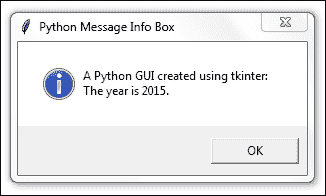

让我们将这段代码转换为一个警告信息弹窗。注释掉上一行，并添加以下代码：

```py
# Display a Message Box
def _msgBox():
#    mBox.showinfo('Python Message Info Box', 'A Python GUI 
#      created using tkinter:\nThe year is 2015.')
    mBox.showwarning('Python Message Warning Box', 'A Python GUI created using tkinter:\nWarning: There might be a bug in this code.')
```

运行上述代码现在将导致以下略微修改的消息框：

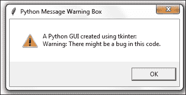

显示错误信息框很简单，通常它会警告用户存在一个严重问题。正如上面所说，下面也是如此。注释掉并添加以下代码，就像我们在这里所做的那样：

```py
# Display a Message Box
def _msgBox():
#    mBox.showinfo('Python Message Info Box', 'A Python GUI 
#      created using tkinter:\nThe year is 2015.')
#    mBox.showwarning('Python Message Warning Box', 'A Python GUI 
#      created using tkinter:\nWarning: There might be a bug in 
#      this code.')
    mBox.showerror('Python Message Error Box', 'A Python GUI created using tkinter:\nError: Houston ~ we DO have a serious PROBLEM!')
```

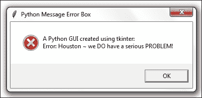

## 它是如何工作的...

我们添加了另一个回调函数，并将其作为代理附加以处理点击事件。现在，当我们点击**帮助** | **关于**菜单时，将执行一个操作。我们正在创建并显示最常见的弹出消息框对话框。它们是模态的，因此用户在点击**确定**按钮之前无法使用 GUI。

在第一个例子中，我们展示了一个信息框，如它左侧的图标所示。接下来，我们创建了警告和错误信息框，这些信息框会自动更改与弹出窗口关联的图标。我们只需指定要显示哪个 mBox 即可。

有不同的消息框显示多个**确定**按钮，并且我们可以根据用户的选取编程我们的响应。

以下是一个简单示例，说明了这项技术：

```py
# Display a Message Box
def _msgBox():
    answer = mBox.askyesno("Python Message Dual Choice Box", "Are you sure you really wish to do this?")
    print(answer)
```

运行此 GUI 代码将弹出一个窗口，用户对该窗口的响应可以用来根据此事件驱动 GUI 循环的答案进行分支，并将其保存在`answer`变量中。

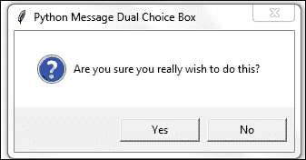

使用 Eclipse 的控制台输出显示，点击 **是** 按钮会将布尔值 `True` 赋值给 `answer` 变量。

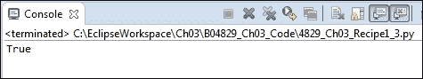

例如，我们可以使用以下代码：

```py
If answer == True:
    <do something>
```

# 如何创建独立的消息框

在这个菜谱中，我们将创建我们的 tkinter 消息框作为独立的顶层 GUI 窗口。

我们首先会注意到，这样做会导致多出一个窗口，因此我们将探讨隐藏这个窗口的方法。

在上一个菜谱中，我们通过主 GUI 表单的**帮助** | **关于**菜单调用了 tkinter 消息框。

那么我们为什么想要创建一个独立的消息框呢？

一个原因是，我们可能会自定义我们的消息框并在多个 GUI 中重复使用它们。我们不必在设计的每个 Python GUI 中复制和粘贴相同的代码，而是可以将这部分代码从主 GUI 代码中提取出来。这样就可以创建一个小的可重复使用的组件，然后我们可以将其导入到不同的 Python GUI 中。

## 准备就绪

我们已经在之前的菜谱中创建了消息框的标题。我们不会重用之前的代码，而是将通过非常少的 Python 代码行来构建一个新的 GUI。

## 如何做到这一点...

我们可以创建一个简单的消息框，如下所示：

```py
from tkinter import messagebox as mBox
mBox.showinfo('A Python GUI created using tkinter:\nThe year is 2015')
```

这将导致出现这两个窗口：

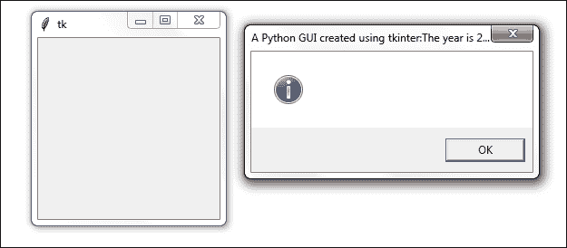

这看起来并不像我们想象中的样子。现在我们有两个窗口，一个是未期望的，另一个的文本显示为其标题。

哎呀。

让我们立即解决这个问题。我们可以通过添加一个单引号或双引号，然后跟一个逗号来修改 Python 代码。

```py
mBox.showinfo('', 'A Python GUI created using tkinter:\nThe year is 2015')
```

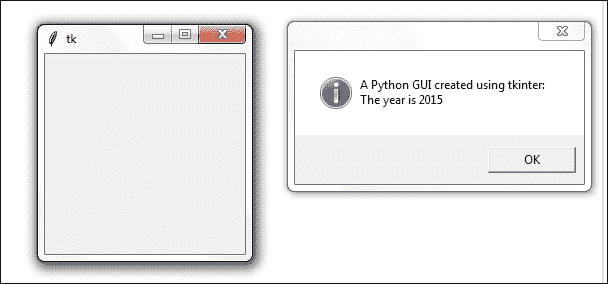

第一个参数是标题，第二个参数是在弹出消息框中显示的文本。通过添加一个空的单引号或双引号对，后面跟着一个逗号，我们可以将我们的文本从标题移动到弹出消息框中。

我们仍然需要一个标题，我们肯定想摆脱这个不必要的第二个窗口。

### 注意事项

在像 C#这样的语言中，也会出现第二个窗口的现象。这基本上是一个 DOS 风格的调试窗口。许多程序员似乎并不介意有这样一个额外的窗口漂浮在周围。我个人从 GUI 编程的角度来看，觉得这很令人不快。我们将在下一版本中移除它。

第二个窗口是由 Windows 事件循环引起的。我们可以通过抑制它来消除它。

添加以下代码：

```py
from tkinter import messagebox as mBox
from tkinter import Tk
root = Tk()
root.withdraw()
mBox.showinfo('', 'A Python GUI created using tkinter:\nThe year is 2015')
```

现在我们只有一个窗口。`withdraw()` 函数移除了我们不希望漂浮在周围的调试窗口。

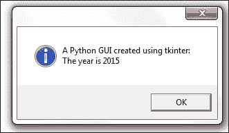

为了添加标题，我们只需在我们的空第一个参数中放入一些字符串即可。

例如：

```py
from tkinter import messagebox as mBox
from tkinter import Tk
root = Tk()
root.withdraw()
mBox.showinfo('This is a Title', 'A Python GUI created using tkinter:\nThe year is 2015')
```

现在我们的对话有一个标题：

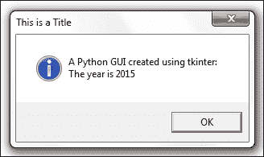

## 它是如何工作的...

我们向消息框的 tkinter 构造函数传递了更多的参数，以在窗口表单中添加标题并显示消息框中的文本，而不是将其显示为标题。这是由于我们传递参数的位置造成的。如果我们省略一个空引号或双引号，那么消息框小部件将参数的第一个位置作为标题，而不是消息框内要显示的文本。通过传递一个空引号后跟一个逗号，我们改变了消息框显示我们传递给函数的文本的位置。

我们通过在主根窗口上调用`withdraw()`方法来抑制由 tkinter 消息框小部件自动创建的第二个弹出窗口。

# 如何创建 tkinter 窗口的标题

改变 tkinter 主根窗口标题的原则与之前讨论的食谱相同。我们只需将一个字符串作为第一个参数传递给小部件的构造函数。

## 准备就绪

不同于弹出对话框，我们创建主根窗口并给它一个标题。

本食谱中显示的 GUI 是上一章的代码。它并不基于本章之前的食谱构建。

## 如何做到这一点...

以下代码创建主窗口并为其添加标题。我们已经在之前的菜谱中做过这个操作。在这里，我们只关注我们 GUI 的这个方面。

```py
import tkinter as tk
win = tk.Tk()               # Create instance
win.title("Python GUI")     # Add a title
```

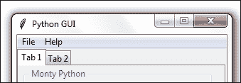

## 它是如何工作的...

这通过使用内置的 tkinter `title` 属性为主要的根窗口提供了一个标题。在我们创建一个 `Tk()` 实例之后，我们可以使用所有内置的 tkinter 属性来自定义我们的 GUI。

# 更改主根窗口的图标

修改我们的 GUI 的一种方法是为它提供一个不同于 tkinter 默认图标的不同图标。以下是我们的操作步骤。

## 准备就绪

我们正在改进之前的 GUI。我们将使用随 Python 一起提供的图标，但你也可以使用任何你认为有用的图标。确保你有图标所在位置的完整路径，否则可能会出现错误。

### 注意

虽然可能有点令人困惑，不知道这个菜谱指的是上一章的哪个菜谱，但最好的方法就是直接下载这本书的代码，然后逐步阅读代码来理解它。

## 如何做到这一点...

将以下代码放置在主事件循环上方某处。示例使用的是我安装 Python 3.4 的路径。你可能需要调整它以匹配你的安装目录。

注意到 GUI 左上角的默认“羽毛”图标已发生变化。

```py
# Change the main windows icon
win.iconbitmap(r'C:\Python34\DLLs\pyc.ico')
```

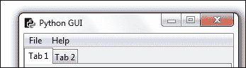

## 它是如何工作的...

这是 tkinter 自带的一个属性，tkinter 是 Python 3.x 的一部分。`iconbitmap`是我们要使用的属性，通过传入一个图标文件的绝对（硬编码）路径来改变我们主根窗口的图标。这会覆盖 tkinter 的默认图标，用我们选择的图标替换它。

### 注意事项

在上述代码的绝对路径字符串中使用 "r" 可以转义反斜杠，因此我们不必写 `C:\\`，而是可以使用“原始”字符串，这样我们就可以写出更自然的单个反斜杠 `C:\`。这是 Python 为我们创造的一个巧妙技巧。

# 使用旋转框控件

在这个菜谱中，我们将使用一个`Spinbox`小部件，并且还将把键盘上的*Enter*键绑定到我们的小部件之一。

## 准备就绪

我们正在使用我们的标签式 GUI，并将一个`Spinbox`小部件添加到`ScrolledText`控件上方。这仅仅需要我们将`ScrolledText`的行值增加一个，并在`Entry`小部件的上方插入我们的新`Spinbox`控件。

## 如何做到这一点...

首先，我们添加`Spinbox`控件。将以下代码放置在`ScrolledText`小部件之上：

```py
# Adding a Spinbox widget
spin = Spinbox(monty, from_=0, to=10)
spin.grid(column=0, row=2)
```

这将修改我们的图形用户界面，如下所示：

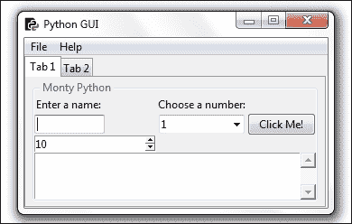

接下来，我们将减小`Spinbox`小部件的大小。

```py
spin = Spinbox(monty, from_=0, to=10, width=5)
```

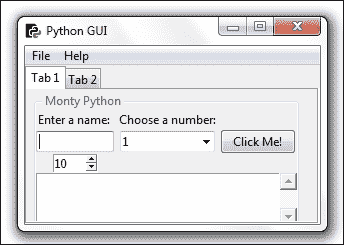

接下来，我们添加另一个属性以进一步自定义我们的小部件，`bd` 是 `borderwidth` 属性的简写表示。

```py
spin = Spinbox(monty, from_=0, to=10, width=5 , bd=8)
```

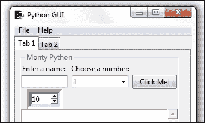

在这里，我们通过创建一个回调并将其链接到控件来为小部件添加功能。

这将把 Spinbox 的选择打印到 `ScrolledText` 中，以及输出到 stdout。名为 `scr` 的变量是我们对 `ScrolledText` 小部件的引用。

```py
# Spinbox callback 
def _spin():
    value = spin.get()
    print(value)
    scr.insert(tk.INSERT, value + '\n')

spin = Spinbox(monty, from_=0, to=10, width=5, bd=8, command=_spin)
```

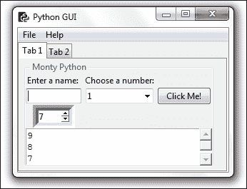

我们也可以指定一组值，而不是使用一个范围。

```py
# Adding a Spinbox widget using a set of values
spin = Spinbox(monty, values=(1, 2, 4, 42, 100), width=5, bd=8, command=_spin) 
spin.grid(column=0, row=2)
```

这将创建以下 GUI 输出：

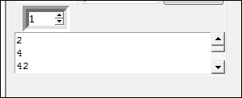

## 它是如何工作的...

注意，在第一张截图里，我们新的`Spinbox`控件默认宽度为 20，这导致该列中所有控件的列宽都被推宽了。这并不是我们想要的效果。我们给小部件设置了从 0 到 10 的范围，但它默认显示`to=10`的值，这是最大值。如果我们尝试将`from_/to`范围从 10 反转到 0，tkinter 并不喜欢这样做。请亲自尝试一下。

在第二张截图，我们减小了`Spinbox`控制条的宽度，使其与列的中心对齐。

在第三张截图，我们添加了 Spinbox 的 `borderwidth` 属性，这使得整个 `Spinbox` 自动呈现出不再扁平而是三维的效果。

在第四张截图，我们添加了一个回调函数来显示在`ScrolledText`小部件中选择的数字，并将其打印到标准输出流。我们添加了"\n"来换行打印。注意默认值并没有被打印出来。只有当我们点击控件时，回调函数才会被调用。通过点击带有默认值 10 的上箭头，我们可以打印出"10"这个值。

最后，我们将可用的值限制在一个硬编码的集合中。这些值也可以从数据源（例如，一个文本或 XML 文件）中读取。

# 小部件的缓解、凹陷和凸起外观

我们可以通过一个属性来控制我们的`Spinbox`小部件的外观，使其看起来是凸起的、凹进的，或者以提升格式显示。

## 准备就绪

我们将添加一个额外的`Spinbox`控件来演示使用`Spinbox`控件的浮雕属性所能提供的控件外观。

## 如何做到这一点...

首先，让我们将`borderwidth`增加，以便区分我们的第二个`Spinbox`和第一个`Spinbox`。

```py
# Adding a second Spinbox widget 
spin = Spinbox(monty, values=(0, 50, 100), width=5, bd=20, command=_spin) 
spin.grid(column=1, row=2)
```

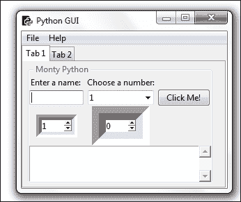

我们上面的两个 Spinbox 小部件具有相同的浮雕样式。唯一的区别是，位于第一个 Spinbox 右侧的新部件具有更大的边框宽度。

在我们的代码中，我们没有指定使用哪种缓解属性，因此缓解默认为 tk.SUNKEN。

这里是可以设置的可用缓解属性选项：

通过将不同的可用选项分配给`relief`属性，我们可以为这个小部件创建不同的外观。

将 tk.RIDGE 风格应用于边框并使边框宽度与我们的第一个 Spinbox 小部件相同，结果得到以下 GUI：

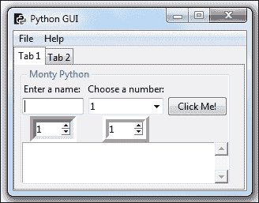

## 它是如何工作的...

首先，我们在第二列（索引 == 1）创建了一个第二个 `Spinbox`。它默认为 `SUNKEN`，因此看起来与我们的第一个 `Spinbox` 类似。我们通过增加第二个控件（右侧的控件）的边框宽度来区分这两个小部件。

接下来，我们隐式地设置了 Spinbox 小部件的凹凸属性。我们将边框宽度设置为与我们的第一个 Spinbox 相同，因为通过给它不同的凹凸效果，差异在没有改变其他任何属性的情况下就变得明显了。

# 使用 Python 创建工具提示

这个菜谱将向我们展示如何创建工具提示。当用户将鼠标悬停在控件上时，将以工具提示的形式提供额外的信息。

我们将把这个额外信息编码到我们的图形用户界面中。

## 准备就绪

我们正在为我们的图形用户界面添加更多有用的功能。令人惊讶的是，给我们的控件添加工具提示应该很简单，但实际上并没有我们希望的那样简单。

为了实现这个期望的功能，我们将把我们的工具提示代码放入它自己的面向对象（OOP）类中。

## 如何做到这一点...

在导入语句下方添加此类：

```py
class ToolTip(object):
    def __init__(self, widget):
        self.widget = widget
        self.tipwindow = None
        self.id = None
        self.x = self.y = 0

    def showtip(self, text):
        "Display text in tooltip window"
        self.text = text
        if self.tipwindow or not self.text:
            return
        x, y, _cx, cy = self.widget.bbox("insert")
        x = x + self.widget.winfo_rootx() + 27
        y = y + cy + self.widget.winfo_rooty() +27
        self.tipwindow = tw = tk.Toplevel(self.widget)
        tw.wm_overrideredirect(1)
        tw.wm_geometry("+%d+%d" % (x, y))

        label = tk.Label(tw, text=self.text, justify=tk.LEFT,
   background="#ffffe0", relief=tk.SOLID, borderwidth=1,
                      font=("tahoma", "8", "normal"))

        label.pack(ipadx=1)

    def hidetip(self):
        tw = self.tipwindow
        self.tipwindow = None
        if tw:
            tw.destroy()

#===========================================================
def createToolTip( widget, text):
    toolTip = ToolTip(widget)
    def enter(event):
        toolTip.showtip(text)
    def leave(event):
        toolTip.hidetip()
    widget.bind('<Enter>', enter)
    widget.bind('<Leave>', leave)
```

在面向对象编程（**OOP**）方法中，我们在 Python 模块中创建一个新的类。Python 允许我们在同一个 Python 模块中放置多个类，并且它还使我们能够在同一个模块中“混合匹配”类和常规函数。

上面的代码正是这样做的。

`ToolTip`类是一个 Python 类，为了使用它，我们必须实例化它。

如果你对面向对象编程（OOP）不熟悉，"实例化一个对象以创建类的实例"可能听起来相当无聊。

原理非常简单，非常类似于通过`def`语句创建一个 Python 函数，然后在代码的后续部分实际调用这个函数。

以非常相似的方式，我们首先创建一个类的蓝图，并通过在类名后添加括号将其简单地分配给一个变量，如下所示：

```py
class AClass():
    pass
instanceOfAClass = AClass()
print(instanceOfAClass)
```

上述代码打印出一个内存地址，同时也显示我们的变量现在对这个类实例有一个引用。

面向对象编程（OOP）的酷之处在于我们可以创建同一类的多个实例。

在我们之前的代码中，我们声明了一个 Python 类，并明确使其继承自所有 Python 类的基础对象。我们也可以像在`AClass`代码示例中所做的那样省略它，因为这是所有 Python 类的默认设置。

在`ToolTip`类中完成所有必要的提示信息创建代码之后，我们接下来通过创建一个位于其下方的函数来转向非面向对象的 Python 编程。

我们定义了函数 `createToolTip()`，它期望传入我们 GUI 小部件中的一个作为参数，这样我们就可以在鼠标悬停在此控件上时显示工具提示。

`createToolTip()` 函数实际上为每个我们调用它的小部件创建我们 `ToolTip` 类的新实例。

我们可以为我们的 Spinbox 小部件添加一个工具提示，如下所示：

```py
# Add a Tooltip
createToolTip(spin, 'This is a Spin control.')
```

以及以完全相同的方式处理我们所有的其他 GUI 小部件。我们只需传入我们希望显示额外信息的工具提示的父小部件。对于我们的 ScrolledText 小部件，我们让变量`scr`指向它，因此这就是我们传递给我们的工具提示创建函数构造函数的内容。

```py
# Using a scrolled Text control    
scrolW  = 30; scrolH  =  3
scr = scrolledtext.ScrolledText(monty, width=scrolW, height=scrolH, wrap=tk.WORD)
scr.grid(column=0, row=3, sticky='WE', columnspan=3)

# Add a Tooltip to the ScrolledText widget
createToolTip(scr, 'This is a ScrolledText widget.')
```

## 它是如何工作的...

这本书中面向对象编程（OOP）的开始。这可能会显得有些高级，但请不要担心，我们会解释一切，实际上它确实可行！

好吧，运行这段代码实际上目前还没有起作用或者产生任何变化。

在创建旋转器的下方添加以下代码：

```py
# Add a Tooltip
createToolTip(spin, 'This is a Spin control.')
```

现在，当我们将鼠标悬停在旋转控件上时，我们会看到一个工具提示，为用户提供额外的信息。

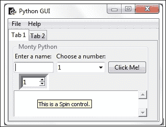

我们正在调用创建工具提示的函数，然后我们传递一个对小部件的引用以及当我们将鼠标悬停在工具上时要显示的文本。

本书余下的食谱将在适用时使用面向对象编程（OOP）。在此，我们展示了最简单的面向对象编程示例。默认情况下，我们创建的每个 Python 类都继承自`object`基类。Python，作为它真正所是的实用编程语言，简化了类的创建过程。

我们可以写出这个语法：

```py
class ToolTip(object):
    pass
```

我们也可以通过省略默认基类来简化它：

```py
class ToolTip():
    pass
```

在这个相同的模式中，我们可以继承和扩展任何 tkinter 类。

# 如何使用画布小部件

本食谱展示了如何通过使用 tkinter 画布小部件来为我们的 GUI 添加戏剧性的色彩效果。

## 准备就绪

我们将通过添加更多颜色来改进我们之前的代码和 GUI 的外观。

## 如何做到这一点...

首先，我们将在我们的 GUI 中创建一个第三个标签页，以便隔离我们的新代码。

这里是创建新第三个标签的代码：

```py
# Tab Control introduced here --------------------------------
tabControl = ttk.Notebook(win)          # Create Tab Control

tab1 = ttk.Frame(tabControl)            # Create a tab 
tabControl.add(tab1, text='Tab 1')      # Add the tab

tab2 = ttk.Frame(tabControl)            # Add a second tab
tabControl.add(tab2, text='Tab 2')      # Make second tab visible

tab3 = ttk.Frame(tabControl)            # Add a third tab
tabControl.add(tab3, text='Tab 3')      # Make second tab visible

tabControl.pack(expand=1, fill="both")  # Pack to make visible
# ~ Tab Control introduced here -------------------------------
```

接下来，我们使用另一个 tkinter 内置小部件，即画布。很多人喜欢这个小部件，因为它具有强大的功能。

```py
# Tab Control 3 -------------------------------
tab3 = tk.Frame(tab3, bg='blue')
tab3.pack()
for orangeColor in range(2):
    canvas = tk.Canvas(tab3, width=150, height=80, highlightthickness=0, bg='orange')
    canvas.grid(row=orangeColor, column=orangeColor)
```

## 它是如何工作的...

以下截图显示了运行前面代码并点击新**Tab 3**所创建的结果。当你运行代码时，它确实是橙色和蓝色的。在这本非彩色的书中，这可能在视觉上不那么明显，但那些颜色是真实的；你可以相信我。

您可以通过在线搜索来查看图形和绘图功能。在这本书中，我不会深入探讨这个小部件（但它非常酷）。


