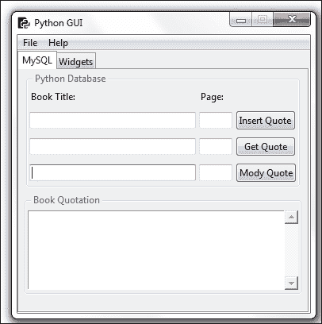

# 第七章. 通过我们的 GUI 在我们的 MySQL 数据库中存储数据

在本章中，我们将通过连接到 MySQL 数据库来增强我们的 Python GUI。

+   从 Python 连接到 MySQL 数据库

+   配置 MySQL 连接

+   设计 Python 图形用户界面数据库

+   使用 SQL 插入命令

+   使用 SQL 更新命令

+   使用 SQL 删除命令

+   从我们的 MySQL 数据库存储和检索数据

# 简介

在我们能够连接到 MySQL 服务器之前，我们必须能够访问一个 MySQL 服务器。本章的第一个菜谱将向您展示如何安装免费的 MySQL Server Community Edition。

在成功连接到我们的 MySQL 服务器运行实例后，我们将设计和创建一个数据库，该数据库将接受一个书名，这可能是我们自己的日记或我们在互联网上找到的引言。我们需要一个书的页码，这可能为空，然后我们将使用内置在 Python 3 中的 GUI 将我们从书籍、期刊、网站或朋友那里喜欢的引言`插入`到我们的 MySQL 数据库中。

我们将使用我们的 Python GUI 插入、修改、删除并显示我们最喜欢的引语，通过发出这些 SQL 命令并显示数据。

### 注意事项

**CRUD** 是一个数据库术语，你可能遇到过，它是四个基本 SQL 命令的缩写，代表 **创建**、**读取**、**更新** 和 **删除**。

# 从 Python 连接到 MySQL 数据库

在我们能够连接到 MySQL 数据库之前，我们必须先连接到 MySQL 服务器。

为了做到这一点，我们需要知道 MySQL 服务器的 IP 地址以及它监听的端口号。

我们还必须是一个注册用户，并拥有密码，以便通过 MySQL 服务器进行身份验证。

## 准备就绪

您需要访问一个正在运行的 MySQL 服务器实例，并且您还需要拥有管理员权限，以便创建数据库和表。

可以从官方 MySQL 网站免费获取 MySQL Community Edition。您可以从以下链接下载并安装到您的本地电脑：[`dev.mysql.com/downloads/`](http://dev.mysql.com/downloads/)

### 注意事项

在本章中，我们使用的是 MySQL Community Server (GPL) 版本：5.6.26。

## 如何做到……

为了连接到 MySQL，我们首先需要安装一个特殊的 Python 连接器驱动程序。这个驱动程序将使我们能够从 Python 与 MySQL 服务器进行通信。

驱动程序在 MySQL 网站上免费提供，并附带一个非常好的在线教程。您可以从以下链接安装它：

[MySQL 连接器 Python 文档](http://dev.mysql.com/doc/connector-python/en/index.html)

### 注意事项

确保你选择与已安装的 Python 版本匹配的安装程序。在本章中，我们使用的是 Python 3.4 的安装程序。


在安装过程的最后出现了一点小小的惊喜。当我们启动`.msi`安装程序时，我们会短暂地看到一个显示安装进度的消息框，但随后它就消失了。我们没有收到安装实际成功的确认。

验证我们是否安装了正确的驱动程序，该驱动程序能让 Python 与 MySQL 通信的一种方法，是查看 Python 的 site-packages 目录。

如果你的 site-packages 目录看起来与以下截图相似，并且你看到一些名字中包含`mysql_connector_python`的新文件，那么，我们确实安装了某些东西……


如上所述的官方 MySQL 网站提供了一个教程，网址如下：

[MySQL 连接器 Python 教程](http://dev.mysql.com/doc/connector-python/en/connector-python-tutorials.html)

在线教程示例中，如何验证安装 Connector/Python 驱动程序是否成功的工作示例有些误导，因为它试图连接到一个未自动创建的员工数据库，至少在我的社区版中是这样的。

验证我们的 Connector/Python 驱动程序是否真正安装成功的方法是，在不指定特定数据库的情况下连接到 MySQL 服务器，然后打印出连接对象。

### 注意事项

将占位符括号名称 `<adminUser>` 和 `<adminPwd>` 替换为您在 MySQL 安装中使用的实际凭据。

如果你安装了 MySQL 社区版，你就是管理员，并在 MySQL 安装过程中选择了用户名和密码。

```py
import mysql.connector as mysql

conn = mysql.connect(user=<adminUser>, password=<adminPwd>,
                     host='127.0.0.1')
print(conn)

conn.close()
```

如果运行前面的代码导致以下输出打印到控制台，那么我们就没问题。


如果你无法连接到 MySQL 服务器，那么很可能是在安装过程中出现了问题。如果是这种情况，请尝试卸载 MySQL，重启你的电脑，然后再次运行 MySQL 安装程序。请确保你下载的 MySQL 安装程序与你的 Python 版本相匹配。如果你安装了多个 Python 版本，有时这会导致混淆，因为最后安装的版本会被添加到 Windows 路径环境变量中，而一些安装程序只是使用它们在这个位置找到的第一个 Python 版本。

那是我安装了 Python 32 位版本，除了我的 64 位版本之外，我困惑的是为什么我下载的一些模块无法工作。

安装程序下载了 32 位模块，这些模块与 64 位版本的 Python 不兼容。

## 它是如何工作的…

为了将我们的图形用户界面连接到 MySQL 服务器，如果我们想创建自己的数据库，我们需要能够以管理员权限连接到服务器。

如果数据库已经存在，我们只需要连接、插入、更新和删除数据的授权权限。

在下一个菜谱中，我们将在 MySQL 服务器上创建一个新的数据库。

# 配置 MySQL 连接

在之前的配方中，我们通过将认证所需的凭据硬编码到`connection`方法中来使用连接到 MySQL 服务器的最短路径。虽然这是一种早期开发中的快速方法，但我们绝对不希望将我们的 MySQL 服务器凭据暴露给任何人，除非我们*授权*特定用户对数据库、表、视图和相关数据库命令的访问权限。

通过将凭据存储在配置文件中来验证 MySQL 服务器是一种更安全的方法，这正是我们在本食谱中将要做的。

我们将使用我们的配置文件连接到 MySQL 服务器，然后在 MySQL 服务器上创建我们自己的数据库。

### 注意事项

我们将在以下所有菜谱中使用这个数据库。

## 准备就绪

运行此菜谱中所示代码需要访问具有管理员权限的运行中的 MySQL 服务器。

### 注意事项

之前的配方展示了如何安装 MySQL 服务器的免费社区版。管理员权限将使您能够实施此配方。

## 如何做到……

首先，我们在`MySQL.py`代码的同一模块中创建一个字典。

```py
# create dictionary to hold connection info
dbConfig = {
    'user': <adminName>,      # use your admin name 
    'password': <adminPwd>,   # use your admin password
    'host': '127.0.0.1',      # IP address of localhost
    }
```

接下来，在连接方法中，我们解包字典值。而不是编写，

```py
mysql.connect('user': <adminName>,  'password': <adminPwd>, 'host': '127.0.0.1') 
```

我们使用`(**dbConfig)`，它和上面的一样，但更简洁。

```py
import mysql.connector as mysql
# unpack dictionary credentials 
conn = mysql.connect(**dbConfig)
print(conn)
```

这导致与 MySQL 服务器建立相同的成功连接，但不同之处在于连接方式不再暴露任何关键任务信息。

### 注意事项

数据库服务器对你的任务至关重要。一旦你失去了宝贵的资料……而且找不到任何最近的备份！


现在，将相同的用户名、密码、数据库等信息放入同一 Python 模块的字典中，并不能消除凭证被任何查看代码的人看到的危险。

为了提高数据库安全性，我们首先将字典移动到它自己的 Python 模块中。让我们称这个新的 Python 模块为`GuiDBConfig.py`。

我们随后导入这个模块并解包凭证，就像之前做的那样。

```py
import GuiDBConfig as guiConf
# unpack dictionary credentials 
conn = mysql.connect(**guiConf.dbConfig)
print(conn)
```

### 注意事项

一旦我们将此模块放置到一个安全的地方，与代码的其他部分分离，我们就为我们的 MySQL 数据实现了更高的安全级别。

现在我们已经知道了如何连接到 MySQL 并拥有管理员权限，我们可以通过以下命令创建自己的数据库：

```py
GUIDB = 'GuiDB'

# unpack dictionary credentials 
conn = mysql.connect(**guiConf.dbConfig)

cursor = conn.cursor()

try:
    cursor.execute("CREATE DATABASE {} DEFAULT CHARACTER SET 'utf8'".format(GUIDB))

except mysql.Error as err:
    print("Failed to create DB: {}".format(err))

conn.close()
```

为了执行对 MySQL 的命令，我们从连接对象创建一个游标对象。

光标通常是在数据库表中的特定行中的一个位置，我们可以将其在表中上下移动，但在这里我们使用它来创建数据库本身。

我们将 Python 代码封装在一个 `try…except` 块中，并使用 MySQL 内置的错误代码来告诉我们是否出现了任何问题。

我们可以通过执行创建数据库的代码两次来验证这个块是否工作。第一次，它将在 MySQL 中创建一个新的数据库，第二次它将打印出一个错误信息，指出该数据库已存在。

我们可以通过执行以下 MySQL 命令，使用完全相同的游标对象语法来验证哪些数据库存在。

我们不是使用`CREATE DATABASE`命令，而是创建一个游标并使用它来执行`SHOW DATABASES`命令，然后将结果检索并打印到控制台输出。

```py
import mysql.connector as mysql
import GuiDBConfig as guiConf

# unpack dictionary credentials 
conn = mysql.connect(**guiConf.dbConfig)

cursor = conn.cursor()

cursor.execute("SHOW DATABASES")
print(cursor.fetchall())

conn.close()
```

### 注意事项

我们通过在游标对象上调用`fetchall`方法来检索结果。

运行此代码可显示我们 MySQL 服务器实例中当前存在的数据库。从输出结果中我们可以看到，MySQL 自带了几个内置数据库，例如`information_schema`等。我们已经成功创建了我们的`guidb`数据库，这在输出结果中有所显示。所有其他展示的数据库都是随 MySQL 一起提供的。


注意，尽管我们在创建数据库时使用了混合大小写的字母将其命名为 GuiDB，但 `SHOW DATABASES` 命令在 MySQL 中显示所有现有数据库时都使用小写字母，并将我们的数据库显示为 `guidb`。

## 它是如何工作的…

为了将我们的 Python 图形用户界面连接到 MySQL 数据库，我们首先必须了解如何连接到 MySQL 服务器。这需要建立连接，并且只有当我们能够提供所需的凭据时，MySQL 才会接受这个连接。

虽然在 Python 代码中放置字符串很容易，但当我们处理数据库时，我们必须非常谨慎，因为今天的个人沙盒开发环境，到明天，可能会轻易地被公之于众的万维网上。

你不希望妥协数据库的安全性，本食谱的第一部分展示了通过将连接凭证放入一个单独的文件，并将此文件放置在一个外部世界无法访问的位置，来提高安全性的方法。

在实际的生产环境中，MySQL 服务器的安装、连接凭证以及此 dbConfig 文件将由 IT 系统管理员处理，他们会允许您导入 dbConfig 文件以连接到 MySQL 服务器，而无需您知道实际的凭证是什么。解压 dbConfig 不会像我们代码中那样暴露凭证。

第二部分我们在 MySQL 服务器实例中创建了自己的数据库，我们将在接下来的菜谱中扩展并使用这个数据库，将其与我们的 Python 图形用户界面结合使用。

# 设计 Python 图形用户界面数据库

在我们开始创建表格并将数据插入其中之前，我们必须设计数据库。与更改本地 Python 变量名不同，一旦数据库创建并加载了数据，更改数据库模式就不是那么容易了。

我们将不得不`DROP`掉该表，这意味着我们会丢失表中所有的数据。因此，在删除表之前，我们必须先提取数据，然后`DROP`掉该表，并在不同的名称下重新创建它，最后再重新导入原始数据。

你明白我的意思了……

设计我们的 GUI MySQL 数据库意味着首先思考我们的 Python 应用程序将如何使用它，然后为我们的表选择与预期用途相匹配的名称。

## 准备就绪

我们正在使用在前一个菜谱中创建的 MySQL 数据库。需要一个正在运行的 MySQL 实例，前两个菜谱展示了如何安装 MySQL 以及所有必要的附加驱动程序，以及如何创建本章中使用的数据库。

## 如何做到……

首先，我们将小部件从我们在上一道菜谱中创建的两个标签页之间移动，以便更好地组织我们的 Python GUI，以便连接到 MySQL 数据库。

我们重命名了几个小部件，并将访问 MySQL 数据的代码分离到之前称为标签 1 的部分，同时将无关的小部件移动到我们在早期菜谱中称为标签 2 的部分。

我们还调整了一些内部 Python 变量名，以便更好地理解我们的代码。

### 注意事项

代码可读性是一种编程美德，而不是浪费时间。

我们重构的 Python GUI 现在看起来如下截图所示。我们将第一个标签重命名为 MySQL，并创建了两个 tkinter LabelFrame 小部件。我们标记了上面的一个，命名为 Python 数据库，它包含两个标签和六个 tkinter 输入小部件以及三个按钮，我们使用 tkinter 网格布局管理器将它们排列成四行三列。

我们将在条目小部件中输入书籍标题和页码，点击按钮将导致插入、检索或修改书籍引用。

底部的 LabelFrame 标签为**书籍引用**，该框架中的 ScrolledText 小部件将显示我们的书籍和引用。


我们将创建两个 SQL 表来存储我们的数据。第一个表将存储书籍标题和书籍页码的数据。然后我们将与第二个表进行连接，该表将存储书籍引文。

我们将通过主键与外键关系将两个表连接起来。

那么，我们现在就创建第一个数据库表。

在我们进行之前，让我们首先验证一下我们的数据库确实没有表。根据在线 MySQL 文档，查看数据库中存在的表的命令如下。

### 注意

13.7.5.38 `SHOW` `TABLES` 语法：

```py
SHOW [FULL] TABLES [{FROM | IN} db_name]
    [LIKE 'pattern' | WHERE expr]
```

需要注意的是，在前面的语法中，方括号中的参数如`FULL`是可选的，而在花括号中的参数如`FROM`在`SHOW TABLES`命令的描述中是必需的。`FROM`和`IN`之间的管道符号表示 MySQL 语法要求其中之一。

```py
# unpack dictionary credentials 
conn = mysql.connect(**guiConf.dbConfig)
# create cursor 
cursor = conn.cursor()
# execute command
cursor.execute("SHOW TABLES FROM guidb")
print(cursor.fetchall())

# close connection to MySQL
conn.close()
```

当我们在 Python 中执行 SQL 命令时，我们得到了预期的结果，即一个空列表，这表明我们的数据库目前没有任何表。


我们也可以首先通过执行`USE <DB>`命令来选择数据库。现在，我们不需要将其传递给`SHOW TABLES`命令，因为我们已经选择了我们想要与之通信的数据库。

以下代码产生的结果与上一个代码相同：

```py
cursor.execute("USE guidb")
cursor.execute("SHOW TABLES")
```

现在我们知道了如何验证我们的数据库中没有表，那么让我们创建一些表。在我们创建了两个表之后，我们将使用之前相同的命令来验证它们确实已经进入了我们的数据库。

我们通过执行以下代码创建了第一个名为 `Books` 的表。

```py
# connect by unpacking dictionary credentials
conn = mysql.connect(**guiConf.dbConfig)

# create cursor 
cursor = conn.cursor()

# select DB
cursor.execute("USE guidb")

# create Table inside DB
cursor.execute("CREATE TABLE Books (       \
      Book_ID INT NOT NULL AUTO_INCREMENT, \
      Book_Title VARCHAR(25) NOT NULL,     \
      Book_Page INT NOT NULL,              \
      PRIMARY KEY (Book_ID)                \
    ) ENGINE=InnoDB")

# close connection to MySQL
conn.close()
```

我们可以通过执行以下命令来验证该表是否已创建在我们的数据库中。


现在的结果不再是空列表，而是一个包含元组的列表，显示了刚刚创建的`books`表。

我们可以使用 MySQL 命令行客户端查看我们表中的列。为了做到这一点，我们必须以 root 用户身份登录。我们还需要在命令末尾添加一个分号。

### 注意事项

在 Windows 上，您只需双击在 MySQL 安装过程中自动安装的 MySQL 命令行客户端快捷方式。

如果您桌面上没有快捷方式，您可以在以下路径找到典型默认安装的可执行文件：

`C:\Program Files\MySQL\MySQL Server 5.6\bin\mysql.exe`

没有快捷方式运行 MySQL 客户端时，您必须传递给它一些参数：

+   `C:\Program Files\MySQL\MySQL Server 5.6\bin\mysql.exe`

+   `--defaults-file=C:\ProgramData\MySQL\MySQL Server 5.6\my.ini`

+   `-uroot`

+   `-p`

双击快捷方式，或者使用带有完整路径的执行文件并通过传递所需参数的命令行，都会启动 MySQL 命令行客户端，并提示您输入 root 用户的密码。

如果你记得在安装过程中分配给 root 用户的密码，那么你可以运行以下所示的`SHOW COLUMNS FROM books;`命令。这将显示我们 guidb 中的`books`表的列。

### 注意事项

当在 MySQL 客户端执行命令时，语法不是 Pythonic。


接下来，我们将创建第二个表格，用于存储书籍和期刊引用。我们将通过执行以下代码来创建它：

```py
# select DB
cursor.execute("USE guidb")

# create second Table inside DB
cursor.execute("CREATE TABLE Quotations ( \
        Quote_ID INT,                     \
        Quotation VARCHAR(250),           \
        Books_Book_ID INT,                \
        FOREIGN KEY (Books_Book_ID)       \
            REFERENCES Books(Book_ID)     \
            ON DELETE CASCADE             \
    ) ENGINE=InnoDB")
```

执行`SHOW TABLES`命令现在显示我们的数据库有两个表。


我们可以通过使用 Python 执行 SQL 命令来查看列。


使用 MySQL 客户端可能会以更好的格式展示数据。我们还可以使用 Python 的美化打印（`pprint`）功能。


MySQL 客户端仍然以更清晰的格式显示我们的列，当你运行此客户端时可以观察到这一点。

## 它是如何工作的…

我们设计了我们的 Python 图形用户界面数据库，并对我们的 GUI 进行了重构，以准备使用我们新的数据库。然后我们创建了一个 MySQL 数据库，并在其中创建了两个表。

我们通过使用 Python 和 MySQL 服务器附带的自带 MySQL 客户端，验证了表格已成功录入我们的数据库。

在下一个菜谱中，我们将向我们的表格中插入数据。

# 使用 SQL 插入命令

本食谱展示了整个 Python 代码，展示了如何创建和删除 MySQL 数据库和表，以及如何显示现有数据库、表、列和我们的 MySQL 实例中的数据。

在创建数据库和表之后，我们将在此菜谱中创建的两个表中插入数据。

### 注意事项

我们正在使用主键到外键的关系来连接两个表的数据。

我们将在接下来的两个菜谱中详细介绍这是如何工作的，其中我们将修改和删除我们的 MySQL 数据库中的数据。

## 准备就绪

本菜谱基于我们在上一菜谱中创建的 MySQL 数据库，同时也展示了如何删除并重新创建 GuiDB。

### 注意事项

删除数据库当然会删除数据库中所有表中的数据，因此我们也会向您展示如何重新插入这些数据。

## 如何做到……

我们`MySQL.py`模块的完整代码位于本章的代码文件夹中，您可以从 Packt Publishing 的网站上下载。它创建数据库，向其中添加表，然后向我们所创建的两个表中插入数据。

在这里，我们将概述代码，而不展示所有实现细节，以节省空间，因为展示整个代码将占用太多页面。

```py
import mysql.connector as mysql
import GuiDBConfig as guiConf

class MySQL():
    # class variable
    GUIDB  = 'GuiDB'   

    #------------------------------------------------------
    def connect(self):
        # connect by unpacking dictionary credentials
        conn = mysql.connector.connect(**guiConf.dbConfig)

        # create cursor 
        cursor = conn.cursor()    

        return conn, cursor

    #------------------------------------------------------
    def close(self, cursor, conn):
        # close cursor

    #------------------------------------------------------
    def showDBs(self):
        # connect to MySQL

    #------------------------------------------------------
    def createGuiDB(self):
        # connect to MySQL

    #------------------------------------------------------
    def dropGuiDB(self):
        # connect to MySQL

    #------------------------------------------------------
    def useGuiDB(self, cursor):
        '''Expects open connection.'''
        # select DB

    #------------------------------------------------------
    def createTables(self):
        # connect to MySQL

        # create Table inside DB

    #------------------------------------------------------
    def dropTables(self):
        # connect to MySQL

    #------------------------------------------------------
    def showTables(self):
        # connect to MySQL

    #------------------------------------------------------
    def insertBooks(self, title, page, bookQuote):
        # connect to MySQL

        # insert data

    #------------------------------------------------------
    def insertBooksExample(self):
        # connect to MySQL

        # insert hard-coded data

    #------------------------------------------------------
    def showBooks(self):
        # connect to MySQL

    #------------------------------------------------------
    def showColumns(self):
        # connect to MySQL

    #------------------------------------------------------
    def showData(self):
        # connect to MySQL

#------------------------------------------------------
if __name__ == '__main__': 

    # Create class instance
    mySQL = MySQL()
```

运行前面的代码会在我们创建的数据库中创建以下表格和数据。


## 它是如何工作的…

我们已经创建了一个 MySQL 数据库，建立了与它的连接，然后创建了两个表格，用于存储喜爱的书籍或期刊引文的资料。

我们将数据分布在两个表中，因为引文往往相当长，而书名和书页码则非常短。通过这样做，我们可以提高我们数据库的效率。

### 注意事项

在 SQL 数据库语言中，将数据分离到单独的表中称为规范化。

# 使用 SQL 更新命令

这个菜谱将使用前一个菜谱中的代码，对其进行更详细的解释，然后扩展代码以更新我们的数据。

为了更新我们之前插入到 MySQL 数据库表中的数据，我们使用 SQL 的`UPDATE`命令。

## 准备就绪

这个菜谱是在上一个菜谱的基础上构建的，因此请阅读并学习上一个菜谱，以便跟随本菜谱中的编码，其中我们将修改现有数据。

## 如何做到……

首先，我们将通过运行以下 Python 到 MySQL 命令来显示要修改的数据：

```py
import mysql.connector as mysql
import GuiDBConfig as guiConf

class MySQL():
    # class variable
    GUIDB  = 'GuiDB'
    #------------------------------------------------------
    def showData(self):
        # connect to MySQL
        conn, cursor = self.connect()   

        self.useGuiDB(cursor)      

        # execute command
        cursor.execute("SELECT * FROM books")
        print(cursor.fetchall())

        cursor.execute("SELECT * FROM quotations")
        print(cursor.fetchall())

        # close cursor and connection
        self.close(cursor, conn)
#==========================================================
if __name__ == '__main__': 
    # Create class instance
    mySQL = MySQL()
    mySQL.showData()
```

运行代码会生成以下结果：


我们可能不同意“四人帮”的观点，所以让我们改变他们著名的编程名言。

### 注意事项

四大天王是四位创建了世界著名的书籍《设计模式》，这本书极大地影响了我们整个软件行业，使我们认识到、思考和编写使用软件设计模式的方法。

我们将通过更新我们最喜欢的引言数据库来完成这项工作。

首先，我们通过搜索书名来检索主键值，然后我们将该值传递到我们的引言搜索中。

```py
    #------------------------------------------------------
    def updateGOF(self):
        # connect to MySQL
        conn, cursor = self.connect()   

        self.useGuiDB(cursor)      

        # execute command
        cursor.execute("SELECT Book_ID FROM books WHERE Book_Title = 'Design Patterns'")
        primKey = cursor.fetchall()[0][0]
        print(primKey)

        cursor.execute("SELECT * FROM quotations WHERE Books_Book_ID = (%s)", (primKey,))
        print(cursor.fetchall())

        # close cursor and connection
        self.close(cursor, conn) 
#==========================================================
if __name__ == '__main__': 
    # Create class instance
    mySQL = MySQL()
    mySQL.updateGOF()
```

这给我们以下结果：


现在我们知道了引用的主键，我们可以通过执行以下命令来更新引用。

```py
    #------------------------------------------------------
    def updateGOF(self):
        # connect to MySQL
        conn, cursor = self.connect()   

        self.useGuiDB(cursor)      

        # execute command
        cursor.execute("SELECT Book_ID FROM books WHERE Book_Title = 'Design Patterns'")
        primKey = cursor.fetchall()[0][0]
        print(primKey)

        cursor.execute("SELECT * FROM quotations WHERE Books_Book_ID = (%s)", (primKey,))
        print(cursor.fetchall())

        cursor.execute("UPDATE quotations SET Quotation = (%s) WHERE Books_Book_ID = (%s)", \
                       ("Pythonic Duck Typing: If it walks like a duck and talks like a duck it probably is a duck...", primKey))

        # commit transaction
        conn.commit ()

        cursor.execute("SELECT * FROM quotations WHERE Books_Book_ID = (%s)", (primKey,))
        print(cursor.fetchall())

        # close cursor and connection
        self.close(cursor, conn)
#==========================================================
if __name__ == '__main__': 
    # Create class instance
    mySQL = MySQL()
    #------------------------
    mySQL.updateGOF()
    book, quote = mySQL.showData()    
    print(book, quote)
```

通过运行前面的代码，我们使这个编程经典更加符合 Python 风格。

如下截图所示，在我们运行前面的代码之前，我们的标题“`Book_ID 1`”通过主键与外键关系与引用表中的“`Books_Book_ID`”列中的引用相关联。

这是从《设计模式》这本书中的原文引用。

我们随后通过 SQL 的 `UPDATE` 命令更新了与此 ID 相关的引用。

所有 ID 都没有改变，但现在与`Book_ID 1`关联的引用已经改变，如第二个 MySQL 客户端窗口所示，如下所示。


## 它是如何工作的…

在这个菜谱中，我们从数据库和之前菜谱中创建的数据库表中检索了现有数据。我们使用 SQL 的`UPDATE`命令将数据插入到表中并更新了我们的数据。

# 使用 SQL 删除命令

在这个菜谱中，我们将使用 SQL 的 `DELETE` 命令来删除之前菜谱中创建的数据。

虽然乍一看删除数据可能显得微不足道，但一旦我们在生产环境中拥有一个相当大的数据库设计，事情可能就不再那么简单了。

因为我们通过将两个表通过主键与外键关系关联来设计我们的 GUI 数据库，所以在删除某些数据时，我们不会留下孤立的记录，因为这个数据库设计考虑了级联删除。

## 准备就绪

本菜谱使用了 MySQL 数据库、表以及本章之前菜谱中插入到这些表中的数据。为了展示如何创建孤立记录，我们不得不更改我们数据库表的设计之一。

## 如何做到……

我们通过仅使用两个数据库表来简化了数据库设计。

当我们删除数据时，虽然这种方法可行，但总有可能最终留下孤立记录。这意味着我们在一个表中删除了数据，但不知何故没有删除另一个 SQL 表中的相关数据。

如果我们在创建`quotations`表格时没有与`books`表格的外键关系，我们可能会得到孤立记录。

```py
        # create second Table inside DB -- 
        # No FOREIGN KEY relation to Books Table
        cursor.execute("CREATE TABLE Quotations ( \
                Quote_ID INT AUTO_INCREMENT,      \
                Quotation VARCHAR(250),           \
                Books_Book_ID INT,                \
                PRIMARY KEY (Quote_ID)            \
            ) ENGINE=InnoDB")  
```

在将数据插入到`books`和`quotations`表之后，如果我们执行与之前相同的`delete`语句，我们只会删除`Book_ID 1`的书籍，而与`Books_Book_ID 1`相关的引用却被留在了后面。

这是一个孤立的记录。不再存在一个具有`Book_ID`为`1`的书籍记录。


这种情况可能会造成混乱，我们可以通过使用级联删除来避免。

我们通过添加某些数据库约束来实现这一点。在之前的一个菜谱中创建包含引文的表时，我们创建了一个带有外键约束的`quotations`表，该约束明确引用了`books`表的主键，从而将两者联系起来。

```py
        # create second Table inside DB
        cursor.execute("CREATE TABLE Quotations ( \
                Quote_ID INT AUTO_INCREMENT,      \
                Quotation VARCHAR(250),           \
                Books_Book_ID INT,                \
                PRIMARY KEY (Quote_ID),           \
                FOREIGN KEY (Books_Book_ID)       \
                    REFERENCES Books(Book_ID)     \
                    ON DELETE CASCADE             \
            ) ENGINE=InnoDB")  
```

`外键`关系包含`ON DELETE CASCADE`属性，这基本上告诉我们的 MySQL 服务器，当与这个外键相关的记录被删除时，要删除该表中相关的记录。

### 注意事项

在创建我们的表时如果没有指定`ON DELETE CASCADE`属性，我们既不能删除也不能更新我们的数据，因为`UPDATE`是一个`DELETE`操作后跟一个`INSERT`操作。

由于这种设计，不会留下任何孤立的记录，这正是我们所希望的。

### 注意事项

在 MySQL 中，我们必须指定`ENGINE=InnoDB`才能使用外键。

让我们在数据库中显示数据。

```py
#==========================================================
if __name__ == '__main__': 
    # Create class instance
    mySQL = MySQL()
      mySQL.showData()
```

这显示了我们在数据库表中的以下数据：


这表明我们有两个通过主键到外键关系相关联的记录。

当我们现在在`books`表中删除一条记录时，我们期望`quotations`表中的相关记录也会通过级联删除被删除。

让我们通过在 Python 中执行以下 SQL 命令来尝试这个方法：

```py
import mysql.connector as mysql
import GuiDBConfig as guiConf

class MySQL():
    #------------------------------------------------------
    def deleteRecord(self):
        # connect to MySQL
        conn, cursor = self.connect()   

        self.useGuiDB(cursor)      

        # execute command
        cursor.execute("SELECT Book_ID FROM books WHERE Book_Title = 'Design Patterns'")
        primKey = cursor.fetchall()[0][0]
        # print(primKey)

        cursor.execute("DELETE FROM books WHERE Book_ID = (%s)", (primKey,))

        # commit transaction
        conn.commit ()

        # close cursor and connection
        self.close(cursor, conn)    
#==========================================================
if __name__ == '__main__': 
    # Create class instance
    mySQL = MySQL()
    #------------------------
    mySQL.deleteRecord()
    mySQL.showData()   
```

执行完前面的删除记录命令后，我们得到以下新的结果：


### 注意

著名的 `设计模式` 已从我们的精选语录数据库中消失……

## 它是如何工作的…

我们通过将数据库设计成通过主键到外键关系实现级联删除的方式，在这个菜谱中触发了级联删除。

这保持了我们的数据正常和完整。

### 注意

在这个菜谱和示例代码中，我们有时使用相同的表名，有时首字母大写，有时全部小写。

这适用于 Windows 默认安装的 MySQL，但如果不更改设置，可能在 Linux 上可能不起作用。

这里有一个链接到官方 MySQL 文档：[`dev.mysql.com/doc/refman/5.0/en/identifier-case-sensitivity.html`](http://dev.mysql.com/doc/refman/5.0/en/identifier-case-sensitivity.html)

在下一个菜谱中，我们将使用我们 Python GUI 中的`MySQL.py`模块的代码。

# 从我们的 MySQL 数据库存储和检索数据

我们将使用我们的 Python 图形用户界面将数据插入到我们的 MySQL 数据库表中。我们已经重构了在之前的菜谱中构建的 GUI，为连接和使用数据库做准备。

我们将使用两个文本框输入小部件，在其中我们可以输入书籍或期刊的标题和页码。我们还将使用一个滚动文本小部件来输入我们最喜欢的书籍引文，然后将其存储在我们的 MySQL 数据库中。

## 准备就绪

本菜谱将基于我们在之前的菜谱中创建的 MySQL 数据库和表进行构建。

## 如何做到……

我们将使用我们的 Python 图形用户界面插入、检索和修改我们最喜欢的引文。为此，我们已经重构了 GUI 中的 MySQL 标签页。



为了让按钮执行某些操作，我们将它们连接到回调函数，就像我们在之前的菜谱中做的那样。

我们将在按钮下方显示 ScrolledText 小部件中的数据。

为了完成这个任务，我们将导入`MySQL.py`模块，就像我们之前做的那样。所有与我们的 MySQL 服务器实例和数据库交互的代码都驻留在该模块中，这是面向对象编程精神中封装代码的一种形式。

我们将**插入引用**按钮连接到以下回调函数。

```py
        # Adding a Button
        self.action = ttk.Button(self.mySQL, text="Insert Quote", command=self.insertQuote)   
        self.action.grid(column=2, row=1)
    # Button callback
    def insertQuote(self):
        title = self.bookTitle.get()
        page = self.pageNumber.get()
        quote = self.quote.get(1.0, tk.END)
        print(title)
        print(quote)
        self.mySQL.insertBooks(title, page, quote)  
```

当我们现在运行我们的代码时，我们可以将我们的 Python GUI 中的数据插入到我们的 MySQL 数据库中。


在输入书籍标题、书籍页码以及书籍或电影中的引用后，我们通过点击**插入引用**按钮将数据插入到我们的数据库中。

我们当前的设计允许添加标题、页码和引文。我们还可以插入电影中的我们喜欢的引言。虽然电影没有页码，但我们可以使用页码列来插入引言在电影中出现的近似时间。

接下来，我们可以通过发出之前使用的相同命令来验证所有这些数据是否已进入我们的数据库表。


在插入数据后，我们可以通过点击**获取报价**按钮来验证数据是否已成功进入我们的两个 MySQL 表，该按钮随后会显示我们插入到两个 MySQL 数据库表中的数据，如上图所示。

点击**获取报价**按钮将调用我们与按钮点击事件关联的回调方法。这为我们提供了在 ScrolledText 小部件中显示的数据。

```py
# Adding a Button
        self.action1 = ttk.Button(self.mySQL, text="Get Quotes", command=self.getQuote)   
        self.action1.grid(column=2, row=2)
    # Button callback
    def getQuote(self):
        allBooks = self.mySQL.showBooks()  
        print(allBooks)
        self.quote.insert(tk.INSERT, allBooks)
```

我们使用`self.mySQL`类实例变量来调用`showBooks()`方法，该方法是我们导入的 MySQL 类的一部分。

```py
from B04829_Ch07_MySQL import MySQL
class OOP():
    def __init__(self):
        # create MySQL instance
        self.mySQL = MySQL()

class MySQL():
    #------------------------------------------------------
    def showBooks(self):
        # connect to MySQL
        conn, cursor = self.connect()    

        self.useGuiDB(cursor)    

        # print results
        cursor.execute("SELECT * FROM Books")
        allBooks = cursor.fetchall()
        print(allBooks)

        # close cursor and connection
        self.close(cursor, conn)   

        return allBooks  
```

## 它是如何工作的…

在这个菜谱中，我们导入了包含所有连接到我们的 MySQL 数据库的编码逻辑的 Python 模块，并且知道如何插入、更新、删除和显示数据。

我们已经将我们的 Python GUI 连接到这个 SQL 逻辑。
