# 第四章：创建游戏和图形

在本章中，我们将涵盖以下主题：

+   使用 IDLE3 调试你的程序

+   使用鼠标在 Tkinter Canvas 上绘制线条

+   创建一个棒球游戏

+   创建一个滚动游戏

# 简介

游戏通常是一个探索和扩展编程技能的绝佳方式，因为它们提供了一个内在的激励因素来修改和改进你的创作，添加新功能，并创造新的挑战。它们也非常适合与他人分享你的想法，即使他们不感兴趣编程。

本章重点介绍使用 Tkinter Canvas 小部件在屏幕上创建和显示对象，以便用户与之交互。使用这些技术，可以创建各种游戏和应用，其限制仅取决于你自己的创造力。

我们还简要地看看如何使用内置在 IDLE 中的调试器，这是一个在无需编写大量测试代码的情况下测试和开发程序的有用工具。

第一个示例演示了我们可以如何监控和使用鼠标来创建对象并在 `Canvas` 小部件上直接绘制。接下来，我们创建一个棒球游戏，展示了如何控制对象的位姿以及如何检测和响应它们之间的交互。最后，我们更进一步，使用 Tkinter 将我们自己的图形放置在 `Canvas` 小部件上，以创建一个俯视图寻宝游戏。

# 使用 IDLE3 调试你的程序

编程的一个关键方面是能够测试和调试你的代码，而一个有用的工具就是调试器。IDLE 编辑器（确保你使用 IDLE3 以支持本书中使用的 Python 3 代码）包括一个基本的调试器。它允许你逐步执行你的代码，观察局部和全局变量的值，并设置断点。

## 如何做…

要启用调试器，请启动 IDLE3 并从 **调试** 菜单中选择 **调试器**；它将打开以下窗口（如果你当前正在运行某些代码，你需要先停止它）：

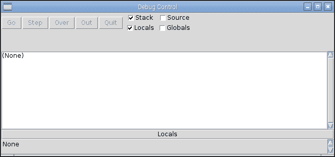

IDLE3 调试器窗口

打开你想要测试的代码（通过 **文件** | **打开…**），然后尝试运行它（*F5*）。你会发现代码不会启动，因为调试器已经自动在第一行停止。以下截图显示调试器已经停止在 `filehandler.py` 代码的第一行，即 `line 3: import os`：

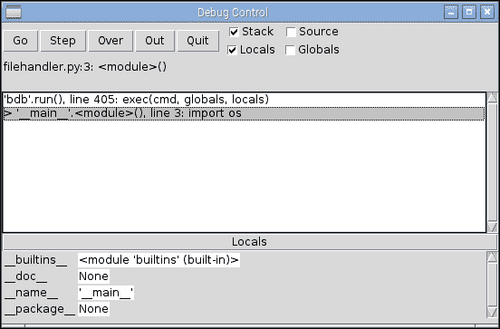

代码开始时的 IDLE3 调试器

## 它是如何工作的…

以下截图显示的控制按钮允许你运行和/或跳过代码：


调试器控制

控制按钮的功能如下：

+   **继续**：此按钮将正常执行代码。

+   **步骤**：此按钮将逐行执行代码，然后再次停止。如果调用了一个函数，它将进入该函数，并允许你逐步执行该函数。

+   **跳过**：此按钮类似于**步骤**命令，但如果存在函数调用，它将执行整个函数，并在下一行停止。

+   **输出**：此按钮将执行代码，直到它完成当前函数，继续执行直到你退出函数。

+   **退出**：此按钮会立即结束程序。

除了之前提到的控制选项外，你可以在代码中直接**设置断点**和**清除断点**。断点是一个可以在代码中插入的标记（通过在编辑器窗口中右键单击），当调试器到达该标记时，它将始终中断（停止）如以下截图所示：

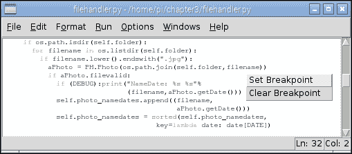

在你的代码中直接设置和清除断点

复选框（在控制按钮的右侧）允许你在遍历代码或调试器由于断点而停止时选择要显示的信息。**堆栈**显示在主窗口中，类似于程序遇到未处理的异常时你会看到的情况。**堆栈**选项显示了到达代码当前位置所进行的所有函数调用，直到它停止的行。**源代码**选项突出显示当前正在执行的代码行，在某些情况下，还包括导入模块中的代码（如果它们是非编译库）。

你还可以选择是否显示**局部**和/或**全局**。默认情况下，**源代码**和**全局**选项通常被禁用，因为如果有很多数据要显示，它们可能会使过程变得相当缓慢。

### 注意

Python 使用局部和全局变量的概念来定义作用域（变量在哪里以及何时有效）。全局变量在文件的顶层定义，并且在其定义之后代码的任何位置都可以看到。然而，为了从除了顶层以外的任何地方改变其值，Python 需要你首先使用 global 关键字。如果没有使用 global 关键字，你将创建一个具有相同名称的局部副本（当退出函数时，其值将丢失）。局部变量是在你在一个函数内创建变量时定义的；一旦超出函数范围，该变量就会被销毁，并且不再可见。

在**堆栈**数据下方是**局部**变量，在这种情况下是 `aPhoto`、`filename` 和 `self`。然后（如果启用），我们有所有当前有效的全局值，提供了关于程序状态的详细信息（`DATE = 1`、`DEBUG = True`、`FOLDERSONLY = True` 等）：

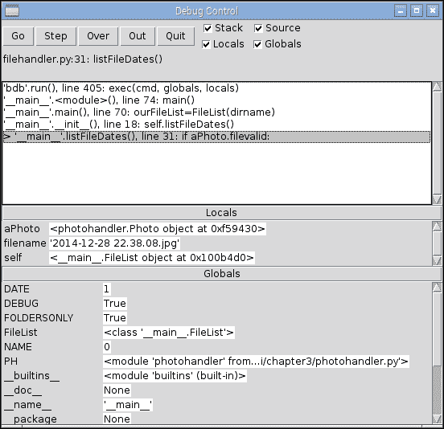

调试器中的“堆栈”、“局部”和“全局”选项

调试器并不特别先进，因为它不允许你展开复杂对象，例如 `photohandler.Photo` 对象，以查看它包含的数据。然而，如果需要，你可以在测试期间调整你的代码，并将你想要观察的数据分配给一些临时变量。

学习如何使用调试器是值得的，因为它是一种更容易追踪特定问题并检查事物是否按预期工作的方式。

# 在 Tkinter 画布上使用鼠标绘制线条

Tkinter Canvas 小部件提供了一个区域来创建和绘制对象。以下脚本演示了如何使用鼠标事件与 Tkinter 交互。通过检测鼠标点击，我们可以使用 Tkinter 绘制一条跟随鼠标移动的线条：

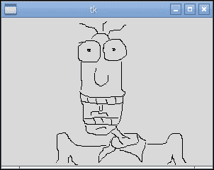

使用 Tkinter 的简单绘图应用程序

## 准备工作

如前所述，我们需要安装 Tkinter，并且要么运行 Raspbian 桌面（通过命令行执行`startx`），要么有一个带有 X11 转发和运行 X 服务器的 SSH 会话（参见第一章，*使用 Raspberry Pi 计算机入门*）。我们还需要连接一个鼠标。

## 如何做…

创建以下脚本，`painting.py`：

```py
#!/usr/bin/python3
#painting.py
import tkinter as TK

#Set defaults
btn1pressed = False
newline = True

def main():
  root = TK.Tk()
  the_canvas = TK.Canvas(root)
  the_canvas.pack()
  the_canvas.bind("<Motion>", mousemove)
  the_canvas.bind("<ButtonPress-1>", mouse1press)
  the_canvas.bind("<ButtonRelease-1>", mouse1release)
  root.mainloop()

def mouse1press(event):
  global btn1pressed
  btn1pressed = True

def mouse1release(event):
  global btn1pressed, newline
  btn1pressed = False
  newline = True

def mousemove(event):
  if btn1pressed == True:
    global xorig, yorig, newline
    if newline == False:
      event.widget.create_line(xorig,yorig,event.x,event.y,
                               smooth=TK.TRUE)
    newline = False
    xorig = event.x
    yorig = event.y

if __name__ == "__main__":
  main()
#End
```

## 它是如何工作的…

Python 代码创建了一个包含名为`the_canvas`的`Canvas`对象的 Tkinter 窗口。在这里我们使用`bind`函数，它将特定事件（在这个小部件`the_canvas`上发生的事件）绑定到特定动作或按键。在这种情况下，我们将鼠标的`<Motion>`函数以及第一个鼠标按钮的点击和释放（`<ButtonPress-1>`和`<ButtonRelease-1>`）绑定。然后，这些事件被用来调用`mouse1press()`、`mouse1release()`和`mousemove()`函数。

这里的逻辑如下。我们使用`mouse1press()`和`mouse1release()`函数跟踪鼠标按钮的状态。

如果鼠标已被点击，`mousemove()`函数将检查我们是否在绘制一条新线（我们为此设置了新坐标）或者继续一条旧线（我们从上一个坐标绘制一条线到触发`mousemove()`的当前事件的坐标）。我们只需要确保每次鼠标按钮释放时都重置到`newline`命令，以重置线的起始位置。

# 创建棒球游戏

可以使用画布的绘图工具和检测对象的碰撞来创建一个经典的棒球游戏。用户将能够通过使用左右光标键来控制绿色挡板，瞄准砖块并击打它们，直到所有砖块都被摧毁。

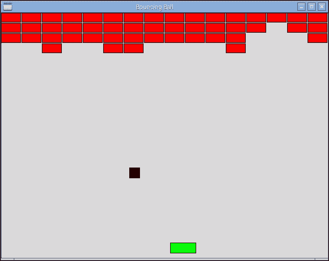

控制挡板以瞄准砖块

## 准备工作

此示例需要图形输出，因此您必须将屏幕和键盘连接到 Raspberry Pi，或者如果从另一台计算机远程连接，则必须使用 X11 转发和 X 服务器。

## 如何做…

创建以下脚本，`bouncingball.py`。

1.  首先，导入`tkinter`和`time`模块，并定义游戏图形的常量：

    ```py
    #!/usr/bin/python3
    # bouncingball.py
    import tkinter as TK
    import time

    VERT,HOREZ=0,1
    xTOP,yTOP = 0,1
    xBTM,yBTM = 2,3
    MAX_WIDTH,MAX_HEIGHT = 640,480
    xSTART,ySTART = 100,200
    BALL_SIZE=20
    RUNNING=True
    ```

1.  接下来，创建用于关闭程序、移动挡板左右和计算球的方向的函数：

    ```py
    def close():
      global RUNNING
      RUNNING=False
      root.destroy()

    def move_right(event):
      if canv.coords(paddle)[xBTM]<(MAX_WIDTH-7):
        canv.move(paddle, 7, 0)

    def move_left(event):
      if canv.coords(paddle)[xTOP]>7:
        canv.move(paddle, -7, 0)

    def determineDir(ball,obj):
      global delta_x,delta_y
      if (ball[xTOP] == obj[xBTM]) or (ball[xBTM] == 
          obj[xTOP]):
        delta_x = -delta_x
      elif (ball[yTOP] == obj[yBTM]) or (ball[yBTM] == 
            obj[yTOP]):
        delta_y = -delta_y
    ```

1.  设置 `tkinter` 窗口并定义画布：

    ```py
    root = TK.Tk()
    root.title("Bouncing Ball")
    root.geometry('%sx%s+%s+%s' %(MAX_WIDTH, MAX_HEIGHT, 100, 100))
    root.bind('<Right>', move_right)
    root.bind('<Left>', move_left)
    root.protocol('WM_DELETE_WINDOW', close)

    canv = TK.Canvas(root, highlightthickness=0)
    canv.pack(fill='both', expand=True)
    ```

1.  将边框、`ball` 和 `paddle` 对象添加到画布中：

    ```py
    top = canv.create_line(0, 0, MAX_WIDTH, 0, fill='blue',
                           tags=('top'))
    left = canv.create_line(0, 0, 0, MAX_HEIGHT, fill='blue',
                            tags=('left'))
    right = canv.create_line(MAX_WIDTH, 0, MAX_WIDTH, MAX_HEIGHT,
                             fill='blue', tags=('right'))
    bottom = canv.create_line(0, MAX_HEIGHT, MAX_WIDTH, MAX_HEIGHT,
                              fill='blue', tags=('bottom'))

    ball = canv.create_rectangle(0, 0, BALL_SIZE, BALL_SIZE,
                                 outline='black', fill='black', 
                                 tags=('ball'))
    paddle = canv.create_rectangle(100, MAX_HEIGHT - 30, 150, 470,
                                   outline='black', 
                                   fill='green', tags=('rect'))
    ```

1.  绘制所有砖块并设置球和挡板的位置：

    ```py
    brick=list()
    for i in range(0,16):
      for row in range(0,4):
        brick.append(canv.create_rectangle(i*40, row*20,
                     ((i+1)*40)-2, ((row+1)*20)-2,
                     outline='black', fill='red',
                     tags=('rect')))

    delta_x = delta_y = 1
    xold,yold = xSTART,ySTART
    canv.move(ball, xold, yold)
    ```

1.  创建游戏的主循环以检查碰撞和处理挡板和球的移动：

    ```py
    while RUNNING:
      objects = canv.find_overlapping(canv.coords(ball)[0],
                                      canv.coords(ball)[1],
                                      canv.coords(ball)[2],
                                      canv.coords(ball)[3])

      #Only change the direction once (so will bounce off 1st
      # block even if 2 are hit)
      dir_changed=False
      for obj in objects:
        if (obj != ball):
          if dir_changed==False:
            determineDir(canv.coords(ball),canv.coords(obj))
            dir_changed=True
          if (obj >= brick[0]) and (obj <= brick[len(brick)-1]):
            canv.delete(obj)
          if (obj == bottom):
            text = canv.create_text(300,100,text="YOU HAVE MISSED!")
            canv.coords(ball, (xSTART,ySTART,
                        xSTART+BALL_SIZE,ySTART+BALL_SIZE))
            delta_x = delta_y = 1
            canv.update()
            time.sleep(3)
            canv.delete(text)
      new_x, new_y = delta_x, delta_y
      canv.move(ball, new_x, new_y)

      canv.update()
      time.sleep(0.005)
    #End
    ```

## 它是如何工作的…

我们创建一个 640 x 480 像素的 Tkinter 应用程序，并将 `<Right>` 和 `<Left>` 光标键绑定到 `move_right()` 和 `move_left()` 函数。我们使用 `root.protocol('WM_DELETE_WINDOW', close)` 来检测窗口何时关闭，以便我们可以干净地退出程序（通过 `close()`，它将 `RUNNING` 设置为 `False`）。

然后，我们将一个 `Canvas` 小部件添加到应用程序中，该小部件将包含所有我们的对象。我们创建了以下对象：`top`、`left`、`right` 和 `bottom`。这些构成了我们游戏区域的边界侧。画布坐标在左上角为 `0,0`，在右下角为 `640,480`，因此可以确定每一边的起始和结束坐标（使用 `canv.create_line(xStart, yStart, xEnd, yEnd)`）。

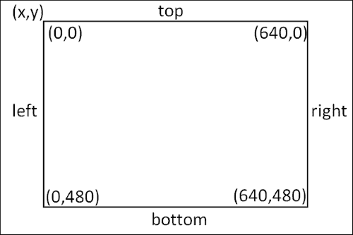

Canvas 小部件的坐标

你也可以给对象添加多个 `tags`；`tags` 通常很有用，可以定义对象的特定动作或行为。例如，它们允许在特定对象或砖块被击中时发生不同类型的事件。我们将在下一个示例中看到 `tags` 的更多用法。

接下来，我们定义球和挡板对象，这些对象是通过 `canv.create_rectangle()` 添加的。这需要两组坐标，定义了不正确的图像的相对角，应该是以下图像，其中包含 4x16 块砖的对象（在这种情况下，是左上角和右下角）。

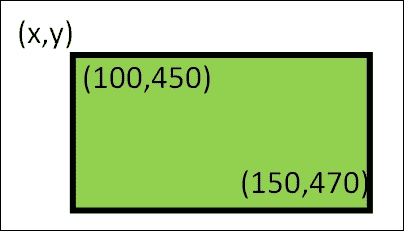

Tkinter 矩形由两个角坐标定义。

最后，我们可以创建砖块！

我们希望砖块宽度为 40 x 20 像素，这样我们可以在 640 像素的游戏区域（分为四行）中放置 16 块砖。我们可以创建一个砖块对象列表，其位置自动定义，如下面的代码所示：

```py
brick=list()
for i in range(0,16):
  for row in range(0,4):
    brick.append(canv.create_rectangle(i*40, row*20, 
                 ((i+1)*40)-2, ((row+1)*20)-2, outline='black', 
                 fill='red', tags=('rect')))
```

通过使砖块略微缩小（`-2`）以创建一个小间隙，提供了类似砖块的效果。

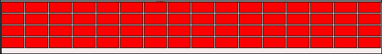

在 Canvas 顶部生成 16 块砖的 4 行。

我们现在在开始主控制循环之前设置默认设置。球的移动将由 `delta_x` 和 `delta_y` 控制，这两个值在每个周期中加到或从球的当前位置中减去。

接下来，我们设置球的开局位置，并使用 `canv.move()` 函数移动球这个距离。`move()` 函数将 `100` 添加到球对象的 `x` 和 `y` 坐标中，该球最初在位置 `0,0` 创建。

现在一切都已经设置好了，主循环可以运行；这将检查球是否没有碰到任何东西（使用 `canv.find_overlapping()` 函数），对 `delta_x` 或 `delta_y` 的值进行任何调整，然后将它们应用到移动球到下一个位置。

`delta_x` 和 `delta_y` 的符号决定了球的方向。正值会使球斜向下向右移动，而 `-delta_x` 将使其向左移动，具体是向下还是向上取决于 `delta_y` 是正还是负。

球移动后，我们使用 `canv.update()` 重新绘制对显示所做的任何更改，而 `time.sleep()` 允许在再次检查和移动球之前有一个小的延迟。

使用 `canv.find_overlapping()` 函数检测物体碰撞。这个函数返回一个列表，其中包含找到重叠由提供的坐标定义的矩形边界的画布对象。例如，在正方形球的情况下，画布对象的任何坐标是否在球占据的空间内？

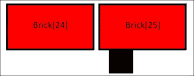

检查物体以检测它们是否重叠

如果发现球与另一个物体重叠，例如墙壁、球拍或一个或多个砖块，我们需要确定球接下来应该向哪个方向移动。由于我们使用球的坐标作为检查的区域，球将始终被列出，因此我们在检查对象列表时忽略它们。

我们使用 `dir_changed` 标志来确保如果我们同时击中两个砖块，我们在移动球之前不会改变方向两次。否则，这会导致球即使在碰撞到砖块后仍然继续以相同方向移动。

因此，如果球与另一个物体重叠，我们可以使用球和物体的坐标调用 `determineDir()` 来确定新的方向应该是什么。

当球与物体碰撞时，我们希望球从其上弹回；幸运的是，这很容易模拟，因为我们只需要根据我们是否击中了侧面或顶部/底部来改变 `delta_x` 或 `delta_y` 的符号。如果球击中了另一个物体的底部，这意味着我们正在向上移动，现在应该向下移动。然而，我们将在 `x` 轴上继续以相同方向移动（无论是向左、向右还是向上）。这可以从以下代码中看出：

```py
if (ball[xTOP] == obj[xBTM]) or (ball[xBTM] == obj[xTOP]):
    delta_x = -delta_x
```

`determineDir()` 函数查看球和物体的坐标，并寻找左和右 `x` 坐标或上和下 `y` 坐标之间的匹配。这足以判断碰撞是在侧面还是顶部/底部，我们可以相应地设置 `delta_x` 或 `delta_y` 的符号，如下面的代码所示：

```py
if (obj >= brick[0]) and (obj <= brick[-1]):
    canv.delete(obj)
```

接下来，我们可以通过检查重叠的对象 ID 是否在第一个和最后一个砖块 ID 之间来确定是否击中了一块砖。如果是砖块，我们可以使用`canv.delete()`来移除它。

### 注意

Python 允许索引值环绕而不是访问无效的内存，因此索引值`-1`将为我们提供列表中的最后一个项目。我们使用它来引用最后一个砖块作为`brick [-1]`。

我们还检查被重叠的对象是否是底部行（在这种情况下，玩家用挡板错过了球），因此会短暂显示一条简短的消息。我们重置`ball`和`delta_x`/`delta_y`值的位置。`canv.update()`函数确保在删除消息之前（3 秒后）刷新显示。

最后，球通过`delta_x`/`delta_y`距离移动，并且显示更新。这里添加了小的延迟以减少更新速率和 CPU 使用时间。否则，你会发现如果你的树莓派将 100%的精力用于运行程序，它将变得无响应。

当用户按下光标键时，会调用`move_right()`和`move_left()`函数。它们检查挡板对象的位置，如果挡板不在边缘，挡板将相应移动。如果球击中挡板，碰撞检测将确保球反弹，就像它击中了一块砖一样。

你可以通过添加每个被摧毁的块的分数来进一步扩展这个游戏，允许玩家有限的生命，当玩家错过球时生命会丢失，甚至可以编写一些代码来读取新的砖块布局。

# 创建俯视滚动游戏

通过在我们的程序中使用对象和图像，我们可以创建许多类型的 2D 图形游戏。

在这个菜谱中，我们将创建一个寻宝游戏，玩家试图找到隐藏的宝藏（通过按*Enter*键挖掘）。每次宝藏未被找到时，玩家都会得到关于宝藏距离的线索；然后他们可以使用光标键四处移动并搜索，直到找到它。

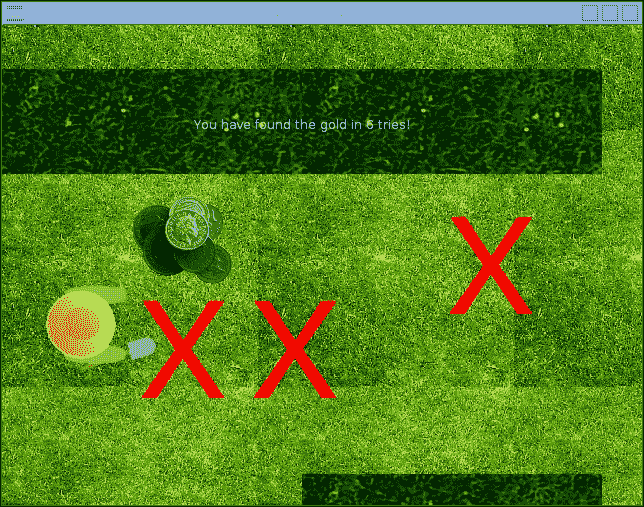

在你的俯视滚动游戏中挖掘宝藏！

虽然这是一个游戏的基本概念，但它可以很容易地扩展以包括多个布局、陷阱和需要避免的敌人，甚至可能包括额外的工具或需要解决的谜题。通过一些图形调整，角色可以探索地牢、太空船，或者跳跃在云层中收集彩虹！

## 准备工作

以下示例使用了许多图像；这些图像作为本书的资源的一部分提供。您需要将九个图像放置在与 Python 脚本相同的目录中。

所需的图像文件可以在本章的代码包中看到。

## 如何做到这一点...

创建以下脚本，`scroller.py`：

1.  首先导入所需的库和参数：

    ```py
    #!/usr/bin/python3
    # scroller.py
    import tkinter as TK
    import time
    import math
    from random import randint

    STEP=7
    xVAL,yVAL=0,1
    MAX_WIDTH,MAX_HEIGHT=640,480
    SPACE_WIDTH=MAX_WIDTH*2
    SPACE_HEIGHT=MAX_HEIGHT*2
    LEFT,UP,RIGHT,DOWN=0,1,2,3
    SPACE_LIMITS=[0,0,SPACE_WIDTH-MAX_WIDTH,
                  SPACE_HEIGHT-MAX_HEIGHT]
    DIS_LIMITS=[STEP,STEP,MAX_WIDTH-STEP,MAX_HEIGHT-STEP]
    BGN_IMG="bg.gif"
    PLAYER_IMG=["playerL.gif","playerU.gif",
                "playerR.gif","playerD.gif"]
    WALL_IMG=["wallH.gif","wallV.gif"]
    GOLD_IMG="gold.gif"
    MARK_IMG="mark.gif"
    newGame=False
    checks=list()
    ```

1.  提供处理玩家移动的功能：

    ```py
    def move_right(event):
      movePlayer(RIGHT,STEP)
    def move_left(event):
      movePlayer(LEFT,-STEP)
    def move_up(event):
      movePlayer(UP,-STEP)
    def move_down(event):
      movePlayer(DOWN,STEP)

    def foundWall(facing,move):
      hitWall=False
      olCoords=[canv.coords(player)[xVAL],
                canv.coords(player)[yVAL],
                canv.coords(player)[xVAL]+PLAYER_SIZE[xVAL],
                canv.coords(player)[yVAL]+PLAYER_SIZE[yVAL]]
      olCoords[facing]+=move
      objects = canv.find_overlapping(olCoords[0],olCoords[1],
                                      olCoords[2],olCoords[3])
      for obj in objects:
        objTags = canv.gettags(obj)
        for tag in objTags:
          if tag == "wall":
            hitWall=True
      return hitWall

    def moveBackgnd(movement):
      global bg_offset
      bg_offset[xVAL]+=movement[xVAL]
      bg_offset[yVAL]+=movement[yVAL]
      for obj in canv.find_withtag("bg"):
        canv.move(obj, -movement[xVAL], -movement[yVAL])

    def makeMove(facing,move):
      if facing == RIGHT or facing == LEFT:
        movement=[move,0] #RIGHT/LEFT
        bgOffset=bg_offset[xVAL]
        playerPos=canv.coords(player)[xVAL]
      else:
        movement=[0,move] #UP/DOWN
        bgOffset=bg_offset[yVAL]
        playerPos=canv.coords(player)[yVAL]
      #Check Bottom/Right Corner
      if facing == RIGHT or facing == DOWN: 
        if (playerPos+PLAYER_SIZE[xVAL]) < DIS_LIMITS[facing]:
          canv.move(player, movement[xVAL], movement[yVAL])
        elif bgOffset < SPACE_LIMITS[facing]:
          moveBackgnd(movement)
      else:
        #Check Top/Left Corner
        if (playerPos) > DIS_LIMITS[facing]:
          canv.move(player, movement[xVAL], movement[yVAL])
        elif bgOffset > SPACE_LIMITS[facing]:
          moveBackgnd(movement)

    def movePlayer(facing,move):
      hitWall=foundWall(facing,move)
      if hitWall==False:
        makeMove(facing,move)
      canv.itemconfig(player,image=playImg[facing])
    ```

1.  添加检查玩家距离隐藏黄金有多远的功能：

    ```py
    def check(event):
      global checks,newGame,text
      if newGame:
        for chk in checks:
          canv.delete(chk)
        del checks[:]
        canv.delete(gold,text)
        newGame=False
        hideGold()
      else:
        checks.append(
                      canv.create_image(canv.coords(player)[xVAL],
                      canv.coords(player)[yVAL],
                      anchor=TK.NW, image=checkImg,
                      tags=('check','bg')))
        distance=measureTo(checks[-1],gold)
        if(distance<=0):
          canv.itemconfig(gold,state='normal')
          canv.itemconfig(check,state='hidden')
          text = canv.create_text(300,100,fill="white",
                                  text=("You have found the gold in"+ 
                                  " %d tries!"%len(checks)))
          newGame=True
        else:
          text = canv.create_text(300,100,fill="white",
                                  text=("You are %d steps away!"%distance))
          canv.update()
          time.sleep(1)
          canv.delete(text)

    def measureTo(objectA,objectB):
      deltaX=canv.coords(objectA)[xVAL]-\
                         canv.coords(objectB)[xVAL]
      deltaY=canv.coords(objectA)[yVAL]-\
                         canv.coords(objectB)[yVAL]
      w_sq=abs(deltaX)**2
      h_sq=abs(deltaY)**2
      hypot=math.sqrt(w_sq+h_sq)
      return round((hypot/5)-20,-1)
    ```

1.  添加帮助找到隐藏黄金位置的功能：

    ```py
    def hideGold():
      global gold
      goldPos=findLocationForGold()
      gold=canv.create_image(goldPos[xVAL], goldPos[yVAL],
                             anchor=TK.NW, image=goldImg,
                             tags=('gold','bg'),
                             state='hidden')

    def findLocationForGold():
      placeGold=False
      while(placeGold==False):
        goldPos=[randint(0-bg_offset[xVAL],
                 SPACE_WIDTH-GOLD_SIZE[xVAL]-bg_offset[xVAL]),
                 randint(0-bg_offset[yVAL],
                 SPACE_HEIGHT-GOLD_SIZE[yVAL]-bg_offset[yVAL])]
        objects = canv.find_overlapping(goldPos[xVAL],
                                        goldPos[yVAL],
                                        goldPos[xVAL]+GOLD_SIZE[xVAL],
                                        goldPos[yVAL]+GOLD_SIZE[yVAL])
        findNewPlace=False
        for obj in objects:
          objTags = canv.gettags(obj)
          for tag in objTags:
            if (tag == "wall") or (tag == "player"):
              findNewPlace=True
        if findNewPlace == False:
          placeGold=True
      return goldPos
    ```

1.  创建 Tkinter 应用程序窗口并绑定键盘事件：

    ```py
    root = TK.Tk()
    root.title("Overhead Game")
    root.geometry('%sx%s+%s+%s' %(MAX_WIDTH, 
                                  MAX_HEIGHT, 
                                  100, 100))
    root.resizable(width=TK.FALSE, height=TK.FALSE)
    root.bind('<Right>', move_right)
    root.bind('<Left>', move_left)
    root.bind('<Up>', move_up)
    root.bind('<Down>', move_down)
    root.bind('<Return>', check)

    canv = TK.Canvas(root, highlightthickness=0)
    canv.place(x=0,y=0,width=SPACE_WIDTH,height=SPACE_HEIGHT)
    ```

1.  初始化所有游戏对象（背景瓦片、玩家、墙壁和黄金）：

    ```py
    #Create background tiles
    bgnImg = TK.PhotoImage(file=BGN_IMG)
    BGN_SIZE = bgnImg.width(),bgnImg.height()
    background=list()
    COLS=int(SPACE_WIDTH/BGN_SIZE[xVAL])+1
    ROWS=int(SPACE_HEIGHT/BGN_SIZE[yVAL])+1
    for col in range(0,COLS):
      for row in range(0,ROWS):
        background.append(canv.create_image(col*BGN_SIZE[xVAL],
                          row*BGN_SIZE[yVAL], anchor=TK.NW,
                          image=bgnImg,
                          tags=('background','bg')))
    bg_offset=[0,0]

    #Create player
    playImg=list()
    for img in PLAYER_IMG:
      playImg.append(TK.PhotoImage(file=img))
    #Assume images are all same size/shape
    PLAYER_SIZE=playImg[RIGHT].width(),playImg[RIGHT].height()
    player = canv.create_image(100,100, anchor=TK.NW,
                               image=playImg[RIGHT],
                               tags=('player'))

    #Create walls
    wallImg=[TK.PhotoImage(file=WALL_IMG[0]),
             TK.PhotoImage(file=WALL_IMG[1])]
    WALL_SIZE=[wallImg[0].width(),wallImg[0].height()]
    wallPosH=[(0,WALL_SIZE[xVAL]*1.5),
              (WALL_SIZE[xVAL],WALL_SIZE[xVAL]*1.5),
              (SPACE_WIDTH-WALL_SIZE[xVAL],WALL_SIZE[xVAL]*1.5),
              (WALL_SIZE[xVAL],SPACE_HEIGHT-WALL_SIZE[yVAL])]
    wallPosV=[(WALL_SIZE[xVAL],0),(WALL_SIZE[xVAL]*3,0)]
    wallPos=[wallPosH,wallPosV]
    wall=list()
    for i,img in enumerate(WALL_IMG):
      for item in wallPos[i]:
        wall.append(canv.create_image(item[xVAL],item[yVAL],
                    anchor=TK.NW, image=wallImg[i],
                    tags=('wall','bg')))

    #Place gold
    goldImg = TK.PhotoImage(file=GOLD_IMG)
    GOLD_SIZE=[goldImg.width(),goldImg.height()]
    hideGold()
    #Check mark
    checkImg = TK.PhotoImage(file=MARK_IMG)
    ```

1.  最后，启动`mainloop()`命令以允许 Tkinter 监控事件：

    ```py
    #Wait for actions from user
    root.mainloop()
    #End
    ```

## 工作原理…

如前所述，我们创建一个新的 Tkinter 应用程序，其中包含一个`Canvas`小部件，这样我们就可以添加所有的游戏对象。我们确保我们绑定了右键、左键、上键、下键和*Enter*键，这些将在游戏中作为我们的控制键。

首先，我们将背景图像（`bg.gif`）放置在`Canvas`小部件上。我们计算可以沿长度和宽度放置多少图像以铺满整个画布空间，并使用合适的坐标定位它们。

接下来，我们创建玩家图像（通过创建`playImg`，一个玩家可以转向的每个方向的 Tkinter 图像对象列表）并将其放置在画布上。

我们现在创建墙壁，其位置由`wallPosH`和`wallPosV`列表定义。这些可以使用精确坐标定义，也许甚至可以从文件中读取以提供一种简单的方法来加载不同级别的布局。通过遍历列表，水平墙和垂直墙图像被放置在画布上。

为了完成布局，我们只需将黄金隐藏在某个地方。使用`hideGold()`函数，我们随机确定一个合适的地点来定位黄金。在`findLocationForGold()`中，我们使用`randint(0,value)`创建一个伪随机数（它不是完全随机的，但对于这个用途已经足够好了），介于`0`和`value`之间。在我们的例子中，我们想要的值介于`0`和画布空间边缘减去黄金图像的大小以及任何已应用于画布的`bg_offset`之间。这确保它不会超出屏幕边缘。然后我们使用`find_overlapping()`函数检查潜在位置，看看是否有带有`wall`或`player`标记的对象挡在路上。如果是这样，我们选择一个新的位置。否则，我们在画布上放置黄金，但使用`state="hidden"`值，这将使其从视图中隐藏。

然后，我们创建`checkImg`（一个 Tkinter 图像）并在检查黄金时使用它来标记我们检查的区域。最后，我们只需等待用户按下任一键。

当按下任一光标键时，角色将在屏幕上移动。玩家的移动由`movePlayer()`函数确定；它将首先检查玩家是否试图移动到墙壁中，然后在`makeMove()`函数中确定玩家是否在显示或画布空间的边缘。

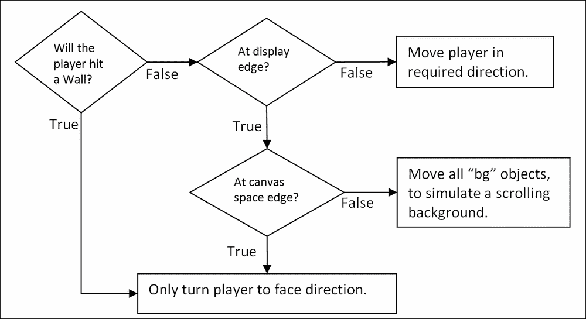

每当按下光标键时，我们使用图中所示的逻辑来确定要做什么

`foundWall()`函数通过检查玩家图像覆盖区域内的任何带有`wall`标签的对象，以及玩家将要移动到的区域的一点点额外空间，来确定玩家是否会撞到墙。以下图表显示了如何确定`olCoords`坐标：

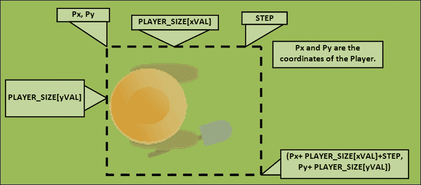

检查重叠对象（olCoords）的坐标被计算

`makeMove()`函数检查玩家是否会移动到显示的边缘（由`DIS_LIMITS`定义），以及他们是否位于画布空间的边缘（由`SPACE_LIMITS`定义）。在显示区域内，玩家可以朝光标方向移动，或者画布空间内所有带有`bg`标签的对象朝相反方向移动，模拟在玩家后面滚动。这是通过`moveBackground()`函数完成的。

当玩家按下*Enter*键时，我们将想要检查当前位置是否有金子。使用`measureTo()`函数，比较玩家和金子的位置（计算每个`x`和`y`坐标之间的距离）。

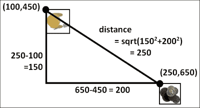

玩家与金子之间的距离被计算

结果被缩放以提供一个大致的指示，说明玩家距离金子有多远。如果距离大于零，我们显示玩家距离金子的距离，并留下一个十字来显示我们检查的位置。如果玩家找到了金子，我们将显示一条消息说明这一点，并将`newGame`设置为`True`。下次玩家按下*Enter*键时，带有十字标记的位置将被移除，金子将被重新放置在新的位置。

再次隐藏了金子后，玩家准备再次开始！
