# 第十章。与技术接口

在本章中，我们将涵盖以下主题：

+   使用远程插座自动化您的家庭

+   使用 SPI 控制 LED 矩阵

+   使用串行接口进行通信

+   通过蓝牙控制 Raspberry Pi

+   控制 USB 设备

# 简介

Raspberry Pi 与普通计算机区别的关键之一是其与硬件接口和控制的能 力。在本章中，我们使用 Raspberry Pi 远程控制带电插座，从另一台计算机通过串行连接发送命令，并远程控制 GPIO。我们利用 SPI（另一个有用的协议）来驱动 8 x 8 LED 矩阵显示屏。

我们还使用蓝牙模块与智能手机连接，允许设备之间无线传输信息。最后，我们通过 USB 发送的命令来控制 USB 设备。

### 小贴士

请务必查看附录中的*硬件和软件列表*部分，*硬件和软件列表*；它列出了本章中使用的所有项目及其获取地点。

# 使用远程插座自动化您的家庭

Raspberry Pi 可以通过提供精确的时间、控制和响应命令、按钮输入、环境传感器或来自互联网的消息的能力，成为家庭自动化的优秀工具。

## 准备工作

在控制使用市电的设备时必须格外小心，因为通常涉及高电压和电流。

### 注意

在没有适当培训的情况下，切勿尝试修改或更改连接到市电的设备。您绝对不能将任何自制的设备直接连接到市电。所有电子设备都必须经过严格的安全测试，以确保在发生故障的情况下不会对人员或财产造成风险或伤害。

在本例中，我们将使用遥控射频（RF）插头插座；这些插座使用一个独立的遥控单元发送特定的 RF 信号来切换连接到其上的任何电气设备的开/关。这允许我们修改遥控器，并使用 Raspberry Pi 安全地激活开关，而不会干扰危险的电压：


遥控器和远程插座

本例中使用的特定遥控器上有六个按钮，可以直接切换三个不同的插座的开/关，并由 12V 电池供电。它可以切换到四个不同的频道，这将允许您控制总共 12 个插座（每个插座都有一个类似的选择器，将用于设置它将响应的信号）。

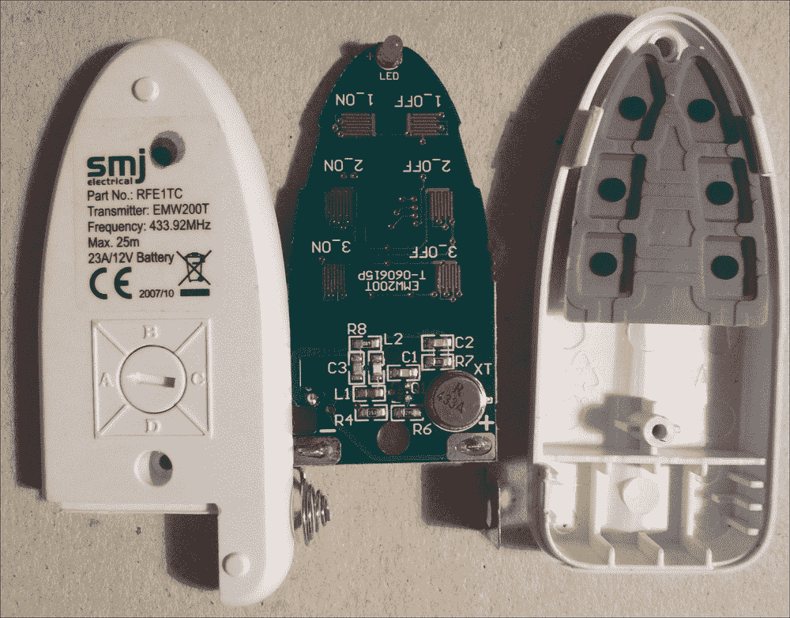

遥控器内部

当按下遥控按钮时，将广播一个特定的 RF 信号（本例使用 433.92 MHz 的传输频率）。这将触发设置为相应频道（A、B、C 或 D）和数字（1、2 或 3）的任何插座。

内部，每个按钮将两个不同的信号连接到地，数字（1、2 或 3）和状态（开启或关闭）。这触发了遥控器要发出的正确广播。

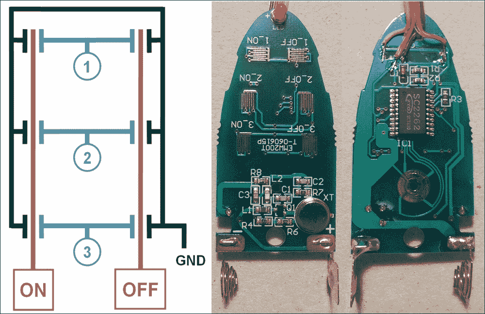

将电线连接到遥控器 PCB 板上的 ON、OFF、1、2、3 和 GND 合适的位置（图中只连接了 ON、OFF、1 和 GND）

建议您不要将任何可能因开启或关闭而造成危险的物品连接到您的插座上。遥控器发送的信号不是唯一的（只有四个不同的频道可用）。因此，这使附近有类似插座组合的人无意中激活/关闭您的其中一个插座成为可能。建议您选择除默认的 A 以外的频道，这将略微降低他人意外使用相同频道的机会。

为了允许树莓派模拟遥控器的按钮按下，我们需要五个继电器来选择数字（1、2 或 3）和状态（开启或关闭）。

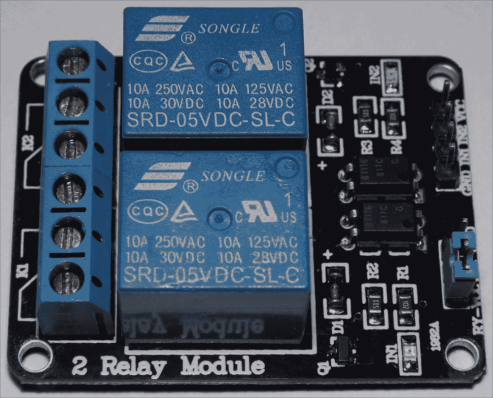

可以使用预制的继电器模块来切换信号

或者，可以使用第九章中的晶体管和继电器电路来模拟按钮按下。

将继电器控制引脚连接到树莓派 GPIO，并将插座遥控器连接到每个继电器输出，如下所示：

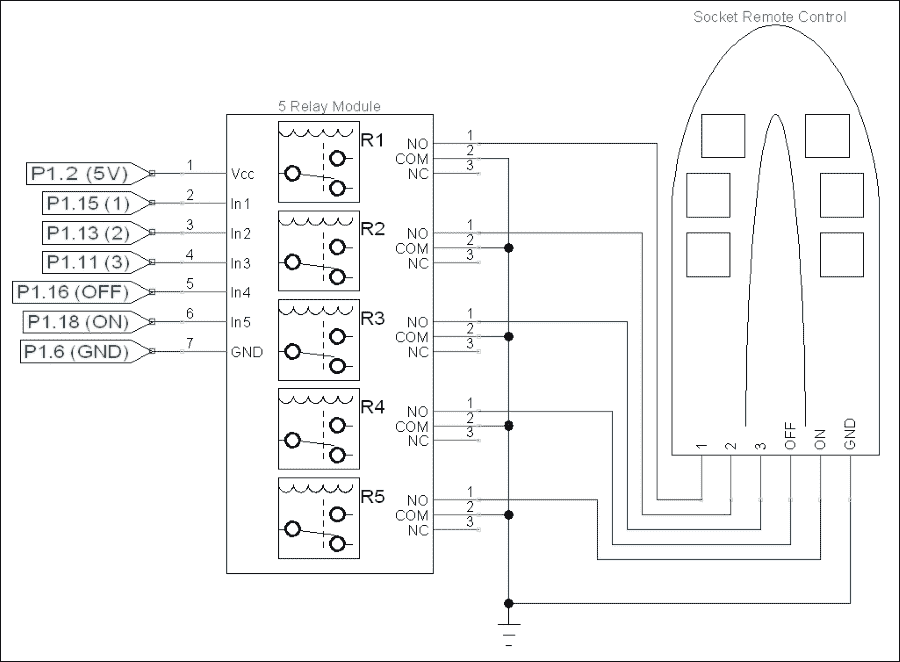

插座遥控电路

### 注意

虽然遥控器插座需要数字（1、2 或 3）和状态（开启或关闭）来激活插座，但激活射频传输的是状态信号。为了避免耗尽遥控器的电池，我们必须确保我们已经关闭了状态信号。

## 如何操作...

创建以下`socketControl.py`脚本：

```py
#!/usr/bin/python3
# socketControl.py
import time
import RPi.GPIO as GPIO
#HARDWARE SETUP
# P1
# 2[V=G====XI====]26[=======]40
# 1[=====321=====]25[=======]39
#V=5V  G=Gnd
sw_num=[15,13,11]#Pins for Switch 1,2,3
sw_state=[16,18]#Pins for State X=Off,I=On
MSGOFF=0; MSGON=1
SW_ACTIVE=0; SW_INACTIVE=1

class Switch():
  def __init__(self):
    self.setup()
  def __enter__(self):
    return self
  def setup(self):
    print("Do init")
    #Setup the wiring
    GPIO.setmode(GPIO.BOARD)
    for pin in sw_num:
      GPIO.setup(pin,GPIO.OUT)
    for pin in sw_state:
      GPIO.setup(pin,GPIO.OUT)
    self.clear()
  def message(self,number,state):
    print ("SEND SW_CMD: %s %d" % (number,state))
    if state==MSGON:
      self.on(number)
    else:
      self.off(number)
  def on(self,number):
    print ("ON: %d"% number)
    GPIO.output(sw_num[number-1],SW_ACTIVE)
    GPIO.output(sw_state[MSGON],SW_ACTIVE)
    GPIO.output(sw_state[MSGOFF],SW_INACTIVE)
    time.sleep(0.5)
    self.clear()
  def off(self,number):
    print ("OFF: %d"% number)
    GPIO.output(sw_num[number-1],SW_ACTIVE)
    GPIO.output(sw_state[MSGON],SW_INACTIVE)
    GPIO.output(sw_state[MSGOFF],SW_ACTIVE)
    time.sleep(0.5)
    self.clear()
  def clear(self):
    for pin in sw_num:
      GPIO.output(pin,SW_INACTIVE)
    for pin in sw_state:
      GPIO.output(pin,SW_INACTIVE)
  def __exit__(self, type, value, traceback):
    self.clear()
    GPIO.cleanup()
def main():
  with Switch() as mySwitches:
    mySwitches.on(1)
    time.sleep(5)
    mySwitches.off(1)  

if __name__ == "__main__":
    main()
#End
```

插座控制脚本通过开启第一个插座 5 秒然后再次关闭来进行快速测试。

要控制其余的插座，创建以下 GUI 菜单：

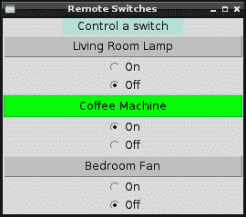

遥控开关 GUI

创建以下`socketMenu.py`脚本：

```py
#!/usr/bin/python3
#socketMenu.py
import tkinter as TK
import socketControl as SC

#Define Switches ["Switch name","Switch number"]
switch1 = ["Living Room Lamp",1]
switch2 = ["Coffee Machine",2]
switch3 = ["Bedroom Fan",3]
sw_list = [switch1,switch2,switch3]
SW_NAME = 0; SW_CMD  = 1
SW_COLOR=["gray","green"]

class swButtons:
  def __init__(self,gui,sw_index,switchCtrl):
    #Add the buttons to window
    self.msgType=TK.IntVar()
    self.msgType.set(SC.MSGOFF)
    self.btn = TK.Button(gui,
                  text=sw_list[sw_index][SW_NAME],
                  width=30, command=self.sendMsg,
                  bg=SW_COLOR[self.msgType.get()])
    self.btn.pack()
    msgOn = TK.Radiobutton(gui,text="On",
              variable=self.msgType, value=SC.MSGON)
    msgOn.pack()
    msgOff = TK.Radiobutton(gui,text="Off",
              variable=self.msgType,value=SC.MSGOFF)
    msgOff.pack()
    self.sw_num=sw_list[sw_index][SW_CMD]
    self.sw_ctrl=switchCtrl
  def sendMsg(self):
    print ("SW_CMD: %s %d" % (self.sw_num,
                              self.msgType.get()))
    self.btn.configure(bg=SW_COLOR[self.msgType.get()])
    self.sw_ctrl.message(self.sw_num,
                         self.msgType.get())

root = TK.Tk()
root.title("Remote Switches")
prompt = "Control a switch"
label1 = TK.Label(root, text=prompt, width=len(prompt),
                  justify=TK.CENTER, bg='lightblue')
label1.pack()
#Create the switch
with SC.Switch() as mySwitches:
  #Create menu buttons from sw_list
  for index, app in enumerate(sw_list):
    swButtons(root,index,mySwitches)
  root.mainloop()
#End
```

## 它是如何工作的...

第一个脚本定义了一个名为 `Switch` 的类；它在 `setup` 函数中设置了控制五个继电器所需的 GPIO 引脚。它还定义了 `__enter__` 和 `__exit__` 函数，这些是 `with..as` 语句使用的特殊函数。当使用 `with..as` 创建类时，它使用 `__enter__` 来执行任何额外的初始化或设置（如果需要），然后通过调用 `__exit__` 来执行任何清理。当 `Switch` 类执行完毕后，所有继电器都关闭以保护遥控器的电池，并调用 `GPIO.cleanup()` 来释放 GPIO 引脚。`__exit__` 函数的参数（`type`、`value` 和 `traceback`）允许处理在 `with..as` 语句中执行类时可能发生的任何特定异常（如果需要）。

要控制插座，创建两个函数，这些函数将切换相关的继电器以激活遥控器，并发送所需的信号到插座。然后，稍后使用 `clear()` 再次关闭继电器。为了使控制开关更加容易，创建一个 `message` 函数，允许指定开关号和状态。

我们通过创建一个 Tkinter GUI 菜单来使用 `socketControl.py` 脚本。菜单由 `swButtons` 类定义的三组控制组成（每个开关一组）。

`swButtons` 类创建一个 `Tkinter` 按钮，以及两个 `Radiobutton` 控制器。每个 `swButtons` 对象都分配一个索引和 `mySwitches` 对象的引用。这允许我们为按钮设置一个名称，并在按下时控制特定的开关。通过调用 `message()` 来激活/停用插座，所需的开关号和状态由 `Radiobutton` 控制器设置。

## 还有更多...

之前的例子允许你重新布线大多数遥控插座的遥控器，但另一个选项是模拟信号以直接控制它。

### 直接发送射频控制信号

你可以不重新布线遥控器，而是使用与你的插座相同频率的发射器来复制遥控器的射频信号（这些特定的单元使用 433.94 MHz）。这取决于特定的插座和有时你的位置——一些国家禁止使用某些频率，你可能需要在发送自己的传输之前获得认证：

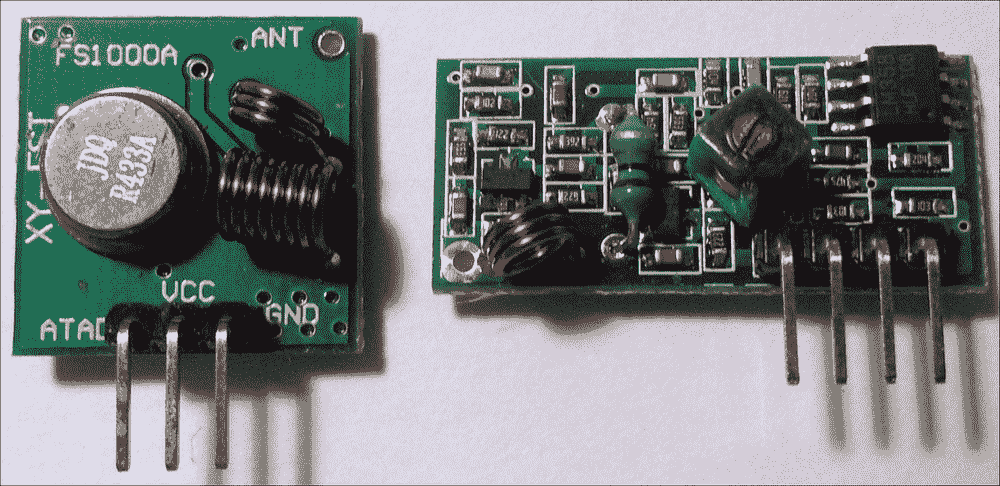

433.94 MHz 射频发射器（左侧）和接收器（右侧）

可以使用由 [`ninjablocks.com`](http://ninjablocks.com) 创建的 433Utils 来重新创建射频遥控器发送的信号。433Utils 使用 WiringPi，并使用 C++ 编写，允许高速捕获和复制射频信号。

使用以下命令获取代码：

```py
cd ~
wget https://github.com/ninjablocks/433Utils/archive/master.zip
unzip master.zip

```

接下来，我们需要将我们的射频发射器（以便我们可以控制开关）和射频接收器（以便我们可以确定控制代码）连接到 Raspberry Pi。

发射器（较小的方形模块）有三个引脚，分别是电源（VCC）、地（GND）和数据输出（ATAD）。电源引脚上的电压将控制传输范围（我们将使用来自树莓派的 5V 电源，但你也可以将其替换为 12V，只要确保将地引脚连接到你的 12V 电源和树莓派）。

尽管接收器有四个引脚，但有一个电源引脚（VCC）、地引脚（GND）和两个数据输出引脚（DATA），它们是连接在一起的，所以我们只需要连接三根线到树莓派。

| RF 发射器 | RPi GPIO 引脚 |   | RF 接收器 | RPi GPIO 引脚 |
| --- | --- | --- | --- | --- |
| VCC (5V) | 2 |   | VCC (3V3) | 1 |
| 数据输出 | 11 |   | 数据输入 | 13 |
| GND | 6 |   | GND | 9 |

在我们使用 `RPi_Utils` 内的程序之前，我们将进行一些调整以确保我们的 RX 和 TX 引脚设置正确。

在 `433Utils-master/RPi_utils/` 中定位 `codesend.cpp` 以进行必要的更改：

```py
cd ~/433Utils-master/RPi_utils
nano codesend.cpp -c

```

将 `int PIN = 0;`（位于大约第 24 行）改为 `int PIN = 11;`（RPi 物理引脚编号）。

将 `wiringPi` 改为使用物理引脚编号（位于大约第 27 行），通过将 `wiringPiSetup()` 替换为 `wiringPiSetupPhy()`。否则，默认是 WiringPi GPIO 编号；更多详情请见[`wiringpi.com/reference/setup/`](http://wiringpi.com/reference/setup/)。找到以下行：

```py
if (wiringPiSetup () == -1) return 1;
```

改成这样：

```py
if (wiringPiSetupPhys () == -1) return 1;
```

使用 *Ctrl* + *X*, *Y* 保存并退出 `nano`。

对 `RFSniffer.cpp` 进行类似的调整：

```py
nano RFSniffer.cpp -c

```

找到以下行（位于大约第 25 行）：

```py
     int PIN = 2;
```

改成这样：

```py
     int PIN = 13; //RPi physical pin number
```

找到以下行（位于大约第 27 行）：

```py
     if(wiringPiSetup() == -1) {
```

改成这样：

```py
     if(wiringPiSetupPhys() == -1) {
```

使用 *Ctrl* + *X*, *Y* 保存并退出 `nano`。

使用以下命令构建代码：

```py
make all

```

应该可以无错误地构建，如下所示：

```py
g++    -c -o codesend.o codesend.cpp
g++   RCSwitch.o codesend.o -o codesend -lwiringPi
g++    -c -o RFSniffer.o RFSniffer.cpp
g++   RCSwitch.o RFSniffer.o -o RFSniffer -lwiringPi

```

现在我们已经将 RF 模块连接到树莓派，并且代码已经准备好了，我们可以捕获来自遥控器的控制信号。运行以下命令并注意报告的输出：

```py
sudo ./RFSniffer

```

通过将遥控器设置为频道 A 并按下按钮 1 OFF 来获取输出（注意我们可能会接收到一些随机噪声）：

```py
Received 1381716
Received 1381716
Received 1381716
Received 1381717
Received 1398103

```

我们现在可以使用 `sendcode` 命令发送信号来切换插座关闭（`1381716`）和开启（`1381719`）：

```py
sendcode 1381716
sendcode 1381719

```

你甚至可以设置树莓派使用接收器模块来检测来自遥控器的信号（在未使用的频道上）并对它们做出反应以启动进程、控制其他硬件或可能触发软件关闭/重启。

### 扩展射频发射器的范围

当由 5V 供电且没有附加天线时，发射器的范围非常有限。然而，在做出任何修改之前测试一切是值得的。

可以用 25 厘米的单芯线制作简单的线状天线，将 17 毫米侧连接到天线焊接点，然后绕 16 圈（使用细螺丝刀柄或类似物品），剩余的线在上面（大约 53 毫米）。更详细的描述请见 。

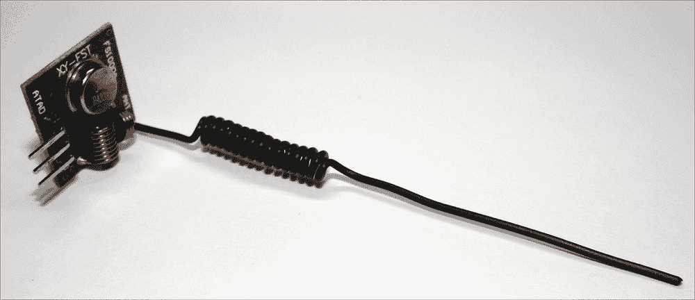

通过简单的天线，发射器的范围得到了极大的改善

### 确定遥控器代码的结构

记录每个按钮的代码，我们可以确定每个按钮的代码（并分解结构）：

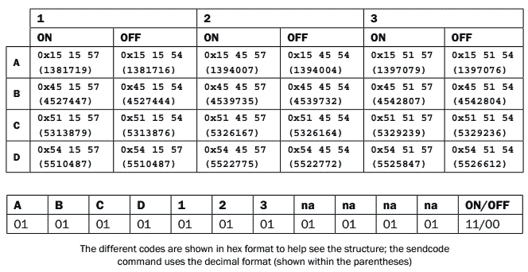

要选择通道 A、B、C 或 D，将两个位设置为 00。同样，对于按钮 1、2 或 3，将两个位设置为 00 以选择该按钮。最后，将最后两个位设置为 11 以开启，或设置为 00 以关闭。

请参阅[`arduinodiy.wordpress.com/2014/08/12/433-mhz-system-foryour-arduino/`](https://arduinodiy.wordpress.com/2014/08/12/433-mhz-system-foryour-arduino/)，该页面分析了这些以及其他类似的射频遥控器。

## 使用 SPI 控制 LED 矩阵

在第七章中，我们使用名为 I²C 的总线协议连接到设备。树莓派还支持另一种称为**SPI**（**串行外围接口**）的芯片间协议。SPI 总线与 I²C 的不同之处在于它使用两条单方向数据线（而 I²C 使用一条双向数据线）。尽管 SPI 需要更多的线（I²C 使用两个总线信号，SDA 和 SCL），但它支持数据的同步发送和接收，并且比 I²C 具有更高的时钟速度。

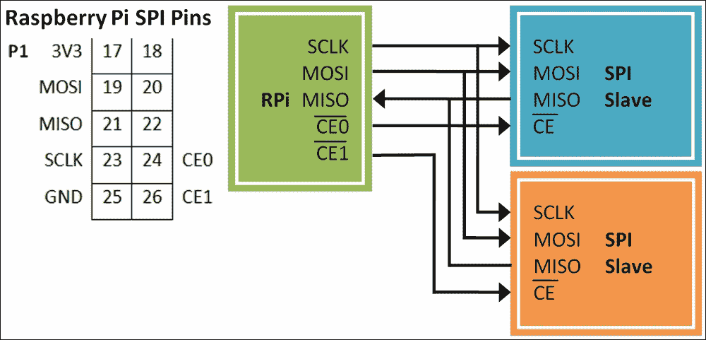

SPI 设备与树莓派的通用连接

SPI 总线由以下四个信号组成：

+   **SCLK**：它提供时钟边缘以在输入/输出线上读写数据；由主设备驱动。当时钟信号从一个状态变化到另一个状态时，SPI 设备将检查 MOSI 信号的状态以读取一个比特。同样，如果 SPI 设备正在发送数据，它将使用时钟信号边缘来同步设置 MISO 信号状态的时刻。

+   **CE**：这指的是芯片使能（通常，每个从设备在总线上都使用一个单独的芯片使能）。主设备将芯片使能信号设置为低，以便与它想要通信的设备通信。当芯片使能信号设置为高时，它将忽略总线上的任何其他信号。此信号有时被称为**芯片选择**（**CS**）或**从选择**（**SS**）。

+   **MOSI**：这代表主输出，从输出（它连接到主设备的数据输出和从设备的数据输入）。

+   **MISO**：这代表主输入，从输出（它提供从从设备响应）。

以下图表显示了每个信号：

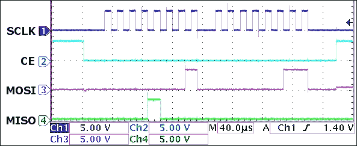

SPI 信号：SCLK（1）、CE（2）、MOSI（3）和 MISO（4）

之前的范围跟踪显示了通过 SPI 发送的两个字节。每个字节都使用**SCLK (1)**信号将时钟输入到 SPI 设备中。一个字节由八个时钟周期的一串（**SCLK (1)**信号上的低电平和随后的高电平）表示，当时钟状态改变时读取特定位的值。确切的采样点由时钟模式确定；在下面的图中，它是在时钟从低电平变为高电平时：

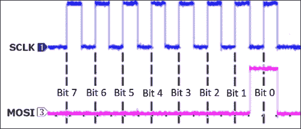

树莓派通过 MOSI(3)信号发送的第一个数据字节

发送的第一个字节是 0x01（所有位都是低电平，除了**位 0**）和第二个发送的是 0x03（只有**位 1**和**位 0**是高电平）。同时，**MOSI (4)**信号从 SPI 设备返回数据——在这种情况下，0x08（**位 3**是高电平）和 0x00（所有位都是低电平）。**SCLK (1)**信号用于同步一切，包括从 SPI 设备发送的数据。

当数据被发送到特定 SPI 设备时，**CE (2)**信号保持低电平，以指示该设备监听**MOSI (4)**信号。当**CE (2)**信号再次设置为高电平时，它表示 SPI 设备传输已完成。

下图是一个通过**SPI 总线**控制的 8 x 8 LED 矩阵的图像：

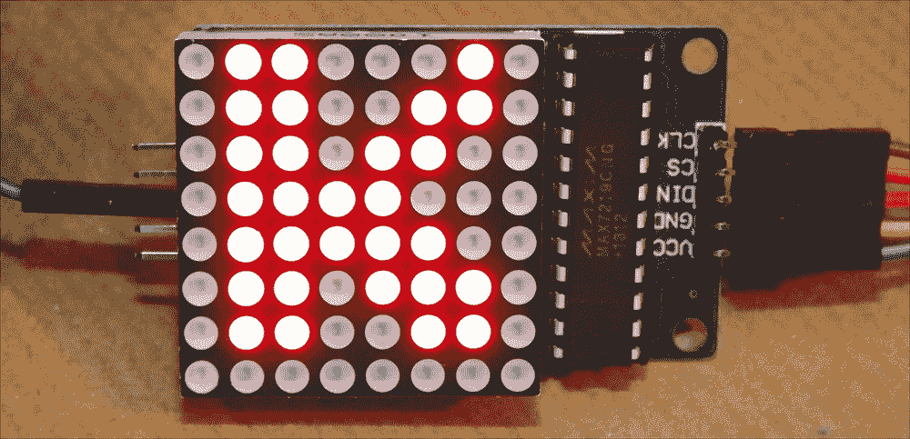

一个显示字母 K 的 8 x 8 LED 模块

### 准备中

我们之前用于 I²C 的`wiringPi`库也支持 SPI。确保 wiringPi 已安装（有关详细信息，请参阅第七章，*感知和显示现实世界数据*），这样我们就可以在这里使用它。

接下来，如果我们之前在启用 I²C 时没有这样做，我们需要启用 SPI：

```py
sudo nano /boot/config.txt

```

取消`#`前的注释以启用它，然后按(*Ctrl* + *X*, *Y*, *Enter*)保存：

```py
dtparam=spi=on

```

你可以通过使用以下命令列出所有正在运行的模块并定位`spi_bcm2835`来确认 SPI 是激活的：

```py
lsmod

```

你可以使用以下`spiTest.py`脚本来测试 SPI：

```py
#!/usr/bin/python3
# spiTest.py
import wiringpi

print("Add SPI Loopback - connect GPIO Pin19 and Pin21")
print("[Press Enter to continue]")
input()
wiringpi.wiringPiSPISetup(1,500000)
buffer=str.encode("HELLO")
print("Buffer sent %s" % buffer)
wiringpi.wiringPiSPIDataRW(1,buffer)
print("Buffer received %s" % buffer)
print("Remove the SPI Loopback")
print("[Press Enter to continue]")
input()
buffer=str.encode("HELLO")
print("Buffer sent %s" % buffer)
wiringpi.wiringPiSPIDataRW(1,buffer)
print("Buffer received %s" % buffer)
#End
```

将输入 19 和 21 连接起来以创建一个用于测试的 SPI 环回。

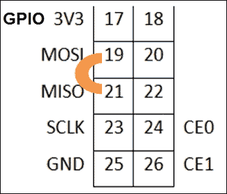

SPI 环回测试

你应该得到以下结果：

```py
Buffer sent b'HELLO'
Buffer received b'HELLO'
Remove the SPI Loopback
[Press Enter to continue]
Buffer sent b'HELLO'
Buffer received b'\x00\x00\x00\x00\x00'

```

下面的例子使用了一个由 SPI 控制的**MAX7219 LED 驱动器**驱动的 8 x 8 LED 矩阵显示器：

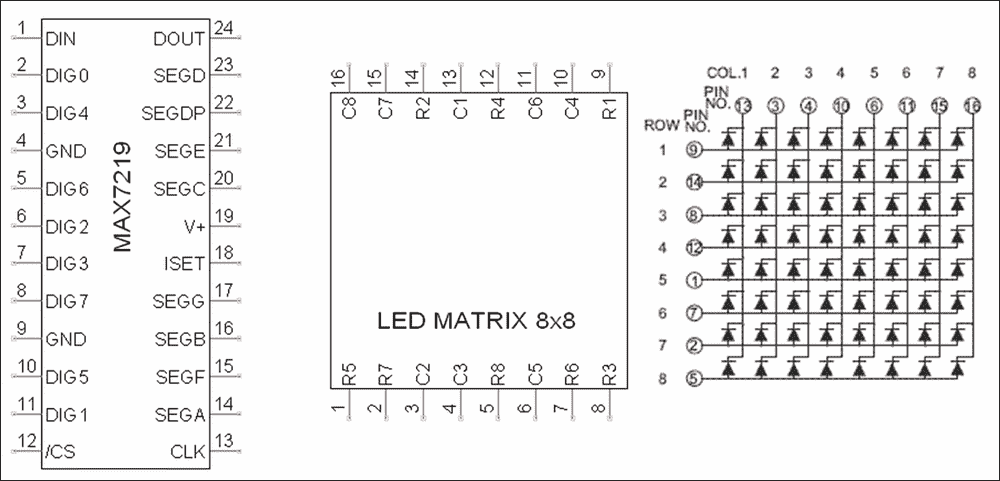

LED 控制器 MAX7219 引脚图，LED 矩阵引脚图，以及 LED 矩阵内部布线（从左到右）

尽管该设备已被设计用于控制八个独立的 7 段 LED 数字，但我们可以用它来制作我们的 LED 矩阵显示屏。当用作数字时，每个七段（加上小数点）都连接到一个 SEG 引脚上，每个数字的 COM 连接都连接到 DIG 引脚上。控制器随后根据需要打开每个段，同时将相关数字的 COM 置低以启用它。控制器可以通过快速切换 DIG 引脚来快速循环每个数字，以至于所有八个数字看起来同时点亮：

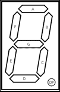

一个 7 段 LED 数字使用段 A 到 G，加上小数点 DP（decimal place）

我们以类似的方式使用控制器，除了每个 SEG 引脚将连接到矩阵中的一列，而 DIG 引脚将启用/禁用一行。

我们使用一个 8 x 8 模块，连接到 MAX7219 芯片，如下所示：

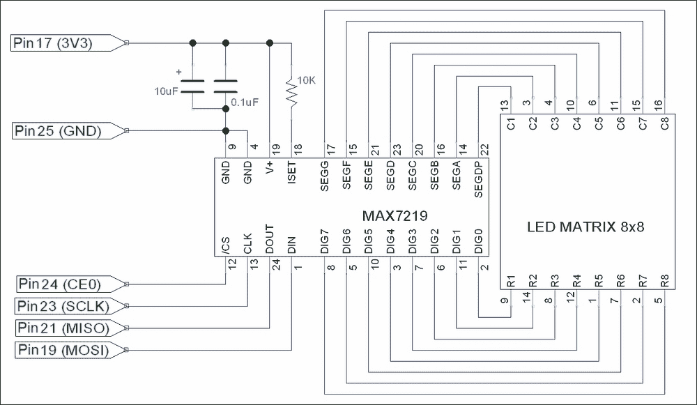

MAX7219 LED 控制器驱动 8 x 8 LED 矩阵显示屏

### 如何做…

要控制连接到 SPI MAX7219 芯片的 LED 矩阵，创建以下`matrixControl.py`脚本：

```py
#!/usr/bin/python3
# matrixControl.py
import wiringpi
import time

MAX7219_NOOP        = 0x00
DIG0=0x01; DIG1=0x02; DIG2=0x03; DIG3=0x04
DIG4=0x05; DIG5=0x06; DIG6=0x07; DIG7=0x08
MAX7219_DIGIT=[DIG0,DIG1,DIG2,DIG3,DIG4,DIG5,DIG6,DIG7]
MAX7219_DECODEMODE  = 0x09
MAX7219_INTENSITY   = 0x0A
MAX7219_SCANLIMIT   = 0x0B
MAX7219_SHUTDOWN    = 0x0C
MAX7219_DISPLAYTEST = 0x0F
SPI_CS=1
SPI_SPEED=100000

class matrix():
  def __init__(self,DEBUG=False):
    self.DEBUG=DEBUG
    wiringpi.wiringPiSPISetup(SPI_CS,SPI_SPEED)
    self.sendCmd(MAX7219_SCANLIMIT, 8)   # enable outputs
    self.sendCmd(MAX7219_DECODEMODE, 0)  # no digit decode
    self.sendCmd(MAX7219_DISPLAYTEST, 0) # display test off
    self.clear()
    self.brightness(7)                   # brightness 0-15
    self.sendCmd(MAX7219_SHUTDOWN, 1)    # start display
  def sendCmd(self, register, data):
    buffer=(register<<8)+data
    buffer=buffer.to_bytes(2, byteorder='big')
    if self.DEBUG:print("Send byte: 0x%04x"%
                        int.from_bytes(buffer,'big'))
    wiringpi.wiringPiSPIDataRW(SPI_CS,buffer)
    if self.DEBUG:print("Response:  0x%04x"%
                        int.from_bytes(buffer,'big'))
    return buffer
  def clear(self):
    if self.DEBUG:print("Clear")
    for row in MAX7219_DIGIT:
      self.sendCmd(row + 1, 0)
  def brightness(self,intensity):
    self.sendCmd(MAX7219_INTENSITY, intensity % 16)

def letterK(matrix):
    print("K")
    K=(0x0066763e1e366646).to_bytes(8, byteorder='big')
    for idx,value in enumerate(K):
        matrix.sendCmd(idx+1,value)

def main():
    myMatrix=matrix(DEBUG=True)
    letterK(myMatrix)
    while(1):
      time.sleep(5)
      myMatrix.clear()
      time.sleep(5)
      letterK(myMatrix)

if __name__ == '__main__':
    main()
#End
```

运行脚本（`python3 matrixControl.py`）显示字母 K。

我们可以使用 GUI 通过`matrixMenu.py`来控制 LED 矩阵的输出：

```py
#!/usr/bin/python3
#matrixMenu.py
import tkinter as TK
import time
import matrixControl as MC

#Enable/Disable DEBUG
DEBUG = True
#Set display sizes
BUTTON_SIZE = 10
NUM_BUTTON = 8
NUM_LIGHTS=NUM_BUTTON*NUM_BUTTON
MAX_VALUE=0xFFFFFFFFFFFFFFFF
MARGIN = 2
WINDOW_H = MARGIN+((BUTTON_SIZE+MARGIN)*NUM_BUTTON)
WINDOW_W = WINDOW_H
TEXT_WIDTH=int(2+((NUM_BUTTON*NUM_BUTTON)/4))
LIGHTOFFON=["red4","red"]
OFF = 0; ON = 1
colBg = "black"

def isBitSet(value,bit):
  return (value>>bit & 1)

def setBit(value,bit,state=1):
  mask=1<<bit
  if state==1:
    value|=mask
  else:
    value&=~mask
  return value

def toggleBit(value,bit):
  state=isBitSet(value,bit)
  value=setBit(value,bit,not state)
  return value

class matrixGUI(TK.Frame):
  def __init__(self,parent,matrix):
    self.parent = parent
    self.matrix=matrix
    #Light Status
    self.lightStatus=0
    #Add a canvas area ready for drawing on
    self.canvas = TK.Canvas(parent, width=WINDOW_W,
                        height=WINDOW_H, background=colBg)
    self.canvas.pack()
    #Add some "lights" to the canvas
    self.light = []
    for iy in range(NUM_BUTTON):
      for ix in range(NUM_BUTTON):
        x = MARGIN+MARGIN+((MARGIN+BUTTON_SIZE)*ix)
        y = MARGIN+MARGIN+((MARGIN+BUTTON_SIZE)*iy)
        self.light.append(self.canvas.create_rectangle(x,y,
                              x+BUTTON_SIZE,y+BUTTON_SIZE,
                              fill=LIGHTOFFON[OFF]))
    #Add other items
    self.codeText=TK.StringVar()
    self.codeText.trace("w", self.changedCode)
    self.generateCode()
    code=TK.Entry(parent,textvariable=self.codeText,
                  justify=TK.CENTER,width=TEXT_WIDTH)
    code.pack()
    #Bind to canvas not tk (only respond to lights)
    self.canvas.bind('<Button-1>', self.mouseClick)

  def mouseClick(self,event):
    itemsClicked=self.canvas.find_overlapping(event.x,
                             event.y,event.x+1,event.y+1)
    for item in itemsClicked:
      self.toggleLight(item)

  def setLight(self,num):
    state=isBitSet(self.lightStatus,num)
    self.canvas.itemconfig(self.light[num],
                           fill=LIGHTOFFON[state])

  def toggleLight(self,num):
    if num != 0:
      self.lightStatus=toggleBit(self.lightStatus,num-1)
      self.setLight(num-1)
      self.generateCode()

  def generateCode(self):
    self.codeText.set("0x%016x"%self.lightStatus)

  def changedCode(self,*args):
    updated=False
    try:
      codeValue=int(self.codeText.get(),16)
      if(codeValue>MAX_VALUE):
        codeValue=codeValue>>4
      self.updateLight(codeValue)
      updated=True
    except:
      self.generateCode()
      updated=False
    return updated

  def updateLight(self,lightsetting):
    self.lightStatus=lightsetting
    for num in range(NUM_LIGHTS):
      self.setLight(num)
    self.generateCode()
    self.updateHardware()

  def updateHardware(self):
    sendBytes=self.lightStatus.to_bytes(NUM_BUTTON,
                                        byteorder='big')
    print(sendBytes)
    for idx,row in enumerate(MC.MAX7219_DIGIT):
      response = self.matrix.sendCmd(row,sendBytes[idx])
      print(response)

def main():
  global root
  root=TK.Tk()
  root.title("Matrix GUI")
  myMatrixHW=MC.matrix(DEBUG)
  myMatrixGUI=matrixGUI(root,myMatrixHW)
  TK.mainloop()

if __name__ == '__main__':
    main()
#End
```

Matrix GUI 允许我们通过点击每个方块（或直接输入十六进制值）来切换每个 LED 的开/关，以创建所需的图案。

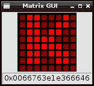

控制 8 x 8 LED 矩阵的 Matrix GUI

### 它是如何工作的...

最初，我们为 MAX7219 设备使用的每个控制寄存器定义了地址。查看数据表以获取更多信息。

我们创建了一个名为`matrix`的类，这将使我们能够控制该模块。`__init__()`函数设置树莓派的 SPI（使用`SPI_CS`作为引脚 26 CS1 和`SPI_SPEED`作为 100 kHz）。

我们`matrix`类中的关键函数是`sendCmd()`函数；它使用`wiringpi.wiringPiSPIDataRW(SPI_CS,buff)`通过 SPI 总线发送`buffer`（这是我们想要发送的原始字节数据，同时当传输发生时将`SPI_CS`引脚置低）。每个命令由两个字节组成：第一个指定寄存器的地址，第二个设置需要放入的数据。要显示一排灯光，我们发送一个`ROW`寄存器（`MC.MAX7219_DIGIT`）的地址和我们想要显示的位模式（作为一个字节）。

### 注意

在调用`wiringpi.wiringPiSPIDataRW()`函数后，`buffer`包含从 MISO 引脚接收到的结果（该引脚在数据通过 MOSI 引脚发送的同时被读取）。如果连接，这将是从 LED 模块输出的结果（发送数据的延迟副本）。有关有关菊花链 SPI 配置的更多信息，请参阅以下*更多内容…*部分，了解如何使用芯片输出。

为了初始化 MAX7219，我们需要确保它配置在正确的模式。首先，我们将 **扫描限制** 字段设置为 `7`（这将启用所有 DIG0 - DIG7 输出）。接下来，我们禁用了内置的数字解码，因为我们正在使用原始输出显示（并且不希望它尝试显示数字）。我们还希望确保 `MAX7219_DISPLAYTEST` 寄存器被禁用（如果启用，它将点亮所有 LED）。

我们通过调用自己的 `clear()` 函数来确保显示被清除，该函数将 `0` 发送到每个 `MAX7219_DIGIT` 寄存器以清除每一行。最后，我们使用 `MAX7219_INTENSITY` 寄存器设置 LED 的亮度。亮度通过 PWM 输出控制，以根据所需的亮度使 LED 看起来更亮或更暗。

在 `main()` 函数中，我们通过发送一组 8 个字节（`0x0066763e1e366646`）来在网格上快速测试显示字母 K。

每个 8 x 8 模式由 8 字节中的 8 位组成（每列一位，使每个字节成为显示中的一行）

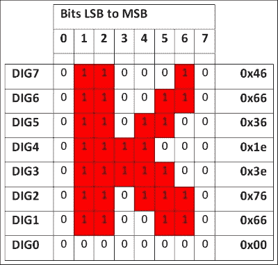

`matrixGUI` 类创建了一个画布对象，该对象填充了一个矩形对象的网格，以表示我们想要控制的 8 x 8 LED 网格（这些保存在 `self.light` 中）。我们还添加了一个文本输入框来显示我们将发送到 LED 矩阵模块的结果字节。然后我们将 `<Button-1>` 鼠标事件绑定到画布，以便在画布区域内发生鼠标点击时调用 `mouseClick`。

我们使用特殊的 Python 函数 `trace` 将一个名为 `changedCode()` 的函数附加到 `codeText` 变量上，这允许我们监控特定的变量或函数。如果我们使用 `trace` 函数的 `'w'` 值，Python 系统将在值被写入时调用回调函数。

当 `mouseClick()` 函数被调用时，我们使用 `event.x` 和 `event.y` 坐标来识别该位置的对象。如果检测到项目，则使用项目的 ID（通过 `toggleLight()`）来切换 `self.lightStatus` 值中的相应位，并且显示中的灯光颜色相应改变（通过 `setLight()`）。`codeText` 变量也更新为 `lightStatus` 值的新十六进制表示。

`changeCode()` 函数允许我们使用 `codeText` 变量并将其转换为整数。这允许我们检查它是否是一个有效的值。由于可以在这里自由输入文本，我们必须对其进行验证。如果我们无法将其转换为整数，则使用 `lightStatus` 值刷新 `codeValue` 文本。否则，我们检查它是否太大，在这种情况下，我们通过四位位移操作将其除以 16，直到它在有效范围内。我们更新 `lightStatus` 值、GUI 灯光、`codeText` 变量，以及硬件（通过调用 `updateHardware()`）。

`updateHardware()`函数利用使用`MC.matrix`类创建的`myMatrixHW`对象。我们一次发送一个字节，我们想要显示到矩阵硬件的字节（以及相应的`MAX7219_DIGIT`值以指定行）。

### 还有更多...

SPI 总线允许我们通过使用芯片使能信号来控制同一总线上多个设备。一些设备，如 MAX7219，还允许所谓的菊花链 SPI 配置。

#### Daisy-chain SPI configuration

你可能已经注意到，当我们通过 MOSI 线发送数据时，`matrix`类也会返回一个字节。这是从 MAX7219 控制器 DOUT 连接输出的数据。MAX7219 控制器实际上将所有 DIN 数据传递到 DOUT，这比 DIN 数据晚一集指令。这样，MAX7219 可以通过菊花链（每个 DOUT 输入到下一个 DIN）连接。通过保持 CE 信号低，可以通过相互传递数据来向多个控制器加载数据。当 CE 设置为低时，数据将被忽略，输出只有在再次将其设置为高时才会改变。这样，你可以为链中的每个模块时钟所有数据，然后设置 CE 为高以更新它们：

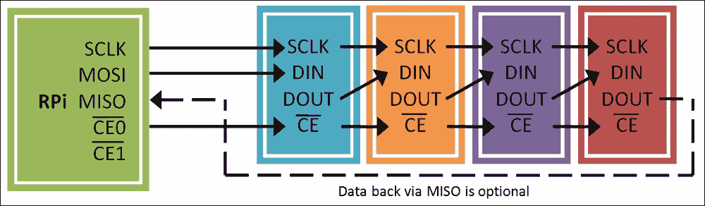

菊花链 SPI 配置

我们需要为每个我们希望更新的行做这件事（或者如果我们想保持当前行不变，可以使用`MAX7219_NOOP`）。这被称为菊花链 SPI 配置，由一些 SPI 设备支持，其中数据通过 SPI 总线上的每个设备传递到下一个设备，这允许使用三个总线控制信号来控制多个设备。

## 使用串行接口进行通信

传统上，串行协议如 RS232 是连接打印机、扫描仪以及游戏手柄和鼠标设备等设备的常用方式。现在，尽管被 USB 取代，但许多外围设备仍然使用此协议进行组件之间的内部通信、数据传输和固件更新。对于电子爱好者来说，RS232 是一个非常有用的协议，用于调试和控制其他设备，同时避免了 USB 的复杂性。

本例中的两个脚本允许控制 GPIO 引脚，以说明我们如何通过串行端口远程控制树莓派。串行端口可以连接到 PC、另一个树莓派，甚至嵌入式微控制器（如 Arduino、PIC 或类似设备）。

### 准备工作

通过串行协议连接到树莓派的最简单方法取决于你的计算机是否有内置串行端口。串行连接、软件和测试设置在以下三个步骤中描述：

1.  在你的计算机和树莓派之间创建一个 RS232 串行连接。为此，你需要以下配置之一：

    +   如果您的计算机有内置的串行端口可用，您可以使用 RS232 到 USB 适配器和 Null-Modem 线连接到树莓派：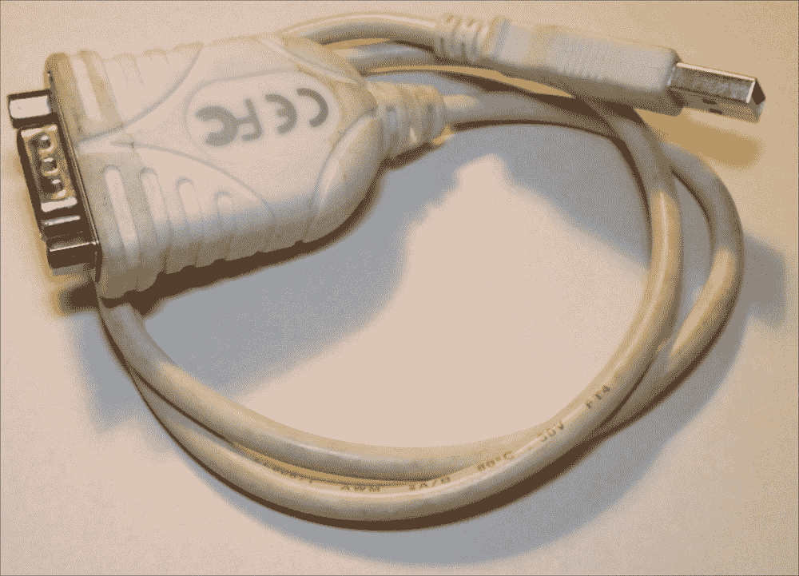

        用于 RS232 适配器的 USB

        Null-Modem 是一种串行线/适配器，其 TX 和 RX 线交叉连接，使得一边连接到串行端口的 TX 引脚，而另一边连接到 RX 引脚：

        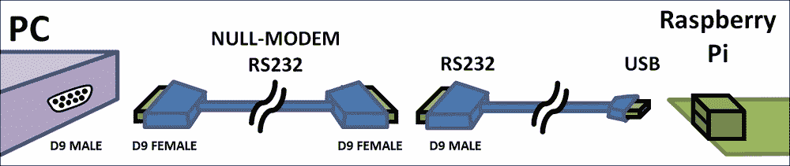

        通过 Null-Modem 线和 RS232 到 USB 适配器连接到树莓皮的 PC 串行端口

        ### 注意

        支持的 USB 到 RS232 设备列表可在以下链接中找到：[`elinux.org/RPi_VerifiedPeripherals#USB_UART_and_USB_to_Serial_.28RS-232.29_adapters`](http://elinux.org/RPi_VerifiedPeripherals#USB_UART_and_USB_to_Serial_.28RS-232.29_adapters)

        请参阅*更多内容…*部分以获取有关如何设置的详细信息。

        如果您的计算机没有内置的串行端口，您可以使用另一个 USB 到 RS232 适配器连接到 PC/笔记本电脑，将 RS232 转换为更常见的 USB 连接。

        如果树莓派上没有可用的 USB 端口，您可以直接使用串行控制线或蓝牙串行模块的 GPIO 串行引脚（有关详细信息，请参阅*更多内容…*部分）。这两者都需要一些额外的设置。

        对于所有情况，您可以使用 RS232 环回确认一切正常且设置正确（再次，请参阅*更多内容…*部分）。

1.  接下来，准备您需要的软件。

    我们需要安装 pySerial，以便我们可以使用 Python 使用串行端口

1.  使用以下命令安装 pySerial（您还需要安装 PIP；有关详细信息，请参阅第三章，*使用 Python 进行自动化和生产率*）：

    ```py
    sudo pip-3.2 install pyserial
    ```

    请参阅 pySerial 网站以获取更多文档：[`pyserial.readthedocs.io/en/latest/`](https://pyserial.readthedocs.io/en/latest/)

    为了演示 RS232 串行控制，您需要将一些示例硬件连接到树莓派的 GPIO 引脚。

    `serialMenu.py`脚本允许通过串行端口发送的命令来控制 GPIO 引脚。为了完全测试这一点，您可以将适当的输出设备（如 LED）连接到每个 GPIO 引脚。您可以使用每个 LED 的 470 欧姆电阻来确保总电流保持较低，这样树莓皮可以提供的最大 GPIO 电流就不会超过：

    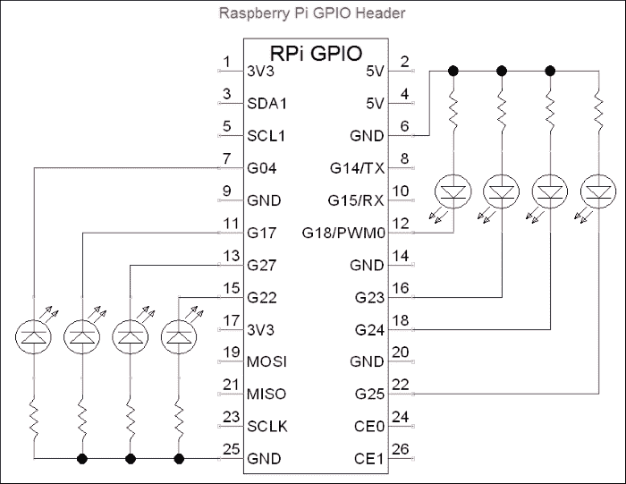

    一个用于通过串行控制测试 GPIO 输出的测试电路

### 如何做到这一点...

创建以下`serialControl.py`脚本：

```py
#!/usr/bin/python3
#serialControl.py
import serial
import time

#Serial Port settings
SERNAME="/dev/ttyUSB0"
#default setting is 9600,8,N,1
IDLE=0; SEND=1; RECEIVE=1

def b2s(message):
  '''Byte to String'''
  return bytes.decode(message)
def s2b(message):
  '''String to Byte'''
  return bytearray(message,"ascii")

class serPort():
  def __init__(self,serName="/dev/ttyAMA0"):
    self.ser = serial.Serial(serName)
    print (self.ser.name)
    print (self.ser)
    self.state=IDLE
  def __enter__(self):
    return self
  def send(self,message):
    if self.state==IDLE and self.ser.isOpen():
      self.state=SEND
      self.ser.write(s2b(message))
      self.state=IDLE

  def receive(self, chars=1, timeout=5, echo=True,
              terminate="\r"):
    message=""
    if self.state==IDLE and self.ser.isOpen():
      self.state=RECEIVE
      self.ser.timeout=timeout
      while self.state==RECEIVE:
        echovalue=""
        while self.ser.inWaiting() > 0:
          echovalue += b2s(self.ser.read(chars))
        if echo==True:
          self.ser.write(s2b(echovalue))
        message+=echovalue
        if terminate in message:
          self.state=IDLE
    return message
  def __exit__(self,type,value,traceback):
    self.ser.close()      

def main():
  try:
    with serPort(serName=SERNAME) as mySerialPort:
      mySerialPort.send("Send some data to me!\r\n")
      while True:
        print ("Waiting for input:")
        print (mySerialPort.receive())
  except OSError:
    print ("Check selected port is valid: %s" %serName)
  except KeyboardInterrupt:
    print ("Finished")

if __name__=="__main__":
  main()
#End    
```

确保使用`serName`元素正确设置我们想要使用的串行端口（例如，对于 GPIO 引脚是`/dev/ttyAMA0`，对于 USB RS232 适配器是`/dev/ttyUSB0`）。

将另一端连接到笔记本电脑或计算机的串行端口（串行端口可以是另一个 USB 到 RS232 适配器）。

使用串行程序（如 Windows 的 HyperTerminal 或 RealTerm 或 OS X 的 Serial Tools）监控你计算机上的串行端口。你需要确保设置了正确的 COM 端口，并设置了 9600 bps 的波特率（`奇偶校验=None`、`数据位=8`、`停止位=1` 和 `硬件流控制=None`）。

脚本将向用户发送请求数据，并等待响应。

要向树莓派发送数据，请在另一台计算机上输入一些文本，然后按 *Enter* 键将其发送到树莓派。

你将在树莓派终端上看到类似以下输出：

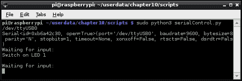

文本 "打开 LED 1" 已通过连接的计算机的 USB 到 RS232 电缆发送

你也会在串行监控程序中看到类似以下输出：

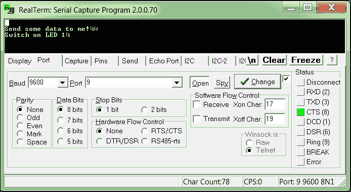

RealTerm 显示连接的串行端口的典型输出

在树莓派上按 *Ctrl* + *C* 停止脚本。

现在，创建一个 GPIO 控制菜单。创建 `serialMenu.py`：

```py
#!/usr/bin/python3
#serialMenu.py
import time
import RPi.GPIO as GPIO
import serialControl as SC
SERNAME = "/dev/ttyUSB0"
running=True

CMD=0;PIN=1;STATE=2;OFF=0;ON=1
GPIO_PINS=[7,11,12,13,15,16,18,22]
GPIO_STATE=["OFF","ON"]
EXIT="EXIT"

def gpioSetup():
  GPIO.setmode(GPIO.BOARD)
  for pin in GPIO_PINS:
    GPIO.setup(pin,GPIO.OUT)

def handleCmd(cmd):
  global running
  commands=cmd.upper()
  commands=commands.split()
  valid=False
  print ("Received: "+ str(commands))
  if len(commands)==3:
    if commands[CMD]=="GPIO":
      for pin in GPIO_PINS:
        if str(pin)==commands[PIN]:
          print ("GPIO pin is valid")
          if GPIO_STATE[OFF]==commands[STATE]:
            print ("Switch GPIO %s %s"% (commands[PIN],
                                         commands[STATE]))
            GPIO.output(pin,OFF)
            valid=True
          elif GPIO_STATE[ON]==commands[STATE]:
            print ("Switch GPIO %s %s"% (commands[PIN],
                                         commands[STATE]))
            GPIO.output(pin,ON)
            valid=True
  elif commands[CMD]==EXIT:
    print("Exit")
    valid=True
    running=False
  if valid==False:
    print ("Received command is invalid")
    response="  Invalid:GPIO Pin#(%s) %s\r\n"% (
                      str(GPIO_PINS), str(GPIO_STATE))
  else:
    response="  OK\r\n"
  return (response)

def main():
  try:
    gpioSetup()
    with SC.serPort(serName=SERNAME) as mySerialPort:
      mySerialPort.send("\r\n")
      mySerialPort.send("  GPIO Serial Control\r\n")
      mySerialPort.send("  -------------------\r\n")
      mySerialPort.send("  CMD PIN STATE "+
                        "[GPIO Pin# ON]\r\n")
      while running==True:
        print ("Waiting for command...")
        mySerialPort.send(">>")
        cmd = mySerialPort.receive(terminate="\r\n")
        response=handleCmd(cmd)
        mySerialPort.send(response)
      mySerialPort.send("  Finished!\r\n")
  except OSError:
    print ("Check selected port is valid: %s" %serName)
  except KeyboardInterrupt:
    print ("Finished")
  finally:
    GPIO.cleanup()

main()
#End
```

当你运行脚本（`sudo python3 serialMenu.py`）时，在串行监控程序中输入控制消息：

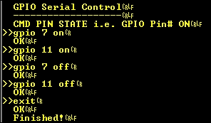

GPIO 串行控制菜单

树莓派上的终端输出将类似于以下截图，LED 灯应该相应地响应：

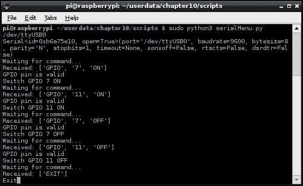

GPIO 串行控制菜单

树莓派验证从串行连接接收到的命令，并切换连接到 GPIO 引脚 7 和 11 的 LED 灯的开和关。

### 它是如何工作的...

第一个脚本 `serialControl.py` 为我们提供了一个 `serPort` 类。我们使用以下函数定义该类：

+   `__init__(self,serName="/dev/ttyAMA0")`：此函数将使用 `serName` 创建一个新的串行设备——默认的 `"/dev/ttyAMA0"` 是 GPIO 串行引脚的 ID（见 *更多内容* 部分）。初始化后，将显示设备信息。

+   `__enter__(self)`：这是一个虚拟函数，允许我们使用 `with…as` 方法。

+   `send(self,message)`：此函数用于检查串行端口是否打开且未被使用；如果是，它将使用 `s2b()` 函数将消息转换为原始字节后发送消息。

+   `receive(self, chars=1, echo=True, terminate="\r")`：在检查串行端口是否打开且未被使用后，此函数将等待通过串行端口接收数据。该函数将收集数据，直到检测到终止字符，然后返回完整消息。

+   `__exit__(self,type,value,traceback)`：当 `serPort` 对象不再需要 `with…as` 方法时，将调用此函数，因此我们可以在此处关闭端口。

脚本中的 `main()` 函数通过通过串行端口向连接的计算机发送数据提示并等待带有终止字符的输入来对类进行快速测试。

下一个脚本`serialMenu.py`允许我们使用`serPort`类。

`main()`函数设置 GPIO 引脚为输出（通过`gpioSetup()`），创建一个新的`serPort`对象，并最终通过串行端口等待命令。每当接收到新命令时，`handleCmd()`函数用于解析消息以确保它在采取行动之前是正确的。

该脚本将根据通过串行端口接收到的命令切换特定的 GPIO 引脚的开或关，使用`GPIO`命令关键字。我们可以添加任意数量的命令关键字并控制（或读取）我们连接到 Raspberry Pi 的任何设备（或设备）。我们现在有一种非常有效的方法来通过串行链路连接的任何设备控制 Raspberry Pi。

### 还有更多...

除了串行发送和接收之外，RS232 串行标准还包括其他几个控制信号。为了测试它，您可以使用串行环回以确认串行端口是否设置正确。

#### 为 Raspberry Pi 配置 USB 到 RS232 设备

一旦您将 USB 到 RS232 设备连接到 Raspberry Pi，请通过输入以下命令来检查是否列出了新的串行设备：

```py
dmesg | grep tty

```

`dmesg`命令列出了系统上发生的事件；使用`grep`，我们可以过滤出任何提及`tty`的消息，如下面的代码所示：

```py
[ 2409.195407] usb 1-1.2: pl2303 converter now attached to ttyUSB0

```

这表明基于 PL2303 的 USB-RS232 设备已连接（启动后 2,409 秒）并分配了`ttyUSB0`标识。您将看到在`/dev/`目录下已添加了一个新的串行设备（通常是`/dev/ttyUSB0`或类似）。

如果设备未被检测到，您可以尝试与第一章中使用的步骤类似的步骤，即*使用 Raspberry Pi 计算机入门*，以定位和安装合适的驱动程序（如果可用）。

#### RS232 信号和连接

RS232 串行标准有很多变体，包括六个额外的控制信号。

Raspberry Pi GPIO 串行驱动程序（以及以下示例中使用的蓝牙 TTL 模块）仅支持 RX 和 TX 信号。如果您需要支持其他信号，例如常用于 AVR/Arduino 设备编程前的重置的 DTR，则可能需要其他 GPIO 串行驱动程序来通过其他 GPIO 引脚设置这些信号。大多数 RS232 到 USB 适配器应支持标准信号；然而，请确保您连接的任何设备都能处理标准 RS232 电压：

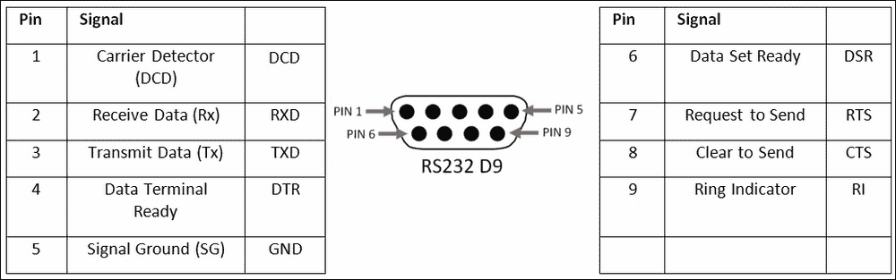

RS232 9-Way D 连接器引脚排列和信号

有关 RS232 串行协议的更多详细信息以及了解这些信号如何使用，请访问以下链接[`en.wikipedia.org/wiki/Serial_port`](http://en.wikipedia.org/wiki/Serial_port):

#### 使用 GPIO 内置的串行引脚

标准 RS232 信号的范围从-15V 到+15V，因此您绝对不能直接将任何 RS232 设备连接到 GPIO 串行引脚。您必须使用 RS232 到 TTL 电压级别转换器（如 MAX232 芯片）或使用 TTL 级别信号的设备（如另一个微控制器或 TTL 串行控制台电缆）：

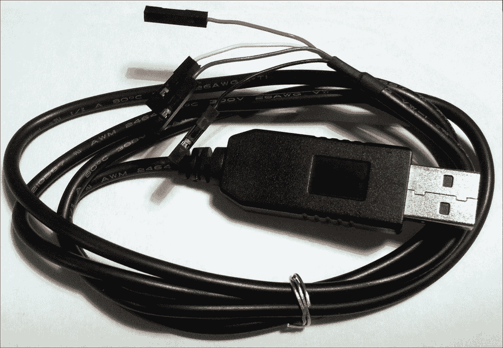

USB 到 TTL 串行控制台电缆

树莓派 GPIO 引脚上有 TTL 级别的串行引脚，允许连接 TTL 串行 USB 电缆。线将连接到树莓派 GPIO 引脚，USB 将插入到您的计算机，并像标准 RS232 到 USB 电缆一样被检测。

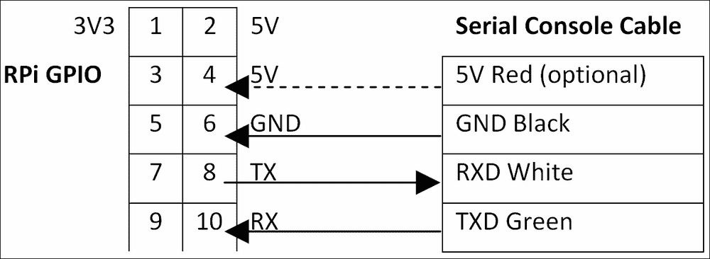

将 USB 到 TTL 串行控制台电缆连接到树莓派的 GPIO

从 USB 端口为 5V 引脚供电是可能的；然而，这将绕过内置的 polyfuse，因此不建议一般使用（只需将 5V 线断开，并通过 micro-USB 正常供电）。

默认情况下，这些引脚被设置为允许远程终端访问，允许您通过 PuTTY 连接到 COM 端口并创建串行 SSH 会话。

### 注意

如果您想在未连接显示器的树莓派上使用它，串行 SSH 会话可能会有所帮助。

然而，串行 SSH 会话仅限于纯文本终端访问，因为它不支持 X10 转发，正如在第一章的“通过 SSH（和 X11 转发）远程连接到树莓派”部分中所述，*开始使用树莓派计算机*。

为了将其用作标准串行连接，我们必须禁用串行控制台，使其可供我们使用。

首先，我们需要编辑`/boot/cmdline.txt`以删除第一个`console`和`kgboc`选项（不要删除其他`console=tty1`选项，这是您打开时的默认终端）：

```py
sudo nano /boot/cmdline.txt
dwc_otg.lpm_enable=0 console=ttyAMA0,115200 kgdboc=ttyAMA0,115200 console=tty1 root=/dev/mmcblk0p2 rootfstype=ext4 elevator=deadline rootwait

```

之前的命令行变为以下（确保这仍然是一条单独的命令行）：

```py
dwc_otg.lpm_enable=0 console=tty1 root=/dev/mmcblk0p2 rootfstype=ext4 elevator=deadline rootwait

```

我们还必须通过注释掉`#`来删除运行`getty`命令的任务（处理串行连接文本终端的程序）。这设置在`/etc/inittab`中如下：

```py
sudo nano /etc/inittab
T0:23:respawn:/sbin/getty -L ttyAMA0 115200 vt100

```

之前的命令行变为以下：

```py
#T0:23:respawn:/sbin/getty -L ttyAMA0 115200 vt100

```

要在我们的脚本中引用 GPIO 串行端口，我们使用其名称，`/dev/ttyAMA0`。

#### RS232 环回

您可以使用串行环回检查串行端口连接是否正常工作。

简单的环回包括将 RXD 和 TXD 连接在一起。这些是树莓派 GPIO 引脚上的第 8 和第 10 脚，或者在 USB-RS232 适配器上标准 RS232 D9 连接器上的第 2 和第 3 脚：

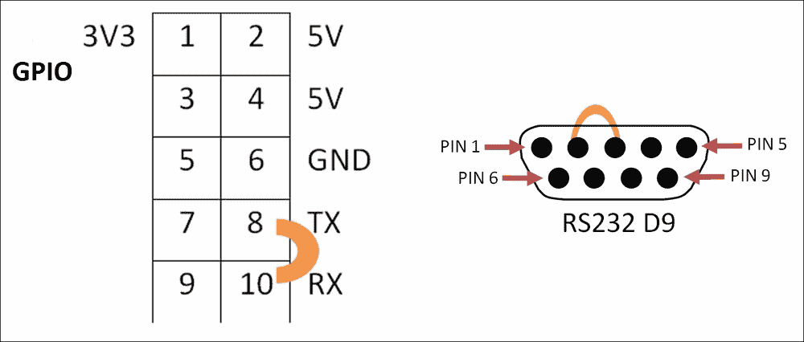

测试树莓派 GPIO（左）和 RS232 9 针 D 连接器的串行环回连接

RS232 全环回电缆还连接了 RS232 适配器上的 4 号引脚（DTR）和 6 号引脚（DSR），以及 7 号引脚（RTS）和 8 号引脚（CTS）。然而，在大多数情况下，这并不是必需的，除非使用这些信号。默认情况下，Raspberry Pi 上没有为这些额外信号分配引脚。

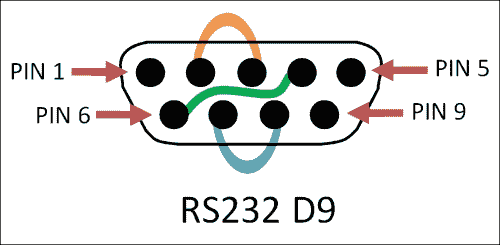

RS232 全环回

创建以下`serialTest.py`脚本：

```py
#!/usr/bin/python3
#serialTest.py
import serial
import time

WAITTIME=1
serName="/dev/ttyAMA0"
ser = serial.Serial(serName)
print (ser.name)
print (ser)
if ser.isOpen():
  try:
    print("For Serial Loopback - connect GPIO Pin8 and Pin10")
    print("[Type Message and Press Enter to continue]")
    print("#:")
    command=input()
    ser.write(bytearray(command+"\r\n","ascii"))
    time.sleep(WAITTIME)
    out=""
    while ser.inWaiting() > 0:
      out += bytes.decode(ser.read(1))
    if out != "":
      print (">>" + out)
    else:
      print ("No data Received")
  except KeyboardInterrupt:
    ser.close()
#End
```

当环回连接时，你会观察到消息被回显到屏幕上（当移除时，将显示`No data Received`）：

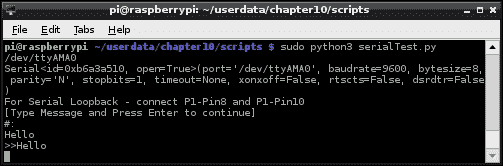

在 GPIO 串行引脚上进行的 RS232 环回测试

如果需要非默认设置，它们可以在初始化串行端口时定义（pySerial 文档在[`pyserial.readthedocs.io/en/latest/`](https://pyserial.readthedocs.io/en/latest/)提供了所有选项的完整详情），如下面的代码所示：

```py
ser = serial.Serial(port=serName, baudrate= 115200, 
    timeout=1, parity=serial.PARITY_ODD,
    stopbits=serial.STOPBITS_TWO,
    bytesize=serial.SEVENBITS)
```

## 通过蓝牙控制 Raspberry Pi

通过连接支持**串行端口配置文件**（**SPP**）的 HC-05 蓝牙模块到 GPIO 串行 RX/TX 引脚，串行数据也可以通过蓝牙发送。这允许串行连接无线化，从而可以使用 Android 平板电脑或智能手机来控制事物并从 Raspberry Pi 读取数据：

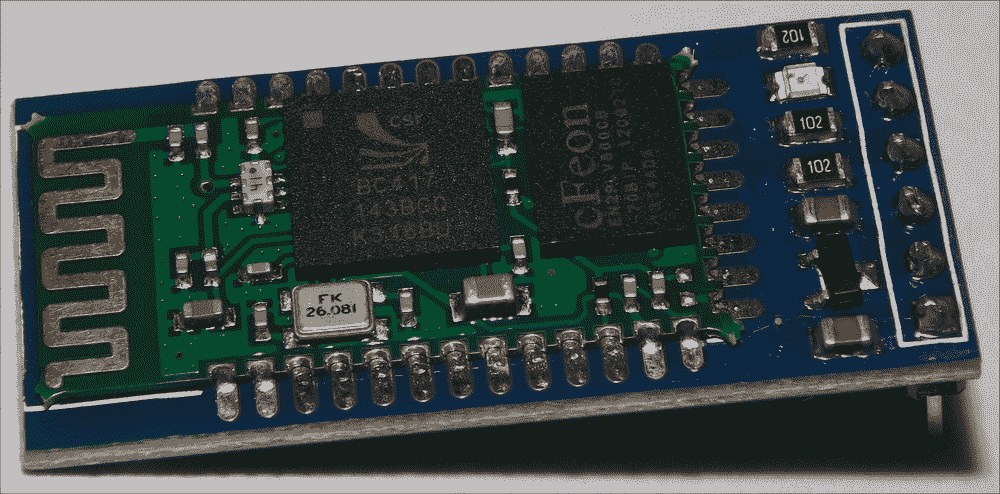

TLL 串行 HC-05 蓝牙模块

### 注意

虽然可以使用 USB 蓝牙适配器实现类似的结果，但根据所使用的特定适配器，可能需要额外的配置。TTL 蓝牙模块为物理电缆提供了一个即插即用的替代品，需要非常少的额外配置。

### 准备工作

确保串行控制台已被禁用（参见之前的*更多内容…*部分）。

模块应使用以下引脚连接：

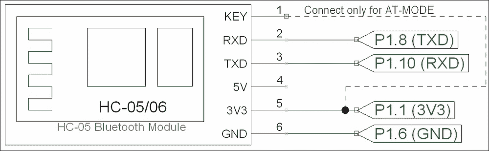

连接到 TLL 串行的蓝牙模块

### 如何操作...

在蓝牙模块配置并连接后，我们可以将模块与笔记本电脑或智能手机配对，以无线发送和接收命令。蓝牙 SPP Pro 为 Android 设备提供了一个简单的方法，通过蓝牙使用串行连接来控制或监控 Raspberry Pi。

或者，你可能在 PC/笔记本电脑上设置一个蓝牙 COM 端口，并以与之前有线示例相同的方式使用它：

1.  当设备首次连接时，LED 快速闪烁以指示它正在等待配对。在您的设备上启用蓝牙并选择**HC-05**设备：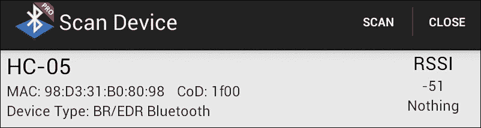

    在蓝牙 SPP Pro 中可查看的 HC-05 蓝牙模块

1.  点击**配对**按钮开始配对过程并输入设备的**PIN**（默认为`1234`）：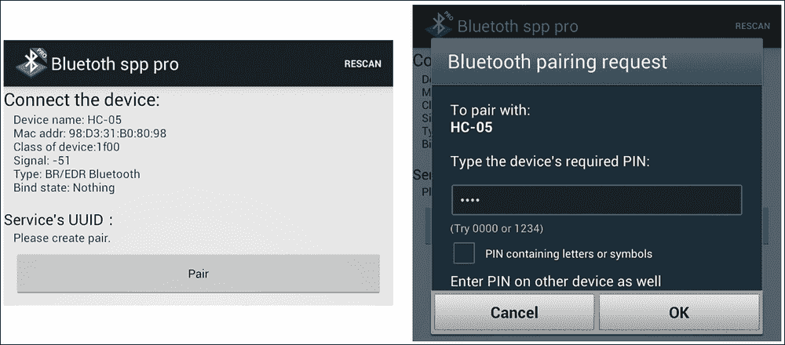

    使用 PIN 码（1234）配对蓝牙设备

1.  如果配对成功，您将能够连接到设备，并向 Raspberry Pi 发送和接收消息：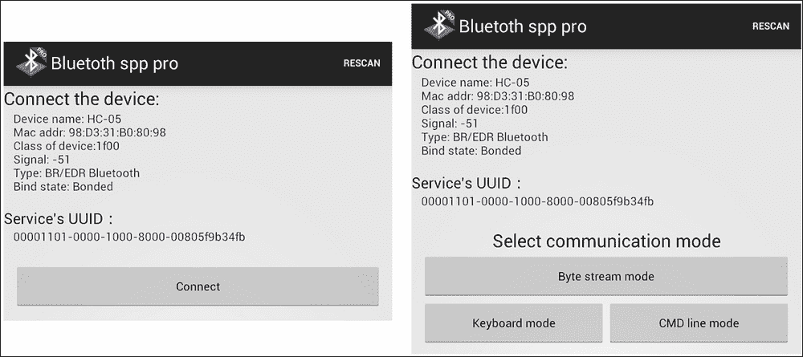

    连接到设备并选择控制方法

1.  在**键盘模式**下，您可以定义每个按钮的动作，以便在按下时发送合适的命令。

    例如，**Pin12 ON**可以设置为发送`gpio 12 on`，而**Pin12 OFF**可以设置为发送`gpio 12 off`。

1.  确保通过菜单选项设置结束标志为`\r\n`。

1.  确保将`menuSerial.py`设置为使用 GPIO 串行连接：

    ```py
    serName="/dev/ttyAMA0"

    ```

1.  运行`menuSerial.py`脚本（连接 LED）：

    ```py
    sudo python3 menuSerial.py

    ```

1.  确认蓝牙串行应用显示的`GPIO Serial Control`菜单，如下面的截图所示：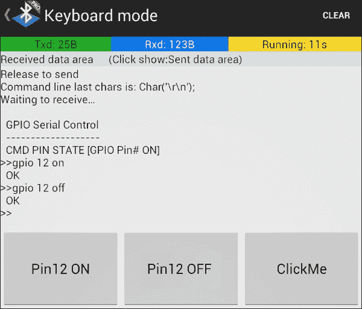

    通过蓝牙进行 GPIO 控制

从以下截图的输出中我们可以看到，命令已被接收，连接到 12 号引脚的 LED 已按需打开和关闭。

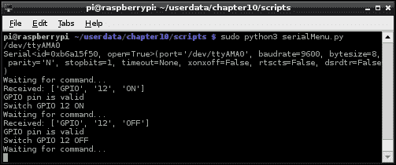

Raspberry Pi 通过蓝牙接收 GPIO 控制

### 它是如何工作的...

默认情况下，蓝牙模块被设置为类似于 TTL 串行从设备，因此我们可以直接将其插入 GPIO RX 和 TX 引脚。一旦模块与设备配对，它将通过蓝牙连接传输串行通信。这使得我们可以通过蓝牙发送命令和接收数据，并使用智能手机或 PC 控制 Raspberry Pi。

这意味着您可以将第二个模块连接到另一个具有 TTL 串行引脚的设备（例如 Arduino），并使用 Raspberry Pi（通过与其他 TTL 蓝牙模块配对或适当配置 USB 蓝牙适配器）来控制它。如果模块被设置为主设备，那么您需要重新配置它以作为从设备（请参阅*还有更多…*部分）。

### 还有更多...

现在，让我们了解如何配置蓝牙设置。

#### 配置蓝牙模块设置

可以使用 KEY 引脚将蓝牙模块设置为两种不同的模式。

在正常操作中，串行消息通过蓝牙发送；然而，如果我们需要更改蓝牙模块本身的设置，我们可以通过将 KEY 引脚连接到 3V3 并将其置于 AT 模式来实现。

AT 模式允许我们直接配置模块，允许我们更改波特率、配对码、设备名称，甚至将其设置为主/从设备。

您可以使用 pySerial 的一部分`miniterm`发送所需的消息，如下面的代码所示：

```py
python3 -m serial.tools.miniterm

```

当启动`miniterm`程序时，将提示使用端口：

```py
Enter port name: /dev/ttyAMA0

```

您可以发送以下命令（您需要快速完成此操作，或者粘贴它们，因为如果存在间隔，模块将超时并响应错误）：

+   `AT`：此命令应响应**OK**。

+   `AT+UART?`：此命令将报告当前设置，格式为`UART=<Param1>,<Param2>,<Param3>`。此命令的输出将是**OK**。

+   要更改当前设置，使用`AT+UART=<Param1>,<Param2>,<Param3>`，即`AT+UART=19200,0,0`。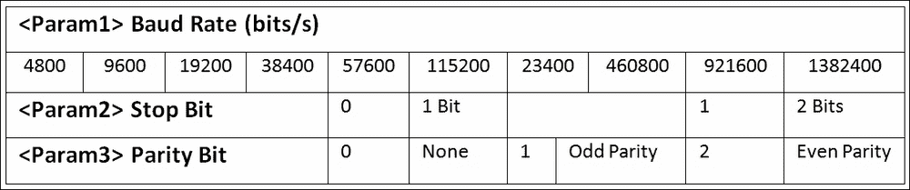

    HC-05 AT 模式 AT+UART 命令参数

关于如何配置模块作为成对的从主设备（例如，两个树莓派设备之间）的详细信息，Zak Kemble 已经编写了一个优秀的指南。它可在以下链接找到：[`blog.zakkemble.co.uk/getting-bluetooth-modules-talking-to-each-other/`](http://blog.zakkemble.co.uk/getting-bluetooth-modules-talking-to-each-other/)。

关于 HC-05 模块的更多文档，请访问以下链接：[`www.robotshop.com/media/files/pdf/rb-ite-12-bluetooth_hc05.pdf`](http://www.robotshop.com/media/files/pdf/rb-ite-12-bluetooth_hc05.pdf)。

## 控制 USB 设备

**通用串行总线**（**USB**）被计算机广泛用于通过通用标准连接提供额外的外围设备和扩展。

以下示例控制一个 USB 玩具导弹发射器，反过来它允许通过我们的 Python 控制面板进行控制。我们看到同样的原理可以应用于其他 USB 设备，例如机械臂，使用类似的技术，并且可以通过连接到树莓派 GPIO 的传感器激活控制：

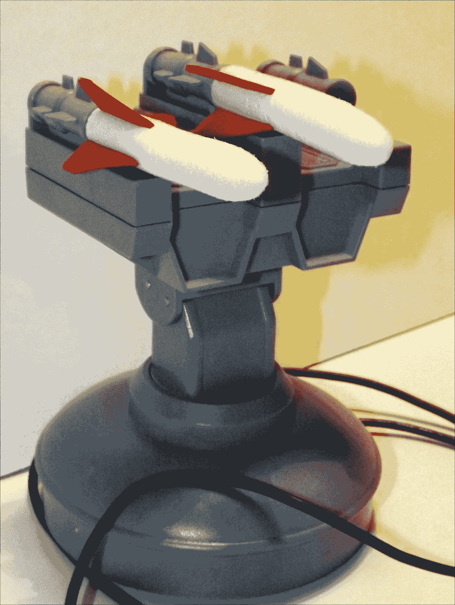

USB Tenx Technology SAM 导弹发射器

### 准备工作

我们需要使用`pip-3.2`以下方式为 Python 3 安装 PyUSB：

```py
sudo pip-3.2 install pyusb

```

你可以通过运行以下命令来测试 PyUSB 是否已正确安装：

```py
python3
> import usb
> help (usb)
> exit()

```

这应该允许你在安装正确的情况下查看软件包信息。

### 如何操作...

我们将创建以下`missileControl.py`脚本，它将包括两个类和一个默认的`main()`函数以进行测试：

1.  按以下方式导入所需的模块：

    ```py
    #!/usr/bin/python3
    # missileControl.py
    import time
    import usb.core
    ```

1.  定义`SamMissile()`类，它提供 USB 设备的特定命令，如下所示：

    ```py
    class SamMissile():
      idVendor=0x1130
      idProduct=0x0202
      idName="Tenx Technology SAM Missile"
      # Protocol control bytes
      bmRequestType=0x21
      bmRequest=0x09
      wValue=0x02
      wIndex=0x01
      # Protocol command bytes
      INITA     = [ord('U'), ord('S'), ord('B'), ord('C'),
                   0,  0,  4,  0]
      INITB     = [ord('U'), ord('S'), ord('B'), ord('C'),
                   0, 64,  2,  0]
      CMDFILL   = [ 8,  8,
                    0,  0,  0,  0,  0,  0,  0,  0,
                    0,  0,  0,  0,  0,  0,  0,  0,
                    0,  0,  0,  0,  0,  0,  0,  0,
                    0,  0,  0,  0,  0,  0,  0,  0,
                    0,  0,  0,  0,  0,  0,  0,  0,
                    0,  0,  0,  0,  0,  0,  0,  0,
                    0,  0,  0,  0,  0,  0,  0,  0]#48 zeros
      STOP      = [ 0,  0,  0,  0,  0,  0]
      LEFT      = [ 0,  1,  0,  0,  0,  0]
      RIGHT     = [ 0,  0,  1,  0,  0,  0]
      UP        = [ 0,  0,  0,  1,  0,  0]
      DOWN      = [ 0,  0,  0,  0,  1,  0]
      LEFTUP    = [ 0,  1,  0,  1,  0,  0]
      RIGHTUP   = [ 0,  0,  1,  1,  0,  0]
      LEFTDOWN  = [ 0,  1,  0,  0,  1,  0]
      RIGHTDOWN = [ 0,  0,  1,  0,  1,  0]
      FIRE      = [ 0,  0,  0,  0,  0,  1]
      def __init__(self):
        self.dev = usb.core.find(idVendor=self.idVendor,
                                    idProduct=self.idProduct)
      def move(self,cmd,duration):
        print("Move:%s %d sec"% (cmd,duration))
        self.dev.ctrl_transfer(self.bmRequestType,
                               self.bmRequest,self.wValue,
                               self.wIndex, self.INITA)
        self.dev.ctrl_transfer(self.bmRequestType,
                               self.bmRequest,self.wValue,
                               self.wIndex, self.INITB)
        self.dev.ctrl_transfer(self.bmRequestType,
                               self.bmRequest, self.wValue,
                               self.wIndex, cmd+self.CMDFILL)
        time.sleep(duration)
        self.dev.ctrl_transfer(self.bmRequestType,
                               self.bmRequest, self.wValue,
                               self.wIndex, self.INITA)
        self.dev.ctrl_transfer(self.bmRequestType,
                               self.bmRequest, self.wValue,
                               self.wIndex, self.INITB)
        self.dev.ctrl_transfer(self.bmRequestType,
                          self.bmRequest, self.wValue,
                          self.wIndex, self.STOP+self.CMDFILL)
    ```

1.  定义`Missile()`类，它允许我们检测 USB 设备并提供命令功能，如下所示：

    ```py
    class Missile():
      def __init__(self):
        print("Initialize Missiles")
        self.usbDevice=SamMissile()

        if self.usbDevice.dev is not None:
          print("Device Initialized:" +
                " %s" % self.usbDevice.idName)
          #Detach the kernel driver if active
          if self.usbDevice.dev.is_kernel_driver_active(0):
            print("Detaching kernel driver 0")
            self.usbDevice.dev.detach_kernel_driver(0)
          if self.usbDevice.dev.is_kernel_driver_active(1):
            print("Detaching kernel driver 1")
            self.usbDevice.dev.detach_kernel_driver(1)
          self.usbDevice.dev.set_configuration()
        else:
          raise Exception("Missile device not found")
      def __enter__(self):
        return self
      def left(self,duration=1):
        self.usbDevice.move(self.usbDevice.LEFT,duration)
      def right(self,duration=1):
        self.usbDevice.move(self.usbDevice.RIGHT,duration)
      def up(self,duration=1):
        self.usbDevice.move(self.usbDevice.UP,duration)
      def down(self,duration=1):
        self.usbDevice.move(self.usbDevice.DOWN,duration)
      def fire(self,duration=1):
        self.usbDevice.move(self.usbDevice.FIRE,duration)
      def stop(self,duration=1):
        self.usbDevice.move(self.usbDevice.STOP,duration)
      def __exit__(self, type, value, traceback):
        print("Exit")
    ```

1.  最后，创建一个`main()`函数，如果文件直接运行，它将提供一个快速测试我们的`missileControl.py`模块，如下所示：

    ```py
    def main():
      try:
        with Missile() as myMissile:
          myMissile.down()
          myMissile.up()
      except Exception as detail:

          time.sleep(2)
        print("Error: %s" % detail)

    if __name__ == '__main__':
        main()
    #End
    ```

当使用以下命令运行脚本时，你应该看到导弹发射器向下移动然后再向上：

```py
sudo python3 missileControl.py

```

为了提供对设备的简单控制，创建以下 GUI：

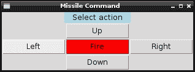

Missile Command GUI

虽然这里使用了简单的命令，但如果需要，可以使用一系列预设命令。

为`missileMenu.py`导弹命令创建 GUI：

```py
#!/usr/bin/python3
#missileMenu.py
import tkinter as TK
import missileControl as MC

BTN_SIZE=10

def menuInit():
  btnLeft = TK.Button(root, text="Left",
                      command=sendLeft, width=BTN_SIZE)   
  btnRight = TK.Button(root, text="Right",
                       command=sendRight, width=BTN_SIZE)   
  btnUp = TK.Button(root, text="Up",
                    command=sendUp, width=BTN_SIZE)   
  btnDown = TK.Button(root, text="Down",
                      command=sendDown, width=BTN_SIZE)
  btnFire = TK.Button(root, text="Fire",command=sendFire,
                      width=BTN_SIZE, bg="red")
  btnLeft.grid(row=2,column=0)
  btnRight.grid(row=2,column=2)
  btnUp.grid(row=1,column=1)
  btnDown.grid(row=3,column=1)
  btnFire.grid(row=2,column=1)

def sendLeft():
  print("Left")
  myMissile.left()

def sendRight():
  print("Right")    
  myMissile.right()

def sendUp():
  print("Up")
  myMissile.up()

def sendDown():
  print("Down")
  myMissile.down()

def sendFire():
  print("Fire")
  myMissile.fire()

root = TK.Tk()
root.title("Missile Command")
prompt = "Select action"
label1 = TK.Label(root, text=prompt, width=len(prompt),
                  justify=TK.CENTER, bg='lightblue')
label1.grid(row=0,column=0,columnspan=3)
menuInit()
with MC.Missile() as myMissile:
  root.mainloop()
#End
```

### 它是如何工作的...

控制脚本由两个类组成：一个称为`Missile`的类，它为控制提供通用接口，另一个称为`SamMissile`的类，它提供了特定 USB 设备的所有详细信息。

为了驱动 USB 设备，我们需要大量有关设备的信息，例如其 USB 标识、其协议以及控制消息，这些消息是控制设备所需的。

Tenx Technology SAM 导弹设备的 USB ID 由供应商 ID (`0x1130`) 和产品 ID (`0x0202`) 确定。这是你可以在 Windows 的 **设备管理器** 中看到的相同标识信息。这些 ID 通常在 [www.usb.org](http://www.usb.org) 注册；因此，每个设备应该是唯一的。再次提醒，你可以使用 `dmesg | grep usb` 命令来发现这些。

我们使用设备 ID 通过 `usb.core.find` 查找 USB 设备；然后，我们可以使用 `ctrl_transfer()` 发送消息。

USB 消息有五个部分：

+   **请求类型** (`0x21`): 这定义了消息请求的类型，例如消息方向（主机到设备）、其类型（供应商）和接收者（接口）

+   **请求** (`0x09`): 这是设置配置

+   **值** (`0x02`): 这是配置值

+   **索引** (`0x01`): 这是我们要发送的命令

+   **数据**：这是我们想要发送的命令（如以下所述）

`SamMissile` 设备需要以下命令来移动：

+   它需要两个初始化消息（`INITA` 和 `INITB`）。

+   它也需要控制消息。这包括 `CMD`，它包含一个设置为 `1` 的控制字节，用于所需的组件。然后，`CMD` 被添加到 `CMDFILL` 以完成消息。

你会发现其他导弹装置和机械臂（见下文 *更多内容…* 部分）具有类似的消息结构。

对于每个装置，我们创建了 `__init__()` 和 `move()` 函数，并为每个有效命令定义了值，当调用 `left()`、`right()`、`up()`、`down()`、`fire()` 和 `stop()` 函数时，`missile` 类将使用这些值。

对于我们的导弹发射器的控制 GUI，我们创建了一个带有五个按钮的小 Tkinter 窗口，每个按钮都会向导弹设备发送一个命令。

我们导入 `missileControl` 并创建一个名为 `myMissile` 的 `missile` 对象，该对象将由每个按钮控制。

### 更多内容...

示例仅展示了如何控制一个特定的 USB 设备；然而，可以将此扩展以支持多种类型的导弹装置，甚至是一般意义上的其他 USB 设备。

#### 控制类似导弹类型的装置

有几种 USB 导弹类型装置的变体，每种都有自己的 USB ID 和 USB 命令。我们可以通过定义它们自己的类来处理这些其他设备，以支持这些设备。

使用 `lsusb -vv` 确定与你的设备匹配的供应商和产品 ID。

对于 `Chesen Electronics/Dream Link`，我们必须添加以下代码：

```py
class ChesenMissile():
  idVendor=0x0a81
  idProduct=0x0701
  idName="Chesen Electronics/Dream Link"
  # Protocol control bytes
  bmRequestType=0x21
  bmRequest=0x09
  wValue=0x0200
  wIndex=0x00
  # Protocol command bytes
  DOWN    = [0x01]
  UP      = [0x02]
  LEFT    = [0x04]
  RIGHT   = [0x08]
  FIRE    = [0x10]
  STOP    = [0x20]
  def __init__(self):
    self.dev = usb.core.find(idVendor=self.idVendor,
                             idProduct=self.idProduct)
  def move(self,cmd,duration):
    print("Move:%s"%cmd)
    self.dev.ctrl_transfer(self.bmRequestType,
                           self.bmRequest,
                           self.wValue, self.wIndex, cmd)
    time.sleep(duration)
    self.dev.ctrl_transfer(self.bmRequestType,
                           self.bmRequest, self.wValue,
                           self.wIndex, self.STOP)
```

对于 `Dream Cheeky Thunder`，我们需要以下代码：

```py
class ThunderMissile():
  idVendor=0x2123
  idProduct=0x1010
  idName="Dream Cheeky Thunder"
  # Protocol control bytes
  bmRequestType=0x21
  bmRequest=0x09
  wValue=0x00
  wIndex=0x00
  # Protocol command bytes
  CMDFILL = [0,0,0,0,0,0]
  DOWN    = [0x02,0x01]
  UP      = [0x02,0x02]
  LEFT    = [0x02,0x04]
  RIGHT   = [0x02,0x08]
  FIRE    = [0x02,0x10]
  STOP    = [0x02,0x20]
  def __init__(self):
    self.dev = usb.core.find(idVendor=self.idVendor,
                             idProduct=self.idProduct)
  def move(self,cmd,duration):
    print("Move:%s"%cmd)
    self.dev.ctrl_transfer(self.bmRequestType,
                           self.bmRequest, self.wValue,
                           self.wIndex, cmd+self.CMDFILL)
    time.sleep(duration)
    self.dev.ctrl_transfer(self.bmRequestType,
                      self.bmRequest, self.wValue,
                      self.wIndex, self.STOP+self.CMDFILL)
```

最后，调整脚本以使用所需的类如下：

```py
class Missile():
  def __init__(self):
    print("Initialize Missiles")
    self.usbDevice = ThunderMissile()
```

#### 机械臂

另一个可以用类似方式控制的设备是具有 USB 接口的 OWI 机器人臂。

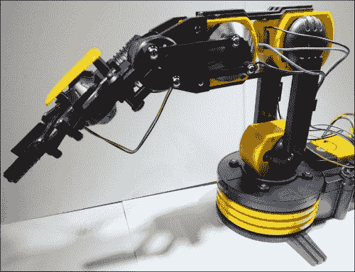

OWI USB 接口机器人臂（图片由 Chris Stagg 提供）

这在*The MagPi*杂志中多次出现，多亏了 Stephen Richards 关于 Skutter 的文章；USB 控制已在第 3 期（第 14 页）中详细解释，可在[`issuu.com/themagpi/docs/the_magpi_issue_3_final/14`](https://issuu.com/themagpi/docs/the_magpi_issue_3_final/14)找到。它也可以在[`www.raspberrypi.org/magpi/issues/3/`](https://www.raspberrypi.org/magpi/issues/3/)找到。

机器人臂可以通过以下类进行控制。记住，在调用`move()`函数时，你还需要调整`UP`、`DOWN`等命令，如下面的代码所示：

```py
class OwiArm():
  idVendor=0x1267
  idProduct=0x0000
  idName="Owi Robot Arm"
  # Protocol control bytes
  bmRequestType=0x40
  bmRequest=0x06
  wValue=0x0100
  wIndex=0x00
  # Protocol command bytes
  BASE_CCW    = [0x00,0x01,0x00]
  BASE_CW     = [0x00,0x02,0x00]
  SHOLDER_UP  = [0x40,0x00,0x00]
  SHOLDER_DWN = [0x80,0x00,0x00]
  ELBOW_UP    = [0x10,0x00,0x00]
  ELBOW_DWN   = [0x20,0x00,0x00]
  WRIST_UP    = [0x04,0x00,0x00]
  WRIST_DOWN  = [0x08,0x00,0x00]
  GRIP_OPEN   = [0x02,0x00,0x00]
  GRIP_CLOSE  = [0x01,0x00,0x00]
  LIGHT_ON    = [0x00,0x00,0x01]
  LIGHT_OFF   = [0x00,0x00,0x00]
  STOP        = [0x00,0x00,0x00]
```

#### 深入 USB 控制

用于 USB 导弹设备的理论和控制方法也可以应用于非常复杂的设备，如 Xbox 360 的 Kinect（Xbox 游戏控制台的特殊 3D 摄像头附加设备）。

Adafruit 的网站上有一篇由 Limor Fried（也称为 Ladyada）撰写的非常有趣的教程，介绍了如何分析和调查 USB 命令；可在[`learn.adafruit.com/hacking-the-kinect`](http://learn.adafruit.com/hacking-the-kinect)访问。

如果你打算逆向工程其他 USB 设备，这非常值得一看。
