# 第一章：Raspberry Pi 3 电脑入门

在本章中，我们将介绍以下食谱：

+   将外围设备连接到树莓派

+   使用 NOOBS 设置您的树莓派 SD 卡

+   通过 LAN 连接器将你的树莓派连接到互联网进行网络连接

+   使用树莓派内置的 Wi-Fi 和蓝牙

+   手动配置您的网络

+   直接连接到笔记本电脑或计算机

+   通过 USB Wi-Fi 网卡将你的树莓派连接到互联网进行网络连接

+   通过代理服务器连接到互联网

+   通过 VNC 在网络上远程连接到 Raspberry Pi

+   通过 SSH（以及 X11 转发）远程连接到 Raspberry Pi 网络

+   将树莓派的主文件夹通过 SMB 共享

+   保持树莓派更新

# 简介

本章介绍了树莓派及其首次设置的流程。我们将把树莓派连接到合适的显示器、电源和外设。我们将在 SD 卡上安装操作系统。这是系统启动所必需的。接下来，我们将确保可以通过本地网络成功连接到互联网。

最后，我们将利用网络提供远程连接到和/或控制 Raspberry Pi 的方法，以及确保系统保持更新的途径。

一旦完成本章中的步骤，您的树莓派（Raspberry Pi）将准备就绪

为您用于编程。如果您已经设置了并运行了您的树莓派，请确保您浏览以下部分，因为这里有许多有用的提示。

# 介绍 Raspberry Pi

树莓派是由**树莓派基金会**创建的单板计算机，该基金会是一个慈善机构，其主要目的是将低级计算机技能重新介绍给英国的孩子们。目标是重新点燃 20 世纪 80 年代的微型计算机革命，这场革命培养了一代熟练的程序员。

即使在 2012 年 2 月底电脑发布之前，很明显 Raspberry Pi 已经在全球范围内获得了巨大的追随者群体，并且在撰写本书时，销量已超过 1000 万部。以下图片展示了几个不同的 Raspberry Pi 型号：

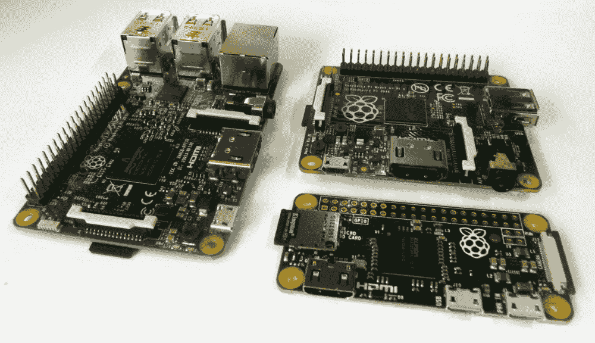

树莓派 3B、Model A+和 Pi Zero

# 这个名字是什么意思？

Raspberry Pi 这个名字是结合了想要创造一个以水果命名的替代电脑（例如 Apple、BlackBerry 和 Apricot）的愿望，以及对原始概念的一种致敬，即一个可以用 **Python**（简称 **Pi**）编程的简单电脑。

在这本书中，我们将使用这个小电脑，了解如何设置它，然后逐章探索其功能，使用 Python 编程语言。

# 为什么选择 Python？

经常有人问，“为什么选择 Python 作为在树莓派上使用的语言？”事实上，Python 只是可以在树莓派上使用的众多编程语言之一。

你可以选择许多编程语言，从高级图形块编程，例如**Scratch**，到传统的**C**语言，再到**BASIC**，甚至原始的**机器代码汇编器**。一个好的程序员通常需要成为代码多语言者，以便能够发挥每种语言的优势和劣势，以最好地满足他们期望的应用需求。了解不同的语言（以及编程技术）如何尝试克服将*你想要的*转换为*你得到的*的挑战是有用的，因为这也是你在编程时试图做到的事情。

Python 被选为学习编程的绝佳起点，因为它提供了一套丰富的编码工具，同时仍然允许在不费周折的情况下编写简单的程序。这使得初学者可以逐步接触并了解现代编程语言所基于的概念和方法，而无需一开始就全部掌握。它非常模块化，拥有许多可以导入的附加库，可以快速扩展功能。你会发现，随着时间的推移，这会鼓励你做同样的事情，你将想要创建自己的模块，并将它们集成到自己的程序中，从而迈出结构化编程的第一步。

Python 解决了格式和展示方面的问题。由于缩进可以增加更好的可读性，因此在 Python 中缩进非常重要。它们定义了代码块是如何组合在一起的。一般来说，Python 运行较慢；因为它被解释，所以在运行程序时创建模块需要花费时间。如果你需要响应时间敏感的事件，这可能会成为一个问题。然而，你可以预编译 Python 或使用用其他语言编写的模块来克服这个问题。

它隐藏了细节；这既是优点也是缺点。对于初学者来说非常好，但当你需要猜测诸如数据类型等细节时可能会有些困难。然而，这也迫使你考虑所有可能性，这可能是件好事。

# Python 2 和 Python 3

对于初学者来说，一个巨大的困惑来源是，树莓派上有两个版本的 Python（**版本 2.7**和**版本 3.6**），它们彼此不兼容，因此为 Python 2.7 编写的代码可能无法在 Python 3.6 上运行（反之亦然）。

**Python 软件基金会**持续致力于改进和推动语言的发展，这有时意味着他们必须牺牲向后兼容性以接纳新的改进（并且，重要的是，移除冗余和过时的做法）。

支持 Python 2 和 Python 3

有许多工具可以帮助您从 Python 2 转换到 Python 3，包括像 `2to3` 这样的转换器，它将解析并更新您的代码以使用 Python 3 方法。这个过程并不完美，在某些情况下，您可能需要手动重写部分代码并全面重新测试所有内容。您可以编写同时支持两者的代码和库。`import __future__` 语句允许您导入 Python 3 的友好方法，并使用 Python 2.7 运行它们。

# 你应该使用哪个版本的 Python？

实际上，选择使用哪个版本将取决于你的意图。例如，你可能需要 Python 2.7 库，这些库在 Python 3.6 中尚未提供。Python 3 自 2008 年以来就已经可用，因此这些往往是较旧或较大的库，尚未被翻译。在许多情况下，有新的替代方案可以替代旧库；然而，它们的支持情况可能有所不同。

在这本书中，我们使用了 Python 3.6，它也兼容 Python 3.5 和 3.3。

# Raspberry Pi 系列 - Pi 的简要历史

自从发布以来，树莓派经历了各种迭代，包括对原始树莓派 B 型单元的小型和大型的更新与改进。尽管一开始可能会感到困惑，但市面上有三种基本的树莓派型号（以及一个特殊型号）。

主要旗舰型号被称为**Model B**。这款型号拥有所有连接和功能，以及最大 RAM 和最新的处理器。多年来，已经推出了几个版本，最显著的是**Model B**（最初有 256 MB RAM，后来升级到 512 MB RAM）以及**Model B+**（将 26 针 GPIO 增加到 40 针，改为使用 microSD 卡槽，并且有四个 USB 端口而不是两个）。这些原始型号都使用了 Broadcom BCM2835 **系统级芯片**（**SOC**），由一个 700 MHz 的 ARM11 核心和 VideoCore IV **图形处理单元**（**GPU**）组成。

2015 年发布的树莓派 2B 型（也称为 2B）引入了新的 Broadcom BCM2836 系统单芯片（SOC），提供了一款四核 32 位 ARM Cortex-A7 1.2 GHz 处理器和 GPU，以及 1 GB 的 RAM。改进的 SOC 增加了对 Ubuntu 和 Windows 10 IoT 的支持。最后，我们迎来了最新的树莓派 3B 型，它使用了另一款新的 Broadcom BCM2837 SOC，该 SOC 提供了一款四核 64 位 ARM Cortex-A53 处理器和 GPU，同时还集成了板载 Wi-Fi 和蓝牙。

**模型 A** 一直被视为一个简化版本。虽然与模型 B 具有相同的 SOC，但连接有限，仅包含一个 USB 端口，没有有线网络（LAN）。模型 A+又增加了更多的 GPIO 引脚和一个 microSD 插槽。然而，内存后来升级到 512 MB RAM，但仍然只有一个 USB 端口/没有 LAN。模型 A 上的 Broadcom BCM2835 SOC 至今未更新（因此仍然是单核 ARM11）；然而，有一个模型 3A（很可能是使用 BCM2837）。

**Pi Zero** 是一种超紧凑的 Raspberry Pi 版本，专为成本和空间至关重要的嵌入式应用而设计。它拥有与其他型号相同的 40 引脚 GPIO 和 microSD 卡槽，但缺少了板载显示（CSI 和 DSI）连接。它仍然配备了 HDMI（通过 mini-HDMI）和一个单独的 micro USB **on-the-go** （**OTG**）连接。尽管在 Pi Zero 的第一版中并未提供，但最新的型号也包括了用于板载摄像头的 CSI 连接。

Pi Zero 于 2015 年闻名发布，并随 Raspberry Pi 基金会的杂志《The MagPi》一同赠送，这使得该杂志成为首个在封面上赠送电脑的杂志！这确实让我感到相当自豪，因为（正如你可能在本书开头的传记中读到的那样）我是该杂志的创始人之一。

该特殊型号被称为**计算模块**。它采用 200 针 SODIMM 卡的形式。它适用于工业用途或商业产品中，其中所有外部接口都由主机/主板提供，模块将被插入其中。例如产品包括 Slice 媒体播放器([`fiveninjas.com`](http://fiveninjas.com))和 OTTO 相机。当前模块使用 BCM2835，尽管有一个更新的计算模块（CM3）。

Raspberry Pi 的维基百科页面提供了所有不同变体及其规格的完整列表：

[`zh.wikipedia.org/wiki/Raspberry_Pi#规格`](https://zh.wikipedia.org/wiki/Raspberry_Pi#规格)

此外，Raspberry Pi 产品页面提供了关于可用型号和配件规格的详细信息：[`www.raspberrypi.org/products/`](https://www.raspberrypi.org/products/)

# 应该选择哪个 Pi？

本书的所有章节都与所有当前的 Raspberry Pi 版本兼容，但建议从 Model 3B 开始，因为它是最适合入门的最佳型号。这提供了最佳的性能（尤其是对于第七章，*创建 3D 图形*，以及第六章，*检测图像中的边缘和轮廓*）中使用的 OpenCV 示例非常有用），众多连接端口，以及内置 Wi-Fi，这可以非常方便。

Pi Zero 推荐用于那些需要低功耗或减小重量/尺寸但不需要 Model 3B 完整处理能力的项目。然而，由于其超低成本，Pi Zero 在你开发完项目后部署完成项目是理想的。

# 连接到树莓派

有许多方法可以连接 Raspberry Pi 并使用各种接口来查看和控制内容。对于典型使用，大多数用户将需要电源、显示（带音频）以及一种输入方法，例如键盘和鼠标。要访问互联网，请参考 *通过 LAN 连接器连接 Raspberry Pi 到互联网的网络和连接* 或 *在 Raspberry Pi 上使用内置 Wi-Fi 和蓝牙* 的食谱。

# 准备就绪

在您可以使用您的树莓派之前，您需要一个安装了操作系统或带有**新开箱系统**（**NOOBS**）的 SD 卡，正如在*使用 NOOBS 设置您的树莓派 SD 卡*菜谱中所述。

以下部分将详细介绍您可以连接到树莓派的设备类型，以及如何和在哪里将它们插入。

如您稍后会发现，一旦您设置了您的 Raspberry Pi，您可能会决定通过远程连接并通过网络链路使用它，在这种情况下，您只需要电源和网络连接。请参考以下章节：*通过 VNC 远程连接到 Raspberry Pi 的网络*和*通过 SSH（以及 X11 转发）远程连接到 Raspberry Pi 的网络*。

# 如何做到这一点...

Raspberry Pi 的布局如图所示：

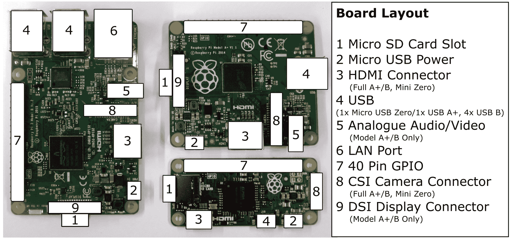

Raspberry Pi 连接布局（型号 3 B、型号 A+ 和 Pi Zero）

关于前述图示的更多信息如下：

+   **显示**：树莓派支持以下三种主要显示连接；如果同时连接了 HDMI 和复合视频，它将默认只使用 HDMI：

    +   **HDMI**: 为了获得最佳效果，请使用具有 HDMI 连接的电视或显示器，从而实现最佳分辨率显示（1080p）以及数字音频输出。如果您的显示器有 DVI 连接，您可能可以使用适配器通过 HDMI 连接。DVI 连接有几种类型；一些支持模拟（DVI-A），一些支持数字（DVI-D），还有一些两者都支持（DVI-I）。树莓派只能通过 HDMI 提供数字信号，因此建议使用 HDMI-to-DVI-D 适配器（以下截图中有勾选标记）。这缺少了四个额外的模拟引脚（以下截图中有叉号标记），因此可以适配 DVI-D 和 DVI-I 类型的插座：


HDMI 至 DVI 连接（DVI-D 适配器）

如果你希望使用老式的显示器（带有 VGA 连接），则需要一个额外的 HDMI-to-VGA 转换器。树莓派也支持一个基本的 VGA 适配器（VGA Gert666 适配器），该适配器直接由 GPIO 引脚驱动。然而，这会占用 40 引脚头上的所有引脚，除了四个（较老的 26 引脚型号将不支持 VGA 输出）：


HDMI 转 VGA 适配器

+   +   **模拟**: 另一种显示方法是使用模拟复合视频连接（通过电话插座）；这也可以连接到 S-Video 或欧洲 SCART 适配器。然而，模拟视频输出的最大分辨率为 640 x 480 像素，因此它并不适合一般用途：


3.5 毫米电话模拟连接

当使用 RCA 连接或 DVI 输入时，音频必须通过模拟音频连接单独提供。为了简化制造过程（通过避免通孔组件），Pi Zero 没有模拟音频或 RCA 插孔用于模拟视频（尽管可以通过一些修改添加它们）：

+   +   **直接显示 DSI**: 由树莓派基金会生产的触摸显示屏将直接连接到 DSI 插槽。这可以在同时连接和使用 HDMI 或模拟视频输出的情况下创建一个双显示设置。

+   **立体声模拟音频（除 Pi Zero 外）**：这为耳机或放大扬声器提供模拟音频输出。可以通过桌面上的 Raspberry Pi 配置工具在模拟（立体声插座）和数字（HDMI）之间切换音频，或者使用`amixer`或`alsamixer`命令行工具进行切换。

要获取终端中特定命令的更多信息，你可以在终端读取手册之前使用以下`man`命令（大多数命令都应该有一个）：

`man amixer`

一些命令也支持`--help`选项以获得更简洁的帮助，如下所示：

`amixer --help`

+   **网络（不包括模型 A 和 Pi Zero）**：网络连接将在本章后面的*通过 LAN 连接器连接 Raspberry Pi 到互联网的网络和连接*部分进行讨论。如果我们使用 Model A Raspberry Pi，则可以添加 USB 网络适配器以添加有线网络甚至无线网络（请参阅*通过 USB Wi-Fi 外置设备连接 Raspberry Pi 到互联网的网络和连接*部分）。

+   **USB (1x 型号 A/零，2x 型号 1 B，4x 型号 2 B 和 3 B)**: 使用键盘和鼠标：

    +   Raspberry Pi 应该与大多数 USB 键盘和鼠标兼容。您还可以使用无线鼠标和键盘，这些设备使用射频（RF）适配器。然而，对于使用蓝牙适配器的设备，需要额外的配置。

    +   如果电源供应不足或设备消耗电流过多，您可能会遇到键盘按键似乎粘滞的情况，在严重情况下，还可能导致 SD 卡损坏。

USB 电源可能在 2012 年 10 月之前可用的早期 Model B 修订 1 版板上成为一个更大的问题。这些板子上增加了额外的**Polyfuses**在 USB 输出端，如果超过 140 mA 的电流被抽取，它们会跳闸。Polyfuses 可能需要几个小时或几天才能完全恢复，因此即使在电源得到改善的情况下，也可能保持不可预测的行为。

您可以通过缺少后来型号中存在的四个安装孔来识别修订版 1 的电路板。

+   +   Debian Linux（Raspbian 基于此）支持许多常见的 USB 设备，例如闪存驱动器、硬盘驱动器（可能需要外部电源），相机、打印机、蓝牙和 Wi-Fi 适配器。一些设备将自动检测，而其他设备则需要安装驱动程序。

+   **微型 USB 电源**：树莓派需要一个能够舒适地提供至少 1,000 mA（推荐 1,500 mA 或更多，尤其是对于更耗电的 2 型和 3 型）的 5V 电源，通过微型 USB 连接。可以使用便携式电池组为设备供电，例如适合为平板电脑供电或充电的电池组。再次强调，确保它们能够提供至少 1,000 mA 或更多的 5V 电源。

在连接电源之前，你应该尽量完成所有其他与树莓派的连接。然而，在运行过程中，USB 设备、音频和网络可以连接和移除，而不会出现问题。

# 还有更多...

除了您在电脑上预期看到的常规主要连接外，树莓派还有许多其他连接。

# 二级硬件连接

以下每个连接都为 Raspberry Pi 提供了额外的接口：

+   **20 x 2 GPIO 引脚头（Model A+、B+、2 B、3 B 和 Pi Zero）**：这是 Raspberry Pi 的主要 40 引脚 GPIO 引脚头，用于直接与硬件组件进行接口连接。我们在第六章，*在图像中检测边缘和轮廓*，第七章，*创建 3D 图形*，第九章，*使用 Python 驱动硬件*，以及第十章，*感知和显示现实世界数据*中使用这个连接。本书中的食谱也适用于具有 13 x 2 GPIO 引脚头的较老型号的 Raspberry Pi。

+   **P5 8 x 2 GPIO 引脚排针（仅限型号 1 B 版本 2.0）**：我们在书中没有使用这个。

+   **重置连接**：这在较晚的型号上存在（没有安装引脚）。当引脚 1（重置）和引脚 2（地）连接在一起时，会触发重置。我们在第九章的*使用 Python 驱动硬件*食谱中使用了这个功能，*可控关机按钮*。

+   **GPU/LAN JTAG**: 联合测试行动小组（**JTAG**）是一种编程和调试接口，用于配置和测试处理器。这些接口在新型号上以表面焊盘的形式存在。使用此接口需要专用 JTAG 设备。本书中我们不使用此接口。

+   **直接相机 CSI 接口**：此连接支持树莓派相机模块。请注意，Pi Zero 的 CSI 接口比其他型号更小，因此需要不同的排线连接器。

+   **直接显示 DSI**：此连接支持直接连接的显示设备，例如 7 英寸 800 x 600 电容式触摸屏。

# 使用 NOOBS 设置您的树莓派 SD 卡

Raspberry Pi 需要在启动前将操作系统加载到 SD 卡上。设置 SD 卡最简单的方法是使用 **NOOBS**；你可能发现你可以购买已经预装了 NOOBS 的 SD 卡。

NOOBS 提供了一个初始启动菜单，该菜单提供了将多个可用的操作系统安装到您的 SD 卡上的选项。

# 准备就绪

由于 NOOBS 创建了一个**恢复**分区以保留原始安装镜像，建议使用 8 GB SD 卡或更大容量。您还需要一个 SD 卡读卡器（经验表明，某些内置读卡器可能会引起问题，因此建议使用外部 USB 类型读卡器）。

如果你正在使用之前使用过的 SD 卡，你可能需要重新格式化它以删除任何之前的分区和数据。NOOBS 期望 SD 卡只包含一个 FAT32 分区。

如果使用 Windows 或 macOS X，您可以使用 SD 协会提供的格式化工具，如图下截图所示（可在[`www.sdcard.org/downloads/formatter_4/`](https://www.sdcard.org/downloads/formatter_4/) 获取）:

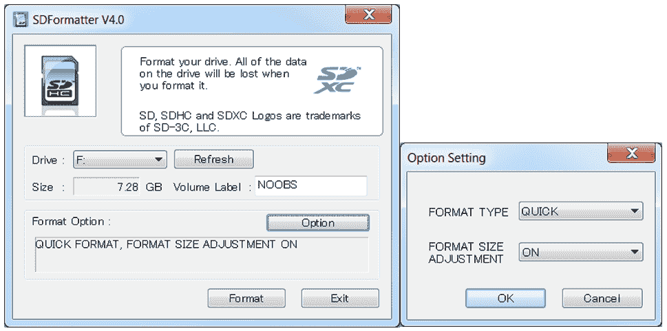

使用 SD 格式化工具清除 SD 卡上的任何分区

从选项设置对话框中，设置**格式大小调整**。这将移除之前创建的所有 SD 卡分区。

如果使用 Linux 系统，您可以使用 `gparted` 工具清除任何之前的分区并将其重新格式化为 FAT32 分区。

完整的 NOOBS 软件包（通常超过 1 GB）包含 Raspbian，这是内置的最受欢迎的树莓派操作系统镜像。同时，也提供了一种轻量级的 NOOBS 版本，该版本没有预装操作系统（尽管需要下载一个较小的初始文件 20 MB，并在树莓派上建立网络连接，以便直接下载您打算使用的操作系统）。

NOOBS 可在 [`www.raspberrypi.org/downloads`](http://www.raspberrypi.org/downloads) 获取，相关文档可在 [`github.com/raspberrypi/noobs`](https://github.com/raspberrypi/noobs) 查阅。

# 如何做到这一点...

通过执行以下步骤，我们将准备 SD 卡以运行 NOOBS。这样我们就可以选择并安装我们想要使用的操作系统：

1.  准备好您的 SD 卡。

1.  在格式化后或新的 SD 卡上，复制`NOOBS_vX.zip`文件的内容。当复制完成后，你应该得到类似于以下 SD 卡截图的内容：

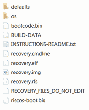

NOOBS 文件已提取到 SD 卡上

文件可能因 NOOBS 的不同版本而略有差异，您电脑上显示的图标也可能不同。

1.  您现在可以将这张卡插入到您的 Raspberry Pi 中，连接键盘和显示器，然后打开电源。有关所需物品和如何操作的详细信息，请参阅*连接到 Raspberry Pi*菜谱。

默认情况下，NOOBS 将通过 HDMI 连接显示。如果您有另一种类型的屏幕（或者您什么都没有看到），您需要通过按 1、2、3 或 4 来手动选择输出类型，具体功能如下：

+   关键词 1 代表标准 HDMI 模式（默认模式）

+   关键 2 代表安全 HDMI 模式（如果未检测到输出，则为替代 HDMI 设置）

+   关键 3 代表复合 PAL（用于通过 RCA 模拟视频连接进行的连接）

+   第四个键代表复合 NTSC（再次强调，通过 RCA 连接器进行连接）

此显示设置也将应用于已安装的操作系统。

稍等片刻，你将看到 NOOBS 选择屏幕，该屏幕列出了可用的发行版（离线版本仅包括 Raspbian）。还有更多可用的发行版，但只有选中的那些可以通过 NOOBS 系统直接访问。点击 Raspbian，因为这个书中使用的是这个操作系统。

按下 *Enter* 键或点击安装操作系统，并确认您希望覆盖所有数据

这张卡。这将覆盖之前使用 NOOBS 安装的任何分布，但不会删除 NOOBS 系统；您可以在开机时按*Shift*键随时返回到它。

根据其速度，将数据写入卡片大约需要 20 到 40 分钟。当操作完成并且出现“图像应用成功”的消息时，点击“确定”，树莓派将开始启动进入`树莓派桌面`。

# 它是如何工作的...

以这种方式将图像文件写入 SD 卡的目的，是为了确保 SD 卡格式化成预期的文件系统分区和文件，以便正确引导操作系统。

当树莓派启动时，它会加载存储在 GPU 内部内存中的一些特殊代码（通常由树莓派基金会称为**二进制 blob**）。这个二进制 blob 提供了读取 SD 卡上`BOOT`分区的指令，这在 NOOBS 安装的情况下，将从`RECOVERY`分区加载 NOOBS。如果此时按下*Shift*键，NOOBS 将加载恢复和安装菜单。否则，NOOBS 将开始加载存储在`SETTINGS`分区中的偏好设置所指定的操作系统。

当加载操作系统时，它将通过`BOOT`分区启动，使用`config.txt`中定义的设置和`cmdline.txt`中的选项，最终加载到`root`分区上的桌面。请参考以下图示：

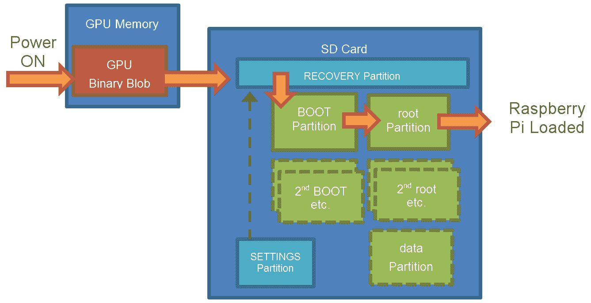

NOOBS 在 SD 卡上创建多个分区，以便安装多个

操作系统并提供恢复功能

NOOBS 允许用户选择性地在同一张卡上安装多个操作系统，并提供一个启动菜单来在这些操作系统之间进行选择（在超时期间可以选择设置一个默认值）。

如果您以后添加、删除或重新安装操作系统，请首先确保您复制了所有文件，包括您希望保留的系统设置，因为 NOOBS 可能会覆盖 SD 卡上的所有内容。

# 还有更多...

当您第一次直接启动 Raspberry Pi 时，桌面将会加载。您可以使用 Raspberry Pi 配置菜单（位于桌面上的“首选项”菜单下或通过 `sudo raspi-config` 命令）来配置系统设置。使用此菜单，您可以更改您的 SD 卡或设置您的常规偏好设置：

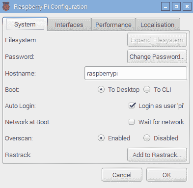

# 更改默认用户密码

确保您在登录后更改`pi`用户账户的默认密码，因为默认密码是众所周知的。这一点在连接到公共网络时尤为重要。您可以使用`passwd`命令来完成此操作，如下面的截图所示：

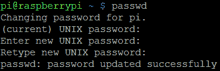

为 Pi 用户设置新密码

这提供了更大的信心，因为如果你后来连接到另一个网络，只有你才能访问你的文件并控制你的树莓派。

# 确保您安全关闭

为了避免任何数据损坏，您必须确保通过发出`shutdown`命令正确关闭 Raspberry Pi，如下所示：

```py
sudo shutdown -h now  
```

或者，使用这个：

```py
sudo halt  
```

您必须在从 Raspberry Pi 上移除电源之前等待此命令完成（在 SD 卡访问指示灯停止闪烁后至少等待 10 秒）。

您也可以使用`reboot`命令重新启动系统，如下所示：

```py
sudo reboot  
```

# 手动准备 SD 卡

使用 NOOBS 的另一种选择是手动将操作系统镜像写入 SD 卡。虽然这最初是安装操作系统的唯一方式，但一些用户仍然更喜欢这种方式。它允许在将 SD 卡用于 Raspberry Pi 之前对其进行准备。它还可以提供更方便的访问启动和配置文件的方法，并且为用户留下更多可用空间（与 NOOBS 不同，不包括`RECOVERY`分区）。

默认的 Raspbian 系统镜像实际上由两个分区组成，`BOOT` 和 `SYSTEM`，它们可以适应一个 2 GB 的 SD 卡（建议使用 4 GB 或更大）。

您需要一个运行 Windows/Mac OS X/Linux 的计算机（尽管使用另一台 Raspberry Pi 来编写您的卡片也是可能的；请做好长时间等待的准备）。

下载您希望使用的操作系统最新版本。为了本书的目的，假设您正在使用可在[`www.raspberrypi.org/downloads`](http://www.raspberrypi.org/downloads)找到的最新版本的 Raspbian。

根据您计划用于写入 SD 卡（您需要的`.img`文件有时是压缩的，因此在开始之前，您需要提取该文件）的计算机类型，执行以下步骤。

以下步骤适用于 Windows：

1.  确保您已下载如前所述的 Raspbian 镜像，并将其提取到方便的文件夹中，以获得一个 `.img` 文件。

1.  获取位于[`www.sourceforge.net/projects/win32diskimager`](http://www.sourceforge.net/projects/win32diskimager)的`Win32DiskImager.exe`文件。

1.  从您下载的位置运行 `Win32DiskImager.exe`。

1.  点击文件夹图标，导航到`.img`文件的位置，然后点击保存。

1.  如果您还没有这样做，请将您的 SD 卡插入卡读卡器，并将其连接到您的电脑。

1.  从小下拉框中选择与您的 SD 卡对应的设备驱动器字母。请务必确认这是正确的设备（因为当您写入镜像时，程序将覆盖设备上的所有内容）。

驱动器字母可能直到您选择源映像文件时才会列出。

1.  最后，点击“写入”按钮，等待程序将图像写入 SD 卡，如下所示截图：

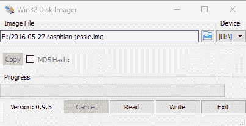

使用 Disk Imager 手动将操作系统镜像写入 SD 卡

1.  一旦完成，您就可以退出程序。您的 SD 卡已准备就绪。

以下步骤适用于大多数常见的 Linux 发行版，例如 Ubuntu 和 Debian：

1.  使用您偏好的网络浏览器，下载 Raspbian 图像并将其保存在合适的位置。

1.  从文件管理器中提取文件或在终端中定位文件夹，然后使用以下命令解压`.img`文件：

```py
unzip filename.zip  
```

1.  如果您还没有这样做，请将您的 SD 卡插入卡读卡器，并将其连接到您的电脑。

1.  使用 `df -h` 命令并识别 SD 卡的 **sdX** 标识符。每个分区将显示为 sdX1、sdX2 等等，其中 X 将是设备 ID 的 `a`、`b`、`c`、`d` 等等。

1.  确保使用以下命令卸载 SD 卡上的所有分区

    `umount /dev/sdXn` 命令用于每个分区，其中 `sdXn` 是正在卸载的分区。

1.  使用以下命令将图片文件写入 SD 卡：

```py
sudo dd if=filename.img of=/dev/sdX bs=4M  
```

1.  将数据写入 SD 卡的过程需要一些时间，完成后会返回到终端提示符。

1.  在从电脑中移除 SD 卡之前，请使用以下命令卸载它：

```py
umount /dev/sdX1  
```

以下步骤适用于大多数版本的 OS X：

1.  使用您偏好的网络浏览器，下载 Raspbian 镜像并将其保存在合适的位置。

1.  从文件管理器中提取文件或在终端中定位文件夹，然后使用以下命令解压`.img`文件：

```py
unzip filename.zip  
```

1.  如果您还没有这样做，请将您的 SD 卡插入卡读卡器，并将其连接到您的电脑。

1.  使用 `diskutil list` 命令并识别 SD 卡的 **disk#** 标识符。每个分区将显示为 disk#s1, disk#s2，等等，其中 # 将是 `1`、`2`、`3`、`4` 等等，代表设备 ID。

如果列出 rdisk#，则使用此方法进行更快的写入（这使用原始路径并跳过数据缓冲）。

1.  确保使用`unmountdisk /dev/diskX`命令卸载 SD 卡，其中`diskX`是要卸载的设备。

1.  使用以下命令将图片文件写入 SD 卡：

```py
sudo dd if=filename.img of=/dev/diskX bs=1M  
```

1.  将数据写入 SD 卡的过程需要一些时间，完成后会返回到终端提示符。

1.  在从电脑中移除 SD 卡之前，请先卸载 SD 卡，使用

    以下命令：

```py
unmountdisk /dev/diskX  
```

参考以下图示：


手动安装的操作系统镜像的引导过程

# 将系统扩展以适应您的 SD 卡

手写生成的镜像将具有固定的大小（通常制作成适合可能的最小尺寸 SD 卡）。为了充分利用 SD 卡，您需要将系统分区扩展以填充 SD 卡的剩余部分。这可以通过使用 Raspberry Pi 配置工具来实现。

选择“展开文件系统”，如图下所示：


树莓派配置工具

# 访问 RECOVERY/BOOT 分区

Windows 和 macOS X 不支持 `ext4` 格式，因此当你读取 SD 卡时，只有 **文件分配表** (**FAT**) 分区可访问。此外，Windows 只支持 SD 卡上的第一个分区，所以如果你已安装 NOOBS，则只能看到 `RECOVERY` 分区。如果你是手动写入的卡，你将能够访问 `BOOT` 分区。

`data`分区（如果你是通过 NOOBS 安装的）和`root`分区都是`ext4`格式，通常在非 Linux 系统上不可见。

如果你确实需要在 Windows 系统下读取 SD 卡中的文件，一款免费软件 **Linux Reader**（可在 [www.diskinternals.com/linux-reader](https://www.diskinternals.com/linux-reader) 获取）可以提供对 SD 卡上所有分区的只读访问权限。

从树莓派访问分区。要查看当前挂载的分区，请使用 `df` 命令，如下截图所示：

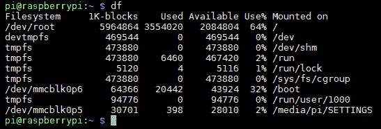

df 命令的结果

要从 Raspbian 内部访问 `BOOT` 分区，请使用以下命令：

```py
cd /boot/  
```

要访问`RECOVERY`或`data`分区，我们必须通过执行以下操作来挂载它：

以下步骤：

1.  确定分区名称，因为系统通过列出所有分区（包括未挂载的分区）来引用分区名称。`sudo fdisk -l` 命令列出分区，如下面的截图所示：

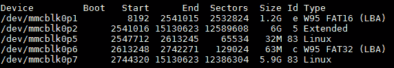

NOOBS 安装和数据分区

以下表格显示了分区名称及其含义

| **分区名称** | **含义** |
| --- | --- |
| `mmcblk0p1` | (`VFAT`) `RECOVERY` |
| `mmcblk0p2` | (扩展分区) 包含 (`root`, `data`, `BOOT`) |
| `mmcblk0p5` | (`ext4`) `root` |
| `mmcblk0p6` | (`VFAT`) `BOOT` |
| `mmcblk0p7` | (`ext4`) `设置` |

如果你在同一张卡上安装了额外的操作系统，前面表格中显示的分区标识符将会有所不同。

1.  创建一个文件夹并将其设置为分区的挂载点；对于`RECOVERY`分区，请使用以下命令：

```py
mkdir ~/recovery
sudo mount -t vfat /dev/mmcblk0p1 ~/recovery  
```

确保每次启动系统时都能安装，请执行以下步骤：

1.  在`exit 0`之前将`sudo`挂载命令添加到`/etc/rc.local`文件中。如果你有不同的用户名，你需要将`pi`更改为匹配：

```py
sudo nano /etc/rc.local
sudo mount -t vfat /dev/mmcblk0p1 /home/pi/recovery  
```

1.  通过按 *Ctrl* + *X*，*Y* 和 *Enter* 来保存并退出。

添加到 `/etc/rc.local` 的命令将为任何登录到树莓派的用户执行。如果你只想为当前用户挂载驱动器，可以将命令添加到 `.bash_profile` 中代替。

如果您必须在同一张卡上安装额外的操作系统，这里显示的分区标识符将不同。

# 使用工具备份您的 SD 卡以防万一出现故障

您可以使用**Win32 Disk Imager**通过将 SD 卡插入到您的读卡器中，启动程序，并创建一个用于存储图像的文件名来制作 SD 卡的全备份镜像。只需点击“读取”按钮即可从 SD 卡读取图像并将其写入新的图像文件。

要备份您的系统，或者使用树莓派克隆到另一张 SD 卡，请使用 SD 卡复制器（可通过桌面菜单中的附件 | SD 卡复制器访问）。

将 SD 卡插入到 Raspberry Pi 的空闲 USB 端口上的卡读卡器中，并选择新的存储设备，如图下截图所示：

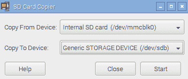

SD 卡复制程序

在继续之前，SD 卡复制器将确认您是否希望格式化和覆盖目标设备，并在有足够空间的情况下，制作您系统的克隆。

`dd` 命令同样可以用来备份卡片，如下所示：

+   对于 Linux 系统，将`sdX`替换为您的设备 ID，请使用以下命令：

```py
sudo dd if=/dev/sdX of=image.img.gz bs=1M  
```

+   对于 OS X，将 `diskX` 替换为您的设备 ID，请使用以下命令：

```py
sudo dd if=/dev/diskX of=image.img.gz bs=1M
```

+   您还可以使用 `gzip` 和 split 命令来压缩卡片的内容，并在需要时将它们分割成多个文件，以便于归档，具体操作如下：

```py
sudo dd if=/dev/sdX bs=1M | gzip -c | split -d -b 2000m - image.img.gz

```

+   要恢复分割的图像，请使用以下命令：

```py
sudo cat image.img.gz* | gzip -dc | dd of=/dev/sdX bs=1M  
```

# 通过以太网端口使用 CAT6 以太网线将你的树莓派连接到互联网进行网络连接

将 Raspberry Pi 连接到互联网最简单的方式是通过 Model B 上的内置 LAN 连接。如果你使用的是 Model A Raspberry Pi，可以使用 USB-to-LAN 转换器（有关如何配置此转换器的详细信息，请参阅 *Networking and connecting your Raspberry Pi to the internet via a USB Wi-Fi dongle* 菜单中的 *There's more...* 部分）。

# 准备就绪

您需要访问一个合适的有线网络，该网络将连接到互联网，并配备一根标准网络线（带有**RJ45**类型连接器，用于连接到树莓派）。

# 如何做到这一点...

许多网络使用**动态主机配置协议**（**DHCP**）自动连接和配置，该协议由路由器或交换机控制。如果情况如此，只需将网络线缆插入路由器或网络交换机上的一个备用网络端口（如果适用，也可以是墙壁网络插座）。

如果没有可用的 DHCP 服务器，您将不得不手动配置设置（有关详细信息，请参阅*更多内容...*部分）。

您可以通过以下步骤确认此功能是否成功运行：

1.  确保树莓派两侧的两个 LED 灯亮起（左侧的橙色 LED 表示连接，右侧的绿色 LED 通过闪烁显示活动）。这表明设备与路由器有物理连接，并且设备已通电且正在运行。

1.  使用`ping`命令测试您本地网络的链接。首先，找出网络上另一台计算机的 IP 地址（或者可能是路由器的地址，例如，通常是`192.168.0.1`或`192.168.1.254`）。现在，在树莓派终端上，使用`ping`命令（使用`-c 4`参数只发送四条消息；否则，按*Ctrl* + *C*停止）来 ping IP 地址，如下所示：

```py
sudo ping 192.168.1.254 -c 4
```

1.  按以下方式测试连接到互联网的链接（如果你通常通过代理服务器连接到互联网，则此操作将失败）：

```py
sudo ping www.raspberrypi.org -c 4

```

1.  最后，你可以通过发现以下链接回测试 Raspberry Pi。

    在树莓派上使用 `hostname -I` 查看 IP 地址。然后您可以在网络上的另一台计算机上使用 ping 命令来确保其可访问（用树莓派的 IP 地址代替[www.raspberrypi.org](https://www.raspberrypi.org/))。Windows 版本的 ping 命令将执行五次 ping 并自动停止，不需要`-c 4`选项。

如果上述测试失败，您需要检查您的连接，然后确认您网络的正确配置。

# 还有更多...

如果你经常在网络上使用你的树莓派，你不会希望每次想要连接到它时都要查找 IP 地址。

在某些网络上，您可能可以使用树莓派的计算机名而不是其 IP 地址（默认为`raspberrypi`）。为了辅助这一操作，您可能需要一些额外的软件，例如**Bonjour**，以确保网络上的计算机名正确注册。如果您使用的是 macOS X，那么 Bonjour 已经运行在您的系统上了。

在 Windows 上，您可以选择安装 iTunes（如果您还没有的话），它还包括该服务，或者您也可以单独安装（通过从 [`support.apple.com/kb/DL999`](https://support.apple.com/kb/DL999) 可用的 Apple Bonjour 安装程序）。然后您可以使用主机名，`raspberrypi` 或 `raspberrypi.local`，通过网络连接到 Raspberry Pi。如果您需要更改主机名，那么您可以使用之前显示的 Raspberry Pi 配置工具进行更改。

或者，您可能发现通过手动设置 IP 地址将 IP 地址固定为一个已知值是有帮助的。然而，请记住在连接到另一个网络时将其切换回使用 DHCP。

一些路由器还提供设置**静态 IP DHCP 地址**的选项，因此相同的地址总是分配给树莓派（具体如何设置将取决于路由器本身）。

了解你的树莓派 IP 地址或使用主机名特别有用，如果你打算使用后面描述的远程访问解决方案之一，这样可以避免需要显示器。

# 使用树莓派内置的 Wi-Fi 和蓝牙

许多家庭网络通过 Wi-Fi 提供无线网络；如果你有 Raspberry Pi 3，那么你可以利用板载的 Broadcom Wi-Fi 来连接它。Raspberry Pi 3 还支持蓝牙，因此你可以连接大多数标准蓝牙设备，并像在其他任何电脑上一样使用它们。

此方法也适用于任何支持的 USB Wi-Fi 和蓝牙设备；请参阅*通过 USB Wi-Fi 适配器连接 Raspberry Pi 到互联网的网络和连接*食谱，以获取识别设备和安装固件（如有需要）的额外帮助。

# 准备就绪

Raspbian 的最新版本包括通过图形界面快速轻松配置 Wi-Fi 和蓝牙的有用工具。

**注意**：如果您需要通过命令行配置 Wi-Fi，请参阅*通过 USB Wi-Fi 外置网卡将 Raspberry Pi 连接到互联网的网络和连接方法*以获取详细信息.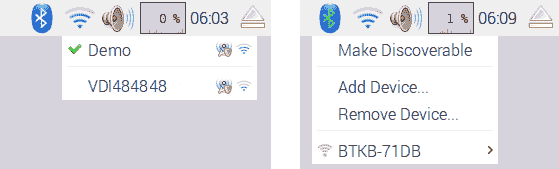

Wi-Fi 和 Bluetooth 配置应用程序

您可以使用内置的蓝牙连接无线键盘、鼠标，甚至无线扬声器。这在需要额外电缆和电线的情况下特别有用，例如在机器人项目中，或者当树莓派安装在难以触及的位置时（作为服务器或安全摄像头）。

# 如何做到...

这里提供了各种方法。

# 连接到您的 Wi-Fi 网络

要配置您的 Wi-Fi 连接，请点击网络图标以列出可用的本地 Wi-Fi 网络：

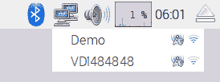

该区域可用的接入点 Wi-Fi 列表

选择所需的网络（例如，`Demo`），如果需要，请输入您的密码（也称为`预共享密钥`）：

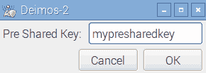

提供接入点的密码

稍微过一会儿，你应该能看到你已经连接到了网络，并且图标

将变为 Wi-Fi 符号。如果您遇到问题，请确保您有正确的密码/密钥：

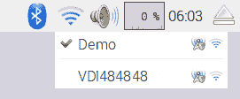

成功连接到接入点

就这样；就这么简单！

您现在可以通过使用网络浏览器访问网站或通过在终端中使用以下命令来测试您的连接并确保其正常工作：

```py
sudo ping www.raspberrypi.com
```

# 连接到蓝牙设备

首先，我们需要通过点击蓝牙图标并选择**设置为可发现**来将蓝牙设备置于可发现模式。您还需要确保您想要连接的设备设置为可发现并准备好配对；这可能会因设备而异（例如，按下配对按钮）：

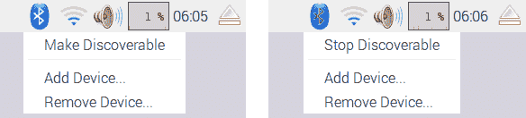

将蓝牙设置为可发现

接下来，选择**添加设备...**并选择目标设备，然后**配对**：

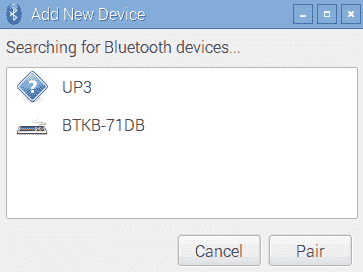

选择并配对所需的设备

然后将开始配对过程；例如，BTKB-71DB 键盘需要输入配对码`467572`到键盘上以完成配对。其他设备可能使用默认配对码，通常设置为 0000、1111、1234 或类似：


按照说明将设备与所需的配对码进行配对

一旦过程完成，设备将被列出，并且每次设备出现并启动时都会自动连接。

# 手动配置您的网络

如果您的网络中没有包含 DHCP 服务器或者它已被禁用（通常，这些功能集成在大多数现代 ADSL/电缆调制解调器或路由器中），您可能需要手动配置您的网络设置。

# 准备就绪

在开始之前，您需要确定您网络的网络设置。

您需要从路由器的设置或连接到网络的另一台计算机中找到以下信息：

+   **IPv4 地址**：此地址需要选择与网络中其他计算机相似（通常，前三个数字应匹配，即如果`子网掩码`为`255.255.255.0`，则为`192.168.1.X`），但不应已被其他计算机使用。然而，请避免使用`x.x.x.255`作为最后一个地址，因为这是保留为广播地址的。

+   **子网掩码**：这个数字决定了计算机将响应的地址范围（对于家庭网络，通常是 `255.255.255.0`，这允许最多 254 个地址）。这有时也被称为**网络掩码**。

+   **默认网关地址**：这个地址通常是您的路由器的 IP 地址，通过这个地址，计算机连接到互联网。

+   **DNS 服务器**：**域名系统**（**DNS**）服务器通过查找将名称转换为 IP 地址。通常，它们已经配置在您的路由器上，在这种情况下，您可以使用路由器的地址。或者，您的**互联网服务提供商**（**ISP**）可能提供一些地址，或者您可以使用位于地址`8.8.8.8`和`8.8.4.4`的谷歌公共 DNS 服务器。在某些系统中，这些也被称为**名称服务器**。

对于 Windows 系统，您可以通过连接互联网并运行以下命令来获取此信息：

```py
ipconfig /all  
```

定位活动连接（如果你使用有线连接，通常称为`本地连接 1`或类似名称；如果你使用 Wi-Fi，则称为无线网络连接）并查找所需信息，如下所示：

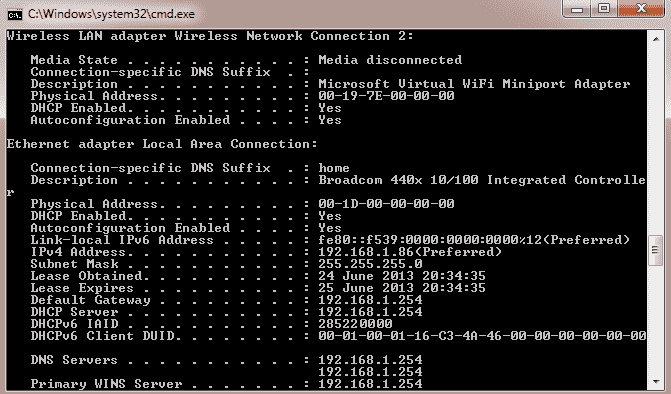

ipconfig/all 命令显示了有关您的网络设置的详细信息

对于 Linux 和 macOS X，您可以使用以下命令获取所需信息（注意，这里使用的是 `ifconfig` 而不是 `ipconfig`）：

```py
ifconfig  
```

DNS 服务器被称为 nameservers，通常列在`resolv.conf`文件中。您可以使用以下`less`命令来查看其内容（在完成查看后按 Q 键退出）:

```py
less /etc/resolv.conf  
```

# 如何做到这一点...

要设置网络接口设置，请使用编辑器编辑 `/etc/network/interfaces` 文件。

以下代码：

```py
sudo nano /etc/network/interfaces  
```

现在执行以下步骤：

1.  我们可以为我们的特定网络添加详细信息，包括我们想要分配给它的 IP`地址`号、网络的`子网掩码`地址以及`网关`地址，如下所示：

```py
iface eth0 inet static
 address 192.168.1.10
 netmask 255.255.255.0
 gateway 192.168.1.254

```

1.  通过按 *Ctrl* + *X*，*Y* 和 *Enter* 来保存并退出。

1.  要设置 DNS 的名称服务器，请使用以下代码编辑`/etc/resolv.conf`：

```py
sudo nano /etc/resolv.conf

```

1.  按照以下步骤添加您的 DNS 服务器地址：

```py
nameserver 8.8.8.8
nameserver 8.8.4.4  
```

1.  通过按 *Ctrl* + *X*，*Y* 和 *Enter* 来保存并退出。

# 还有更多...

您可以通过编辑`BOOT`分区中的`cmdline.txt`来配置网络设置，并使用`ip`将设置添加到启动命令行中。

`ip`选项采用以下形式：

```py
ip=client-ip:nfsserver-ip:gw-ip:netmask:hostname:device:autoconf  
```

+   `client-ip`选项是你想要分配给树莓派的 IP 地址

+   `gw-ip`选项将在需要手动设置时设置网关服务器地址

+   `netmask`选项将直接设置网络的`netmask`

+   `hostname`选项将允许您更改默认的`raspberrypi`主机名

+   `device`选项允许您在存在多个网络设备的情况下指定默认网络设备

+   `autoconf`选项允许自动配置功能开启或关闭

# 直接连接到笔记本电脑或计算机

可以使用一根网络线直接将 Raspberry Pi 的 LAN 端口连接到笔记本电脑或计算机。这将在这两台计算机之间创建一个本地网络连接，允许你完成所有在连接到普通网络时可以做的事情，无需使用集线器或路由器，包括连接到互联网，如果使用**互联网连接共享**（**ICS**），则操作如下：

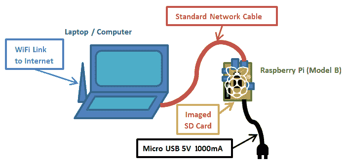

利用树莓派，只需一根网线、一张标准镜像 SD 卡和电源即可。

ICS 允许 Raspberry Pi 通过另一台计算机连接到互联网。然而，为了计算机能够通过该链路进行通信，需要进行一些额外的配置，因为 Raspberry Pi 不会自动分配自己的 IP 地址。

我们将使用 ICS 来共享来自另一个网络连接的连接，例如笔记本电脑上的内置 Wi-Fi。或者，如果不需要互联网或计算机只有一个网络适配器，我们可以使用直接网络连接（参考“更多...”部分下的“直接网络连接”章节）。

尽管这个设置应该适用于大多数电脑，但有些设置比其他设置更困难。有关更多信息，请参阅[www.pihardware.com/guides/direct-network-connection](http://www.pihardware.com/guides/direct-network-connection)。

# 准备就绪

您需要配备电源和标准网络线的树莓派。

树莓派 B 型 LAN 芯片包括**Auto-MDIX**（**自动中继器依赖接口交叉**）。无需使用专用交叉线缆（一种特殊布线的网络线缆，使得发送线连接到接收线以实现直接网络连接），芯片将自动决定并更改所需的设置。

拥有一个键盘和显示器进行额外的测试也可能很有帮助，尤其是如果你这是第一次尝试这样做。

为了确保您能够将网络设置恢复到原始值，您应该检查它是否具有固定 IP 地址或网络是否已自动配置。

要检查 Windows 10 的网络设置，请执行以下步骤：

1.  从开始菜单打开设置，然后选择网络和互联网，接着选择以太网，并在相关设置列表中点击更改适配器选项。

要检查 Windows 7 和 Vista 上的网络设置，请执行以下步骤：

1.  从控制面板打开网络和共享中心，然后点击左侧的更改适配器设置。

1.  要检查 Windows XP 上的网络设置，请从控制面板打开网络连接。

1.  找到与您的有线网络适配器相关的项目（默认情况下，这通常被称为以太网或本地连接，如下面的截图所示）：

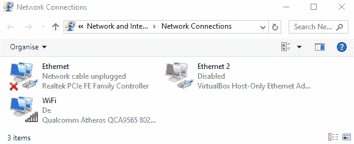

定位您的有线网络连接

1.  右键单击其图标并点击属性。将出现一个对话框，如图所示：

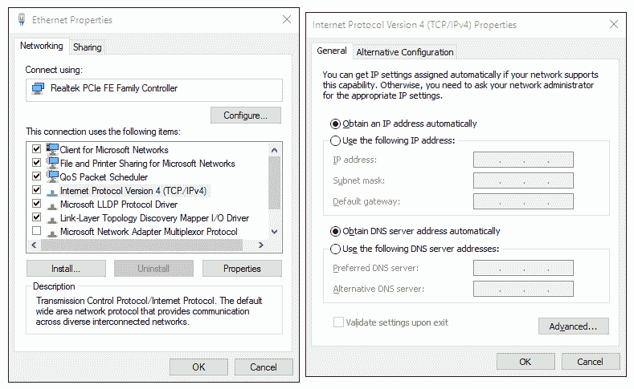

选择 TCP/IP 属性并检查设置

1.  如果存在两个版本（另一个是版本 6），请选择名为“互联网协议（TCP/IP）”或“互联网协议版本 4（TCP/IPv4）”的选项，然后点击“属性”按钮。

1.  您可以通过使用自动设置或指定 IP 地址（如果是这样，请注意此地址和剩余的详细信息，因为您可能希望在以后某个时间点恢复设置）来确认您的网络设置。

要检查 Linux 上的网络设置，请执行以下步骤：

1.  打开网络设置对话框并选择配置接口。请参考以下截图：

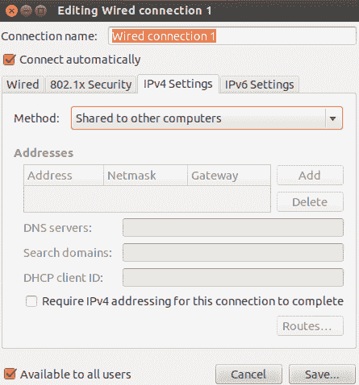

Linux 网络设置对话框

1.  如果有任何设置是手动设置的，请确保你记下它们，以便你以后想要时可以恢复。

要检查 macOS X 上的网络设置，请执行以下步骤：

1.  打开系统偏好设置并点击网络。然后你可以确认 IP 地址是否是自动分配的（使用 DHCP）。

1.  确保如果手动设置了任何设置，您要记下它们，以便您以后想要时可以恢复。请参考以下截图：

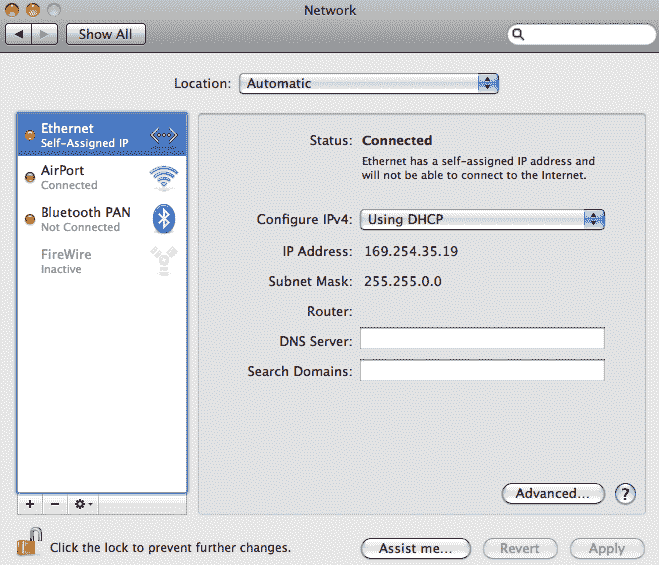

OS X 网络设置对话框

如果你只需要在没有互联网连接的情况下访问或控制树莓派，请参考“更多内容...”部分中的“*直接网络链接*”部分。

# 如何做到这一点...

首先，我们需要在我们的网络设备上启用 ICS。在这种情况下，我们将通过以太网连接到树莓派，通过无线网络连接共享互联网。

对于 Windows 系统，请按照以下步骤操作：

1.  返回到网络适配器列表，右键点击连接到

    连接到互联网（在这种情况下，是 WiFi 或无线网络连接设备），然后点击属性：

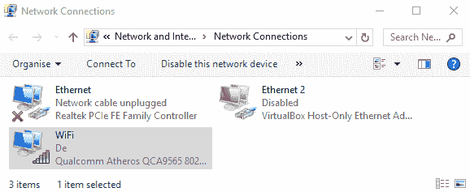

定位您的有线网络连接

1.  在窗口顶部，选择第二个标签页（在 Windows XP 中，它被称为高级；在 Windows 7 和 Windows 10 中，它被称为共享），如下截图所示：

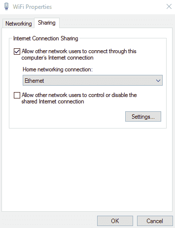

选择 TCP/IP 属性并记录分配的 IP 地址

1.  在“互联网连接共享”部分，勾选允许其他网络用户通过此计算机的互联网连接进行连接（如果存在，请使用下拉框选择家庭网络连接选项：以太网或局域网连接）。点击“确定”并确认您之前是否已为局域网连接设置了固定的 IP 地址。

对于 macOS X，要启用 ICS，请执行以下步骤：

1.  点击系统偏好设置，然后点击共享。

1.  点击“互联网共享”，然后选择我们想要共享互联网的连接（在这种情况下，将是 Wi-Fi AirPort）。然后选择我们将连接树莓派的连接（在这种情况下，是以太网）。

要在 Linux 上启用 ICS，请执行以下步骤：

1.  从系统菜单中，点击“首选项”然后点击“网络连接”。选择您想要共享的连接（在本例中为无线连接）并点击“编辑”或“配置”。在 IPv4 设置选项卡中，将方法选项更改为“共享给其他计算机”。

网络适配器的 IP 地址将是 Raspberry Pi 上使用的**网关 IP**地址，并将分配在同一范围内的 IP 地址（除了最后一位数字，其他都会匹配）。例如，如果电脑的有线连接现在是`192.168.137.1`，Raspberry Pi 的网关 IP 将是`192.168.137.1`，其自身的 IP 地址可能设置为`192.168.137.10`。

幸运的是，由于操作系统的更新，Raspbian 现在将自动分配一个合适的 IP 地址以加入网络，并适当地设置网关。然而，除非我们将屏幕连接到 Raspberry Pi 或在我们的网络上扫描设备，否则我们不知道 Raspberry PI 给自己分配了什么 IP 地址。

幸运的是（如*There's more...*部分中提到的*通过 LAN 连接器将 Raspberry Pi 连接到互联网的联网和连接*菜谱中所述），苹果的**Bonjour**软件将自动确保网络上的主机名正确注册。如前所述，如果您有 Mac OS X，您已经运行了 Bonjour。在 Windows 上，您可以选择安装 iTunes，或者您可以单独安装它（可从[`support.apple.com/kb/DL999`](https://support.apple.com/kb/DL999)获取）。默认情况下，可以使用主机名**raspberrypi**。

我们现在准备测试新的连接，如下所示：

1.  将网络线连接到树莓派和电脑的网络端口，然后开启树莓派，确保如果之前已经取出 SD 卡，请重新插入。若您在树莓派上编辑了文件，要重启树莓派，请使用`sudo reboot`命令来重启。

1.  给予 Raspberry Pi 一分钟或两分钟的时间来完全启动。我们现在可以测试连接了。

1.  从连接的笔记本电脑或计算机，通过使用 Raspberry Pi 的主机名进行 ping 测试以检查连接，如下所示命令（在 Linux 或 OS X 上，添加`-c 4`以限制为四条消息或按 Ctrl + C 退出）:

```py
ping raspberrypi  
```

希望你能找到一个有效的连接并收到回复

树莓派

如果你将键盘和屏幕连接到树莓派，你就可以执行

以下步骤：

1.  您可以从树莓派终端以如下方式 ping 回电脑（例如，`192.168.137.1`）：

```py
sudo ping 192.168.137.1 -c 4  
```

1.  您可以通过使用 `ping` 命令连接到知名网站来测试互联网链接，如下所示，前提是您不是通过代理服务器访问互联网：

```py
sudo ping www.raspberrypi.org -c 4  
```

如果一切顺利，你将通过电脑将完整的互联网连接到树莓派，让你能够浏览网页以及更新和安装新的软件。

如果连接失败，请执行以下步骤：

1.  重复此过程，确保前三个数字与树莓派和网络适配器的 IP 地址相匹配。

1.  您还可以使用以下命令检查当树莓派启动时，是否正在设置正确的 IP 地址：

```py
hostname -I  
```

1.  检查您的防火墙设置以确保防火墙没有阻止内部网络连接。

# 它是如何工作的...

当我们在主计算机上启用 ICS 时，操作系统将自动为计算机分配一个新的 IP 地址。一旦连接并启动，树莓派将自动设置到一个兼容的 IP 地址，并使用主计算机的 IP 地址作为互联网网关。

通过使用 Apple Bonjour，我们可以使用`raspberrypi`主机名从连接的计算机连接到 Raspberry Pi。

最后，我们检查计算机是否可以通过直接网络链路与树莓派通信，反过来，也能连接到互联网。

# 还有更多...

如果您不需要在树莓派上使用互联网，或者您的电脑只有一个网络适配器，您仍然可以通过直接网络链接将计算机连接在一起。请参考以下图示：

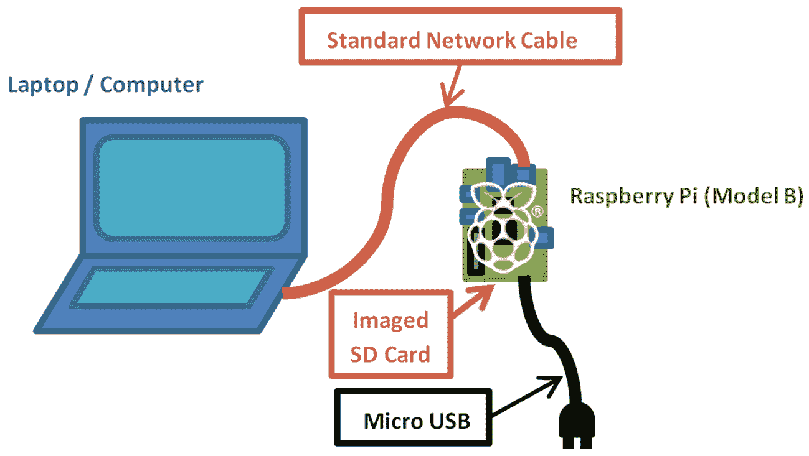

仅使用网线、标准镜像 SD 卡和电源即可连接和使用 Raspberry Pi

# 直接网络链接

要在两台计算机之间建立网络链接，它们需要使用相同的地址范围。允许的地址范围由子网掩码确定（例如，`255.255.0.0` 或 `255.255.255.0` 表示除了最后两个或仅最后一位以外的所有 IP 地址都应该相同；否则，它们将被过滤）。

要使用直接链接而不启用 ICS，请检查您所使用的适配器的 IP 设置。

将要连接到并确定它是否自动分配或固定到

特定 IP 地址。

大多数直接连接到另一台计算机的 PC 将分配一个在`169.254.X.X`范围内的 IP 地址（子网掩码为`255.255.0.0`）。然而，我们必须确保网络适配器设置为自动获取 IP 地址。

为了让树莓派能够通过直接链接进行通信，它需要拥有与同一地址范围内的 IP 地址，即`169.254.X.X`。如前所述，树莓派会自动为自己分配一个合适的 IP 地址并连接到网络。

因此，假设我们已经有了之前提到的 Apple Bonjour，我们只需要知道分配给 Raspberry Pi 的主机名（`raspberrypi`）。

# 参见

如果你的 Raspberry Pi 没有连接键盘或屏幕，你可以使用这个网络链接远程访问 Raspberry Pi，就像在普通网络上一样（只需使用你为连接设置的新的 IP 地址）。请参考 *通过 VNC 网络远程连接到 Raspberry Pi* 和 *通过 SSH（以及 X11 转发）网络远程连接到 Raspberry Pi* 的食谱。

在我的网站上提供了大量额外信息，[`pihw.wordpress.com/guides/direct-network-connection`](https://pihw.wordpress.com/guides/direct-network-connection)，包括额外的故障排除技巧以及几种无需专用屏幕和键盘即可连接到您的树莓派的其他方法。

# 通过 USB Wi-Fi 网卡将你的树莓派连接到互联网进行网络连接

通过将**USB Wi-Fi 拓展卡**插入树莓派的 USB 端口，即使是没有内置 Wi-Fi 的型号也能连接并使用 Wi-Fi 网络。

# 准备就绪

您需要获取一个合适的 USB Wi-Fi 网卡，在某些情况下，您可能还需要一个带电的 USB 集线器（这取决于您所拥有的树莓派硬件版本以及电源的质量）。USB Wi-Fi 网卡的一般适用性将根据内部使用的芯片组和可用的 Linux 支持水平而有所不同。您可能会发现某些 USB Wi-Fi 网卡无需安装额外的驱动程序即可工作（在这种情况下，您可以跳转到配置无线网络）。

支持的 Wi-Fi 网卡列表可在 [`elinux.org/RPi_USB_Wi-Fi_Adapters`](http://elinux.org/RPi_USB_Wi-Fi_Adapters) 查找。

您需要确保您的 Wi-Fi 适配器也兼容您打算使用的网络；例如，它支持相同的信号类型 **802.11bgn** 以及加密方式 **WEP**、**WPA** 和 **WPA2**（尽管大多数网络都向后兼容）。

您还需要以下网络详细信息：

+   **服务集标识符 (SSID)**: 这是您 Wi-Fi 网络的名称，如果您使用以下命令，它应该可见：

```py
sudo iwlist scan | grep SSID  
```

+   **加密类型和密钥**：此值将为 None、WEP、WPA 或 WPA2，密钥将是您连接手机或笔记本电脑到无线网络时通常输入的代码（有时，它打印在路由器上）。

您需要稳定的互联网连接（即有线以太网）来下载所需的驱动程序。否则，您可能能够找到所需的固件文件（它们将是`.deb`文件）并将它们复制到树莓派上（即通过 USB 闪存驱动器；如果您在桌面模式下运行，驱动器应会自动挂载）。将文件复制到合适的位置，并使用以下命令进行安装：

```py
sudo apt-get install firmware_file.deb  
```

# 如何做到这一点...

这个任务分为两个阶段：首先，我们需要识别并安装 Wi-Fi 适配器的固件，然后我们需要为无线网络进行配置。

我们将尝试识别您的 Wi-Fi 适配器芯片组（处理连接的部分）；这可能与设备的实际制造商不匹配。

可以使用以下命令找到支持的固件的大致列表：

```py
sudo apt-cache search wireless firmware  
```

这将产生类似于以下输出的结果（忽略任何包标题中不包含`firmware`的结果）：

```py
atmel-firmware - Firmware for Atmel at76c50x wireless networking chips.
firmware-atheros - Binary firmware for Atheros wireless cards
firmware-brcm80211 - Binary firmware for Broadcom 802.11 wireless cards
firmware-ipw2x00 - Binary firmware for Intel Pro Wireless 2100, 2200 and 2915
firmware-iwlwifi - Binary firmware for Intel PRO/Wireless 3945 and 802.11n cards
firmware-libertas - Binary firmware for Marvell Libertas 8xxx wireless cards
firmware-ralink - Binary firmware for Ralink wireless cards
firmware-realtek - Binary firmware for Realtek wired and wireless network adapters
libertas-firmware - Firmware for Marvell's libertas wireless chip series (dummy package)
zd1211-firmware - Firmware images for the zd1211rw wireless driver  
```

要找出无线适配器的芯片组，请将 Wi-Fi 适配器插入树莓派，然后在终端中运行以下命令：

```py
dmesg | grep 'Product:|Manufacturer:'
```

此命令将两个命令合并为一个。首先，`dmesg` 显示内核的消息缓冲区（这是自开机以来发生的系统事件的内部记录，例如检测到的 USB 设备）。您可以单独尝试此命令以观察完整的输出。

`|`（管道符）将输出发送到`grep`命令；`grep 'Product:|Manufacturer'`进行检查，并且只返回包含`Product`或`Manufacturer`的行（因此我们应该得到任何列出的作为`Product`和`Manufacturer`的项目的摘要）。如果你没有找到任何内容或者想要查看所有 USB 设备，尝试使用`grep 'usb'`命令代替。

这应该返回类似于以下输出结果——在这种情况下，我有一个`ZyXEL`设备，它有一个`ZyDAS`芯片组（快速谷歌搜索显示`zd1211-firmware`是用于`ZyDAS`设备的）：

```py
[    1.893367] usb usb1: Product: DWC OTG Controller
[    1.900217] usb usb1: Manufacturer: Linux 3.6.11+ dwc_otg_hcd
[    3.348259] usb 1-1.2: Product: ZyXEL G-202
[    3.355062] usb 1-1.2: Manufacturer: ZyDAS  
```

一旦你已识别出你的设备和正确的固件，你可以像安装任何其他通过 `apt-get` 可用的软件包（其中 `zd1211-firmware` 可以替换为你所需的固件）一样进行安装。这可以通过以下命令展示：

```py
sudo apt-get install zd1211-firmware  
```

移除并重新插入 USB Wi-Fi 网卡，以便检测到它并加载驱动程序。现在我们可以使用`ifconfig`测试新适配器是否正确安装。输出如下：

```py
wlan0     IEEE 802.11bg  ESSID:off/any
 Mode:Managed  Access Point: Not-Associated   Tx-Power=20 dBm
 Retry  long limit:7   RTS thr:off   Fragment thr:off
 Power Management:off  
```

该命令将显示系统上存在的网络适配器。对于 Wi-Fi，这通常是`wlan0`或`wlan1`等，如果你安装了多个，则依次类推。如果没有，请仔细检查所选固件，或许可以尝试一个替代方案或查看网站上的故障排除技巧。

一旦我们为 Wi-Fi 适配器安装了固件，我们就需要将其配置为我们想要连接的网络。我们可以使用如图前一个菜谱中所示的用户界面，或者我们可以通过以下步骤手动在终端中配置它：

1.  我们需要将无线适配器添加到网络接口列表中，该列表设置在 `/etc/network/interfaces` 文件中，具体如下：

```py
sudo nano -c /etc/network/interfaces   
```

如有需要，使用之前的 `wlan#` 值代替 `wlan0`，然后添加以下命令：

```py
allow-hotplug wlan0
iface wlan0 inet manual
wpa-conf /etc/wpa_supplicant/wpa_supplicant.conf  
```

当更改完成后，通过按下 *Ctrl* + *X*，*Y* 和 *Enter* 来保存并退出。

1.  我们现在将把我们的网络 Wi-Fi 设置存储在`wpa_supplicant.conf`文件中（如果你的网络不使用`wpa`加密，请不要担心；这只是文件的默认名称）：

```py
sudo nano -c /etc/wpa_supplicant/wpa_supplicant.conf  
```

应包括以下内容：

```py
ctrl_interface=DIR=/var/run/wpa_supplicant GROUP=netdev 
update_config=1 
country=GB 
```

网络设置可以按照以下方式写入此文件（即，如果 SSID 设置为`theSSID`）：

+   +   如果没有使用加密，请使用以下代码：

```py
network={ 
  ssid="theSSID" 
  key_mgmt=NONE 
} 
```

+   +   使用`WEP`加密（即，如果将`WEP`密钥设置为`theWEPkey`），请使用以下代码：

```py
network={ 
  ssid="theSSID" 
  key_mgmt=NONE 
  wep_key0="theWEPkey" 
} 
```

+   +   对于 `WPA` 或 `WPA2` 加密（即，如果将 `WPA` 密钥设置为 `theWPAkey`），请使用以下代码：

```py
network={ 
  ssid="theSSID" 
  key_mgmt=WPA-PSK 
  psk="theWPAkey"     
} 
```

1.  您可以使用以下命令启用适配器（再次提醒，如果需要，请将`wlan0`替换为相应的接口名称）：

```py
sudo ifup wlan0

```

使用以下命令来列出无线网络连接：

```py
iwconfig

```

您应该看到您的无线网络已连接，并且您的 SSID 列在以下内容中：

```py
wlan0     IEEE 802.11bg  ESSID:"theSSID"
 Mode:Managed  Frequency:2.442 GHz  Access Point: 
       00:24:BB:FF:FF:FF
 Bit Rate=48 Mb/s   Tx-Power=20 dBm
 Retry  long limit:7   RTS thr:off   Fragment thr:off
 Power Management:off
 Link Quality=32/100  Signal level=32/100
 Rx invalid nwid:0  Rx invalid crypt:0  Rx invalid frag:0
 Tx excessive retries:0  Invalid misc:15   Missed beacon:0  
```

如果不是，请调整您的设置，并使用 `sudo ifdown wlan0` 来关闭网络接口，然后使用 `sudo ifup wlan0` 来重新开启它。这将确认您已成功连接到您的 Wi-Fi 网络。

1.  最后，我们需要检查我们是否有互联网访问权限。在这里，我们假设网络已通过 DHCP 自动配置，并且没有使用代理服务器。如果没有，请参考*通过代理服务器连接互联网*的步骤。

断开有线网络线缆，如果尚未断开，请尝试 ping Raspberry Pi 网站，操作如下：

```py
**sudo ping** www.raspberrypi.org  
```

如果你想快速了解当前 Raspberry Pi 正在使用的 IP 地址，可以使用`hostname -I`，或者要找出哪个适配器连接到了哪个 IP 地址，可以使用`ifconfig`。

# 还有更多...

Raspberry Pi 的 Model A 版本没有内置网络端口，因此要获取网络连接，必须添加一个 USB 网络适配器（要么是一个 Wi-Fi 外置设备，如前文所述，要么是一个 LAN 到 USB 适配器，如下文所述）。

# 使用 USB 有线网络适配器

就像 USB Wi-Fi 一样，适配器的支持将取决于所使用的芯片组和可用的驱动程序。除非设备自带 Linux 驱动程序，否则你可能需要在网上搜索以获取合适的 Debian Linux 驱动程序。

如果你找到一个合适的 `.deb` 文件，你可以使用以下命令进行安装：

```py
sudo apt-get install firmware_file.deb  
```

此外，使用 `ifconfig` 进行检查，因为某些设备将自动支持，显示为 `eth1`（或 Model A 上的 `eth0`），并立即准备好使用。

# 通过代理服务器连接到互联网

一些网络，例如工作场所或学校内的网络，通常要求您通过代理服务器连接到互联网。

# 准备就绪

您将需要连接到的代理服务器的地址，包括用户名和密码（如果需要的话）。

您应确认树莓派已经连接到网络，并且可以访问代理服务器。

使用`ping`命令来检查，如下所示：

```py
ping proxy.address.com -c 4  
```

如果这失败了（没有收到回复），在继续之前，你需要确保你的网络设置是正确的。

# 如何做到这一点...

1.  使用 `nano` 创建一个新文件，方法如下（如果文件中已有内容，您可以将代码添加到末尾）：

```py
sudo nano -c ~/.bash_profile
```

1.  要在使用代理服务器的同时通过程序如**Midori**进行基本的网页浏览，你可以使用以下脚本：

```py
function proxyenable { 
# Define proxy settings 
PROXY_ADDR="proxy.address.com:port" 
# Login name (leave blank if not required): 
LOGIN_USER="login_name" 
# Login Password (leave blank to prompt): 
LOGIN_PWD= 
#If login specified - check for password 
if [[ -z $LOGIN_USER ]]; then 
  #No login for proxy 
  PROXY_FULL=$PROXY_ADDR 
else 
  #Login needed for proxy Prompt for password -s option hides input 
  if [[ -z $LOGIN_PWD ]]; then 
    read -s -p "Provide proxy password (then Enter):" LOGIN_PWD 
    echo 
  fi 
  PROXY_FULL=$LOGIN_USER:$LOGIN_PWD@$PROXY_ADDR 
fi 
#Web Proxy Enable: http_proxy or HTTP_PROXY environment variables 
export http_proxy="http://$PROXY_FULL/" 
export HTTP_PROXY=$http_proxy 
export https_proxy="https://$PROXY_FULL/" 
export HTTPS_PROXY=$https_proxy 
export ftp_proxy="ftp://$PROXY_FULL/" 
export FTP_PROXY=$ftp_proxy 
#Set proxy for apt-get 
sudo cat <<EOF | sudo tee /etc/apt/apt.conf.d/80proxy > /dev/null 
Acquire::http::proxy "http://$PROXY_FULL/"; 
Acquire::ftp::proxy "ftp://$PROXY_FULL/"; 
Acquire::https::proxy "https://$PROXY_FULL/"; 
EOF 
#Remove info no longer needed from environment 
unset LOGIN_USER LOGIN_PWD PROXY_ADDR PROXY_FULL 
echo Proxy Enabled 
} 

function proxydisable { 
#Disable proxy values, apt-get and git settings 
unset http_proxy HTTP_PROXY https_proxy HTTPS_PROXY 
unset ftp_proxy FTP_PROXY 
sudo rm /etc/apt/apt.conf.d/80proxy 
echo Proxy Disabled 
} 
```

1.  完成后，通过按*Ctrl* + *X*，*Y*，和*Enter*键保存并退出。

脚本被添加到用户的个人 `.bash_profile` 文件中，该文件在特定用户登录时运行。这将确保每个用户的代理设置是分开的。如果您希望所有用户使用相同的设置，可以将代码添加到 `/etc/rc.local` 文件中代替（此文件必须在末尾有 `exit 0`）。

# 它是如何工作的...

许多利用互联网的程序在连接之前会检查`http_proxy`或`HTTP_PROXY`环境变量。如果它们存在，它们将使用代理设置进行连接。一些程序也可能使用`HTTPS`和`FTP`协议，因此我们也可以在这里为它们设置代理设置。

如果代理服务器需要用户名，将会提示输入密码。通常不建议将密码存储在脚本中，除非你确信没有其他人能够访问你的设备（无论是通过物理方式还是通过互联网）。

最后部分允许使用 `sudo` 命令执行的所有程序使用代理

在以超级用户身份操作时（大多数程序都会尝试访问

首先使用普通权限的网络，即使以超级用户身份运行，因此它不是

总是需要的)。

# 还有更多...

我们还需要允许某些程序使用代理设置，这些程序在访问网络时使用超级用户权限（这取决于程序；大多数不需要这样做）。我们需要按照以下步骤将命令添加到存储在 `/etc/sudoers.d/` 的文件中：

1.  使用以下命令来打开一个新的`sudoer`文件：

```py
sudo visudo -f /etc/sudoers.d/proxy  
```

1.  在文件中输入以下文本（在同一行上）：

```py
Defaults env_keep += "http_proxy HTTP_PROXY https_proxy HTTPS_PROXY ftp_proxy FTP_PROXY"  
```

1.  完成后，通过按*Ctrl* + *X*，*Y*，和*Enter*键保存并退出；不要更改`proxy.tmp`文件名（这在`visudo`中是正常的；完成后它会将其更改为 proxy）。

1.  如果提示“现在怎么办？”，说明命令中存在错误。按*X*键退出而不保存并重新输入命令。

1.  重启（使用 `sudo reboot`）后，您可以使用以下命令分别启用和禁用代理：

```py
proxyenable
proxydisable  
```

在这里使用 `visudo` 非常重要，因为它确保了文件权限被正确创建，以便 `sudoers` 目录（仅由 `root` 用户读取）。

# 通过 VNC 在网络上远程连接到 Raspberry Pi

通常，通过网络远程连接和控制树莓派更为可取，例如，使用笔记本电脑或台式计算机作为屏幕和键盘，或者当树莓派连接到其他地方时，也许甚至连接到它需要靠近的某些硬件。

VNC 是您远程连接到树莓派的一种方式。它将创建一个新的桌面会话，该会话将通过远程进行控制和访问。这里的 VNC 会话与可能正在树莓派显示屏上激活的会话是分开的。

# 准备就绪

确保您的树莓派已开启电源并连接到互联网。我们将使用互联网连接来使用 `apt-get` 安装程序。这是一个允许我们从官方仓库直接查找和安装应用程序的程序。

# 如何做到这一点...

1.  首先，我们需要在树莓派上使用以下命令安装 TightVNC 服务器。建议首先运行一个 `update` 命令，以获取您要安装的软件包的最新版本，如下所示：

```py
sudo apt-get update
sudo apt-get install tightvncserver  
```

1.  接受提示进行安装并等待其完成。要开始一个会话，请使用以下命令：

```py
vncserver :1  
```

1.  第一次运行此程序时，它会要求您输入一个密码（不超过八个字符），以便访问桌面（您将在从您的电脑连接时使用此密码）。

以下信息应确认已启动新的桌面会话：

```py
New 'X' desktop is raspberrypi:1  
```

如果你还没有知道树莓派的 IP 地址，请使用`hostname -I`并记下它。

接下来，我们需要运行一个 VNC 客户端。**VNC Viewer**是一个合适的程序，可以在[`www.realvnc.com/`](http://www.realvnc.com/)找到，并且应该在 Windows、Linux 和 OS X 上都能运行。

当你运行 VNC Viewer 时，系统会提示你输入服务器地址和加密类型。请使用你的 Raspberry Pi 的 IP 地址，并在其后加上`:1`。也就是说，对于 IP 地址`192.168.1.69`，请使用`192.168.1.69:1`这个地址。

您可以将加密类型设置为关闭或自动。

根据您的网络设置，您可能可以使用主机名；默认值为 `raspberrypi`，即 `raspberrypi:1`。

你可能会收到关于之前未连接到电脑或没有加密的警告。如果你正在使用公共网络或者在进行互联网连接（为了阻止他人截取你的数据），你应该启用加密。

# 还有更多...

您可以在命令行中添加选项来指定分辨率以及显示的颜色深度。分辨率和颜色深度越高（可以调整到每像素 8 位到 32 位以提供低或高颜色细节），通过网络链路传输的数据就越多。如果您觉得刷新率有点慢，可以尝试按照以下方式减小这些数值：

```py
vncserver :1 -geometry 1280x780 -depth 24  
```

为了在开机时自动启动 VNC 服务器，你可以将 `vncserver` 命令添加到 `.bash_profile` 文件中（每次 Raspberry Pi 启动时都会执行此文件）。

按以下方式使用 `nano` 编辑器（`-c` 选项允许显示行号）：

```py
sudo nano -c ~/.bash_profile  
```

将以下行添加到文件末尾：

```py
vncserver :1  
```

下次开机时，您应该能够通过 VNC 远程连接

另一台计算机。

# 通过 SSH（以及 X11 转发）远程连接到 Raspberry Pi 网络

**安全外壳**（**SSH**）通常是建立远程连接的首选方法，因为它只允许终端连接，并且通常需要更少的资源。

SSH 的一个额外功能是将**X11**数据传输到运行在您机器上的**X Windows**服务器。这使得您能够启动通常在树莓派桌面上运行的程序，并且它们将出现在本地计算机上的独立窗口中，如下所示：


在本地显示上启用 X11 转发

X11 转发可用于在 Windows 计算机上显示运行在树莓派上的应用程序。

# 准备就绪

如果你正在运行最新的 Raspbian 版本，SSH 和 X11 转发将默认启用（否则，请检查 *如何工作...* 部分中解释的设置）。

# 如何做到这一点...

Linux 和 OS X 内置了对 X11 转发的支持，但如果你使用的是 Windows，你将需要在你的计算机上安装并运行 X Windows 服务器。

从**Xming**网站下载并运行`xming`([`sourceforge.net/projects/xming/`](http://sourceforge.net/projects/xming/)).

安装 `xming`，按照安装步骤进行，包括如果你还没有的话，安装**PuTTY**。你也可以从[`www.putty.org/`](http://www.putty.org/)单独下载 PuTTY。

接下来，我们需要确保在我们连接时，我们使用的 SSH 程序已启用 X11。

对于 Windows 系统，我们将使用 PuTTY 连接到树莓派。

在 PuTTY 配置对话框中，导航到连接 | SSH | X11 并勾选启用 X11 转发的复选框。如果您留空 X 显示位置选项，它将默认为 `Server 0:0`，如下所示（您可以通过在 Xming 运行时将鼠标移至系统托盘中的 Xming 图标来确认服务器编号）:

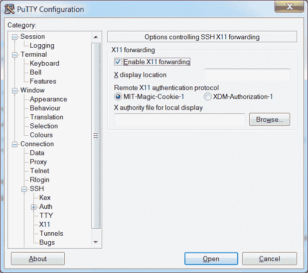

在 PuTTY 配置中启用 X11 转发

在会话设置中输入 Raspberry Pi 的 IP 地址（你也许会发现这里也可以使用 Raspberry Pi 的主机名；默认主机名为`raspberrypi`）。

使用合适的名称，例如`RaspberryPi`，保存设置，然后点击“打开”以连接到您的 Raspberry Pi。

你可能会看到一个警告信息弹出，提示你之前尚未连接到电脑（这允许你在继续之前检查你是否一切都设置正确）：

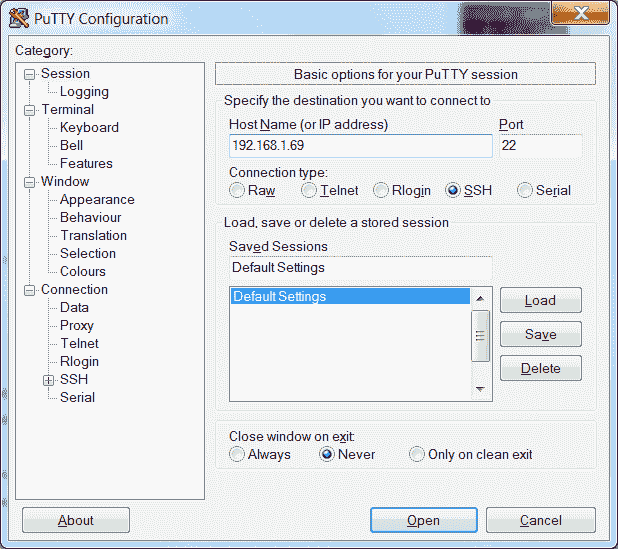

使用 PuTTY 打开到 Raspberry Pi 的 SSH 连接

对于 OS X 或 Linux，点击“终端”以打开与树莓派的连接。

要连接到默认的`pi`用户名，IP 地址为`192.168.1.69`，请使用以下命令；`-X`选项启用 X11 转发：

```py
ssh -X pi@192.168.1.69  
```

如果一切顺利，你应该会看到一个要求输入密码的提示（记住`pi`用户的默认密码是`raspberry`）。

确保 Xming 正在运行，通过从您的计算机开始菜单启动 Xming 程序。然后，在终端窗口中，输入通常在树莓派桌面中运行的程序，例如`leafpad`或`scratch`。稍等片刻，程序应该会出现在您的计算机桌面上（如果您收到错误，您可能忘记启动 Xming，所以请运行它并再次尝试）。

# 它是如何工作的...

X Windows 和 X11 是提供方法，使得树莓派（以及许多其他基于 Linux 的计算机）能够作为桌面的一部分显示和控制图形窗口。

要在网络连接上使 X11 转发工作，我们需要在 Raspberry Pi 上同时启用 SSH 和 X11 转发。执行以下步骤：

1.  要开启（或关闭）SSH，您可以访问树莓派配置

    在桌面上的“首选项”菜单下选择程序，然后在“接口”标签中点击 SSH，如图所示（SSH 通常在大多数发行版中默认启用，以帮助允许无需监视器即可配置的远程连接）：

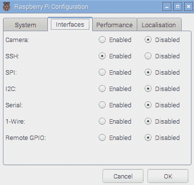

raspi-config 工具中的高级设置菜单

1.  确保在树莓派上启用 X11 转发（再次强调，现在大多数发行版默认已启用此功能）。

1.  使用以下命令与`nano`配合：

```py
sudo nano /etc/ssh/sshd_config  
```

1.  在 `/etc/ssh/sshd_config` 文件中查找控制 X11 转发的行，并确保它显示为 `yes`（前面没有 `#` 符号），如下所示：

```py
X11Forwarding yes  
```

1.  如有需要，请按 *Ctrl* + *X*，*Y* 和 *Enter* 保存，并根据需要（如果需要更改）按照以下步骤重新启动：

```py
sudo reboot  
```

# 还有更多...

SSH 和 X11 转发是远程控制树莓派的一种便捷方式；我们将在接下来的章节中探讨一些如何有效使用它的额外技巧。

# 使用 X11 转发运行多个程序

如果你想要运行一个**X 程序**，同时还能使用相同的终端控制台进行其他操作，你可以通过以下方式在后台运行命令，使用`&`符号：

```py
leafpad &  
```

只需记住，你运行的程序越多，一切都会变得越慢。你可以通过输入`fg`来切换到后台程序，并使用`bg`来检查后台任务。

# 以桌面形式运行并启用 X11 转发

您甚至可以通过 X11 运行一个完整的桌面会话，尽管这并不是特别

用户友好且 VNC 将产生更好的结果。为了实现这一点，您必须使用`lxsession`而不是`startx`（以您通常从终端启动桌面的方式）。

另一个选择是使用 `lxpanel`，它提供了一个程序菜单栏，您可以从菜单中启动和运行程序，就像在桌面上一样。

# 在 X11 转发下运行 Pygame 和 Tkinter

当运行 **Pygame** 或 **Tkinter** 脚本时，可能会遇到以下（或类似）错误：

```py
_tkinter.TclError: couldn't connect to display "localhost:10.0"  
```

在此情况下，使用以下命令来修复错误：

```py
sudo cp ~/.Xauthority ~root/ 
```

# 将树莓派的主文件夹通过 SMB 共享

当你的树莓派连接到网络时，你可以通过设置文件共享来访问家庭文件夹；这使得文件传输变得容易得多，同时也提供了一个快速简便的方法来备份你的数据。**服务器消息块**（**SMB**）是一种与 Windows 文件共享、OS X 和 Linux 兼容的协议。

# 准备就绪

确保你的树莓派已经开机并且能够连接到互联网。

你还需要在同一局域网内另一台电脑上测试新的共享。

# 如何做到这一点...

首先，我们需要安装`samba`，这是一款处理文件夹共享的软件，其格式与 Windows 共享方法兼容：

1.  确保您按照以下方式使用 `update` 以获取最新可用的软件包列表：

```py
sudo apt-get update
sudo apt-get install samba  
```

安装大约需要 20 MB 的空间，并花费几分钟时间。

1.  一旦安装完成，我们可以按照以下步骤复制配置文件，以便在需要时恢复默认设置：

```py
sudo cp /etc/samba/smb.conf /etc/samba/smb.conf.backup
sudo nano /etc/samba/smb.conf  
```

滚动并找到名为`Authentication`的部分；将`# security = user`行更改为`security = user`。

如文件中所述，此设置确保您必须输入 Raspberry Pi 的用户名和密码才能访问文件（这对于共享网络来说很重要）。

找到名为 `Share Definitions` 和 `[homes]` 的部分，并将 `read only = yes` 行更改为 `read only = no`。

这将使我们能够查看并写入共享的主文件夹中的文件。完成后，通过按*Ctrl* + *X*，*Y*和*Enter*键保存并退出。

如果你已将默认用户从 `pi` 改为其他用户，请在以下说明中替换它。

1.  现在，我们可以添加`pi`（默认用户）以使用`samba`：

```py
sudo pdbedit -a -u pi
```

1.  现在，输入一个密码（你可以使用与登录相同的密码或选择一个不同的密码，但请避免使用默认的树莓派密码，因为这很容易被人猜到）。按照以下步骤重启`samba`以使用新的配置文件：

```py
sudo /etc/init.d/samba restart
[ ok ] Stopping Samba daemons: nmbd smbd.
[ ok ] Starting Samba daemons: nmbd smbd.  
```

1.  为了测试，你需要知道 Raspberry Pi 的 `主机名`（默认的主机名是 `raspberrypi`）或者它的 IP 地址。你可以使用以下命令找到这两个信息：

```py
hostname
```

1.  对于 IP 地址，添加`-I`：

```py
hostname -I  
```

在网络上的另一台计算机上，输入 `\raspberrypi` 地址

探索路径。

根据您的网络环境，计算机应在网络上定位到 Raspberry Pi，并提示输入用户名和密码。如果无法通过`hostname`找到共享，您可以直接使用 IP 地址，其中`192.168.1.69`应更改为匹配 IP 地址`\192.168.1.69pi`。

# 保持树莓派系统更新

树莓派使用的 Linux 图像通常会更新，包括对系统的增强、修复和改进，以及添加对新硬件的支持或对最新板卡的更改。许多您安装的软件包也可以更新。

这一点尤其重要，如果你打算在另一块 Raspberry Pi 板上使用相同的系统镜像（尤其是较新的板），因为较老的镜像将不支持任何布线更改或替代的 RAM 芯片。新的固件应该能在较老的 Raspberry Pi 板上工作，但较老的固件可能不与最新的硬件兼容。

幸运的是，你不必每次有新版本发布时都重新刷新你的 SD 卡，因为你可以选择更新它。

# 准备就绪

您需要连接到互联网以更新您的系统。始终建议首先备份您的镜像（并且至少复制您的关键文件）。

您可以使用`uname -a`命令检查当前固件的版本，如下所示：

```py
Linux raspberrypi 4.4.9-v7+ #884 SMP Fri May 6 17:28:59 BST 2016 armv7l GNU/Linux  
```

可以使用`/opt/vc/bin/vcgencmd version`命令来检查 GPU 固件，具体如下：

```py
 May  6 2016 13:53:23
Copyright (c) 2012 Broadcom
version 0cc642d53eab041e67c8c373d989fef5847448f8 (clean) (release)
```

这对于使用较旧版本的固件（2012 年 11 月之前）的新板来说很重要，因为原始的 Model B 板只有 254 MB 的 RAM。升级可以让固件在可用的情况下利用额外的内存。

`free -h` 命令将详细显示主处理器（总 RAM 在 GPU 和 ARM 核心之间分配）可用的 RAM，并将输出以下内容：

```py
                 total       used       free     shared    buffers     cached
    Mem:          925M       224M       701M       7.1M        14M       123M
    -/+ buffers/cache:        86M       839M
    Swap:          99M         0B        99M

```

您可以在重启后重新检查先前的输出，以确认它们已被更新（尽管它们可能已经是最新版本）。

# 如何做到这一点...

1.  在运行任何升级或安装任何软件包之前，确保你有仓库中最新软件包列表是很值得的。`update`命令获取最新可用的软件和版本列表：

```py
sudo apt-get update  
```

1.  如果你只想升级你当前的软件包，使用`upgrade`命令将它们全部更新到最新版本：

```py
sudo apt-get upgrade
```

1.  为了确保您正在运行最新的 Raspbian 版本，您可以运行 `dist-upgrade`（请注意：这可能需要一个小时左右，具体取决于需要升级的量）。这将执行 `upgrade` 将执行的所有更新，但还会删除冗余包并进行清理：

```py
sudo apt-get dist-upgrade  
```

两种方法都将升级软件，包括启动和启动时使用的固件（`bootcode.bin` 和 `start.elf`）。

1.  更新固件时，可以使用以下命令：

```py
sudo rpi-update  
```

# 还有更多...

你经常会发现你想要对你的设置进行一次干净的安装，然而，这意味着你将不得不从头开始安装一切。为了避免这种情况，我开发了 Pi-Kitchen 项目([`github.com/PiHw/Pi-Kitchen`](https://github.com/PiHw/Pi-Kitchen))，该项目基于*凯文·希尔*的基础工作。这个项目旨在提供一个灵活的平台，用于创建可自动部署到 SD 卡的定制设置：


Pi Kitchen 允许在开机前配置 Raspberry Pi

Pi-Kitchen 允许配置一系列口味，这些口味可以从 NOOBS 菜单中选择。每个口味都包含一系列食谱，每个食谱都为最终操作系统提供特定的功能或特性。食谱的范围可以从为 Wi-Fi 设备设置自定义驱动程序，到映射您网络上的共享驱动器，到提供开箱即用的完整功能网页服务器，所有这些组合起来构成了您所需的设置。

该项目处于测试阶段，作为一个概念验证而开发，但一旦你完成所有配置，直接将完整的工作设置部署到 SD 卡上会非常有用。最终，该项目可以与凯文·希尔（Kevin Hill）的 NOOBS 高级版本相结合，称为**PINN Is Not NOOBS**（**PINN**），旨在为高级用户提供额外功能，例如允许操作系统和配置存储在网络或外部 USB 闪存驱动器上。
