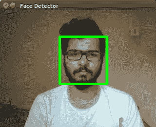
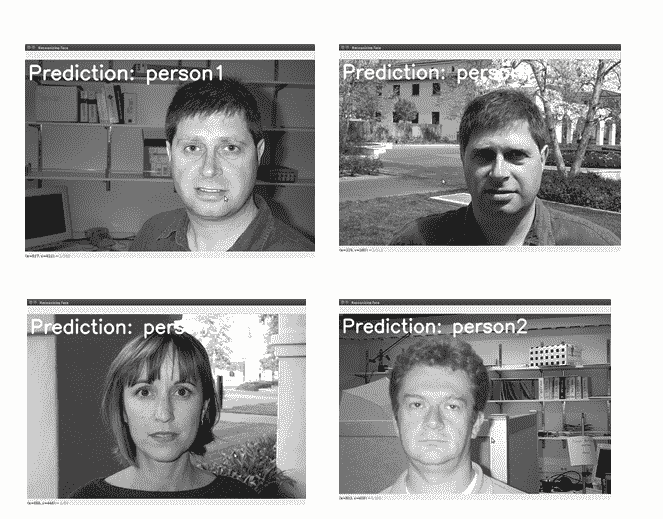

# 第八章：构建人脸检测和人脸识别应用

本章介绍了以下食谱：

+   面部识别系统简介

+   构建人脸检测应用程序

+   构建人脸识别应用程序

+   面部识别系统的应用

# 简介

近年来，人脸识别已成为最热门的研究领域之一。人脸识别系统是一种具有检测和识别人脸能力的计算机程序。为了识别一个人，它考虑其独特的面部特征。最近，它已被应用于多个安全和监控安装中，以确保高风险区域、住宅区、私人及公共建筑等地的安全。

# 构建人脸检测应用程序

在本节中，我们讨论如何从网络摄像头图像中检测人脸。要实现实时人脸检测，需要将 USB 网络摄像头连接到 Raspberry Pi 3。

# 如何操作...

1.  导入必要的包：

```py
import cv2 
import numpy as np 
```

1.  加载人脸级联文件：

```py
frontalface_cascade= cv2.CascadeClassifier('haarcascade_frontalface_alt.xml') 
```

1.  检查是否已加载人脸级联文件：

```py
if frontalface_cascade.empty(): 
  raiseIOError('Unable to load the face cascade classifier xml file') 
```

1.  初始化视频捕获对象：

```py
capture = cv2.VideoCapture(0) 
```

1.  定义缩放因子：

```py
scale_factor = 0.5 
```

1.  执行操作，直到按下*Esc*键：

```py
# Loop until you hit the Esc key 
while True: 
```

1.  捕获当前帧并调整其大小：

```py
  ret, frame = capture.read() 
  frame = cv2.resize(frame, None, fx=scale_factor, fy=scale_factor,  
            interpolation=cv2.INTER_AREA) 
```

1.  将图像帧转换为灰度：

```py
  gray_image = cv2.cvtColor(frame, cv2.COLOR_BGR2GRAY) 
```

1.  在灰度图像上运行人脸检测器：

```py
  face_rectangle = frontalface_cascade.detectMultiScale(gray_image, 1.3, 5)
```

1.  绘制矩形框：

```py
  for (x,y,w,h) in face_rectangle: 
    cv2.rectangle(frame, (x,y), (x+w,y+h), (0,255,0), 3) 
```

1.  显示输出图像：

```py
    cv2.imshow('Face Detector', frame) 
```

1.  检查是否按下了*Esc*键以终止操作：

```py
  a = cv2.waitKey(1) 
  if a == 10: 
    break 
```

1.  停止视频捕获并终止操作：

```py
capture.release() 
cv2.destroyAllWindows() 
```

人类面部检测系统得到的结果如下所示：



# 构建人脸识别应用程序

人脸识别是在人脸检测之后执行的技术。检测到的人脸与数据库中存储的图像进行比较。它从输入图像中提取特征，并将这些特征与数据库中存储的人类特征进行匹配。

# 如何操作...

1.  导入必要的包：

```py
import cv2 
import numpy as np   
from sklearn import preprocessing 
```

1.  加载编码和解码任务操作符：

```py
class LabelEncoding(object): 
  # Method to encode labels from words to numbers 
  def encoding_labels(self, label_wordings): 
    self.le = preprocessing.LabelEncoder() 
    self.le.fit(label_wordings) 
```

1.  实现输入标签的单词转数字功能：

```py
  def word_to_number(self, label_wordings): 
    return int(self.le.transform([label_wordings])[0]) 
```

1.  将输入标签从数字转换为文字：

```py
  def number_to_word(self, label_number): 
    return self.le.inverse_transform([label_number])[0] 
```

1.  从输入路径提取图像和标签：

```py
def getting_images_and_labels(path_input): 
  label_wordings = [] 
```

1.  对输入路径进行迭代并附加文件：

```py
  for roots, dirs, files in os.walk(path_input): 
    for fname in (x for x in files if x.endswith('.jpg')): 
      fpath = os.path.join(roots, fname) 
      label_wordings.append(fpath.split('/')[-2])
```

1.  初始化变量并解析输入寄存器：

```py
  images = [] 
  le = LabelEncoding() 
  le.encoding_labels(label_wordings) 
  labels = [] 
  # Parse the input directory 
  for roots, dirs, files in os.walk(path_input): 
    for fname in (x for x in files if x.endswith('.jpg')): 
      fpath = os.path.join(roots, fname) 
```

1.  读取灰度图像：

```py
      img = cv2.imread(fpath, 0)  
```

1.  提取标签：

```py
      names = fpath.split('/')[-2] 
```

1.  执行人脸检测：

```py
      face = faceCascade.detectMultiScale(img, 1.1, 2, minSize=(100,100)) 
```

1.  使用人脸矩形重复该过程：

```py
      for (x, y, w, h) in face: 
        images.append(img[y:y+h, x:x+w]) 
        labels.append(le.word_to_number(names)) 
  return images, labels, le 
if __name__=='__main__': 
  path_cascade = "haarcascade_frontalface_alt.xml" 
  train_img_path = 'faces_dataset/train' 
  path_img_test = 'faces_dataset/test' 
```

1.  加载人脸级联文件：

```py
  faceCascade = cv2.CascadeClassifier(path_cascade) 
```

1.  使用局部二值模式初始化人脸检测：

```py
  face_recognizer = cv2.createLBPHFaceRecognizer()
```

1.  从训练人脸数据集中提取人脸特征：

```py
  imgs, labels, le = getting_images_and_labels(train_img_path) 
```

1.  训练人脸检测系统：

```py
  print "nTraining..." 
  face_recognizer.train(imgs, np.array(labels)) 
```

1.  测试人脸检测系统：

```py
  print 'nPerforming prediction on test images...' 
  flag_stop = False 
  for roots, dirs, files in os.walk(path_img_test): 
    for fname in (x for x in files if x.endswith('.jpg')): 
      fpath = os.path.join(roots, fname) 
```

1.  验证人脸识别系统：

```py
      predicting_img = cv2.imread(fpath, 0) 
            # Detect faces 
      face = faceCascade.detectMultiScale(predicting_img, 1.1,  
                    2, minSize=(100,100)) 
            # Iterate through face rectangles 
      for (x, y, w, h) in face: 
        # Predict the output 
        index_predicted, config = face_recognizer.predict( 
predicting_img[y:y+h, x:x+w]) 
        # Convert to word label 
        person_predicted = le.number_to_word(index_predicted) 
        # Overlay text on the output image and display it 
        cv2.putText(predicting_img, 'Prediction: ' +  person_predicted,  
                        (10,60), cv2.FONT_HERSHEY_SIMPLEX, 2, (255,255,255), 6) 
        cv2.imshow("Recognizing face", predicting_img) 
      a = cv2.waitKey(0) 
      if a == 27: 
        flag = True 
        break 
    if flag_stop: 
      break 
```

在这里展示了获取到的面部识别输出：



# 它是如何工作的...

面部识别系统被广泛用于实现个人安全系统。读者可以参考文章《基于 OpenCV 的面部检测系统》[`ieeexplore.ieee.org/document/6242980/`](http://ieeexplore.ieee.org/document/6242980/)。

参见[实时人脸检测系统的人脸检测算法研究](http://ieeexplore.ieee.org/document/5209668)。

# 参见

请参阅以下文章：

+   [`www.ex-sight.com/technology.htm`](http://www.ex-sight.com/technology.htm)

+   [`www.eurotech.com/en/products/devices/face+recognition+systems`](https://www.eurotech.com/en/products/devices/face+recognition+systems)

+   [`arxiv.org/ftp/arxiv/papers/1403/1403.0485.pdf`](https://arxiv.org/ftp/arxiv/papers/1403/1403.0485.pdf)

# 面部识别系统的应用

面部识别在安全、医疗和营销领域得到广泛应用。各行业正在开发使用深度学习技术的创新面部识别系统，以识别欺诈行为、区分人脸与照片之间的差异等。在医疗领域，面部识别与其他计算机视觉算法相结合，用于检测面部皮肤疾病。
