# 第十章：感知与显示真实世界数据

在本章中，我们将涵盖以下主题：

+   使用带有 I²C 总线的设备

+   使用模数转换器读取模拟数据

+   记录和绘制数据

+   使用 I/O 扩展器扩展树莓派 GPIO

+   在 SQLite 数据库中捕获数据

+   查看来自您自己的网络服务器的数据

+   感知并发送数据到在线服务

# 简介

在本章中，我们将学习如何从现实世界收集模拟数据，并对其进行处理，以便我们能够显示、记录、绘图和共享数据，并在我们的程序中利用它。

我们将通过与**模拟-数字转换器**（**ADCs**）、LCD 数码显示屏和数字端口扩展器使用 Raspberry Pi 的 GPIO 连接来扩展 Raspberry Pi 的功能。

一定要查看附录，*硬件和软件列表*，其中列出了本章中使用的所有物品以及您可以从哪里获取它们。

# 使用带有 I2C 总线的设备

树莓派可以支持多种高级协议，使得各种设备能够轻松连接。在本章中，我们将重点关注最常用的总线，称为**I-squared-C**（**I²C**）。它提供了一种中速总线，用于通过两根线与设备进行通信。在本节中，我们将使用 I²C 来与一个 8 位模数转换器（ADC）进行接口。该设备将测量一个模拟信号，将其转换为介于 0 到 255 之间的相对值，并将该值作为数字信号（由 8 位表示）通过 I²C 总线发送到树莓派。

I²C 的优势可以概括如下：

+   即使在总线上连接了众多设备，也能保持低引脚/信号数量

+   适应不同从属设备的需要

+   支持多主节点

+   集成 ACK/NACK 功能以改进错误处理

# 准备就绪

I²C 总线并非在所有树莓派镜像中都启用；因此，我们需要启用该模块并安装一些支持工具。Raspbian 的新版本使用 **设备树** 来处理硬件外设和驱动程序。

为了使用 I²C 总线，我们需要在 `bootconfig.txt` 文件中启用 ARM I²C。

您可以使用以下命令自动完成此操作：

```py
sudo raspi-config
```

从菜单中选择高级选项，然后选择 I²C，如图下截图所示。当询问时，选择是以启用该接口，然后点击是默认加载模块：

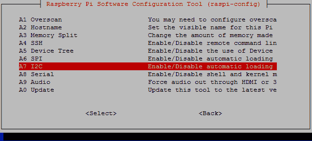

Raspberry Pi 配置菜单

从菜单中选择 I2C，然后选择是来启用接口并加载模块

默认情况下。

`raspi-config` 程序通过修改 `/boot/config.txt` 文件以包含 `dtparam=i2c_arm=on` 来启用 `I2C_ARM` 接口。其他总线（I2C_VC）通常保留用于与 Raspberry Pi HAT 扩展板进行接口连接（从板载存储设备读取配置信息）；然而，您可以使用 `dtparam=i2c_vc=on` 来启用此功能。

如果您愿意，也可以通过`raspi-config`列表启用 SPI，这是一种另一种类型的总线（我们将在第十三章，*与技术接口*)中更详细地探讨这一点）。

接下来，我们应该在启动树莓派时包含要加载的 I²C 模块，如下所示：

```py
sudo nano /etc/modules  
```

在单独的行上添加以下内容并保存（*Ctrl* + *X*, *Y*, *Enter*）：

```py
i2c-dev
i2c-bcm2708  
```

同样，我们也可以通过添加 `spi-bcm2708` 来启用 SPI 模块。

接下来，我们将安装一些工具，以便可以直接从命令行使用 I²C 设备，如下所示：

```py
sudo apt-get update
sudo apt-get install i2c-tools  
```

最后，在连接硬件之前关闭 Raspberry Pi，以便应用更改，具体操作如下：

```py
sudo halt  
```

您需要一个 PCF8591 模块（这些模块的零售商列在附录中，*硬件和软件列表*），或者您可以单独获取 PCF8591 芯片并自行搭建电路（有关电路的详细信息，请参阅*更多内容...*部分）：

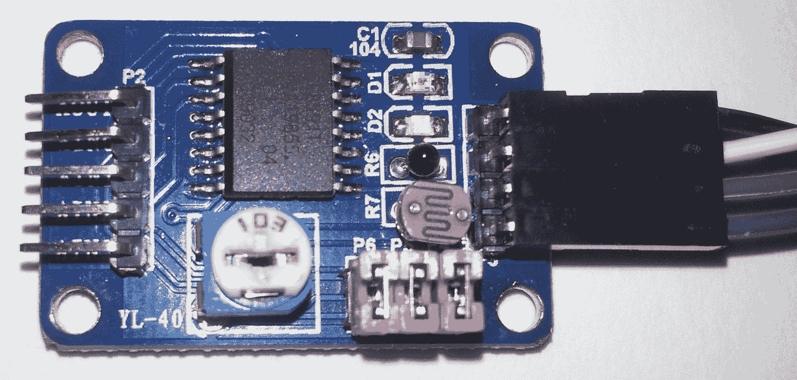

来自 dx.com 的 PCF8591 模数转换器（ADC）和传感器模块

将 GND、VCC、SDA 和 SCL 引脚按照以下方式连接到树莓派 GPIO 引脚头上：

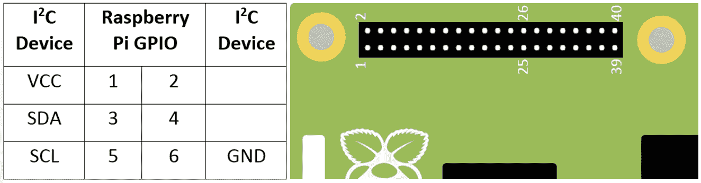

树莓派 GPIO 引脚上的 I2C 连接

您可以通过研究设备的规格说明书来找到需要发送/读取的消息以及用于控制您的设备的寄存器，从而使用相同的 I²C 工具/代码与其他 I²C 设备进行操作。

# 如何做到这一点...

1.  `i2cdetect` 命令用于检测 I²C 设备（`--y` 选项跳过任何关于可能与其他硬件（可能连接到 I²C 总线）发生干扰的警告）。以下命令用于扫描两个总线：

```py
sudo i2cdetect -y 0
sudo i2cdetect -y 1 
```

1.  根据您的树莓派板型修订版，设备的地址应列在总线 0（适用于 B 型 Rev1 板）或总线 1（适用于树莓派 2 和 3，以及树莓派 1 Model A 和 Model B 修订版 2）。默认情况下，PCF8591 的地址是`0x48`：

| **要使用的 I²C 总线编号** | **总线 00** | **总线 11** |
| --- | --- | --- |
| 树莓派 2 和 3 | HAT ID (I2C_VC) | GPIO (I2C_ARM) |
| 模型 A 和模型 B 修订版 2 | P5 | GPIO |
| 模型 B 修订版 1 | GPIO | N/A |

1.  以下截图显示了`i2cdetect`的输出：

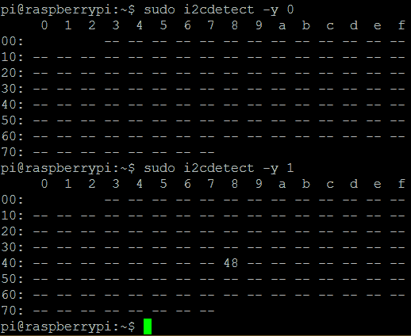

PCF8591 地址（48）在此处显示在总线 1 上

如果没有列出任何内容，请关闭并仔细检查您的连接（来自[www.dx.com](http://www.dx.com/)的 ADC 模块在供电时会点亮一个红色 LED）。

如果你收到一个错误信息，指出 `/dev/i2c1` 总线不存在，你可以执行以下检查：

+   确保文件 `/etc/modprobe.d/raspi-blacklist.conf` 为空（即，模块没有被列入黑名单），可以使用以下命令查看该文件：

`sudo nano /etc/modprobe.d/raspi-blacklist.conf`

+   如果文件中存在任何内容（例如 `blacklist i2c-bcm2708`），请将其删除并保存

+   检查 `/boot/config` 文件，确保其中没有包含 `device_tree_param=` 的行（这将禁用对新设备树配置的支持，并禁用对某些 Raspberry Pi HAT 扩展板的兼容性支持）

+   使用 `lsmod` 检查模块是否已加载，并查找 `i2c-bcm2708` 和 `i2c_dev`

1.  使用检测到的总线编号（`0` 或 `1`）和设备地址（`0x48`），使用 `i2cget` 从设备中读取数据（在电源开启或通道更改后，您需要读取设备两次以查看最新值），如下所示：

```py
sudo i2cget -y 1 0x48
sudo i2cget -y 1 0x48 
```

1.  要从通道 `1`（这是模块上的温度传感器）读取，我们可以使用 `i2cset` 将 `0x01` 写入 PCF8591 控制寄存器。再次，使用两次读取来从通道 `1` 获取新的样本，如下所示：

```py
sudo i2cset -y 1 0x48 0x01
sudo i2cget -y 1 0x48
sudo i2cget -y 1 0x48 
```

1.  要循环遍历每个输入通道，请使用`i2cset`将控制寄存器设置为`0x04`，具体操作如下：

```py
sudo i2cset -y 1 0x48 0x04
```

1.  我们也可以使用以下命令来控制 AOUT 引脚，将其完全打开（点亮 LED D1）：

```py
sudo i2cset -y 1 0x48 0x40 0xff 
```

1.  最后，我们可以使用以下命令将其完全关闭（关闭 LED D1）：

```py
sudo i2cset -y 1 0x48 0x40 0x00  
```

# 它是如何工作的...

设备开启后的第一次读取将返回 `0x80`，并触发从通道 0 的新样本。如果你再次读取，它将返回之前读取的样本并生成一个新的样本。每次读取都将是一个 8 位值（范围从 `0` 到 `255`），代表电压到 VCC（在这种情况下，0 V 到 3.3 V）。在 [www.dx.com](http://www.dx.com) 模块上，通道 0 连接到一个光传感器，因此如果你用手遮住模块并重新发送命令，你会观察到值的变化（变暗表示更高的值，变亮表示更低的值）。你会发现读取值总是落后一步；这是因为，当它返回之前的样本时，它会捕获下一个样本。

我们使用以下命令来指定要读取的特定频道：

```py
sudo i2cset -y 1 0x48 0x01  
```

这将读取通道更改为通道 1（在模块上标记为**AIN1**）。记住，你需要在看到新选择通道的数据之前执行两次读取。以下表格显示了通道和引脚名称，以及哪些跳线连接器启用/禁用每个传感器：

| **通道** | **0** | **1** | **2** | **3** |
| --- | --- | --- | --- | --- |
| 引脚名称 | AIN0 | AIN1 | AIN2 | AIN3 |
| 传感器 | 光敏电阻 | 热敏电阻 | 外部引脚 | 滑动变阻器 |
| 跳跃者 | P5 | P4 |  | P6 |

接下来，我们通过设置控制寄存器的模拟输出使能标志（位 6）来控制 AOUT 引脚，并使用下一个值来设置模拟电压（0V-3.3V，0x00-0xFF），具体如下：

```py
sudo i2cset -y 1 0x48 0x40 0xff   
```

最后，你可以将位 2（`0x04`）设置为自动递增并循环遍历输入通道，如下所示：

```py
sudo i2cset -y 1 0x48 0x04
```

每次运行 `i2cget -y 1 0x48`，下一个通道将被选中，从通道 AIN0 开始，然后运行到 AIN1，再到 AIN3，最后回到 AIN0。

要了解如何在数值中设置特定的位，查看该数字的二进制表示形式会有所帮助。8 位值`0x04`可以写作二进制`b0000 0100`（`0x`表示该值是以十六进制（或十六进制）形式书写的，而 b 表示这是一个二进制数）。

二进制数中的位从右到左计数，从 0 开始 - 也就是说，最高有效位（MSB）7 6 5 4 3 2 1 0 最低有效位（LSB）。

第 7 位被称为**最高有效位**（**MSB**），而第 0 位被称为**最低有效位**（**LSB**）。因此，通过设置第 2 位，我们得到`b0000 0100`（即`0x04`）。

# 还有更多...

I²C 总线使我们能够仅使用几根线就轻松连接多个设备。PCF8591 芯片可用于将您自己的传感器连接到模块或仅仅是芯片。

# 使用多个 I2C 设备

I²C 总线上的所有命令都是针对特定的 I²C 设备（许多设备有选项设置一些引脚为高电平或低电平以选择额外的地址，并允许多个设备存在于同一总线上）。每个设备都必须有一个唯一的地址，这样在任何时候只有一个设备会响应。PCF8591 的起始地址是`0x48`，通过三个地址引脚可选择到`0x4F`。这允许在同一总线上使用多达八个 PCF8591 设备。

如果你决定使用位于 GPIO 引脚 27 和 28（或在 A 型和 B 型 2 修订版设备上的 P5 引脚）的 I2C_VC 总线，你可能需要在 I²C 线和 3.3V 之间添加一个 1k8 欧姆的上拉电阻。这些电阻已经在 GPIO 连接器上的 I²C 总线上存在。然而，一些 I²C 模块，包括 PCF8591 模块，已经配备了它们自己的电阻，因此无需额外的电阻即可工作。

# I2C 总线与电平转换

I²C 总线由两根线组成，一根是数据线（SDA），另一根是时钟线（SCL）。这两根线都通过上拉电阻被动地拉到 VCC（在树莓派上，这是 3.3 V）。树莓派将通过在每个周期中将时钟线拉低来控制时钟，数据线可以通过树莓派拉低来发送命令，或者由连接的设备拉低以响应数据：

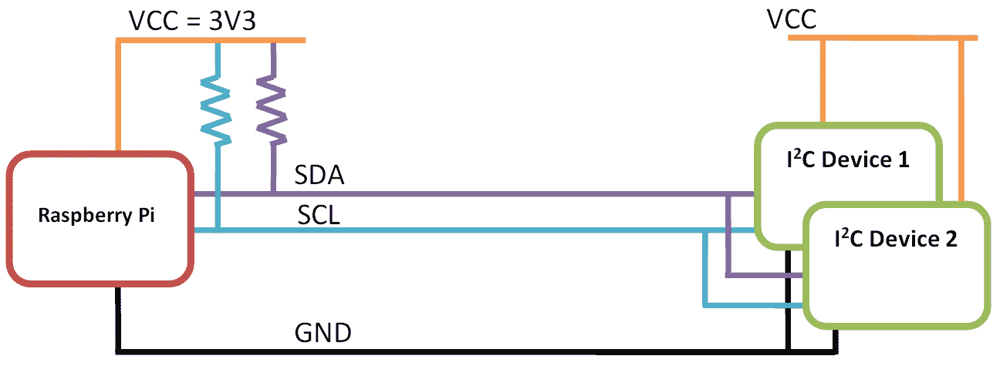

树莓派的 I²C 引脚包括 SDA 和 SCL 上的上拉电阻

由于从设备只能将数据线拉至**GND**，因此设备可以在没有风险地驱动 GPIO 引脚过高（记住树莓派的 GPIO 无法处理超过 3.3 V 的电压）的情况下，由 3.3 V 甚至 5 V 供电。只要设备的 I²C 总线能够识别 3.3 V 的逻辑最大值而不是 5 V，这应该就可以工作。I²C 设备不得配备自己的上拉电阻，因为这会导致 GPIO 引脚被拉至 I²C 设备的供电电压。

注意到本章中使用的 PCF8591 模块已配备电阻；因此，我们只能使用**VCC = 3V3**。可以使用双向逻辑电平转换器来解决任何逻辑电平问题。以下图像展示了一个这样的设备，即**Adafruit** I²C 双向逻辑电平转换模块：

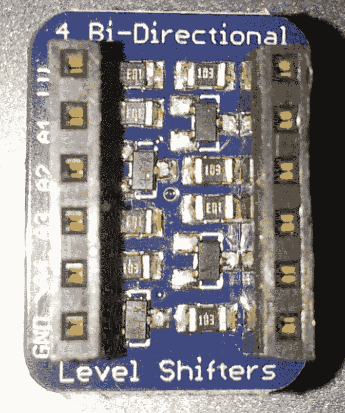

Adafruit I²C 双向电平转换模块

除了确保您所使用的设备中任何逻辑电压都处于合适的水平之外，它还将允许总线通过更长的线缆进行扩展（电平转换器还将充当总线中继器）。

# 仅使用 PCF8591 芯片或添加替代传感器

如下图中所示为 PCF8591 模块不带传感器的电路图：

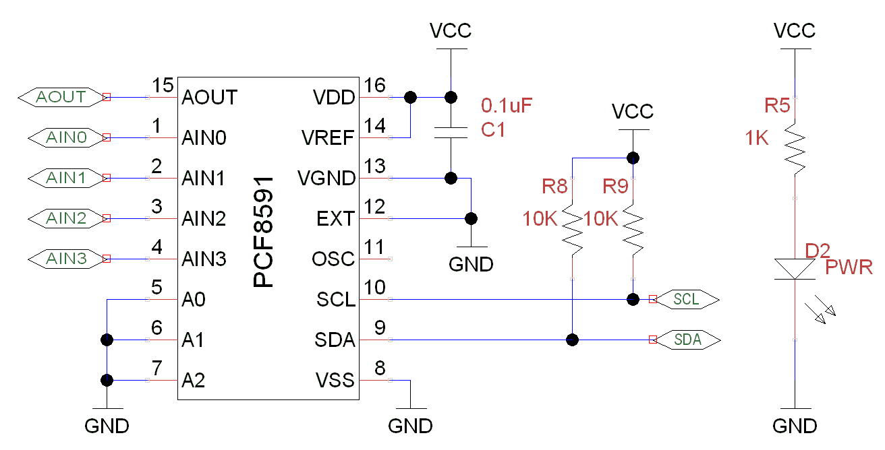

PCF8591 模块不带传感器连接的电路图

如您所见，除了传感器外，只有五个额外的组件。我们有一个电源滤波电容（C1）和一个带有限流电阻（R5）的电源指示 LED（D2），所有这些都是可选的。

注意，该模块包含两个 10K 上拉电阻（R8 和 R9）用于 SCL 和 SDA 信号。然而，由于树莓派的 GPIO I²C 连接也包含上拉电阻，因此在该模块上不需要这些电阻（并且可以移除）。这也意味着我们应仅将此模块连接到 VCC = 3.3 V（如果我们使用 5 V，那么 SCL 和 SDA 上的电压将约为 3.56 V，这对树莓派的 GPIO 引脚来说太高了）。

PCF891 模块上的传感器都是电阻式的，因此随着传感器电阻的变化，模拟输入上的电压水平将在**GND**和**VCC**之间变化：

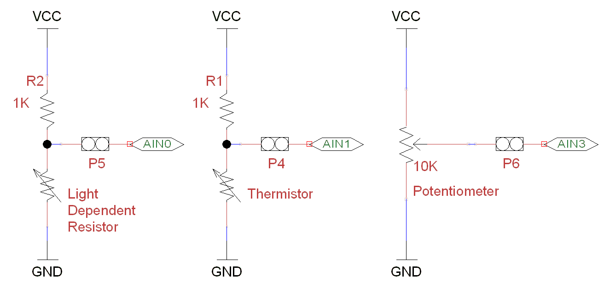

一个电位分压器电路。这提供与传感器电阻成比例的电压。

该模块使用一个称为分压器的电路。顶部的电阻平衡底部传感器的电阻，以提供一个介于**VCC**和**GND**之间的电压。

分压器输出电压（*V[out]*）的计算公式如下：


R[t]和 R[b]分别是顶部和底部的电阻值，VCC 是供电电压。

该模块中的电位器电阻为 10K 欧姆，上下两端之间分配，具体取决于调节器的位置。因此，在中点位置，每侧有 5K 欧姆，输出电压为 1.65V；四分之一位置（顺时针方向），我们有 2.5K 欧姆和 7.5K 欧姆，产生 0.825V。

我还没有展示 AOUT 电路，它是一个电阻和 LED。然而，正如你将发现的，LED 并不适合用来指示模拟输出（除了显示开关状态）。

对于更敏感的电路，你可以使用更复杂的电路，例如一个**惠斯通电桥**（它允许检测电阻的非常小的变化），或者你可以使用基于其读数输出模拟电压的专用传感器（例如**TMP36**温度传感器）。PCF891 还支持差分输入模式，其中一个通道的输入可以与另一个通道的输入进行比较（最终的读数将是两者之间的差值）。

关于 PCF8591 芯片的更多信息，请参阅[`www.nxp.com/documents/data_sheet/PCF8591.pdf`](http://www.nxp.com/documents/data_sheet/PCF8591.pdf)的数据表。

# 使用模数转换器读取模拟数据

I²C 工具（在上一节中使用）在命令行中调试 I²C 设备非常有用，但它们在 Python 中使用并不实用，因为它们会非常慢，并且使用时需要大量的开销。幸运的是，有几个 Python 库提供了 I²C 支持，允许高效地使用 I²C 与连接的设备进行通信，并提供简便的操作。

我们将使用这样一个库来创建我们自己的 Python 模块，该模块将使我们能够快速轻松地从 ADC 设备获取数据，并在我们的程序中使用它。该模块设计得如此之好，以至于其他硬件或数据源可以替换它而不会影响剩余的示例。

# 准备就绪

要使用 Python 3 的 I²C 总线，我们将使用 *戈登·亨德森* 的 WiringPi2（更多详情请参阅 [`wiringpi.com/`](http://wiringpi.com/)）。

安装`wiringpi2`最简单的方法是使用 Python 3 的`pip`。`pip`是 Python 的一个包管理器，其工作方式与`apt-get`类似。您希望安装的任何包都将自动从在线仓库下载并安装。

要安装`pip`，请使用以下命令：

```py
sudo apt-get install python3-dev python3-pip  
```

然后，使用以下命令安装 `wiringpi2`:

```py
sudo pip-3.2 install wiringpi2
```

安装完成后，你应该看到以下内容，表示成功：

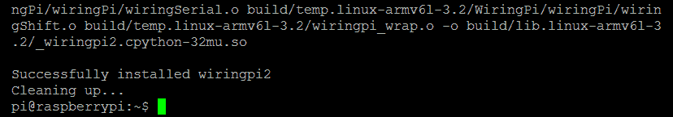

成功安装了 WiringPi2

您需要将 PCF8591 模块按照之前在树莓派的 I²C 连接中使用的样子连接好：

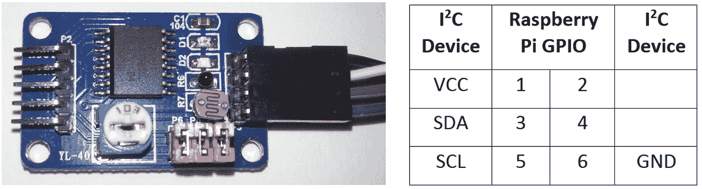

PCF8591 模块与 Raspberry Pi GPIO 连接器的引脚连接

# 如何做到这一点...

在下一节中，我们将编写一个脚本，以便我们能够收集数据，然后在本章的后续部分使用这些数据。

创建以下脚本，`data_adc.py`，如下所示：

1.  首先，导入我们将使用的模块并创建变量，如下所示：

```py
#!/usr/bin/env python3 
#data_adc.py 
import wiringpi2 
import time 

DEBUG=False 
LIGHT=0;TEMP=1;EXT=2;POT=3 
ADC_CH=[LIGHT,TEMP,EXT,POT] 
ADC_ADR=0x48 
ADC_CYCLE=0x04 
BUS_GAP=0.25 
DATANAME=["0:Light","1:Temperature", 
          "2:External","3:Potentiometer"] 
```

1.  创建一个带有构造函数以初始化它的`device`类，如下所示：

```py
class device: 
  # Constructor: 
  def __init__(self,addr=ADC_ADR): 
    self.NAME = DATANAME 
    self.i2c = wiringpi2.I2C() 
    self.devADC=self.i2c.setup(addr) 
    pwrup = self.i2c.read(self.devADC) #flush powerup value 
    if DEBUG==True and pwrup!=-1: 
      print("ADC Ready") 
    self.i2c.read(self.devADC) #flush first value 
    time.sleep(BUS_GAP) 
    self.i2c.write(self.devADC,ADC_CYCLE) 
    time.sleep(BUS_GAP) 
    self.i2c.read(self.devADC) #flush first value 
```

1.  在类中，定义一个函数以提供频道名称列表，如下所示：

```py
def getName(self): 
  return self.NAME
```

1.  定义另一个函数（仍然作为类的一部分），用于返回来自 ADC 通道的新样本集，如下所示：

```py
def getNew(self): 
  data=[] 
  for ch in ADC_CH: 
    time.sleep(BUS_GAP) 
    data.append(self.i2c.read(self.devADC)) 
  return data 
```

1.  最后，在设备类之后，创建一个测试函数来测试我们的新`device`类，如下所示。这仅在脚本直接执行时运行：

```py
def main(): 
  ADC = device(ADC_ADR) 
  print (str(ADC.getName())) 
  for i in range(10): 
    dataValues = ADC.getNew() 
    print (str(dataValues)) 
    time.sleep(1) 

if __name__=='__main__': 
  main() 
#End 
```

您可以使用以下命令运行此模块的测试函数：

```py
sudo python3 data_adc.py  
```

# 它是如何工作的...

我们首先导入`wiringpi2`，以便稍后与我们的 I²C 设备进行通信。我们将创建一个类来包含控制 ADC 所需的功能。当我们创建这个类时，我们可以初始化`wiringpi2`，使其准备好使用 I²C 总线（使用`wiringpi2.I2C()`），并且我们将使用芯片的总线地址设置一个通用的 I²C 设备（使用`self.i2c.setup(0x48)`）。

`wiringpi2` 还有一个专门用于与 PCF8591 芯片配合使用的类；然而，在这种情况下，使用标准的 I²C 功能来展示如何使用 `wiringpi2` 控制任何 I²C 设备更为有用。通过参考设备数据表，你可以使用类似的命令与任何连接的 I²C 设备进行通信（无论它是否直接支持）。

如前所述，我们执行设备读取并配置 ADC 循环遍历通道，但不是使用`i2cget`和`i2cset`，而是使用`I2C`对象的`wiringpi2`读写函数。一旦初始化完成，设备将准备好读取每个通道上的模拟信号。

该类还将有两个成员函数。第一个函数，`getName()`，返回一个频道名称列表（我们可以用它来关联我们的数据与其来源），第二个函数，`getNew()`，返回所有频道的新数据集。数据是通过使用`i2c.read()`函数从 ADC 读取的，并且由于我们已经将其置于循环模式，每次读取都将来自下一个频道。

由于我们计划稍后重用这个类，我们将使用 `if __name__` 测试来允许我们在直接执行文件时定义一段代码。在我们的 `main()` 函数中，我们创建了 ADC，它是我们新设备类的一个实例。如果我们需要，可以选择一个非默认地址；否则，将使用芯片的默认地址。我们使用 `getName()` 函数来打印出通道的名称，然后我们可以从 `ADC`（使用 `getNew()`）收集数据并显示它们。

# 还有更多...

以下允许我们在 `data_adc.py` 中定义设备类的替代版本，以便它可以替代 ADC 模块使用。这将使得本章剩余部分可以在不需要任何特定硬件的情况下进行尝试。

# 无硬件收集模拟数据

如果您没有可用的 ADC 模块，您可以从 Raspberry Pi 内部获取大量数据来替代使用。

创建 `data_local.py` 脚本如下：

```py
#!/usr/bin/env python3 
#data_local.py 
import subprocess 
from random import randint 
import time 

MEM_TOTAL=0 
MEM_USED=1 
MEM_FREE=2 
MEM_OFFSET=7 
DRIVE_USED=0 
DRIVE_FREE=1 
DRIVE_OFFSET=9 
DEBUG=False 
DATANAME=["CPU_Load","System_Temp","CPU_Frequency", 
          "Random","RAM_Total","RAM_Used","RAM_Free", 
          "Drive_Used","Drive_Free"] 

def read_loadavg(): 
  # function to read 1 minute load average from system uptime 
  value = subprocess.check_output( 
            ["awk '{print $1}' /proc/loadavg"], shell=True) 
  return float(value) 

def read_systemp(): 
  # function to read current system temperature 
  value = subprocess.check_output( 
            ["cat /sys/class/thermal/thermal_zone0/temp"], 
            shell=True) 
  return int(value) 

def read_cpu(): 
  # function to read current clock frequency 
  value = subprocess.check_output( 
            ["cat /sys/devices/system/cpu/cpu0/cpufreq/"+ 
             "scaling_cur_freq"], shell=True) 
  return int(value) 

def read_rnd(): 
  return randint(0,255) 

def read_mem(): 
  # function to read RAM info 
  value = subprocess.check_output(["free"], shell=True) 
  memory=[] 
  for val in value.split()[MEM_TOTAL+ 
                           MEM_OFFSET:MEM_FREE+ 
                           MEM_OFFSET+1]: 
    memory.append(int(val)) 
  return(memory) 

def read_drive(): 
  # function to read drive info 
  value = subprocess.check_output(["df"], shell=True) 
  memory=[] 
  for val in value.split()[DRIVE_USED+ 
                           DRIVE_OFFSET:DRIVE_FREE+ 
                           DRIVE_OFFSET+1]: 
    memory.append(int(val)) 
  return(memory) 

class device: 
  # Constructor: 
  def __init__(self,addr=0): 
    self.NAME=DATANAME 

  def getName(self): 
    return self.NAME 

  def getNew(self): 
    data=[] 
    data.append(read_loadavg()) 
    data.append(read_systemp()) 
    data.append(read_cpu()) 
    data.append(read_rnd()) 
    memory_ram = read_mem() 
    data.append(memory_ram[MEM_TOTAL]) 
    data.append(memory_ram[MEM_USED]) 
    data.append(memory_ram[MEM_FREE]) 
    memory_drive = read_drive() 
    data.append(memory_drive[DRIVE_USED]) 
    data.append(memory_drive[DRIVE_FREE]) 
    return data 

def main(): 
  LOCAL = device() 
  print (str(LOCAL.getName())) 
  for i in range(10): 
    dataValues = LOCAL.getNew() 
    print (str(dataValues)) 
    time.sleep(1) 

if __name__=='__main__': 
  main() 
#End 
```

上述脚本使我们能够使用以下命令从树莓派收集系统信息（`subprocess`模块允许我们捕获结果并处理它们）：

+   CPU 速度：

```py
cat /sys/devices/system/cpu/cpu0/cpufreq/scaling_cur_freq  
```

+   CPU 负载：

```py
awk '{print $1}' /proc/loadavg
```

+   核心温度（按 1,000 倍缩放）：

```py
cat /sys/class/thermal/thermal_zone0/temp  
```

+   驱动信息：

```py
df  
```

+   RAM 信息：

```py
free  
```

每个数据项都使用其中一个函数进行采样。在驱动器和 RAM 信息的情况下，我们将响应拆分为一个列表（由空格分隔）并选择我们想要监控的项目（例如可用内存和已用驱动器空间）。

这一切都被打包起来，以便与`data_adc.py`文件和`device`类以相同的方式工作（因此你可以在以下示例中选择使用其中之一，只需将`data_adc`包含文件替换为`data_local`即可）。

# 记录和绘制数据

现在我们能够采样和收集大量数据，因此能够捕捉和分析这些数据变得尤为重要。为此，我们将利用一个名为 `matplotlib` 的 Python 库，它包含了许多用于操作、绘图和分析数据的实用工具。我们将使用 `pyplot`（它是 `matplotlib` 的一部分）来生成我们捕获数据的图表。有关 `pyplot` 的更多信息，请访问 [`matplotlib.org/users/pyplot_tutorial.html`](http://matplotlib.org/users/pyplot_tutorial.html)。

这是一个用于 Python 的 MATLAB 风格数据可视化框架。

# 准备就绪

要使用 `pyplot`，我们需要安装 `matplotlib`。

由于`matplotlib`安装程序的问题，使用`pip-3.2`进行安装并不总是正确工作。以下方法将通过手动执行`pip`所做的一切步骤来克服这个问题；然而，这可能需要超过 30 分钟才能完成。

为了节省时间，您可以尝试使用`pip`安装，这会更快。如果不起作用，您可以使用前面提到的手动方法进行安装。

使用以下命令尝试使用 `pip` 安装 `matplotlib`：

`sudo apt-get install tk-dev python3-tk libpng-dev`

`sudo pip-3.2 install numpy`

`sudo pip-3.2 install matplotlib`

您可以通过运行 `python3` 并尝试从 Python 终端导入它来确认 `matplotlib` 是否已安装，如下所示：

```py
import matplotlib  
```

如果安装失败，它将响应以下内容：

`  导入错误：没有名为 matplotlib 的模块`

否则，将不会有错误。

使用以下步骤手动安装 `matplotlib`：

1.  按照以下步骤安装支持包：

```py
sudo apt-get install tk-dev python3-tk python3-dev libpng-dev
sudo pip-3.2 install numpy
sudo pip-3.2 install matplotlib  
```

1.  从 Git 仓库下载源文件（命令应为一行）如下：

```py
wget https://github.com/matplotlib/matplotlib/archive/master.zip  
```

1.  解压并打开创建的`matplotlib-master`文件夹，操作如下：

```py
unzip master.zip
rm master.zip
cd matplotlib-master
```

1.  运行设置文件进行构建（这将需要一段时间）并按照以下步骤安装：

```py
sudo python3 setup.py build
sudo python3 setup.py install  
```

1.  以与自动化安装相同的方式进行安装测试。

我们可能需要 PCF8591 ADC 模块（以及之前安装的`wiringpi2`），或者我们可以使用上一节中的`data_local.py`模块（只需在脚本的导入部分将`data_adc`替换为`data_local`）。我们还需要确保`data_adc.py`和`data_local.py`与新的脚本位于同一目录中，具体取决于你使用哪个模块。

# 如何做到这一点...

1.  创建一个名为 `log_adc.py` 的脚本：

```py
#!/usr/bin/python3 
#log_adc.c 
import time 
import datetime 
import data_adc as dataDevice 

DEBUG=True 
FILE=True 
VAL0=0;VAL1=1;VAL2=2;VAL3=3 #Set data order 
FORMATHEADER = "t%st%st%st%st%s" 
FORMATBODY = "%dt%st%ft%ft%ft%f" 

if(FILE):f = open("data.log",'w') 

def timestamp(): 
  ts = time.time()  
  return datetime.datetime.fromtimestamp(ts).strftime( 
                                    '%Y-%m-%d %H:%M:%S') 

def main(): 
    counter=0 
    myData = dataDevice.device() 
    myDataNames = myData.getName() 
    header = (FORMATHEADER%("Time", 
                        myDataNames[VAL0],myDataNames[VAL1], 
                        myDataNames[VAL2],myDataNames[VAL3])) 
    if(DEBUG):print (header) 
    if(FILE):f.write(header+"n") 
    while(1): 
      data = myData.getNew() 
      counter+=1 
      body = (FORMATBODY%(counter,timestamp(), 
                        data[0],data[1],data[2],data[3])) 
      if(DEBUG):print (body) 
      if(FILE):f.write(body+"n") 
      time.sleep(0.1) 

try: 
  main() 
finally: 
  f.close() 
#End 
```

1.  创建一个名为 `log_graph.py` 的第二个脚本，如下所示：

```py
#!/usr/bin/python3 
#log_graph.py 
import numpy as np 
import matplotlib.pyplot as plt 

filename = "data.log" 
OFFSET=2 
with open(filename) as f: 
    header = f.readline().split('t') 

data = np.genfromtxt(filename, delimiter='t', skip_header=1, 
                    names=['sample', 'date', 'DATA0', 
                           'DATA1', 'DATA2', 'DATA3']) 
fig = plt.figure(1) 
ax1 = fig.add_subplot(211)#numrows, numcols, fignum 
ax2 = fig.add_subplot(212) 
ax1.plot(data['sample'],data['DATA0'],'r', 
         label=header[OFFSET+0]) 
ax2.plot(data['sample'],data['DATA1'],'b', 
         label=header[OFFSET+1]) 
ax1.set_title("ADC Samples")     
ax1.set_xlabel('Samples') 
ax1.set_ylabel('Reading') 
ax2.set_xlabel('Samples') 
ax2.set_ylabel('Reading') 

leg1 = ax1.legend() 
leg2 = ax2.legend() 

plt.show() 
#End 
```

# 它是如何工作的...

第一段脚本 `log_adc.py` 允许我们收集数据并将其写入日志文件。

我们可以通过将`data_adc`导入为`dataDevice`来使用 ADC 设备，或者导入`data_local`来使用系统数据。分配给`VAL0`至`VAL3`的数字使我们能够改变通道的顺序（如果使用`data_local`设备，还可以选择其他通道）。我们还可以定义日志文件中头部和每行的格式字符串（以创建用制表符分隔数据的文件），使用`%s`、`%d`和`%f`来允许我们替换字符串、整数和浮点值，如下表所示：

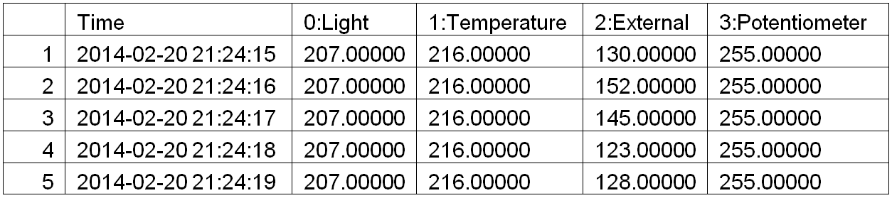

从 ADC 传感器模块捕获的数据表

当登录到文件（当`FILE=True`时），我们使用`'w'`选项以写入模式打开`data.log`（这将覆盖任何现有文件；要追加到文件，请使用`'a'`）。

作为我们数据日志的一部分，我们使用 `time` 和 `datetime` 模块生成 `timestamp`，通过 `time.time()` 命令获取当前的**纪元时间**（这是自 1970 年 1 月 1 日以来的毫秒数）。我们使用 `strftime()` 函数将这个值转换为更友好的 `年-月-日 时:分:秒` 格式。

`main()` 函数首先创建我们 `device` 类的一个实例（我们在前面的示例中创建了它），该实例将提供数据。我们从 `data` 设备中获取通道名称并构建 `header` 字符串。如果 `DEBUG` 设置为 `True`，数据将被打印到屏幕上；如果 `FILE` 设置为 `True`，它将被写入文件。

在主循环中，我们使用设备的`getNew()`函数来收集数据并将其格式化以在屏幕上显示或记录到文件中。`main()`函数是通过`try: finally:`命令调用的，这将确保当脚本被终止时，文件将被正确关闭。

第二个脚本 `log_graph.py` 允许我们读取日志文件并生成记录数据的图表，如下所示：

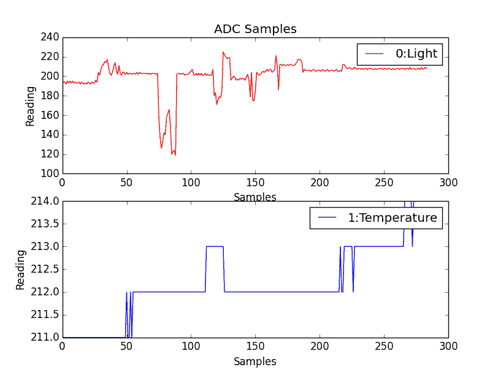

由 light 和 temperature 传感器生成的 log_graph.py 产生的图

我们首先打开日志文件并读取第一行；这包含了标题信息（我们随后可以用它来识别数据）。接下来，我们使用`numpy`，这是一个专业的 Python 库，它扩展了我们对数据和数字的操作方式。在这种情况下，我们用它来读取文件中的数据，根据制表符分隔符将其拆分，并为每个数据通道提供标识符。

我们定义一个图形来容纳我们的图表，添加两个子图（位于 2 x 1 网格中，位置为网格中的 1 和 2 - 由值`211`和`212`设置）。接下来，我们定义我们想要绘制的值，提供`x`值（`data['sample']`），`y`值（`data['DATA0']`），`color`值（`'r'`代表红色或`'b'`代表蓝色），以及`label`（设置为之前从文件顶部读取的标题文本）。

最后，我们为每个子图设置标题以及`x`和`y`标签，启用图例（以显示标签），并显示图表（使用`plt.show()`）。

# 还有更多...

现在我们有了查看我们所收集数据的能力，我们可以在采样时将其显示出来，从而更进一步。这将使我们能够立即看到数据如何对环境或刺激的变化做出反应。我们还可以校准我们的数据，以便我们可以分配适当的缩放比例，以产生以实际单位进行的测量。

# 实时数据绘图

除了从文件中绘制数据，我们还可以使用 `matplotlib` 来绘制按采样得到的传感器数据。为了实现这一点，我们可以使用 `plot-animation` 功能，该功能会自动调用一个函数来收集新数据并更新我们的图表。

创建以下脚本，命名为 `live_graph.py`：

```py
#!/usr/bin/python3 
#live_graph.py 
import numpy as np 
import matplotlib.pyplot as plt 
import matplotlib.animation as animation 
import data_local as dataDevice 

PADDING=5 
myData = dataDevice.device() 
dispdata = [] 
timeplot=0 
fig, ax = plt.subplots() 
line, = ax.plot(dispdata) 

def update(data): 
  global dispdata,timeplot 
  timeplot+=1 
  dispdata.append(data) 
  ax.set_xlim(0, timeplot) 
  ymin = min(dispdata)-PADDING 
  ymax = max(dispdata)+PADDING 
  ax.set_ylim(ymin, ymax) 
  line.set_data(range(timeplot),dispdata) 
  return line 

def data_gen(): 
  while True: 
    yield myData.getNew()[1]/1000 

ani = animation.FuncAnimation(fig, update,  
                              data_gen, interval=1000) 
plt.show() 
#End 
```

我们首先定义我们的`dataDevice`对象，并创建一个空数组`dispdata[]`，它将保存所有收集到的数据。接下来，我们定义我们的子图以及我们要绘制的线条。

`FuncAnimation()` 函数允许我们通过定义一个更新函数和一个生成器函数来更新一个图形（`fig`）。生成器函数（`data_gen()`）将每隔一个间隔（1,000 毫秒）被调用一次，并产生一个数据值。

本例使用核心温度读数，当其除以 1,000 时，得到实际的温度单位为`degC`：

要使用 ADC 数据，请将 `dataDevice` 的导入更改为 `data_adc`，并调整以下行以使用除 `[1]` 之外的其他通道，并应用不同于 1,000 的缩放系数：

`yield myData.getNew()[1]/1000`

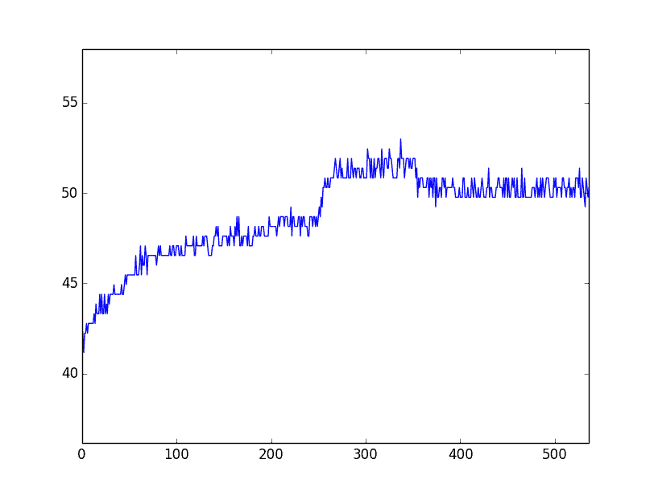

Raspberry Pi 实时绘图

数据值传递给`update()`函数，这使得我们可以将其添加到我们的`dispdata[]`数组中，该数组将包含要在图中显示的所有数据值。我们调整*x*轴的范围，使其接近数据的`min`和`max`值。同时，我们也调整*y*轴，以便在继续采样更多数据时增长。

`FuncAnimation()` 函数需要 `data_gen()` 对象是一个特殊类型的函数，称为 `generator`。一个 `generator` 函数每次被调用时都会产生一系列连续的值，如果需要，甚至可以使用其先前状态来计算下一个值。这用于执行绘图时的连续计算；这就是为什么在这里使用它的原因。在我们的情况下，我们只想连续运行相同的采样函数（`new_data()`），以便每次调用时都会产生一个新的样本。

最后，我们使用`dispdata[]`数组（通过`set_data()`函数）更新*x*轴和*y*轴的数据，这将绘制我们的样本与采样秒数的对比图。若要使用其他数据，或绘制来自 ADC 的数据，请调整`dataDevice`的导入，并在`data_gen()`函数中选择所需的通道（以及缩放）。

# 数据的缩放和校准

你可能已经注意到，有时解读从模数转换器（ADC）读取的数据可能会有点困难，因为其值只是一个数字。一个数字本身并不提供太多帮助；它只能告诉你环境比上一个样本稍微热一点或暗一点。然而，如果你可以使用另一个设备提供可比较的值（例如当前房间温度），那么你可以校准你的传感器数据以提供更有用的现实世界信息。

为了获得粗略的校准，我们将使用两个样本来创建一个线性拟合模型，然后可以使用该模型来估计其他 ADC 读数的实际世界值（这假设传感器本身的响应大部分是线性的）。以下图表显示了使用 25 度和 30 摄氏度两个读数创建的线性拟合图，为其他温度提供了估计的 ADC 值：

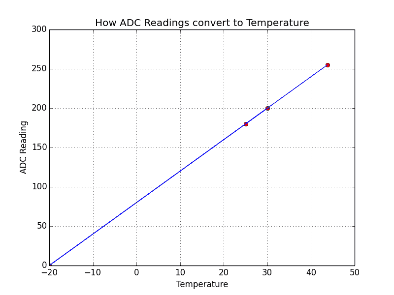

样本用于线性校准温度传感器的读数

我们可以使用以下函数来计算我们的模型：

```py
def linearCal(realVal1,readVal1,realVal2,readVal2): 
  #y=Ax+C 
  A = (realVal1-realVal2)/(readVal1-readVal2) 
  C = realVal1-(readVal1*A) 
  cal = (A,C) 
  return cal 
```

这将返回`cal`，其中将包含模型斜率（`A`）和偏移量（`C`）。

我们可以使用以下函数，通过使用该通道计算出的`cal`值来计算任何读数的值：

```py
def calValue(readVal,cal = [1,0]): 
  realVal = (readVal*cal[0])+cal[1] 
  return realVal 
```

为了提高准确性，您可以取几个样本，并在这些值之间进行线性插值（或者在需要的情况下，将数据拟合到其他更复杂的数学模型）。

# 使用 I/O 扩展器扩展树莓派 GPIO

正如我们所见，利用高级总线协议可以让我们快速且容易地连接到更复杂的硬件。通过使用 I²C 来扩展树莓派上的可用 I/O，以及提供额外的电路保护（在某些情况下，还能提供额外的电力来驱动更多硬件），I²C 可以发挥很大的作用。

有许多设备可以通过 I²C 总线（以及 SPI）提供 I/O 扩展，但最常用的设备是一个 28 引脚的设备，MCP23017，它提供了 16 个额外的数字输入/输出引脚。作为一个 I²C 设备，它只需要两个信号（SCL 和 SDA 连接，加上地线和电源）就可以愉快地与其他在同一总线上运行的 I²C 设备协同工作。

我们将看到 Adafruit I²C 16x2 RGB LCD Pi 板如何利用这些芯片之一来通过 I²C 总线控制 LCD 数字显示屏和键盘（如果没有 I/O 扩展器，这通常需要多达 15 个 GPIO 引脚）。

其他制造商的板子也可以使用。一个 16x2 液晶模块和 I²C 到串行接口模块可以组合成我们自己的低成本 I²C 液晶模块。

# 准备就绪

您将需要 Adafruit I²C 16x2 RGB LCD Pi Plate（该板还包含五个按键），如下照片所示：

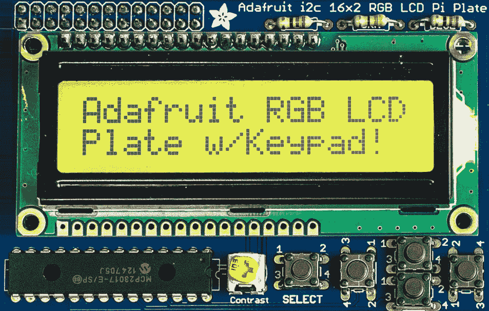

Adafruit I²C 16x2 RGB LCD Pi Plate 直接连接到 Raspberry Pi 的 GPIO 接口。

如前所述，我们可以使用 PCF8591 ADC 模块，或者使用上一节中的`data_local.py`模块（在脚本的导入部分使用`data_adc`或`data_local`）。`data_adc.py`和`data_local.py`文件应与新的脚本位于同一目录下。

LCD Pi 板只需要四个引脚（SDA、SCL、GND 和 5V）；它通过整个 GPIO 引脚头连接。如果我们想与其他设备一起使用它，例如 PCF8591 ADC 模块，那么可以使用类似 PiBorg 的 TriBorg（将 GPIO 端口分成三个）的东西来添加端口。

# 如何做到这一点...

1.  创建以下名为 `lcd_i2c.py` 的脚本：

```py
#!/usr/bin/python3 
#lcd_i2c.py 
import wiringpi2 
import time 
import datetime 
import data_local as dataDevice 

AF_BASE=100 
AF_E=AF_BASE+13;     AF_RW=AF_BASE+14;   AF_RS=AF_BASE+15 
AF_DB4=AF_BASE+12;   AF_DB5=AF_BASE+11;  AF_DB6=AF_BASE+10 
AF_DB7=AF_BASE+9 

AF_SELECT=AF_BASE+0; AF_RIGHT=AF_BASE+1; AF_DOWN=AF_BASE+2 
AF_UP=AF_BASE+3;     AF_LEFT=AF_BASE+4;  AF_BACK=AF_BASE+5 

AF_GREEN=AF_BASE+6;  AF_BLUE=AF_BASE+7;  AF_RED=AF_BASE+8 
BNK=" "*16 #16 spaces 

def gpiosetup(): 
  global lcd 
  wiringpi2.wiringPiSetup() 
  wiringpi2.mcp23017Setup(AF_BASE,0x20) 
  wiringpi2.pinMode(AF_RIGHT,0) 
  wiringpi2.pinMode(AF_LEFT,0) 
  wiringpi2.pinMode(AF_SELECT,0) 
  wiringpi2.pinMode(AF_RW,1) 
  wiringpi2.digitalWrite(AF_RW,0) 
  lcd=wiringpi2.lcdInit(2,16,4,AF_RS,AF_E, 
                        AF_DB4,AF_DB5,AF_DB6,AF_DB7,0,0,0,0) 

def printLCD(line0="",line1=""): 
  wiringpi2.lcdPosition(lcd,0,0) 
  wiringpi2.lcdPrintf(lcd,line0+BNK) 
  wiringpi2.lcdPosition(lcd,0,1) 
  wiringpi2.lcdPrintf(lcd,line1+BNK) 

def checkBtn(idx,size): 
  global run 
  if wiringpi2.digitalRead(AF_LEFT): 
    idx-=1 
    printLCD() 
  elif wiringpi2.digitalRead(AF_RIGHT): 
    idx+=1 
    printLCD() 
  if wiringpi2.digitalRead(AF_SELECT): 
    printLCD("Exit Display") 
    run=False 
  return idx%size 

def main(): 
  global run 
  gpiosetup() 
  myData = dataDevice.device() 
  myDataNames = myData.getName() 
  run=True 
  index=0 
  while(run): 
    data = myData.getNew() 
    printLCD(myDataNames[index],str(data[index])) 
    time.sleep(0.2) 
    index = checkBtn(index,len(myDataNames)) 

main() 
#End 
```

1.  连接好 LCD 模块后，按照以下步骤运行脚本：

```py
sudo python3 lcd_i2c.py  
```

使用左右按钮选择您想要显示的数据通道，然后按下 SELECT 按钮退出。

# 它是如何工作的...

`wiringpi2` 库对 I/O 扩展芯片有出色的支持，例如用于 Adafruit LCD 字符模块的芯片。要使用 Adafruit 模块，我们需要设置 MCP23017 端口 A 所有引脚的引脚映射，如下表所示（然后，我们使用偏移量 `100` 设置 I/O 扩展引脚）：

| **姓名** | **选择** | **右** | **下** | **上** | **左** | **绿色** | **蓝色** | **红色** |
| --- | --- | --- | --- | --- | --- | --- | --- | --- |
| MCP23017 端口 A | A0 | A1 | A2 | A3 | A4 | A6 | A7 | A8 |
| WiringPi 引脚 | 100 | 101 | 102 | 103 | 104 | 106 | 107 | 108 |

MCP23017 端口 B 的所有引脚的引脚映射如下：

| **姓名** | **DB7** | **DB6** | **DB5** | **DB4** | **E** | **RW** | **RS** |
| --- | --- | --- | --- | --- | --- | --- | --- |
| MCP23017 端口 B | B1 | B2 | B3 | B4 | B5 | B6 | B7 |
| WiringPi 引脚 | 109 | 110 | 111 | 112 | 113 | 114 | 115 |

要设置 LCD 屏幕，我们首先初始化`wiringPiSetup()`和 I/O 扩展器`mcp23017Setup()`。然后，我们指定 I/O 扩展器的引脚偏移和总线地址。接下来，我们将所有硬件按钮设置为输入（使用`pinMode(pin number,0)`），并将 LCD 的 RW 引脚设置为输出。`wiringpi2` LCD 库期望 RW 引脚被设置为`LOW`（强制进入只读模式），因此我们设置该引脚为`LOW`（使用`digitalWrite(AF_RW,0)`）。

我们通过定义屏幕的行数和列数以及声明是否使用 4 位或 8 位数据模式（我们使用 8 条数据线中的 4 条，因此我们将使用 4 位模式）来创建一个`lcd`对象。我们还提供了我们使用的引脚映射（最后四条设置为`0`，因为我们只使用四条数据线）。

现在，我们将创建一个名为 `PrintLCD()` 的函数，它将允许我们向显示屏的每一行发送字符串。我们使用 `lcdPosition()` 函数来设置 `lcd` 对象上每一行的光标位置，然后打印每一行的文本。我们还在每一行的末尾添加一些空白空间，以确保整行被完全覆盖。

下一个函数 `checkBtn()` 简单地检查左右选择按钮是否被按下（使用 `digitalRead()` 函数）。如果左右按钮被按下，则索引设置为数组中的前一个/下一个项目。如果按下 SELECT 按钮，则将 `run` 标志设置为 `False`（这将退出主循环，允许脚本完成）。

`main()` 函数调用 `gpiosetup()` 来创建我们的 `lcd` 对象；然后，我们创建我们的 `dataDevice` 对象并获取数据名称。在主循环中，我们获取新的数据；然后，我们使用我们的 `printLCD()` 函数在顶部行显示数据名称，在第二行显示数据值。最后，我们检查按钮是否被按下，并根据需要设置数据索引。

# 还有更多...

使用像 MCP23017 这样的扩展芯片提供了一种极好的方法来增加 Raspberry Pi 的硬件连接数量，同时提供额外的保护层（更换扩展芯片 Raspberry Pi 更便宜）。

# I/O 扩展器电压和限制

端口扩展器在使用时仅消耗少量电力，但如果您使用 3.3 V 电源为其供电，那么您从所有引脚中总共只能抽取最大 50 mA 的电流。如果您抽取过多电力，那么您可能会遇到系统冻结或 SD 卡上的读写损坏。

如果你使用 5V 电源为扩展器供电，那么你可以获取扩展器所能支持的最大功率（大约每个引脚最大 25 mA，总共 125 mA），只要你的 USB 电源足够强大。

我们必须记住，如果扩展器使用 5 V 电源供电，输入/输出和中断线也将是 5 V，绝不应该直接连接回树莓派（除非使用电平转换器将电压降至 3.3 V）。

通过改变扩展芯片上的地址引脚（A0、A1 和 A2）的接线，可以在同一 I²C 总线上同时使用多达八个模块。为了确保每个模块都有足够的电流供应，我们需要使用一个单独的 3.3V 电源。一个如 LM1117-3.3 的线性稳压器就非常合适（这将在 3.3V 下提供高达 800mA 的电流，每个模块 100mA），并且只需要以下简单的电路：


LM1117 线性电压稳压器电路

以下图表展示了如何将稳压器连接到 I/O 扩展器（或其他设备）以提供更多电流来驱动额外硬件：

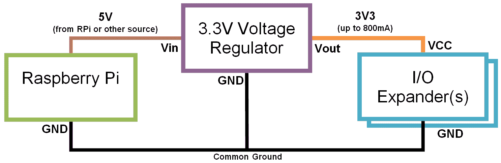

使用电压调节器与树莓派配合

输入电压（Vin）由树莓派（例如，来自 GPIO 引脚头，如 5 V 引脚 2）提供。然而，只要在 4.5 V 至 15 V 之间并且能够提供足够的电流，Vin 也可以由任何其他电源（或电池组）提供。重要的是要确保树莓派的接地连接（GND）、电源（如果使用单独的电源）、稳压器和 I/O 扩展器的接地都连接在一起（作为公共接地）。

# 使用您自己的 I/O 扩展模块

您可以使用以下电路中可用的 I/O 扩展模块之一（或者直接使用 MCP23017 芯片）来控制大多数与 HD44780 兼容的 LCD 显示屏：

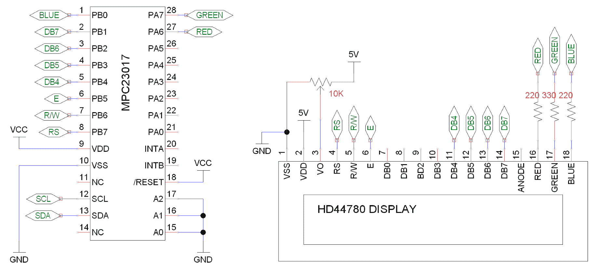

I/O 扩展器和兼容 HD44780 的显示屏

D-Pad 电路，使用 Python-to-drive 硬件，也可以连接到扩展器的剩余端口 A 引脚（`PA0` 连接到按钮 1，`PA1` 连接到右，`PA2` 连接到下，`PA3` 连接到上，`PA4` 连接到左，以及 `PA5` 连接到按钮 2）。与前面的示例一样，按钮将连接到 `PA0` 到 `PA4`（WiringPi 引脚编号 100 到 104）；除此之外，我们还添加了第二个按钮连接到 `PA5`（WiringPi 引脚编号 105）。

# 直接控制液晶数字显示屏

或者，您也可以使用以下连接直接从树莓派驱动屏幕：

我们在这里没有使用 I²C 总线。

| **LCD** | **VSS** | **VDD** | **V0** | **RS** | **RW** | **E** | **DB4** | **DB5** | **DB6** | **DB7** |
| --- | --- | --- | --- | --- | --- | --- | --- | --- | --- | --- |
| **LCD 引脚** | 1 | 2 | 3 | 4 | 5 | 6 | 11 | 12 | 13 | 14 |
| **树莓派 GPIO** | 6 (GND) | 2 (5V) | 对比度 | 11 | 13 (GND) | 15 | 12 | 16 | 18 | 22 |

前面的表格列出了树莓派与 HD44780 兼容的字母数字显示模块之间所需连接。

对比针（V0）可以像之前一样连接到一个可变电阻（一边连接到 5V 电源，另一边连接到 GND）；尽管如此，根据屏幕的不同，你可能发现你可以直接连接到 GND/5V 以获得最大对比度。

`wiringpi2` LCD 库假设 RW 引脚连接到 GND（只读）；这避免了 LCD 如果直接连接到 Raspberry Pi 时发送数据的风险（这会成为一个问题，因为屏幕由 5 V 供电，并将使用 5 V 逻辑发送数据）。

确保您使用新的 `AF_XX` 引用更新代码，并在 `gpiosetup()` 函数内更改设置以通过物理引脚号进行引用。我们还可以跳过 MCP23017 设备的设置。

查看以下命令：

```py
wiringpi2.wiringPiSetup()
wiringpi2.mcp23017Setup(AF_BASE,0x20)  
```

将前面的命令替换为以下命令：

```py
wiringpi.wiringPiSetupPhys()  
```

你可以看到，我们只需更改引脚引用即可在是否使用 I/O 扩展器之间切换，这显示了 `wiringpi2` 实现是多么方便。

# 在 SQLite 数据库中捕获数据

数据库是存储大量结构化数据的同时保持访问和搜索特定数据能力的完美方式。**结构化查询语言**（**SQL**）是一组标准的命令，用于更新和查询数据库。在此示例中，我们将使用 SQLite（一个轻量级、自包含的 SQL 数据库系统实现）。

在本章中，我们将从我们的 ADC（或本地数据源）收集原始数据，并构建我们自己的数据库。然后我们可以使用一个名为`sqlite3`的 Python 库向数据库添加数据，并对其进行查询：

```py
   ##            Timestamp  0:Light  1:Temperature   2:External  3:Potentiometer 
    0 2015-06-16 21:30:51      225            212          122              216 
    1  2015-06-16 21:30:52      225            212          148              216 
    2  2015-06-16 21:30:53      225            212          113              216 
    3  2015-06-16 21:30:54      225            212          137              216 
    4  2015-06-16 21:30:55      225            212          142              216 
    5  2015-06-16 21:30:56      225            212          115              216 
    6  2015-06-16 21:30:57      225            212          149              216 
    7  2015-06-16 21:30:58      225            212          128              216 
    8  2015-06-16 21:30:59      225            212          123              216 
    9  2015-06-16 21:31:02      225            212          147              216  
```

# 准备就绪

为了在我们的数据库中捕获数据，我们将安装 SQLite，以便它可以与 Python 的内置模块`sqlite3`一起使用。使用以下命令安装 SQLite：

```py
sudo apt-get install sqlite3  
```

接下来，我们将使用 SQLite 执行一些基本操作，以了解如何使用 SQL 查询。

直接运行 SQLite，使用以下命令创建一个新的 `test.db` 数据库文件：

```py
sqlite3 test.db
SQLite version 3.7.13 2012-06-11 02:05:22
Enter ".help" for instructions
Enter SQL statements terminated with a ";"
sqlite>  
```

这将打开一个 SQLite 控制台，在其中我们可以直接输入 SQL 命令。例如，以下命令将创建一个新表，添加一些数据，显示内容，然后删除该表：

```py
CREATE TABLE mytable (info TEXT, info2 TEXT,);
INSERT INTO mytable VALUES ("John","Smith");
INSERT INTO mytable VALUES ("Mary","Jane");
John|Smith
Mary|Jane
DROP TABLE mytable;
.exit  
```

你需要与之前食谱中详细说明的相同硬件设置，如*使用 I²C 总线的设备*食谱的*准备就绪*部分所述。

# 如何做到这一点...

创建以下脚本，命名为 `mysqlite_adc.py`：

```py
#!/usr/bin/python3 
#mysql_adc.py 
import sqlite3 
import datetime 
import data_adc as dataDevice 
import time 
import os 

DEBUG=True 
SHOWSQL=True 
CLEARDATA=False 
VAL0=0;VAL1=1;VAL2=2;VAL3=3 #Set data order 
FORMATBODY="%5s %8s %14s %12s %16s" 
FORMATLIST="%5s %12s %10s %16s %7s" 
DATEBASE_DIR="/var/databases/datasite/" 
DATEBASE=DATEBASE_DIR+"mydatabase.db" 
TABLE="recordeddata" 
DELAY=1 #approximate seconds between samples 

def captureSamples(cursor): 
    if(CLEARDATA):cursor.execute("DELETE FROM %s" %(TABLE)) 
    myData = dataDevice.device() 
    myDataNames=myData.getName() 

    if(DEBUG):print(FORMATBODY%("##",myDataNames[VAL0], 
                                myDataNames[VAL1],myDataNames[VAL2], 
                                myDataNames[VAL3])) 
    for x in range(10): 
        data=myData.getNew() 
        for i,dataName in enumerate(myDataNames): 
            sqlquery = "INSERT INTO %s (itm_name, itm_value) " %(TABLE) +  
                       "VALUES('%s', %s)"  
                        %(str(dataName),str(data[i])) 
            if (SHOWSQL):print(sqlquery) 
            cursor.execute(sqlquery) 

        if(DEBUG):print(FORMATBODY%(x, 
                                    data[VAL0],data[VAL1], 
                                    data[VAL2],data[VAL3])) 
        time.sleep(DELAY) 
    cursor.commit() 

def displayAll(connect): 
    sqlquery="SELECT * FROM %s" %(TABLE) 
    if (SHOWSQL):print(sqlquery) 
    cursor = connect.execute (sqlquery) 
    print(FORMATLIST%("","Date","Time","Name","Value")) 

    for x,column in enumerate(cursor.fetchall()): 
       print(FORMATLIST%(x,str(column[0]),str(column[1]), 
                         str(column[2]),str(column[3]))) 

def createTable(cursor): 
    print("Create a new table: %s" %(TABLE)) 
    sqlquery="CREATE TABLE %s (" %(TABLE) +  
             "itm_date DEFAULT (date('now','localtime')), " +  
             "itm_time DEFAULT (time('now','localtime')), " +  
             "itm_name, itm_value)"  
    if (SHOWSQL):print(sqlquery) 
    cursor.execute(sqlquery) 
    cursor.commit() 

def openTable(cursor): 
    try: 
        displayAll(cursor) 
    except sqlite3.OperationalError: 
        print("Table does not exist in database") 
        createTable(cursor) 
    finally: 
        captureSamples(cursor) 
        displayAll(cursor) 

try: 
    if not os.path.exists(DATEBASE_DIR): 
        os.makedirs(DATEBASE_DIR) 
    connection = sqlite3.connect(DATEBASE) 
    try: 
        openTable(connection) 
    finally: 
        connection.close() 
except sqlite3.OperationalError: 
    print("Unable to open Database") 
finally: 
    print("Done") 

#End 
```

如果您没有 ADC 模块硬件，可以通过将`dataDevice`模块设置为`data_local`来捕获本地数据。请确保您在同一目录下有`data_local.py`（来自*更多内容...*部分，在*使用模数转换器读取模拟数据*菜谱中），如下脚本所示：

`导入本地数据作为 dataDevice`

这将捕获本地数据（RAM、CPU 活动、温度等）并存储到 SQLite 数据库中，而不是 ADC 样本。

# 它是如何工作的...

当脚本首次运行时，它将创建一个名为 `mydatabase.db` 的新 SQLite 数据库文件，并将添加一个名为 `recordeddata` 的表。该表由 `createTable()` 函数生成，该函数执行以下 SQLite 命令：

```py
CREATE TABLE recordeddata 
( 
    itm_date DEFAULT (date('now','localtime')), 
    itm_time DEFAULT (time('now','localtime')), 
    itm_name, 
    itm_value 
) 
```

新表格将包含以下数据项：

| **姓名** | **描述** |
| --- | --- |
| `itm_date` | 用于存储数据样本的日期。当创建数据记录时，将应用当前日期（使用 `date('now','localtime')`）作为默认值。 |
| `itm_time` | 用于存储数据样本的时间。当数据记录创建时，当前时间（使用 `time('now','localtime')`）被应用为默认值。 |
| `itm_name` | 用于记录样本的名称。 |
| `itm_value` | 用于保存采样值。 |

我们随后使用与之前在*记录和绘图数据*配方中相同的方法从 ADC 捕获 10 个数据样本（如`captureSamples()`函数所示）。然而，这次，我们将捕获到的数据添加到我们新的 SQLite 数据库表中，使用以下 SQL 命令（通过`cursor.execute(sqlquery)`应用）:

```py
INSERT INTO recordeddata 
    (itm_name, itm_value) VALUES ('0:Light', 210) 
```

当前日期和时间将在创建每条记录时默认添加。最终我们得到一组 40 条记录（每个 ADC 采样周期捕获 4 条记录），这些记录现在存储在 SQLite 数据库中：

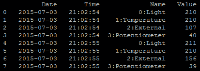

已捕获并存储了八个 ADC 样本到 SQLite 数据库中

在记录创建完成后，我们必须记得调用 `cursor.commit()`，这将把所有新记录保存到数据库中。

脚本的最后一部分调用`displayAll()`，它将使用以下 SQL 命令：

```py
SELECT * FROM recordeddata 
```

这将选择`recordeddata`表中的所有数据记录，我们使用`cursor.fetch()`来提供作为列表的所选数据，我们可以遍历这个列表：

```py
for x,column in enumerate(cursor.fetchall()): 
    print(FORMATLIST%(x,str(column[0]),str(column[1]), 
                      str(column[2]),str(column[3]))) 
```

这使我们能够打印出数据库的全部内容，显示捕获的数据。

注意，在此脚本中我们使用了`try`、`except`和`finally`结构来尝试处理用户在运行脚本时可能遇到的大部分情况。

首先，我们确保如果数据库目录不存在，就创建它。接下来，我们尝试打开数据库文件；如果数据库文件尚未存在，这个过程将自动创建一个新的数据库文件。如果这些初始步骤中的任何一个失败（例如，因为它们没有读写权限），我们就无法继续，因此我们报告无法打开数据库，并简单地退出脚本。

接下来，我们尝试在数据库中打开所需的表并显示它。如果数据库文件是全新的，这个操作将始终失败，因为它将是空的。然而，如果发生这种情况，我们只需捕获异常，在继续脚本以将我们的样本数据添加到表中并显示之前创建该表。

这使得脚本能够优雅地处理潜在问题，采取纠正措施，然后继续平稳运行。下次运行脚本时，数据库和表已经存在，因此我们不需要再次创建它们，并且可以将样本数据附加到同一数据库文件内的表中。

# 还有更多...

可用的 SQL 服务器版本有很多（例如 MySQL、Microsoft SQL Server 和 PostgreSQL），然而它们至少应该具备以下基本命令（或等效命令）：

```py
CREATE, INSERT, SELECT, WHERE, UPDATE, SET, DELETE, and DROP 
```

你应该会发现，即使你选择使用与这里使用的 SQLite 不同的 SQL 服务器，SQL 命令也将相对相似。

# CREATE TABLE 命令

`CREATE TABLE` 命令用于通过指定列名（以及如果需要还可以设置默认值）来定义一个新的表：

```py
CREATE TABLE table_name ( 
    column_name1 TEXT,  
    column_name2 INTEGER DEFAULT 0, 
    column_name3 REAL ) 
```

之前的 SQL 命令将创建一个名为 `table_name` 的新表，包含三个数据项。一列将包含文本，其他列包含整数（例如，1，3，-9），最后，一列将包含实数（例如，5.6，3.1749，1.0）。

# INSERT 命令

`INSERT` 命令会将特定条目添加到数据库中的表中：

```py
INSERT INTO table_name (column_name1name1, column_name2name2, column_name3)name3) 
    VALUES ('Terry'Terry Pratchett', 6666, 27.082015)082015) 
```

这将把提供的值输入到表格中相应的列。

# SELECT 命令

`SELECT` 命令允许我们指定数据库表中特定的列或列，返回包含数据的记录列表：

```py
SELECT column_name1, column_name2 FROM table_name 
```

它还可以让我们使用此命令选择所有项目：

```py
SELECT * FROM table_name 
```

# WHERE 命令

`WHERE` 命令用于指定要选择、更新或删除的特定条目：

```py
SELECT * FROM table_name 
    WHERE column_name1= 'Terry Pratchett' 
```

这将 `SELECT` 任何 `column_name1` 字段匹配 `'Terry Pratchett'` 的记录。

# UPDATE 命令

`UPDATE` 命令将允许我们更改（`SET`）指定列中数据的值。我们还可以结合使用 `WHERE` 命令来限制更改应用到的记录：

```py
UPDATE table_name 
    SET column_name2=49name2=49,column_name3=30name3=30.111997 
    WHERE column_name1name1= 'Douglas Adams'Adams'; 
```

# DELETE 命令

`DELETE` 命令允许使用 `WHERE` 语句选中的任何记录从指定的表中删除。然而，如果选择整个表，使用 `DELETE * FROM table_name` 将会删除表中的全部内容：

```py
DELETE FROM table_name 
    WHERE columncolumn_name2=9999 
```

# DROP 命令

`DROP` 命令允许将表完全从数据库中删除：

```py
DROP table_name  
```

警告：这将永久删除指定表中存储的所有数据及其结构。

# 查看来自您自己的网络服务器的数据

将信息和数据收集到数据库中非常有帮助，但如果它们被锁在数据库或文件中，那么它们就没什么用处了。然而，如果我们允许通过网页查看存储的数据，那么它将更容易获取；我们不仅可以从其他设备查看数据，还可以与同一网络上的其他人共享数据。

我们将创建一个本地网络服务器来查询和显示捕获的 SQLite 数据，并允许通过 PHP 网络界面进行查看。这将使得数据不仅可以通过树莓派上的网络浏览器查看，还可以在本地网络上的其他设备，如手机或平板电脑上查看：

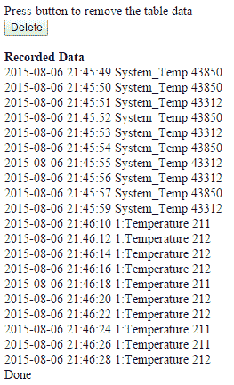

通过网页显示的 SQLite 数据库中捕获的数据

使用网络服务器来输入和显示信息是一种强大的方式，可以让广泛的用户与您的项目进行交互。以下示例演示了一个可以针对各种用途进行定制的网络服务器设置。

# 准备就绪

确保你已经完成了之前的食谱，以便传感器数据已经被收集并存储在 SQLite 数据库中。我们需要安装一个网络服务器（**Apache2**）并启用 PHP 支持以允许 SQLite 访问。

使用以下命令来安装一个 Web 服务器和 PHP：

```py
sudo apt-get update
sudo aptitude install apache2 php5 php5-sqlite  
```

`/var/www/` 目录由 web 服务器使用；默认情况下，它将加载 `index.html`（或 `index.php`）——否则，它将仅显示目录内文件的链接列表。

要测试网页服务器是否正在运行，创建一个默认的`index.html`页面。为此，您需要使用`sudo`权限创建文件（`/var/www/`目录受到普通用户更改的保护）。请使用以下命令：

```py
sudo nano /var/www/index.html  
```

使用以下内容创建 `index.html`：

```py
<h1>It works!</h1> 
```

关闭并保存文件（使用 *Ctrl* + *X*，*Y* 和 *Enter*）。

如果你正在使用带有屏幕的树莓派，你可以通过加载桌面来检查它是否正常工作：

```py
startx  
```

然后，打开网页浏览器（**epiphany-browser**）并输入`http://localhost`作为地址。你应该会看到以下测试页面，表明网络服务器正在运行：


树莓派浏览器显示的测试页面，位于 http://localhost

如果你正在远程使用树莓派或者它已经连接到你的网络，你也应该能够在网络上的另一台电脑上查看该页面。首先，确定树莓派的 IP 地址（使用`sudo hostname -I`命令），然后将其作为地址在你的网页浏览器中使用。你甚至可能发现可以使用树莓派的实际主机名（默认情况下，这是`http://raspberrypi/`）。

如果您无法从另一台电脑上看到网页，请确保您没有启用可能阻止它的防火墙（在电脑本身上，或在您的路由器上）。

接下来，我们可以测试 PHP 是否运行正常。我们可以创建一个名为 `test.php` 的网页，并确保它位于 `/var/www/ 目录`：

```py
<?php 
  phpinfo(); 
?>; 
```

用于在 SQLite 数据库中查看数据的 PHP 网页具有以下详细信息：

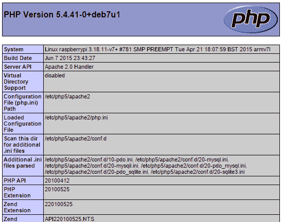

在 http://localhost/test.php 查看 test.php 页面

我们现在准备编写自己的 PHP 网页来查看 SQLite 数据库中的数据。

# 如何做到这一点...

1.  创建以下 PHP 文件并将它们保存在名为`/var/www/./`的 Web 服务器目录中。

1.  使用以下命令创建 PHP 文件：

```py
sudo nano /var/www/show_data_lite.php

```

1.  `show_data_lite.php` 文件应包含以下内容：

```py
<head> 
<title>DatabaseDatabase Data</title> 
<meta http-equiv="refresh" content="10" > 
</head> 
<body> 

Press button to remove the table data 
<br> 
<input type="button" onclick="location.href = 'del_data_lite.php';" value="Delete"> 
<br><br> 
<b>Recorded Data</b><br> 
<?php 
$db = new PDO("sqlite:/var/databases/datasitedatasite/mydatabase.db"); 
//SQL query 
$strSQL = "SELECT * FROM recordeddatarecordeddata WHERE itmitm_name LIKE '%'%temp%'"; 
//Execute the query 
$response = $db->query($strSQL); 
//Loop through the response 
while($column = $response->fetch()) 
{ 
   //Display the content of the response 
   echo $column[0] . " "; 
   echo $column[1] . " "; 
   echo $column[2] . " "; 
   echo $column[3] . "<br />"; 
} 
?> 
Done 
</body> 
</html>
```

1.  使用以下命令创建 PHP 文件：

```py
sudo nano /var/www/del_data_lite.php
<html>
<body>

Remove all the data in the table.
<br>
<?php
$db = new PDO("sqlite:/var/databases/datasitedatasite/mydatabase.db");
//SQL query
$strSQL = "DROPDROP TABLErecordeddata recordeddata";
//ExecuteExecute the query
$response = $db->query($strSQL);

if ($response == 1)
    {
      echo "Result: DELETED DATA";
    }
else
    {
      echo "Error: Ensure table exists and database directory is owned    
by www-data";
    }
?>
<br><br>
Press button to return to data display.
<br>
<input type="button" onclick="location.href = 'show'show_data_lite.php';" value="Return">

</body>
</html>     
```

为了让 PHP 代码能够删除数据库中的表，它需要被 Web 服务器可写。使用以下命令来允许它可写：

`sudo chown www-data /var/databases/datasite -R`

1.  如果您使用以下地址在网页浏览器中打开`show_data_lite.php`文件，它将显示为一个网页：

```py
http://localhost/showshow_data_lite.php
```

1.  或者，您可以通过引用树莓派的 IP 地址来打开网页（如果您愿意，可以在您网络中的另一台计算机上打开）：

```py
http://192.168.1.101/showshow_data_lite.php 
```

您可能可以使用主机名来代替（默认情况下，这将使地址变为`http://raspberrypi/show_data_lite.php`）。然而，这可能会取决于您的网络设置。

如果没有数据，请确保运行`mysqlite_adc.py`脚本来捕获额外的数据。

1.  要使 `show_data_lite.php` 页面在访问您的树莓派网页地址时自动显示（而不是显示 *It works!* 页面），我们可以将 `index.html` 改为以下内容：

```py
<meta http-equiv="refresh" content="0; URL='show_data_lite.php' " /> 
```

这将自动将浏览器重定向到加载我们的`show_data_lite.php`页面。

# 它是如何工作的...

`show_data_lite.php` 文件应显示存储在 SQLite 数据库中的温度数据（无论是来自 ADC 样本还是本地数据源）。

`show_data_lite.php` 文件由标准的 HTML 代码以及一个特殊的 PHP 代码部分组成。HTML 代码将 `ACD Data` 设置为页面头部部分的标题，并使用以下命令使页面每 10 秒自动刷新：

```py
<meta http-equiv="refresh" content="10" > 
```

接下来，我们定义一个`删除`按钮，当点击时将加载`del_data_lite.php`页面：

```py
<input type="button" onclick="location.href = 'del_data_lite.php';" value="Delete"> 
```

最后，我们使用 PHP 代码部分来加载 SQLite 数据库并显示通道 0 的数据。

我们使用以下 PHP 命令来打开我们之前存储数据的 SQLite 数据库（位于`/var/databases/testsites/mydatabase.db`）：

```py
$db = new PDO("sqlite:/var/databases/testsite/mydatabase.db"); 
```

接下来，我们使用以下 SQLite 查询来选择所有文本中包含 `0:` 的条目（例如，`0:Light`）：

```py
SELECT * FROM recordeddatarecordeddata WHERE itm_namename LIKE '%temp%''
```

注意，尽管我们现在使用的是 PHP，但我们与 SQLite 数据库使用的查询与使用`sqlite3` Python 模块时相同。

我们现在将查询结果收集到`$response`变量中：

```py
$response = $db->query($strSQL); 
Allowing us to use fetch() (like we used cursor.fetchall() previously) to list all the data columns in each of the data entries within the response. 
while($column = $response->fetch()) 
{ 
   //Display the content of the response 
   echo $column[0] . " "; 
   echo $column[1] . " "; 
   echo $column[2] . " "; 
   echo $column[3] . "<br />"; 
} 
?> 
```

`del_data_lite.php` 文件相当相似；它首先像之前一样重新打开 `mydatabase.db` 文件。然后执行以下 SQLite 查询：

```py
DROP TABLE recordeddata 
```

如在 *更多内容...* 部分所述，这将从数据库中删除 `recordeddata` 表。如果 `response` 不等于 1，则操作未完成。最可能的原因是包含 `mydatabase.db` 文件的目录无法被 Web 服务器写入（参见 *如何操作...* 部分的备注，关于将文件所有者更改为 `www-data`）。

最后，我们提供了一个按钮，点击后会将用户带回到`show_data_lite.php`页面（该页面将显示已记录的数据已被清除）：

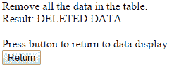

Show_data_lite.php

# 还有更多...

你可能已经注意到，这个菜谱更多地关注了 HTML 和 PHP 而不是 Python（是的，看看封面——这仍然是一本针对 Python 程序员的书籍！）。然而，重要的是要记住，工程的关键部分是整合和结合不同的技术以产生预期的结果。

设计上，Python 非常适合这类任务，因为它允许轻松定制并与大量其他语言和模块集成。我们完全可以只用 Python 来完成所有工作，但为什么不利用现有的解决方案呢？毕竟，它们通常有很好的文档记录，经过广泛的测试，并且通常符合行业标准。

# 安全

SQL 数据库被广泛应用于存储各种信息，从产品信息到客户详情。在这种情况下，用户可能需要输入信息，这些信息随后会被形成 SQL 查询。在一个实施不当的系统里，恶意用户可能能够在他们的响应中包含额外的 SQL 语法，从而允许他们危害 SQL 数据库（可能通过访问敏感信息、修改它或简单地删除它）。

例如，当在网页中请求用户名时，用户可以输入以下文本：

```py
John; DELETE FROM Orders  
```

如果直接使用它来构建 SQL 查询，我们最终会得到以下结果：

```py
SELECT * FROM Users WHERE UserName = John; DELETE FROM CurrentOrders  
```

我们刚刚允许攻击者删除了`CurrentOrders`表中的所有内容！

使用用户输入作为 SQL 查询的一部分意味着我们必须小心允许执行哪些命令。在这个例子中，用户可能能够删除可能非常重要的信息，这可能会对公司的声誉造成很大的损失。

这种技术被称为 SQL 注入，可以通过使用 SQLite `execute()`函数的参数选项轻松防范。我们可以将我们的 Python SQLite 查询替换为一个更安全的版本，如下所示：

```py
sqlquery = "INSERT INTO %s (itm_name, itm_value) VALUES(?, ?)" %(TABLE) 
cursor.execute(sqlquery, (str(dataName), str(data[i])) 
```

与盲目构建 SQL 查询不同，SQLite 模块首先会检查提供的参数是否是数据库中可接受的合法值。然后，它会确保将这些参数插入到命令中不会导致额外的 SQL 操作。最后，`dataName` 和 `data[i]` 参数的值将被用来替换 `?` 字符，以生成最终的安全的 SQLite 查询。

# 使用 MySQL 代替

SQLite，本菜谱中使用的数据库，只是众多 SQL 数据库中的一种。它适用于只需要相对较小的数据库和最少资源的简单项目。然而，对于需要额外功能（如用户账户以控制访问和额外的安全性）的大型项目，您可以使用替代品，例如 MySQL。

要使用不同的 SQL 数据库，您需要调整我们用来捕获条目的 Python 代码，使用合适的 Python 模块。

对于 MySQL (`mysql-server`)，我们可以使用一个与 Python-3 兼容的库，称为 **PyMySQL** 来与之接口。有关如何使用此库的更多信息，请参阅 PyMySQL 网站 ([`github.com/PyMySQL/PyMySQL`](https://github.com/PyMySQL/PyMySQL))。

要使用 PHP 与 MySQL，你还需要 PHP MySQL (`php5-mysql`)；更多详细信息，请参阅 W3 Schools 上的优秀资源（[`www.w3schools.com/php/php_mysql_connect.asp`](http://www.w3schools.com/php/php_mysql_connect.asp)）。

你会注意到，尽管不同的 SQL 实现之间存在一些细微的差别，但无论你选择哪一种，一般的概念和命令现在都应该对你来说很熟悉了。

# 感知并发送数据到在线服务

在本节中，我们将使用一个名为 Xively 的在线服务。该服务使我们能够在线连接、传输和查看数据。Xively 使用一种常见的协议，称为**表示状态转移**（**REST**），用于通过 HTTP 传输信息。许多服务，如 Facebook 和 Twitter，都使用各种密钥和访问令牌，以确保数据在授权应用程序和验证网站之间安全传输。

您可以使用名为 `requests` 的 Python 库手动执行大多数 REST 操作（例如 `POST`、`GET`、`SET` 等方法）([`docs.python-requests.org`](http://docs.python-requests.org)).

然而，通常使用你打算使用的服务的特定库会更容易。它们将处理授权过程并提供访问函数，如果服务发生变化，可以更新库而不是你的代码。

我们将使用`xively-python`库，它提供了 Python 函数，使我们能够轻松地与该网站交互。

关于`xively-python`库的详细信息，请参阅[`xively.github.io/xively-python/`](http://xively.github.io/xively-python/)。

Xively 收集的数据显示在以下截图：

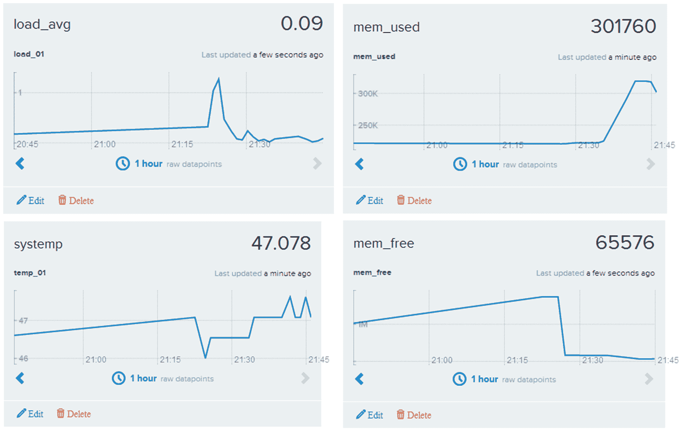

Xively 收集并绘制使用 REST 传输的数据

# 准备就绪

您需要在[www.xively.com](http://www.xively.com)创建一个账户，我们将使用该账户接收我们的数据。访问该网站并注册一个免费的开发者账户：


注册并创建一个 Xively 账户

一旦您注册并验证了您的账户，您就可以按照指示进行试驾示例，这将展示您如何从智能手机（陀螺仪数据、位置等）链接数据，这将让您体验一下我们可以用树莓派做到的事情。

当您登录时，您将被带到开发设备仪表板（位于 WebTools 下拉菜单中）：

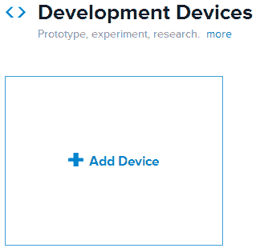

添加新设备

选择+添加设备并填写详细信息，给你的设备起一个名字，并将设备设置为私有。

您现在将看到您远程设备的控制页面，其中包含您连接设备所需的所有信息，以及数据将显示的位置：

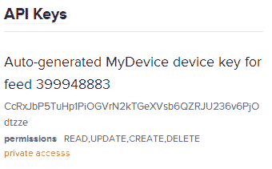

示例 API 密钥和订阅号（这将为您的设备唯一）

尽管这个页面上有许多信息，但你只需要两个关键信息点：

+   API 密钥（即`API Keys`部分中的长代码），如下所示：

```py
API_KEY = CcRxJbP5TuHp1PiOGVrN2kTGeXVsb6QZRJU236v6PjOdtzze 
```

+   饲料编号（在`API 密钥`部分提及，并在页面顶部列出），如下所示：

```py
FEED_ID = 399948883 
```

现在我们已经拥有了连接 Xively 所需的所有细节，我们可以专注于 Raspberry Pi 这一方面的事情。

我们将使用 `pip-3.2` 来安装 Xively，具体步骤如下：

```py
sudo pip-3.2 install xively-python  
```

确保以下内容得到报告：

```py
Successfully installed xively-python requests  
```

你现在可以准备从你的树莓派发送一些数据了。

# 如何做到这一点...

创建以下名为 `xivelyLog.py` 的脚本。确保在代码中设置 `FEED_ID` 和 `API_KEY`，以匹配您创建的设备：

```py
#!/usr/bin/env python3 
#xivelylog.py 
import xively 
import time 
import datetime 
import requests 
from random import randint 
import data_local as dataDevice 

# Set the FEED_ID and API_KEY from your account 
FEED_ID = 399948883 
API_KEY = "CcRxJbP5TuHp1PiOGVrN2kTGeXVsb6QZRJU236v6PjOdtzze" 
api = xively.XivelyAPIClient(API_KEY) # initialize api client 
DEBUG=True 

myData = dataDevice.device() 
myDataNames=myData.getName() 

def get_datastream(feed,name,tags): 
  try: 
    datastream = feed.datastreams.get(name) 
    if DEBUG:print ("Found existing datastream") 
    return datastream 
  except: 
    if DEBUG:print ("Creating new datastream") 
    datastream = feed.datastreams.create(name, tags=tags) 
    return datastream 

def run(): 
  print ("Connecting to Xively") 
  feed = api.feeds.get(FEED_ID) 
  if DEBUG:print ("Got feed" + str(feed)) 
  datastreams=[] 
  for dataName in myDataNames: 
    dstream = get_datastream(feed,dataName,dataName) 
    if DEBUG:print ("Got %s datastream:%s"%(dataName,dstream)) 
    datastreams.append(dstream) 

  while True: 
    data=myData.getNew() 
    for idx,dataValue in enumerate(data): 
      if DEBUG: 
        print ("Updating %s: %s" % (dataName,dataValue)) 
      datastreams[idx].current_value = dataValue 
      datastreams[idx].at = datetime.datetime.utcnow() 
    try: 
      for ds in datastreams: 
        ds.update() 
    except requests.HTTPError as e: 
      print ("HTTPError({0}): {1}".format(e.errno, e.strerror)) 
    time.sleep(60) 

run() 
#End 
```

# 它是如何工作的...

首先，我们初始化 Xively API 客户端，并向其提供`API_KEY`（这授权我们向之前创建的`Xively`设备发送数据）。接下来，我们使用`FEED_ID`将我们链接到我们想要发送数据的特定数据流。最后，我们请求数据流以连接到（如果它尚未存在于数据流中，`get_datastream()`函数将为我们创建一个）。

对于每个输入数据流，我们提供一个`name`函数和`tags`（这些是帮助我们识别数据的关键词；我们可以用我们的数据名称来使用这些）。

一旦我们定义了我们的数据流，我们就进入`main`循环。在这里，我们从`dataDevice`收集我们的数据值。然后我们设置每个数据项的`current_value`函数以及数据的时间戳，并将它们应用到我们的数据流对象中。

最后，当所有数据准备就绪时，我们更新每个数据流，数据被发送到 Xively，并在几分钟内出现在设备的仪表板上。

我们可以使用标准网页浏览器登录我们的 Xively 账户，查看实时传入的数据。这为我们提供了在任何地方（如果需要，也许是从几个树莓派同时）发送数据和远程监控数据的方法。该服务甚至支持创建触发器，当某些项目超出预期范围、达到特定值或匹配设定标准时，可以发送额外的消息。触发器反过来可以用来控制其他设备或触发警报，等等。它们也可以用于其他平台，例如 ThingSpeak 或 plot.ly。

# 参见

AirPi 空气质量与天气项目([`airpi.es`](http://airpi.es))展示了如何添加您自己的传感器或使用他们的 AirPi 套件来创建您自己的空气质量与天气站（并将数据记录到您的 Xively 账户）。该网站还允许您与世界各地的其他人共享您的 Xively 数据流。
