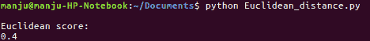
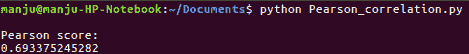

# 第十四章：我能为您推荐一部电影吗？

在本章中，我们将介绍以下菜谱：

+   欧几里得距离得分计算

+   皮尔逊相关系数计算

+   如何在数据集中找到相似的用户

+   如何开发电影推荐模块

+   推荐系统应用

# 简介

电影推荐是根据用户的兴趣预测电影。数据库中的内容会被过滤，并为用户推荐合适的电影。推荐合适的电影增加了用户购买电影的概率。协同过滤被用于构建电影推荐系统。它考虑了当前用户过去的行为。它还考虑了其他用户给出的评分。协同过滤包括在数据集中寻找和计算欧几里得距离、皮尔逊相关性和寻找相似用户。

# 计算欧几里得距离得分

构建推荐引擎的第一步包括在数据库中寻找相似用户。欧几里得距离得分是寻找相似性的一个度量标准。

# 准备就绪

NumPy（数值 Python）需要在 Raspberry Pi 3 上安装以计算欧几里得距离。读者可以在 Raspberry Pi 3 终端中输入以下命令来安装`numpy`：

```py
sudo apt-get -y install python-numpy 
```

# 如何做到这一点...

1.  我们将创建一个新的 Python 文件并将以下包导入到其中：

```py
import json 
import numpy as np  
```

1.  要计算两个用户之间的欧几里得得分，我们将定义一个新的函数。让我们检查数据库中用户的存活性：

```py
# The following code will return the Euclidean distance score between user1 and user2: 

def euclidean_dist_score(dataset, FirstUser, SecondUser): 
  if FirstUser not in dataset: 
    raiseTypeError('User ' + FirstUser + ' not present in the dataset') 
  if SecondUser not in dataset: 
    raiseTypeError('User ' + SecondUser + ' not present in the dataset') 
```

1.  我们现在将提取那些被用户评分的电影。然后我们将计算得分：

```py
  # Movies rated by both FirstUser and SecondUser 
  Both_User_rated = {} 
  for element in dataset[FirstUser]: 
    if element in dataset[SecondUser]: 
      Both_User_rated[element] = 1
```

1.  没有共同的电影表示第一位和第二位用户之间没有相似性。（否则无法在数据库中计算评分）：

```py
  # Score 0 indicate no common movies 
  if len(Both_User_rated) == 0: 
    return 0
```

1.  如果评分是常见的，计算平方差的和，然后计算结果的平方根，最后进行归一化。此时，分数将在零和一之间：

```py
  SquareDifference = [] 
  for element in dataset[FirstUser]: 
    if element in dataset[SecondUser]: 
      SquareDifference.append(np.square(dataset[FirstUser][element] - 
dataset[SecondUser][element]))    
  return 1 / (1 + np.sqrt(np.sum(SquareDifference))) 
```

如果两个用户评分相同，那么平方差的和将是一个较小的值。因此，得分将会很高。这正是这里的宗旨。

1.  我们将命名我们的数据文件为`movie_rates.json`。现在我们来加载它：

```py
if __name__=='__main__': 
  data_file = 'movie_rates.json' 
  with open(data_file, 's') as m: 
    data = json.loads(m.read()) 
```

1.  让我们计算两个随机用户之间的欧几里得距离得分：

```py
FirstUser = 'Steven Ferndndes' 
SecondUser = 'Ramesh Nayak' 
print "nEuclidean score:" 
print euclidean_dist_score(data, FirstUser, SecondUser) 
```

1.  上述代码将在终端中打印欧几里得距离得分：



# 它是如何工作的...

读者可以参考文章《相似性与推荐系统》来了解欧几里得距离是如何工作的：

[`www.inf.ed.ac.uk/teaching/courses/inf2b/learnnotes/inf2b-learn-note02-2up.pdf`](http://www.inf.ed.ac.uk/teaching/courses/inf2b/learnnotes/inf2b-learn-note02-2up.pdf)

# 还有更多...

读者可以参考文章《协同过滤推荐系统中使用的各种指标比较》来了解更多关于推荐系统中使用的各种指标：

[`ieeexplore.ieee.org/document/7346670/`](http://ieeexplore.ieee.org/document/7346670/)

# 参见

+   *Python 构建推荐引擎快速指南*：

[`www.analyticsvidhya.com/blog/2016/06/quick-guide-build-recommendation-engine-python/`](https://www.analyticsvidhya.com/blog/2016/06/quick-guide-build-recommendation-engine-python/)

# 计算皮尔逊相关系数

欧几里得距离假设样本点以球形方式分布在样本均值周围，这并不总是成立。因此，使用皮尔逊相关系数分数而不是欧几里得距离分数。接下来将解释皮尔逊相关系数分数的计算方法。

# 如何做到这一点...

1.  我们将创建一个新的 Python 文件并导入以下包：

```py
import json 
import numpy as np
```

1.  要计算两个用户之间的皮尔逊相关系数，我们将定义一个新的函数。让我们检查数据库中用户的存在情况：

```py
# Returns the Pearson correlation score between user1 and user2 
def pearson _dist_score(dataset, FirstUser, SecondUser): 
  if FirstUser not in dataset: 
    raise TypeError('User ' + FirstUser + ' not present in the dataset') 
  if SecondUser not in dataset: 
    raise TypeError('User ' + SecondUser + ' not present in the dataset') 
```

1.  我们现在将提取那些被用户评分的电影：

```py
  # Movies rated by both FirstUser and SecondUser 
  Both_User_rated = {} 
  for item in dataset[FirstUser]: 
    if item in dataset[SecondUser]: 
      both_User_rated[element] = 1 
  rating_number= len(both_User_rated) 

```

1.  没有共同的电影表示第一个用户和第二个用户之间没有相似性；因此，我们返回零：

```py
  # Score 0 indicate no common movies 
  if rating_number == 0: 
    return 0 
```

1.  计算常见电影评分的平方和：

```py
  # Calculate the sum of ratings of all the common preferences 
  FirstUser_sum= np.sum([dataset[FirstUser][ element] for item in both_User_rated]) 
  SecondUser_sum=np.sum([dataset[SecondUser][element] for item in both_User_rated]) 
```

1.  计算所有共同电影评分的平方和：

```py
  # Calculate the sum of squared ratings of all the common preferences 
  FirstUser_squared_sum = np.sum([np.square(dataset[FirstUser][element]) for element in 
both_User_rated]) 
  SecondUser_squared_sum= np.sum([np.square(dataset[SecondUser][element]) for element inboth_User_rated])
```

1.  现在，计算乘积之和：

```py
  # Calculate the sum of products of the common ratings 
  sum_product = np.sum([dataset[FirstUser][element] * dataset[SecondUser][element] for item inboth_User_rated]) 
```

1.  计算计算皮尔逊相关系数所需的各种变量：

```py
  # Pearson correlation calculation 
  PSxy = sum_product - (FirstUser_sum* SecondUser_sum/rating_number) 
  PSxx = FirstUser_squared_sum- np.square(FirstUser_sum) / rating_number 
  PSyy = SecondUser_squared_sum - np.square(SecondUser_sum) / rating_number 

```

1.  我们需要关注分母变为零的问题：

```py
  if PSxx * PSyy == 0: 
    return 0 
```

1.  返回皮尔逊相关系数：

```py
  return PSxy / np.sqrt(PSxx * PSyy) 
```

1.  定义`main`函数并计算两个用户之间的皮尔逊相关系数：

```py
if __name__=='__main__': 
  data_file = 'movie_rates.json' 
  with open(data_file, 's') as m: 
    data = json.loads(m.read()) 
    FirstUser = 'StevenFerndndes' 
    SecondUser = 'Rameshnayak' 
    print "nPearson score:" 
    print pearson _dist_score(data, FirstUser, SecondUser) 
```

1.  上述代码将在终端中打印皮尔逊相关系数：



# 它是如何工作的...

读者可以参考 *皮尔逊相关系数 - 简易教程* 来了解皮尔逊相关系数是如何计算的：[`www.spss-tutorials.com/pearson-correlation-coefficient/`](https://www.spss-tutorials.com/pearson-correlation-coefficient/)

# 还有更多...

读者可以在此参考两种不同的皮尔逊相关系数变体：

+   相关系数：简单定义、公式、易行步骤：

[如何计算皮尔逊相关系数](http://www.statisticshowto.com/how-to-compute-pearsons-correlation-coefficients/)

+   一种用于提高协同过滤准确性的新用户相似度模型：

[`www.sciencedirect.com/science/article/pii/S0950705113003560`](http://www.sciencedirect.com/science/article/pii/S0950705113003560)

# 参见

+   *基于用户偏好模型的协同过滤新相似度度量*：

[`ieeexplore.ieee.org/document/7279353/`](http://ieeexplore.ieee.org/document/7279353/)

+   *人工免疫系统在电影推荐系统中的应用*：

[`ieeexplore.ieee.org/document/6846855/`](http://ieeexplore.ieee.org/document/6846855/)

# 在数据集中寻找相似用户

在数据集中找到相似用户是电影推荐中的关键步骤，这个过程将在下文中进行解释。

# 如何做到这一点...

1.  我们将创建一个新的 Python 文件并导入以下包：

```py
import json 
import numpy as np 
from pearson _dist_score import pearson _dist_score 

```

1.  首先，为输入用户定义一个函数，用于找到相似用户。为此，需要三个参数：相似用户的数量、输入用户和数据库。检查用户是否存在于数据库中。如果存在，计算数据库中存在的用户与输入用户之间的皮尔逊相关系数：

```py
# Finds a specified number of users who are similar to the input user 
  def search_similar_user (dataset, input_user, users_number): 
    if input_user not in dataset: 
      raiseTypeError('User ' + input_user + ' not present in the dataset') 
      # Calculate Pearson scores for all the users 
      scores = np.array([[x, pearson _dist_score(dataset,   input_user, i)] for i in dataset if 
user != i]) 
```

1.  现在将获得的分数按降序排列：

```py
       # Based on second column, sort the score 
       sorted_score= np.argsort(scores[:, 1]) 
       # Sorting in decreasing order (highest score first) 
       dec_sorted_score= sorted_score[::-1] 
```

1.  我们将选择前`k`个分数：

```py
      # Pick top 'k' elements  
      top_q= dec_sorted_score[0:users_number] 
    return scores[top_q]
```

1.  我们定义`main`函数并加载输入数据库：

```py
if __name__=='__main__': 
  data_file = ''movie_rates.json' 
  with open(data_file, 's') as m: 
    data = json.loads(m.read()) 
```

1.  我们发现三个相似的用户：

```py
user = 'JohnCarson' 
print "nUsers similar to " + input_user + ":n" 
similar_one = search_similar_user(data, input_user, 3) 
print "input_usertttSimilarity scoren" 

for element in similar_one: 
  print element[0], 'tt', round(float(element[1]), 2) 
```

# 参见

+   *使用 YAGO 和 IMDB 推荐电影和明星：*

[`ieeexplore.ieee.org/document/5474144/`](http://ieeexplore.ieee.org/document/5474144/)

# 开发电影推荐模块

我们现在准备构建电影推荐引擎。我们将使用在前面的菜谱中构建的所有功能。让我们看看它是如何实现的。

# 如何做到这一点...

1.  我们将创建一个新的 Python 文件并导入以下包：

```py
import json 
import numpy as np 
from euclidean_score import euclidean_score 
from pearson_score import pearson_score 
from search_similar_user import search_similar_user
```

1.  对于给定用户的电影推荐，我们首先定义一个函数。我们现在检查该用户是否已经存在：

```py
# Generate recommendations for a given user 
def recommendation_generated(dataset, user): 
if user not in dataset: 
raiseTypeError('User ' + user + ' not present in the dataset') 
```

1.  计算当前用户的个人得分：

```py
sumofall_scores= {} 
identical_sums= {} 
for u in [x for x in dataset if x != user]: 
identical_score= pearson_score(dataset, user, u) 
if identical_score<= 0: 
continue 
```

1.  查找用户尚未评分的电影：

```py
for element in [x for x in dataset[u] if x not in dataset[user] or 
dataset[user][x] == 0]: 
sumofall_scores.update({item: dataset[u][item] * identical_sums}) 
identical_sums.update({item: identical_score}) 
```

1.  如果用户已经看过数据集中的所有电影？那么将不会有任何推荐：

```py
if len(sumofall_scores) == 0: 
return ['No recommendations possible'] 
```

1.  我们现在有一份这些分数的列表。让我们创建一个电影排名的标准化列表：

```py
# Create the normalized list 
rank_of_movie= np.array([[total/ identical_sums[element], element] 
for element, total in sumofall_scores.element()]) 
```

1.  根据分数，按降序排列列表：

```py
# Based on first column, sort in decreasing order 
rank_of_movie = rank_of_movie[np.argsort(rank_of_movie[:, 0])[::-1]]
```

1.  我们终于准备好提取电影推荐了：

```py
# Recommended movies needs to be extracted 
recommended = [movie for _, movie in movie_ranks] 
return recommended 
```

1.  定义`main`函数并加载数据集：

```py
if __name__=='__main__': 
data_file = rating_of_miovie.json' 
with open(data_file, 'r') as f: 
data = json.loads(f.read()) 
```

1.  让我们为`史蒂文·费尔南德斯`生成推荐：

```py
user = ' Steven Ferndndes ' 
print "nRecommendations for " + user + ":" 
movies = recommendation_generated(data, user) 
for i, movie in enumerate(movies): 
print str(i+1) + '. ' + movie 
```

1.  用户 `Ramesh Nayak` 观看了所有电影。因此，如果我们尝试为他生成推荐，应该显示零推荐：

```py
user = ' Ramesh Nayak ' 
print "nRecommendations for " + user + ":" 
movies = recommendation_generated(data, user) 
for i, movie in enumerate(movies): 
print str(i+1) + '. ' + movie  
```

1.  上述代码将在终端中打印电影推荐：


# 参见

+   *推荐系统详解*：

[推荐系统解释](https://medium.com/recombee-blog/recommender-systems-explained-d98e8221f468)

+   *推荐系统算法*:

[`blog.statsbot.co/recommendation-system-algorithms-ba67f39ac9a3`](https://blog.statsbot.co/recommendation-system-algorithms-ba67f39ac9a3)

# 推荐系统的应用

推荐系统目前被广泛应用于各个领域。它们发挥着非常突出的作用，并在包括音乐、电影、书籍、新闻、搜索查询、社交标签、研究文章以及一般产品在内的多个领域得到应用。此外，还有针对餐厅、专家、合作伙伴、金融服务、笑话、服装、Twitter 页面和人寿保险的推荐系统。
