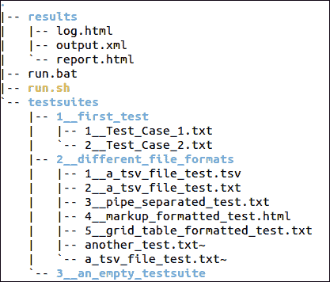
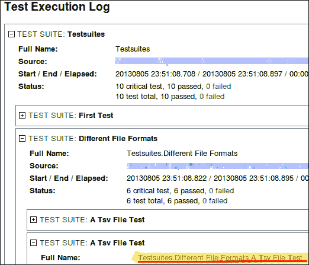
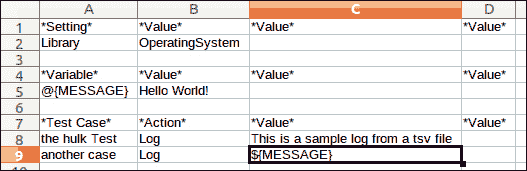

# 第二章 配置测试项目

在本章中，我们将专注于测试的结构和包含的文件。这个主题已经在第一章中简要提及，但更深入地了解它们将有助于为进一步的探索奠定基础，因为测试是 Robot Framework 最重要的特性。本章将涵盖以下主要内容：

+   创建 Robot Framework 测试文件和测试套件。

+   理解在不同文件格式配置中的语法差异。了解不同的配置文件。

+   理解和利用设置和清理操作

+   通过测试重用提高自动化程度

我们将首先解释什么是测试以及如何定义它。接下来将解释不同类型的测试和常见的命名规范，并附上示例。到本章结束时，我们将理解测试文件的结构和它们支持的格式。

一旦项目被正确设置，Robot Framework 使得更改项目中使用的测试配置变得非常容易。然而，在深入具体实现之前，最好理解测试到底是什么，以及应该如何组织它们。

与传统软件开发类似，测试可以以自顶向下的方式创建，先有整体视图，或者以自底向上的方式创建，先创建测试，然后集成。

在 Robot Framework 中，鼓励遵循自顶向下的方法，即首先创建测试结构，然后再创建和记录实际的实现。虽然这不是强制性的，但对于编写大型且可持续的测试很有用，并且是创建测试的推荐方式。

测试以树状结构组织，包括测试套件、测试用例和测试操作。这种规范在大多数结构化测试中都被遵循，并且是一个广泛遵循的规范。测试套件是一组不同的测试和其他测试套件，为执行测试提供逻辑单元。测试用例是对特定任务的完整测试。测试操作是任何测试中最小的元素，在本质上具有原子性，它仅验证给定条件。

# 测试命名规范

测试命名规范对于测试的标准化和一致性至关重要。它也反映了测试的质量，因为测试的命名和位置；以及用例场景表明了它们的顺序和相关性，这在未来维护测试时非常有用。

## 创建执行顺序

为了命名测试，Robot Framework 非常独特；它使用配置文件和文件夹名称来确定执行顺序和测试命名。

例如，考虑以下在文件系统中测试项目中不同测试文件和文件夹的排列：

application/

`tests/`

`Test1.txt`

`Other tests/`

`Another test.txt`

在应用程序文件夹中运行 pybot 将根据它们在文件系统中的存在顺序在报告中创建不同的测试套件。以下屏幕截图显示了 Robot Framework 测试的文件结构：



运行后，tree 命令列出文件/文件夹层次结构。在这里，Robot Framework 将推断测试层次结构，将测试分组，并以文件和文件夹的形式嵌套测试套件。从这个例子中，你可以观察到以下内容：

+   `testsuites` 文件夹将是根测试套件。

+   在 `testsuites` 文件夹下如 `1__first_test` 这样的文件夹将作为嵌套测试套件。

+   这些文件夹中包含的测试文件将是进一步嵌套的测试套件。

例如，包含在 `testsuites/2__different_file_formats/2__a_tsv_file_test.txt` 中的测试将被嵌套，这可以从以下屏幕截图中得到更好的解释：



+   测试套件层次结构在日志文件中详细说明。为了组织结果，确保适当的命名很重要。因此，而不是使用空格，应使用下划线 "_"（如前例所示）。

+   为了在不考虑测试名称的情况下获得正确的顺序，可以在测试配置前加上数字。

### 测试随机化

有时，可能需要明确忽略执行顺序并随机运行测试。在这种情况下，可以在 pybot 命令中使用随机化选项。此选项有以下几种：

+   要随机化所有测试套件以及它们包含的测试：

    ```py
    pybot --randomize All all_tests

    ```

+   要随机化套件而不影响最低级套件中包含的测试：

    ```py
    pybot --randomize suites all_tests

    ```

+   要仅随机化套件中的测试，套件执行顺序保持不变：

    ```py
    pybot --randomize tests all_tests

    ```

+   如果在命令行中设置，要移除任何随机化：

    ```py
    pybot --randomize none all_tests

    ```

    ### 注意

    命令参数从左到右读取，随机化选项可以多次出现。

如果应用适当的命名约定，如以下示例所示，示例的测试层次结构将导致更易于理解的测试，并且测试的执行顺序可以轻松预知。现在你可以轻松推断出以下顺序的执行顺序和层次结构：

`application/`

`testsuites/`

`1__Software_initialization.txt`

`2__main_screen_checks.txt`

`3__test_aux_controls/`

`1__check_user_details.txt`

`2__check_aux_control.txt`

`4__check_values/`

`1__primary_values.txt`

`2__footer.txt`

`3__links_to_other_controls.txt`

`....`

值得注意的是，此命名规则的唯一例外是初始化文件，其命名方式为 `__init__` 后跟其他测试文件中使用的扩展名。由于每个文件夹只有一个 `init` 文件，因此可以清楚地看出此类文件包含有关其文件夹的信息，以及其中包含的信息与测试套件本身相关。

# 测试文件结构

到目前为止，已经证明空白字符在配置文件中起着重要的作用。测试配置以表格格式编写，每个列包含不同的元素，例如测试元素。Robot Framework 允许在测试文件中指定不同列之间的分隔具有灵活性，同时也支持不同的测试文件格式，您可以根据自己的意愿选择。请注意，根据文件扩展名，在运行时选择合适的解析器。以下是一些支持的格式：

+   HTML

+   TSV

+   纯文本

+   管道文本

+   RestructuredText

## HTML 格式

在 HTML 格式中，读取 HTML，它包含不同部分的测试配置的不同表格。对于每个表格，读取第一个标题元素，并根据此信息理解表格的其余部分。请注意！任何位于已识别表格之外的数据都将被丢弃。您可以通过以下示例更好地理解这一点：

```py
<table>
  <th>Test Case</th>
  <th>Action</th>
  <th>Argument</th>
  <th>Argument</th>
  <tr>
    <td>First Test Action</td>
    <td>Log</td>
    <td>This is a test written in HTML</td>
  </tr>
</table>
```

### 小贴士

**下载示例代码**

您可以从您在[`www.packtpub.com`](http://www.packtpub.com)的账户下载您购买的所有 Packt 书籍的示例代码文件。如果您在其他地方购买了这本书，您可以访问[`www.packtpub.com/support`](http://www.packtpub.com/support)，并注册以直接将文件通过电子邮件发送给您。

注意，在表格标题的第一列表示表名，它决定了该表中包含的所有元素的后续执行。随后是其他标题，表示其他数据的位量和顺序。表格的其余内容按照指定顺序填充所需信息。在这里，数据不是通过两个空格分隔，而是存在于表格的不同列中。这种方法需要最多的开销和冗长的元数据，但测试非常易于查看，并且减少了关于保持多少空格的混淆，因为您可以在网页浏览器中轻松查看这些文件，也可以在 HTML 编辑器中编辑。

## TSV 格式

在制表符分隔值格式中，可以通过传递由单个制表符分隔的值来指定不同的列。这种格式的令人惊叹的特性之一是它可以在任何电子表格应用程序中打开，这为您和其他用户提供了对测试配置文件的更大控制。如果正在使用的文本编辑器支持查看空白（空格和制表符），那么启用它是一个好主意，以便在没有错误的情况下保持制表符分隔的测试，因为用户不可避免地会混合两者，导致测试出现故障。创建和维护这些测试的另一种适当方法是仅使用电子表格应用程序，这会降低损坏测试的机会。在电子表格中（如下面的截图所示），测试文件的使用更加自然和直观，因为列被正确区分。如果您在开发电子表格解决方案方面有经验，但对 Robot Framework 却很陌生，那么您的学习曲线将大大降低，您在编写和维护电子表格中的测试时可能会感到更加自在，这些测试也可以格式化以增强可见性和易用性。



## 明文格式

如果测试配置文件显示不是问题，那么明文文件是最佳选择，因为它最易读，并且包含的元数据很少，这使得版本控制更容易。这种方法在此框架中应用最广泛。然而，你必须注意确保元素被正确分隔，并且列元素由两个空白字符分隔。如果测试中使用的参数数量少且列数有限，那么这是合适的显示格式。以这种方式排列元素的语言和位置首先需要一些适应，但随着你对这种格式的使用，创建和修改测试用例会变得更容易，因为你不需要除了文本编辑器之外的其他东西来创建和更新测试。由于空白至少需要两个或更多，因此不可能留下多于一个空列。这看起来可能不是问题，但实际上非常方便，尤其是在需要为多个列提供显式空白分隔的情况下。

## 管道分隔格式

与之前的格式非常相似的是管道分隔格式，它在文档中使用管道字符来分隔不同的列。这用于不同行包含不同数量参数的情况，这些参数难以识别。考虑以下测试片段：

```py
A Custom test  [Documentation]  this test is done to ensure product quality matches the requirements
    Log  Starting the product quality test
    Verify the initial condition exists  Should Be Equal  ${Product}  Drill Machine
```

在这种情况下，测试的冗长性使得阅读和理解测试变得更加困难。更糟糕的是，如果有人正在修改它，他可能会意外地引入错误。例如，文档已按以下方式更新：

```py
A Custom test  [Documentation] The test ensures that product quality matches federal requirements
```

如果您观察`[Documentation]`末尾的空白，只有一个空格，这会将`Documentation`关键字及其参数合并为一个，Robot Framework 无法理解这一点，导致其失败。

为了在同一个文本文件中纠正这个问题，Robot Framework 提供了使用管道符号（`|`）而不是两个空格的灵活性。除了行的第一个字符外，此符号在两侧都由空格包围，因此前面的测试变为：

```py
| A Custom test | [Documentation] | this test is done to ensure product quality matches the requirements |
|  | Log | Starting the product quality test |
|  | Verify the initial condition exists | Should Be Equal | ${Product} | Drill Machine 
```

由于列现在由管道符号分隔，因此这种格式更易于阅读。请注意，第三行的结束管道符号不存在，因为在任何行的最后一列的管道符号位置是可选的。如果需要在任何列中作为普通文本，可以使用退格字符来转义管道符号。转义字符串为（`\|`）。此格式相对于纯文本格式提供的另一个优点是，可以明确声明多个列为空，并且测试仍然可以正确运行。这与在特定列中精确放置文本相结合，导致创建具有非常特定结构的测试。在测试中存在循环的情况下，还需要管道符号来嵌套测试结构，这与 Python 编程中发现的缩进类似，但在 Robot Framework 中不可能，因为超过两个空格不构成空列或缩进（关于测试中的迭代将在稍后讨论）。

## 重新结构化文本格式

**ReStructuredText**（**reST**）文本格式对任何 Python 开发者来说都很熟悉，因为它用于 Python 文档。它是一种基于纯文本的标记，可以使用简单的文本文件和预定义的标记集轻松创建高度格式化的文档、表格等。它提供的优势是使用的元数据非常少，文件包含大部分文本，可以轻松地进行版本控制、编辑、区分以及搜索。rest 标记提供了 HTML 和纯文本文件的优势。

与 HTML 格式类似，测试数据是在表格中定义的，Robot Framework 会查找表格的第一个元素以确定该表格是否为有效的测试表格，如果是正确的，则确定其类型，并相应地处理其余元素。在此格式中，第一列中的空单元格需要有一个`\`或一个`..`符号。

```py
========  ===========  ==========  ========= =======
 Test Case        Action                     Argument            Argument          Argument
========  ===========  ==========  ========= =======
Custom check   [Documentation]    custom checks
\                         Log                        Starting checks
\
\                         Another Test          Should Be Equal${Existing}     15.45
========  ===========  ==========  ========= =======
```

由于处理 rest 标记的工具是 docutils 项目的一部分，因此您需要在执行测试的 Python 实例中安装 Python docutils 模块。Robot Framework 内部将 rest 文件转换为 HTML 文档，如果此格式存在问题，则可以使用其他工具将 rest 结构化文档转换为 HTML，这可以用于运行测试。

这是 Robot Framework 的灵活性，允许您拥有不同的文件格式和结构。在测试编写风格方面的这种灵活性还有更多内容，将在后续章节中介绍。

# 测试配置文件

如前所述，测试存储在文件中，并组合在文件夹中，这些文件夹充当测试套件。一个测试文件可以包含不同的部分，这些部分可以可选地移动到其他文件中，专门针对该特定部分的工作。这样，可以减少实际测试文件的长度和复杂性，这对于测试大小非常大时非常有帮助。

除了实际的测试文件和文件夹之外，测试配置文件还包括：

## 套件初始化文件

Robot Framework 中的一个文件夹表示包含其所有文件和子文件夹的测试套件。由于除了文件夹名称外没有其他方式可以指定测试套件的元数据，因此为放置在其中的文件夹提供了特殊文件。与将目录指定为 Python 模块一样，初始化文件必须命名为`__init__`，并且它们的扩展名可以是 Robot Framework 允许的任何有效扩展名。这些文件的格式与测试用例文件相同，但除了少数例外，不允许使用测试用例选项。

在定义标签、设置、清理操作以及测试用例超时的情况下，这里指定的配置与测试用例文件中允许的配置重叠。然而，这些文件中覆盖的更改适用于包含此初始化文件的整个测试套件。

值得注意的是，套件`setup`和`teardown`的存在。这些只在给定测试套件以及任何子测试套件中的所有测试执行之前和之后执行一次。此外，如果测试套件中有任何子测试套件，则这些初始化文件也将以同样的方式运行。以下是一个示例：

`| 设置 | 值 | 值 |`

`| 文档 | 套件初始化文件 |`

`| 套件设置 | 记录 | 这是整个套件的设置方法 |`

`| 强制标签 | example |`

`| 套件清理 | 记录 | 此套件已结束 |`

## 外部变量文件

这些文件包含测试用例中使用的变量。在外部文件中指定变量的主要目的是遵循**DRY**（**不要重复自己**）原则，以最小化重复，并可以在不更改测试其余部分的情况下，在单个位置更改变量。这些文件提供的变量被创建为其他需要变量信息的文件，这与测试的变量部分不同，或者与仅适用于定义的测试用例的变量表不同。

### 注意

注意，变量名是区分大小写的。为了区分变量和其他关键字，请记住，通常变量使用大写字母，但并没有这样的规则。

变量定义为 `${变量名}` 用于普通、单值变量，以及定义为 `@{变量名}` 用于包含不同值列表的变量。

在测试配置文件中，当只指定变量表时，测试文件变为变量文件，并且在其使用时，只有以变量开始的表将被考虑。

### 结构

变量文件通常可以存储大量和不同类型的变量。例如，变量文件可以具有以下结构，声明各种类型的变量：

```py
*** Variables *** 
${Weather}  London  Cloudy  25 
${humidity}  75 
${MARKS}  65.5 
@{DAYS}  Monday  Wednesday  Friday  Sunday
```

### 包含变量的 Python/Java 文件

变量也可以在 Python 或 Java 文件中创建，因为在某些情况下，Python 或 Java 类可能需要在运行时保存一些动态数据值，这些值可以传递给需要测试的测试。唯一限制性的是，Python 类名应与其模块相同，Java 类不得在任何类型的包中。最简单的方法是将 Python/Java 源文件放置在与测试文件相同的目录中（但如果您有一个独立的应用程序或大量测试/脚本，则不建议这样做）。如果您需要从外部服务或应用程序引用某些值，则可以引用用于填充其变量的源文件，这些变量可以在测试中使用。

例如，在 Python 文件中，哈希可以设置为/修改为变量，如下所示：

```py
person = { 'name' : 'John Doe','age' : '26', 'grade' : 'A', 'gpa' : 8.9 }
```

在 Java 文件中，它也可以被修改如下：

```py
public String name = "Robot Framework";
```

此外，它也可以在测试中使用，例如：

```py
*** Setting ***
Variables  python_file.py
Variables  JavaFile.java
....
*** Test Cases ***
...
  Log  For ${person['name']}, the grade obtained was ${person['grade']}
  Log  You are using ${name}
```

就像在测试本身中定义的任何其他变量一样，这些程序中指定的变量也可以使用。

以类似的方式，Python/Java 代码中的特殊函数提供了从 `get_variables`/`getVariables` 获取变量的功能。变量必须以 `LIST` 关键字为前缀，否则它们将被假定是标量，并且只能有一个值。

### 小贴士

如果变量及其设置这些变量的函数在类中有默认或更高的作用域，它们对 Robot Framework 测试是可见的。

虽然 Java 中定义的变量只能与 Jython 运行时一起使用，但可以使用 Python 文件在任何 Robot Framework 运行时中，因为所有运行时基本上都源自 Python。

要将资源文件中存在的变量用于测试用例，可以给出变量关键字后跟变量文件的绝对或相对路径（根据情况，可以是 `.class` 或 `.py` 文件），并且可以在文件本身内部的变量表中像定义变量一样使用这些变量，如下所示：

```py
*** Setting ***
Variables  path/to/variablefile.py
Variables path/to/java_file.class
```

## 资源文件

当需要保存变量数据以及高级用户关键字时，资源文件是必需的。用户关键字的术语将在本书后面解释，但可以说，用户关键字基本上是一个不在任何库中而是在同一文件或外部资源文件中的关键字。

### 结构

资源文件不能包含测试用例。除此之外，它与测试用例文件相同。在实际的测试用例文件中，此文件必须通过设置表中的“资源”名称导入。指定资源后，必须提交文件路径，可以是相对于测试用例的绝对路径或相对路径。

如前所述，资源文件指定了变量和自定义用户关键字，因此它包含变量定义表和关键字定义表，以及可以允许导入某些外部库的设置表，因为用户关键字可能作为某些外部库的别名。以下是一个资源文件的示例：

```py
*** Settings ***
Resource  Path/to/another_resource

*** Variable ***
${USER}  Test user

*** Keyword ***
Print welcome message for  [Arguments]  ${USER}
    Log  Welcome ${USER}!
```

关键字的创建增加了测试中可用的语法，并在测试文件内部可以轻松使用。

```py
*** Settings ***
Resource  path/to/resource_file.txt

*** Test Cases ***
Test user defined keyword loaded from resource file
  Print welcome message for  Mister President
```

## 测试设置和拆卸

在测试过程中，需要在测试执行期间特定时间执行某些任务。这些操作通常在测试前后进行。这些被称为测试设置和拆卸（通常称为前置条件和后置条件），它们在结构化测试中普遍存在，例如单元测试、功能测试，甚至是验收测试。

测试设置发生在测试开始之前，测试拆卸发生在测试执行之后。值得注意的是，无论测试成功还是失败，测试拆卸都会在测试之后运行。唯一不会执行的条件是测试的无条件终止，这发生在测试错误期间。这些测试部分包含测试所需的预条件，例如打开特定网页的网页浏览器、设置数据库连接等。当测试完成后，关闭打开的连接、浏览器或资源，并确保任何后续操作都不会带来测试期间采取行动的任何后果。

设置/拆卸在自动化测试中的作用如下：

+   设置测试环境

+   创建测试环境

+   加载初始测试数据

+   对每个测试重复

    +   设置单个测试要求

    +   执行操作并断言条件

    +   清理用于测试的资源

+   总结/保存有用信息

+   恢复环境状态到初始条件

+   测试执行分析

设置和销毁操作可以应用于测试以及测试套件级别。它不适用于测试内部。如果需要在测试中的不同语句之间插入它，那么可能意味着测试编写不正确，并且需要重新审视和重构测试结构，将其分解成更小的测试，并根据与单个测试相关的需求进行参数化。

作为自身的一个强大框架，Robot Framework 提供了在测试套件以及单个测试中使用这些操作的能力。对于测试套件，可以使用初始化文件；对于单个测试，可以利用测试文件本身的设置表，其中可以包含设置和销毁设置，甚至可以在测试用例本身中以设置和销毁操作的形式存在。指定条件后使用`None`表示该特定操作不可行。以下是一些功能的简要概述：

```py
*** Settings ***
Test Setup  Open database connection
.....
*** Test Case ***
Some test case  [teardown]  Close connection

Case without teardown  [teardown]  NONE

Alternative names  [Precondition]  some conditions
    [Postcondition]  Cleanup this mess
```

因此，测试设置和销毁提供了一种方法，使我们能够将测试的重复部分集中在一个地方，从而避免在各个地方重复相同的指令集，为通过测试参数化实现测试自动化和重用创造了条件。

# 摘要

在本章中，讨论了涉及 Robot Framework 测试创建和配置的各种文件，以及不同组件（如测试套件、测试用例和测试操作）的测试命名约定。同时详细介绍了执行顺序管理。由于测试文件格式与其他任何测试都相当不同，因此也进行了详尽的讨论。还讨论了变量的使用以及额外文件的使用，因为这些可以促进测试代码的重用并分离测试内容。最后，讨论了通过设置和销毁操作进行测试环境管理，这对于测试需要任何先决依赖项是必不可少的。

这为在框架上进一步工作奠定了基础，并且随着这里提到的基本语法的覆盖，下一章将讨论测试自动化和重用，该章节将继续在这里所涵盖的工作，以自动化和重用现有测试。
