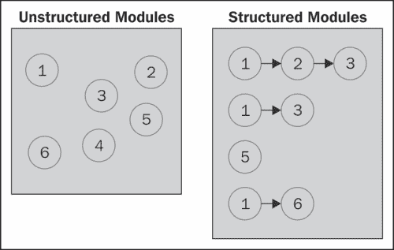
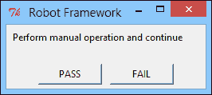
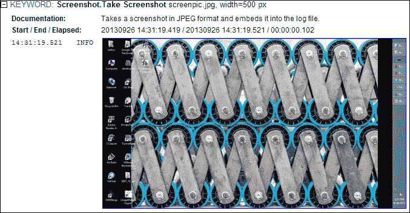

# 第三章。进一步测试定制

本章涵盖了创建可复用测试组件所需的语法和样式，以便进行自动化测试。除了以 Robot Framework 为中心的测试外，它还介绍了行为驱动开发，并涵盖了以下主要主题：

+   测试复用的必要性

+   内部和外部复用

+   将数据输入到测试脚本中

+   高阶测试复用

+   不同风格的测试编写

# 自动化和敏捷

敏捷宣言非常重视可用的代码而非传统文档。它鼓励诸如极限编程等实践，这是一种敏捷软件开发实践，可以提高软件质量，并使软件开发更能响应不断变化的客户需求。该实践的其他重要原则之一是自动化的验收测试。验收测试简单来说是一些可以运行并捕捉系统功能某个方面的代码。其理念是开发者和利益相关者共同编写此测试，以将需求体现在代码中，当测试通过时，形成某种形式的批准印章。这些测试与单元测试和集成测试不同，因为它们主要是由开发者为开发者编写的，有助于他们出现、验证设计和防止错误。验收测试是由利益相关者和开发者编写的，为利益相关者和开发者而写。敏捷方法将重要性放在测试上，因为测试本身成为规范而不是业务报告或文档。

一个常用的说法是，单元测试和验收测试之间的区别在于，单元测试帮助你正确构建事物，而验收测试帮助你构建正确的事物。

如前所述，Robot Framework 作为一个自动化的验收测试驱动开发工具，提供了各种开箱即用的功能，并允许用户有足够的灵活性来进行自动化，以确保所讨论的软件始终具备其基本功能。

在编写测试之前，有必要了解如何实现一个设计，该设计将有助于扩展和维护测试以适应未来的需求。与其他任何软件的创建类似，以模块化方式编写的测试可以通过选择不同的测试模块来实现复用。以下图表可以更好地解释这一点：



在这里，很明显，将测试**1**分离到一个独特的模块中，使我们能够在三个其他测试的部分中使用相同的测试集，从而减少了手动创建测试时的重复量。

然而，通常在验收测试期间，有一些部分是特定于测试执行情况的。考虑以下需要为包含数百页面的大型网站执行验收测试的示例。

测试网站模块功能：

1.  打开浏览器。

1.  前往特定的页面 URL。

1.  确保它不是一个空页面/无效的**URL**。

1.  检查网站头部和尾部是否存在并且显示正确。

1.  确认实际页面内容（不包括头部和尾部）不为空。

1.  搜索并验证页面中是否存在特定元素。

1.  关闭浏览器。

即使在这个简短的测试中，也有无数的可能性，单个测试无法涵盖所有这些。因此，测试人员会复制此类测试，并在进行更改后将其放置在其他地方以满足其他要求。然而，复制会导致存在难以更改的重复测试，因为环境的变化需要在不同的测试中进行更改。另一方面，如果存在测试复用，那么在某个地方对复用测试的更改可以反映到不同的测试中。为了解决不同场景中独特性的问题，可以对相同的测试进行参数化。在前面的示例中，可能的参数化可以是以下这样。

测试网站模块功能（浏览器、URL 和内容）：

1.  打开**浏览器**（选择指定的浏览器）。

1.  前往特定的页面**URL**（如参数中指定）。

1.  确保它不是一个空页面/无效的**URL**。

1.  检查网站头部和尾部是否存在并且显示正确。

1.  确认实际页面**内容**（不包括参数中指定的头部和尾部）不为空。

1.  搜索并验证页面中是否存在参数化的**内容**。

1.  关闭浏览器。

现在，相同的测试可以在广泛的场景（阅读页面）中使用，并且可以使用相同的测试来测试整个网站的不同部分的内容。

如此所述，创建可复用测试的相同参数化方法可以通过使用变量应用于 Robot Framework。变量可以用作从给定信息源（与测试和测试执行无关）的输入机制，测试执行取决于获得的数据。由于测试操作的重复是测试复用的基石，因此即使在测试内部也有可能重复测试操作。在这样做的时候，单个测试或用例可以再次内部重复相同的指令，通常伴随着一些特定重复的独特变量数据。这些内容将在以下章节中详细说明。

# 内部复用

如前所述，单个测试内的重复构成内部测试复用。请注意，涉及不同迭代实例的数据（如果有的话）可能来自外部，但重复仅发生在测试操作内部。

## 循环和流程控制

在掌握了编写测试的语法背景之后，现在是时候转向最常见且方便的迭代方式了，那就是循环。Robot Framework 通过使用 Python 风格的`for`循环来解决这一问题，但对于初学者来说也容易理解。

它遵循直接的语法，循环以特殊关键词`FOR`开始。接下来是一个存在于循环内的变量。这个变量后面跟着一个强制性的`IN`语句。然后是`for`循环要运行的变量或集合。与 Python 循环一样，后续语句缩进一个空格。一旦缩进停止，就假定循环体已经完成。

所有这些都看起来像是任何编程语言的迭代结构，但在 Robot Framework 中存在一些例外，例如：

+   `for`循环可以使用多个变量进行迭代。

+   循环不能在其内部直接嵌套循环，但可以在循环中使用自定义关键词，这些关键词可以包含嵌套循环。

+   循环迭代的**标量变量**集合可以指定为不同的参数

注意，`for`循环需要显式地定义空白，以清楚地划分不同的列，因为简单的文本文件使用空格/制表符作为分隔符是不够的。如果尝试运行，它将打印出错误信息“FOR loop contains no keywords”。这是因为循环体需要（额外的）缩进，而在简单的空白中这是不可能的，因为两个或两个以上的空格只能作为一个分隔符。

`for`循环有一个变体，允许遍历一系列值。这是 Python 的惯用法，但有时非常方便。其语法是：`FOR`关键词后跟一个变量。接下来是`In Range`关键词，它通过参数提供各种范围限制。以下是如何演示的：

```py
# This code block runs 5 times for values of x between 0 and 4
|  | :FOR | ${x} | IN RANGE | 5
# This code block runs 5 times for values of x between 11 and 15
|  | :FOR | ${x} | IN RANGE | 11 | 16 | 
# This code block runs 5 times for x = 10, 12, 14, 16,18
|  | :FOR | ${x} | IN RANGE | 10  |  20 |  2  |
|  |    |  Log  |  ${x} |
```

# 流程控制

在循环迭代过程中，有时需要改变执行方式，这可以是跳过当前迭代并继续下一个迭代，或者完全终止循环。

有时，循环内容需要以非迭代的方式进行处理。在这种情况下，我们需要发出特殊的命令，允许我们根据迭代状态来操作循环内容流中的内容。在大多数传统编程语言中，这通过`continue`和`break`结构来实现。Robot Framework 通过在其默认库中提供一些特殊关键词来实现类似的方法。

## 在完成前中断

通过使用内置关键词`Exit For Loop`或`Exit For Loop If`，可以终止循环并继续执行后续语句：

```py
|  |  | Run Keyword If | ${val} > 10 | Exit For Loop
```

在前面的例子中，使用了`Run Keyword if`，这是内置库中的一个功能。一旦其条件评估为真，它就会被执行，并且`Exit for Loop`关键字会导致循环终止。如果测试用例在循环之后有任何其他语句，那么它们将正常执行。

可以通过使用`Exit For Loop If`关键字来简化，因为它作为 break 操作的处理器，而不需要单独的`if`条件，因此前面的命令可以重写为：

```py
|  |  | Exit For Loop If | ${val} > 10 |
```

继续进行下一个迭代，类似于中断循环，有时在当前迭代完成之前，需要继续进行循环的下一个迭代，这时会有一些特殊情况：

```py
|  |  | Continue Keyword If | ${val} > 10 | Exit For Loop
```

注意各种命令上`If`后缀的使用。`If`语句不是一个特定的关键字，但许多语句，如`Exit For Loop`和`continue`关键字，在特定条件下有条件性的替代定义。

# 提供外部数据

测试可以从任何外部数据存储中获取数据，例如数据库、Excel 或 CSV 文件，或者某些返回动态值的外部应用程序，然后可以在相同的数据上执行。为了进一步演示测试重用的概念，我们将进行另一个练习，该练习侧重于重复执行相同的任务。为了方便读者，我们现在将这些概念抽象化，因为它们可以用任何可能的方式实现。

基本上，如果我们有一组在值集合中指定的可重复任务，那么我们可以以两种不同的方式执行它们：

+   在测试中对每个值重复执行任务集

+   对这些值重复执行整个测试

## 在测试中重复执行一系列任务

在这种情况下，我们创建一个测试，它接受一个参数或使用包含元素列表的变量，并遍历它。作为这个过程的先导，首先让我们创建包含动态变量的文件。在这里，被测试的系统是一个 Python 脚本，它从当前时间中选取数组中的值，而我们无法预先确定这些值：

```py
import time 
var = [] 
while(time.time()%10 <8): 
  var.append(int(time.time()%10)) 
  time.sleep(1)
```

前面的脚本首先导入了`time`模块，因为它将在程序后面使用。接下来创建`var`数组。然后是一个`while`循环，它检查当前已过时间的最后一位小数，并检查它是否小于`8`。如果是，则将这个最后值作为一个整数添加到数组中，并暂停一秒钟以获取另一个值。尽管`var`数组不是随机的，但它的尺寸和内容在事先是未知的，这使得`var`数组在运行时是动态的。

这让我们有了变量`var`，它可以具有未指定的值量。现在我们可以利用它更好地利用测试中的值集合。在测试中，首先加载这个 Python 变量文件，然后迭代其内容：

```py
| *Setting* | *Value* | 
| Variables | ./dynamic_variables.py | 
| *Test Cases* | *Action* | *Argument* | 
| List should exist | Variable Should Exist | @{var} | 
| Variable not declared should not be there | Variable Should Not Exist | ${val} | 
| Iterate over Dynamic variables | :FOR | ${val} | IN | @{var} | 
|                |         | Log      | ${val} | 
|                | Log  | finished iteration |
```

这将加载脚本中的内容，并对值集合进行迭代，对每个值执行一个样本任务。

### 在测试自动化中的应用

通过使用自定义用户关键词和通过外部程序加载测试数据（该程序可以利用任何可用的数据介质来加载测试系统的数据），可以将概述的循环概念应用于测试自动化。如前所述，这有助于实现测试重用，并确保我们作为测试人员遵循**不要重复自己**（**DRY**）的原则。

# 高阶重用

通过创建和使用包含各种测试命令甚至整个测试的高阶结构，可以在测试套件中重复测试。这使得测试人员可以将类似或等效的用户故事或用例组合成一个单独的测试，并根据情况提供不同的输入。测试重用提供的另一个显著优势是项目的整体清晰度。如果重用测试，则必须从各个地方调用它们，从而带来 DRY 的好处。

## 用户关键词

如前所述，用户关键词可以用来将测试的一部分嵌入到一个单独的自定义关键词中。这些可以重用，它们还可以在其定义中指定参数，这些参数可以通过这些测试的调用者传递测试数据参数。

## 测试模板

测试模板用于在测试中创建可以接受不同运行时参数的组件。这与用户关键词不同，因为用户关键词必须通过调用者以它们的名称和参数来调用，但模板只提供要处理的数据。可以从以下示例模板中获得更好的图片，该模板只是将提供的数据记录到其中：

```py
Template to print params  [Template]  Log
                                      Alpha
                                      Beta
                                      Gamma
                                      Delta
```

此示例按顺序向模板传递参数，以便自身被处理。在这里，测试重复执行模板指定的操作，并且测试实际上变成了以下实际测试的简短版本：

```py
A normal test to print param
                Log  Alpha
                Log  Beta
                Log  Gamma
                Log  Delta
```

注意，这是一个简单的模板示例，仅在测试用例表中可见。还有其他创建模板的可能性，可以在不同的测试中重用。通过使用模板，测试变得更加面向数据，Robot Framework 官方文档指出，通过模板，关键字驱动测试可以转换为数据驱动测试。

## 用户库

用户库为将功能实现到 Robot Framework 中提供了包装器。通过使用用户库，我们能够扩展框架以提供特定任务，或者更重要的是，扩展工具的能力以在其他工具上工作。相反，要使用自定义库，Robot Framework 测试必须遵循该库提供的关键字，并提供必要参数的数据，从而满足导致测试正确执行的关键字格式合约。这种创建自定义库并在各种测试中使用的技巧将在下一章中详细讨论。

# 编写测试的方法

测试涉及多种方法，通常不同测试编写风格的不同性质将测试与其他软件开发形式区分开来。编写验收测试可以通过直接使用之前提到的标准库和外部库关键字来完成，或者通过使用某种机制简化测试文本，使其对非技术人员更具可读性。这在敏捷软件开发中至关重要，因为利益相关者在软件设计早期就参与其中，可能不具备技术倾向或需要像程序员一样理解测试的语法。然而，他们可以提供关于应用程序应该如何工作或表现的观点；他们的输入和反馈很重要。

Robot Framework 主要支持三种编写测试的风格。虽然测试的执行和输出没有区别，但测试语法的本质正是将其与不同风格编写的类似测试区分开来。这些内容将在以下部分详细解释：

## 键盘驱动测试

键盘驱动测试是最常用的技术，其中测试被分解为称为关键字的不同部分，这些关键字决定了测试的内容。这些关键字可以进一步包含其他关键字或测试，这些关键字或测试可以在需要的地方重用和提取。通过使用关键字，测试结构可以变得抽象和多样化，并且可以在单个关键字下添加多个和/或复杂的语句，从而使测试更容易理解，其功能也容易理解。

为了更好地理解这种方法，考虑以下测试代码，它使用进程库以[google.com](http://google.com)作为打开的页面打开 Firefox 浏览器：

```py
Start Process  firefox  google.com
```

现在考虑关键字方法：

```py
Open google.com homepage in firefox browser
```

这段代码与之前的代码完全相同，但在测试中提供了更清晰的视图。其实现细节可以像以下这样隐藏在`Keyword`表中：

```py
 Open ${url} homepage on ${prog} browser  Start Process  ${prog}  ${url}
```

## 数据驱动测试

数据驱动测试在进行参数化时很有用，因为相同的测试可以用包含不同值的不同的数据重新使用。这使得这些测试具有多功能性，并且在不执行相同的一组操作的情况下，可以轻松地拥有各种测试案例，其中要执行的任务在很大程度上保持不变，只需更改输入和输出即可。这与关键字驱动测试不同，因为这些测试更粗糙、更细粒度，并且依赖于测试模板来提供必要的测试，正如在之前的测试模板部分所解释的那样。

## 行为驱动测试

最近增长迅速的流行风格之一是行为驱动开发。创建覆盖软件行为的测试，并根据这些测试编写实际的软件，这被称为**行为驱动开发**（**BDD**）。然而，到目前为止，这本书主要处理的是基于关键字的验收测试，其结构相当僵化。为了处理自动化，可以使用外部数据流，并根据数据将测试信息输入到测试中。然而，测试也可以根据面向行为的业务用户需求进行结构化。但是，在我们将 BDD 应用到测试之前，首先需要理解 BDD。

# 行为驱动开发

尽管自动化验收测试具有明显的优势，但在实践中，即使在经验丰富的 XP 和 TDD 团队中，也很少这样做，或者做得不好。其中一个原因是很难找到一个具有技术能力、兴趣和耐心坐在电脑前编写纯代码的利益相关者，即使是像 gerkin 或 RSpec 这样的 DSL。考虑以下存在于 WEBrick（Ruby 中常用的 HTTP 服务器）中的`rspec`测试：

```py
  should "be a WEBrick" do 
    GET("/test") 
    status.should.equal 200 
    response["SERVER_SOFTWARE"].should =~ /WEBrick/ 
    response["HTTP_VERSION"].should.equal "HTTP/1.1" 
    response["SERVER_PROTOCOL"].should.equal "HTTP/1.1" 
    response["SERVER_PORT"].should.equal "9202" 
    response["SERVER_NAME"].should.equal "127.0.0.1" 
  end
```

此示例观察基于服务器响应的行为，由此可以得出结论，该服务器是 WEBrick 服务器或不是。

然而，有时这可能会深度集成到代码中，并要求测试代码能够访问被测系统的内部结构。这是因为开发者需要将实际的方法调用/接口或软件的代码模拟或存根直接集成到`rspec`测试中，这在涉及开发者的项目中可能没问题，但在需要黑盒测试，如验收测试的情况下则不可行。

# 使用 Robot Framework 进行 BDD

Robot Framework 不仅提供了一个 DSL 或平台，可以轻松以人类可读的格式编写代码，而且它还与理解相关软件的内部结构分离，因为它只为给定的行为执行验收测试。这些测试仅在用户关键字如何接收参数的方式上有所不同，这是在关键字内部完成的。在这里，这些关键字由多个字母组成，描述了要执行的具体操作。

# 标准库

机器人框架提供了各种关键字，到目前为止已经讨论过。这些关键字包含在`builtIn`库中，并且默认情况下对任何测试都是可用的。除了这些之外，还有一些额外的关键字是框架的一部分，作为单独的库捆绑在一起，要使用它们，需要提供显式的引用，无需安装。以下是一些库：

+   集合

+   对话框

+   操作系统

+   进程

+   截图

+   字符串

+   Telnet

+   XML

## 集合

这个库使用从外部 Python 文件提供的列表和字典，并对其进行各种操作，如比较和修改。`builtin`库中的一些操作列表和字典的关键字也可以与这个库一起使用。例如，考虑以下示例，其中 Python 文件定义了以下变量：

```py
details = [1,'ssh', .034, 'main-repository']
user = {'name':'john doe', 'age': 21, 'account':'basic'}
```

这些变量可以在测试中按以下方式操作：

```py
*** Setting ***

Library  Collections
Variables  filename.py

*** Test Cases ***

Lists  Should not be empty  ${details}
       Append to List  ${details}  12500
       ${custom}  Create List  1  ssh  .34  main-repository  12500
       Lists should be equal  ${details}  ${custom}

Dicts  Should not be empty  ${user}
       Dictionary should contain key  ${user}  name
       Dictionary should contain value  ${user}  21
       Dictionary should contain value  ${user}  basic
```

类似地，集合库中的其他关键字也可以与其他库一起使用。

## 对话框

对话框提供了一种在测试执行期间让用户输入数据的方式。尽管这与自动化测试的原则相悖，但在某些情况下却是所需的。

### 注意

注意，目前，这个库在 IronPython 运行时不可用。

例如，以下命令允许用户通过或失败一个给定的步骤：

```py
Execute Manual Step  Perform manual operation and continue
```

这提供了以下对话框，等待用户输入以继续：



在指定**失败**选项后，用户在测试失败之前会被进一步要求输入失败信息。

类似地，这个库中指定的其他关键字也可以使用。

## 操作系统

这个库提供了机器人框架与操作系统环境的交互，例如文件和文件夹、环境变量，以及调用各种进程的能力。这个库中声明的多数方法都是自解释的。然而，管理进程的关键字已被弃用，现在也存在于进程库中。

## 进程

这个库允许测试运行外部程序。它使用 Python 中的子进程模块来生成外部进程，连接输入/错误/输出消息管道，并获取返回代码。它可以运行进程并等待其终止，或者以在后台运行进程。为了更好地管理，它还可以终止由测试启动的一个或所有进程。

## 截图

这个库允许在 Robot Framework 测试执行期间捕获屏幕，如果测试环境中存在屏幕，则允许详细地报告项目。如果与 Python 运行时一起使用，这需要额外的库，如 `wxPython` 或 `pygtk`。其他运行时提供开箱即用的屏幕捕获支持。`take` 截图将屏幕截图保存到日志文件或 XML 输出生成的位置，如果没有指定设置或文件位置。如果没有给出名称，则将 `Screenshot_number.jpg` 保存到每次执行后数字递增的位置以创建一个唯一的保存图像。同样，宽度参数指定了在日志文件中分配给图像的区域大小。

以下指定了屏幕截图图像的文件名和大小：

```py
  Take Screenshot  screenpic.jpg  width=500 px
```

这将保存以下图像并将其嵌入到日志文件中：



## 字符串

这提供了正常的字符串操作，如子字符串、替换和字符串分割，以及生成随机字符串的专用函数。这还包含操作跨多行字符串的实用方法。

## Telnet

这个库允许 Robot Framework 测试连接到 Telnet 服务器并传递在服务器上运行的命令。测试这个功能的最简单方法是设置一个本机的测试服务器。假设你在机器上正确设置了 Telnet 服务器，用户名和密码都设置为 `test`，那么以下代码将按预期执行：

```py
*** Setting ***
Library  Telnet
*** Test Cases ***
Telnet Session  Close All Connections
    Open Connection  127.0.0.1  prompt=test
    Login  test  test  login_prompt=login:  password_prompt=password:
    ${details}  Execute Command  ls-l
    Log  ${details}
```

### 注意

注意，在 `Open Connection` 命令中设置提示不是强制性的，但对于某些命令（如 `execute` 命令）是必需的。这个库足以打开、关闭以及在不同 Telnet 连接之间切换，并涵盖了大多数 Telnet 功能。

## XML

这是框架提供的 XML 解析器，可以用来搜索和验证提供的 XML 文件或文本。它内部使用 ElementTree 库，并提供了解析和查找不同元素、属性、值的能力，并支持 Xpath 风格的查找。

# 远程测试执行

Robot Framework 也支持远程库的使用，其中测试的一部分可以作为服务器托管，并且可以被其他远程测试使用。这在将测试的一部分集中在一个地方非常有用，并且所有客户端测试都可以根据该测试本身获取信息。

它使用 XML-RPC 协议进行远程交互，并提供各种分布式测试功能，例如远程提供不同的关键字，这些关键字可以由不同的测试在远程服务器上执行某些操作。因此，远程库中的一个方法可以用来执行一些任务，这些任务可以在测试中以库关键字的形式调用，从而实现代码在不同测试中的可重用性。

要开始远程测试，在测试中只需指定远程测试的位置：

```py
Library  Remote  http://localhost:8567
```

在服务器端，可以指定以下内容：

```py
def strings_should_be_equal(self, str1, str2):
  print "Comparing '%s' to '%s'" % (str1, str2)
  if str1 != str2
    raise AssertionError("Given strings are not equal")
  else:
    return "Given Strings are not equal"
  if name == '__main__':
    from robotremoteserver import RobotRemoteServer
    RobotRemoteServer(ExampleRemoteLibrary(), *sys.argv[1:])
```

在这里，可以从 Python 命令行运行此文件以设置 Robot 远程服务器，并且这里定义的方法可以用作关键字，例如`字符串应该相等`。如果你想知道代码是否需要更多，那么你需要单独下载提供的`RobotRemoteServer`脚本文件并将其放置在此脚本旁边。目前，有 Python 和 Ruby 的服务器，但也可以创建其他服务器。因此，在 Robot Framework 中编写分布式测试是微不足道的，并且可以通过 HTTP 轻松使用。

# 摘要

本章讨论了测试的哲学和风格。由于测试应该考虑到自动化，因此涵盖了通过迭代和参数化测试用例的内部和外部重用，以及将数据引入测试的情况，因为这些是在进行自动化时需要考虑的重要事项。接下来，本章涵盖了三种不同的编写风格，包括关键字、数据和行为驱动测试，随后对行为驱动开发的重要性进行了简要讨论，并与当前流行的其他开发工具进行了比较。本章提供了 Robot Framework 库的所有剩余部分，你现在可以自信地开始编写可自动化的测试，通过框架本身提供的广泛工具和支持，为从小型企业软件系统到大型企业软件系统提供测试。为了扩展框架的功能并使其能够与各种软件一起使用，下一章将重点介绍用户库。
