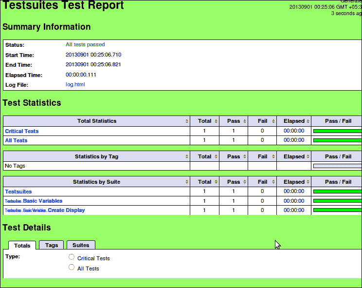
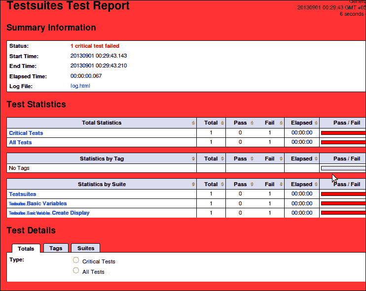
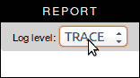

# 第五章：生成报告

虽然创建和执行测试确实提供了许多好处，但有必要有效地传达测试结果给任何测试的观看者，因为验收测试可以提供给定软件可以以提供的方式执行的事实，但不能保留这个假设。在本章中，将详细讨论 Robot Framework 中的测试报告概念，这包括通过提供的选项理解和自定义生成的报告，包括手动和自动更改。由于报告内部讨论得非常详细，因此可以更有信心地进行报告定制。

# 报告的需求

除了在用户显示结果的控制台上出现的事件和动作之外，还需要在测试执行过程中创建测试报告文件，因为它提供了许多好处，其中一些将在以下内容中概述：

## 快速测试运行评估

如果有一个标准化的格式可以清楚地识别测试的成功或失败，以及轻松确定单个测试的详细信息，则可以快速查看测试结果。

## 结果比较

可以对同一验收测试的结果进行并排比较，这些结果可以在同一测试的不同状态、不同外部变量或不同时间进行测试。

## 单个结果详细说明

测试报告可以以有序的方式详细说明环境、测试执行步骤和其他数据，这对于确定测试执行的成功至关重要。

## 智能评估

通过使用报告和日志，人们分析测试执行变得容易得多。当涉及到自动化测试时，这非常有用，因为测试运行后分析失败的原因可能会很繁琐。填充的数据也可以用来获取必要的指标以及推断次要数据，例如测试在一段时间内的性能，以及根据需要推断其他细节。

# 生成的文件

如前所述，Robot Framework 生成两个 HTML 文件，即日志和报告文件。它们是互补的，在分析任何项目时，你会发现自己正在使用这两个文件。除了这些文件之外，默认情况下还会生成一个 XML 文件，其中包含所有测试结果输出的元数据。这在许多方面都有帮助，这些帮助在本章中进行了详细讨论。

日志文件以分层的方式呈现详细的执行报告，基于不同的测试套件。它还包括测试统计信息，但测试的高级概述在报告文件中。报告以多种方式呈现结果，以下章节将详细说明。

# 输出结构

测试报告包含以下标题下测试执行的结果，以下将进行解释。

## 标题

标题是页面上的第一个元素，包含测试名称和生成时间。它还显示自生成以来的经过时间。

## 摘要信息

这包含测试摘要、测试的开始和结束时间以及测试执行的总时间。

### 测试统计信息

这些是在测试中存在的测试数量；各种测试根据其关键性、标签和套件进行分组。默认情况下，所有测试都是关键的，但您可以通过在 pybot/jybot 命令中传递`--critical`或`--noncritical`后跟测试名称来明确指定测试是否关键。

### 测试详细信息

测试详细信息仅在测试报告中存在，包含与测试统计信息中相同的上述信息；然而，它们提供了一个更简洁的视图，因为不同的统计数据以表格形式呈现。在此列下方是空白空间，但只要您单击任何测试套件，就会显示包含与该套件及其子套件相关的各种属性的详细表格，并且测试详细信息显示与套件相关的信息。

### 测试执行日志

这仅在日志文件中存在，包含从测试生成的所有日志。要查看测试套件层次结构，请单击展开全部按钮以查看测试中存在的所有测试套件层次结构。它包含套件源文件和文件夹的位置，以及测试中关键字的信息。

# 测试着色信息

在任何 xUnit 测试结果中，红色表示失败，绿色表示成功。这种着色也导致了单元测试中流行的 TDD 咒语“红、绿、重构”，这表示开发顺序是首先创建测试，目的是自然失败，然后编写代码，使测试通过，最后以不破坏任何内容的方式重构现有代码。

以下截图展示了通过测试的应用程序，绿色背景清晰可见：



同样，测试套件的失败也可以通过背景颜色反映出来。请注意，即使单个测试用例失败，整个报告也将显示失败的颜色，最终用户可以轻松地注意到，如下面的截图所示：



这种约定在 Robot Framework 中也被遵循，正如报告背景颜色以及日志文件中执行测试所使用的颜色所示。

## 分离文件

生成的报告通常在每次执行时都会被覆盖。然而，可以通过提供唯一名称来使每次运行都独特，可以通过使用带时间戳的文件名来提供这个唯一名称。为了做到这一点，可以将`pybot`/`jybot`/`ipybot`命令与参数一起使用，这些参数会在文件名和扩展名之间插入时间戳，确保文件名的唯一性并确保不会发生文件覆盖。为此，需要将这些命令添加`--timestampoutputs`参数。这将在生成的报告文件名和扩展名之间插入时间戳，格式为`YYYYMMDD-hhmmss`。

例如，这可以用来指定带时间戳的文件：

```py
pybot --timestampoutputs -o metadata -l log -r report testsuites

```

# 修改输出

在生成的报告和日志文件中可以做出某些自定义设置，这些设置可以在 Robot Framework 中直接使用。这有助于根据要求设置测试报告，而无需更改报告结构，也不会以任何方式影响代码库。

## 自定义报告标题

`--logtitle`和`--reporttitle`参数可以在日志文件和报告文件名称之前使用，分别设置它们的自定义标题；否则，在必要时使用测试日志或测试报告的默认值。

### 注意

当通过参数使用自定义名称时，下划线会被转换为空格，就像测试套件文件和文件夹名称一样。

为了不允许文件有标准的`<root test suite> Test Report/Log`标题，可以使用以下选项：

```py
pybot --logtitle info_log -l log --reporttitle Tests_at_a_glance -r report testsuites

```

## 背景颜色自定义

报告中使用的颜色方案不需要更改，因为它确认了 xUnit 配置中使用的颜色，以及大多数其他测试/测试工具中使用的颜色。然而，在某些情况下，这可能不如其他替代方案好，例如，色盲人士可能难以区分默认颜色；这可能与品牌中使用的颜色形成对比，等等。要指定颜色，提供了`--reportbackground successcolor:failurecolor`选项，其中颜色名称可以原样提供，如红色、蓝色、黄色，或者通过提供颜色十六进制代码如#05AE04。

## 改变日志记录的多少

测试中进行的日志记录也可以自定义，这有助于在测试日志中允许包含各种元素和信息类型。可以分配各种日志级别，以便在不同场景下打印消息。然而，某些消息（例如 FAIL）仅由 Robot Framework 本身发出，这种情况仅发生在某些测试关键字缺失时。其他消息（如 Warn、Info、Debug 和 Trace）也可以用于不同重要性的问题，这与大多数流行的日志框架操作方式相似。

此外，可以通过在 Python 程序中使用日志 API 来自定义日志记录，其中可以使用`robot.api.logger`以及标准的 Python 日志记录。

使用`--loglevel`参数来指定生成日志文件的各种日志级别。如果这样做是在 info 级别以下，那么在日志文件中的报告链接下方将出现一个下拉菜单，如下面的图片所示：



## 更改报告格式

有时需要对生成的报告进行细微的修改，这可以通过自定义输出文件的 CSS 或修改下载的源代码并重新构建框架的定制安装来完成。在本节中，将讨论这两种定制策略。

如果在文本编辑器中打开日志文件，它将显示文件中内联使用的 CSS。同样，报告中也包含内联的 jQuery。通过这种方式，文件可以在不依赖外部文件或网站的情况下使用，并且报告可以在任何现代浏览器中运行。

这些文件可以根据用户的需求自由使用，但唯一需要注意的是，如果报告不是唯一生成的，那么 Robot Framework 的后续执行将覆盖报告/日志文件。

要进行定制，让我们使用之前生成的报告，其中测试已经完成。由于此报告已经生成，因此无法进行定制。因此，在文本编辑器中加载报告后，跳转到包含显示在页面右上角的内容的 JavaScript 函数所在的第 1247 行，如下所示：

```py
function addHeader() { 
….
           '<div id="top-right-header">' + 
             '<div id="report-or-log-link"><a href="#"></a></div>' +
           '</div>', { 
        generated: window.output.generatedTimestamp,
….
```

此函数将加载已过的时间以及指向其他（日志/报告）文件的链接。在这里，可以在包含作为我们图标的图像的`report-or-log-link` div 之后立即添加另一个 div。因此，在同一函数内部更改的 div 结构变为：

```py
...
           '<div id="top-right-header">' + 
             '<div id="report-or-log-link"><a href="#"></a></div>' + 
             '<div id="my_custom_image"></div>'+ 
           '</div>', { 
        generated: window.output.generatedTimestamp, 
  ….
```

此代码将负责报告中的图标存在。然而，由于这是一个外部图像，其路径必须正确解析到报告中。因此，如果报告需要在不同的计算机之间发送或与报告一起打包以供离线使用，也可以使用基于 Web 的图像 URL。

同样，如果需要在发送报告给经理或利益相关者之前更改报告的颜色，并且该人偏好特定的颜色，那么报告可以进一步调整。在第 1472 行，有一个 JavaScript 函数设置报告颜色：

```py
function setBackground(topsuite) { 
    var color; 
    if (topsuite.criticalFailed) 
        color = window.settings.background.fail; 
    else if (topsuite.totalFailed) 
        color = window.settings.background.nonCriticalFail; 
    else 
        color = window.settings.background.pass; 
    $('body').css('background-color', color); 
}
```

在使用硬编码的值更改此函数之前，可以操作使用的颜色。因此，可以通过对函数进行以下更改来简单地设置背景颜色为白色：

```py
function setBackground(topsuite) { 
    var color = 'White'; 
    $('body').css('background-color', color); 
}
```


在进行前两个更改之后，只需刷新页面即可查看更改，包括在日志链接下方出现图标以及将背景更改为白色。

在快速调整生成的报告时，这会非常方便，但因为这个过程是手动的，所以像这样更改报告变成了一件麻烦事，尤其是如果报告数量很多或经常被覆盖。

为了解决这个限制，可以使用自定义构建的 Robot Framework。假设你有权访问整个 Robot Framework 仓库，可以操作 `src/robot/htmldata` 文件夹中的文件，将这些自定义更改发送到框架本身；安装 Robot Framework 后，这些更改将变得永久，并应用于从 Robot Framework 生成的每个报告。

## 创建派生报告

除了日志和报告文件外，每次测试执行都会生成一个 XML 文件作为输出，有时可能需要使用这些文件作为进一步分析测试的基础，例如对软件片段进行时间分析。XML 文件可以根据自定义要求进行解析和分析。在 Python 中，使用内置的 **elementtree** 库处理 XML 非常容易，不同的 XML 元素可以作为树进行遍历，并且可以在它们上执行不同的操作。

## 重新创建报告

如前所述，Robot Framework 提供了一个工具，通过使用 **rebot** 工具从生成的元数据中重新创建测试输出文件。此工具支持在 第一章 中提到的 `pybot` 命令的所有参数，即 *使用 Robot Framework 入门*，并且仅使用生成的 XML 文件作为输出。如果其他文件不存在或仅以 XML 格式存储大量测试结果时，这会非常方便。然而，rebot 的最重要特性在于将多个 XML 文件合并成一个单独的测试，这在你在不同环境中运行了相同的验收测试并希望将结果呈现为单个文件时非常有用。

假设你在文件夹中有来自不同状态（如 state0.xml、state1.xml、state2.xml 等）的测试结果文件，然后你可以通过使用以下方法简单地使用自定义命名的顶级测试套件重新创建一个单独的测试结果：

```py
rebot --name Country_Results state/*.xml

```

## 查看差异

有时，你有多份测试结果，并想比较它们之间的差异。为此，一个名为 **robotdiff** 的 diff 工具提供了测试用例之间的比较。这个工具位于 robotframework 源代码的 `tools/robotdiff` 文件夹中。要生成比较，请执行以下操作：

```py
python robotdiff.py output1.xml output2.xml output-n.xml

```

默认生成的报告是用户主目录中的 `robotdiff.html`，结果标题为 "Test Run Diff Report"，每个测试名称都来自 XML 文件名。

## 进一步使用结果

由于生成的元数据结果文件是 xUnit 兼容的 XML 格式，它可以作为外部工具的输入，这些工具理解这种格式。一个这样的例子是 Jenkins 插件([`wiki.jenkins-ci.org/display/JENKINS/Robot+Framework+Plugin`](https://wiki.jenkins-ci.org/display/JENKINS/Robot+Framework+Plugin))，它支持基于这些文件生成统计信息。

# 摘要

本章介绍了测试执行生成的内容的输出定制，因为测试产生的数据和结果可以被重用和重新分析。详细说明了测试输出中使用的不同文件及其格式，以便进行修改。解释了修改单个报告的不同方法，以及如何根据组织的需求生成报告。还提到了如何修改框架和使用程序生成自定义报告的进一步指导，以及报告生成和测试报告的使用。
