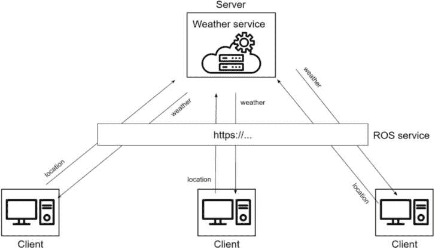

# 第六章：服务 – 节点之间的客户端/服务器交互

节点可以使用三种通信类型之一相互通信。你在上一章中发现了主题。现在是时候转向第二常用的通信方式：ROS 2 服务。

正如我们在主题部分所做的那样，我们将首先通过现实生活中的类比来理解服务。我还会分享更多关于何时使用主题与服务的思考。之后，你将深入代码，在节点中使用自定义服务接口编写服务服务器和客户端。你还将探索从终端处理服务的额外工具。

本章我们将编写的所有代码都从上一章的最终代码开始。我们将改进数字应用来学习如何使用服务，然后处理带有额外挑战的海龟控制器应用。如果你想和我有相同的起点，你可以从 GitHub ([`github.com/PacktPublishing/ROS-2-from-Scratch`](https://github.com/PacktPublishing/ROS-2-from-Scratch))下载代码，在**ch5**文件夹中，并将其作为起点。最终代码可以在**ch6**文件夹中找到。

到本章结束时，你将理解服务的工作原理，并且能够创建自己的服务接口、服务服务器和服务客户端。

在开始使用 ROS 2 时，对主题和服务的信心是最重要的事情之一。有了这个，你将能够为你的项目编写自定义代码，并与大多数现有的 ROS 2 应用进行交互。

本章我们将涵盖以下主题：

+   ROS 2 服务是什么？

+   创建自定义服务接口

+   编写服务服务器

+   编写服务客户端

+   处理服务的额外工具

+   服务挑战 – 客户端和服务器

# ROS 2 服务是什么？

你在*第三章*的*服务*部分发现了 ROS 2 服务的概念，在那里你运行了第一个服务服务器和客户端，以获得它们如何工作的直观感受。你也熟悉了用于从终端处理服务的**ros2**命令行工具。

从这里，我将从头开始再次解释服务是什么，使用现实生活中的类比。我们将逐步构建一个示例，然后总结最重要的要点。

## 服务器和客户端

首先，我将使用在线天气服务作为类比。

在我们发送我们的位置后，这个在线天气服务可以告诉我们当地的天气。为了获取你所在城市的天气预报，你需要与这个服务进行交互。你可以使用你的电脑通过服务提供的 URL 发送一个网络请求。

会发生什么？首先，你的电脑将向天气服务发送一个请求。请求中包含你的位置。服务将接收请求，处理它，如果位置有效，它将返回该位置的天气。然后，你的电脑接收一个包含天气信息的响应。这就是通信的结束。以下是这个过程的说明：


图 6.1 – 客户端/服务器交互

这基本上就是 ROS 2 服务的工作方式。在一侧，你有一个节点内的**服务服务器**，在另一侧，你有一个节点内的**服务客户端**。

要开始通信，服务**客户端**需要向**服务器**发送一个**请求**。然后，服务器将处理该请求，执行任何适当的操作或计算，并将**响应**返回给客户端。

如你所见，服务，就像对于主题一样，有一个名称和一个接口。接口不仅仅是一条消息，它是一对消息：请求和响应。客户端和服务器必须使用相同的名称和接口才能成功相互通信。

在这个例子中，HTTP URL 是服务名称，而这对（位置，天气）是服务接口（请求，响应）。

## 一个服务的多个客户端

在现实生活中，许多人将尝试从这个在线服务（在不同时间或同一时间）获取天气。这不是问题：每个客户端都会通过 HTTP URL 向服务器发送带有位置的请求。服务器将单独处理每个请求，并将适当的天气信息返回给每个客户端。

现在非常重要的一点是：只能有一个服务器。一个 URL 只对应一个服务器，就像一个物理地址是唯一的。想象一下，如果你向某人发送包裹，有两个地方有相同的地址。邮递员怎么知道把包裹送到哪里？

这对于 ROS 2 服务也是一样的。你可以让多个客户端向同一服务发送请求。然而，对于一项服务，只能存在一个服务器。参见以下图示：



图 6.2 – 具有多个客户端的服务服务器

这里，你可以看到一些方框，每个方框代表一个节点。因此，我们有四个节点。三个节点包含一个服务**客户端**并与**天气服务**节点通信，该节点包含一个服务**服务器**。

这里需要注意的是，客户端不知道确切要通信的节点。他们必须通过 URL（服务名称）进行通信。在这个例子中，客户端并不知道服务器的 IP 地址——他们只知道他们必须使用 URL 来连接到服务器。

此外，没有任何客户端知道其他客户端的存在。当你尝试从这个服务获取天气信息时，你不知道谁也在尝试访问该服务，甚至不知道有多少人在发送请求。

## 另一个与机器人相关的服务示例

让我们再举一个可能是 ROS 应用程序一部分的例子。

假设你有一个负责控制 LED 面板（三个 LED）的节点。这个节点可以包含一个服务服务器，允许其他节点请求打开或关闭 LED。

你还有一个监控电池的节点。在你的应用程序中，你想做的是当电池电量低时打开一个 LED，然后当电池电量再次变高时关闭它。

你可以使用 ROS 2 服务来实现这一点。LED 面板节点将包含一个名为 **set_led** 的服务服务器。要向该服务器发送请求，你必须提供 LED 号码和该 LED 的状态（开启或关闭）。然后，你将收到一个包含布尔值的响应，以查看请求是否被服务器成功处理。

因此，电池现在电量不足。下面将要发生的事情：


图 6.3 – 客户端请求打开 LED 号码 3

在这里，**电池节点** 将向 **set_led** 服务发送一个 **请求**。**请求** 包含 **LED 号码 3** 和 **状态开启** 的详细信息，以便它可以打开面板上的 LED **3**。

在 **LED 面板节点** 中的 **服务** 服务器接收 **请求**。服务器可能会决定验证 **请求**（例如，如果 LED 号码是 4，则这不是有效的）并处理它。在这里处理 **请求** 意味着打开第三个 LED。之后，服务器向 **客户端** 发送一个 **响应**，包含一个布尔标志。**客户端** 接收这个 **响应**，通信结束。

然后，当电池完全充电时，**电池节点** 发送另一个 **请求**，这次是关闭 **LED 3**：


图 6.4 – 客户端请求关闭 LED 号码 3

过程相同。**客户端** 发送一个 **请求**，这次为 **LED 3** 的 **状态关闭**。位于 **LED 面板节点** 内部的 **服务器** 接收这个 **请求** 并关闭第三个 LED。然后，**服务器** 向 **客户端** 发送一个 **响应**。

## 总结

在主题之上，ROS 2 节点可以使用服务相互通信。

你应该在何时使用主题而不是服务？你应该使用主题来发布单向数据流，当你想有客户端/服务器类型的通信时使用服务。

例如，如果你想每秒连续发送 10 次速度命令给机器人，或者发送从传感器读取的数据，你将使用主题。如果你想让节点执行快速计算或按需执行某些操作（启用/禁用电机，启动/停止机器人），那么你应该使用服务。

给出明确的答案可能会有点困难。每个应用程序都是不同的。大多数时候，选择将是显而易见的，但有时你必须走一条路才能意识到那是错误的方向。随着你对 ROS 2 经验的增加，你将能够做出更好的设计决策。

这里有一些关于服务如何工作的重要点：

+   服务由名称和接口定义。

+   服务的名称遵循与主题相同的规则。它必须以字母开头，后面可以跟其他字母、数字、下划线、波浪线和斜杠。

+   接口包含两个东西：一个请求和一个响应。客户端和服务器必须使用相同的接口才能相互通信。

+   服务服务器只能存在一次，但可以有多个客户端。

+   服务客户端不知道彼此，也不知道服务器节点。为了到达服务器，他们只知道他们必须使用服务名称并提供正确的接口。

+   一个节点可以包含多个服务服务器和客户端，每个服务名称不同。

现在，你该如何编写服务客户端和服务器？

正如节点和主题一样，你将在**rclpy**和**rclcpp**库中找到你需要的一切。使用这些库，你可以在节点内编写服务服务器和客户端。这正是我们现在要做的。

由于没有服务器就无法测试客户端，让我们先从服务器端开始。但在我们开始编写服务器之前，我们将需要使用什么接口来为服务？

# 创建自定义服务接口

在*第五章*中，当我们使用**number_publisher**和**number_counter**节点创建 ROS 2 应用程序时，我们使用了现有的**number**主题接口。由于我们想要发布一个整数，因此**example_interfaces/msg/Int64**接口似乎正是我们所需要的。此时，你知道你必须避免在实际应用中使用**example_interfaces**包，但在第一次测试中，这并不是问题。

我们将继续在这个应用程序上工作并添加更多功能，以便我们可以练习使用服务。在这里，我们将重点关注**number_counter**节点。目前，在这个节点中，每次我们从**number**主题接收到消息时，我们将把这个数字加到计数器上并打印计数器。

我们想要做的是允许**number_counter**节点在我们请求时将计数器重置为指定的数字。为此，我们将在节点内添加一个服务服务器。然后，任何其他节点都可以发送一个请求，指定计数器的重置值。例如，假设计数器当前为 76，你发送一个请求将其重置为 20。如果请求被服务服务器接受，计数器现在将变为 20 并从该值开始递增。

太好了——我们知道我们必须做什么。现在，我们应该使用哪个接口？我们能找到一个现有的接口来满足我们的需求，还是我们必须创建一个自定义的接口？根据本节的标题，你大概已经猜到了答案。不过，让我们看看如果我们查看现有的接口，我们能找到什么。

## 为我们的服务寻找现有的接口

当涉及到服务接口时，我们需要考虑两件事：请求和响应。

在我们的应用中，从客户端发送到服务器的请求应该包含一个整数。这是计数器的重置值。

对于从服务器发送到客户端的响应，我们可以决定使用一个布尔标志来指定我们是否能够执行请求，如果出了问题，还可以发送一条消息来解释发生了什么。

问题在于，我们会找到一个与我们的需求相匹配的现有接口吗？不幸的是，这次似乎没有匹配的接口。我们可以检查**example_interfaces**包：

```py
$ ros2 interface list | grep example_interfaces/srv
example_interfaces/srv/AddTwoInts
example_interfaces/srv/SetBool
example_interfaces/srv/Trigger
```

我们甚至可以检查**std_srvs**包：

```py
$ ros2 interface list | grep std_srvs/srv
std_srvs/srv/Empty
std_srvs/srv/SetBool
std_srvs/srv/Trigger
```

注意

如你所见，服务接口被放置在包内的`srv`文件夹中。对于主题，我们有一个`msg`文件夹。这是一种很容易区分两种接口类型的好方法。

如果你更仔细地查看这些接口，特别是**SetBool**和**Trigger**，你会发现没有办法在请求中发送一个整数。这里有一个我们尝试使用**SetBool**的例子：

```py
$ ros2 interface show example_interfaces/srv/SetBool
# some comments
bool data # e.g. for hardware enabling / disabling
---
bool success   # indicate successful run of triggered service
string message # informational, e.g. for error messages
```

当查看接口定义时，你可以看到请求和响应由三个短横线（**---**）分隔。在响应中，我们可以找到一个布尔值和一个字符串，这是我们想要的。然而，请求只包含一个布尔值，没有整数。

你可以查看 GitHub 上常见的接口仓库中的其他接口（[`github.com/ros2/common_interfaces`](https://github.com/ros2/common_interfaces)），但你不会找到我们正在寻找的精确匹配。

因此，在为服务编写代码之前，我们将创建我们自己的服务接口。对于**number**主题，我们足够幸运，找到了一个可以直接在代码中使用的接口（尽管对于实际应用，最佳实践是尽量避免使用**example_interfaces**和**std_srvs**）。在这里，我们首先需要创建接口。

## 创建一个新的服务接口

要创建服务接口，就像为主题接口一样，你需要创建并配置一个专门用于接口的包。

好消息：我们在*第五章*的*为主题创建自定义接口*部分已经做了这件事。由于我们正在处理同一个应用，我们将所有主题和服务接口放在同一个包中：**my_robot_interfaces**（如果你还没有这个包，请回到上一章并设置它）。

我们可以直接在那个包内部创建一个新的服务接口；没有其他事情要做。所以，这个过程将会非常快。

首先，导航到**my_robot_interfaces**包内部（你已经有了一个**msg**文件夹）并创建一个新的**srv**文件夹：

```py
$ cd ~/ros2_ws/src/my_robot_interfaces/
$ mkdir srv
```

在这个新文件夹中，你需要放置所有特定于你的应用程序（或机器人）的服务接口。

现在，为服务创建一个新文件。以下是关于文件名的规则：

+   使用 UpperCamelCase（PascalCase）——例如，`ActivateMotor`。

+   不要在名称中写`Srv`或`Interface`，因为这会添加不必要的冗余。

+   使用`.srv`作为文件扩展名。

+   作为最佳实践，在接口名称中使用一个动词——例如，`TriggerSomething`，`ActivateMotor`或`ComputeDistance`。服务是关于执行一个动作或计算，所以通过使用动词，你可以非常清楚地知道服务正在做什么。

由于我们想要重置计数器，所以我们可以简单地称这个接口为**ResetCounter**：

```py
$ cd ~/ros2_ws/src/my_robot_interfaces/srv/
$ touch ResetCounter.srv
```

打开这个文件并编写服务接口的定义。在这里要做的一件非常重要的事情是添加三个短横线（**---**），并将请求定义放在顶部，然后响应定义放在短横线下方。

对于请求和响应，你可以使用以下内容：

+   内置类型（`bool`，`byte`，`int64`等等）。

+   现有的消息接口。例如，服务的请求可以包含`geometry_msgs/Twist`。

注意

你不能在另一个服务定义中包含服务定义。你只能在服务的请求或响应中包含一个消息（主题定义）。请求和响应可以被视为两个独立的消息。

让我们编写我们的服务接口。由于它并不复杂，我们可以使用简单的内置类型：

```py
int64 reset_value
---
bool success
string message
```

这样，客户端将发送一个包含一个整数值的请求，响应将包含一个布尔标志以及一个字符串。定义内部的所有字段都必须遵循 snake_case 约定（单词之间使用下划线，所有字母小写，没有空格）。

注意

确保你所有的服务定义中都有三个短横线，即使请求或响应为空。

现在我们已经编写了接口，我们需要构建它，以便我们可以在代码中使用它。

返回到**my_robot_interfaces**包的**CMakeLists.txt**。由于包已经配置好了，我们只需要添加一行。在**rosidl_generate_interfaces()**函数中添加接口的相对路径，并在新行中添加：

```py
rosidl_generate_interfaces(${PROJECT_NAME}
  "msg/HardwareStatus.msg"
  "srv/ResetCounter.srv"
)
```

然后，保存所有文件并构建**my_robot_interfaces**包：

```py
$ colcon build --packages-select my_robot_interfaces
```

一旦构建，源环境。你应该能够找到你的新接口：

```py
$ ros2 interface show my_robot_interfaces/srv/ResetCounter
int64 reset_value
---
bool success
string message
```

如果你看到这个，你就知道服务接口已经成功构建，你可以在你的代码中使用它。所以，让我们来做这件事，写一个服务服务器。

# 编写服务服务器

现在，你将编写你的第一个服务服务器。如前所述，我们将继续使用上一章开始的数量应用程序。我们在这里想要做的是允许 **number_counter** 在我们要求它这样做时将计数器重置到指定的数字。这是一个使用服务的完美例子。

创建新的服务时首先要考虑的是你需要什么服务接口。我们已经做到了这一点，所以现在我们可以专注于代码。

要编写服务服务器，你需要导入接口，然后在节点的构造函数中创建一个新的服务。你还需要添加一个回调函数，以便能够处理请求，执行所需的操作或计算，并向客户端返回响应。

像往常一样，让我们先用 Python 进行详细解释，然后我们将看到如何用 C++ 完成同样的操作。

## 编写 Python 服务服务器

要编写 Python 服务服务器，我们首先需要一个 Python 节点。由于我们正在向现有的节点（**number_counter**）添加功能，所以这里不会创建一个新的节点。

注意

你可以在一个节点内部拥有任意数量的发布者、订阅者和服务。只要保持整洁，这不会成为问题。

让我们开始吧。像往常一样，你可以在本书的 GitHub 仓库中找到完整的代码。在这里，我不会展示节点的完整代码，只展示添加服务所需的新行。

### 导入服务接口

创建服务的第一个重要部分是找到一个现有的接口或创建一个新的接口。这正是我们刚才做的，所以让我们使用 **my_robot_interfaces** 包中的 **ResetCounter** 接口。

首先，我们需要将依赖项添加到我们编写带有服务的节点的包内部。打开 **my_py_pkg** 中的 **package.xml** 文件并添加新的依赖项：

```py
<depend>rclpy</depend>
<depend>example_interfaces</depend>
<depend>my_robot_interfaces</depend>
```

这将确保在用 **colcon** 构建包含 **my_py_pkg** 包时安装接口包。现在，将依赖项导入到你的代码中（**number_counter.py**）：

```py
#!/usr/bin/env python3
import rclpy
from rclpy.node import Node
from example_interfaces.msg import Int64
from my_robot_interfaces.srv import ResetCounter
```

要导入服务，我们必须指定包名（**my_robot_interfaces**），然后是服务文件夹的名称（**srv**），最后是接口的类（**ResetCounter**）。

注意

我已经提到过这一点，但如果你使用 VS Code 并且自动完成不起作用，或者服务没有被识别（导入错误），请按照以下过程操作。

关闭 VS code。然后，打开一个新的终端，确保环境已正确设置，并找到接口（`ros2 interface show <interface_name>`）。之后，导航到 ROS 2 工作空间的 `src` 目录，并使用以下命令打开 VS Code：

**$** **code .**

### 将服务服务器添加到节点

现在你已经正确地导入了服务接口，你可以创建服务服务器。

就像为发布者和订阅者做的那样，你将在节点的构造函数中添加你的服务服务器。

这是**NumberCounterNode**类的构造函数，其中包含之前创建的订阅者和新的服务服务器：

```py
def __init__(self):
    super().__init__("number_counter")
    self.counter_ = 0
    self.number_subscriber_ = self.create_subscription(Int64, "number", self.callback_number, 10)
    self.reset_counter_service_ = self.create_service(ResetCounter, "reset_counter", self.callback_reset_counter)
    self.get_logger().info("Number Counter has been started.")
```

我们在添加用户数量和结束日志之前同时添加服务服务器。

要创建服务服务器，我们使用**Node**类的**create_service()**方法。再次说明，通过从该类继承，我们可以轻松地访问所有 ROS 2 功能。在这个方法中，你必须提供三个参数：

+   我们导入的`ResetCounter`类。

+   `reset_counter`。

+   **服务回调**：正如其名称所暗示的，服务服务器是一个服务器。这意味着它不会自己执行任何操作。你需要有一个客户端发送请求，以便服务器执行某些操作。因此，当节点正在旋转时，服务器将处于“等待模式”。在接收到请求后，服务回调将被触发，并将请求传递给这个回调。

现在，我们需要实现这个回调。首先，让我们写一个最小化的代码示例：

```py
def callback_reset_counter(self, request: ResetCounter.Request, response: ResetCounter.Response):
    self.counter_ = request.reset_value
    self.get_logger().info("Reset counter to " + str(self.counter_))
    response.success = True
    response.message = "Success"
    return response
```

在服务回调中，我们接收两个东西：一个是请求的对象，另一个是响应的对象。请求对象包含客户端发送的所有数据。响应对象为空，我们需要填充它以及返回它。

为了命名回调，我通常会在服务名称前写上**callback_**。这样做使得在代码中更容易识别，并且可以防止未来犯错误，因为你想要确保不要直接调用这个方法。它应该只在节点正在旋转并且客户端从另一个节点发送请求时调用。

注意

在方法参数中，我还指定了两个参数的类型。这样，我们使代码更加健壮，并且可以使用 IDE（如 VS Code）的自动完成功能。

当你为话题创建接口时，你只会得到一个该接口的类（例如，`Int64`）。正如你所看到的，在服务中，我们得到两个类：一个用于请求（`Interface.Request`）和一个用于响应（`Interface.Response`）。

在这个回调中，我们从请求中获取**reset_value**并根据需要修改**counter_**变量。然后，我们从响应中填充成功和消息字段并返回响应。

这是一个非常简单的服务服务器代码片段。在现实生活中，你可能想在使用请求中的值之前检查请求是否有效。例如，如果你有一个将修改移动机器人的最大速度的服务，你可能想确保你收到的值不是太高，以防止机器人失控并损坏自己或环境。

让我们改进回调，以便在修改**counter_**变量之前验证**reset_value**。

### 验证请求

假设我们想要添加这两个验证规则：重置值必须是一个正数，并且不能高于当前计数器的值。

修改**callback_reset_counter**方法中的代码，如下所示：

```py
def callback_reset_counter(self, request: ResetCounter.Request, response: ResetCounter.Response):
    if request.reset_value < 0:
        response.success = False
        response.message = "Cannot reset counter to a negative value"
    elif request.reset_value > self.counter_:
        response.success = False
        response.message = "Reset value must be lower than current counter value"
    else:
        self.counter_ = request.reset_value
        self.get_logger().info("Reset counter to " + str(self.counter_))
        response.success = True
        response.message = "Success"
    return response
```

首先，我们检查值是否为负。如果是，我们不对**counter_**变量做任何操作。我们将布尔标志设置为**False**，并提供适当的错误信息。

然后，我们检查值是否大于当前的**counter_**值。如果是这样，我们就像之前一样做，但错误信息不同。

最后，如果这些条件都不成立（这意味着我们已经验证了请求），那么我们处理请求并修改**counter_**变量。

这里是服务服务器回调步骤的回顾：

1.  （可选但推荐）验证请求，或者验证回调处理所需的外部条件是否满足。例如，如果服务是激活电机，但与电机的通信尚未开始，那么你无法激活电机。

1.  如果需要，使用请求中的数据处理动作或计算。

1.  填写响应的适当字段。不是必须填写所有字段。如果你省略了一些，将使用默认值（数字为`0`，字符串为`""`）。

1.  返回响应。这是一个非常重要的一步，很多人在开始时都会忘记。如果你不返回响应，你将在运行时遇到错误。

你现在必须做的就是构建包含节点的包，source，并运行节点。

当你运行**number_counter**节点时，你会看到以下内容：

```py
$ ros2 run my_py_pkg number_counter
[INFO] [1712647809.789229368] [number_counter]: Number Counter has been started.
```

服务服务器已经在节点内部启动，但当然，除非你从客户端发送请求来尝试服务器，否则什么都不会发生。

我们将在下一分钟做这件事，但在那之前，让我们学习如何编写 C++中的服务服务器。如果你现在不想用 C++学习 ROS 2，你可以跳过这部分，直接进入本章的下一节。

## 编写 C++服务服务器

让我们在我们的 C++ **number_counter**节点内部添加一个服务服务器，使用与 Python 创建的那个相同的名称和接口。过程是相同的：导入接口，创建服务服务器，并添加回调函数。

如本书之前所述，确保在 GitHub 代码旁边打开的情况下，遵循所有 C++解释。

### 导入服务接口

首先，由于我们将依赖于**my_robot_interfaces**，请打开**my****_cpp_pkg**包的**package.xml**文件，并添加以下一行：

```py
<depend>rclcpp</depend>
<depend>example_interfaces</depend>
<depend>my_robot_interfaces</depend>
```

然后，打开**number_counter.cpp**文件并包含**ResetCounter**接口：

```py
#include "rclcpp/rclcpp.hpp"
#include "example_interfaces/msg/int64.hpp"
#include "my_robot_interfaces/srv/reset_counter.hpp"
```

要在 C++中导入服务接口，你必须使用**#****include "<package_name>/srv/<service_name>.hpp"**。

注意

作为提醒，为了使 VS Code 能够识别这个`include`，请确保你将以下内容添加到`.vscode`文件夹中，该文件夹是在你打开 VS Code 时生成的`c_cpp_properties.json`文件中：`"/home/<user>/ros2_ws/install/my_robot_interfaces/include/**"`。

然后，我添加了一条额外的行，使用了**using**关键字，这样我们就可以在代码中直接写**ResetCounter**，而不是**my_robot_interfaces::srv::ResetCounter**：

```py
using ResetCounter = my_robot_interfaces::srv::ResetCounter;
```

这将帮助我们使代码更易于阅读。使用 C++，你很快就会得到非常长的类型，几乎需要多行来编写。由于我们经常需要使用服务接口，添加这条**using**行是一个最佳实践，以保持事情简单。

我在之前处理主题时没有用**example_interfaces::msg::Int64**做这件事，但如果你想，你也可以写**using Int64 = example_interfaces::msg::Int64;**然后减少订阅者的代码。

### 将服务服务器添加到节点

现在我们已经包含了接口，让我们创建服务服务器。我们将将其存储为类中的私有属性：

```py
rclcpp::Service<ResetCounter>::SharedPtr reset_counter_service_;
```

如你所见，我们使用了**rclcpp::Service**类，然后，一如既往地，我们使用**::SharedPtr**将其转换为共享指针。

现在，我们可以在构造函数中初始化服务：

```py
reset_counter_service_ = this->create_service<ResetCounter>("reset_counter",  std::bind(&NumberCounterNode::callbackResetCounter, this, _1, _2));
```

要创建服务，我们必须使用**rclcpp::Node**类的**create_service()**方法。对于 Python，我们需要提供服务接口、服务名称以及处理传入请求的回调。为了使**_1**和**_2**工作，别忘了事先添加**using namespace** **std::placeholders;**。

这里是回调方法，包括验证请求的代码：

```py
void callbackResetCounter(const ResetCounter::Request::SharedPtr request, const ResetCounter::Response::SharedPtr response)
{
    if (request->reset_value < 0) {
        response->success = false;
        response->message = "Cannot reset counter to a negative value";
    }
    else if (request->reset_value > counter_) {
        response->success = false;
        response->message = "Reset value must be lower than current counter value";
    }
    else {
        counter_ = request->reset_value;
        RCLCPP_INFO(this->get_logger(), "Reset counter to %d", counter_);
        response->success = true;
        response->message = "Success";
    }
}
```

在回调中，我们接收两个参数——请求和响应。两者都是**const**共享指针。

在这个回调中我们做的事情与 Python 相同。这里最大的不同之处在于我们不需要返回任何东西（在 Python 中，我们必须返回响应），因为回调的返回类型是**void**。

现在，我们可以构建包以编译和安装节点。然而，在我们运行**colcon build**之前，我们必须修改**my_cpp_pkg**包的**CMakeLists.txt**文件。由于我们对**my_robot_interfaces**有新的依赖，我们需要将**number_counter**可执行文件与该依赖项链接。

首先，在所有**find_package()**行下面添加一行：

```py
find_package(ament_cmake REQUIRED)
find_package(rclcpp REQUIRED)
find_package(example_interfaces REQUIRED)
find_package(my_robot_interfaces REQUIRED)
```

然后，将**my_robot_interfaces**添加到**ament_target_dependencies()**函数中，用于**number_counter**可执行文件：

```py
add_executable(number_counter src/number_counter.cpp)
ament_target_dependencies(number_counter rclcpp example_interfaces my_robot_interfaces)
```

对于你在本可执行文件中使用的每个新依赖项，你必须在构建之前将其链接。

如果你忘记了这一点，那么当你运行**colcon build**时，你会得到这种错误：

```py
fatal error: my_robot_interfaces/srv/reset_counter.hpp: No such file or directory
Failed   <<< my_cpp_pkg [1.49s, exited with code 2]
```

现在你可以构建 C++包、源代码并运行**number_counter**节点。

```py
$ ros2 run my_cpp_pkg number_counter
[INFO] [1712726520.316615636] [number_counter]: Number Counter has been started.
```

我们现在处于与完成 Python 服务服务器相同的点。下一步是尝试服务服务器。为了做到这一点，我们需要一个服务客户端。

# 编写服务客户端

为了使服务通信工作，你需要一个服务服务器和一个服务客户端。作为提醒，你只能有一个服务服务器，但可以有多个客户端。

到目前为止，我们已经在**number_counter**节点内部完成了我们的服务服务器。现在，让我们在另一个节点内部创建一个服务客户端，以便您可以尝试该服务。

您将在哪里编写客户端的代码？在实际应用中，您将在需要调用服务的节点中创建服务客户端。就本章开头提到的电池和 LED 示例而言，LED 面板节点包含服务服务器。负责监控电池状态的电池节点包含一个服务客户端，可以向服务器发送一些请求。

然后，何时发送请求取决于应用。在先前的例子中，我们决定当电池充满或放空时，我们使用节点内的服务客户端向服务器发送请求，以便我们可以打开/关闭 LED。

为了现在使事情简单，我们将创建一个名为**reset_counter_client**的新节点。此节点只会做一件事：向服务服务器发送请求并获取响应。有了这个，我们就可以只专注于编写服务客户端。像往常一样，我们首先从 Python 开始，然后查看 C++代码。

## 编写 Python 服务客户端

在**my_py_pkg**包内部创建一个名为**reset_counter_client.py**的新文件。使此文件可执行。该文件应放置在与您之前创建的所有其他 Python 文件相同的目录中。

打开文件，首先导入接口：

```py
from my_robot_interfaces.srv import ResetCounter
```

在节点的构造函数中创建一个服务客户端：

```py
def __init__(self):
    super().__init__("reset_counter_client")
    self.client_ = self.create_client(ResetCounter, "reset_counter")
```

要创建服务客户端，我们使用**Node**类的**create_client()**方法。我们需要提供服务接口和服务名称。确保您使用与服务器中定义的相同名称和接口。

然后，为了调用服务，我们创建一个新的方法：

```py
def call_reset_counter(self, value):
    while not self.client_.wait_for_service(1.0):
        self.get_logger().warn("Waiting for service...")
    request = ResetCounter.Request()
    request.reset_value = value
    future = self.client_.call_async(request)
    future.add_done_callback(
        self.callback_reset_counter_response)
```

制作服务调用的步骤如下：

1.  确保服务正在运行，使用`wait_for_service()`。此函数将在找到服务后立即返回`True`，或者在提供的超时后返回`False`，这里为`1.0`秒。

1.  从服务接口创建一个请求对象。

1.  填写请求字段。

1.  使用`call_async()`发送请求。这将给您一个 Python `Future`对象。

1.  为节点收到服务器响应时注册回调。

要处理服务响应，添加一个回调方法：

```py
def callback_reset_counter_response(self, future):
    response = future.result()
    self.get_logger().info("Success flag: " + str(response.success))
    self.get_logger().info("Message: " + str(response.message))
```

在回调中，我们使用**future.result()**获取响应，并且可以访问响应的每个字段。在这个例子中，我们简单地使用日志打印响应。

那么，会发生什么？在您使用**call_async()**发送请求后，服务器将接收并处理请求。任务完成后，服务器将向客户端所在的节点返回响应。当客户端节点收到响应时，它将在您编写的回调中处理它。

注意

您可能想知道，为什么我们需要回调？为什么我们不能只在发送请求的同一种方法中等待响应？这是因为如果您阻塞此方法（换句话说，这个线程），那么节点将无法旋转。如果旋转被阻塞，那么您为此节点收到的任何响应都不会被处理，这就是所谓的死锁。

剩下的唯一事情就是调用**call_reset_counter()**方法。如果我们不调用它，什么都不会发生。在实际应用中，您会在需要时调用此方法（它可能来自计时器回调、订阅者回调等）。在这里，为了进行测试，我们只是在创建节点后、旋转前在**main()**函数中调用该方法：

```py
node = ResetCounterClientNode()
node.call_reset_counter(20)
rclpy.spin(node)
```

服务客户端将发送一个请求并为响应注册一个回调。之后，**call_reset_counter()**方法退出，节点开始旋转。

代码部分到此结束。您可以将此结构用于任何其他节点中的客户端（一个用于发送请求的方法和一个用于处理响应的回调）。

现在，让我们测试客户端/服务器通信。

## 同时运行客户端和服务器节点

在**setup.py**文件中创建一个名为**reset_counter_client**的可执行文件，例如。

然后，构建工作空间并打开三个终端。在终端 1 和 2 中启动**number_publisher**和**number_counter**。后者将启动**reset_counter**服务服务器。

在终端 3 中启动**reset_counter_client**节点。由于我们希望将计数器重置为 20，如果发送请求时**number_counter**节点内的计数器小于 20，您将得到以下响应：

```py
$ ros2 run my_py_pkg reset_counter_client
[INFO] [1713082991.940407360] [reset_counter_client]: Success flag: False
[INFO] [1713082991.940899261] [reset_counter_client]: Message: Reset value must be lower than current counter value
```

如果计数器是 20 或更多，您将得到以下响应：

```py
$ ros2 run my_py_pkg reset_counter_client
[INFO] [1713082968.101789868] [reset_counter_client]: Success flag: True
[INFO] [1713082968.102277613] [reset_counter_client]: Message: Success
```

此外，在启动节点后，客户端有时需要一点时间来找到服务。在这种情况下，您可能还会看到以下日志：

```py
[WARN] [1713082991.437932627] [reset_counter_client]: Waiting for service...
```

在服务器端（**number_counter**节点），如果计数器正在重置，您将看到以下日志：

```py
[INFO] [1713083108.125753986] [number_counter]: Reset counter to 20
```

因此，我们已经测试了两种情况：当计数器小于请求的重置值时，以及当计数器大于请求的重置值时。如果您愿意，也可以测试第三种情况：当请求的重置值小于 0。

现在我们已经完成了两个节点之间的客户端/服务器通信，让我们转向 C++。

## 编写 C++服务客户端

C++代码遵循与 Python 代码相同的逻辑。

首先，我们包含接口：

```py
#include "my_robot_interfaces/srv/reset_counter.hpp"
```

然后，我们添加一些**using**行以减少后续代码：

```py
using ResetCounter = my_robot_interfaces::srv::ResetCounter;
using namespace std::chrono_literals;
using namespace std::placeholders;
```

接下来，我们将服务客户端声明为类中的私有属性：

```py
rclcpp::Client<ResetCounter>::SharedPtr client_;
```

然后，我们在构造函数中初始化客户端：

```py
ResetCounterClientNode() : Node("reset_counter_client")
{
    client_ = this->create_client<ResetCounter>("reset_counter");
}
```

然后，就像 Python 一样，我们添加一个方法来调用服务：

```py
void callResetCounter(int value)
{
    while (!client_->wait_for_service(1s)) {
        RCLCPP_WARN(this->get_logger(), "Waiting for the server...");
    }
    auto request = std::make_shared<ResetCounter::Request>();
    request->reset_value = value;
    client_->async_send_request(request, std::bind(&ResetCounterClientNode::callbackResetCounterResponse, this, _1));
}
```

在这种方法中，我们等待服务（别忘了在 **client->wait_for_service(1s)** 前面的感叹号），创建一个请求，填写请求，然后使用 **async_send_request()** 发送它。我们将回调方法作为参数传递，这将注册当节点正在旋转时的回调。

这里是响应的回调方法：

```py
void callbackResetCounterResponse(
    rclcpp::Client<ResetCounter>::SharedFuture future)
{
    auto response = future.get();
    RCLCPP_INFO(this->get_logger(), "Success flag: %d, Message: %s", (int)response->success, response->message.c_str());
}
```

最后，为了能够发送请求，我们在创建节点后立即调用 **callResetCounter()** 方法，在旋转之前：

```py
auto node = std::make_shared<ResetCounterClientNode>();
node->callResetCounter(20);
rclcpp::spin(node);
```

现在，在 **CMakeLists.txt** 中创建一个新的可执行文件。构建包，打开几个终端，并启动 **number_publisher** 和 **number_counter** 节点。然后，启动 **reset_counter_client** 节点以尝试服务通信。

现在你已经编写了服务服务器和客户端的代码，让我们来看看你可以使用 ROS 2 工具做什么。对于具有简单接口的服务，你将能够直接从终端测试它们，甚至在编写客户端代码之前。

# 处理服务的附加工具

我们在这本书中已经大量使用了 **ros2** 命令行工具。使用这个工具，每个核心 ROS 2 概念在终端中都会获得额外的功能。这对于服务也不例外。

我们现在将更深入地探索 **ros2 service**，这样我们就可以从终端检查服务和发送请求。我们还将学习如何在运行时更改服务名称（**ros2 run**）。

要查看 ROS 2 服务的所有命令，请输入 **ros2 service -h**。

## 列出和检查服务

首先，**rqt_graph** 不支持服务（目前还不支持——计划在未来的 ROS 2 发行版中可能添加此功能），所以我们在这里不会使用它。我们只会使用 **ros2** 命令行工具。

停止所有节点并启动 **number_counter** 节点。然后，要列出所有服务，运行以下命令：

```py
$ ros2 service list
/number_counter/describe_parameters
/number_counter/get_parameter_types
/number_counter/get_parameters
/number_publisher/get_type_description
/number_counter/list_parameters
/number_counter/set_parameters
/number_counter/set_parameters_atomically
/reset_counter
```

对于你启动的每个节点，你将得到七个额外的服务，大多数与参数相关。你可以忽略那些。如果你查看列表，除了那七个服务之外，我们可以检索我们的 **/****reset_counter** 服务。

注意

注意，服务名称前面有一个额外的斜杠。服务名称遵循与节点和主题相同的规则。如果你没有提供任何命名空间（例如，`/abc/reset_counter`），你处于“全局”命名空间，并且会在前面添加一个斜杠。

一旦你得到了想要的服务名称，你可以使用 **ros2 service** **type <service_name>** 来获取服务接口：

```py
$ ros2 service type /reset_counter
my_robot_interfaces/srv/ResetCounter
```

从这里，你可以看到接口内部的详细信息：

```py
$ ros2 interface show my_robot_interfaces/srv/ResetCounter
int64 reset_value
---
bool success
string message
```

当你需要为现有的服务器创建服务客户端时，这个过程非常有用。你甚至不需要阅读服务器代码——你可以从终端获取所有你需要的信息。

## 发送服务请求

要测试服务服务器，你通常需要编写服务客户端。

好消息：你不需要编写客户端，可以直接从终端调用服务。这可以节省你一些开发时间。

首先，你必须知道服务名称和接口。然后，使用 **ros2 call <service_name> <interface_name> "<request_in_json>"** 命令。让我们用我们的 **reset_counter** 服务试一试：

```py
$ ros2 service call /reset_counter \ my_robot_interfaces/srv/ResetCounter {reset_value: 7}"
waiting for service to become available...
requester: making request: my_robot_interfaces.srv.ResetCounter_Request(reset_value=7)
response:
my_robot_interfaces.srv.ResetCounter_Response(success=True, message='Success')
```

你可以看到请求被发送，然后是响应。然后，命令退出。这很实用，在这种情况下，我们节省了很多时间。

我们也可以轻松地测试不同的案例。例如，让我们发送一个负值作为重置数字：

```py
$ ros2 service call /reset_counter \my_robot_interfaces/srv/ResetCounter "{reset_value: -7}"
waiting for service to become available...
requester: making request: my_robot_interfaces.srv.ResetCounter_Request(reset_value=-7)
response:
my_robot_interfaces.srv.ResetCounter_Response(success=False, message='Cannot reset counter to a negative value')
```

在这个例子中，由于请求非常简单（只有一个整数），所以很容易。对于包含大量嵌套字段和数组的更复杂的服务请求，在终端中编写完整的请求可能会变得相当繁琐，你将花费大量时间来确保它正确无误。

因此，对于简单的接口，使用 **ros2 service call** 首先尝试服务。对于更复杂的接口，你首先需要编写客户端代码。这并不是真正的问题：你可以使用我们用于 **ResetCounterClientNode** 的代码作为任何其他客户端的模板。最终，这两种方法都允许你快速测试服务服务器。

## 在运行时更改服务名称

当你使用 **ros2 run** 启动一个节点时，你可以更改节点名称以及节点内的任何主题名称。你也可以对服务做同样的操作。

提醒一下，对于你传递给 **ros2 run** 的任何额外参数，添加 **--ros-args**，但只需添加一次。

然后，为了重命名服务，添加 **-r** 后跟 **<service_name>:=<new_service_name>**。

例如，当启动 **number_counter** 节点时，让我们将 **reset_counter** 服务重命名为 **reset_counter1**：

```py
$ ros2 run my_py_pkg number_counter --ros-args -r \ reset_counter:=reset_counter1
```

现在，让我们用 **ros2 service list** 来验证这一点：

```py
$ ros2 service list
# Some other services
/reset_counter1
```

现在服务名称是 **/reset_counter1**。如果我们启动一个带有服务客户端的节点，我们也需要修改名称；否则，节点之间将无法相互通信：

```py
$ ros2 run my_py_pkg reset_counter_client --ros-args -r \ reset_counter:=reset_counter1
```

做这件事非常有用，尤其是当你想运行几个节点（自己写的或别人的）时，这些节点使用略微不同的服务名称，或者位于不同的命名空间中。

现在，你能够编写服务服务器/客户端，并从终端对其进行内省/测试。在进入下一章之前，让我们通过一个额外的挑战来进一步练习。

# 服务挑战 – 客户端和服务器

在这个新的挑战中，你将练习本章涵盖的所有内容：自定义服务接口、服务服务器和服务客户端。

我们将以我们在上一章挑战中编写的 **turtle_controller** 节点作为起点。我们在这里不会创建一个新的节点；相反，我们将改进现有的代码。你可以从你写的代码开始，或者从我在本书 GitHub 仓库的 **ch5** 文件夹中提供的代码开始。

和往常一样，我会解释你需要做什么来完成挑战，然后详细说明 Python 解决方案最重要的要点。你可以在 GitHub 上找到 Python 和 C++的完整解决方案代码。

## 挑战

这个挑战分为两部分。我建议你按顺序进行。

### 挑战 1 – 服务客户端

到目前为止，我们的**turtle_controller**节点正在订阅**/turtle1/pose**主题。在订阅者回调中，我们向**/turtle1/cmd_vel**主题发送速度命令。

结果是海龟在屏幕上画圆，速度取决于它是在屏幕的右侧还是左侧。

我们现在想要根据海龟所在的位置改变笔的颜色。如果海龟在屏幕的右侧，我们希望笔的颜色是红色。在左侧，颜色应该是绿色。

为了做到这一点，我们需要在节点中添加一个服务客户端，以便我们可以调用服务来在**turtlesim**节点中更改笔的颜色（我不会给你服务名称——这是挑战的一部分）。

这里是一些你可以采取的起步步骤：

1.  启动`turtlesim`节点，并使用`ros2 service`命令行来查找要调用的服务以及要导入的接口（可选：在那个阶段，你也可以直接从终端使用`ros2 service call`测试该服务）。

1.  在`turtle_controller`节点中，添加该服务的服务客户端。

1.  创建一个调用服务的方法。

1.  从现有的订阅者回调中调用此方法。在你发布新的速度命令后，检查海龟是在屏幕的右侧还是左侧。当海龟切换到不同的侧面时，调用服务并更新颜色。

### 挑战 2 – 自定义接口和服务服务器

完成第一个挑战后，尝试这个挑战。这次，你将在服务的服务器端进行练习。

在这里，我们希望允许**turtle_controller**节点根据外部请求激活或停用海龟（意味着启动或停止海龟），为此，我们将创建一个服务服务器。

这里是一些你可以采取的起步步骤：

1.  定义一个服务名称和该服务的接口。

1.  如果没有现有的接口符合你的需求，你需要创建并构建一个新的接口（提示：这正是我们在这里要做的）。

1.  在`turtle_controller`节点中，添加一个服务服务器和一个回调，在其中激活或停用海龟。提示：你可以在类中使用一个简单的布尔属性来存储海龟的激活状态。

1.  如果海龟被激活，那么在订阅者回调中，你可以继续发送额外的速度命令。如果没有激活，则不发送任何命令。

根据这些说明，你应该能够开始操作。花时间做这个练习可能是你为了更快学习 ROS 所能做的最佳投资。

## 解决方案

让我们从第一个挑战开始。

### 挑战 1

对于这个挑战，我们处于客户端，这意味着我们需要找出需要调用哪个服务。我将快速回顾一下查找服务名称和接口的步骤。

启动**turtlesim**节点并列出所有服务。你应该看到**/turtle1/set_pen**服务通过**ros2 service list**。

现在，获取此服务的类型并查看接口中的内容：

```py
$ ros2 service type /turtle1/set_pen
turtlesim/srv/SetPen
$ ros2 interface show turtlesim/srv/SetPen
uint8 r
uint8 g
uint8 b
uint8 width
uint8 off
---
```

在服务请求中，我们可以发送一个（**r**、**g**、**b**）值（红色、绿色、蓝色）。还有**width**和**off**属性，但我们不会使用它们。

在此阶段，在你甚至开始编写客户端代码之前，你可以从终端尝试使用服务：

```py
$ ros2 service call /turtle1/set_pen turtlesim/srv/SetPen \ "{r: 255, g: 0, b: 0}"
```

然后，执行**ros2 run turtlesim turtle_teleop_key**并移动乌龟。你会看到笔现在使用红色。

回到代码，在**turtle_controller.py**文件中，导入接口：

```py
from turtlesim.srv import SetPen
```

由于我们已经在**turtle_controller**包的**package.xml**文件中添加了对**turtlesim**的依赖（在上一章中），因此不需要再次添加。

然后，在构造函数中创建服务客户端：

```py
self.set_pen_client_ = self.create_client(SetPen, "/turtle1/set_pen")
```

编写调用服务的方法以及响应的回调：

```py
def call_set_pen(self, r, g, b):
    while not self.set_pen_client_.wait_for_service(1.0):
        self.get_logger().warn("Waiting for service...")
    request = SetPen.Request()
    request.r = r
    request.g = g
    request.b = b
    future = self.set_pen_client_.call_async(request)
    future.add_done_callback(
self.callback_set_pen_response)
def callback_set_pen_response(self, future):
    self.get_logger().info("Successfully changed pen color")
```

我们只发送请求的**r**、**g**和**b**部分。其他值（**width**和**off**）将保持不变。

如你所见，在响应的回调中，我们不会检查响应内部的内容，因为响应是空的（它存在，但不包含字段）。

我们现在唯一需要做的就是调用这个新的**call_set_pen()**方法。我们将从订阅者回调中这样做，因为这是我们能够访问乌龟的*X*位置的地方。

在**callback_pose()**方法中，并在发布到主题的代码之后，添加处理笔颜色的代码：

```py
if pose.x > 5.5 and self.previous_x_ <= 5.5:
    self.previous_x_ = pose.x
    self.get_logger().info("Set color to red.")
    self.call_set_pen(255, 0, 0)
elif pose.x <= 5.5 and self.previous_x_ > 5.5:
    self.previous_x_ = pose.x
    self.get_logger().info("Set color to green.")
    self.call_set_pen(0, 255, 0)
```

如果乌龟在右侧，我们将颜色设置为红色（**255, 0, 0**），如果它在左侧，我们将颜色设置为绿色（**0, 255, 0**）。

此外，我们还在构造函数中定义了一个新的属性，以便我们可以跟踪之前的*X*坐标：

```py
self.previous_x_ = 0.0
```

我们使用这个来仅在乌龟从一侧切换到另一侧时调用服务。我们为什么要这样做？即使颜色与上一个相同，我们也可以每次都发送服务请求。为什么要“优化”代码？

原因是**callback_pose()**方法会被频繁调用。在终端检查**/turtle1/pose**主题的频率：

```py
$ ros2 topic hz /turtle1/pose
average rate: 62.515
```

这意味着我们大约每秒执行**callback_pose()**约 62 次。这并不是真正的问题。我们也在**/turtle1/cmd_vel**主题上以 62 Hz 的频率发布。同样，这也不是问题。发布者和订阅者可以承受高频率（如果消息大小更大，这可能会变得复杂，但在这里，消息非常小）。

现在，如果我们每秒向服务发送 62 次请求会怎样？问题就在这里。服务不是为高频请求设计的，这可能会严重影响应用程序的性能。此外，如果你发现自己需要以 62 Hz 的频率调用服务，那么你可能有一个设计问题，你可能需要修改代码以降低频率或使用发布/订阅机制。

因此，我们在代码中确保只有在需要时才调用服务——也就是说，当海龟从一边切换到另一边时。

代码现在已完成！在这个时候，你可以再次构建你的**turtle_controller**包（除非你已经使用**--symlink-install**构建了它），源环境，然后启动**turtlesim**和**turtle_controller**节点以查看结果。

### 挑战 2

现在，我们想在节点内部添加一个服务服务器，以便我们可以激活或停用海龟。由于我们正在定义服务器，我们需要想出一个名称和一个接口：

+   `activate_turtle`。我们将从一个动词开始，并尝试使名称尽可能明确。

+   来自`example_interfaces`的`SetBool`服务。它包含请求中的布尔值和响应中的字符串。然而，如前所述，如果你的应用程序是严肃的，最好避免使用`std_srvs`和`example_interfaces`包。因此，在这种情况下，我们将创建我们自己的接口。

让我们为我们的服务创建一个新的接口。由于我们已经有**my_robot_interfaces**包完全配置，这将非常快且简单。

在**my_robot_interfaces**包的**srv**文件夹中，创建一个名为**ActivateTurtle.srv**的新服务文件。在这个文件中，编写服务定义：

```py
bool activate
---
string message
```

请求中我们需要的所有内容就是一个布尔值来激活或停用海龟。我们还添加了一个字符串在响应中，以便我们知道发生了什么，但你也可以选择有一个空响应。

然后，将接口添加到**my_robot_interfaces**包的**CMakeLists.txt**文件中，并构建该包。源环境，并确保你可以通过以下方式看到接口：

```py
ros2 interface show my_robot_interfaces/srv/ActivateTurtle
```

现在，让我们回到**turtle_controller**包。

由于我们将依赖于**my_robot_interfaces**，请在**turtle_controller**包的**package.xml**文件中添加新行：

```py
<depend>my_robot_interfaces</depend>
```

现在，是时候在**turtle_controller.py**中编写代码了。导入接口：

```py
from my_robot_interfaces.srv import ActivateTurtle
```

在构造函数中，添加一个布尔标志来跟踪海龟的激活状态，并创建一个新的服务服务器：

```py
self.is_active_ = True
self.activate_turtle_service_ = self.create_service(ActivateTurtle, "activate_turtle", self.callback_activate_turtle)
```

实现该服务的回调方法：

```py
def callback_activate_turtle(self, request: ActivateTurtle.Request, response: ActivateTurtle.Response):
    self.is_active_ = request.activate
    if request.activate:
        response.message = "Starting the turtle"
    else:
        response.message = "Stopping the turtle"
    return response
```

我们所做的是简单的——我们只是将**is_active_**布尔值设置为从请求中的布尔值得到的值。现在，每次你调用这个服务时，**is_active_**布尔值都会更新为你发送的值。

最后一步，要使海龟在激活或停用时开始或停止，需要修改**callback_pose()**方法中的代码：

```py
def callback_pose(self, pose: Pose):
    if self.is_active_:
        # Entire code for the callback, inside the "if"
```

这样，只有当海龟被激活时，我们才会发布新的命令速度。如果没有，我们则不发布任何内容。此外，只有当海龟被激活时，服务请求才会生效。

要尝试这个新服务，请启动**turtlesim**节点和**turtle_controller**节点。在第三个终端中，使用**ros2**命令行工具发送一个服务请求。以下是一个示例：

```py
$ ros2 service call /activate_turtle \
my_robot_interfaces/srv/ActivateTurtle "{activate: false}"
```

这应该会使海龟停止。你可以再次发送请求，这次使用**"{activate: true}"**，这将使海龟再次移动。

这就是关于服务的挑战的结束。如果你自己完成了这个挑战，你对服务有很好的理解。如果你没有查看解决方案就完成了它，也不要担心。几天后再回来看看你是否能再次解决这个挑战。

# 摘要

在本章中，你学习了 ROS 2 服务，这是你可以与主题一起使用的另一种 ROS 2 通信方式。

使用服务，节点可以通过客户端/服务器类型的通信相互交谈。对于服务，只能存在一个服务器，但你可以从多个客户端发送多个请求。

你可以直接在你的节点中使用**rclpy**（Python）和**rclcpp**（C++）实现服务服务器和客户端。

要编写服务服务器，你必须执行以下操作：

1.  由于名称和接口由服务器定义，你必须在这里选择它们。作为一个最佳实践，使用动词作为名称的第一个单词。

1.  在你的代码中导入接口，并在构造函数中创建服务服务器。

1.  添加一个回调方法来处理任何接收到的请求。

在选择服务接口时，如果你找不到一个完全符合你需求的现有接口，那么你必须创建并构建自己的接口。为此，你必须执行以下操作：

1.  创建并设置一个专门用于接口的包。如果你已经有了为你的应用程序创建的一个包，请使用它。

1.  将新的服务接口添加到包中并构建它。

1.  现在，你可以在你的服务服务器中使用这个接口。

要编写服务客户端，请执行以下操作：

1.  如果你正在编写客户端，这意味着在另一边有一个现有的服务器。找出你需要使用的名称和接口。

1.  将接口导入到你的代码中，并在构造函数中创建服务客户端。

1.  创建一个调用服务的方法。在这个方法中，你异步发送请求，然后注册一个回调来处理响应。

1.  你可以在代码的任何地方调用服务。

使用**ros2 service**命令行，你可以检查你节点中的服务，并查看它们使用的是什么接口。

要尝试服务服务器，你可以在另一个节点内部编写相应的服务客户端，或者如果请求很简单，可以直接从终端使用**ros2** **service call**调用服务。

现在，你已经看到了 ROS 2 中最常见的两种通信类型：主题和服务。在下一章中，我们将处理第三种和最后一种：动作。
